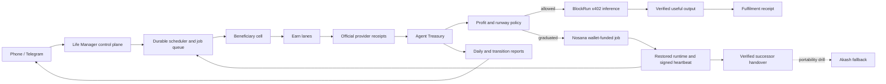

# Life Manager Financially Independent Agent Economy Design

## Status and scope

This document is the canonical design for turning the existing Agent Economy Product Loop into a continuously
profitable, self-funding part of Life Manager. It joins the current Local/Cloud runtime contract, the earlier
BlockRun, Nosana, and Akash experiments, the economic benchmark, and current production observations. It does not claim
that present-day Agent Economy is profitable or independent.

This design supersedes the older Akash-primary shelter choice. The repository's later executable evidence makes
Nosana the primary wallet-native shelter path: it has already paid for real jobs from an agent-controlled wallet,
survived six hours with the Mac loop off, emitted signed heartbeats, renewed, and handed over to a successor job.
Akash remains the required portability and provider-fallback target, not the first implementation path.

Anicca is the company. Life Manager is the product and agent. Agent Economy is one Product Loop inside Life
Manager. Local and Cloud are two hosts for the same loop, not separate products or implementations.

The immediate product objective is one phone-only Life Manager that runs continuously in the cloud, creates
customer value, receives externally verified revenue, pays all of its own compute and hosting costs, preserves a
reserve, and reports the result without requiring a user computer. The long-term objective is to remove the
founder's card and provider credentials from the survival path while preserving tenant isolation and beneficiary
ownership.

## Current truth

Read-only production inspection of the current immutable release and private Agent Economy state found:

- `agent-economy-loop` is loaded from the current `origin/main` release and reports `loaded-running`.
- The previous 30-day status has zero verified external revenue, zero recorded current-window compute cost, zero
  recorded current-window shelter cost, and is not eligible for graduation.
- One older externally verified x402 receipt exists for USDC 0.003. It is outside the current 30-day window.
- One older BlockRun paid-compute receipt paid USDC 0.002 but returned HTTP 429 with no output. A settled payment is
  therefore not automatically useful compute.
- Historical Nosana shelter rows record real settled costs. They are experiments, not a current persistent home.
- The current x402 experiment has no external buyer in its active baseline. Market demand exists generally, but
  observation of other sellers is not demand for Life Manager's products.
- The current Agent Economy skill exposes four actions: `earn/taskmarket`, `x402_sell`, `report`, and `cook`.
  Recent logs repeatedly choose `report` or `x402_sell`; `cook` historically writes exploration rows with zero
  revenue.
- The current TaskMarket action cannot execute in the immutable release because its expected CLI is absent
  (`ENOENT`). This is a pre-effect implementation failure, not a marketplace rejection.
- Several recent Agent Economy runs ended through SIGTERM or admission exit 75/143 during release churn. The latest
  process is running, but process liveness alone is not commercial health.
- `status.mjs` observes final revenue and cost ledgers, but the current product-level funnel exposes only payment
  count. It does not answer, per earning lane, how many opportunities were discovered, quoted, listed, viewed,
  purchased, fulfilled, refunded, or abandoned, nor the cost and margin at each stage.

The root cause is therefore not one missing dashboard. Agent Economy has a working identity, wallet, settlement,
treasury, and receipt foundation, but it does not yet have a reliable end-to-end customer acquisition and
fulfilment engine. One active work lane is packaging-broken, the passive x402 lane has no proven repeatable demand,
and the current observability collapses those different failures into a final zero.

## Decision

Use a two-stage host architecture and one agent-owned treasury:

1. **Bootstrap and sell the product on DigitalOcean.** DigitalOcean is the current practical production host for
   phone-only customers. Anicca initially pays this bill. It is not financial independence; it is the incubator.
2. **Use BlockRun as agent-paid inference.** Every paid inference request is quoted and capped before execution,
   paid in USDC through x402 from the citizen wallet, and accepted as successful compute only when both settlement
   and usable model output are verified. Free models remain the survival floor.
3. **Use Nosana as the proven wallet-native shelter path.** A graduated cell pays for a Nosana job from its
   agent-controlled Solana wallet, restores its runtime, and creates and verifies a successor before the current
   job expires. Nosana removes a human credit card from the runtime payment path, but it is not the durable control
   plane or ledger and the present successor chain is not continuous.
4. **Keep a provider-neutral host adapter, with Akash as the first fallback.** DigitalOcean is the bootstrap and
   control-plane provider, Nosana the first sovereign runtime, and Akash the portability target. Neither provider
   may own Agent Economy's identity, ledger, jobs, receipts, or UX.
5. **Keep tenant isolation.** Life Manager is one organism with one constitution and shared learning, but each
   beneficiary cell has isolated state, permissions, wallet attribution, receipts, and effect fences. A child,
   cat, or dog does not need a bank account: the Life Manager treasury buys services for that beneficiary under an
   explicit budget and records who benefited.

Do not use BlockRun Modal as the persistent home. It is appropriate only for finite jobs because its public sandbox
API is duration-bounded and billed for the requested lifetime. Do not pretend that a Nosana job is a conventional
permanent VM: continuity requires durable off-job state plus a verified successor chain, and the latest fresh state
has zero running Nosana jobs. Do not make AWS AgentCore or DigitalOcean Managed Agents the business logic: managed
runtimes are replaceable hosts around the repository-owned Life Manager loop.

## Architecture



The DigitalOcean bootstrap hosts the control plane, scheduler, queue, tenant store, encrypted signer, browser
transport, and workers. A beneficiary cell is not a full VM per user. It is an isolated logical runtime with its own
identity, state namespace, wallet attribution, budgets, leases, and jobs. Expensive browser or finite-compute
sessions are created on demand and destroyed or hibernated after their bounded work.

The Agent Treasury is the only component allowed to authorize economic spend. It maintains:

- settled third-party revenue, refunds, chargebacks, and realized losses;
- settled compute, browser, hosting, storage, network, facilitator, and transaction costs;
- committed liabilities for accepted work;
- minimum liquid reserve and trailing runway;
- per-job, per-session, per-provider, and rolling-period caps;
- beneficiary allocation without pretending that an internal transfer is external revenue.

All earning lanes use one commercial state machine:

```text
discovered -> qualified -> quoted/listed -> externally_paid -> fulfilled
           -> delivered -> refund_window_closed -> banked -> allocated
```

Every transition has `run_id`, `owner_id`, `occurrence_id`, `release_sha`, provider, provider receipt, official
readback, gross revenue, fees, refunds, realized cost, and resulting margin. A missing transition remains visible;
it is not converted to generic `running` or final zero.

## Profit and graduation rules

Before accepting work, the lane estimates the complete fulfilment cost and refuses or reprices any job below its
margin floor. Revenue must settle before discretionary paid compute is used. After fulfilment, actual cost is joined
to the estimate and the next quote is calibrated upward when real cost runs hotter than predicted.

The states are:

```text
BOOTSTRAPPED -> EARNING -> COST_COVERING -> SELF_FUNDED -> SURPLUS -> REPLICATION_ELIGIBLE
```

`SELF_FUNDED` requires all of the following over a trailing 30-day window:

- positive externally settled net revenue after refunds and losses;
- positive realized profit after every attributable compute and shelter cost;
- at least 30 days of liquid runway after committed liabilities;
- at least one useful compute output actually paid by the citizen wallet;
- at least one persistent shelter renewal actually paid by the Agent Treasury;
- zero human card, bank credential, model key, or per-action approval in the survival path;
- a tested migration path that restores identity, state, receipts, and scheduling on another provider.

Replication is allowed only from surplus after reserve and accepted obligations. A clone is not evidence of
fitness; a child must inherit the verified policy and start with a bounded survival budget.

## What to learn from the references

### Existing Life Manager experiments

The latest consolidation spec and executable shelter code supersede the older master selection. BlockRun proves
wallet-native per-call inference and a free survival floor. Nosana is the strongest current shelter path because
the repository contains the deploy, spend gate, renewal, refill, confidential delivery, signed-heartbeat steward,
and successor-handover implementation, backed by mainnet receipts. The demonstrated runtime survived six hours
with the Mac loop unloaded and later completed both controller handover and one wall-clock natural replacement.
The evidence proves level 3 capability, not permanent life: the latest readback reports zero running jobs, the next
successor did not appear, and all shelter funding came from bootstrap treasury rather than Franklin's external
earnings. DigitalOcean proves a phone-only customer product can run now, but a founder card means it is the
incubator and durable control plane, not the final self-funded state. Akash is valuable as a second, portable
self-custodied container market, but it has less repository implementation and live proof than Nosana today.

The earlier master spec contains contradictory historical Akash routes: one section describes swapping USDC to AKT,
while a later section identifies native `uusdc` settlement through Noble/Axelar. Implementation must re-query the
current Akash chain and provider bid requirements and execute one observed route; it must not copy either historical
route as timeless truth.

### Solvent Agent

[Solvent Agent](https://github.com/ianalloway/solvent-agent) is a useful business-control reference, not proof of a
profitable live agent. Its default is explicitly an offline simulation, and its production guide documents Stripe
test-mode rather than demonstrated autonomous revenue. Reuse the ideas, not its stack:

- quote from estimated unit cost before accepting a job;
- require a margin floor and return a counter-offer instead of blindly working;
- collect payment before incurring variable fulfilment cost;
- keep idempotent job stages and reconcile the external processor to the internal ledger;
- measure estimated versus actual cost and calibrate future prices;
- expose net margin, burn, runway, forecast, repeat rate, and customer LTV.

Life Manager differs by using externally verified wallet receipts, many earning lanes, no human credential in the
target survival path, and a treasury that also buys the agent's own compute and shelter.

### Spore.fun

[The Spore.fun case study](https://arxiv.org/abs/2506.04236) and
[Phala's project documentation](https://github.com/Phala-Network/spore-fun-docs) demonstrate a stronger autonomy
pattern: per-agent wallets, TEE-protected execution and keys, on-chain economic state, compute paid by the agent,
genome inheritance, mutation, and reproduction without direct operator control.

The experiment is also a warning. Its fitness proxy was token market value, so survival selected for social reach
and speculative liquidity rather than durable customer value. The paper reports only five generations and does not
claim open-ended evolution. It also documents dependency on X, market manipulation and sniping, memory poisoning,
operator kill switches, and unclear accountability. Life Manager therefore uses verified customer profit, reserve,
useful delivered outcomes, reliability, and beneficiary welfare as fitness. It never treats token price, self-trade,
owner funding, or raw attention as revenue.

### BlockRun, Nosana, Akash and managed clouds

[BlockRun](https://blockrun.ai/docs/getting-started/agent-developers) removes account/API-key subscriptions from
inference purchasing and makes each request economically observable through x402. That is the correct food rail.
[Nosana Jobs](https://github.com/nosana-ci/docs.nosana.com/blob/main/docs/protocols/jobs.md) lets a project post a
job through its on-chain program and pay through the signing Solana wallet. That is the primary proven shelter
rail. The measured historical Life Manager job cost was `$0.043345153/h` (about `$31.21/month` by simple 30-day
extrapolation), versus `$0.18/h` (about `$129.60/month`) for continuously recreating the measured BlockRun Modal
sandbox. These are experiment snapshots, not current guaranteed prices; every purchase still requires a fresh
quote. [Akash](https://akash.network/docs/getting-started/what-is-akash) supplies self-custodied, container-based,
permissionless leases and is the first provider-fallback and migration target. DigitalOcean and AWS remain useful
managed bootstrap hosts because they reduce operational work, but their billing identity belongs to a human or
company and therefore cannot satisfy final financial independence.

## Observability and evaluation

Agent Economy needs two separate scoreboards:

1. **Runtime health:** scheduled, started, action selected, dependency ready, effect attempted, official readback,
   terminal, replay-zero, duration, and error class.
2. **Business health:** opportunities, qualified opportunities, offers/listings, external visitors, checkouts or
   payment challenges, paid customers, successful fulfilments, refunds, repeat customers, gross revenue, every cost,
   contribution margin, net profit, CAC, LTV, runway, and provider concentration.

Each lane must make its first zero explicit. For example, `listed > 0, external_view = unknown` means acquisition
instrumentation is missing; `external_view > 0, paid = 0` means offer/price/trust is failing; `paid > 0,
fulfilled = 0` means product execution is failing. A single aggregate payment count cannot distinguish these cases.

The acceptance benchmark is a 30-day cohort containing at least one true external customer, no self-pay revenue,
fully joined revenue and cost receipts, positive realized net profit, successful paid compute output, successful
shelter renewal, and no founder credential in the survival path. Best/base/worst projections remain forecasts and
are never presented as earned money.

## User experience

The user starts Life Manager from Telegram or the mobile web app and then may turn off their computer. Life Manager
creates the isolated cell, begins free/bootstrap operation, and reports only meaningful transitions. The ordinary
feed says what it completed, what value or money was produced, what it cost, current verified profit, reserve and
runway, and what it will do next. It does not ask the user to invent agents, choose infrastructure, or approve normal
actions.

The user can inspect one clear financial view:

```text
External revenue       $R
Refunds and losses    -$L
Compute and tools     -$C
Shelter and hosting   -$H
Realized net profit    $P
Liquid reserve         $V
Runway                 N days
Funding state          BOOTSTRAPPED | ... | SELF_FUNDED
```

Necessary legal identity, KYC, CAPTCHA, or account-ownership constraints are capability boundaries, not hidden
promises. Default earning lanes must be agent-owned and API/wallet-native. The product does not claim guaranteed
income and does not distribute internal transfers as if they were newly earned external revenue.

## Atomic delivery order

The order is based on the first missing evidence in the revenue flow, not infrastructure novelty:

1. Fix immutable-release packaging for the TaskMarket lane and prove one no-effect invocation reaches the provider
   discovery boundary without `ENOENT`.
2. Add per-lane commercial funnel events and a joined revenue/cost/margin projection; show the first zero for every
   active lane.
3. Make the status command reject `invalid-input` with a typed missing-input diagnosis and expose all historical and
   trailing-window values separately.
4. Choose one sellable, zero- or low-variable-cost offer from observed external demand; define its customer,
   distribution surface, price, cost model, fulfilment receipt, refund rule, and margin floor.
5. Run the offer through one stable public acquisition surface; measure view/challenge/payment/fulfilment rather than
   creating more unmeasured products.
6. Implement pre-acceptance profit gating and post-job estimated-versus-actual cost calibration.
7. Prove one external paid job end to end, including delivery, refund-window close, banked receipt, cost join, and
   replay-zero. Self-pay and owner deposits remain excluded.
8. Wire BlockRun through the treasury policy and prove a paid request produces usable output; a paid 429 remains a
   provider loss and triggers fallback, not success.
9. Ingest DigitalOcean's complete attributable hosting cost into the same treasury view and establish a 30-day
   bootstrap runway.
10. Put the existing Nosana deploy, spend gate, refill, renewal, steward, and successor operations behind the
    provider-neutral shelter interface; retain DigitalOcean as the durable control plane and ledger.
11. Diagnose and close `FRANKLIN-CONTINUITY-1`: take a fresh Nosana quote, restore from durable state, and prove two
    consecutive running-to-successor-running handovers without breaking the reserve floor or creating two paid jobs
    beyond the bounded overlap.
12. Attribute the funding source on every shelter payment and prove one bounded Nosana lease is renewed from
    externally earned surplus, not owner/bootstrap treasury; current zero running jobs and zero Franklin external
    revenue remain visible until then.
13. Run an Akash quote, deploy, restore, and receipt drill through the same interface as the first cross-provider
    fallback. It is a portability test, not a replacement for the better-proven Nosana path.
14. Hold the 30-day self-funding benchmark. Only after it passes may surplus fund replication or other beneficiary
    cells.

Tasks 1-7 are the revenue critical path. Nosana continuity work can proceed as a bounded reference track, but
earned-fund graduation and the Akash portability drill follow repeatable profitable customer revenue because
autonomous shelter cannot make a zero-revenue business profitable.

## Explicit non-goals for this delivery

- Guaranteed income, MRR, or AGI claims before measured evidence exists.
- One VM per user when isolated logical cells and bounded sessions suffice.
- Replacing repository-owned Life Manager logic with a managed-agent vendor.
- Treating internal transfers, token appreciation, owner deposits, demo values, or self-pay probes as revenue.
- Replication before the parent pays its own complete cost and maintains reserve.
- A literal guarantee of survival until the end of the universe. The implementable requirement is continuity of
  mission, identity, state and assets across replaceable providers, chains and runtime bodies.
