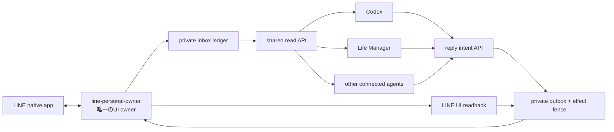

# LINE個人アカウント共有メッセージゲートウェイ設計

## 0. 決定

LINEを最初の個人メッセージ連携とする。LINEの個人アカウントを読めるプロセスは一つの `line-personal-owner` に限定し、Codex、Life Manager、その他の接続済みagentは、同じローカルのprivate inbox/outboxを読む・書く。各agentがLINEの画面を直接操作することは禁止する。

この設計は、LINE公式アカウント用のMessaging APIを個人アカウントの代替には使わない。個人の友だち、1:1トーク、グループトークを扱うため、Macの公式LINEアプリをprovider UIとして使う。公式APIで扱える公式アカウントの会話と、Daisの個人LINEの会話を混同しない。

既存コードのうち再利用する先例は、browser target lease、runtime jobのclaim/complete、outboundのeffect fence、provider receipt/readbackである。個人LINEのinbox/outbox adapterとsingle-ownerはリポジトリ内に先例がない（no precedent）。新しい実装はこの4つの境界だけを借り、既存のイベントproviderやTelegram bot ownerを流用しない。

## 1. 成果条件

LINEデスクトップを認証済みにした後、次を満たす。

1. LINEアプリが見えるすべてのトーク（1:1、グループ）の会話一覧、参加者識別子、メッセージをprivate stateへ同期できる。
2. CodexとLife Managerが同じ受信メッセージ、会話履歴、返信状態を同じread APIで読める。片方だけが保持する会話コピーは作らない。
3. どのagentが返信案を作っても、LINEへの実送信者は一つだけである。異なるagentが同じ返信を要求しても、providerへの効果は最大1回になる。
4. 送信後にLINE画面上の同一会話・同一本文のbubbleを確認できた場合だけ `sent` とする。確認できない場合は `effect_unknown` として保持し、再送しない。
5. 現在のセットアップでは誰にも送信しない。接続、履歴同期、dedupe、readbackが確認され、返信ownerを有効化した後だけ通常会話の返信を開始する。

## 2. 外部境界

### 2.1 LINEアプリ

- Macの公式App Store版LINEを使用する。
- App Storeのログイン/Getと、LINEのQRログイン・初回認証コード確認はproviderが要求する本人操作である。コードを推測せず、パスワード再設定を自動実行しない。
- LINEアプリのログイン済み状態はアプリ自身のセッションとして維持し、credentials、QR内容、認証コード、session dataをrepo・ログ・Telegram・agent間メッセージへ複製しない。
- UIの読み書きは、専用のLINE UI adapterからだけ行う。Daisの通常Chrome（`interactive:dais`）や既存の他platform browser identityを使わない。

### 2.2 Accessibility / UI権限

LINE native UIから会話と送信結果を取得できない環境では、adapterは `human_required: accessibility_permission` で停止する。権限を迂回するために別の画面、キーロガー、Apple Passwords、Keychain、非公式の認証回収を使わない。

UI adapterは次のprovider readbackを必須にする。

- 会話一覧: provider conversation id、表示名、未読表示、最終message id/時刻
- 会話履歴: provider message id、送信者、本文、時刻、方向
- 送信確認: 対象conversation id、送信本文のhash、UI上の新しいbubble、provider timestamp

画面からprovider idを取得できない場合は、表示名と時刻だけをidentityにして送信してはならない。観測だけを `unavailable: provider_identity_missing` として保存する。

## 3. アーキテクチャ



### 3.1 single owner

`line-personal-owner`は、LINE UIへの接続、同期cursor、送信leaseを持つ唯一のownerである。owner leaseは次を含む。

- `owner_id`, `run_id`, `occurrence_id`, `release_sha`
- UI sessionのtarget/app identity
- heartbeat、lease expiry、最後のcursor
- `phase`（`inventory`、`read`、`send`、`readback`）
- `error_class`, `retryable`, `next_action`

ownerが停止しても別agentが勝手に画面を引き取らない。lease expiry後に同じowner contractで再取得し、未確定送信があれば最初にreadback-only reconcileを実行する。

### 3.2 private state

実行時データはrepo外の `LM_DATA_DIR/private/personal-messaging/line/` に置く。ディレクトリは0700、ファイルは0600、atomic writeとexclusive lockを使う。raw本文と連絡先識別子はprivate ledgerだけに保存し、通常ログ・Git・Telegram報告には出さない。

最小ファイルは次のとおり。

- `conversations.jsonl`: conversation identityと一覧cursor
- `messages.jsonl`: inbound/outboundのimmutable observation
- `outbox.jsonl`: reply intent、claim、send、readback、reconcileのstate transition
- `owner.json`: 現在のowner leaseとhealth
- `cursor.json`: provider inventory/history cursor

JSONLを読む側はsequenceとhash chainを検証し、途中欠落・重複・別tenant/providerの行をfail closedにする。書く側はlock取得、append、fsync、lock解放を一つのbounded operationとして扱う。将来の件数がこの方式の上限を越えた場合だけ、同じschemaを保ったprivate SQLite adapterへ置換する。

### 3.3 canonical identity

conversationとmessageのidentityは表示名ではなくprovider idを使う。

```text
conversation_key = line:<provider_account_id>:<provider_conversation_id>
message_key      = line:<provider_account_id>:<provider_conversation_id>:<provider_message_id>
reply_key        = line:<provider_account_id>:<provider_conversation_id>:<in_reply_to>:<body_sha256>
```

provider idが読めない観測はinboxへ入れてもよいが、`replyable=false` とし、送信intentをclaimできない。

## 4. inbox契約

各message observationは少なくとも次を持つ。

```json
{
  "schema": "personal-message-observation.v1",
  "platform": "line",
  "conversation_key": "line:<account>:<conversation>",
  "message_key": "line:<account>:<conversation>:<message>",
  "direction": "inbound|outbound",
  "provider_message_id": "opaque-provider-id",
  "sender_provider_id": "opaque-provider-id",
  "body": "private message body",
  "observed_at": "RFC3339",
  "provider_at": "RFC3339|null",
  "source_run_id": "run-id",
  "replyable": true
}
```

同じmessageを再観測してもsequenceを増やさず、`message_key`でdedupeする。履歴の初回importは古い順、incremental syncはcursor以降に限定し、cursorが失われたときは送信せずread-only再照合を行う。

agentのread APIは、本文を返すprivate local callだけとする。Telegram通知・一般ログ・runtime healthには件数、hash、状態だけを出す。

## 5. outboxと返信

返信を作るagentはLINEを直接操作せず、次のintentをoutboxへ追加する。

```json
{
  "schema": "personal-message-reply-intent.v1",
  "reply_key": "line:<account>:<conversation>:<in-reply-to>:<body-sha256>",
  "conversation_key": "line:<account>:<conversation>",
  "in_reply_to": "message-key",
  "body": "reply body",
  "requested_by": "codex|life-manager|agent-id",
  "policy_class": "ordinary|sensitive|auth|money|legal|unknown",
  "status": "queued"
}
```

通常会話の `ordinary` は自動返信対象にできる。認証コード、パスワード、送金・決済、契約、法律、本人確認、送信先不明、感情的な高リスク判断は `held` とし、本文を送信しない。仕様上はユーザーの「返信を任せる」という依頼に合わせて通常会話を自動化するが、providerの安全境界を越える意図は自動承認しない。

outboxの状態遷移は次のとおり。

```text
queued
  -> claimed
  -> sending
  -> sent (LINE bubble readbackあり)
  -> effect_unknown (send後readbackなし)
  -> held (policy/auth/provider boundary)
```

`reply_key`が既に `sent` ならno-op、`effect_unknown`なら再送せずreconcile待ち、`queued`だけをclaimする。claimしたworkerが失効した場合も、同じreply_keyを別workerが即再送せず、まずreadback-onlyで確認する。

## 6. agent間の共有

- Codex、Life Manager、その他agentは同じinbox read APIを使う。
- 返信案はoutbox intentに保存し、誰が作ったかを`requested_by`に残す。
- 競合した返信案は、conversationの同じ`in_reply_to`に対するpolicy/rankingで一つだけ選び、残りは`superseded`として保存する。画面を二重操作しない。
- Life Managerが停止してもCodexが読める。Codexが停止してもLife Managerが読める。ただしUI ownerが一つであることは変えない。
- 会話本文、連絡先、認証情報をagent間のTelegramへ中継しない。必要なら同じローカルread APIを呼ぶ。

## 7. 可観測性と失敗境界

各run/phaseに、既存Life Managerのevent contractに合わせて次を記録する。

`run_id`, `owner_id`, `occurrence_id`, `release_sha`, loaded argv/envの安全なprojection, `phase`, command, exit code, `effect`, `readback`, `provider_receipt_id`, `evidence_refs`, `error_class`, `retryable`, `next_action`。

本文・連絡先・token・QR・passwordはこのeventへ入れない。`effect_unknown`は調査カーソルであり、成功でも再送許可でもない。公式LINE UIの対象conversationと新しいbubbleをreadbackできるまで、outboxは保持する。

必須failure class:

- `line_app_missing`: App Store導入前。effect 0。
- `line_auth_required`: QR/本人端末確認待ち。effect 0。
- `accessibility_permission`: UI読取・操作権限不足。effect 0。
- `provider_identity_missing`: idが取れずreplyableでない。effect 0。
- `owner_lease_busy`: 別ownerが稼働中。UI takeoverしない。
- `provider_read_failed`: inbound cursorを進めない。
- `provider_send_unknown`: send後readbackなし。再送しない。
- `policy_held`: 外部効果なし。承認境界を越えない。

## 8. rolloutと受け入れ

### Phase 0: 接続

- App Store公式LINEが `/Applications/LINE.app` に存在する。
- LINEアプリが起動し、QRログインまたは既存sessionの認証が完了する。
- ownerがaccount identityとUI read capabilityをread-onlyで確認する。
- このphaseでは送信件数0。

### Phase 1: 観測

- 会話一覧と履歴をprivate inboxへimportする。
- 同じ会話をownerが2回読んでもmessage countが増えない。
- CodexとLife Managerのread APIが同じ最新message key/hashを返す。
- UI権限が欠ける場合は型付き停止になり、勝手に別ブラウザへ切り替えない。

### Phase 2: 返信経路

- fake UI adapterでqueued→claimed→sent/readback、replay-zero、effect_unknown保持をテストする。
- real LINEでは最初の返信を外部へ出す前に、送信対象conversation、本文、policy classをownerが読み上げ可能な確認レコードにする。
- 実送信後はLINE画面でexact bubbleを読み戻し、provider receipt/readbackを保存する。

### Phase 3: 常時運用

- ownerをLife Managerの既存runtime/lease/reconcile契約へ登録する。
- 自然wakeでread、reply、readback、次wakeのreplay-zeroを確認する。
- Codexを含む複数agentが同時にintentを作ってもprovider送信は一つであることを確認する。
- owner停止・UI消失・LINE再ログイン要求では、inbox cursorとoutbox fenceを保持したまま再開する。

## 9. 範囲外

- Telegram個人アカウントの再ログイン、Instagram `anicca.monk` のパスワード再設定・凍結解除はこのLINE sliceに含めない。
- Telegram bot APIを個人会話の読み取り経路にすること、Instagramの非公式APIを使うことはしない。
- LINE公式アカウントMessaging APIへ個人LINEの全連絡先・履歴を移すことはしない。
- アプリ認証を自動化するためのpassword reset、QR/codeの推測、Apple credential storeの抽出はしない。

## 10. 実装順

1. LINEアプリの公式導入とログイン済み状態をread-onlyで確認する。
2. private inbox/outbox schema、exclusive lock、dedupe、owner leaseのunit testを追加する。
3. LINE UI adapterを観測専用で実装し、会話一覧・履歴・cursor readbackを通す。
4. fake providerでoutbox effect fenceとreconcileを実装する。
5. 実LINEの送信は明示的なlive enable gateの後に一件ずつ行い、exact bubble readbackとreplay-zeroを確認する。
6. Life Manager registryへsingle ownerを接続し、Codex/Life Manager/その他agentを同じread/write APIへ接続する。

この文書の設計承認後に、実装planとテストケースを作成する。承認前にproduction ownerを起動したり、LINEへメッセージを送ったりしない。
