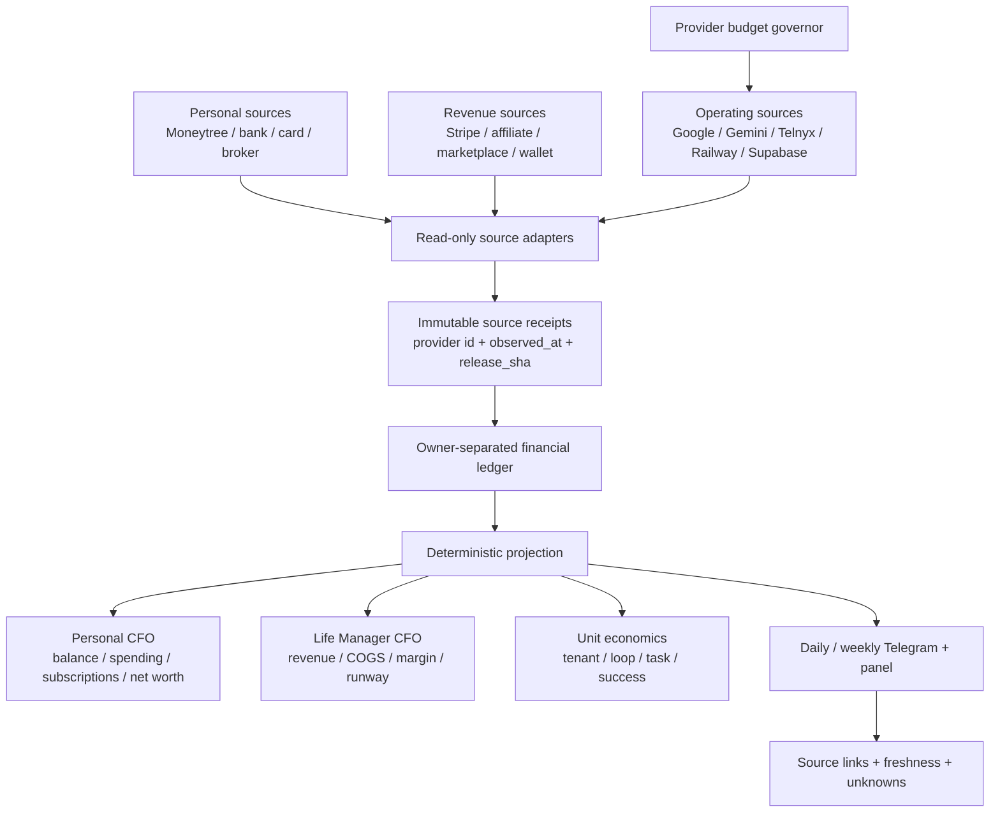

# Life Manager CFO and Provider Cost Observability Design

Status: current design reference; implementation state, cursor, and ordered TODOs are maintained only in [the unified SSOT](2026-09-25-life-manager-unified-ssot.md)
Owner: `lm-cfo-observability-1002`
Scope: Dais personal CFO, Life Manager business CFO, provider cost control, and daily source-backed reporting

## 1. Outcome

Life Manager gives Dais one daily CFO report containing:

1. personal cash and asset balances, including MUFG;
2. settled revenue from every connected revenue rail;
3. settled expenses from every connected bank/card/subscription rail;
4. Life Manager's own provider and cloud cost by tenant, loop, task, and provider;
5. actual, estimate, stale, and unknown states kept separate;
6. a source receipt for every displayed number.

The report is not complete when a local calculation succeeds. It is complete only after the source provider was read and the resulting receipt is durable.

## 2. Current evidence and gaps

### Evidence

- The official September 2026 Google Cloud Cost Table CSV reports ¥27,889 including tax: ¥25,354 invoice-rounded usage subtotal plus ¥2,535 tax. Its unrounded usage total is ¥25,354.451251 with a -¥0.451251 rounding adjustment. This is billed invoice evidence, not proof that payment settled. Source: [Google Cloud Cost Table](https://docs.cloud.google.com/billing/docs/how-to/cost-table).
- The CSV's rounded service-cost rows are Places API ¥9,420, Geocoding API ¥7,493, Gemini API ¥5,159, Directions API ¥3,271, and Cloud KMS ¥10. These displayed rows total ¥25,353 because row rounding differs by ¥1 from the invoice subtotal; do not present their sum as the invoice amount. A displayed ¥0 row is not proof of zero unrounded cost.
- A read-only `serviceruntime.googleapis.com/api/request_count` query for `2026-09-01T00:00:00Z`–`2026-10-01T00:00:00Z` returned Geocoding 20,258 (13,298 response 200; 6,960 response 404), Directions 14,230 (all response 404), Places Text Search 5,800 (4,308 response 200; 1,491 response 404; 1 response 500), and Places Details 72 (response 200). The query paged through 23 pages and 19,722 points; normalized series/interval deduplication found no duplicates.
- Compared with the invoice-month CSV quantities, these counts differ by +855 Geocoding (CSV 19,403), +125 Directions (CSV 14,105), +128 Places Text Search (CSV 5,672), and -3 Places Details (CSV 75). This remains a diagnostic comparison, not a same-period billing reconciliation: Google documents that invoice-month usage can differ from calendar-month usage because late-reported costs can move between invoices, and the CSV's usage dates have day-level rather than timestamp precision. Request counts also do not prove billable units or loop attribution; a `404` response is not treated as proof of zero charge. Sources: [Cloud Monitoring time-series API](https://cloud.google.com/monitoring/api/ref_v3/rest/v3/projects.timeSeries/list), [Google Cloud invoice-month cost details](https://docs.cloud.google.com/billing/docs/how-to/cost-table#invoice-month).
- A read-only BigQuery CLI inventory saw four accessible projects and zero datasets. No time-granular Cloud Billing export is available in that visible scope; this does not prove that export is disabled in an inaccessible project or billing account. No export or dataset was created.
- A fresh Moneytree plugin read returns one MUFG JPY account with a displayed balance of ¥504,302, but exposes no upstream sync timestamp. Its default three-month transaction window (2026-07-07–2026-10-07) returns 166 rows, with the latest transaction on 2026-08-25. Labeled income categories (`給料`, `収入`, `利子所得`) total ¥806,201. `未定` outflows total ¥200,000 and remain unclassified; `交際費` is labeled ¥2,500. `振替`, `カード返済`, and `ATM引き出し` together have net outflow ¥405,962 and are kept separate from consumption to avoid double-counting transfers or card settlements. No separate card account is in the returned account set. Treat the balance freshness as unknown, the ¥200,000 as unknown-classification, and the missing post-2026-08-25 transactions as a coverage gap—not zero spending.
- A direct Moneytree query for `2026-09-01`–`2026-09-30` returned 0 rows for the one connected MUFG ordinary-savings account. This is an empty source window, not proof of zero personal spending: no card account is connected, and other accounts/subscriptions are not covered by this query.
- The latest saved CFO report is `sent` for period `2026-10-07:11` at `2026-10-07T11:58:31Z`. Its report pointers match the referenced B7 snapshot hashes; the snapshot reports zero duplicate receipts. `sourceProvenance.status=verified` verifies provenance, not complete company financial coverage.
- That same snapshot includes Moneytree as `partial`: one MUFG balance observation of ¥504,302 at `2026-10-07T11:58:41Z`, but `provider_sync_at=null` and `freshness_status=unknown`. Four quarterly transaction windows return 983 rows total and have 13 range mismatches; the current-day window is `unknown`. The latest transaction date is `2026-08-24`; September 2026 `income_jpy`, `expense_jpy`, and `cash_movement_jpy` are null. The earlier direct-plugin read ends one day later (`2026-08-25`).
- The source cause for the one-day date shift is confirmed: Moneytree provides a Japan calendar date with a `+09:00` offset, but the adapter/collector path treated it as an instant and converted it to UTC before extracting `YYYY-MM-DD`. PR #6910 merged to main as `d950731b`; it preserves the provider calendar date and bumps the 24-hour projection-cache envelope to v3 so an old UTC-shifted v2 snapshot is not reused. Focused tests reproduce a report-window-start exclusion and a month-start expense shift. Candidate release `20261007T213624-d950731b` was cut without activating `current`; the CFO label remains loaded at SHA `80ea586c`, so the fix is not yet live. The current `lm-loop doctor` readback still fails on unrelated retired label `ai.anicca.provision-browser.capafy.kosuke`; no target apply/restart was performed. The current 13 production range mismatches and date cursor remain unverified until a post-release natural report readback.
- In that report, company historical/trailing/MRR status is `unknown`, with 173/168/26 coverage gaps across 18 loops. Historical and trailing company revenue, cost, and net are null; company MRR currencies are empty. The only verified per-loop MRR is `mobile-apps` at USD 20.34; this is subscription MRR, not settled revenue or profit. The historical window has no start date, so this snapshot does not establish last-month company revenue.
- An independent read-only reaggregation confirms the 173/168/26 gap counts from all 18 per-loop rows and matches the company-level aggregates. Historical gaps: 162 `missing_category` (all 9 required counted categories across 18 loops), 5 stale readbacks, 3 unverified receipts, and one each for unconnected source, missing coverage, and read failure. Trailing gaps: 158 `missing_category` (four categories have 17 loop gaps each; the other five have 18), 5 stale readbacks, 2 unverified receipts, and one each for unconnected source, missing coverage, and read failure. MRR gaps: 19 `missing_category` (17 explicitly identify category `mrr`; 2 omit the category field), 2 stale readbacks, 2 unverified receipts, and one each for unconnected source, missing coverage, and read failure. These are missing or unverified coverage, not zero revenue or zero cost.

### Code gaps

- A local CFO report store now contains a `status=sent` snapshot for period `2026-10-07:11`, after earlier wakes at `11:12Z` and `11:31Z` were deferred before provider work (`resource_capacity_busy`, then `disk_headroom_low`; both exit 75). The B7 snapshot hash pointers match and duplicate receipts are 0, but the corresponding loop event has `provider_receipt_id=null` and `official_readback_ref=null`; external delivery is not independently confirmed. The embedded MUFG balance is not accepted as fresh because its upstream sync time is absent; personal transaction coverage is partial, and all company-level revenue/cost/net totals remain unknown. The earlier host disk guard observation is historical, not evidence of the current host state.
- Focused local fixture suites for `cfo-hourly-local`, `cfo-result-local`, and `cfo-result-summary` pass 69/69 after the Moneytree calendar-date and cache-v3 regressions were added. They cover 12-month request windows, deduplication, unknown freshness, transfer separation, recurring-charge candidates, suppression of stale/unverified reports, local-date preservation, and old-cache invalidation. This source/fixture proof is not production readback.
- The report still lacks a verified join from the official Google invoice's project/SKU/service rows to the specific provider operations, Life Manager loops, and report receipt. Monitoring counts alone cannot fill that join.
- A persistent geocode cache is wired into the production source, but the post-restart natural route/cache-hit/replay-zero acceptance is unverified. Free-provider fallback is a separate route optimization; it does not prove end-to-end cost reduction until its code is integrated and its natural UX/readback is observed.
- Cost visibility and spend policy must keep actual invoice charges, estimates, and unknown attribution separate. A Google invoice total is not yet a measured per-loop cost or a daily CFO report receipt.

## 3. Accounting ownership

Every financial row has exactly one `owner`:

| owner | Meaning | Examples |
|---|---|---|
| `dais_personal` | Dais's personal financial position | MUFG, personal card, securities, cash |
| `life_manager` | Life Manager business economics | Stripe revenue, Google API, Telnyx, Railway, Supabase |
| `transfer` | Movement between owned accounts | MUFG → card payment, wallet → bank |
| `unknown` | Source or classification is unavailable | stale account, failed provider read, unmatched charge |

Internal transfers, owner deposits, fundraising, and unrealized gains are never revenue. Unknown is never zero.

## 4. System architecture

The deterministic projection owns arithmetic. Agents may classify or explain, but they cannot invent balances, settle estimates, or replace a missing receipt with zero.

## 5. Observability contract

Every provider operation emits one structured observation. Cost observations are never sampled.

### Identity

`run_id`, `owner_id`, `tenant_id`, `occurrence_id`, `release_sha`, `phase`, `request_id`, `idempotency_key`.

### Operation

`provider`, `product`, `sku`, `operation`, allowlisted command name, cache hit/miss, and latency.

Raw prompt, bank number, API key, password, cookie, address, and secret values are excluded. Allowlisted environment names may be recorded with a hash only.

### Financial measurement

`quantity`, `unit`, `currency`, `estimated_amount`, `actual_amount`, `billing_status`, `pricing_version`, and `cost_owner`.

`billing_status` is one of:

- `estimated`
- `settled`
- `unknown`
- `not_applicable`

### Effect and failure

`effect`, `readback`, `provider_receipt_id`, `evidence_refs`, `exit_code`, `error_class`, `retryable`, and `next_action`.

`effect_unknown` is a hard safety state. It blocks duplicate external actions until official readback resolves it.

### Freshness

Each source row has `observed_at`, `source_updated_at`, `freshness_status`, and `stale_after`. A stale value can be shown as last-known, but never as current.

## 6. Daily CFO report contract

The daily report is a deterministic snapshot with these sections:

### Cash

- account and institution;
- current balance, original currency, and JPY projection only when FX provenance exists;
- `fresh`, `stale`, `failed`, or `unknown`;
- last successful provider observation;
- source receipt link.

### Revenue

- today, month-to-date, and trailing 12-month settled revenue;
- source-by-source rows;
- refunds and processor fees separately;
- pending, estimated, or unattributed amounts excluded from settled revenue and shown as unknown/pending.

### Expenses

- today, month-to-date, and trailing 12-month settled expenses;
- merchant/category/subscription;
- personal versus Life Manager owner;
- actual provider charges separate from estimates;
- stale or unavailable bank/card sources explicitly listed.

### Life Manager unit economics

- revenue, actual cost, estimated cost, unknown cost;
- net contribution and margin;
- cost per active tenant, loop, task, and successful outcome;
- cache hit rate and paid-fallback count;
- budget state and next action.

### Report stop rules

The report is `partial` when any required source is stale, failed, or unknown. It is `complete` only when the configured source set has fresh readback or a documented source-unavailable receipt.

## 7. Cost targets

These are design targets, not current achievements:

| scope | target |
|---|---:|
| Local routine API spend | $0–$5/month |
| Local paid fallback | Explicit daily budget only |
| Cloud fixed infrastructure | ≤$50/month initially |
| Cloud variable infrastructure | ≤$0.50/active user-month |
| Direct COGS at $10k MRR | ≤$500/month (5%) |
| Routine Japan POI/transit calls | $0 marginal provider cost |

Telephony, paid model calls, and user-requested external actions remain separately budgeted and are never hidden inside a generic “cloud” number.

## 8. Provider strategy

1. Persist geocodes and route results before changing providers.
2. Use OpenPOI as the Japan facility-search primary; preserve licenses and attributions.
3. Use a Japan address geocoder only for address-to-coordinate work; validate its coordinate precision before accepting it for departure safety.
4. Keep the existing Japan transit provider primary with cache, bounded timeout, fallback, and a visible unofficial-data warning.
5. Evaluate OSRM/Valhalla self-hosting for driving routes and OpenTripPlanner self-hosting for scheduled transit only after the current route cache and budget gates are measured.
6. Keep Google as an explicit, budget-authorized fallback rather than the scheduler default.

**A4.2 scope and user experience:** this is a behind-the-scenes geocoding fallback for eligible Japanese address/facility lookups, not a new CFO screen, user setting, or replacement for every Google API. The person keeps using the existing route flow: enter a destination, then see the same route result. For a Japanese address, the free Japan address geocoder is tried; for a named facility, OpenPOI is tried. A result is used only when it is uniquely matched, valid at the required precision, and attributable. If it is ambiguous, invalid, or unavailable, the existing flow makes one Google Geocoding fallback request; providers are not raced in parallel. The operation records which provider/result was used, why fallback occurred, and its cost attribution. A valid free result can avoid a Google Geocoding request, but A4.2 does not replace Google Places, Directions/Routes, or Gemini, and the September bill shows Places—not Geocoding—as the largest individual service. Therefore A4.2 can reduce only its eligible Geocoding share; the remaining Google services need their own usage attribution and optimization.

## 9. Delivery scope by design phase

This section defines phase scope and acceptance intent, not the live TODO order or completion status. The unified SSOT is the sole source for the active cursor and remaining work.

### A0 — Spec and ownership

- approve this design;
- review existing Cost Guard and Finance specs for overlap;
- write the implementation plan only after this spec is accepted;
- record file ownership and excluded files in the plan.

### A1 — Observation envelope (operational; hardening remains)

The production observation path is active; the 2026-10-06 read-only evidence shows no A1-caused outage or confirmed row mutation. A1 is not a current production issue and does not block A2–A10. The advertised REST `PATCH`/`DELETE` methods do not prove that rows were changed; the inspected application path writes with `POST` and reads with `GET`, while production ACL/trigger state remains unverified. Keep that missing readback, the canonical wake/voice/provider-cost join, and crash/stale/`effect_unknown` lifecycle evidence as non-blocking audit hardening in the unified SSOT. Missing `loop_id` and actual billing attribution are cost-coverage gaps owned by A2/A6/A8, not evidence that A1 observation is down. Do not backfill historical rows by inference.

The A1 acceptance contract is schema validation, append-only storage, secret/PII redaction, and evidence for success, timeout, provider failure, crash, stale, and `effect_unknown` outcomes. The remaining production verification status is in the unified SSOT; these acceptance items are not the active cursor.

### A2 — Cost ledger

- extend provider cost rows with provider, SKU, operation, quantity, estimate, actual, billing status, and pricing version;
- keep the existing `lm_api_cost` table: `quantity` and `est_usd` remain nullable columns; provider, SKU, operation, actual amount, billing status, pricing version, and currency go in existing `meta` JSONB. Do not add a table or migration for A2;
- reject missing actual billing as zero;
- make failed ledger writes visible to the owner.

### A3 — Geocode and route reuse

- persist successful geocodes;
- persist route results with tenant/event/time/mode/provider identity;
- prove repeated scheduler ticks create zero duplicate paid calls;
- preserve cache reads in degraded/stopped budget states.

Implementation boundary for A3:

- Keep the existing `lm_route_cache` route-result store and its tenant/provider/mode/timezone/event scope. Do not create a second route cache or change Transit-first → one sequential Google fallback.
- Add a private `lm_geocode_cache` store for successful coordinates. Key by tenant, geocoder provider, and a keyed digest of the NFKC/trim/whitespace-normalized address; persist only `lat`, `lon`, `computed_at`, and TTL, never the raw address, event title, provider response, or API credential.
- Preserve the current 24-hour successful-geocode TTL and process-local transient/negative memo. Persist only provider-success coordinates that are finite and within latitude/longitude bounds; cache-store read/write failure is a miss/fallback and must not change the user's result flow.
- Deduplicate concurrent same-process geocodes by scoped key. Do not claim distributed exactly-once for simultaneous cold misses across independent processes; the scheduled single-owner path and later natural repeated ticks are the acceptance target.
- Retain the current hashed event/anchor/endpoint/purpose dimensions and add timezone, arrival/departure direction, and a routing-policy version to route `event_version`, so the early persistent event lookup cannot bypass the coordinate cache's scope. Keep the route cache's existing provider and mode identity.
- Add the 64-hex opaque `event_version` to route/geocode usage metadata for correlation; never persist the raw Calendar event ID, address, or full route cache key in cost rows or logs.
- Verify a durable success survives a fresh cache/store instance and produces zero additional Google calls for an equivalent normalized address within TTL; verify tenant/provider isolation, TTL expiry, valid-coordinate checks, secret/PII exclusion, route-cache hit before reservation, and unchanged route/fallback UX.
- A3 source acceptance is focused tests plus main deployment and natural readback showing stable same-tenant/same-`event_version` repeated ticks add zero paid provider rows after the first computation. Settled Google invoice reconciliation remains A6; the seven-day cross-loop finance close remains A10.

### A4 — Free-provider lane

- add OpenPOI adapter and attribution persistence;
- add Japan address-geocoder adapter and precision tests;
- make Japan transit-first and Google fallback sequential;
- add provider health and fallback counters.

### A5 — Budget governor

- implement pure daily/monthly budget states;
- gate nonessential provider work;
- preserve essential cached reads;
- emit budget transition observations and Telegram warnings.

### A6 — Official Google billing reconciliation

- collect intramonth Monitoring usage estimates;
- import Cost table CSV settlement rows;
- join SKU/project/service rows to provider cost events;
- show estimate-versus-settled variance.

### A7 — Personal CFO rail

- restore Moneytree MUFG authorization;
- read accounts, transactions, and refresh timestamps read-only;
- normalize JPY/original currency/FX provenance;
- reject stale balances as current;
- read back the same balance and transaction cursor independently.

### A8 — Revenue and expense coverage

- connect every settled revenue rail;
- connect every personal bank/card rail;
- detect subscriptions and merchant categories;
- reconcile internal transfers;
- compute 1/3/12-month totals.

### A9 — Report surfaces

- build the deterministic daily/weekly snapshot;
- send Telegram report with freshness and receipts;
- render the same snapshot in the panel;
- test that Telegram and panel totals are identical.

### A10 — Natural-run acceptance

- run one local daily close;
- run one cloud canary;
- observe seven consecutive days;
- verify official Moneytree, Google billing, revenue, and expense readbacks;
- close only when all required numbers are either fresh and sourced or explicitly partial with an owner-visible blocker.

## 10. Status ownership

This document defines the target design and A0–A10 acceptance criteria. The current implementation state, evidence, blockers, and active cursor are maintained only in `docs/superpowers/specs/2026-09-25-life-manager-unified-ssot.md` (CFO section). A source merge alone does not satisfy production acceptance; use the unified SSOT for the current gate.
