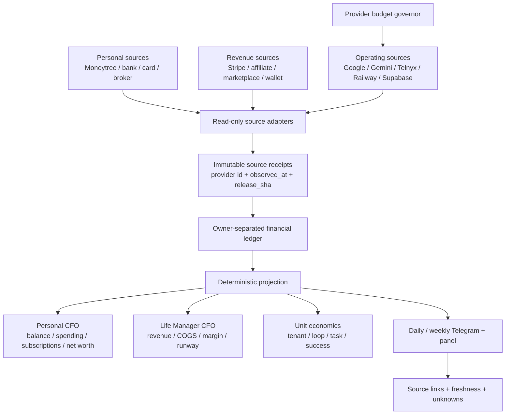
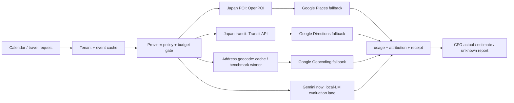

# Life Manager CFO and Provider Cost Observability Design

Status: approved design; Task 8B candidate source/tests are complete, and the current execution cursor is unified SSOT §87-J item 4
Owner: `lm-cfo-observability-1002`
Scope: Dais personal CFO, Life Manager business CFO, provider cost control, and daily source-backed reporting

Current operational evidence and source freshness → [unified SSOT §87](2026-09-25-life-manager-unified-ssot.md). This document's evidence section is a dated design baseline, not a live readback.

## 1. Outcome

Life Manager gives Dais one daily CFO report containing:

1. personal cash and asset balances, including MUFG;
2. settled revenue from every connected revenue rail;
3. settled expenses from every connected bank/card/subscription rail;
4. Life Manager's own provider and cloud cost by tenant, loop, task, and provider;
5. actual, estimate, stale, and unknown states kept separate;
6. a source receipt for every displayed number.

The report is not complete when a local calculation succeeds. It is complete only after the source provider was read and the resulting receipt is durable.

## 2. Design-baseline evidence and gaps

The observations below describe the design baseline. Use unified SSOT §87 for current Moneytree, revenue, cost, and production status.

### Evidence

- The September 2026 Google Cloud invoice was ¥27,889 including tax (¥25,354 before tax).
- Read-only Cloud Monitoring counts for the linked projects were 25,526 Geocoding calls, 15,092 Directions calls, 6,510 Places Text Search calls, and 21,796 Gemini GenerateContent calls.
- Token and current public pricing produced a pre-tax estimate close to ¥25,354. This is a diagnostic estimate, not the settled SKU receipt; the Google Cloud Cost table CSV remains the settlement authority.
- The already-connected ChatGPT Moneytree plugin returns one MUFG ordinary JPY account, but the newest available transaction is dated 2026-08-25 and no provider freshness timestamp or completeness cursor is exposed. The balance is last-known/stale; the exact personal balance is intentionally omitted from this tracked design.
- The September Google invoice is JPY 27,889 tax-included. October 1–4 tenant usage through 20:01 JST shows a Google-labeled estimate of USD 5.02665475; a straight-line month projection is about USD 40.64, not an invoice or forecast. Provider-unattributed usage and missing loop/actual-status metadata remain (unified SSOT §87-Y).
- Fresh B7 projection still reports 14/14 loops as `unknown` with historical/trailing coverage gaps; no company-wide settled net total or runway is established (unified SSOT §87-V).
- Moneytree Web readback showed one MUFG ordinary JPY account with a last-known balance. Its last successful aggregation was 2026-08-26 and its connection state is `auth.creds.invalid` since 2026-08-28. The balance is stale and must not be reported as today's fresh balance.

### Code gaps

- The local CFO-result path and five-minute cloud Financial Report path still do not form one canonical daily report; the former has a delivered local result, while the latter is capacity-deferred and lacks the stable period identity needed to prevent duplicate enqueue.
- Usage telemetry contains estimated amounts without complete `loop_id` and `actual_status` attribution. The September invoice is settled, but October Cost Table reconciliation and current per-loop actual COGS are not complete.
- The candidate free-provider lane/cache and budget changes are not production proof. Google fallback volume, UX quality, and cost reduction still require natural-run observation.
- Personal Moneytree freshness, business-source settlement, and provider cost coverage remain separate CFO gaps; `unknown` is never zero.

## 3. Accounting ownership

Every financial row has exactly one `owner`:

| owner | Meaning | Examples |
|---|---|---|
| `dais_personal` | Dais's personal financial position | MUFG, personal card, securities, cash |
| `life_manager` | Life Manager business economics | Stripe revenue, Google API, Telnyx, Railway, Supabase |
| `transfer` | Movement between owned accounts | MUFG → card payment, wallet → bank |
| `unknown` | Source or classification is unavailable | stale account, failed provider read, unmatched charge |

Internal transfers, owner deposits, fundraising, and unrealized gains are never revenue. Unknown is never zero.

## 4. System architecture

The deterministic projection owns arithmetic. Agents may classify or explain, but they cannot invent balances, settle estimates, or replace a missing receipt with zero.

## 5. Observability contract

Every provider operation emits one structured observation. Cost observations are never sampled.

### Identity

`run_id`, `owner_id`, `tenant_id`, `occurrence_id`, `release_sha`, `phase`, `request_id`, `idempotency_key`.

### Operation

`provider`, `product`, `sku`, `operation`, allowlisted command name, cache hit/miss, and latency.

Raw prompt, bank number, API key, password, cookie, address, and secret values are excluded. Allowlisted environment names may be recorded with a hash only.

### Financial measurement

`quantity`, `unit`, `currency`, `estimated_amount`, `actual_amount`, `billing_status`, `pricing_version`, and `cost_owner`.

`billing_status` is one of:

- `estimated`
- `settled`
- `unknown`
- `not_applicable`

### Effect and failure

`effect`, `readback`, `provider_receipt_id`, `evidence_refs`, `exit_code`, `error_class`, `retryable`, and `next_action`.

`effect_unknown` is a hard safety state. It blocks duplicate external actions until official readback resolves it.

### Freshness

Each source row has `observed_at`, `source_updated_at`, `freshness_status`, and `stale_after`. A stale value can be shown as last-known, but never as current.

## 6. Daily CFO report contract

The daily report is a deterministic snapshot with these sections:

### Cash

- account and institution;
- current balance, original currency, and JPY projection only when FX provenance exists;
- `fresh`, `stale`, `failed`, or `unknown`;
- last successful provider observation;
- source receipt link.

### Revenue

- today, month-to-date, and trailing 12-month settled revenue;
- source-by-source rows;
- refunds and processor fees separately;
- pending, estimated, or unattributed amounts excluded from settled revenue and shown as unknown/pending.

### Expenses

- today, month-to-date, and trailing 12-month settled expenses;
- merchant/category/subscription;
- personal versus Life Manager owner;
- actual provider charges separate from estimates;
- stale or unavailable bank/card sources explicitly listed.

### Life Manager unit economics

- revenue, actual cost, estimated cost, unknown cost;
- net contribution and margin;
- cost per active tenant, loop, task, and successful outcome;
- cache hit rate and paid-fallback count;
- budget state and next action.

### Report stop rules

The report is `partial` when any required source is stale, failed, or unknown. It is `complete` only when the configured source set has fresh readback or a documented source-unavailable receipt.

## 7. Cost targets

These are design targets, not current achievements:

| scope | target |
|---|---:|
| Local routine API spend | $0–$5/month |
| Local paid fallback | Explicit daily budget only |
| Cloud fixed infrastructure | ≤$50/month initially |
| Cloud variable infrastructure | ≤$0.50/active user-month |
| Direct COGS at $10k MRR | ≤$500/month (5%) |
| Routine Japan POI/transit calls | $0 marginal provider cost |

Telephony, paid model calls, and user-requested external actions remain separately budgeted and are never hidden inside a generic “cloud” number.

## 8. Provider strategy

1. Persist geocodes and route results before changing providers.
2. Use OpenPOI as the Japan facility-search primary; preserve licenses and attributions.
3. Use a Japan address geocoder only for address-to-coordinate work; validate its coordinate precision before accepting it for departure safety.
4. Keep the existing Japan transit provider primary with cache, bounded timeout, fallback, and a visible unofficial-data warning.
5. Evaluate OSRM/Valhalla self-hosting for driving routes and OpenTripPlanner self-hosting for scheduled transit only after the current route cache and budget gates are measured.
6. Keep Google as an explicit, budget-authorized fallback rather than the scheduler default.

## 9. Ordered atomic delivery

### A0 — Spec and ownership

- approve this design;
- review existing Cost Guard and Finance specs for overlap;
- write the implementation plan only after this spec is accepted;
- record file ownership and excluded files in the plan.

### A1 — Observation envelope

- add schema and validation tests;
- add append-only storage/migration;
- redact secrets and PII;
- prove success, timeout, provider failure, crash, stale, and `effect_unknown` rows.

### A2 — Cost ledger

- extend provider cost rows with provider, SKU, operation, quantity, estimate, actual, billing status, and pricing version;
- reject missing actual billing as zero;
- make failed ledger writes visible to the owner.

### A3 — Geocode and route reuse

- persist successful geocodes;
- persist route results with tenant/event/time/mode/provider identity;
- prove repeated scheduler ticks create zero duplicate paid calls;
- preserve cache reads in degraded/stopped budget states.

### A4 — Free-provider lane

- add OpenPOI adapter and attribution persistence;
- add Japan address-geocoder adapter and precision tests;
- make Japan transit-first and Google fallback sequential;
- add provider health and fallback counters.

### A5 — Budget governor

- implement pure daily/monthly budget states;
- gate nonessential provider work;
- preserve essential cached reads;
- emit budget transition observations and Telegram warnings.

### A6 — Official Google billing reconciliation

- collect intramonth Monitoring usage estimates;
- import Cost table CSV settlement rows;
- join SKU/project/service rows to provider cost events;
- show estimate-versus-settled variance.

### A7 — Personal CFO rail

- restore Moneytree MUFG authorization;
- read accounts, transactions, and refresh timestamps read-only;
- normalize JPY/original currency/FX provenance;
- reject stale balances as current;
- read back the same balance and transaction cursor independently.

### A8 — Revenue and expense coverage

- connect every settled revenue rail;
- connect every personal bank/card rail;
- detect subscriptions and merchant categories;
- reconcile internal transfers;
- compute 1/3/12-month totals.

### A9 — Report surfaces

- build the deterministic daily/weekly snapshot;
- send Telegram report with freshness and receipts;
- render the same snapshot in the panel;
- test that Telegram and panel totals are identical.

### A10 — Natural-run acceptance

- run one local daily close;
- verify one natural local daily delivery and same-period replay-zero;
- retire the separate cloud wallet-only sender only after the local receipt and visible source gaps are confirmed;
- observe seven consecutive days;
- verify official Moneytree, Google billing, revenue, and expense readbacks;
- close only when all required numbers are either fresh and sourced or explicitly partial with an owner-visible blocker.

### A11 — CFO host-admission reliability

- Keep the existing total host cap and `life-manager-cfo-hourly`'s `borrow` admission class; reuse its existing `revenue` priority rather than adding a new enum/schema value.
- Queue order uses the existing effective/aging rank for actual revenue admission first, a fixed borrower/revenue report band second, and a fixed borrower/support band third. Borrower age only breaks ties within the same fixed band; it cannot promote the CFO above a fresh actual-revenue waiter or let aged support jump ahead of the report.
- Rebinding the queued CFO owner changes only its priority while preserving queue sequence/occurrence identity. No cap increase, preemption/kill, queue purge, or effect-fence change is allowed.
- Keep queued CFO wakes coalesced. Do not preempt/kill running owners, raise the host cap, rewrite queue age/sequence, clear waiters, or release effect fences.
- A registry rebind may update only the effect-free queued CFO owner's priority while preserving occurrence identity and sequence. Validate through queue-order tests before any promotion.

## 10. Current gate

Task 8A's receipt-aware pre-ingest replay guard and Task 8B's queue ordering change are implemented and reviewed on the dedicated candidate branch; this is source/test evidence only, not a production release. Task 8B reuses `borrow/revenue`, leaves actual revenue's existing effective/aging order first, and places borrower/support after the CFO report without changing schema, capacity, owners, queue identity, or effect fences. The current cursor is the still-unresolved official promotion sequence, then one natural local report with freshness/coverage, durable provider receipt, and same-period replay-zero. Only after that receipt may the legacy cloud wallet-only sender be retired. Its loss of cloud failover is explicit; missing sources remain `partial/unknown`, never zero. The daily report is not complete until it has a durable provider receipt, stable daily period, source coverage, and replay-zero. Current evidence and TODO order are in unified SSOT §87-J/§87-AC.

## 11. External provider research and selected cost-reduction design

Implementation checkboxes below record candidate-branch source/evaluation status only; they do not establish merge, production load, settled savings, or elapsed natural periods. Current live evidence and TODO order are maintained in unified SSOT §87-J.

This section records the provider decision after a source review on 2026-10-03. It narrows the next implementation slice; it does not claim that every candidate below is production-ready or that an estimate is a settled charge.

### Research matrix

| capability | candidates reviewed | evidence-bound finding | decision |
|---|---|---|---|
| Japan POI search | OpenPOI, Overture direct, Mapbox Search, Geoapify | [OpenPOI](https://docs.openpoiapi.com/) is keyless, free, commercial-use allowed, Japan-wide, returns coordinates plus `licenses`/`attributions`, and has a documented API rate limit. Overture is a data distribution/query source, not a ready-to-use application API ([docs](https://docs.overturemaps.org/), [GitHub](https://github.com/OvertureMaps/data)). | Keep OpenPOI as primary for the current Japan venue UX; preserve attribution and keep Google Places only as a budgeted fallback. |
| Japan address geocoding | Geoapify, Nominatim, Photon, Pelias, Google | Geoapify's free plan is commercial-use eligible but quota/attribution bound ([pricing](https://www.geoapify.com/pricing)). The public Nominatim service is capped at 1 request/second, forbids autocomplete, requires identification/caching, and recommends self-hosting for larger use ([policy](https://operations.osmfoundation.org/policies/nominatim/)). Photon public service is fair-use/no-SLA and its self-host documentation reports roughly 95 GB disk and 64 GB RAM for planet data ([GitHub](https://github.com/komoot/photon)). Pelias is open source but requires Elasticsearch and multiple import services ([GitHub](https://github.com/pelias/api)). | Benchmark Geoapify against a bounded self-host candidate; do not call public Nominatim/Photon from production. Keep cached Google Geocoding as fail-closed fallback until an accuracy/licence/freshness winner is proved. |
| Japan public transit | Transit API, OpenTripPlanner, Google Directions | [Transit terms](https://transit.ls8h.com/terms) state that the API is free/read-only/no-auth but unofficial, mutable, and without SLA. [OpenTripPlanner](https://www.opentripplanner.org/) combines OSM and GTFS but requires maintained feeds and a hosted Java service. | Keep Transit API primary with timeout/cache/official-data warning; benchmark OTP only when seven-period route demand justifies operating a feed/service. |
| Driving/non-Japan routing | OSRM, Valhalla, GraphHopper, Mapbox, Google Routes | [OSRM](https://github.com/Project-OSRM/osrm-backend) is a BSD-2-Clause C++ engine with Docker/OSM extracts for driving/bike/walk. [Valhalla](https://github.com/valhalla/valhalla) is MIT, tiled, and supports multimodal/time-based features but is heavier. GraphHopper's free plan is explicitly non-commercial and paid plans start at a recurring fee ([pricing](https://www.graphhopper.com/pricing/)). Mapbox is pay-as-you-go with commercial/licensing terms ([pricing](https://www.mapbox.com/pricing/)). | Keep Google as explicit fallback now. Benchmark OSRM first for driving only; benchmark Valhalla/OTP only if OSRM cannot meet route facts or coverage. |
| LLM reasoning/voice | Gemini, Ollama, llama.cpp, vLLM | Gemini has a free tier but production paid usage is token/tool-metered ([pricing](https://ai.google.dev/gemini-api/docs/pricing)). [Ollama](https://github.com/ollama/ollama) and [llama.cpp](https://github.com/ggml-org/llama.cpp) enable local inference; [vLLM](https://github.com/vllm-project/vllm) targets hosted throughput. None is a drop-in proof that preserves current Life Manager quality, voice latency, cloud access, or receipt semantics. | Do not switch Gemini blindly. Evaluate the existing local-model lane on recorded CFO/calendar tasks; keep Gemini for voice/high-risk paths until quality, latency, and cost gates pass. |

### Selected architecture

The user-facing contract stays unchanged: a known venue is filled automatically, a route is inserted when a trustworthy route is available, and an unresolved/unsafe result asks or remains visibly partial. A successful OpenPOI/Transit result must emit zero Google fallback calls. A provider outage must not trigger parallel Google calls or an unbounded retry storm.

The candidate-branch implementation allows coordinate-ready Japan Transit to run without a `mapsKey`; address geocoding and Google fallback remain explicitly configured and budget-authorized. The location resolver currently uses OpenPOI `/v1/search` rather than an autocomplete surface. If a future UI adds an address search box, use OpenPOI `/v1/suggest`; do not emulate autocomplete against public Nominatim.

### Cost model and target

The September settled Google service totals are the comparison baseline: Places ¥9,419.856821, Geocoding ¥7,493.014626, Directions ¥3,271.171127, Gemini ¥5,160.873099, and KMS/Storage/Run approximately ¥9.54 pre-tax. The following is a **planning budget**, not a settled invoice:

| layer | current baseline | target budget after this design | gate |
|---|---:|---:|---|
| OpenPOI POI primary | Places cost is currently Google-backed | ¥0 provider fee | attribution and health receipt |
| Japan Transit primary | Directions cost is currently Google-backed | ¥0 provider fee | timeout + cache + unofficial warning |
| Google Places fallback | part of September Places total | ≤¥500/month per tenant | 100 fallback requests/month or lower, whichever trips first |
| Google route fallback | part of September Directions total | ≤¥300/month per tenant | 100 fallback requests/month or lower, whichever trips first |
| Google Geocoding fallback | September ¥7,493.01 | ¥100–¥800/month after cache | 200 uncached addresses/month until benchmark winner |
| Gemini | September ¥5,160.87 account-level baseline | ¥5,000–¥6,000 while current path remains | nonessential calls budgeted; voice/high-risk separate |
| fixed Google services | about ¥10 | about ¥10 | settled CSV |
| total Google target | ¥27,889 tax-included September invoice | roughly ¥5,500–¥7,500 pre-tax / ¥6,000–¥8,300 tax-included | seven natural periods + official CSV |

Best case is a cache hit and successful free primary on nearly every Japan request. Base case retains small fallback/geocode spend and the current Gemini cost. Worst case is provider outage or traffic growth returning the account to the September baseline; budget gates must stop nonessential Google calls before that happens. Google Maps pricing remains SKU/free-cap/volume-tier based, so these caps are safety budgets, not promises of free usage ([official pricing](https://developers.google.com/maps/billing-and-pricing/pricing)).

### Ordered provider-cost TODO

1. **[x] Routing policy seam:** coordinate-ready Japan Transit runs without a Google key; non-Japan/address-only requests return typed `provider_unconfigured` rather than silently failing.
2. **[x] UX and attribution:** OpenPOI licenses/attributions and provenance are retained; incomplete attribution is rejected. Add `/v1/suggest` only when an actual input-completion surface exists.
3. **[x] Geocoder benchmark artifact:** the fixed Japan corpus and provider-level accuracy/resource scoring run fail-closed; the current result is `no_winner`, so Google is not replaced.
4. **[x] Route benchmark artifact:** Transit/OTP/OSRM/Valhalla rows and operating-cost fields are recorded; no production cutover is claimed from benchmark evidence alone.
5. **[x] Explicit budget policy:** per-tenant daily/monthly caps and typed fallback telemetry are enforced; durable authorizer read failure denies non-cache paid work.
6. **[x] LLM cost gate:** the existing local-model shadow scorecard is fail-closed; current recommendation is `keep_current` until a receipt-backed, non-inferior candidate exists.
7. **[ ] CFO acceptance:** make the lane RPC visible to live PostgREST, prove loop attribution and actual-vs-estimated status, reconcile provider rows with the October Cost Table, observe seven consecutive daily closes, and only then update the target from estimate to measured actual.

This provider-cost sequence is additive to unified SSOT §87-J's personal-MUFG and external-settlement TODOs. Those financial source gaps remain required for a complete CFO report even if provider API cost reaches the target.
