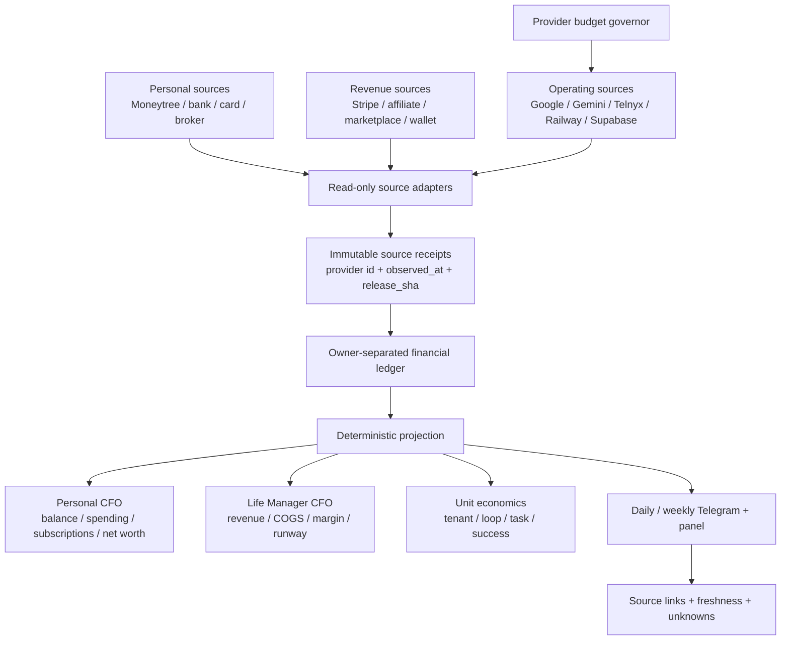
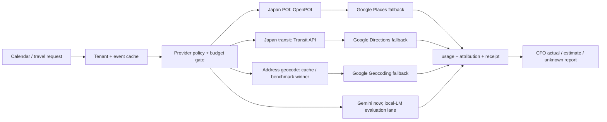

# Life Manager CFO and Provider Cost Observability Design

Status: implementation slice shipped; acceptance partial
Owner: `lm-cfo-observability-1002`
Scope: Dais personal CFO, Life Manager business CFO, provider cost control, and daily source-backed reporting

## 1. Outcome

Life Manager gives Dais one daily CFO report containing:

1. personal cash and asset balances, including MUFG;
2. settled revenue from every connected revenue rail;
3. settled expenses from every connected bank/card/subscription rail;
4. Life Manager's own provider and cloud cost by tenant, loop, task, and provider;
5. actual, estimate, stale, and unknown states kept separate;
6. a source receipt for every displayed number.

The report is not complete when a local calculation succeeds. It is complete only after the source provider was read and the resulting receipt is durable.

## 2. Current evidence and gaps

### Evidence

- The September 2026 Google Cloud invoice was ¥27,889 including tax (¥25,354 before tax).
- Read-only Cloud Monitoring counts for the linked projects were 25,526 Geocoding calls, 15,092 Directions calls, 6,510 Places Text Search calls, and 21,796 Gemini GenerateContent calls.
- Token and current public pricing produced a pre-tax estimate close to ¥25,354. This is a diagnostic estimate, not the settled SKU receipt; the Google Cloud Cost table CSV remains the settlement authority.
- Moneytree Web readback showed one MUFG ordinary JPY account with last-known balance ¥504,302. Its last successful aggregation was 2026-08-26 and its connection state is `auth.creds.invalid` since 2026-08-28. The balance is stale and must not be reported as today's fresh balance.
- `origin/main` already contains a Moneytree MCP adapter and immutable observation store. A read-only MCP run returned one account and zero transactions on 2026-10-02; the zero-transaction result has no independent completeness/freshness proof and must not be rendered as zero spending.
- Acceptance readback on 2026-10-02 returned one MUFG-linked account at JPY 504,302 and zero transactions, both explicitly `partial`; details and payload receipts are in `docs/evidence/cfo/2026-10-02-cfo-cost-observability-acceptance.md`.
- A wider official Moneytree readback returned 187 transactions through 2026-08-25; after transfer/card-repayment exclusion, last-known income was JPY 806,201 and spending JPY 205,500. These remain stale because source freshness and transaction completeness are unproven.
- Post-login direct Moneytree MCP readback at 2026-10-04 09:23 JST still returns one MUFG account at JPY 504,302 and 183 rows through 2026-10-04, but the newest transaction remains 2026-08-25 and no source timestamp/cursor is exposed. Moneytree's official cadence notice says MUFG personal accounts may update once daily on paid plans and once weekly on free plans; tier is unknown. The official My Account login succeeded and confirms OpenAI read authorization, but its portal has no bank-sync control and the MCP values did not change. The balance/flows remain stale/partial; the next refresh must occur inside the Moneytree personal app or through Moneytree support, without deleting the link. Details: `docs/evidence/cfo/2026-10-04-moneytree-mcp-readback.md`.
- The latest production-compatible B7 snapshot recorded here is 129 historical / 124 trailing gaps. A separate 2026-10-04 08:50 JST projection at unmerged mobile branch HEAD `1f045eff` returned 137 / 132, but its B7 adapters differ from `origin/main`; treat it as branch-local, not production. No settled portfolio revenue/cost/net is established. Details: `docs/evidence/cfo/2026-10-04-b7-readback.md`.
- The canonical source-specific artifact path verifies Capafy last-7-day revenue of USD 19.94; this is not promoted to portfolio-wide settled MRR while strict B7 coverage remains unknown.
- Tenant-scoped provider-cost reads at 2026-10-04 08:44 JST reconcile 5,812 in-window `lm_api_cost` rows to the existing aggregate RPC, with USD 4.596581116667 estimated across all event kinds. The `lm_provider_lane_summary` endpoint is missing from PostgREST's schema cache (`PGRST202`), and usage metadata lacks `loop_id` and `actual_status`, so these are not settled or per-loop costs. See `docs/evidence/cfo/2026-10-04-provider-cost-ledger-readback.md`.
- Production Marketing Metrics completed at 08:20 JST on release `9c03543e`; its 2026-10-03 data still has six legacy App Store Sales failures, six RevenueCat rows without currency, and zero Finance Detail rows. The latest CFO hourly occurrence then blocked at 08:57 JST on main release `b7fb1dfa5a` without a provider receipt/readback; no new report was generated and the durable result file remains from 07:10. See `docs/evidence/cfo/2026-10-04-mobile-production-refresh.md`.

### Code gaps

- `origin/main` contains a Financial Manager and Moneytree ingestion path, but the default local result report still has a separate `skills/cfo/loop_pnl.py` path and does not combine personal Moneytree records with every business source in one canonical daily snapshot.
- Moneytree observations now retain a three-month last-known flow snapshot and exclude internal transfers/card repayments, but still mark the account and transaction cursor partial until provider freshness/completeness is proven.
- The current provider-cost ledger stores estimated usage but does not join a settled Google invoice or store actual-vs-estimated billing status on each cost event.
- The existing geocode memo is process-local; successful results are not persisted across restarts, allowing repeated paid requests.
- The existing provider-cost-guard plan defines persistent caches, cost events, budgets, and a seven-day observation gate, but its implementation tasks are not complete on `main`.

## 3. Accounting ownership

Every financial row has exactly one `owner`:

| owner | Meaning | Examples |
|---|---|---|
| `dais_personal` | Dais's personal financial position | MUFG, personal card, securities, cash |
| `life_manager` | Life Manager business economics | Stripe revenue, Google API, Telnyx, Railway, Supabase |
| `transfer` | Movement between owned accounts | MUFG → card payment, wallet → bank |
| `unknown` | Source or classification is unavailable | stale account, failed provider read, unmatched charge |

Internal transfers, owner deposits, fundraising, and unrealized gains are never revenue. Unknown is never zero.

## 4. System architecture

The deterministic projection owns arithmetic. Agents may classify or explain, but they cannot invent balances, settle estimates, or replace a missing receipt with zero.

## 5. Observability contract

Every provider operation emits one structured observation. Cost observations are never sampled.

### Identity

`run_id`, `owner_id`, `tenant_id`, `occurrence_id`, `release_sha`, `phase`, `request_id`, `idempotency_key`.

### Operation

`provider`, `product`, `sku`, `operation`, allowlisted command name, cache hit/miss, and latency.

Raw prompt, bank number, API key, password, cookie, address, and secret values are excluded. Allowlisted environment names may be recorded with a hash only.

### Financial measurement

`quantity`, `unit`, `currency`, `estimated_amount`, `actual_amount`, `billing_status`, `pricing_version`, and `cost_owner`.

`billing_status` is one of:

- `estimated`
- `settled`
- `unknown`
- `not_applicable`

### Effect and failure

`effect`, `readback`, `provider_receipt_id`, `evidence_refs`, `exit_code`, `error_class`, `retryable`, and `next_action`.

`effect_unknown` is a hard safety state. It blocks duplicate external actions until official readback resolves it.

### Freshness

Each source row has `observed_at`, `source_updated_at`, `freshness_status`, and `stale_after`. A stale value can be shown as last-known, but never as current.

## 6. Daily CFO report contract

The daily report is a deterministic snapshot with these sections:

### Cash

- account and institution;
- current balance, original currency, and JPY projection only when FX provenance exists;
- `fresh`, `stale`, `failed`, or `unknown`;
- last successful provider observation;
- source receipt link.

### Revenue

- today, month-to-date, and trailing 12-month settled revenue;
- source-by-source rows;
- refunds and processor fees separately;
- pending, estimated, or unattributed amounts excluded from settled revenue and shown as unknown/pending.

### Expenses

- today, month-to-date, and trailing 12-month settled expenses;
- merchant/category/subscription;
- personal versus Life Manager owner;
- actual provider charges separate from estimates;
- stale or unavailable bank/card sources explicitly listed.

### Life Manager unit economics

- revenue, actual cost, estimated cost, unknown cost;
- net contribution and margin;
- cost per active tenant, loop, task, and successful outcome;
- cache hit rate and paid-fallback count;
- budget state and next action.

### Report stop rules

The report is `partial` when any required source is stale, failed, or unknown. It is `complete` only when the configured source set has fresh readback or a documented source-unavailable receipt.

## 7. Cost targets

These are design targets, not current achievements:

| scope | target |
|---|---:|
| Local routine API spend | $0–$5/month |
| Local paid fallback | Explicit daily budget only |
| Cloud fixed infrastructure | ≤$50/month initially |
| Cloud variable infrastructure | ≤$0.50/active user-month |
| Direct COGS at $10k MRR | ≤$500/month (5%) |
| Routine Japan POI/transit calls | $0 marginal provider cost |

Telephony, paid model calls, and user-requested external actions remain separately budgeted and are never hidden inside a generic “cloud” number.

## 8. Provider strategy

1. Persist geocodes and route results before changing providers.
2. Use OpenPOI as the Japan facility-search primary; preserve licenses and attributions.
3. Use a Japan address geocoder only for address-to-coordinate work; validate its coordinate precision before accepting it for departure safety.
4. Keep the existing Japan transit provider primary with cache, bounded timeout, fallback, and a visible unofficial-data warning.
5. Evaluate OSRM/Valhalla self-hosting for driving routes and OpenTripPlanner self-hosting for scheduled transit only after the current route cache and budget gates are measured.
6. Keep Google as an explicit, budget-authorized fallback rather than the scheduler default.

## 9. Ordered atomic delivery

### A0 — Spec and ownership

- approve this design;
- review existing Cost Guard and Finance specs for overlap;
- write the implementation plan only after this spec is accepted;
- record file ownership and excluded files in the plan.

### A1 — Observation envelope

- add schema and validation tests;
- add append-only storage/migration;
- redact secrets and PII;
- prove success, timeout, provider failure, crash, stale, and `effect_unknown` rows.

### A2 — Cost ledger

- extend provider cost rows with provider, SKU, operation, quantity, estimate, actual, billing status, and pricing version;
- reject missing actual billing as zero;
- make failed ledger writes visible to the owner.

### A3 — Geocode and route reuse

- persist successful geocodes;
- persist route results with tenant/event/time/mode/provider identity;
- prove repeated scheduler ticks create zero duplicate paid calls;
- preserve cache reads in degraded/stopped budget states.

### A4 — Free-provider lane

- add OpenPOI adapter and attribution persistence;
- add Japan address-geocoder adapter and precision tests;
- make Japan transit-first and Google fallback sequential;
- add provider health and fallback counters.

### A5 — Budget governor

- implement pure daily/monthly budget states;
- gate nonessential provider work;
- preserve essential cached reads;
- emit budget transition observations and Telegram warnings.

### A6 — Official Google billing reconciliation

- collect intramonth Monitoring usage estimates;
- import Cost table CSV settlement rows;
- join SKU/project/service rows to provider cost events;
- show estimate-versus-settled variance.

### A7 — Personal CFO rail

- restore Moneytree MUFG authorization;
- read accounts, transactions, and refresh timestamps read-only;
- normalize JPY/original currency/FX provenance;
- reject stale balances as current;
- read back the same balance and transaction cursor independently.

### A8 — Revenue and expense coverage

- connect every settled revenue rail;
- connect every personal bank/card rail;
- detect subscriptions and merchant categories;
- reconcile internal transfers;
- compute 1/3/12-month totals.

### A9 — Report surfaces

- build the deterministic daily/weekly snapshot;
- send Telegram report with freshness and receipts;
- render the same snapshot in the panel;
- test that Telegram and panel totals are identical.

### A10 — Natural-run acceptance

- run one local daily close;
- run one cloud canary;
- observe seven consecutive days;
- verify official Moneytree, Google billing, revenue, and expense readbacks;
- close only when all required numbers are either fresh and sourced or explicitly partial with an owner-visible blocker.

## 10. Current gate

Implementation is shipped on the dedicated branch through Tasks 1–7: truthful Moneytree freshness, canonical local daily path, B7 readback coverage, provider settlement ledger/Google CSV reconciliation, persistent geocode/OpenPOI lane, budget governor, and receipt-backed delivery. The Stripe B7 lane now uses complete official API pagination, cross-currency settlement reconciliation, explicit account classification, and period-scoped coverage; the official Google CSV is joined to B7 infra cost; recent official PartnerStack, CrowdWorks, Lancers, and Alpaca readbacks are bounded by a 24-hour freshness window where available, while the Lancers empty artifact remains coverage-stale and cannot close the current-period zero claim. Alpaca live account reads are enabled in the CFO environment. Task 8 acceptance is partial: the local fixture closes and replays zero, the September Google Cost Table now has an official CSV receipt and service/SKU reconciliation, B7 exposes grouped actionable source gaps, the canonical cloud owner binding plus current-worker send/replay-zero are proved, and a fail-closed seven-period gate is implemented; PartnerStack empty commission, CrowdWorks partial history, Alpaca order P&L, Coconala and other non-Stripe B7 source receipts, the historical Stripe adjustment, branch-to-production parity, and seven elapsed periods remain owner-visible blockers. Moneytree plugin access is available, but the 2026-10-04 read still ends at 2026-08-25 with no freshness/completeness receipt; JPY 504,302 remains last-known/stale, and freshness upgrade is open.

## 11. CFO-only ownership and current cursor

This spec is the CFO workstream's single ownership boundary. `lm-cfo-observability-1002` owns source-backed financial reads, settlement normalization, provider-cost attribution, fail-closed coverage, and the daily report contract. Marketplace publishing, Capafy/Coconala execution, affiliate production, and release/apply work remain with their registered loop owners; this workstream consumes their official receipts and does not mutate their live state.

### Repository approval and integration gate (2026-10-04)

- Issue [#6549](https://github.com/Daisuke134/life-manager/issues/6549) tracks this CFO/cost workstream; it is open with no maintainer response. Per `CONTRIBUTING.md`, follow-up source edits wait for maintainer 👍.
- The original design-only PR [#6478](https://github.com/Daisuke134/life-manager/pull/6478) merged on 2026-10-02 (`2674c614`). It changed only this spec. Later implementation and evidence-refresh commits are on `docs/lm-cfo-cost-observability-spec-20261002`; the pushed post-merge branch tip is not contained in `origin/main` `b7fb1dfa5a`, and no PR covers those post-merge commits. The earlier sync attempt targeted `5fc226d9` and found conflicts in the CFO design spec, Stripe adapter, B7 collector, and three CFO test files; it was aborted without retaining source changes. The branch is not ready for promotion. After issue approval, sync to current main, resolve conflicts, rerun acceptance, and obtain a fresh whole-branch review.

### Verified state

- The September Google Cost Table CSV is the settled authority: ¥27,889 including tax, ¥25,354.450951 pre-tax, 41 service/SKU rows, receipt `google-billing://sha256/c5157075fe3e8331fa2a72d3b33fc98bbacb8b84a0ee2cfc945051ee87f66c64`.
- Google cost attribution is now joined into B7 as 35 official-cost lines. OpenPOI's live read-only probe succeeds, persistent cache and Google fallback budget gates are present, but a seven-period reduction measurement is not yet proved.
- A tenant-scoped ledger read at 2026-10-04 08:44 JST reconciles 5,812 in-window rows to the existing total RPC: USD 4.596581116667 estimated across all kinds, USD 4.53165475 from `provider_usage`. This is not a settled cost receipt. The provider-lane RPC returns `PGRST202`, and ledger metadata has no `loop_id` or `actual_status`, so provider-lane totals and per-loop actuals remain unknown. See `docs/evidence/cfo/2026-10-04-provider-cost-ledger-readback.md`.
- The latest read at 2026-10-04 10:03 JST still returns displayed balance ¥504,302 and all 183 transaction rows for 2026-07-04..2026-10-04; the newest transaction and row balance are 2026-08-25 / ¥504,302. Raw positives are ¥824,656 and raw negatives are ¥665,120, including transfers/card repayments. Excluding transfers from income yields categorized personal income ¥806,201; excluding transfers and card repayments from spending yields ¥205,500, including ¥200,000 categorized `未定`. Spending summary returns July ¥102,000 and August ¥103,500 only. No source-updated timestamp or bank-sync cursor is exposed. Moneytree's official notice says MUFG personal refresh is daily (paid) or weekly (free), and automatic refresh is not guaranteed; the current snapshot remains stale. The official My Account portal confirms OpenAI's read authorization but offers no bank-sync control. A CUA iPhone Mirroring attempt also failed to connect; Mac Wi-Fi/Bluetooth are on, so the phone-side power/proximity/radio state remains unresolved. See the [official update-frequency notice](https://help.getmoneytree.com/ja/articles/4055836-%E4%B8%80%E9%83%A8%E3%81%AE%E9%8A%80%E8%A1%8C%E3%81%AE%E6%9B%B4%E6%96%B0%E9%A0%BB%E5%BA%A6%E3%81%AE%E5%A4%89%E6%9B%B4%E3%81%AB%E3%81%A4%E3%81%84%E3%81%A6) and `docs/evidence/cfo/2026-10-04-moneytree-mcp-readback.md`. These are personal cash flows, not Life Manager revenue.
- The latest sanitized cost-receipt candidate audit contains a Railway USD 26.07 paid-receipt claim and a DigitalOcean September invoice of USD 0.00 with USD 0.08 usage offset by account credit. Both candidates have `bank_match=unverified` and `allocation_to_product_loop=unverified`; neither is counted as settled Life Manager COGS until bank/card settlement and owner allocation are joined.
- Stripe trailing settlement, PartnerStack's official empty report, Lancers' coverage-stale empty-settlement artifact, the partial CrowdWorks contract receipt, and the Alpaca account cash readback are connected. Unknown, stale, pending, and missing settlement are excluded from settled revenue and shown as gaps.
- The prior production-compatible B7 readback is 129 historical / 124 trailing gaps. The 2026-10-04 08:50 JST local run at unmerged mobile branch HEAD `1f045eff` returned 137 / 132; because B7 code differs from `origin/main`, that is branch-local only. Its company status is `unknown` and no verified currency totals exist. The latest CFO owner remains capacity-blocked; no fresh production B7 report or revenue/net total is proven. Details: `docs/evidence/cfo/2026-10-04-b7-readback.md`.
- The latest production Marketing Metrics occurrence passed locally at 08:20 JST, but all six legacy App Store Sales rows still fail, RevenueCat currency is missing, and production has zero Finance Detail rows. CFO-hourly then blocked at 08:57 JST on main `b7fb1dfa5a`, exit 75, with no receipt; its durable report file remains from 07:10. Details: `docs/evidence/cfo/2026-10-04-mobile-production-refresh.md`.
- Root-cause readback for CFO admission: the registry marks it `deterministic/borrow/support`, while the default host finite-run cap is 8. At 09:38 JST all 8 identity-validated owner claims were live and classified `revenue` (7 agent, 1 deterministic). The typed 08:57 error is `resource_capacity_busy`; the local memory snapshot is stale, so current memory headroom is unconfirmed. The exact 08:57 holders were not persisted. Evidence: `docs/evidence/cfo/2026-10-04-cfo-capacity-admission-readback.md`.

### Ordered remaining atomic TODO

1. **Fresh personal cash:** OpenAI remains authorized in Moneytree, but the latest MUFG transaction is 2026-08-25. The My Account browser portal has no bank-sync control, the current connector has no refresh operation, and the credentials SSOT has no MUFG-labeled direct-login record. CUA iPhone Mirroring cannot connect; Mac Wi-Fi/Bluetooth are on, so the iPhone's power, proximity, and radio state remain to be corrected/verified. Then refresh/re-authenticate MUFG from Moneytree's personal app without deleting/re-adding the bank, or obtain an independent bank readback. Require a provider timestamp/cursor and newer transactions. Until then show JPY 504,302 and July/August flows as `stale/partial`, never current or zero.
2. **Protect CFO admission:** after Issue #6549 approval, reserve one of the existing 8 finite-run slots for CFO by limiting revenue-class concurrency to 7 and raising CFO from `support` to `critical_paid`; keep the total cap unchanged, do not stop owners, and measure revenue-loop throughput.
3. **Repair provider-cost observability:** sync the approved branch to latest main, apply the tenant-bound `lm_provider_lane_summary` migration, and verify PostgREST exposes it. Ensure usage rows carry loop identity and actual-vs-estimated billing status, then reconcile to official Google Cost Table receipts; current USD 4.596581116667 is estimate-only.
4. **Complete external settlement:** obtain current Lancers and official Coconala, PartnerStack, CrowdWorks, Alpaca order/realized P&L, and historical Stripe-adjustment receipts. Match each to bank/card settlement and owner/loop; unmatched amounts remain unknown, and live marketplace/account mutations stay with their source owners.
5. **Close the CFO snapshot:** rerun B7 from current released code with fresh receipts; preserve every gap as `missing_coverage`/`source_unconnected`/`stale_readback` and keep unknown totals null.
6. **Production parity:** promote only the accepted CFO release through the registered release owner; verify cloud tenant/email-wallet binding and official report receipt/readback; replay the same occurrence with zero duplicate effects.
7. **Natural-run gate:** observe seven consecutive daily closes with settled Google billing, fresh Moneytree, revenue, expense, and report readbacks. Only then mark the CFO report complete and compare measured COGS with the ¥0–¥5 local routine target and ≤5% direct-COGS target at $10k MRR.

### October Google monitoring readback (not a settled invoice)

No October invoice has been issued. A fresh official Cloud Monitoring REST read at 2026-10-04 08:12 JST covers project `anicca-461216` from 2026-10-01 00:00 JST through 08:12 JST on 2026-10-04. It reports Directions 404=804, Places Text Search 200=372 and 404=1, Geocoding 200=155, and Places Details 200=15. A separate `maps.googleapis.com/service/request_count_by_domain` metric returns 1,160 aggregate requests (515 2xx, 645 4xx), which does not reconcile with the 1,345 service/method counts; do not combine these families. No active `generativelanguage.googleapis.com` Monitoring descriptor exists for Gemini GenerateContent in this project. The separate `lm_api_cost` read has estimated Gemini Live events, but neither stream proves the full settled Gemini charge.

Applying September's historical blended averages to successful Places Text Search and Geocoding requests gives an illustrative Maps subtotal of about **¥657 pre-tax**, excluding 15 Places Details requests. If all 4xx attempts were billed at the same average rates, the subtotal would be about **¥845 pre-tax**, still excluding Details. This does not establish 4xx billability, exact SKU prices, credits/free caps, volume tiers, other projects, Gemini usage, or tenant/loop attribution. The previous ¥984 MTD / ¥9,800–¥10,200 projection is an older snapshot and is not a current total estimate. Full October spend remains `unknown` until the official Cost Table settlement and missing Gemini/Details attribution are reconciled. Detailed response: `docs/evidence/cfo/2026-10-04-google-monitoring-readback.md`.

## 12. External provider research and selected cost-reduction design

This section records the provider decision after a source review on 2026-10-03. It narrows the next implementation slice; it does not claim that every candidate below is production-ready or that an estimate is a settled charge.

### Research matrix

| capability | candidates reviewed | evidence-bound finding | decision |
|---|---|---|---|
| Japan POI search | OpenPOI, Overture direct, Mapbox Search, Geoapify | [OpenPOI](https://docs.openpoiapi.com/) is keyless, free, commercial-use allowed, Japan-wide, returns coordinates plus `licenses`/`attributions`, and has a documented API rate limit. Overture is a data distribution/query source, not a ready-to-use application API ([docs](https://docs.overturemaps.org/), [GitHub](https://github.com/OvertureMaps/data)). | Keep OpenPOI as primary for the current Japan venue UX; preserve attribution and keep Google Places only as a budgeted fallback. |
| Japan address geocoding | Geoapify, Nominatim, Photon, Pelias, Google | Geoapify's free plan is commercial-use eligible but quota/attribution bound ([pricing](https://www.geoapify.com/pricing)). The public Nominatim service is capped at 1 request/second, forbids autocomplete, requires identification/caching, and recommends self-hosting for larger use ([policy](https://operations.osmfoundation.org/policies/nominatim/)). Photon public service is fair-use/no-SLA and its self-host documentation reports roughly 95 GB disk and 64 GB RAM for planet data ([GitHub](https://github.com/komoot/photon)). Pelias is open source but requires Elasticsearch and multiple import services ([GitHub](https://github.com/pelias/api)). | Benchmark Geoapify against a bounded self-host candidate; do not call public Nominatim/Photon from production. Keep cached Google Geocoding as fail-closed fallback until an accuracy/licence/freshness winner is proved. |
| Japan public transit | Transit API, OpenTripPlanner, Google Directions | [Transit terms](https://transit.ls8h.com/terms) state that the API is free/read-only/no-auth but unofficial, mutable, and without SLA. [OpenTripPlanner](https://www.opentripplanner.org/) combines OSM and GTFS but requires maintained feeds and a hosted Java service. | Keep Transit API primary with timeout/cache/official-data warning; benchmark OTP only when seven-period route demand justifies operating a feed/service. |
| Driving/non-Japan routing | OSRM, Valhalla, GraphHopper, Mapbox, Google Routes | [OSRM](https://github.com/Project-OSRM/osrm-backend) is a BSD-2-Clause C++ engine with Docker/OSM extracts for driving/bike/walk. [Valhalla](https://github.com/valhalla/valhalla) is MIT, tiled, and supports multimodal/time-based features but is heavier. GraphHopper's free plan is explicitly non-commercial and paid plans start at a recurring fee ([pricing](https://www.graphhopper.com/pricing/)). Mapbox is pay-as-you-go with commercial/licensing terms ([pricing](https://www.mapbox.com/pricing/)). | Keep Google as explicit fallback now. Benchmark OSRM first for driving only; benchmark Valhalla/OTP only if OSRM cannot meet route facts or coverage. |
| LLM reasoning/voice | Gemini, Ollama, llama.cpp, vLLM | Gemini has a free tier but production paid usage is token/tool-metered ([pricing](https://ai.google.dev/gemini-api/docs/pricing)). [Ollama](https://github.com/ollama/ollama) and [llama.cpp](https://github.com/ggml-org/llama.cpp) enable local inference; [vLLM](https://github.com/vllm-project/vllm) targets hosted throughput. None is a drop-in proof that preserves current Life Manager quality, voice latency, cloud access, or receipt semantics. | Do not switch Gemini blindly. Evaluate the existing local-model lane on recorded CFO/calendar tasks; keep Gemini for voice/high-risk paths until quality, latency, and cost gates pass. |

### Selected architecture

The user-facing contract stays unchanged: a known venue is filled automatically, a route is inserted when a trustworthy route is available, and an unresolved/unsafe result asks or remains visibly partial. A successful OpenPOI/Transit result must emit zero Google fallback calls. A provider outage must not trigger parallel Google calls or an unbounded retry storm.

The implementation now allows coordinate-ready Japan Transit to run without a `mapsKey`; address geocoding and Google fallback remain explicitly configured and budget-authorized. The location resolver currently uses OpenPOI `/v1/search` rather than an autocomplete surface. If a future UI adds an address search box, use OpenPOI `/v1/suggest`; do not emulate autocomplete against public Nominatim.

### Cost model and target

The September settled Google service totals are the comparison baseline: Places ¥9,419.856821, Geocoding ¥7,493.014626, Directions ¥3,271.171127, Gemini ¥5,160.873099, and KMS/Storage/Run approximately ¥9.54 pre-tax. The following is a **planning budget**, not a settled invoice:

| layer | current baseline | target budget after this design | gate |
|---|---:|---:|---|
| OpenPOI POI primary | Places cost is currently Google-backed | ¥0 provider fee | attribution and health receipt |
| Japan Transit primary | Directions cost is currently Google-backed | ¥0 provider fee | timeout + cache + unofficial warning |
| Google Places fallback | part of September Places total | ≤¥500/month per tenant | 100 fallback requests/month or lower, whichever trips first |
| Google route fallback | part of September Directions total | ≤¥300/month per tenant | 100 fallback requests/month or lower, whichever trips first |
| Google Geocoding fallback | September ¥7,493.01 | ¥100–¥800/month after cache | 200 uncached addresses/month until benchmark winner |
| Gemini | September ¥5,160.87 account-level baseline | ¥5,000–¥6,000 while current path remains | nonessential calls budgeted; voice/high-risk separate |
| fixed Google services | about ¥10 | about ¥10 | settled CSV |
| total Google target | ¥27,889 tax-included September invoice | roughly ¥5,500–¥7,500 pre-tax / ¥6,000–¥8,300 tax-included | seven natural periods + official CSV |

Best case is a cache hit and successful free primary on nearly every Japan request. Base case retains small fallback/geocode spend and the current Gemini cost. Worst case is provider outage or traffic growth returning the account to the September baseline; budget gates must stop nonessential Google calls before that happens. Google Maps pricing remains SKU/free-cap/volume-tier based, so these caps are safety budgets, not promises of free usage ([official pricing](https://developers.google.com/maps/billing-and-pricing/pricing)).

### Ordered provider-cost TODO

1. **[x] Routing policy seam:** coordinate-ready Japan Transit runs without a Google key; non-Japan/address-only requests return typed `provider_unconfigured` rather than silently failing.
2. **[x] UX and attribution:** OpenPOI licenses/attributions and provenance are retained; incomplete attribution is rejected. Add `/v1/suggest` only when an actual input-completion surface exists.
3. **[x] Geocoder benchmark artifact:** the fixed Japan corpus and provider-level accuracy/resource scoring run fail-closed; the current result is `no_winner`, so Google is not replaced.
4. **[x] Route benchmark artifact:** Transit/OTP/OSRM/Valhalla rows and operating-cost fields are recorded; no production cutover is claimed from benchmark evidence alone.
5. **[x] Explicit budget policy:** per-tenant daily/monthly caps and typed fallback telemetry are enforced; durable authorizer read failure denies non-cache paid work.
6. **[x] LLM cost gate:** the existing local-model shadow scorecard is fail-closed; current recommendation is `keep_current` until a receipt-backed, non-inferior candidate exists.
7. **[ ] CFO acceptance:** make the lane RPC visible to live PostgREST, prove loop attribution and actual-vs-estimated status, reconcile provider rows with the October Cost Table, observe seven consecutive daily closes, and only then update the target from estimate to measured actual.

This provider-cost sequence is additive to Section 11's personal-MUFG and external-settlement TODOs. Those financial source gaps remain required for a complete CFO report even if provider API cost reaches the target.

## 13. Provider-cost implementation cursor

The first six provider-cost tasks are implemented on the dedicated branch, but are not merged or deployed. Source code contains the tenant-bound `lm_provider_lane_summary` reader and migration; a 2026-10-04 production query returns `PGRST202` because PostgREST's schema cache does not expose that function. The existing `lm_api_cost` table and `lm_financial_cost_totals` RPC do return estimates, but usage metadata omits `loop_id` and actual-billing status. The free-first OpenPOI/Transit lane, persistent cache, and budget gates remain branch-only until approval, latest-main sync, and production release.

The current acceptance cursor is:

1. **[x]** rerun all provider benchmark and CFO suites after the variance/gate changes;
2. **[partial]** source-code wiring for provider-lane readback is complete, but live `lm_provider_lane_summary` lookup fails with `PGRST202`; tenant ledger estimates have no loop or actual-billing attribution;
3. after Issue #6549 approval and latest-main sync, apply the lane-summary migration and verify its live schema, then prove loop attribution and settlement status;
4. observe seven real daily closes with fresh source rows, settled Google billing, provider-lane cap receipts, and replay-zero;
5. only then promote a benchmark winner or claim the ¥5,500–¥7,500 pre-tax planning target as measured actual; and
6. separately close Section 11's MUFG and external settlement gaps before marking the CFO report complete.

The latest evidence bundle is `docs/evidence/cfo/2026-10-03-provider-cost-selection.md`. Synthetic seven-day rows prove gate behavior only; they are not elapsed production observation.
