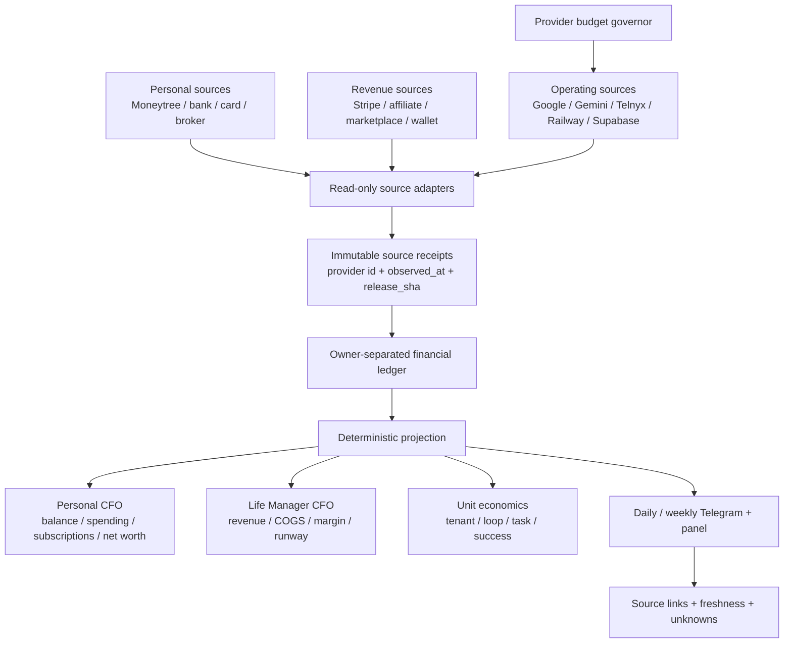

# Life Manager CFO and Provider Cost Observability Design

Status: implementation slice shipped; acceptance partial
Owner: `lm-cfo-observability-1002`
Scope: Dais personal CFO, Life Manager business CFO, provider cost control, and daily source-backed reporting

## 1. Outcome

Life Manager gives Dais one daily CFO report containing:

1. personal cash and asset balances, including MUFG;
2. settled revenue from every connected revenue rail;
3. settled expenses from every connected bank/card/subscription rail;
4. Life Manager's own provider and cloud cost by tenant, loop, task, and provider;
5. actual, estimate, stale, and unknown states kept separate;
6. a source receipt for every displayed number.

The report is not complete when a local calculation succeeds. It is complete only after the source provider was read and the resulting receipt is durable.

## 2. Current evidence and gaps

### Evidence

- The September 2026 Google Cloud invoice was ¥27,889 including tax (¥25,354 before tax).
- Read-only Cloud Monitoring counts for the linked projects were 25,526 Geocoding calls, 15,092 Directions calls, 6,510 Places Text Search calls, and 21,796 Gemini GenerateContent calls.
- Token and current public pricing produced a pre-tax estimate close to ¥25,354. This is a diagnostic estimate, not the settled SKU receipt; the Google Cloud Cost table CSV remains the settlement authority.
- Moneytree Web readback showed one MUFG ordinary JPY account with last-known balance ¥504,302. Its last successful aggregation was 2026-08-26 and its connection state is `auth.creds.invalid` since 2026-08-28. The balance is stale and must not be reported as today's fresh balance.
- `origin/main` already contains a Moneytree MCP adapter and immutable observation store. A read-only MCP run returned one account and zero transactions on 2026-10-02; the zero-transaction result has no independent completeness/freshness proof and must not be rendered as zero spending.
- Acceptance readback on 2026-10-02 returned one MUFG-linked account at JPY 504,302 and zero transactions, both explicitly `partial`; details and payload receipts are in `docs/evidence/cfo/2026-10-02-cfo-cost-observability-acceptance.md`.
- A wider official Moneytree readback returned 187 transactions through 2026-08-25; after transfer/card-repayment exclusion, last-known income was JPY 806,201 and spending JPY 205,500. These remain stale because source freshness and transaction completeness are unproven.
- Live B7 `loop_pnl.py` readback ran for 2026-10-02 but kept historical/trailing company totals unknown because 137 coverage gaps remain in each window; no settled revenue/net was invented.
- The canonical source-specific artifact path did verify Capafy last-7-day revenue of USD 19.94; this is not promoted to portfolio-wide settled MRR while strict B7 coverage remains unknown.

### Code gaps

- `origin/main` contains a Financial Manager and Moneytree ingestion path, but the default local result report still has a separate `skills/cfo/loop_pnl.py` path and does not combine personal Moneytree records with every business source in one canonical daily snapshot.
- Moneytree observations now retain a three-month last-known flow snapshot and exclude internal transfers/card repayments, but still mark the account and transaction cursor partial until provider freshness/completeness is proven.
- The current provider-cost ledger stores estimated usage but does not join a settled Google invoice or store actual-vs-estimated billing status on each cost event.
- The existing geocode memo is process-local; successful results are not persisted across restarts, allowing repeated paid requests.
- The existing provider-cost-guard plan defines persistent caches, cost events, budgets, and a seven-day observation gate, but its implementation tasks are not complete on `main`.

## 3. Accounting ownership

Every financial row has exactly one `owner`:

| owner | Meaning | Examples |
|---|---|---|
| `dais_personal` | Dais's personal financial position | MUFG, personal card, securities, cash |
| `life_manager` | Life Manager business economics | Stripe revenue, Google API, Telnyx, Railway, Supabase |
| `transfer` | Movement between owned accounts | MUFG → card payment, wallet → bank |
| `unknown` | Source or classification is unavailable | stale account, failed provider read, unmatched charge |

Internal transfers, owner deposits, fundraising, and unrealized gains are never revenue. Unknown is never zero.

## 4. System architecture

The deterministic projection owns arithmetic. Agents may classify or explain, but they cannot invent balances, settle estimates, or replace a missing receipt with zero.

## 5. Observability contract

Every provider operation emits one structured observation. Cost observations are never sampled.

### Identity

`run_id`, `owner_id`, `tenant_id`, `occurrence_id`, `release_sha`, `phase`, `request_id`, `idempotency_key`.

### Operation

`provider`, `product`, `sku`, `operation`, allowlisted command name, cache hit/miss, and latency.

Raw prompt, bank number, API key, password, cookie, address, and secret values are excluded. Allowlisted environment names may be recorded with a hash only.

### Financial measurement

`quantity`, `unit`, `currency`, `estimated_amount`, `actual_amount`, `billing_status`, `pricing_version`, and `cost_owner`.

`billing_status` is one of:

- `estimated`
- `settled`
- `unknown`
- `not_applicable`

### Effect and failure

`effect`, `readback`, `provider_receipt_id`, `evidence_refs`, `exit_code`, `error_class`, `retryable`, and `next_action`.

`effect_unknown` is a hard safety state. It blocks duplicate external actions until official readback resolves it.

### Freshness

Each source row has `observed_at`, `source_updated_at`, `freshness_status`, and `stale_after`. A stale value can be shown as last-known, but never as current.

## 6. Daily CFO report contract

The daily report is a deterministic snapshot with these sections:

### Cash

- account and institution;
- current balance, original currency, and JPY projection only when FX provenance exists;
- `fresh`, `stale`, `failed`, or `unknown`;
- last successful provider observation;
- source receipt link.

### Revenue

- today, month-to-date, and trailing 12-month settled revenue;
- source-by-source rows;
- refunds and processor fees separately;
- pending, estimated, or unattributed amounts excluded from settled revenue and shown as unknown/pending.

### Expenses

- today, month-to-date, and trailing 12-month settled expenses;
- merchant/category/subscription;
- personal versus Life Manager owner;
- actual provider charges separate from estimates;
- stale or unavailable bank/card sources explicitly listed.

### Life Manager unit economics

- revenue, actual cost, estimated cost, unknown cost;
- net contribution and margin;
- cost per active tenant, loop, task, and successful outcome;
- cache hit rate and paid-fallback count;
- budget state and next action.

### Report stop rules

The report is `partial` when any required source is stale, failed, or unknown. It is `complete` only when the configured source set has fresh readback or a documented source-unavailable receipt.

## 7. Cost targets

These are design targets, not current achievements:

| scope | target |
|---|---:|
| Local routine API spend | $0–$5/month |
| Local paid fallback | Explicit daily budget only |
| Cloud fixed infrastructure | ≤$50/month initially |
| Cloud variable infrastructure | ≤$0.50/active user-month |
| Direct COGS at $10k MRR | ≤$500/month (5%) |
| Routine Japan POI/transit calls | $0 marginal provider cost |

Telephony, paid model calls, and user-requested external actions remain separately budgeted and are never hidden inside a generic “cloud” number.

## 8. Provider strategy

1. Persist geocodes and route results before changing providers.
2. Use OpenPOI as the Japan facility-search primary; preserve licenses and attributions.
3. Use a Japan address geocoder only for address-to-coordinate work; validate its coordinate precision before accepting it for departure safety.
4. Keep the existing Japan transit provider primary with cache, bounded timeout, fallback, and a visible unofficial-data warning.
5. Evaluate OSRM/Valhalla self-hosting for driving routes and OpenTripPlanner self-hosting for scheduled transit only after the current route cache and budget gates are measured.
6. Keep Google as an explicit, budget-authorized fallback rather than the scheduler default.

## 9. Ordered atomic delivery

### A0 — Spec and ownership

- approve this design;
- review existing Cost Guard and Finance specs for overlap;
- write the implementation plan only after this spec is accepted;
- record file ownership and excluded files in the plan.

### A1 — Observation envelope

- add schema and validation tests;
- add append-only storage/migration;
- redact secrets and PII;
- prove success, timeout, provider failure, crash, stale, and `effect_unknown` rows.

### A2 — Cost ledger

- extend provider cost rows with provider, SKU, operation, quantity, estimate, actual, billing status, and pricing version;
- reject missing actual billing as zero;
- make failed ledger writes visible to the owner.

### A3 — Geocode and route reuse

- persist successful geocodes;
- persist route results with tenant/event/time/mode/provider identity;
- prove repeated scheduler ticks create zero duplicate paid calls;
- preserve cache reads in degraded/stopped budget states.

### A4 — Free-provider lane

- add OpenPOI adapter and attribution persistence;
- add Japan address-geocoder adapter and precision tests;
- make Japan transit-first and Google fallback sequential;
- add provider health and fallback counters.

### A5 — Budget governor

- implement pure daily/monthly budget states;
- gate nonessential provider work;
- preserve essential cached reads;
- emit budget transition observations and Telegram warnings.

### A6 — Official Google billing reconciliation

- collect intramonth Monitoring usage estimates;
- import Cost table CSV settlement rows;
- join SKU/project/service rows to provider cost events;
- show estimate-versus-settled variance.

### A7 — Personal CFO rail

- restore Moneytree MUFG authorization;
- read accounts, transactions, and refresh timestamps read-only;
- normalize JPY/original currency/FX provenance;
- reject stale balances as current;
- read back the same balance and transaction cursor independently.

### A8 — Revenue and expense coverage

- connect every settled revenue rail;
- connect every personal bank/card rail;
- detect subscriptions and merchant categories;
- reconcile internal transfers;
- compute 1/3/12-month totals.

### A9 — Report surfaces

- build the deterministic daily/weekly snapshot;
- send Telegram report with freshness and receipts;
- render the same snapshot in the panel;
- test that Telegram and panel totals are identical.

### A10 — Natural-run acceptance

- run one local daily close;
- run one cloud canary;
- observe seven consecutive days;
- verify official Moneytree, Google billing, revenue, and expense readbacks;
- close only when all required numbers are either fresh and sourced or explicitly partial with an owner-visible blocker.

## 10. Current gate

Implementation is shipped on the dedicated branch through Tasks 1–7: truthful Moneytree freshness, canonical local daily path, B7 readback coverage, provider settlement ledger/Google CSV reconciliation, persistent geocode/OpenPOI lane, budget governor, and receipt-backed delivery. Task 8 acceptance is partial: the local fixture closes and replays zero, while Moneytree refresh, Google Cost Table CSV, cloud canary, and seven elapsed periods remain owner-visible blockers. Evidence: `docs/evidence/cfo/2026-10-02-cfo-cost-observability-acceptance.md`.
