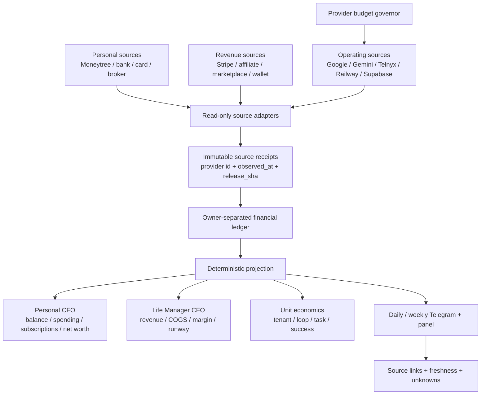

# Life Manager CFO and Provider Cost Observability Design

Status: current design reference; implementation state, cursor, and ordered TODOs are maintained only in [the unified SSOT](2026-09-25-life-manager-unified-ssot.md)
Owner: `lm-cfo-observability-1002`
Scope: Dais personal CFO, Life Manager business CFO, provider cost control, and daily source-backed reporting

## 1. Outcome

Life Manager gives Dais one daily CFO report containing:

1. personal cash and asset balances, including MUFG;
2. settled revenue from every connected revenue rail;
3. settled expenses from every connected bank/card/subscription rail;
4. Life Manager's own provider and cloud cost by tenant, loop, task, and provider;
5. actual, estimate, stale, and unknown states kept separate;
6. a source receipt for every displayed number.

The report is not complete when a local calculation succeeds. It is complete only after the source provider was read and the resulting receipt is durable.

## 2. Current evidence and gaps

### Evidence

- The official 2026-09 Cost Table CSV is now present at private path `/Users/anicca/.local/state/life-manager/life-manager-cfo-hourly/evidence/google-cloud-billing/2026-09-cost-table.csv` (mode `0600`, SHA-256 `c5157075fe3e8331fa2a72d3b33fc98bbacb8b84a0ee2cfc945051ee87f66c64`). It has 43 usage rows, four tax rows, one rounding-adjustment row, and one invoice-total summary row. The exact reconciliation is ¥25,354.504771 gross usage − ¥0.053520 credits + ¥2,535.000000 tax − ¥0.451251 rounding adjustment = ¥27,889.000000 billed total. Do not add the summary row to its detail rows. A separate mode-`0600` join artifact `google-cloud-invoice-identity-payment-join-2026-10-07T053405Z.json` (SHA-256 `a7fe9c8bf5e3d7d78caee6462006f29eded889fb8207dbe263a50ba5c5b98196`) confirms invoice number, invoice ID, billing account, currency, and total match the original PDF and current open billing account. This proves invoice identity and billed amount, not posted payment or settled company expense.
- Service totals in the same CSV match the live table: Places API ¥9,419.856821, Geocoding API ¥7,493.014626, Directions API ¥3,271.171127, Gemini API ¥5,160.873099, Cloud KMS ¥9.530434, Cloud Storage ¥0.005144, and Cloud Run ¥0. The old stored Gemini row ¥5,159 is superseded by this exact CSV value. The CSV’s explicit credit and rounding rows explain why rounded leaf-row sums do not equal the final invoice total.
- A read-only `serviceruntime.googleapis.com/api/request_count` query for `2026-09-01T00:00:00Z`–`2026-10-01T00:00:00Z` returned Geocoding 20,258 (13,298 response 200; 6,960 response 404), Directions 14,230 (all response 404), Places Text Search 5,800 (4,308 response 200; 1,491 response 404; 1 response 500), and Places Details 72 (response 200). The query paged through 23 pages and 19,722 points; normalized series/interval deduplication found no duplicates.
- Compared with the invoice-month CSV quantities, these counts differ by +855 Geocoding (CSV 19,403), +125 Directions (CSV 14,105), +128 Places Text Search (CSV 5,672), and -3 Places Details (CSV 75). This remains a diagnostic comparison, not a same-period billing reconciliation: Google documents that invoice-month usage can differ from calendar-month usage because late-reported costs can move between invoices, and the CSV's usage dates have day-level rather than timestamp precision. Request counts also do not prove billable units or loop attribution; a `404` response is not treated as proof of zero charge. Sources: [Cloud Monitoring time-series API](https://cloud.google.com/monitoring/api/ref_v3/rest/v3/projects.timeSeries/list), [Google Cloud invoice-month cost details](https://docs.cloud.google.com/billing/docs/how-to/cost-table#invoice-month).
- A fresh read-only check on 2026-10-07T13:11Z listed six projects visible to the current Google Cloud CLI identity. `bq ls --all --format=json <project>:` returned no datasets visible to that identity in four projects; the other two reported that BigQuery is not enabled. Google documents that `datasets.list` results are filtered to datasets for which the caller has `bigquery.datasets.get`; `--all` includes hidden datasets but does not bypass that permission. Therefore this probe does not prove those four projects contain no dataset, only that this identity could list none, and the two disabled projects remain unqueried. No API was enabled and no export or dataset was created. The later-discovered private CSV artifact above was outside the earlier `docs/evidence` and Downloads search scope. No BigQuery export, dataset, or API enablement was created. Source: [BigQuery datasets.list](https://cloud.google.com/bigquery/docs/reference/rest/v2/datasets/list).
- The Billing Console displayed an action-required warning that at least one project using `generativelanguage.googleapis.com` has unrestricted API keys. Read-only API Keys metadata across the six visible projects found 24 keys: 20 list Gemini as an allowed API, 23 have API restrictions, one has none, and all 24 have no application restriction. The fully unrestricted key is named `API キー 2` in the project displayed as `ANICCA`. No key string was requested or changed. This warning is not evidence of abuse, and the key-to-production-caller mapping remains unknown. Google recommends both API and application restrictions; keys without API restrictions can call any API that accepts keys, and keys without application restrictions can be used from anywhere. Source: [Google API key restrictions](https://cloud.google.com/docs/authentication/api-keys).
- A fresh Moneytree plugin read returns one MUFG JPY account with a displayed balance of ¥504,302, but exposes no upstream sync timestamp. Its default three-month transaction window (2026-07-07–2026-10-07) returns 166 rows, with the latest transaction on 2026-08-25. Labeled income categories (`給料`, `収入`, `利子所得`) total ¥806,201. `未定` outflows total ¥200,000 and remain unclassified; `交際費` is labeled ¥2,500. `振替`, `カード返済`, and `ATM引き出し` together have net outflow ¥405,962 and are kept separate from consumption to avoid double-counting transfers or card settlements. No separate card account is in the returned account set. Treat the balance freshness as unknown, the ¥200,000 as unknown-classification, and the missing post-2026-08-25 transactions as a coverage gap—not zero spending.
- A direct Moneytree query for `2026-09-01`–`2026-09-30` returned 0 rows for the one connected MUFG ordinary-savings account. This is an empty source window, not proof of zero personal spending: no card account is connected, and other accounts/subscriptions are not covered by this query.
- The latest saved CFO report is `sent` for period `2026-10-07:11` at `2026-10-07T11:58:31Z`. Its report pointers match the referenced B7 snapshot hashes; the snapshot reports zero duplicate receipts. `sourceProvenance.status=verified` verifies provenance, not complete company financial coverage.
- That same snapshot includes Moneytree as `partial`: one MUFG balance observation of ¥504,302 at `2026-10-07T11:58:41Z`, but `provider_sync_at=null` and `freshness_status=unknown`. Four quarterly transaction windows return 983 rows total and have 13 range mismatches; the current-day window is `unknown`. The latest transaction date is `2026-08-24`; September 2026 `income_jpy`, `expense_jpy`, and `cash_movement_jpy` are null. The earlier direct-plugin read ends one day later (`2026-08-25`).
- The source cause for the one-day date shift is confirmed: Moneytree provides a Japan calendar date with a `+09:00` offset, but the adapter/collector path treated it as an instant and converted it to UTC before extracting `YYYY-MM-DD`. PR #6910 merged to main as `d950731b`; it preserves the provider calendar date and bumps the 24-hour projection-cache envelope to v3 so an old UTC-shifted v2 snapshot is not reused. Focused tests reproduce a report-window-start exclusion and a month-start expense shift. Candidate release `20261007T213624-d950731b` was cut without activating `current`; the CFO label remains loaded at SHA `80ea586c`, so the fix is not yet live. The current `lm-loop doctor` readback still fails on unrelated retired label `ai.anicca.provision-browser.capafy.kosuke`; no target apply/restart was performed. The current 13 production range mismatches and date cursor remain unverified until a post-release natural report readback.
- In that report, company historical/trailing/MRR status is `unknown`, with 173/168/26 coverage gaps across 18 loops. Historical and trailing company revenue, cost, and net are null; company MRR currencies are empty. The only verified per-loop MRR is `mobile-apps` at USD 20.34; this is subscription MRR, not settled revenue or profit. The historical window has no start date, so this snapshot does not establish last-month company revenue.
- An independent read-only reaggregation confirms the 173/168/26 gap counts from all 18 per-loop rows and matches the company-level aggregates. Historical gaps: 162 `missing_category` (all 9 required counted categories across 18 loops), 5 stale readbacks, 3 unverified receipts, and one each for unconnected source, missing coverage, and read failure. Trailing gaps: 158 `missing_category` (four categories have 17 loop gaps each; the other five have 18), 5 stale readbacks, 2 unverified receipts, and one each for unconnected source, missing coverage, and read failure. MRR gaps: 19 `missing_category` (17 explicitly identify category `mrr`; 2 omit the category field), 2 stale readbacks, 2 unverified receipts, and one each for unconnected source, missing coverage, and read failure. These are missing or unverified coverage, not zero revenue or zero cost.
- Current product-loop catalog contains 18 unique business loop IDs, and the latest B7 `historical`, `trailing`, and `mrr` loop-key sets each match that catalog exactly. The SSOT's older 14-loop count is stale; this is not a B7-versus-catalog row mismatch. The runtime registry contains 186 job IDs: 111 are uniquely referenced by product-loop `job_ids`, and 75 are not product-loop jobs but are role-classified as `control` (35), `platform` (14), or `shared` (26). Some `shared` jobs produce revenue or growth activity, so their costs must remain in company expense rather than being omitted. A8 must update the stale SSOT count after its lease is released, preserve the 18 business P&Ls, and account for all 186 runtime jobs either through a receipt-backed product-loop join or an explicit shared/control/platform cost bucket; do not create 186 revenue owners.
- Catalog-declared source wiring across those 18 loops is financial-revenue `implemented` 4 / `partial` 4 / `missing` 8 / `not_applicable` 2, and cost `implemented` 4 / `partial` 5 / `missing` 7 / `not_applicable` 2. These catalog labels do not prove current receipts or actual production coverage; B7 coverage gaps remain the acceptance evidence.

### Code gaps

- A local CFO report store now contains a `status=sent` snapshot for period `2026-10-07:11`, after earlier wakes at `11:12Z` and `11:31Z` were deferred before provider work (`resource_capacity_busy`, then `disk_headroom_low`; both exit 75). The B7 snapshot hash pointers match and duplicate receipts are 0, but the corresponding loop event has `provider_receipt_id=null` and `official_readback_ref=null`; external delivery is not independently confirmed. The embedded MUFG balance is not accepted as fresh because its upstream sync time is absent; personal transaction coverage is partial, and all company-level revenue/cost/net totals remain unknown. The earlier host disk guard observation is historical, not evidence of the current host state.
- Focused local fixture suites for `cfo-hourly-local`, `cfo-result-local`, and `cfo-result-summary` pass 69/69 after the Moneytree calendar-date and cache-v3 regressions were added. They cover 12-month request windows, deduplication, unknown freshness, transfer separation, recurring-charge candidates, suppression of stale/unverified reports, local-date preservation, and old-cache invalidation. This source/fixture proof is not production readback.
- The report still lacks a verified join from the official Google invoice's project/SKU/service rows to the specific provider operations, Life Manager loops, and report receipt. Monitoring counts alone cannot fill that join.
- A persistent geocode cache is wired into the production source, but the post-restart natural route/cache-hit/replay-zero acceptance is unverified. Free-provider fallback is a separate route optimization; it does not prove end-to-end cost reduction until its code is integrated and its natural UX/readback is observed.
- Cost visibility and spend policy must keep actual invoice charges, estimates, and unknown attribution separate. A Google invoice total is not yet a measured per-loop cost or a daily CFO report receipt.

### Business CFO progress refresh — 2026-10-07 23:25 JST

- The active business-CFO order is `A5 → A6 → A8 → A9 → A10`; Moneytree is deferred, and Cloud route/geocoding work is outside this CFO completion lane. The canonical unified SSOT still shows cursor `A4.1` under another owner’s lease; this design/handover update does not claim the canonical cursor changed.
- A5 is owned in `/Users/anicca/Projects/life-manager-main/.worktrees/cfo-a5-cost-visibility-20261007`, branch `feat/cfo-a5-cost-visibility-20261007`, HEAD `980fe86791247fac29b614a0d5da0957e901e087`, active lease owner `codex-cfo-a5`. PR #6827 remains draft. Its period-summary SQL groups provider/SKU/operation/unit and does not select or group `agent_id`, `loop_id`, or `job_id`; the panel therefore cannot yet show per-agent/per-loop spend. The task-1 SQL contract report is 5/5 PASS and no production migration/deploy has occurred. Latest CI has two repository-wide failures: `manifest_inventory_mismatch skills/capafy-autopublish` and a Gitleaks `generic-api-key` pattern at `docs/evidence/main-agents/health.json:7757`; the A5 worktree is untouched.
- A6's CSV capture and invoice identity/amount join are confirmed from the private artifacts above. An independent read-only reviewer recomputed the row math and period split. For trailing window `2026-09-07`–`2026-10-07`, the invoice CSV has 7 fully in-window usage rows totaling ¥176.231293, 23 rows crossing the start boundary totaling ¥25,161.479233, 13 pre-window rows totaling ¥16.740725, and zero October rows. These partitions reconcile to the invoice-month usage total; the full trailing-30-day amount is not proven because cross-boundary rows cannot be apportioned. PDF/CSV/current billing-account identity matches and billed total is ¥27,889; posted payment and payer settlement remain unknown. The current `skills/cfo/adapters/actual_cost.py` only emits invoice receipts when status is paid/settled and `paid_at` is present, so this bill is not in B7 settled cost. `project_loop_mapping_proven=false`, so service/project invoice charges are not yet per-agent costs. A billed invoice is an expense fact; posted cash payment is a separate fact. Do not divide boundary rows or claim the invoice was paid.
- The latest B7 report remains for period `2026-10-07:11`; its local snapshot is `sent`, but the matching runtime event has no provider receipt or official readback. The latest recorded `lm-loop status` at 14:09:58Z is run `18dc449e696e1f68-12572`, installed release `2d3b4260`, `apply_lock_busy`/exit 78/effect `not_applicable`; last successful report event is 11:59:28Z. Company revenue/cost/net remain null; B7 has 18 loop rows whose IDs exactly match the 18 product-loop catalog entries, 173 historical and 168 trailing coverage gaps, and only `mobile-apps` MRR USD 20.34 verified. The SSOT's 14-loop count is stale. This is subscription MRR, not settled company revenue or profit.
- Runtime ownership crosswalk is exact for 111 catalog-listed job IDs, with no duplicates or missing registry IDs. The other 75 of 186 jobs have system roles control/platform/shared (35/14/26); the `shared` group includes revenue/growth jobs, so their costs cannot be dropped. Direct per-job cost and explicit company overhead are still not shown together in the CFO report.
- A10 natural report acceptance is still open. Branch `fix/cfo-telegram-runtime-receipt-20261007` has a pushed source change (`b63e42f27f4bacfbe4f194b1e1cb66c5639c559c`) for occurrence-bound Telegram receipt hints, but no PR, review, main merge, or production load has been verified. A future seven-day natural run must reconcile the full report hash, provider message receipt, and runtime event before the report is called delivered.
- A read-only search of Gmail at 14:21Z for Google payment-received/success/confirmation terms returned 0 messages in that bounded query. The invoice PDF does not say paid; the matching bank card notice lacks posted/settled wording and invoice/account binding. Treat payment settlement as unknown, not unpaid or zero.

- The latest direct read-only `loop_pnl.py --date 2026-10-08 --json` projection completed at `2026-10-07T15:30:17Z` with exit 0 and no stderr. `reporting_date` is October 8 JST, but `snapshot_at` is `2026-10-07T15:30:17Z` and `trailing_start` is `2026-09-07T15:30:17Z`. Historical, trailing, and MRR company status are all `unknown`; currency totals are `{}`; all 18/18 loops are unknown; gaps are 173/173/29. This snapshot is not a scheduled/natural CFO report receipt and does not establish October 8 one-day P&L or zero revenue/cost.
- PR #6915 is draft/open at `9a7aa994`. Latest run #37645750947 passes the loop-control, OSS boundary, gitleaks, TruffleHog, Python, shell, and instruction checks, but PII-shape scanning fails on five `jp_postal` patterns in `skills/domain-flip/test_run.py` lines 789, 801, 950, 1183, and 1186. The same scanner is clean on this candidate worktree but fails on current `origin/main` with those same five redacted path/line findings, so the failure is in the base tree rather than this CFO diff. Do not weaken the scanner or allowlist unverified values; keep the PR unmerged until the base findings are safely resolved.

- A5 read-only root-cause check: `apps/life-manager/lib/usage-event.js` already writes `meta.runtime_trace.loop_id`, `owner_id`, `run_id`, `occurrence_id`, and `release_sha` when the trusted runtime environment supplies them; the A5 summary SQL groups only provider/SKU/operation/unit and ignores that nested trace. The current usage-event contract has no `job_id`. Fix the projection/grouping to use the existing loop/owner trace and keep absent identity unknown; job attribution requires a separate receipt.

- A9 read-only contract check: `skills/cfo/loop_pnl.py` accepts `--date` as an Asia/Tokyo reporting label, but `_b7_window` anchors projections to `snapshot_at` and `trailing_start`; the date does not filter receipts into a daily bucket. The current output therefore does not prove daily revenue/cost for the displayed date. A9 must add a day-bounded source projection or the report must not be presented as daily P&L.

- Invocation side-effect check: the live RevenueCat flag and managed runtime identity variables were unset in the execution context; the newest `mobile-readbacks` file remained at `2026-10-07T14:49:07Z`, before the projection snapshot. The optional RevenueCat read/persist branch was not activated for this invocation.

## 3. Accounting ownership

Every financial row has exactly one `owner`:

| owner | Meaning | Examples |
|---|---|---|
| `dais_personal` | Dais's personal financial position | MUFG, personal card, securities, cash |
| `life_manager` | Life Manager business economics | Stripe revenue, Google API, Telnyx, Railway, Supabase |
| `transfer` | Movement between owned accounts | MUFG → card payment, wallet → bank |
| `unknown` | Source or classification is unavailable | stale account, failed provider read, unmatched charge |

Internal transfers, owner deposits, fundraising, and unrealized gains are never revenue. Unknown is never zero.

## 4. System architecture

The deterministic projection owns arithmetic. Agents may classify or explain, but they cannot invent balances, settle estimates, or replace a missing receipt with zero.

## 5. Observability contract

Every provider operation emits one structured observation. Cost observations are never sampled.

### Identity

`run_id`, `owner_id`, `tenant_id`, `occurrence_id`, `release_sha`, `phase`, `request_id`, `idempotency_key`.

### Operation

`provider`, `product`, `sku`, `operation`, allowlisted command name, cache hit/miss, and latency.

Raw prompt, bank number, API key, password, cookie, address, and secret values are excluded. Allowlisted environment names may be recorded with a hash only.

### Financial measurement

`quantity`, `unit`, `currency`, `estimated_amount`, `actual_amount`, `billing_status`, `pricing_version`, and `cost_owner`.

`billing_status` is one of:

- `estimated`
- `settled`
- `unknown`
- `not_applicable`

### Effect and failure

`effect`, `readback`, `provider_receipt_id`, `evidence_refs`, `exit_code`, `error_class`, `retryable`, and `next_action`.

`effect_unknown` is a hard safety state. It blocks duplicate external actions until official readback resolves it.

### Freshness

Each source row has `observed_at`, `source_updated_at`, `freshness_status`, and `stale_after`. A stale value can be shown as last-known, but never as current.

## 6. Daily CFO report contract

The daily report is a deterministic snapshot with these sections:

### Cash

- account and institution;
- current balance, original currency, and JPY projection only when FX provenance exists;
- `fresh`, `stale`, `failed`, or `unknown`;
- last successful provider observation;
- source receipt link.

### Revenue

- today, month-to-date, and trailing 12-month settled revenue;
- source-by-source rows;
- refunds and processor fees separately;
- pending, estimated, or unattributed amounts excluded from settled revenue and shown as unknown/pending.

### Expenses

- today, month-to-date, and trailing 12-month settled expenses;
- merchant/category/subscription;
- personal versus Life Manager owner;
- actual provider charges separate from estimates;
- stale or unavailable bank/card sources explicitly listed.

### Life Manager unit economics

- revenue, actual cost, estimated cost, unknown cost;
- net contribution and margin;
- cost per active tenant, loop, task, and successful outcome;
- cache hit rate and paid-fallback count;
- budget state and next action.

### Report stop rules

The report is `partial` when any required source is stale, failed, or unknown. It is `complete` only when the configured source set has fresh readback or a documented source-unavailable receipt.

## 7. Cost targets

These are design targets, not current achievements:

| scope | target |
|---|---:|
| Local routine API spend | $0–$5/month |
| Local paid fallback | Explicit daily budget only |
| Cloud fixed infrastructure | ≤$50/month initially |
| Cloud variable infrastructure | ≤$0.50/active user-month |
| Direct COGS at $10k MRR | ≤$500/month (5%) |
| Routine Japan POI/transit calls | $0 marginal provider cost |

Telephony, paid model calls, and user-requested external actions remain separately budgeted and are never hidden inside a generic “cloud” number.

## 8. Provider strategy

1. Persist geocodes and route results before changing providers.
2. Use OpenPOI as the Japan facility-search primary; preserve licenses and attributions.
3. Use a Japan address geocoder only for address-to-coordinate work; validate its coordinate precision before accepting it for departure safety.
4. Keep the existing Japan transit provider primary with cache, bounded timeout, fallback, and a visible unofficial-data warning.
5. Evaluate OSRM/Valhalla self-hosting for driving routes and OpenTripPlanner self-hosting for scheduled transit only after the current route cache and budget gates are measured.
6. Keep Google as an explicit, budget-authorized fallback rather than the scheduler default.

**A4.2 scope and user experience:** this is a behind-the-scenes geocoding fallback for eligible Japanese address/facility lookups, not a new CFO screen, user setting, or replacement for every Google API. The person keeps using the existing route flow: enter a destination, then see the same route result. For a Japanese address, the free Japan address geocoder is tried; for a named facility, OpenPOI is tried. A result is used only when it is uniquely matched, valid at the required precision, and attributable. If it is ambiguous, invalid, or unavailable, the existing flow makes one Google Geocoding fallback request; providers are not raced in parallel. The operation records which provider/result was used, why fallback occurred, and its cost attribution. A valid free result can avoid a Google Geocoding request, but A4.2 does not replace Google Places, Directions/Routes, or Gemini. The current September table shows Geocoding at ¥7,493.014626 and Places at ¥9,419.856821; A4.2 can reduce only the eligible Geocoding portion, not the full Google bill. Actual savings remain unmeasured.

## 9. Delivery scope by design phase

This section defines phase scope and acceptance intent, not the live TODO order or completion status. The unified SSOT is the sole source for the active cursor and remaining work.

### CFO-first execution priority

This active goal is the **business CFO**: actual revenue and actual costs for every canonical business agent/loop, followed by a reliable report. It is not the personal Moneytree rail or the Life Manager Cloud cost-reduction project. Active completion order is **A5 → A6 → A8 → A9 → A10**:

1. **A5 — per-agent/loop cost visibility:** expose usage, estimate, billed actual, and unknown by provider/SKU/operation using existing `meta.runtime_trace.loop_id` and `owner_id`; retain `run_id`, `occurrence_id`, and `release_sha` for traceability. The current usage-event contract has no `job_id`, so show job attribution only when a separate receipt supplies it; otherwise keep it unknown/unattributed. Shared/control/platform costs remain visible as overhead. Warnings remain warning-only; do not add a global hard cap or silently stop work.
2. **A6 — Google billed actuals:** the official Cost Table CSV and invoice identity are captured. Reconcile invoice period, project, service, SKU, tax, credits, and currency against Monitoring estimates. Attribute invoice costs to a runtime job/agent or product loop only when provider/occurrence evidence supports it; otherwise show the amount in an explicit shared/unattributed bucket. Keep invoice-billed expense separate from posted/paid cash settlement.
3. **A8 — full business coverage:** keep the verified exact 18 product-loop/B7 ID set, now recorded in the candidate unified SSOT in this branch. Join each product loop's gross/settled revenue, refunds, fees, billed provider/API costs, subscriptions, and infrastructure costs by period/currency and official receipt. Map all 186 runtime jobs: 111 catalog-owned jobs to product loops and 75 control/platform/shared jobs to receipt-backed product-loop allocations or explicit company overhead. Preserve direct versus shared cost; do not convert estimates or missing values to actual/zero.
4. **A9 — usable CFO report:** show each product loop's gross revenue, refund/fees, settled revenue, billed expense, posted cash paid when proven, net contribution, and MRR separately; show cost-bearing runtime jobs under their mapped loop or shared/control/platform owner. Provide an actual Asia/Tokyo daily receipt window, month-to-date, trailing, and MRR as distinct periods with currency, source receipt, freshness, and coverage; company totals must reconcile to source rows. The current `loop_pnl.py --date` only sets `reporting_date` while B7 windows come from `snapshot_at`/`trailing_start`, so it is not a one-day P&L until the selected day actually filters receipts. Align its operator skill after that behavior is implemented.
5. **A10 — natural acceptance:** observe seven consecutive days and read back every canonical product-loop row plus the disposition of every runtime job's cost. Company totals must include business-loop expense and control/platform/shared overhead. Missing categories remain explicitly unknown with an owner/next action; do not claim a complete CFO or $10k MRR from partial coverage.

**Deferred, after the business CFO block:** A4.1→A4.2→A4.3 (free-geocoding optimization); A3.4 remains conditional on A6 evidence of material settled Geocoding cost or duplicate calls after process restart. This matches the measured September bill, where Places cost more than Geocoding. Do not start or prioritize these Cloud savings tasks before A10.

**A7 Moneytree is deferred by the user and is not part of this completion gate. Do not call the Moneytree plugin, attempt login/reconnect, or spend time on personal-bank data in this work. Existing Moneytree values in this document are historical observations only; they are not refreshed or presented as current. One bounded read-only account/transaction check was mistakenly made at 2026-10-07T14:21Z despite the updated goal explicitly deferring A7; it caused no writes or transfers, does not complete A7, and must not be repeated.

The candidate unified SSOT in this branch now records the order and cursor `A5`. The last verified `origin/main` still has cursor `A4.1`; main changes only after this PR merges. This is a source/spec update, not a claim that production or main has moved.

### A0 — Spec and ownership

- approve this design;
- review existing Cost Guard and Finance specs for overlap;
- write the implementation plan only after this spec is accepted;
- record file ownership and excluded files in the plan.

### A1 — Observation envelope (operational; hardening remains)

The production observation path is active; the 2026-10-06 read-only evidence shows no A1-caused outage or confirmed row mutation. A1 is not a current production issue and does not block A2–A10. The advertised REST `PATCH`/`DELETE` methods do not prove that rows were changed; the inspected application path writes with `POST` and reads with `GET`, while production ACL/trigger state remains unverified. Keep that missing readback, the canonical wake/voice/provider-cost join, and crash/stale/`effect_unknown` lifecycle evidence as non-blocking audit hardening in the unified SSOT. Missing `loop_id` and actual billing attribution are cost-coverage gaps owned by A2/A6/A8, not evidence that A1 observation is down. Do not backfill historical rows by inference.

The A1 acceptance contract is schema validation, append-only storage, secret/PII redaction, and evidence for success, timeout, provider failure, crash, stale, and `effect_unknown` outcomes. The remaining production verification status is in the unified SSOT; these acceptance items are not the active cursor.

### A2 — Cost ledger

- extend provider cost rows with provider, SKU, operation, quantity, estimate, actual, billing status, and pricing version;
- keep the existing `lm_api_cost` table: `quantity` and `est_usd` remain nullable columns; provider, SKU, operation, actual amount, billing status, pricing version, and currency go in existing `meta` JSONB. Do not add a table or migration for A2;
- reject missing actual billing as zero;
- make failed ledger writes visible to the owner.

### A3 — Geocode and route reuse

- persist successful geocodes;
- persist route results with tenant/event/time/mode/provider identity;
- prove repeated scheduler ticks create zero duplicate paid calls;
- preserve cache reads in degraded/stopped budget states.

Implementation boundary for A3:

- Keep the existing `lm_route_cache` route-result store and its tenant/provider/mode/timezone/event scope. Do not create a second route cache or change Transit-first → one sequential Google fallback.
- Add a private `lm_geocode_cache` store for successful coordinates. Key by tenant, geocoder provider, and a keyed digest of the NFKC/trim/whitespace-normalized address; persist only `lat`, `lon`, `computed_at`, and TTL, never the raw address, event title, provider response, or API credential.
- Preserve the current 24-hour successful-geocode TTL and process-local transient/negative memo. Persist only provider-success coordinates that are finite and within latitude/longitude bounds; cache-store read/write failure is a miss/fallback and must not change the user's result flow.
- Deduplicate concurrent same-process geocodes by scoped key. Do not claim distributed exactly-once for simultaneous cold misses across independent processes; the scheduled single-owner path and later natural repeated ticks are the acceptance target.
- Retain the current hashed event/anchor/endpoint/purpose dimensions and add timezone, arrival/departure direction, and a routing-policy version to route `event_version`, so the early persistent event lookup cannot bypass the coordinate cache's scope. Keep the route cache's existing provider and mode identity.
- Add the 64-hex opaque `event_version` to route/geocode usage metadata for correlation; never persist the raw Calendar event ID, address, or full route cache key in cost rows or logs.
- Verify a durable success survives a fresh cache/store instance and produces zero additional Google calls for an equivalent normalized address within TTL; verify tenant/provider isolation, TTL expiry, valid-coordinate checks, secret/PII exclusion, route-cache hit before reservation, and unchanged route/fallback UX.
- A3 source acceptance is focused tests plus main deployment and natural readback showing stable same-tenant/same-`event_version` repeated ticks add zero paid provider rows after the first computation. Settled Google invoice reconciliation remains A6; the seven-day cross-loop finance close remains A10.

### A4 — Free-provider lane

- add OpenPOI adapter and attribution persistence;
- add Japan address-geocoder adapter and precision tests;
- make Japan transit-first and Google fallback sequential;
- add provider health and fallback counters.

### A5 — Budget governor

- expose daily/monthly usage, estimate, billed/actual, and unknown states by provider and runtime job/agent plus product loop with warnings only;
- do not add a global hard cap or silently stop core provider work when a threshold is reached;
- preserve essential cached reads;
- emit budget transition observations and Life Manager-owned warnings.

### A6 — Official Google billing reconciliation

- collect intramonth Monitoring usage estimates;
- import official Cost Table CSV billed-usage rows, credits, tax, and rounding adjustments;
- join SKU/project/service rows to provider cost events;
- attribute to an agent/loop only with receipt-backed evidence; keep unsupported shared cost visible as shared/unattributed;
- show estimate-versus-billed variance;
- keep invoice-billed expense separate from posted/paid cash settlement; a missing payment receipt does not erase billed expense or prove it was paid.

### A7 — Personal CFO rail (deferred by user; out of current acceptance)

- do not perform Moneytree reads, authorization, reconnect, or recovery in the current business-CFO work;
- retain historical Moneytree observations as stale; do not use them as a current balance or business revenue/expense input;
- resume this personal-finance rail only as a separate future task.

### A8 — Revenue and expense coverage

- preserve the verified exact 18 product-loop/B7 ID set, then update the stale SSOT 14-loop count after lease release;
- connect every settled business revenue rail and every billed/paid business expense source for each canonical agent/loop;
- join actual receipts by period/currency/owner; show missing `agent_id`/`loop_id`, unsupported allocation, or unavailable source explicitly as a coverage gap;
- map all 186 runtime jobs to one of the 18 product loops or explicit control/platform/shared company overhead, preserving source receipts and avoiding duplicate allocations;
- detect subscriptions and merchant categories;
- reconcile internal transfers;
- compute per-agent/loop and company 1/3/12-month totals without double-counting transfers or settlements.

### A9 — Report surfaces

- build the deterministic daily/weekly snapshot;
- render per-product-loop and company revenue/cost/net/MRR in the existing CLI/report surface, with cost-bearing runtime-job attribution available under each loop or shared/control/platform bucket;
- show direct cost separately from shared/unattributed cost, and settled values separately from estimates;
- include period, currency, receipt reference, freshness, and coverage/unknown state for every row;
- verify displayed totals reconcile to the underlying source-backed rows.

### A10 — Natural-run acceptance

- run one local daily close;
- run one cloud canary;
- observe seven consecutive days;
- verify available official Google billing, revenue, and expense readbacks;
- verify all 18 canonical business agent/loop rows and all runtime-job costs are represented by receipt-backed loop allocation or explicit shared/control/platform overhead; source totals reconcile;
- close only when every missing source/attribution is explicit and no partial value is represented as zero or as a complete CFO result.

## 10. Status ownership

This document defines the target design and A0–A10 acceptance criteria. The current implementation state, evidence, blockers, and active cursor are maintained only in `docs/superpowers/specs/2026-09-25-life-manager-unified-ssot.md` (CFO section). A source merge alone does not satisfy production acceptance; use the unified SSOT for the current gate.
