# ANICCA iOS TestFlight and mobile growth

## Goal

Grow Anicca first through distribution, then repeat the measured playbook across the six currently published iOS apps. The intermediate acquisition target is 100 ASC first-time downloads per day per app on a trailing seven-day average; ramp Anicca first, then the other five. At target this is 600 first-time downloads/day across the portfolio, not a forecast. Anicca's business target is USD 10,000 verified net MRR; it is not achieved and must not be reported as achieved. The TestFlight release remains a separate, non-blocking lane for marketing distribution.

This lane uses App Store Connect CLI/API and TestFlight. TapKit is not a dependency.

## Source, ownership, and current readback

The app source of truth remains Life Manager main. PR #6619 contains the onboarding/paywall source; PR #418 mirrors the release source and Maestro flow to anicca-products main. The target source sets app, widget, and notification-service targets to version 1.9.6, build 391 (anicca-products `origin/main` readback: `07d0a2652949f43e5a1fd0b0cfa116f45b343590`). Fresh marketing, ASC acquisition, RevenueCat, and Mixpanel provider reads were taken on 2026-10-07 JST; the underlying report snapshots and their processing dates are listed separately. ASC status was also refreshed on 2026-10-07. The Xcode Cloud run details below are the last readback from 2026-10-06 and must be refreshed before any release action.

The existing mobile-metrics implementation remains in its owner-held `feat/lm-mobile-metrics-20261003` worktree. It owns Life Manager acquisition/CFO ingestion edits; this growth spec records evidence and routes collector gaps to that lane without editing its locked worktree.

## Published portfolio

ASC lists 24 app records, of which 6 are published across 175 territories. The other 18 records are not in ASC's published-app set and must not be counted as live acquisition products.

| Published app | ASC app ID | Bundle ID | Current verified state |
|---|---:|---|---|
| Daily Affirmations - Anicca | 6755129214 | ai.anicca.app.ios | Public 1.9.4; 1.9.5 rejected; latest build 365 expired |
| Honne | 6759667221 | app.rork.hon-ne-honyaku-ai | Public 1.0.3; 1.0.4 developer-rejected; latest 1.0.4 build is VALID but still processing for internal TestFlight |
| Dhamma Quotes | 6757726663 | com.dailydhamma.app | Public 1.1.0 |
| For Better Sleep - Sleep Reset | 6762143790 | app.rork.vcinrjbl3ke00f07gtlzf | Public 1.0.1 |
| STUDIO CHERIE | 6766485903 | app.rork.xhozd938ie79zdqd5plem | Public 1.0 |
| Thankful - Gratitude Journal | 6759514159 | app.rork.thankful-gratitude-app | Public 1.0.1 |

Anicca and Honne each have zero ratings in the US public listing readback. The public TestFlight join URL exists at https://testflight.apple.com/join/5j9nuumu, but it is not evidence that the intended 1.9.6 build is installable.

### GitHub source coverage

A GitHub code search by the six published bundle identifiers found source projects for all six apps. This rules out the broad concern that the Rork-built apps have no GitHub source, but it does not prove which branch/SHA produced each current App Store binary.

| Published app | Source found | Remaining source-to-release evidence |
|---|---|---|
| Anicca | `Daisuke134/life-manager` is the recorded source of truth; `Daisuke134/anicca-products/aniccaios` is the release mirror | The current source is 1.9.6/build 391; ASC has no matching build |
| Honne | `Daisuke134/honne-ai` and `Daisuke134/rork--ai` both contain the matching bundle identifier | Choose/read back the canonical repo and the SHA used for the live 1.0.3 binary |
| Dhamma Quotes | `Daisuke134/life-manager/daily-apps/daily-dhamma-app/ios` | Tie the public 1.1.0 binary to a source SHA |
| Sleep Reset | `Daisuke134/rork-lazy-app-profit-blueprint/ios/SleepReset.xcodeproj` | Tie the public 1.0.1 binary to a source SHA |
| STUDIO CHERIE | `Daisuke134/rork-studio-cherie-closet/ios/STUDIOCHERIE.xcodeproj` | Tie the public 1.0 binary to a source SHA |
| Thankful | `Daisuke134/anicca-products/mobile-apps/rork-thankful-gratitude-app` | Tie the public 1.0.1 binary to a source SHA |

## Distribution and marketing metrics — 2026-10-07 readback

The organic publishing system is active, but social views are not yet joined to installs. Postiz reports 31 connected integrations overall (9 Instagram, 17 TikTok, 2 X, 3 YouTube). The current product registry has 15 Anicca and 2 Honne posting lanes across Instagram, TikTok, and YouTube. A read-only Postiz post-list readback for approximately 2026-09-07–2026-10-07 found 605 Anicca and 80 Honne posts in `PUBLISHED` state, each with a release ID and public URL. It also found 21 Anicca `ERROR` posts: 19 on one Instagram cards lane, one on another Instagram lane, and one on TikTok. Their provider error details have not yet been classified; do not blindly replay them.

The 2026-10-07 22:58 JST Postiz day readback

The registry schedules three daily slots for each lane (configured capacity: 45 Anicca and 6 Honne slots/day). These are configured Postiz profile labels, not a verified public-profile readback: Anicca Instagram has `@anicca.affirmation`, `@anicca.encards`, `@anicca.en`, `@anicca.jp1`, `@ani.cca1234`, `@anicca.jp.videos`; TikTok has `@aniccaaffirmation`, `@anicca_slideshow`, `@anicca.he`, `@anicca.jp4`, `@anicca.jp`, `@anicca.jpx`, `@anicca_buddha`; YouTube has `@anicca-ai` and `@anicca-affirmation-video`. Honne has TikTok lanes `@honne_reveal` and `@honnevideo`. The configured formats are affirmation carousels, mental-health carousels, Nudge cards, lock-screen widgets, and Honne relationship-confession videos.

| Product / channel | Published posts in the readback window | Latest Postiz account-level metrics, rolling 30 days | Store-link evidence in post text |
|---|---:|---|---|
| Anicca Instagram (6 accounts) | 251 | 70,804 views, 2,584 summed reach, 231 likes, 22 shares, 88 saves, 0 comments | 0/251 contain an App Store URL, Apple `ct`, or UTM parameter; profile/bio links were not verified |
| Anicca TikTok (7 accounts) | 248 | 27,123 views; other engagement fields are not returned by this Postiz query | 0/248 contain an App Store URL, Apple `ct`, or UTM parameter; profile/bio links were not verified |
| Anicca YouTube (2 accounts) | 106 | Postiz did not return a views metric for either account; this is unavailable, not zero | 52/106 contain the exact Anicca App Store app ID, but none contain Apple `ct` or UTM tags |
| Honne TikTok (2 accounts) | 80 | 6,040 views; other engagement fields are not returned by this Postiz query | 29/80 contain the exact Honne App Store app ID and an Apple campaign parameter, but all 29 reuse one campaign token; ASC campaign counts remain unavailable |
| X | 0 on the configured Anicca target account | No Anicca-target account metric readback | A separate connected X account has 25 posts but is not mapped to Anicca/Honne; the Anicca X target is held |
| SEO | No Anicca-specific Search Console/organic-install readback found | Unknown | No Search Console query-to-App-Store attribution is connected in the current readback |

These platform figures are account-level totals and are not unique people; overlapping audiences cannot be deduplicated. Do not divide these views by ASC downloads because the date windows, identities, and click-attribution path are not joined. The current feed shows distribution activity, not distribution efficiency.

The user-provided 168-hour Anicca Instagram checkpoint reports 205 views and `impressions=None`. That is one post and an unavailable impressions field, not zero impressions or a portfolio performance result. Durable post-level metrics are stale, so there is not yet a reliable top/bottom content list to drive hook, slideshow, copy, or CTA changes.

No paid-media spend/cost-per-install readback is present in this mobile campaign snapshot; organic account views cannot be used to claim CAC, ROAS, or paid conversion.

The native-metrics adapter already supports post checkpoints at 6h, 24h, 72h, and 7d for views, reach, impressions, likes, comments, shares, and saves. However, persisted account snapshots are current only through 2026-09-30 for the most active accounts; the local mobile daily summary is last dated 2026-09-01, the weekly portfolio summary is 2026-W37, campaign coverage is last observed 2026-09-26, and the latest persisted ASC acquisition snapshot is 2026-10-03. Today's direct provider readbacks are fresher than the durable daily summaries. There is no verified continuously fresh 24/7 dashboard; restore these existing checkpoints and add alerts for missing, failed, or stale sources rather than relying on manual watching. The next metric task is to restore the existing writeback/report path rather than add a new analytics vendor or schema.

## Money: what is verified now

| App/source | Latest verified observation | Meaning |
|---|---|---|
| Anicca, RevenueCat | USD 20.34 MRR, 5 active subscriptions, and USD 32.56 RevenueCat revenue over 2026-09-09–2026-10-06; latest complete chart point 2026-10-06, read 2026-10-07 01:02 UTC | Provider-observed subscription run rate/revenue, not reconciled net proceeds |
| Honne, RevenueCat | USD 0 MRR, 0 active subscriptions, and USD 0 RevenueCat revenue; latest complete chart point 2026-10-06 | This RevenueCat period is not lifetime Apple sales |
| Apple Finance Detail | The latest completed report covers 2026-08-30–2026-09-26. It contains one Anicca Annual sale: partner share JPY 4,250, quantity 1, transaction and settlement date 2026-09-12. No Honne row appears in this report. | Official Apple financial row; no matching bank receipt or expense reconciliation was verified here |
| Apple Sales report, Honne | September 2026 monthly purchase: 1 sale, USD 38.03 sales, USD 32.33 proceeds | Separate source/period from RevenueCat MRR; not proof of bank receipt |
| Other four published apps | Current CFO RevenueCat reader includes four legacy/non-published product bindings (BreathCalm Test, SleepRitual, DeskStretch, and MicroMood), not Dhamma Quotes, Sleep Reset, STUDIO CHERIE, or Thankful | MRR for those four currently published apps is unknown, not zero |

The exact attribution is ASC subscription child record 6762049696 plus SKU ai.anicca.app.ios.yearly.b under Anicca parent app 6755129214. This corrects the 2026-10-05 SSOT note that left the row unassigned after comparing the child record ID directly to the parent app ID. The row remains Apple partner share, not a bank receipt or company net result.

The current mobile-portfolio net MRR is unknown. The CFO RevenueCat reader now returns six app-scoped MRR points, but only Anicca and Honne overlap the current six-app published set; do not label the other four legacy rows as current live-app MRR. RevenueCat MRR, RevenueCat revenue, Apple sales/proceeds, Apple partner share, bank payout, refunds, platform fees, and direct app/provider costs are different measures and are not yet joined for one common period.

The Telegram message `portfolio_weekly:2026-10-07` is the existing Life Manager owner report, not an Apple email. The report code is `skills/earn/marketing-engine/report/owner_report.py`, introduced for per-app ASC/RevenueCat metrics in PR #6065 and later hardened by PRs #6501/#6502. It renders persisted `business-outcomes.jsonl`; it does not issue a fresh ASC/RevenueCat query when the Telegram message is sent. The delivered event has `as_of=2026-10-07T00:32:42Z`, but its eight evidence rows are all `business_date=2026-10-04`, observed around 2026-10-04 22:25–22:26 UTC. Its registry still contains Anicca, Honne, four legacy apps, and two ebooks, so it omits four currently published apps and mixes non-app products into the portfolio. The source rows mark Apple Sales as `unavailable / provider_query_failed`; the report renders Apple proceeds `0.0` with reason `partial_window` and does not show that reason. Treat the 0.0 as an incomplete window, not a verified zero. The report data path must show source date, freshness, coverage, and `unknown/partial` instead of hiding these conditions.

At Anicca's current RevenueCat ratio, USD 20.34 / 5 is about USD 4.07 MRR per active subscription. USD 10,000 / USD 20.34 is about 492 times the present provider-observed MRR; the same observed mix would require about 2,459 active-subscription equivalents. This is a scale calculation, not a forecast or net-MRR proof. The Apple JPY 4,250 report row is not monthly MRR and must not be divided by 12 to claim MRR.

## Acquisition and store-page funnel

The latest official ASC acquisition packet was processed on 2026-10-06. For Anicca on 2026-10-05 it reports 36 unique impressions, 2 product-page views, and 2 first-time downloads. This is a one-day sample, not a stable rate or campaign attribution; 100/day is 50x this one-day download count. For Honne on 2026-10-02 it reports 10 unique impressions and 1 first-time download; product-page views are unobserved. Do not calculate a matched conversion rate from these separate processing windows. The current main collector registers only Anicca and Honne; it does not produce fresh rows for the other four published apps. The ASC web-cohort read for Anicca previously returned `asc_web_session_expired`; no install-to-paid numerator is verified.

| App | Latest acquisition result |
|---|---|
| Anicca | 2026-10-05: 2 first-time downloads / 36 unique impressions / 2 product-page views; one-day sample |
| Honne | 2026-10-02: 1 first-time download / 10 unique impressions / product-page views unobserved |
| Dhamma Quotes | No current row from the main collector; current acquisition unknown |
| For Better Sleep | No current row from the main collector; current acquisition unknown |
| STUDIO CHERIE | No current row from the main collector; current acquisition unknown |
| Thankful | No current row from the main collector; current acquisition unknown |

Anicca has no campaign configured. Honne's configured campaign currently returns no measured campaign counts (zero vs privacy-suppressed is unknown). The Telegram report's 7-day downloads (Anicca 8, Honne 6) came from its 2026-10-04 business snapshot, not an Oct7 live read. Social views, article visits, store impressions, installs, and paid customers are not joined. The current sample is too small for a useful product-page experiment.

## Product analytics and onboarding

The user-provided screenshot shows the Japanese `PaywallVariantBView` empty-package error: the paywall remains visible with a spinner, then shows “プランを読み込めませんでした” plus retry and restore controls. This state can appear to a new user who reaches the onboarding paywall while no current package has loaded. The current source flow is a soft paywall with an `X`; it is not evidence of a hard paywall. Existing subscribers should bypass the paywall when the local subscription cache says entitled, but `AppState` defaults to free when no valid local subscription is stored and `OnboardingFlowView` can present before the asynchronous RevenueCat CustomerInfo stream updates. The screenshot does not show the device's app version, entitlement status, or RevenueCat error, so it cannot prove whether this particular viewer was a current subscriber.

Source inspection of `anicca-products` `origin/main` (1.9.6/build 391) shows `PaywallVariantBView` displays the error whenever `cachedOffering.availablePackages` is empty; `SubscriptionManager.refreshOfferings()` reads only `offerings.current`, and its catch path does not record an error code or Mixpanel failure event. It also initializes `selectedPackage` only in `onAppear`; if packages arrive later after retry, the purchase CTA may remain disabled until a plan card is tapped. The current Anicca RevenueCat v2 readback has one project-wide default, `honne_default`, whose configured store product identifiers use the `com.daisuke.honne.*` namespace. Several Anicca offerings contain active Anicca product IDs but are not marked current; this active catalog state does not prove StoreKit can fetch them on the installed production build. RevenueCat targeting/experiments can override the default, so this does not yet prove what the screenshot's customer received. The available read-only API key returns HTTP 403 for Audience reads because `audiences:audiences:read` is missing; there has been no production configuration change. RevenueCat documents that Targeting/Experiments can select a different Current Offering and that Offerings can be changed remotely without an app update: [Targeting](https://www.revenuecat.com/docs/tools/targeting), [Offerings](https://www.revenuecat.com/docs/offerings/overview), [CustomerInfo](https://www.revenuecat.com/docs/customers/customer-info).

This gives a conditional release decision: if the live Anicca customer is simply receiving the wrong Current Offering, correct RevenueCat targeting/default and verify the StoreKit product fetch; no new app version is inherently required. If the production binary has the delayed selection, entitlement-routing, or silent-error behavior observed in current source and that behavior must change, a new iOS build is required. Do not equate current main with the installed 1.9.4 binary.

The official Mixpanel Raw Event Export query for 2026-09-08 through 2026-10-06 returned 2,813 events; 2026-10-06 was still a partial UTC day at read time. App metadata was present on 2,811 events: 2,793 from version 1.9.4/build 390, 12 from 1.9.3/build 370, and 6 from 1.6.3/build 332.

| Mixpanel event | Event count | Distinct IDs |
|---|---:|---:|
| onboarding_started | 129 | 29 |
| onboarding_step_advanced | 594 | 21 |
| onboarding_completed | 53 | 18 |
| paywall_primer_viewed | 499 | 24 |
| paywall_plan_selection_viewed | 216 | 20 |
| purchase_completed | 206 | 5 |
| onboarding_paywall_purchased | 6 | 1 |
| trial_started | 0 | 0 |
| rc_initial_purchase_event | 1 | 1 |

A matched event-defined seven-day cohort of 20 distinct IDs that first started onboarding between 2026-09-08 and 2026-09-29 shows 14 users reaching the first recorded onboarding advance, 12 completing onboarding, 12 reaching the plan-selection paywall, 2 emitting `purchase_completed`, 1 emitting `onboarding_paywall_purchased`, 0 emitting `trial_started`, and 0 emitting `rc_initial_purchase_event` within seven days. This is not an App Store install cohort or proof of payment. The 206 `purchase_completed` events across 5 distinct IDs do not mean 206 paying users.

All 2,813 events have a `distinct_id`, but only 182 carry `$user_id`; none of the selected onboarding or `purchase_completed` events carry `$user_id`. The export contains no campaign/UTM properties. There is no reliable current user-level join from a social post or ASC install through Mixpanel to a RevenueCat entitlement. Treat `purchase_completed` as client telemetry until it is reconciled to RevenueCat and Apple Finance Detail.

Mixpanel and RevenueCat SDKs are already integrated in the Anicca source. Mixpanel currently receives events, so do not add a new analytics vendor. Use ASC for store acquisition/settlement, Mixpanel for distinct-user app events, and RevenueCat for subscription state; the current user-ID/campaign join is missing as described above. Source code configures PostHog feature flags/session replay, but no current PostHog event readback was verified and the source leaves images unmasked. Do not expand replay; keep Mixpanel as the current in-app event source until privacy and a decision need are established.

The v7 onboarding/soft-paywall Maestro flow passed 1/1 on Staging in 46.038 seconds. The 46-second MP4 is at /Users/anicca/.local/state/life-manager/maestro-evidence/anicca-ios/20261005T140737/maestro/2026-10-05_151457/ANICCA v7 Onboarding and Soft Paywall/startRecording/anicca-onboarding-v7.mp4. It was resent to Telegram chat Cloud Life Manager on 2026-10-06 and read back as message 107093. Its caption says Staging, not TestFlight or purchase/restore evidence. The 13 screenshots were previously sent to Saved Messages, not resent to Cloud Life Manager. Staging has no RevenueCat offerings, so this E2E does not cover the reported live offering failure.

## Growth direction

Distribution remains the first growth lever, but the present evidence shows high posting volume without an attributable install path. Keep the existing Anicca/Honne publishing lanes running while restoring metric freshness and adding trackable links; do not increase account count or run multiple creative/ASO/onboarding experiments at once. Reuse the existing Postiz publication receipts, native-metrics checkpoints, per-publication campaign-token generator, ASC collector, and CFO RevenueCat reader. Before the next creative direction change, inspect current top-selling affirmation apps and their public store/social formats; this benchmark is a single preparation step, not a second experiment.

Treat the two user-provided creator screenshots as unverified case studies. Their useful hypotheses are a concrete visual hook/how-to format and repeatable UGC distribution, but the displayed view counts and USD 700,000/year claim are not business evidence for Anicca. First repair the existing measurement loop; then test one creative variable at a time (hook, visual/slides, wording, or CTA) and select winners by attributed installs, not views alone. After profile/post links are measurable, test one mapped X lane and one high-intent SEO article in separate windows; Anicca X currently has no configured published posts and no Search Console install readback exists. Paid UGC/ads remain unscaled until Singular/MMP and channel-level acquisition cost can be read back.

The dashboard should show three separate layers on aligned dates: (1) marketing by platform/account/post/campaign (published URL, views/reach, engagement, link clicks, errors, freshness), (2) app acquisition and paid state (ASC impressions, product-page views, first-time downloads, campaign/source, and RevenueCat trials/active MRR/renewals/cancellations), and (3) in-app experience by distinct-user cohort (first value, onboarding step/completion, paywall, trial, verified purchase/restore, and D1/D7/D30 retention). A view is not a user; an App Store impression is not an install; client purchase events are not a payment; RevenueCat MRR is not settled net revenue.

```mermaid
flowchart LR
  P[IG / TikTok / YouTube / X / SEO posts<br/>native reach and views] -->|tracked CTA| C[Channel campaign link<br/>click receipt]
  C --> A[App Store Connect<br/>impressions / page views / first-time downloads]
  A -. aggregate install cohort; no user join yet .-> M[Mixpanel<br/>onboarding and paywall cohort]
  M -. limited user ID coverage .-> R[RevenueCat<br/>trial / paid entitlement / MRR]
  R -. settlement and costs not joined .-> F[Apple finance + bank + actual costs<br/>verified net MRR]
```

The distribution gate is 100 first-time downloads/day/app on a trailing seven-day average, starting with Anicca. Continue to the other five public apps using their own links and acquisition rows. Do not count the 18 non-published ASC records. Capture the ASC/RevenueCat and Mixpanel baseline while distributing, but do not run ASO or onboarding experiments during this phase. Begin onboarding refinement only after all six published apps reach their per-app distribution target; start with one Anicca cohort and then move one app at a time. ASO stays parked unless aligned ASC evidence shows a product-page conversion bottleneck; only then run one screenshot hypothesis with Apple Product Page Optimization. The soft-paywall flow remains a candidate, not a validated winner.

Use the paid subscription and actual settlement/cost readbacks to track refunds, fees, churn, and net MRR. A USD 10,000 Anicca net-MRR target must be proved from same-period receipts and actual costs; the current USD 20.34 RevenueCat MRR is only a scale reference. At its current USD 4.07 MRR/active, it implies about 2,459 active-subscription equivalents before costs, not a forecast. A factory with 10 products each at USD 10,000 net MRR would equal USD 100,000/month; 1,000 such products would equal USD 10,000,000/month. Those are portfolio arithmetic, not a prediction that every app will succeed.

Apple references: [Product Page Optimization](https://developer.apple.com/app-store/product-page-optimization/), [Custom Product Pages and their acquisition reporting](https://developer.apple.com/app-store/custom-product-pages/), [Xcode Cloud with GitHub](https://developer.apple.com/documentation/xcode/connecting-xcode-cloud-to-github), [RevenueCat API v2](https://www.revenuecat.com/docs/api-v2), [Mixpanel iOS SDK](https://docs.mixpanel.com/docs/tracking-methods/sdks/swift), [Mixpanel Raw Event Export](https://developer.mixpanel.com/reference/raw-event-export), [YouTube Reach reports](https://support.google.com/youtube/answer/9314355), [PostHog iOS SDK](https://posthog.com/docs/libraries/ios).

## TestFlight release cursor — current readback

The 2026-10-07 ASC readback shows App Store 1.9.4 is the current public version, 1.9.5 is `REJECTED`, the latest visible build is 1.9.5/build 365 and expired, and 1.9.6/build 391 has no ASC build record. `asc status` is red with unresolved review issues; `asc review doctor` reports four blocking findings and names the age-rating declaration as the next action. The latest TestFlight build is expired; the old public join URL `https://testflight.apple.com/join/5j9nuumu` is not verified against a current build.

ASC `Default` workflow is enabled on `main`, with required `Archive - iOS` action, scheme `aniccaios`, and project `aniccaios/aniccaios.xcodeproj`. Runs #802 and #803 were last read on 2026-10-06 as terminal `COMPLETE/ERRORED`; latest #803 had an empty source commit, 0 actions, 0 builds, 0 issues, 0 artifacts, and 0 log bundles. `asc xcode-cloud doctor` then had no more specific diagnostic. Refresh workflow/source grant state before a release attempt.

ASC currently lists GitHub Cloud and repository `Daisuke134/anicca-products`; repository listing and the presence of Git references do not prove the workflow's active GitHub grant can fetch `main`. The last ASC web-auth readback (2026-10-06) was unauthenticated. Direct Apple/ASC/Xcode Cloud diagnostics and Apple's supported GitHub authorization are the next path; TapKit is excluded. Do not start a replacement run until the source grant is read back valid and the build number is confirmed unused.

## Remaining atomic TODOs

Growth measurement and distribution are independent of the Xcode Cloud recovery, so these lanes can progress in parallel. Distribution remains the first revenue-growth lever; the TestFlight lane remains the release cursor. Native notification quote continuity is an additional independent app-correctness lane and must not wait on Postiz owner state to begin source repair.

### P0 — restore the configured publication path safely

1. **Finish the current owner run:** the 2026-10-08 00:00 JST `lm-loop status` reports release-reconciler `loaded-running / entrypoint_exit_143 / reconcile_owner`, and disk-cleanup `loaded-idle / entrypoint_exit_1 / reconcile_owner`. The active release reconcile shell uses `20261007T234624-3fc761fb`. Direct `df` after removing this task's generated DerivedData shows 5,720,832 KiB free, still below the 11 GiB recovery floor; the latest receipt has 23 inventory gaps and `disk-writers.stop=absent`. Resolve this owner/status discrepancy to a terminal receipt, then read back the host owner, stop state, installed SHA, and complete finite-guard inventory. Do not start another apply or infer that an absent stop flag means the owner cleared it.
2. **Repair the disk-gate mismatch:** the cleanup governor still requires 11 GiB while PR #6926 lowered runner/central floors to 2 GiB. Align the source contract and prove the actual immutable release plus required runtime fits; do not claim 2 GiB is sufficient without measurement or bypass the gate.
3. **Refresh and close TikTok publication effects:** the last complete aggregate was 21,347 unknown attempts at 22:58 JST; the 23:46 owner readback still has five native carousel owners unloaded and four video owners idle with `admission_effect_unknown=true`. Reconcile each only from an exact provider receipt matching account, integration, slot, caption, and media identity. Keep no-match/inconclusive occurrences fenced.
4. **Apply the merged repair safely:** after the disk owner is clear and exact effects are reconciled, cut a main-derived immutable release. Target-apply stopped owners through the existing owner path, one at a time; begin with the planned natural canary and require loaded SHA, official `PUBLISHED` receipt, durable local receipt, and replay-zero before continuing.
5. **Restore the daily distribution target:** reach three `PUBLISHED` receipts per Asia/Tokyo day on each of the 10 configured TikTok targets, then verify all 19 configured targets at 57/day. Preserve the 13 holds. Current all-target baseline is 42/57 (TikTok 21/30, Instagram 15/21, YouTube 6/6).

### Current publication baseline — 2026-10-07 23:46 JST

The fresh official Postiz readback at 23:46 JST returned 46 posts for the day. Exact joins from the 19 configured target `integration_id`s show 42/57 `PUBLISHED`: Instagram 15/21, TikTok 21/30, and YouTube 6/6. Account-specific deficit is 22 slots across Instagram and TikTok. TikTok is not healthy: 7 of 10 targets are below three posts, 3 are at zero, and 14 account-specific slots are missing. `@anicca_buddha` has 8 posts from one 20:00 slot, so its five over-quota posts do not offset other accounts' deficits.

| TikTok target | Published today | Target | Status |
|---|---:|---:|---|
| `@aniccaaffirmation` | 1 | 3 | short 2 |
| `@anicca_slideshow` | 3 | 3 | met |
| `@anicca.he` | 2 | 3 | short 1 |
| `@anicca.jp4` | 2 | 3 | short 1 |
| `@anicca.jp` | 0 | 3 | zero |
| `@anicca.jpx` | 0 | 3 | zero |
| `@anicca_buddha` | 8 | 3 | 5 over; do not count against other accounts |
| `@honne_reveal` | 0 | 3 | zero |
| `@honnevideo` | 3 | 3 | met |
| `@obou_anicca` | 2 | 3 | short 1 |

Postiz reports 17 connected TikTok integrations (16 enabled, 1 disabled), while the canonical target registry has 10 TikTok targets and 13 held integrations across platforms. Use the target registry, not the raw integration count, as the posting denominator.

Production has not loaded the merged PR #6917 source fix. At 23:46 JST the five native-carousel TikTok owners are unloaded with `admission_effect_unknown=true`; HE, JP4, Honne EN, and Honne JA remain idle with the same unresolved effect fence. The eBook JA TikTok owner is loaded-idle with no unknown effect, but is 2/3 for today. The TikTok metrics owner remains deferred on disk admission. Do not manually post or retry these slots until the exact owner/provider receipt says no duplicate effect can occur.

The current disk receipt reports the 11,811,160,064-byte recovery floor as unmet (free-after 6,370,832,384 bytes, 23 inventory gaps), even though `disk-writers.stop` is absent. The release reconciler is still running, so absence of the flag is not accepted as an owner clear or permission to start another apply.

### Day rollover — 2026-10-08 00:00 JST

Official Postiz readback at 00:00:37 JST has 0/30 TikTok `PUBLISHED` in the new JST day. The earliest configured TikTok slot is 06:30 JST (`@anicca.jpx`), so no target slot is due yet. Keep yesterday's 21/30 result and 14 account-specific shortfall in its 2026-10-07 window; do not carry it into October 8.

### Growth lane — distribution first, measurements in the same flow

0. **Close the paywall reliability incident before adding paid spend or increasing distribution volume, while keeping the current organic posts running.** Read back the exact installed binary/version and its RevenueCat app key without printing the key; obtain read-only Targeting/Experiment state; verify the effective Current Offering and StoreKit product IDs for an Anicca user. Done when new users can load Anicca packages and a known entitled user is not routed to the purchase screen. If RevenueCat configuration alone is wrong, fix that configuration and verify it without a binary release. If the same failure remains in the installed client, add bounded Mixpanel success/failure telemetry, asynchronous package selection, and a fresh CustomerInfo entitlement check in source; then require an installable TestFlight build before reporting the client fix as resolved. The current API credential lacks the audience-read scope and the current TestFlight build is expired, so these are the explicit remaining evidence gates.

1. **Complete A1 duplicate-content proof:** PR #6127's carousel guard is in main, but verify a fresh 7-day window of published IDs/content hashes for the affected Instagram/TikTok carousel lanes and the separate Anicca YouTube pipeline. Done only when a fresh natural readback shows zero same-account caption/slide hash repeats inside the guard window; if a duplicate remains, fix that exact owner lane and repeat the readback. Published Postiz rows alone do not prove creative uniqueness.
2. **Restore fresh native metrics writeback and correct the portfolio report (owner: mobile-metrics/marketing-report lane):** read the owner status and exact last checkpoint, then restore the existing Postiz 6h/24h/72h/7d collection and daily/weekly summary. Replace the report's legacy product roster with the six current public app IDs, keep ebooks in a separate non-app section, include `business_date`/`observed_at` and coverage per source, and render `partial_window` proceeds as partial/unknown instead of a plain `0.0`. Done when a fresh natural post checkpoint and weekly report both point to current evidence, include every public app once, preserve unknowns, and show a next content action. Do not edit the locked `lm-mobile-metrics-20261003` worktree.
3. **Wire trackable store links (owner: mobile growth):** use the existing product CTA and Apple campaign-token code to create a stable app×channel link for Instagram/TikTok profiles and tagged publication links for YouTube descriptions; pilot one app/channel token before rolling it out. Read back every public profile/description link and ensure it resolves to the exact app ID. Keep the planned X/SEO landing route separate until its source/property is ready. Do not run creative A/B tests during this setup.
4. **Close the current publish failures:** inspect the official provider readback for all 21 Anicca Postiz `ERROR` rows, identify exact account/error/effect state, and repair owner-local causes. Done when every row is a verified published item or a verified no-publication terminal state; do not replay an effect-unknown post.
5. **Complete 6/6 ASC acquisition mapping (owner: mobile-metrics lane):** add exact request/report IDs for Dhamma Quotes, Sleep Reset, STUDIO CHERIE, and Thankful to the existing collector; preserve the existing Anicca/Honne configuration. Done when all six public apps have daily impressions, product-page views, first-time downloads, aligned report dates, and explicit unavailable reasons where Apple's source withholds a metric.
6. **Complete the live-app RevenueCat crosswalk (owner: mobile-metrics lane; CFO supplies read-only official IDs/points):** retain the six existing CFO MRR bindings as six exact products, then map the four remaining public ASC apps to their own RevenueCat app IDs without editing the locked CFO worktree. Done when each of the six currently published apps has an exact ASC ID ↔ RevenueCat app/product mapping or a named source gap; never copy legacy-app zeroes onto a different live app.
7. **Run the distribution target and content iteration:** continue the current approved Anicca social lanes with one core outcome and channel-specific tracked links; use 6h/24h/72h/7d native post metrics, link clicks, and ASC campaign results to choose where to allocate the existing cadence. Change one creative variable per test and record the next action. Done when Anicca reaches 100 first-time downloads/day on a rolling seven-day average. Then repeat the same measured system for the other five public apps; all six at target is 600/day. No extra account or posting-cadence expansion is justified by view totals alone. After links work, evaluate a single X pilot and a separate SEO article window; keep paid ads unscaled until MMP/CAC evidence is available.
8. **Close the in-app measurement join (owner: mobile-metrics lane):** maintain Mixpanel distinct-user cohorts and add only the app/version/campaign identifiers needed to join an ASC install cohort to RevenueCat; do not add private affirmation text. Done when cohort start/denominator, onboarding step, paywall, trial, RevenueCat entitlement, restore, cancellation/refund, and D7/D30 have explicit status and join coverage. This is baseline work, not an experiment.
9. **Refine onboarding after the six-app distribution gate:** only after each of the six published apps reaches 100 ASC first-time downloads/day on a trailing seven-day average, begin with one Anicca cohort and one onboarding/paywall hypothesis. Read verified trial/purchase/restore/refund/cancel and D7/D30 outcomes, then repeat one app at a time. Review PostHog image masking before any replay expansion; Mixpanel `purchase_completed` alone is not payment proof.
10. **Keep ASO deferred unless data points there:** do not run keyword changes or screenshot treatments now. After all six published apps reach the distribution gate, if aligned ASC data shows the App Store product page is the bottleneck, run one screenshot hypothesis and wait for Apple's experiment result/confidence readback.
11. **Prove $10,000 net MRR and factory readiness:** join same-period Apple proceeds/refunds/fees/bank settlement and actual app/provider/acquisition costs with RevenueCat subscriptions and measured churn. Done only when Anicca's net contribution is positive and USD 10,000 net MRR is source-backed. Then repeat the recipe across the other five published apps before expanding the factory target to USD 100,000 and USD 10,000,000/month.

### App correctness lane — notification quote continuity (parallel source cursor)

- [x] **Merge the pending-route source fix:** PR #6931 merged to main `6ce816a9d152a40aeaf8c89eae68fb5f60d6b5cd`. `AppDelegate` now persists the tapped `quoteId` and visible alert body; Feed resolves after quote data is ready, prefers a unique local body match, and falls back to stable ID for locale/version differences. The Xcode test source is registered in the manual `aniccaiosTests` PBX group/build phase.
- [ ] **Close the notification-body mismatch path:** source-level reproduction showed that when the visible APNs body is absent from the local quote catalog but `quoteId` resolves to another catalog quote, the coordinator chooses that unrelated ID. PR #6947 (`fix/anicca-notification-body-fidelity-20261008`, head `72e940c1188c7338632fb29a507fd557c50e8ca7`) now opens a local body match or adds the exact alert body as a transient quote; ID-only links remain unchanged. The focused harness passed 3/3, but the PR is still open and its CI was pending at the latest readback. This proves the client failure path, not that the user's exact APNs payload took it.
- [ ] **Run iOS build/tests and verify the installed binary:** the macOS Swift Testing harness compiles the production coordinator/model and the registered quote-navigation tests. The iOS `xcodebuild build-for-testing` cannot reach Swift compilation because Xcode 26.6 Simulator SDK build `23F81a` does not match the installed iOS 26.5 runtime build `23F73`; `showdestinations` exposes only generic placeholders. Do not download a multi-GiB runtime while host disk is below its recovery floor. After PR #6947 passes CI and merges, mirror its source to the Xcode Cloud release repository, verify the authorized source grant, build and process the next valid TestFlight version, then test cold-start and background taps using a captured APNs body/`quoteId`/locale and the exact installed build. Existing `NotificationHotfixTests` cover cadence; Maestro `06-apns-problem-nudge-card.yaml` is a different nudge flow.
- [ ] **Verify the production notification on TestFlight:** mirror/route the merged source to the release repository used by Xcode Cloud, resolve the current source-grant/build gate, capture one actual APNs alert body, `quoteId`, locale, and installed version, then tap from cold-start and background states. The actual APNs payload and installed public binary have not been read back; the current App Store version remains the old 1.9.4 line in the latest saved ASC snapshot. If the sender's body/ID pair is wrong, repair the sender. Mark the issue live only after the exact TestFlight build opens the same quote.

### TestFlight lane — current release blocker

1. **Diagnose the failed source fetch:** read back the enabled workflow's repository relationship, `main` reference, run #803 available issues/actions/artifacts, and GitHub Cloud grant state. Done when the exact missing permission, source mapping, or provider failure boundary is recorded; current ASC report itself has no diagnostic log.
2. **Repair and verify the official source connection:** use Apple's supported ASC/Xcode Cloud ↔ GitHub authorization flow only, without TapKit. Done when ASC readback confirms the `Daisuke134/anicca-products` repository and `main` grant are active for the exact workflow.
3. **Preflight a single build:** confirm no active run, confirm 1.9.6/build 391 is unused or select the next unused number, and verify the intended main source SHA. Done when the exact SHA/version/build tuple is recorded.
4. **Run one archive and verify it:** start one Default workflow run only after steps 1–3; read back the run's source SHA, required Archive action, resulting build, `VALID` processing, and encryption status. On failure, diagnose before another run.
5. **Obtain external TestFlight availability:** attach that exact build to `anicca-beta`, complete Beta App Review, and read back approved group/build membership plus the public join link resolving to the same build.
6. **Test and deliver the exact build:** run Maestro on the installed TestFlight binary for onboarding, paywall close, sandbox purchase, restore, and entitlement state; capture video/screenshots and send the link/evidence to Cloud Life Manager Telegram, then read back delivery.

## Completion boundary

The TestFlight lane is not complete until a valid build containing the intended source is approved and installable from the verified link, Maestro evidence covers that exact binary, and link/evidence delivery is read back. The growth lane's acquisition milestone is reached only at 100 ASC first-time downloads/day/app on a seven-day average with channel-level click/install attribution. The business target remains separate: Anicca is complete only at USD 10,000 verified net MRR with same-period settled revenue and actual cost evidence. RevenueCat MRR or Mixpanel event counts alone cannot satisfy it.
