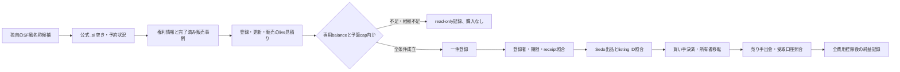

# .si ドメイン再販 Product Loop 設計

状態: 設計承認済み。実装、アカウント作成、登録、出品、購入は未実施。
基準: 2026-10-05時点の origin/main 32370e730c7c021917f80d35454bc5545e189b05。

## 1. 目的と完了条件

Life Managerが、SF作品の雰囲気を持つ独自名称の .si ドメイン候補を調べ、需要・権利・費用の根拠が揃う場合だけ取得し、Sedoで販売し、全費用控除後の実現純益を記録する。収益と呼ぶのは、買い手の支払い、登録者移転、売り手への出金、受取口座の入金が公式readbackで結合し、実際の純益が正となった場合だけとする。

投稿画像の recursive.si 2万ドル売却や100万ドル超の取引は、取引receiptで確認できていない。Dynadotの2026-10-02記事はRecursive.siが同名のAI企業に買われたと報じるが、公開receiptを示していない。これは企業名と一致した取得の報道で、一般的なSF風候補の比較販売ではない。スクリーンショットと同記事は探索仮説の手掛かりに留め、売却確率・取得価格・予算上限の根拠にはしない。Sedoの出品価格や買い手の問い合わせも売上ではない。

## 2. 所有者と既存loopとの境界

新しい Product Loop ID は domain-flip とし、投資収益として product-loop-catalog に登録する。収益クラスは realized_investment。loop-registryには金融domainの money owner を一つ登録し、候補選定から登録、出品、移転、入金照合まで同じownerとdomain専用cursorが所有する。Product Loop Catalogとloop-registryを既存の共通契約で結び、CFOにはdomain別の決済・実費sourceを追加する。Product Loopが現在14件のため、実装時は15件目となる。

この取引は既存 agent-economy-loop に追加しない。同loopのeffect_classはnoneで、共有treasuryの支出認可はBase上の検証済みUSDC収益を根拠にする。法定通貨でのレジストラ決済、Sedo出金、登録者移転は別ownerと別証拠経路を持つ必要がある。ownerの形は既存investmentのmoney ownerとCFO Product Loop契約を参照し、別daemonや汎用marketplace frameworkは作らない。

実装候補は単一の domain-flip-owner job、専用state root、loop-owned effect reconciliationである。cadenceは一日一回の有限passとし、別の常駐browser ownerは追加しない。登録APIが使えずUIが必要な場合だけ、登録済みbrowser identityをleaseして使う。

## 3. 一回のpass

一passで取得する件数は最大一件とし、portfolio total exposureは専用domain budgetが定める上限以下にする。offerの評価や売値の決定はモデルが根拠資料から行い、上限額、見積り、登録receipt、所有権、費用計算、重複防止は決定的なコードが確定する。

## 4. エージェントの判断と決定的な境界

候補のブランド性、技術系企業との関連性、実販売事例との類似性、権利上の危険性、買い手offerの採否をモデルが判断する。コンテキストにはレジストラの現行見積り、公式の空き・予約情報、Sedoの対応TLDと料金、公開販売報告、WIPO Global Brand DatabaseとEUIPO Trademark Search APIの結果を渡し、判断理由と根拠URLを保存する。公的な権利検索が失敗・未認証・未取得なら候補はscout-onlyとする。著名作品・キャラクターの禁止語リストや文字列regexで権利判断を代行しない。

ツールは狭く分ける。registrar adapterは空き状況、登録・更新見積り、登録者・期限readback、holder-transfer結果を返す。Sedo adapterは出品、offer、買い手決済、移転状態、手数料、売り手出金を返す。CFO adapterはconfirmed receiptsとactual costsを読み取る。モデルは根拠に基づく候補と価格を提案し、ツールの完了申告は公式stateで別途確認する。

## 5. 資金、費用、法的境界

Daisはこの目標の購入判断をCodexへ委任した。初回予算は、domain-flip専用として既に割り当てられた事業残高から合計100 EUR相当を上限とする。個人wallet・口座・Upwork用カードからの入金、信用枠、自動補充、二度目の課金は使わない。登録、更新、transfer、必要なFX/決済費を同じcapから引く。1 passの新規取得は最大1件、同時保有は最大4件。事業残高の所有者・通貨・利用可能額を公式readbackできない間はscout-onlyとし、登録しない。売却で確認できた受取純益だけを再投資額として扱う。誤った投資判断では最大100 EUR相当が失われる。

購入前にproviderが表示する最終charge amountと残りcapを照合し、外貨quoteをEURへ換算する場合は専用事業残高の実際のfunding receiptに結合したFX根拠を記録する。一般の参考為替レートだけでは最終chargeの根拠としない。自動補充が無効にできないregistrarは採用しない。事業残高への資金移動はこの計画の実行範囲に含めない。公開listingのためのDNS activationが返金条件を失わせる場合もあるため、返金可能期間は採算計算に含めない。

登録判断にはlive registrar quote、次回更新料、販売手数料・税・出金・為替費用、実測済みmodel/infra costを使う。ユーザーの購入指示を実行可能にするため、同名・同カテゴリの成約例が見つからないことだけで取得を止めず、100 EURの範囲を小規模な投資実験に使う。Dynadotが報じるRecursive.siの取得はTLD全体の関心を示す公開報告として扱い、一般的な価格比較や売却確率には使わない。購入候補は、登録時費用と更新reserveを含めた全cost basisに対して、モデルが提案したSedoの最低受諾価格から実費手数料を引いたconditional netが正になる場合に限る。このconditional netは売却が起きる確率や期待利益を表さない。ドメイン取得費・更新料は資産cost basisとして記録し、購入時に収益へ加えない。

Register.siの公開料金表は、登録業者向け登録・更新費を年10ユーロと掲載しているが、同ページは2022年公表・2023年有効の表で、小売価格は各registrarが決める。購入時はregistrarの当日quoteを正とする。Sedoの料金表では .si はCategory Iで、通常販売の手数料は15%、SedoMLS経由は20%、Category Iの最低販売価格は20ユーロ等。外部成立取引の移転サービスには3%かつ最低60ユーロ等があるため、実際に適用されたfee receiptを採用する。価格条件は変更されるので毎回公式料金をreadbackする。

Register.siの条件では、登録者の合意によりregistrarが新しい登録者へdomainを移転する。registrar変更と登録者変更は別処理である。Sedoのmarketplace購入では買い手が決済し、移転後に新登録者として完全な管理権を得てから売り手へ出金される。この2境界を一つのsale receiptに丸めない。

登録者情報には正確な本人情報を使い、公開WHOISへDais個人の連絡先を自動で出さない。Register.siの現行一般条件§13.2はdomain・holder・technical contactのWHOIS公開を規定し、§13.3では自然人のholderについて公開必須なのはemailのみで、本人が望む場合に他の項目も公開する。§13.4は個人情報に結び付かない機能用emailの利用を認める。購入前に現行条件とdomainごとの実際のWHOIS readbackを確認し、機能用email aliasを設定・受信確認できない場合は登録しない。.siの紛争手続きは商標、著作権、氏名その他の権利と、正当な利益、悪意の要件を扱う。source evidenceを保存し、他者の作品・企業名を利用した高額転売目的の登録をしない。

## 6. state、receipt、重複防止

stateはrelease外のdomain-flip専用rootに置く。候補ごとのappend-only eventは、candidate_id、run_id、owner_id、occurrence_id、release_sha、loaded argv/env、phase、command、exit_code、effect、readback、provider_receipt_id、evidence_refs、error_class、retryable、next_actionを持つ。read-only quoteのようにproviderがreceipt IDを返さない場合は`provider_receipt_id: null`とし、確認済み応答を保存したlocal evidence refを結合する。receipt IDを合成・推測しない。provider responseに含まれるregistrantの氏名、メール、住所、電話、個人account credentialはevent・log・source・chatへ保存せず、status/期限/匿名化handle fingerprintだけを残す。

一候補はdiscovered、evidence-reviewed、eligible、registered、listed、sale-pending、transferred、payout-confirmed、closed-netの順に進む。購入命令送信後にreceipt/readbackが取れない場合はeffect_unknownとして同一候補・同一ownerをfenceし、公式registrar readbackで状態を確定するまで登録を再送しない。Sedo pendingや登録者変更pendingも売上・移転完了扱いしない。

売上netは、実際に受け取った売却代金から登録、更新、Sedo fee、税、出金・為替、model/tool/browser/infra実費を控除する。同一domain、同一sale ID、同一payout IDの二重計上をゼロにする。

## 7. 現在の不足と段階的な起動

調査時点でcredential SSOTにregistrarまたはSedoの既存credentialはなく、完了済み .si 売却の一次資料も確認できていない。DDG HTML検索ではDynadotの記事と市場投稿が見つかったが、いずれも売却receiptではない。Xの「Superintell_」投稿もRecursive.siへのリンクを示すだけで、会社による売買や価格の一次証拠ではない。登録・移転・料金はRegister.si、売却手数料・escrowはSedoの一次資料で確認した。

source実装後も、登録業者API・.si quote・Sedo seller/payout flow・専用事業cap・登録者の公開条件が揃うまでは購入機能を有効化せず、scout-onlyの自然passを許す。no-chargeのAPI accountが必要ならcredential SSOTへ登録し、production endpointのread-only availability/quoteを確認する。購入には専用事業残高の公式readbackが必要で、個人資金の補填はしない。business resultの完了は、自然pass、登録・出品の公式readback、実際の買い手決済、holder移転、seller payout、cost-complete net、replay-zeroで判断し、購入・出品・希望価格だけで完了としない。

## 8. 実装段階の契約

選定registrarの現行API/termsとSedoのseller listing/payout契約を一次資料で確定し、無理に複数provider対応へ広げない。Daisの明示指示により書面レビュー待ちは置かず、この設計からimplementation planを作って続行する。既存runtimeに1つのownerを追加し、product-loop-catalogにもdomain-flipを登録して、CFOの投資収益・actual-cost readbackへ結合する。現在別作業が所有するCFO/registry/SSOTファイルは、そのleaseが終了するまで変更しない。新Product Loop Contract gateとmoney-owner effect reconciliationを通す。

## 9. 根拠

- Register.si registration/transfer rules: https://www.register.si/ and https://www.register.si/splosni-pogoji/
- Register.si registrar tariff: https://www.register.si/cenik-za-registrarje/
- Register.si ADR/rights process: https://www.register.si/en/adr-procedure-guidelines/
- Openprovider API getting started and REST schema: https://developer.openprovider.com/get-started.html and https://developer.openprovider.com/data/swagger.json
- WIPO Global Brand Database API: https://developers.branddb.wipo.int/
- EUIPO Trademark Search API: https://dev.euipo.europa.eu/product/trademark-search_110/api/trademark-search
- Sedo TLD pricing and fees: https://sedo.com/us/what-we-offer/price-list/
- Sedo escrow and ownership transfer: https://sedo.com/us/services/domain-transfer-service/
- Dynadot report on .si registrations and Recursive.si: https://www.dynadot.com/blog/why-si-domains-are-gaining-attention
- Recursive Superintelligence company site: https://www.recursive.com/
- Anthropic, Building Effective Agents: https://www.anthropic.com/engineering/building-effective-agents
- Anthropic, Writing Effective Tools for Agents: https://www.anthropic.com/engineering/writing-tools-for-agents
- Anthropic, Effective Context Engineering for AI Agents: https://www.anthropic.com/engineering/effective-context-engineering-for-ai-agents
- Life Manager source contracts: config/loop-registry.json, apps/life-manager/config/product-loop-catalog.json, runtime/loop, skills/agent-economy/lib/treasury-policy.mjs, docs/superpowers/specs/2026-09-25-life-manager-unified-ssot.md.
