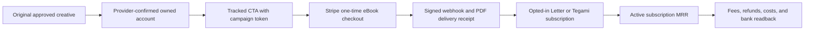

# Anicca eBook Revenue Loop — Design

> この文書は設計参照です。Life Manager の実行順・current cursor・TODO state は docs/superpowers/specs/2026-09-25-life-manager-unified-ssot.md だけを正本にします。

## 目的

既存の The Anicca Reset と自社 Stripe checkout を使い、オリジナル動画から一回購入と継続購読につながる収益 loop を整えます。eBook の一回購入と subscription MRR を分離し、同じ期間の公式 sale/refund/fee/cost/settlement receipt で成果を判定します。

## 現在の根拠（read-only、2026-10-05）

- Daisuke134/anicca-products main に /monk、/achan、Stripe checkout、checkout.session.completed webhook、PDF assets があります。公開ページ表示は EN $10.99、JA ¥1,580 です。ページやコードの存在は購入・売上の証明ではありません。
- /monk と /achan は eBook の一回購入です。/letter $9.99/月、/tegami ¥980/月は別の subscription 商品で、MRR を生む経路です。
- EN の公開 Markdown は49章・4,272語です。ページ表示「各章約150語」と一致しないため、販売拡大前に内容か表示を正します。JA の章ごとの文字数も実物と照合します。
- Life Manager の marketing-engine/ebook_runner.py は receipt 付き render と awaiting_visual_approval の配信 intent を作りますが、Stripe 売上や公開投稿は行いません。
- OpenClaw local jobs.json では monk 関連 cron が無効です。Gateway が切断しているため loaded schedule は未確認です。Life Manager の CFO readback でも eBook の sale/net/settlement は unknown です。
- Provider/registry 上の account status は外部 provider の最新状態と同じとは限りません。公式 account readback を投稿前 gate にします。

## 指標の定義

- MRR は active paid Letter/Tegami subscription の月額 recurring net です。一回の eBook purchase は MRR に含めません。
- $9.99/月で $10,000 gross MRR には1,002 active subscribers が必要です。fees、refunds、cost を引いた net target にはそれ以上必要です。
- $10.99 の eBook 一回購入で月 $10,000 gross には910件の paid orders が必要ですが、これは monthly one-time sales であって MRR ではありません。
- Life Manager の既存 $10,000 target は30日維持の banked net profit です。Capafy seller earnings、eBook gross、subscription MRR、banked net は別 metric のまま保持します。算数は規模の目安で、予測ではありません。

## データフロー

## 要件

1. Public page copy、registry、Stripe Price、locale route、checkout mode、PDF delivery が同じ商品内容を示す。
2. campaign token は post link から checkout metadata と buyer receipt まで保持し、click は paid order に数えない。
3. webhook retry で buyer entitlement や email delivery を二重計上しない。DB write/email failure は成功として隠さない。
4. eBook gross、refund、fee、actual model cost、Letter subscription MRR、payout、bank receipt を分ける。
5. Life Manager の loop registry が配信 schedule と effect fence を所有する。OpenClaw と二重 schedule にしない。
6. Provider が good-standing と確認した owned account のみ投稿に使う。restriction は official appeal/status flow で扱い、別 account で回避しない。
7. effect_unknown の publish/retry は同じ occurrence の official provider readback まで止める。
8. Original/licensed content と required AI disclosures を使い、copy/research claim は public asset と一致させる。

## 一次資料

- checkout/PDF source: Daisuke134/anicca-products main, apps/landing
- 実行順: Life Manager unified SSOT
- [TikTok Integrity and Authenticity](https://www.tiktok.com/community-guidelines/en/integrity-authenticity/)
- [Meta Spam Policy](https://transparency.meta.com/policies/community-standards/spam/)
- [Instagram disabled account help](https://help.instagram.com/366993040048856/)
