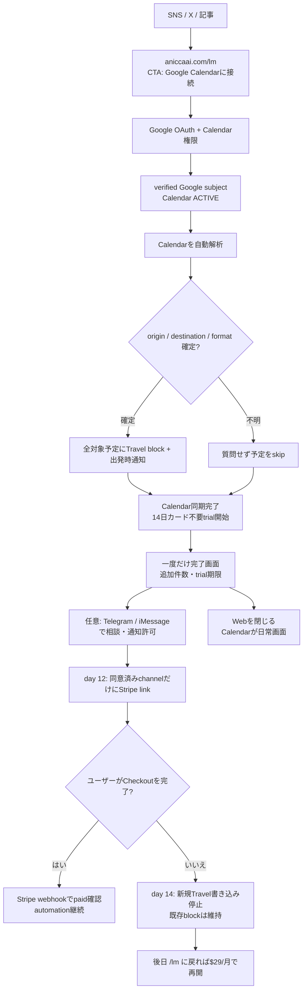

# Life Manager Web-First Travel Product

## Goal

Let a visitor press one button, **Google Calendarに接続**, and have Life Manager create Travel blocks automatically. There is no Life Manager username/password or separate sign-up form. Google must still authorize Calendar access; the UI calls this “connecting Calendar,” not “logging in.” The Web page appears only for connection, a one-time completion result, and optional contact links. Google Calendar is the daily surface. A 14-day cardless trial begins after the first successful initial Calendar scan, including a scan that finds zero eligible events; a failed connection or scan does not start it. The user later chooses whether to subscribe for $29/month.

The Web App Factory is a later phase. It starts only after this product has paid users and verified positive contribution; the first app's acquisition and cost evidence then becomes the factory's first reusable lesson.

## Delivery Status and TODO Authority

The current production cursor, W3-P0 root cause and unblock runbook, and remaining TODO order live in the [canonical Life Manager SSOT](2026-09-25-life-manager-unified-ssot.md). This document remains the Web product behavior/design reference.

## Superseded Contract

The approved 2026-08-26 Cloud On-Time Core contract made a verified Telegram actor the only tenant identity and retired the standalone browser onboarding flow. Dais's current explicit Web-first instruction supersedes that interface and identity choice for new Web users. It does not remove existing Telegram users, change their identity/session, enable phone calls, or weaken the existing Stripe-only paid-state writer.

The new Web identity is a verified Supabase Auth Google user. The Railway server uses Supabase SSR PKCE cookies and calls auth.getUser before accepting a user-scoped request. It derives uid as lm_ plus the verified Supabase user UUID. Client query/body identity, localStorage uid/sig, and Telegram chat IDs never establish Web tenant identity.

## Product Flow

1. The visitor opens `aniccaai.com/lm` and presses **Google Calendarに接続**. This single visible action starts the whole connection flow; no Life Manager credentials are created.
2. If the browser already has a Google session, the user may not need to type a password. Google still asks for Calendar permission. The server verifies the Google subject and binds it to an isolated tenant. The callback automatically continues into Calendar authorization and setup; there is no intermediate Life Manager screen or second connect button. The current source uses Supabase Google OAuth followed by a separate Composio Calendar OAuth, so Google may show more than one consent screen until those grants are unified.
3. After the selected Calendar is confirmed ACTIVE, the shared Travel owner automatically scans upcoming events. It uses a previous physical Calendar event within 90 minutes, then an already-saved starting point. It does not ask for a home address, event format, or current location. It never guesses: events with unknown origin, destination, or online status are skipped unchanged.
4. The owner creates Travel blocks for all eligible upcoming events and sets each event reminder at its calculated departure time. A 15:00 appointment with a 40-minute route and 5-minute buffer gets a 14:15 block and 14:15 reminder.
5. When the initial Calendar scan completes successfully, show one result page with the number of Travel blocks added, the 14-day trial end date, and “no payment due now.” If zero blocks were resolvable, say so plainly; do not ask a question or charge. Offer optional **Telegramで相談** and **iMessageで相談** links, then the user can close the page.
6. The 14-day cardless trial starts after the initial Calendar scan completes, even if it found zero eligible blocks. On day 12, send one subscription reminder only if the user opted into Telegram or iMessage contact. The message opens Stripe Checkout at the existing $29/month price. No card is collected before the user chooses to subscribe, and no automatic charge occurs.
7. If the trial expires without a successful Checkout, stop creating or changing future Travel blocks but leave existing Calendar blocks and reminders in place. If the user chooses no contact channel, show the subscription option when they next open /lm; do not email or access Gmail.
8. Calendar is the only required daily surface. There is no dashboard, event board, Web chat, phone number, or app installation requirement. Pause, disconnect, and subscription management remain available from /lm after Google account verification.

## Shared Implementation and Tenant State

- Keep one Life Manager product and the existing Railway service. Serve the Web app at LM_PANEL_BASE/lm; do not create a second scheduler or a copy of travel logic.
- Reuse lm_users, lm_panel_preferences, the Composio calendar transport, travelUserOnce/fillTravel, route caching, departure calculation, and lm_travel_log idempotency.
- Web-created lm_users rows may have telegram_chat_id null. The existing travel loop already skips Telegram reports when no chat ID exists. Web onboarding explicitly stores call_enabled=false and notifications_enabled=false; Calendar's own event reminder is independent of the Telegram notification switch.
- After Calendar is ACTIVE, the initial authorized run fills all eligible upcoming events without asking event-by-event questions. Resolve origin from a physical previous Calendar event within 90 minutes, then an already-saved starting point. Do not request home address or foreground/background location. Leave events with unknown origin, destination, or online status unchanged.
- Begin the 14-day cardless trial after the initial Calendar scan completes successfully; persist the expiry only after the scan result is known, including a successful scan with zero eligible events. Do not set lm_users.paid or create a Stripe subscription at connection time. Scheduled Web runs require either paid=true from the Stripe webhook or an unexpired trial_expires_at; after expiry, block new Calendar reads/writes for Travel automation while preserving existing blocks.
- When a preference row already exists, preserve its automation choice; reject setup while calendar_disconnect_pending is true. Stripe webhook remains the only writer of lm_users.paid.
- Show the one-time completion page after Calendar sync. Offer optional Telegram and iMessage contact links. Send one trial-ending/subscribe reminder on day 12 only through a channel the user explicitly connects and opts into. The message links to Stripe Checkout at the existing $29/month price. If the user does not opt into either channel, do not email them; show the subscribe option when they return to /lm.
- Do not auto-link a Google account to a Telegram tenant by matching an unverified email. Existing Telegram accounts keep their current session and records; a future explicit link flow can be added from measured user need.
- Calendar account writes remain user-scoped by uid and selected connected_account_id. OAuth status must be ACTIVE before Calendar reads or writes begin.
- Web status reports connected only when the exact selected account is ACTIVE and its provider/account markers are persisted and read back on the Telegram-unbound `lm_users` row. A selected account with exact `MISSING` or `EXPIRED` status is actionable: user-initiated start may recover one unique exact-uid ACTIVE account or begin new OAuth, but never enable that stale account. Network/5xx, ownership, ID mismatch, and contradictory/unknown statuses remain unavailable and fail closed. If a callback consumed OAuth state before marker persistence, a user-initiated Calendar start may recover only one exact-uid ACTIVE account and must persist/read it back before reporting connected.
- A Web-only tenant (Web UUID uid plus `telegram_chat_id IS NULL`) is Travel-only. The legacy `tick`/`organsUserOnce` path skips it before upcoming/history Calendar reads or other non-Travel organs; `travelTick` is its only scheduled Calendar consumer. Existing Telegram tenants keep the legacy organ path.
- Before scheduled Calendar event access for a Web uid, re-read the current user row, require `telegram_chat_id IS NULL`, and verify that the exact selected account is still ACTIVE. Preserve the existing Telegram scheduler path.
- Carry that verified account ID through the Web travel run. Each Calendar transport call must reject if the current NULL-Telegram row no longer selects that exact ID; it must never silently switch to another account mid-run.
- After the Web travel owner confirms the exact account ACTIVE, it re-reads persisted automation and Calendar operation state before entering `fillTravel`. The Calendar transport rechecks that state immediately before Web create/patch dispatch; its control-state reader resolves Supabase URL/key the same way as the bound-account lookup on the normal `getCalendar` path. The browser is not kept open for status or messages; Google Calendar remains the daily surface.

## Travel Calendar Effect

- The departure calculation remains event start minus accepted route duration minus the existing single 5-minute buffer.
- Each Travel helper starts at the calculated departure instant and carries an event-level Calendar reminder at that start time. Use the supported event reminder override rather than inheriting an arbitrary calendar default; read back the created event's reminder. If the Composio create path cannot write/read this override, fix that path before claiming a departure-time alert. Device delivery still depends on the user's Calendar notification settings.
- Every created Travel event explicitly sets send_updates=none, exclude_organizer=true, and create_meeting_room=false. The event has no attendees, no Meet link, and no invitation emails.
- Repeated onboarding or scheduler evaluation relies on the existing unique (uid,event_key,leg) claim. Release it only when no provider write was dispatched or the Composio endpoint explicitly rejects the HTTP request with 4xx; after dispatch, a network/5xx/unreadable response or a 2xx `successful:false` result is effect-unknown. Retain that claim and reconcile through strict Calendar readback. Resolve it only when exactly one event matches the expected summary exactly, `startMs`/`endMs` exactly, and destination after whitespace removal plus lowercasing; if the readback is missing, failed, or ambiguous, keep the claim fenced and do not replay. A readback proves the helper exists but is not a create receipt, so do not report `travel_added` without a confirmed create response.
- Resolve an event destination from Calendar, Places, and the existing event interpreter. Never ask the user a per-event question in Web onboarding. If destination or origin is unresolved, leave the event unchanged until Calendar data is updated. For Calendar blocks generated days ahead, use a nearby previous event location, then an already-saved base. Do not use today's GPS point as the origin for a future event.
- **Location-source decision:** The Web product does not use continuous GPS. Future Calendar blocks use a real previous Calendar event within 90 minutes, then the user's saved starting point. Telegram's Bot API `live_period` is a sharing window (60–86,400 seconds or indefinite), not update cadence; its `Location` has no per-fix timestamp. Our parser substitutes `message.edit_date`/`date`, and the consumer checks expiry without a maximum-age check, so a stale point can still be treated as current. Do not use Telegram live shares as a verified origin or describe them as “real-time.”
- **No-question Calendar origin contract:** Web onboarding never asks for a home address or location permission. Use the previous physical Calendar event and any base already on the tenant. If the origin is not available, skip that event without a guessed block or a question. No new tracker, native companion, or background GPS is planned for V1 or V2.
- **Broader OSS/platform audit:** The W3C Geolocation API exposes `navigator.geolocation` to `Window`, not a Service Worker. The PWA Safari sample calls `getCurrentPosition()` from a page; it is not background tracking. The 2017 Brotkrumen POC itself says the phone must stay awake and the PWA foregrounded. [Cap-go's MPL-2.0 Capacitor plugin](https://github.com/Cap-go/capacitor-background-geolocation) is actively maintained and supports native background updates, but it requires a Capacitor iOS app, Background Location mode, and Always permission; its native POST is for geofence transitions. [Capawesome's Capacitor plugin](https://github.com/capawesome-team/capacitor-plugins/tree/main/packages/background-geolocation) supports queued HTTP uploads but requires a paid license and a native app; force-quit stops uploads until relaunch. [capacitor-community/background-geolocation](https://github.com/capacitor-community/background-geolocation) also requires an installed native app and is less recently maintained. OwnTracks, Traccar Client, and Overland likewise require a phone app; My Tracks is an OwnTracks server under a noncommercial license, so it is not a commercial-service dependency. Apple's Location Push Service Extension can query location on demand using APNs, but requires a native extension, Always authorization, and a server; Apple limits delivery to about 360 location pushes per day and replenishes only one every few minutes. These are not Web-only solutions. Under the no-additional-app requirement, do not leave GPS tracking as a V2 TODO; the product's origin contract is Calendar history plus an already-saved base.

#### Additional GitHub review: no app-free background location

- GitHub CLI search found [Safari Track issue 18](https://github.com/nbarrett/safari-track/issues/18): its iOS PWA lost background GPS when sent to the home screen, so the owner moved it into a Capacitor native shell with native geolocation.
- [GeoTracker-Apple-Automation](https://github.com/makiisthenes/GeoTracker-Apple-Automation) requires users to create location automations manually in Shortcuts and notes that location automations require confirmation. [ShortcutsAPI](https://github.com/gavinsawyer/shortcuts-api) also requires users to configure personal automations in Shortcuts.
- [icloud-location](https://github.com/jimmystridh/icloud-location) is MIT licensed, but its README says Apple's web interfaces are unpublished/unsupported and it requires Apple account login, trusted sessions, and 2FA. [google-maps-location-sharing](https://github.com/davenicoll/google-maps-location-sharing) says Google has no published Maps location-sharing API and uses exported HAR cookies against an internal endpoint. Neither is a safe, stable Calendar-only SaaS integration.
- These findings reinforce the product boundary: no separate location app or background GPS in V1 or V2. Calendar history plus one saved starting point handles events with enough schedule/location data; it cannot know unrecorded physical movement or promise perfect routing.

## Calendar Connect-only Interface

- The public marketing page lives at `aniccaai.com/lm`; its only setup CTA is **Google Calendarに接続** and it hands off to the existing Railway /lm route.
- The CTA starts the Google authorization chain. If the browser already has a Google session, the visitor may not need to type a password; permission to read and write Calendar events is still required. Do not show a separate Life Manager sign-up/password form or call the button “Googleで続ける.” The current implementation has a Supabase Google OAuth step and a separate Composio Calendar OAuth step; automatically chain them after the one click and do not return to an intermediate dashboard.
- The current signed-in Railway app renders `dashboardMarkup`; replace it with a one-time completion page after a successful initial Calendar scan, including the number of Travel blocks added and the 14-day trial end date. If zero blocks were added, say “0件の移動時間を追加しました。対象になる予定が見つかりませんでした” and still show the trial end date; ask no question. If connection or sync fails, show an error and retry action and do not start the trial. Do not show an event board, dashboard, Web chat, or message composer. The user closes the page and uses Google Calendar.
- Do not collect a home/base address or request browser location. Do not ask online/in-person or per-event questions. Resolve all available facts from Calendar/Places and the existing interpreter; silently skip any event whose origin, destination, or format is not reliable.
- The completion page offers optional buttons to contact Life Manager via Telegram or iMessage. These are not required to use the product. A trial-ending reminder is sent only to a channel the user explicitly connects and opts into; do not access the Gmail inbox or send an email by default.
- The local Mac has `imsg` 0.10.0, which reads, watches, and sends through Messages.app, but the Life Manager server has no iMessage adapter or Railway-to-Mac gateway. Personal iMessage can be supported through an opted-in, tenant-bound Mac bridge; it is not a cloud API. Apple's official Messages for Business is a separate option requiring an approved Messaging Service Provider, account registration, experience review, and live-agent support. Do not represent either route as already integrated.
- The browser is used for Calendar authorization and the one-time result page, not for daily status. Google Calendar remains the daily surface. Each Travel block gets an event-level reminder at the calculated start; device delivery still depends on the user's Calendar notification settings.
- Use the appointment's explicit IANA timezone for route/departure calculations; when absent, preserve the existing Calendar/user timezone. The helper's UTC storage timezone must not become a display source.
- Resolve online/in-person status and destinations from Calendar, Places, and the existing event interpreter without asking the user. Leave unresolved events unchanged until Calendar data changes; never show a guessed departure or Travel block. Never request Gmail read scope.
- Each Calendar Travel event has an event-level reminder at its calculated start. Read back this override after creation; if the Composio create path cannot write or read it, fix that path before claiming a departure-time alert. Device delivery still depends on the user's Calendar notification settings. Do not present the browser as a notification channel.
- Keep pause/disconnect fences and exact provider-account readbacks. Resume requires the exact selected Calendar account to be ACTIVE; each candidate event still needs a resolvable origin before a Travel write. Disconnect atomically pauses automation and sets a Web-only disconnect-pending fence before provider I/O. A durable Calendar-enable claim serializes re-enable against disconnect; only its matching UUID may finish or release it. Preserve the existing no-effect/effect-unknown recovery and never enable a stale or ambiguous account. The Web client is connection/checkout handoff only; do not add a dashboard or chat thread.
- Do not add a location-tracking app, mandatory messaging-app onboarding, employee/staff feature, always-on GPS, generic calendar replacement, or factory UI. The no-location-app contract applies to V1 and V2: use Calendar-derived origin or an already-saved base, and skip events whose location remains unknown. Optional Telegram/iMessage contact links do not gate Calendar automation. Do not leave a native location app as a deferred V2 dependency.
- Keep the existing aniccaai.com marketing surface separate from the Railway product route. Its current source is the active `Daisuke134/anicca-products` repo at `apps/landing`; its Netlify config uses that directory as the build base and `Netlify Deploy (Landing)` watches its `apps/landing/**` path. The `apps/landing` subset in this Life Manager repo is used for backend contract tests and has diverged from the live source; do not edit it as a substitute for the public route. After Calendar connection, first Travel block, price terms, and cost are read back, update the anicca-products source and verify the Netlify deploy and public route handoff to the exact Railway `/lm` origin.

### UI/UX仕様の明確化（2026-10-07 最新方針）

**製品の毎日の画面はGoogle Calendar。** Webには接続と一度だけの完了画面だけを置き、ダッシュボード、予定一覧、Webチャット、登録質問を置かない。初回Calendar同期の成功後から14日間、カード不要で使える。同期が成功すれば対象予定が0件でもtrialは始まり、同期自体が失敗した場合は始まらない。Travel blockの開始時刻にCalendar通知を設定し、端末への配信は利用者のCalendar通知設定に従う。

| 段階 | UIと操作 |
|---|---|
| 1. 集客ページ | aniccaai.com/lm にCalendarの前後比較デモと「Google Calendarに接続」CTAを表示。「14日無料・カード不要。その後は希望する人だけ$29/月」と明記する。 |
| 2. 接続 | 1つのCTAからGoogle認可へ進む。既存Google sessionがあればパスワード入力を省ける場合がある。Calendar権限は許可が必要だが、Life Managerのアカウント作成・パスワード・中間画面はない。認証callback後はCalendar接続を自動開始する。 |
| 3. 自動処理 | ACTIVE読み戻し後、Calendarを自動解析し、直前の物理予定（90分以内）または既存baseから出発地を判断する。質問・住所入力・位置許可は求めない。判定できる予定はTravel blockと開始時刻通知を追加し、origin/destination/online状態が不明なら予定を変更せずskipする。15:00の予定、40分移動、5分bufferなら14:15からblockと通知を設定する。 |
| 4. 完了画面 | 初回Calendar同期の成功後、「Calendar接続完了。Travel blockをN件追加。14日間無料、カード登録なし。自動課金なし」と期限を一度だけ表示する。N=0なら「対象になる予定が見つからず、0件追加しました」と伝え、期限も表示する。接続・同期失敗時はエラーと再試行だけを表示し、trialを開始しない。補助リンク「Telegramで相談」「iMessageで相談」は任意。 |
| 5. Trial中 | 初回Calendar同期完了時点で14日trialを開始する。接続または同期が失敗した時はtrialを始めない。day 12の購読案内は、利用者が連絡先として選び通知を許可したTelegram/iMessageにだけ1回送る。Gmail受信箱へのアクセス・メール送信はしない。 |
| 6. Trial後 | 14日後に有料subscriptionが確認できなければ、新しいTravel block作成・更新を止める。既存Calendar blockと通知は残す。選んだ連絡先のStripeリンク、または後日 /lm に戻った画面から$29/月に登録できる。自動請求はしない。 |

**最小画面遷移**

### No-extra-app location contract

- New Web users do not need Telegram or iMessage to use Calendar automation. After the one-time completion page, they may optionally start support through either channel. Existing Telegram tenants keep their legacy transport; neither Telegram nor iMessage is a location source.
- Future Travel blocks use a physical previous Calendar event ending within 90 minutes, then a starting point already stored on that tenant. Web onboarding never asks for a home address, location permission, or per-event clarification. If origin or destination is unknown, skip the event unchanged.
- Do not use Telegram live location as a verified origin. `live_period` is a sharing window, not an update cadence; Bot API `Location` has no fix timestamp. The parser uses `edit_date || date`, `getLiveLocation` checks expiry, and `freshLive` has no max-age gate, so a stale point can remain eligible. Existing legacy Telegram location handling must fail closed for routing until WB-09 changes it.
- **Broader OSS/platform search:** The W3C Geolocation API exposes `navigator.geolocation` to `Window`, not a Service Worker. The 2024 iOS Safari sample only calls `getCurrentPosition()` from a page. The 2017 Brotkrumen POC says its phone must stay awake and the PWA foregrounded. These do not provide location after a Web page closes ([W3C API](https://www.w3.org/TR/geolocation/#geolocation-interface), [Safari sample](https://github.com/JoeM-RP/serviceworker-safari), [Brotkrumen POC](https://github.com/RichardMaher/Brotkrumen)).
- Native GitHub options all require an installed Life Manager app shell and OS permission: Cap-go's MPL-2.0 Capacitor plugin is free and active but needs an iOS Capacitor app, Background Location mode, and Always permission; Capawesome offers a local queue and HTTP retries but requires a paid license and a native app; capacitor-community's plugin is older and also native-only. Transistorsoft requires a release license; `dc-bgeo`'s Swift façade wraps a closed-source engine. OwnTracks, Traccar Client, and Overland are separate phone apps; My Tracks is a server for OwnTracks under a noncommercial license, so it cannot be used as this commercial service without separate permission.
- Apple’s Location Push Service Extension can query a location on demand when an app is not running, but requires a native app extension, APNs server integration, and Always authorization. Apple limits these requests to about 360 per device per day and replenishes roughly one every few minutes; it is not a web capability ([Apple LPSE docs](https://developer.apple.com/documentation/corelocation/creating-a-location-push-service-extension), [APNs demo](https://github.com/transistorsoft/location-push-service-demo)).
- **Product decision:** no location tracker, native companion, or background-GPS phase is planned for this no-extra-app Cloud product in V1 or V2. Do not promise live location or perfect routing. The route origin comes from Calendar history and one saved starting point; an event without enough information remains unchanged.
- **Privacy:** Web onboarding requests no location permission and stores no browser GPS. Do not request Always/background permission or silently track.

**Staffの意味:** 過去案のstaffは従業員/チーム招待機能を指す。Travel v1にはスタッフ欄・招待UI・チーム料金を含めない。

## Price, Marketing, and Profit

- **公開offerのreadback（2026-10-07）:** `https://aniccaai.com/lm` は「Calendar × Telegram」と表示し、主要CTAをTelegramへ送り、$29/月を掲示する。Telegramのルート通知と任意の電話を説明しており、目標のbrowser-first signupと一致していない。
- **Stripe catalogのreadback（2026-10-07）:** 確認対象のlive `Anicca Life Manager`商品にはpriceが2件（active $29/月と$20/月、inactive priceは0件）。この2 priceには全statusでsubscriptionがなく、確認対象商品のrecurring MRRは$0。2026-10-06の前回official readbackではStripe `trial_period_days`が空で、Web setupはapp entitlementを3日で開始する。Stripe checkoutとapp trialの条件が一致する証拠はまだない。
- **Life Manager全体の利用料推定（2026-09-07 01:21 UTC〜2026-10-07 01:21 UTC）:** append-onlyの`lm_api_cost`台帳はprovider利用料推定$68.786544、その他の推定$0.306765、30日合計$69.093309（約$2.30/日）を記録する。Life Managerの6 tenant分であり、Web customer分ではない。provider利用48,524件のうち3件は推定額なし。この集計は請求書、Web別原価、顧客あたり平均ではない。Composio、hosting、Stripe fee/refund/settlement、marketing費は含まれない。
- **価格決定:** 公開offerと現行Stripe checkoutの**$29/月を維持する**。以前の$5/月・$36/年案は競合価格から出した私の余計な提案として撤回する。既存catalogにある$20/月priceは現行公開page/Payment Linkで使わず、Stripe catalogの価格も増減しない。競合価格はpositioning比較にだけ使い、値下げ根拠にしない。
- $29/月で$10,000 gross MRRを超えるには**345人のactive paid subscribers**（$10,005 gross MRR）が必要。これはfee/cost控除前であり、net profitの達成数ではない。1%/3%/5%のvisit-to-paid conversionは計画用の仮定で、それぞれ34,500/11,500/6,900 qualified landing visitsが必要になる。実際のconversionは未計測なので、source attributionとpaid invoiceから実績を計測して仮定を更新する。これらの仮定はforecast扱いしない。net contribution $10,000に必要な人数はWeb別変動費、refund、payment fee、hosting、CACを測るまで不明。
- **Marketing状態（2026-10-07 readback）:** `/en`はLife Manager全体のumbrellaページ、`/lm`はTravel専用ページだが、後者のCTAはまだTelegramを指す。`/socials`は現在`loading…`を返す。`/dashboard.json`は2026-06-05更新、social snapshotは2026-06-04で古く、表示された$548支出はClaude/ChatGPT/living/Apify/Postiz等を含む混合合計でLife Manager marketing費ではない。`@anicca.ai`のpublic profile fetchは「Profile isn't available」を返したが、これはbanの証明ではない。現在のInstagram statusとLife Manager marketing spendはunknown。公式accountのstatusを確かめるまでは新規アカウントを作らない。
- **初期marketing:** 訴求は「CalendarとMapsを何度も確認しなくていい。移動時間と出発時刻がCalendarに入る」。本人の毎日の苦痛（見落としが怖くて予定と地図を何度も確認する）を、ユーザー由来のfounder storyとして記事と短尺動画の核にする。初期audienceは対面予定が定期的にあるconsultant/freelancer/field salesの仮説。最新の運用目標は**Xに毎時1件の独自投稿（24件/日）、9:16 demo 2本/日をReels/TikTok/Shortsへplatform-native captionで展開、役立つowned-media記事1本/日**。毎時topic/feedbackを採取し、投稿文は重複させない。これはユーザーが指定した高頻度の初期実験であり、未計測の勝ちパターンとは言わない。Xはbulk/duplicate/irrelevant spamを禁じる [公式policy](https://help.x.com/en/rules-and-policies/platform-manipulation)。SEO記事も、検索順位操作を目的とした薄い大量生成を避け、利用者に固有の助けを足す [Google Search spam policy](https://developers.google.com/search/docs/essentials/spam-policies#scaled-content)。demoでは合成Calendar dataを使い、実予定名・住所・通話音声は公開しない。source→Calendar ACTIVE→初回Travel block→Stripe checkout→paid invoice→D7/D30 retentionを計測する。現在のmarketing spendとpaid CACは未確認。signup・checkout・attributionとorganic基準値をreadbackした後、明示spend cap内で小さく広告CACを測り、継続率とsettled contributionが成立するまで拡大しない。
- **既存marketing資産/loopのreadback（2026-10-07）:** canonical sourceに日次動画generator `skills/video/daily-lm-video`、Postiz向け `skills/video/lm-distribution`、日次measurement `skills/video/lm-self-improve` はあるが、いずれも`config/loop-registry.json`にLife Manager content/publish ownerとして登録されていない。Marketing Engineのproduct registryにもLife Manager packはない。`life-manager-selfbuild`は4時間ごとのbuild loop（10/07 04:28Z pass、effect none）で販売loopではない。`lm-recording-store`は30分ごとの録音保存loopで、10/07 05:46Zの最新readbackは`resource_capacity_busy`によるadmission defer、直前の成功は05:16Z。既存の`content-reels-life-manager.md`はTelegram CTA・$20/月・電話中心で現行$29/Web-firstと不一致。Remotion素材skills/video/lm-assetsは4.0.533へ更新し、Travel-firstの合成Calendar demo v1を生成済み。未公開のdraftは/Users/anicca/.local/share/life-manager/marketing-drafts/20261007-lm-calendar-connect-v1.mp4。WB-15でTravel専用creative bank、Remotion版上げ・再制作、X/Reels/TikTok/Shorts/owned-article配信、投稿receipt→conversion学習を一つの販売loopへ接続する。旧録音素材は公開せず、Travel体験を合成Calendar dataで作る。
### Marketing実行計画

- **位置づけ:** “Life Manager automatically puts travel time into Google Calendar before you forget to leave.” 日本語では「出発時刻を気にしてCalendarとMapsを何度も確認しなくていい」。絶対に遅刻しないとは約束せず、予定に必要な移動時間を自動で確保し、出発時刻に知らせることを約束する。
- **最初に狙う人（仮説）:** 対面の顧客訪問や予約が週に複数回あるコンサルタント、営業、フリーランス、現場サービス職。ICPはcheckout数と継続率で検証し、職種別の反応を印象だけで確定しない。
- **コンテンツ柱:** (1) Daisの「遅れないか不安で予定と地図を繰り返し見る」実体験、(2) 15:00の予定・移動40分・5分余裕→14:15 Travel blockという画面demo、(3) Calendarへ移動時間を足す手順と出発時刻の考え方、(4) Google権限・プライバシー・14日trial・課金タイミングへの短い回答。利用者の声や成績は、本人同意と計測がある時だけ使う。
- **投稿cadence（user-directed experiment）:**

| Channel | 毎日の出力 | 内容とCTA |
|---|---:|---|
| X | 1時間に独自投稿1件、24件/日 | 痛みの一言、tips、FAQ、異なるdemo切り口を回す。各投稿は`/lm`へ固有UTMを付ける。重複文、無関係なtrending topic、同じ投稿の複数account再掲、未承諾DMは使わない。 |
| Instagram Reels / TikTok / YouTube Shorts | 9:16 master video 2本/日 | 同じ製品画面を使ってもhook・caption・編集を各platform向けに変える。合成Calendar dataを使い、予定名・住所・個人画面を出さない。 |
| Owned media / SEO | 実用記事1本/日 | 一つの検索意図に答える独自記事。薄い言い換え記事を量産しない。各記事から該当するdemoとCalendar接続CTAへつなぐ。 |

- **毎日の改善loop:** sourceとUTMごとに、landing visit→Connect押下→Google認可完了→Calendar ACTIVE→initial sync success（追加件数を含む）→14日trial開始→first Travel block（別の価値指標）→連絡先opt-in→day-12通知→Stripe Checkout→paid invoice→D30 retentionを計測する。同期成功後に対象予定が0件だった利用者も別集計し、前日の結果を次のhook・画面demo・記事テーマへ反映する。投稿数だけを成果にしない。
- **予算:** 現在のLife Manager marketing spendと顧客別CACは不明。14日cardless trial、OAuth、first block、Stripe attributionの計測がそろうまでは有料広告の平均支出を作らない。organic結果からpaid CACとtrial-to-paidを測り、返金・Stripe fee・route/provider・Composio・hostingを差し引いた貢献利益で広告上限を決める。
- **素材:** 既存のCalendar画面・スクリーンショット・Remotion資産を再利用し、14日trial/no-card/optional supportの現行UXに合わせて更新する。下書きdemoは合成Calendar dataのままpreviewし、実際のCTA・認可・trial期限・課金が一致するまでは公開しない。
- **チャネル規則:** Xはautomated duplicate/substantially similar postを禁じ、Googleは検索順位操作を目的としたscaled contentをspam扱いする。高頻度は維持しながら毎回別の有用情報にする。投稿・アカウント操作は登録済みCloakBrowser直接CDP経路を使い、未確認のInstagram banや利用不可を理由に新規accountを作らない。

- Reuse existing product marketing copy and the shared marketing engine's content-manifest idea. Do not activate its private Instagram automation route; actual account operation must use the registered CloakBrowser direct-CDP route.
- gross MRRと月次contributionを分けて報告する。contributionの基準はpaid invoice/chargeの控除前金額とし、refundとStripe feeを一度だけ控除する。payout/settlementはnet receiptとの照合に使い、そこからrefund/feeを再控除しない。その後、同じ期間のroute/provider・Composio・hosting・attributed marketing spendを控除する。repo内のfounder申告historical revenueをこの商品のprofit証拠に使わない。

### Market research and content preparation (2026-10-06)

**根拠（2026-10-07再確認）。** [AddTravelTime](https://www.addtraveltime.com/) はGoogle Calendarへ移動blockを自動追加し、$5/月・$36/年、14日・カード不要trialを表示する。[DOFOTTの料金](https://dofott.com/pricing) は場所付き予定を月12件まで無料とし、超過月は$5+税、年額は$36+税。Product Hunt経由なら2026-10-31まで初年度$18+税で、登録時にカードを保持する。[TravelSyncの料金](https://www.travelsync.co.uk/pricing) は14日・カード不要trial。TravelSyncは£5/月または£50/年で、移動block・mileage記録/export・travel block通知を含む。TravelSync Proは£8/月または£80/年で、メール不在返信・出発前live-traffic warning・出発時のleave-now email・朝のbriefingを追加する。どちらもGoogleまたはMicrosoft calendarに対応する。時間節約の数値はvendor claimで独立検証していない。[Morgenのtravel workflow guide](https://www.morgen.so/guides/auto-schedule-travel-time) はGoogle、Outlook、iCloud、Fastmailのcalendar、出発地、移動手段、往復、bufferを扱う。これらは機能・価格帯の比較材料であり、競合の売上や利益の証明ではない。

**How close products present onboarding and price:**

| Product | First-use flow | Price/trial presentation | Pattern to borrow |
|---|---|---|---|
| [AddTravelTime](https://www.addtraveltime.com/) | Connect calendar, then set one starting address and travel mode. | Monthly/yearly selector; 14 days free with no card, then $5/month or $36/year. | Put the connection CTA and trial terms near the product demo; its one-time address question reduces ambiguity. Life Manager follows the no-question direction and skips unresolved trips. |
| [TravelSync](https://www.travelsync.co.uk/pricing) | Connect Google or Microsoft calendar; configure home/office travel origins. | Two side-by-side plan choices plus a feature comparison table; 14-day no-card Pro trial, then £5/£50 or £8/£80 monthly/yearly. | Show what each tier adds and which features the trial unlocks before checkout. |
| [DOFOTT](https://dofott.com/pricing) | Connect calendar and use the automatic blocks. | Two plan cards: up to 12 location events/month free, then $5 + tax only in months above the limit, or $36 + tax yearly; explains the charge trigger. Signup keeps a card on file. | Make usage thresholds, charge timing, tax, and cancellation consequences explicit. |
| [Basecamp / 37signals](https://basecamp.com/pricing) | Choose a free one-project plan or select a paid plan to start a trial. The company says it has had 27 profitable years. | Several plan cards organized by project/storage/user limits; paid plans include a 30-day no-card trial (45 days for Unlimited). Card details are requested only if the customer chooses to continue after trial; no automatic charge. | State exactly what ends with the trial, how to continue, and how to cancel. The profitability statement is the company's own claim, not independently audited. |
| **Life Manager target** | One Calendar CTA; auto-sync, auto-fill, one completion page. | One price card: first 14 days $0, no card and no automatic charge; after that, continue only if the user chooses the existing $29/month Checkout. | One offer means one card, not a multi-column comparison table. State trial start/end, post-trial behavior, and the exact price near the CTA; deliver Calendar value before Checkout. |

The direct travel-calendar competitors' profitability is not publicly verified by these pages. 37signals publicly says it has operated profitably for 27 years, but that statement is self-reported. These examples show offer and onboarding design, not a causal proof that a particular trial or pricing table made a company profitable. The exact Life Manager price stays $29/month; the lower direct-competitor prices make it important to demonstrate the automatic Calendar result and explain the broader value before asking for payment.

**Trial recommendation (research plus product fit):** [ChartMogul's 2026 report](https://chartmogul.com/reports/saas-conversion-report/) analyzes survey responses from 200 software products: 14 days is the most common trial length (62%); 80% of trial products do not require a card at signup; and card-required trials report higher conversion among trial starters. The report also warns that card requirements reduce signup and that overall conversion depends on the whole funnel. Direct travel-calendar competitors use 14-day no-card trials or an event allowance before charging. Start a 14-day no-card trial after a successful initial Calendar scan, even if it creates zero blocks; do not start it if OAuth or the scan fails. This matches the user's no-upfront-checkout constraint but needs zero-eligible-event conversion tracking. Send one day-12 reminder only if the user opted into Telegram or iMessage. Ask the user to initiate Stripe Checkout after the trial; do not auto-charge. The benchmark is directional, not proof that this specific $29 offer will convert.

**Life Manager price-card decision:** Keep the existing $29/month offer and show one compact card near the landing CTA: “14日間無料 · カード不要 · 自動課金なし”; beneath it, “続ける場合は14日後から$29/月。利用者がCheckoutを選ぶまで請求しません。” Include one CTA, “Google Calendarに接続.” Do not show the unused $20 price, annual pricing, feature tiers, or a comparison grid. The $29 amount and post-trial behavior must match the live Stripe Checkout before publishing.

**Trial reminder and channel:** At completion, show an optional Telegram button and an optional iMessage button. A user who links one channel and opts in gets one reminder on day 12 with a Stripe Checkout link. There is no Gmail inbox access or email fallback in this flow. A user who selects neither receives no proactive message; the completion screen states the expiry date and that automation will stop, and the subscription option appears again if they return to /lm. At day 14, an unpaid tenant stops receiving new Travel writes; already-created Travel blocks remain.

Qualitative pain evidence is consistent but anecdotal. In a [2024 r/productivity thread](https://www.reddit.com/r/productivity/comments/1akzy5j/calendar_management_how_do_you_factor_in_travel/), a user describes forgetting travel time while scheduling a second appointment before a distant appointment. In a [2019 r/shortcuts request](https://www.reddit.com/r/shortcuts/comments/fsybqg/automatically_add_travel_time_from_google_maps/), a user describes manually moving from a Calendar event to Google Maps and back to create a separate travel event. A [Google Calendar Help Community question](https://support.google.com/calendar/thread/254623733/set-time-to-leave-for-calendar-events?hl=en) asks for a time-to-leave notification; a community expert's answer describes a manual Maps-to-Calendar path. That page is community content, not a current product contract, so verify Google's UI before publishing a how-to claim.

**Inference.** The strongest message is the mental load of repeatedly checking Calendar and Maps because the user is afraid of missing an event. The first audience to test is people with recurring in-person appointments and client meetings; this is a fit hypothesis, not a validated ICP. Promise that Life Manager automatically reserves travel time and puts the departure block in Calendar; do not guarantee that a person will never be late or never miss a flight.

**Search candidates.** These 50 English query candidates are grouped by intent, based on observed result phrasing plus close variants. Search-volume data and Google Search Console evidence are unavailable; do not present these phrases as traffic forecasts. Prioritize by product fit and intent until post-launch impressions and conversion data exist.

| Cluster | Intent | Candidate queries | Priority |
|---|---|---|---|
| Automatic travel blocks | Commercial / transactional | automatically add travel time to Google Calendar; Google Calendar automatic travel time; automatic travel blocks for Google Calendar; Google Calendar travel time app; travel time blocker for calendar; calendar app automatically adds drive time; Google Maps travel time calendar integration; Google Calendar travel block app; automatic commute blocks calendar; travel time automation for appointments | 1 |
| Google Calendar how-to | Informational | how to add travel time to Google Calendar; how to add travel time to a Google Calendar event; add driving time to Google Calendar; add a travel event from Google Maps to Calendar; how to block travel between calendar events; set time to leave for calendar events; add buffer before Google Calendar appointments; calculate travel time between appointments; automatically add travel time to recurring events; Google Calendar travel time desktop | 1 |
| Late-arrival problem | Informational | calendar reminder too late to leave; forget travel time when scheduling appointments; avoid being late to appointments; calendar keeps booking over commute time; Google Calendar does not account for commute; meetings back to back travel time; how early to leave for an appointment; stop being late to client meetings; calendar schedule travel time for appointment; travel time gap between meetings | 2 |
| Product comparisons | Commercial | best Google Calendar travel time app; travel time apps for Google Calendar comparison; AddTravelTime alternative; DOFOTT alternative; TravelSync alternative; AddTravelTime vs DOFOTT; Google Calendar vs Apple Calendar travel time; Google Maps calendar travel-time automation; best calendar app with travel time; calendar departure alert vs travel block | 3, after price/cost proof |
| In-person professional use | Commercial / informational | travel time calendar for consultants; calendar travel blocks for field sales; automatic drive time for client visits; travel time planning app for contractors; appointment calendar for service businesses; Google Calendar travel time for freelancers; travel blocks for on-site meetings; route planner that syncs with calendar; prevent overlapping client appointments and travel; calendar travel time for personal appointments | 3, validate ICP |

**First content queue (latest user-directed high-volume experiment).** Publish one original X post every hour (24/day), two distinct 9:16 calendar demos each day cross-posted to Reels, TikTok, and Shorts with platform-native captions, and one useful owned-media article each day. Run hourly topic/feedback collection and refresh drafts between posts. Do not repeat the same copy or flood each account with identical cross-posts. This is the requested launch experiment, not a claim that the cadence is a platform-wide best practice. X prohibits bulk, duplicative, irrelevant, or unsolicited spam; Google Search prohibits scaled pages created mainly to manipulate rankings without helping readers ([X policy](https://help.x.com/en/rules-and-policies/platform-manipulation), [Google policy](https://developers.google.com/search/docs/essentials/spam-policies#scaled-content)).

Start with three article angles: (1) a first-person founder story about the stress of checking Calendar and Maps repeatedly, (2) “How to add travel time to Google Calendar”, using the current Google UI, and (3) “Why an event reminder can arrive on time and still be too late to leave”. Use synthetic event data or anonymized existing screens; do not publish raw private event titles, addresses, or call recordings. Replace stale scripts that say Telegram-only or $20/month before distribution.

Draft X hooks, for internal review only:

- “A calendar reminder can arrive on time and still be too late. The missing block is the trip before the appointment.”
- “An empty 2:30 slot is not free time if the next meeting is across town. The trip needs to be reserved before someone books over it.”
- “I used to check Calendar, then Maps, then Calendar again because I was scared of missing the moment to leave. Life Manager puts the trip into Calendar for me.”
- “Connect Google Calendar once. Life Manager fills eligible travel blocks automatically; your Calendar stays the screen you already use.”

Draft Remotion demos use synthetic Calendar events: show one “Google Calendarに接続” click, Google consent, automatic Calendar filling, then the one-time completion page with the number of blocks, 14-day cardless trial end date, and optional Telegram/iMessage contact links. Do not show a home-address question, event questionnaire, upfront checkout, daily dashboard, or Web chat. Show the one $29/month price card and state that the user must choose Checkout after the trial. Show a previous in-person event ending at 14:00 in Roppongi as the origin, then a 15:00 Shibuya meeting 40 minutes away; with the 5-minute buffer, the helper starts at 14:15 and gets a 14:15 reminder. Keep publication closed until the actual authorization, initial sync, trial expiry, reminder, opt-in contact, and $29 Checkout paths are read back. Measure the whole funnel by channel/source through D30 retention.

## Factory Gate

Do not implement app-generation automation yet. Start a separate Web App Factory design only after Life Manager has at least 10 paying Web customers and three consecutive months of positive contribution with actual costs. Then reuse the mobile loop's product lifecycle, shared marketing evidence, and Life Manager's reviewed Self-Build promotion boundary. The factory must take customer and cost evidence as inputs and emit one independently measurable Web product at a time.

## Acceptance Criteria

1. A fresh browser opens the hosted Railway /lm route and starts with one visible action, “Google Calendarに接続”. Google account selection and consent happen as part of Calendar connection; no separate Life Manager password/account form or Telegram install is required.
2. The server verifies the Supabase user, derives uid from the verified subject, and refuses cross-tenant requests and client-supplied uid/chat_id/paid values.
3. Calendar connection is bound to that uid; persisted exact ACTIVE account readback precedes any event access, including scheduler runs. Web-only tenants never enter legacy non-Travel organ/calendar-history reads; scheduled Calendar access uses the exact-bound Travel owner. Interrupted callback completion can recover through a user-initiated start only when the exact-uid ACTIVE account is unique. Exact MISSING/EXPIRED selections lead to unique ACTIVE recovery or new OAuth without re-enabling the stale account; provider/network ambiguity stays fail-closed.
4. No second app, home-address field, browser-location permission, or event-question UI is required at onboarding. Use an eligible previous Calendar event or an already-saved base for origin. If any required event fact is unknown, skip that event unchanged and do not guess.
5. After exact ACTIVE Calendar readback, the first shared-owner run creates every eligible Travel helper and its departure-time reminder. A successful initial Calendar scan starts a 14-day no-card trial even when zero helpers are created; an OAuth or scan failure does not. Show one completion page with the number of blocks added and trial end date after success. No checkout or payment details are requested on this page. Replays do not create duplicates.
6. New Travel events send no attendee emails, add no organizer attendee, and request no Meet link. Each Travel event has an event-level reminder at its calculated start time, read back after creation; device notification delivery remains subject to the user's Calendar settings.
7. No dashboard, event board, or Web chat is shown after onboarding. Telegram and iMessage appear only as optional contact links on the one-time completion page. Trial-expiry reminders require explicit channel linking and consent; no email or Gmail inbox access is required.
8. Pause/resume/disconnect controls retain the verified Web identity and CSRF fence. Resume requires exact ACTIVE Calendar binding; disconnect pauses, changes only the selected provider account, and clears its binding only after exact owner/toolkit/account-ID disabled readback. A UUID-owned, leased Calendar claim prevents reconnect/disconnect overlap; preserve exact-state/no-effect recovery and never replay an uncertain provider write. Origin absence is an event-level skip, not a reason to fabricate a base.
9. Repeat onboarding, OAuth callback, and scheduler replay produce no duplicate Calendar helper. Unknown create outcomes retain the claim and require strict readback before any resolution. Existing Telegram auth, call consent, and existing-user behavior pass their current contracts.
10. The 14-day app-level trial requires no card and creates no Stripe subscription. At expiry, an unpaid Web tenant receives no automatic charge and no further Travel writes; existing Calendar blocks remain. A user-initiated $29/month Stripe Checkout is the only path to paid status, and the existing webhook is the only writer of that status.
11. Railway deploy SHA, fresh browser signup, Calendar ACTIVE account, created Travel event, replay-zero, Stripe invoice/renewal, and actual cost readback are reported separately.
12. The Web App Factory remains unimplemented until its paid-user and positive-contribution gate is met.
13. Every scheduled Web travel run checks paid status or an unexpired trial. Expired unpaid tenants cannot create or update Travel blocks, even if Calendar remains ACTIVE and daily automation is enabled.

## Current External Documentation

- Supabase SSR PKCE, server cookies, and verified getUser: https://github.com/supabase/ssr/blob/main/README.md
- Composio Google Calendar account and event input contract: https://docs.composio.dev/toolkits/googlecalendar
- Composio tool execution response and error-code contract: https://docs.composio.dev/reference/errors and https://docs.composio.dev/reference/api-reference/tools/postToolsExecuteByToolSlug
- Google Calendar OAuth scopes: https://developers.google.com/workspace/calendar/api/auth
- Google OAuth web-server flow and consent: https://developers.google.com/identity/protocols/oauth2/web-server
- X automation rules: https://help.x.com/en/rules-and-policies/x-automation
- Google Search scaled-content spam policy: https://developers.google.com/search/docs/essentials/spam-policies#scaled-content
- Google Calendar default reminders and overrides: https://developers.google.com/workspace/calendar/api/concepts/reminders
- Google Calendar event-level reminders field: https://developers.google.com/workspace/calendar/api/v3/reference/events
- ChartMogul 2026 trial/conversion survey: https://chartmogul.com/reports/saas-conversion-report/
- 37signals profitability statement: https://basecamp.com/guides/why-we-choose-profit
- Basecamp current trial and pricing presentation: https://basecamp.com/pricing
- Paddle cardless-trial workflow: https://developer.paddle.com/build/trials/cardless-trials/
- Telegram Bot API location and request-location buttons: https://core.telegram.org/bots/api#location and https://core.telegram.org/bots/api#keyboardbutton
- Apple Core Location authorization and background updates: https://developer.apple.com/documentation/corelocation/requesting-authorization-to-use-location-services and https://developer.apple.com/documentation/corelocation/handling-location-updates-in-the-background
- Apple Location Push Service Extension requirements and limits: https://developer.apple.com/documentation/corelocation/creating-a-location-push-service-extension
- W3C Geolocation API (Geolocation is exposed to Window): https://www.w3.org/TR/geolocation/#geolocation-interface
- W3C Service Worker geolocation request: https://github.com/w3c/ServiceWorker/issues/745
- PWA examples reviewed: https://github.com/JoeM-RP/serviceworker-safari and https://github.com/RichardMaher/Brotkrumen
- Further GitHub repositories reviewed: https://github.com/nbarrett/safari-track/issues/18, https://github.com/makiisthenes/GeoTracker-Apple-Automation, https://github.com/gavinsawyer/shortcuts-api, https://github.com/jimmystridh/icloud-location, and https://github.com/davenicoll/google-maps-location-sharing
- Native Capacitor clients reviewed: https://github.com/Cap-go/capacitor-background-geolocation, https://github.com/capacitor-community/background-geolocation, and https://github.com/capawesome-team/capacitor-plugins/tree/main/packages/background-geolocation
- OwnTracks server requiring the mobile app (PolyForm Noncommercial): https://github.com/the-hcma/my-tracks
- APNs Location Push Service demonstration: https://github.com/transistorsoft/location-push-service-demo
- OwnTracks iOS reporting behavior and fix timestamps: https://owntracks.org/booklet/features/ios/ and https://owntracks.org/booklet/tech/json/
- OwnTracks iOS client (MIT): https://github.com/owntracks/ios
- Traccar Client background tracker: https://github.com/traccar/traccar-client and https://www.traccar.org/client/
- Overland iOS GPS logger (Apache-2.0): https://github.com/aaronpk/Overland-iOS
- OSS Mac iMessage bridge used by the local host: https://github.com/openclaw/imsg
- Apple Messages for Business official-channel requirements (distinct from the local imsg bridge): https://register.apple.com/resources/messages/messaging-documentation/ and https://register.apple.com/resources/messages/messaging-documentation/policies
- Official Remotion documentation: https://www.remotion.dev/docs
- Direct category pricing reference: https://www.addtraveltime.com/
- Supabase Auth redirect URL allowlist: https://supabase.com/docs/guides/auth/redirect-urls
- Supabase Google OAuth provider setup and callback: https://supabase.com/docs/guides/auth/social-login/auth-google
- Supabase CLI db push: https://supabase.com/docs/reference/cli/usage#supabase-db-push
