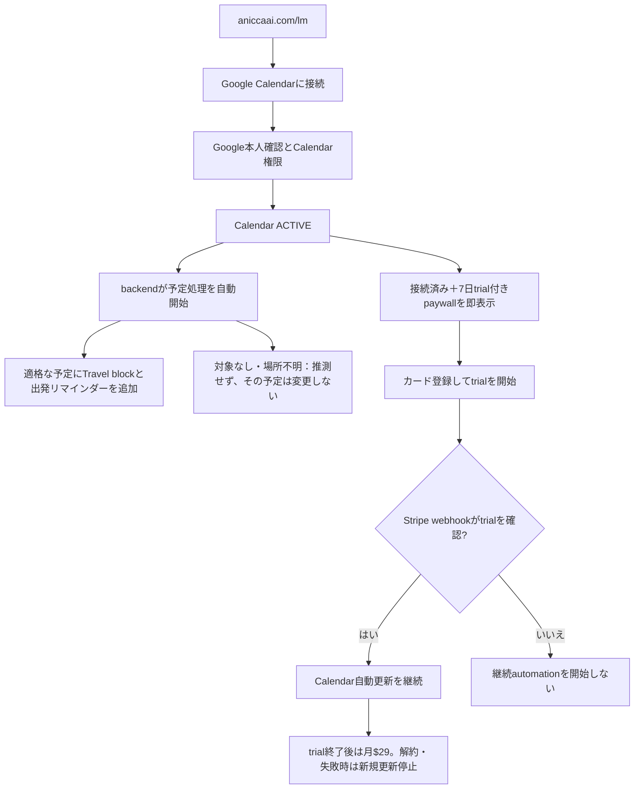

# Life Manager Web-First Travel Product

## Goal

Let a visitor connect Google Calendar and start Life Manager's existing automatic Travel manager. Google identity verification and Calendar permission are required; there is no Life Manager password or separate account form. Once the selected Calendar is confirmed ACTIVE, immediately show one connected state and a hard paywall with a seven-day card-required trial, regardless of whether a Travel block exists. The backend starts eligible-event processing automatically; the Web page has no processing step, waiting screen, or results screen. Keep the existing $29/month price. Stripe starts the trial only after the user chooses the CTA and the webhook confirms the card-backed subscription; recurring automation continues only while Stripe confirms trial or paid entitlement. Google Calendar remains the daily product surface; no dashboard or Web chat exists. Life Manager sends no trial-ending reminder email.

## Public Landing and Web App Entry

The public discovery page is https://aniccaai.com/lm. Its primary Google Calendarに接続 CTA opens the Railway Web app at https://life-call-production.up.railway.app/lm in the same tab and forwards allowlisted UTM values. The app explains that Google identity verification and Calendar permission are required. After the exact selected account is confirmed ACTIVE, the page immediately shows Calendar connected and the seven-day card-required trial offer. The backend starts automatic Travel processing independently; the page does not wait for that processing or for a Travel block. The landing page has no Telegram requirement, home/base form, phone-call setup, dashboard, or chat handoff.

The Web App Factory is a later phase. It starts only after this product has paid users and verified positive contribution; the first app's acquisition and cost evidence then becomes the factory's first reusable lesson.

## Delivery Status and TODO Authority

The current production cursor, W3-P0 root cause and unblock runbook, and remaining TODO order live in the [canonical Life Manager SSOT](2026-09-25-life-manager-unified-ssot.md). This document remains the Web product behavior/design reference.

## Superseded Contract

The approved 2026-08-26 Cloud On-Time Core contract made a verified Telegram actor the only tenant identity and retired the standalone browser onboarding flow. Dais's current explicit Web-first instruction supersedes that interface and identity choice for new Web users. It does not remove existing Telegram users, change their identity/session, enable phone calls, or weaken the existing Stripe-only paid-state writer.

The new Web identity is a verified Supabase Auth Google user. The Railway server uses Supabase SSR PKCE cookies and calls auth.getUser before accepting a user-scoped request. It derives uid as lm_ plus the verified Supabase user UUID. Client query/body identity, localStorage uid/sig, and Telegram chat IDs never establish Web tenant identity.

## Telegram Backend Reference

The existing Telegram /start creates or recognizes the Telegram tenant and sends its Calendar connection link; Telegram-specific home-address and optional phone/call prompts follow. The repository's /subscribe action is separate from /start and sends a tenant-scoped $29/month Stripe link. After setup, the shared scheduler fills Travel blocks automatically. The current ask engine resolves online/in-person status and destinations from Calendar/search context, then asks linked Telegram users only when it still needs an answer. Product decision: clarification replies may use either Telegram or iMessage. Telegram is currently wired; the Web-only tenant has no reply route, and Life Manager has no iMessage customer adapter yet. Web reuses the Travel/ask backend with no processing step, results page, or dashboard. Do not copy Telegram-specific address/phone prompts into Web setup, guess unresolved locations, or read Gmail.

## Product Flow

1. The visitor opens aniccaai.com/lm and presses Connect Google Calendar. The same-tab handoff opens Railway /lm; no Life Manager account or password is created.
2. Google verifies the identity and the user grants Calendar permission. The server binds the verified subject to an isolated Web tenant and confirms the selected Calendar account is ACTIVE. This is Google authentication and permission, not anonymous access.
3. On ACTIVE Calendar confirmation, the backend starts automatic Travel processing. The browser neither asks for an action nor waits for processing. Eligible events are resolved using Calendar, Places, the existing event interpreter, and available prior-event/base context. Never guess unresolved origin or destination.
4. Immediately after Calendar is connected, show one combined Calendar-connected state and hard paywall. Do this whether backend processing has added a Travel block, found no eligible events, or is still running. The page must not say a block was already added unless the backend has confirmed that fact; the result is visible in Calendar.
5. The paywall offers a seven-day free trial with a card required, then the existing $29/month price. Show the exact first-charge date, monthly renewal, and cancellation deadline before the Stripe CTA. A no-event or no-block state does not hide the offer or require another setup action.
6. The user taps the trial CTA and enters Stripe Checkout. The trial is not active until a verified Stripe event confirms the exact subscription is trialing with a payment method. Only then does recurring scheduled Calendar processing continue. A Checkout redirect alone is not confirmation.
7. During the trial, the backend continues maintaining eligible Travel blocks automatically; the user opens Google Calendar as usual and can close the Web page. At trial end, Stripe attempts $29/month. Cancellation or payment failure pauses new Travel updates while preserving existing Calendar blocks.
8. Existing Telegram customers keep their current session and message flow. Web requires no Telegram/iMessage installation and has no standalone first-value screen, dashboard, event board, or chat thread. The connected/paywall screen may offer optional Telegram and iMessage linking once each route is working; neither is required for Calendar connection or automatic Travel filling.

## Shared Implementation and Tenant State

- Keep one Life Manager product and the existing Railway service. Serve the Web app at LM_PANEL_BASE/lm; do not create a second scheduler or a copy of travel logic.
- Reuse lm_users, lm_panel_preferences, the Composio calendar transport, travelUserOnce/fillTravel, route caching, departure calculation, and lm_travel_log idempotency.
- Web-created lm_users rows may have telegram_chat_id null. The existing travel loop already skips Telegram reports when no chat ID exists. Web onboarding explicitly stores call_enabled=false and notifications_enabled=false; Calendar's own event reminder is independent of the Telegram notification switch.
- After Calendar is ACTIVE, start the initial authorized Travel pass automatically and fill only events whose origin and destination are sufficiently resolved. Resolve origin from a physical previous Calendar event within 90 minutes, then an already-saved starting point. Do not request home address or continuous browser location. If a required origin or destination remains unknown after automatic resolution, do not guess, do not send a location-question email, and leave only that event unchanged. Remember a confirmed answer received through an already-linked Telegram route for later matching events.
- The connected/paywall state and Checkout eligibility depend on a verified ACTIVE Calendar account and first-time trial eligibility, not on internal processing markers, the first Travel timestamp, or Travel-block count. A pending or zero-block first pass still shows the offer. The initial Travel pass starts automatically after Calendar activation; recurring scheduled processing starts only after Stripe confirms a card-backed trial or paid subscription. Stripe webhook remains the only writer of lm_users.paid; cancellation or failed collection pauses new Travel reads/writes and preserves existing blocks.
- When a preference row already exists, preserve its automation choice; reject setup while calendar_disconnect_pending is true. Stripe webhook remains the only writer of lm_users.paid.
- Immediately after exact ACTIVE Calendar readback, show one connected/paywall screen with the exact first-charge date, $29 amount, monthly renewal, and cancellation deadline. Do not wait for backend processing or a confirmed Travel block; do not show a progress/zero-block page, separate result screen, dashboard, or Web chat. The copy says eligible Travel blocks are added automatically and never claims a block exists before readback. Keep Gmail unread and do not add a home-address question.
- Do not auto-link a Google account to a Telegram tenant by matching an unverified email. Existing Telegram accounts keep their current session and records; a future explicit link flow can be added from measured user need.
- A verified Supabase Google subject whose canonical `lm_<subject>` row has any non-null `telegram_chat_id` receives a separate deterministic Web-only UID derived from that subject. Keep the existing row and all of its fields untouched; callback creation and later Web requests resolve to the same row with `telegram_chat_id IS NULL`. Never authorize Web access from email matching. If the callback cannot finish, redirect to the same-origin `/lm?auth_error=connection` page; never return a plain-text callback error that Safari downloads as `callback.txt`. The signed-out page shows a short retry message and the existing Google Calendar connection button.
- Calendar account writes remain user-scoped by uid and selected connected_account_id. OAuth status must be ACTIVE before Calendar reads or writes begin.
- Web status reports connected only when the exact selected account is ACTIVE and its provider/account markers are persisted and read back on the Telegram-unbound `lm_users` row. A selected account with exact `MISSING` or `EXPIRED` status is actionable: user-initiated start may recover one unique exact-uid ACTIVE account or begin new OAuth, but never enable that stale account. Network/5xx, ownership, ID mismatch, and contradictory/unknown statuses remain unavailable and fail closed. If a callback consumed OAuth state before marker persistence, a user-initiated Calendar start may recover only one exact-uid ACTIVE account and must persist/read it back before reporting connected.
- A Web-only tenant (Web UUID uid plus `telegram_chat_id IS NULL`) is Travel-only. The legacy `tick`/`organsUserOnce` path skips it before upcoming/history Calendar reads or other non-Travel organs; `travelTick` is its only scheduled Calendar consumer. Existing Telegram tenants keep the legacy organ path.
- Before scheduled Calendar event access for a Web uid, re-read the current user row, require `telegram_chat_id IS NULL`, and verify that the exact selected account is still ACTIVE. Preserve the existing Telegram scheduler path.
- Carry that verified account ID through the Web travel run. Each Calendar transport call must reject if the current NULL-Telegram row no longer selects that exact ID; it must never silently switch to another account mid-run.
- After the Web travel owner confirms the exact account ACTIVE, it re-reads persisted automation and Calendar operation state before entering `fillTravel`. The Calendar transport rechecks that state immediately before Web create/patch dispatch; its control-state reader resolves Supabase URL/key the same way as the bound-account lookup on the normal `getCalendar` path. The browser is not kept open for status or messages; Google Calendar remains the daily surface.

## Travel Calendar Effect

- The departure calculation remains event start minus accepted route duration minus the existing single 5-minute buffer.
- Each Travel helper starts at the calculated departure instant and carries an event-level Calendar reminder at that start time. Use the supported event reminder override rather than inheriting an arbitrary calendar default; read back the created event's reminder. If the Composio create path cannot write/read this override, fix that path before claiming a departure-time alert. Device delivery still depends on the user's Calendar notification settings.
- Every created Travel event explicitly sets send_updates=none, exclude_organizer=true, and create_meeting_room=false. The event has no attendees, no Meet link, and no invitation emails.
- Repeated onboarding or scheduler evaluation relies on the existing unique (uid,event_key,leg) claim. Release it only when no provider write was dispatched or the Composio endpoint explicitly rejects the HTTP request with 4xx; after dispatch, a network/5xx/unreadable response or a 2xx `successful:false` result is effect-unknown. Retain that claim and reconcile through strict Calendar readback. Resolve it only when exactly one event matches the expected summary exactly, `startMs`/`endMs` exactly, and destination after whitespace removal plus lowercasing; if the readback is missing, failed, or ambiguous, keep the claim fenced and do not replay. A readback proves the helper exists but is not a create receipt, so do not report `travel_added` without a confirmed create response.
- Resolve an event destination from Calendar, Places, and the existing event interpreter. Never ask a location question during Web onboarding. If destination or origin remains unresolved for a specific event, send one question through the customer's tenant-bound Telegram or iMessage route when linked; otherwise leave that event unchanged. No Resend location-question email is sent for Web tenants. For Calendar blocks generated days ahead, use a nearby previous event location, then an already-saved base. Do not use today's GPS point as the origin for a future event.
- **Location-source decision:** Do not require continuous GPS in Web V1. Telegram live location is user-initiated and `live_period` is a sharing window, not a guaranteed update interval. The current parser records `edit_date`/`date`; the current freshness check only checks whether the share has expired and has no maximum-age gate, so it can treat an old fix as current. Do not describe this as reliable real-time location or use it as an authoritative route origin until a maximum-age check is implemented and observed updates are validated. A one-time location reply can answer an event-specific question; it does not authorize continuous tracking.
- **No-onboarding-question origin contract:** Web onboarding never asks for a home address or location permission. Use the previous physical Calendar event and any base already stored on the tenant. If no origin is available, ask only when a particular upcoming trip needs one; otherwise leave that event unchanged. No location tracker, native companion, or background GPS is planned for V1.
- **Broader OSS/platform audit:** The W3C Geolocation API exposes `navigator.geolocation` to `Window`, not a Service Worker. The PWA Safari sample calls `getCurrentPosition()` from a page; it is not background tracking. The 2017 Brotkrumen POC itself says the phone must stay awake and the PWA foregrounded. [Cap-go's MPL-2.0 Capacitor plugin](https://github.com/Cap-go/capacitor-background-geolocation) is actively maintained and supports native background updates, but it requires a Capacitor iOS app, Background Location mode, and Always permission; its native POST is for geofence transitions. [Capawesome's Capacitor plugin](https://github.com/capawesome-team/capacitor-plugins/tree/main/packages/background-geolocation) supports queued HTTP uploads but requires a paid license and a native app; force-quit stops uploads until relaunch. [capacitor-community/background-geolocation](https://github.com/capacitor-community/background-geolocation) also requires an installed native app and is less recently maintained. OwnTracks, Traccar Client, and Overland likewise require a phone app; My Tracks is an OwnTracks server under a noncommercial license, so it is not a commercial-service dependency. Apple's Location Push Service Extension can query location on demand using APNs, but requires a native extension, Always authorization, and a server; Apple limits delivery to about 360 location pushes per day and replenishes only one every few minutes. These are not Web-only solutions. Under the no-additional-app requirement, do not leave GPS tracking as a V2 TODO; the product's origin contract is Calendar history plus an already-saved base.

#### Additional GitHub review: no app-free background location

- GitHub CLI search found [Safari Track issue 18](https://github.com/nbarrett/safari-track/issues/18): its iOS PWA lost background GPS when sent to the home screen, so the owner moved it into a Capacitor native shell with native geolocation.
- [GeoTracker-Apple-Automation](https://github.com/makiisthenes/GeoTracker-Apple-Automation) requires users to create location automations manually in Shortcuts and notes that location automations require confirmation. [ShortcutsAPI](https://github.com/gavinsawyer/shortcuts-api) also requires users to configure personal automations in Shortcuts.
- [icloud-location](https://github.com/jimmystridh/icloud-location) is MIT licensed, but its README says Apple's web interfaces are unpublished/unsupported and it requires Apple account login, trusted sessions, and 2FA. [google-maps-location-sharing](https://github.com/davenicoll/google-maps-location-sharing) says Google has no published Maps location-sharing API and uses exported HAR cookies against an internal endpoint. Neither is a safe, stable Calendar-only SaaS integration.
- These findings reinforce the product boundary: no separate location app or background GPS in V1 or V2. Calendar history plus one saved starting point handles events with enough schedule/location data; it cannot know unrecorded physical movement or promise perfect routing.

## Calendar Connect-only Interface

- The public marketing page lives at `aniccaai.com/lm`; its only setup CTA is **Google Calendarに接続** and it hands off to the existing Railway /lm route.
- The CTA starts the Google authorization chain. If the browser already has a Google session, the visitor may not need to type a password; permission to read and write Calendar events is still required. Do not show a separate Life Manager sign-up/password form or call the button “Googleで続ける.” The current implementation has a Supabase Google OAuth step and a separate Composio Calendar OAuth step; automatically chain them after the one click and do not return to an intermediate dashboard.
- The signed-in Railway app shows one connected/trial-offer screen as soon as the exact Calendar account is ACTIVE. Start automatic Travel processing independently in the backend. Never wait for a confirmed block, show a processing/loading/zero-block page, offer manual processing, or claim a block was added before provider readback. If Calendar authorization itself fails, show an actionable retry. Do not show an event board, daily dashboard, standalone result page, Web chat, or message composer.
- Do not collect a home/base address or request browser location during setup. Resolve available facts from Calendar/Places. If a required fact is unavailable, ask only through an already-linked Telegram route; otherwise skip that event unchanged. Web V1 sends no location-question or trial reminder email and never reads Gmail.
- The trial page states the exact end/first-charge date, $29 amount, monthly renewal, and cancellation deadline before Checkout. Life Manager sends no trial-ending email. Verify Stripe's separate receipt and customer-email settings before promising that no email at all is sent.
- **Messages click-to-contact:** A user-initiated sms:<Life Manager business number> URL opens Messages with the business recipient. It does not itself send a message, guarantee a blue iMessage bubble, share GPS, or bind the sender to a Web tenant. Use it only as the entry to the managed iMessage link flow; correlate the inbound sender to the exact Web tenant with a one-time verified link, not email matching. Do not collect a phone number in a Web form.
- **Managed iMessage adapter:** The current Life Manager app has no tenant-bound iMessage adapter. Cloud iMessage agent products show a managed API pattern that does not require the Life Manager backend to run on a Mac: REST for outbound messages plus WebSocket or signed inbound webhooks for replies. First implementation candidate is Claw Messenger because its public docs describe a cloud API, a single line serving many users, and $199/month per product line; verify its invite-only setup, pricing, sender identity, terms, and controlled reply path before any paid activation. Linq and Photon also document signed webhooks; Sendblue's public production plan is inbound-first and quotes outbound volume. Keep BlueBubbles/local imsg as self-hosted alternatives only. Apple Messages for Business is distinct and requires an approved MSP; it is not a prerequisite for a managed-provider integration. Keep provider keys out of the browser, verify signatures, bind each sender/conversation to a tenant, dedupe inbound events, and read provider receipts.
- The browser is used for acquisition, Calendar authorization, the combined connected/trial-offer screen, Checkout, and billing management—not daily status. Google Calendar remains the daily surface. Each Travel block gets an event-level reminder at the calculated start; device delivery still depends on the user's Calendar notification settings.
- Use the appointment's explicit IANA timezone for route/departure calculations; when absent, preserve the existing Calendar/user timezone. The helper's UTC storage timezone must not become a display source.
- Resolve online/in-person status and destinations from Calendar, Places, and the existing event interpreter without asking during setup. If the agent still cannot resolve a required fact, ask through a tenant-bound Telegram or iMessage route when linked; otherwise leave that event unchanged. Never send a Web location-question email, show a guessed departure, or request Gmail read scope.
- Each Calendar Travel event has an event-level reminder at its calculated start. Read back this override after creation; if the Composio create path cannot write or read it, fix that path before claiming a departure-time alert. Device delivery still depends on the user's Calendar notification settings. Do not present the browser as a notification channel.
- Keep pause/disconnect fences and exact provider-account readbacks. Resume requires the exact selected Calendar account to be ACTIVE; each candidate event still needs a resolvable origin before a Travel write. Disconnect atomically pauses automation and sets a Web-only disconnect-pending fence before provider I/O. A durable Calendar-enable claim serializes re-enable against disconnect; only its matching UUID may finish or release it. Preserve the existing no-effect/effect-unknown recovery and never enable a stale or ambiguous account. The Web client is connection/checkout handoff only; do not add a dashboard or chat thread.
- Do not add a location-tracking app, mandatory messaging-app onboarding, employee/staff feature, always-on GPS, generic calendar replacement, or factory UI. The no-location-app contract applies to V1: use Calendar-derived origin or an already-saved base, ask one event-specific question when needed, and skip unresolved events. Telegram and iMessage are both optional reply channels; neither is required for Calendar automation. Show linking controls only when the corresponding tenant-safe route is functional.
- Keep the existing aniccaai.com marketing surface separate from the Railway product route. Its current source is the active `Daisuke134/anicca-products` repo at `apps/landing`; its Netlify config uses that directory as the build base and `Netlify Deploy (Landing)` watches its `apps/landing/**` path. The `apps/landing` subset in this Life Manager repo is used for backend contract tests and has diverged from the live source; do not edit it as a substitute for the public route. After Calendar connection, first Travel block, price terms, and cost are read back, update the anicca-products source and verify the Netlify deploy and public route handoff to the exact Railway `/lm` origin.

### UI/UX仕様の明確化（2026-10-08 最新方針）

**毎日の画面はGoogle Calendar。** WebではGoogle Calendarを一度接続し、接続完了直後にtrial付きpaywallを表示する。Travel blockの有無や初回処理の完了をpaywall条件にしない。バックエンドはCalendar接続後に予定の処理を自動で開始し、Webページに処理操作・進捗・結果画面を出さない。Calendarに対象予定がまだなくても、同じ接続済み＋paywall画面を表示する。Trial開始後はStripeの確認済みtrial/paid状態に基づき、既存のTravel処理を自動継続する。

| 段階 | ユーザーが見るもの・操作 |
|---|---|
| 1. 案内 | aniccaai.com/lmで「Google Calendarに接続」を押す。7日無料trial・カード登録が必要・trial終了後は$29/月と案内する。 |
| 2. Google接続 | Googleで本人確認し、Calendar権限を許可する。Life Manager専用パスワードや別アカウント登録はない。 |
| 3. 接続完了＋paywall | 選択したCalendarがACTIVEになった直後、同じ画面にpaywallを表示する。初回処理やTravel blockの追加を待たない。表示は「Google Calendarに接続しました」「対象の予定に移動時間を自動で追加します」。未確認のblockを「登録済み」とは書かない。 |
| 4. 裏側の自動処理 | Calendar接続後に既存Travel ownerが予定を自動処理し、条件を満たした予定にTravel blockと出発リマインダーを追加する。場所などが未解決なら推測で書き込まず、その予定を変更しない。Web画面には処理状況を出さない。 |
| 5. Trial開始 | 「7日間の無料トライアルを始める」からStripe Checkoutへ進み、カードを登録する。画面に本日$0、正確な初回請求日時と解約期限、以降$29/月を明示する。Trial開始はStripe webhook確認後。 |
| 6. Trial中・以降 | Checkout後の確認画面を閉じ、Google Calendarを使う。Stripeがtrial/paidを確認している間だけTravel処理を自動継続し、解約・支払い失敗時は新しい更新を止めて既存blockを残す。 |

**画面遷移**

### No-extra-app location contract

- New Web users need neither Telegram nor iMessage to use Calendar automation. Existing Telegram tenants keep their legacy transport. Web users may optionally link Telegram or managed iMessage after connection. Until a selected route is tenant-bound and reply-tested, unresolved events stay unchanged. Do not send a question email or require another app.
- Future Travel blocks use a physical previous Calendar event ending within 90 minutes, then a starting point already stored on that tenant. Web onboarding never asks for a home address or location permission. If origin or destination remains unknown for one event, ask once through a tenant-bound Telegram or iMessage route when available; otherwise leave it unchanged. A Messages link alone does not grant access to the conversation or location.
- A Telegram live share or Apple Messages location share is user-initiated, not passive tracking. Apple says users can share a one-time pin or explicitly start Live Location; tapping a contact link does not share location. Do not use Telegram live location as a verified current origin until WB-09 adds a maximum-age gate and validates update freshness. `live_period` is only a share window, and the current `freshLive` check accepts any unexpired fix.
- **Broader OSS/platform search:** The W3C Geolocation API exposes `navigator.geolocation` to `Window`, not a Service Worker. The 2024 iOS Safari sample only calls `getCurrentPosition()` from a page. The 2017 Brotkrumen POC says its phone must stay awake and the PWA foregrounded. These do not provide location after a Web page closes ([W3C API](https://www.w3.org/TR/geolocation/#geolocation-interface), [Safari sample](https://github.com/JoeM-RP/serviceworker-safari), [Brotkrumen POC](https://github.com/RichardMaher/Brotkrumen)).
- Native GitHub options all require an installed Life Manager app shell and OS permission: Cap-go's MPL-2.0 Capacitor plugin is free and active but needs an iOS Capacitor app, Background Location mode, and Always permission; Capawesome offers a local queue and HTTP retries but requires a paid license and a native app; capacitor-community's plugin is older and also native-only. Transistorsoft requires a release license; `dc-bgeo`'s Swift façade wraps a closed-source engine. OwnTracks, Traccar Client, and Overland are separate phone apps; My Tracks is a server for OwnTracks under a noncommercial license, so it cannot be used as this commercial service without separate permission.
- Apple’s Location Push Service Extension can query a location on demand when an app is not running, but requires a native app extension, APNs server integration, and Always authorization. Apple limits these requests to about 360 per device per day and replenishes roughly one every few minutes; it is not a web capability ([Apple LPSE docs](https://developer.apple.com/documentation/corelocation/creating-a-location-push-service-extension), [APNs demo](https://github.com/transistorsoft/location-push-service-demo)).
- **Product decision:** no location tracker, native companion, or background-GPS phase is planned for this no-extra-app Cloud product in V1 or V2. Do not promise live location or perfect routing. The route origin comes from Calendar history and one saved starting point; an event without enough information remains unchanged.
- **Privacy:** Web onboarding requests no location permission and stores no browser GPS. Do not request Always/background permission or silently track.

**Staffの意味:** 過去案のstaffは従業員/チーム招待機能を指す。Travel v1にはスタッフ欄・招待UI・チーム料金を含めない。

## Price, Marketing, and Profit

- **公開offerのreadback（2026-10-07）:** `https://aniccaai.com/lm` は「Calendar × Telegram」と表示し、主要CTAをTelegramへ送り、$29/月を掲示する。Telegramのルート通知と任意の電話を説明しており、目標のbrowser-first signupと一致していない。
- **Stripe catalogのreadback（2026-10-07）:** 確認対象のlive `Anicca Life Manager`商品にはpriceが2件（active $29/月と$20/月、inactive priceは0件）。この2 priceには全statusでsubscriptionがなく、確認対象商品のrecurring MRRは$0。2026-10-06の前回official readbackではStripe `trial_period_days`が空で、Web setupはapp entitlementを3日で開始する。Stripe checkoutとapp trialの条件が一致する証拠はまだない。
- **Life Manager全体の利用料推定（2026-09-07 01:21 UTC〜2026-10-07 01:21 UTC）:** append-onlyの`lm_api_cost`台帳はprovider利用料推定$68.786544、その他の推定$0.306765、30日合計$69.093309（約$2.30/日）を記録する。Life Managerの6 tenant分であり、Web customer分ではない。provider利用48,524件のうち3件は推定額なし。この集計は請求書、Web別原価、顧客あたり平均ではない。Composio、hosting、Stripe fee/refund/settlement、marketing費は含まれない。
- **価格決定:** 公開offerと現行Stripe checkoutの**$29/月を維持する**。以前の$5/月・$36/年案は競合価格から出した私の余計な提案として撤回する。既存catalogにある$20/月priceは現行公開page/Payment Linkで使わず、Stripe catalogの価格も増減しない。競合価格はpositioning比較にだけ使い、値下げ根拠にしない。
- $29/月で$10,000 gross MRRを超えるには**345人のactive paid subscribers**（$10,005 gross MRR）が必要。これはfee/cost控除前であり、net profitの達成数ではない。1%/3%/5%のvisit-to-paid conversionは計画用の仮定で、それぞれ34,500/11,500/6,900 qualified landing visitsが必要になる。実際のconversionは未計測なので、source attributionとpaid invoiceから実績を計測して仮定を更新する。これらの仮定はforecast扱いしない。net contribution $10,000に必要な人数はWeb別変動費、refund、payment fee、hosting、CACを測るまで不明。
- **Marketing状態（2026-10-07 readback＋最新指示）:** `/en`はLife Manager全体のumbrellaページ、`/lm`はTravel専用ページだが、後者のCTAはまだTelegramを指す。`/socials`は現在`loading…`を返す。`/dashboard.json`は2026-06-05更新、social snapshotは2026-06-04で古く、表示された$548支出はClaude/ChatGPT/living/Apify/Postiz等を含む混合合計でLife Manager marketing費ではない。`@anicca.ai`のpublic profile fetchは「Profile isn't available」を返したが、これはbanの証明ではない。現在のInstagram statusとLife Manager marketing spendはunknown。Daisの最新指示により、既存profileはそのまま保持し、Life Manager Cloud専用の新しいInstagram/X accountを作成する。アカウント作成では既存のlogged-in sessionとprivate credential SSOTを使い、platform rulesを守る。新しいaccountを作ってもban回避や投稿制限回避をしない。
- **初期marketing:** 訴求は「CalendarとMapsを何度も確認しなくていい。移動時間と出発時刻がCalendarに入る」。本人の毎日の苦痛（見落としが怖くて予定と地図を何度も確認する）を、ユーザー由来のfounder diary/storyとして日本語の記事・短尺動画・carouselの核にする。初期audienceは対面予定が定期的にあるコンサルタント/営業/フリーランス/現場サービス職の仮説。最新の運用目標は**Xに毎時1件の独自投稿（24件/日）、9:16 demo動画2本/日、IG carousel/slideshow 1本/日、独自の日本語記事3本/日**。X/Instagramは新しいLife Manager Cloud専用アカウントを作り、既存profileは維持する。投稿は全て別の有用な角度とし、同一文の大量投稿で伸ばさない。この量はユーザー指定の実験であり、実測で品質・アカウント状態を追う。Xはbulk/duplicate/irrelevant spamを禁じる [公式policy](https://help.x.com/en/rules-and-policies/platform-manipulation)。Googleは検索順位操作目的の薄いscaled contentをspam扱いするため、記事3本はそれぞれ異なる読者課題を解決する [Google Search policy](https://developers.google.com/search/docs/essentials/spam-policies#scaled-content)。demoでは合成Calendar dataを使い、実予定名・住所・通話音声は公開しない。source→Calendar ACTIVE→Travel block→trial→paid invoice→D7/D30 retentionを計測する。現在のmarketing spendとpaid CACは未確認。paid adsはsignup・checkout・attributionとunit contributionが測れるまで拡大しない。
- **既存marketing資産/loopのreadback（2026-10-07）:** canonical sourceに日次動画generator `skills/video/daily-lm-video`、Postiz向け `skills/video/lm-distribution`、日次measurement `skills/video/lm-self-improve` はあるが、いずれも`config/loop-registry.json`にLife Manager content/publish ownerとして登録されていない。Marketing Engineのproduct registryにもLife Manager packはない。`life-manager-selfbuild`は4時間ごとのbuild loop（10/07 04:28Z pass、effect none）で販売loopではない。`lm-recording-store`は30分ごとの録音保存loopで、10/07 05:46Zの最新readbackは`resource_capacity_busy`によるadmission defer、直前の成功は05:16Z。既存の`content-reels-life-manager.md`はTelegram CTA・$20/月・電話中心で現行$29/Web-firstと不一致。Remotion素材skills/video/lm-assetsは4.0.533へ更新し、Travel-firstの合成Calendar demo v1を生成済み。未公開のdraftは/Users/anicca/.local/share/life-manager/marketing-drafts/20261007-lm-calendar-connect-v1.mp4。WB-15でTravel専用creative bank、Remotion版上げ・再制作、X/Reels/TikTok/Shorts/owned-article配信、投稿receipt→conversion学習を一つの販売loopへ接続する。旧録音素材は公開せず、Travel体験を合成Calendar dataで作る。
### Marketing実行計画

- **位置づけ:** “Life Manager automatically puts travel time into Google Calendar before you forget to leave.” 日本語では「出発時刻を気にしてCalendarとMapsを何度も確認しなくていい」。絶対に遅刻しないとは約束せず、予定に必要な移動時間を自動で確保し、出発時刻に知らせることを約束する。
- **最初に狙う人（仮説）:** 対面の顧客訪問や予約が週に複数回あるコンサルタント、営業、フリーランス、現場サービス職。ICPはcheckout数と継続率で検証し、職種別の反応を印象だけで確定しない。
- **コンテンツ柱:** (1) Daisの「遅れないか不安で予定と地図を繰り返し見る」実体験、(2) 15:00の予定・移動40分・5分余裕→14:15 Travel blockという画面demo、(3) Calendarへ移動時間を足す手順と出発時刻の考え方、(4) Google権限・プライバシー・7日trial・カード登録・自動更新・解約への短い回答。利用者の声や成績は、本人同意と計測がある時だけ使う。
- **投稿cadence（user-directed experiment）:**

| Channel | 毎日の出力 | 内容とCTA |
|---|---:|---|
| X | 1時間に独自投稿1件、24件/日 | 痛みの一言、tips、FAQ、異なるdemo切り口を回す。各投稿は`/lm`へ固有UTMを付ける。重複文、無関係なtrending topic、同じ投稿の複数account再掲、未承諾DMは使わない。 |
| Instagram Reels / TikTok / YouTube Shorts | 9:16 master video 2本/日 | 同じ製品画面を使ってもhook・caption・編集を各platform向けに変える。合成Calendar dataを使い、予定名・住所・個人画面を出さない。 |
| Instagram carousel / slideshow | 1本/日 | 5–8枚の具体的な痛み→仕組み→Calendar demo→CTA。動画の静止画再投稿ではなく、読み進める価値のある別編集にする。 |
| Owned media / SEO | 日本語の独自記事3本/日 | 朝=founder diary、昼=検索意図に答えるhow-to、夜=製品/FAQ/実測。3本は別の問いに答える。薄い言い換え記事を量産しない。各記事からdemoとCalendar接続CTAへつなぐ。 |

**7-day publishing rotation:** Keep the user-directed volume above; rotate the topic so each hourly X post gives a distinct useful angle. Every day make two different video masters, one carousel, and three Japanese articles: a first-person diary, a useful how-to, and a product/FAQ piece.

| Day | X hourly topic rotation | Video 1 / Video 2 / Carousel | Article 1: diary | Article 2: how-to | Article 3: product/FAQ |
|---|---|---|---|---|
| Mon | Founder pain and repeated Calendar/Maps checking | Why I built this / Calendar before-after / mistake→lesson cards | The stress of checking the calendar again and again | Why a reminder can arrive on time but still be too late to leave | What Life Manager adds automatically |
| Tue | Product mechanics and FAQ | One-tap Calendar connection / 15:00→14:15 / annotated steps | My morning of checking Maps before leaving | How to add travel time to Google Calendar | What happens after “Google Calendarに接続” |
| Wed | Practical planning tips | Buffer explainer / back-to-back events / route cards | A day I underestimated the trip | How to plan travel between consecutive appointments | How the 5-minute buffer changes departure time |
| Thu | Permissions and privacy | Calendar scopes / data flow / unknown event state | Why I avoided asking for a home address | What a calendar travel-time app reads and writes | What happens when an event location is missing |
| Fri | Trial, price, and cancellation clarity | 7-day card trial / exact $29 date / cancel path | Why I show the charge date before Checkout | How to cancel a subscription online | What “$0 today, $29 on {date}” means |
| Sat | Founder workflow and build updates | Build log / synthetic Calendar demo / product iteration | How I built a fix for my daily schedule stress | How departure times differ from event reminders | Current product limitation and how it is handled |
| Sun | Weekly FAQ and measured learnings | Week's measured insight / best demo / carousel recap | What users asked this week | One practical travel-planning guide | One measured funnel improvement, if data supports it |

- **毎日の改善loop:** source/UTMごとにimpression→landing visit→Calendar connect→OAuth consent→Calendar ACTIVE→first Travel block→card-required trial started→trial-to-paid invoice→renewal/cancel/refund→D7/D30 retentionを計測する。0件同期、OAuth drop-off、paywall view、Checkout abandon、payment failureを別集計する。前日の最大drop-offを一つ選び、翌日のhook・demo・記事テーマに反映する。投稿数や再生数だけで成功としない。
- **予算:** 現在のLife Manager marketing spendと顧客別CACは不明。7日trial開始、OAuth、first block、Stripe attributionの計測がそろうまでは有料広告の平均支出を実績のように示さない。organic結果からpaid CACとtrial-to-paidを測り、返金・Stripe fee・route/provider・Composio・hostingを差し引いた貢献利益で広告上限を決める。
- **素材:** 既存のCalendar画面・スクリーンショット・Remotion資産を再利用し、automatic Calendar write→combined connected/trial-offer screen→7日card-required trial→$29自動更新のUXに合わせて更新する。下書きdemoは合成Calendar dataのままpreviewし、実際のCTA・認可・trial期限・課金が一致するまでは公開しない。
- **チャネル規則:** Xはautomated duplicate/substantially similar postを禁じ、Googleは検索順位操作を目的としたscaled contentをspam扱いする。高頻度は維持しながら毎回別の有用情報にする。投稿・アカウント操作は登録済みCloakBrowser直接CDP経路を使い、未確認のInstagram banや利用不可を理由に新規accountを作らない。

- Reuse existing product marketing copy and the shared marketing engine's content-manifest idea. Do not activate its private Instagram automation route; actual account operation must use the registered CloakBrowser direct-CDP route.
- gross MRRと月次contributionを分けて報告する。contributionの基準はpaid invoice/chargeの控除前金額とし、refundとStripe feeを一度だけ控除する。payout/settlementはnet receiptとの照合に使い、そこからrefund/feeを再控除しない。その後、同じ期間のroute/provider・Composio・hosting・attributed marketing spendを控除する。repo内のfounder申告historical revenueをこの商品のprofit証拠に使わない。

### Market research and content preparation (2026-10-06)

**根拠（2026-10-07再確認）。** [AddTravelTime](https://www.addtraveltime.com/) はGoogle Calendarへ移動blockを自動追加し、$5/月・$36/年、14日・カード不要trialを表示する。[DOFOTTの料金](https://dofott.com/pricing) は場所付き予定を月12件まで無料とし、超過月は$5+税、年額は$36+税。Product Hunt経由なら2026-10-31まで初年度$18+税で、登録時にカードを保持する。[TravelSyncの料金](https://www.travelsync.co.uk/pricing) は14日・カード不要trial。TravelSyncは£5/月または£50/年で、移動block・mileage記録/export・travel block通知を含む。TravelSync Proは£8/月または£80/年で、メール不在返信・出発前live-traffic warning・出発時のleave-now email・朝のbriefingを追加する。どちらもGoogleまたはMicrosoft calendarに対応する。時間節約の数値はvendor claimで独立検証していない。[Morgenのtravel workflow guide](https://www.morgen.so/guides/auto-schedule-travel-time) はGoogle、Outlook、iCloud、Fastmailのcalendar、出発地、移動手段、往復、bufferを扱う。これらは機能・価格帯の比較材料であり、競合の売上や利益の証明ではない。

**How close products present onboarding and price:**

| Product | First-use flow | Price/trial presentation | Pattern to borrow |
|---|---|---|---|
| [AddTravelTime](https://www.addtraveltime.com/) | Connect calendar, then set one starting address and travel mode. | Monthly/yearly selector; 14 days free with no card, then $5/month or $36/year. | Put the connection CTA and trial terms near the product demo; its one-time address question reduces ambiguity. Life Manager follows the no-question direction and skips unresolved trips. |
| [TravelSync](https://www.travelsync.co.uk/pricing) | Connect Google or Microsoft calendar; configure home/office travel origins. | Two side-by-side plan choices plus a feature comparison table; 14-day no-card Pro trial, then £5/£50 or £8/£80 monthly/yearly. | Show what each tier adds and which features the trial unlocks before checkout. |
| [DOFOTT](https://dofott.com/pricing) | Connect calendar and use the automatic blocks. | Two plan cards: up to 12 location events/month free, then $5 + tax only in months above the limit, or $36 + tax yearly; explains the charge trigger. Signup keeps a card on file. | Make usage thresholds, charge timing, tax, and cancellation consequences explicit. |
| [Basecamp / 37signals](https://basecamp.com/pricing) | Choose a free one-project plan or select a paid plan to start a trial. The company says it has had 27 profitable years. | Several plan cards organized by project/storage/user limits; paid plans include a 30-day no-card trial (45 days for Unlimited). Card details are requested only if the customer chooses to continue after trial; no automatic charge. | State exactly what ends with the trial, how to continue, and how to cancel. The profitability statement is the company's own claim, not independently audited. |
| [Poke](https://poke.com/pricing) | Start by texting a personal assistant through Apple Messages, WhatsApp, or Telegram; connect other services as needed. | Free tier plus Pro/Ultra paid tiers; the product positions upgrades around model capability, background automation, and usage headroom. | A messaging interface can be the product itself. It does not remove the need for a clear upgrade trigger or prove profitability. |
| **Life Manager target** | One Calendar CTA; after the Calendar account becomes ACTIVE, automatically start backend processing while showing the paywall immediately. | One combined connected/trial-offer screen: 7 days $0, card required, then $29/month auto-billed until canceled. | Do not add a standalone result page. State trial start/end, exact first-charge date, monthly renewal, and cancellation deadline on the single offer screen. A Travel block is not a paywall prerequisite. |

The direct travel-calendar competitors' profitability is not publicly verified by these pages. 37signals publicly says it has operated profitably for 27 years, but that statement is self-reported. Poke shows a messaging-first assistant with free and paid tiers, but its public offer is not evidence of settled profit. These examples show offer and onboarding design, not a causal proof that a particular trial or channel made a company profitable. The exact Life Manager price stays $29/month; AddTravelTime's listed $5/month price is about one-sixth of Life Manager's price, so the demo must show why automatic Calendar updates and departure reminders justify the premium.

**Trial recommendation (research plus user direction):** [ChartMogul's 2026 report](https://chartmogul.com/reports/saas-conversion-report/) analyzes 200 software products: 14 days is most common (62%), 7 days is used by 14%, 80% of trial products do not require a card, and only 20% require one. The report says card-required trials convert better after trial but warns that requiring a card can reduce initial signups; its visitor-to-paid comparison is survey evidence, not a causal forecast for Life Manager. Direct travel-calendar competitors AddTravelTime and TravelSync show 14-day no-card trials. Despite that category pattern, the owner has selected a 7-day card-required trial immediately after Calendar becomes ACTIVE, with explicit charge date and cancellation terms. This favors paid conversion over signup volume and remains an experiment, not a proven winning funnel. Measure visitor→Calendar ACTIVE→paywall view→Checkout→trial started→first Travel block (separate value metric)→first paid invoice→cancel/refund→D7/D30 retention. Do not send trial-ending email reminders.

**Life Manager price-card decision:** Keep the existing $29/month offer and show one compact card near the landing CTA: “7日間無料 · 開始にはカード登録が必要 · 無料期間終了後に$29/月を自動請求”; beneath it, “その後は解約まで毎月自動更新。初回請求日と解約方法は開始前に表示します。” Include one CTA, “Google Calendarに接続.” Do not show the unused $20 price, annual pricing, feature tiers, or a comparison grid. The $29 amount, 7-day term, card collection, first charge date, and cancellation behavior must match the live Stripe Checkout before publishing.

**Paywall decision:** Follow the Telegram product's automatic backend behavior, not its chat UI. As soon as the user grants Calendar access and the exact account is ACTIVE, show the connected state and hard paywall. The offer does not wait for the initial automatic pass, processing completion, an event, or a confirmed Travel block. Start the backend pass independently; it writes only accurate eligible events. The paywall copy never claims a block already exists. Keep the existing seven-day card-required trial and $29/month. Trial entitlement and ongoing automation begin only after the user consents in Checkout and Stripe's webhook confirms the card-backed trial. Cancellation or payment failure pauses new Travel updates; existing blocks remain.

**Exact trial-paywall copy:** “7日間無料でLife Managerを使えます。カード登録が必要です。本日のお支払いは$0です。{trial end date}に$29を請求し、その後は解約まで毎月$29で自動更新します。請求を避けるには{trial end date}までに解約してください。” CTA: “7日間の無料トライアルを始める”.

**Trial confirmation copy:** “7日間の無料トライアルを開始しました。{trial end date}に$29を請求し、その後は毎月$29で自動更新します。いつでも{billing link}から解約できます。” The page shows **「解約・支払いを管理」**. Do not send day-7/day-13 emails or other Life Manager trial reminders. Verify Stripe receipt/customer-email settings before claiming no billing email is sent.

**Channel decision — fixed:** Keep the Web app as the no-install Calendar connection and billing surface; do not delete it or replace it with a Web chat. Keep Telegram as the already-working reply channel and add iMessage as the second optional reply channel. Users can use Calendar automation without linking either. Web should show optional channel links only after they work end to end; no extra onboarding question or phone-number form is added. The current Life Manager source only routes Telegram. For iMessage, use a managed cloud API rather than the owner-side Messages.app bridge. A focused vendor review found a viable no-Mac pattern: Claw Messenger uses REST outbound plus a persistent WebSocket for inbound, one managed line can serve many users, and its agency page publishes $199/month per line, $250 setup, 1,000 messages included, then $0.005/message; Linq and Photon document signed webhooks, while Sendblue's public production plan is inbound-first with outbound volume quoted separately. These are vendor-listed terms, not a final contract. Start with a controlled Claw Messenger thread and verify inbound reply, tenant mapping, terms, and real cost before paid activation. Apple Messages for Business is a separate official route requiring an approved MSP; it is not necessary for the managed API path.

**Clarification copy for either linked channel:** Only when the manager cannot resolve a specific event automatically. Destination: “「{予定名}」の場所をCalendarから確認できません。移動時間を追加するため、住所か会場名を返信してください。オンラインなら「オンライン」と返信してください。” Origin: “「{予定名}」へ向かう今回の出発地が分かりません。今回の出発地（例: 自宅、勤務先）を返信してください。返信がなければ予定は変更しません。” Deliver once through the user's linked Telegram or iMessage channel; do not duplicate the question. Web V1 does not email this, request continuous location, or modify the event if no working reply route exists.

Qualitative pain evidence is consistent but anecdotal. In a [2024 r/productivity thread](https://www.reddit.com/r/productivity/comments/1akzy5j/calendar_management_how_do_you_factor_in_travel/), a user describes forgetting travel time while scheduling a second appointment before a distant appointment. In a [2019 r/shortcuts request](https://www.reddit.com/r/shortcuts/comments/fsybqg/automatically_add_travel_time_from_google_maps/), a user describes manually moving from a Calendar event to Google Maps and back to create a separate travel event. A [Google Calendar Help Community question](https://support.google.com/calendar/thread/254623733/set-time-to-leave-for-calendar-events?hl=en) asks for a time-to-leave notification; a community expert's answer describes a manual Maps-to-Calendar path. That page is community content, not a current product contract, so verify Google's UI before publishing a how-to claim.

**Inference.** The strongest message is the mental load of repeatedly checking Calendar and Maps because the user is afraid of missing an event. The first audience to test is people with recurring in-person appointments and client meetings; this is a fit hypothesis, not a validated ICP. Promise that Life Manager automatically reserves travel time and puts the departure block in Calendar; do not guarantee that a person will never be late or never miss a flight.

**Search candidates.** These 50 English query candidates are grouped by intent, based on observed result phrasing plus close variants. Search-volume data and Google Search Console evidence are unavailable; do not present these phrases as traffic forecasts. Prioritize by product fit and intent until post-launch impressions and conversion data exist.

| Cluster | Intent | Candidate queries | Priority |
|---|---|---|---|
| Automatic travel blocks | Commercial / transactional | automatically add travel time to Google Calendar; Google Calendar automatic travel time; automatic travel blocks for Google Calendar; Google Calendar travel time app; travel time blocker for calendar; calendar app automatically adds drive time; Google Maps travel time calendar integration; Google Calendar travel block app; automatic commute blocks calendar; travel time automation for appointments | 1 |
| Google Calendar how-to | Informational | how to add travel time to Google Calendar; how to add travel time to a Google Calendar event; add driving time to Google Calendar; add a travel event from Google Maps to Calendar; how to block travel between calendar events; set time to leave for calendar events; add buffer before Google Calendar appointments; calculate travel time between appointments; automatically add travel time to recurring events; Google Calendar travel time desktop | 1 |
| Late-arrival problem | Informational | calendar reminder too late to leave; forget travel time when scheduling appointments; avoid being late to appointments; calendar keeps booking over commute time; Google Calendar does not account for commute; meetings back to back travel time; how early to leave for an appointment; stop being late to client meetings; calendar schedule travel time for appointment; travel time gap between meetings | 2 |
| Product comparisons | Commercial | best Google Calendar travel time app; travel time apps for Google Calendar comparison; AddTravelTime alternative; DOFOTT alternative; TravelSync alternative; AddTravelTime vs DOFOTT; Google Calendar vs Apple Calendar travel time; Google Maps calendar travel-time automation; best calendar app with travel time; calendar departure alert vs travel block | 3, after price/cost proof |
| In-person professional use | Commercial / informational | travel time calendar for consultants; calendar travel blocks for field sales; automatic drive time for client visits; travel time planning app for contractors; appointment calendar for service businesses; Google Calendar travel time for freelancers; travel blocks for on-site meetings; route planner that syncs with calendar; prevent overlapping client appointments and travel; calendar travel time for personal appointments | 3, validate ICP |

**First content queue (latest user-directed high-volume experiment).** Publish one original X post every hour (24/day), two distinct 9:16 video masters/day adapted for Reels/TikTok/Shorts, one Instagram carousel/slideshow/day, and three distinct Japanese owned-media articles/day (founder diary, search-intent how-to, product/FAQ). Run hourly topic/feedback collection and refresh drafts between posts. Do not repeat copy or flood each account with identical cross-posts. This is the requested launch experiment, not a platform-wide best-practice claim. X prohibits bulk, duplicative, irrelevant, or unsolicited spam; Google Search prohibits scaled pages created mainly to manipulate rankings without helping readers ([X policy](https://help.x.com/en/rules-and-policies/platform-manipulation), [Google policy](https://developers.google.com/search/docs/essentials/spam-policies#scaled-content)).

Every day, publish three Japanese pieces with distinct reader goals: (1) a first-person founder diary about the stress of repeatedly checking Calendar and Maps, (2) a search-intent guide such as “Google Calendarに移動時間を自動追加する方法,” checked against the live Google UI, and (3) a product/FAQ piece such as why an event reminder can be on time but still too late to leave or how a 7-day card trial is canceled. Rotate topics rather than rewriting one article three ways. Use synthetic event data or anonymized screens; never publish raw private event titles, addresses, or call recordings. Replace stale scripts that say Telegram-only or $20/month before distribution.

Draft X hooks, for internal review only:

- “A calendar reminder can arrive on time and still be too late. The missing block is the trip before the appointment.”
- “An empty 2:30 slot is not free time if the next meeting is across town. The trip needs to be reserved before someone books over it.”
- “I used to check Calendar, then Maps, then Calendar again because I was scared of missing the moment to leave. Life Manager puts the trip into Calendar for me.”
- “Connect Google Calendar once. Life Manager fills eligible travel blocks automatically; your Calendar stays the screen you already use.”

Draft Remotion demos use synthetic Calendar events: show one “Google Calendarに接続” click, Google consent, automatic Calendar filling, then go directly to one connected/trial-offer screen with exact $29 charge date and cancellation terms. Do not show a separate first-value page, reminder emails, an onboarding home-address question, a daily dashboard, Web chat, or required Telegram/iMessage installation. Show a previous in-person event ending at 14:00 in Roppongi as the origin, then a 15:00 Shibuya meeting 40 minutes away; with the 5-minute buffer, the helper starts at 14:15 and gets a 14:15 reminder. Keep publication closed until authorization, initial sync, Stripe trial/payment configuration, expiry gate, checkout, and paid-state readback are verified. Measure the funnel by source through D30 retention.

## Factory Gate

Do not implement app-generation automation yet. Start a separate Web App Factory design only after Life Manager has at least 10 paying Web customers and three consecutive months of positive contribution with actual costs. Then reuse the mobile loop's product lifecycle, shared marketing evidence, and Life Manager's reviewed Self-Build promotion boundary. The factory must take customer and cost evidence as inputs and emit one independently measurable Web product at a time.

## Acceptance Criteria

1. A fresh browser opens the hosted Railway /lm route and starts with one visible action, “Google Calendarに接続”. Google account selection and consent happen as part of Calendar connection; no separate Life Manager password/account form or Telegram install is required.
2. The server verifies the Supabase user, derives uid from the verified subject, and refuses cross-tenant requests and client-supplied uid/chat_id/paid values.
3. Calendar connection is bound to that uid; persisted exact ACTIVE account readback precedes any event access, including scheduler runs. Web-only tenants never enter legacy non-Travel organ/calendar-history reads; scheduled Calendar access uses the exact-bound Travel owner. Interrupted callback completion can recover through a user-initiated start only when the exact-uid ACTIVE account is unique. Exact MISSING/EXPIRED selections lead to unique ACTIVE recovery or new OAuth without re-enabling the stale account; provider/network ambiguity stays fail-closed.
4. No second app, home-address field, browser-location permission, or event-question UI is required at onboarding. Use an eligible previous Calendar event or an already-saved base for origin. If a fact is still unknown, ask through a tenant-bound Telegram or iMessage route when linked; otherwise skip that event unchanged and do not guess or email.
5. After exact ACTIVE Calendar readback, the backend starts automatic Travel processing and the Web page immediately shows the connected/paywall state regardless of block count or processing status. A zero-block result does not hide Checkout, request another setup step, or show a processing/result page. Copy never claims an unconfirmed block was written. Replays do not create duplicates.
6. New Travel events send no attendee emails, add no organizer attendee, and request no Meet link. Each Travel event has an event-level reminder at its calculated start time, read back after creation; device notification delivery remains subject to the user's Calendar settings.
7. No dashboard, event board, standalone result page, or Web chat is shown after onboarding. Calendar is the daily surface. Telegram and iMessage are optional reply channels; Telegram is the existing integration and the managed iMessage adapter remains an implementation TODO. Life Manager sends no trial reminder or location-question email. Verify Stripe receipt/customer-email settings separately before claiming no billing email is sent.
8. Pause/resume/disconnect controls retain the verified Web identity and CSRF fence. Resume requires exact ACTIVE Calendar binding; disconnect pauses, changes only the selected provider account, and clears its binding only after exact owner/toolkit/account-ID disabled readback. A UUID-owned, leased Calendar claim prevents reconnect/disconnect overlap; preserve exact-state/no-effect recovery and never replay an uncertain provider write. Origin absence is an event-level skip, not a reason to fabricate a base.
9. Repeat onboarding, OAuth callback, and scheduler replay produce no duplicate Calendar helper. Unknown create outcomes retain the claim and require strict readback before any resolution. Existing Telegram auth, call consent, and existing-user behavior pass their current contracts.
10. Offer a seven-day card-required Stripe trial immediately after Calendar becomes ACTIVE, independent of Travel-block count. Start the trial and ongoing automation only after user consent in Checkout and a verified webhook confirms the card-backed trial. Show exact first-charge date, $29 amount, monthly renewal, and cancellation deadline before card entry. Do not send trial reminder emails. At trial end Stripe attempts $29 automatically; only a verified paid invoice keeps automation active. Cancellation before trial end or payment failure pauses new Travel reads/writes while existing Calendar blocks remain. The Stripe webhook is the only writer of paid status.
11. Railway deploy SHA, fresh browser signup, Calendar ACTIVE account, created Travel event, replay-zero, Stripe invoice/renewal, and actual cost readback are reported separately.
12. The Web App Factory remains unimplemented until its paid-user and positive-contribution gate is met.
13. Every scheduled Web travel run checks paid status or an unexpired trial. Expired unpaid tenants cannot create or update Travel blocks, even if Calendar remains ACTIVE and daily automation is enabled.

## Current External Documentation

- Supabase SSR PKCE, server cookies, and verified getUser: https://github.com/supabase/ssr/blob/main/README.md
- Composio Google Calendar account and event input contract: https://docs.composio.dev/toolkits/googlecalendar
- Composio tool execution response and error-code contract: https://docs.composio.dev/reference/errors and https://docs.composio.dev/reference/api-reference/tools/postToolsExecuteByToolSlug
- Google Calendar OAuth scopes: https://developers.google.com/workspace/calendar/api/auth
- Google OAuth web-server flow and consent: https://developers.google.com/identity/protocols/oauth2/web-server
- X automation rules: https://help.x.com/en/rules-and-policies/x-automation
- Google Search scaled-content spam policy: https://developers.google.com/search/docs/essentials/spam-policies#scaled-content
- Google Calendar default reminders and overrides: https://developers.google.com/workspace/calendar/api/concepts/reminders
- Google Calendar event-level reminders field: https://developers.google.com/workspace/calendar/api/v3/reference/events
- ChartMogul 2026 trial/conversion survey: https://chartmogul.com/reports/saas-conversion-report/
- Stripe Checkout free trials, payment-method collection, and trial end: https://docs.stripe.com/payments/checkout/free-trials
- Stripe trial-end events and notification settings: https://docs.stripe.com/billing/subscriptions/trials/manage-trial-compliance
- FTC's 2026 negative-option rulemaking notice on clear terms, express informed consent, and cancellation: https://www.ftc.gov/news-events/news/press-releases/2026/03/ftc-seeks-public-comment-response-advance-notice-proposed-rulemaking-regarding-negative-option
- California automatic-renewal consumer alert (effective 2025 amendments): https://oag.ca.gov/news/press-releases/attorney-general-bonta-issues-consumer-alert-california%E2%80%99s-automatic-renewal-law
- Poke messaging surfaces and plans: https://poke.com/ and https://poke.com/pricing
- 37signals profitability statement: https://basecamp.com/guides/why-we-choose-profit
- Basecamp current trial and pricing presentation: https://basecamp.com/pricing
- Paddle cardless-trial workflow: https://developer.paddle.com/build/trials/cardless-trials/
- Telegram Bot API location and request-location buttons: https://core.telegram.org/bots/api#location and https://core.telegram.org/bots/api#keyboardbutton
- Apple Messages for Business program: https://register.apple.com/resources/messages/messaging-documentation/
- Apple user-initiated location sharing: https://support.apple.com/en-us/105104
- OSS Messages.app bridge: https://github.com/openclaw/imsg and https://github.com/BlueBubblesApp/bluebubbles-server
- Apple Core Location authorization and background updates: https://developer.apple.com/documentation/corelocation/requesting-authorization-to-use-location-services and https://developer.apple.com/documentation/corelocation/handling-location-updates-in-the-background
- Apple Location Push Service Extension requirements and limits: https://developer.apple.com/documentation/corelocation/creating-a-location-push-service-extension
- W3C Geolocation API (Geolocation is exposed to Window): https://www.w3.org/TR/geolocation/#geolocation-interface
- W3C Service Worker geolocation request: https://github.com/w3c/ServiceWorker/issues/745
- PWA examples reviewed: https://github.com/JoeM-RP/serviceworker-safari and https://github.com/RichardMaher/Brotkrumen
- Further GitHub repositories reviewed: https://github.com/nbarrett/safari-track/issues/18, https://github.com/makiisthenes/GeoTracker-Apple-Automation, https://github.com/gavinsawyer/shortcuts-api, https://github.com/jimmystridh/icloud-location, and https://github.com/davenicoll/google-maps-location-sharing
- Native Capacitor clients reviewed: https://github.com/Cap-go/capacitor-background-geolocation, https://github.com/capacitor-community/background-geolocation, and https://github.com/capawesome-team/capacitor-plugins/tree/main/packages/background-geolocation
- OwnTracks server requiring the mobile app (PolyForm Noncommercial): https://github.com/the-hcma/my-tracks
- APNs Location Push Service demonstration: https://github.com/transistorsoft/location-push-service-demo
- OwnTracks iOS reporting behavior and fix timestamps: https://owntracks.org/booklet/features/ios/ and https://owntracks.org/booklet/tech/json/
- OwnTracks iOS client (MIT): https://github.com/owntracks/ios
- Traccar Client background tracker: https://github.com/traccar/traccar-client and https://www.traccar.org/client/
- Overland iOS GPS logger (Apache-2.0): https://github.com/aaronpk/Overland-iOS
- OSS Mac iMessage bridge used by the local host: https://github.com/openclaw/imsg
- Apple-documented SMS link for opening Messages (optional recipient; no message text in URL): https://developer.apple.com/library/archive/featuredarticles/iPhoneURLScheme_Reference/SMSLinks/SMSLinks.html
- Apple iPhone location sharing in Messages/Find My (user-initiated, one-time or Live Location): https://support.apple.com/en-us/105104
- Apple Messages for Business official-channel requirements (distinct from the local imsg bridge): https://register.apple.com/resources/messages/messaging-documentation/ and https://register.apple.com/resources/messages/messaging-documentation/policies
- Official Remotion documentation: https://www.remotion.dev/docs
- Direct category pricing reference: https://www.addtraveltime.com/
- Supabase Auth redirect URL allowlist: https://supabase.com/docs/guides/auth/redirect-urls
- Supabase Google OAuth provider setup and callback: https://supabase.com/docs/guides/auth/social-login/auth-google
- Supabase CLI db push: https://supabase.com/docs/reference/cli/usage#supabase-db-push
