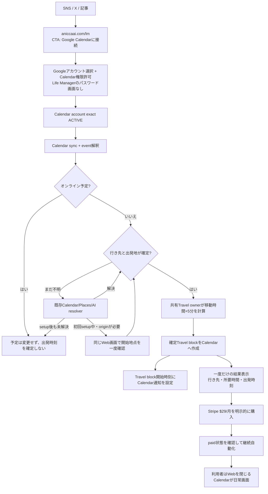

# Life Manager Web-First Travel Product

## Goal

Let a new Life Manager customer start with one action: **Connect Google Calendar**. The browser is a setup and payment handoff only; it is not a daily app, dashboard, or chat surface. No separate location tracker or messaging app is required. After connection, the shared Travel owner fills resolvable Calendar events with Travel blocks and a reminder at the calculated departure time. Existing Telegram tenants retain their legacy path; new Web tenants use Calendar as their only required daily surface.

The Web App Factory is a later phase. It starts only after this product has paid users and verified positive contribution; the first app's acquisition and cost evidence then becomes the factory's first reusable lesson.

## Delivery Status and TODO Authority

The current production cursor, W3-P0 root cause and unblock runbook, and remaining TODO order live in the [canonical Life Manager SSOT](2026-09-25-life-manager-unified-ssot.md). This document remains the Web product behavior/design reference.

## Superseded Contract

The approved 2026-08-26 Cloud On-Time Core contract made a verified Telegram actor the only tenant identity and retired the standalone browser onboarding flow. Dais's current explicit Web-first instruction supersedes that interface and identity choice for new Web users. It does not remove existing Telegram users, change their identity/session, enable phone calls, or weaken the existing Stripe-only paid-state writer.

The new Web identity is a verified Supabase Auth Google user. The Railway server uses Supabase SSR PKCE cookies and calls auth.getUser before accepting a user-scoped request. It derives uid as lm_ plus the verified Supabase user UUID. Client query/body identity, localStorage uid/sig, and Telegram chat IDs never establish Web tenant identity.

## Product Flow

1. The visitor opens `aniccaai.com/lm` and presses **Google Calendarに接続**. This is the only setup CTA. There is no separate Life Manager username/password screen.
2. That action starts Google identity verification and Calendar authorization. Google may show account selection and permission consent in one or more screens; the user does not need another manual button in Life Manager between them. The backend verifies the Google identity as tenant owner and the exact Calendar account as ACTIVE before reading events.
3. The shared Travel owner syncs upcoming Calendar events. It resolves origin from a previous physical Calendar event within 90 minutes, then a saved starting point. Only if the first useful physical event has no origin does the same Web setup ask once for a usual starting point. The user can type a base or explicitly tap to share one browser location while the page is open; this is not background tracking. This prompt is not shown when Calendar already provides an origin.
4. Once destination and origin are verified, the owner creates a Travel block and places its Calendar reminder at the calculated departure time. If the destination or origin is still unknown, leave that event unchanged and do not guess. If no first block is confirmed, do not charge.
5. After the first confirmed Travel block, show a one-time result summary and Stripe Checkout for the existing $29/month offer. Calendar connection itself does not charge. Continued automatic processing starts only after Checkout succeeds and the Stripe paid state is read back; an abandoned Checkout leaves only the first demonstrated block.
6. The user closes the browser. Google Calendar is the daily surface; there is no dashboard, event board, Web chat, Telegram/iMessage handoff, or extra app. To pause or disconnect later, the user can reopen the Web entry and pass Google identity verification to reach the small account-control screen.
7. A 15:00 event with a 40-minute route and 5-minute buffer gets a 14:15 Travel block and a reminder at 14:15. Actual device delivery still depends on the user's Google Calendar notification settings.

## Shared Implementation and Tenant State

- Keep one Life Manager product and the existing Railway service. Serve the Web app at LM_PANEL_BASE/lm; do not create a second scheduler or a copy of travel logic.
- Reuse lm_users, lm_panel_preferences, the Composio calendar transport, travelUserOnce/fillTravel, route caching, departure calculation, and lm_travel_log idempotency.
- Web-created lm_users rows may have telegram_chat_id null. The existing travel loop already skips Telegram reports when no chat ID exists. Web onboarding explicitly stores call_enabled=false and notifications_enabled=false; Calendar's own event reminder is independent of the Telegram notification switch.
- Set daily_automation_enabled=true only after Calendar is ACTIVE. For future Calendar blocks, resolve origin from an eligible previous Calendar event (the existing 90-minute rule), then saved starting point; never use today's live point for an event days ahead. Ask for a starting point in the same one-time Web setup only if the first useful event otherwise has no origin. A user may type a usual base or tap to share a one-time browser position while the page is open; do not turn that into background tracking. If required event data remains unknown after setup, leave that event unchanged until Calendar data is corrected. When a preference row already exists, preserve its automation choice; reject setup while calendar_disconnect_pending is true. Stripe webhook remains the only writer of lm_users.paid.
- The first confirmed Travel helper is the one-time value demonstration before checkout. Only a successful Stripe Checkout followed by paid-webhook/readback enables later scheduled Web travel runs; Calendar authorization alone does not start ongoing automation.
- Do not auto-link a Google account to a Telegram tenant by matching an unverified email. Existing Telegram accounts keep their current session and records; a future explicit link flow can be added from measured user need.
- Calendar account writes remain user-scoped by uid and selected connected_account_id. OAuth status must be ACTIVE before Calendar reads or writes begin.
- Web status reports connected only when the exact selected account is ACTIVE and its provider/account markers are persisted and read back on the Telegram-unbound `lm_users` row. A selected account with exact `MISSING` or `EXPIRED` status is actionable: user-initiated start may recover one unique exact-uid ACTIVE account or begin new OAuth, but never enable that stale account. Network/5xx, ownership, ID mismatch, and contradictory/unknown statuses remain unavailable and fail closed. If a callback consumed OAuth state before marker persistence, a user-initiated Calendar start may recover only one exact-uid ACTIVE account and must persist/read it back before reporting connected.
- A Web-only tenant (Web UUID uid plus `telegram_chat_id IS NULL`) is Travel-only. The legacy `tick`/`organsUserOnce` path skips it before upcoming/history Calendar reads or other non-Travel organs; `travelTick` is its only scheduled Calendar consumer. Existing Telegram tenants keep the legacy organ path.
- Before scheduled Calendar event access for a Web uid, re-read the current user row, require `telegram_chat_id IS NULL`, and verify that the exact selected account is still ACTIVE. Preserve the existing Telegram scheduler path.
- Carry that verified account ID through the Web travel run. Each Calendar transport call must reject if the current NULL-Telegram row no longer selects that exact ID; it must never silently switch to another account mid-run.
- After the Web travel owner confirms the exact account ACTIVE, it re-reads persisted automation and Calendar operation state before entering `fillTravel`. The Calendar transport rechecks that state immediately before Web create/patch dispatch; its control-state reader resolves Supabase URL/key the same way as the bound-account lookup on the normal `getCalendar` path. The browser is not kept open for status or messages; Google Calendar remains the daily surface.

## Travel Calendar Effect

- The departure calculation remains event start minus accepted route duration minus the existing single 5-minute buffer.
- Each Travel helper starts at the calculated departure instant and carries an event-level Calendar reminder at that start time. Use the supported event reminder override rather than inheriting an arbitrary calendar default; read back the created event's reminder. If the Composio create path cannot write/read this override, fix that path before claiming a departure-time alert. Device delivery still depends on the user's Calendar notification settings.
- Every created Travel event explicitly sets send_updates=none, exclude_organizer=true, and create_meeting_room=false. The event has no attendees, no Meet link, and no invitation emails.
- Repeated onboarding or scheduler evaluation relies on the existing unique (uid,event_key,leg) claim. Release it only when no provider write was dispatched or the Composio endpoint explicitly rejects the HTTP request with 4xx; after dispatch, a network/5xx/unreadable response or a 2xx `successful:false` result is effect-unknown. Retain that claim and reconcile through strict Calendar readback. Resolve it only when exactly one event matches the expected summary exactly, `startMs`/`endMs` exactly, and destination after whitespace removal plus lowercasing; if the readback is missing, failed, or ambiguous, keep the claim fenced and do not replay. A readback proves the helper exists but is not a create receipt, so do not report `travel_added` without a confirmed create response.
- Resolve an event destination from Calendar, Places, and the existing event interpreter before asking. If the first useful event needs a missing starting point while the one-time Web setup is open, ask there once; if the user skips or later events remain unresolved, leave them unchanged until the Calendar event is corrected. For Calendar blocks generated days ahead, use a nearby previous event location, then the saved base. Do not use today's GPS point as the origin for a future event.
- **Location-source decision:** The Web product does not use continuous GPS. Future Calendar blocks use a real previous Calendar event within 90 minutes, then the user's saved starting point. Telegram's Bot API `live_period` is a sharing window (60–86,400 seconds or indefinite), not update cadence; its `Location` has no per-fix timestamp. Our parser substitutes `message.edit_date`/`date`, and the consumer checks expiry without a maximum-age check, so a stale point can still be treated as current. Do not use Telegram live shares as a verified origin or describe them as “real-time.”
- **Conditional starting point:** If the next physical event has no previous Calendar origin and no saved base, show a one-time starting-point question inside the same Web setup. The user can enter a usual base or tap “Use current location” to grant the browser one foreground location read; store it only after they confirm it as their starting point. Validate the returned timestamp/accuracy at capture. If the user skips it, leave the affected event unchanged. No new tracker, native companion, or messaging app is required for this product, now or in the planned V2.
- **Broader OSS/platform audit:** The W3C Geolocation API exposes `navigator.geolocation` to `Window`, not a Service Worker. The PWA Safari sample calls `getCurrentPosition()` from a page; it is not background tracking. The 2017 Brotkrumen POC itself says the phone must stay awake and the PWA foregrounded. [Cap-go's MPL-2.0 Capacitor plugin](https://github.com/Cap-go/capacitor-background-geolocation) is actively maintained and supports native background updates, but it requires a Capacitor iOS app, Background Location mode, and Always permission; its native POST is for geofence transitions. [Capawesome's Capacitor plugin](https://github.com/capawesome-team/capacitor-plugins/tree/main/packages/background-geolocation) supports queued HTTP uploads but requires a paid license and a native app; force-quit stops uploads until relaunch. [capacitor-community/background-geolocation](https://github.com/capacitor-community/background-geolocation) also requires an installed native app and is less recently maintained. OwnTracks, Traccar Client, and Overland likewise require a phone app; My Tracks is an OwnTracks server under a noncommercial license, so it is not a commercial-service dependency. Apple's Location Push Service Extension can query location on demand using APNs, but requires a native extension, Always authorization, and a server; Apple limits delivery to about 360 location pushes per day and replenishes only one every few minutes. These are not Web-only solutions. Under the no-additional-app requirement, do not leave GPS tracking as a V2 TODO; the product's origin contract is Calendar history plus the one-time Web starting point.

#### Additional GitHub review: no app-free background location

- GitHub CLI search found [Safari Track issue 18](https://github.com/nbarrett/safari-track/issues/18): its iOS PWA lost background GPS when sent to the home screen, so the owner moved it into a Capacitor native shell with native geolocation.
- [GeoTracker-Apple-Automation](https://github.com/makiisthenes/GeoTracker-Apple-Automation) requires users to create location automations manually in Shortcuts and notes that location automations require confirmation. [ShortcutsAPI](https://github.com/gavinsawyer/shortcuts-api) also requires users to configure personal automations in Shortcuts.
- [icloud-location](https://github.com/jimmystridh/icloud-location) is MIT licensed, but its README says Apple's web interfaces are unpublished/unsupported and it requires Apple account login, trusted sessions, and 2FA. [google-maps-location-sharing](https://github.com/davenicoll/google-maps-location-sharing) says Google has no published Maps location-sharing API and uses exported HAR cookies against an internal endpoint. Neither is a safe, stable Calendar-only SaaS integration.
- These findings reinforce the product boundary: no separate location app or background GPS in V1 or V2. Calendar history plus one saved starting point handles events with enough schedule/location data; it cannot know unrecorded physical movement or promise perfect routing.

## Calendar Connect-only Interface

- The public marketing page lives at `aniccaai.com/lm`; its single primary CTA is **Google Calendarに接続** and hands off to the existing Railway `/lm` route.
- Google account selection and Calendar permission are part of that one connection action. The server still verifies the Google subject and selected account, but the product does not present a separate Life Manager account/password screen or label the CTA "Googleで続ける".
- The current signed-in Railway app renders `dashboardMarkup`; replace it with a one-time connection/setup/checkout handoff. Do not show a daily event list, dashboard, web chat thread, or message composer. After confirmation/payment, the user closes the page and uses Google Calendar.
- No home/base address is collected before Google connection. After Calendar is ACTIVE and upcoming events are read, ask for a starting point in the same Web setup only if the first useful physical event has no prior Calendar origin and no saved base. Offer one field (“Where do you usually start from?”), with manual entry and an explicit “Use current location” button. The button requests one browser position while the page is open and saves it only after the user confirms it as the starting point; it does not start background tracking. If skipped, leave that event unchanged.
- New Web users are not asked to install Telegram, connect iMessage, enter a phone number, or grant Gmail inbox access. No message app or message gateway is part of the required V1/V2 flow. Existing Telegram tenants keep their legacy behavior; do not link accounts by matching email.
- Google OAuth does not reveal a phone number or GPS. The local `imsg` bridge, Telegram live location, OwnTracks, Traccar, and location-push extensions are not Web location sources. The W3C browser geolocation API is available to an active page only; a browser/service worker cannot provide continuous location after the page is closed.
- The browser is used once for connection, any conditional starting-point question, and payment—not for daily status. Google Calendar remains the daily surface. Travel blocks get an event-level reminder at the calculated start; device delivery still depends on the user's Calendar notification settings.
- Use the appointment's explicit IANA timezone for route/departure calculations; when absent, preserve the existing Calendar/user timezone. The helper's UTC storage timezone must not become a display source.
- Resolve online/in-person status and destinations from Calendar, Places, and the existing event interpreter before asking. During the one-time Web setup, ask at most once if the first useful event needs a starting point; after setup, leave later unresolved events unchanged until the user corrects Calendar. Never request Gmail read scope or show a guessed departure/Travel block.
- Each Calendar Travel event has an event-level reminder at its calculated start. Read back this override after creation; if the Composio create path cannot write or read it, fix that path before claiming a departure-time alert. Device delivery still depends on the user's Calendar notification settings. Do not present the browser as a notification channel.
- Keep pause/disconnect fences and exact provider-account readbacks. Resume requires the exact selected Calendar account to be ACTIVE; each candidate event still needs a resolvable origin before a Travel write. Disconnect atomically pauses automation and sets a Web-only disconnect-pending fence before provider I/O. A durable Calendar-enable claim serializes re-enable against disconnect; only its matching UUID may finish or release it. Preserve the existing no-effect/effect-unknown recovery and never enable a stale or ambiguous account. The Web client is connection/checkout handoff only; do not add a dashboard or chat thread.
- Do not add a separate location-tracking app, messaging-app onboarding, employee/staff feature, always-on GPS, generic calendar replacement, or factory UI. The no-additional-app contract applies to V1 and V2: use Calendar-derived origin, conditionally ask for one starting point in the same Web setup, and skip events whose location remains unknown. Do not leave a native location app as a deferred V2 dependency.
- Keep the existing aniccaai.com marketing surface separate from the Railway product route. Its current source is the active `Daisuke134/anicca-products` repo at `apps/landing`; its Netlify config uses that directory as the build base and `Netlify Deploy (Landing)` watches its `apps/landing/**` path. The `apps/landing` subset in this Life Manager repo is used for backend contract tests and has diverged from the live source; do not edit it as a substitute for the public route. After Calendar connection, first Travel block, price terms, and cost are read back, update the anicca-products source and verify the Netlify deploy and public route handoff to the exact Railway `/lm` origin.

### UI/UX仕様の明確化（2026-10-07 最新方針）

**製品の毎日の画面はGoogle Calendar。** Webは最初の接続・必要な場合の基点登録・一度だけの課金だけに使い、接続後にダッシュボード・予定一覧・Webチャットを表示しない。Travel blockの開始時刻にCalendarイベント通知を設定し、端末への配信自体は利用者のCalendar通知設定に従う。他のメッセージアプリを必須にしない。

| 段階 | UIと操作 |
|---|---|
| 1. 集客ページ | aniccaai.com/lm に、予定と地図を何度も確認する苦痛、Calendarへ移動時間を自動で確保する短いデモ、**$29/月**を表示。主CTAは「Google Calendarに接続」。Telegram installを要求しない。 |
| 2. Calendar接続 | 1つのCTAからGoogleの本人確認・アカウント選択・Calendar権限許可へ進む。Googleが複数の認可画面を出すことはあるが、Life Manager画面に戻って別の接続ボタンを押させない。Life ManagerのID/パスワード画面は作らない。バックエンドは検証済みsubjectとCalendar accountのexact ACTIVEを読み戻すまでイベントを読まない。 |
| 3. 自動処理 | 接続後、前の物理Calendar予定（90分以内）または保存済み基点から出発地が分かる予定へTravel blockを追加する。最初の有効予定の出発地だけが分からない場合に限り、同じWeb setupで一度「普段どこから出発しますか？」と聞く。住所入力か、利用者が押した時のブラウザ位置1回で登録する。全員に必須質問はしない。Travel blockはイベント開始−移動時間−既存5分bufferで、開始時刻にCalendar通知を設定する。 |
| 4. 一度だけの結果・課金 | 最初のTravel blockを確認できた後、1回だけ「次の予定: 15:00 / 移動40分 / 14:15出発 / CalendarにTravel blockを追加」と表示する。その画面に$29/月とStripe Checkoutを出す。Calendar接続だけで課金せず、CheckoutとStripe paid状態が確認された後に継続自動化を有効にする。最初のblockが作れなければ請求しない。 |
| 5. 日常と例外 | setupを閉じた後、日常の画面はGoogle Calendarだけ。場所が未設定、オンライン/対面が不明、出発地が推測できない予定にはTravel blockを作らない。予定をCalendarで修正すれば次の同期で再評価する。Webチャット、Telegram、iMessage、別の追跡アプリは使わない。接続停止・解除が必要な時だけWebへ戻り、本人確認後に小さな操作画面を使う。 |

**最小画面遷移**

### No-extra-app location contract

- New Web users do not link Telegram, iMessage, SMS, or a separate tracking client. Google Calendar is the daily surface. Existing Telegram tenants keep their legacy transport, but it is not a dependency for Web signup or location.
- Future Travel blocks use a physical previous Calendar event ending within 90 minutes, then the saved starting point. If the first useful event has no prior location or saved base, the one-time Web setup asks for a usual starting point. The user may type it or tap “Use current location” for one browser position while the page is open; store it as a starting point only after confirmation. If skipped, leave the affected event unchanged.
- Do not use Telegram live location as a verified origin. `live_period` is a sharing window, not an update cadence; Bot API `Location` has no fix timestamp. The parser uses `edit_date || date`, `getLiveLocation` checks expiry, and `freshLive` has no max-age gate, so a stale point can remain eligible. Existing legacy Telegram location handling must fail closed for routing until WB-09 changes it.
- **Broader OSS/platform search:** The W3C Geolocation API exposes `navigator.geolocation` to `Window`, not a Service Worker. The 2024 iOS Safari sample only calls `getCurrentPosition()` from a page. The 2017 Brotkrumen POC says its phone must stay awake and the PWA foregrounded. These do not provide location after a Web page closes ([W3C API](https://www.w3.org/TR/geolocation/#geolocation-interface), [Safari sample](https://github.com/JoeM-RP/serviceworker-safari), [Brotkrumen POC](https://github.com/RichardMaher/Brotkrumen)).
- Native GitHub options all require an installed Life Manager app shell and OS permission: Cap-go's MPL-2.0 Capacitor plugin is free and active but needs an iOS Capacitor app, Background Location mode, and Always permission; Capawesome offers a local queue and HTTP retries but requires a paid license and a native app; capacitor-community's plugin is older and also native-only. Transistorsoft requires a release license; `dc-bgeo`'s Swift façade wraps a closed-source engine. OwnTracks, Traccar Client, and Overland are separate phone apps; My Tracks is a server for OwnTracks under a noncommercial license, so it cannot be used as this commercial service without separate permission.
- Apple’s Location Push Service Extension can query a location on demand when an app is not running, but requires a native app extension, APNs server integration, and Always authorization. Apple limits these requests to about 360 per device per day and replenishes roughly one every few minutes; it is not a web capability ([Apple LPSE docs](https://developer.apple.com/documentation/corelocation/creating-a-location-push-service-extension), [APNs demo](https://github.com/transistorsoft/location-push-service-demo)).
- **Product decision:** no location tracker, native companion, or background-GPS phase is planned for this no-extra-app Cloud product in V1 or V2. Do not promise live location or perfect routing. The route origin comes from Calendar history and one saved starting point; an event without enough information remains unchanged.
- **Privacy:** browser location is requested only after a user taps the one-time starting-point action. Save one confirmed base, not a location history. Do not request Always/background permission or silently track.

**Staffの意味:** 過去案のstaffは従業員/チーム招待機能を指す。Travel v1にはスタッフ欄・招待UI・チーム料金を含めない。

## Price, Marketing, and Profit

- **公開offerのreadback（2026-10-07）:** `https://aniccaai.com/lm` は「Calendar × Telegram」と表示し、主要CTAをTelegramへ送り、$29/月を掲示する。Telegramのルート通知と任意の電話を説明しており、目標のbrowser-first signupと一致していない。
- **Stripe catalogのreadback（2026-10-07）:** 確認対象のlive `Anicca Life Manager`商品にはpriceが2件（active $29/月と$20/月、inactive priceは0件）。この2 priceには全statusでsubscriptionがなく、確認対象商品のrecurring MRRは$0。2026-10-06の前回official readbackではStripe `trial_period_days`が空で、Web setupはapp entitlementを3日で開始する。Stripe checkoutとapp trialの条件が一致する証拠はまだない。
- **Life Manager全体の利用料推定（2026-09-07 01:21 UTC〜2026-10-07 01:21 UTC）:** append-onlyの`lm_api_cost`台帳はprovider利用料推定$68.786544、その他の推定$0.306765、30日合計$69.093309（約$2.30/日）を記録する。Life Managerの6 tenant分であり、Web customer分ではない。provider利用48,524件のうち3件は推定額なし。この集計は請求書、Web別原価、顧客あたり平均ではない。Composio、hosting、Stripe fee/refund/settlement、marketing費は含まれない。
- **価格決定:** 公開offerと現行Stripe checkoutの**$29/月を維持する**。以前の$5/月・$36/年案は競合価格から出した私の余計な提案として撤回する。既存catalogにある$20/月priceは現行公開page/Payment Linkで使わず、Stripe catalogの価格も増減しない。競合価格はpositioning比較にだけ使い、値下げ根拠にしない。
- $29/月で$10,000 gross MRRを超えるには**345人のactive paid subscribers**（$10,005 gross MRR）が必要。これはfee/cost控除前であり、net profitの達成数ではない。1%/3%/5%のvisit-to-paid conversionは計画用の仮定で、それぞれ34,500/11,500/6,900 qualified landing visitsが必要になる。実際のconversionは未計測なので、source attributionとpaid invoiceから実績を計測して仮定を更新する。これらの仮定はforecast扱いしない。net contribution $10,000に必要な人数はWeb別変動費、refund、payment fee、hosting、CACを測るまで不明。
- **Marketing状態（2026-10-07 readback）:** `/en`はLife Manager全体のumbrellaページ、`/lm`はTravel専用ページだが、後者のCTAはまだTelegramを指す。`/socials`は現在`loading…`を返す。`/dashboard.json`は2026-06-05更新、social snapshotは2026-06-04で古く、表示された$548支出はClaude/ChatGPT/living/Apify/Postiz等を含む混合合計でLife Manager marketing費ではない。`@anicca.ai`のpublic profile fetchは「Profile isn't available」を返したが、これはbanの証明ではない。現在のInstagram statusとLife Manager marketing spendはunknown。公式accountのstatusを確かめるまでは新規アカウントを作らない。
- **初期marketing:** 訴求は「CalendarとMapsを何度も確認しなくていい。移動時間と出発時刻がCalendarに入る」。本人の毎日の苦痛（見落としが怖くて予定と地図を何度も確認する）を、ユーザー由来のfounder storyとして記事と短尺動画の核にする。初期audienceは対面予定が定期的にあるconsultant/freelancer/field salesの仮説。最新の運用目標は**Xに毎時1件の独自投稿（24件/日）、9:16 demo 2本/日をReels/TikTok/Shortsへplatform-native captionで展開、役立つowned-media記事1本/日**。毎時topic/feedbackを採取し、投稿文は重複させない。これはユーザーが指定した高頻度の初期実験であり、未計測の勝ちパターンとは言わない。Xはbulk/duplicate/irrelevant spamを禁じる [公式policy](https://help.x.com/en/rules-and-policies/platform-manipulation)。SEO記事も、検索順位操作を目的とした薄い大量生成を避け、利用者に固有の助けを足す [Google Search spam policy](https://developers.google.com/search/docs/essentials/spam-policies#scaled-content)。demoでは合成Calendar dataを使い、実予定名・住所・通話音声は公開しない。source→Calendar ACTIVE→初回Travel block→Stripe checkout→paid invoice→D7/D30 retentionを計測する。現在のmarketing spendとpaid CACは未確認。signup・checkout・attributionとorganic基準値をreadbackした後、明示spend cap内で小さく広告CACを測り、継続率とsettled contributionが成立するまで拡大しない。
- **既存marketing資産/loopのreadback（2026-10-07）:** canonical sourceに日次動画generator `skills/video/daily-lm-video`、Postiz向け `skills/video/lm-distribution`、日次measurement `skills/video/lm-self-improve` はあるが、いずれも`config/loop-registry.json`にLife Manager content/publish ownerとして登録されていない。Marketing Engineのproduct registryにもLife Manager packはない。`life-manager-selfbuild`は4時間ごとのbuild loop（10/07 04:28Z pass、effect none）で販売loopではない。`lm-recording-store`は30分ごとの録音保存loopで、10/07 05:46Zの最新readbackは`resource_capacity_busy`によるadmission defer、直前の成功は05:16Z。既存の`content-reels-life-manager.md`はTelegram CTA・$20/月・電話中心で現行$29/Web-firstと不一致。Remotion素材skills/video/lm-assetsは4.0.533へ更新し、Travel-firstの合成Calendar demo v1を生成済み。未公開のdraftは/Users/anicca/.local/share/life-manager/marketing-drafts/20261007-lm-calendar-connect-v1.mp4。WB-15でTravel専用creative bank、Remotion版上げ・再制作、X/Reels/TikTok/Shorts/owned-article配信、投稿receipt→conversion学習を一つの販売loopへ接続する。旧録音素材は公開せず、Travel体験を合成Calendar dataで作る。
- Reuse existing product marketing copy and the shared marketing engine's content-manifest idea. Do not activate its private Instagram automation route; actual account operation must use the registered CloakBrowser direct-CDP route.
- gross MRRと月次contributionを分けて報告する。contributionの基準はpaid invoice/chargeの控除前金額とし、refundとStripe feeを一度だけ控除する。payout/settlementはnet receiptとの照合に使い、そこからrefund/feeを再控除しない。その後、同じ期間のroute/provider・Composio・hosting・attributed marketing spendを控除する。repo内のfounder申告historical revenueをこの商品のprofit証拠に使わない。

### Market research and content preparation (2026-10-06)

**根拠（2026-10-07再確認）。** [AddTravelTime](https://www.addtraveltime.com/) はGoogle Calendarへ移動blockを自動追加し、$5/月・$36/年、14日・カード不要trialを表示する。[DOFOTTの料金](https://dofott.com/pricing) は場所付き予定を月12件まで無料とし、超過月は$5+税、年額は$36+税。Product Hunt経由なら2026-10-31まで初年度$18+税で、登録時にカードを保持する。[TravelSyncの料金](https://www.travelsync.co.uk/pricing) は14日・カード不要trial。TravelSyncは£5/月または£50/年で、移動block・mileage記録/export・travel block通知を含む。TravelSync Proは£8/月または£80/年で、メール不在返信・出発前live-traffic warning・出発時のleave-now email・朝のbriefingを追加する。どちらもGoogleまたはMicrosoft calendarに対応する。時間節約の数値はvendor claimで独立検証していない。[Morgenのtravel workflow guide](https://www.morgen.so/guides/auto-schedule-travel-time) はGoogle、Outlook、iCloud、Fastmailのcalendar、出発地、移動手段、往復、bufferを扱う。これらは機能・価格帯の比較材料であり、競合の売上や利益の証明ではない。

Qualitative pain evidence is consistent but anecdotal. In a [2024 r/productivity thread](https://www.reddit.com/r/productivity/comments/1akzy5j/calendar_management_how_do_you_factor_in_travel/), a user describes forgetting travel time while scheduling a second appointment before a distant appointment. In a [2019 r/shortcuts request](https://www.reddit.com/r/shortcuts/comments/fsybqg/automatically_add_travel_time_from_google_maps/), a user describes manually moving from a Calendar event to Google Maps and back to create a separate travel event. A [Google Calendar Help Community question](https://support.google.com/calendar/thread/254623733/set-time-to-leave-for-calendar-events?hl=en) asks for a time-to-leave notification; a community expert's answer describes a manual Maps-to-Calendar path. That page is community content, not a current product contract, so verify Google's UI before publishing a how-to claim.

**Inference.** The strongest message is the mental load of repeatedly checking Calendar and Maps because the user is afraid of missing an event. The first audience to test is people with recurring in-person appointments and client meetings; this is a fit hypothesis, not a validated ICP. Promise that Life Manager automatically reserves travel time and puts the departure block in Calendar; do not guarantee that a person will never be late or never miss a flight.

**Search candidates.** These 50 English query candidates are grouped by intent, based on observed result phrasing plus close variants. Search-volume data and Google Search Console evidence are unavailable; do not present these phrases as traffic forecasts. Prioritize by product fit and intent until post-launch impressions and conversion data exist.

| Cluster | Intent | Candidate queries | Priority |
|---|---|---|---|
| Automatic travel blocks | Commercial / transactional | automatically add travel time to Google Calendar; Google Calendar automatic travel time; automatic travel blocks for Google Calendar; Google Calendar travel time app; travel time blocker for calendar; calendar app automatically adds drive time; Google Maps travel time calendar integration; Google Calendar travel block app; automatic commute blocks calendar; travel time automation for appointments | 1 |
| Google Calendar how-to | Informational | how to add travel time to Google Calendar; how to add travel time to a Google Calendar event; add driving time to Google Calendar; add a travel event from Google Maps to Calendar; how to block travel between calendar events; set time to leave for calendar events; add buffer before Google Calendar appointments; calculate travel time between appointments; automatically add travel time to recurring events; Google Calendar travel time desktop | 1 |
| Late-arrival problem | Informational | calendar reminder too late to leave; forget travel time when scheduling appointments; avoid being late to appointments; calendar keeps booking over commute time; Google Calendar does not account for commute; meetings back to back travel time; how early to leave for an appointment; stop being late to client meetings; calendar schedule travel time for appointment; travel time gap between meetings | 2 |
| Product comparisons | Commercial | best Google Calendar travel time app; travel time apps for Google Calendar comparison; AddTravelTime alternative; DOFOTT alternative; TravelSync alternative; AddTravelTime vs DOFOTT; Google Calendar vs Apple Calendar travel time; Google Maps calendar travel-time automation; best calendar app with travel time; calendar departure alert vs travel block | 3, after price/cost proof |
| In-person professional use | Commercial / informational | travel time calendar for consultants; calendar travel blocks for field sales; automatic drive time for client visits; travel time planning app for contractors; appointment calendar for service businesses; Google Calendar travel time for freelancers; travel blocks for on-site meetings; route planner that syncs with calendar; prevent overlapping client appointments and travel; calendar travel time for personal appointments | 3, validate ICP |

**First content queue (latest user-directed high-volume experiment).** Publish one original X post every hour (24/day), two distinct 9:16 calendar demos each day cross-posted to Reels, TikTok, and Shorts with platform-native captions, and one useful owned-media article each day. Run hourly topic/feedback collection and refresh drafts between posts. Do not repeat the same copy or flood each account with identical cross-posts. This is the requested launch experiment, not a claim that the cadence is a platform-wide best practice. X prohibits bulk, duplicative, irrelevant, or unsolicited spam; Google Search prohibits scaled pages created mainly to manipulate rankings without helping readers ([X policy](https://help.x.com/en/rules-and-policies/platform-manipulation), [Google policy](https://developers.google.com/search/docs/essentials/spam-policies#scaled-content)).

Start with three article angles: (1) a first-person founder story about the stress of checking Calendar and Maps repeatedly, (2) “How to add travel time to Google Calendar”, using the current Google UI, and (3) “Why an event reminder can arrive on time and still be too late to leave”. Use synthetic event data or anonymized existing screens; do not publish raw private event titles, addresses, or call recordings. Replace stale scripts that say Telegram-only or $20/month before distribution.

Draft X hooks, for internal review only:

- “A calendar reminder can arrive on time and still be too late. The missing block is the trip before the appointment.”
- “An empty 2:30 slot is not free time if the next meeting is across town. The trip needs to be reserved before someone books over it.”
- “I used to check Calendar, then Maps, then Calendar again because I was scared of missing the moment to leave. Life Manager puts the trip into Calendar for me.”
- “Connect Google Calendar once. Life Manager fills eligible travel blocks automatically; your Calendar stays the screen you already use.”

Draft Remotion demos use synthetic Calendar events: show the one-time setup screen with one “Connect Google Calendar” button, a visible tap, Google's account/Calendar consent handoff, then the connected Calendar schedule. Show a prior in-person event ending at 14:00 in Roppongi as the route origin, then a 15:00 Shibuya meeting 40 minutes away; with the 5-minute buffer, the helper starts at 14:15. Do not show a daily dashboard or web chat. Keep publication closed until the one-action Calendar flow, first helper, $29 Checkout terms, and source attribution are read back. Link every campaign to its channel/source and measure Calendar connection, confirmed Travel helper, checkout, paid invoice, and retention.

## Factory Gate

Do not implement app-generation automation yet. Start a separate Web App Factory design only after Life Manager has at least 10 paying Web customers and three consecutive months of positive contribution with actual costs. Then reuse the mobile loop's product lifecycle, shared marketing evidence, and Life Manager's reviewed Self-Build promotion boundary. The factory must take customer and cost evidence as inputs and emit one independently measurable Web product at a time.

## Acceptance Criteria

1. A fresh browser opens the hosted Railway /lm route and starts with one visible action, “Google Calendarに接続”. Google account selection and consent happen as part of Calendar connection; no separate Life Manager password/account form or Telegram install is required.
2. The server verifies the Supabase user, derives uid from the verified subject, and refuses cross-tenant requests and client-supplied uid/chat_id/paid values.
3. Calendar connection is bound to that uid; persisted exact ACTIVE account readback precedes any event access, including scheduler runs. Web-only tenants never enter legacy non-Travel organ/calendar-history reads; scheduled Calendar access uses the exact-bound Travel owner. Interrupted callback completion can recover through a user-initiated start only when the exact-uid ACTIVE account is unique. Exact MISSING/EXPIRED selections lead to unique ACTIVE recovery or new OAuth without re-enabling the stale account; provider/network ambiguity stays fail-closed.
4. No second app or unconditional home-address field is required at onboarding. A Travel write uses an eligible previous Calendar event or saved base. If the first useful event has no origin, the same Web setup asks once for a starting point, by address or explicit foreground browser location permission. No Telegram live location or native tracking client is required or treated as verified current location. If the prompt is skipped, the event remains unchanged.
5. Initial setup creates only the first confirmed Travel helper as a one-time value demonstration. After Checkout and paid-state readback, scheduled runs fill every eligible event. Departure time matches the shared calculation with one 5-minute buffer; replay creates no duplicate helper. The Web success state is one-time only; no dashboard or web chat exists.
6. New Travel events send no attendee emails, add no organizer attendee, and request no Meet link. Each Travel event has an event-level reminder at its calculated start time, read back after creation; device notification delivery remains subject to the user's Calendar settings.
7. No dashboard, event board, or Web chat is shown after onboarding. No messaging app or location app is required for Web users. Ask for a starting point once in the same setup only if the next useful event needs it; later unresolved events remain unchanged until the Calendar entry is corrected.
8. Pause/resume/disconnect controls retain the verified Web identity and CSRF fence. Resume requires exact ACTIVE Calendar binding; disconnect pauses, changes only the selected provider account, and clears its binding only after exact owner/toolkit/account-ID disabled readback. A UUID-owned, leased Calendar claim prevents reconnect/disconnect overlap; preserve exact-state/no-effect recovery and never replay an uncertain provider write. Origin absence is an event-level skip, not a reason to fabricate a base.
9. Repeat onboarding, OAuth callback, and scheduler replay produce no duplicate Calendar helper. Unknown create outcomes retain the claim and require strict readback before any resolution. Existing Telegram auth, call consent, and existing-user behavior pass their current contracts.
10. Stripe subscription changes are accepted only through the existing webhook. The public price and terms match the official Stripe catalog before launch.
11. Railway deploy SHA, fresh browser signup, Calendar ACTIVE account, created Travel event, replay-zero, Stripe invoice/renewal, and actual cost readback are reported separately.
12. The Web App Factory remains unimplemented until its paid-user and positive-contribution gate is met.

## Current External Documentation

- Supabase SSR PKCE, server cookies, and verified getUser: https://github.com/supabase/ssr/blob/main/README.md
- Composio Google Calendar account and event input contract: https://docs.composio.dev/toolkits/googlecalendar
- Composio tool execution response and error-code contract: https://docs.composio.dev/reference/errors and https://docs.composio.dev/reference/api-reference/tools/postToolsExecuteByToolSlug
- Google Calendar default reminders and overrides: https://developers.google.com/workspace/calendar/api/concepts/reminders
- Google Calendar event-level reminders field: https://developers.google.com/workspace/calendar/api/v3/reference/events
- Telegram Bot API location and request-location buttons: https://core.telegram.org/bots/api#location and https://core.telegram.org/bots/api#keyboardbutton
- Apple Core Location authorization and background updates: https://developer.apple.com/documentation/corelocation/requesting-authorization-to-use-location-services and https://developer.apple.com/documentation/corelocation/handling-location-updates-in-the-background
- Apple Location Push Service Extension requirements and limits: https://developer.apple.com/documentation/corelocation/creating-a-location-push-service-extension
- W3C Geolocation API (Geolocation is exposed to Window): https://www.w3.org/TR/geolocation/#geolocation-interface
- W3C Service Worker geolocation request: https://github.com/w3c/ServiceWorker/issues/745
- PWA examples reviewed: https://github.com/JoeM-RP/serviceworker-safari and https://github.com/RichardMaher/Brotkrumen
- Further GitHub repositories reviewed: https://github.com/nbarrett/safari-track/issues/18, https://github.com/makiisthenes/GeoTracker-Apple-Automation, https://github.com/gavinsawyer/shortcuts-api, https://github.com/jimmystridh/icloud-location, and https://github.com/davenicoll/google-maps-location-sharing
- Native Capacitor clients reviewed: https://github.com/Cap-go/capacitor-background-geolocation, https://github.com/capacitor-community/background-geolocation, and https://github.com/capawesome-team/capacitor-plugins/tree/main/packages/background-geolocation
- OwnTracks server requiring the mobile app (PolyForm Noncommercial): https://github.com/the-hcma/my-tracks
- APNs Location Push Service demonstration: https://github.com/transistorsoft/location-push-service-demo
- OwnTracks iOS reporting behavior and fix timestamps: https://owntracks.org/booklet/features/ios/ and https://owntracks.org/booklet/tech/json/
- OwnTracks iOS client (MIT): https://github.com/owntracks/ios
- Traccar Client background tracker: https://github.com/traccar/traccar-client and https://www.traccar.org/client/
- Overland iOS GPS logger (Apache-2.0): https://github.com/aaronpk/Overland-iOS
- OSS Mac iMessage bridge used by the local host: https://github.com/openclaw/imsg
- Apple Messages for Business official-channel requirements (distinct from the local imsg bridge): https://register.apple.com/resources/messages/messaging-documentation/ and https://register.apple.com/resources/messages/messaging-documentation/policies
- Official Remotion documentation: https://www.remotion.dev/docs
- Direct category pricing reference: https://www.addtraveltime.com/
- Supabase Auth redirect URL allowlist: https://supabase.com/docs/guides/auth/redirect-urls
- Supabase Google OAuth provider setup and callback: https://supabase.com/docs/guides/auth/social-login/auth-google
- Supabase CLI db push: https://supabase.com/docs/reference/cli/usage#supabase-db-push
