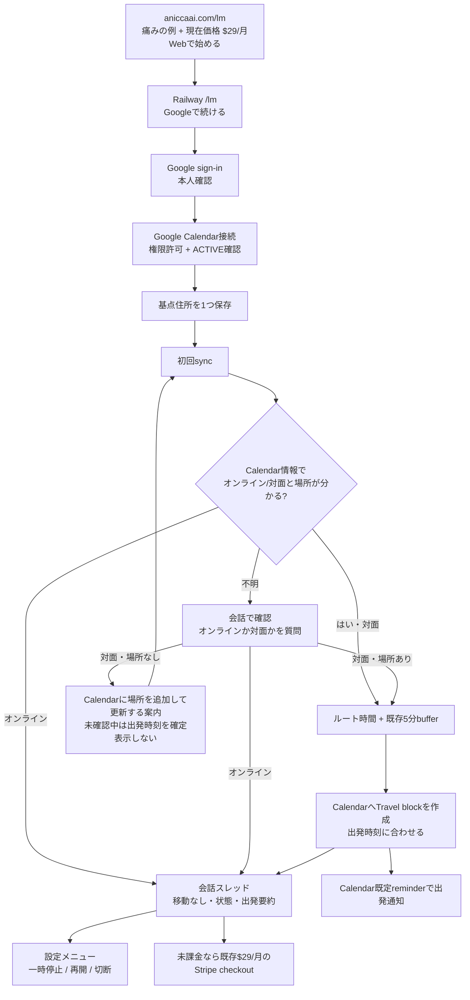

# Life Manager Web-First Travel Product

## Goal

Let a new Life Manager customer use the hosted product from a browser without installing Telegram. Life Manager connects Google Calendar, inserts a travel block before a physical appointment, and makes the actual departure time visible before the user's usual event reminder would be too late.

The Web App Factory is a later phase. It starts only after this product has paid users and verified positive contribution; the first app's acquisition and cost evidence then becomes the factory's first reusable lesson.

## Delivery Status and TODO Authority

The current production cursor, W3-P0 root cause and unblock runbook, and remaining TODO order live in the [canonical Life Manager SSOT](2026-09-25-life-manager-unified-ssot.md). This document remains the Web product behavior/design reference.

## Superseded Contract

The approved 2026-08-26 Cloud On-Time Core contract made a verified Telegram actor the only tenant identity and retired the standalone browser onboarding flow. Dais's current explicit Web-first instruction supersedes that interface and identity choice for new Web users. It does not remove existing Telegram users, change their identity/session, enable phone calls, or weaken the existing Stripe-only paid-state writer.

The new Web identity is a verified Supabase Auth Google user. The Railway server uses Supabase SSR PKCE cookies and calls auth.getUser before accepting a user-scoped request. It derives uid as lm_ plus the verified Supabase user UUID. Client query/body identity, localStorage uid/sig, and Telegram chat IDs never establish Web tenant identity.

## Product Flow

1. The visitor discovers Life Manager through social/search, opens the public aniccaai.com/lm landing page, and chooses Start on the web. The CTA hands off to the hosted Railway /lm app.
2. Supabase Auth verifies the Google identity and returns to the server-owned callback. The server resumes or creates the corresponding existing lm_users row.
3. The user explicitly grants Google Calendar access through the existing Composio-managed Calendar connection. The page shows connected only after the selected account is read back as ACTIVE and bound to the same uid.
4. The user enters one usual starting location. Calendar, home location, and first sync are the only required setup steps. Phone, calls, Telegram, Gmail, live location, and staff are not required.
5. The existing travel owner runs for this uid. It uses the shared route calculation and durable lm_travel_log claim; the conversation sends a concise message with the next appointment, route duration, Travel block, and computed departure time.
6. Web users have calls disabled and no Telegram delivery. The signed-in product opens one conversation thread, not a dashboard. A Calendar Travel event uses the user's Google Calendar default reminder settings; the UI states this dependency and never claims that Life Manager changed the user's device-notification settings.

## Shared Implementation and Tenant State

- Keep one Life Manager product and the existing Railway service. Serve the Web app at LM_PANEL_BASE/lm; do not create a second scheduler or a copy of travel logic.
- Reuse lm_users, lm_panel_preferences, the Composio calendar transport, travelUserOnce/fillTravel, route caching, departure calculation, and lm_travel_log idempotency.
- Web-created lm_users rows may have telegram_chat_id null. The existing travel loop already skips Telegram reports when no chat ID exists. Web onboarding explicitly stores call_enabled=false and notifications_enabled=false; Calendar's own event reminder is independent of the Telegram notification switch.
- Set daily_automation_enabled=true only for first setup after Calendar is ACTIVE and a valid home address is stored. When a preference row already exists, preserve its automation choice; reject setup while calendar_disconnect_pending is true. Start the existing 3-day trial once at that server-owned transition; the browser cannot set trial or paid. Stripe webhook remains the only writer of lm_users.paid.
- Do not auto-link a Google account to a Telegram tenant by matching an unverified email. Existing Telegram accounts keep their current session and records; a future explicit link flow can be added from measured user need.
- Calendar account writes remain user-scoped by uid and selected connected_account_id. OAuth status must be ACTIVE before Calendar reads or writes begin.
- Web status reports connected only when the exact selected account is ACTIVE and its provider/account markers are persisted and read back on the Telegram-unbound `lm_users` row. A selected account with exact `MISSING` or `EXPIRED` status is actionable: user-initiated start may recover one unique exact-uid ACTIVE account or begin new OAuth, but never enable that stale account. Network/5xx, ownership, ID mismatch, and contradictory/unknown statuses remain unavailable and fail closed. If a callback consumed OAuth state before marker persistence, a user-initiated Calendar start may recover only one exact-uid ACTIVE account and must persist/read it back before reporting connected.
- A Web-only tenant (Web UUID uid plus `telegram_chat_id IS NULL`) is Travel-only. The legacy `tick`/`organsUserOnce` path skips it before upcoming/history Calendar reads or other non-Travel organs; `travelTick` is its only scheduled Calendar consumer. Existing Telegram tenants keep the legacy organ path.
- Before scheduled Calendar event access for a Web uid, re-read the current user row, require `telegram_chat_id IS NULL`, and verify that the exact selected account is still ACTIVE. Preserve the existing Telegram scheduler path.
- Carry that verified account ID through the Web travel run. Each Calendar transport call must reject if the current NULL-Telegram row no longer selects that exact ID; it must never silently switch to another account mid-run.
- After the Web travel owner confirms the exact account ACTIVE, it re-reads persisted automation and Calendar operation state before entering `fillTravel`. The Calendar transport rechecks that state immediately before Web create/patch dispatch; its control-state reader resolves Supabase URL/key the same way as the bound-account lookup on the normal `getCalendar` path. Read-only chat status remains available while automation is paused.

## Travel Calendar Effect

- The departure calculation remains event start minus accepted route duration minus the existing single 5-minute buffer.
- The Travel helper starts at the calculated departure instant and uses the user's default Calendar reminders. Google Calendar's API inherits the calendar's default reminders when an event does not override them. If readback shows that no reminder applies, the UI does not claim an alert is configured.
- Every created Travel event explicitly sets send_updates=none, exclude_organizer=true, and create_meeting_room=false. The event has no attendees, no Meet link, and no invitation emails.
- Repeated onboarding or scheduler evaluation relies on the existing unique (uid,event_key,leg) claim. Release it only when no provider write was dispatched or the Composio endpoint explicitly rejects the HTTP request with 4xx; after dispatch, a network/5xx/unreadable response or a 2xx `successful:false` result is effect-unknown. Retain that claim and reconcile through strict Calendar readback. Resolve it only when exactly one event matches the expected summary exactly, `startMs`/`endMs` exactly, and destination after whitespace removal plus lowercasing; if the readback is missing, failed, or ambiguous, keep the claim fenced and do not replay. A readback proves the helper exists but is not a create receipt, so do not report `travel_added` without a confirmed create response.
- Missing event location or missing home location leaves that event unchanged and explains the missing input in the Web conversation. Web-only users receive no Telegram location question.

## Web Chat Interface

- The public marketing page lives at aniccaai.com/lm; its main CTA hands off to the existing Railway `/lm` app. Keep these two surfaces visually and technically distinct.
- Telegram already has a conversation UI. The current Railway app renders `dashboardMarkup` after sign-in; the Web conversation described here is the target and is not live yet. WB-10 includes replacing that signed-in dashboard before promoting the Web route.
- The app is server-rendered HTML/CSS using the existing raw Node service. The logged-out screen has one Google sign-in action. Calendar permission and one home/base address are the only setup inputs; there is no separate Life Manager password form.
- After setup, show a single mobile-first conversation thread, not a dashboard or calendar board. The agent's first message states the next departure, event, route duration, and whether the Travel block was confirmed. Keep a single message composer for follow-up questions.
- Display appointment and departure in the appointment's explicit IANA timezone; when absent, use browser-local time. The helper's UTC storage timezone must not become the display timezone.
- If event details do not establish whether a meeting is online or in-person, the agent uses the available Calendar context and asks the user a short question in the thread. It must not request Gmail access to resolve ordinary Travel questions. Do not hardcode this judgment with a keyword/regex list.
- If an event's online/in-person status is unclear, the agent asks in the thread. If the user confirms an in-person event but Calendar has no location, ask them to add it in Google Calendar and refresh; do not show a confirmed departure or create a Travel block until the location is read back. A paused or uncertain Calendar state is reported honestly in the chat. Pause/resume/disconnect live in a small conversation settings menu; do not add a dashboard.
- The Calendar Travel event uses the user's default reminder. The conversation explains that the Calendar app delivers the actual reminder; the web chat itself is not represented as a push notification unless a push channel is explicitly added and read back.
- Pause changes only Web daily automation on an existing preference row; before onboarding has created the row, pause/disconnect/calendar-enable may seed safe defaults with calls, notifications, and automation disabled. Resume requires a saved home and the exact selected Calendar account to be ACTIVE. Disconnect atomically pauses automation and sets a Web-only disconnect-pending fence before provider I/O. A durable Calendar-enable claim serializes re-enable against disconnect: disconnect cannot begin while enable is claimed, and start/callback/binding writes are refused while disconnect is pending. Each enable claim stores a server-generated UUID plus database claim time; only the matching UUID can finish or release it. A known no-effect failure before the provider enable PATCH clears only its matching claim and does not alter the saved daily-automation preference. While pending, transport writes are fenced; after a no-effect release the exact DISABLED account still fails the scheduled owner's ACTIVE gate. A post-dispatch timeout, network/5xx failure, or unreadable result keeps the claim. Composio enable GET/PATCH/readback calls time out after 20 seconds; after a 120-second claim lease, user-start may recover only after exact selected-account status readback: exact ACTIVE finishes the old claim, exact DISABLED atomically rotates the claim UUID before one retry, and exact MISSING/EXPIRED clears the stale claim before the existing user-initiated reauthorization path. Unknown/network/ownership/ID-mismatch states remain fenced and never trigger provider mutation. Resume and setup are rejected while either Calendar operation is pending; immediate setup travel runs only when persisted automation is enabled and both pending flags are false. Every Calendar enable/disable helper verifies the returned account ID equals the selected ID before PATCH. Web enable PATCH is allowed only after the same exact account returns explicit `INACTIVE`/`DISABLED` state with disabled flags; expired, missing, or contradictory states cause no Web PATCH to the stale account. Clear the exact local binding and disconnect fence only after readback proves the selected account ID, owner, Google Calendar toolkit, and explicit disabled state. If Web disable readback is unknown, do not PATCH `enabled:true` to restore the account; retain the pause, binding, and fence for retry. Preserve existing Telegram status and rollback behavior.
- Keep the conversation thread as the only Life Manager screen after onboarding; do not add a dashboard. Do not add an app-store client, employee/staff feature, background GPS, generic calendar replacement, or factory UI to the first version.
- Keep the existing aniccaai.com marketing surface separate from the Railway product route. Its current source is the active `Daisuke134/anicca-products` repo at `apps/landing`; its Netlify config uses that directory as the build base and `Netlify Deploy (Landing)` watches its `apps/landing/**` path. The `apps/landing` subset in this Life Manager repo is used for backend contract tests and has diverged from the live source; do not edit it as a substitute for the public route. After Railway `/lm` sign-in and price/cost are verified, update the anicca-products source and read back its successful Netlify deploy and public route handoff to the exact Railway `/lm` origin.

### UI/UX仕様の明確化（2026-10-07）

**商品を二つの画面に分けて考える。** `https://aniccaai.com/lm` は説明と集客をするmarketing page、Railwayの`/lm`はサインイン後に予定を見るproduct appである。現状はmarketing pageがTelegramへ送り、product appの未ログイン画面は「予定に合わせた出発時刻を確認」とGoogle sign-inを表示する。公開CTAだけがproduct appにつながっていない。

**初版の対象ユーザー:** 自分で予定を管理し、対面の顧客・現場訪問がある一人利用者（例: consultant、freelancer、field sales）。これは検証する対象仮説であり、全員向けと断定しない。

**「staff」の意味:** 前案のstaffは、従業員招待やチームアカウント機能を指していた。初版には含めず、スタッフ欄・招待ボタン・チーム料金を画面に出さない。利用者一人のCalendarを接続する。

| 画面 | 見た目と表示内容 | 利用者の操作と次の状態 |
|---|---|---|
| 1. Marketing `/lm` | Life Managerの名前、痛みを一文で説明、対面予定に「移動なし」と「出発時刻+Travel block」を並べる短い例、**現在価格 `$29/月`**、CTA「Webで始める」一つ。Telegram CTAは初版公開時に差し替える。 | CTAでRailway `/lm`へ移動。価格は現在の$29/月を維持し、別priceを作らない。 |
| 2. Web sign-in | 実装済みの画面を基準に、見出し「予定に合わせた出発時刻を確認」、説明「Google カレンダーと接続して、次の予定に間に合う出発時刻を確認できます。」、ボタン「Google で続ける」。 | Googleアカウントで本人確認する。これはCalendar権限の付与とは別の手順で、Telegramアプリは必要ない。 |
| 3. Calendar接続 | 状態カード「Google カレンダー / 未接続」、見出し「Google カレンダーを接続」、目的を「予定の場所と時間を読み、移動時間を予定として追加するため」と説明、ボタン「Google カレンダーを接続」。 | Google Calendar権限を明示的に許可。選んだ同じaccountのACTIVE readback後に「接続済み」と表示する。失敗時は「接続できません。もう一度お試しください」と再試行を表示。 |
| 4. 基点住所 | 進捗「設定 2 / 2」、見出し「いつもの出発場所を入力」、一つの住所欄「自宅または基点の住所」、短い説明「移動時間の計算に使います」、ボタン「保存して予定を確認」。 | 住所を保存し初回syncを開始する。電話、現在地、Gmail、staff、チーム情報は聞かない。 |
| 5. 会話画面 | Dashboardや予定一覧は作らず、メッセージスレッドだけを表示する。例: 「次の予定は15:00です。移動40分と5分の余裕を見て、14:15に出発します。Travel blockをCalendarに追加しました。」 | 利用者はメッセージを読み、必要なら同じスレッドで質問する。出発時刻の通知そのものはTravel blockに設定されたGoogle Calendar既定reminderが担う。 |
| 6. 不明な予定 | 次の予定がオンラインか対面かCalendar情報だけで分からない時は、会話で「オンライン」「対面」のQuick Replyを出す。対面なのに場所がCalendarにない場合は、Google Calendarへ場所を追加して「更新」を押すよう案内する。 | 「オンライン」なら移動なしと伝え、Travel blockを作らない。「対面」でも場所がCalendarから確定するまでは出発時刻を確定表示せず、Travel blockを作らない。Gmailの読み取り権限は求めない。 |
| 7. 状態と設定 | 会話内の小さな「設定」メニューにCalendar接続状態、自動Travelの一時停止/再開、接続解除を置く。 | sync中や権限不明はメッセージで状態を説明し、未確認の出発時刻を確定したように表示しない。 |
| 8. Plan/checkout | セットアップ後、未課金accountには既存UIのボタン「プランを確認」を表示し、現在のStripe Payment Linkへ進む。価格は**$29/月**。現行UIはtrial終了日・初回charge日を見せていない。 | Stripe checkoutとapp側3日trialのcharge時点が一致するまで、free trialや初回課金日を広告・表示しない。WB-11で一致させ、利用者が支払い前に条件を読めるようにする。 |

初回利用者の画面順は以下。Google sign-inとCalendar permissionは別段階であり、その間に機能一覧やstaff登録を挟まない。

**Dashboardを作らない。** Google Calendarが予定とTravel blockの一覧を表示するため、Life Manager側は会話スレッドに出発要約と必要な質問だけを出す。画面に置かないものはstaff招待、チーム管理、電話番号、Telegram開始ボタン、Gmail inbox、現在地追跡、汎用AIチャット、Factory dashboard。既存$29/月は維持し、競合の$5価格に合わせた値下げや$36年額priceの新設はしない。

### ChannelとCloudの段階拡張

- **新規利用者の標準入口:** Web onboardingとWeb会話スレッド。Life Manager用の別パスワードは作らないが、Googleによる本人確認とCalendar権限許可は必要。現在の実装はGoogle sign-in後にCalendar consentを別に求める。
- **既存利用者:** Telegram botは既存アカウントのために維持し、新規Web利用者にTelegram installを要求しない。同じCloud tenant、Calendar、Travel ownerを使い、チャンネルごとにTravelロジックを複製しない。
- **iMessage:** 個人のMessagesアプリをbot化する方式は選ばない。Apple Messages for BusinessはApple-approved MSP、business登録、内部test、Experience Review、営業時間内のlive agentを求める。自動botのみの運用はできず、未購読のmarketing/outboundも送れないため、初版の必須channelにしない。iPhone利用者の実需が確認でき、有人対応条件を満たせる段階でchannel adapterとして再評価する。[Apple onboarding](https://register.apple.com/resources/messages/messaging-documentation/) と [Apple channel policies](https://register.apple.com/resources/messages/messaging-documentation/policies)を参照。
- **プライバシー:** 旅行の判断にはGoogle Calendarだけを使い、Gmail inbox scopeを求めない。Emailを将来の通知先に選ぶ場合も、送信先アドレスだけで始め、mailbox readは別の明示opt-inにする。
- **製品範囲:** local Life Managerのfull loopsはlocal productとして維持する。CloudはTravelから開始し、支払いや継続利用の実測に応じてschedule、オンライン/対面確認、他の個人向け機能を一つずつ追加する。Money Printerや社内revenue loopを一括でconsumer Cloudへ移さない。

## Price, Marketing, and Profit

- **公開offerのreadback（2026-10-07）:** `https://aniccaai.com/lm` は「Calendar × Telegram」と表示し、主要CTAをTelegramへ送り、$29/月を掲示する。Telegramのルート通知と任意の電話を説明しており、目標のbrowser-first signupと一致していない。
- **Stripe catalogのreadback（2026-10-07）:** 確認対象のlive `Anicca Life Manager`商品にはpriceが2件（active $29/月と$20/月、inactive priceは0件）。この2 priceには全statusでsubscriptionがなく、確認対象商品のrecurring MRRは$0。2026-10-06の前回official readbackではStripe `trial_period_days`が空で、Web setupはapp entitlementを3日で開始する。Stripe checkoutとapp trialの条件が一致する証拠はまだない。
- **Life Manager全体の利用料推定（2026-09-07 01:21 UTC〜2026-10-07 01:21 UTC）:** append-onlyの`lm_api_cost`台帳はprovider利用料推定$68.786544、その他の推定$0.306765、30日合計$69.093309（約$2.30/日）を記録する。Life Managerの6 tenant分であり、Web customer分ではない。provider利用48,524件のうち3件は推定額なし。この集計は請求書、Web別原価、顧客あたり平均ではない。Composio、hosting、Stripe fee/refund/settlement、marketing費は含まれない。
- **価格決定:** 公開offerと現行Stripe checkoutの**$29/月を維持する**。以前の$5/月・$36/年案は競合価格から出した私の余計な提案として撤回する。既存catalogにある$20/月priceは現行公開page/Payment Linkで使わず、Stripe catalogの価格も増減しない。競合価格はpositioning比較にだけ使い、値下げ根拠にしない。
- $29/月で$10,000 gross MRRを超えるには**345人のactive paid subscribers**（$10,005 gross MRR）が必要。これはfee/cost控除前であり、net profitの達成数ではない。1%/3%/5%のvisit-to-paid conversionは計画用の仮定で、それぞれ34,500/11,500/6,900 qualified landing visitsが必要になる。実際のconversionは未計測なので、source attributionとpaid invoiceから実績を計測して仮定を更新する。これらの仮定はforecast扱いしない。net contribution $10,000に必要な人数はWeb別変動費、refund、payment fee、hosting、CACを測るまで不明。
- **Marketing状態（2026-10-07 readback）:** `/en`はLife Manager全体のumbrellaページ、`/lm`はTravel専用ページだが、後者のCTAはまだTelegramを指す。`/socials`は現在`loading…`を返す。`/dashboard.json`は2026-06-05更新、social snapshotは2026-06-04で古く、表示された$548支出はClaude/ChatGPT/living/Apify/Postiz等を含む混合合計でLife Manager marketing費ではない。`@anicca.ai`のpublic profile fetchは「Profile isn't available」を返したが、これはbanの証明ではない。現在のInstagram statusとLife Manager marketing spendはunknown。公式accountのstatusを確かめるまでは新規アカウントを作らない。
- **初期marketing:** 「イベント通知では遅い。移動時間をカレンダーに確保し、いつ出るか先に分かる」を訴求する。初期audienceは対面予定が定期的にあるconsultant/freelancer/field salesの仮説。週2本の9:16 demo videoをInstagram Reels/TikTokへ同じassetでcross-postし、週3 founder-led X、月2 high-intent SEOで始める。例は合成Calendar dataにして実利用者の予定名や住所を公開しない。source→signup→Calendar ACTIVE→基点保存→初回Travel block→checkout→paid invoiceを計測する。現在のmarketing spendとpaid CACは未確認。browser signup・checkout・source attributionが正常にreadbackされ、organic funnelの基準値が出た後、明示されたspend cap内で小さなpaid acquisition実験を行いCACを測る。CAC・継続率・settled contributionが成立するまで広告を拡大しない。
- Reuse existing product marketing copy and the shared marketing engine's content-manifest idea. Do not activate its private Instagram automation route; actual account operation must use the registered CloakBrowser direct-CDP route.
- gross MRRと月次contributionを分けて報告する。contributionの基準はpaid invoice/chargeの控除前金額とし、refundとStripe feeを一度だけ控除する。payout/settlementはnet receiptとの照合に使い、そこからrefund/feeを再控除しない。その後、同じ期間のroute/provider・Composio・hosting・attributed marketing spendを控除する。repo内のfounder申告historical revenueをこの商品のprofit証拠に使わない。

### Market research and content preparation (2026-10-06)

**根拠（2026-10-07再確認）。** [AddTravelTime](https://www.addtraveltime.com/) はGoogle Calendarへ移動blockを自動追加し、$5/月・$36/年、14日・カード不要trialを表示する。[DOFOTTの料金](https://dofott.com/pricing) は場所付き予定を月12件まで無料とし、超過月は$5+税、年額は$36+税。Product Hunt経由なら2026-10-31まで初年度$18+税で、登録時にカードを保持する。[TravelSyncの料金](https://www.travelsync.co.uk/pricing) は14日・カード不要trial、Coreが£5/月または£50/年、Proが£8/月または£80/年で、上位にはmileage、出発通知、Outlookが含まれる。時間節約の数値はvendor claimで独立検証していない。[Morgenのtravel workflow guide](https://www.morgen.so/guides/auto-schedule-travel-time) はGoogle、Outlook、iCloud、Fastmailのcalendar、出発地、移動手段、往復、bufferを扱う。これらは機能・価格帯の比較材料であり、競合の売上や利益の証明ではない。

Qualitative pain evidence is consistent but anecdotal. In a [2024 r/productivity thread](https://www.reddit.com/r/productivity/comments/1akzy5j/calendar_management_how_do_you_factor_in_travel/), a user describes forgetting travel time while scheduling a second appointment before a distant appointment. In a [2019 r/shortcuts request](https://www.reddit.com/r/shortcuts/comments/fsybqg/automatically_add_travel_time_from_google_maps/), a user describes manually moving from a Calendar event to Google Maps and back to create a separate travel event. A [Google Calendar Help Community question](https://support.google.com/calendar/thread/254623733/set-time-to-leave-for-calendar-events?hl=en) asks for a time-to-leave notification; a community expert's answer describes a manual Maps-to-Calendar path. That page is community content, not a current product contract, so verify Google's UI before publishing a how-to claim.

**Inference.** The strongest message is the gap between an event reminder and the earlier departure time: a reminder can be punctual while the user has already missed the time to leave. The first audience to test is people with recurring in-person appointments and client meetings; this is a fit hypothesis drawn from competitor positioning and the user examples, not a validated ICP or traffic estimate. Keep the promise narrow: Calendar connection, one starting location, an automatically reserved trip, and a visible departure time. Avoid “never late,” unsupported savings figures, and claims that any competitor is profitable.

**Search candidates.** These 50 English query candidates are grouped by intent, based on observed result phrasing plus close variants. Search-volume data and Google Search Console evidence are unavailable; do not present these phrases as traffic forecasts. Prioritize by product fit and intent until post-launch impressions and conversion data exist.

| Cluster | Intent | Candidate queries | Priority |
|---|---|---|---|
| Automatic travel blocks | Commercial / transactional | automatically add travel time to Google Calendar; Google Calendar automatic travel time; automatic travel blocks for Google Calendar; Google Calendar travel time app; travel time blocker for calendar; calendar app automatically adds drive time; Google Maps travel time calendar integration; Google Calendar travel block app; automatic commute blocks calendar; travel time automation for appointments | 1 |
| Google Calendar how-to | Informational | how to add travel time to Google Calendar; how to add travel time to a Google Calendar event; add driving time to Google Calendar; add a travel event from Google Maps to Calendar; how to block travel between calendar events; set time to leave for calendar events; add buffer before Google Calendar appointments; calculate travel time between appointments; automatically add travel time to recurring events; Google Calendar travel time desktop | 1 |
| Late-arrival problem | Informational | calendar reminder too late to leave; forget travel time when scheduling appointments; avoid being late to appointments; calendar keeps booking over commute time; Google Calendar does not account for commute; meetings back to back travel time; how early to leave for an appointment; stop being late to client meetings; calendar schedule travel time for appointment; travel time gap between meetings | 2 |
| Product comparisons | Commercial | best Google Calendar travel time app; travel time apps for Google Calendar comparison; AddTravelTime alternative; DOFOTT alternative; TravelSync alternative; AddTravelTime vs DOFOTT; Google Calendar vs Apple Calendar travel time; Google Maps calendar travel-time automation; best calendar app with travel time; calendar departure alert vs travel block | 3, after price/cost proof |
| In-person professional use | Commercial / informational | travel time calendar for consultants; calendar travel blocks for field sales; automatic drive time for client visits; travel time planning app for contractors; appointment calendar for service businesses; Google Calendar travel time for freelancers; travel blocks for on-site meetings; route planner that syncs with calendar; prevent overlapping client appointments and travel; calendar travel time for personal appointments | 3, validate ICP |

**First content queue.** Use two 9:16 synthetic-calendar demos/week and cross-post the same edit to Instagram Reels and TikTok; add three founder-led X posts/week and two high-intent SEO articles/month. Start with two article outlines: (1) “How to add travel time to Google Calendar” — explain the manual Maps-to-Calendar path as a research hypothesis, verify the current Google UI before publication, then show how an automatic travel block changes the schedule; (2) “Why a calendar reminder can be on time and still leave you late” — explain event time versus departure time without relying on unsourced statistics. Hold a comparison article until the public offer and same-period cost are known.

Draft X hooks, for internal review only:

- “A calendar reminder can arrive on time and still be too late. The missing block is the trip before the appointment.”
- “An empty 2:30 slot is not free time if the next meeting is across town. The trip needs to be reserved before someone books over it.”
- “We are building Life Manager web-first: connect Google Calendar, set one starting location, and see the next departure before the event.”

Draft Reel demos use only synthetic calendar events: show a location-bearing 3:00 p.m. event with a 40-minute route and the existing 5-minute buffer, then reveal a 2:15 p.m. departure block. A second variant contrasts an event reminder with the earlier leave time. Keep the CTA unpublished until fresh Web signup, Calendar ACTIVE, actual Stripe price, route/hosting cost, and attribution readback are complete. Link every later campaign with source attribution; do not publish unsupported “never late” or time-saved claims.

## Factory Gate

Do not implement app-generation automation yet. Start a separate Web App Factory design only after Life Manager has at least 10 paying Web customers and three consecutive months of positive contribution with actual costs. Then reuse the mobile loop's product lifecycle, shared marketing evidence, and Life Manager's reviewed Self-Build promotion boundary. The factory must take customer and cost evidence as inputs and emit one independently measurable Web product at a time.

## Acceptance Criteria

1. A fresh browser opens the hosted Railway /lm route, signs in with Google, and resumes without Telegram.
2. The server verifies the Supabase user, derives uid from the verified subject, and refuses cross-tenant requests and client-supplied uid/chat_id/paid values.
3. Calendar connection is bound to that uid; persisted exact ACTIVE account readback precedes any event access, including scheduler runs. Web-only tenants never enter legacy non-Travel organ/calendar-history reads; scheduled Calendar access uses the exact-bound Travel owner. Interrupted callback completion can recover through a user-initiated start only when the exact-uid ACTIVE account is unique. Exact MISSING/EXPIRED selections lead to unique ACTIVE recovery or new OAuth without re-enabling the stale account; provider/network ambiguity stays fail-closed.
4. Home location is validated and saved. No phone, Telegram, Gmail, or call opt-in is required; Web user calls are off.
5. First setup runs the shared travel owner and creates at most one Travel helper for each eligible event. Departure time matches the shared calculation and one 5-minute buffer.
6. New Travel events send no attendee emails, add no organizer attendee, and request no Meet link. Calendar's default reminder behavior is read back and described truthfully.
7. After onboarding, a responsive conversation shows the next departure, its appointment/location, travel duration, and whether the Travel block was confirmed. No dashboard or event board is shown. Missing location, Calendar permission, and unclear online/in-person status are handled as short contextual messages; times use the appointment's correct display timezone.
8. Pause/resume/disconnect controls use the verified Web identity and CSRF fence. Resume requires saved home plus exact ACTIVE Calendar binding; disconnect pauses, changes only the selected provider account, and clears its binding only after exact owner/toolkit/account-ID disabled readback. A UUID-owned, leased enable claim prevents reconnect/disconnect overlap; only exact ACTIVE readback or known no-effect may clear its matching claim, stale recovery requires exact provider status, and uncertain dispatch is not replayed before lease recovery. Enable PATCH requires explicit disabled status on the exact selected account; uncertain Web disconnect readback never triggers rollback enable; setup, callback binding, and immediate Travel dispatch honor saved pause and pending state.
9. Repeat onboarding, OAuth callback, and scheduler replay produce no duplicate Calendar helper. Unknown create outcomes retain the claim and require strict readback before any resolution. Existing Telegram auth, call consent, and existing-user behavior pass their current contracts.
10. Stripe subscription changes are accepted only through the existing webhook. The public price and terms match the official Stripe catalog before launch.
11. Railway deploy SHA, fresh browser signup, Calendar ACTIVE account, created Travel event, replay-zero, Stripe invoice/renewal, and actual cost readback are reported separately.
12. The Web App Factory remains unimplemented until its paid-user and positive-contribution gate is met.

## Current External Documentation

- Supabase SSR PKCE, server cookies, and verified getUser: https://github.com/supabase/ssr/blob/main/README.md
- Composio Google Calendar account and event input contract: https://docs.composio.dev/toolkits/googlecalendar
- Composio tool execution response and error-code contract: https://docs.composio.dev/reference/errors and https://docs.composio.dev/reference/api-reference/tools/postToolsExecuteByToolSlug
- Google Calendar default reminders and overrides: https://developers.google.com/workspace/calendar/api/concepts/reminders
- Direct category pricing reference: https://www.addtraveltime.com/
- Supabase Auth redirect URL allowlist: https://supabase.com/docs/guides/auth/redirect-urls
- Supabase Google OAuth provider setup and callback: https://supabase.com/docs/guides/auth/social-login/auth-google
- Supabase CLI db push: https://supabase.com/docs/reference/cli/usage#supabase-db-push
