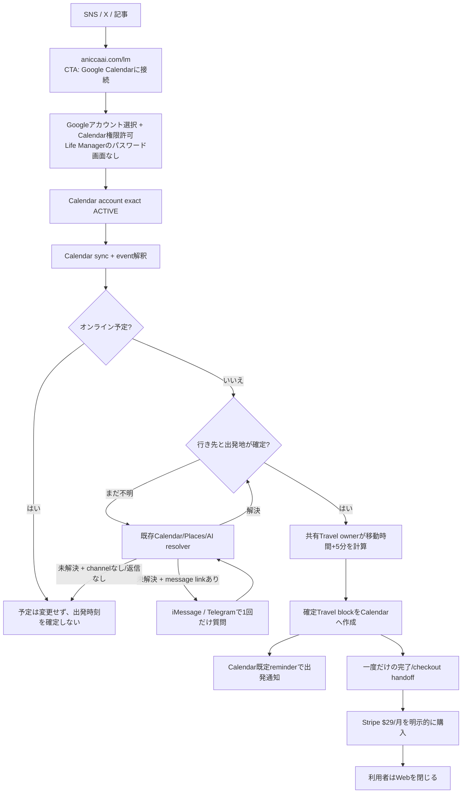

# Life Manager Web-First Travel Product

## Goal

Let a new Life Manager customer start with one action: **Connect Google Calendar**. The browser is a setup and payment handoff only; it is not a daily app, dashboard, or chat surface. After connection, the shared Travel owner fills resolvable Calendar events with Travel blocks, so Calendar itself carries the trip and its normal departure reminder. Optional iMessage/Telegram messages handle only questions or alerts that need a reply.

The Web App Factory is a later phase. It starts only after this product has paid users and verified positive contribution; the first app's acquisition and cost evidence then becomes the factory's first reusable lesson.

## Delivery Status and TODO Authority

The current production cursor, W3-P0 root cause and unblock runbook, and remaining TODO order live in the [canonical Life Manager SSOT](2026-09-25-life-manager-unified-ssot.md). This document remains the Web product behavior/design reference.

## Superseded Contract

The approved 2026-08-26 Cloud On-Time Core contract made a verified Telegram actor the only tenant identity and retired the standalone browser onboarding flow. Dais's current explicit Web-first instruction supersedes that interface and identity choice for new Web users. It does not remove existing Telegram users, change their identity/session, enable phone calls, or weaken the existing Stripe-only paid-state writer.

The new Web identity is a verified Supabase Auth Google user. The Railway server uses Supabase SSR PKCE cookies and calls auth.getUser before accepting a user-scoped request. It derives uid as lm_ plus the verified Supabase user UUID. Client query/body identity, localStorage uid/sig, and Telegram chat IDs never establish Web tenant identity.

## Product Flow

1. The visitor opens `aniccaai.com/lm` and presses **Google Calendarに接続**. There is no separate Life Manager username/password screen.
2. That action starts Google's account-selection and consent flow. The backend still verifies a Google identity as the tenant owner and requests Calendar permission; the UI describes both as part of connecting Calendar rather than as a separate Life Manager login.
3. After exact ACTIVE account readback, the existing shared Travel owner syncs Calendar and inserts helpers where both event destination and a valid origin are available. No event list, chat, or dashboard remains open.
4. The user sees a one-time completion/checkout handoff after the first confirmed Travel helper. They can close the browser; daily value lives in Google Calendar and optional connected message notifications.
5. If Calendar/Places/AI cannot resolve whether an event is online or its destination, Life Manager asks through a linked messaging channel. It does not create a Travel helper or claim a departure time until required data is verified.
6. Calendar reminders use the user's existing default reminder settings. iMessage and Telegram are delivery adapters, not parallel Travel products; the existing Telegram path remains for current users.

## Shared Implementation and Tenant State

- Keep one Life Manager product and the existing Railway service. Serve the Web app at LM_PANEL_BASE/lm; do not create a second scheduler or a copy of travel logic.
- Reuse lm_users, lm_panel_preferences, the Composio calendar transport, travelUserOnce/fillTravel, route caching, departure calculation, and lm_travel_log idempotency.
- Web-created lm_users rows may have telegram_chat_id null. The existing travel loop already skips Telegram reports when no chat ID exists. Web onboarding explicitly stores call_enabled=false and notifications_enabled=false; Calendar's own event reminder is independent of the Telegram notification switch.
- Set daily_automation_enabled=true only after Calendar is ACTIVE. For future Calendar blocks, resolve origin from an eligible previous Calendar event (the existing 90-minute rule), then saved home/base; never use today's live point for an event days ahead. A home/base is an optional fallback, not an onboarding field. If no origin exists, leave the event unchanged and ask only through a linked message channel. Near-departure GPS is not required for v1. When a preference row already exists, preserve its automation choice; reject setup while calendar_disconnect_pending is true. Stripe webhook remains the only writer of lm_users.paid.
- Do not auto-link a Google account to a Telegram tenant by matching an unverified email. Existing Telegram accounts keep their current session and records; a future explicit link flow can be added from measured user need.
- Calendar account writes remain user-scoped by uid and selected connected_account_id. OAuth status must be ACTIVE before Calendar reads or writes begin.
- Web status reports connected only when the exact selected account is ACTIVE and its provider/account markers are persisted and read back on the Telegram-unbound `lm_users` row. A selected account with exact `MISSING` or `EXPIRED` status is actionable: user-initiated start may recover one unique exact-uid ACTIVE account or begin new OAuth, but never enable that stale account. Network/5xx, ownership, ID mismatch, and contradictory/unknown statuses remain unavailable and fail closed. If a callback consumed OAuth state before marker persistence, a user-initiated Calendar start may recover only one exact-uid ACTIVE account and must persist/read it back before reporting connected.
- A Web-only tenant (Web UUID uid plus `telegram_chat_id IS NULL`) is Travel-only. The legacy `tick`/`organsUserOnce` path skips it before upcoming/history Calendar reads or other non-Travel organs; `travelTick` is its only scheduled Calendar consumer. Existing Telegram tenants keep the legacy organ path.
- Before scheduled Calendar event access for a Web uid, re-read the current user row, require `telegram_chat_id IS NULL`, and verify that the exact selected account is still ACTIVE. Preserve the existing Telegram scheduler path.
- Carry that verified account ID through the Web travel run. Each Calendar transport call must reject if the current NULL-Telegram row no longer selects that exact ID; it must never silently switch to another account mid-run.
- After the Web travel owner confirms the exact account ACTIVE, it re-reads persisted automation and Calendar operation state before entering `fillTravel`. The Calendar transport rechecks that state immediately before Web create/patch dispatch; its control-state reader resolves Supabase URL/key the same way as the bound-account lookup on the normal `getCalendar` path. The browser is not kept open for status or messages; Google Calendar remains the daily surface.

## Travel Calendar Effect

- The departure calculation remains event start minus accepted route duration minus the existing single 5-minute buffer.
- The Travel helper starts at the calculated departure instant and uses the user's default Calendar reminders. Google Calendar's API inherits the calendar's default reminders when an event does not override them. If readback shows that no reminder applies, the UI does not claim an alert is configured.
- Every created Travel event explicitly sets send_updates=none, exclude_organizer=true, and create_meeting_room=false. The event has no attendees, no Meet link, and no invitation emails.
- Repeated onboarding or scheduler evaluation relies on the existing unique (uid,event_key,leg) claim. Release it only when no provider write was dispatched or the Composio endpoint explicitly rejects the HTTP request with 4xx; after dispatch, a network/5xx/unreadable response or a 2xx `successful:false` result is effect-unknown. Retain that claim and reconcile through strict Calendar readback. Resolve it only when exactly one event matches the expected summary exactly, `startMs`/`endMs` exactly, and destination after whitespace removal plus lowercasing; if the readback is missing, failed, or ambiguous, keep the claim fenced and do not replay. A readback proves the helper exists but is not a create receipt, so do not report `travel_added` without a confirmed create response.
- Resolve an event destination from Calendar, Places, and the existing event interpreter before asking. If the destination remains unknown, ask once through a linked message channel; without a channel, leave the event unchanged. For Calendar blocks generated days ahead, use a nearby previous event location, then a saved base. Do not use today's GPS point as the origin for a future event.
- **Location-source decision:** v1 does not depend on passive/current GPS. Future Calendar blocks use previous event within 90 minutes, then saved base. Telegram's Bot API `live_period` is the period during which a location may be updated (60–86,400 seconds or indefinite); it does not specify an update cadence or provide a per-fix timestamp. The current parser substitutes `message.edit_date`/`date`, which marks the message update/send time, not a documented GPS-fix time. `getLiveLocation` accepts a point until its share expiry and `freshLive` has no maximum-age check, so an old coordinate can still be treated as current. WB-09 must stop calling this source “real-time,” reject stale points with a hard freshness gate, and clear unusable points; a Telegram delivery timestamp alone cannot prove the sensor fix is fresh.
- A later GPS refinement is allowed only from an explicit one-time user action or an optional installed native client. A Telegram private-chat `request_location` button is a one-time user-triggered snapshot; gate it by `message.date` being within 2 minutes of the route calculation, and never treat that timestamp as a precise sensor-fix time. A native client must provide the actual fix timestamp and accuracy, with an initial maximum fix age of 2 minutes for near-departure routing; this is an acceptance gate, not a guarantee of exact routing. If the source is old, outside the accepted accuracy, or unavailable, use Calendar-derived origin/base or leave the event unchanged. Do not request location permission in Calendar-only onboarding and do not start background tracking silently.
- **OSS comparison:** OwnTracks supports iOS background reporting via MQTT/HTTP and includes a `tst` fix timestamp plus `acc`; its own iOS guide says significant-change mode is about 5 minutes and >500 m, automatic switching into Move mode is not reliable in all circumstances, and background send/retry delays can reach around 10 minutes. Traccar Client supports configurable background updates but its own guide says interval/distance targets are not guaranteed and depend on battery, signal, and OS behavior; it expects a Traccar or compatible server. Overland sends iOS location data to a chosen HTTP endpoint in user-configured batches; its repository's latest commit is October 23, 2025. None is a no-install, guaranteed-live drop-in. If measured demand later justifies background GPS, evaluate an optional native companion using Core Location; OwnTracks is the most compatible OSS protocol reference for our HTTP backend, while preserving visible permission controls and short retention.

## Calendar Connect-only Interface

- The public marketing page lives at `aniccaai.com/lm`; its single primary CTA is **Google Calendarに接続** and hands off to the existing Railway `/lm` route.
- Google account selection and Calendar permission are part of that one connection action. The server still verifies the Google subject and selected account, but the product does not present a separate Life Manager account/password screen or label the CTA "Googleで続ける".
- The current signed-in Railway app renders `dashboardMarkup`; replace it with a one-time connection/checkout handoff. Do not show a daily event list, dashboard, web chat thread, or message composer. After confirmation/payment, the user closes the page and uses Google Calendar plus their chosen notification channel.
- Onboarding requires no home address, phone number, Telegram install, Gmail inbox permission, or GPS permission. The travel engine fills events whose destination and origin are known. It may ask for an origin or destination only when necessary, through an explicitly linked iMessage/Telegram channel; it never pretends an unknown departure time is verified.
- Message channel boundary: after Calendar connection, new iPhone users may optionally tap “Connect iMessage” and start a one-time first-message handshake; no phone-number field is inferred from Google. Existing Telegram users keep Telegram. The local Mac has OSS `imsg` 0.10.0, but the Railway `life-call` source has no iMessage adapter. The `imsg` path uses macOS Messages.app and is not Apple's official Messages for Business service; it requires a dedicated, available Mac-side gateway and a recipient handle. Calls require a separate number and explicit call opt-in.
- iMessage and Telegram are message transports for exceptional questions/notifications, not web-app screens. No message channel is required for Google Calendar's own reminder. If event context is unclear, first use the existing Calendar/Places/model resolver; ask only if it still cannot resolve online/in-person status or location. Never request Gmail read scope for ordinary travel questions.
- The current iMessage bridge is a macOS Messages.app text/SMS interface, not an iPhone location API. Google OAuth does not reveal the user's phone number or GPS. A Web geolocation request needs user permission and an open, foreground page; it cannot replace the Calendar daily surface. Telegram live-location edits are not a reliable “latest fix” contract: they require the user to install Telegram and start sharing, the API exposes share duration but no fix timestamp/cadence, and the current consumer checks expiry without max age. Do not use Telegram live points as a verified current location. For existing Telegram users, a private-chat `request_location` button can request a one-time, user-triggered point if a near-departure exception needs it; otherwise use Calendar/base or leave the route unconfirmed.
- The browser is used once for connection and payment, not for daily status. Google Calendar remains the daily surface; an optional message channel handles replies and exceptional questions.
- Use the appointment's explicit IANA timezone for route/departure calculations; when absent, preserve the existing Calendar/user timezone. The helper's UTC storage timezone must not become a display source.
- Resolve online/in-person status and destinations from Calendar, Places, and the existing event interpreter before asking. If unresolved, send one question through a linked message channel. Never request Gmail read scope or show a guessed departure/Travel block.
- The Calendar Travel event uses the user's default reminder. Do not present the browser as a notification channel and do not claim it changed device notification settings.
- Keep pause/disconnect fences and exact provider-account readbacks. Resume requires the exact selected Calendar account to be ACTIVE; each candidate event still needs a resolvable origin before a Travel write. Disconnect atomically pauses automation and sets a Web-only disconnect-pending fence before provider I/O. A durable Calendar-enable claim serializes re-enable against disconnect; only its matching UUID may finish or release it. Preserve the existing no-effect/effect-unknown recovery and never enable a stale or ambiguous account. The Web client is connection/checkout handoff only; do not add a dashboard or chat thread.
- Do not add an app-store client, employee/staff feature, always-on background GPS, generic calendar replacement, or factory UI to the first version. Calendar-derived origin is the v1 default; any later native GPS client is optional, separately consented, and not required to connect Calendar.
- Keep the existing aniccaai.com marketing surface separate from the Railway product route. Its current source is the active `Daisuke134/anicca-products` repo at `apps/landing`; its Netlify config uses that directory as the build base and `Netlify Deploy (Landing)` watches its `apps/landing/**` path. The `apps/landing` subset in this Life Manager repo is used for backend contract tests and has diverged from the live source; do not edit it as a substitute for the public route. After Calendar connection, first Travel block, price terms, and cost are read back, update the anicca-products source and verify the Netlify deploy and public route handoff to the exact Railway `/lm` origin.

### UI/UX仕様の明確化（2026-10-07 最新方針）

**製品の毎日の画面はGoogle Calendar。** Webは最初の接続と課金だけに使い、接続後にダッシュボード・予定一覧・Webチャットを表示しない。通知はCalendarのTravel blockのリマインダーと、利用者が必要に応じて接続したメッセージ経路で届ける。

| 段階 | UIと操作 |
|---|---|
| 1. 集客ページ | aniccaai.com/lm に、予定と地図を何度も確認する苦痛、Calendarへ移動時間を自動で確保する短いデモ、**$29/月**を表示。主CTAは「Google Calendarに接続」。Telegram installを要求しない。 |
| 2. Calendar接続 | CTAからGoogleのアカウント選択・Calendar権限許可へ進む。Life ManagerのID/パスワード画面は作らない。バックエンドはGoogleの検証済みsubjectでtenantを特定し、Calendar accountがexact ACTIVEと読み戻せるまでイベントを読まない。 |
| 3. 自動処理 | 接続後すぐに対象イベントを同期し、行き先と出発地が確定できる予定へTravel blockを追加する。自宅住所は初回の必須入力にしない。Travel blockはイベント開始−移動時間−既存5分buffer。 |
| 4. 一度だけの結果・課金 | 初めてTravel blockを確定作成できた後に、1回だけ「Calendarに移動時間を追加しました」と表示し、継続利用のStripe Checkout $29/月を案内する。Calendar接続だけで課金せず、利用者がCheckoutを確定した時だけ請求する。現在のapp側3日entitlementとStripe側trial条件はWB-11で一致させる。 |
| 5. 例外への応答 | Calendar・Places・event interpreterでオンライン/対面と場所を先に判定する。解決できない時だけ、リンク済みiMessage/Telegramなどに質問する。Web内のチャット画面は作らない。返信がなければTravel blockや出発時刻を捏造しない。 |

**最小画面遷移**

### Message channel・位置情報の契約

- **iMessage:** DaisのMacにはOSS imsg 0.10.0があり、Messages.appからiMessage/SMSを送受信できる。これはAppleのMessages for Businessとは別のmacOS bridgeで、Appleのbusiness MSP登録を必要としない。一方、Railway life-call sourceにはこのadapterはなく、Cloudから使うには常時利用できる専用Mac gatewayと、利用者が開始するhandle紐付けが必要。個人のMac/Apple accountを顧客共有送信元に使わない。
- **電話:** Google Calendar OAuthから電話番号は自動取得しない。iMessage接続と電話発信は別機能で、電話は番号登録と明示opt-in後だけ有効にする。
- **Telegram:** 既存利用者のchannelを維持する。Bot APIのprivate-chat `request_location` buttonは利用者が押した一回の位置送信に使える。`live_period`は共有可能期間であって更新頻度ではなく、Bot APIのLocationに個別fix timestampはないため、live-location pointを「リアルタイム」とは扱わない。新規Web利用者にTelegram installや共有開始を必須にしない。
- **位置情報の最小利用:** Calendar blockの先行作成は「直前のCalendar event（最大90分gap）→保存済みbase」。現在地は予定日より前には未来の出発地を示さないため、前日/数日先のTravel block originに流用しない。v1はGPSなしで動作する。近距離の例外で利用者が明示的に要求/共有した場合だけ、一回のcurrent fixを補助的に使う。
- **鮮度と現在の不具合:** `telegram.js`は`message`/`edited_message`の座標を保存し、観測時刻に`edit_date || date`を代入する。`late-notice.js:getLiveLocation`は`expires_at`だけを見て、`travel-reminder.js:freshLive`も最大経過時間を制限しない。したがって共有期限が残る古い点が選ばれる可能性があり、編集時刻もGPS fix時刻の保証ではない。WB-09はTelegram live locationをverified-current originから外す。Telegram one-shotは利用者が押したsnapshotに限り、`message.date`がroute計算から2分以内の場合だけ補助的に使うが、fix時刻・精度保証とは呼ばない。ネイティブfixだけは実測timestampとaccuracyを必須にし、初期2分のmax-ageを適用する。古い点・期限切れ・明示的停止を route から除外し、最新一点を不要後に削除する。location historyは作らない。
- **OSS比較:** OwnTracks iOSはHTTP/MQTT送信と`tst`(fix timestamp)/`acc`(accuracy)を備えるが、iOS guideはsignificant modeを約5分かつ500m超の変化と説明し、background送信の再試行が約10分になる場合も記載する。Traccar Clientは更新間隔を調整できるがTraccar/compatible serverも必要。Overlandは任意HTTP endpointへlocationをuser-configured batch intervalで送るloggerで、repositoryの最新commitは2025-10-23。どれもno-installの保証付きリアルタイム源ではない。v1には採用しない。将来の常時GPS需要が実測されたら、OwnTracksのHTTP payloadをOSS protocol referenceとして、明示permission・最新一点だけの保存・2分freshness gateを持つnative companionを評価する。
- **iMessage:** local OSS `imsg` is a macOS Messages.app text/SMS bridge, not an iPhone GPS API. It can carry questions and replies only; Google Calendar OAuth does not reveal a phone number or location.
- **Privacy:** location is sensitive; ask permission only immediately before a feature needs it. Do not request location access or Always/background permission during first Calendar onboarding. The v1 travel flow uses no GPS. A future native integration requires an explicit, revocable permission, a fresh fix timestamp, latest-point-only storage, short TTL, and no location history.

**Staffの意味:** 過去案のstaffは従業員/チーム招待機能を指す。Travel v1にはスタッフ欄・招待UI・チーム料金を含めない。

## Price, Marketing, and Profit

- **公開offerのreadback（2026-10-07）:** `https://aniccaai.com/lm` は「Calendar × Telegram」と表示し、主要CTAをTelegramへ送り、$29/月を掲示する。Telegramのルート通知と任意の電話を説明しており、目標のbrowser-first signupと一致していない。
- **Stripe catalogのreadback（2026-10-07）:** 確認対象のlive `Anicca Life Manager`商品にはpriceが2件（active $29/月と$20/月、inactive priceは0件）。この2 priceには全statusでsubscriptionがなく、確認対象商品のrecurring MRRは$0。2026-10-06の前回official readbackではStripe `trial_period_days`が空で、Web setupはapp entitlementを3日で開始する。Stripe checkoutとapp trialの条件が一致する証拠はまだない。
- **Life Manager全体の利用料推定（2026-09-07 01:21 UTC〜2026-10-07 01:21 UTC）:** append-onlyの`lm_api_cost`台帳はprovider利用料推定$68.786544、その他の推定$0.306765、30日合計$69.093309（約$2.30/日）を記録する。Life Managerの6 tenant分であり、Web customer分ではない。provider利用48,524件のうち3件は推定額なし。この集計は請求書、Web別原価、顧客あたり平均ではない。Composio、hosting、Stripe fee/refund/settlement、marketing費は含まれない。
- **価格決定:** 公開offerと現行Stripe checkoutの**$29/月を維持する**。以前の$5/月・$36/年案は競合価格から出した私の余計な提案として撤回する。既存catalogにある$20/月priceは現行公開page/Payment Linkで使わず、Stripe catalogの価格も増減しない。競合価格はpositioning比較にだけ使い、値下げ根拠にしない。
- $29/月で$10,000 gross MRRを超えるには**345人のactive paid subscribers**（$10,005 gross MRR）が必要。これはfee/cost控除前であり、net profitの達成数ではない。1%/3%/5%のvisit-to-paid conversionは計画用の仮定で、それぞれ34,500/11,500/6,900 qualified landing visitsが必要になる。実際のconversionは未計測なので、source attributionとpaid invoiceから実績を計測して仮定を更新する。これらの仮定はforecast扱いしない。net contribution $10,000に必要な人数はWeb別変動費、refund、payment fee、hosting、CACを測るまで不明。
- **Marketing状態（2026-10-07 readback）:** `/en`はLife Manager全体のumbrellaページ、`/lm`はTravel専用ページだが、後者のCTAはまだTelegramを指す。`/socials`は現在`loading…`を返す。`/dashboard.json`は2026-06-05更新、social snapshotは2026-06-04で古く、表示された$548支出はClaude/ChatGPT/living/Apify/Postiz等を含む混合合計でLife Manager marketing費ではない。`@anicca.ai`のpublic profile fetchは「Profile isn't available」を返したが、これはbanの証明ではない。現在のInstagram statusとLife Manager marketing spendはunknown。公式accountのstatusを確かめるまでは新規アカウントを作らない。
- **初期marketing:** 訴求は「CalendarとMapsを何度も確認しなくていい。移動時間と出発時刻がCalendarに入る」。本人の毎日の苦痛（見落としが怖くて予定と地図を何度も確認する）を、ユーザー由来のfounder storyとして記事と短尺動画の核にする。初期audienceは対面予定が定期的にあるconsultant/freelancer/field salesの仮説。運用目標は**毎時のtopic/feedback採取、1日6個の独自content unit**: 9:16 demo 2本をReels/TikTok/Shortsへ展開、X 3投稿、役立つ記事1本。これはユーザーが指定した高頻度の初期実験目標で、未計測の勝ちパターンとは言わない。同じ投稿を複数accountへ反復したり、1時間ごとに同じ文面を流したりしない。Xはbulk/duplicate/irrelevant spamを禁じる [公式policy](https://help.x.com/en/rules-and-policies/platform-manipulation)。SEO記事も、検索順位操作を目的とした薄い大量生成を避け、利用者に固有の助けを足す [Google Search spam policy](https://developers.google.com/search/docs/essentials/spam-policies#scaled-content)。demoでは合成Calendar dataを使い、実予定名・住所・通話音声は公開しない。source→Calendar ACTIVE→初回Travel block→Stripe checkout→paid invoice→D7/D30 retentionを計測する。現在のmarketing spendとpaid CACは未確認。signup・checkout・attributionとorganic基準値をreadbackした後、明示spend cap内で小さく広告CACを測り、継続率とsettled contributionが成立するまで拡大しない。
- **既存marketing資産/loopのreadback（2026-10-07）:** canonical sourceに日次動画generator `skills/video/daily-lm-video`、Postiz向け `skills/video/lm-distribution`、日次measurement `skills/video/lm-self-improve` はあるが、いずれも`config/loop-registry.json`にLife Manager content/publish ownerとして登録されていない。Marketing Engineのproduct registryにもLife Manager packはない。`life-manager-selfbuild`は4時間ごとのbuild loop（10/07 04:28Z pass、effect none）で販売loopではない。`lm-recording-store`は30分ごとの録音保存loopで、10/07 05:46Zの最新readbackは`resource_capacity_busy`によるadmission defer、直前の成功は05:16Z。既存の`content-reels-life-manager.md`はTelegram CTA・$20/月・電話中心で現行$29/Web-firstと不一致。Remotion素材skills/video/lm-assetsは4.0.533へ更新し、Travel-firstの合成Calendar demo v1を生成済み。未公開のdraftは/Users/anicca/.local/share/life-manager/marketing-drafts/20261007-lm-calendar-connect-v1.mp4。WB-15でTravel専用creative bank、Remotion版上げ・再制作、X/Reels/TikTok/Shorts/owned-article配信、投稿receipt→conversion学習を一つの販売loopへ接続する。旧録音素材は公開せず、Travel体験を合成Calendar dataで作る。
- Reuse existing product marketing copy and the shared marketing engine's content-manifest idea. Do not activate its private Instagram automation route; actual account operation must use the registered CloakBrowser direct-CDP route.
- gross MRRと月次contributionを分けて報告する。contributionの基準はpaid invoice/chargeの控除前金額とし、refundとStripe feeを一度だけ控除する。payout/settlementはnet receiptとの照合に使い、そこからrefund/feeを再控除しない。その後、同じ期間のroute/provider・Composio・hosting・attributed marketing spendを控除する。repo内のfounder申告historical revenueをこの商品のprofit証拠に使わない。

### Market research and content preparation (2026-10-06)

**根拠（2026-10-07再確認）。** [AddTravelTime](https://www.addtraveltime.com/) はGoogle Calendarへ移動blockを自動追加し、$5/月・$36/年、14日・カード不要trialを表示する。[DOFOTTの料金](https://dofott.com/pricing) は場所付き予定を月12件まで無料とし、超過月は$5+税、年額は$36+税。Product Hunt経由なら2026-10-31まで初年度$18+税で、登録時にカードを保持する。[TravelSyncの料金](https://www.travelsync.co.uk/pricing) は14日・カード不要trial。TravelSyncは£5/月または£50/年で、移動block・mileage記録/export・travel block通知を含む。TravelSync Proは£8/月または£80/年で、メール不在返信・出発前live-traffic warning・出発時のleave-now email・朝のbriefingを追加する。どちらもGoogleまたはMicrosoft calendarに対応する。時間節約の数値はvendor claimで独立検証していない。[Morgenのtravel workflow guide](https://www.morgen.so/guides/auto-schedule-travel-time) はGoogle、Outlook、iCloud、Fastmailのcalendar、出発地、移動手段、往復、bufferを扱う。これらは機能・価格帯の比較材料であり、競合の売上や利益の証明ではない。

Qualitative pain evidence is consistent but anecdotal. In a [2024 r/productivity thread](https://www.reddit.com/r/productivity/comments/1akzy5j/calendar_management_how_do_you_factor_in_travel/), a user describes forgetting travel time while scheduling a second appointment before a distant appointment. In a [2019 r/shortcuts request](https://www.reddit.com/r/shortcuts/comments/fsybqg/automatically_add_travel_time_from_google_maps/), a user describes manually moving from a Calendar event to Google Maps and back to create a separate travel event. A [Google Calendar Help Community question](https://support.google.com/calendar/thread/254623733/set-time-to-leave-for-calendar-events?hl=en) asks for a time-to-leave notification; a community expert's answer describes a manual Maps-to-Calendar path. That page is community content, not a current product contract, so verify Google's UI before publishing a how-to claim.

**Inference.** The strongest message is the mental load of repeatedly checking Calendar and Maps because the user is afraid of missing an event. The first audience to test is people with recurring in-person appointments and client meetings; this is a fit hypothesis, not a validated ICP. Promise that Life Manager automatically reserves travel time and puts the departure block in Calendar; do not guarantee that a person will never be late or never miss a flight.

**Search candidates.** These 50 English query candidates are grouped by intent, based on observed result phrasing plus close variants. Search-volume data and Google Search Console evidence are unavailable; do not present these phrases as traffic forecasts. Prioritize by product fit and intent until post-launch impressions and conversion data exist.

| Cluster | Intent | Candidate queries | Priority |
|---|---|---|---|
| Automatic travel blocks | Commercial / transactional | automatically add travel time to Google Calendar; Google Calendar automatic travel time; automatic travel blocks for Google Calendar; Google Calendar travel time app; travel time blocker for calendar; calendar app automatically adds drive time; Google Maps travel time calendar integration; Google Calendar travel block app; automatic commute blocks calendar; travel time automation for appointments | 1 |
| Google Calendar how-to | Informational | how to add travel time to Google Calendar; how to add travel time to a Google Calendar event; add driving time to Google Calendar; add a travel event from Google Maps to Calendar; how to block travel between calendar events; set time to leave for calendar events; add buffer before Google Calendar appointments; calculate travel time between appointments; automatically add travel time to recurring events; Google Calendar travel time desktop | 1 |
| Late-arrival problem | Informational | calendar reminder too late to leave; forget travel time when scheduling appointments; avoid being late to appointments; calendar keeps booking over commute time; Google Calendar does not account for commute; meetings back to back travel time; how early to leave for an appointment; stop being late to client meetings; calendar schedule travel time for appointment; travel time gap between meetings | 2 |
| Product comparisons | Commercial | best Google Calendar travel time app; travel time apps for Google Calendar comparison; AddTravelTime alternative; DOFOTT alternative; TravelSync alternative; AddTravelTime vs DOFOTT; Google Calendar vs Apple Calendar travel time; Google Maps calendar travel-time automation; best calendar app with travel time; calendar departure alert vs travel block | 3, after price/cost proof |
| In-person professional use | Commercial / informational | travel time calendar for consultants; calendar travel blocks for field sales; automatic drive time for client visits; travel time planning app for contractors; appointment calendar for service businesses; Google Calendar travel time for freelancers; travel blocks for on-site meetings; route planner that syncs with calendar; prevent overlapping client appointments and travel; calendar travel time for personal appointments | 3, validate ICP |

**First content queue (user-directed high-volume experiment).** Build six unique content units each day: two short calendar demos, three founder-led X posts, and one useful article on owned media. Cross-post each demo to Reels, TikTok, and Shorts with native captions. Run hourly topic/feedback collection and draft refresh; publish at six distinct daily slots rather than repeating identical posts hourly. This is an initial test target, not a claim that the cadence is a platform-wide best practice. X prohibits bulk, duplicative, irrelevant, or unsolicited spam; Google Search prohibits scaled pages created mainly to manipulate rankings without helping readers ([X policy](https://help.x.com/en/rules-and-policies/platform-manipulation), [Google policy](https://developers.google.com/search/docs/essentials/spam-policies#scaled-content)).

Start with three article angles: (1) a first-person founder story about the stress of checking Calendar and Maps repeatedly, (2) “How to add travel time to Google Calendar”, using the current Google UI, and (3) “Why an event reminder can arrive on time and still be too late to leave”. Use synthetic event data or anonymized existing screens; do not publish raw private event titles, addresses, or call recordings. Replace stale scripts that say Telegram-only or $20/month before distribution.

Draft X hooks, for internal review only:

- “A calendar reminder can arrive on time and still be too late. The missing block is the trip before the appointment.”
- “An empty 2:30 slot is not free time if the next meeting is across town. The trip needs to be reserved before someone books over it.”
- “I used to check Calendar, then Maps, then Calendar again because I was scared of missing the moment to leave. Life Manager puts the trip into Calendar for me.”
- “Connect Google Calendar once. Life Manager fills eligible travel blocks automatically; your Calendar stays the screen you already use.”

Draft Remotion demos use synthetic Calendar events: show repeated Calendar/Maps checking, one “Google Calendarに接続” action, then a 15:00 event with a 40-minute route and 5-minute buffer becoming a 14:15 Travel block. Do not show a daily dashboard or web chat. Keep publication closed until the one-action Calendar flow, first helper, $29 Checkout terms, and source attribution are read back. Link every campaign to its channel/source and measure Calendar connection, confirmed Travel helper, checkout, paid invoice, and retention.

## Factory Gate

Do not implement app-generation automation yet. Start a separate Web App Factory design only after Life Manager has at least 10 paying Web customers and three consecutive months of positive contribution with actual costs. Then reuse the mobile loop's product lifecycle, shared marketing evidence, and Life Manager's reviewed Self-Build promotion boundary. The factory must take customer and cost evidence as inputs and emit one independently measurable Web product at a time.

## Acceptance Criteria

1. A fresh browser opens the hosted Railway /lm route and starts with one visible action, “Google Calendarに接続”. Google account selection and consent happen as part of Calendar connection; no separate Life Manager password/account form or Telegram install is required.
2. The server verifies the Supabase user, derives uid from the verified subject, and refuses cross-tenant requests and client-supplied uid/chat_id/paid values.
3. Calendar connection is bound to that uid; persisted exact ACTIVE account readback precedes any event access, including scheduler runs. Web-only tenants never enter legacy non-Travel organ/calendar-history reads; scheduled Calendar access uses the exact-bound Travel owner. Interrupted callback completion can recover through a user-initiated start only when the exact-uid ACTIVE account is unique. Exact MISSING/EXPIRED selections lead to unique ACTIVE recovery or new OAuth without re-enabling the stale account; provider/network ambiguity stays fail-closed.
4. No home-address or GPS permission is required at onboarding. A Travel write uses an eligible previous Calendar event or saved base. Telegram live-location share expiry alone never qualifies a coordinate as current; a one-time Telegram location request must be user-triggered and sent within 2 minutes of route calculation, while a native refinement requires actual fix timestamp, accuracy, a maximum 2-minute age, and explicit consent. Unresolved origin leaves the event unchanged.
5. First setup runs the shared travel owner and creates at most one Travel helper for each eligible event. Departure time matches the shared calculation and one 5-minute buffer. The Web success state is one-time only; no dashboard or web chat exists.
6. New Travel events send no attendee emails, add no organizer attendee, and request no Meet link. Calendar's default reminder behavior is read back and described truthfully.
7. No dashboard, event board, or Web chat is shown after onboarding. Online/in-person and location questions use a linked iMessage/Telegram channel, never a web thread. A Calendar reminder is the default departure notification; a linked message channel may carry a route or one-time clarification.
8. Pause/resume/disconnect controls retain the verified Web identity and CSRF fence. Resume requires exact ACTIVE Calendar binding; disconnect pauses, changes only the selected provider account, and clears its binding only after exact owner/toolkit/account-ID disabled readback. A UUID-owned, leased Calendar claim prevents reconnect/disconnect overlap; preserve exact-state/no-effect recovery and never replay an uncertain provider write. Origin absence is an event-level skip, not a reason to fabricate a base.
9. Repeat onboarding, OAuth callback, and scheduler replay produce no duplicate Calendar helper. Unknown create outcomes retain the claim and require strict readback before any resolution. Existing Telegram auth, call consent, and existing-user behavior pass their current contracts.
10. Stripe subscription changes are accepted only through the existing webhook. The public price and terms match the official Stripe catalog before launch.
11. Railway deploy SHA, fresh browser signup, Calendar ACTIVE account, created Travel event, replay-zero, Stripe invoice/renewal, and actual cost readback are reported separately.
12. The Web App Factory remains unimplemented until its paid-user and positive-contribution gate is met.

## Current External Documentation

- Supabase SSR PKCE, server cookies, and verified getUser: https://github.com/supabase/ssr/blob/main/README.md
- Composio Google Calendar account and event input contract: https://docs.composio.dev/toolkits/googlecalendar
- Composio tool execution response and error-code contract: https://docs.composio.dev/reference/errors and https://docs.composio.dev/reference/api-reference/tools/postToolsExecuteByToolSlug
- Google Calendar default reminders and overrides: https://developers.google.com/workspace/calendar/api/concepts/reminders
- Telegram Bot API location and request-location buttons: https://core.telegram.org/bots/api#location and https://core.telegram.org/bots/api#keyboardbutton
- Apple Core Location authorization and background updates: https://developer.apple.com/documentation/corelocation/requesting-authorization-to-use-location-services and https://developer.apple.com/documentation/corelocation/handling-location-updates-in-the-background
- OwnTracks iOS reporting behavior and fix timestamps: https://owntracks.org/booklet/features/ios/ and https://owntracks.org/booklet/tech/json/
- OwnTracks iOS client (MIT): https://github.com/owntracks/ios
- Traccar Client background tracker: https://github.com/traccar/traccar-client and https://www.traccar.org/client/
- Overland iOS GPS logger (Apache-2.0): https://github.com/aaronpk/Overland-iOS
- OSS Mac iMessage bridge used by the local host: https://github.com/openclaw/imsg
- Apple Messages for Business official-channel requirements (distinct from the local imsg bridge): https://register.apple.com/resources/messages/messaging-documentation/ and https://register.apple.com/resources/messages/messaging-documentation/policies
- Official Remotion documentation: https://www.remotion.dev/docs
- Direct category pricing reference: https://www.addtraveltime.com/
- Supabase Auth redirect URL allowlist: https://supabase.com/docs/guides/auth/redirect-urls
- Supabase Google OAuth provider setup and callback: https://supabase.com/docs/guides/auth/social-login/auth-google
- Supabase CLI db push: https://supabase.com/docs/reference/cli/usage#supabase-db-push
