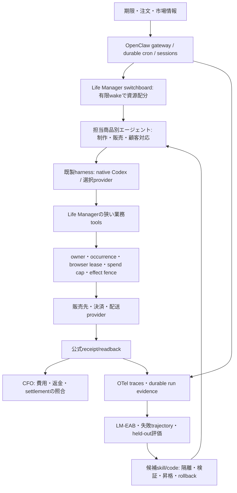

# Life Manager エージェントハーネス移行設計

## 今回の目的・範囲・完了条件

目的は、商品を制作・販売する多数のエージェントを24時間運用するLife Managerについて、自作ハーネスの代替を一次資料とコードで比較し、単一推奨、移行境界、復旧・評価・自己改善の設計と原子的な実行手順を確定すること。

今回は調査と設計・計画の保存まで。本番設定、state、認証、scheduler、外部商品の変更、候補ハーネスでの実業務実行は含まない。候補ソースの取得は非本番の調査用cloneに限定する。

完了条件は、現行mainの呼び出し経路を確認、候補の公式資料・実装・ライセンス・固定SHAを記録、推奨と棄却理由を記述、切替・rollback・自然実行の受け入れ条件を定義、各TODOに依存・対象ファイル・検証・DONE条件を付与し、唯一の統合SSOTから参照可能にしてcommit/pushすること。設計成果と将来の本番成果は別々に判定する。

Superpowersのarchitectural brainstorming→written design→writing-plansを使う。Daisが調査から計画まで明示依頼し、No-human-loopを指定するため、skill内の途中承認待ちは採用しない。実装への着手許可とは扱わない。

## 選択・非選択

推奨はOpenClaw。代案はDeep Agents JSを現行runner内で使う構成、OpenAI Agents JS + Temporalをdurable lifecycleにする構成。比較・一次資料・反証条件は[調査](../../research/2026-10-07-agent-harness-comparison.md)。本設計は実装仕様であり、本番運用の合格宣言ではない。

OpenClawは`2026.9.8` / release commit `fc23bc864e4553c2d215e479eeec47b67a0bf943`を初期検証対象に固定。関連pluginとNodeのexact version・integrityはHM-01でパッケージmetadataと実配布物からlockする。`latest`を本番に入れない。新しい基盤への移行のために全業務loopのmodel/providerを一括変更しない。

## エージェントから見た構成

- 各商品ownerは仕事・注文・成果物・buyer対応・販売証拠を持つ。ハーネスは商品価格・売上・納品完了を決めない。
- 制作と販売を別のrole対話だけにしない。同じ商品owner配下の別session/taskとして構成し、商品IDでjoinする。catalogの15 groupsをaccountabilityの起点にする。14という旧分類は履歴として保持。
- 常駐するのはgatewayと必要なbrowser/service。agentは期限・注文・通知でwakeし、待つ間は推論しない。contextは商品ownerに属し、個々の注文は別occurrence/sessionにする。
- switchboardはmodelが優先度を提案し、admissionがcap・lease・期限を執行する。ハーネスdefaultの並列数を実行能力と扱わない。初期global model concurrency=2、同一owner/occurrence=1、同一browser identity=1。既存provider/spend上限がこれより小さければ小さい方を採る。
- agentのworkspaceは隔離sandboxではない。商品制作は専用worktree/出力dir、販売effectはtool brokerに限定。普通のagentにgateway管理・別owner制御・provider credentialを渡さない。

## 残すもの・置き換えるもの

| 層 | 初期canary | 全移行後 |
|---|---|---|
| 商品skills、publisher、delivery、公式readback、CFO | 既存を利用 | Life Managerの業務資産として保持 |
| credential SSOT、browser identity/lease、money/effect fence | 既存を利用 | 唯一のauthorityとして保持。OpenClawへsecret複製しない |
| tool loop、context、session、subagent、native CLI lifecycle | OpenClaw専用profileへ限定routing | 移行済みownerの自作runner分岐を削除 |
| agent schedule・wake ownership | 最初はlm-loopだけ | owner単位でOpenClaw cronへ移す。旧agent plistを退役し二重wakeをなくす |
| deterministic services/browser/admission | lm-loopのまま | 必要なhost boundaryのみ保持。不要な自作agent orchestrationを削除 |
| self-build | 既存Symphony/workroomを利用 | 修復candidateのexecutorとして再利用。別coding harnessを作らない |
| trace/eval | existing events + OTel、LM-EAB | upstream観測機能＋販売業務評価。別trace SaaSを初期必須にしない |

legacy pathは混在期間のrollback/互換入口だけ。移行済みownerの第二実装を恒久維持しない。全移行後も業務policy/receiptコードは必要なdomain実装であり、削除対象の自作harnessと区別する。

## 接続契約

新規 `runtime/openclaw/` はoperator側の薄いadapterと業務tool pluginを持つ。既存CLI入口のargs/resultを保持し、`runtime/agent-runner/agent_runner.py`はowner別routingだけを追加する。`config/harness-migration.json`は既存registryを参照するdeployment selectorで、別job registryやTODO正本にしない。

`HarnessRequest`: `{owner_id, loop_id, occurrence_id, run_id, release_sha, task_class, prompt, output_schema, workdir, timeout_seconds, model_route, budget_ref, resume_ref}`。authority fieldsはcaller/admissionから供給し、modelが上書きできない。画像・vision、repair、schema、resumeなど未対応task classは移行selectorに入れない。

`HarnessResult`: `{status, run_id, upstream_run_ref, session_ref, result_path, usage, effect_status, provider_receipt_id, official_readback_ref, evidence_refs, error_class, retryable, next_action}`。statusは`success|failure|pending|interrupted|effect_unknown`。result_pathは既存schemaを通ったJSONのみ。usageはprovider readbackが無ければunknown。`effect_status`とreceiptは業務brokerが確定し、modelのfinal textやHTTP200から成功を推測しない。

operator transportはprivate loopbackの公式GatewayClient/WebSocket RPCとし、ownerとoccurrenceの固定session key/idempotencyKeyを指定する。gateway credentialはoperator bridgeだけがprivate SSOTから実行時取得する。agentのenv/tool result/logへ渡さない。requestを送る前に既存occurrence authorityへdispatch-startedを記録する。受領IDを失うtimeout/crashは再POSTせず`dispatch_unknown`とし、original session/run/receiptをread-only照合する。gateway内のidempotencyと業務fenceを確認できない場合、canaryの実effectを有効にしない。

`invoke_tool(owner_id, occurrence_id, tool_name, arguments)`は既存owner限定のschemaを受ける。tool名は実装済みtoolsの名前を広告するもので、skill inventoryを能力admission whitelistにしない。外部effect前に既存policy/lease/reserve/fenceを確認し、結果を同じoccurrenceへ戻す。任意shell、native MCP、browser HTTPなどの別経路からfenceを迂回できないことを実装テストする。制作に必要なshell/codeは隔離worktree内に限定し、secret/network/effect authorityは渡さない。

### 推論admissionの唯一のauthority

scheduler authorityとmodel admissionは別契約。OpenClaw独自cron枠だけではLife Manager全体の枠を保証しない。RPC、cron、retry、subagentの全推論はmodel開始前に既存`runtime/host/resource_admission.py`の同一global authorityでreserve/claimする。nested業務brokerは取得済みclaimを参照し、同じ枠を再claimしない。subagentが親と同時推論する場合は追加model枠を取得し、親のclaimを子へ複製して並列上限を抜けない。

legacy wrapper経由のclaimはgateway run受領時に同一occurrenceのexecution ownerへdurable transferし、transfer完了を記録する。`runtime/loop/lm_loop_run.py`の子PID終了/finally releaseに委ねる現行契約を新routeだけ変更する。OpenClaw cronから始まるrunはpluginのbefore-model入口で同じclaimを取得する。各runのheartbeatは実際のupstream execution identityにbindし、wrapper PIDだけで生存判定しない。

RPC caller消失、heartbeat expiry、cancel timeoutでは、native推論・工具・childrenの停止/terminalをreadbackするまでclaim/capacityを再利用しない。確認不能はdurable resource-effect-unknown fenceを維持し、勝手にstale枠を掃除しない。gateway pluginにbefore-model admissionとterminal/cancel readbackを実装できない配布版は採用HOLDとする。終了時は工具結果/receiptを保存後に同じauthorityで一度だけreleaseする。

採用比較は同じ3case/model/tools/budgetで総model/tool観測費用<=base、task成功数>=base、安全case全PASSを満たすこと。RSSはHM-00で記録する既存host admissionの許容capacity内を条件にし、base RSSと増分を報告する。メモリがbaseを超えることだけでは棄却せず、host上限超過・費用増・admission不成立でHOLDとする。subscription実費割当が不明なら採用費用判定をunknownとして保留する。

## クラッシュ・復旧・rollback

状態遷移は`admitted → dispatch_started → running → terminal/readback`。任意の曖昧境界は`unknown → reconcile original occurrence`へ分岐し、`unknown → resend`にはしない。OpenClawのmessage delivery fenceは一般販売toolまで保証しない。

1. pre-effectの停止は、zero-effect証拠と同一occurrenceの予約状態を確認してbounded retryできる。
2. tool dispatch後・provider成功後・receipt保存前の停止はofficial readback先行。確認できないならfenceを維持し、readback不足のprovider/owner/endpointを記録する。
3. gateway再起動でsession/runは復旧対象になるが、業務toolは既存fenceをもう一度確認する。終了済み注文の制作・送信・決済は再実行しない。
4. rollbackは、新規wake停止→running owner drain→effect_unknownを保全→該当ownerのselector/schedulerだけ旧main由来releaseへ戻す→loaded/readback。credential、session、ledgerを過去snapshotへ巻き戻さない。未解決occurrenceを旧harnessでも実行しない。
5. gatewayを本番で故意にkillして証明しない。failure injectionは偽provider/私有stateの隔離profileだけ。本番は自然実行・自然障害の観測を使う。

## 観測・評価・自己修復・自己改善

必須joinは`run_id, owner_id, occurrence_id, release_sha, upstream_run_ref, session_ref, trace_id, phase, command_ref, exit_code, effect, readback, provider_receipt_id, evidence_refs, error_class, retryable, next_action`。loaded argv/envは安全な名前・digestだけを記録しsecret値を保存しない。model/provider/version、input/output token、retry/fallback、compaction・subagent usageも同一runへjoinする。観測exportが停止しても業務journalを失わず、欠測を0にしない。

評価を3つに分ける。

- **runtime評価:** 原子的fake工具、crash位置、lost acknowledgement、same-owner concurrency、browser lease、budget、unknown。期待/禁止動作を固定して判定する。
- **task評価:** Capafyの候補4成果物・listing lint、Writerの引用と納品条件、appの関連acceptance、stickerのplatform制約など、担当商品の実成果物で判定する。LLM judgeは主観評価に限定し、まず人の既存判断例との一致を検証する。
- **business評価:** 同一product/order/occurrenceのlisting→sale→refund/fee→settlement→actual costをjoinして純利益を評価する。LM-EABの既存financial contractを利用する。公開成功・gross・unknown costは純利益ではない。

OpenClawのpersonal-agent benchmarkは運用smokeとして参考にするが、販売成功率へ換算しない。LangSmith/GEPA等は追加の必要性と費用を実証した場合だけ導入する。

自己修復は失敗分類→追加観測→最小修復候補→既存tests/contract→main→release→owner限定自然実行→readback。単なるrestart、issue起票、doctor実行を修復成功としない。コード修復は既存Self-Build/Symphonyへ渡し、policyやsecret管理をagentが自由に書き換えない。

自己改善は失敗traceから候補skill/promptを作り、固定baseと候補を同一model/tools/budget・sealed holdoutで比較する。安全性全件合格、task成功数がbase以上、少なくとも1つの既知失敗が改善、同一fixture/taskの観測費用がbase以下を初期昇格条件にする。費用がunknownなら改善昇格は保留。業務純利益はprovider収入が観測できてから別判定する。候補単位でversion/parent/eval dataset/judge/seed/費用を記録し、safe canary→release→rollbackを使う。学習済み候補がholdoutや本番ledgerを書けないようにする。skill-workshop/dreamingは候補の入力に使えても、業務skillへの自動上書き権は渡さない。

## 移行完了と収益成果の区別

今回の完了は調査・設計・原子的計画のcommit/push・統合。将来のharness移行完了は、対象ownerのsource acceptance、既製harnessからの自然wake、公式tool/readback、cost/trace join、rollback可能性、旧scheduler/runnerの退役で判定する。外部buyerの購入待ちを技術移行の追加gateにはしない。各販売agentの経済成果は公式sale/settlement/actual costが揃った時だけ別途合格とする。

移行対象・順序・状態は統合SSOTのHM laneだけが正本。現在の他業務lane/cursorや稼働effectは変更しない。実行手順は[計画](../plans/2026-10-07-life-manager-harness-migration.md)。

## 条件付き: OSS配布・他人の端末・クラウド

これはDaisの仮定に対する設計で、公開・hosted service開始の決定ではない。推奨は引き続きOpenClaw。理由はMITによる再配布と公式embedding/Node client/Dockerがあり、24時間運用のsession・cron・復旧資産を維持できるため。Deep Agents JSはpure embedded SDKの対案だが、今回の目的ではscheduler/daemonの組合せが別途必要。Mastraも有力だが既存runnerをframeworkへ結ぶ作業とcrash/effect契約は残る。

公式資料を再確認: [embedding](https://github.com/openclaw/openclaw/blob/v2026.9.8/docs/gateway/embedding.md)、[client](https://github.com/openclaw/openclaw/blob/v2026.9.8/docs/gateway/clients.md)、[Docker](https://github.com/openclaw/openclaw/blob/v2026.9.8/docs/install/docker.md)、[tenant分離](https://github.com/openclaw/openclaw/blob/v2026.9.8/docs/gateway/multi-tenant-hosting.md)。npm公開metadataで`openclaw=2026.9.8`、`@openclaw/gateway-client=2026.8.1`、`@openclaw/gateway-protocol=2026.8.1`とexportsを確認した。GatewayClientの`request(method, params, options)`、agentのidempotencyKey、agent.wait、sessions.abortを公開tagのsourceで確認した。配布物同士のruntime互換は未実測なので、具体的な互換テストを計画の先頭に置く。

### 配布境界

- 初版の販売機能実行環境はmacOS/Linux、WindowsはWSL2またはDocker。native WindowsのOpenClaw対応を、Python fcntl/bash/launchdを含むLife Manager全商品の対応へ転写しない。native Windows全商品の対応は今回の初版目標に含めない。
- iOS/Androidはブラウザの操作画面。実行はユーザーの対応PCまたはLinux cloud。端末停止中の継続が必要ならcloudを選ぶ。
- self-host cloudはsingle-tenant cellを初期単位にする。複数userへ提供するならprocess/container/data root/credential/gatewayをtenantごとに分離。OpenClaw agentId/sessionKeyはtenant security boundaryではない。fleet CLIはexperimentalなので初版の必須依存にしない。
- ユーザーは自身のmodel/provider/platform accountsを設定する。Daisのaccount/profile/absolute paths、Codex subscription、Apple Passwords、Macのlaunchdは配布coreの必須依存にしない。native Codexは利用者が持つ場合の選択肢。未設定の販売能力は具体的な不足credential/toolを表示する。
- `LM_DATA_DIR`にinstance root、`LM_CREDENTIALS_FILE`に唯一のユーザーcredential SSOTを指す。local defaultは`~/.local/share/anicca/credentials.json`、cloudはそのSSOTをread-only secret mountする。keyをOpenClaw configへ複製せずSecretRefで注入する。
- OpenClawは正常なnpm installのpackage executableを起動する。dist部分のコピー/vendorはしない。MIT noticesとthird-party noticesを配布へ含める。Dockerは同一source/lockfileを使い、machine-specific toolingはLinux host adapterへ限定する。

### 初回実装を固定する契約

初版transportは**公式WebSocket GatewayClient**とする。HTTP bearerのscope縮小を独自実装しない。Gatewayはinstance-owned loopback、portはconfigで指定、secretはoperatorだけに渡す。直下を`runtime/openclaw/`とし、Node ES modulesとPython既存host adapterを使う。

`RunRequest`: version=1、owner_id/occurrence_id/run_idは`[A-Za-z0-9][A-Za-z0-9._:-]{0,127}`、release_shaは40hex、promptはtrim後16字以上、schemaはJSON object、workdirは絶対path、timeout_secondsは正整数、task_class/model/provider/effortはcallerの設定。effect_mode=`read_only|brokered`。owner mapはrequest ownerをキーに既存registryを参照する。

`sessionKey = 'agent:' + agentId + ':lm:' + sha256(JSON.stringify([owner_id, occurrence_id]))`、`idempotencyKey = sha256(JSON.stringify([release_sha, owner_id, occurrence_id, task_class]))`。hash対象へsecret/promptを含めない。Pythonはjson.dumps(values, ensure_ascii=False, separators=(",",":"))のUTF-8 bytesを使う。コロンを含むIDでもtuple境界を保持する。accepted runId喪失時は新idempotencyKeyを作らずunknownを記録し、同じsession/occurrenceをread-only照合する。

RPC submitは`client.request('agent', {message,agentId,sessionKey,idempotencyKey,deliver:false,timeout:timeout_seconds}, {expectFinal:false})`。waitは`client.request('agent.wait',{runId,timeoutMs:1000})`、cancelは`client.request('sessions.abort',{key:sessionKey,runId,agentId})`。abort成功ACKだけを停止proofにせず、run terminal・session activeRunIds・owned processesのcleanupを確認する。SDK内部の再接続で新agent dispatchを作らない。

`DispatchRecord`: `{version:1,owner_id,occurrence_id,idempotency_key,session_key,upstream_run_id:null|string,phase:'prepared'|'sent'|'accepted'|'terminal'|'unknown',claim_ref:null|string,result_ref:null|string}`。同一occurrence単一record、durable保存後に送信、結果/receipt保存後にrelease。

`RunOutcome`: `{status:'success'|'failed'|'pending'|'effect_unknown',result:null|object,upstream_run_id:null|string,evidence_refs:string[],usage:{input_tokens:null|integer,output_tokens:null|integer,provider_cost_usd:null|number,cost_basis:string},error_class:null|string,next_action:null|string}`。既存runner summaryへprojectし、schema成功だけでtool effectをverifiedにしない。

`ModelClaim`: `{ref:string,owner_id:string,resource_owner_id:string,occurrence_id:string,execution_pid:integer,execution_start:string,state:'active'|'resource_effect_unknown'|'released'}`。既存claim pathを信頼できるenv/host APIで渡す。modelがclaim_ref/ownerを指定した工具requestはauthorityへ使わない。

plugin一般hookのtimeoutはfail-openになるsurfaceがあるため、before_prompt_buildだけをadmissionの強制保証にしない。public gatewayの初期cronはdisabled、agent dispatchはoperator bridgeだけ。native tool経路とmodel-start admissionのfail-closed検証に不合格ならeffectを有効化しない。schedule移行は検証済み契約成立後の別atomとする。

**計画の訂正:** 前版18task/90checkboxはroadmapとしては読めるが、互換API・工具binding・host切替を実装者へ残すため、全移行をそのまま実行できるatomic planではなかった。現在の[計画](../plans/2026-10-07-life-manager-harness-migration.md)はファイル/関数単位へ置換する。conditional配布atomsは未有効であり、実装/本番操作は未着手。

`HarnessPaths`はpaths.mjsの5absolute paths（stateRoot/configPath/dispatchRoot/workspaceRoot/credentialFile）。`GatewayHandle`はchild PID/start identity/client/instance id、`StopProof`はinstance id/PID/start identity/stopped boolean/terminal refs。これらはoperatorだけが作る。

初版で実装指定できるのはread-only共通接続と、CapafyのCP1完了済みagentのfinish handlerである。Capafy新規draft/CP1、各商品の未確認publisher/toolはcoverage=falseとし、この計画で全販売機能を移行できるとは主張しない。残りはowner activation mapの個々のsource coverageを確認して別atomを追加する。

Tool brokerの接続は未指定socketではなく固定Python scriptへのstdin JSONとする。pluginはtrusted BindingRecordをagentId/sessionKeyでlookupし、modelへbinding_refやoperator secretを返さない。BindingRecordはoperator dispatch前に0600で保存し、workspace/claim/gateway PID/start identity/effect_mode/allowed_toolsを持つ。workspaceはoperatorがpaths.workspaceRoot/<identityhash>/へ0700で作成・ownership/symlink検証して固定し、request.workdirとは分離する。request.workdirはreadonly参照元でありartifact root/native cwdに使わない。CLI brokerは実parent PID/start identity、tool_name membership、effect_modeとの整合もdispatch前に照合する。read_only bindingのlm_effectはprovider開始前に拒否する。read_onlyはremote write禁止を意味し、private workspaceへの成果物保存はlm_artifactで許可する。一般shell/file工具やproduction catalogへ直接writeしない。

継承できるmodel claimはresource_class=agentだけ。Capafyのdeterministic claimやPromptBaseのbrowser claimをmodel枠と扱わない。別resourceのparentがある場合、元owner policyを保つm:<owner JSON配列hash>というbookkeeping resource ownerでagent枠を取得し、元商品owner/occurrenceへjoinする。同一ownerのqueueを別resourceで上書きしない。agent継承では二重claimしない。
