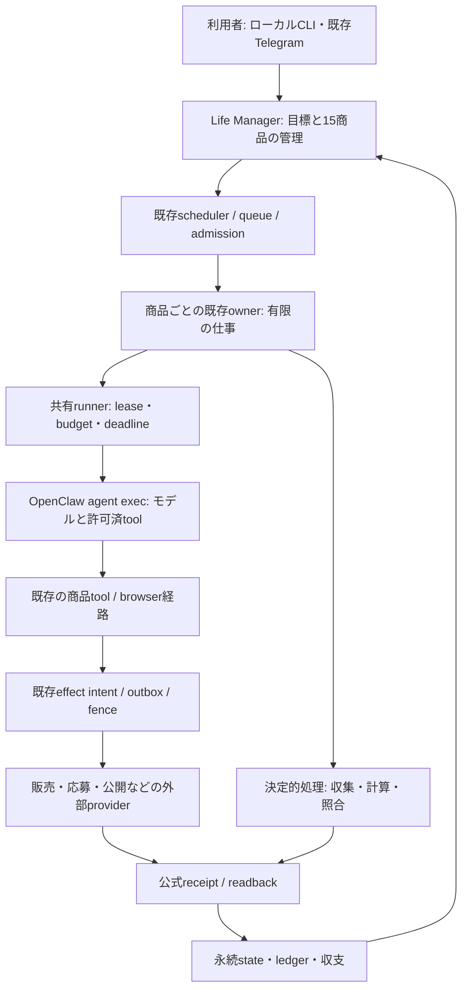

# ローカルLife Manager — 主要15エージェントとOpenClaw移行仕様

## 目的・範囲

Daisが求める対象はローカルLife Managerの主要15の商品・業務エージェント。既存の制作・販売・応募・納品・投資・収支確認を壊さず、OpenClawを利用してモデル実行基盤の自作負担を減らす。クラウドWeb `/lm`、Travel商品、Web認証、Web画面の新設はこの仕様の対象外。

今回実行するのは読み取り専用検証、仕様・計画・SSOT更新のみ。業務source修正、start/restart/apply、実業務の再送、provider mutation、credential更新、effect fence解除は行わない。

## 確認した現状

- 最新READMEは15商品。旧14との差はeBook。Money Printer/Local/Cloud/内部support jobsを別の商品数へ足さない。
- catalogの15能力は107 jobへ対応。全入口存在、106 loaded argv/installed argv一致。Investment live service不在は紙取引運用とのdesired mode照合が残る。
- 実装済は商品catalog、既存owner群、macOS scheduler、共有admission/budget/runner、個別state/receipt/ledger。15全部が単一の新general specialistに接続済みとは確認していない。
- healthと業務成果は別。source/起動/終了0を販売・公開・入金へ昇格しない。
- `install.sh`はproduct別経路を持つが、15全部に完成済guided installがあるわけではない。unsupported商品を開始成功と表示しない。

## 単一推奨

OpenClawをモデル・tool実行エンジンの比較候補とする設計。採用は実測便益がある場合だけ行う。初回は既存runner内部の有限 `openclaw agent exec` を使う。OpenClaw gateway/cronへ全体のschedule/stateを移す設計にはしない。現行backendを稼働させたまま、新backendはdefault off、限定owner/taskで検証する。

これは条件付きの目標設計であり、本番OpenClaw切替は未実施。現時点の判断は本番移行No-Go、価値比較のみGo。native account/model/tool/schema/budget/費用の互換が成立しないownerは現行経路を維持する。既存決定的jobにはモデルを追加しない。

## アーキテクチャ

- 管理者は目標・優先度・予算・商品状態を所有。15の商品・業務エージェントは担当業務を遂行する能力で、内部owner/jobは分けたまま。
- 常駐するのはschedulerと必要なservice。モデルは仕事が来た時だけ有限実行し、結果を保存して終了する。24/7は継続して仕事を受けて再開できる意味で、15モデルの無限推論ではない。
- OpenClawはLLM+context+toolの実行を所有する。Life Managerは事業目的、wake、owner、予算、正本state、外部effect/receipt、純収支を所有する。二重scheduler、二重ledger、二重effect ownerを作らない。
- browserは既存identity/lease/direct CDP経路を利用。OpenClawのnative toolからfenceや既存browser ownerを迂回できる段階では販売ownerを有効化しない。
- データはimmutable releaseの外に保持。切替で商品、顧客、注文、過去receipt、認証profileを新規生成したり削除したりしない。

## ローカルUX

1. 初期設定: ローカルにinstallし、任せる商品と予算を設定し、その商品に必要な本人のaccount/profileを接続する。15全商品の完成済one-click installerは未実装なので、既存guided経路とsetup_requiredを正直に分ける。
2. 通常利用: 既存のCLIとTelegram報告を使う。OpenClawのCLIや内部sessionを利用者が直接操作する必要はない。今回のrunner切替で新Web画面を要求しない。
3. 商品状態: 実行中、次回待ち、準備が必要、結果確認中、本人対応が必要、一時停止を区別する。容量待ちは待機、外部結果未確認は結果確認中として説明し、自動で再投稿しない。
4. 成果: 作成、公開、応募、契約、納品、売上、入金、原価、純収益を分けて報告する。公開だけを入金、原価不明を0と表示しない。内部job数を成功商品の数にしない。
5. 一時停止: 対象ownerの新しい仕事を止める。進行済の外部作用は取消や再送をせず公式確認を終える。group全体pauseの便利な新UIは今回の切替前提にしない。
6. 復旧: 通常の一時失敗は既存予算内のbounded recovery。auth/本人手続き/公式receipt不足は必要な入力を短く報告する。自動復旧をKYC突破や不明effect再送と同義にしない。

## 自己修復・自己改善・評価

- 自己修復は既存ownerのfailure classごとの回復を使い、効果不明ならreadbackへ進む。OpenClawのretry既定が既存budget/deadlineと衝突しないようprivate instance設定で制御する。
- 自己改善はproduction失敗から候補prompt/skill変更を作り、保存した同じtask群で成功率・実費/推論費・時間・禁止effectを比較する。PASSしたversionだけ限定ownerへ反映し、失敗なら次のwakeを現行engineへ戻す。
- OpenClawのtraceが事業成果やbanked netを自動評価するとは扱わない。trace/run/owner/occurrence/release/official receiptの結合はLife Managerで保持する。
- 商品ごとの実際の合格条件をevalに使う。販売数だけでなく入金・原価・純収益を区別し、モデルの完了自己申告は独立検証しない限り合格にしない。

## 検証済みと残る条件

- pinned配布物によるfake有限CLI検証は13cases。default retry/deadlineは不適合、private retry0の限定probeはPASS。native/backend/account/tool/費用は未証明。
- Context7の公式OpenClaw docsでもgatewayなしのone-shot exec、message-file/stdin、cwd、json、timeoutを再確認。main docsの仕様をpinned版の実証の代用にはしない。
- CFO旧監査時点の観測ではtotal7<8、deterministic2<2が偽。容量増加を決める証拠ではなく、過去run判定時の占有snapshotは未取得。
- Capafy公式GETで53商品のlistを取得。対象runのsnapshotからversion変化0。最新成果と同一occurrenceの公開成功/入金を確定したとは扱わない。
- eBookのidentity directoryに該当ownerのsidecarを確認できない。plistにtenant envがないことは不具合ではない。`lm_loop_run.py::_child_environment_for_owner`がdais-localとdata rootを注入するため、実child境界を正本に確認する。
- 最適ケースは互換adapterだけで済む。通常ケースはowner別のtool/receipt不整合を直して限定切替。最悪ケースはnative/tool/費用条件が成立せず当該ownerは現行を維持する。移行の時間と追加発見ゼロは確約しない。
- 棄却案の最強論拠:全gateway移行ならschedule/sessionを標準化できる。しかし既存収益経路の変更範囲が増す。最初は有限execの局所切替を優先する。
- 自分が間違うとしたら最有力の筋:OpenClawのnative/tool互換adapterが大きすぎ、既存runnerへSDKを局所導入する方が小さく済むこと。

## 改善する理由と採用判定

Life Manager CLIは利用者の操作窓口として維持する。ユーザーは従来の`lm-loop`を使い、内部engineの詳細を意識せず既存の商品・業務を運用する。OpenClawは公開SDK/CLI契約を通じて接続し、CLI/商品/state/アカウントを再構築しない。

有限exec互換の確認と、改善の証明を区別する。初回はadapterとdependencyが増えるため、保守負担削減をすでに達成したとは言えない。Codex/Claudeも既にmodel/tool executionを担う。native CodexをOpenClawから使う場合は同じ下層engineを包む可能性があり、判断能力が高くなるとは推定しない。

| 要求 | 現行と有限exec切替 | 改善が成立するために必要なこと |
|---|---|---|
| 耐久性 | durable queue/claim/heartbeat/effect fence/readbackは既存LMの能力。exec差し替えで自動向上しない | 同一fixtureでinterrupt/restart後の再開・復旧時間・二重作用を比較。session保存と業務checkpoint再開は別証拠 |
| 拡張性 | CPU/RAM、browser/account lock、provider rate/cost、admission上限は残る | 同じhostと枠で完了job数/時間、queue wait、RSS、OOM、費用を測る。Gateway導入だけを分散worker/fleet性能の証明にしない |
| 観測性 | exec JSONにusage/assistantTurns/toolSummary/bridgeCallsなどはあるが既存eventとの結合が必要 | 欠測をnullで保持しrun/owner/occurrenceへ結合。tool失敗を原因まで辿れる時間を比較。agent execはOTel exporterを起動しない |
| Agent品質 | 既存制作/販売のprompt、tool、model、環境で決まる | 同じtask/model/account/tool/budgetの合格率を比較。OpenClawの名だけで品質・収益向上と判定しない |
| OSS/利用者拡大 | public harnessでも各商品のinstaller/dependency/認証/tool/OS対応は必要 | clean-user install、private state/本人credential、未対応機能の明示を別検証。Daisの認証やstateは配布しない |
| 保守 | 共通provider/runtime/plugin機能を再利用できる可能性 | 実際に削除できた自作production codeと、追加adapter/plugin/configの差分を算出し、機能・運用作業が増えないことを確認 |

### 観測性の入口を混同しない

pinned `v2026.9.8` の公式OTel setupによると、Gatewayと設定済み`agent --local`はexporterを開始する。`agent exec`は開始しない。現在のfinite計画はOpenTelemetry改善を含まない。OTelが必要なら別entrypoint/plugin設定を隔離比較し、event join・secret redaction・flush/deadline・collector故障時の終了を先に確認する。Gatewayへ移すために既存schedulerを二重起動しない。

`agent exec --state-dir`はretained stateのexclusive writer ownershipが必要で、Gatewayまたは別execが同stateを所有すると拒否する。15商品で同じretained stateを共有して並列性能が増すとは扱わない。保持するsessionを使う場合はowner別の専用stateと所有権を検証する。state保存だけを商取引のexactly-once保証にしない。

### Go/No-Go（設計上の採用基準、実測値ではない）

baselineとcandidateを同host・同model/account・同tool・同task・同budgetで比較する。診断/制作taskは固定10cases×4反復の40 paired runs、case orderを交互にし全失敗と欠測を含めて保存する。provider最小単位/spend-capが不明なら実課金比較は実行せずmissingとして残す。外部effectは隔離fixtureと既存公式receiptで検証し本番の破壊試験・再送をしない。

必須: source contract PASS、候補が新しく生む外部作用重複/欠落0、receipt/run相関欠測0、成功率・総費用・p95実行時間・throughputがbaselineより悪化しない、同じhost budget/admission上限内。故障fixtureは断線・timeout・process中断・state lock競合・tool error・cleanup errorを使い、モデル成功自己申告を検証receiptへ代用しない。

さらに次の便益の少なくとも1つを証明する: (a)同一故障caseの復旧時間中央値20%以上短縮、(b)同じ失敗caseをroot causeまで辿る診断時間中央値20%以上短縮、(c)同じhost枠の正しく完了したjob/hourが20%以上増加、(d)機能を保ち新增adapter等を含めて自作production codeの正味削減が正、かつ利用者の運用手順が増えない。数値は採用判断用に固定した設計閾値であり、達成済の結果ではない。小標本の合格を全15/全負荷の保証に一般化しない。

どれも成立しなければ現行を維持し、互換PASSだけを理由に切り替えない。既存gateway全面案は便益が実証された場合の後続候補で、現在の推奨として有効化しない。

best=同じ仕事で復旧/診断/保守またはthroughputが改善し、その対象だけ採用。base=CLI adapterの互換は成立するが便益未証明なので現行継続。worst=追加layerで費用・latency・RSS・lock競合が増え候補を棄却。最有力の反証筋は、Gatewayへ運用責任を移すことで自作運用codeを大きく削れること。ただし移管の便益・安全は未証明。

公式根拠: [finite exec](https://github.com/openclaw/openclaw/blob/v2026.9.8/docs/cli/agent.md)、[OTel実行入口](https://github.com/openclaw/openclaw/blob/v2026.9.8/docs/gateway/opentelemetry/setup.md)、[Gateway embedding](https://github.com/openclaw/openclaw/blob/v2026.9.8/docs/gateway/embedding.md)。Context7のmain docで発見し、公開tagの原文をgh APIで照合した。

## 原子的実行順

正本cursorは統一SSOT。検証MA-01〜21の残条件を閉じ、source不具合だけ修正atomへ昇格する。本番移行は便益判定までNo-Go。価値判定MV-01〜04を優先し、runner実装を行う場合のatomは既存MX計画のdecode_envelope→write_caller_result→project_usage→build_command→private retry settings→select_engine→既存runner接続。publisher/scheduler/stateを同時変更しない。

参照: [復旧検証plan](../plans/2026-10-07-main-agents-readiness.md)、[有限runner atom](../plans/2026-10-07-harness-first-cutover.md)、[現状監査](../../research/2026-10-07-main-agents-readiness.md)。
