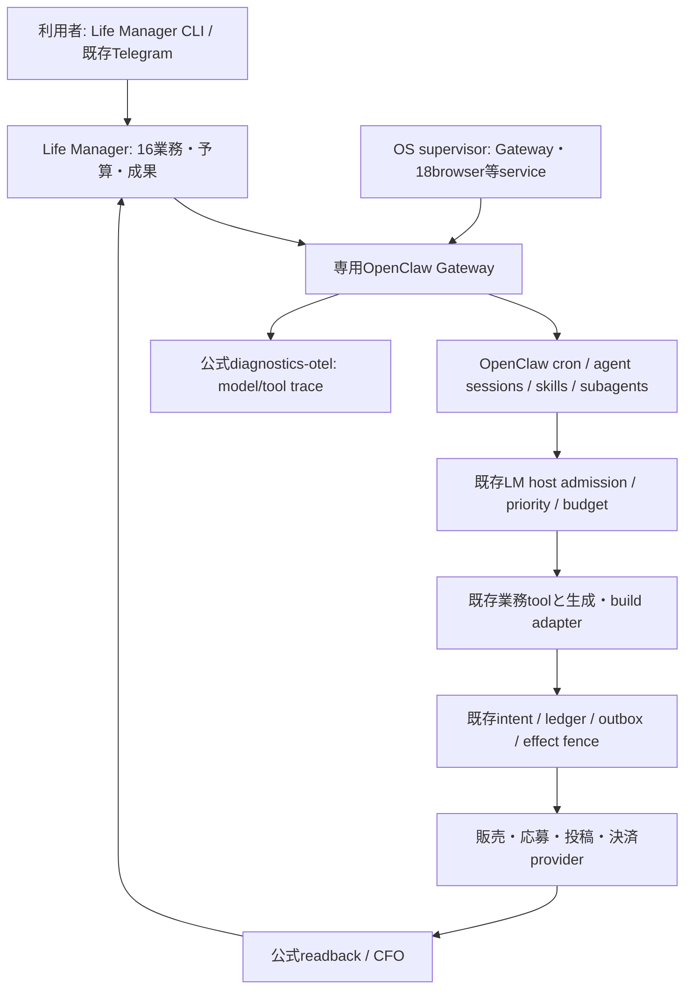

# ローカルLife Manager — OpenClawを最大限再利用する移行仕様

## 目的と現在の対象

ローカルで動くLife Managerを保ち、独自の一般agent実行・session・cron・traceをOpenClawの実装へ寄せる。Life Manager CLI、商品、顧客、注文、制作資産、アカウント、公式receipt、純収支を維持する。最新mainは16能力/110jobs（LINE Sticker追加）、92有限jobと18continuous service。過去15/107の監査は履歴で、今の完了分母にしない。

今回の依頼はspec/TODO更新。runtimeの実装、install/apply/start/stop、provider mutationは実施しない。以下は実装から最後の退役までの実行仕様であり、実施済みではない。

## 最終アーキテクチャ

OpenClawはnative Codexのモデル実行、context/session、skills/subagent機構、定期wake、run history、復旧、OTelを担当する。自作のcron/session DB、model/tool trace exporter、子agent frameworkを増やさない。cron command payloadなら決定的な仕事をモデルなしで呼べる。92有限jobは安全契約成立後に一件ずつOpenClaw cronへ移す。18continuous browser等とGateway自体はOS supervisorの責任で、無限model推論へ変えない。

Life Managerは商品の業務、収益優先/共有browser枠、spend cap、外部effectと公式receipt/純収益を担当する。これらは独自ハーネスの再発明ではなく、OpenClawから呼ぶdomain policy/tools。既存API/ledger/readbackを使い、同じ機能を別実装で複製しない。

通常UXはLife Manager CLIと既存Telegramのまま。engine/session/cron statusはCLIがOpenClaw公式APIへ委譲し、業務成果/入金はLMから表示する。OpenClawのsuccessと公開・納品・入金を分ける。Cloud Web `/lm` は対象外。

## 壊さないための切替契約

1. 初期値は全ownerでengine=legacy/scheduler=legacy。Gatewayを入れただけでは旧jobを止めない。native browser/profile/accountも変更しない。
2. shadowはprivate fixture/read-onlyだけ。販売・応募・公開・決済を新旧で並行実行しない。
3. source acceptance→mainのimmutable release→対象owner loaded-idle/pending無し→次の自然仕事、の順。動いている仕事を新sessionへ移送しない。queued/reserved/unknownがあれば対象をdeferし他ownerを続ける。
4. engine切替とschedule切替は別atom。前者は旧cadenceのまま、後者は旧future wake停止readback後に新cronを有効化。authorityは常に一つ。失敗時は新cronを無効化して旧scheduleだけを戻す。
5. 外部送信が不明ならowner/occurrence/業務keyの既存fenceでreadbackへ進む。RPC ACK喪失、timeout、wrapper終了、OpenClaw retryで同じ業務を再送しない。Gateway startup catchupが新root idを作っても過去の未確認effectをmigration gateで先に照合する。
6. model claimはupstream run/session/taskへbind。個別runの終了を確認して解放する。Gatewayがまだ生きていても終わったrunは解放でき、別run生存を終了証拠へ流用しない。run A timeoutでGateway全体やrun Bを止めない。
7. rollbackは新wake停止→対象run drain→route/schedule復元。顧客、商品、注文、ledger、receipt、credential、browser stateを巻戻し/再生成しない。
8. Manager/agents推論はChatGPT account接続のnative Codexだけ。既存Codex model/accountは保持し、sourceに残るClaude/Gemini textは個別C atomでCodexへ統一する。native harnessがtool fenceを迂回するなら、そのrouteは旧経路を維持し未完とする。hookの存在だけでfail-closedとは判定しない。
9. Capafyの既存published AgentはFROZEN policyを維持して変更しない。Mobile/eBook/LINEの投稿・画像・動画receipt、Alpacaのpaper/live別所有、wallet/payoutのcapを維持する。
10. 移行前からある失敗/待機/不明を新engineの成功へ置換しない。最新baselineには稼働とfenceが混在し、全部正常だったとは主張しない。各切替直前に状態を再読する。

## 接続contract

公式SDK/公開RPCを利用し、OpenClaw internal DBを書き換えない。pinned package/Node/SDK/OTelの互換をOC-012で確認してからadapterを有効化する。

RunRequest v2: owner_id、occurrence_id、run_id、task_id、release_sha、task_class、provider、model、effort、prompt、schema、workdir、timeout_seconds、effect_mode、session_isolation。caller task_idは安定logical stepで、同occurrenceの複数生成を混同しない。dispatch JSONはこの業務tupleだけを保存する薄いbridgeで、session/cron storeを再実装しない。

stable owner sessionを標準とし、fresh reviewはtask別session。stateとartifactはprivate/owner scoped、credential値はSSOTから参照してrepo/log/modelへ渡さない。OpenClaw native tools/subagentsの対応は実際のtool ownership/failure testで判定する。任意shell/browser/cron adminからの迂回を許可したとは扱わない。

観測はofficial diagnostics-otel、content captureなし、local OTLP endpointを使う。trusted owner/product/occurrence/task/releaseとupstream run/sessionを結合する。trace欠測を0としない。collector障害で業務receiptを成功/失敗へ勝手に置換しない。

## 完了の定義

16能力/110jobsの実source呼出がcovered。必要なmodel境界はOpenClaw、specialized Gemini image/FAL/build/決定的処理は既存tool、18continuousはnative service。92finiteのschedule ownerはOpenClaw cronへ一件ずつ移管済み。全jobの自然run/readbackと必要な成果・費用が結合し、移行で増えた重複/欠落0。未知または旧model routeが残れば全移行完了とはしない。

最後に参照0の独自runtime分岐だけを削除する。OpenClawが使うCodex/Claude binaries、OS services、LM admission/effect/financeを削除しない。local clean-user導入とrollback手順が成立したmainを成果とする。OS対応をOpenClaw対応だけから推定しない。Cloud製品やLinux/Windows全業務の新実装はこのlocal成果に混ぜない。

## 推論モデル・認証の固定条件

Daisの指定により、Managerとagentsの推論は既存ChatGPT accountに接続したCodexのみ。OpenClaw native Codex pluginを使い、agentRuntime.id=codexを明示する。runtime=auto/openclawの暗黙fallback、OpenAI API-key課金、Claude/Gemini text fallbackを許可しない。別embedding API等も勝手に追加しない。

公式pluginのUnix transport/user scopeで既存native Codex accountへ接続し、owner-onlyのLM threadだけを管理する。sessionCatalog discoveryは無効、個人/他sessionのthreadをresume/stopしない。account login/logout/import、OpenClaw auth DBへのtoken複製は行わない。接続statusがChatGPT accountでない場合は新routeを開始しない。

既存の画像/動画生成・render/buildは商品toolであり、Managerの推論モデルとは区別する。この移行でGemini image/FALを無断で廃止したり、Codex textで代替したりしない。費用とprovider receiptは既存CFOへ結ぶ。

native Codexのtools.allowによるrestricted-turn機構を使い、LM approved tool以外のnative shell/browser/MCPやhook relayが迂回できないことをNC-03で確認する。コード上対応があることと、この16業務での接続acceptanceは分ける。

根拠: [Codex config](https://github.com/openclaw/openclaw/blob/v2026.9.8/docs/plugins/codex-harness/configuration.md)、[native account scope](https://github.com/openclaw/openclaw/blob/v2026.9.8/docs/plugins/codex-harness/config-fields.md)、[restricted turns](https://github.com/openclaw/openclaw/blob/v2026.9.8/docs/plugins/codex-harness-reference/restricted-turns.md)。

画像入力とthread継続は実sourceに存在する必須経路。LINE candidate-sheet/Coconala paid/Writer visionの画像をMI-01でnative Codexへ渡す。Writer等のowned legacy threadはMI-02の公式forkで継続し、同じthreadの並行writerを作らない。forkとimage対応のsource acceptance未完なら当該旧仕事を維持する。認証はshared native daemonのaccountを使い、OpenClaw account/login/startで別accountを注入しない。

## 原子的TODO（状態/cursorの唯一の正本は統一SSOT）

全215atom。target/symbol/change/check/dependencyを固定。未知のものは旧経路を維持し未完として扱う。

### OC-001 — dependencies

- [ ] `runtime/openclaw/package.json` — runtime/openclaw/package.jsonはprivate ESM。openclaw=2026.9.8、gateway-client/protocol=2026.8.1、diagnostics-otel=2026.9.8、@openclaw/codex=2026.9.8をexact pin。Node24.16.0を初期bundleとしてlock。package-lockにintegrityを保存。official client/runtime/pluginを利用しWS/cron/session/OTel exporterを自作しない。
- 完了条件: tests/release-contract.test.mjsでexact5versions、SDK handshake/agent/wait/session/command cron/OTel plugin解決。incompatibleなら公開scope有効化0。
- 依存: なし

### OC-002 — resolveHarnessPaths(env, homedir) -> HarnessPaths

- [ ] `runtime/openclaw/paths.mjs` — 既存apps/life-manager/lib/runtime-paths.jsのresolveDataRootを呼ぶ。stateRoot=<dataRoot>/openclaw、configPath=<stateRoot>/config.json、dispatchRoot=<stateRoot>/dispatch、workspaceRoot=<stateRoot>/workspaces。相対LM_DATA_DIRは拒否。credentialFile=env.LM_CREDENTIALS_FILEまたは<homedir>/.local/share/anicca/credentials.json。
- 完了条件: tests/paths.test.mjs: /home/alice、/Users/bob、/srv/lmの3rootでDais絶対pathなし、相対rootでthrow。
- 依存: OC-001

### OC-003 — validateRunRequest(value) -> frozen RunRequest

- [ ] `runtime/openclaw/protocol.mjs` — RunRequest v2をclosed schemaで検証。追加task_idはtrusted callerの安定logical label、session_isolation=stable_owner|fresh_taskはoperator routeから固定。promptは非空、schema object、owner/occurrence/run/task IDs、release_sha、absolute workdir、timeout、provider/model/effort、effect_modeを検証。model supplied owner/claimは採用しない。 owner-scoped attachments=[{path,mime_type,sha256}]とowned_resume_ref|nullを追加。画像内容やtranscriptはdispatch/log/repoへ保存せずdigest/referenceだけを保持。
- 完了条件: tests/protocol.test.mjs: valid fixture通過、空prompt/bool timeout/../owner/unknown keyを拒否、入力を変更しない。
- 依存: OC-002

### OC-004 — buildRunIdentity(request, agentId) -> {sessionKey,idempotencyKey}

- [ ] `runtime/openclaw/protocol.mjs` — sessionKey=agent:<agentId>:lm:<sha256(JSON配列[owner_id,session_role])>、fresh_taskなら末尾tupleへoccurrence_id/task_id追加。idempotencyKey=sha256([owner_id,occurrence_id,task_id])。同taskでprompt/schema/releaseが変わった場合は保存digestと不一致として再送しない。異なるlogical taskは別dispatch。同一業務のrestartでkeyを変えない。
- 完了条件: protocol.test.mjs:同owner stable session、fresh reviewer別session、同occurrenceのtask A/Bは別run、同task retry同key、digest mismatch拒否、JS/Python tuple一致。
- 依存: OC-003

### OC-005 — load_dispatch(root, owner_id, occurrence_id, task_id) -> dict | None

- [ ] `runtime/openclaw/dispatch_store.py` — LM domain dispatchの小さいJSONをtuple hash pathで読む。OpenClaw internal SQLiteを直接触らない。partial/symlink/wrong mode拒否。sessionのsourceはOpenClaw。
- 完了条件: tests/test_dispatch_store.py:コロン境界2fixtureは別path、Node/Python hash一致、欠落None、foreign/corrupt拒否。
- 依存: OC-004

### OC-006 — save_dispatch(root, record) -> Path

- [ ] `runtime/openclaw/dispatch_store.py` — v2 recordはowner/occurrence/task/session/upstream run/claim/prompt-schema digests/phaseを保持。prepareをfsync+atomic保存してからRPC。accepted/unknownのrecordをpreparedへ戻さない。sameoccurrenceの複数taskは別file。
- 完了条件: tests/test_dispatch_store.py:2process同occurrenceでsent admission1件、terminal→sent拒否、mode0600。
- 依存: OC-005

### OC-007 — connectGateway({url,token,onEvent}, Client=GatewayClient) -> Promise<Client>

- [ ] `runtime/openclaw/gateway-client.mjs` — 公開SDKのstartを呼びonHelloOkまでresolveしない。minProtocol=maxProtocol=4。connect error/5秒timeoutでstopAndWaitしreject。tokenをstdout/例外へ入れない。
- 完了条件: tests/gateway-client.test.mjs: hello前request0、startup unavailable再接続はSDKに委譲、bad token表示にtoken文字列なし。
- 依存: OC-001, OC-004

### OC-008 — submitRun(client, request, identity, agentId) -> Promise<{runId}>

- [ ] `runtime/openclaw/gateway-client.mjs` — agent RPCにmessage/agentId/sessionKey/idempotencyKey/deliver:false/timeoutのみ渡す。expectFinal:false。未受領timeoutはdispatch_unknown。自身でagentを再callしない。
- 完了条件: tests/gateway-client.test.mjs: params完全一致、ack喪失でagent request count=1。
- 依存: OC-007

### OC-009 — waitRun(client, runId) -> Promise<object>

- [ ] `runtime/openclaw/gateway-client.mjs` — agent.waitへ{runId,timeoutMs:1000}を渡す。RPC未知field/未知statusはprovider_status_unknown。terminal判定はpinした配布contractのstatusだけを使う。
- 完了条件: tests/gateway-client.test.mjs:同runIdを照合、timeoutをsuccess扱いしない、foreign runId拒否。
- 依存: OC-008

### OC-010 — abortRun(client, {runId,sessionKey,agentId}) -> Promise<object>

- [ ] `runtime/openclaw/gateway-client.mjs` — sessions.abortへ{key:sessionKey,runId,agentId}だけ渡す。ACKを返すが停止proofを生成しない。
- 完了条件: tests/gateway-client.test.mjs:別session取消0、abort ACKだけでterminal/claim release0。
- 依存: OC-009

### OC-011 — readSession(client, {sessionKey,agentId}) -> Promise<object>

- [ ] `runtime/openclaw/gateway-client.mjs` — sessions.listのexact session結果を取得してagent/session identityとhasActiveRun/activeRunIdsを照合。read-only RPCだけ。OpenClaw内部DBを開かない。
- 完了条件: tests/gateway-client.test.mjs:foreign session拒否、active=trueは未停止、未知active情報はunknown。
- 依存: OC-010

### OC-012 — testPinnedGatewayContract()

- [ ] `runtime/openclaw/tests/release-contract.test.mjs` — SDKとgateway配布版のagent/agent.wait/sessions.abort/terminal payloadをprivate fake-model serverで記録し、既存fixtures/rpc-contract.jsonを作る。gateway-only instance、fake credential、model cost0、native tools disabled。
- 完了条件: node --test runtime/openclaw/tests/release-contract.test.mjs。handshake v4、1dispatch、1terminal、abort後active0、secret marker出力0。status shape不一致ならconsumerを直すtaskへ進まずcontract差分を確定。
- 依存: OC-011

### OC-013 — buildGatewayEnv(env, paths, secretValues) -> object

- [ ] `runtime/openclaw/environment.mjs` — copy envをやめallowlistを使う。PATH/HOME/TMPDIRと明示LM変数だけ。STATE_DIR/CONFIG_PATHをinstance pathへ、NO_RESPAWN=1、DISABLE_BONJOUR=1、EXEC_SHELL_SNAPSHOT=0、SKIP_CHANNELS=1。operator token/provider credentialsはruntime envのみ。
- 完了条件: tests/environment.test.mjs:fixture arbitrary AWS_SECRET/X private変数なし、旧OPENCLAW_STATE_DIR不継承、4preset完全一致。
- 依存: OC-002, OC-012

### OC-014 — buildGatewayConfig({paths,artifactWorkspace,port,agentId,modelRoute,effectMode}) -> object

- [ ] `runtime/openclaw/profile.mjs` — buildGatewayConfigは専用instanceと全owner/task profileを初回に用意。ambient/global profileを使わない。初期cronは全disabled、channelsなし。既存Codexモデル/account routeを維持、skillsはrepoの既存methodを参照。OTelはdiagnostics-otel、content capture無効、local OTLP endpointのみ。read_onlyとbrokeredのnative tool policyを明示し、未証明native paths/非承認subagentはdisabled。 推論agentRuntime.idはcodexで固定、plugins.allowにcodex、entries.codex.enabled=true。built-in openclaw runtime/API-key fallback/Claude/Gemini textを禁止。sessionCatalog.enabled=false。appServer.homeScope=userで既存native CodexのChatGPT accountを利用し、OpenClawへrefresh tokenを複製しない。 appServer.transport=unix、urlはNC-04の同native accountの確認済endpointのみ。OpenClaw管理OAuth profileへimportしない。
- 完了条件: tests/profile.test.mjs:read_onlyではlm_effectなし、cronfalse、ambient account/credential valueなし。公開CLI config validateで通過。
- 依存: OC-013, NC-01, NC-04

### OC-015 — gatewayCommand(paths, profile) -> list[str]

- [ ] `runtime/openclaw/supervisor.mjs` — official openclaw executableのgateway argv/envを返す薄いbuilderだけ。常駐/再起動は既存LM registry+OS supervisorへ委譲。OPENCLAW_NO_RESPAWN=1、既存global gateway/configに変更なし。自作再起動daemonを増やさない。
- 完了条件: supervisor.test.mjs:private config/node/packageのみ、global signal/install0、OS owner唯一。
- 依存: OC-007, OC-014

### OC-016 — stopGateway(handle, {drainTimeoutMs:5000}) -> Promise<StopProof>

- [ ] `runtime/openclaw/supervisor.mjs` — 全対象sessionがdrainした時だけ専用instanceを既存OS supervisor経由で止める。個別runのtimeoutではGateway全体を止めない。他ownerのactive runがあればinstance stopをdefer。
- 完了条件: supervisor.test.mjs:run A timeoutでrun BとGateway保持、foreign PID signal0、instance stop前drain必須。
- 依存: OC-015

### OC-017 — claim_model(owner_id: str, occurrence_id: str, inherited_claim: Path | None, registry_entry: dict) -> dict

- [ ] `runtime/openclaw/admission.py` — registry_entryはimmutable registryのtrusted owner row。継承claimは同owner/occurrenceかつresource_class=agentの場合だけ再利用する。deterministic/browser claimをmodel枠として借りない。この場合はresource_owner_id=m:<sha256(JSON配列[owner_id])>としてagent専用claimをenqueue_durable/claim_durableで追加し、admission_class/priorityは元rowを保持する。parent claimは変更しない。返却ModelClaimに元owner_idとresource_owner_id/refを含める。
- 完了条件: tests/test_admission.py:agent継承はclaim1、deterministic/browser継承は追加agent枠1、same-owner queueの別resource衝突なし、元priority保持、foreign claim拒否、capacitybusyでmodel starts0。
- 依存: OC-006

### OC-018 — bind_execution(claim_ref: Path, gateway_pid: int) -> None

- [ ] `runtime/openclaw/admission.py` — 既存transfer_durableでgateway PID/start identityへclaimをbindし、追加でupstream_run_id/task_id/session_keyへ結合。同gatewayの別runの生存を当該run完了証拠へ流用しない。
- 完了条件: tests/test_admission.py:別PID/start identityを拒否、transfer後caller終了でもclaim継続。
- 依存: OC-017, OC-015

### OC-019 — heartbeat_model(claim_ref: Path) -> bool

- [ ] `runtime/openclaw/admission.py` — 既存heartbeat_durableを呼ぶ。false/exceptionでstopping→upstream cancel/readbackへ進めるtyped resultを返す。staleだから即releaseしない。
- 完了条件: tests/test_admission.py:heartbeat failureでclaim保持、retry無制限なし。
- 依存: OC-018

### OC-020 — release_model(claim_ref: Path, stop_proof: dict, effect_state: str) -> dict

- [ ] `runtime/openclaw/admission.py` — 当該upstream run terminal、当該sessionのactiveRunIdsに当該runなし、当該runのowned tool children settlementを照合して既存releaseを一度だけ呼ぶ。Gateway全体の終了を要求しない。cancel ACK/WS close/親wrapper終了だけでは解放しない。不明effectは既存fenceを保持。
- 完了条件: test_admission.py:run A解放後run B/Gateway生存、ACKのみrelease0、task違い拒否、effect unknown fence保持。
- 依存: OC-019, OC-016

### OC-021 — _run_admitted() の finally release分岐

- [ ] `runtime/loop/lm_loop_run.py` — 新routeがdispatch recordでgatewayへclaimを引き継いだ場合のみ、子wrapper終了を理由とする旧releaseを行わずHA-020のterminal proofを要求する。既存routeのfinallyは変更しない。LIFE_MANAGER_LOOP_ID/CLAIM_REFをこのrouteへ常時渡す。
- 完了条件: runtime/loop/tests/test_openclaw_resource_lifetime.py: caller死亡後gateway activeでcapacity再利用0、legacy route同結果。
- 依存: OC-020

### OC-022 — manifest.tools

- [ ] `runtime/openclaw/plugin/openclaw.plugin.json` — official plugin manifestでlm_read/lm_artifact/lm_effectを宣言。configSchemaはprivate instance/binding rootのみclosed schema。一般shell/browser/scheduler adminへのmodel直接アクセスは未証明なら拒否。
- 完了条件: tests/plugin.test.mjs:tool宣言と実登録一致、unknown config field拒否。
- 依存: OC-014

### OC-023 — default plugin register(api)

- [ ] `runtime/openclaw/plugin/index.mjs` — definePluginEntryで3toolをcontextVersion:2で登録する。create(ctx)はctx.agentId/sessionKeyに一致するoperator BindingRecordだけをlookupし、固定Python/runtime/openclaw/tool_broker.py --invoke-stdinへ{binding_ref,tool_name,arguments}をstdinで渡す。shell:false、source-owned絶対script、callerからcommand/owner/credentialを受けない。assertInvocationCurrentを各call前に確認し、subprocess envへgateway/provider secretsを継承しない。
- 完了条件: tests/plugin.test.mjs:偽owner paramsはauthority変更なし、stale invocationのprovider call0。
- 依存: OC-022

### OC-024 — invoke_read(binding: dict, tool_name: str, arguments: dict) -> dict

- [ ] `runtime/openclaw/tool_broker.py` — bindingのownerが持つread-only handlerを呼ぶ。初版handlerはinventory fixture readだけ。read-only経路でpublisher/submission/moneyコードを呼ばない。
- 完了条件: tests/test_tool_broker.py:read許可、write tool要求でprovider write0、foreign owner拒否。
- 依存: OC-023, OC-017

### OC-025 — invoke_effect(binding: dict, tool_name: str, arguments: dict) -> dict

- [ ] `runtime/openclaw/tool_broker.py` — bindingと既存tool catalogで固定したowner domain adapterへ委譲。既存intent/marketplace ledger/outbox/official readbackを再利用し、effect開始前記録を守る。unknown状態はreconcileのみ。model finalやOpenClawのsuccessをreceiptにしない。CapafyはFROZEN published agentsを更新せず既存new-product policyを維持。
- 完了条件: tests/test_tool_broker.py:unknown/fenceなし/leaseなしwrite0、same occurrence fakewrite1・same receipt。
- 依存: OC-024

### OC-026 — write_artifact(binding: dict, relative_path: str, content: str) -> dict

- [ ] `runtime/openclaw/tool_broker.py` — trusted binding.workspace配下のrelative pathだけへUTF-8成果物を書く。absolute/..、symlink parent、.git、credential/config/state領域を拒否。最大1MiB。temp write/fsync/replaceし{artifact_ref,sha256,bytes}を返す。canonical catalog/production sourceを直接書かない。
- 完了条件: tests/test_tool_broker.py:4成果物SKILL.md/LISTING.md/icon.svg/evidence/verified-demonstration.mdをprivateworkspaceに作れる。../、symlink、1MiB超過はwrite0。
- 依存: OC-024

### OC-027 — main(argv: list[str], stdin: TextIO) -> int

- [ ] `runtime/openclaw/tool_broker.py` — --invoke-stdinだけ受付。packetは{binding_ref,tool_name,arguments} closed schema。operator dispatchRoot内のBindingRecordをmode/owner/claim/actual parent PID・start identityと照合し、lm_read→invoke_read、lm_artifact→write_artifact、lm_effect→invoke_effectへdispatchする前にtool_name∈binding.allowed_toolsとeffect_modeとの整合を検証する。read_onlyのlm_effectはprovider開始前に拒否する。model supplied owner/claimを採用しない。stdoutはsanitized JSON、unknown/errorはtyped resultと非zero。
- 完了条件: tests/test_tool_broker.py:foreign binding/parent mismatch/unknown tool/secret markerでeffect0、固定invoke packetが通る。shell command文字列は受けない。 read_only bindingへのlm_effect packetはprovider開始0。
- 依存: OC-025, OC-026

### OC-028 — testModelAndToolAdmissionFailClosed()

- [ ] `runtime/openclaw/tests/native-boundary.test.mjs` — 配布版でplugin missing/timeout、native shell/MCP/HTTP、cron/direct RPC、subagentの5迂回をfake provider相手にprobeする。一般prompt hookだけで強制保証しない。
- 完了条件: native-boundary.test.mjs:before-model hook例外/timeout、native Codex tools、shell/browser/skills経由の迂回、subagent model startをfixtureで試す。host claimなしmodel start0、effect fence外provider mutation0。不成立routeはlegacy維持。
- 依存: OC-025, OC-012, OC-021, OC-027

### OC-029 — validate_result(instance: object, schema: dict) -> dict

- [ ] `runtime/openclaw/schema_validate.py` — 既存jsonschema==4.26.0のvalidators.validator_for(schema)でschemaをcheck_schemaし結果をvalidate。stdinは{instance,schema}、stdoutは{valid:true}または{valid:false,error_class:schema_invalid|result_invalid}だけ。値やschema全文をstderrへ出さない。
- 完了条件: tests/test_schema_validate.py:additionalProperties:false拒否、required不足拒否、draft選択、fake secret markerを出力しない。
- 依存: OC-003

### OC-030 — normalizeOutcome(raw, request) -> RunOutcome

- [ ] `runtime/openclaw/result.mjs` — HA-012で固定したpayloadのfinal JSONを取得し、release-ownedPythonのschema_validate.pyへstdinでinstance/schemaを渡す。valid=falseならfailed。usage/cost欠測はnull。tool receiptはbroker証拠のみからjoinし、LLM textを公式receiptへ変換しない。
- 完了条件: tests/result.test.mjs:invalid JSON/schemaはfailed、fake final receiptを採用しない、token欠測null。
- 依存: OC-012, OC-025, OC-029

### OC-031 — project_usage(raw: dict, identity: dict) -> dict

- [ ] `runtime/openclaw/telemetry.py` — existing agent-usage fieldsへinput/output/cached/retry/subagent tokensをproject。cost_basisはprovider_reported/api_equivalent_estimate/unknownを分離。runId重複を二重計上しない。
- 完了条件: tests/test_telemetry.py:retry usage含む、欠測null、同run二重charge0、fake secret marker非露出。
- 依存: OC-030

### OC-032 — project_runtime_event(outcome: dict, identity: dict) -> dict

- [ ] `runtime/openclaw/telemetry.py` — 既存runtime_event.build_runtime_event/validate_runtime_eventを利用しrun/owner/occurrence/releaseをjoin。error_class/retryable/next_action/receipt/readbackを保持。
- 完了条件: tests/test_telemetry.py:既存validator通過、release欠落でsuccess不可、unknown effect維持。
- 依存: OC-031

### OC-033 — main(argv, stdin, deps) -> Promise<number>

- [ ] `runtime/openclaw/cli.mjs` — request v2を読みprepare→host claim→trusted binding→RPC submit→ACK保存→wait→result/schema/domain receipt→terminal proof→release。stable sessionを使っても前task contextをeffect authorityにしない。exit0/1/2/75を現callerへ返す。
- 完了条件: tests/cli.test.mjs:正常fixture各呼出順、ack喪失でsent1/dispatch0追加、timeoutでunknown。 request.workdirがREPO_ROOTでもartifactWorkspaceはその外のprivate path、source write0。
- 依存: OC-003, OC-004, OC-006, OC-008, OC-009, OC-010, OC-011, OC-020, OC-030, OC-032, OC-028, NC-02, NC-03

### OC-034 — run_openclaw(parsed, prompt: str, schema: dict, config: dict, budget_context: dict) -> int

- [ ] `runtime/openclaw/runner_adapter.py` — run_openclawは既存parsed.imageとcodex_resume_session_idをMI-01/02のapproved referenceへ変換してRunRequest v2へ渡す。usage/schema/result_path/lease/token budget契約を維持。対応が未証明の時だけsource-controlled legacyを選び、全移行完了にしない。画像やresumeを永久unsupportedのまま終わらせない。
- 完了条件: tests/test_runner_adapter.py:summary result_path互換、pass/daily limit blockedでRPC0、same occurrence二重reserve0、usage unknownでreservation保持、unsupported imageでdispatch0。
- 依存: OC-033, MI-01, MI-02

### OC-035 — run() の evidence/lease/token-budget preflight後・candidate for-loop前

- [ ] `runtime/agent-runner/agent_runner.py` — agent_runner.runの既存evidence/provider lease/token budget preflight後に新route選択。trusted LIFE_MANAGER_LOOP_ID+task_idでconfig/openclaw-routes.jsonをimmutable releaseから読む。disabled/unsupportedは既存candidate経路。RPC開始後にlegacyへ同task fallbackしない。
- 完了条件: runtime/agent-runner/tests/test_openclaw_route.py:defaultlegacy、eligibleownerだけnew、空ownernew0、token/evidence/provider-lease preflightを迂回しない、未停止でlease release0。
- 依存: OC-034, OC-021

### OC-036 — test_ack_loss_preserves_claim()

- [ ] `runtime/openclaw/tests/test_recovery.py` — 送信→ACK前crash fixture。sent recordが残り、同occurrence再開はreconcileのみ、新RPC agent0・claim保持をassert。
- 完了条件: python3 -m pytest runtime/openclaw/tests/test_recovery.py::test_ack_loss_preserves_claim -q。
- 依存: OC-035

### OC-037 — test_provider_success_receipt_gap()

- [ ] `runtime/openclaw/tests/test_recovery.py` — fake provider成功→receipt保存前crash fixture。readbackで同receipt復元、provider write1、retry追加0をassert。
- 完了条件: python3 -m pytest runtime/openclaw/tests/test_recovery.py::test_provider_success_receipt_gap -q。
- 依存: OC-036

### OC-038 — test_terminal_replay_zero()

- [ ] `runtime/openclaw/tests/test_recovery.py` — terminal保存済みoccurrenceを再投入。existing result/refを返しmodel/provider/toolの追加call0をassert。
- 完了条件: python3 -m pytest runtime/openclaw/tests/test_recovery.py::test_terminal_replay_zero -q。
- 依存: OC-037

### OC-039 — 固定canary request

- [ ] `runtime/openclaw/fixtures/read-only-request.json` — owner_id=harness-readonly-canary、occurrence_id=fixture-001、effect_mode=read_only、task_class=repeatable-agent、timeout_seconds=60、schema={type:object,required:[status,count],properties:{status:{const:success},count:{const:1}},additionalProperties:false}。model/providerはprivate fixture configに渡しsourceへcredentialを入れない。
- 完了条件: tests/canary.test.mjs:validateRunRequest通過、fake modelの返答{status:success,count:1}、effect0。
- 依存: OC-038

### OC-040 — main(argv) -> int

- [ ] `apps/life-manager/scripts/harness-readonly-canary.py` — harness-readonly-canary.pyはprivate request/fixtureだけを読み既存operator bridgeへ渡す。production追加owner/scheduleを自動作成しない。source acceptanceと自然業務receiptを区別。
- 完了条件: runtime/openclaw/tests/test_canary.py:caller pathsrelease相対、effect0、event same occurrence。
- 依存: OC-039

### OC-041 — owners

- [ ] `config/openclaw-routes.json` — 110ownerの初期recordをengine=legacy,scheduler=legacy,enabled=false、source coverage refsなしで作る。continuousはnative_service。business cadenceは保持し、推論はCodex-only policyへ統一。
- 完了条件: test_routes.py: unknown/default/disabledがlegacy、coverage refなしenable拒否。
- 依存: OC-035

### OC-042 — attach_trace_identity(envelope, binding) -> dict

- [ ] `runtime/openclaw/telemetry.py` — official model/tool spansのrun/sessionをtrusted LM owner/product/occurrence/task/releaseへ結合。content/authを記録せず欠測はnull。実請求とestimateを区別。
- 完了条件: test_telemetry.py: foreign run拒否、missing0化なし、secret field除去、同run相関。
- 依存: OC-031, OC-032

### OC-043 — build_owner_inventory(registry, catalog, sources) -> dict

- [ ] `runtime/openclaw/owner_inventory.py` — 16group/110jobのentrypoint閉包とmodel/tool呼出を出力。direct Claude/Gemini/SkillOpt/画像/動画も列挙、unseen callはcoverage false。単純なprovider_route分類だけで完了にしない。
- 完了条件: test_inventory.py: nested deterministic modelとdirect APIをfixtureで検出、無モデルjobにmodel追加なし。
- 依存: OC-041

### OC-044 — build_command_job(owner, release, cadence, epoch) -> dict

- [ ] `runtime/openclaw/schedule_transfer.py` — official cron command payloadを作りexisting bin/lm-loop-runを実行する。AI不要の処理へmodelを追加しない。cadence/anchor/timezoneとimmutable argvを保持。最初はenabled=false、delivery none。
- 完了条件: test_schedule_transfer.py: exact argv/cadence、continuous拒否、client adminのみcron編集。
- 依存: OC-012, OC-043

### OC-045 — prepare_transfer(owner_id, expected_sha) -> dict

- [ ] `runtime/openclaw/schedule_transfer.py` — owner deploy leaseを取得。active model/process/予約/queued occurrence/unknown effectを再観測し、残ればdefer。旧plist/cadence/release/new cron disabled状態をreceiptへ保存。
- 完了条件: test_schedule_transfer.py: active/pending/fencedは変更0、foreign owner不変更。
- 依存: OC-044

### OC-046 — commit_transfer(prepared) -> dict

- [ ] `runtime/openclaw/schedule_transfer.py` — 既存launchctl-safeで旧ownerの新wakeだけ停止→旧future scheduler停止readback→official cron enable。唯一schedulerをreadback、失敗時に新cronをdisabledとして旧scheduleだけ復元。稼働仕事を移送/再送しない。
- 完了条件: test_schedule_transfer.py: fault各境界scheduler<=1、同effect重複0、途中receiptから復旧。
- 依存: OC-045

### OC-047 — rollback_transfer(receipt) -> dict

- [ ] `runtime/openclaw/schedule_transfer.py` — 新wake pause→当該run drain/settlement確認→新cron disabled→旧source scheduleを復元。ledger/auth/workspace/provider effectを巻戻さない。Gateway全体stop禁止。
- 完了条件: test_schedule_transfer.py: 別owner継続、unknownはreconcileへ、effect resend0。
- 依存: OC-046

### OC-048 — _kick_reserved_owners() scheduler dispatch

- [ ] `runtime/loop/lm_loop_run.py` — 既存reservation/priority policyは保持。owner authorityがlegacyなら現行kick、OpenClawなら公式cron runへ同owner wakeをdispatch。controllerからmodel/publishを直実行しない。
- 完了条件: test_openclaw_scheduler_authority.py:legacy不変、reservation duplicate0、authority mismatch拒否。
- 依存: OC-046

### OC-049 — health/status/lifecycle OpenClaw projection

- [ ] `runtime/loop/lm_loop.py` — 既存CLI引数を維持。official health/session/cron状態とLM financial/effect状態を合成。stopはownerの新wake停止、run cancel/drainを対象限定。OS browser ownerは既存処理。
- 完了条件: test_openclaw_cli.py:同じCLI互換、stop AでB継続、process pass≠business verified。
- 依存: OC-042, OC-048

### OC-050 — validate_subagent_policy(policy, parentBinding)

- [ ] `runtime/openclaw/profile.mjs` — official subagent機能を利用する条件を固定。childも別host claim/budget、独立workspace/fresh reviewer、同じtool fence。既存hookがfail-openになる経路はenabled falseのまま。
- 完了条件: native-boundary.test.mjs:child model claimなしstart0、親停止時child settlementまで保持。
- 依存: OC-028, OC-042, NC-03

### OC-051 — resolve_skills_paths(releaseRoot, route)

- [ ] `runtime/openclaw/profile.mjs` — 既存skillsをofficial skills loaderへ参照させる。新しいskill managerを作らない。modelが書いたskillを無審査でproductionへロードしない。
- 完了条件: profile.test.mjs: release内approved skillのみ、Dais profile/secret snapshot複製0。
- 依存: OC-014, OC-050

### OC-052 — life-manager-openclaw-gateway service

- [ ] `config/loop-registry.json` — 専用Gatewayのcontinuous serviceだけを既存supervisorへ登録。daemon二重所有なし、global OpenClaw upgradeなし。source build中は未install。
- 完了条件: test_lm_loop_apply.py:immutable package/node/profile argv、既存110 owner cadence変更0。
- 依存: OC-015, OC-051

### OC-053 — decideCandidatePromotion(input) harness contract evidence

- [ ] `apps/life-manager/eval/agent-contract/gate.js` — 既存decideCandidatePromotion/decidePromotionGateが要求する同task/baseline/live evidenceにschema/trace/tool/receipt/recovery refsを加える。新judge/benchmark frameworkを作らず、Codex-onlyを同じgateで評価する。
- 完了条件: gate.test.js:欠測/自己申告fail、fake/real receiptの区別、旧cases PASS。
- 依存: OC-028, OC-042

### OC-054 — record_canary_application() harness evidence

- [ ] `skills/writer-agent/scripts/writer_learning_worker.py` — 既存candidate/eval/canary記録へnative Codex account、harness version、同task trace/evidenceを結合。OpenClaw既製skills/subagentを利用し、production skill/codeを無審査で昇格しない。self-improve-evolve等他ownerへの適用はPの実call閉包を先に確認。
- 完了条件: 既存writer learning/candidate gate testでmissing evidence拒否、baseline候補不変、failed candidate本番enable0。
- 依存: OC-050, OC-051, OC-053

### P-01 — audited product coverage v1

- [ ] `docs/evidence/openclaw-cutover/products/gig-coconala-coverage.json` — 入力catalog job_ids=['hf-gig-apply-direct', 'hf-gig-apply-evidence-gc', 'hf-gig-browser', 'hf-gig-daily-report', 'hf-gig-paid-direct', 'hf-gig-reply-detector', 'hf-gig-storefront-direct']。読む最小call閉包=runtime/loop/entry_dispatch.py::hf-gig-apply-direct / skills/_shared/marketplace-core/scripts/reply_composer.py::compose。既存receipt reader=skills/earn/gig/scripts/application_occurrence_reconcile.py::reconcile_occurrence。各ownerのmodel_calls/task_id規則/provider/model/tool_policy/output_schema/effect_fence/fixture refsを記録。coverage_passは再現source契約でだけtrue。未対応sourceを無視せずfalseで原因とfix file/functionを保存。Investment/eBook/CFOの決定的処理にmodelを追加しない。
- 完了条件: owner集合がcatalogと完全一致、全model callのroute/budget/schema/traceをfixtureで検証。native tool/effect bypass0、same task二重実行0。
- 依存: OC-043, OC-053, C-08

### A-01 — owners for gig-coconala

- [ ] `config/openclaw-routes.json` — P-01のcoverage_passとChatGPT Codex native accountと承認済modelの確認が成立したowner/taskだけengine=openclawへ設定。18continuousはnative_service、specialized media APIは既存tool。sharedモデル以外の直接境界は下のC taskを先に修正。schedulerはここではlegacyのまま。各ownerのmain release反映はloaded-idle/pending無し時だけ一件ずつ。未合格ownerは現行のまま、group移行完了にしない。
- 完了条件: routes test、source acceptance→main-derived release→target idle apply→次の自然model呼出でschema/trace/usageを確認。他owner/source/state不変。
- 依存: P-01, OC-049, OC-052

### P-02 — audited product coverage v1

- [ ] `docs/evidence/openclaw-cutover/products/gig-lancers-coverage.json` — 入力catalog job_ids=['lancers-revenue-application', 'lancers-revenue-browser', 'lancers-revenue-negotiate', 'lancers-revenue-paid', 'lancers-revenue-storefront', 'lancers-revenue-telegram-report', 'lancers-revenue-work-sync']。読む最小call閉包=skills/earn/lancers/scripts/application_loop.py planner / work_sync.py AGENT_RUNNER。既存receipt reader=application_loop.py::_reconcile_pending。各ownerのmodel_calls/task_id規則/provider/model/tool_policy/output_schema/effect_fence/fixture refsを記録。coverage_passは再現source契約でだけtrue。未対応sourceを無視せずfalseで原因とfix file/functionを保存。Investment/eBook/CFOの決定的処理にmodelを追加しない。
- 完了条件: owner集合がcatalogと完全一致、全model callのroute/budget/schema/traceをfixtureで検証。native tool/effect bypass0、same task二重実行0。
- 依存: OC-043, OC-053, C-08

### A-02 — owners for gig-lancers

- [ ] `config/openclaw-routes.json` — P-02のcoverage_passとChatGPT Codex native accountと承認済modelの確認が成立したowner/taskだけengine=openclawへ設定。18continuousはnative_service、specialized media APIは既存tool。sharedモデル以外の直接境界は下のC taskを先に修正。schedulerはここではlegacyのまま。各ownerのmain release反映はloaded-idle/pending無し時だけ一件ずつ。未合格ownerは現行のまま、group移行完了にしない。
- 完了条件: routes test、source acceptance→main-derived release→target idle apply→次の自然model呼出でschema/trace/usageを確認。他owner/source/state不変。
- 依存: P-02, OC-049, OC-052

### P-03 — audited product coverage v1

- [ ] `docs/evidence/openclaw-cutover/products/gig-crowdworks-coverage.json` — 入力catalog job_ids=['crowdworks-revenue-application', 'crowdworks-revenue-browser', 'crowdworks-revenue-paid', 'crowdworks-revenue-reply', 'crowdworks-revenue-report']。読む最小call閉包=application_owner.py::_work_fit_verdict / skills/_shared/marketplace-core/scripts/work_fit.py::_default_runner。既存receipt reader=application_owner.py::_reconcile。各ownerのmodel_calls/task_id規則/provider/model/tool_policy/output_schema/effect_fence/fixture refsを記録。coverage_passは再現source契約でだけtrue。未対応sourceを無視せずfalseで原因とfix file/functionを保存。Investment/eBook/CFOの決定的処理にmodelを追加しない。
- 完了条件: owner集合がcatalogと完全一致、全model callのroute/budget/schema/traceをfixtureで検証。native tool/effect bypass0、same task二重実行0。
- 依存: OC-043, OC-053, C-08

### A-03 — owners for gig-crowdworks

- [ ] `config/openclaw-routes.json` — P-03のcoverage_passとChatGPT Codex native accountと承認済modelの確認が成立したowner/taskだけengine=openclawへ設定。18continuousはnative_service、specialized media APIは既存tool。sharedモデル以外の直接境界は下のC taskを先に修正。schedulerはここではlegacyのまま。各ownerのmain release反映はloaded-idle/pending無し時だけ一件ずつ。未合格ownerは現行のまま、group移行完了にしない。
- 完了条件: routes test、source acceptance→main-derived release→target idle apply→次の自然model呼出でschema/trace/usageを確認。他owner/source/state不変。
- 依存: P-03, OC-049, OC-052

### P-04 — audited product coverage v1

- [ ] `docs/evidence/openclaw-cutover/products/writer-coverage.json` — 入力catalog job_ids=['writer-claim-loop', 'writer-craft-train', 'writer-money-sync', 'writer-opportunity-discovery', 'writer-opportunity-response', 'writer-report', 'writer-sales-measure']。読む最小call閉包=skills/writer-agent/runtime/shared-model-runner.py::main / craft-train.sh skillopt.model。既存receipt reader=opportunity_response.py::gmail_fetch / scripts/money_sync.py。各ownerのmodel_calls/task_id規則/provider/model/tool_policy/output_schema/effect_fence/fixture refsを記録。coverage_passは再現source契約でだけtrue。未対応sourceを無視せずfalseで原因とfix file/functionを保存。Investment/eBook/CFOの決定的処理にmodelを追加しない。
- 完了条件: owner集合がcatalogと完全一致、全model callのroute/budget/schema/traceをfixtureで検証。native tool/effect bypass0、same task二重実行0。
- 依存: OC-043, OC-053, C-03, C-08

### A-04 — owners for writer

- [ ] `config/openclaw-routes.json` — P-04のcoverage_passとChatGPT Codex native accountと承認済modelの確認が成立したowner/taskだけengine=openclawへ設定。18continuousはnative_service、specialized media APIは既存tool。sharedモデル以外の直接境界は下のC taskを先に修正。schedulerはここではlegacyのまま。各ownerのmain release反映はloaded-idle/pending無し時だけ一件ずつ。未合格ownerは現行のまま、group移行完了にしない。
- 完了条件: routes test、source acceptance→main-derived release→target idle apply→次の自然model呼出でschema/trace/usageを確認。他owner/source/state不変。
- 依存: P-04, OC-049, OC-052

### P-05 — audited product coverage v1

- [ ] `docs/evidence/openclaw-cutover/products/affiliate-coverage.json` — 入力catalog job_ids=['affiliate-browser', 'affiliate-composition', 'affiliate-impact-browser', 'affiliate-loop', 'affiliate-source-refresh', 'affiliate-x-browser']。読む最小call閉包=skills/affiliate/scripts/agent_runner.py::main。既存receipt reader=owned_publish.py::fetch_readback / host_fence_reconcile.py::reconcile_host_fence。各ownerのmodel_calls/task_id規則/provider/model/tool_policy/output_schema/effect_fence/fixture refsを記録。coverage_passは再現source契約でだけtrue。未対応sourceを無視せずfalseで原因とfix file/functionを保存。Investment/eBook/CFOの決定的処理にmodelを追加しない。
- 完了条件: owner集合がcatalogと完全一致、全model callのroute/budget/schema/traceをfixtureで検証。native tool/effect bypass0、same task二重実行0。
- 依存: OC-043, OC-053, C-08

### A-05 — owners for affiliate

- [ ] `config/openclaw-routes.json` — P-05のcoverage_passとChatGPT Codex native accountと承認済modelの確認が成立したowner/taskだけengine=openclawへ設定。18continuousはnative_service、specialized media APIは既存tool。sharedモデル以外の直接境界は下のC taskを先に修正。schedulerはここではlegacyのまま。各ownerのmain release反映はloaded-idle/pending無し時だけ一件ずつ。未合格ownerは現行のまま、group移行完了にしない。
- 完了条件: routes test、source acceptance→main-derived release→target idle apply→次の自然model呼出でschema/trace/usageを確認。他owner/source/state不変。
- 依存: P-05, OC-049, OC-052

### P-06 — audited product coverage v1

- [ ] `docs/evidence/openclaw-cutover/products/investment-coverage.json` — 入力catalog job_ids=['alpaca-investment-paper', 'alpaca-investment-live', 'investment-cross-venue-report', 'investment-strategy-validation']。読む最小call閉包=skills/alpaca-investment/run.py / allocator.py::choose deterministic strategy。既存receipt reader=run.py::_reconcile_etf_intent / observe。各ownerのmodel_calls/task_id規則/provider/model/tool_policy/output_schema/effect_fence/fixture refsを記録。coverage_passは再現source契約でだけtrue。未対応sourceを無視せずfalseで原因とfix file/functionを保存。Investment/eBook/CFOの決定的処理にmodelを追加しない。
- 完了条件: owner集合がcatalogと完全一致、全model callのroute/budget/schema/traceをfixtureで検証。native tool/effect bypass0、same task二重実行0。
- 依存: OC-043, OC-053, C-08

### A-06 — owners for investment

- [ ] `config/openclaw-routes.json` — P-06のcoverage_passとChatGPT Codex native accountと承認済modelの確認が成立したowner/taskだけengine=openclawへ設定。18continuousはnative_service、specialized media APIは既存tool。sharedモデル以外の直接境界は下のC taskを先に修正。schedulerはここではlegacyのまま。各ownerのmain release反映はloaded-idle/pending無し時だけ一件ずつ。未合格ownerは現行のまま、group移行完了にしない。
- 完了条件: routes test、source acceptance→main-derived release→target idle apply→次の自然model呼出でschema/trace/usageを確認。他owner/source/state不変。
- 依存: P-06, OC-049, OC-052

### P-07 — audited product coverage v1

- [ ] `docs/evidence/openclaw-cutover/products/agent-economy-coverage.json` — 入力catalog job_ids=['agent-economy-loop', 'citizen-refill', 'life-manager-x402-ledger', 'sol-funding', 'the402-provider', 'the402-worker', 'x402-acquisition-controller', 'x402-claude-p', 'x402-experiment-franklin1', 'x402-franklin1', 'x402-franklin2', 'x402-inflow-watch', 'x402-inflow-watch-claude-p', 'x402-inflow-watch-franklin1', 'x402-inflow-watch-franklin2', 'x402-research-serve', 'x402-sale-observer', 'x402-seller-8404', 'x402-settlement-recorder']。読む最小call閉包=runtime/loop/brain.mjs::think。既存receipt reader=sale-observer.mjs::pollSaleSources / settlement-recorder.mjs::recordSaleCandidates。各ownerのmodel_calls/task_id規則/provider/model/tool_policy/output_schema/effect_fence/fixture refsを記録。coverage_passは再現source契約でだけtrue。未対応sourceを無視せずfalseで原因とfix file/functionを保存。Investment/eBook/CFOの決定的処理にmodelを追加しない。
- 完了条件: owner集合がcatalogと完全一致、全model callのroute/budget/schema/traceをfixtureで検証。native tool/effect bypass0、same task二重実行0。
- 依存: OC-043, OC-053, C-01, C-08

### A-07 — owners for agent-economy

- [ ] `config/openclaw-routes.json` — P-07のcoverage_passとChatGPT Codex native accountと承認済modelの確認が成立したowner/taskだけengine=openclawへ設定。18continuousはnative_service、specialized media APIは既存tool。sharedモデル以外の直接境界は下のC taskを先に修正。schedulerはここではlegacyのまま。各ownerのmain release反映はloaded-idle/pending無し時だけ一件ずつ。未合格ownerは現行のまま、group移行完了にしない。
- 完了条件: routes test、source acceptance→main-derived release→target idle apply→次の自然model呼出でschema/trace/usageを確認。他owner/source/state不変。
- 依存: P-07, OC-049, OC-052

### P-08 — audited product coverage v1

- [ ] `docs/evidence/openclaw-cutover/products/job-hunter-coverage.json` — 入力catalog job_ids=['job-search-daily', 'job-search-health', 'job-search-inbox', 'job-search-learning', 'mercor-revenue-application', 'mercor-revenue-paid', 'mercor-revenue-reply']。読む最小call閉包=apps/job-search-loop/job_search_loop/agent_runner.py::AgentRunner.run。既存receipt reader=mercor_provider.py / mercor_auth_readback。各ownerのmodel_calls/task_id規則/provider/model/tool_policy/output_schema/effect_fence/fixture refsを記録。coverage_passは再現source契約でだけtrue。未対応sourceを無視せずfalseで原因とfix file/functionを保存。Investment/eBook/CFOの決定的処理にmodelを追加しない。
- 完了条件: owner集合がcatalogと完全一致、全model callのroute/budget/schema/traceをfixtureで検証。native tool/effect bypass0、same task二重実行0。
- 依存: OC-043, OC-053, C-08

### A-08 — owners for job-hunter

- [ ] `config/openclaw-routes.json` — P-08のcoverage_passとChatGPT Codex native accountと承認済modelの確認が成立したowner/taskだけengine=openclawへ設定。18continuousはnative_service、specialized media APIは既存tool。sharedモデル以外の直接境界は下のC taskを先に修正。schedulerはここではlegacyのまま。各ownerのmain release反映はloaded-idle/pending無し時だけ一件ずつ。未合格ownerは現行のまま、group移行完了にしない。
- 完了条件: routes test、source acceptance→main-derived release→target idle apply→次の自然model呼出でschema/trace/usageを確認。他owner/source/state不変。
- 依存: P-08, OC-049, OC-052

### P-09 — audited product coverage v1

- [ ] `docs/evidence/openclaw-cutover/products/fundraiser-coverage.json` — 入力catalog job_ids=['fundraiser']。読む最小call閉包=skills/fundraiser-agent/runtime/run.sh run_agent call。既存receipt reader=runtime/record-application.py。各ownerのmodel_calls/task_id規則/provider/model/tool_policy/output_schema/effect_fence/fixture refsを記録。coverage_passは再現source契約でだけtrue。未対応sourceを無視せずfalseで原因とfix file/functionを保存。Investment/eBook/CFOの決定的処理にmodelを追加しない。
- 完了条件: owner集合がcatalogと完全一致、全model callのroute/budget/schema/traceをfixtureで検証。native tool/effect bypass0、same task二重実行0。
- 依存: OC-043, OC-053, C-08

### A-09 — owners for fundraiser

- [ ] `config/openclaw-routes.json` — P-09のcoverage_passとChatGPT Codex native accountと承認済modelの確認が成立したowner/taskだけengine=openclawへ設定。18continuousはnative_service、specialized media APIは既存tool。sharedモデル以外の直接境界は下のC taskを先に修正。schedulerはここではlegacyのまま。各ownerのmain release反映はloaded-idle/pending無し時だけ一件ずつ。未合格ownerは現行のまま、group移行完了にしない。
- 完了条件: routes test、source acceptance→main-derived release→target idle apply→次の自然model呼出でschema/trace/usageを確認。他owner/source/state不変。
- 依存: P-09, OC-049, OC-052

### P-10 — audited product coverage v1

- [ ] `docs/evidence/openclaw-cutover/products/connector-coverage.json` — 入力catalog job_ids=['life-manager-connector-native']。読む最小call閉包=connector-production-browser-harness.js::runAgentRunner / connector-luna-judgment.js::runLocalAgentRunner。既存receipt reader=connector-minimal-production.js::readProviderState。各ownerのmodel_calls/task_id規則/provider/model/tool_policy/output_schema/effect_fence/fixture refsを記録。coverage_passは再現source契約でだけtrue。未対応sourceを無視せずfalseで原因とfix file/functionを保存。Investment/eBook/CFOの決定的処理にmodelを追加しない。
- 完了条件: owner集合がcatalogと完全一致、全model callのroute/budget/schema/traceをfixtureで検証。native tool/effect bypass0、same task二重実行0。
- 依存: OC-043, OC-053, C-08

### A-10 — owners for connector

- [ ] `config/openclaw-routes.json` — P-10のcoverage_passとChatGPT Codex native accountと承認済modelの確認が成立したowner/taskだけengine=openclawへ設定。18continuousはnative_service、specialized media APIは既存tool。sharedモデル以外の直接境界は下のC taskを先に修正。schedulerはここではlegacyのまま。各ownerのmain release反映はloaded-idle/pending無し時だけ一件ずつ。未合格ownerは現行のまま、group移行完了にしない。
- 完了条件: routes test、source acceptance→main-derived release→target idle apply→次の自然model呼出でschema/trace/usageを確認。他owner/source/state不変。
- 依存: P-10, OC-049, OC-052

### P-11 — audited product coverage v1

- [ ] `docs/evidence/openclaw-cutover/products/self-build-coverage.json` — 入力catalog job_ids=['life-manager-dev', 'life-manager-recovery-supervisor', 'life-manager-selfbuild', 'self-improve-evolve']。読む最小call閉包=life-manager-dev-d0.sh / dev-adversary-review.js::runAdversaryReview。既存receipt reader=self-build-daily.js guard ledger / release recovery。各ownerのmodel_calls/task_id規則/provider/model/tool_policy/output_schema/effect_fence/fixture refsを記録。coverage_passは再現source契約でだけtrue。未対応sourceを無視せずfalseで原因とfix file/functionを保存。Investment/eBook/CFOの決定的処理にmodelを追加しない。
- 完了条件: owner集合がcatalogと完全一致、全model callのroute/budget/schema/traceをfixtureで検証。native tool/effect bypass0、same task二重実行0。
- 依存: OC-043, OC-053, C-02, C-08

### A-11 — owners for self-build

- [ ] `config/openclaw-routes.json` — P-11のcoverage_passとChatGPT Codex native accountと承認済modelの確認が成立したowner/taskだけengine=openclawへ設定。18continuousはnative_service、specialized media APIは既存tool。sharedモデル以外の直接境界は下のC taskを先に修正。schedulerはここではlegacyのまま。各ownerのmain release反映はloaded-idle/pending無し時だけ一件ずつ。未合格ownerは現行のまま、group移行完了にしない。
- 完了条件: routes test、source acceptance→main-derived release→target idle apply→次の自然model呼出でschema/trace/usageを確認。他owner/source/state不変。
- 依存: P-11, OC-049, OC-052

### P-12 — audited product coverage v1

- [ ] `docs/evidence/openclaw-cutover/products/mobile-apps-coverage.json` — 入力catalog job_ids=['life-manager-anicca-affirmation-youtube', 'life-manager-anicca-ai-youtube', 'life-manager-anicca-buddha-tiktok', 'life-manager-anicca-en-affirmation-instagram', 'life-manager-anicca-en-affirmation-tiktok', 'life-manager-anicca-en-card-instagram', 'life-manager-anicca-en-slideshow-tiktok', 'life-manager-anicca-en-widget-instagram', 'life-manager-anicca-he', 'life-manager-anicca-ja-widget-instagram', 'life-manager-anicca-jp1-tiktok', 'life-manager-anicca-jp4', 'life-manager-anicca-larry-ja-instagram', 'life-manager-anicca-main-instagram', 'life-manager-anicca-main-tiktok', 'life-manager-daily', 'life-manager-daily-driver', 'life-manager-honne-en', 'life-manager-honne-ja', 'life-manager-instagram-metrics', 'life-manager-tiktok-metrics', 'tiktok-browser']。読む最小call閉包=apps/life-manager/lib/marketing-slide-pack-text.js::fetchGeminiText / life-manager-daily.sh。既存receipt reader=mobile-postiz-provider-reconcile.py / verifyMarketingVideoPublicationReceipt。各ownerのmodel_calls/task_id規則/provider/model/tool_policy/output_schema/effect_fence/fixture refsを記録。coverage_passは再現source契約でだけtrue。未対応sourceを無視せずfalseで原因とfix file/functionを保存。Investment/eBook/CFOの決定的処理にmodelを追加しない。
- 完了条件: owner集合がcatalogと完全一致、全model callのroute/budget/schema/traceをfixtureで検証。native tool/effect bypass0、same task二重実行0。
- 依存: OC-043, OC-053, C-04, C-08

### A-12 — owners for mobile-apps

- [ ] `config/openclaw-routes.json` — P-12のcoverage_passとChatGPT Codex native accountと承認済modelの確認が成立したowner/taskだけengine=openclawへ設定。18continuousはnative_service、specialized media APIは既存tool。sharedモデル以外の直接境界は下のC taskを先に修正。schedulerはここではlegacyのまま。各ownerのmain release反映はloaded-idle/pending無し時だけ一件ずつ。未合格ownerは現行のまま、group移行完了にしない。
- 完了条件: routes test、source acceptance→main-derived release→target idle apply→次の自然model呼出でschema/trace/usageを確認。他owner/source/state不変。
- 依存: P-12, OC-049, OC-052

### P-13 — audited product coverage v1

- [ ] `docs/evidence/openclaw-cutover/products/ebook-coverage.json` — 入力catalog job_ids=['ebook-en-tiktok-daily', 'ebook-ja-instagram-daily', 'ebook-ja-tiktok-daily']。読む最小call閉包=ebook-distribute-daily.js::renderInput (deterministic)。既存receipt reader=ebook-distribute-daily.js official Postiz receipt。各ownerのmodel_calls/task_id規則/provider/model/tool_policy/output_schema/effect_fence/fixture refsを記録。coverage_passは再現source契約でだけtrue。未対応sourceを無視せずfalseで原因とfix file/functionを保存。Investment/eBook/CFOの決定的処理にmodelを追加しない。
- 完了条件: owner集合がcatalogと完全一致、全model callのroute/budget/schema/traceをfixtureで検証。native tool/effect bypass0、same task二重実行0。
- 依存: OC-043, OC-053, C-08

### A-13 — owners for ebook

- [ ] `config/openclaw-routes.json` — P-13のcoverage_passとChatGPT Codex native accountと承認済modelの確認が成立したowner/taskだけengine=openclawへ設定。18continuousはnative_service、specialized media APIは既存tool。sharedモデル以外の直接境界は下のC taskを先に修正。schedulerはここではlegacyのまま。各ownerのmain release反映はloaded-idle/pending無し時だけ一件ずつ。未合格ownerは現行のまま、group移行完了にしない。
- 完了条件: routes test、source acceptance→main-derived release→target idle apply→次の自然model呼出でschema/trace/usageを確認。他owner/source/state不変。
- 依存: P-13, OC-049, OC-052

### P-14 — audited product coverage v1

- [ ] `docs/evidence/openclaw-cutover/products/capafy-coverage.json` — 入力catalog job_ids=['capafy-browser', 'capafy-distribute-daily', 'capafy-goal-monitor', 'capafy-goal-monitor-daily-close', 'capafy-goal-monitor-hourly', 'capafy-ig-account-manager', 'capafy-ig-marketing-daily', 'capafy-loop-daily', 'capafy-loop-healthcheck', 'capafy-outcome-monitor', 'life-manager-capafy-ig']。読む最小call閉包=skills/self/capafy-loop/capafy-loop-daily.sh RUN_AGENT / capafy-ig-marketing-daily.sh。既存receipt reader=goal/outcome monitor / official publish-list and new-product readback。各ownerのmodel_calls/task_id規則/provider/model/tool_policy/output_schema/effect_fence/fixture refsを記録。coverage_passは再現source契約でだけtrue。未対応sourceを無視せずfalseで原因とfix file/functionを保存。Investment/eBook/CFOの決定的処理にmodelを追加しない。
- 完了条件: owner集合がcatalogと完全一致、全model callのroute/budget/schema/traceをfixtureで検証。native tool/effect bypass0、same task二重実行0。
- 依存: OC-043, OC-053, C-08

### A-14 — owners for capafy

- [ ] `config/openclaw-routes.json` — P-14のcoverage_passとChatGPT Codex native accountと承認済modelの確認が成立したowner/taskだけengine=openclawへ設定。18continuousはnative_service、specialized media APIは既存tool。sharedモデル以外の直接境界は下のC taskを先に修正。schedulerはここではlegacyのまま。各ownerのmain release反映はloaded-idle/pending無し時だけ一件ずつ。未合格ownerは現行のまま、group移行完了にしない。
- 完了条件: routes test、source acceptance→main-derived release→target idle apply→次の自然model呼出でschema/trace/usageを確認。他owner/source/state不変。
- 依存: P-14, OC-049, OC-052

### P-15 — audited product coverage v1

- [ ] `docs/evidence/openclaw-cutover/products/line-sticker-coverage.json` — 入力catalog job_ids=['line-creators-browser', 'line-sticker-factory-hourly', 'line-sticker-readback-hourly']。読む最小call閉包=line_sticker_planner.py::_run_agent / character_image / seedance_set.py::clips。既存receipt reader=creators_readback.py::read / line_sticker_submit.py::_request_review。各ownerのmodel_calls/task_id規則/provider/model/tool_policy/output_schema/effect_fence/fixture refsを記録。coverage_passは再現source契約でだけtrue。未対応sourceを無視せずfalseで原因とfix file/functionを保存。Investment/eBook/CFOの決定的処理にmodelを追加しない。
- 完了条件: owner集合がcatalogと完全一致、全model callのroute/budget/schema/traceをfixtureで検証。native tool/effect bypass0、same task二重実行0。
- 依存: OC-043, OC-053, C-05, C-06, C-07, C-08

### A-15 — owners for line-sticker

- [ ] `config/openclaw-routes.json` — P-15のcoverage_passとChatGPT Codex native accountと承認済modelの確認が成立したowner/taskだけengine=openclawへ設定。18continuousはnative_service、specialized media APIは既存tool。sharedモデル以外の直接境界は下のC taskを先に修正。schedulerはここではlegacyのまま。各ownerのmain release反映はloaded-idle/pending無し時だけ一件ずつ。未合格ownerは現行のまま、group移行完了にしない。
- 完了条件: routes test、source acceptance→main-derived release→target idle apply→次の自然model呼出でschema/trace/usageを確認。他owner/source/state不変。
- 依存: P-15, OC-049, OC-052

### P-16 — audited product coverage v1

- [ ] `docs/evidence/openclaw-cutover/products/cfo-coverage.json` — 入力catalog job_ids=['life-manager-cfo-hourly', 'life-manager-financial-report', 'life-manager-payout']。読む最小call閉包=cfo-hourly-local.js::runHourlyCfo / financial-manager-runtime.js::runFinancialManager (deterministic)。既存receipt reader=financial-record ingestion / receipt-backed delivery。各ownerのmodel_calls/task_id規則/provider/model/tool_policy/output_schema/effect_fence/fixture refsを記録。coverage_passは再現source契約でだけtrue。未対応sourceを無視せずfalseで原因とfix file/functionを保存。Investment/eBook/CFOの決定的処理にmodelを追加しない。
- 完了条件: owner集合がcatalogと完全一致、全model callのroute/budget/schema/traceをfixtureで検証。native tool/effect bypass0、same task二重実行0。
- 依存: OC-043, OC-053, C-08

### A-16 — owners for cfo

- [ ] `config/openclaw-routes.json` — P-16のcoverage_passとChatGPT Codex native accountと承認済modelの確認が成立したowner/taskだけengine=openclawへ設定。18continuousはnative_service、specialized media APIは既存tool。sharedモデル以外の直接境界は下のC taskを先に修正。schedulerはここではlegacyのまま。各ownerのmain release反映はloaded-idle/pending無し時だけ一件ずつ。未合格ownerは現行のまま、group移行完了にしない。
- 完了条件: routes test、source acceptance→main-derived release→target idle apply→次の自然model呼出でschema/trace/usageを確認。他owner/source/state不変。
- 依存: P-16, OC-049, OC-052

### C-01 — think

- [ ] `runtime/loop/brain.mjs` — brain.mjs::thinkの推論をnative Codex Gatewayに一本化。claude-p/proxyは新routeのfallbackに使わずwallet/compute toolは別所有を維持。旧実行の途中では切り替えない。
- 完了条件: 当該既存focused tests＋Gateway fake adapterで同input/output/schema、foreign owner mutation0、未確定generation再送0、baseline route不変。actual provider/model/accountが不明ならsource routeを有効化しない。
- 依存: OC-034, OC-041, OC-028

### C-02 — runAdversaryReview

- [ ] `apps/life-manager/scripts/dev-adversary-review.js` — runAdversaryReviewの直接ClaudeをChatGPT accountのnative Codex fresh_task reviewerへ変更。diff screening/minimal env/独立review threadを保持。builderの会話を継承しない。
- 完了条件: 当該既存focused tests＋Gateway fake adapterで同input/output/schema、foreign owner mutation0、未確定generation再送0、baseline route不変。actual provider/model/accountが不明ならsource routeを有効化しない。
- 依存: OC-034, OC-041, OC-028

### C-03 — skillopt.model openai_chat invocation

- [ ] `skills/writer-agent/scripts/craft-train.sh` — craft-train.shからdirect openai_chat課金生成を呼ばず、native Codexのskill-improvement経路へ接続。評価dataset/objectiveとquarantineは維持し、OpenClaw既製skill機構を使う。Codexに適合しないoptimizer入口はtyped setup_requiredで新route未完、API-keyで迂回しない。
- 完了条件: 当該既存focused tests＋Gateway fake adapterで同input/output/schema、foreign owner mutation0、未確定generation再送0、baseline route不変。actual provider/model/accountが不明ならsource routeを有効化しない。
- 依存: OC-034, OC-041, OC-028

### C-04 — fetchGeminiText

- [ ] `apps/life-manager/lib/marketing-slide-pack-text.js` — fetchGeminiTextのtext推論をChatGPT account接続のnative Codex Gatewayへ変更。既存caption/hook schema、approved claim/source facts、caller output shapeを維持。Gemini image/FAL等の既存制作toolをこのtext変更へ混ぜない。
- 完了条件: 当該既存focused tests＋Gateway fake adapterで同input/output/schema、foreign owner mutation0、未確定generation再送0、baseline route不変。actual provider/model/accountが不明ならsource routeを有効化しない。
- 依存: OC-034, OC-041, OC-028

### C-05 — _run_agent

- [ ] `skills/earn/line-sticker/line_sticker_planner.py` — plan/selectorをtrusted logical task_id付きshared adapterへ。JSON schemaとartifact pathを保持。
- 完了条件: 当該既存focused tests＋Gateway fake adapterで同input/output/schema、foreign owner mutation0、未確定generation再送0、baseline route不変。actual provider/model/accountが不明ならsource routeを有効化しない。
- 依存: OC-034, OC-041, OC-028, MI-01

### C-06 — character_image

- [ ] `skills/earn/line-sticker/line_sticker_planner.py` — 直接Gemini image生成を既存specialized toolとして登録。既存provider fee/credential/image checkを保持。LLMで画像を代用しない。
- 完了条件: 当該既存focused tests＋Gateway fake adapterで同input/output/schema、foreign owner mutation0、未確定generation再送0、baseline route不変。actual provider/model/accountが不明ならsource routeを有効化しない。
- 依存: OC-034, OC-041, OC-028

### C-07 — clips

- [ ] `skills/earn/line-sticker/seedance_set.py` — FAL job IDを同じgeneration tool receiptへ結びpending時はpollだけ、再submitしない。画像動画モデルを同時変更しない。
- 完了条件: 当該既存focused tests＋Gateway fake adapterで同input/output/schema、foreign owner mutation0、未確定generation再送0、baseline route不変。actual provider/model/accountが不明ならsource routeを有効化しない。
- 依存: OC-034, OC-041, OC-028

### C-08 — catalog of existing recipe tools

- [ ] `runtime/openclaw/tool_catalog.json` — 110ownerの既存read/effect/generation/build CLI/functionsだけをtyped catalogへ登録。canonical source、schema、owner scope、receipt readerを固定。モデルからarbitrary argv/function/pathを受け付けない。
- 完了条件: 当該既存focused tests＋Gateway fake adapterで同input/output/schema、foreign owner mutation0、未確定generation再送0、baseline route不変。actual provider/model/accountが不明ならsource routeを有効化しない。
- 依存: OC-034, OC-041, OC-028

### S-hf-gig-apply-direct — unique wake authority for hf-gig-apply-direct

- [ ] `docs/evidence/openclaw-cutover/schedulers/hf-gig-apply-direct.json` — OC-045/046をowner=hf-gig-apply-direct,entrypoint=runtime/loop/entry_dispatch.py,cadence={"start_interval_seconds": 300}で実行。新cron disabled→旧owner active/queued/unknown drain→旧future wake停止→新cron有効→唯一authority readbackを同fileへ。OpenClaw command payloadから既存wrapperを呼び、retryが新LM occurrenceを作っても旧owner effect_unknown/未確認receiptを先にreconcileする。Mobile occurrence scopeの取りこぼしもowner-level migration gateで防ぐ。source契約に失敗なら旧schedulerを維持しS未完。
- 完了条件: 対象owner旧future wake0、新cron1、旧state/receipt/profile一致、同provider mutation重複0。rollbackはOC-047。
- 依存: OC-046, A-01

### S-hf-gig-apply-evidence-gc — unique wake authority for hf-gig-apply-evidence-gc

- [ ] `docs/evidence/openclaw-cutover/schedulers/hf-gig-apply-evidence-gc.json` — OC-045/046をowner=hf-gig-apply-evidence-gc,entrypoint=skills/earn/gig/scripts/evidence_gc.py,cadence={"start_interval_seconds": 21600}で実行。新cron disabled→旧owner active/queued/unknown drain→旧future wake停止→新cron有効→唯一authority readbackを同fileへ。OpenClaw command payloadから既存wrapperを呼び、retryが新LM occurrenceを作っても旧owner effect_unknown/未確認receiptを先にreconcileする。Mobile occurrence scopeの取りこぼしもowner-level migration gateで防ぐ。source契約に失敗なら旧schedulerを維持しS未完。
- 完了条件: 対象owner旧future wake0、新cron1、旧state/receipt/profile一致、同provider mutation重複0。rollbackはOC-047。
- 依存: OC-046, A-01

### S-hf-gig-daily-report — unique wake authority for hf-gig-daily-report

- [ ] `docs/evidence/openclaw-cutover/schedulers/hf-gig-daily-report.json` — OC-045/046をowner=hf-gig-daily-report,entrypoint=skills/earn/gig/gig_daily_report.sh,cadence={"calendar_interval": {"Hour": 9, "Minute": 7}}で実行。新cron disabled→旧owner active/queued/unknown drain→旧future wake停止→新cron有効→唯一authority readbackを同fileへ。OpenClaw command payloadから既存wrapperを呼び、retryが新LM occurrenceを作っても旧owner effect_unknown/未確認receiptを先にreconcileする。Mobile occurrence scopeの取りこぼしもowner-level migration gateで防ぐ。source契約に失敗なら旧schedulerを維持しS未完。
- 完了条件: 対象owner旧future wake0、新cron1、旧state/receipt/profile一致、同provider mutation重複0。rollbackはOC-047。
- 依存: OC-046, A-01

### S-hf-gig-paid-direct — unique wake authority for hf-gig-paid-direct

- [ ] `docs/evidence/openclaw-cutover/schedulers/hf-gig-paid-direct.json` — OC-045/046をowner=hf-gig-paid-direct,entrypoint=skills/earn/gig/scripts/paid-direct-owner,cadence={"start_interval_seconds": 300}で実行。新cron disabled→旧owner active/queued/unknown drain→旧future wake停止→新cron有効→唯一authority readbackを同fileへ。OpenClaw command payloadから既存wrapperを呼び、retryが新LM occurrenceを作っても旧owner effect_unknown/未確認receiptを先にreconcileする。Mobile occurrence scopeの取りこぼしもowner-level migration gateで防ぐ。source契約に失敗なら旧schedulerを維持しS未完。
- 完了条件: 対象owner旧future wake0、新cron1、旧state/receipt/profile一致、同provider mutation重複0。rollbackはOC-047。
- 依存: OC-046, A-01

### S-hf-gig-reply-detector — unique wake authority for hf-gig-reply-detector

- [ ] `docs/evidence/openclaw-cutover/schedulers/hf-gig-reply-detector.json` — OC-045/046をowner=hf-gig-reply-detector,entrypoint=skills/earn/gig/scripts/coconala-reply-owner,cadence={"start_interval_seconds": 300}で実行。新cron disabled→旧owner active/queued/unknown drain→旧future wake停止→新cron有効→唯一authority readbackを同fileへ。OpenClaw command payloadから既存wrapperを呼び、retryが新LM occurrenceを作っても旧owner effect_unknown/未確認receiptを先にreconcileする。Mobile occurrence scopeの取りこぼしもowner-level migration gateで防ぐ。source契約に失敗なら旧schedulerを維持しS未完。
- 完了条件: 対象owner旧future wake0、新cron1、旧state/receipt/profile一致、同provider mutation重複0。rollbackはOC-047。
- 依存: OC-046, A-01

### S-hf-gig-storefront-direct — unique wake authority for hf-gig-storefront-direct

- [ ] `docs/evidence/openclaw-cutover/schedulers/hf-gig-storefront-direct.json` — OC-045/046をowner=hf-gig-storefront-direct,entrypoint=runtime/loop/entry_dispatch.py,cadence={"start_interval_seconds": 60}で実行。新cron disabled→旧owner active/queued/unknown drain→旧future wake停止→新cron有効→唯一authority readbackを同fileへ。OpenClaw command payloadから既存wrapperを呼び、retryが新LM occurrenceを作っても旧owner effect_unknown/未確認receiptを先にreconcileする。Mobile occurrence scopeの取りこぼしもowner-level migration gateで防ぐ。source契約に失敗なら旧schedulerを維持しS未完。
- 完了条件: 対象owner旧future wake0、新cron1、旧state/receipt/profile一致、同provider mutation重複0。rollbackはOC-047。
- 依存: OC-046, A-01

### S-lancers-revenue-application — unique wake authority for lancers-revenue-application

- [ ] `docs/evidence/openclaw-cutover/schedulers/lancers-revenue-application.json` — OC-045/046をowner=lancers-revenue-application,entrypoint=skills/earn/lancers/scripts/application-owner,cadence={"start_interval_seconds": 60}で実行。新cron disabled→旧owner active/queued/unknown drain→旧future wake停止→新cron有効→唯一authority readbackを同fileへ。OpenClaw command payloadから既存wrapperを呼び、retryが新LM occurrenceを作っても旧owner effect_unknown/未確認receiptを先にreconcileする。Mobile occurrence scopeの取りこぼしもowner-level migration gateで防ぐ。source契約に失敗なら旧schedulerを維持しS未完。
- 完了条件: 対象owner旧future wake0、新cron1、旧state/receipt/profile一致、同provider mutation重複0。rollbackはOC-047。
- 依存: OC-046, A-02

### S-lancers-revenue-negotiate — unique wake authority for lancers-revenue-negotiate

- [ ] `docs/evidence/openclaw-cutover/schedulers/lancers-revenue-negotiate.json` — OC-045/046をowner=lancers-revenue-negotiate,entrypoint=skills/earn/lancers/scripts/negotiate-owner,cadence={"start_interval_seconds": 300}で実行。新cron disabled→旧owner active/queued/unknown drain→旧future wake停止→新cron有効→唯一authority readbackを同fileへ。OpenClaw command payloadから既存wrapperを呼び、retryが新LM occurrenceを作っても旧owner effect_unknown/未確認receiptを先にreconcileする。Mobile occurrence scopeの取りこぼしもowner-level migration gateで防ぐ。source契約に失敗なら旧schedulerを維持しS未完。
- 完了条件: 対象owner旧future wake0、新cron1、旧state/receipt/profile一致、同provider mutation重複0。rollbackはOC-047。
- 依存: OC-046, A-02

### S-lancers-revenue-paid — unique wake authority for lancers-revenue-paid

- [ ] `docs/evidence/openclaw-cutover/schedulers/lancers-revenue-paid.json` — OC-045/046をowner=lancers-revenue-paid,entrypoint=skills/earn/lancers/scripts/paid-owner,cadence={"start_interval_seconds": 300}で実行。新cron disabled→旧owner active/queued/unknown drain→旧future wake停止→新cron有効→唯一authority readbackを同fileへ。OpenClaw command payloadから既存wrapperを呼び、retryが新LM occurrenceを作っても旧owner effect_unknown/未確認receiptを先にreconcileする。Mobile occurrence scopeの取りこぼしもowner-level migration gateで防ぐ。source契約に失敗なら旧schedulerを維持しS未完。
- 完了条件: 対象owner旧future wake0、新cron1、旧state/receipt/profile一致、同provider mutation重複0。rollbackはOC-047。
- 依存: OC-046, A-02

### S-lancers-revenue-storefront — unique wake authority for lancers-revenue-storefront

- [ ] `docs/evidence/openclaw-cutover/schedulers/lancers-revenue-storefront.json` — OC-045/046をowner=lancers-revenue-storefront,entrypoint=skills/earn/lancers/scripts/storefront-owner,cadence={"start_interval_seconds": 1800}で実行。新cron disabled→旧owner active/queued/unknown drain→旧future wake停止→新cron有効→唯一authority readbackを同fileへ。OpenClaw command payloadから既存wrapperを呼び、retryが新LM occurrenceを作っても旧owner effect_unknown/未確認receiptを先にreconcileする。Mobile occurrence scopeの取りこぼしもowner-level migration gateで防ぐ。source契約に失敗なら旧schedulerを維持しS未完。
- 完了条件: 対象owner旧future wake0、新cron1、旧state/receipt/profile一致、同provider mutation重複0。rollbackはOC-047。
- 依存: OC-046, A-02

### S-lancers-revenue-telegram-report — unique wake authority for lancers-revenue-telegram-report

- [ ] `docs/evidence/openclaw-cutover/schedulers/lancers-revenue-telegram-report.json` — OC-045/046をowner=lancers-revenue-telegram-report,entrypoint=skills/earn/lancers/scripts/telegram-report-owner,cadence={"start_interval_seconds": 300}で実行。新cron disabled→旧owner active/queued/unknown drain→旧future wake停止→新cron有効→唯一authority readbackを同fileへ。OpenClaw command payloadから既存wrapperを呼び、retryが新LM occurrenceを作っても旧owner effect_unknown/未確認receiptを先にreconcileする。Mobile occurrence scopeの取りこぼしもowner-level migration gateで防ぐ。source契約に失敗なら旧schedulerを維持しS未完。
- 完了条件: 対象owner旧future wake0、新cron1、旧state/receipt/profile一致、同provider mutation重複0。rollbackはOC-047。
- 依存: OC-046, A-02

### S-lancers-revenue-work-sync — unique wake authority for lancers-revenue-work-sync

- [ ] `docs/evidence/openclaw-cutover/schedulers/lancers-revenue-work-sync.json` — OC-045/046をowner=lancers-revenue-work-sync,entrypoint=skills/earn/lancers/scripts/work-sync-owner,cadence={"start_interval_seconds": 300}で実行。新cron disabled→旧owner active/queued/unknown drain→旧future wake停止→新cron有効→唯一authority readbackを同fileへ。OpenClaw command payloadから既存wrapperを呼び、retryが新LM occurrenceを作っても旧owner effect_unknown/未確認receiptを先にreconcileする。Mobile occurrence scopeの取りこぼしもowner-level migration gateで防ぐ。source契約に失敗なら旧schedulerを維持しS未完。
- 完了条件: 対象owner旧future wake0、新cron1、旧state/receipt/profile一致、同provider mutation重複0。rollbackはOC-047。
- 依存: OC-046, A-02

### S-crowdworks-revenue-application — unique wake authority for crowdworks-revenue-application

- [ ] `docs/evidence/openclaw-cutover/schedulers/crowdworks-revenue-application.json` — OC-045/046をowner=crowdworks-revenue-application,entrypoint=skills/earn/crowdworks/scripts/application-owner,cadence={"start_interval_seconds": 300}で実行。新cron disabled→旧owner active/queued/unknown drain→旧future wake停止→新cron有効→唯一authority readbackを同fileへ。OpenClaw command payloadから既存wrapperを呼び、retryが新LM occurrenceを作っても旧owner effect_unknown/未確認receiptを先にreconcileする。Mobile occurrence scopeの取りこぼしもowner-level migration gateで防ぐ。source契約に失敗なら旧schedulerを維持しS未完。
- 完了条件: 対象owner旧future wake0、新cron1、旧state/receipt/profile一致、同provider mutation重複0。rollbackはOC-047。
- 依存: OC-046, A-03

### S-crowdworks-revenue-paid — unique wake authority for crowdworks-revenue-paid

- [ ] `docs/evidence/openclaw-cutover/schedulers/crowdworks-revenue-paid.json` — OC-045/046をowner=crowdworks-revenue-paid,entrypoint=skills/earn/crowdworks/scripts/paid-owner,cadence={"start_interval_seconds": 300}で実行。新cron disabled→旧owner active/queued/unknown drain→旧future wake停止→新cron有効→唯一authority readbackを同fileへ。OpenClaw command payloadから既存wrapperを呼び、retryが新LM occurrenceを作っても旧owner effect_unknown/未確認receiptを先にreconcileする。Mobile occurrence scopeの取りこぼしもowner-level migration gateで防ぐ。source契約に失敗なら旧schedulerを維持しS未完。
- 完了条件: 対象owner旧future wake0、新cron1、旧state/receipt/profile一致、同provider mutation重複0。rollbackはOC-047。
- 依存: OC-046, A-03

### S-crowdworks-revenue-reply — unique wake authority for crowdworks-revenue-reply

- [ ] `docs/evidence/openclaw-cutover/schedulers/crowdworks-revenue-reply.json` — OC-045/046をowner=crowdworks-revenue-reply,entrypoint=skills/earn/crowdworks/scripts/reply-owner,cadence={"start_interval_seconds": 300}で実行。新cron disabled→旧owner active/queued/unknown drain→旧future wake停止→新cron有効→唯一authority readbackを同fileへ。OpenClaw command payloadから既存wrapperを呼び、retryが新LM occurrenceを作っても旧owner effect_unknown/未確認receiptを先にreconcileする。Mobile occurrence scopeの取りこぼしもowner-level migration gateで防ぐ。source契約に失敗なら旧schedulerを維持しS未完。
- 完了条件: 対象owner旧future wake0、新cron1、旧state/receipt/profile一致、同provider mutation重複0。rollbackはOC-047。
- 依存: OC-046, A-03

### S-crowdworks-revenue-report — unique wake authority for crowdworks-revenue-report

- [ ] `docs/evidence/openclaw-cutover/schedulers/crowdworks-revenue-report.json` — OC-045/046をowner=crowdworks-revenue-report,entrypoint=skills/earn/crowdworks/scripts/report-owner,cadence={"start_interval_seconds": 300}で実行。新cron disabled→旧owner active/queued/unknown drain→旧future wake停止→新cron有効→唯一authority readbackを同fileへ。OpenClaw command payloadから既存wrapperを呼び、retryが新LM occurrenceを作っても旧owner effect_unknown/未確認receiptを先にreconcileする。Mobile occurrence scopeの取りこぼしもowner-level migration gateで防ぐ。source契約に失敗なら旧schedulerを維持しS未完。
- 完了条件: 対象owner旧future wake0、新cron1、旧state/receipt/profile一致、同provider mutation重複0。rollbackはOC-047。
- 依存: OC-046, A-03

### S-writer-claim-loop — unique wake authority for writer-claim-loop

- [ ] `docs/evidence/openclaw-cutover/schedulers/writer-claim-loop.json` — OC-045/046をowner=writer-claim-loop,entrypoint=skills/writer-agent/scripts/claim-loop-owner,cadence={"start_interval_seconds": 900}で実行。新cron disabled→旧owner active/queued/unknown drain→旧future wake停止→新cron有効→唯一authority readbackを同fileへ。OpenClaw command payloadから既存wrapperを呼び、retryが新LM occurrenceを作っても旧owner effect_unknown/未確認receiptを先にreconcileする。Mobile occurrence scopeの取りこぼしもowner-level migration gateで防ぐ。source契約に失敗なら旧schedulerを維持しS未完。
- 完了条件: 対象owner旧future wake0、新cron1、旧state/receipt/profile一致、同provider mutation重複0。rollbackはOC-047。
- 依存: OC-046, A-04

### S-writer-craft-train — unique wake authority for writer-craft-train

- [ ] `docs/evidence/openclaw-cutover/schedulers/writer-craft-train.json` — OC-045/046をowner=writer-craft-train,entrypoint=skills/writer-agent/scripts/craft-train-owner,cadence={"calendar_interval": {"Hour": 23, "Minute": 10}}で実行。新cron disabled→旧owner active/queued/unknown drain→旧future wake停止→新cron有効→唯一authority readbackを同fileへ。OpenClaw command payloadから既存wrapperを呼び、retryが新LM occurrenceを作っても旧owner effect_unknown/未確認receiptを先にreconcileする。Mobile occurrence scopeの取りこぼしもowner-level migration gateで防ぐ。source契約に失敗なら旧schedulerを維持しS未完。
- 完了条件: 対象owner旧future wake0、新cron1、旧state/receipt/profile一致、同provider mutation重複0。rollbackはOC-047。
- 依存: OC-046, A-04

### S-writer-money-sync — unique wake authority for writer-money-sync

- [ ] `docs/evidence/openclaw-cutover/schedulers/writer-money-sync.json` — OC-045/046をowner=writer-money-sync,entrypoint=skills/writer-agent/scripts/money-sync-owner,cadence={"start_interval_seconds": 300}で実行。新cron disabled→旧owner active/queued/unknown drain→旧future wake停止→新cron有効→唯一authority readbackを同fileへ。OpenClaw command payloadから既存wrapperを呼び、retryが新LM occurrenceを作っても旧owner effect_unknown/未確認receiptを先にreconcileする。Mobile occurrence scopeの取りこぼしもowner-level migration gateで防ぐ。source契約に失敗なら旧schedulerを維持しS未完。
- 完了条件: 対象owner旧future wake0、新cron1、旧state/receipt/profile一致、同provider mutation重複0。rollbackはOC-047。
- 依存: OC-046, A-04

### S-writer-opportunity-discovery — unique wake authority for writer-opportunity-discovery

- [ ] `docs/evidence/openclaw-cutover/schedulers/writer-opportunity-discovery.json` — OC-045/046をowner=writer-opportunity-discovery,entrypoint=skills/writer-agent/scripts/opportunity-discovery-owner,cadence={"start_interval_seconds": 86400}で実行。新cron disabled→旧owner active/queued/unknown drain→旧future wake停止→新cron有効→唯一authority readbackを同fileへ。OpenClaw command payloadから既存wrapperを呼び、retryが新LM occurrenceを作っても旧owner effect_unknown/未確認receiptを先にreconcileする。Mobile occurrence scopeの取りこぼしもowner-level migration gateで防ぐ。source契約に失敗なら旧schedulerを維持しS未完。
- 完了条件: 対象owner旧future wake0、新cron1、旧state/receipt/profile一致、同provider mutation重複0。rollbackはOC-047。
- 依存: OC-046, A-04

### S-writer-opportunity-response — unique wake authority for writer-opportunity-response

- [ ] `docs/evidence/openclaw-cutover/schedulers/writer-opportunity-response.json` — OC-045/046をowner=writer-opportunity-response,entrypoint=skills/writer-agent/scripts/opportunity-response-owner,cadence={"start_interval_seconds": 900}で実行。新cron disabled→旧owner active/queued/unknown drain→旧future wake停止→新cron有効→唯一authority readbackを同fileへ。OpenClaw command payloadから既存wrapperを呼び、retryが新LM occurrenceを作っても旧owner effect_unknown/未確認receiptを先にreconcileする。Mobile occurrence scopeの取りこぼしもowner-level migration gateで防ぐ。source契約に失敗なら旧schedulerを維持しS未完。
- 完了条件: 対象owner旧future wake0、新cron1、旧state/receipt/profile一致、同provider mutation重複0。rollbackはOC-047。
- 依存: OC-046, A-04

### S-writer-report — unique wake authority for writer-report

- [ ] `docs/evidence/openclaw-cutover/schedulers/writer-report.json` — OC-045/046をowner=writer-report,entrypoint=skills/writer-agent/scripts/writer-report-owner,cadence={"start_interval_seconds": 300}で実行。新cron disabled→旧owner active/queued/unknown drain→旧future wake停止→新cron有効→唯一authority readbackを同fileへ。OpenClaw command payloadから既存wrapperを呼び、retryが新LM occurrenceを作っても旧owner effect_unknown/未確認receiptを先にreconcileする。Mobile occurrence scopeの取りこぼしもowner-level migration gateで防ぐ。source契約に失敗なら旧schedulerを維持しS未完。
- 完了条件: 対象owner旧future wake0、新cron1、旧state/receipt/profile一致、同provider mutation重複0。rollbackはOC-047。
- 依存: OC-046, A-04

### S-writer-sales-measure — unique wake authority for writer-sales-measure

- [ ] `docs/evidence/openclaw-cutover/schedulers/writer-sales-measure.json` — OC-045/046をowner=writer-sales-measure,entrypoint=skills/writer-agent/scripts/writer-sales-measure-worker.sh,cadence={"start_interval_seconds": 3600}で実行。新cron disabled→旧owner active/queued/unknown drain→旧future wake停止→新cron有効→唯一authority readbackを同fileへ。OpenClaw command payloadから既存wrapperを呼び、retryが新LM occurrenceを作っても旧owner effect_unknown/未確認receiptを先にreconcileする。Mobile occurrence scopeの取りこぼしもowner-level migration gateで防ぐ。source契約に失敗なら旧schedulerを維持しS未完。
- 完了条件: 対象owner旧future wake0、新cron1、旧state/receipt/profile一致、同provider mutation重複0。rollbackはOC-047。
- 依存: OC-046, A-04

### S-affiliate-composition — unique wake authority for affiliate-composition

- [ ] `docs/evidence/openclaw-cutover/schedulers/affiliate-composition.json` — OC-045/046をowner=affiliate-composition,entrypoint=skills/affiliate/affiliate,cadence={"start_interval_seconds": 600}で実行。新cron disabled→旧owner active/queued/unknown drain→旧future wake停止→新cron有効→唯一authority readbackを同fileへ。OpenClaw command payloadから既存wrapperを呼び、retryが新LM occurrenceを作っても旧owner effect_unknown/未確認receiptを先にreconcileする。Mobile occurrence scopeの取りこぼしもowner-level migration gateで防ぐ。source契約に失敗なら旧schedulerを維持しS未完。
- 完了条件: 対象owner旧future wake0、新cron1、旧state/receipt/profile一致、同provider mutation重複0。rollbackはOC-047。
- 依存: OC-046, A-05

### S-affiliate-loop — unique wake authority for affiliate-loop

- [ ] `docs/evidence/openclaw-cutover/schedulers/affiliate-loop.json` — OC-045/046をowner=affiliate-loop,entrypoint=skills/affiliate/affiliate,cadence={"start_interval_seconds": 600}で実行。新cron disabled→旧owner active/queued/unknown drain→旧future wake停止→新cron有効→唯一authority readbackを同fileへ。OpenClaw command payloadから既存wrapperを呼び、retryが新LM occurrenceを作っても旧owner effect_unknown/未確認receiptを先にreconcileする。Mobile occurrence scopeの取りこぼしもowner-level migration gateで防ぐ。source契約に失敗なら旧schedulerを維持しS未完。
- 完了条件: 対象owner旧future wake0、新cron1、旧state/receipt/profile一致、同provider mutation重複0。rollbackはOC-047。
- 依存: OC-046, A-05

### S-affiliate-source-refresh — unique wake authority for affiliate-source-refresh

- [ ] `docs/evidence/openclaw-cutover/schedulers/affiliate-source-refresh.json` — OC-045/046をowner=affiliate-source-refresh,entrypoint=skills/affiliate/affiliate,cadence={"start_interval_seconds": 600}で実行。新cron disabled→旧owner active/queued/unknown drain→旧future wake停止→新cron有効→唯一authority readbackを同fileへ。OpenClaw command payloadから既存wrapperを呼び、retryが新LM occurrenceを作っても旧owner effect_unknown/未確認receiptを先にreconcileする。Mobile occurrence scopeの取りこぼしもowner-level migration gateで防ぐ。source契約に失敗なら旧schedulerを維持しS未完。
- 完了条件: 対象owner旧future wake0、新cron1、旧state/receipt/profile一致、同provider mutation重複0。rollbackはOC-047。
- 依存: OC-046, A-05

### S-alpaca-investment-paper — unique wake authority for alpaca-investment-paper

- [ ] `docs/evidence/openclaw-cutover/schedulers/alpaca-investment-paper.json` — OC-045/046をowner=alpaca-investment-paper,entrypoint=skills/alpaca-investment/run.py,cadence={"start_interval_seconds": 300}で実行。新cron disabled→旧owner active/queued/unknown drain→旧future wake停止→新cron有効→唯一authority readbackを同fileへ。OpenClaw command payloadから既存wrapperを呼び、retryが新LM occurrenceを作っても旧owner effect_unknown/未確認receiptを先にreconcileする。Mobile occurrence scopeの取りこぼしもowner-level migration gateで防ぐ。source契約に失敗なら旧schedulerを維持しS未完。
- 完了条件: 対象owner旧future wake0、新cron1、旧state/receipt/profile一致、同provider mutation重複0。rollbackはOC-047。
- 依存: OC-046, A-06

### S-alpaca-investment-live — unique wake authority for alpaca-investment-live

- [ ] `docs/evidence/openclaw-cutover/schedulers/alpaca-investment-live.json` — OC-045/046をowner=alpaca-investment-live,entrypoint=skills/alpaca-investment/run.py,cadence={"start_interval_seconds": 300}で実行。新cron disabled→旧owner active/queued/unknown drain→旧future wake停止→新cron有効→唯一authority readbackを同fileへ。OpenClaw command payloadから既存wrapperを呼び、retryが新LM occurrenceを作っても旧owner effect_unknown/未確認receiptを先にreconcileする。Mobile occurrence scopeの取りこぼしもowner-level migration gateで防ぐ。source契約に失敗なら旧schedulerを維持しS未完。
- 完了条件: 対象owner旧future wake0、新cron1、旧state/receipt/profile一致、同provider mutation重複0。rollbackはOC-047。
- 依存: OC-046, A-06

### S-investment-cross-venue-report — unique wake authority for investment-cross-venue-report

- [ ] `docs/evidence/openclaw-cutover/schedulers/investment-cross-venue-report.json` — OC-045/046をowner=investment-cross-venue-report,entrypoint=apps/life-manager/investment-core/cross_venue_run.py,cadence={"start_interval_seconds": 86400}で実行。新cron disabled→旧owner active/queued/unknown drain→旧future wake停止→新cron有効→唯一authority readbackを同fileへ。OpenClaw command payloadから既存wrapperを呼び、retryが新LM occurrenceを作っても旧owner effect_unknown/未確認receiptを先にreconcileする。Mobile occurrence scopeの取りこぼしもowner-level migration gateで防ぐ。source契約に失敗なら旧schedulerを維持しS未完。
- 完了条件: 対象owner旧future wake0、新cron1、旧state/receipt/profile一致、同provider mutation重複0。rollbackはOC-047。
- 依存: OC-046, A-06

### S-investment-strategy-validation — unique wake authority for investment-strategy-validation

- [ ] `docs/evidence/openclaw-cutover/schedulers/investment-strategy-validation.json` — OC-045/046をowner=investment-strategy-validation,entrypoint=skills/alpaca-investment/validation_runner.py,cadence={"calendar_interval": {"Weekday": 2, "Hour": 14, "Minute": 30}}で実行。新cron disabled→旧owner active/queued/unknown drain→旧future wake停止→新cron有効→唯一authority readbackを同fileへ。OpenClaw command payloadから既存wrapperを呼び、retryが新LM occurrenceを作っても旧owner effect_unknown/未確認receiptを先にreconcileする。Mobile occurrence scopeの取りこぼしもowner-level migration gateで防ぐ。source契約に失敗なら旧schedulerを維持しS未完。
- 完了条件: 対象owner旧future wake0、新cron1、旧state/receipt/profile一致、同provider mutation重複0。rollbackはOC-047。
- 依存: OC-046, A-06

### S-citizen-refill — unique wake authority for citizen-refill

- [ ] `docs/evidence/openclaw-cutover/schedulers/citizen-refill.json` — OC-045/046をowner=citizen-refill,entrypoint=bin/citizen-refill-launchd,cadence={"start_interval_seconds": 3600}で実行。新cron disabled→旧owner active/queued/unknown drain→旧future wake停止→新cron有効→唯一authority readbackを同fileへ。OpenClaw command payloadから既存wrapperを呼び、retryが新LM occurrenceを作っても旧owner effect_unknown/未確認receiptを先にreconcileする。Mobile occurrence scopeの取りこぼしもowner-level migration gateで防ぐ。source契約に失敗なら旧schedulerを維持しS未完。
- 完了条件: 対象owner旧future wake0、新cron1、旧state/receipt/profile一致、同provider mutation重複0。rollbackはOC-047。
- 依存: OC-046, A-07

### S-life-manager-x402-ledger — unique wake authority for life-manager-x402-ledger

- [ ] `docs/evidence/openclaw-cutover/schedulers/life-manager-x402-ledger.json` — OC-045/046をowner=life-manager-x402-ledger,entrypoint=apps/life-manager/scripts/x402-sale-ledger-boot.sh,cadence={"start_interval_seconds": 300}で実行。新cron disabled→旧owner active/queued/unknown drain→旧future wake停止→新cron有効→唯一authority readbackを同fileへ。OpenClaw command payloadから既存wrapperを呼び、retryが新LM occurrenceを作っても旧owner effect_unknown/未確認receiptを先にreconcileする。Mobile occurrence scopeの取りこぼしもowner-level migration gateで防ぐ。source契約に失敗なら旧schedulerを維持しS未完。
- 完了条件: 対象owner旧future wake0、新cron1、旧state/receipt/profile一致、同provider mutation重複0。rollbackはOC-047。
- 依存: OC-046, A-07

### S-sol-funding — unique wake authority for sol-funding

- [ ] `docs/evidence/openclaw-cutover/schedulers/sol-funding.json` — OC-045/046をowner=sol-funding,entrypoint=skills/earn/sol-funding-owner,cadence={"start_interval_seconds": 60}で実行。新cron disabled→旧owner active/queued/unknown drain→旧future wake停止→新cron有効→唯一authority readbackを同fileへ。OpenClaw command payloadから既存wrapperを呼び、retryが新LM occurrenceを作っても旧owner effect_unknown/未確認receiptを先にreconcileする。Mobile occurrence scopeの取りこぼしもowner-level migration gateで防ぐ。source契約に失敗なら旧schedulerを維持しS未完。
- 完了条件: 対象owner旧future wake0、新cron1、旧state/receipt/profile一致、同provider mutation重複0。rollbackはOC-047。
- 依存: OC-046, A-07

### S-x402-acquisition-controller — unique wake authority for x402-acquisition-controller

- [ ] `docs/evidence/openclaw-cutover/schedulers/x402-acquisition-controller.json` — OC-045/046をowner=x402-acquisition-controller,entrypoint=skills/earn/x402-sell/acquisition-controller-boot.sh,cadence={"start_interval_seconds": 300}で実行。新cron disabled→旧owner active/queued/unknown drain→旧future wake停止→新cron有効→唯一authority readbackを同fileへ。OpenClaw command payloadから既存wrapperを呼び、retryが新LM occurrenceを作っても旧owner effect_unknown/未確認receiptを先にreconcileする。Mobile occurrence scopeの取りこぼしもowner-level migration gateで防ぐ。source契約に失敗なら旧schedulerを維持しS未完。
- 完了条件: 対象owner旧future wake0、新cron1、旧state/receipt/profile一致、同provider mutation重複0。rollbackはOC-047。
- 依存: OC-046, A-07

### S-x402-experiment-franklin1 — unique wake authority for x402-experiment-franklin1

- [ ] `docs/evidence/openclaw-cutover/schedulers/x402-experiment-franklin1.json` — OC-045/046をowner=x402-experiment-franklin1,entrypoint=skills/earn/x402-sell/experiment-tick.mjs,cadence={"start_interval_seconds": 300}で実行。新cron disabled→旧owner active/queued/unknown drain→旧future wake停止→新cron有効→唯一authority readbackを同fileへ。OpenClaw command payloadから既存wrapperを呼び、retryが新LM occurrenceを作っても旧owner effect_unknown/未確認receiptを先にreconcileする。Mobile occurrence scopeの取りこぼしもowner-level migration gateで防ぐ。source契約に失敗なら旧schedulerを維持しS未完。
- 完了条件: 対象owner旧future wake0、新cron1、旧state/receipt/profile一致、同provider mutation重複0。rollbackはOC-047。
- 依存: OC-046, A-07

### S-x402-inflow-watch — unique wake authority for x402-inflow-watch

- [ ] `docs/evidence/openclaw-cutover/schedulers/x402-inflow-watch.json` — OC-045/046をowner=x402-inflow-watch,entrypoint=skills/earn/x402-sell/watch-inflow.sh,cadence={"calendar_interval": [{"Minute": 5}, {"Minute": 35}]}で実行。新cron disabled→旧owner active/queued/unknown drain→旧future wake停止→新cron有効→唯一authority readbackを同fileへ。OpenClaw command payloadから既存wrapperを呼び、retryが新LM occurrenceを作っても旧owner effect_unknown/未確認receiptを先にreconcileする。Mobile occurrence scopeの取りこぼしもowner-level migration gateで防ぐ。source契約に失敗なら旧schedulerを維持しS未完。
- 完了条件: 対象owner旧future wake0、新cron1、旧state/receipt/profile一致、同provider mutation重複0。rollbackはOC-047。
- 依存: OC-046, A-07

### S-x402-inflow-watch-claude-p — unique wake authority for x402-inflow-watch-claude-p

- [ ] `docs/evidence/openclaw-cutover/schedulers/x402-inflow-watch-claude-p.json` — OC-045/046をowner=x402-inflow-watch-claude-p,entrypoint=skills/earn/x402-sell/watch-inflow.sh,cadence={"calendar_interval": [{"Minute": 5}, {"Minute": 35}]}で実行。新cron disabled→旧owner active/queued/unknown drain→旧future wake停止→新cron有効→唯一authority readbackを同fileへ。OpenClaw command payloadから既存wrapperを呼び、retryが新LM occurrenceを作っても旧owner effect_unknown/未確認receiptを先にreconcileする。Mobile occurrence scopeの取りこぼしもowner-level migration gateで防ぐ。source契約に失敗なら旧schedulerを維持しS未完。
- 完了条件: 対象owner旧future wake0、新cron1、旧state/receipt/profile一致、同provider mutation重複0。rollbackはOC-047。
- 依存: OC-046, A-07

### S-x402-inflow-watch-franklin1 — unique wake authority for x402-inflow-watch-franklin1

- [ ] `docs/evidence/openclaw-cutover/schedulers/x402-inflow-watch-franklin1.json` — OC-045/046をowner=x402-inflow-watch-franklin1,entrypoint=skills/earn/x402-sell/watch-inflow.sh,cadence={"calendar_interval": [{"Minute": 5}, {"Minute": 35}]}で実行。新cron disabled→旧owner active/queued/unknown drain→旧future wake停止→新cron有効→唯一authority readbackを同fileへ。OpenClaw command payloadから既存wrapperを呼び、retryが新LM occurrenceを作っても旧owner effect_unknown/未確認receiptを先にreconcileする。Mobile occurrence scopeの取りこぼしもowner-level migration gateで防ぐ。source契約に失敗なら旧schedulerを維持しS未完。
- 完了条件: 対象owner旧future wake0、新cron1、旧state/receipt/profile一致、同provider mutation重複0。rollbackはOC-047。
- 依存: OC-046, A-07

### S-x402-inflow-watch-franklin2 — unique wake authority for x402-inflow-watch-franklin2

- [ ] `docs/evidence/openclaw-cutover/schedulers/x402-inflow-watch-franklin2.json` — OC-045/046をowner=x402-inflow-watch-franklin2,entrypoint=skills/earn/x402-sell/watch-inflow.sh,cadence={"calendar_interval": [{"Minute": 5}, {"Minute": 35}]}で実行。新cron disabled→旧owner active/queued/unknown drain→旧future wake停止→新cron有効→唯一authority readbackを同fileへ。OpenClaw command payloadから既存wrapperを呼び、retryが新LM occurrenceを作っても旧owner effect_unknown/未確認receiptを先にreconcileする。Mobile occurrence scopeの取りこぼしもowner-level migration gateで防ぐ。source契約に失敗なら旧schedulerを維持しS未完。
- 完了条件: 対象owner旧future wake0、新cron1、旧state/receipt/profile一致、同provider mutation重複0。rollbackはOC-047。
- 依存: OC-046, A-07

### S-x402-sale-observer — unique wake authority for x402-sale-observer

- [ ] `docs/evidence/openclaw-cutover/schedulers/x402-sale-observer.json` — OC-045/046をowner=x402-sale-observer,entrypoint=skills/earn/x402-sell/sale-observer-boot.sh,cadence={"start_interval_seconds": 300}で実行。新cron disabled→旧owner active/queued/unknown drain→旧future wake停止→新cron有効→唯一authority readbackを同fileへ。OpenClaw command payloadから既存wrapperを呼び、retryが新LM occurrenceを作っても旧owner effect_unknown/未確認receiptを先にreconcileする。Mobile occurrence scopeの取りこぼしもowner-level migration gateで防ぐ。source契約に失敗なら旧schedulerを維持しS未完。
- 完了条件: 対象owner旧future wake0、新cron1、旧state/receipt/profile一致、同provider mutation重複0。rollbackはOC-047。
- 依存: OC-046, A-07

### S-x402-settlement-recorder — unique wake authority for x402-settlement-recorder

- [ ] `docs/evidence/openclaw-cutover/schedulers/x402-settlement-recorder.json` — OC-045/046をowner=x402-settlement-recorder,entrypoint=skills/earn/x402-sell/settlement-recorder-boot.sh,cadence={"start_interval_seconds": 300}で実行。新cron disabled→旧owner active/queued/unknown drain→旧future wake停止→新cron有効→唯一authority readbackを同fileへ。OpenClaw command payloadから既存wrapperを呼び、retryが新LM occurrenceを作っても旧owner effect_unknown/未確認receiptを先にreconcileする。Mobile occurrence scopeの取りこぼしもowner-level migration gateで防ぐ。source契約に失敗なら旧schedulerを維持しS未完。
- 完了条件: 対象owner旧future wake0、新cron1、旧state/receipt/profile一致、同provider mutation重複0。rollbackはOC-047。
- 依存: OC-046, A-07

### S-job-search-daily — unique wake authority for job-search-daily

- [ ] `docs/evidence/openclaw-cutover/schedulers/job-search-daily.json` — OC-045/046をowner=job-search-daily,entrypoint=apps/job-search-loop/scripts/run-daily.sh,cadence={"start_interval_seconds": 1800}で実行。新cron disabled→旧owner active/queued/unknown drain→旧future wake停止→新cron有効→唯一authority readbackを同fileへ。OpenClaw command payloadから既存wrapperを呼び、retryが新LM occurrenceを作っても旧owner effect_unknown/未確認receiptを先にreconcileする。Mobile occurrence scopeの取りこぼしもowner-level migration gateで防ぐ。source契約に失敗なら旧schedulerを維持しS未完。
- 完了条件: 対象owner旧future wake0、新cron1、旧state/receipt/profile一致、同provider mutation重複0。rollbackはOC-047。
- 依存: OC-046, A-08

### S-job-search-health — unique wake authority for job-search-health

- [ ] `docs/evidence/openclaw-cutover/schedulers/job-search-health.json` — OC-045/046をowner=job-search-health,entrypoint=apps/job-search-loop/scripts/run-health.sh,cadence={"start_interval_seconds": 300}で実行。新cron disabled→旧owner active/queued/unknown drain→旧future wake停止→新cron有効→唯一authority readbackを同fileへ。OpenClaw command payloadから既存wrapperを呼び、retryが新LM occurrenceを作っても旧owner effect_unknown/未確認receiptを先にreconcileする。Mobile occurrence scopeの取りこぼしもowner-level migration gateで防ぐ。source契約に失敗なら旧schedulerを維持しS未完。
- 完了条件: 対象owner旧future wake0、新cron1、旧state/receipt/profile一致、同provider mutation重複0。rollbackはOC-047。
- 依存: OC-046, A-08

### S-job-search-inbox — unique wake authority for job-search-inbox

- [ ] `docs/evidence/openclaw-cutover/schedulers/job-search-inbox.json` — OC-045/046をowner=job-search-inbox,entrypoint=apps/job-search-loop/scripts/run-inbox.sh,cadence={"start_interval_seconds": 900}で実行。新cron disabled→旧owner active/queued/unknown drain→旧future wake停止→新cron有効→唯一authority readbackを同fileへ。OpenClaw command payloadから既存wrapperを呼び、retryが新LM occurrenceを作っても旧owner effect_unknown/未確認receiptを先にreconcileする。Mobile occurrence scopeの取りこぼしもowner-level migration gateで防ぐ。source契約に失敗なら旧schedulerを維持しS未完。
- 完了条件: 対象owner旧future wake0、新cron1、旧state/receipt/profile一致、同provider mutation重複0。rollbackはOC-047。
- 依存: OC-046, A-08

### S-job-search-learning — unique wake authority for job-search-learning

- [ ] `docs/evidence/openclaw-cutover/schedulers/job-search-learning.json` — OC-045/046をowner=job-search-learning,entrypoint=apps/job-search-loop/scripts/run-learning.sh,cadence={"calendar_interval": {"Hour": 9, "Minute": 15}}で実行。新cron disabled→旧owner active/queued/unknown drain→旧future wake停止→新cron有効→唯一authority readbackを同fileへ。OpenClaw command payloadから既存wrapperを呼び、retryが新LM occurrenceを作っても旧owner effect_unknown/未確認receiptを先にreconcileする。Mobile occurrence scopeの取りこぼしもowner-level migration gateで防ぐ。source契約に失敗なら旧schedulerを維持しS未完。
- 完了条件: 対象owner旧future wake0、新cron1、旧state/receipt/profile一致、同provider mutation重複0。rollbackはOC-047。
- 依存: OC-046, A-08

### S-mercor-revenue-application — unique wake authority for mercor-revenue-application

- [ ] `docs/evidence/openclaw-cutover/schedulers/mercor-revenue-application.json` — OC-045/046をowner=mercor-revenue-application,entrypoint=skills/earn/mercor/scripts/application-owner,cadence={"start_interval_seconds": 300}で実行。新cron disabled→旧owner active/queued/unknown drain→旧future wake停止→新cron有効→唯一authority readbackを同fileへ。OpenClaw command payloadから既存wrapperを呼び、retryが新LM occurrenceを作っても旧owner effect_unknown/未確認receiptを先にreconcileする。Mobile occurrence scopeの取りこぼしもowner-level migration gateで防ぐ。source契約に失敗なら旧schedulerを維持しS未完。
- 完了条件: 対象owner旧future wake0、新cron1、旧state/receipt/profile一致、同provider mutation重複0。rollbackはOC-047。
- 依存: OC-046, A-08

### S-mercor-revenue-paid — unique wake authority for mercor-revenue-paid

- [ ] `docs/evidence/openclaw-cutover/schedulers/mercor-revenue-paid.json` — OC-045/046をowner=mercor-revenue-paid,entrypoint=skills/earn/mercor/scripts/paid-owner,cadence={"start_interval_seconds": 300}で実行。新cron disabled→旧owner active/queued/unknown drain→旧future wake停止→新cron有効→唯一authority readbackを同fileへ。OpenClaw command payloadから既存wrapperを呼び、retryが新LM occurrenceを作っても旧owner effect_unknown/未確認receiptを先にreconcileする。Mobile occurrence scopeの取りこぼしもowner-level migration gateで防ぐ。source契約に失敗なら旧schedulerを維持しS未完。
- 完了条件: 対象owner旧future wake0、新cron1、旧state/receipt/profile一致、同provider mutation重複0。rollbackはOC-047。
- 依存: OC-046, A-08

### S-mercor-revenue-reply — unique wake authority for mercor-revenue-reply

- [ ] `docs/evidence/openclaw-cutover/schedulers/mercor-revenue-reply.json` — OC-045/046をowner=mercor-revenue-reply,entrypoint=skills/earn/mercor/scripts/reply-owner,cadence={"start_interval_seconds": 300}で実行。新cron disabled→旧owner active/queued/unknown drain→旧future wake停止→新cron有効→唯一authority readbackを同fileへ。OpenClaw command payloadから既存wrapperを呼び、retryが新LM occurrenceを作っても旧owner effect_unknown/未確認receiptを先にreconcileする。Mobile occurrence scopeの取りこぼしもowner-level migration gateで防ぐ。source契約に失敗なら旧schedulerを維持しS未完。
- 完了条件: 対象owner旧future wake0、新cron1、旧state/receipt/profile一致、同provider mutation重複0。rollbackはOC-047。
- 依存: OC-046, A-08

### S-fundraiser — unique wake authority for fundraiser

- [ ] `docs/evidence/openclaw-cutover/schedulers/fundraiser.json` — OC-045/046をowner=fundraiser,entrypoint=skills/fundraiser-agent/runtime/run.sh,cadence={"start_interval_seconds": 3600}で実行。新cron disabled→旧owner active/queued/unknown drain→旧future wake停止→新cron有効→唯一authority readbackを同fileへ。OpenClaw command payloadから既存wrapperを呼び、retryが新LM occurrenceを作っても旧owner effect_unknown/未確認receiptを先にreconcileする。Mobile occurrence scopeの取りこぼしもowner-level migration gateで防ぐ。source契約に失敗なら旧schedulerを維持しS未完。
- 完了条件: 対象owner旧future wake0、新cron1、旧state/receipt/profile一致、同provider mutation重複0。rollbackはOC-047。
- 依存: OC-046, A-09

### S-life-manager-connector-native — unique wake authority for life-manager-connector-native

- [ ] `docs/evidence/openclaw-cutover/schedulers/life-manager-connector-native.json` — OC-045/046をowner=life-manager-connector-native,entrypoint=skills/connector/run.sh,cadence={"start_interval_seconds": 1800}で実行。新cron disabled→旧owner active/queued/unknown drain→旧future wake停止→新cron有効→唯一authority readbackを同fileへ。OpenClaw command payloadから既存wrapperを呼び、retryが新LM occurrenceを作っても旧owner effect_unknown/未確認receiptを先にreconcileする。Mobile occurrence scopeの取りこぼしもowner-level migration gateで防ぐ。source契約に失敗なら旧schedulerを維持しS未完。
- 完了条件: 対象owner旧future wake0、新cron1、旧state/receipt/profile一致、同provider mutation重複0。rollbackはOC-047。
- 依存: OC-046, A-10

### S-life-manager-dev — unique wake authority for life-manager-dev

- [ ] `docs/evidence/openclaw-cutover/schedulers/life-manager-dev.json` — OC-045/046をowner=life-manager-dev,entrypoint=apps/life-manager/scripts/life-manager-dev-daily.js,cadence={"calendar_interval": {"Hour": 4, "Minute": 10}}で実行。新cron disabled→旧owner active/queued/unknown drain→旧future wake停止→新cron有効→唯一authority readbackを同fileへ。OpenClaw command payloadから既存wrapperを呼び、retryが新LM occurrenceを作っても旧owner effect_unknown/未確認receiptを先にreconcileする。Mobile occurrence scopeの取りこぼしもowner-level migration gateで防ぐ。source契約に失敗なら旧schedulerを維持しS未完。
- 完了条件: 対象owner旧future wake0、新cron1、旧state/receipt/profile一致、同provider mutation重複0。rollbackはOC-047。
- 依存: OC-046, A-11

### S-life-manager-recovery-supervisor — unique wake authority for life-manager-recovery-supervisor

- [ ] `docs/evidence/openclaw-cutover/schedulers/life-manager-recovery-supervisor.json` — OC-045/046をowner=life-manager-recovery-supervisor,entrypoint=runtime/loop/recovery-supervisor-cli.mjs,cadence={"start_interval_seconds": 60}で実行。新cron disabled→旧owner active/queued/unknown drain→旧future wake停止→新cron有効→唯一authority readbackを同fileへ。OpenClaw command payloadから既存wrapperを呼び、retryが新LM occurrenceを作っても旧owner effect_unknown/未確認receiptを先にreconcileする。Mobile occurrence scopeの取りこぼしもowner-level migration gateで防ぐ。source契約に失敗なら旧schedulerを維持しS未完。
- 完了条件: 対象owner旧future wake0、新cron1、旧state/receipt/profile一致、同provider mutation重複0。rollbackはOC-047。
- 依存: OC-046, A-11

### S-life-manager-selfbuild — unique wake authority for life-manager-selfbuild

- [ ] `docs/evidence/openclaw-cutover/schedulers/life-manager-selfbuild.json` — OC-045/046をowner=life-manager-selfbuild,entrypoint=skills/life-manager/self-build-daily.sh,cadence={"calendar_interval": {"Hour": 4, "Minute": 10}}で実行。新cron disabled→旧owner active/queued/unknown drain→旧future wake停止→新cron有効→唯一authority readbackを同fileへ。OpenClaw command payloadから既存wrapperを呼び、retryが新LM occurrenceを作っても旧owner effect_unknown/未確認receiptを先にreconcileする。Mobile occurrence scopeの取りこぼしもowner-level migration gateで防ぐ。source契約に失敗なら旧schedulerを維持しS未完。
- 完了条件: 対象owner旧future wake0、新cron1、旧state/receipt/profile一致、同provider mutation重複0。rollbackはOC-047。
- 依存: OC-046, A-11

### S-self-improve-evolve — unique wake authority for self-improve-evolve

- [ ] `docs/evidence/openclaw-cutover/schedulers/self-improve-evolve.json` — OC-045/046をowner=self-improve-evolve,entrypoint=skills/earn/marketing-engine/report/scheduled_runner.py,cadence={"start_interval_seconds": 21600}で実行。新cron disabled→旧owner active/queued/unknown drain→旧future wake停止→新cron有効→唯一authority readbackを同fileへ。OpenClaw command payloadから既存wrapperを呼び、retryが新LM occurrenceを作っても旧owner effect_unknown/未確認receiptを先にreconcileする。Mobile occurrence scopeの取りこぼしもowner-level migration gateで防ぐ。source契約に失敗なら旧schedulerを維持しS未完。
- 完了条件: 対象owner旧future wake0、新cron1、旧state/receipt/profile一致、同provider mutation重複0。rollbackはOC-047。
- 依存: OC-046, A-11

### S-life-manager-anicca-affirmation-youtube — unique wake authority for life-manager-anicca-affirmation-youtube

- [ ] `docs/evidence/openclaw-cutover/schedulers/life-manager-anicca-affirmation-youtube.json` — OC-045/046をowner=life-manager-anicca-affirmation-youtube,entrypoint=apps/life-manager/scripts/mobile-app,cadence={"calendar_interval": [{"Hour": 8, "Minute": 15}, {"Hour": 14, "Minute": 15}, {"Hour": 20, "Minute": 15}]}で実行。新cron disabled→旧owner active/queued/unknown drain→旧future wake停止→新cron有効→唯一authority readbackを同fileへ。OpenClaw command payloadから既存wrapperを呼び、retryが新LM occurrenceを作っても旧owner effect_unknown/未確認receiptを先にreconcileする。Mobile occurrence scopeの取りこぼしもowner-level migration gateで防ぐ。source契約に失敗なら旧schedulerを維持しS未完。
- 完了条件: 対象owner旧future wake0、新cron1、旧state/receipt/profile一致、同provider mutation重複0。rollbackはOC-047。
- 依存: OC-046, A-12

### S-life-manager-anicca-ai-youtube — unique wake authority for life-manager-anicca-ai-youtube

- [ ] `docs/evidence/openclaw-cutover/schedulers/life-manager-anicca-ai-youtube.json` — OC-045/046をowner=life-manager-anicca-ai-youtube,entrypoint=apps/life-manager/scripts/mobile-app,cadence={"calendar_interval": [{"Hour": 7, "Minute": 45}, {"Hour": 13, "Minute": 15}, {"Hour": 19, "Minute": 45}]}で実行。新cron disabled→旧owner active/queued/unknown drain→旧future wake停止→新cron有効→唯一authority readbackを同fileへ。OpenClaw command payloadから既存wrapperを呼び、retryが新LM occurrenceを作っても旧owner effect_unknown/未確認receiptを先にreconcileする。Mobile occurrence scopeの取りこぼしもowner-level migration gateで防ぐ。source契約に失敗なら旧schedulerを維持しS未完。
- 完了条件: 対象owner旧future wake0、新cron1、旧state/receipt/profile一致、同provider mutation重複0。rollbackはOC-047。
- 依存: OC-046, A-12

### S-life-manager-anicca-buddha-tiktok — unique wake authority for life-manager-anicca-buddha-tiktok

- [ ] `docs/evidence/openclaw-cutover/schedulers/life-manager-anicca-buddha-tiktok.json` — OC-045/046をowner=life-manager-anicca-buddha-tiktok,entrypoint=apps/life-manager/scripts/mobile-app,cadence={"calendar_interval": [{"Hour": 7, "Minute": 0}, {"Hour": 13, "Minute": 0}, {"Hour": 20, "Minute": 0}]}で実行。新cron disabled→旧owner active/queued/unknown drain→旧future wake停止→新cron有効→唯一authority readbackを同fileへ。OpenClaw command payloadから既存wrapperを呼び、retryが新LM occurrenceを作っても旧owner effect_unknown/未確認receiptを先にreconcileする。Mobile occurrence scopeの取りこぼしもowner-level migration gateで防ぐ。source契約に失敗なら旧schedulerを維持しS未完。
- 完了条件: 対象owner旧future wake0、新cron1、旧state/receipt/profile一致、同provider mutation重複0。rollbackはOC-047。
- 依存: OC-046, A-12

### S-life-manager-anicca-en-affirmation-instagram — unique wake authority for life-manager-anicca-en-affirmation-instagram

- [ ] `docs/evidence/openclaw-cutover/schedulers/life-manager-anicca-en-affirmation-instagram.json` — OC-045/046をowner=life-manager-anicca-en-affirmation-instagram,entrypoint=apps/life-manager/scripts/mobile-app,cadence={"calendar_interval": [{"Hour": 10, "Minute": 0}, {"Hour": 15, "Minute": 0}, {"Hour": 20, "Minute": 0}]}で実行。新cron disabled→旧owner active/queued/unknown drain→旧future wake停止→新cron有効→唯一authority readbackを同fileへ。OpenClaw command payloadから既存wrapperを呼び、retryが新LM occurrenceを作っても旧owner effect_unknown/未確認receiptを先にreconcileする。Mobile occurrence scopeの取りこぼしもowner-level migration gateで防ぐ。source契約に失敗なら旧schedulerを維持しS未完。
- 完了条件: 対象owner旧future wake0、新cron1、旧state/receipt/profile一致、同provider mutation重複0。rollbackはOC-047。
- 依存: OC-046, A-12

### S-life-manager-anicca-en-affirmation-tiktok — unique wake authority for life-manager-anicca-en-affirmation-tiktok

- [ ] `docs/evidence/openclaw-cutover/schedulers/life-manager-anicca-en-affirmation-tiktok.json` — OC-045/046をowner=life-manager-anicca-en-affirmation-tiktok,entrypoint=apps/life-manager/scripts/mobile-app,cadence={"calendar_interval": [{"Hour": 9, "Minute": 15}, {"Hour": 14, "Minute": 15}, {"Hour": 20, "Minute": 15}]}で実行。新cron disabled→旧owner active/queued/unknown drain→旧future wake停止→新cron有効→唯一authority readbackを同fileへ。OpenClaw command payloadから既存wrapperを呼び、retryが新LM occurrenceを作っても旧owner effect_unknown/未確認receiptを先にreconcileする。Mobile occurrence scopeの取りこぼしもowner-level migration gateで防ぐ。source契約に失敗なら旧schedulerを維持しS未完。
- 完了条件: 対象owner旧future wake0、新cron1、旧state/receipt/profile一致、同provider mutation重複0。rollbackはOC-047。
- 依存: OC-046, A-12

### S-life-manager-anicca-en-card-instagram — unique wake authority for life-manager-anicca-en-card-instagram

- [ ] `docs/evidence/openclaw-cutover/schedulers/life-manager-anicca-en-card-instagram.json` — OC-045/046をowner=life-manager-anicca-en-card-instagram,entrypoint=apps/life-manager/scripts/mobile-app,cadence={"calendar_interval": [{"Hour": 8, "Minute": 45}, {"Hour": 12, "Minute": 45}, {"Hour": 21, "Minute": 30}]}で実行。新cron disabled→旧owner active/queued/unknown drain→旧future wake停止→新cron有効→唯一authority readbackを同fileへ。OpenClaw command payloadから既存wrapperを呼び、retryが新LM occurrenceを作っても旧owner effect_unknown/未確認receiptを先にreconcileする。Mobile occurrence scopeの取りこぼしもowner-level migration gateで防ぐ。source契約に失敗なら旧schedulerを維持しS未完。
- 完了条件: 対象owner旧future wake0、新cron1、旧state/receipt/profile一致、同provider mutation重複0。rollbackはOC-047。
- 依存: OC-046, A-12

### S-life-manager-anicca-en-slideshow-tiktok — unique wake authority for life-manager-anicca-en-slideshow-tiktok

- [ ] `docs/evidence/openclaw-cutover/schedulers/life-manager-anicca-en-slideshow-tiktok.json` — OC-045/046をowner=life-manager-anicca-en-slideshow-tiktok,entrypoint=apps/life-manager/scripts/mobile-app,cadence={"calendar_interval": [{"Hour": 9, "Minute": 0}, {"Hour": 15, "Minute": 0}, {"Hour": 21, "Minute": 0}]}で実行。新cron disabled→旧owner active/queued/unknown drain→旧future wake停止→新cron有効→唯一authority readbackを同fileへ。OpenClaw command payloadから既存wrapperを呼び、retryが新LM occurrenceを作っても旧owner effect_unknown/未確認receiptを先にreconcileする。Mobile occurrence scopeの取りこぼしもowner-level migration gateで防ぐ。source契約に失敗なら旧schedulerを維持しS未完。
- 完了条件: 対象owner旧future wake0、新cron1、旧state/receipt/profile一致、同provider mutation重複0。rollbackはOC-047。
- 依存: OC-046, A-12

### S-life-manager-anicca-en-widget-instagram — unique wake authority for life-manager-anicca-en-widget-instagram

- [ ] `docs/evidence/openclaw-cutover/schedulers/life-manager-anicca-en-widget-instagram.json` — OC-045/046をowner=life-manager-anicca-en-widget-instagram,entrypoint=apps/life-manager/scripts/mobile-app,cadence={"calendar_interval": [{"Hour": 7, "Minute": 30}, {"Hour": 9, "Minute": 30}, {"Hour": 19, "Minute": 0}]}で実行。新cron disabled→旧owner active/queued/unknown drain→旧future wake停止→新cron有効→唯一authority readbackを同fileへ。OpenClaw command payloadから既存wrapperを呼び、retryが新LM occurrenceを作っても旧owner effect_unknown/未確認receiptを先にreconcileする。Mobile occurrence scopeの取りこぼしもowner-level migration gateで防ぐ。source契約に失敗なら旧schedulerを維持しS未完。
- 完了条件: 対象owner旧future wake0、新cron1、旧state/receipt/profile一致、同provider mutation重複0。rollbackはOC-047。
- 依存: OC-046, A-12

### S-life-manager-anicca-he — unique wake authority for life-manager-anicca-he

- [ ] `docs/evidence/openclaw-cutover/schedulers/life-manager-anicca-he.json` — OC-045/046をowner=life-manager-anicca-he,entrypoint=apps/life-manager/scripts/mobile-app,cadence={"calendar_interval": [{"Hour": 7, "Minute": 15}, {"Hour": 13, "Minute": 45}, {"Hour": 18, "Minute": 15}]}で実行。新cron disabled→旧owner active/queued/unknown drain→旧future wake停止→新cron有効→唯一authority readbackを同fileへ。OpenClaw command payloadから既存wrapperを呼び、retryが新LM occurrenceを作っても旧owner effect_unknown/未確認receiptを先にreconcileする。Mobile occurrence scopeの取りこぼしもowner-level migration gateで防ぐ。source契約に失敗なら旧schedulerを維持しS未完。
- 完了条件: 対象owner旧future wake0、新cron1、旧state/receipt/profile一致、同provider mutation重複0。rollbackはOC-047。
- 依存: OC-046, A-12

### S-life-manager-anicca-ja-widget-instagram — unique wake authority for life-manager-anicca-ja-widget-instagram

- [ ] `docs/evidence/openclaw-cutover/schedulers/life-manager-anicca-ja-widget-instagram.json` — OC-045/046をowner=life-manager-anicca-ja-widget-instagram,entrypoint=apps/life-manager/scripts/mobile-app,cadence={"calendar_interval": [{"Hour": 8, "Minute": 5}, {"Hour": 13, "Minute": 5}, {"Hour": 18, "Minute": 20}]}で実行。新cron disabled→旧owner active/queued/unknown drain→旧future wake停止→新cron有効→唯一authority readbackを同fileへ。OpenClaw command payloadから既存wrapperを呼び、retryが新LM occurrenceを作っても旧owner effect_unknown/未確認receiptを先にreconcileする。Mobile occurrence scopeの取りこぼしもowner-level migration gateで防ぐ。source契約に失敗なら旧schedulerを維持しS未完。
- 完了条件: 対象owner旧future wake0、新cron1、旧state/receipt/profile一致、同provider mutation重複0。rollbackはOC-047。
- 依存: OC-046, A-12

### S-life-manager-anicca-jp1-tiktok — unique wake authority for life-manager-anicca-jp1-tiktok

- [ ] `docs/evidence/openclaw-cutover/schedulers/life-manager-anicca-jp1-tiktok.json` — OC-045/046をowner=life-manager-anicca-jp1-tiktok,entrypoint=apps/life-manager/scripts/mobile-app,cadence={"calendar_interval": [{"Hour": 6, "Minute": 30}, {"Hour": 12, "Minute": 0}, {"Hour": 18, "Minute": 0}]}で実行。新cron disabled→旧owner active/queued/unknown drain→旧future wake停止→新cron有効→唯一authority readbackを同fileへ。OpenClaw command payloadから既存wrapperを呼び、retryが新LM occurrenceを作っても旧owner effect_unknown/未確認receiptを先にreconcileする。Mobile occurrence scopeの取りこぼしもowner-level migration gateで防ぐ。source契約に失敗なら旧schedulerを維持しS未完。
- 完了条件: 対象owner旧future wake0、新cron1、旧state/receipt/profile一致、同provider mutation重複0。rollbackはOC-047。
- 依存: OC-046, A-12

### S-life-manager-anicca-jp4 — unique wake authority for life-manager-anicca-jp4

- [ ] `docs/evidence/openclaw-cutover/schedulers/life-manager-anicca-jp4.json` — OC-045/046をowner=life-manager-anicca-jp4,entrypoint=apps/life-manager/scripts/mobile-app,cadence={"calendar_interval": [{"Hour": 9, "Minute": 15}, {"Hour": 15, "Minute": 15}, {"Hour": 20, "Minute": 45}]}で実行。新cron disabled→旧owner active/queued/unknown drain→旧future wake停止→新cron有効→唯一authority readbackを同fileへ。OpenClaw command payloadから既存wrapperを呼び、retryが新LM occurrenceを作っても旧owner effect_unknown/未確認receiptを先にreconcileする。Mobile occurrence scopeの取りこぼしもowner-level migration gateで防ぐ。source契約に失敗なら旧schedulerを維持しS未完。
- 完了条件: 対象owner旧future wake0、新cron1、旧state/receipt/profile一致、同provider mutation重複0。rollbackはOC-047。
- 依存: OC-046, A-12

### S-life-manager-anicca-larry-ja-instagram — unique wake authority for life-manager-anicca-larry-ja-instagram

- [ ] `docs/evidence/openclaw-cutover/schedulers/life-manager-anicca-larry-ja-instagram.json` — OC-045/046をowner=life-manager-anicca-larry-ja-instagram,entrypoint=apps/life-manager/scripts/mobile-app,cadence={"calendar_interval": [{"Hour": 10, "Minute": 30}, {"Hour": 16, "Minute": 30}, {"Hour": 22, "Minute": 30}]}で実行。新cron disabled→旧owner active/queued/unknown drain→旧future wake停止→新cron有効→唯一authority readbackを同fileへ。OpenClaw command payloadから既存wrapperを呼び、retryが新LM occurrenceを作っても旧owner effect_unknown/未確認receiptを先にreconcileする。Mobile occurrence scopeの取りこぼしもowner-level migration gateで防ぐ。source契約に失敗なら旧schedulerを維持しS未完。
- 完了条件: 対象owner旧future wake0、新cron1、旧state/receipt/profile一致、同provider mutation重複0。rollbackはOC-047。
- 依存: OC-046, A-12

### S-life-manager-anicca-main-instagram — unique wake authority for life-manager-anicca-main-instagram

- [ ] `docs/evidence/openclaw-cutover/schedulers/life-manager-anicca-main-instagram.json` — OC-045/046をowner=life-manager-anicca-main-instagram,entrypoint=apps/life-manager/scripts/mobile-app,cadence={"calendar_interval": [{"Hour": 8, "Minute": 10}, {"Hour": 13, "Minute": 10}, {"Hour": 19, "Minute": 10}]}で実行。新cron disabled→旧owner active/queued/unknown drain→旧future wake停止→新cron有効→唯一authority readbackを同fileへ。OpenClaw command payloadから既存wrapperを呼び、retryが新LM occurrenceを作っても旧owner effect_unknown/未確認receiptを先にreconcileする。Mobile occurrence scopeの取りこぼしもowner-level migration gateで防ぐ。source契約に失敗なら旧schedulerを維持しS未完。
- 完了条件: 対象owner旧future wake0、新cron1、旧state/receipt/profile一致、同provider mutation重複0。rollbackはOC-047。
- 依存: OC-046, A-12

### S-life-manager-anicca-main-tiktok — unique wake authority for life-manager-anicca-main-tiktok

- [ ] `docs/evidence/openclaw-cutover/schedulers/life-manager-anicca-main-tiktok.json` — OC-045/046をowner=life-manager-anicca-main-tiktok,entrypoint=apps/life-manager/scripts/mobile-app,cadence={"calendar_interval": [{"Hour": 8, "Minute": 0}, {"Hour": 16, "Minute": 0}, {"Hour": 22, "Minute": 37}]}で実行。新cron disabled→旧owner active/queued/unknown drain→旧future wake停止→新cron有効→唯一authority readbackを同fileへ。OpenClaw command payloadから既存wrapperを呼び、retryが新LM occurrenceを作っても旧owner effect_unknown/未確認receiptを先にreconcileする。Mobile occurrence scopeの取りこぼしもowner-level migration gateで防ぐ。source契約に失敗なら旧schedulerを維持しS未完。
- 完了条件: 対象owner旧future wake0、新cron1、旧state/receipt/profile一致、同provider mutation重複0。rollbackはOC-047。
- 依存: OC-046, A-12

### S-life-manager-daily — unique wake authority for life-manager-daily

- [ ] `docs/evidence/openclaw-cutover/schedulers/life-manager-daily.json` — OC-045/046をowner=life-manager-daily,entrypoint=skills/life-manager/life-manager-daily.sh,cadence={"calendar_interval": {"Hour": 10, "Minute": 15}}で実行。新cron disabled→旧owner active/queued/unknown drain→旧future wake停止→新cron有効→唯一authority readbackを同fileへ。OpenClaw command payloadから既存wrapperを呼び、retryが新LM occurrenceを作っても旧owner effect_unknown/未確認receiptを先にreconcileする。Mobile occurrence scopeの取りこぼしもowner-level migration gateで防ぐ。source契約に失敗なら旧schedulerを維持しS未完。
- 完了条件: 対象owner旧future wake0、新cron1、旧state/receipt/profile一致、同provider mutation重複0。rollbackはOC-047。
- 依存: OC-046, A-12

### S-life-manager-honne-en — unique wake authority for life-manager-honne-en

- [ ] `docs/evidence/openclaw-cutover/schedulers/life-manager-honne-en.json` — OC-045/046をowner=life-manager-honne-en,entrypoint=apps/life-manager/scripts/mobile-app,cadence={"calendar_interval": [{"Hour": 7, "Minute": 0}, {"Hour": 11, "Minute": 0}, {"Hour": 20, "Minute": 30}]}で実行。新cron disabled→旧owner active/queued/unknown drain→旧future wake停止→新cron有効→唯一authority readbackを同fileへ。OpenClaw command payloadから既存wrapperを呼び、retryが新LM occurrenceを作っても旧owner effect_unknown/未確認receiptを先にreconcileする。Mobile occurrence scopeの取りこぼしもowner-level migration gateで防ぐ。source契約に失敗なら旧schedulerを維持しS未完。
- 完了条件: 対象owner旧future wake0、新cron1、旧state/receipt/profile一致、同provider mutation重複0。rollbackはOC-047。
- 依存: OC-046, A-12

### S-life-manager-honne-ja — unique wake authority for life-manager-honne-ja

- [ ] `docs/evidence/openclaw-cutover/schedulers/life-manager-honne-ja.json` — OC-045/046をowner=life-manager-honne-ja,entrypoint=apps/life-manager/scripts/mobile-app,cadence={"calendar_interval": [{"Hour": 8, "Minute": 30}, {"Hour": 12, "Minute": 30}, {"Hour": 21, "Minute": 30}]}で実行。新cron disabled→旧owner active/queued/unknown drain→旧future wake停止→新cron有効→唯一authority readbackを同fileへ。OpenClaw command payloadから既存wrapperを呼び、retryが新LM occurrenceを作っても旧owner effect_unknown/未確認receiptを先にreconcileする。Mobile occurrence scopeの取りこぼしもowner-level migration gateで防ぐ。source契約に失敗なら旧schedulerを維持しS未完。
- 完了条件: 対象owner旧future wake0、新cron1、旧state/receipt/profile一致、同provider mutation重複0。rollbackはOC-047。
- 依存: OC-046, A-12

### S-life-manager-instagram-metrics — unique wake authority for life-manager-instagram-metrics

- [ ] `docs/evidence/openclaw-cutover/schedulers/life-manager-instagram-metrics.json` — OC-045/046をowner=life-manager-instagram-metrics,entrypoint=apps/life-manager/scripts/instagram-metrics-production-boot.sh,cadence={"start_interval_seconds": 1800}で実行。新cron disabled→旧owner active/queued/unknown drain→旧future wake停止→新cron有効→唯一authority readbackを同fileへ。OpenClaw command payloadから既存wrapperを呼び、retryが新LM occurrenceを作っても旧owner effect_unknown/未確認receiptを先にreconcileする。Mobile occurrence scopeの取りこぼしもowner-level migration gateで防ぐ。source契約に失敗なら旧schedulerを維持しS未完。
- 完了条件: 対象owner旧future wake0、新cron1、旧state/receipt/profile一致、同provider mutation重複0。rollbackはOC-047。
- 依存: OC-046, A-12

### S-life-manager-tiktok-metrics — unique wake authority for life-manager-tiktok-metrics

- [ ] `docs/evidence/openclaw-cutover/schedulers/life-manager-tiktok-metrics.json` — OC-045/046をowner=life-manager-tiktok-metrics,entrypoint=apps/life-manager/scripts/tiktok-metrics-production-boot.sh,cadence={"start_interval_seconds": 1800}で実行。新cron disabled→旧owner active/queued/unknown drain→旧future wake停止→新cron有効→唯一authority readbackを同fileへ。OpenClaw command payloadから既存wrapperを呼び、retryが新LM occurrenceを作っても旧owner effect_unknown/未確認receiptを先にreconcileする。Mobile occurrence scopeの取りこぼしもowner-level migration gateで防ぐ。source契約に失敗なら旧schedulerを維持しS未完。
- 完了条件: 対象owner旧future wake0、新cron1、旧state/receipt/profile一致、同provider mutation重複0。rollbackはOC-047。
- 依存: OC-046, A-12

### S-ebook-en-tiktok-daily — unique wake authority for ebook-en-tiktok-daily

- [ ] `docs/evidence/openclaw-cutover/schedulers/ebook-en-tiktok-daily.json` — OC-045/046をowner=ebook-en-tiktok-daily,entrypoint=apps/life-manager/scripts/ebook-distribute-daily.sh,cadence={"calendar_interval": [{"Hour": 8, "Minute": 0}, {"Hour": 14, "Minute": 0}, {"Hour": 21, "Minute": 0}]}で実行。新cron disabled→旧owner active/queued/unknown drain→旧future wake停止→新cron有効→唯一authority readbackを同fileへ。OpenClaw command payloadから既存wrapperを呼び、retryが新LM occurrenceを作っても旧owner effect_unknown/未確認receiptを先にreconcileする。Mobile occurrence scopeの取りこぼしもowner-level migration gateで防ぐ。source契約に失敗なら旧schedulerを維持しS未完。
- 完了条件: 対象owner旧future wake0、新cron1、旧state/receipt/profile一致、同provider mutation重複0。rollbackはOC-047。
- 依存: OC-046, A-13

### S-ebook-ja-instagram-daily — unique wake authority for ebook-ja-instagram-daily

- [ ] `docs/evidence/openclaw-cutover/schedulers/ebook-ja-instagram-daily.json` — OC-045/046をowner=ebook-ja-instagram-daily,entrypoint=apps/life-manager/scripts/ebook-distribute-daily.sh,cadence={"calendar_interval": [{"Hour": 7, "Minute": 0}, {"Hour": 12, "Minute": 30}, {"Hour": 20, "Minute": 0}]}で実行。新cron disabled→旧owner active/queued/unknown drain→旧future wake停止→新cron有効→唯一authority readbackを同fileへ。OpenClaw command payloadから既存wrapperを呼び、retryが新LM occurrenceを作っても旧owner effect_unknown/未確認receiptを先にreconcileする。Mobile occurrence scopeの取りこぼしもowner-level migration gateで防ぐ。source契約に失敗なら旧schedulerを維持しS未完。
- 完了条件: 対象owner旧future wake0、新cron1、旧state/receipt/profile一致、同provider mutation重複0。rollbackはOC-047。
- 依存: OC-046, A-13

### S-ebook-ja-tiktok-daily — unique wake authority for ebook-ja-tiktok-daily

- [ ] `docs/evidence/openclaw-cutover/schedulers/ebook-ja-tiktok-daily.json` — OC-045/046をowner=ebook-ja-tiktok-daily,entrypoint=apps/life-manager/scripts/ebook-distribute-daily.sh,cadence={"calendar_interval": [{"Hour": 7, "Minute": 0}, {"Hour": 12, "Minute": 30}, {"Hour": 20, "Minute": 0}]}で実行。新cron disabled→旧owner active/queued/unknown drain→旧future wake停止→新cron有効→唯一authority readbackを同fileへ。OpenClaw command payloadから既存wrapperを呼び、retryが新LM occurrenceを作っても旧owner effect_unknown/未確認receiptを先にreconcileする。Mobile occurrence scopeの取りこぼしもowner-level migration gateで防ぐ。source契約に失敗なら旧schedulerを維持しS未完。
- 完了条件: 対象owner旧future wake0、新cron1、旧state/receipt/profile一致、同provider mutation重複0。rollbackはOC-047。
- 依存: OC-046, A-13

### S-capafy-distribute-daily — unique wake authority for capafy-distribute-daily

- [ ] `docs/evidence/openclaw-cutover/schedulers/capafy-distribute-daily.json` — OC-045/046をowner=capafy-distribute-daily,entrypoint=skills/earn/capafy-marketing/capafy-distribute-daily.sh,cadence={"calendar_interval": [{"Hour": 1, "Minute": 15}, {"Hour": 4, "Minute": 15}, {"Hour": 7, "Minute": 15}, {"Hour": 10, "Minute": 15}, {"Hour": 13, "Minute": 15}, {"Hour": 16, "Minute": 15}, {"Hour": 19, "Minute": 15}, {"Hour": 22, "Minute": 15}]}で実行。新cron disabled→旧owner active/queued/unknown drain→旧future wake停止→新cron有効→唯一authority readbackを同fileへ。OpenClaw command payloadから既存wrapperを呼び、retryが新LM occurrenceを作っても旧owner effect_unknown/未確認receiptを先にreconcileする。Mobile occurrence scopeの取りこぼしもowner-level migration gateで防ぐ。source契約に失敗なら旧schedulerを維持しS未完。
- 完了条件: 対象owner旧future wake0、新cron1、旧state/receipt/profile一致、同provider mutation重複0。rollbackはOC-047。
- 依存: OC-046, A-14

### S-capafy-goal-monitor — unique wake authority for capafy-goal-monitor

- [ ] `docs/evidence/openclaw-cutover/schedulers/capafy-goal-monitor.json` — OC-045/046をowner=capafy-goal-monitor,entrypoint=skills/earn/capafy-marketing/capafy-goal-monitor.sh,cadence={"calendar_interval": {"Hour": 9, "Minute": 30}}で実行。新cron disabled→旧owner active/queued/unknown drain→旧future wake停止→新cron有効→唯一authority readbackを同fileへ。OpenClaw command payloadから既存wrapperを呼び、retryが新LM occurrenceを作っても旧owner effect_unknown/未確認receiptを先にreconcileする。Mobile occurrence scopeの取りこぼしもowner-level migration gateで防ぐ。source契約に失敗なら旧schedulerを維持しS未完。
- 完了条件: 対象owner旧future wake0、新cron1、旧state/receipt/profile一致、同provider mutation重複0。rollbackはOC-047。
- 依存: OC-046, A-14

### S-capafy-goal-monitor-daily-close — unique wake authority for capafy-goal-monitor-daily-close

- [ ] `docs/evidence/openclaw-cutover/schedulers/capafy-goal-monitor-daily-close.json` — OC-045/046をowner=capafy-goal-monitor-daily-close,entrypoint=skills/earn/capafy-marketing/capafy-goal-monitor.sh,cadence={"calendar_interval": {"Hour": 23, "Minute": 50}}で実行。新cron disabled→旧owner active/queued/unknown drain→旧future wake停止→新cron有効→唯一authority readbackを同fileへ。OpenClaw command payloadから既存wrapperを呼び、retryが新LM occurrenceを作っても旧owner effect_unknown/未確認receiptを先にreconcileする。Mobile occurrence scopeの取りこぼしもowner-level migration gateで防ぐ。source契約に失敗なら旧schedulerを維持しS未完。
- 完了条件: 対象owner旧future wake0、新cron1、旧state/receipt/profile一致、同provider mutation重複0。rollbackはOC-047。
- 依存: OC-046, A-14

### S-capafy-goal-monitor-hourly — unique wake authority for capafy-goal-monitor-hourly

- [ ] `docs/evidence/openclaw-cutover/schedulers/capafy-goal-monitor-hourly.json` — OC-045/046をowner=capafy-goal-monitor-hourly,entrypoint=skills/earn/capafy-marketing/capafy-goal-monitor.sh,cadence={"calendar_interval": {"Minute": 7}}で実行。新cron disabled→旧owner active/queued/unknown drain→旧future wake停止→新cron有効→唯一authority readbackを同fileへ。OpenClaw command payloadから既存wrapperを呼び、retryが新LM occurrenceを作っても旧owner effect_unknown/未確認receiptを先にreconcileする。Mobile occurrence scopeの取りこぼしもowner-level migration gateで防ぐ。source契約に失敗なら旧schedulerを維持しS未完。
- 完了条件: 対象owner旧future wake0、新cron1、旧state/receipt/profile一致、同provider mutation重複0。rollbackはOC-047。
- 依存: OC-046, A-14

### S-capafy-ig-account-manager — unique wake authority for capafy-ig-account-manager

- [ ] `docs/evidence/openclaw-cutover/schedulers/capafy-ig-account-manager.json` — OC-045/046をowner=capafy-ig-account-manager,entrypoint=skills/earn/capafy-marketing/capafy-ig-account-manager.sh,cadence={"start_interval_seconds": 300}で実行。新cron disabled→旧owner active/queued/unknown drain→旧future wake停止→新cron有効→唯一authority readbackを同fileへ。OpenClaw command payloadから既存wrapperを呼び、retryが新LM occurrenceを作っても旧owner effect_unknown/未確認receiptを先にreconcileする。Mobile occurrence scopeの取りこぼしもowner-level migration gateで防ぐ。source契約に失敗なら旧schedulerを維持しS未完。
- 完了条件: 対象owner旧future wake0、新cron1、旧state/receipt/profile一致、同provider mutation重複0。rollbackはOC-047。
- 依存: OC-046, A-14

### S-capafy-ig-marketing-daily — unique wake authority for capafy-ig-marketing-daily

- [ ] `docs/evidence/openclaw-cutover/schedulers/capafy-ig-marketing-daily.json` — OC-045/046をowner=capafy-ig-marketing-daily,entrypoint=skills/earn/capafy-marketing/capafy-ig-marketing-daily.sh,cadence={"start_interval_seconds": 3600}で実行。新cron disabled→旧owner active/queued/unknown drain→旧future wake停止→新cron有効→唯一authority readbackを同fileへ。OpenClaw command payloadから既存wrapperを呼び、retryが新LM occurrenceを作っても旧owner effect_unknown/未確認receiptを先にreconcileする。Mobile occurrence scopeの取りこぼしもowner-level migration gateで防ぐ。source契約に失敗なら旧schedulerを維持しS未完。
- 完了条件: 対象owner旧future wake0、新cron1、旧state/receipt/profile一致、同provider mutation重複0。rollbackはOC-047。
- 依存: OC-046, A-14

### S-capafy-loop-daily — unique wake authority for capafy-loop-daily

- [ ] `docs/evidence/openclaw-cutover/schedulers/capafy-loop-daily.json` — OC-045/046をowner=capafy-loop-daily,entrypoint=skills/self/capafy-loop/capafy-loop-daily.sh,cadence={"start_interval_seconds": 900}で実行。新cron disabled→旧owner active/queued/unknown drain→旧future wake停止→新cron有効→唯一authority readbackを同fileへ。OpenClaw command payloadから既存wrapperを呼び、retryが新LM occurrenceを作っても旧owner effect_unknown/未確認receiptを先にreconcileする。Mobile occurrence scopeの取りこぼしもowner-level migration gateで防ぐ。source契約に失敗なら旧schedulerを維持しS未完。
- 完了条件: 対象owner旧future wake0、新cron1、旧state/receipt/profile一致、同provider mutation重複0。rollbackはOC-047。
- 依存: OC-046, A-14

### S-capafy-loop-healthcheck — unique wake authority for capafy-loop-healthcheck

- [ ] `docs/evidence/openclaw-cutover/schedulers/capafy-loop-healthcheck.json` — OC-045/046をowner=capafy-loop-healthcheck,entrypoint=skills/self/capafy-loop/capafy-loop-healthcheck.sh,cadence={"start_interval_seconds": 300}で実行。新cron disabled→旧owner active/queued/unknown drain→旧future wake停止→新cron有効→唯一authority readbackを同fileへ。OpenClaw command payloadから既存wrapperを呼び、retryが新LM occurrenceを作っても旧owner effect_unknown/未確認receiptを先にreconcileする。Mobile occurrence scopeの取りこぼしもowner-level migration gateで防ぐ。source契約に失敗なら旧schedulerを維持しS未完。
- 完了条件: 対象owner旧future wake0、新cron1、旧state/receipt/profile一致、同provider mutation重複0。rollbackはOC-047。
- 依存: OC-046, A-14

### S-capafy-outcome-monitor — unique wake authority for capafy-outcome-monitor

- [ ] `docs/evidence/openclaw-cutover/schedulers/capafy-outcome-monitor.json` — OC-045/046をowner=capafy-outcome-monitor,entrypoint=skills/earn/capafy-marketing/capafy-outcome-monitor.sh,cadence={"start_interval_seconds": 60}で実行。新cron disabled→旧owner active/queued/unknown drain→旧future wake停止→新cron有効→唯一authority readbackを同fileへ。OpenClaw command payloadから既存wrapperを呼び、retryが新LM occurrenceを作っても旧owner effect_unknown/未確認receiptを先にreconcileする。Mobile occurrence scopeの取りこぼしもowner-level migration gateで防ぐ。source契約に失敗なら旧schedulerを維持しS未完。
- 完了条件: 対象owner旧future wake0、新cron1、旧state/receipt/profile一致、同provider mutation重複0。rollbackはOC-047。
- 依存: OC-046, A-14

### S-life-manager-capafy-ig — unique wake authority for life-manager-capafy-ig

- [ ] `docs/evidence/openclaw-cutover/schedulers/life-manager-capafy-ig.json` — OC-045/046をowner=life-manager-capafy-ig,entrypoint=apps/life-manager/scripts/capafy-ig-reel,cadence={"calendar_interval": [{"Hour": 9, "Minute": 0}, {"Hour": 14, "Minute": 0}, {"Hour": 20, "Minute": 0}]}で実行。新cron disabled→旧owner active/queued/unknown drain→旧future wake停止→新cron有効→唯一authority readbackを同fileへ。OpenClaw command payloadから既存wrapperを呼び、retryが新LM occurrenceを作っても旧owner effect_unknown/未確認receiptを先にreconcileする。Mobile occurrence scopeの取りこぼしもowner-level migration gateで防ぐ。source契約に失敗なら旧schedulerを維持しS未完。
- 完了条件: 対象owner旧future wake0、新cron1、旧state/receipt/profile一致、同provider mutation重複0。rollbackはOC-047。
- 依存: OC-046, A-14

### S-line-sticker-factory-hourly — unique wake authority for line-sticker-factory-hourly

- [ ] `docs/evidence/openclaw-cutover/schedulers/line-sticker-factory-hourly.json` — OC-045/046をowner=line-sticker-factory-hourly,entrypoint=skills/earn/line-sticker/line-sticker-factory.sh,cadence={"start_interval_seconds": 900}で実行。新cron disabled→旧owner active/queued/unknown drain→旧future wake停止→新cron有効→唯一authority readbackを同fileへ。OpenClaw command payloadから既存wrapperを呼び、retryが新LM occurrenceを作っても旧owner effect_unknown/未確認receiptを先にreconcileする。Mobile occurrence scopeの取りこぼしもowner-level migration gateで防ぐ。source契約に失敗なら旧schedulerを維持しS未完。
- 完了条件: 対象owner旧future wake0、新cron1、旧state/receipt/profile一致、同provider mutation重複0。rollbackはOC-047。
- 依存: OC-046, A-15

### S-line-sticker-readback-hourly — unique wake authority for line-sticker-readback-hourly

- [ ] `docs/evidence/openclaw-cutover/schedulers/line-sticker-readback-hourly.json` — OC-045/046をowner=line-sticker-readback-hourly,entrypoint=skills/earn/line-sticker/line-sticker-readback.sh,cadence={"calendar_interval": {"Minute": 23}}で実行。新cron disabled→旧owner active/queued/unknown drain→旧future wake停止→新cron有効→唯一authority readbackを同fileへ。OpenClaw command payloadから既存wrapperを呼び、retryが新LM occurrenceを作っても旧owner effect_unknown/未確認receiptを先にreconcileする。Mobile occurrence scopeの取りこぼしもowner-level migration gateで防ぐ。source契約に失敗なら旧schedulerを維持しS未完。
- 完了条件: 対象owner旧future wake0、新cron1、旧state/receipt/profile一致、同provider mutation重複0。rollbackはOC-047。
- 依存: OC-046, A-15

### S-life-manager-cfo-hourly — unique wake authority for life-manager-cfo-hourly

- [ ] `docs/evidence/openclaw-cutover/schedulers/life-manager-cfo-hourly.json` — OC-045/046をowner=life-manager-cfo-hourly,entrypoint=skills/cfo/run.sh,cadence={"start_interval_seconds": 3600}で実行。新cron disabled→旧owner active/queued/unknown drain→旧future wake停止→新cron有効→唯一authority readbackを同fileへ。OpenClaw command payloadから既存wrapperを呼び、retryが新LM occurrenceを作っても旧owner effect_unknown/未確認receiptを先にreconcileする。Mobile occurrence scopeの取りこぼしもowner-level migration gateで防ぐ。source契約に失敗なら旧schedulerを維持しS未完。
- 完了条件: 対象owner旧future wake0、新cron1、旧state/receipt/profile一致、同provider mutation重複0。rollbackはOC-047。
- 依存: OC-046, A-16

### S-life-manager-financial-report — unique wake authority for life-manager-financial-report

- [ ] `docs/evidence/openclaw-cutover/schedulers/life-manager-financial-report.json` — OC-045/046をowner=life-manager-financial-report,entrypoint=apps/life-manager/scripts/financial-report-boot.sh,cadence={"start_interval_seconds": 300}で実行。新cron disabled→旧owner active/queued/unknown drain→旧future wake停止→新cron有効→唯一authority readbackを同fileへ。OpenClaw command payloadから既存wrapperを呼び、retryが新LM occurrenceを作っても旧owner effect_unknown/未確認receiptを先にreconcileする。Mobile occurrence scopeの取りこぼしもowner-level migration gateで防ぐ。source契約に失敗なら旧schedulerを維持しS未完。
- 完了条件: 対象owner旧future wake0、新cron1、旧state/receipt/profile一致、同provider mutation重複0。rollbackはOC-047。
- 依存: OC-046, A-16

### S-life-manager-payout — unique wake authority for life-manager-payout

- [ ] `docs/evidence/openclaw-cutover/schedulers/life-manager-payout.json` — OC-045/046をowner=life-manager-payout,entrypoint=apps/life-manager/scripts/payout-boot.sh,cadence={"start_interval_seconds": 300}で実行。新cron disabled→旧owner active/queued/unknown drain→旧future wake停止→新cron有効→唯一authority readbackを同fileへ。OpenClaw command payloadから既存wrapperを呼び、retryが新LM occurrenceを作っても旧owner effect_unknown/未確認receiptを先にreconcileする。Mobile occurrence scopeの取りこぼしもowner-level migration gateで防ぐ。source契約に失敗なら旧schedulerを維持しS未完。
- 完了条件: 対象owner旧future wake0、新cron1、旧state/receipt/profile一致、同provider mutation重複0。rollbackはOC-047。
- 依存: OC-046, A-16

### V-01 — all product owners natural readback

- [ ] `docs/evidence/openclaw-cutover/products/gig-coconala-natural.json` — ['hf-gig-apply-direct', 'hf-gig-apply-evidence-gc', 'hf-gig-browser', 'hf-gig-daily-report', 'hf-gig-paid-direct', 'hf-gig-reply-detector', 'hf-gig-storefront-direct']の次の自然occurrenceをjoinしてsource/release/upstream session/run/task、同account/model/tool、trace、effect/readback/costを保存。browser continuousは同owner health/endpoint/lease、決定的jobはmodel calls0。販売/応募/制作等のstage別official receiptを確認し、sale無しを不具合にしない。unknownを0やverifiedにせず未完としてresolver cursorを記録。
- 完了条件: catalog owner集合完全一致、migrationが新しく作ったmissed/duplicate effect0、旧epochへのdispatch0、必要なreceipt結合欠測0。fixture成功でこのfileをPASSにしない。
- 依存: A-01, S-hf-gig-apply-direct, S-hf-gig-apply-evidence-gc, S-hf-gig-daily-report, S-hf-gig-paid-direct, S-hf-gig-reply-detector, S-hf-gig-storefront-direct

### V-02 — all product owners natural readback

- [ ] `docs/evidence/openclaw-cutover/products/gig-lancers-natural.json` — ['lancers-revenue-application', 'lancers-revenue-browser', 'lancers-revenue-negotiate', 'lancers-revenue-paid', 'lancers-revenue-storefront', 'lancers-revenue-telegram-report', 'lancers-revenue-work-sync']の次の自然occurrenceをjoinしてsource/release/upstream session/run/task、同account/model/tool、trace、effect/readback/costを保存。browser continuousは同owner health/endpoint/lease、決定的jobはmodel calls0。販売/応募/制作等のstage別official receiptを確認し、sale無しを不具合にしない。unknownを0やverifiedにせず未完としてresolver cursorを記録。
- 完了条件: catalog owner集合完全一致、migrationが新しく作ったmissed/duplicate effect0、旧epochへのdispatch0、必要なreceipt結合欠測0。fixture成功でこのfileをPASSにしない。
- 依存: A-02, S-lancers-revenue-application, S-lancers-revenue-negotiate, S-lancers-revenue-paid, S-lancers-revenue-storefront, S-lancers-revenue-telegram-report, S-lancers-revenue-work-sync

### V-03 — all product owners natural readback

- [ ] `docs/evidence/openclaw-cutover/products/gig-crowdworks-natural.json` — ['crowdworks-revenue-application', 'crowdworks-revenue-browser', 'crowdworks-revenue-paid', 'crowdworks-revenue-reply', 'crowdworks-revenue-report']の次の自然occurrenceをjoinしてsource/release/upstream session/run/task、同account/model/tool、trace、effect/readback/costを保存。browser continuousは同owner health/endpoint/lease、決定的jobはmodel calls0。販売/応募/制作等のstage別official receiptを確認し、sale無しを不具合にしない。unknownを0やverifiedにせず未完としてresolver cursorを記録。
- 完了条件: catalog owner集合完全一致、migrationが新しく作ったmissed/duplicate effect0、旧epochへのdispatch0、必要なreceipt結合欠測0。fixture成功でこのfileをPASSにしない。
- 依存: A-03, S-crowdworks-revenue-application, S-crowdworks-revenue-paid, S-crowdworks-revenue-reply, S-crowdworks-revenue-report

### V-04 — all product owners natural readback

- [ ] `docs/evidence/openclaw-cutover/products/writer-natural.json` — ['writer-claim-loop', 'writer-craft-train', 'writer-money-sync', 'writer-opportunity-discovery', 'writer-opportunity-response', 'writer-report', 'writer-sales-measure']の次の自然occurrenceをjoinしてsource/release/upstream session/run/task、同account/model/tool、trace、effect/readback/costを保存。browser continuousは同owner health/endpoint/lease、決定的jobはmodel calls0。販売/応募/制作等のstage別official receiptを確認し、sale無しを不具合にしない。unknownを0やverifiedにせず未完としてresolver cursorを記録。
- 完了条件: catalog owner集合完全一致、migrationが新しく作ったmissed/duplicate effect0、旧epochへのdispatch0、必要なreceipt結合欠測0。fixture成功でこのfileをPASSにしない。
- 依存: A-04, S-writer-claim-loop, S-writer-craft-train, S-writer-money-sync, S-writer-opportunity-discovery, S-writer-opportunity-response, S-writer-report, S-writer-sales-measure

### V-05 — all product owners natural readback

- [ ] `docs/evidence/openclaw-cutover/products/affiliate-natural.json` — ['affiliate-browser', 'affiliate-composition', 'affiliate-impact-browser', 'affiliate-loop', 'affiliate-source-refresh', 'affiliate-x-browser']の次の自然occurrenceをjoinしてsource/release/upstream session/run/task、同account/model/tool、trace、effect/readback/costを保存。browser continuousは同owner health/endpoint/lease、決定的jobはmodel calls0。販売/応募/制作等のstage別official receiptを確認し、sale無しを不具合にしない。unknownを0やverifiedにせず未完としてresolver cursorを記録。
- 完了条件: catalog owner集合完全一致、migrationが新しく作ったmissed/duplicate effect0、旧epochへのdispatch0、必要なreceipt結合欠測0。fixture成功でこのfileをPASSにしない。
- 依存: A-05, S-affiliate-composition, S-affiliate-loop, S-affiliate-source-refresh

### V-06 — all product owners natural readback

- [ ] `docs/evidence/openclaw-cutover/products/investment-natural.json` — ['alpaca-investment-paper', 'alpaca-investment-live', 'investment-cross-venue-report', 'investment-strategy-validation']の次の自然occurrenceをjoinしてsource/release/upstream session/run/task、同account/model/tool、trace、effect/readback/costを保存。browser continuousは同owner health/endpoint/lease、決定的jobはmodel calls0。販売/応募/制作等のstage別official receiptを確認し、sale無しを不具合にしない。unknownを0やverifiedにせず未完としてresolver cursorを記録。
- 完了条件: catalog owner集合完全一致、migrationが新しく作ったmissed/duplicate effect0、旧epochへのdispatch0、必要なreceipt結合欠測0。fixture成功でこのfileをPASSにしない。
- 依存: A-06, S-alpaca-investment-paper, S-alpaca-investment-live, S-investment-cross-venue-report, S-investment-strategy-validation

### V-07 — all product owners natural readback

- [ ] `docs/evidence/openclaw-cutover/products/agent-economy-natural.json` — ['agent-economy-loop', 'citizen-refill', 'life-manager-x402-ledger', 'sol-funding', 'the402-provider', 'the402-worker', 'x402-acquisition-controller', 'x402-claude-p', 'x402-experiment-franklin1', 'x402-franklin1', 'x402-franklin2', 'x402-inflow-watch', 'x402-inflow-watch-claude-p', 'x402-inflow-watch-franklin1', 'x402-inflow-watch-franklin2', 'x402-research-serve', 'x402-sale-observer', 'x402-seller-8404', 'x402-settlement-recorder']の次の自然occurrenceをjoinしてsource/release/upstream session/run/task、同account/model/tool、trace、effect/readback/costを保存。browser continuousは同owner health/endpoint/lease、決定的jobはmodel calls0。販売/応募/制作等のstage別official receiptを確認し、sale無しを不具合にしない。unknownを0やverifiedにせず未完としてresolver cursorを記録。
- 完了条件: catalog owner集合完全一致、migrationが新しく作ったmissed/duplicate effect0、旧epochへのdispatch0、必要なreceipt結合欠測0。fixture成功でこのfileをPASSにしない。
- 依存: A-07, S-citizen-refill, S-life-manager-x402-ledger, S-sol-funding, S-x402-acquisition-controller, S-x402-experiment-franklin1, S-x402-inflow-watch, S-x402-inflow-watch-claude-p, S-x402-inflow-watch-franklin1, S-x402-inflow-watch-franklin2, S-x402-sale-observer, S-x402-settlement-recorder

### V-08 — all product owners natural readback

- [ ] `docs/evidence/openclaw-cutover/products/job-hunter-natural.json` — ['job-search-daily', 'job-search-health', 'job-search-inbox', 'job-search-learning', 'mercor-revenue-application', 'mercor-revenue-paid', 'mercor-revenue-reply']の次の自然occurrenceをjoinしてsource/release/upstream session/run/task、同account/model/tool、trace、effect/readback/costを保存。browser continuousは同owner health/endpoint/lease、決定的jobはmodel calls0。販売/応募/制作等のstage別official receiptを確認し、sale無しを不具合にしない。unknownを0やverifiedにせず未完としてresolver cursorを記録。
- 完了条件: catalog owner集合完全一致、migrationが新しく作ったmissed/duplicate effect0、旧epochへのdispatch0、必要なreceipt結合欠測0。fixture成功でこのfileをPASSにしない。
- 依存: A-08, S-job-search-daily, S-job-search-health, S-job-search-inbox, S-job-search-learning, S-mercor-revenue-application, S-mercor-revenue-paid, S-mercor-revenue-reply

### V-09 — all product owners natural readback

- [ ] `docs/evidence/openclaw-cutover/products/fundraiser-natural.json` — ['fundraiser']の次の自然occurrenceをjoinしてsource/release/upstream session/run/task、同account/model/tool、trace、effect/readback/costを保存。browser continuousは同owner health/endpoint/lease、決定的jobはmodel calls0。販売/応募/制作等のstage別official receiptを確認し、sale無しを不具合にしない。unknownを0やverifiedにせず未完としてresolver cursorを記録。
- 完了条件: catalog owner集合完全一致、migrationが新しく作ったmissed/duplicate effect0、旧epochへのdispatch0、必要なreceipt結合欠測0。fixture成功でこのfileをPASSにしない。
- 依存: A-09, S-fundraiser

### V-10 — all product owners natural readback

- [ ] `docs/evidence/openclaw-cutover/products/connector-natural.json` — ['life-manager-connector-native']の次の自然occurrenceをjoinしてsource/release/upstream session/run/task、同account/model/tool、trace、effect/readback/costを保存。browser continuousは同owner health/endpoint/lease、決定的jobはmodel calls0。販売/応募/制作等のstage別official receiptを確認し、sale無しを不具合にしない。unknownを0やverifiedにせず未完としてresolver cursorを記録。
- 完了条件: catalog owner集合完全一致、migrationが新しく作ったmissed/duplicate effect0、旧epochへのdispatch0、必要なreceipt結合欠測0。fixture成功でこのfileをPASSにしない。
- 依存: A-10, S-life-manager-connector-native

### V-11 — all product owners natural readback

- [ ] `docs/evidence/openclaw-cutover/products/self-build-natural.json` — ['life-manager-dev', 'life-manager-recovery-supervisor', 'life-manager-selfbuild', 'self-improve-evolve']の次の自然occurrenceをjoinしてsource/release/upstream session/run/task、同account/model/tool、trace、effect/readback/costを保存。browser continuousは同owner health/endpoint/lease、決定的jobはmodel calls0。販売/応募/制作等のstage別official receiptを確認し、sale無しを不具合にしない。unknownを0やverifiedにせず未完としてresolver cursorを記録。
- 完了条件: catalog owner集合完全一致、migrationが新しく作ったmissed/duplicate effect0、旧epochへのdispatch0、必要なreceipt結合欠測0。fixture成功でこのfileをPASSにしない。
- 依存: A-11, S-life-manager-dev, S-life-manager-recovery-supervisor, S-life-manager-selfbuild, S-self-improve-evolve

### V-12 — all product owners natural readback

- [ ] `docs/evidence/openclaw-cutover/products/mobile-apps-natural.json` — ['life-manager-anicca-affirmation-youtube', 'life-manager-anicca-ai-youtube', 'life-manager-anicca-buddha-tiktok', 'life-manager-anicca-en-affirmation-instagram', 'life-manager-anicca-en-affirmation-tiktok', 'life-manager-anicca-en-card-instagram', 'life-manager-anicca-en-slideshow-tiktok', 'life-manager-anicca-en-widget-instagram', 'life-manager-anicca-he', 'life-manager-anicca-ja-widget-instagram', 'life-manager-anicca-jp1-tiktok', 'life-manager-anicca-jp4', 'life-manager-anicca-larry-ja-instagram', 'life-manager-anicca-main-instagram', 'life-manager-anicca-main-tiktok', 'life-manager-daily', 'life-manager-daily-driver', 'life-manager-honne-en', 'life-manager-honne-ja', 'life-manager-instagram-metrics', 'life-manager-tiktok-metrics', 'tiktok-browser']の次の自然occurrenceをjoinしてsource/release/upstream session/run/task、同account/model/tool、trace、effect/readback/costを保存。browser continuousは同owner health/endpoint/lease、決定的jobはmodel calls0。販売/応募/制作等のstage別official receiptを確認し、sale無しを不具合にしない。unknownを0やverifiedにせず未完としてresolver cursorを記録。
- 完了条件: catalog owner集合完全一致、migrationが新しく作ったmissed/duplicate effect0、旧epochへのdispatch0、必要なreceipt結合欠測0。fixture成功でこのfileをPASSにしない。
- 依存: A-12, S-life-manager-anicca-affirmation-youtube, S-life-manager-anicca-ai-youtube, S-life-manager-anicca-buddha-tiktok, S-life-manager-anicca-en-affirmation-instagram, S-life-manager-anicca-en-affirmation-tiktok, S-life-manager-anicca-en-card-instagram, S-life-manager-anicca-en-slideshow-tiktok, S-life-manager-anicca-en-widget-instagram, S-life-manager-anicca-he, S-life-manager-anicca-ja-widget-instagram, S-life-manager-anicca-jp1-tiktok, S-life-manager-anicca-jp4, S-life-manager-anicca-larry-ja-instagram, S-life-manager-anicca-main-instagram, S-life-manager-anicca-main-tiktok, S-life-manager-daily, S-life-manager-honne-en, S-life-manager-honne-ja, S-life-manager-instagram-metrics, S-life-manager-tiktok-metrics

### V-13 — all product owners natural readback

- [ ] `docs/evidence/openclaw-cutover/products/ebook-natural.json` — ['ebook-en-tiktok-daily', 'ebook-ja-instagram-daily', 'ebook-ja-tiktok-daily']の次の自然occurrenceをjoinしてsource/release/upstream session/run/task、同account/model/tool、trace、effect/readback/costを保存。browser continuousは同owner health/endpoint/lease、決定的jobはmodel calls0。販売/応募/制作等のstage別official receiptを確認し、sale無しを不具合にしない。unknownを0やverifiedにせず未完としてresolver cursorを記録。
- 完了条件: catalog owner集合完全一致、migrationが新しく作ったmissed/duplicate effect0、旧epochへのdispatch0、必要なreceipt結合欠測0。fixture成功でこのfileをPASSにしない。
- 依存: A-13, S-ebook-en-tiktok-daily, S-ebook-ja-instagram-daily, S-ebook-ja-tiktok-daily

### V-14 — all product owners natural readback

- [ ] `docs/evidence/openclaw-cutover/products/capafy-natural.json` — ['capafy-browser', 'capafy-distribute-daily', 'capafy-goal-monitor', 'capafy-goal-monitor-daily-close', 'capafy-goal-monitor-hourly', 'capafy-ig-account-manager', 'capafy-ig-marketing-daily', 'capafy-loop-daily', 'capafy-loop-healthcheck', 'capafy-outcome-monitor', 'life-manager-capafy-ig']の次の自然occurrenceをjoinしてsource/release/upstream session/run/task、同account/model/tool、trace、effect/readback/costを保存。browser continuousは同owner health/endpoint/lease、決定的jobはmodel calls0。販売/応募/制作等のstage別official receiptを確認し、sale無しを不具合にしない。unknownを0やverifiedにせず未完としてresolver cursorを記録。
- 完了条件: catalog owner集合完全一致、migrationが新しく作ったmissed/duplicate effect0、旧epochへのdispatch0、必要なreceipt結合欠測0。fixture成功でこのfileをPASSにしない。
- 依存: A-14, S-capafy-distribute-daily, S-capafy-goal-monitor, S-capafy-goal-monitor-daily-close, S-capafy-goal-monitor-hourly, S-capafy-ig-account-manager, S-capafy-ig-marketing-daily, S-capafy-loop-daily, S-capafy-loop-healthcheck, S-capafy-outcome-monitor, S-life-manager-capafy-ig

### V-15 — all product owners natural readback

- [ ] `docs/evidence/openclaw-cutover/products/line-sticker-natural.json` — ['line-creators-browser', 'line-sticker-factory-hourly', 'line-sticker-readback-hourly']の次の自然occurrenceをjoinしてsource/release/upstream session/run/task、同account/model/tool、trace、effect/readback/costを保存。browser continuousは同owner health/endpoint/lease、決定的jobはmodel calls0。販売/応募/制作等のstage別official receiptを確認し、sale無しを不具合にしない。unknownを0やverifiedにせず未完としてresolver cursorを記録。
- 完了条件: catalog owner集合完全一致、migrationが新しく作ったmissed/duplicate effect0、旧epochへのdispatch0、必要なreceipt結合欠測0。fixture成功でこのfileをPASSにしない。
- 依存: A-15, S-line-sticker-factory-hourly, S-line-sticker-readback-hourly

### V-16 — all product owners natural readback

- [ ] `docs/evidence/openclaw-cutover/products/cfo-natural.json` — ['life-manager-cfo-hourly', 'life-manager-financial-report', 'life-manager-payout']の次の自然occurrenceをjoinしてsource/release/upstream session/run/task、同account/model/tool、trace、effect/readback/costを保存。browser continuousは同owner health/endpoint/lease、決定的jobはmodel calls0。販売/応募/制作等のstage別official receiptを確認し、sale無しを不具合にしない。unknownを0やverifiedにせず未完としてresolver cursorを記録。
- 完了条件: catalog owner集合完全一致、migrationが新しく作ったmissed/duplicate effect0、旧epochへのdispatch0、必要なreceipt結合欠測0。fixture成功でこのfileをPASSにしない。
- 依存: A-16, S-life-manager-cfo-hourly, S-life-manager-financial-report, S-life-manager-payout

### F-01 — local OpenClaw package/profile setup

- [ ] `install.sh` — 本人のprivate data rootへlocked runtime/profileを初期化。既存global OpenClawは触らない。model/account/credential/browserを自動複製しない。clean-user guided/support-requiredを能力別に表示。
- 完了条件: clean-home fixtureでsecret0、同install再実行で既存state保持。
- 依存: V-01, V-02, V-03, V-04, V-05, V-06, V-07, V-08, V-09, V-10, V-11, V-12, V-13, V-14, V-15, V-16

### F-02 — OpenClaw artifact boundary

- [ ] `scripts/verify-oss-self-contained.mjs` — runtime/openclawとlocked pluginのOSS notices/integrityを既存boundary検査へ接続。runtime state/secret/transcriptをrepoへ入れない。
- 完了条件: source-boundary、gitleaks、PII検査PASS。
- 依存: F-01

### F-03 — OpenClaw/SDK/OTel notices

- [ ] `THIRD_PARTY_NOTICES.md` — 実際にbundleしたversion/license/provenanceを記録。未install依存を配布済と書かない。
- 完了条件: package-lockとのversion一致。
- 依存: F-02

### F-04 — remove only unreferenced legacy routing

- [ ] `runtime/agent-runner/agent_runner.py` — 全16 V PASS後、参照0の独自model lifecycle/legacy routingだけを削除。OpenClawが利用するnative Codex/Claude dependenciesやLM admission/effect/financeは削除しない。
- 完了条件: 全caller closure参照0、既存source acceptance＋natural records一致。
- 依存: F-03

### F-05 — local install/control/architecture

- [ ] `README.md` — 16能力、Life Manager CLI、OpenClaw任務、18native service/92cron、本人設定と対応OSを明記。Cloud Web UXを混ぜない。
- 完了条件: catalog16/110とdescription一致、copy-paste smoke。
- 依存: F-04

### F-06 — 日本語ローカル操作契約

- [ ] `README.ja.md` — 同じ導入/停止/結果確認/復旧/rollbackを日本語で記載。全商品ワンクリック済の誤記なし。
- 完了条件: README.mdと同じcommand/features。
- 依存: F-05

### F-07 — final product/job reconciliation

- [ ] `docs/evidence/openclaw-cutover/final.json` — 16group/110job/92finite/18continuousの全P/A/S/V、source main、loaded/runtime、trace、receipt、旧future wake0、rollback可能性、local installerを照合。不明/旧経路残りがあれば全移行完了としない。
- 完了条件: 自然結果110のcoverage/同identity、未測定performanceを改善数値へ換算しない。
- 依存: F-06

### NC-01 — validate_codex_only_config(config) -> Config

- [ ] `runtime/openclaw/profile.mjs` — 全推論routeでagentRuntime.id=codex、fallbacks空、codex plugin enabledを検証。openclaw built-in runtime、OpenAI API-key profile、Claude/Gemini text route、API-key envのmodel利用を拒否。embedding等に別API課金を追加しない。
- 完了条件: profile.test.mjs:missing Codex/auth→fail closed、Codex不在でAPI request0、approved native modelだけ。
- 依存: OC-001

### NC-02 — readNativeCodexAccount(instance) -> AccountProof

- [ ] `runtime/openclaw/auth_readback.mjs` — existing ChatGPT accountを使うnative Codex Unix endpointへ公式pluginで接続。appServer.transport=unix/homeScope=user、sessionCatalog=false、owner-only LM thread。account/login/logout/importを呼ばずnative account statusを読みkind/account hashを検証。他native sessionを変更せずtokensをOpenClaw DB/configへ複製しない。既存endpointを探し、無ければNC-04でLM-owned native daemonだけを用意。existing managed Codex binary/versionを使用し、bundled/global CLIを自動upgradeしない。
- 完了条件: auth_readback.test.mjs:account ChatGPT確認、API-key account拒否、token export0、personal thread discovery/manage0。
- 依存: NC-01, NC-04

### NC-03 — testNativeCodexRestrictedToolAuthority()

- [ ] `runtime/openclaw/tests/codex-restricted-tools.test.mjs` — finite tools.allowがCodex restricted turnを作りnative Code Mode/environment/native MCP/hook relayを無効化・attestする公開機構を実体fixtureで確認。LM approved dynamic toolだけを許可。hook timeoutを安全保証としない。
- 完了条件: native Codex→model response→allowed toolの経路、直shell/browser/unauthorized MCP/provider mutation0、別owner/thread不変更。
- 依存: NC-02, OC-028

### NC-04 — resolveNativeCodexEndpoint(config, readback) -> EndpointPlan

- [ ] `runtime/openclaw/codex-endpoint.mjs` — 既存Codex user-home Unix endpointとaccount ownerを公式機構で検出し、存在すればattach-only。無い場合だけ既存OS supervisorへLM-owned native app-server argvを渡す。native account再loginなし、既存daemon/IDE stop0。command/binary/config/canonical socket/versionは同native accountの確認値で固定、hardcoded個人pathなし。
- 完了条件: endpoint.test.mjs:existing endpointではspawn/stop0、不明owner拒否、LM-owned endpointのみ新規、account/key fallback変更0。
- 依存: NC-01, OC-002

### MI-01 — encode_owned_images(paths, binding) -> list[GatewayAttachment]

- [ ] `runtime/openclaw/images.py` — 画像pathを同owner private artifact/証明済み入力rootで検証しMIME/SHAを保持。公式agent RPC attachmentsからnative Codex image inputへ渡す。Type.Unknownを無検証で渡さずpinned serverの受理schemaに合わせる。symlink/外部URL/credential fileを拒否。画像bufferはWS送信のメモリだけ、stdout/traceにはbytesを出さない。 GatewayAttachmentのwire fieldsは{type:"image",mimeType:<verified MIME>,fileName:<basename>,content:<base64 string>}。公開chat-attachments.tsのnormalizeAttachmentで受理される形に固定する。RunRequest保存時はpath/digestのみで、このwire objectはRPC送信時だけ生成。
- 完了条件: test_images.py＋native-image.test.mjs: candidates-sheet PNGがCodex画像inputに届く、image無し旧task不変、foreign path拒否、視覚fixtureの期待結果通過。
- 依存: OC-003, OC-012, NC-03

### MI-02 — forkOwnedContinuation(binding, legacyThreadRef) -> ResumeProof

- [ ] `runtime/openclaw/resume_bridge.mjs` — 既存resume refのLM owner/occurrence・task・leaseを証明して公式codex_threads forkを使いLM OpenClaw sessionへ結ぶ。旧threadを別app-serverから同時resume/writeしない。personal thread list/import/stopなし。既存domain checkpoint/receiptを保持し、historyでeffect権限を与えない。
- 完了条件: resume.test.mjs:owned forkだけ、旧thread不変更、foreign ref拒否、Writer continuation context保持、同業務effect再送0。
- 依存: OC-004, NC-02

## 根拠・参照

[source比較](../../research/2026-10-07-local-harness-source-judgment.md)、[最新baseline](../../evidence/openclaw-cutover/baseline.json)、[manifest](../../research/openclaw-full-cutover-atoms.json)。全215atomは計画であり本番切替済ではない。

最良=公式runtime/session/cron/traceを再利用して独自運用削減。通常=domain glue/fence/receiptは保持。最悪=不適合ownerは旧経路で維持し未完。棄却案の最強論拠は一括切替の短さだが進行effectと契約の同時変更が大きい。自分が間違う最有力の筋はadapter負担が便益を上回ること。無停止や追加発見ゼロは確約しない。
