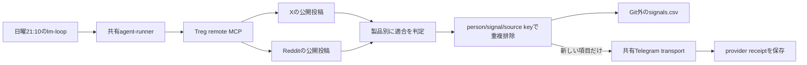

# Tregで全製品の公開シグナルを監視する設計

> この文書は実装設計の参照資料。TODO・順序・完了状態の正本は
> `2026-09-25-life-manager-unified-ssot.md` のみ。

## 目的

TregをLife Managerの製品成長エージェントから安全に使えるようにし、公開情報から全製品の新しい購買シグナルを週次で知らせる。Anicca iOSを先に扱い、他の現行製品も同じ監視に含める。

## 確認済みの事実

- Treg CLIと`lead-signals`/`treg`スキルはユーザー環境へ導入済み。5つのOpenClaw agentも2スキルを`ready`として読む。
- Life ManagerのCodex agent-runnerは呼び出しごとに`HOME`と`CODEX_HOME`を分離するため、ユーザーのTreg設定とスキルを継承しない。
- 既存`marketing-weekly-review`は日曜21:00にTelegramへ送るが、直近occurrenceの効果が`unknown`で、readback adapterがない。既存occurrenceは再送・変更しない。
- Marketing Engineの製品レジストリには5製品があり、App Storeで公開中の6アプリのうち追加4アプリは2026-10-05のApp Store記録にある。
- App StoreのAnicca listing（`https://apps.apple.com/jp/app/id6755129214`）はAniccaをAIセルフケア・コンパニオンとして説明している。監視では`anicca-ios`をこのAI companionアプリの優先profileとして扱う。
- Treg agent tokenの日次proxy-call capは18に設定し、`local_run_enabled=false`を維持する。2026-10-10 JSTの公式readbackは`used_today=37`、cap=18、残高readbackは`$0.98882`（2026-10-09 14:42 UTC時点）、自動補充なし。37件は以前の利用履歴で、次のpaid routeはUTC日次枠の更新後だけにする。
- Treg公式実装はdaily capを`/call`の前に確認するが、quota databaseエラー時はfail-openにする。これは防御層として使い、1 routeの固定`$0.003` header、monitor内の18 route/cost検証、auto-top-up無効を併用する。参照: [Treg usage cap implementation](https://github.com/superdesigndev/treg/blob/main/src/treg/domain/governance/usage.py)。

## 推奨構成

既存`lm-loop` schedulerに専用owner `marketing-treg-lead-signals-weekly`を追加し、日曜21:10 JSTに一度だけ動かす。既存の未解決Telegram effectに触れない。週次monitor task classだけにrepo所有のTreg/lead-signals skillと専用agent tokenを渡す。5つのOpenClaw agent workspacesにも両skillを設定するが、gatewayは未ロードのため実行中とは扱わない。週次監視はCodexのper-invocation remote Treg MCPを使う専用`read-only` task class `treg-lead-signals-agent`で実行し、登録済みの`gpt-6.1-sol` medium automation routeを使う。通常のagent taskは従来のtool/network policyを維持し、Treg CLI skillが使える実行環境から利用する。Treg agent tokenは`TREG_TOKEN`環境変数として渡し、秘密値そのものはargv・設定ファイル・証拠ログに保存しない。

CodexのMCP設定は認証headerを環境変数から読み込み、`X-Treg-Route-Max-Cost: 0.003`を固定HTTP headerとして全Treg MCP requestに付ける。通常shellのnetwork accessは有効化しない。参照: [Codex MCP設定](https://developers.openai.com/codex/mcp)、[Codexのsandboxとnetwork policy](https://learn.chatgpt.com/docs/agent-approvals-security)。

週次監視は専用の`treg-lead-signals-agent` task classを使う。これはCodex-only、shell/tool-less read-only、account 2、`gpt-6.1-sol` mediumのautomation routeとし、Treg MCPだけを操作できる。

このtask classだけTreg MCPの`catalog_search`、`catalog_get`、`call`、`balance`を無人実行できるようapproveする。一般agentのapprovalとshell sandboxは変更しない。

監視対象は次の9製品。buyer descriptionはMarketing Engine registryを優先し、残る4アプリは公開製品名と既存App Store記録から作る短い作業定義とする。

| 優先 | 製品 | 一文の対象購入者 |
|---:|---|---|
| 1 | Anicca iOS | 適切なタイミングのaffirmationとreflection promptを探す人 |
| 2 | Honne AI | 恋愛や人間関係の会話を理解したい人 |
| 3 | ebook-en | 実践的なreflection exerciseを求める英語読者 |
| 4 | ebook-ja | 実践的な内省の問いを求める日本語読者 |
| 5 | Life Manager Cloud | 予定への遅刻を防ぐためCalendarやMapsを何度も確認する日本の通勤・移動者 |
| 6 | [Daily Dhamma (Dhamma Quotes)](https://apps.apple.com/us/app/daily-dhamma/id6757726663) | Dhammapadaの教えとmindfulness reminderを日常に取り入れたい人 |
| 7 | [For Better Sleep - Sleep Reset](https://apps.apple.com/us/app/for-better-sleep-sleep-reset/id6762143790) | 乱れた睡眠リズムを回復し、bedtime planやguided breathworkを探す人 |
| 8 | [STUDIO CHERIE](https://apps.apple.com/us/app/studio-cherie/id6766485903) | 手持ちの服を登録し、wardrobe-based outfit suggestionを求める成人 |
| 9 | [Thankful - Gratitude Journal](https://apps.apple.com/us/app/thankful-gratitude-journal/id6759514159) | 日々のgratitude journaling習慣を作りたい人 |

対象データは過去7日以内の公開X/Reddit投稿とする。各製品について1回ずつ検索し、投稿が製品の利用課題または明示的な利用意図に結びつくものだけを残す。9製品×2プラットフォームで最大18 route、週報は各製品あたり最も適合度の高い新規signalを1件まで載せる。各Treg routeの最大費用は`$0.003`、週あたり上限は`$0.054`。route前にbalanceを確認し、見積額を差し引いた後も`$0.05`を残せる範囲でだけ呼ぶ。catalog検索で現在のendpointと価格を確認してから呼ぶ。

採用しない経路は、B2C製品への採用・資金調達・tech-stack監視、メール/電話番号検索、連絡先enrichment、outreach、投稿である。製品に合わないシグナルと、追加支出を避けるためである。

## データと状態

- Treg agent tokenはprivate credential SSOTからagentプロセスへ渡す。読み込み対象は`service=treg_agent:life-manager-product-growth`のみ。
- CodexのMCP tool listは`catalog_search`、`catalog_get`、`call`、`balance`に限定する。Tregのadmin/team管理・top-up機能は追加しない。
- 出力schemaのproduct ID enumは読み込んだ5つのcanonical profileと4つの補助profileから生成し、将来の製品追加時に古いenumで拒否しない。
- 永続重複キーは`product_id + person_url + signal + source_url`。CSVはGit外の`~/.local/state/life-manager/marketing-treg-lead-signals/signals.csv`に保存し、directory `0700`、file `0600`を保つ。
- 初回実行はbaselineのみを保存し、既存投稿をleadとして送らない。2回目以降は新規キーだけをTelegramへ送る。新規がない週は送らず、検証済みno-effect hintを記録する。
- Telegram送信前にoccurrence別outboxを永続化し、送信receiptと決定を保存した後にだけ`signals.csv`を進める。
- 各runのTreg call IDs/costs、baseline/new件数、Telegram provider receiptをprivate evidenceに記録する。receiptが不確かな時はeffectをunknownのまま保ち、再送しない。
- `lm-loop-run` result hintsはこのloop IDと正確なentrypointだけを許可し、Telegram delivery receiptまたはbaseline/no-new proofのどちらかを受け入れる。`lm-fence-reconciler` adapterはoccurrence別terminal event、outbox、Telegram user-history readbackのmessage ID/body prefix/sender/timeを照合してunknownを解消する。送信はしない。

## フロー

## 完了条件

1. 5つの設定済みOpenClaw agent workspacesにはTreg/lead-signals skillが利用可能で、Life Managerでは週次成長monitorだけが制限付きagent tokenを受け取る。一般task classへtokenを配布しない。
2. Aniccaを最優先に9製品すべてのbuyer profileが監視対象となる。
3. 新しいweekly ownerがmain由来immutable releaseで読み込まれ、自然実行でTreg call receipts、baseline、以降のdedupe、Telegram receiptまたはno-sendが記録される。
4. `marketing-weekly-review`の既存unknown occurrence、別loopのstate、Telegram履歴は再送・書換えしない。
5. Tregの自動補充を有効にせず、日次proxy-call cap 18、routeごとの`$0.003` header、監視の予算検証で週あたり`$0.054`を目標にする。Tregの日次capはquota DB障害時にfail-openするため、絶対的なaggregate provider capとは扱わない。

## 失敗時の扱い

tokenがない/曖昧ならTregを呼ばずに失敗する。endpoint/価格を確認できない、出力JSONがschemaに合わない、call receiptが取れない場合はsignals.csvを進めない。Telegramの効果がunknownなら再送せず、occurrence単位のreadbackを次のcursorにする。
