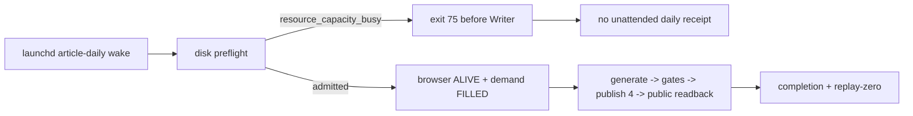
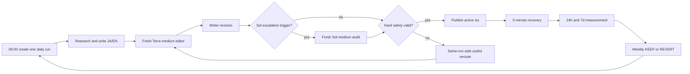
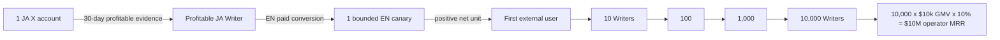

# Writer Agent — Revenue, UX, Runtime, and Roadmap SSOT

Last updated: current measured production state

This file is the only current source of truth for the Writer Agent's objective,
user experience, revenue model, execution order, and remaining work. Historical
investigation and incident evidence remains in
`docs/loop-engineering/47-writer-loop-quality-and-self-improvement.md`, but that
file no longer defines current priorities or completion.

## 0. Objective

Build one Writer Agent that continuously discovers valuable subjects, writes,
publishes, earns directly from its writing, measures verified payments, repairs
its own interrupted runs, and reports money without ongoing human operation.

### 0.1 Canonical name and subject scope

The product and agent name is **Writer Agent**. **Writer Loop** means its
persistent execution loop. `AI Entity Article Writer`,
`ai-entity-article-writer`, and similar names are legacy runtime identifiers,
not the current product name.

The Writer has no AI-entity subject restriction. It may write about any lawful
subject when the model finds evidence of reader value, editorial demand,
product relevance, or profitable conversion. Topic selection is model judgment
from current claims, audience evidence, opportunity terms, product state, and
past economics; it is not a hard-coded subject allowlist or keyword router.

Legacy names in historical incident reports or in Anicca's separate brand
description are historical/brand facts and need not be rewritten. Active
Writer skill metadata, aliases, prompts, scheduler descriptions, state paths,
tests, and UI labels must migrate to `writer-agent` without creating a second
pipeline or breaking existing durable runs. Temporary compatibility aliases
must point to the one canonical Writer tree and be removed only after a live
resume/publish parity receipt.

The order is:

1. Prove the loop for Dais locally.
2. Reach verified $10,000 monthly revenue with one or more profitable writing
   units.
3. Package the same contract as open source and cloud software.
4. Let anyone start without supplying Google, Gmail, note, Substack, or social
   credentials by using an agent-owned identity, publication surface, and
   device-generated payment identity.
5. Scale proven units and protocol revenue toward $10,000,000 MRR.

The machine cannot guarantee demand or revenue. It must guarantee continuous
measurable attempts, honest receipts, bounded improvement, and automatic
recovery.

### 0.1.0 Current measured production checkpoint

This checkpoint supersedes older "current" paragraphs and queue claims below
when they conflict. It is based on the live Writer state, immutable release
manifest, launchd readback, publisher-native receipts, fresh public reads, and
replay verification.

#### Done

| Area | Evidence | Result |
|---|---|---|
| Active-four publication | Run `20260917-212739`, topic `paid-demand:640316555af715f28b2f96954223ddb0f5ae82ad6f92567b0c58405f4b5c9fee` | `note/ja`, `substack/ja`, `substack/en`, and `x-article/ja` each have `status=live`, `published=true`, `verified=true`, `reality_gate=PASS`, immutable artifact hashes, public IDs, timestamps, and media proofs |
| Publisher readback | Fresh anonymous HTTP GET returned `200` for all four canonical URLs; provider-native receipts verify Note paid state (`price=500`, eyecatch/body media) and Substack/X public content and media | External effects are real; drafts, editor URLs, and plans are not counted as publication |
| URLs | Note `https://note.com/anicca123/n/nee55ce000bc1`; Substack JA `https://aniccabuddha.substack.com/p/apify500techiai`; Substack EN `https://aniccaai2026.substack.com/p/apify-pays-500-techi-wont-say-neither`; X `https://x.com/diceai0/article/2100724960213991424` | All four active destinations have canonical public URLs |
| Completion and replay | `article-run-complete.py` exit `0`; `publication_resume.py plan` is `{"resumable":false,"reason":"all-complete"}` before and after replay; state SHA `ca6fbe70280acd90f5acbc54b123b9336fd369f213652e049f780fd76c84f2ca` and ledger SHA `f53fe3a64e2c4a2a58eeb0f03b887f80f23b01af09552eee459333338e22a507` are unchanged | Same-run completion and replay-zero are proven |
| Observability | `article-completion-notify.py` sent event `article-active-four:20260917-212739` with Telegram message ID `87086`; the topic card is in `topics/done/` | The run has a durable completion report and an honest timeout/recovery history |
| Quality boundary | JA `identity=PASS`, `safety=ALLOW`, `editorial=PASS`, `reader=ADVISORY`; EN `identity=PASS`, `safety=ALLOW`, `editorial=PASS`, `reader=PASS`; policy is `continuous` | Quality advisory did not hide a safety or identity failure |
| Runtime hardening | PR `#5496` (merge `7cc80e3`), PR `#5501` (merge `311c9194`), and PR `#5502` (merge `e55aef27`) are merged; current release is `3aeed4c459b9b941e98464fe7daf2431c1d5255f`, provenance `ancestor-of-origin-main`; installed Writer plists read back canonical browser owner/profile | Browser recovery now targets the existing `ai.anicca.life-manager-daily-driver` / `~/.cloak/profiles/daily-driver`; the shared apply path cannot retain `job-search-*` values |

#### Not done yet

| Area | Current truth | Closing evidence still required |
|---|---|---|
| Unattended daily recurrence | Natural `article-daily` wakes at 06:27, 07:19, and 07:22 reached the launchd owner but were blocked by browser recovery/admission capacity. Run `20260917-212739` completed through a foreground Writer invocation plus the pending worker, not a launchd-owned full pass. | One launchd-owned natural wake that reaches generation, stages exactly four, publishes all four, records completion, and passes replay-zero without foreground publisher commands |
| Received money | Writer money DB reads `money_events=0`, `subscription_contracts=0`, `payouts=0`; `money_artifacts=118` and metric observations are not receipts of payment. Note's ¥500 price and Substack `only_paid` audience are offers/access state, not a sale or subscription. | A non-test purchase, subscription, or accepted editorial fee joined to the exact article artifact, followed by fee, refund, payout, and net-revenue reconciliation |
| $10K monthly / $10K MRR | No external revenue or active recurring-contract receipt exists, so both targets remain unproven. | Separate three-consecutive-month gross/net and active-renewal/churn receipts; one-time Note sales never enter MRR |
| Learning and quality | The current run closed with JA reader `ADVISORY` and EN reader `PASS`; the self-improve ledger still has historical missing rubric receipts. | Improve the next article's evidence/reader answers, close the historical evidence gap without fabricating receipts, then run a matched canary with a later consuming run |
| OSS / independent users | No fresh external user has reproduced install-to-public-publication-to-real-revenue. | Fresh-machine install, owner isolation, provider setup, public output, and external received-money receipt |

#### Blocking bottleneck

The immediate production bottleneck is **host admission capacity**, before the
launchd Writer entrypoint runs. Three fresh `article-daily` kickstarts reached
the launchd owner and recorded `host_admission_deferred:resource_capacity_busy`;
they never entered generation or publication. A direct foreground invocation
was able to complete the same active-four contract, proving this is a shared
admission/owner-capacity boundary rather than a Note, Substack, X, or five-slot
content failure.

The earlier browser blocker is fixed and read back: Writer no longer asks for
the absent `ai.anicca.job-search-browser` or `job-search-daily` profile. Disk is
also not the current blocker: the latest free-space probe is about 14 GiB,
above the Writer floor `1,155,780,608` bytes. The image-size refusal was
transient in attempt 2; attempt 3 produced a verified 1536x1024 image.

After admission was bypassed, model/runtime latency became the secondary
availability risk: attempt 2 timed out at 900 seconds, while attempt 3 needed
the extended 1800-second boundary and safely handed one pending X target to the
resume worker. The pending worker then published X and closed the run. This is
progress evidence, not unattended-daily proof.



Writer must not delete, stop, or steal another loop's protected release,
process, browser profile, or admission lease to clear this gate. The next
repair belongs to the shared host-admission capacity owner; once it admits a
Writer wake, the existing browser/demand/publication path is already proven.

### 0.1.1 Historical planning slice: daily shipping, control beats, and Telegram UX

The historical diagnosis and execution order for the broken Writer runtime was
`docs/writer-agent/plans/2026-08-20-writer-ship-every-8-hours-telegram-ux.md`.
Its implementation claims are historical. The current execution cursor is
§0.1.0 and §9.0.0. Global platform expansion remains conditional on the
spec's role matrix, language/payout gates, and receipt-backed $10K ledger; it
does not replace the invariant revenue, safety, or platform-policy rules in
this SSOT.

### 0.1.2 Owner-facing language and publication identity

Writer Loop Telegram reports are for ordinary users, OSS users, cloud users, and
nontechnical family members. The loop writes in the owner's configured language,
uses neutral natural sentences, and includes a public article or status link.
It does not put a harness name, `Codex:::`/`Claude:::` prefix, raw event ID,
internal run ID, status enum, or stack trace in the main message. Internal
receipt IDs remain in the ledger and an optional details link.

The managed publisher now resolves `substack/ja` through
`SUBSTACK_PUBLICATION_JA` and `substack/en` through
`SUBSTACK_PUBLICATION_EN`; the fallback defect was fixed and tested in PR
`#5496`. Existing older mixed-account posts remain historical and are not
deleted or moved. New runs require separate publication identity, reader
cohort, subscription, payout scope, and revenue ledger. The detailed account,
article-type, monthly-cap, and $10K target matrix remains in the planning
history linked above.

### 0.2 Open-source positioning and public-claim gate

The Writer must not call itself the "world's first autonomous Writer Agent."
Prior-art research found multiple public repositories that already claim and
show autonomous research, writing, and publication, and at least one that feeds
publication failures and quality metrics into later writing. An absolute
world-first claim is also not falsifiable through a finite GitHub/web search.

Current approved positioning is:

> A receipt-verified autonomous Writer Agent being built as open source to
> research, write, publish across multiple platforms, measure real writing
> revenue, recover interrupted work, and improve from production evidence.

The shorter phrase "autonomous research-to-publication Writer Agent" is allowed.
The phrases "makes money," "self-healing," "self-improving," and "no human in
the loop" may describe a specific capability only after its matching receipt
below exists. A paywall, price, view, estimated value, or creator revenue claim
is not a received-payment receipt.

| Public claim | Minimum production evidence before using it |
|---|---|
| Publishes autonomously | One installed-loop run has publisher-native public readback for every active destination, with no primary-session manual publication |
| Self-healing | A real incident trace closes `detect -> classify -> repair -> verify -> same-work-item resume -> public readback` without primary-session code or state intervention |
| Self-improving | A matched production canary records baseline/candidate, one changed variable, same-age outcome, `KEEP` or `REVERT`, and a later run consumes the decision |
| Makes money | At least one non-test external payment and publisher/payment-processor receipt reconcile to an article artifact and payout ledger |
| No human in the loop | Thirty consecutive operating days complete the installed schedule, publication recovery, measurement, and reporting contracts with zero manual execution or repair; KYC, credential bootstrap, policy approval, and exceptional destructive actions remain disclosed setup/governance boundaries |
| Receipt-verified full combination | All rows above pass in the same released OSS version and an independent user reproduces the install-to-revenue path |

Even after the full-combination gate passes, the preferred claim is
"a receipt-verified open-source autonomous Writer Agent" plus the dated public
evidence. "World's first" remains prohibited unless an independent, dated
prior-art audit defines the exact comparison set and supports that conclusion.

The 2026-08-06 prior-art audit establishes the claim boundary:

- `dpdanpittman/blog-system` says it runs "completely autonomously," publishes
  through a five-agent pipeline, and loads past validation failures and quality
  metrics into later writing. Source:
  https://github.com/dpdanpittman/blog-system#automated-ai-blog-system
- `KushParsaniya/blog-genius` says the end-to-end daily system publishes to
  Dev.to after topic generation, drafting, optimization, and fact checking.
  Source: https://github.com/KushParsaniya/blog-genius
- `AICMO/Autonomous-Agent-Digests-Blog` shows a scheduled pipeline publishing
  to Ghost, Substack, and Telegram, including links to agent-generated public
  outputs. Source: https://github.com/AICMO/Autonomous-Agent-Digests-Blog
- `greekr4/Viruagent` shows an agent loop that searches, writes, edits, uploads
  images, and publishes to Tistory, including a public article URL. Source:
  https://github.com/greekr4/Viruagent
- Stanford STORM explicitly says its generated articles are not publication
  ready and require significant edits. It is relevant research/writing prior
  art, but not evidence of autonomous publication or revenue. Source:
  https://github.com/stanford-oval/storm

No inspected primary source supplied a reconciled real-payment receipt plus the
complete autonomous publication, self-healing, and self-improvement trace. This
is a documented search result, not proof that no unindexed, private, deleted,
or non-English predecessor exists.

## 1. Product boundary

### 1.1 Article-first revenue

The initial product is the writing itself. The Writer does **not** need to turn
every article into a template, API, course, or unrelated digital product.

Before $10,000 monthly revenue, the primary money paths are:

1. A publisher pays an editorial fee for an accepted article.
2. A reader buys one paid article.
3. A reader pays a recurring subscription for continuing writing or an archive.
4. A reader pays to unlock an article on the Writer's self-owned publication.

The same Writer is also Life Manager's writing-led marketing engine. It reads
the verified state of apps, agents, skills, and other products; discovers the
reader problem each solves; publishes useful evidence-led articles; and
attributes article -> product visit -> activation -> purchase/subscription.
Product revenue is reported separately from direct writing revenue so the same
payment is never counted twice. Promotional copy without a reader job or
verified product claim is not a successful article.

Derived products are deferred. They may be proposed only after direct writing
revenue has been measured long enough to show that the target cannot be reached
efficiently, or when readers explicitly demand a reusable artifact. They are
not a prerequisite for the first payment.

### 1.2 Economic truth

"The user supplies no customers" is a valid UX requirement: the Agent must find
readers and payers itself. "No payer exists" is not a revenue model. Every
payment has an economic counterparty: a reader, publisher, advertiser,
business, marketplace, protocol, or another agent.

"The user supplies no credentials" means the system generates and safeguards
the required identity on the user's device. Ownership still requires a signing
key, passkey, wallet, or regulated payout identity. A fiat payout through
Stripe, PayPal, or a bank can require account creation and KYC. A no-account OSS
mode therefore cannot depend on note, Substack, Google, Gmail, or Stripe.

## 2. Non-negotiable runtime rules

### 2.0 Agent identity — the LLM owns the method

Writer is an AI agent operating inside a bounded runtime, not a static
publication workflow with LLM text-generation steps. The runtime gives the
Agent one outcome contract: discover a reader problem with economic evidence,
research and write a useful article, submit or publish it to every active
destination, verify the external result, and measure real outcomes. The Agent
chooses and revises the method from current environmental evidence.

The LLM owns:

- investigation, hypotheses, planning, and replanning;
- topic, reader, angle, structure, research queries, and source selection;
- dynamic tool discovery and selection across available MCPs, official APIs,
  CloakBrowser/CDP, shell, code, and specialist subagents;
- diagnosis of an unknown publisher failure and selection of the next useful
  observation or action;
- bounded repair of prompts, tool use, browser interaction, or publisher
  adapters, followed by verification and resumption of the same work item;
- evaluation of whether the observed external result satisfies the goal.

The deterministic runtime owns only constraints that must remain true across
model changes and process crashes: durable work ownership, credentials and
permissions, spend limits, secret/PII and unsupported-claim protection,
idempotency and the effect ledger, immutable artifact identity, external
readback, payment truth, scheduling, and crash recovery. Tests protect changes
to these executable boundaries; they are not a substitute for the Agent's
reasoning and do not prescribe the Agent's investigation path.

A fixed happy path may reduce token use, but it is only a reusable default. Any
unexpected page, selector, API response, receipt, or error returns rich
observations to the Agent. It must be free to abandon that path, inspect the
environment, choose another available tool, repair the failing capability in a
sandbox when necessary, and continue the same work item. A fixed incident
taxonomy, selector list, retry count, or `unavailable` label must never become
the decision-maker.

Writer qualifies as an Agent only when a live acceptance run proves all of the
following:

1. its plan and tool sequence are produced at runtime rather than selected from
   one mandatory hard-coded route;
2. an unseen publisher failure changes the plan from observed evidence;
3. the Agent can use CloakBrowser, an MCP, an official API, or another available
   capability without a human choosing the tool;
4. a failed publication remains owned and loops through
   `OBSERVE -> DIAGNOSE -> ACT -> VERIFY -> REPLAN` until external success or a
   genuine external-authority wait;
5. code constrains irreversible effects but does not decide the article,
   diagnosis, or repair strategy;
6. completion requires publisher-native submission/publication readback, not
   the model's claim that it finished.

Anthropic's production guidance defines agents as LLMs that dynamically direct
their process and tool use from environmental feedback, and recommends simple,
transparent agent designs with carefully tested agent-computer interfaces:
https://www.anthropic.com/engineering/building-effective-agents and
https://code.claude.com/docs/en/agent-sdk/agent-loop. OpenAI likewise separates
LLM orchestration, where the model plans and selects tools, from code
orchestration used for deterministic boundaries:
https://openai.github.io/openai-agents-python/multi_agent/.

#### Execution ownership

The installed production Writer loop is the executor. The primary development
session is its architect, operator, and verifier; it is not a substitute article
writer or publisher.

- `ai.anicca.article-daily` creates the daily work item and its Agent writes,
  researches, selects tools, and attempts publication.
- the installed same-run recovery owner resumes unfinished destination intents;
  the primary session does not manually publish them in its place;
- the learning, demand, opportunity, money, and report workers collect and feed
  their own production evidence back into the Writer;
- the primary session reads receipts, repairs the loop or its tools when the
  production Agent exposes a defect, deploys that repair, kickstarts the real
  loop, and watches the loop's external receipts;
- a manual browser/API action by the primary session is diagnostic evidence or
  an isolated repair verification only. It cannot satisfy a Writer live
  acceptance criterion unless the installed loop subsequently performs and
  verifies the same capability itself.

Every remaining implementation TODO is therefore shorthand for **make the
installed Writer loop own and prove this behavior**. “Publish the daily revenue
set” means kickstart and observe the production loop until it returns the three
publisher-native money-surface readbacks defined in §2.5; it never means the
development session posts articles by hand. Free-discovery adapters continue
independently and never block the revenue set.

#### Closed self-healing and self-improvement loop

The complete production cycle is:

```text
OBSERVE demand + prior metrics
  -> PLAN reader outcome, article, distribution, and experiment
  -> ACT research + write + publish through Agent-selected tools
  -> VERIFY publisher-native readback and payment/metric receipts
  -> HEAL any runtime/tool/publisher failure and resume the same work item
  -> EVALUATE matched quality, funnel, revenue, fee, and compute-cost evidence
  -> LEARN one evidence-backed strategy change
  -> CANARY the candidate against the retained baseline
  -> KEEP or REVERT
  -> CONSUME the winning strategy in a later production article
  -> repeat
```

Self-healing means the production Agent detects an incomplete outcome from its
own external evidence, diagnoses it, repairs or changes its tool path within
the safety kernel, and resumes the same work item. Self-improvement means a
measured strategy candidate changes a later article only after matched replay
and a real canary, with an exact rollback. Neither term is satisfied by a cron
restart, a prose lesson, a model self-score, or a developer manually completing
the failed publication.

### 2.1 No passive waiting

If safe work can run now, the Agent runs it now. A missed or incomplete daily
run is kickstarted immediately; it does not wait for the next schedule.

If one platform enforces a future publication window, only that destination is
`PENDING`. All other publication, measurement, research, and reporting work
continues.

Every wait state must record:

- exact blocked target;
- external reason;
- earliest retry time;
- durable resume owner;
- work continuing in parallel;
- Telegram event UUID.

Allowed wait reasons are limited to an externally enforced publication window,
an explicit `Retry-After`, an external editorial/payment response, or a human
legal/KYC action that cannot be delegated. "Wait for the next schedule" is not a
valid terminal state for unfinished work.

### 2.2 Same-run recovery

Failure resumes the same `run_id`, `artifact_id`, content hash, destination, and
publication intent. A new article must not hide a failed article. A replacement
is allowed only after a recorded terminal content rejection and must retain the
failed feedback.

### 2.3 Honest evidence

- A generated draft is not published.
- A URL is not live until public readback passes.
- A checkout view is not a sale.
- A test payment is not revenue.
- A view, like, or impression is not revenue.
- Missing measurement is `unknown`, never zero.
- Revenue requires a processor, platform, publisher, or public-ledger receipt.
- MRR includes active recurring contracts only; editorial fees and paid articles
  remain one-time monthly revenue.

### 2.4 Daily shipment contract

`ai.anicca.article-daily` is the sole creator of a new daily Writer run and
runs with `ARTICLE_AUTOPUBLISH=1`. `ai.anicca.article-resume` owns same-run,
per-destination recovery; claim, opportunity, money, report, and learning
workers continue on their own intervals.

The Writer improves the **same article** from reader/editorial feedback. The
maximum iteration count bounds generation cost and time; it never decides
whether the article ships. At that bound, the Agent freezes the best current
JA/EN bytes, records remaining feedback as quality debt, initializes every
currently active destination intent, and enters the publication rig. `block_freeze` is not an
allowed terminal state. A reader/editorial verdict is an improvement input, not
a publication veto.

Every daily run has one observable service-level objective: each active
destination receives a verified public URL. A destination-specific platform
failure starts immediate, bounded recovery for that destination while all other
destinations continue; it never cancels the others. A destination without
a public readback is displayed as an SLO breach with its real platform error
and recovery receipt, never as "published" or a silent pending state. Only a
verified public readback counts as published, and only an external receipt
counts as earned.

**Historical divergence, superseded by §0.1.0:** live run `20260806-084924` reached
publication initialization and attempted all seven configured pairs, but
returned every failed pair as `unavailable` and ended without a public URL.
Observed failures were note media S3 `403`, stale-quality-receipt rejection for
Dev.to and Substack, X Article editor non-detection, and a Zenn result-less
timeout. Re-kickstarting `ai.anicca.article-daily` exited successfully without
resuming those unfinished intents because same-day creator deduplication won.
The safety deduplication is correct; allowing it to terminate unfinished work
is not. **1b DONE:** runtime commits `f569336d` and `2e1f4d6d` connect the
installed resume worker to the existing observability replay and incident
queue, isolate malformed historical runs, and preserve deduplication. A live
`ai.anicca.article-resume` wake registered all six current publisher failures
from run `20260806-084924` as durable `OPEN` incidents owned by
`writer-self-heal`, with classifications for credential, state corruption,
DOM/selector, and process failure and `next_action=CLAIM`. Current item 1c must
make the production repair owner claim, diagnose, repair, and resume those same
publication intents until publisher-native readback succeeds. **1c IN
PROGRESS:** the production repair owner claimed the Dev.to stale-quality
incident under lease `production-repair-20260806-stale-quality`. Its live TDD
repair commits `bdbd0f6f` and `6a26dfc3` recover stale quality rejections and
re-arm stale intents before publication planning. The installed loop then
re-created real publisher intents for Dev.to EN (`4330381`), Substack JA
(`210074287`), and Substack EN (`210074421`) while both the self-fix worker and
`ai.anicca.article-resume` remained running. This is recovery activity, not publication proof: the current
run still has zero publisher-native public URL readbacks in `articles.jsonl`,
so Task 1 and item 1c remain open. The next acceptance event is a verified live
URL for at least two independent publishers from this same run; the remaining
note S3 `403`, X editor detection, Zenn timeout, and any publisher intent that
still lacks public readback stay in the same incident-driven repair loop.
The publisher-isolation repair `9f6f2b13` preserves healthy eligible pairs
before an ambiguous same-ID recovery, so Dev.to can no longer starve Substack.
The dispatch-name repair `eef73547` and isolated preview-auth repair `bd9472b2`
then completed both persisted Substack targets. Publisher-native readback is
`PASS` for Substack JA `210074287` at
`https://aniccabuddha.substack.com/p/ai4` and Substack EN `210074421` at
`https://aniccabuddha.substack.com/p/your-ai-revenue-story-is-not-a-tutorial`.
Both receipts verify public HTML, paid audience, one paywall, immutable article
hash, and exact-SHA media. Dev.to was already public at stable ID `4330381`, but
its authenticated API returned a false `404` when browser-only Origin/Referer
headers were attached. Runtime repair `74bdc6ed` removed those headers and the
installed loop recorded `PASS` at
`https://dev.to/anicca_301094325e/your-ai-revenue-story-is-not-a-tutorial-yet-what-it-needs-2dil`,
including public HTML, owner identity, article hash, and exact-SHA media. The
current run therefore has three live receipts across two independent
publishers. Note's body-image S3 repair is complete: target `n190c1d92bf10`
retains its embedded body asset and eyecatch. Runtime commits `7b92ed2b`,
`a5609f38`, `32293581`, and `2a9f046b` bound a hung publisher at 300 seconds,
replace the crash-prone shared CDP session with an isolated Cloak context, and
use a trusted role-scoped publish-button action. Production verification shows
that the infinite CPU spin is gone and failures are durably classified, but the
post-action screenshot still contains note's publication overlay and publish
button; authoritative note API readback for `n190c1d92bf10` remains `404`, and
the durable destination state remains `intent`. Note is therefore not live.
Runtime commits `7d023bb7`, `d778a369`, `ef2debc2`, and `51c32232` then added
mutation tracing and removed three independent resume-starvation paths:
quality feedback no longer repeatedly preempts a publication backlog, a
pre-06:00 schedule gate no longer exits before backlog recovery, and the
planner selects the newest active-six run before legacy unfinished runs. The
captured authenticated browser trace proves the UI path only issued the draft
autosave (`POST /api/v1/text_notes/draft_save`, HTTP `201`); it issued no
publish mutation. Runtime commits `6edc7ff6` and `37f89926` therefore added a
stable-target native `PUT /api/v1/text_notes/{numeric_id}` boundary with a
durable effect ledger and no undeclared runtime dependency. The first real
loop execution reached note and was rejected with HTTP `422` and provider
message `有料エリアを再度設定し直してください。`; commit `678bc975` preserves
that response as evidence. Runtime commit `7ae02ed0` then copied the observed
current frontend contract: the separator block remains in `freeBody` and
`payBody` begins at its following sibling. The existing
`ai.anicca.article-resume` loop published the same stable target and recorded a
publisher-native `live` receipt at
`https://note.com/anicca123/n/n190c1d92bf10`. Authenticated API plus anonymous
HTML readback verify status `published`, price `500 JPY`, owner `anicca123`, the
immutable article hash, eyecatch, and body media. This is paid-state evidence,
not a purchase; received revenue remains zero. The current run now has four of
six active destinations live. Runtime commits `e29967dd`, `f7f950a2`,
`aefd40f1`, `cafdc0e2`, and `d70ae56b` repair the crash-truncated Zenn handoff,
restore the exact slug intent, invoke the current-run publisher through its
Python runtime, and scope the external-effect bridge to the newest active-six
run. Zenn repository commit `f15301f` flips immutable slug
`2026-08-06-ai4` to `published:true`; the dedicated
`ai.anicca.article-zenn-retry` worker owns its durable receipt and records a
platform-window `PENDING` until `2026-08-07T18:03:25.048+09:00`. This wait is
specific to Zenn and does not block X or measurement. X diagnosis then proved
the daily-driver had lost both X auth cookies; Google OAuth and the configured
token resolved to wrong destination identities and were rejected before any
draft or publication. The loop restored the prior encrypted `diceai0` browser
session from its protected Cloak backup, verified `@diceai0` in the rendered
Articles UI, and registered fixed edit target
`https://x.com/compose/articles/edit/2085395243579691009`. The next installed
resume tick published that same ID and recorded a verified live receipt at
`https://x.com/diceai0/article/2085395986491527441`, including owner, immutable
article hash, cover, and body-media readback. Under the superseded active-six
contract this was five of six. Under the current §2.5 contract the Zenn window
is a non-blocking distribution outcome and cannot delay revenue shipment.

### 2.5 Daily revenue set and non-blocking distribution contract

One daily Writer run freezes one Japanese article and one independently
localized English article. Translation does not create a second topic or daily
run. The current active-four shipment is successful only when the installed
loop returns verified public readback for all four active intents below. Note
and Substack are revenue-capable; X Article JA is an active acquisition surface
whose public receipt is still part of the daily contract. A single forced
production run is sufficient to verify this machinery now; continued daily SLO
monitoring detects later regressions but is not a three-day development gate.

| Required daily destination | Language | Revenue role | Required receipt |
|---|---|---|---|
| note paid article | JA | One-time direct writing revenue | Authenticated price/paywall readback, public URL, later purchase/fee/payout receipt |
| Substack article | JA | Recurring direct writing revenue | Authenticated paid-audience/paywall readback, public URL, later contract/charge/churn receipt |
| Substack article | EN | Recurring direct writing revenue | Authenticated paid-audience/paywall readback, public URL, later contract/charge/churn receipt |
| X Article | JA | Long-form acquisition | Authenticated same-draft publication, public Article URL, rendered body/media readback |

The following destinations are dormant under the current active-four contract.
They receive durable skip receipts and are never staged, published, or counted
as a failure for the active shipment. If a future contract reactivates one, it
must have its own evidence and reactivation gate.

| Dormant destination | Language | Role | Receipt |
|---|---|---|---|
| Dev.to article | EN | Free discovery | Durable `dormant-destination` skip |
| Zenn article | JA | Free discovery | Durable `dormant-destination` skip |
| X Article | EN | English long-form acquisition | Durable `dormant-destination` skip |
| X Post | JA | Short-form acquisition | Durable `dormant-destination` skip |

X Article JA publishes at most once per JST day. Dormant means skipped without
an SLO breach; it does not mean deleted. More posts or accounts are not scale
when they reduce reach, reader trust, or causal attribution.

This follows X's own guidance to revise for the reader, use a specific hook,
promote and pin an Article during its first 24–72 hours, and avoid platform
manipulation/spam. X Creator Revenue Sharing is an optional bonus, not the
Writer's `$10k` foundation: eligibility currently requires Premium, 5M organic
impressions in three months, 500 verified followers, a supported country,
identity verification, and a payout account; payout weighting may vary by
format. Sources: https://help.x.com/en/using-x/articles,
https://help.x.com/en/using-x/creator-revenue-sharing, and
https://help.x.com/en/rules-and-policies/content-monetization-standards.

### 2.6 Canonical article-to-body-to-account allocation

One topic creates one research evidence set and one independently localized
artifact per language. It does not create one identical full article copied to
every site. `article_type`, `language`, `account_key`, `platform_role`,
`payout_scope`, and `monthly_cap` are frozen before a publisher adapter runs.

| Article type | Body contract | Account / platform | Economic role |
|---|---|---|---|
| `pillar_research` | Full evidence-led deep dive: reader problem, primary sources, mechanism, measured result, limits, and conclusion. JA and EN are separately written and quality-checked. | `substack_ja` → JA publication; `substack_en` → separate EN publication | Paid subscription/archive; direct recurring writing revenue |
| `conversion_article` | Practical paid version with a useful free preview and a distinct paid section. It adds reader-useful procedure, evidence, or decision criteria; it is not a paywalled copy of the Substack body. | `note_ja` → existing verified `anicca123` creator account | One-time reader purchase; price and paywall are read back from note |
| `discovery_derivative` | Shorter, free, platform-native derivative with canonical links. It omits private paid material and does not claim unverified results. | `x_ja` is active; `devto_en`, `zenn_ja`, and `x_en` are dormant until their reactivation gates pass | Discovery and owned-surface acquisition, not base revenue |
| `product_chapter` | Chapterized evergreen material compiled only after several articles prove demand; each chapter has its own evidence and the book has a single spine. | `kdp_publisher` (language-specific book IDs) and `zenn_ja` Books when eligible | One-time book royalty/sale; never a daily posting quota |
| `high_ticket_brief` | Buyer-specific brief: problem, scope, evidence, deliverable, exclusions, price, and acceptance terms. It is not mass-posted as a public article. | `linkedin_en` lead surface and verified publisher/editorial opportunity adapters | Contract or editorial fee, counted only from acceptance/payment receipt |
| `member_letter` | Short recurring update, experiment result, or implementation note that gives an ongoing subscriber a reason to stay. | `substack_ja` / `substack_en` publication-specific sections | Recurring retention and churn learning |

The following surfaces are not part of the first daily revenue set. `medium_en`
and `medium_ja` are discovery/revenue-share experiments only after eligibility
and policy review; Medium's API terms prohibit posting automatically generated
content. Patreon and Gumroad are owned membership/checkout experiments after a
receipt-backed conversion exists. LinkedIn is B2B discovery, not direct writer
payout. Tagalog uses its own localized artifact and account only after native
quality, payout, tax, and policy checks; it is not sent to KDP unless the
platform's current supported-language list includes it.

Substack language isolation is explicit: `substack/ja` resolves to
`SUBSTACK_PUBLICATION_JA` and `substack/en` resolves to
`SUBSTACK_PUBLICATION_EN`. One Substack login may own multiple publications,
but each publication has a separate reader cohort, price, payout scope, and
ledger; Substack currently requires a separate Stripe account per publication.
The existing mixed `aniccabuddha.substack.com` posts remain historical and are
not moved or deleted.

Sources for the platform contracts: note paid articles and memberships
(`https://note.com/monetization-guide`), Zenn paid Books
(`https://zenn.dev/zenn/books/how-to-create-book/viewer/about`), Substack
multiple publications and payment setup
(`https://support.substack.com/hc/en-us/articles/360037824371-Can-I-create-multiple-publications-under-the-same-account`,
`https://support.substack.com/hc/en-us/articles/360037459952-How-do-I-set-up-a-paid-publication`),
DEV article creation (`https://developers.forem.com/api/v0`), X Articles
eligibility (`https://help.x.com/en/using-x/articles`), and Medium API limits
(`https://help.medium.com/hc/en-us/articles/214151487-Medium-API-Terms-of-Use`).

### 2.7 Autonomous operation boundary

After one-time setup, the installed loop may choose topics, write localized
artifacts, publish to approved accounts, read authorized verification mail,
retry isolated destinations, collect public/payment receipts, and report in
natural language without a human approving each article. This is the intended
no-human operating mode.

The setup boundary remains explicit and cannot be automated by impersonation or
policy evasion. The owner/provider must complete account ownership, payout
identity, tax/KYC, passkey/phone checks, CAPTCHA, and any platform approval.
The Agent may use a dedicated owner-controlled mailbox or authorized OAuth/Gmail
route for verification and reader opt-ins. It must not harvest other people's
mail, create disposable aliases to evade one-account limits, bypass CAPTCHA,
or create a mass of look-alike accounts. A generated email identity is allowed
only when the provider's rules and the owner-approved account registry permit
it.

The no-human claim is earned only after thirty consecutive installed operating
days complete schedule, publication recovery, measurement, and reporting with
zero manual execution or repair. Until then, the loop must say
`setup-required`, `provider-pending`, or `unknown`, never claim a money-printing
machine, and never count views, likes, paywall display, checkout starts, or
estimated revenue as payment.

## 3. Revenue streams

### 3.1 Current stream ledger

| Stream | What is sold | Revenue type | Current state | Account/KYC dependency | Verified amount now |
|---|---|---|---|---|---:|
| AppSignal | Accepted technical article | One-time editorial fee | A prior run reported an application submitted, but no durable submission ID, confirmation page, email, or content hash is present in the current Writer state. Runtime therefore keeps the program `VALUE_UNKNOWN` and must recover that receipt before treating it as `SUBMITTED` | Author agreement and publisher payment details | $0 |
| DigitalOcean Write for DOnations | Accepted and published tutorial | One-time editorial fee | Intake is not currently usable: the official page still says submissions are paused, and `do.co/w4do` redirects to that page instead of an application form | PayPal receive capability and DO credit exist; contract/contact details still apply. Never store the PayPal address in this SSOT | $0 |
| note | Paid Japanese article | One-time reader payment | Paid publication capability exists; attributed sales receipt absent | note creator and payout account | ¥0 verified |
| Substack | Paid subscription/archive | Recurring reader payment | $8/month tier was enabled; paid subscriber receipt absent | Substack creator plus Stripe | $0 MRR verified |
| Self-owned publication | Paid article or recurring archive | One-time or recurring reader payment | Not implemented | Default OSS mode uses device-generated identity/payment rail; fiat connector optional | $0 |
| Dev.to / Zenn / X | Free distribution | Distribution only by default | Publishing adapters exist or are under repair | Platform account | Excluded from money reward |
| Book | Reconstructed long-form writing | One-time royalty | Deferred until direct daily writing works | Store-specific | $0 |

### 3.2 Publisher fee facts

DigitalOcean's official page currently states $400 for a newly published
tutorial and $100 for an update, while a FAQ on the same page describes a
"typical" $300 payout. Payment occurs after acceptance, editing, and
publication; it is not an automatic $400 monthly subscription. The contract or
acceptance message is the final amount authority. The page also says payment is
through PayPal or DigitalOcean credit.

Source: https://www.digitalocean.com/community/pages/write-for-digitalocean

The dated DigitalOcean copy says "paused until 2025," but that stale wording is
still the live state observed on 2026-08-01 and the advertised application URL
does not open an intake form. Therefore the Writer must report it as
`CLOSED_OR_STALE`, not infer that a past date means open, and must monitor for a
real form reopening. Available PayPal and DigitalOcean-credit payout rails make
the opportunity executable after reopening; they do not make intake open now.

AppSignal publicly promises a base article rate but does not publish the amount.
Its documented process includes an author agreement, topic approval, editing,
approval, payment, and publication. Until the first acceptance states a rate,
the target contribution is `unknown`, not $400.

Source: https://blog.appsignal.com/write-for-us.html

### 3.3 Paid-writing opportunity watch

The Writer continuously discovers and re-verifies paid editorial opportunities
instead of hard-coding DigitalOcean as the only $400 path. The model evaluates
fit and expected value from official evidence; deterministic code stores and
rechecks receipts.

Each opportunity record contains:

- publisher, official program URL, application URL, and last verified time;
- intake state: `OPEN`, `CLOSED`, `PAUSED`, `STALE`, or `UNKNOWN`;
- stated fee/range, currency, whether it is per accepted article or recurring;
- topics, originality/exclusivity terms, editorial steps, and expected delay;
- payout rail, account/KYC/tax/contract requirements, and geographic limits;
- proposed article, evidence of fit, next executable action, and submission ID;
- acceptance, publication, invoice/payment, fee, and payout receipts.

The Agent checks official publisher pages first, then reputable discovery
sources, and never calls an opportunity open from a search snippet. Closed
programs remain on a low-frequency recheck list while the Agent continues
finding alternatives. A human-readable Telegram delta is sent only for a real
state change or a high-fit newly open opportunity.

Current verified opportunity matrix (2026-08-02):

| Publisher | State | Public compensation | Writer decision |
|---|---|---|---|
| AppSignal | `SUBMITTED_REPORTED_RECEIPT_MISSING`; runtime `VALUE_UNKNOWN` | Base rate promised; amount not public | Recover a real prior-submission receipt before importing `SUBMITTED`; never duplicate-submit from the chat/spec assertion alone |
| Hygraph Creator Program | `OPEN_POLICY_UNKNOWN` | Rewards/compensation stated; amount and payout rail not public | Highest-fit new lead because AI agents, MCP, GraphQL, and structured content are named topics; clarify AI-authorship policy and compensation before submission |
| Civo | `REJECTED_POLICY` | Fee agreed on acceptance; PayPal or Civo credits | Do not submit: the official call explicitly rejects AI-generated content and requires a Google Doc |
| Oracle Technical Articles | `OPEN_VALUE_UNKNOWN` | Stipend only occasionally available | Low priority; confirm commission, amount, identity requirements, and AI-authorship policy before work |
| DigitalOcean | `CLOSED_OR_STALE` | Historical page advertises $400/new article | Watch for an actual intake form; do not count or submit now |
| Better Stack | `CLOSED` | Historical $300/article | Recheck on the closed-program cadence |
| Honeybadger | `CLOSED` | Historical $500/post | Recheck on the closed-program cadence |
| Earthly | `CLOSED` | Historical $350/article | Recheck on the closed-program cadence |
| Baeldung | `CLOSED` | Historical contributor budgets shown | Recheck on the closed-program cadence |

Sources:

- https://hygraph.com/write-for-hygraph
- https://www.civo.com/write-for-us
- https://www.oracle.com/technical-resources/articles/otn-submit.html
- https://betterstack.com/community/write-for-us/
- https://www.honeybadger.io/blog/write-for-us/
- https://earthly.dev/blog/write-for-us/
- https://www.baeldung.com/contribution-guidelines
- https://github.com/rohitg00/technical-writing-websites

Runtime commit `83afe1b` turns replacement discovery into a bounded durable
loop. The index is discovery input only: its publisher names and claimed fees
are never treated as official evidence. One 2026-08-02 JST manual wake parsed
127 canonical candidates, then verified the five highest claimed-value unseen
URLs from their full official pages. Corellium and Airbyte became
`REJECTED_POLICY`; Retool, Fauna, and Argot became `VALUE_UNKNOWN`. The live
`ai.anicca.writer-opportunity-discovery` LaunchAgent is `RunAtLoad`, runs every
86,400 seconds, was kicked immediately, and exited `0` after verifying the next
five candidates: CircleCI, Neptune.ai, Clubhouse.io, Draft.dev, and Architect,
all honestly parked at `VALUE_UNKNOWN`. It never fabricated an open compatible
program or a pitch. Candidate URL and DNS boundaries reject localhost, private,
link-local, internal-suffix, and nonstandard-port direct-fetch targets; one
unavailable candidate cannot stop the remaining budget. The latest discovery
receipt contains the index SHA-256, candidate IDs, official URLs, durable
opportunity IDs, outcome, reason, and exact attempted/verified/unavailable
totals.

Runtime commit `8572122` makes the same daily wake advance existing supply
before adding more. State-specific deterministic cadences recheck at most five
due programs per wake (`VALUE_UNKNOWN` after seven days;
`CLOSED`/`REJECTED_POLICY`/`EXPIRED` after thirty; newly actionable states
daily), isolate a failed publisher, and persist a separate recheck receipt.
After discovery, each `POLICY_CLEAR` program may receive one model-proposed
pitch only when deterministic code binds it to an unused durable claim ID, the
claim's exact canonical source URL and reader job, and a structured title and
angle. A database uniqueness boundary prevents that claim from entering a
second pitch. Only then may the state become `PITCH_READY`; no submission state
is allowed without external submission evidence. The first live aggregate
wake exited `0` with zero due rechecks, five of five official candidates
verified, and zero eligible pitches. The zero is evidence of correct refusal,
not simulated progress: all five were `VALUE_UNKNOWN`, so the Agent generated
nothing and advanced nothing.

Runtime commit `912074b` prevents unavailable high-value index entries from
starving unseen programs. A failed candidate waits at least twenty-four hours,
is attempted at most three times, and then becomes `EXHAUSTED` with its reason
preserved. The immediate live wake therefore skipped the same-day unavailable
rows, verified five unseen official pages, and exited `0`: Okta and Algolia
became `VALUE_UNKNOWN`; Bugsnag, Honeycomb, and Teleport became `CLOSED`.

Runtime commit `80eb909` adds the first live compatible replacement program.
The TECHi Author Program is verified from its official application, editorial
standards, and publication-principles pages as open, paid by a flat rate per
accepted piece plus traffic revenue share, and paid monthly through Stripe.
Its official rules permit writers to use workflow software, require material
automation disclosure, and require human editorial review before publication.
The exact flat rate is set in later payment terms, so the Writer may spend one
bounded pitch to obtain those terms but may not begin the article without an
acceptance receipt. The live state advanced through `POLICY_CLEAR` to a
deduplicated `PITCH_READY` bound to GitHub's official stacked-Copilot-sessions
claim. The Agent generated a free TECHi account credential in its local auth
vault and reached the official email-verification screen; the Gmail read-only
check currently has no delivered message, so the opportunity remains
`PITCH_READY` and is not falsely marked `SUBMITTED`.

Runtime commit `4490e49` persists the supporting official policy URLs with the
opportunity and passes them back into every due recheck. A live re-verification
read the same three TECHi pages, retained `PITCH_READY`, returned
`UNCHANGED_ACTIVE_APPLICATION`, and stored both canonical supporting URLs;
future wakes therefore cannot silently forget the AI/payment evidence by
reading only the application page.

The opportunity subsystem is a stateful loop, not a periodic search report:

```text
DISCOVER official calls, RSS, GitHub, and reputable indexes
  -> VERIFY live form, fee, terms, payout rail, identity/KYC, AI policy
  -> DECIDE fit and expected value with the model
  -> STORE evidence and deduplicate publisher + proposal
  -> CLARIFY unknown policy/rate before producing speculative work
  -> PITCH only when policy-compatible
  -> TRACK response and deadlines
  -> WRITE only after the call's required acceptance point
  -> SUBMIT / PUBLISH / PUBLIC READBACK
  -> RECEIVE publisher or payment-processor receipt
  -> LEARN from acceptance, rejection, time, cost, and received money
  -> DISCOVER again
```

The durable states are `DISCOVERED`, `VERIFIED_OPEN`, `POLICY_CLEAR`,
`PITCH_READY`, `SUBMITTED`, `ACCEPTED`, `DRAFTING`, `ARTICLE_SUBMITTED`,
`PUBLISHED`, and `RECEIVED`. Terminal or parked states are `CLOSED`,
`REJECTED_POLICY`, `DECLINED`, `EXPIRED`, and `VALUE_UNKNOWN`. Every wake first
advances due records, then discovers enough new candidates to restore the
verified-open opportunity floor. Code schedules, fetches, deduplicates, and
stores receipts; the model judges topic fit, originality, policy meaning, and
proposal quality from the full official evidence. No keyword allowlist decides
market fit.

### 3.4 Reader payment facts

note officially supports paid individual articles, memberships, paid magazines,
and recurring magazines. The first Writer target is the paid individual article;
subscriptions are measured separately.

Source: https://note.com/monetization-guide

Substack publishing is free, but paid subscriptions incur a 10% Substack fee in
addition to Stripe processing and Billing fees. Gross MRR and net MRR must both
be reported.

Source: https://support.substack.com/hc/en-us/articles/360037607131-How-much-does-Substack-cost

### 3.5 Revenue-demand topic supply

`claim-watch.json` is an evidence adapter, not the topic authority. A small list
of vendor feeds can prove a claim after selection, but it cannot decide what
people will pay to read. The active topic supply must begin with observed reader
demand and paid-market evidence, then retrieve fresh claims needed to answer the
selected problem.

The current implementation violates that boundary at
`skills/writer-agent/config/claim-watch.json:4-34`: its only inputs are OpenAI X,
OpenAI Python releases, Cloudflare RSS, and GitHub Blog RSS. The selector at
`skills/writer-agent/scripts/claim_supply.py:48-78` scores reader usefulness,
evidence, freshness, and non-paraphrase value, but receives no observed paid
demand, price, conversion, or purchase evidence. Removing the old subject
allowlist therefore broadens policy without broadening supply; the resulting
queue remains structurally biased toward vendor development news.

The Writer adopts proven public structures instead of inventing another feed
scraper:

- **RSSHub pattern:** source-specific routes feed one normalized observation
  contract. RSSHub provides thousands of routes and global instances; the
  Writer uses compatible adapters or the architecture, subject to its AGPL-3.0
  license, rather than hand-writing every publisher fetcher.
- **TrendRadar pattern:** aggregate multiple platforms, canonicalize URLs,
  deduplicate the same event, preserve rank/time history, compare periods, and
  cap source-family concentration. Its GPL-3.0 code is not copied into the
  proprietary runtime without license compliance; the public architecture is
  reused.
- **GPT Researcher / Open Deep Research pattern:** separate research planning,
  parallel multi-source retrieval, source compression, and cited final writing.
  Their Apache-2.0/MIT implementations are preferred copy-and-tweak candidates.
- **PostHog / GrowthBook pattern:** store a reader funnel as events and change
  one variable per experiment; keep, revert, or declare the result
  inconclusive from measured cohorts rather than prose judgment.

OSS references:

- https://github.com/DIYgod/RSSHub
- https://github.com/Sansan0/TrendRadar
- https://github.com/assafelovic/gpt-researcher
- https://github.com/langchain-ai/open_deep_research
- https://github.com/PostHog/posthog
- https://github.com/growthbook/growthbook

The normalized demand observation contains the source URL, market and language,
observation time, audience, reader problem, promised transformation, usable
deliverable, public price/paywall evidence when visible, popularity trajectory,
evidence confidence, and whether the evidence is a platform aggregate, creator
claim, or the Writer's own verified receipt. Another creator's sales claim is a
demand signal, never Writer revenue.

The live collectors cover independent evidence families rather than four
preselected technology vendors:

1. paid-market evidence from public note, newsletter, publication, and article
   offer surfaces;
2. reader pain and search/social demand from X, web search, communities, RSS,
   and public trend sources;
3. publisher briefs and paid-writing opportunities;
4. the Writer's own impressions, reads, qualified CTA clicks, purchases,
   subscriptions, refunds, churn, fees, payouts, and reader questions.

The model selects one buyer, one costly problem, one observable transformation,
one article deliverable, one price hypothesis, and one distribution path from
that evidence. Subject judgment is not a keyword allowlist. Deterministic code
only fetches, validates, normalizes, deduplicates, limits source concentration,
stores receipts, computes economics, and schedules retries.

Each selected topic receives a research plan and evidence bundle before
writing. The Writer queries multiple independent sources, tracks every claim to
its origin, separates fact from inference, and rejects a proposal that merely
paraphrases one announcement. The public section must independently help the
reader and prove the promised outcome; the paid section may deliver the exact
procedure, worked example, checklist, decision aid, or deeper evidence needed
to complete the job. This remains sale of the article itself, not a requirement
to manufacture a separate product.

Public evidence supports this contract:

- note's analysis of roughly 300,000 paid articles reports that top-selling
  practical know-how averages ¥1,842 versus ¥983 for reading-oriented work;
  length has almost no sales correlation, while the free section establishes
  the concrete outcome and why the buyer can recover the price.
  Source: https://note.jp/n/n8522197d1ced
- Lenny Rachitsky reports 15,000 free and 500 paid subscribers and $65,000
  annualized revenue in his first year; recurring weekly value, guest access to
  the target audience, occasional deep flagship work, and strong free posts
  drive acquisition.
  Source: https://on.substack.com/p/how-lenny-rachitsky-earned-65000
- Emily Atkin reports that paid conversion follows an original, consistent free
  publication and a deliberate launch; she reports over 20,000 free signups and
  over 2,000 paid-list entries, while explicitly testing price, appeals, and
  reader feedback.
  Source: https://on.substack.com/p/how-emily-atkin-turned-her-climate

These examples are evidence about mechanisms, not guaranteed conversion rates
for this Writer. Only the Writer's external receipts can promote a topic,
price, prompt, or channel into the active playbook.

### 3.6 Full-page market-reading and prompt evidence

Search snippets, titles, screenshots, and public logged-out summaries are
discovery inputs only. When a selected source is an X post or X Article, the
Writer must open the actual source in the existing CloakBrowser daily-driver
through CDP `127.0.0.1:9222`, read the rendered DOM, and persist the canonical
URL, author, observation time, body hash, extracted offer, free/paid boundary,
CTA, prompt structure, claimed metrics, and evidence class. A login banner does
not prove the Article body is unavailable; the rendered DOM is checked before
declaring an access failure. If CDP genuinely cannot supply the body, the
Writer tries the other approved acquisition paths and records the exact
failure rather than inventing the missing text.

The 2026-08-05 measured exemplars establish the first prompt-pattern evidence:

- MuchoAI's rendered X Article contains seven prompt contracts: topic mining
  from experience, experience interviewing, free/paid boundary design,
  experience-preserving drafting, article-to-X repurposing, buyer artifact
  generation, and a durable editorial workspace. Its central offer is reduced
  reader trial-and-error, not word count. Core quote: "売れているのは文章量
  ではなく『読者の試行錯誤をどれだけ飛ばせるか』".
  Source: https://x.com/MuchoAi/status/2079105435056107721
- Maron's rendered X Article contains four prompt contracts: bilingual X
  Article trend research, outline-only generation, session-grounded drafting,
  and evidence-image planning. It explicitly orders theme -> outline -> body ->
  images and says topic choice determines most of the outcome. Core quote:
  "テーマ選びの段階で、記事が伸びるかどうかの8割が決まります".
  Source: https://x.com/rimuruafi/status/2069458256238612785

These are market exemplars, not truth authorities. Their revenue and impression
claims remain creator claims until independently receipted. The Writer may
reuse the observed structures and short prompt patterns, but only the Writer's
own matched external receipts may promote a prompt version. The active prompt
registry stores `prompt_id`, version, content hash, source URL, permitted use,
article/run consumption, baseline/candidate relationship, and KEEP/REVERT/
INCONCLUSIVE outcome.

The reusable paid-writing shape is:

```text
specific costly problem or desired result
  -> evidence and concrete numbers
  -> why prior attempts fail
  -> reproducible procedure
  -> copyable prompt/template/checklist/decision aid
  -> failure modes and correction path
  -> next reader action
  -> purchase or recurring subscription
```

Prompts and templates embedded in the paid section remain writing content. They
do not create a separate derived-product business. Writer revenue is payment
for the article/archive or commissioned writing. Affiliate commission belongs
to the separate Affiliator ledger even when both Agents observe the same market
source or use the same editorial technique.

## 4. First $10,000 monthly revenue model

The following is a planning allocation, not a forecast. Actual allocation must
be replaced by measured receipts. Planning conversion uses ¥150/$ and displays
gross and net separately.

| Stream | Example monthly target | Required event | Why it exists |
|---|---:|---|---|
| Paid publisher articles | $1,000 | Accepted articles totaling $1,000; opportunity-dependent, never assumed | Useful one-time cash, but current compatible open supply is too weak to be the foundation |
| note paid articles | ¥300,000 gross (~$2,000) | 600 purchases at ¥500, or an equivalent price/volume mix | Direct sale of the Japanese article itself |
| Substack subscription | $2,000 gross MRR | 250 active paid readers at $8/month | Recurring English/overseas writing revenue; AI disclosure and churn must be measured |
| Self-owned paid writing | $5,000 gross monthly | For example, 600 $5 unlocks plus 250 $8 active subscriptions | Core reader-payment surface without dependency on a creator platform |
| Total | ~$10,000 gross monthly | Verified receipts only | Initial target mix |

This mix is not a quota imposed on the Agent. Each stream begins at zero. The
Agent reallocates effort only after real conversion, acceptance, churn, fees,
and capacity are measured.

### 4.1 Stage gates

| Stage | Target | Gate |
|---|---|---|
| S-1 | Publishing alive | One forced installed-loop run publishes the complete §2.5 daily revenue set with publisher-native readback and duplicate zero; the armed daily monitor owns future regression detection |
| S0 | First money | One verified non-test payment joined to an article or publisher submission |
| S1 | $400 monthly | $400 verified monthly writing revenue from any receipted mix; one publisher article may satisfy it, but it is not recurring |
| S2 | $1,000 monthly | Three consecutive revenue-positive weeks with zero manual execution |
| S3 | $10,000 monthly | Three consecutive months at or above $10,000 gross, net positive after compute/platform fees, with every dollar attributed |
| S4 | $10,000 MRR | Active recurring writing contracts total $10,000: reader subscriptions plus externally contracted recurring writing retainers; one-time editorial/article revenue remains separate |

### 4.2 $10,000 MRR composition and replacement rule

The first `$10,000 monthly revenue` gate and `$10,000 MRR` gate are different.
Paid articles and one-time publisher fees accelerate learning and cash flow but
never satisfy recurring revenue. A publisher/client contract counts as MRR only
while an external recurring retainer contract is active.

The initial planning composition is deliberately concrete, not a forecast:

| Recurring unit | Planning quantity | Gross MRR contribution |
|---|---:|---:|
| English paid writing | 600 active readers at $8/month | $4,800 |
| Japanese paid writing | 400 active readers at ¥1,500/month, planning FX ¥150/$ | $4,000 |
| One recurring commissioned-writing retainer | One active external contract | $1,200 |
| Total | 1,000 reader contracts plus one retainer | $10,000 |

Displayed MRR uses transaction currency and receipted period values; planning
FX is never silently applied to accounting. The Agent replaces this mix from
measured acquisition, conversion, renewal, churn, fees, compute cost, capacity,
and net margin. The desired steady state removes dependence on the retainer by
growing reader subscriptions, but the retainer is a legitimate early recurring
writing unit rather than affiliate or unrelated product revenue.

The repeatable path for Dais and later local/cloud users is:

```text
publishing alive
  -> first verified writing payment
  -> $400 monthly writing revenue
  -> $1,000 monthly with three autonomous positive weeks
  -> one recurring reader cohort with renewal and churn receipts
  -> $3,000 MRR
  -> $10,000 monthly revenue for three months
  -> $10,000 active recurring MRR for three months, net positive
  -> package the same identity/publication/payment/measurement contract
  -> fresh local/cloud user earns without daily human operation
```

## 5. Daily Agent loop

```text
WATCH
  Observe paid-market offers, reader problems, search/social demand, publisher
  calls, prior payments, churn, publication failures, and unanswered questions.
    |
DECIDE
  The model selects one buyer, one costly problem, one promised transformation,
  one article deliverable, one price/revenue path, and at most one experimental
  variable. It then requests the claims needed to answer that job. Code does not
  classify market judgment with keyword rules.
    |
WRITE
  Write the article for the selected reader and direct writing revenue mode.
  Do not manufacture a separate product by default.
    |
VERIFY
  Citation, editorial, reader, identity, PII, policy, and destination checks.
  Finite revisions choose the best valid draft; attempt exhaustion does not
  permanently poison a repaired article.
    |
PUBLISH / SUBMIT
  Publish available destinations immediately. Submit publisher-paid original
  work only to the selected publisher. Platform-specific waits stay isolated.
    |
READBACK
  Persist public URL, platform ID, content hash, account identity, timestamp,
  price/paywall state, and public readback receipt.
    |
MEASURE
  Join impression -> read -> paid boundary -> purchase/subscription/editorial
  acceptance -> payment -> payout. Unknown remains unknown.
    |
LEARN
  Attribute the outcome to the one changed variable. Use held-out evaluation
  and a bounded canary. KEEP or REVERT.
    |
REPORT
  Money first, then funnel, publication state, change, next action, and blocker.
```

Deterministic code owns arithmetic, receipts, idempotency, deduplication,
scheduling, and bookkeeping. The Agent owns topic, reader, article form,
revenue-stream selection, experiment choice, and interpretation.

The loop is continuously awake, but it does not continuously publish. One JST
daily artifact receives repeated research, review, recovery, measurement, and
learning work until its daily revenue-set SLO and revenue observations are
closed. Free-discovery intents continue under their own owners.



| Cadence | Durable owner | Required action |
|---|---|---|
| 06:00 JST daily | daily creator | Create exactly one new run; catch up immediately if missed |
| Every 5 minutes | same-run reconciler | Resume incomplete review/publication/readback without making a new article |
| Every 15 minutes | demand and opportunity workers | Read actual source bodies, publisher state, questions, and failures |
| Hourly and on material delta | measure/report workers | Refresh funnel, received money, cost, recovery, and next action |
| 24 hours and 7 days after publish | outcome closer | Close matched outcome windows without replacing unknown with zero |
| Weekly | strategy controller | Promote only an evidence-backed KEEP; otherwise REVERT/INCONCLUSIVE |

Every article receives one fresh Terra editorial pass. Sol is not a daily
second editor. It is invoked only for an escalation trigger: medical, legal, or
financial claims; an irreversible/high-value publisher submission; a new topic
class without prior receipts; the stratified quality sample; or a weekly
strategy promotion. The first 30 articles sample exactly six Sol audits spread
across topic and language classes, in addition to mandatory risk triggers.
After calibration, the sample rate is promoted, retained, or reduced only by a
matched defect-detection and net-cost receipt. The Writer may revise at most
twice. Review feedback is quality input, not a publication veto. Only
deterministic identity, PII, citation-integrity, platform-policy, and harm
checks may block an artifact; a blocked artifact immediately reroutes within
the same run to a safe useful article. The Agent never reviews its own strategy
promotion in the context that proposed it.

### 5.1 Model, effort, and cost contract

Use the lowest effort that closes the measured quality contract. The default
production matrix is executable configuration, not a human suggestion:

| Work | Model | Effort | Call boundary |
|---|---|---|---|
| Topic selection, research synthesis, JA/EN drafting, revision | `gpt-5.6-terra` | `medium` | One resumable context per daily run; compact between phases instead of replaying the full source bundle |
| Fresh editorial review | `gpt-5.6-terra` | `medium` | One review per article; output only defect IDs, evidence, and bounded edits |
| Complex multi-source ambiguity that fails the medium rubric once | `gpt-5.6-terra` | `high` | At most one escalation for the same artifact; never automatic `xhigh` |
| Risk/high-value/sample/strategy audit | `gpt-5.6-sol` | `medium` | Zero on an ordinary article; at most one when a declared trigger is receipted |
| Safety-critical ambiguity still unresolved after Sol medium | `gpt-5.6-sol` | `high` | At most one escalation; otherwise safe reroute, not more retries |
| Deterministic extraction, normalization, formatting, receipt summaries | code first; `gpt-5.6-luna` only when judgment is genuinely required | `low` | Batched and schema-bounded; never use `xhigh` for repeatable transformation |

`max`, `xhigh`, and `ultra` are outside the daily Writer contract. Any future
use requires a versioned canary proving that its incremental received-money or
defect reduction exceeds incremental model cost. Every call records model,
effort, input/cached/output/reasoning tokens, latency, phase, artifact, retry,
and attributable cost. Cost per published article and Sol-escalation rate are
visible in Money Control and participate in KEEP/REVERT.

**Historical divergence, superseded by §0.1.0:** the live model runner then defaulted to
`gpt-5.6-terra` with `medium`, and the live editorial gate spends at most one
Terra-high evaluation after a changed draft follows a medium FAIL. It does not
yet implement receipted Sol routing or per-call token/cost accounting. Claude
Sonnet remains the classified fallback until those later slices replace the
fallback contract.

Implementation slice `docs/writer-agent/plans/2026-08-05-terra-medium-runtime.md`
starts with only the executable Terra-medium default. Its isolated runtime
worktree is `profitable-claude/.worktrees/writer-terra-medium`. The measured
pre-change repository baseline was `336/368 passed`; all 32 failures were
outside Writer (Gig/CEO/clip/agent-runner/video families). Runtime commit
`fe894b31` was promoted to live checkout commit `9baf58e5` and both are pushed.
The command-contract test first failed on captured `gpt-5.6-luna`, then passed
`1/1` after the two-default change. Two isolated real Codex judge E2Es—feature
worktree and live path—returned exactly `TERRAMEDIUM`, exit `0`, provider log
`status=success`, and health `healthy`, without publication. The post-change
suite is `337/369 passed`: the new Writer test passes and the same 32 unrelated
files fail, so the failure set did not grow. Terra-high, Sol routing, cost
receipts and `block_freeze` remain later slices; the revenue-set shipment is the
binding publication gate and free-discovery adapters are non-blocking.

The second one-at-a-time slice is
`docs/writer-agent/plans/2026-08-05-terra-high-editorial-escalation.md`.
Runtime commit `1d0f7f66` was promoted to live checkout commit `bb6c2193`; both
are pushed. RED stopped on the missing medium effort receipt. Focused GREEN
proves medium first, high only after changed bytes following FAIL, same-byte
exit `76`, and third changed-draft exit `77` with provider calls unchanged at
two. Adjacent CTA, citation, persistent-control, and shell syntax contracts
pass. A real isolated editorial E2E produced medium FAIL then high FAIL with two
Codex `status=success` receipts; the real third call exited `77` without a
provider call. The full suite remains `337/369` with the same 32 unrelated
failure files. Sol remains out of scope and is the next model-routing slice.

The third slice is
`docs/writer-agent/plans/2026-08-05-sol-trigger-execution-boundary.md`.
Runtime commit `0fdade7f` was promoted to live checkout commit `309d670c`; both
are pushed. RED proved the old runner ignored the Sol role: it used Terra for a
valid receipt and called a provider for missing, invalid, and wrong-run
receipts. GREEN has three command-contract tests: ordinary calls remain Terra;
only an allowed schema-v1 receipt with matching run, artifact, hash, and
medium/high effort selects Sol; the receipt is atomically claimed before the
call; replay exits `78` with call count unchanged. A real isolated
`quality_sample` Sol-medium judge returned `SOLAUDIT`, logged one Codex success,
stored the exact receipt SHA-256, and replay kept the success count `1 -> 1`.
The live path passes the same three contracts. The full suite was `336/369`
with 33 non-Writer failures; the one delta, Gig silence alert, also fails alone
on the pre-Sol live parent `bb6c2193`, proving it is a time-dependent unrelated
baseline change rather than a Writer regression. Deterministic trigger
producers remain the following slice.

The fourth slice is
`docs/writer-agent/plans/2026-08-05-sol-quality-sample-producer.md`. Its
calibration contract counts distinct runs when they first reach review and
selects only ordinals `5, 10, 15, 20, 25, 30`. Those six slots alternate
`ja, en, ja, en, ja, en`; retries do not advance the counter, a wrong-language
attempt cannot spend or transfer its run's slot, and ordinals above 30 create
no sample receipt. The producer must emit the exact hash-bound schema accepted
by the already-live one-use Sol boundary. Runtime commit `0b05ba24` was
promoted to live checkout commit `d6a7e212`; both are pushed. RED had three
failures because no producer existed. GREEN has four contracts covering the
six exact alternating receipts, ordinary and post-calibration runs, pending
wrong-language correction without slot transfer, replay idempotency, and 16
concurrent observations of one run producing one ordinal. The generated fifth
JA receipt crossed the real provider boundary as `gpt-5.6-sol` at `medium`,
returned exactly `SOLSAMPLE4`, logged one success, and stored its atomic claim.
The live checkout passes all four producer contracts and all three model-runner
contracts. The full suite is `337/370`; the new Writer file passes and the same
33 non-Writer failure files remain from the measured `336/369` baseline. The
next slice wires this producer into the daily review owner; producer existence
alone does not claim that unattended daily review invokes it.

The fifth slice is
`docs/writer-agent/plans/2026-08-05-sol-quality-sample-daily-wiring.md`.
`editorial-gate.sh` is the canonical integration owner because every initial
and recovery path already calls it. It registers eligibility only after a
current-hash Terra PASS, invokes the selected-language Sol audit once, reuses a
same-hash audit verdict without another call, and fails closed when a receipt
was bound or claimed without a matching audit verdict. A recorded Sol FAIL may
be repaired and rechecked by Terra, but it cannot purchase another Sol sample.
Runtime commit `4c3cae40` was promoted to live checkout commit `f93f3589`;
both are pushed. RED proved the fifth JA Terra PASS made zero Sol calls. GREEN
proves ordinary runs and the non-selected language make zero Sol calls, the
fifth selected language calls Sol once, a same-hash replay reuses the durable
audit, a recorded Sol FAIL blocks that attempt while its changed repair returns
to Terra without a second Sol purchase, and a claimed trigger without a
matching audit fails closed. The complete suite is `339/371`; the new wiring
test passes and all 32 failures are outside Writer. Live checkout verification
passes the wiring contract, all four producer contracts, and all three
model-runner contracts. The next eligible daily editorial calls now advance
the durable sample ledger without a human command; no historical runs are
retroactively counted.

The sixth slice is
`docs/writer-agent/plans/2026-08-05-quality-terminal-partial-language-recovery.md`.
Live run `daily-2026-08-05` proves the concrete poison path: JA has a
current-hash editorial FAIL, EN has a full current-hash PASS, generation
returned successfully, publication state is absent, and the terminal action is
`block_freeze`; nevertheless the start controller returns
`same-jst-day-unclassified-run`. Its classifier incorrectly requires both
languages to be failed. This slice changes the classifier—not the quality
gate—so declared failed languages must be current FAIL while all other
languages must be current PASS. Runtime commit `8667728a` was promoted to live
checkout commit `eda54769`; both are pushed. RED reproduced
`block-incomplete`; GREEN passes all 30 start-control tests and requires a
current FAIL only for declared failed languages while requiring current PASS
for the rest. The full suite remains `339/371` with the same 32 non-Writer
failure files. Before promotion, the fixed classifier read the real live state
as `new-quality-replacement` with three JA feedback items; after promotion the
same result passed from the live path. The existing `ai.anicca.article-daily`
owner was kickstarted, created replacement run `20260804-214206`, persisted the
exact source run, forbidden topic/form, receipt hashes, and three JA fixes, and
entered generation attempt 1. This proves the poison exit is repaired; it does
not yet claim the replacement article is published while that real run remains
`invoking`.

The seventh slice is
`docs/writer-agent/plans/2026-08-05-reader-terminal-hash-contract.md`.
Live replacement run `20260804-214206` reached its one allowed reroute, changed
both article hashes, and executed the reader judges, but its canonical reader
terminal files were overwritten with raw verdict JSON lacking `status`,
`article_sha256`, and canonical `payload`. `quality_self_heal` therefore
correctly remains at `evaluate_reroute`, with no publication state or public
side effect. This slice makes reader-gate stdout itself a hash-bound compatible
terminal so autonomous redirection cannot erase the proof needed by the
quality controller. **DONE:** runtime commit `e9c68de9` made stdout retain the
backward-compatible verdict fields plus `status`, `article_sha256`, and
canonical `payload`; its TDD fixture passes fresh. The installed production
script has the exact same SHA-256 as the verified worktree script
(`f479e9085971109b201e3b7546a762df536208c1c30d0f9f70d1bd0cbef45eeb`).
Live run `20260806-084924` persisted hash-bound JA and EN reader terminals and
continued into publisher attempts, proving the installed loop consumed the
contract. The current foreground item is 1b: publisher errors must return to
the production Agent as observations rather than terminal `unavailable`.

Decision evidence:

- OpenAI describes Terra as the everyday workhorse and Sol as the model for
  complex, open-ended, difficult, or high-value work. It says: "Use the lowest
  reasoning effort that produces the result you need." Source:
  https://developers.openai.com/codex/models
- The same official guide says higher effort takes longer and uses more tokens,
  and that most tasks do not need Max or Ultra. Source:
  https://developers.openai.com/codex/models
- OpenAI cost guidance says to reduce requests, minimize tokens, and select a
  smaller model that maintains accuracy. Source:
  https://developers.openai.com/api/docs/guides/cost-optimization

### 5.2 Metric provenance matrix

Every metric joins through `run_id -> topic_id -> artifact_id`; prompt-led
experiments additionally bind `prompt_id` and immutable prompt hash. Platform
account totals may be retained as observations but cannot be attributed to an
article without an exact join.

| Stage | Required measures | Authority |
|---|---|---|
| Demand | observation count, source-family diversity, JA/EN market, problem, transformation, visible price/paywall, trajectory, evidence class | Full rendered source pages through approved crawler/CDP paths; official publisher pages; community/search source URLs |
| Topic | buyer, costly problem, observable transformation, article deliverable, price hypothesis, distribution path, source bundle | Immutable topic card and selector receipt |
| Research | primary-source count, independent-source count, fact/inference boundary, unsupported claims | Research plan, fetched-body hashes, citation manifest |
| Prompt | prompt ID/version/hash, source pattern, changed field, consuming run/article | Prompt registry and experiment ledger |
| Draft/quality | reader-job completion, citation support, editorial usefulness, identity/PII/safety, quality debt | Current-draft-hash gate receipts |
| Publication | URL, platform ID, content hash, account identity, language, price/paywall, title/body/media render | Authenticated platform response plus public browser readback |
| X acquisition | Article impressions/opens, Post impressions/engagement, qualified link click | X authenticated analytics/CDP observation joined to exact public IDs |
| note funnel | views, paid-boundary visits, purchases, refunds, fees, payout | note authenticated creator/API observation plus external transaction/payout receipt |
| Substack funnel | free/paid subscriber, conversion, active/canceled/past-due contract, renewal, churn, fee, payout | Substack authenticated observation plus Stripe contract/charge/payout receipts |
| Self-owned funnel | visit, read, checkout, paid event, unlock, renewal, churn, fee, payout | First-party event ledger plus payment webhook and payout receipt |
| Publisher | opportunity, pitch, acceptance, contracted rate, article submission, publication, payment, payout | Official provider endpoint/form/email correlated to submission ID plus payment receipt |
| Economics | gross, refund, platform fee, compute, net, time-to-payment, margin | Canonical money/cost ledger; currencies remain separate unless an explicit receipted conversion exists |
| Learning | baseline/candidate, one changed variable, same-age outcome, sample/uncertainty, net-revenue delta, decision, later consumption | Immutable experiment ledger and matched production receipts |

Authority order is external payment/provider receipt, authenticated platform
API/dashboard, public readback, browser-observed metric, then creator claim.
Creator claims may inform demand but never become Writer revenue. Unknown is
visible and cannot be converted to zero.

### 5.3 Self-improvement loop and visible diff

Self-improvement is not "the Agent rewrote something" and not a higher judge
score on one draft. It exists only when an immutable baseline and candidate are
compared, a decision is recorded, and the winning lesson changes a later run.

The Writer reuses the established pattern from Self-Refine, Reflexion,
PromptWizard/DSPy, and experiment-comparison systems:

```text
OBSERVE
  Collect yesterday/previous-run traces, article receipts, funnel, money,
  reader questions, failures, cost, and opportunity outcomes.
    |
SCORE
  Compare against the active baseline on frozen examples and real production
  cohorts. Quality, money, cost, safety, and variance remain separate metrics.
    |
DIAGNOSE
  The Agent explains the weakest link from evidence: discovery, opening,
  usefulness, trust, CTA, paywall, price, channel, or offer. Code does not
  diagnose writing with keyword rules.
    |
PROPOSE ONE CHANGE
  Create a candidate strategy/prompt/example set with exactly one declared
  variable changed and an expected measurable effect.
    |
OFFLINE REPLAY
  Run baseline and candidate on the same held-out article briefs and reader
  questions, with repeated/randomized pairwise evaluation to expose judge
  variance. Reject safety/citation regressions.
    |
BOUNDED CANARY
  Apply the candidate to a small matched production cohort. Keep price,
  platform, reader job, measurement window, and all non-tested variables fixed
  where possible.
    |
COMPARE
  Persist output diff, per-case improvements/regressions, funnel delta,
  received-money delta, compute/fee delta, sample size, and uncertainty.
    |
DECIDE
  KEEP only with sufficient comparable evidence and no guardrail regression;
  REVERT on harm; INCONCLUSIVE when the window/sample is insufficient.
    |
LEARN
  Promote only a validated lesson into the active strategy hash and show where
  the next run consumed it. Failed reflections remain evidence, not policy.
```

The UI always shows a descriptive day-over-day diff, but it must not confuse
that with causal evidence. Two unrelated topics published on consecutive days
are not an A/B test. Conversion is compared at the same article age (for
example, first 24 hours versus first 24 hours, then seven days versus seven
days), on the same destination and attribution contract. Editorial acceptance
and payout may take weeks, so their experiment remains `INCONCLUSIVE` until the
matched outcome window closes.

The active comparison unit contains:

- baseline/candidate IDs and immutable strategy/prompt/example hashes;
- the single changed field and a human-readable before/after text diff;
- identical held-out inputs, model/provider/version, evaluator versions, and
  randomized repeated trial receipts;
- quality dimensions: reader-job completion, factual/citation support,
  editorial usefulness, trust/authenticity, and render correctness;
- business dimensions: qualified views, reads, CTA clicks, paid-boundary
  visits, purchases, active subscriptions, refunds/churn, gross received,
  fees, net received, compute cost, and time-to-payment;
- improvement/regression counts per case, sample size, uncertainty, decision,
  reason, rollback target, and the next run that consumed the lesson.

External patterns reused rather than reinvented:

- Self-Refine: feedback and refinement over iterative outputs —
  https://github.com/madaan/self-refine
- Reflexion: retain prior attempt/reflection as episodic memory —
  https://github.com/noahshinn/reflexion
- PromptWizard: generate, critique, and refine prompts/examples —
  https://github.com/microsoft/PromptWizard
- DSPy/GEPA: evaluate candidates and advance improved candidates through a
  validation/Pareto process —
  https://github.com/stanfordnlp/dspy
- LangSmith and Braintrust: immutable experiments, explicit baseline,
  side-by-side output diff, improvements, regressions, cost, and shared result —
  https://docs.langchain.com/langsmith/compare-experiment-results and
  https://www.braintrust.dev/docs/evaluate/compare-experiments

## 6. User experience

### 6.1 Money screen

The first screen shows:

```text
Verified revenue today
Verified revenue this month
Verified MRR
Available balance
Pending payout

By stream:
  AppSignal editorial fees
  DigitalOcean editorial fees
  note one-time paid articles
  Substack recurring subscriptions
  self-owned one-time article payments
  self-owned recurring subscriptions
```

Each amount opens the exact article, payment/publisher receipt, fee, net amount,
and payout state. Dry-run and test data are visually separated and never added
to revenue.

### 6.2 Live screen

The user sees current action and durable ownership:

```text
14:03 claim selected
14:18 article ready
14:21 note public readback PASS
14:22 Zenn PENDING until external window; owner=zenn-resume-worker
14:23 Substack publishing continues
```

The interface never displays an unqualified `WAITING` state.

### 6.3 Telegram

Hourly messages are event/delta based, not a noisy empty heartbeat. Publication,
sale, payout, failure, automatic recovery, and opportunity-state changes are
sent immediately. Daily and weekly reports are mandatory even when revenue is
zero.

```text
Writer — 8月1日 14:00

お金: 今日 ¥500 / $0、今月 ¥3,000 / $400、MRR $16
入金元: note ¥500（1件）／Substack $16 MRR（2人）／
AppSignalから$400受取済み／DigitalOceanからの受取 $0（受付停止中）
手数料後: ¥455 / $394.28。未入金: ¥500。計測不明: なし。

今日の記事: 5媒体で公開、2媒体は復旧中
• note: 「AIエージェントの…」 1,240表示 → 42購入ページ → 1購入
  https://note.com/.../n/...
• Substack EN: 680表示 → 21 subscribe → 2有料
  https://example.substack.com/p/...
• Zenn: 公開済み、売上対象外
  https://zenn.dev/.../articles/...

機会: DigitalOceanは公式フォームなし。新規3件を確認し、1件を高適合
として次の記事候補にしました。
解釈: 閲覧数ではなくnote購入率が今週の収益増に寄与しています。
次: 同じ価格で導入文だけを変える1変数テストを自動実行します。
あなたの操作: なし。
```

Every improvement event adds a separate diff block:

```text
自己改善 #exp-042 — KEEP

変えたのは1つだけ:
導入文「一般的な説明」→「読者の失敗を最初に提示」

比較条件:
同じ媒体、同じ価格、同じ読者job、公開後24時間、各3 trial。

結果（baseline → candidate）:
読者job達成 72% → 84%（+12pt）
CTA click率 1.8% → 3.1%（+1.3pt）
購入 0/812 → 2/805
当社の受取額 ¥0 → ¥1,000
compute cost ¥180 → ¥205
退行 1件: 英語版が長文化

判断:
純受取額と読者jobが改善し、安全・引用の退行なし。KEEP。
英語の長文化は次の候補にせず、失敗例として保存。

次回:
active strategy hash abc123… をrun daily-2026-08-02が使用します。
```

Money wording is always receiver-oriented. Use `当社が受取済み`,
`読者から受取済み`, `出版社から入金予定`, or `未入金`. Never use the
ambiguous standalone phrase `支払済み`, which can sound as if the user paid
someone else.

Required fields by cadence:

| Cadence | Trigger | Natural-language contents |
|---|---|---|
| Immediate/hourly delta | New publication, money, payout, failure/recovery, or opportunity change | What happened, exact amount or `unknown`, article/publisher link, whether the Agent recovered, and next owner/action |
| Daily, after the operating day | Always | Today/MTD/MRR, gross/net/pending, revenue by source, complete article URL list, views/reads/paywall visits/purchases/subscribers/refunds, failures and recoveries, opportunity watch, plain-language interpretation |
| Weekly | Always | Each stream versus prior week, one-time versus recurring, winning/losing article/topic, conversion and churn, fees/compute/net margin, opportunity pipeline, KEEP/REVERT decisions, and next week's single experiment |

The renderer receives structured ledger data but speaks in ordinary language.
The first sentence must say what happened in the owner's configured language;
the main body must explain why, show the public link, state the actual received
money or that it is not confirmed, and state the next automatic action. It must
never expose a harness prefix, raw stack trace, unexplained status code, event
ID, or internal run ID as the user message. It translates the failure, says
what was attempted, identifies the durable retry owner, and links an optional
technical receipt for experts. Every article entry includes all available public
platform URLs, while drafts and failed readbacks are visibly labeled and never
presented as public.

### 6.4 Visual contract

The Web/Local UI has four visual layers, all backed by the same ledger used for
Telegram:

1. money cards for verified today, month-to-date, one-time revenue, MRR, net,
   available balance, and pending payout;
2. a stacked revenue chart by source, with one-time and recurring separated;
3. a per-article funnel from view/read to paywall/checkout and paid receipt;
4. an article table with headline image, title, every public platform link,
   publication/recovery state, gross/net revenue, and latest Agent explanation.

Verified money uses the primary visual treatment. Pending payout, unknown
measurement, test money, and simulated data use visibly different treatments
and are never stacked into earned revenue. Empty states say what is missing and
what the Agent is doing next; they do not show fake demo income.

Each published article receives one platform-safe headline visual and, when the
claim benefits from it, one evidence-bearing diagram or chart. The same frozen
media hashes travel with the article to each destination. A platform is shown
as visually complete only after public render/readback confirms the expected
title, body, image, and diagram; decorative image generation alone is not a
success metric.

## 7. Zero-account open-source mode

An OSS user must be able to start without Google, Gmail, note, Substack, X, or
Stripe. Therefore these platforms are optional adapters, not the foundation.

On first start, the local runtime generates:

- agent identity and signing key;
- device-bound recovery/passkey policy;
- public author profile;
- self-owned publication endpoint and RSS/feed;
- payment identity capable of receiving without a third-party creator account;
- local encrypted state;
- public receipts and Telegram/Web UI if configured.

The user does not provide an audience or customer list. The Agent discovers
distribution surfaces and potential payers. The user does not approve daily
topics, articles, publication, or experiments.

Creating note, Substack, Gmail, or other third-party accounts autonomously is
not a universal OSS contract: platforms may require email verification,
CAPTCHA, phone verification, terms acceptance, payout identity, or KYC. The
system must not claim credentialless support by silently automating around those
requirements.

Fiat connectors remain optional. A user who wants bank/Stripe/PayPal payouts may
complete the legally required one-time onboarding; the no-account mode continues
to work without them.

### 7.1 `aniccaai.com/blog` hosting

The current public `/blog` is served by Netlify and the domain uses Netlify's
NS1 nameservers. Cloudflare Pages/Workers static-asset requests are free and
unlimited, so the static blog is a valid $0-hosting migration target. Cloudflare
Pages Functions share Workers quotas; the current repository also contains
Netlify Functions, so "move the whole site for free" is not yet proven.

Migration order:

1. inventory `/blog` static output, redirects, analytics, canonical URLs, RSS,
   images, and current monthly Netlify invoice;
2. deploy the unchanged static blog to a preview Pages URL and compare every
   route, response, canonical, feed, and screenshot;
3. attach `aniccaai.com`/the chosen blog hostname, change DNS only after parity,
   and retain instant rollback;
4. port and test dynamic Netlify Functions separately before considering the
   rest of the site moved;
5. report actual before/after hosting cost, never an assumed $6 saving.

Sources:
https://developers.cloudflare.com/pages/functions/pricing/ and
https://developers.cloudflare.com/pages/configuration/custom-domains/

## 8. $10,000 to $10,000,000 MRR

One publication is not expected to reach $10M MRR. Scale comes from proven
Writer units and a transparent protocol/service fee.

Example network arithmetic:

```text
100,000 active Writer units
× $1,000 monthly paid-writing GMV per unit
= $100,000,000 monthly network GMV

$100,000,000 GMV
× 10% protocol/service fee
= $10,000,000 MRR to the network operator
```

Alternative:

```text
10,000 units × $10,000 GMV × 10% = $10,000,000 MRR
```

The fee is revenue only when a real payer purchases writing or access. Token
issuance, estimated value, impressions, and internal transfers do not count.

There are two independent multiplication axes:

```text
Axis A — one Writer becomes economically real
$0 -> first $1 -> $400/month -> $1,000/month -> $10,000/month -> $10,000 MRR

Axis B — repeat only the proven unit
1 profitable Writer -> 100 -> 1,000 -> 10,000 -> 100,000 Writers
```

The first $10,000 belongs to Dais's Writer unit and proves that readers and
publishers pay for its writing. The first $10,000,000 operator MRR cannot come
from one Writer writing 1,000 times more. It requires many independently
profitable Writer units and an explicit fee users knowingly accept. At a 10%
fee, $10M MRR requires $100M monthly network GMV. The same arithmetic gives
$100M MRR at $1B monthly GMV and $1B MRR at $10B monthly GMV. These are scale
conditions, not forecasts or promises.

Scale order:

1. Dais's local unit reaches verified first payment.
2. It reaches $400, $1,000, and $10,000 monthly gates.
3. The unit runs for three months with positive net margin and no manual work.
4. The exact runtime is released as OSS zero-account mode.
5. Cloud hosting adds durable operation without changing Agent judgment.
6. Independent users retain their revenue; an explicit network fee funds the
   shared operator.
7. Only profitable units are cloned across niches and languages.
8. Losing units are stopped automatically.

Account count is not a growth metric. The initial X unit is one Japanese
account publishing at most one X Article per day. A new account/language unit
is permitted only when the current unit has 30 days of public and payment
receipts, attributable paid conversion, positive net contribution after review
and compute cost, 30 days of distinct topic supply, no policy strike, and a
distinct audience/job that cannot be measured cleanly in the current unit. The
second X unit is an English canary only after Substack EN conversion passes its
gate. Duplicate content, multi-account spam, and automated cross-account
engagement are prohibited.



### 8.1 Autonomous scale controller

Reaching $10M must not require a person to choose daily topics, repair runs,
approve every article, discover each publisher, or manually clone each proven
unit. After initial legal/payment setup, the Agent operates this promotion
loop:

```text
OBSERVE unit economics and unmet reader demand
  -> PROPOSE one new subject/language/distribution unit
  -> REPLAY against held-out safety, quality, and conversion evidence
  -> DEPLOY one budget-capped canary
  -> VERIFY public output, received money, cost, churn, and complaints
  -> PROMOTE 1 -> 3 -> 10 -> 100 only while gates remain positive
  -> PAUSE or ROLLBACK losing/unsafe units automatically
  -> REPORT the exact unit diff and receipts
  -> REPEAT
```

The model judges market opportunity, positioning, writing, and the next
experiment. Deterministic systems enforce spending caps, tenant isolation,
deduplication, accounting, receipt verification, rollout size, rollback, and
legal/policy blocks. No unit may self-replicate without a verified positive-net
canary, and no projected or internally transferred money can unlock promotion.

No ongoing human operation does not erase external law or platform authority.
A regulated payout/KYC event, contract signature that legally requires a
person, material increase in authorized spending, or disputed harmful output
may require the owner. These are exception gates, not routine babysitting.

## 9. Remaining work — only active TODO

The order is binding. Work that can be performed now must not wait for natural
schedules or future data.

### 9.0 Active execution order

This section is the binding queue. The installed production loop already owns
daily execution; foreground development does not manually write or publish in
its place. A task closes only with its named external receipt. Historical detail
remains in the stable task rows below, but it cannot change this order.

The current cursor is the measured checkpoint in §0.1.0. The older rows below
retain stable audit identities and historical receipts; they are not evidence
that the current run is still unpublished.

Only one foreground implementation item is active at a time. Always-running
production workers may publish, retry, measure, report, and monitor publisher
responses concurrently. External waiting never blocks the foreground queue.

#### 9.0.0 Current cursor — verified state and next actions

| Priority | Item | State | Exact next receipt |
|---:|---|---|---|
| P0 | Keep Writer browser owner/profile canonical | **DONE**: PRs `#5501`/`#5502` merged; installed Writer env readback is `ai.anicca.life-manager-daily-driver` + `~/.cloak/profiles/daily-driver` | retain the same owner/profile across the next release cut |
| P0 | Remove the launchd admission-capacity bottleneck | **BLOCKED**: three Writer wakes recorded `host_admission_deferred:resource_capacity_busy` before generation | one launchd Writer wake reaches the entrypoint and records an admitted execution, without stealing another owner's lease |
| P0 | Prove one unattended Writer daily wake | **NOT DONE**: foreground run `20260917-212739` completed all four, but launchd wakes were admission-blocked | launchd-owned run with four active reality-PASS rows, completion `rc=0`, Telegram message ID, and replay-zero |
| P1 | Prove writing revenue | **NOT DONE**: money DB has zero external money events, subscriptions, and payouts | non-test payment or accepted editorial fee joined to the exact artifact, plus fee/refund/payout/net receipts |
| P1 | Reach $10K monthly and $10K active MRR | **NOT DONE**: no external revenue or active recurring contract | each target's separate three-consecutive-month gross/net/renewal/churn evidence |
| P2 | Improve quality and learning | **PARTIAL**: current JA reader is advisory, EN reader passes; historical rubric gaps remain | next matched canary, decision (`KEEP`/`REVERT`/`INCONCLUSIVE`), and later consuming run |
| P2 | Local OSS and independent-user proof | **NOT DONE** | fresh-machine install through public article and real external revenue receipt |

The first action is to clear shared admission capacity. Do not lower the disk
floor, delete another loop's release/process, or treat a successful foreground
publication as proof of unattended cadence.

#### Atomic remaining queue

| Order | Atomic work item | Owner | Completion receipt |
|---:|---|---|---|
| 1 | Observe the already-kickstarted `daily-2026-08-07` until the installed loop exits or exposes a durable incident | production Writer + primary verifier | run terminal state plus generated artifact hashes — OBSERVED 2026-08-07 12:55 JST: PID 28513 is gone, `ai.anicca.article-daily` is `not running` with last exit `0`, and `gates/publication-state.json` last changed at 01:47:49 JST. The revenue set did not ship: `note/ja` (`n47735d9811e8`), `substack/ja` (`210098888`), and `substack/en` (`210098890`) are all `intent` with `readback` null; `devto/en` (`4334072`) is `intent`; `zenn-article/ja` (`2026-08-07-snsai`) is deferred `pending` with `retry_at` 18:03 JST; `x-article/ja` is `live` on an editor URL with no readback; `x-article/en` and `x-post/ja` carry dormant skip receipts. `gates/resume-failure-circuit.json` holds `note/ja` `open=true`, `count=2`, signature `NoteNativePublishError: Note native publish HTTP 422 {"error":{"code":"invalid","message":"本文に利用できない内容が含まれています。"}}`, and `gates/note-eyecatch-blocker.json` records `ModuleNotFoundError: cloakbrowser under system python3`. `state/self-heal/incident-queue.json` reports `incident_count = 0`, so no durable incident exists for that circuit. `ai.anicca.article-resume` shows `runs = 1345`, last exit `0`, and no log write since 01:00:44 JST, so roughly 140 five-minute ticks produced no output while three revenue intents stayed unpublished. `ai.anicca.article-healthcheck` has failed since 2026-07-17 with `/Users/anicca/profitable-claude/skills/human-funded/article/article-healthcheck.sh: No such file or directory` while the real file is `skills/writer-agent/article-healthcheck.sh` |
| 2 | Require publisher-native public readback for note JA, Substack JA, and Substack EN from that run | production Writer | three §2.5 revenue-set URLs with owner, content hash, and paywall readback |
| 3 | If any revenue-set intent fails, create or reuse exactly one incident keyed by `run_id + artifact_id + destination + failure_class` | recovery loop | durable incident ID with observed error and lease owner — ROOT CAUSE FOUND 2026-08-07: the machinery is installed but the filter discards every candidate. `article-resume-pending.sh:403` calls `writer_unavailable_incident_bridge.py` on every five-minute tick, and that bridge keeps only replay rows whose `phase` starts with `destination:` before ingesting them. The live `state/self-heal/replay-daily-2026-08-07.json` records `span_count 69`, `incident_count 8`, and eight `slo_work_ids`, yet the post-filter `slo_work_count` was `0` and `slo_work` was `[]`, so `enqueued` was zero while the `note/ja` circuit was open. CORRECTION: an earlier revision of this row claimed `incident-queue.json` held `incident_count 0`. That was a misread — the file has no `incident_count` key, and its `items` dict held six incidents from earlier runs, none of which carried a `run_id` or `destination`. The conclusion that no incident existed for this run's circuit still holds. DONE 2026-08-07: branch `fix/writer-incident-destination-phase`, commit `62467297`, merged live as `522e2cd4`. The real defect was the publication-state to span projection in `writer_observability_trace.py`: its destination branch errored only on `unavailable`/`failed`/`error`, so a pair stuck at `intent` whose retry owner had already given up read as `observed`. Even deleting the bridge filter would have enqueued eight unrelated non-destination rows and still zero for the circuit. Production receipt: with `ai.anicca.article-resume` confirmed `not running`, one `launchctl kickstart` moved the live queue from 6 to 7 items within 10 seconds, and `replay-daily-2026-08-07.json` moved `slo_work_count` from `0` to `1`. The new incident is `run_id daily-2026-08-07`, `artifact_id daily-2026-08-07__note__ja`, `destination note/ja`, `revenue_role revenue-set`, `blocking true`, `state OPEN`, `occurrence_count 1`, carrying the verbatim signature `NoteNativePublishError: Note native publish HTTP 422: {"error":{"code":"invalid","message":"本文に利用できない内容が含まれています。"}}`, first seen `2026-08-07T05:27:19Z`. A second kickstart left the queue at 7 items with `occurrence_count 1`, so the identity deduplicates. The error signature is deliberately excluded from the identity hash, so a reworded publisher message cannot split one failure into two incidents. The foreground agent only triggered the loop; the loop wrote the incident |
| 3b | Record why `substack/ja` and `substack/en` never completed publication, so a stuck revenue intent without a circuit entry still produces evidence | daily Writer | a per-pair terminal receipt in the run tree for every revenue pair that does not reach `live`, distinguishing "still owned by the deterministic retry loop" from "abandoned with no reason recorded" — OPENED 2026-08-07 by Order 3: both pairs sit at `intent` with no entry in `resume-failure-circuit.json` and no other failure receipt, so no incident can honestly be created for them. `gates/platform-dispatch-results.jsonl` shows all seven rows `status ok, exit_code 0`, which is the staging step and not a publication outcome. Inventing an incident here would assert failure without evidence; the missing evidence is upstream in the publisher path |
| 4 | Route known failure classes through deterministic runbooks and unknown failures to Terra; never use Sol for routine repair | self-heal worker | repair-attempt receipt naming tool path, model, tokens, latency, and cost — MEASURED 2026-08-07: `scripts/writer_repair_router.py` and `scripts/writer_unknown_investigation.py` exist with tests but have zero callers outside their own tests. Only `writer_unavailable_incident_bridge.py` was wired into the resume loop, so routing never executed even when an incident existed. DONE 2026-08-07: branch `fix/writer-repair-routing`, commits `bff812df`, `ceaf224b`, `66531dc9`, merged live as `885d3a16`. Production receipt from one `launchctl kickstart` at 06:20:13Z with the loop confirmed `not running` beforehand: the live incident moved `OPEN` to `CLAIMED` within 30 seconds under lease `repair-7cfc1`, its class was migrated in place from the coarse `process` to `publisher-content-rejection` without creating a second incident, and the loop wrote `state/self-heal/investigations/`, `state/self-heal/terra-investigations/`, `state/self-heal/evidence-index-daily-2026-08-07.json`, and `state/self-heal/repair-attempts/`. The repair-attempt receipt records `route UNKNOWN`, `destination note/ja`, `revenue_role revenue-set`, `blocking true`, `decision RUN_MODEL` with the circuit receipt SHA-256 as its justification, `model.name gpt-5.6-terra`, `mode judge`, and `tokens`/`cost` as `unknown` with explicit reasons rather than zero. The investigation receipt redacted `gates/platform-dispatch-results.jsonl` with `omitted_reason pii_detected` instead of copying it. Two defects were caught in review before merge and repaired by the executor: routing deferred the model call whenever any publication work was pending, which closed into a permanent livelock because the pending work was blocked by the very circuit awaiting diagnosis; and `_run_id` in both `writer_repair_router.py` and `writer_unknown_investigation.py` derived `repair:daily-2026-08-07` from the execution id instead of reading the incident's `run_id`. OPEN CONSEQUENCE: the production Terra call returned `model.status TIMEOUT` at `latency_ms 120004` against its `timeout_seconds 120` budget, so the run produced no verdict and `cause_status` remains `UNDETERMINED` with gaps `browser_evidence_missing` and `official_primary_document_research_required`. Routing is autonomous; diagnosis is not yet. Known limitation to resolve here: the existing `_classification()` taxonomy has no HTTP 4xx content-rejection branch, so the note 422 resolves to the coarse class `process`. Identity remains stable, and every distinct signature is retained per occurrence, but routing a content rejection to the right runbook needs that class to exist |
| 4b | Build the four missing autonomy organs H1–H4 from §9.3.1 so the runtime finds its own defects instead of a person finding them | primary implementer, then the runtime | H1 replay opening all four 2026-08-07 defects; H2 bounded write channel; H3 checkpointed investigation; H4 external-evidence scorer |
| 5 | Verify a repair in isolation, deploy it, and resume the same work item without changing its content hash or duplicating an external effect | self-heal worker | test receipt, deployed commit, effect-ledger entry, and public readback |
| 6 | Make quality exhaustion choose the best safe draft or a newly generated safe replacement; prohibit `block_freeze` as a terminal daily outcome | daily Writer | forced-run fixture and live run reach publication initialization after exhausted editorial feedback |
| 7 | Record Dev.to, X Article, and Zenn as independent non-blocking distribution outcomes; their failure cannot reopen or fail the revenue shipment | distribution workers | per-destination PASS, PENDING-with-owner, or SLO-breach receipt |
| 8 | Verify one forced end-to-end production run with revenue-set readback, duplicate zero, and no primary-session publication | primary verifier | S-1 receipt; no multi-day waiting requirement |
| 9 | Replace vendor-news topic authority with live paid-demand selection containing buyer, problem, transformation, deliverable, price hypothesis, distribution path, and multiple source-body hashes | demand loop | first production topic card and its published revenue-set article |
| 10 | Deploy Writer Money Control at a public Writer URL and prove Web/Telegram snapshot parity | report worker | public HTML/JSON readback and equal semantic hash |
| 11 | Obtain the first real external payment from the shortest live path: note purchase, Substack subscription, self-owned unlock, or accepted editorial article | money/opportunity workers | positive non-test processor or publisher receipt joined to one article |
| 12 | Reconcile gross, refund, platform fee, compute cost, net revenue, and payout without currency guessing or double counting | money worker | balanced artifact-level ledger row |
| 13 | Run one matched self-improvement canary with one changed variable | learning worker | immutable baseline/candidate, assignment, and same-age outcome receipts |
| 14 | Apply `KEEP`, `REVERT`, or `INCONCLUSIVE`; if `KEEP`, prove a later production run consumed the promoted strategy hash | learning + daily Writer | decision, rollback hash, and later-run consumption receipt |
| 15 | Repeat daily publication, measurement, repair, and one-variable learning automatically while reallocating effort toward verified positive-net streams | installed Writer system | daily SLO and economic receipts; no routine human execution |
| 16 | Pass revenue gates in order: first dollar, $400/month, $1,000/month with positive weeks, scorable unit economics, then $10,000/month net-positive | installed Writer system | Tasks 15–19 receipts |
| 17 | Separate and reach $10,000 active MRR; one-time article/editorial revenue never counts as MRR | installed Writer system | active contracts, renewal, churn, fee, payout, and three-month receipts |
| 18 | Only after Dais's unit reaches the revenue gates, package OSS, prove cloud parity, and obtain one external user's real writing revenue | productization loop | Tasks 21–23 receipts |
| 19 | Add only positive-net subject/language/publisher units through sandbox, canary, staged promotion, and rollback | scale controller | Tasks 24–25 receipts |
| 20 | Advance $100K, $1M, and $10M gates only from external receipts and bounded-spend positive-net units | scale controller | Tasks 26–28 receipts |

Status reconciliation: the historical row 1 `IN PROGRESS` label is superseded
for the forced publication proof by §0.1.0/§9.0.0. That run is complete; only
the new unattended recurrence proof and all revenue gates remain open. The
historical rows must not be read as saying that run `20260917-192416` is still
unpublished.

Orders 1–8 close availability and self-healing without waiting for a natural
schedule. Orders 9–14 close the money-directed self-improvement loop. Orders
15–20 operate and scale it.

#### Refactor gate — R items precede Order 1

Order 1's observation proved that the loop's failure to detect its own unshipped
revenue set is caused by duplicate and stale entry points, not by publisher
logic. `ai.anicca.article-healthcheck` has pointed at a deleted
`skills/human-funded/article/` path since 2026-07-17, so no detector existed
while three revenue intents stayed unpublished for eleven hours. The same
duplication makes `note` reachable through ten separate scripts, so no agent can
prove which implementation is authoritative. Unbounded derived state compounds
it: `state/interrupted-generation` has no pruner and holds 250 MB, and
`article-daily.log` plus `article-resume.log` have no rotation and hold 127 MB.

The refactor gate below therefore runs before Order 1 resumes. It removes stale
and duplicate entry points and bounds derived state. It MUST NOT rewrite
`article-daily.sh`, publisher adapters, the publication contract, or the state
machine, and it MUST NOT delete any receipt. §9.3 is its binding specification.

| Order | Atomic work item | Owner | Completion receipt |
|---:|---|---|---|
| R1 | Classify every `skills/writer-agent/state` path and every Writer log path as `immutable-receipt`, `derived-artifact`, or `transient-log` in one committed registry | primary implementer | DONE 2026-08-07: branch `feature/writer-r1-state-lifecycle`, commit `b69008f5`, pushed. `skills/writer-agent/config/state-lifecycle.json` (policy `1.0.0`) plus the read-only `scripts/state-lifecycle-audit.py` and `tests/test_state_lifecycle_registry_is_total.py`. An independent verifier run against the live roots exited `0` with state top-level 309 listed of 309 on disk, logs 39 of 39, `unregistered 0`, `listed but absent 0`, 8 symlinks skipped and never followed. Measured classes: `immutable-receipt` 5,511 files / 156.3 MB, `derived-artifact` 13,699 files / 473.7 MB, `transient-log` 38 files / 166.7 MB, total 19,248 files / 796.7 MB. The fail-safe default is enforced in code and assigned 62 registry entries with `0` unmatched fall-throughs. `git status` on the live `skills/writer-agent` tree stayed empty across all runs |
| R2 | Bound `derived-artifact` and `transient-log` growth and prune only what the registry marks reclaimable | primary implementer | `du -sh` before/after plus an unchanged SHA-256 manifest of every `immutable-receipt` path |
| R3 | Declare exactly one canonical entry point per destination and make every non-canonical publisher path refuse outside the managed run/state/ledger boundary | primary implementer | `config/entrypoints.json` with one canonical path per destination and a non-zero exit from each non-canonical invocation |
| R4 | Make every loaded launchd label resolve to an existing program path inside the canonical tree, repairing `ai.anicca.article-healthcheck` as the first instance | primary implementer | launchd path audit receipt plus a healthcheck run that exits `0` and names the current unshipped revenue-set pairs |
| R5 | Move the five disabled legacy Writer plists into a versioned archive and prove they cannot load after login or installation | primary implementer | archive path, `launchctl print-disabled` still reporting them disabled, and absent labels after reload |
| R6 | Prove exactly one daily creator and exactly one same-run recovery owner remain, then hand control back to Order 1 | primary verifier | label census showing one creator, one recovery owner, and the R1–R5 receipts |
R7 was proposed and WITHDRAWN on 2026-08-07. It would have disposed of
`profitable-claude` worktrees, but that directory is a shared workspace owned by
other concurrently running agents, not Writer state. Writer work MUST NOT remove,
prune, or reassign a worktree it did not create. A Writer worktree ends when the
Writer merges and removes its own branch, and no other entry is Writer's to
touch.

Task numbers below remain stable audit identities. `DONE` rows are evidence,
not remaining work. Tasks 9–14 may accumulate external observations while an
earlier foreground item runs, but no later gate may be declared complete
without its own receipt.

| # | Phase | Work | Done receipt | Status |
|---:|---|---|---|---|
| 0 | Boundary | Create this dedicated Writer SSOT; point AGENTS and historical spec here | File exists, links resolve, committed and pushed | DONE |
| 1 | Availability | Make the installed loop publish the daily revenue set now and recover every failed intent itself | Same-run note JA plus Substack JA/EN public readbacks, duplicate zero, and no primary-session publication | IN PROGRESS. Forced production run `daily-2026-08-07` is already kickstarted and owns the current execution. Prior run `20260806-084924` has verified live receipts for Substack JA, Substack EN, Dev.to EN, note JA, and X Article JA. Note is live at `https://note.com/anicca123/n/n190c1d92bf10` with authenticated API plus anonymous HTML proof of `published`, ¥500, owner, immutable article hash, eyecatch, and body media. X is live at `https://x.com/diceai0/article/2085395986491527441`. Zenn slug `2026-08-06-ai4` is pushed as `published:true` in repository commit `f15301f`, but Zenn is now explicitly non-blocking distribution because it supplies no direct money receipt. Task 1 closes from one forced installed-loop E2E that proves the §2.5 revenue set, duplicate zero, and external readback; future daily failures are SLO incidents owned by the armed recovery loop, not a reason to wait three days. Received revenue remains zero until an external payment receipt exists. |
| 2 | Availability | Install no-passive-wait catch-up and per-platform pending/resume | Missed schedule and platform-window fixtures plus live recovery | DONE: the armed 06:00 daily creator, five-minute same-run reconciler, and five-minute Zenn deferred worker are enabled on the live host. Runtime commit `670ae86` makes the reconciler hand `new` to the daily wrapper immediately after a missed 06:00 event, while refusing an early pre-06:00 run; a date-bound expectation prevents a race from creating a duplicate. The same commit restores `ai.anicca.article-daily` to `enabled` in the launchd registry and adds a PID-bearing, install-scoped shared lock so manual relative invocation, launchd, Zenn, and media repair cannot steal one another's publication ownership. Platform-window fixtures prove X EN remains pending until six hours after the verified JA timestamp and Zenn remains delegated until its measured interval; current run `20260731-213927` supplies live recovery receipts for six independent destinations while those two waits do not block any other work. Verification: 101 schedule/start/full-pass/launchd tests plus the shell daily contract pass |
| 3 | Quality/cost | Repair attempt exhaustion, contradictory advisory/blocking contract, log path crash, language mismatch, and model-effort overspend | Repaired content can pass; no permanent poison; model/effort/cost receipts; focused tests | REOPENED / PARTIAL: attempt reset, log-path/language repairs, live Terra-`medium`, one-shot Terra-`high`, fail-closed one-use Sol execution, the deterministic first-30 quality-sample producer, and its unattended daily editorial wiring are complete. Runtime/live commit pairs are `fe894b31`/`9baf58e5`, `1d0f7f66`/`bb6c2193`, `0fdade7f`/`309d670c`, `0b05ba24`/`d6a7e212`, and `4c3cae40`/`f93f3589`; RED/GREEN and provider evidence are in §5.1. Active next slice: replace `block_freeze` with bounded safe reroute so quality failure cannot poison a daily slot. Remaining after it: implement deterministic risk/high-value/strategy producers and the single Sol-`high` safety escalation; store tokens, latency, phase, retry, and cost; prove ordinary articles create zero Sol receipts/calls; prove all active destinations dispatch while dormant adapters skip without an SLO breach. |
| 4 | Revenue-demand supply | Replace the static four-vendor claim watch as topic authority with the §3.5 paid-market and reader-demand loop while preserving the one canonical `writer-agent` tree and existing publication matrix | Live JA/EN observations from independent demand families; source-family diversity; one buyer/problem/transformation/deliverable/price/distribution contract per queue card; multi-source cited research; first live topic selected from paid-demand evidence | REOPENED / PARTIAL: runtime commit `8dcef20` changes the skill identity to `writer-agent`, points metadata at this SSOT, removes the AI-entity niche allowlist and the conflicting instruction to keep a separate general-purpose writer, and replaces active daily/platform/scheduler wording with the one Writer Agent identity. Topic validity now comes from a concrete reader, reader job, useful outcome, and verified evidence plan; Life Manager products, publisher/company assignments, software, business, and other subjects are allowed, while internal loop diaries are not the default. Live `~/.claude/skills/writer-agent` and `~/.openclaw/skills/writer-agent` aliases resolve to the same current tree, and the legacy alias resolves that same tree rather than a second pipeline. Runtime commit `f4e6b33` adds one durable claim store and one bounded watch path for X, GitHub releases, and RSS: HTTPS/source validation, fetched-content SHA-256, canonical URL plus normalized-claim deduplication, repeat-observation receipts, one-time claim-to-topic consumption, immutable queue-card recovery, and per-source honest availability state. A live 2026-08-02 JST wake stored nine nonduplicate official claims (three OpenAI Python releases, three Cloudflare RSS entries, and three GitHub Blog RSS entries); repeated wakes deduplicate rather than re-add them. Runtime commit `bb93b81` replaces the hanging macOS Keychain scan with an ephemeral daily-driver CDP bridge: X cookies stay in memory and child-process environment, never files, logs, or arguments. Two live 15-minute wakes fetched and stored three meaningful OpenAI X claims with canonical status URLs and content hashes, then deduplicated them; all four X/GitHub/RSS sources were `OK`, unavailable was zero, and exit was `0`. A URL-only X row was preserved but quarantined by a rejection receipt and is not offered to topic or pitch selection. Runtime commit `1fad26c` adds the model-selected refill boundary and installs `ai.anicca.writer-claim-loop`: every 900 seconds and at installation time it performs one locked `WATCH -> SELECT -> REFILL` wake, keeps three queue cards, continues from durable claims during a source outage, and does not call the model when supply is sufficient. The live selector chose two official OpenAI Python release claims, materialized hash-bound cards for `v2.52.0` content-provenance checks and `v2.51.0` fast tier, consumed only those two claim IDs, and raised the queue from one to three. Both cards pass the existing topic router. The latest launchd wake finished `READY`, last exit `0`, with X/GitHub/RSS all `OK` and queue `SUFFICIENT`. Runtime commit `2ac1bdf` adds the §3.3 evidence-bound opportunity state machine: official/policy/submission/acceptance/article-submission/publication/payment receipts, legal transitions without state skipping, publisher+proposal pitch deduplication, duplicate-submit refusal, and positive non-test external payment requirements for `RECEIVED`. A live full-official-page wake stored nine programs, nine content hashes, and nine transitions: AppSignal/Hygraph/Oracle `VALUE_UNKNOWN`; Civo `REJECTED_POLICY`; DigitalOcean/Better Stack/Honeybadger/Earthly/Baeldung `CLOSED`. Runtime commit `83afe1b` adds bounded replacement discovery from an untrusted curated index, candidate-level deduplication/retry, public-network fetch boundaries, official-page verification, a daily `RunAtLoad` LaunchAgent, and exact discovery receipts. Two live wakes parsed 127 candidates and verified ten official programs; two were automatically rejected for incompatible AI policies and eight were parked at `VALUE_UNKNOWN`, so no pitch was fabricated. Runtime commit `8572122` adds state-cadenced bounded rechecks before discovery and claim-bound automatic pitch preparation after discovery. Runtime commit `912074b` adds a 24-hour retry backoff and a three-attempt terminal so unreachable programs cannot starve unseen candidates. Runtime commit `93c3b02` separates official information pages from real application routes, validates exact public application URLs and contributor emails against official page bytes, migrates 45 misleading self-links to null, and leaves the live 51-program ledger with one application URL and one contributor email; AppSignal now records its public `editorial@appsignal.com` contact without inventing an application form. Runtime commit `af608cb` installs the read-only `ai.anicca.writer-opportunity-response` worker every 15 minutes: it searches only durable `SUBMITTED` and `ARTICLE_SUBMITTED` rows, forces Gmail `--gmail-no-send`, requires trusted sender plus exact submission-ID correlation, treats email as untrusted input, stores content hashes/message IDs, deduplicates messages, and permits only the current state's legal acceptance/rejection/expiry/publication transition. Its immediate live wake exited `0` with `watched:0`, accurately proving no current submission exists rather than fabricating progress. The live discovery wake at 2026-08-02 01:33 JST verified five more official programs: Every Developer/Kestra/Magic `VALUE_UNKNOWN`, Hasura/MailSender `CLOSED`; no pitch was fabricated. Thirty-two focused claim/opportunity tests prove exact source/reader-job binding, one-claim-one-pitch uniqueness, bounded retries, official-route validation, response correlation, process cleanup, and no transition without evidence. Runtime commit `57bd62d` completes the required live transition with a real compatible program: the Agent created a free TECHi account through the existing Google session, submitted the exact claim-bound pitch with public samples and explicit AI-assistance disclosure, and the authenticated Author endpoint returned provider application ID `4`, status `pending`, submitted at `2026-08-01T22:55:54.393Z`. Durable evidence `ev_6b84adaa3dd7302bfbabd3a3` advanced `PITCH_READY -> SUBMITTED` in transition `tr_5dc89eb7427ee6a621856350`. Because TECHi's confirmation email omits the application ID and incorrectly labels the Author submission as Analyst, the 15-minute worker now avoids an ambiguous Gmail search and polls the authenticated provider-native Author endpoint by exact ID; the first live poll returned `pending`, `unavailable:0`. The full Writer suite passes `646 passed`. Runtime commit `ed17cb2` completes the canonical-tree migration: tracked `skills/writer-agent` is the only implementation, tracked `skills/article-writer` is a repository-relative symlink, Writer Engine's article form is a symlink to the same canonical `SKILL.md`, and live Claude/OpenClaw current and legacy aliases all resolve to that one tree. All installed article/writer plist program paths and descriptions use the canonical identity; no process runs an old implementation. A versioned state migration changed only 22 mutable `publication-state.json`/backup controls (170 exact absolute-path replacements), retained immutable historical receipts unchanged, recorded before/after SHA-256 for every file, and returned the same receipt on replay with zero legacy paths reappearing. The reloaded live resume and Zenn workers both exited `0` without a new run or duplicate publication. Unmanaged Dev.to and Zenn wrapper entry points now refuse without the managed run/state/ledger boundary, removing the second manual pipeline. Canonical, alias, launchd, state-migration, publisher-boundary, report-restart, and full Writer verification pass: `674 passed`; runtime commit `ed17cb2` is pushed. Remaining before DONE: replace the four-vendor claim list as topic authority with the §3.5 revenue-demand supply; collect live JA/EN paid-market, reader-demand, publisher, and owned-funnel evidence; require each queued proposal to bind one buyer, problem, transformation, deliverable, price hypothesis, distribution path, and source bundle; prove source-family diversity and a first live topic selected from paid-demand evidence. Existing X and bilingual publication destinations remain unchanged. |
| 5 | Supply | Reject proposals that do not cite a new claim useful to a reader | Negative and positive fixtures | DONE: `f4e6b33` and `1fad26c` require an unconsumed durable claim ID, exact durable `reader_job`, exact canonical source URL in the browse evidence plan, a valid reader/outcome/form route, and an immutable topic-card hash before consumption. Missing-source, partial-model-JSON, changed-card, already-consumed, and model-unavailable fixtures create no card and consume no claim. Positive fixtures and the two live OpenAI release cards prove the accepted path; the model judges usefulness without a subject allowlist and deterministic code enforces evidence/newness |
| 6 | Measurement | Add metrics, sales, subscription, editorial, payout, fee, and attribution schema | Status-bearing rows join through `artifact_id` | DONE: runtime commit `d00a8ff` adds the canonical typed SQLite money ledger for immutable published artifacts, metric observations, direct-writing/product-derived/network-fee money events, subscription contracts, fees, payouts, payout allocations, and one-lineage artifact attribution. A verified received sale or editorial fee requires a positive non-test external receipt; the same receipt cannot move between streams or be counted as both direct and product revenue; refunds reduce net; fees reconcile to their event; payouts reconcile gross minus fee to net and remain cash movement rather than new revenue; one event cannot be over-allocated across payouts; currencies never get silently converted or combined; active non-test contracts alone produce MRR; unknown observations stay null with a reason. The compatibility importer registers only full public publication receipts and imports legacy sales-dashboard, funnel, and own-metric rows as observations—never as received money—and refuses to guess unmatched old metrics onto an article. `ai.anicca.writer-money-sync` is installed on the live host with `RunAtLoad=true`, immediate kickstart, and a five-minute interval. Its first two live runs exited `0`, registered 59 verified artifacts and 156 typed observations, reported 141 unmatched historical rows instead of fabricating joins, and truthfully returned empty verified gross, net, fees, payouts, and MRR because no external transaction receipt exists. Sixteen focused ledger/sync tests plus 24 existing attribution, sales-measurement, and opportunity-payment tests pass |
| 7 | Measurement | Mark destinations `revenue_capable`; exclude Dev.to/Zenn/X views from money reward; attribute article -> Life Manager product visit -> activation -> purchase without double counting | Reward uses verified money surfaces only; direct writing and product-derived revenue reconcile separately | DONE: runtime commit `8d63b71` makes `revenue_capable` an executable, versioned contract rather than prose. note, Substack, verified editorial work, and the future self-owned publication can accept direct-writing receipts; Dev.to, Zenn, X Article, and X Post are explicitly non-money surfaces until an external payout receipt is wired, so views/likes cannot be promoted into revenue. A real product purchase may still originate from any registered public article: the canonical ledger now fixes one `product_id/run_id/artifact_id/variant_id/click_id` lineage, requires visit before activation and activation before purchase, rejects a click that moves to another publication, rejects late/out-of-order or duplicate target evidence, and creates `product_derived` money only from a positive non-test external purchase receipt. Direct-writing and product-derived gross are reported in separate stream/class maps without currency conversion or receipt reuse. The recurring five-minute live sync imports append-only `product-funnel.jsonl`; its current truthful result is zero rows and zero product revenue, not a synthetic conversion. Self-improvement no longer reads note/Substack dashboard totals as money; only canonical verified net receipt money can become its revenue score, and a multi-currency window remains unscored rather than guessed through FX. The complete article suite passes: 575 tests, including direct-vs-product reconciliation, non-money destination rejection, visit/activation/purchase ordering, idempotent replay, and missing-receipt fixtures |
| 8 | Reporting/UX | Build the money-first visual UI and send natural-language immediate/hourly deltas, daily report, and weekly stream report with every public article URL | UI and Telegram equal the ledger; verified/test/unknown visually separated; nontechnical fixture is understandable without logs | REOPENED / PARTIAL: the receipt-backed `WRITER MONEY CONTROL` generator and Telegram reporter are implemented and live locally. Its current artifacts are `skills/writer-agent/state/reporting/index.html` and `latest.json`; it has no public Writer route. `https://aniccaai.com/dashboard` is a different USDC dashboard and must not be represented as this Writer UI. Remaining: deploy the existing report at a public Writer URL, serve the same snapshot JSON, display the revenue-set SLO separately from non-blocking and dormant adapters, and prove public Web and Telegram render the same values. The existing generator's money/stream/publication/delta behaviors and test receipts remain valid. |
| 9 | Editorial fee | Continue AppSignal state machine from submitted to response, article, publication, payment | Contracted rate and payment receipt | PARTIAL: the prior submission is now restored from external evidence rather than prose. The immutable original Claude session contains the exact AppSignal Google Form `formResponse` URL, provider confirmation text, confirmation PNG bytes, pre-submit field readback, submission timestamp, and a second parent-agent visual read. Runtime commit `5f345c1` adds a replay-safe historical recovery boundary that does not pretend the unknown AI policy/rate gate passed and does not relax the normal `POLICY_CLEAR -> PITCH_READY -> SUBMITTED` path. The recovered confirmation PNG has SHA-256 `045f099d8e797414ee75ae0a9e066ca127a4152dca90a95d9e7e45dcf3dce5b4`; durable evidence `ev_6150e3272dfc77648f74e592` and transition `tr_0b7897f6abbf23021ed74eca` moved AppSignal `VALUE_UNKNOWN -> SUBMITTED` with derived receipt identifier `google-form-response:045f099d8e797414ee75ae0a`, explicitly recording that Google supplied no provider submission ID. Runtime commits `0bba0d2`, `5f9ef00`, and `e1cc020` correlate replies through the unique submitted plus-address plus trusted official sender, supply launchd's missing HOME, and pass only the two required GOG values from the protected env file to the Gmail child process. The live 15-minute worker now watches AppSignal and TECHi with `unavailable:0`, AppSignal `NO_RESPONSE`, TECHi `pending`, and exit `0`. The complete Writer suite passes `680 passed`. Remaining before DONE: receive AppSignal's external response, record the contracted rate/policy/payout terms if accepted, draft and submit the article, obtain public publication evidence, and reconcile a real payment, fee, and payout receipt |
| 10 | Editorial fee | Advance AppSignal; clarify Hygraph policy/rate; monitor DigitalOcean, Better Stack, Honeybadger, Earthly, and Baeldung; reject Civo under its current AI-content policy; continuously discover replacements | Current official-state receipts; policy/rate clarification; only compatible submission receipts; later contract, publication, payment | PARTIAL: `2ac1bdf` implements the durable state/evidence contract and the live 2026-08-02 JST wake verified all nine configured official pages. Civo is automatically rejected under its current AI prohibition; five closed/stale programs cannot be submitted; Hygraph and Oracle remain parked until missing value/policy facts are clarified; AppSignal is now evidence-backed `SUBMITTED` from its recovered provider confirmation without claiming those unknown terms are resolved. `83afe1b` completes automatic replacement discovery: 127 canonical candidates are durable, a bounded daily worker continuously verifies official pages, rejects incompatible policies, and parks unknown terms without pretending they are safe. `8572122` prepares an exact-claim-bound pitch whenever official evidence reaches `POLICY_CLEAR`; `93c3b02` accepts only exact official application routes/contact addresses; `af608cb` monitors verified submitted work every 15 minutes and advances only from correlated publisher evidence. None can mark `SUBMITTED` without an external receipt. TECHi is now the first live compatible replacement: Author application ID `4` is durably `SUBMITTED`, and runtime commit `57bd62d` polls the authenticated official status endpoint every 15 minutes by exact provider ID. Remaining: advance both evidence-backed AppSignal and TECHi submissions through acceptance or honest decline, contracted drafting, article submission, publication, external payment, fee, and payout reconciliation while the discovery loop continues evaluating other programs |
| 11 | Paid article | Make every selected note article's price/paywall state explicit and measurable | Public paid state plus first attributed purchase | PARTIAL: runtime commit `0515555` removes the stale `forms.json` ¥1,000 description and makes the executable one-time ¥500 policy consistent across the form registry, publisher, tests, and report. The five-minute money sync now reads each durable live note publication receipt, requires matching run/public URL/public ID plus `verified=true`, `monetization_verified=true`, and positive price, then stores article-scoped `price` and `paywall_active` observations without creating a sale. The current article `20260731-213927__note__ja` is live at `https://note.com/anicca123/n/n84aed983c96c`; canonical metrics now show `price=500 JPY verified` and `paywall_active=1 verified` from its 2026-08-01 public/API receipt. Web and Telegram display `¥500買い切り・有料状態確認済み` while still reporting received revenue as zero; the semantic delta was delivered with Telegram receipt `5139`. The full Writer suite passes 587 tests and the 390px UI was visually inspected. Remaining before DONE: observe the first real external note purchase/fee/payout receipt, join it to this exact artifact without using an account-total proxy, and show gross/net/payout in the same report |
| 12 | Subscription | Measure Substack active paid, new, churn, gross MRR, fees, and net MRR | Stripe/Substack receipts join to article | PARTIAL: runtime commit `0e7d5d2` closes the paid-publication and recurring-measurement boundaries. A Substack article is now live only when authenticated post-publish readback still proves `audience=only_paid`, free preview enabled, and exactly one paywall; a lost paid contract returns unknown instead of minting a live receipt. Both current JA/EN articles passed that live API readback and canonical article metrics now show `paid_post_active=1 verified`; the Web/Telegram report labels them `有料購読者限定・paywall確認済み`, with semantic-delta Telegram receipt `5141`. `ai.anicca.writer-sales-measure` is installed with `RunAtLoad=true`, immediate kickstart, and a 3,600-second interval; its first live run exited `0`, collected external note/Substack dashboard observations, and synchronized the canonical ledger. The same run measured explicit note month sales `¥0` and purchase count `0`; Substack currently renders a dash/no numeric MRR or paid-subscriber count, so those values remain `unknown`, not fabricated zero. The canonical sync now accepts append-only external `subscription-receipts.jsonl`, orders updates by observation time, maps Substack/self-owned contracts and an exact acquisition article when available, and counts only active non-test external contract IDs in gross MRR; fixture replay is idempotent. The full Writer suite passes 594 tests. Remaining before DONE: the first real Substack/Stripe contract and charge receipts; explicit new/canceled/past-due transitions; actual platform/Stripe fee receipts; gross MRR, period net receipts, churn, and payout reconciliation. Net MRR must remain unknown rather than using an estimated fee percentage |
| 13 | Self-owned | Implement paid article and recurring archive on an Agent-owned publication | Public unlock/payment/renewal receipts without creator-platform account | IN PROGRESS: Task 13's internal implementation steps 1–6 are complete. Its internal step 7 has live Stripe Products/Prices, production Checkout, deployed JA/EN paid pages, webhook coverage, explicit prices, private-content denial, and future-contract bundling; exact receipts are in §9.1. Remaining before DONE: a non-expired restricted live read key in the exact Keychain item, the installed live collector's first successful receipt, one real external one-time payment with public unlock/return access, and one real recurring renewal with fee/payout reconciliation. Received revenue remains zero until those external receipts exist |
| 14 | Learning | Implement the full observable self-improvement contract: yesterday/today descriptive diff; immutable baseline/candidate; one changed variable; held-out repeated replay; matched canary; per-case/output/funnel/received-money/cost diff; KEEP/REVERT/INCONCLUSIVE; validated lesson consumption | Telegram/Web improvement card links baseline, candidate, evidence, rollback, and the later run consuming the winning strategy hash | PARTIAL: runtime commit `3a23fe6` adds the schema-v2 comparison boundary and report surface. Baseline and candidate strategies are content-addressed and immutable; creation rejects any candidate changing more than its one declared field. Held-out receipts bind JA/EN case input hashes, baseline/candidate output hashes, randomized order, evaluator version, per-dimension scores, and at least three trials per case. Missing repeats or an open/absent matched canary returns `INCONCLUSIVE`; safety/citation regression and verified received-money/refund harm force `REVERT` before a model can override them. Only an evidence-citing `KEEP` can promote the candidate hash with an exact rollback hash, and the next run must record both frozen article hashes against that active strategy. Telegram/Web render consecutive-run quality changes explicitly as `説明差分・因果ではない`, separately from the causal experiment card, one-field text diff, canary deltas, decision reason, rollback, and consuming run. Runtime commit `ca6f65f` removes the unsafe production path: the 22:30 wrapper no longer runs the legacy controller that appended a proposal before evaluation and could keep `0 -> 0`. It asks the model for one writing-only change, freezes the latest bilingual reader-bound run, generates one frozen JA and EN candidate output, randomizes baseline/candidate display order across three judge trials per language, stores content-addressed output artifacts and six replay receipts, and only then creates one canary assignment. Runtime commits `6a8ca2f`, `a007748`, `25fa520`, `a707481`, `e205e69`, and `ca2c6ce` make selection use frozen evidence time, exclude unfinished runs, resume the same journaled experiment after interruption, bound learning reasoning independently, reuse each frozen candidate across repeated judges, and expose the assignment before topic selection. The daily Writer can consume that assignment once only when the new topic preserves the exact reader job; software verifies a 12+ character candidate excerpt in both frozen drafts, binds both artifact hashes to the candidate strategy, and refuses a different reader job. Runtime commit `6d72259` closes an applied canary only after its real 24-hour window, resolves baseline and candidate to exact note artifact hashes, requires same-age verified views, qualified CTA clicks, purchases, contract price, live paywall, currency-specific net received money, and compute cost, and returns `MEASUREMENT_INSUFFICIENT` instead of inventing zero for missing evidence. A different price is rejected; lower currency-specific net receipts or higher refunds force deterministic `REVERT`; only an evidence-citing `KEEP` promotes. The 22:30 wrapper now closes an applied canary first and starts another replay only when there is no applied canary. The active playbook remains unchanged until an evidence-citing KEEP. Learning state is included in the report semantic hash, so a new experiment/decision triggers the immediate Telegram delta as well as Web rendering. A real-provider experiment `learning-2026-08-02` is durably journaled from frozen run `20260731-213927`. Runtime commit `57bd62d` fixes the nested evaluator JSON parser against the exact captured `scores`/`guardrails` output. The repaired worker then resumed the same experiment without replacing its artifacts, generated one frozen JA and one frozen EN candidate, and stored all six required real-provider replay receipts (three randomized trials per language). The resulting assignment is `READY` with candidate strategy SHA-256 `4e3e33957d741276c24ff67c53d56de5e51057594e58c263f64fc2067c4ca68d`; the offline receipt truthfully reports `AWAITING_MATCHED_CANARY`, so no promotion or revenue result is claimed. During that resume a dead broker retained a fresh heartbeat and would have caused a blind 900-second wait. Runtime commit `55138f3` now requires both a fresh heartbeat and the broker's live PID, cleans its own PID receipt on exit, and makes a nested run without a live broker fail immediately instead of waiting. Runtime commit `9980f7c` also repairs the pre-run self-improvement verifier under the installed launchd runtime: macOS `/usr/bin/python3` is 3.9 and does not implement `int.bit_count()`, so the shared media dHash distance now uses an equivalent Python-3.9-safe population count. The exact system-Python regression, 54 media/publication tests, and the complete Writer suite pass (`649 passed`); the real verifier now reports three old `daily-2026-07-29` evidence gaps instead of crashing. Remaining before DONE: publish one genuinely matched candidate canary preserving the exact reader job, close its real same-age 24-hour measurement window with funnel/received-money/cost receipts, produce a real KEEP/REVERT/INCONCLUSIVE decision, and—if KEEP—prove a later production run consumed the promoted strategy hash |
| 15 | Gate S0 | Earn the first verified dollar from writing | Non-test receipt joined to article/submission | TODO |
| 16 | Gate S1 | Reach $400 monthly writing revenue | Verified monthly ledger | TODO |
| 17 | Gate S2 | Reach $1,000 monthly with three positive weeks and no manual execution | Ledger plus run receipts | TODO |
| 18 | Economics | Make conversion, churn, LTV, compute cost, platform fees, and net margin scorable | No invented values; unknown/insufficient explicit | TODO |
| 19 | Gate S3 | Reach $10,000 monthly for three consecutive months | Gross/net ledger and attribution completeness | TODO |
| 20 | Recurring | Reach $10,000 MRR; keep one-time revenue separate | Active paid contracts and churn receipts | TODO |
| 21 | OSS | Package local zero-account install, generated identity, publication, payment, and UI | Fresh machine reaches public article and real payment without third-party account input | TODO |
| 22 | Cloud | Migrate the static `aniccaai.com/blog` surface to Cloudflare after parity/cost proof; then run the same Writer contract in cloud with durable workers and encrypted tenant isolation | Route/feed/canonical/screenshot parity, rollback receipt, actual cost delta, local/cloud Writer parity suite and real E2E | TODO |
| 23 | Productization | External user receives writing revenue and reports without daily intervention | One external user E2E | TODO |
| 24 | Portfolio | Add only profitable niches/languages; stop losing units | Second unit matches first-unit economics | TODO |
| 25 | Self-extension | Implement §8.1: add publisher/collector and propose new subject/language units through sandbox, held-out replay, budget-capped canary, staged promotion, and automatic rollback | Regression zero; real side-effect receipt; losing and unsafe canary fixtures stop automatically | TODO |
| 26 | $100K | Autonomously operate enough proven units for $100K monthly net-positive revenue | Three-month receipts; no daily topic/repair/clone operation by a person | TODO |
| 27 | $1M | Autonomously scale cloud/network distribution and retention to $1M MRR | Active recurring receipts, staged-promotion receipts, bounded spend, rollback proof | TODO |
| 28 | $10M | Reach $100M network GMV at 10% fee, or another fully receipted equivalent, through the autonomous scale controller | $10M active recurring receipts; no internal/self payments; no routine human operation; legal/KYC exceptions explicit | TODO |

Current-contract note: historical Task rows describe receipts under the former
eight-target matrix. Wherever a historical sentence says X destinations remain
unchanged, §2.5 supersedes it for new runs: active six, dormant two.

Task 1 handoff correction (`bb4779a`, superseding the reporting text introduced
by `68550b9`): `article-resume-pending.sh` is the installed same-run reconciler,
not merely a publication-state worker. When a hash-bound `block_freeze` has no
publication state, its bounded quality-feedback phase owns the run, researches
the exact failed feedback against primary evidence, rewrites the same JA/EN
artifacts, reruns the gates, and may continue to publication only after
`ready_to_freeze`. A run with publication state instead enters its publication
resume phase. The daily log and natural-language Telegram message now state the
actual owner, current zero-publication truth, and bounded recovery action; they
no longer claim that the worker cannot recover the run. The resumable fixture
also creates real create-once media receipts, canonical JA/EN drafts, distinct
measurable CTAs, a publication state, and all eight stable intents before
proving the publication handoff. The complete Writer suite passes `662 passed`.

Task 1 live continuation (`16800ac`, `a42e9cb`, 2026-08-02 JST): the bounded
replacement `20260802-000152` did not remain frozen. Its same-run feedback
recovery passed the current JA/EN identity, editorial, and reader-question
gates, retained the frozen article and two image hashes, and registered all
eight stable publication targets. The installed resume LaunchAgent initially
lost `ARTICLE_AUTOPUBLISH=1` because launchd jobs do not inherit another job's
environment; `16800ac` installs and tests the armed value on the resume job.
The same commit makes the managed Substack publisher consume the real dispatch
manifest shape (`platform=substack`, separate `lang`) instead of the obsolete
`substack-{lang}` fixture shape.

The run now has these six authenticated live receipts, with no replacement
identity:

- note JA, ¥500 paid state:
  `https://note.com/anicca123/n/n7a0eac82f085`
- Substack JA, `only_paid`, free preview and one paywall:
  `https://aniccabuddha.substack.com/p/sdkfast-mode`
- Substack EN, `only_paid`, free preview and one paywall:
  `https://aniccabuddha.substack.com/p/sdk-2510-does-not-opt-you-into-fast`
- Dev.to EN, article ID `4290584`:
  `https://dev.to/anicca_301094325e/sdk-2510-does-not-opt-you-into-fast-mode-log-both-tiers-219p`
- X Article JA, preserved edit ID `2083734123722743808`, public ID
  `2083746767065997454`:
  `https://x.com/diceai0/article/2083746767065997454`
- X Post JA, one assigned JST slot, status ID `2083749784066912326`:
  `https://x.com/diceai0/status/2083749784066912326`

The X Post side effect was initially frozen after X returned the exact status
ID but the first timeline matcher classified the readback as unknown. The
planner also omitted X Post from its bounded recovery selection, and the URL
matcher treated a Markdown link's closing `)` as URL bytes. `a42e9cb` adds the
missing recovery selection, reuses the durable effect fence, calls only
`recover-ambiguous` without reopening the composer, and fixes the Markdown URL
comparison. The same status ID then produced content, timeline, emoji,
identity, and published-time receipts. Focused schedule/publisher/remote
verification passes `86 passed`. Telegram semantic-delta receipt `5547`
reported the first five live URLs and truthful zero received revenue; the
X Post delta remains owned by the installed report worker.

The remaining two current-run pairs are externally time-bound, not idle work:
X Article EN is ineligible until the verified JA timestamp plus six hours
(`2026-08-02T17:48:38+09:00`), and Zenn JA is delegated behind the older run's
measured interval (`2026-08-02T18:10:43+09:00`). The workers remain installed;
all independent work continues meanwhile. Neither paid-state receipt nor a
public URL is revenue: verified received revenue is still zero.

Task 14 cumulative implementation update (`fe215fc`): promotion now publishes
the content-addressed candidate into the existing daily `strategy_runtime`
active manifest. The next wrapper verifies and records that hash before
generation; the Writer reads the immutable strategy and applies it to both
languages; and a separate worker requires the exact experiment, strategy hash,
changed field, byte-present JA/EN excerpts, and both frozen article hashes
before creating a production-consumption receipt. Repeated recording is
idempotent. A completed assignment rolls into the next experiment without
deleting evidence, the next baseline accumulates prior active rules, and a
later KEEP may supersede the previous strategy only after production-consumption
proof while retaining rollback history. The complete Writer suite now passes
`636 passed`. This proves the executable contract, not a real KEEP result; the
real-provider replay, matched published canary, same-age external measurements,
decision, and later production consumption remain required for Task 14 DONE.

Runtime correction `8b4b5f1` separates a byte-verified candidate draft from a
published canary. `record-application` now reserves the one-use assignment as
`PREPARED`; the close worker reports `AWAITING_CANARY_PUBLICATION` until the
canonical money ledger contains the exact note run/artifact hash, and only that
external publication receipt advances it to `APPLIED` and starts the 24-hour
window. Focused learning/strategy verification passes (`19 passed`); this
correction does not claim that the real canary has been published.

Runtime correction `8e09ee4` also rejects a canary comparison when baseline
and candidate compute-cost observations use different currencies/units. Such a
window remains `MEASUREMENT_INSUFFICIENT`; it cannot silently omit cost from a
KEEP decision.

Runtime commit `1755b87` wires the previously missing production measurement
path instead of satisfying Task 14 with fixtures. The installed hourly sales
collector now reads note's authenticated, paginated first-party endpoint
`/api/v1/stats/pv?filter=all&page=N&sort=pv`, joins an article by exact note key
and owner, requires the terminal page and a dashboard calculation later than
publication, and hashes the complete page set. An absent key becomes zero only
when every returned row has a positive `read_count`, which is the observed API
contract; otherwise it remains unknown. The live baseline artifact
`20260731-213927__note__ja` produced an artifact-scoped `views=0` receipt at
note's stated calculation time `2026-08-02 05:42 JST` with receipt SHA-256
`069a7d99ee462cba580a9dcfacbc62a68c2234b0abd59f1e670c943fee069a6c`.
The five-minute money sync now derives only from canonical rows: verified CTA
visits, positive external purchase receipts, currency-matched refunds and fees,
nonnegative net received money, and the sum of real generation-attempt wall
seconds. Its live baseline snapshot contains `qualified_cta_clicks=0`,
`purchases=0`, `refunds_JPY=0`, `net_received_JPY=0`, and
`compute_cost_wall_seconds=2741.860675`; price and paywall receipts were already
present. Refund evidence is now mandatory and stale dynamic observations are
rejected rather than treated as a completed 24-hour window. The complete Writer
suite passes `641 passed`. This closes the production metric wiring, not the
experiment: zero views cannot form a positive canary sample, and the real
provider replay, matched publication, externally refreshed same-age window,
decision, and later KEEP consumption remain required.

Runtime correction `1372c85` prevents a second timing error in those receipts.
Because note exposes its own `last_calculate_at` instead of real-time views, the
money sync now reconstructs CTA visits, purchases, refunds, net received money,
and generation wall time at that exact first-party view timestamp. The canary
reader anchors every dynamic metric and compute cost to the same timestamp,
records `measurement_age_seconds` from publication, and refuses baseline and
candidate snapshots whose ages differ by more than 3,900 seconds. The live
baseline is now byte-for-byte aligned at `2026-08-01T20:42:00Z`: views `0`, CTA
visits `0`, purchases `0`, refunds `JPY 0`, net received `JPY 0`, and generation
cost `2741.860675 wall_seconds`; the reader resolves eight receipt IDs and
truthfully remains insufficient only because a zero-view sample cannot define a
CTA rate. The complete Writer suite passes `643 passed`. This is a real unknown,
not a request to wait idly: the daily collector continues taking first-party
snapshots while the remaining replay/canary work proceeds.

### 9.1 Task 13 production receipt — 2026-08-02 JST

The writing itself is the product. No template, course, checklist, or separate
auto-generated product was introduced.

- Live Stripe Product: `prod_Uzi1v7FLGvWKsd`.
- One-time Prices: JA `price_1TzibREeDsUAcaLSnpg7wrSb` = JPY 500; EN
  `price_1TzibREeDsUAcaLSDpjHEFYZ` = USD 5.00.
- Recurring archive Prices: JA `price_1TSpDMEeDsUAcaLSdJC8G6CZ` = JPY
  980/month; EN `price_1TSpDMEeDsUAcaLSJLVPqFZU` = USD 9.99/month.
- The existing live webhook `we_1TSDgIEeDsUAcaLSRmEDibCC` was extended rather
  than duplicated. Its exact enabled union is `charge.refunded`,
  `checkout.session.completed`, `customer.subscription.created`,
  `customer.subscription.deleted`, `customer.subscription.updated`,
  `invoice.paid`, `invoice.payment_failed`, `payout.canceled`,
  `payout.created`, `payout.failed`, `payout.paid`, and `payout.updated`.
- JA is live at `https://aniccaai.com/blog/aipass5`; EN is live at
  `https://aniccaai.com/blog/a-green-check-is-not-learning-until-the-next-run-reads-it`.
  Both public readbacks retain exact canonical URLs and `index, follow`.
- Product PRs `#386`, `#387`, and `#388` delivered the private boundary,
  production path correction, and static Lambda contract registry. PR `#389`
  (`928eea1150b3404403b314a131bf42929be3b50a`) adds explicit pre-Checkout
  prices to all four JA/EN one-time/archive CTAs.
- Netlify production deploy `6a6e589c9f15e8d1139eebdb` is live. Desktop and
  390px screenshots prove `$5`, `$9.99/month`, `¥500`, and `¥980/month` are
  visible without layout collapse. Unpaid GET returns generic `401`; a fake
  session POST returns generic `403`; neither response exposes Stripe IDs or
  paid bytes.
- Live Checkout creation was verified without payment. The JA one-time Session
  was `livemode=true`, `mode=payment`, `status=open`, `payment_status=unpaid`,
  exact JPY 500 Price, receipt hash
  `516dc3fc14cb2644e15cfee3d34147206363e0e188e541168226a5c7d52f4bd9`.
  The EN archive Session was `livemode=true`, `mode=subscription`,
  `status=open`, `payment_status=unpaid`, exact USD 9.99 Price, receipt hash
  `eebe52fa62e7f6a6f9b385df275837d584684ac88b3fd1098a4b72819ac82ab7`.
  Both correctly count as zero revenue.
- Runtime commit `02591a0` makes every future immutable contract regenerate a
  sorted static `require` registry in the same exact Git transaction, retains
  earlier articles, validates crash resume, and refuses unrelated JavaScript.
  This follows Netlify's documented bundling contract: statically referenced
  files are included automatically, while `included_files` supports dynamic
  references (`https://docs.netlify.com/build/configure-builds/file-based-configuration/`).
- Runtime commit `9656810` closes the macOS no-`timeout` path with a bounded
  process group. The prior hung-runner regression failed at the outer 60-second
  limit; it now passes in 3.53 seconds with no `sleep 300` child left behind.
  Python documents that `start_new_session=True` calls `setsid()` and that
  `os.killpg` signals the whole process group
  (`https://docs.python.org/ja/3/library/subprocess.html`,
  `https://docs.python.org/ja/3/library/os.html#os.killpg`).
- Verification after both runtime fixes: 16/16 focused self-owned tests and
  617/617 complete Writer tests. Product verification: production build and
  319/319 Netlify tests.
- The exact Keychain service `ai.anicca.writer-stripe-read` remains absent. The
  only local Stripe CLI `rk_live_` expired on 2026-07-30; all seven required
  list endpoints returned `401`. A new official CLI browser flow reused the
  existing Google session but reached Stripe's authenticator-app 2FA boundary,
  so it did not mint or store a key. Stripe's key contract keeps restricted
  keys limited by resource and permission and provisions them through the
  Dashboard (`https://docs.stripe.com/keys`). No `sk_` fallback was accepted,
  and no failing collector was installed.
- Current accounting truth: self-owned received gross = 0; net = 0; MRR = 0
  external receipts. An open/unpaid Checkout Session is not a sale.

### 9.2 Task 4/10 TECHi submission receipt — 2026-08-02 JST

- The live opportunity is `opp_f6d01cac5a1189a68190cee4`, publisher `TECHi
  Author Program`, with AI policy `ALLOWED_WITH_DISCLOSURE` and monthly Stripe
  payout terms on the official page.
- The frozen proposal is `pitch_c9a96119079295f84efe3c60`, bound to official
  GitHub claim `clm_6a67da2307f6130d0d88b02c`: “When Stacked Copilot
  Sessions and Pull Requests Make Legacy-Code Modernization Easier.” TECHi's
  own search returned no existing result for that exact workflow.
- The Agent created the free account through the already-authenticated
  `keiodaisuke@gmail.com` Google session. TECHi populated the public account
  name as `Daisuke Narita`; no password, cookie, or token was written to a
  receipt.
- The official Author form received the exact pitch, `AI` and `Tech / product`
  beats, four verified profile URLs, three public samples, and an explicit
  disclosure that the autonomous Writer Agent assists with source discovery,
  drafting, and testing while the bylined author remains accountable.
- The form rendered `Application received.` The authenticated provider endpoint
  `https://www.techi.com/api/account/author-application` returned HTTP 200 with
  exact application ID `4`, status `pending`, and submitted timestamp
  `2026-08-01T22:55:54.393Z`; canonical receipt SHA-256 is
  `cb7e79fe00fe480f8f61f93fa137ae704cd142dc2afe8b55dd05b85686d045f2`.
- Evidence `ev_6b84adaa3dd7302bfbabd3a3` and transition
  `tr_5dc89eb7427ee6a621856350` moved the live row from `PITCH_READY` to
  `SUBMITTED`. This is an application receipt, not acceptance or revenue.
- TECHi's email template said “analyst application” even though the submitted
  page, title, POST route, and authenticated GET route are all Author-specific.
  The provider-native endpoint is therefore authoritative. Runtime commit
  `57bd62d` makes the installed 15-minute response worker poll that exact
  endpoint and ID instead of searching Gmail for the ambiguous bare ID `4`.
  Its first live poll returned `PENDING`, `watched:1`, `unavailable:0`.
- Current accounting truth remains received gross = 0; net = 0; MRR = 0. The
  next external transition is acceptance or rejection; only later published
  work and a positive non-test Stripe receipt can become revenue.

### 9.3 Refactor gate specification — remove stale duplicates, bound derived state

#### 1. Overview — what and why

Measured on the live host at 2026-08-07 12:55 JST:

| Measurement | Value | Producer | Bound today |
|---|---|---|---|
| `skills/writer-agent` total | 690 MB | — | none |
| `state/runs` | 410 MB across 30 runs | daily runs | count only: `article-daily.sh:658` calls `prune-article-runs.py --keep 30`; no size bound |
| `state/interrupted-generation` | 250 MB across 7 run folders, 233 MB in `daily-2026-07-25` alone | `scripts/article_generation_state.py:444` | none; no pruner references this path |
| `article-daily.log` + `article-resume.log` | 127 MB | launchd `StandardOutPath` | none; no rotation |
| `article-daily.err` + `article-resume.err` | 27 MB | launchd `StandardErrorPath` | none; no rotation |
| Writer scripts | 106 Python plus 48 shell, and a 79.4 KB `article-daily.sh` | — | none |
| Publisher entry points for one destination | 10 for note, 7 for Zenn, 3 for Substack | — | none |

Two distinct failures follow from this, and they need different treatment.

Stale duplication already caused a silent production outage.
`ai.anicca.article-healthcheck` executes
`skills/human-funded/article/article-healthcheck.sh`, a path deleted by the
canonical-tree migration recorded in Task 4, while the real file is
`skills/writer-agent/article-healthcheck.sh`. It has failed with
`No such file or directory` since 2026-07-17. Because the detector was dead, the
`daily-2026-08-07` run left `note/ja`, `substack/ja`, and `substack/en` at
`intent` for eleven hours with an open `note/ja` repair circuit, zero incidents,
and roughly 140 silent recovery ticks. Removing stale entry points is therefore
availability work, not cosmetics.

Unbounded derived state is the second failure. It is not yet fatal, but it grows
without limit and will eventually consume the host, and its bulk hides the small
receipt files that matter during an incident.

This gate removes what is old and duplicated and puts a bound on what is
regenerable. It does not redesign the Writer.

#### 2. Acceptance criteria

| # | Criterion | Evidence required |
|---|---|---|
| A1 | Every existing top-level path under `skills/writer-agent/state` and every Writer log path carries exactly one lifecycle class | `config/state-lifecycle.json` and an audit run reporting zero unclassified paths |
| A2 | No `immutable-receipt` path changes during pruning | SHA-256 manifest of all `immutable-receipt` files, identical before and after |
| A3 | `skills/writer-agent` state is at most 150 MB and Writer logs are at most 128 MB after pruning | `du -sh` before and after. QUALIFIED BY R1: the measured `immutable-receipt` set is already 156.3 MB, so A3 is unreachable until R2 amends the registry. R1's fail-safe correctly held regenerable trees immutable because §9.3 did not enumerate them: `runs/*/research/srt/node_modules/**`, `runs/*/codex-home/**`, and top-level `images/`, `drafts/`, and `research/`. R2 MUST reclassify these as `derived-artifact` by explicit registry amendment with its own receipt, never by relaxing the fail-safe default. `runs/20260722-210001/codex-home/auth.json` is a credential symlink and MUST stay skipped, unread, and unhashed |
| A4 | Derived artifacts of a run that still has a pending pair or an open repair circuit are never removed | prune receipt naming the protected run IDs, including `daily-2026-08-07` |
| A5 | Each destination resolves to exactly one canonical entry point | `config/entrypoints.json` plus an audit run |
| A6 | Every non-canonical publisher path refuses outside the managed run/state/ledger boundary | non-zero exit and an `UNMANAGED_ENTRYPOINT` receipt per non-canonical path |
| A7 | Every loaded `ai.anicca.article-*` and `ai.anicca.writer-*` label executes an existing file inside `skills/writer-agent` | launchd audit output listing every label with a resolved path |
| A8 | `ai.anicca.article-healthcheck` exits `0` and names the current unshipped revenue-set pairs | live run output listing `note/ja`, `substack/ja`, `substack/en` |
| A9 | The five legacy Writer plists live in a versioned in-repository archive and cannot load | archive path, absent labels after reload, and `launchctl print-disabled` still reporting them disabled |
| A10 | Exactly one daily creator and exactly one same-run recovery owner exist | label census output |
| A11 | The full Writer test suite passes after the gate | suite pass count |
| A12 | No worktree, branch, or working tree created by another agent is removed, pruned, or reassigned by this gate | `git worktree list` count and entries unchanged except for worktrees this gate created and merged itself |

#### 3. As-Is / To-Be

| # | As-Is | To-Be |
|---|---|---|
| 1 | Lifecycle rules exist only inside `prune-article-runs.py`, which knows one protected condition (`gates/zenn-deferred.json` status) | One committed registry `config/state-lifecycle.json` assigns every path a class of `immutable-receipt`, `derived-artifact`, or `transient-log`. An unclassified path MUST be treated as `immutable-receipt` |
| 2 | `immutable-receipt` is implicit and unenumerated | A path is `immutable-receipt` when it holds a publication receipt, a money row, a claim, opportunity evidence, a learning receipt, a state migration record, or a credential. These MUST NOT be deleted, moved, or rewritten by any prune path |
| 3 | Run pruning is by count only; a terminal run keeps its 3.6 MB model log and 1.6 MB images forever until it falls out of the newest 30 | A terminal run older than the newest three keeps only its `gates/*.json` receipts and `*.meta.json`; its `model-stdout.log`, images, and other `derived-artifact` files are reclaimable |
| 4 | `state/interrupted-generation` has no pruner | An interrupted run folder is reclaimable when its `run_id` has reached a terminal publication state; otherwise its newest attempt is retained |
| 5 | A run with a pending pair or an open circuit has no explicit protection from derived-artifact deletion | Any run with a non-terminal pair or an open entry in `gates/resume-failure-circuit.json` is protected in full, so same-run resume can still reproduce the identical content hash |
| 6 | Writer logs grow without rotation | Writer stdout and stderr rotate at 32 MB with three compressed generations retained. CORRECTED BY R1: `article-daily.log` and `article-resume.log` are not launchd `StandardOutPath` targets. The plists declare `.out` files, and `article-daily.sh:15` sets `LOG="$HOME/.openclaw/logs/article-daily.log"` itself, so rotation MUST be implemented in the wrappers. Swapping a plist key would not rotate them. `article-diary-digest.err` and `article-diary-digest.out` have no loaded label and are retained as `transient-log` |
| 7 | Ten note, seven Zenn, and three Substack entry points coexist with no machine-readable authority | `config/entrypoints.json` names exactly one canonical entry per destination |
| 8 | Only `publish-devto.sh` and `publish-note-managed.py` refuse unmanaged invocation | Every non-canonical publisher path refuses with a non-zero exit and an `UNMANAGED_ENTRYPOINT` receipt, using that existing pattern. Files are NOT deleted, so historical receipts stay reproducible |
| 9 | `ai.anicca.article-healthcheck` points at the deleted `skills/human-funded/article/` tree | Its program path is the canonical `skills/writer-agent/article-healthcheck.sh`, and an audit asserts the same property for every loaded Writer label |
| 10 | Five disabled legacy plists remain in `~/Library/LaunchAgents` | They live in `skills/writer-agent/runtime/legacy-launchd/2026-08-07/`, outside any directory launchd scans |
| 11 | Creator and recovery uniqueness is asserted in prose | A census command prints exactly one daily creator and one same-run recovery owner |
| 12 | This gate briefly treated the shared `profitable-claude` worktrees as Writer garbage | Worktrees created by other agents are out of scope and MUST NOT be removed. Only a worktree this gate created and merged may be removed by it |

#### 4. Test matrix

| # | To-Be | Test name | Cover |
|---|---|---|---|
| 1 | Total lifecycle registry | `test_state_lifecycle_registry_is_total` | OK |
| 2 | Immutable receipts never touched | `test_prune_preserves_immutable_manifest` | OK |
| 3 | Old terminal runs keep receipts only | `test_prune_strips_derived_from_old_terminal_runs` | OK |
| 4 | Interrupted generation pruned by terminal state | `test_prune_interrupted_generation_by_terminal_state` | OK |
| 5 | Pending or circuit-open runs fully protected | `test_prune_protects_pending_and_circuit_open_runs` | OK |
| 6 | Log rotation bound | `test_writer_log_rotation_caps_size` | OK |
| 7 | One canonical entry per destination | `test_entrypoint_registry_single_canonical` | OK |
| 8 | Non-canonical paths refuse | `test_unmanaged_entrypoint_refuses` | OK |
| 9 | launchd paths resolve in canonical tree | `test_launchd_program_paths_resolve_in_canonical_tree` | OK |
| 10 | Healthcheck reports unshipped pairs | `test_healthcheck_reports_unshipped_revenue_pairs` | OK |
| 11 | Legacy plists archived and unloadable | `test_legacy_plists_absent_and_disabled` | OK |
| 12 | Single creator and single recovery owner | `test_single_daily_creator_and_single_recovery_owner` | OK |
| 13 | Foreign worktrees untouched | `test_gate_never_removes_foreign_worktrees` | OK |

E2E judgment:

| Item | Value |
|------|-------|
| UI変更 | なし |
| 結論 | Maestro: 不要（本ゲートは launchd と CLI のみを変更し、iOS UI を含まない。live 検証は healthcheck 実走と launchd audit で行う） |

#### 5. Boundaries — out of scope for this gate

- Rewriting `article-daily.sh`, publisher adapters, the publication contract, or the state machine.
- Deleting any receipt, credential, effect ledger, money ledger, or claim store.
- Deleting any publisher script; non-canonical paths are made to refuse, not removed.
- Incident creation, classification, Terra routing, repair, and resume; those remain Orders 3–5 and start after R6.
- Reducing the destination set, disabling media generation, and one-language-per-account separation; those are separate decisions recorded in §10 until an explicit gate opens them.
- `~/.openclaw` runtime state and any non-Writer launchd label.
- Any git worktree, branch, or working tree this gate did not create. `profitable-claude/.worktrees` is a shared workspace for concurrently running agents, and their unmerged work is not this gate's to judge or reclaim.

#### 6. Execution steps

```bash
# baseline
du -sh /Users/anicca/profitable-claude/skills/writer-agent/state
du -sh /Users/anicca/.openclaw/logs
python3 skills/writer-agent/scripts/state-lifecycle-audit.py --manifest-out /tmp/immutable-before.json

# gate work R1..R5, then verify
python3 skills/writer-agent/scripts/state-lifecycle-audit.py --manifest-out /tmp/immutable-after.json
diff /tmp/immutable-before.json /tmp/immutable-after.json
python3 skills/writer-agent/scripts/entrypoint-audit.py
python3 skills/writer-agent/scripts/launchd-path-audit.py
bash skills/writer-agent/article-healthcheck.sh
launchctl print-disabled "gui/$(id -u)" | grep -E 'writer|article'

# regression
bash skills/writer-agent/tests/run-all.sh
```

### 9.3.1 Autonomy contract — remove both humans from the repair loop

Decided 2026-08-07. The objective is not a faster human repair cycle. It is a
Writer that finds its own defects, repairs them, proves the repair, and reports
outcomes, with no person acting as problem-finder and no development agent
acting as problem-fixer.

Evidence that this is the binding constraint: every defect closed on 2026-08-07
was found by the foreground session, not by the runtime. The incident bridge
discarding all eight replay rows, the `_run_id` derivation returning
`repair:daily-2026-08-07`, the publication-backlog gate closing into a permanent
livelock, and the Terra call dying at its 120-second budget were all detected by
a person reading receipts. Each repair worked; none of the detections was
autonomous. Adding capability to the fixer therefore does not remove the human.
Removing the human requires the runtime to produce the detection itself.

Roles after this contract:

| Actor | Owns | Must never own |
|---|---|---|
| Installed Writer runtime | detection, classification, routing, repair, isolated test, staged deploy, resume, outcome scoring, reporting | nothing that requires a person to notice a defect first |
| Foreground development agent | building the harness that performs the above, and deleting its own remaining role | routine defect finding, routine repair, manual publication, manual receipts |
| Dais | irreversible money leaving personal accounts, unplanned public identity actions, copy written in his own voice | daily operation, defect finding, repair approval, disk and log hygiene |

Four organs are missing. Each has an atomic item.

| Item | Missing organ | Why the loop cannot self-heal without it | Completion receipt |
|---|---|---|---|
| H1 | An invariant watchdog that detects "ran but did no work" | The runtime cannot currently notice that a worker executed successfully while accomplishing nothing. All four 2026-08-07 defects had this exact signature: 140 silent resume ticks, `slo_work_ids` of 8 collapsing to `slo_work` of 0, a `model-runner.log` whose mtime never advanced. Zero is a claim, not a value | a job that asserts named cross-receipt invariants each tick and opens an incident on violation, plus a replay proving it would have opened each of the four 2026-08-07 defects |
| H2 | BUILT AND WIRED 2026-08-07; THE LAUNCHD LABEL IS DELIBERATELY NOT INSTALLED YET. Wiring merged as `39959636`, source resolution as `366b29c2`. The repair worker is its own label `ai.anicca.article-repair-candidate` at a 1800-second interval that never takes the publication lock, because a 900-second repair cannot run inside a 300-second tick that holds it; slicing, sharing the tick outside the lock, and a second repair-only lock were each considered and rejected with reasons. Starvation is proven by behaviour, not assertion: a test holds the real publication lock with a live PID while the repair worker runs to `CANDIDATE_VERIFIED` and the lock directory stays byte-identical. Concurrency reuses the queue's exclusive lock plus the existing lease, and the guard was mutation-tested — deleting the in-progress marker makes the test fail immediately. R6 survives: a plist census shows exactly one plist starting `article-daily.sh` and exactly one starting `article-resume-pending.sh`, and the new label cannot publish because it lacks `ARTICLE_AUTOPUBLISH`, the model has no egress, and `register_candidate` schema-enforces `draft_is_public`, `incident_resolved` and `deployed` all false. A second slice then closed the handoff gap: the live verdict was `complete: true` with `primary_sources []` and no URL anywhere in `remaining_work`, so the first production repair would have fetched nothing, been discarded, and consumed its whole budget — the same shape as the earlier run that burned three slices on an invalid schema. The fix separates two facts that one boolean was carrying: `verdict.complete` now means only that the investigation closed its own budget, while a new handoff status answers whether the next stage can act. Sources resolve from the verdict's own quoted `primary_sources` first, then from `config/repair-source-registry.json`, never from model recall, and an empty resolvable set is refused before any attempt is charged and before a workspace exists. Verified independently at 188 passed, 1 skipped with the live tree clean | NOT YET WIRED. Branch `feature/writer-h2-repair-channel`, commits `81f9883c` and `4ca4cb25`, merged live as `f905517b`. Delivered as a fourth `repair` mode rather than by widening the existing ones, so the `agent`, `judge` and `vision` command lines stay byte-identical, which was diffed and frozen as a test. The mode exits 64 unless the event-stream, last-message and workspace variables are all present, so write capability and a machine-readable outcome cannot be separated. Sandbox profile, chosen from a measured failure rather than from reading flags: plain `--sandbox workspace-write` let a probe write a `LEAK` canary under `/tmp`, so the final profile is `workspace-write` with `sandbox_workspace_write.exclude_slash_tmp`, `exclude_tmpdir_env_var`, and `network_access=false`, scoped by `-C` to an isolated worktree with no `--add-dir $HOME`. A second probe against a real linked worktree wrote inside the workspace, and was refused with `operation not permitted` when writing to `$HOME` and `/tmp`, could not resolve `example.com`, and could not create a git index lock; it exited `0` in 15.4 s under the existing timeout and process-group reaping, so openai/codex#7852 did not bite. The model therefore has zero egress: the only outbound path is a module-owned unauthenticated HTTPS `GET` whose guard refuses non-https, credentialed URLs, and hosts resolving into private, loopback, link-local or reserved ranges. Secrets are removed by an environment allowlist that drops any name matching token, secret, password, api-key or private-key patterns plus the Sol trigger receipt, and nine credential rules scan every changed file and fetched document while recording only the rule name and file, never the matched text. Boundary enforcement is prevention plus independent detection: a canary outside the workspace and the source repository's `HEAD` and porcelain status are compared before and after, and any mismatch discards the candidate and hard-reverts. The test-gate argv is fixed in the plan before the model runs and bound by SHA-256, so the model cannot influence what verifies it, and the pre-existing `register_candidate` accepts only `CANDIDATE_VERIFIED`, so a discarded receipt is rejected by the consumer. Bound is three attempts on the same trigger token the investigation path already uses, degrading to a hard revert and `WAIT_FOR_NEW_TRIGGER`. Verified independently: 155 passed, 1 skipped, up from a 136-passed baseline with no regression, and the live tree clean. HONEST GAPS: the channel is CLI-invokable and deliberately NOT called from a production tick, so H2 has no production receipt and its only real-provider evidence is the sandbox probe; wiring it into the dispatcher is the next step and belongs with Order 5. The sandbox restricts writes but not reads, because Codex exposes no read-restriction knob, mitigated by never handing the child credentials. During development the executor's probes appended 18 lines to the live `state/model-runner.log` and created a `codex:repair` key in live `provider-health.json`; it disclosed this rather than hiding it, and a diff against its backup confirms only `codex:repair` was removed while `claude:judge`, `codex:agent`, `codex:judge` and `codex:vision` are byte-identical, so no production path was degraded. Two latent defects were found while building and are recorded here rather than silently fixed: `_git()` output stripping drops the first character of porcelain paths whose line begins with a space, and the same shape exists in `writer_characterization_executor._changed_paths` where untracked `?? ` lines mask it; and the runner previously fell back to the live state root when no explicit root was given, which is what caused the live writes above and is now asserted against by a regression test | THE RUNTIME ASKED FOR THIS ITSELF. The first completed investigation returned `cause_status UNDETERMINED` with `complete: true` and three verified findings that together name exactly what H2 must supply: the 422 body "本文に利用できない内容が含まれています" does not identify which rule, where, or why, so it is not proof of a content-contract violation; the local class `publisher-content-rejection` is an implementation label rather than a demonstrated cause; and the official primary-source fetch failed name resolution in the read-only environment with zero browser evidence, so zero official documents could be cited and none were invented. Its `remaining_work` asks for note's current terms, posting policy, and any official specification defining a 422 body rejection, fetched as原文 and matched against a safe normalized fragment or payload-hash table of the failing request before concluding a violation. A read-only judge cannot do that by construction | A repair channel that can actually write | Terra runs in `judge` mode, which is read-only and without network, so it can describe a failure but can never fetch a publisher's current rules or change a line of code. `cause_status UNDETERMINED` with `official_primary_document_research_required` is the structural consequence, not a model shortcoming | a bounded agent-mode repair that works in an isolated worktree, is forbidden from publisher side effects, and lands only through a passing test gate |
| H3 | DONE 2026-08-07. Branch `fix/writer-h3-resumable-diagnosis`, commits `698e2c29`, `089582ba`, `2cb2d35b`, `e09980ac`, merged live as `c1da3edc`, `e0475e41`, `f520d9a1`. Production receipts, each from one `launchctl kickstart` with the loop confirmed idle first and no foreground state edits: the loop reclaimed the stranded `note/ja` lease by itself and moved it `CLAIMED` to `RETRY`; the next tick re-claimed it, captured session `019fdb27-3fb4-74a0-8f20-412bc38a2e6f`, and wrote a per-slice event stream; that stream named its own failure as `invalid_request_error / invalid_json_schema` at `('properties','findings','items')`, which is the first defect this system diagnosed for itself rather than being diagnosed by a person; after the schema was corrected the incident re-armed under a changed deployed code version with `code_rearm_rounds 1`, and the investigation reached `model.status COMPLETED` at `latency_ms 90247` with checkpoint `COMPLETE` and `slice_count 1/3`. Four review defects were caught before merge and repaired by the executor: a checkpoint that could never be re-selected because only `OPEN`/`RETRY` are selectable and nothing released the lease; an unroutable incident retrying every five minutes without bound, which had already produced 11 receipts in live state; a verdict schema rejected by strict structured output because nested `items` objects lacked `required` and `additionalProperties`; and an exhausted budget that could never re-arm after a repair, which meant a deployed fix could not validate itself. The last of those was the missing concept, not a coding error: §9.3.1 records Flagger's rule as retry on a new commit, and the implementation had used a new occurrence. `state/deployed-commit` already existed, owned by `self_improve_control.py:834`, so it was reused rather than duplicated | A budget that checkpoints instead of truncating | The live receipt shows `model.status TIMEOUT` at exactly the 120-second budget, so the only diagnosis attempt produced no verdict at all. A hard cap that discards partial work converts a slow investigation into a permanent unknown | an investigation that exceeds its slice persists partial findings and resumes on a later tick, with the same incident and no duplicate model spend |
| 4d | CORRECTED AND CLOSED 2026-08-07, merged as `3f2a94cd`. TWO CLAIMS IN THE PREVIOUS REVISION OF THIS ROW WERE FALSE AND ARE RETRACTED HERE. First, `put_paid_note` did not fail to publish `n190c1d92bf10`; it published it. The verifier confirmed independently: note's anonymous API records `publish_at 2026-08-07T00:32:19+09:00`, `status published`, `price 500`, while the native PUT receipt at `state/runs/20260806-084924/gates/note-native-effect.json` was written at `00:32:20` with `state response` and `numeric_id 173574051`, one second after note's own publish time, and the browser mutation trace's last write was `00:21:50`, ten minutes earlier, containing only a `draft_save`. Second, that function was introduced at `00:23:19`, nine minutes before the publication, not after it. Third, and this is the defect that matters: the receipt records `result: false`, and the code raised `FATAL: Note native publish API returned logical failure` on that flag, so **the implementation reported its own successful publication as a fatal error**. A note `200` with `result` not true does not mean the publish failed. That check is removed and replaced by the existing anonymous readback verification, which requires `status published`, the intended price, and `is_limited`/`is_trial` false; the `result` flag is still recorded as evidence. The recovered nineteen-key payload is restored and `image_keys` removed, because the only publish note ever accepted did not send that field. THIS DOES NOT FIX THE 422, and the executor proved it rather than hoping: replaying the recovered nineteen-key builder over the failing article reproduces `payload_sha256 4e06c659`, which is exactly the payload that already received the 422, so the key set is definitively not the cause. The remaining difference between the accepted publish and the rejected one is the article itself: the accepted one used a fallback split with all 1,773 characters free, a paid half consisting only of one trailing `<figure>`, and `remained_char_num 0`, while the rejected one splits mid-body. Both halves were confirmed to be balanced HTML, so a malformed-fragment explanation is refuted. History is silent on why the native path was written: every commit message in the 23:05–00:23 sequence is empty, though the diffs show seven consecutive repairs to a browser publish path that never issued a publish request | a publish path whose request shape matches the one that produced a verified live paid article, proven by a production publish and public readback — OPENED 2026-08-07 after the loop falsified the `image_keys` hypothesis by itself. Evidence chain: reading note's shipped production bundle showed its own client always sends `image_keys` derived from the body's images while our payload omitted the field entirely, which was fixed and merged as `86df50eb`; one `launchctl kickstart` then had the production loop retry the publish with the new code, and the receipts show `code_sha256` moving from `64a6fec` to `11f0d3ca` and `payload_sha256` from `4e06c659` to `cff52232`, so the change was genuinely exercised, yet the response was the identical `HTTP 422` with the identical message. That is the exact falsification condition stated in advance, so `image_keys` is ruled out. The decisive remaining fact is that `put_paid_note`, introduced in `6edc7ff6` at 2026-08-07 00:23, has never once succeeded: its only two live outcomes are `HTTP 200` with `result: false` on 08-06 and `HTTP 422` on 08-07, and no commit records where its payload field list came from. Meanwhile a verified live paid article already exists at `https://note.com/anicca123/n/n190c1d92bf10` with `published`, ¥500, owner, immutable article hash, eyecatch and body media, published before that function existed and therefore by a different request shape. A working path exists in this repository's own history, so the correct move is to recover and copy it wholesale rather than to keep bisecting content against a path that has never worked |
| 4c | CLOSED AS A NEGATIVE RESULT 2026-08-07, merged as `d8ee604a`. The probe cannot exist, and not by accident. The exact rejected bytes were recovered offline, with no request to note at all, because `publish-paid.py` records `payload_sha256` before the PUT and the incident draft is still `status: draft`; replaying the payload builder reproduced the recorded hash exactly. Those same bytes were then sent to the draft surface on a throwaway scratch draft, three seconds apart, with no `status` field and no publish endpoint called: the whole 13,700-character rejected body, the free half alone, and the paid half alone each returned `201` with `result: true`. The structural reason is decisive: the paid publish payload carries `free_body`, `pay_body`, `separator`, `price` and `status: "published"` and has no `body` field at all, while `draft_save` carries `body`. The paid split has no draft representation, so a draft-surface bisection would have run a different validator against a different object and returned a confident wrong answer. Cleanup verified: the scratch read back `status draft`, `price 0`, `publish_at null` after every write, then `status deleted`, and its public URL returns 404, which the verifier confirmed independently. The incident's own article was only ever read and its body hash is unchanged. THE HONEST ALTERNATIVE, now the open work: make the next real publish carry the evidence at zero extra requests and zero extra public artifacts, by recording a normalized structural fingerprint beside `payload_sha256` — per-block hashes of each half, which block the separator lands in, whether the split falls inside an element, and embed, URL and character-class inventories as counts and hashes only — and by bisecting along `after_chars`, which the daily loop already varies and which alone moves the split for identical body text. INCIDENTAL FINDING WORTH KEEPING: note's `DELETE /api/v1/notes/n/{key}` returns `422 Unprocessable Entity` without `Origin`, `Referer` and `X-Requested-With` headers and `200` with them, so **a note 422 is not always about content**, which makes a request-shape difference between the working draft path and the failing publish path a live hypothesis that can be tested by reading code rather than by publishing | a bounded probe that narrows a rejected body against the destination's draft surface, never producing a public artifact, with `draft_is_public: false` still enforced — FOUND 2026-08-07 during source curation: note's official error section contains only two articles, on signup reCAPTCHA and on payment, and **no official note document defines the 422 body rejection `本文に利用できない内容が含まれています`**. That absence was recorded as `known_absent` rather than papered over with a近い document. It means a fully wired H2 can only ever prove the absence honestly for this incident; it cannot name the offending element from published rules, because the rules are not published. It also retroactively confirms the investigation was right to refuse to conclude a contract violation. A second curation finding hardens the no-recall rule: `https://note.com/guideline` returns HTTP 200 but is a user's profile page titled `GuideLine@明日のその先へ｜note`, so a model recalling the obvious URL would cite it and the fetch would appear to succeed. HTTP 200 proves reachability, never identity |
| H4 | An outcome gate scored on external evidence | Nothing currently grades whether a repair worked, or whether the editorial gates themselves are correctly calibrated. Self-reported success is not evidence | a scorer whose only inputs are publisher-native readback and verified received money, which can mark a repair REVERTED and a gate MISCALIBRATED |

Prior-art decision, researched 2026-08-07 with sources confirmed by fetching the
documents and by `gh repo view`:

| Organ | Verdict | Deciding evidence |
|---|---|---|
| H1 watchdog | COPY THE PATTERN, BUILD THIN | Absent-metric alerting, dead-man's-switch start/success pings, burn-rate SLO alerting, and zero-rows assertions all reduce to one query against the existing SQLite ledgers. `absent_over_time()` (prometheus.io), healthchecks.io's `/start` ping with a grace window, Google SRE Workbook multi-window burn rate, and dbt's data test whose passing condition is "returns zero rows" express the same idea without adding infrastructure |
| H2 repair channel | COPY THE GUARDRAILS WHOLESALE | Renovate gates automerge strictly on green required checks and merges one branch per run because "merging more than one branch in a row does not work reliably"; Meta's SapFix validates each patch in an isolated crash-reproduction environment against existing plus generated tests and degrades to full or partial revert when every candidate fails. Their structure matches the worktree plus test-gate flow this project already runs, so only a thin wrapper is needed |
| H3 checkpointing | DO NOT BUY; REUSE CODEX'S OWN SESSION | DBOS Transact is "built on top of Postgres" and does not support SQLite; Temporal requires a resident server. Both conflict with the single-Mac launchd constraint. Upstream Codex already supplies the needed primitives: `--output-schema`, `-o/--output-last-message`, non-ephemeral sessions, and `codex exec --json resume --last`. H3 is therefore the same work as C1 and C3, not a separate durable-execution layer |
| H4 outcome gate | COPY THE PRINCIPLE, BUILD THIN | Flagger evaluates only external metric thresholds and rolls back after a set number of failed checks, then does not retry until a new commit arrives; Argo Rollouts stops at `Degraded` past `FailureLimit`; promptfoo's `type: python` assertion scores an output by an independent function's return value rather than the model's self-report. The rule to adopt is that a score may only be a function of publisher-native readback and verified received money |

Escalation rule, taken from the same sources rather than invented: no surveyed
system retries forever. Each uses bounded attempts, then degrades to the safest
known state, then stops and waits for a new trigger. The circuit-breaker
transition Closed to Open to Half-Open is the canonical form, SapFix's fallback
is a full or partial revert, and Flagger's terminal state is a completed
rollback that will not re-run until new input arrives. The Writer's existing
`resume-failure-circuit.json` is already this mechanism and MUST NOT be replaced.

Sequencing decision: H3 runs first, merged into C1 and C3, because the live
production receipt shows the only diagnosis attempt died at `TIMEOUT` with no
verdict, so nothing downstream can act. H2 follows, then H1, then H4. This
deliberately departs from the research's recommendation to build H1 first. The
research's own strongest counter-argument is decisive: a detector without a
write-capable repair channel converts the human from problem-finder into
problem-fixer and raises notification load without removing anyone from the
loop. H1 remains cheap and independent and is scheduled immediately after H2.

Exit proof for this contract, and the point at which the foreground agent's
routine role ends: one real defect completes detect, classify, repair, isolated
test, staged deploy, same-work-item resume, and publisher-native public readback
with no foreground code or state intervention, and the Telegram report describes
it in language a non-technical reader understands. Until that happens, autonomy
claims stay scoped to the specific stages that hold production receipts.

### 9.4 Codex execution contract for unattended loops

Researched and measured 2026-08-07. The Writer already runs on the execution
surface OpenAI recommends, so no migration is warranted; what is missing is the
automation-grade flags on that surface.

Surface decision, with sources:

| Surface | Verdict | Source |
|---|---|---|
| `codex exec` | ADOPTED. OpenAI's stated recommendation for scheduled jobs | learn.chatgpt.com/docs/non-interactive-mode: "Use `codex exec` when you want Codex to: Run as part of a pipeline (CI, pre-merge checks, scheduled jobs)." |
| Codex SDK (TypeScript/Python) | Equivalent, not an alternative architecture; it wraps the same CLI | github.com/openai/codex `sdk/typescript/README.md` |
| `codex app-server` | REJECTED for automation by its own documentation | learn.chatgpt.com/docs/app-server: "If you are automating jobs or running Codex in CI, use the Codex SDK instead." |
| "Hermes" | NOT an OpenAI product. `gh repo view openai/hermes` does not resolve, and the local `~/.hermes` is this project's Anicca instance #2 running on xAI/Grok. It has no bearing on Codex loop design | `gh` output plus this repository's `CLAUDE.md` |

Measured current invocation in `skills/writer-agent/runtime/model-runner.sh`:
`codex exec --ephemeral --model <model> -c model_reasoning_effort=<effort>
--sandbox <read-only|danger-full-access> -C <root> -` with the prompt on stdin.

Primary-source verification via the Context7 CLI against `/openai/codex`
(2026-08-07). Every flag below is read from the upstream Rust source, not from a
blog or a secondary summary.

`codex-rs/exec/src/cli.rs` defines, all as global flags on `codex exec`:
`--json` ("Print events to stdout as JSONL"), `-o/--output-last-message FILE`
("Specifies file where the last message from the agent should be written"),
`--output-schema FILE` ("Path to a JSON Schema file describing the model's final
response shape"), `--ephemeral` ("Run without persisting session files to disk"),
and a `Resume` subcommand ("Resume a previous session by id or pick the most
recent with `--last`").

`codex-rs/exec/src/lib.rs` fixes the error contract: headless mode forces
`approval_policy: Some(AskForApproval::Never)`, so an unattended run never blocks
on an approval prompt; `error_seen` is set when a `ServerNotification::Error`
arrives for the current turn and will not be retried, or when `TurnCompleted`
carries status `Failed` or `Interrupted`; and the process then calls
`std::process::exit(1)`, otherwise returning `0`. The exit status is therefore
binary by construction, and failure class is recoverable only from the event
stream.

`codex-rs/exec/tests/suite/resume.rs` shows the supported resume shape directly:
`codex exec -C <dir> --json resume --last <prompt>`, with no
`--dangerously-bypass-approvals-and-sandbox` flag required.

| Gap | Evidence | Item |
|---|---|---|
| No `--json`, so failures are not machine-readable | grep count `0` in `model-runner.sh`; per `codex-rs/exec/src/lib.rs` the process exits only `0` or `1`, so exit status cannot distinguish error classes | C1 |
| No `-o/--output-last-message`, so the final message is recovered by parsing prose | grep count `0` | C1 |
| No `--output-schema`, so the daily article contract is enforced by prose parsing rather than by a JSON Schema the model must satisfy | grep count `0`; the flag exists upstream in `cli.rs` | C1 |
| No timeout wrapper around the Codex call | the only two `timeout` matches in `model-runner.sh` are comments on lines 52 and 111; the CLI ships no internal timeout, and openai/codex issues #27019, #34397, #31376, and #7852 document indefinite hangs precisely under non-TTY headless conditions, which is what launchd provides | C2 |
| `--ephemeral` makes same-session resume structurally impossible | grep shows `--ephemeral` present and `resume` absent | C3 |

| Item | Work | Sequenced after |
|---|---|---|
| C1 | Add `--json` and `-o <file>`; determine failure class from the JSONL `Error` and `TurnCompleted{status: Failed\|Interrupted}` events rather than the exit code. Add `--output-schema` so the daily article contract is enforced by schema instead of prose parsing | R3 |
| C2 | Wrap the Codex invocation in an external timeout and explicitly reap orphaned children, which openai/codex#7852 shows survive the parent | with C1 |
| C3 | Drop `--ephemeral`, persist the session, and resume with `codex exec resume --last` guarded by a liveness check, because openai/codex#37047 shows resume itself hangs on an inconsistent active thread | after C1 |

Ordering decision 2026-08-07: C1–C3 are infrastructure and produce no revenue
today, so Orders 1–5 run first. C1 and C2 execute as one slice alongside R3
because both concern which entry point is authoritative and how its failure is
observed.

### 9.0.1 State and remaining work as of 2026-08-08

Verified state, each line from a tool result rather than from memory:

| Fact | Value | How it was verified |
|---|---|---|
| note JA for `daily-2026-08-07` | LIVE and paid | anonymous note API `status published`, `price 500`, `publish_at 2026-08-08T00:48:32+09:00`; public page HTTP 200 containing 「ここから先は」 and 「購入」 |
| Substack JA | NOT published | pair `status intent`, target `210098888` |
| Substack EN | NOT published | pair `status intent`, target `210098890` |
| Dev.to EN, Zenn JA | NOT published | pair `status intent` |
| X Article JA | editor URL only, no public readback | pair `status live` with a `compose/articles/edit` target |
| Received money | **zero** | `money_events`, `subscription_contracts`, `payouts` all count `0` in `state/money.sqlite3` |
| Published artifacts registered | 73 | `money_artifacts` count |
| Metric observations | 2,518 | `metric_observations` count |

So the daily revenue set stands at one of three, and revenue is zero. The
publishing pipe is proven; the earning is not started.

Hard blocker recorded 2026-08-08: the Anthropic monthly spend limit was reached,
which terminated two running executors mid-task. No further subagent work is
possible until the limit is raised. Everything below is therefore written to be
executable by a future session without re-deriving today's findings.

Work left, in order, with its owner and the receipt that closes it:

| # | Item | Owner | Closing receipt | State |
|---:|---|---|---|---|
| 1 | Canonical readback after normalisation. The pair is `ambiguous` with `canonical-content-readback-failed` because the content hash predates the deliberate body transform, so the system cannot state that it shipped and revenue cannot be attributed to the artifact | executor | the live pair self-resolves to `live` through loop code with an evidence gate, and the check still fails loudly on an unexpected difference | started, uncommitted on `fix/writer-canonical-readback-after-normalization`, killed by the spend limit |
| 2 | Substack JA and EN publish, or record why they do not | executor, then the loop | two public readbacks, or a per-pair terminal receipt naming the failure | not started. This is item 3b. Unlike note, which returned an explicit 422, Substack is silent: both pairs sit at `intent` with no circuit entry and no failure receipt anywhere in the run tree. Silence cannot be diagnosed, so the first work is to make the publisher record why it stopped |
| 3 | H1 invariant watchdog | executor | replay opens an incident for all four 2026-08-07 defects | committed as `0f78ca09` on `feature/writer-h1-watchdog`, but that branch is seven commits behind live and its suite reports 22 failures against the stale base. Merge live into it and re-run before judging the work |
| 4 | H4 outcome gate scored only on publisher-native readback and verified received money | executor | a repair marked REVERTED or a gate marked MISCALIBRATED from external evidence alone | not started |
| 5 | Order 5: deploy a candidate, resume the same work item, public readback | loop | effect-ledger entry plus public URL | not started |
| 6 | Order 6: quality exhaustion publishes the best safe draft; `block_freeze` is never a terminal daily outcome | executor | forced run reaches publication initialisation after exhausted editorial feedback | not started |
| 7 | R2–R6 and C1–C3: reclaim derived state, bound logs, one canonical entry per destination, launchd path audit, legacy plist archive, uniqueness proof, and the Codex `--json`/`-o`/`--output-schema`/timeout/resume flags | executor | per §9.3 acceptance criteria | R1 done and merged; the rest not started |
| 8 | Order 9: paid-demand topic selection binding buyer, problem, transformation, deliverable, price hypothesis and distribution path | demand loop | first production topic card and its published revenue-set article | not started |
| 9 | Order 11: the first external payment | loop | positive non-test processor or publisher receipt joined to one article | not started |

Economics, stated so a future session does not mistake the goal for the
mechanism. Ten thousand dollars a month is roughly ¥1.5M. At the current note
price of ¥500 that is three thousand purchases a month, or one hundred a day,
from an account with no audience. Direct article sales alone therefore cannot
reach the target, and treating them as the path would waste months. The
plausible order is editorial fees first, because a single commission is worth
hundreds of dollars and two evidence-backed submissions already exist in the
opportunity ledger awaiting a reply; then Substack subscriptions, because they
compound; with note serving as the proof of work that makes both credible rather
than as the revenue engine itself. §4 already models this; this note exists to
stop a future session from optimising the wrong number.

### 9.4.1 The note 422 is solved — verified live 2026-08-08

`daily-2026-08-07`'s note article is live and paid. Verified by the primary
session against the anonymous surface, with no session at all: the note API
reports `status published`, `price 500`, `publish_at 2026-08-08T00:48:32+09:00`
and the intended title, and `https://note.com/anicca123/n/n47735d9811e8` returns
HTTP 200 containing the paywall marker 「ここから先は」 and 「購入」. The
foreground session only ran `launchctl kickstart`; the installed loop performed
the publish.

The cause was the ninth hypothesis, found by comparing the rejected paid half
against the paid halves of the four articles note has actually accepted. Every
accepted paid half sources its images from `assets.st-note.com`. The rejected
one carried `` and ``,
bare run-directory filenames the media stager had uploaded for Dev.to and Zenn
but never for note. The decisive observation is note's own: its stored render of
that same draft deletes exactly those two `` elements while keeping the
three note-hosted ones, and in the same render it keeps the anchors and merely
adds `rel`, and keeps the images and merely strips `contenteditable`. note can
normalise the other candidates and cannot represent this one. That is the whole
asymmetry the elimination table had narrowed to: `draft_save` stores what it is
sent and sanitises on read, while the paid publish validates.

The repair transforms rather than deletes, and the reason is structural rather
than aesthetic: removing the block would shift the sequence the separator
indexes into. Each unhostable `<figure>` becomes a `<p>` carrying the same
`name` and `id`, degrading to an anchor to the already-staged public URL, or to
the caption text when no URL was staged. Verified on the real 62-block body:
62 blocks before and after, identical id sequence, identical separator. The
production receipt records `body_normalization` with `images_degraded`,
`images_linked: 2`, `editor_only_attrs_stripped: 6` and `changed: true`, so a
future 422 carrying an empty report would refute this cause rather than leaving
it standing by default.

Honest note on how it was found: the runtime autonomously detected, classified,
routed, diagnosed, deployed and then falsified three of its own repair
hypotheses without help. It did not find this one. The answer came from a
foreground search of note's own accepted articles and shipped client code, which
is precisely the capability organ H2 exists to give the runtime and does not yet
have in production.

Remaining defect from this success, now the foreground item: the pair is
recorded as `status ambiguous` with `error canonical-content-readback-failed`,
because the canonical content hash predates the deliberate normalisation. Until
that is corrected the system cannot state that it shipped, and revenue cannot be
attributed to the artifact.

### 9.5 The note 422 elimination table

Every hypothesis below was closed by measurement, not by argument. Each row
names the evidence that decided it. The purpose of this table is to stop a
future agent from re-testing something already refuted.

| Hypothesis | Verdict | Deciding evidence |
|---|---|---|
| The payload key set is wrong | REFUTED | Replaying the recovered nineteen-key builder over the failing article reproduces `payload_sha256 4e06c659`, which is exactly the payload that received the 422 |
| `image_keys` was missing | REFUTED | note's shipped bundle always sends it, so it was added and merged as `86df50eb`; the production loop retried on its own with `code_sha256` moving `64a6fec` to `11f0d3ca` and the payload hash moving to `cff52232`, and the response was the identical 422 |
| Either half is malformed HTML | REFUTED | Both halves parse as balanced HTML |
| The request headers differ | REFUTED | The draft and publish requests were replayed against a local socket and their heads compared; `Origin`, `Referer`, `X-Requested-With`, `Content-Type` and XSRF carriage are identical. The two 422 classes are also distinguishable by response size: a request-shape 422 returns 32 bytes, this one returns 101 |
| The separator names a disallowed element type | REFUTED | It is a `<p>`, which is in note's own UUID-stamped tag set, and the boundary falls between top-level siblings, cutting no element |
| A mid-body boundary is not allowed | REFUTED | note's own editor produced `n7a0eac82f085`, live at ¥500, with a `<p>` separator at block 22 of 36 and a `<figure>` in the free half |
| The separator UUID is stale | REFUTED | An authenticated read shows the UUID present in the body note holds right now, on block 37 of 62, and it is the last element of the computed free half |
| note was never told the boundary | REFUTED 2026-08-08 | The two-step was implemented, and the production receipt records `draft_split_saved: true` with `draft_save_separator d44c0a65`, so note held the boundary on the draft, and the publish still returned the identical 422 |

What survives is narrow and specific: note accepts this exact body on the draft
surface and rejects it on the paid publish surface. So the rejected property is
something the paid publish validator checks and the draft validator does not.
The next measurement is a read-only element inventory of the paid half against
the paid halves of every article note has actually accepted, looking for an
element class present in ours and absent from all of theirs.

#### The element inventory — 2026-08-08

That inventory was taken. Authenticated read-only `GET /api/v3/notes/{key}` for
the rejected draft and for the four paid articles note has actually accepted at
¥500, each split on the `separator` note itself stores, then tag, attribute,
link-host, image-source, embed, code-block and character-class counts for both
halves of all five. No writes, no publish, no scratch artifact.

| Property | Rejected paid half | All four accepted paid halves |
|---|---|---|
| `` sources | `assets.st-note.com` ×1, **`headline-image.png`, `body-diagram.png`** | `assets.st-note.com` only |
| `contenteditable`/`draggable` on `` | present | absent everywhere |
| `<a>` without `rel="nofollow noopener"` | 3 | 0 |
| iframe, embed, script, object, video, audio, table | none | none |
| control, zero-width, NBSP characters | none | none |
| `<pre>`/`<code>` | none | none in any paid half |

Everything else matches. `body_length` is the text-content length in both, which
is what note's own editor sends, so it is not a candidate either.

The decisive candidate is the first row, and one more read decides between it
and the other two: **note's own stored render of that same draft deletes exactly
those two `` elements while keeping the three note-hosted ones**, and in the
same render it keeps the anchors and merely adds `rel`, and keeps the images and
merely strips `contenteditable`/`draggable`. note normalises rows two and three
and cannot represent row one. `headline-image.png` and `body-diagram.png` are
bare run-directory filenames the media stager never uploaded; the run staged
them to `raw.githubusercontent.com` for Dev.to and Zenn and the note path never
consumed that receipt.

Fix, branch `fix/writer-paid-element-inventory`, commit `46f8eedd`, not merged
and not published from that branch: `publish-paid.py` degrades the class in the
publish path before the split. Transform rather than delete — the `<figure>`
becomes a `<p>` carrying the same `name`/`id`, so the block count and every
block id are unchanged and the boundary arithmetic is untouched (verified on the
real 62-block body: 62 blocks before and after, identical id sequence, identical
separator). With the run's own `media-urls.json` it degrades into an anchor to
the staged public URL, a shape note has accepted inside a paid half —
`n7a0eac82f085` publishes `raw.githubusercontent.com` anchors behind its
paywall; without it, into the caption text. The editor-only attributes are
stripped in the same pass. The payload key set, request shape, boundary logic
and guards are unchanged, and `body_normalization` is recorded on the effect
receipt as evidence: a future 422 whose report is empty means the image class
was not the cause.

No external document explains the message. A search of note's help centre,
terms, and GitHub found zero occurrences of 「本文に利用できない内容が含まれています」
in any public repository or note document, which agrees with the earlier
`known_absent` finding in Order 4c. The verdict above therefore rests entirely
on the control comparison, not on a published rule.

Two findings are retained because they cost real time to obtain:

- A note 422 is not always about content. `DELETE /api/v1/notes/n/{key}` returns
  422 without the editor headers and 200 with them.
- The split-carrying `draft_save` never becomes public. Measured on throwaway
  scratch drafts at two prices: `status draft`, `publish_at null`,
  `is_limited false`, anonymous API 404 and anonymous public URL 404, then
  deleted and confirmed `deleted` with a 404. Unexplained and recorded rather
  than guessed: note returns `price 300` regardless of the price sent.

## 10. Explicitly deferred

These do not block first article revenue:

- automatic template/course/checklist product generation;
- books assembled from article inventory;
- hundreds of platform accounts;
- source-level self-modification in production;
- speculative token revenue;
- dashboards that display estimated money without receipts.

They return only after the preceding stage gate supplies evidence that they are
the smallest next step.

#### Surface-reduction candidates deferred until the first external payment

These reduce failure surface rather than add capability. Each is deferred until
Order 11 produces the first external payment receipt, because none of them can
increase revenue while received revenue is zero, and each would otherwise be
maintained without evidence.

| Candidate | Failure surface removed | Revenue lost while deferred | Gate that opens it |
|---|---|---|---|
| Reduce the daily shipment to note JA alone until the first payment | five destinations' publish, readback, and repair paths | zero; §2.5 already classifies Dev.to, Zenn, X Article, and X Post as non-money surfaces, and Substack MRR is currently `unknown` rather than measured | Order 11 |
| Stop generating headline, body, and eyecatch media | the CloakBrowser, S3, and dHash dependencies, including the observed `ModuleNotFoundError: cloakbrowser` blocker | unmeasured; no receipt joins media to revenue | a canary that measures media against no-media on the paying destination |
| Make every quality gate advisory except safety, identity, and duplicate-effect | quality-driven shipment blocking | zero; §9.0 Order 6 already forbids `block_freeze` as a terminal daily outcome | Order 6 |
| Freeze the launchd labels that are not creator, recovery, or report | concurrent lease contention and token spend | zero while received revenue is zero | Order 11 |
| Separate one language per account, including a new English X account and a Japanese Substack account | new-account signup, warmup, and ban risk | zero; both languages currently earn nothing, so separation would duplicate zero | Order 11, then replicate the paying Japanese unit into English |

The current destination identities record the conflict this list resolves:
`substack/ja` and `substack/en` both resolve to `aniccabuddha.substack.com`, and
`x-article/ja` and `x-article/en` both resolve to `diceai0`. One language per
account is therefore a stated future contract, not the present state.

## 11. Completion definition

The Writer is complete only when:

- selected market sources are read from their actual full rendered bodies, not
  inferred from titles or snippets, and every extracted prompt/offer/claim has
  a source URL, body hash, evidence class, and observation receipt;
- missed runs recover without being told;
- platform-specific waits never stall the whole loop;
- each daily article contract produces the three-destination revenue set in
  §2.5, while Dev.to, X, Zenn, and dormant adapters remain independently owned
  distribution outcomes whose failure cannot block revenue shipment;
- articles remain useful to external readers rather than describing the loop;
- every reported dollar has a verifiable origin and owner;
- one-time revenue and MRR are never mixed;
- `$10,000 monthly revenue` and `$10,000 MRR` pass their separate three-month
  gates with positive net margin, renewal/churn receipts, and complete
  attribution;
- prompt/topic/channel improvements use one changed variable, matched evidence,
  KEEP/REVERT/INCONCLUSIVE, rollback, and a later consuming run;
- the Agent finds readers and payers without receiving a customer list;
- the OSS default starts without Google/Gmail/note/Substack credentials;
- optional fiat/platform connectors state their account and KYC requirements;
- local and cloud use the same Agent judgment contract;
- a fresh external local/cloud user receives real writing revenue without daily
  human topic choice, execution, repair, measurement, or reporting;
- users see money, work in progress, failures, recovery, and next action;
- no dry-run, test, or estimated value is represented as earnings.
