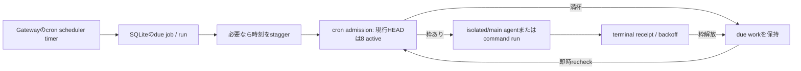

# Agent harness cron・admission調査

調査対象は「多数の論理ループを少数の実行資源でどう回すか」。結論は、時刻をずらすだけではない。公開実装は概ね **時刻判定 → 永続化された仕事 → 同時実行制限 → 完了時の再dispatch → 結果・再試行記録** を分ける。10,000件の*設定済みschedule*と10,000件の*同時実行agent*は別物であり、後者をMac miniで保証する一次資料は確認できない。

## OpenClawの実際の経路

- [Gatewayのcron scheduler実装](https://github.com/openclaw/openclaw/blob/6f08e4ea3c560d456f4ae1a02b0ca275bd24936e/src/cron/service/timer-scheduler.ts#L56-L100) は次のdue timeを見てtimerをarmし、due jobsを取り出す。capacity再確認など補助timerもあり、「プロセス全体にtimerが一つ」という意味ではない。jobごとに重い常駐agentを置く構造でもない。[due batchの実装](https://github.com/openclaw/openclaw/blob/6f08e4ea3c560d456f4ae1a02b0ca275bd24936e/src/cron/service/timer-scheduler.ts#L177-L269) は空き枠分だけを予約し、未予約のdue workを保持して枠解放時に即時再確認する。
- [上限定数](https://github.com/openclaw/openclaw/blob/6f08e4ea3c560d456f4ae1a02b0ca275bd24936e/src/config/cron-limits.ts#L1-L9) は `DEFAULT_CRON_MAX_CONCURRENT_RUNS = 8`で、調査したHEADのresolverはその定数を返す。[admission実装](https://github.com/openclaw/openclaw/blob/6f08e4ea3c560d456f4ae1a02b0ca275bd24936e/src/cron/service/run-admission-capacity.ts#L1-L115) はactive数、waiter、枠解放callbackを持つ。したがって「他のharnessは固定枠を使わない」は事実ではない。8という値をLife Managerへコピーすべきという意味でもない。
- [CLI仕様](https://github.com/openclaw/openclaw/blob/6f08e4ea3c560d456f4ae1a02b0ca275bd24936e/docs/cli/cron.md#L179-L205) はjobs・pending runtime state・run historyを共有SQLiteへ保存し、繰返しerror時は30秒→1分→5分→15分→60分のbackoffを記す。manual runはenqueueしてrun IDを返し、結果は後で照会する。[schedule仕様](https://github.com/openclaw/openclaw/blob/6f08e4ea3c560d456f4ae1a02b0ca275bd24936e/docs/automation/cron-jobs/schedules.md#L20-L36) の自動staggerは主に毎時0分の集中を最大5分へ分散する負荷平準化であり、queue・上限・receiptの代わりではない。
- [heartbeat仕様](https://github.com/openclaw/openclaw/blob/6f08e4ea3c560d456f4ae1a02b0ca275bd24936e/docs/gateway/heartbeat.md) は既定30分（記載されたAnthropic認証条件では1時間）、同じagent/sessionがbusyなら延期、event wakeに最低間隔・flood guardを適用する。[実装](https://github.com/openclaw/openclaw/blob/6f08e4ea3c560d456f4ae1a02b0ca275bd24936e/src/infra/heartbeat-runner-scheduler.ts#L52-L132) もagentごとの状態を持つ。定期heartbeatは「すべての仕事を再実行するcron」ではない。
- `main` と `isolated` sessionを選べ、`isolated` はrunごとにfresh transcript/session IDを使う。[公式CLI docs](https://github.com/openclaw/openclaw/blob/6f08e4ea3c560d456f4ae1a02b0ca275bd24936e/docs/cli/cron.md#L103-L122)。これは会話状態の分離であり、物理メモリ上限を消す仕組みではない。

## 他の公開実装との比較

| 実装 | 時間と実行の分離 | 容量超過・重複の扱い |
|---|---|---|
| [OpenAI Symphony](https://github.com/openai/symphony/blob/e0ccc83720a42a600a53b61c5f8d3e518bebe1db/elixir/lib/symphony_elixir/orchestrator.ex#L810-L850) | orchestratorがpoll/reconcileしissueをdispatch | [全体・issue-state・worker-hostのslot](https://github.com/openai/symphony/blob/e0ccc83720a42a600a53b61c5f8d3e518bebe1db/elixir/lib/symphony_elixir/orchestrator.ex#L1325-L1376)とworker-down retry。無制限並列ではない。 |
| [Temporal Schedules](https://docs.temporal.io/schedule) | interval/calendarにphase/jitter、serverが予定を保持 | `Skip`/`BufferOne`/`BufferAll`、catch-up/backfillを選択。[Task Queue](https://docs.temporal.io/task-queue)はworkerに空きがある時にpoll/dispatchし、server側rate limitも可能。分散サービスでありMac miniの性能保証ではない。 |
| [Kubernetes CronJob](https://kubernetes.io/docs/concepts/workloads/controllers/cron-jobs/) | controllerが時刻にJobを作る | 同一CronJobの`Allow`/`Forbid`/`Replace`。起動は近似で重複・欠落し得るためidempotencyが必要。複数CronJob間のhost容量はcluster側で別管理。 |
| [BullMQ](https://docs.bullmq.io/guide/workers/concurrency) | queueの仕事をworkerが処理 | workerごとのconcurrencyに加え[global concurrency](https://docs.bullmq.io/guide/queues/global-concurrency)もある。slot自体は一般的な構成。 |
| [Browserless](https://github.com/browserless/browserless/blob/450ec681481a1ee7bce2a4e5fe7c2ce3f939a0d7/src/limiter.ts#L15-L54) | browser requestをqueueへ入れる | [既定10 concurrent＋10 queued](https://github.com/browserless/browserless/blob/450ec681481a1ee7bce2a4e5fe7c2ce3f939a0d7/src/config.ts#L251-L258)、timeoutとhealth check。browserはagentとは別の資源。 |

公式OpenClaw資料に「100件または10,000件のcron jobを一台のMac miniで確実に完走」「10,000 agentを同時実行」というcapacity benchmarkは見つからない。これは不存在の証明ではなく、今回調べた公開一次資料からその保証を主張しないという境界。質問にあった「Grokboard」は特定できる公式repo／製品名が得られていないため、その実装を推定しない。

## Life Managerへの最小の適用

既に必要な部品はある。`config/loop-registry.json`のcadence/priority/resource classを`runtime/loop/lm_loop_apply.py`がlaunchdの`StartInterval`またはcalendarへ変換し、`runtime/loop/lm_loop_run.py`が有限の子実行を`runtime/host/resource_admission.py`のdurable queueへ入れる。`_limits`の現在のtotal既定値は5で、agent/browser/deterministicのclass limitとrevenue floorもある。release時には同じ既存queueから次のownerを予約する経路がある。つまり**queueを新設するより、この経路の孤立claim・release→dispatch・unknown-effect再照合を直す**のが短い。外部作用はprovider adapterの公式readbackで確定する。

実測では14 Product Loopは96 job IDを持ち、22:29 UTC時点で95がloaded、全14行の24/7証明は未達。現在のregistryには39件の5分intervalと6件の1分intervalがあり、理論上その2群だけで毎時828回の発火要求になる。これは同時実行828本を意味しない。v2台帳には68件のdeterministic/borrow、10件のbrowser/revenue、4件のagent/revenueがqueued、Connectorの古い`claimed/0`が2件残る。詳細な14行表と判断契約は[architecture spec](../docs/superpowers/specs/2026-09-15-life-manager-agent-architecture-refinement.md#b1-cadence-is-not-capacity-current-operating-decision)を正本とする。

推奨は次の一つ。**有限のメモリ保護は残す。全ループ一律1時間へは変えない。** まず実行終了時の自動再dispatch、古いclaim、class別の資源保護と効果不明時の照合を修復する。その後、実測で重く低緊急と判明し、失った発火から業務workを復元できるownerだけ1時間を試す。paid/buyer eventと予定投稿は固有の鮮度を守る。staggerは同時刻の山を崩す補助策に留める。macOSの`launchd.plist(5)`は、job実行中の`StartInterval`発火が失われると説明するため、business workはtickでなくdurable cursorへ保存する。[Appleのlaunchd設定ガイド](https://developer.apple.com/library/archive/documentation/MacOSX/Conceptual/BPSystemStartup/Chapters/CreatingLaunchdJobs.html)、[Google SREの過負荷設計](https://sre.google/sre-book/handling-overload/)とも整合する。

### 検証順と変更箇所

1. `runtime/host/resource_admission.py`: 本番のqueue→claim→release→次owner dispatchを、容量飽和・子死亡・unknown effectで回帰テスト。長時間待ちの原因をold claim／実容量／class制限に分ける。
2. `runtime/loop/lm_loop_run.py`と`lm_loop_apply.py`: exact-SHA natural wakeで外側terminal・claim解放を確認し、missed launchd tickに依存せずdurable workを復元する。
3. `config/loop-registry.json`: 39件の5分jobを実サービス時間・RSS・業務鮮度で監査。該当する低緊急で重いownerがあれば一つだけ1時間の候補変更をテストし、完了件数・queue age・memory・公式readbackを比較する。該当しなければcadence変更はしない。
4. 14行それぞれのprovider owner: 適用可能なlaneで公式effectまたは真のno-work、replay-zero、次の自然wakeを検証。PID／`loaded`／`exit 0`を収益成功としない。

Local/Evalより前にCloudを昇格しない。既存のidentity・permission・receipt条件を自己変更しない。
