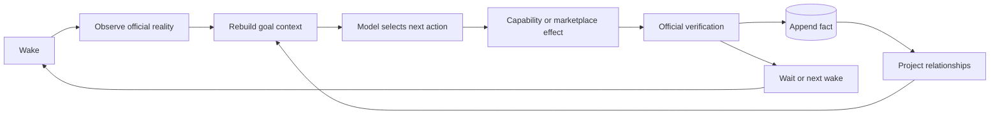
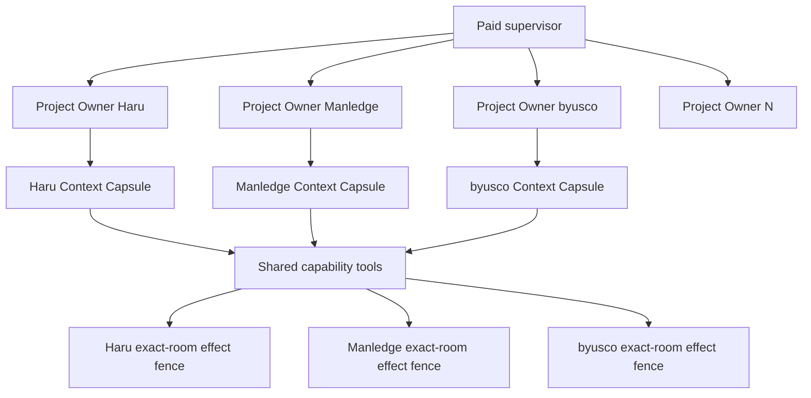
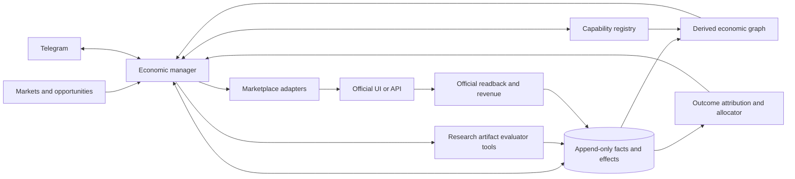
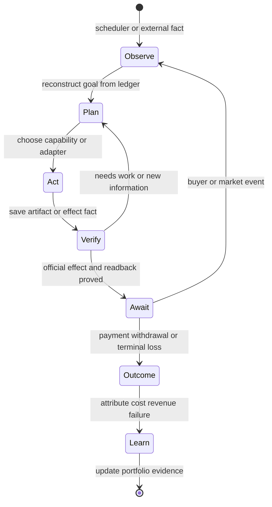
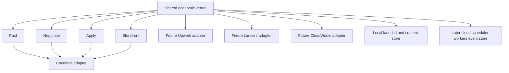

# Open work on the Coconala loop

Ordered. Each item says what was measured, not what is suspected. Anything without
evidence does not belong on this list.

The four lanes run from `~/gig/releases/life-manager/<sha>/`, cut from `main` by
`gig_release.py`. See `README.md` for how the whole thing is installed.

Current lane names are **Apply, Reply, Storefront, Paid**. `Reply` owns buyer-message
observation, replies, and estimates; do not present it as a separate Negotiate lane.

The Manledge delivery is no longer the active program cursor. The active product objective is a
public, website-neutral, no-human revenue agent whose four installed owners run continuously:
Apply acquires suitable work, Reply handles every buyer event and estimate, Storefront improves
offers from measured conversion, and Paid completes accepted work through official terminal
readback and replay-zero. A marketplace-specific customer case is evidence for this kernel, not a
separate architecture or the definition of completion.

The business outcome is a money-maximizing, self-improving fleet: every provider continuously seeks
new attributable net revenue, learns from official application/reply/contract/payment outcomes, and
improves the shared policy without forking provider copies. Runtime health is necessary but never the
goal by itself; the terminal measure is new official contract, accepted delivery, payout and bank
receipt evidence.

## End state — one marketplace money-printer kernel

The goal is one self-hosted, no-human marketplace system whose Apply, Reply, Storefront and Paid
owners keep acquiring, serving and completing paid work. Coconala, Lancers, CrowdWorks and each
later marketplace reuse the same deterministic lifecycle. A new provider adds only its authenticated
inventory, identity vocabulary, selectors, mutations and official readback; it does not copy a lane.

The target ownership tree is below. It is a responsibility map, not a command to create empty files.
Reuse the existing `contracts.py`, `ledger.py`, browser/session owner, agent runner and `runtime/loop`
primitives wherever they already satisfy the contract. A provider never receives a copied lane.

```text
skills/
├── _shared/marketplace-core/
│   ├── scripts/
│   │   ├── lifecycle.py            # observe -> decide -> intent -> act -> readback -> persist
│   │   ├── context.py              # profile, opportunity, thread, files, contract and prior receipts
│   │   ├── effects.py              # compare-and-swap fence and reconcile-before-retry
│   │   ├── receipts.py             # official application/reply/contract/delivery/payment evidence
│   │   ├── retry.py                # durable backoff, next_eligible_at and resumability
│   │   ├── reporting.py            # one natural-language Telegram contract for every lane/provider
│   │   ├── browser_owner.py        # persistent authenticated session and provider-scoped mutation lease
│   │   ├── apply_kernel.py          # discover, rank, propose, submit, official application readback
│   │   ├── reply_kernel.py          # buyer event, tool action, reply/estimate/contract transition
│   │   ├── paid_kernel.py           # work item, artifact, review, submit, acceptance/payment readback
│   │   └── storefront_kernel.py     # catalog, publish, improve, retire, conversion readback
│   ├── schemas/
│   │   ├── provider-capability.schema.json
│   │   ├── opportunity.schema.json
│   │   ├── buyer-event.schema.json
│   │   ├── work-item.schema.json
│   │   ├── effect.schema.json
│   │   └── receipt.schema.json
│   └── tests/
│       ├── test_lane_kernel_conformance.py
│       ├── test_adapter_conformance.py
│       └── fixtures/{coconala,lancers,crowdworks,mercor,freelancer,upwork,audiobabel}/
├── earn/marketplace-adapters/
│   ├── coconala/{provider,apply,reply,paid,storefront}.py
│   ├── lancers/{provider,apply,reply,paid,storefront}.py
│   ├── crowdworks/{provider,apply,reply,paid}.py
│   ├── mercor/{provider,apply,reply,paid}.py
│   ├── freelancer/{provider,apply,reply,paid,storefront}.py
│   ├── upwork/{provider,apply,reply,paid,storefront}.py
│   └── audiobabel/{provider,apply,reply,paid}.py
├── earn/marketplace-meta/
│   ├── discover.py                 # model searches for new revenue platforms; no fixed site whitelist
│   ├── qualify.py                  # market value, automation ratio, policy and expected net revenue
│   ├── bootstrap.py                # signup/profile/session/KYC gates through existing tools
│   ├── scaffold.py                 # generate only thin adapters from capability observations
│   ├── accept.py                   # real official effect/readback/replay-zero before promotion
│   └── improve.py                  # learn from receipts and improve shared policy, then re-evaluate
├── loop-development/SKILL.md              # build/release/ownership/acceptance SSOT
├── loop-engineering/references/
│   ├── marketplace-lane-kernel.md         # four-lane shared lifecycle and adapter boundary
│   └── marketplace-paid-lane.md           # Paid business-lifecycle recipe SSOT
└── earn/gig/TODO.md                       # fixed execution order and measured acceptance evidence
```

### Fixed remaining program order — current platform truth before meta-loop

This list does not replace or reorder the active atomic cursor below. It is the end-to-end program
that follows it, and its order is fixed as **Apply -> Reply -> Paid -> Storefront -> expansion ->
meta-loop**. A lane is complete only after a natural installed-owner terminal, exact official effect
readback, one deduplicated Telegram receipt and a following replay-zero; code presence and an empty
inventory check are not completion.

1. **Apply.** Restore continuous official applications on Coconala, Lancers and CrowdWorks; preserve
   Mercor's working submission path but rank for truthful resume fit and expected acceptance value.
   Activate Freelancer.com and Upwork only after official account/policy state permits it. Prove both
   fixed-price one-off and hourly opportunities; do not reject feasible general-agent work merely
   because no named Skill exists.
2. **Reply.** Close every current buyer event on Coconala, Lancers and CrowdWorks through the shared
   kernel. A reply may require tools: open an allowed scheduling link, create and read back a calendar
   event, complete an allowed form, accept exact contract terms, or send a grounded message. Add
   Mercor/Freelancer/Upwork adapters only against their official in-platform inbox/action surfaces;
   email is never fabricated as a platform reply.
3. **Paid.** Keep Coconala's accepted five-room evidence, finish the funded CrowdWorks contract and
   its payment receipt, then prove Lancers, Mercor, Freelancer.com and Upwork with a real funded work
   item. Human-produced audio/video/interview steps become typed Telegram handoffs; the loop continues
   other work instead of blocking the provider queue.
4. **Storefront.** Prove Coconala and Lancers listings continuously publish, improve and produce
   attributable orders. Add Storefront only where the provider actually offers a seller catalog;
   CrowdWorks and Mercor do not receive a fake lane.
5. **Shared-kernel convergence.** Move lifecycle, context, effect fencing, retry, official readback,
   reporting and browser/session ownership into `marketplace-core`; leave auth, provider vocabulary,
   selectors and actual mutations in thin adapters. One shared-kernel change must pass conformance
   fixtures for every adopted provider without copying a lane.
6. **Next-platform expansion.** Qualify and add Freelancer.com, Upwork, AudioBabel and the next
   evidence-backed marketplaces in expected net-revenue order. Each provider moves through
   discover -> account/profile -> Apply -> Reply -> Paid -> optional Storefront -> bank receipt.
7. **Marketplace meta-loop.** Let the model discover and qualify platforms, inspect official
   surfaces, call scaffold/build/test/release tools, and promote a new adapter only after real
   acceptance. Deterministic code owns permissions, credentials, effect fences, receipts, rollback
   and budgets; the model owns open-ended market, fit and action judgment. It continuously repairs
   weak existing lanes and discovers new providers rather than exhausting a hardcoded list.
8. **General revenue meta-loop.** Generalize the same verified harness beyond contract work to new
   businesses. Completion is Life Manager discovering, building, operating and improving a lawful
   net-positive revenue loop with no Dais/Codex/Claude involvement except explicit identity, KYC,
   irreversible personal spending or physically human deliverables. Revenue targets are objectives,
   never proof; official net-cash receipts remain the proof.

### Integration boundary with Life Manager cleanup

Cleanup worktree `/private/tmp/lm-aeux06.UXUZao`, branch
`feat/agent-economy-economic-receipts-20260911`, currently points to pushed commit `66464e37b` and
contains three additional uncommitted Agent Economy source/test changes. Its branch owns Agent Economy economic
receipts, the canonical 14-product README, Mobile App Loop wording, removal of external runtime
dependencies, and Local/Cloud financial/Telegram/state convergence. Gig owns marketplace business
logic and provider production acceptance.

- The Cleanup branch and Gig PRs `#4995`/`#4996` have no exact changed-file overlap.
- Cleanup changes `README.md`, `README.ja.md` and one shared marketplace notification regression test;
  Gig changes CrowdWorks entrypoints, the generic browser lock, its clean-install regression and this
  TODO. There is no current semantic conflict.
- Do not merge from the Cleanup worktree while it is dirty or copy its commits into a Gig branch.
  Cleanup first commits/pushes/reviews its remaining change and merges its accepted objective to main.
- Gig then fetches that main, reruns marketplace-core notification, clean-install, registry/doctor and
  four-lane focused suites, and proves that the 14-loop control plane still points each Gig owner at
  its intended immutable release/state root.
- Cleanup's `AE-UX-12` final acceptance consumes the resulting Gig main SHA. The convergence product
  is one main history and one shared runtime contract, not one giant worktree or a manual file merge.
- If either side later edits `config/loop-registry.json`, `runtime/loop`, shared Telegram/outbox/state
  code, `README*`, or `skills/_shared/marketplace-core`, it records file, intent and acceptance before
  editing; provider selectors and business mutations remain Gig-owned.

### Paid sharing boundary

| Shared forever | Provider-specific thin adapter |
|---|---|
| Stable global work-item ID and lifecycle | Login, session recovery, KYC/account state |
| Cumulative buyer context and attachment manifest | Order/message/revision IDs and provider state vocabulary |
| Model planning, tool/Skill selection and artifact production | Inventory URLs, pagination, API/DOM selectors and downloads |
| Stable workspace, artifact hashing and fresh review | Message, upload, formal-delivery and cancellation mutations |
| Intent/effect fencing, official reconciliation and replay-zero | Same-session official readback parsing |
| Durable waits, retry budget, backoff and process-exit resume | Provider limits, file-size rules and capability declaration |
| Submission, acceptance, payment and payout receipt contracts | Provider receipt IDs/URLs and normalized money fields |
| Cross-provider reporting, conversion, latency, cost and net-cash attribution | Provider fee/tax vocabulary before normalization |

### Reply sharing boundary

| Shared forever | Provider-specific thin adapter |
|---|---|
| Stable buyer-event identity, cumulative context and attachment manifest | Login, session recovery, inbox URLs and pagination |
| Model judgment for whether and how to reply, clarify, estimate or wait | Provider message/thread/estimate IDs and state vocabulary |
| Durable intent-before-effect, retry/backoff and process-exit resume | Message/estimate mutation and provider capability declaration |
| Same-event fencing, official reconciliation, receipts and replay-zero | Same-session official message/estimate readback parsing |
| Human-handoff contract with exact action, deadline and work-item identity | Provider ceremonies that require identity, interview or assessment |
| One deduplicated operator report and response ingestion contract | Provider-specific limits, attachment transport and allowed actions |

Reply never becomes a hardcoded stage between Apply and Paid. It continuously owns every official
buyer or selection event. The model decides whether the event needs an autonomous reply, estimate,
clarification, durable wait or human handoff; deterministic code owns identity, fencing, receipts and
retries. Mercor interviews, assessments, voice and video tasks use this same Reply contract to request
the exact human action through Telegram and resume the same work item after the response arrives.

Mercor, Freelancer.com, Upwork, Fiverr and future marketplaces use this same Paid kernel. They do not
receive a copied owner or lifecycle. A provider adapter declares typed capabilities such as
`can_message`, `can_upload`, `can_formally_deliver`, `can_cancel`, `can_read_acceptance` and
`can_read_payment`. A missing capability yields durable `WAITING_EXTERNAL` state with
`blocker_kind=human`; it never causes a provider fork or a fabricated success. Mercor
interviews/assessments and any Upwork work that
truthfully requires a person remain human gates, while inventory, context, reminders, permitted work,
delivery preparation, official readback, receipts and payout reconciliation continue through the
shared kernel. Freelancer.com can use the full autonomous path wherever its official surface and job
terms permit it.

Skills remain optional reusable method caches, not capability gates. `loop-development/SKILL.md`
governs how every owner is built and released; `marketplace-paid-lane.md` governs the one Paid
lifecycle. Add a provider Skill only when repeated provider ceremonies or constraints justify one;
never encode buyer/job judgment or duplicate the Paid lifecycle in that Skill.

Apply and Storefront remain independently owned while their parallel work is active. Shared runtime
changes require an explicit conflict check; this cursor never replaces their business code.

## Measured marketplace truth

This table is the operational truth, not a map of files that happen to exist. `Working` requires a
natural installed-owner terminal plus an official marketplace effect/readback for that lane. A green
process, a report-only command, a fixture, retired code, or an historical canary is not a working
money loop. Keep the active atomic cursor below in its fixed order; update this table when a named
acceptance receipt changes a cell.

| Marketplace | Apply | Reply | Storefront | Paid |
|---|---|---|---|---|
| Coconala | **Restriction cause clarified; fresh application acceptance remains open.** Provider support attributes the restriction to an earlier system cancellation caused by client non-contact, not to application cadence. Dais reports the restriction is lifted, so the disproven throttling hypothesis no longer suppresses eligible applications. Natural run `18d3e48749cf7b18-47730` passes with 57 official rows, seven already applied, 50 closed, effect/readback/failed/pending 0 and Telegram `73423`; it proves execution health but finds no open new job and therefore does not prove restored submission. The source change returns this owner from 1,800 to 300 seconds; installed-cadence readback plus a fresh proposal receipt and following replay-zero still gate completion. | **Historical acceptance retained; current owner is failing.** The last saved aggregate observes 174, reads back 159, fails 4 and keeps 11 pending; the installed owner latest terminal is fail. Restriction removal alone does not prove Reply recovery. | **Current owner is failing.** The installed owner latest terminal is fail; historical publication does not prove current Storefront health or revenue. | **Reference acceptance retained; current owner is failing.** `COCONALA-PAID-1` through `3C` prove the five-room receipt chain, formal delivery off and Ryu replay-zero, but the installed owner latest terminal is fail. The support explanation ties the restriction to the earlier missed-client/system-cancellation outcome, making current Paid health a revenue and account-safety requirement. |
| Lancers | **Historical application receipts retained; current owner is failing on a wedged browser.** Natural release `25e45d35` reconciled project `5599521` as proposal `27907931` and project `5599537` as proposal `27907996`, both at JPY 20,000, with Telegram `71494` and `71516` once. Current wakes repeatedly fail on next project `5599538` with `browser_unavailable`: Chromium PID `82502` and its supervisor remain alive, but official CDP `9227/json/version` times out and no listener is usable. The shared browser owner waited only for process exit and never rechecked service health. PR `#4844` puts the generic CDP watchdog in main `1b06dd0f3`; 52 focused tests and fresh review pass, and sealed release `20260910T124525-1b06dd0f` contains the matching read-only source. Production is still unaccepted because activating it requires a target-only Lancers browser-owner transition, which remains prohibited by the current no-browser-restart instruction; Mac, Aqua and loginwindow are not involved. After that boundary is explicitly lifted, PASS still requires a natural application receipt and following replay-zero. | **Runtime PASS, business action incomplete.** The prior aggregate replayed seven message threads at zero duplicate effect, but the live `pyrite` thread requests booking a 30-minute preliminary meeting through its scheduling URL. The seller replied that it would book, yet no scheduling-page submission, Google Calendar event readback or buyer-visible completion receipt is recorded. Reply completion must include the requested reversible browser/calendar action, not only text. | **Current runtime passes, revenue unproven.** Installed release `75fab5a9` has a natural PASS. Catalog/public-readback changes are in main, but state preservation remains only on unmerged `fix/lancers-state-wipe-and-readback-evidence-20260908`; no attributed order or payment exists. | **Current runtime passes; no contract or revenue proof.** Main release `d4022758` removes the accidental Apply proposal-pipeline dependency from Paid while retaining the shared Paid kernel. Its natural terminal at `2026-09-09T15:21:31Z` is PASS with official aggregate observed/actionable/effect/readback/failed/pending all `0`; authenticated contract inventory and finance readback are complete, with zero contract candidates, zero payment history and JPY 0. A real funded contract is still required for delivery, acceptance, payment and replay-zero proof. |
| CrowdWorks | **Historical fixed-price/hourly effects are real; current continuous acceptance is open.** Natural release `eee05950` retained fixed-price proposal `305126036` and verified hourly proposals `305130945`, `305132604` and `305134017`. Later release `869476b4` verified proposals `305351407` and `305352578`, but also ended intermittent `account_ensure_failed`. Read-only status proves `authenticated=true`; Apply, Reply and Paid instead overlap on the same CDP `:9228`, with observed EPIPE/timeouts. PR `#4995`, merged as main SHA `e75174ee6`, connects all three entrypoints to one crash-safe provider browser lock; lock behavior, clean-install regression and all CrowdWorks tests pass. The installed label still points to sparse release `20260911T082353-e75174ee`, which omits `skills/gig-work/profile`; its natural wakes fail before provider mutation with `commercial_profile_invalid` and effect zero. Dependency-complete release `20260911T082900-e75174ee` exists and contains that profile, but is not installed on Apply. Completion requires a target-only apply of the complete release, a natural PASS/effect with official receipt, and following replay-zero. Fixed-price/one-off work remains eligible; hourly support extends rather than replaces it. | **Working, including contract transition.** Installed/event release `10cc2e01` ended consecutive natural PASS terminals at `2026-09-10T07:23:19Z` and `07:24:53Z`, both with observed/readback 23, failed/pending/effect 0. Exact message redirects verify Effect contract `63570481` and JPY 110 contract `63568785`; Telegram receipts `73406` and `73407` remain delivered once. Shared Reply owns intent/readback/replay-zero; only terms and provider mutation remain in the thin adapter. | **Not implemented.** The storefront owner remains disabled, so there is no listing, inquiry, order or revenue receipt chain. | **Runtime PASS but business lane incomplete.** A fresh natural terminal at `2026-09-10T07:25:47Z` still reports observed 0 and durable pending `official_contract_detail_required`. Paid does not yet ingest the two official contracts. It must normalize `63570481` as work-startable and `63568785` as escrow-waiting, then own delivery/payment without working before escrow. |
| Mercor | **Submitting, but acceptance-fit policy remains incomplete.** Installed/event release `464216b4` proved ranking, official submission/readback, Telegram-once and replay-zero. The newest verified submission is `Expert Senior SWE` at `2026-09-10T07:51:33+09:00` (not 10:49), listing `list_AAABl9JyG7KVgJVmjv9Dioxa`, with official `2 of 2 steps done`/`100%`/submitted readback and Telegram `72299`. Its AI-agent/Agentforce/Databricks evidence overlaps the verified resume, but its US/Europe location and 10+ years at top US technology companies are strong contradictions. The shared `apply_policy.py` was used; its remaining defect is that weak fit is only ranked later and strong contradictory requirements do not sufficiently lower expected acceptance value. Raw application count is therefore working, but money-maximizing fit is not complete. | **Working.** Installed release `20198997` ended consecutive natural terminals at `2026-09-08T19:49:13Z` and `19:58:31Z` with `observed=78`, `actionable=1`, `effect=0`, `readback=77`, `failed=0`, `pending=1`. Official auth is authenticated; the one actionable human handoff read back existing Telegram receipt `70005` with `attempted=0`, and the outbox remains exactly three delivered rows with attempt count one. | **Not applicable today.** No seller storefront workflow is implemented or evidenced for Mercor. | **Official empty-inventory monitoring, not live-accepted.** Installed release `ec59f8f0` reuses the fresh shared Reply snapshot and its natural terminal passed with `status=ok`, `observed=0`, `failed=0`, `pending=0`; official Contracts are currently empty. No real work item, submission or payout receipt exists. |
| Freelancer.com | **Off.** Historical bid-watch/application labels are disabled and no managed owner is active. | **Off.** No active Reply owner or official reply receipt. | **Not implemented.** No active storefront owner or official listing receipt. | **Off.** The historical work-sync label is disabled and there is no delivery/payout receipt chain. |
| Upwork | **Off; safe resume is not proven.** Historical labels are disabled/absent, CDP `9233` is not listening, recorded Connects are zero and the account retains policy-risk/identity uncertainty. | **Off.** Adapter code is not an installed recurring owner and has no current in-platform reply receipt. | **Not active.** Historical Project Catalog evidence is forbidden/zero. | **Off.** Finance/delivery code has no current contract or payout chain. |
| AudioBabel | **Not implemented or installed.** It is a candidate human-work marketplace, not a current earning loop. | **Not implemented.** The to-be path uses the shared Reply/handoff contract for assessment, recording instructions and deadline. | **Not applicable unless an official seller catalog is discovered.** | **Not implemented.** The to-be path prepares the exact task, requests only the human recording when required, submits through the provider adapter and verifies acceptance/payment. |
| Fiverr | **Not implemented or installed.** No official application surface or receipt is recorded. | **Not implemented.** | **Not implemented.** This is likely its primary acquisition lane, but official capability inspection must decide. | **Not implemented.** |

CrowdWorks Reply contract-transition checkpoint: official inventory identifies thread `304340335`
as `proposed`, and the proposal page exposes condition `41879089` with a visible agreement action.
The existing shared Reply kernel supports only reply/estimate effects and therefore records this row
as seller-last `awaiting_buyer` replay-zero instead of advancing it. The active fix adds the universal
`accept_contract` effect to the same intent fence, official readback, notification and replay-zero
lifecycle; only CrowdWorks condition/DOM validation and mutation remain in its thin adapter. A
provider decision version reopens the previously saved `awaiting_buyer` result exactly once, and a
saved contract intent is reconciled even when acceptance advances the provider event ID. Exact
condition/terms changes fail closed. Source tests pass 295/295. This checkpoint is not complete until
a main-derived immutable release performs
the action once, CrowdWorks officially leaves `proposed`, Telegram delivers once, Paid observes the
same contract identity, and the following natural wake proves replay-zero.

The first main-derived production wake does not mutate any contract. It ends with `effect=0`,
`readback=0`, `failed=23`: the first pre-effect contract reconciliation refreshes the entire inbox,
that navigation times out, and the shared sync adapter page then cannot serve the remaining rows.
Thread `304402038` retains a pre-effect intent for condition `41883371`; Effect thread `304340335`
retains no intent or receipt and remains officially unaccepted. The follow-up fix makes contract
readback navigate only the exact proposal and require one visible official `/contracts/{id}` link
inside the current workflow status, with the exact proposal title and current condition terms matched;
bounded page replacement retries only the failed owned tab, never the browser or GUI session.
Page-wide/prior contract links and mismatched current terms fail closed. Production acceptance
remains open.
The pre-effect absence comparison also accepts the already persisted four-field intent shape by
matching condition ID, full terms hash, title and amount; it then replans into the enriched intent.
Post-effect verification remains strict.
The shared kernel now permits replanning only when an `accept_contract` intent in
`reconcile_unknown` receives that exact authoritative-absence proof; uncertain Reply/estimate
effects remain fenced. The exact legacy-state-to-enriched-mutation-to-replay-zero regression passes.
Focused and related tests pass 44/44 and 298/298.

The next production mutation reaches Effect thread `304340335`. The submit click times out after the
control becomes visible/enabled, so the kernel correctly persists `reconcile_unknown` and does not
retry. Independent official proposal readback then shows no acceptance control and states that the
worker has agreed while the client has not yet agreed. This proves the required Reply-side action,
but not mutual contract formation or Paid inventory. The adapter therefore recognizes this exact
title/current-terms-bound official state as `condition-accepted:{condition_id}`; a contract link is
still required before Paid handoff. Focused and related tests pass 45/45 and 299/299. Production
receipt convergence, Telegram-once and following replay-zero remain open.
The provider decision version applies only to official `proposed` rows. Ordinary rejected/idle/history
threads retain their existing replay-zero instead of all being needlessly recomposed on rollout.
The kernel treats decision-version invalidation as opt-in from the current observation: removing the
version from ordinary rows preserves replay-zero even if the prior rollout saved one, while a current
`proposed` row still requires the new version and reopens an old result. Focused and related tests
pass 47/47 and 301/301.
**Current implementable Apply acceptance step — Lancers target isolation.** The shared browser owner
now self-recovers its CDP service without restarting the Mac, Aqua or loginwindow, but the following
natural Apply wake exposed a separate adapter defect: after one Playwright attach timeout,
`application_tick._cleanup_stale_targets()` closed every ordinary `www.lancers.jp` page, including
sibling job and dashboard pages, and the logged-in account was then mislabeled
`account_unavailable`. The focused branch fix closes only measured Lancers/Google authentication
routes. Its ownership regression proves normal job/dashboard targets survive; all Lancers tests pass
`161/161`, loop-control unit checks pass, registry checks pass `15/15`, and `lm-loop doctor` reports
`ok=true`. This is code/test evidence only. Lancers Apply remains open until the change is merged,
installed from a pushed-main immutable release, and a natural wake records exact official proposal
history plus Telegram receipt and replay-zero.
PR `#4850` merged the fix as pushed-main SHA `17047aae`; immutable release
`20260910T134408-17047aae` was applied only to `lancers-revenue-application` without restarting the
browser, Mac, Aqua, loginwindow or a sibling lane. The first natural wake progressed past the false
account failure, reconciled project `5599830` as official proposal `27910839` at JPY 70,000, and
left three uncertain submissions fenced instead of retrying them. The following natural PASS
reconciled project `5599803` as proposal `27910952` at JPY 2,500 with Telegram decision/summary
receipts `73153`/`73154`. A third natural PASS reconciled project `5599879` as proposal `27910943`
at JPY 1,000 with Telegram receipts `73159`/`73160`; it did not repeat project `5599803`. Installed
and event SHA both equal `17047aae`, blocker is null, and Lancers Reply/Paid/Telegram owners also
continued natural PASS while Apply ran. This closes the sibling-target isolation defect and its
replay-zero gate; any separately fenced proposal remains owned by normal reconciliation.

**Host-wide runtime incident — recovered, keep as regression evidence.** The Data volume recovered
to about 25–27 GiB free on 2026-09-10 without restarting the Mac, loginwindow, Aqua or any browser;
encrypted swap fell from about 37 GiB to about 13.3 GiB. The earlier temporary recovery to about
5.1 GiB did not hold: a later immutable release was
cut while the host was under pressure. This owner removed one unreferenced, incomplete release
(`20260910T004123-14230525`, about 225 MiB allocated); it was regenerable but is not recoverable as
that incomplete directory. Canonical protected-release GC removed no valid release, and the
canonical disk governor reclaimed only about 6 KiB because its remaining candidates were open.
Three clean, merged, unreferenced worktrees and about 115 MiB of closed regenerable caches were also
removed; none is recoverable in place, but every one can be recreated from main or its package source.
This raised free space enough to cross the 512 MiB entry gate, but the Apply browser workload consumed
the margin and failed at the next atomic ledger write. About 37 GiB of encrypted swap remains allocated;
the Mac, loginwindow, Aqua and browsers were not restarted to reclaim it.
Earlier Coconala, Lancers and CrowdWorks failures contain `ENOSPC`, SQLite disk-I/O failures and
state/evidence temporary-write failures. Protected immutable-release GC evaluated 32 releases and
removed none because all 32 were referenced. Disk capacity is no longer the active Apply blocker:
installed release `2a62c7ad` produced a natural terminal without ENOSPC/OSError/exit 120/143 while
free space stayed near 25 GiB. The remaining Coconala Apply gate is a real official application
effect/readback, not more cleanup. Do not restart Mac, loginwindow, Aqua or a browser to reclaim swap.

The latest terminal matrix above is one fleet snapshot, not a revenue claim. A runtime PASS proves only
that the bounded owner completed its wake. A marketplace starts making verified money only when the
ledger links official application or storefront acquisition to contract, accepted Paid delivery,
marketplace fee, payout and bank receipt. No marketplace besides the retained Coconala customer history
currently has that complete new-revenue chain.

The completed extraction order remains historical evidence: `SHARED-PAID-1` -> `LANCERS-PAID-1` ->
`CROWDWORKS-PAID-1`. Dais now explicitly changes the controlling lane order to **Apply -> Reply ->
Paid -> Storefront**. The Apply report, three-provider receipt, discovery-width and release-dependency
gates are accepted. The active atom is now `APPLY-SHARE-3`: adopt the existing shared DOM contract in
the evidence-defined provider order. Completed Reply and Paid extraction work is
not reopened or reimplemented; those owners keep monitoring while Apply creates the upstream contract.
After Apply acceptance, recheck Reply continuous health, then close real-contract Paid acceptance,
then finish Storefront coverage and revenue attribution.

Apply maximizes truthful eligible applications. It excludes only opportunities whose application or
delivery would violate provider rules, require a false factual assertion, or require an outcome the
installed capabilities cannot produce. A later interview, assessment, identity ceremony or physical
submission is not an Apply-wide blocker: submit every reversible autonomous step, persist the exact
work item as `WAITING_EXTERNAL`, send one deduplicated Telegram handoff when action is actually due,
and continue to the next opportunity. Ranking may prioritize fit and expected net value, but it must
not silently turn a non-empty eligible inventory into zero applications.

Revenue modes are additive, never hourly-only. Apply must inspect and pursue fixed-price projects,
one-off tasks and hourly/long-term work whenever the deliverable is permitted and executable.
Coconala orders, Lancers project proposals and CrowdWorks fixed-price proposals use fixed terms;
CrowdWorks also proves the shared hourly terms extension. A missing hourly adapter may defer only
that provider's hourly form; it never suppresses its fixed-price or one-off inventory. Paid later
normalizes each accepted contract and payout through the same work-item lifecycle regardless of how
the marketplace priced the application.

### Remaining execution summary — references the atomic cursors; does not reorder them

1. **Apply:** close Coconala's official account restriction path, wire its shared fitness policy and
   hard per-pass ceiling, then obtain the missing official Coconala application/Telegram/replay-zero
   evidence that closes the three-provider `APPLY-FIT-4` gate. Keep Lancers and CrowdWorks applying
   to permitted fixed-price, one-off and hourly work while preserving their verified receipts.
2. **Apply shared completion:** widen discovery only after that gate, adopt shared DOM contracts from
   measured failures, consolidate the remaining duplicated Apply modules, and close the owner-aware
   disk-pressure atoms without bypassing release safety.
3. **Reply:** obtain fresh natural health and complete official event coverage for Coconala, Lancers,
   CrowdWorks and Mercor through the already extracted shared Reply kernel. Every buyer event is
   replied to, estimated, durably deferred or handed off exactly once, with Telegram and replay-zero.
4. **Paid:** retain Coconala as the accepted reference; keep Lancers, CrowdWorks and Mercor monitoring
   official contracts, then close each provider only on a real contract's build/submission, official
   acceptance/payment readback and replay-zero. Empty inventory is monitoring proof, not revenue.
5. **Storefront:** restore Coconala's current owner health, integrate the existing Lancers
   state/readback branch, add the thin CrowdWorks storefront adapter where the provider supports a
   seller listing, and attribute listing changes through inquiry, order and net cash.
6. **Fleet expansion and canon:** add Freelancer.com and later marketplaces as thin adapters, prove
   all four lanes where the provider supports them, finish the deferred `PANIC-3`–`PANIC-6` maintenance
   gates in their existing order, then canonicalize the measured method in
   `skills/loop-development/SKILL.md`. A provider without storefront capability records that typed
   absence instead of inventing a fake lane.

Why this new order is fixed:

1. `PANIC-1` and `PANIC-2` close the immediate host-pressure boundary before more browser work.
   They do not prove that macOS can never restart, but the sustained live workload now stays inside
   finite browser/process contracts.
2. Close Apply first because zero applications guarantee zero new contracts for Reply and Paid.
   PASS is a fresh official application readback plus Telegram receipt and following replay-zero on
   Coconala, Lancers and CrowdWorks; Mercor retains its already proven application path.
3. Recheck Reply next across Coconala, Lancers, CrowdWorks and Mercor. Existing shared-kernel and
   provider effects remain valid, but every installed owner must end a fresh natural terminal and
   represent every official buyer event exactly once.
4. Close Paid after Reply. Coconala's reference acceptance and the shared adapters remain valid;
   Lancers, CrowdWorks and Mercor stay live monitors until a real contract proves delivery, official
   readback, acceptance/payment and replay-zero.
5. Finish Storefront last: restore Coconala continuous health, integrate the existing Lancers
   state/readback branch, add only a thin CrowdWorks adapter, and bind listing changes to attributable
   inquiry, order and net-cash receipts.
6. Perform `PANIC-3` through `PANIC-6` last in their unchanged internal order. The macOS
   update/reboot runs only while Dais is physically available; until then no Mac, loginwindow or Aqua
   restart is authorized.
7. Canonicalize `loop-development/SKILL.md` last from measured four-lane behavior; writing the canon
   earlier would preserve guesses rather than the implementation that actually passed.

Zero live contracts never permits skipping an adapter atom or checking it complete. It proves only
the empty official inventory path. The atom stays open until a real contract produces submission,
same-session official readback and a following replay with effect zero.

## Host safety track and its explicit pause

`PANIC-1` and `PANIC-2` are complete. Dais explicitly changes the controlling order to Apply ->
Reply -> Paid -> Storefront before the restart-dependent host atoms. `PANIC-3` through `PANIC-6`
remain required and retain their internal order. The measured WindowServer panic remains a real availability risk; this
reorder states that an OS restart is not a repair for the current Coconala authentication,
targeted-readback or remote-builder failures. Do not restart Mac, loginwindow or Aqua while Dais is
away from the machine.

Current audited state: `PANIC-1` and `PANIC-2` are complete; `PANIC-3` is the first unfinished host
atom but is not the active controlling atom. The retired
duplicate Job Search browser is officially absent and `lm-loop doctor` is green. After an idle-only
full apply, Dais explicitly authorized browser-only controlled restarts; Lancers `:9227` and Gig
`:9223` now run immutable release `a283fb8d27bc5c50ac443f367c36ef1cd8bc8fd7` through the shared
process-group owner with renderer limits 8 and 24. Mac, loginwindow and Aqua were not restarted.
The following real five-room Paid workload kept Gig pages at 4–7 and renderers at 4–18 against limit
24; Lancers renderers stayed at or below 6 against limit 8. Six pre-restart ledger rows matched no
official live target and were pruned without closing a live page. Two workload targets were then
claimed and released, leaving target and context ledgers empty at natural terminal. Profile-restored
default pages remain bounded by their browser process root. The separate owner-scoped Coconala probe
ended `authenticated tab did not finish navigation`, and the Paid aggregate failed, but neither path
grew browser resources or produced an external effect. The Mac still reports
macOS `15.6` build `24G84`, so `PANIC-3` and its update-dependent
reboot proof in `PANIC-4` did not happen. `PANIC-5` lacks its accepted pre-login alert, and the latest
WindowServer watchdog is `2026-09-06`, so the seven-day recurrence gate in `PANIC-6` cannot yet pass.

## Active atomic cursor — marketplace kernel completion

This is the only executable cursor for this owner. Older unchecked Coconala incident and customer
case lists below are historical evidence and do not reopen completed work or reorder this list.
Independent Storefront, Apply, Reply, Lancers and CrowdWorks owners continue in parallel in their
own worktrees and resource scopes; “top to bottom” orders only this owner's changes.
Unchecked Lancers, CrowdWorks and Mercor Paid atoms remain live acceptance monitors because their
official contract inventories are empty. The active engineering atom is now
`APPLY-PROFILE-PARITY-1`, because profile trust and positioning must be verified before Apply yield is
judged. The screenshot with a blank CrowdWorks avatar predates the accepted official non-default-avatar
readback, so that image defect is closed. The same screenshot exposes `プロンプトエンジニア` inside
the occupation/skill view; do not dismiss that field as stale until a current official public readback
proves it. The shared commercial source must project the truthful software-engineering, AI-automation,
training and freelance-work positioning rather than a prompt-engineer-only identity. Fresh Apply operational
acceptance follows that profile correction. Reply then resumes at `CROWDWORKS-REPLY-ACTION-2` and
`MERCOR-REPLY-2`; Paid follows Reply, and Storefront follows Paid. This preserves Dais's explicit
Apply -> Reply -> Paid -> Storefront order.

Fresh cross-owner handoff audit:

- Apply's all-category Coconala search and corrected deliverable refusal boundary are in main through
  PR `#4642`; CrowdWorks whole-board/catalog pricing is in main through PR `#4645`. They remain
  production-unaccepted because the latest Coconala and Lancers owners fail and no fresh three-provider
  application receipt set exists. Do not redo those merged changes.
- Storefront's shared guide, Lancers catalog connection and public readback corrections are in main.
  The follow-up that preserves unknown state keys and records exact canonical/public/contract readback
  observations is clean and pushed at `2e44a6811048` on
  `fix/lancers-state-wipe-and-readback-evidence-20260908`, but has no PR and is not in main. Review and
  integrate that branch before any new Storefront repair; do not reimplement it.
- Architecture cleanup remains isolated in `/private/tmp/lm-arch04-dispatch-migration-20260907` on
  `feat/arch11-external-dependency-removal`. Its Writer cleanup has uncommitted changes. Gig owners do
  not edit that worktree or its Writer files. Changes to `config/loop-registry.json` or
  `skills/_shared/marketplace-core/` require a fresh overlap comparison, but no current file overlap
  was observed.
- Dais now explicitly replaces the controlling sequence with Apply -> Reply -> Paid -> Storefront.
  Promote the existing Apply work and evidence instead of duplicating it; keep completed Reply/Paid
  extraction and stopped Storefront work recorded, monitored and available for their later turns.

Current read-only stop-point snapshot (no repair authorized in this checkpoint):

- CrowdWorks Apply is **not healthy**: its latest business output is `account_ensure_failed` at
  `2026-09-10T23:00:05Z`, and the owner terminal is `entrypoint_exit_1`. Earlier verified proposals
  remain real receipts, but intermittent success is not continuous acceptance.
- Repair is active without reordering the cursor. Runs prove cross-lane overlap:
  Apply `18d4183838d949a8-37101` and Reply `18d4184519d0c178-38421` simultaneously drive the same
  authenticated CrowdWorks CDP `:9228`; Paid also overlaps on the same resource, while logs retain
  EPIPE and timeout failures. PR `#4995` is merged to main as `e75174ee6` with one crash-safe provider
  browser lock shared by the three entrypoints. Normal-exit/SIGKILL lock behavior, clean-install and
  all 74 CrowdWorks tests pass. Its first sparse immutable release omitted the shared commercial
  profile path; natural run `18d41976315394b0-65971` therefore failed before provider mutation with
  `commercial_profile_invalid` and effect zero. Dependency-complete release
  `20260911T082900-e75174ee` now exists with the profile, while the Apply plist still points to
  `20260911T082353-e75174ee`. Production acceptance remains unchecked until the complete release is
  installed only on Apply and reaches a natural official receipt plus following replay-zero.
- CrowdWorks Reply currently reports observed `24`, readback `22`, failed `0`, pending `2`, effect
  `0`. It is live but not fully closed while the two durable pending items remain.
- CrowdWorks Paid currently reports two official contracts: funded `63570481` and escrow-waiting
  `63568785`. The buyer Google Form for the funded contract has one confirmed contract-bound receipt;
  its hash and timestamp remained unchanged on the next wake, so **no duplicate Form submission
  occurred**. Delivery is still absent. The latest aggregate is observed `2`, failed `1`, pending `1`
  because the funded item timed out during repeated official reads.
- The next Paid speed repair is already merged to main as `61f9722c3f6ceb4af3429fc31a51405e2c0a535b`,
  but it is not installed. Release creation collided with a legitimate concurrent release build lock
  owned by PID `20297`, which was cutting the already-installed prior SHA `1cb762d1`. The lock was not
  stolen and no production target was changed after Dais requested this stop-point report.
- Coconala Apply and Paid have recent PASS terminals; Coconala Reply and Storefront have recent
  `entrypoint_exit_1` terminals and therefore are not currently accepted as continuously healthy.
  Lancers Apply/Storefront/Paid have recent process PASS terminals, but Paid still has zero contracts
  and JPY 0, while Reply reports observed `8`, readback `7`, failed `0`, pending `1`; this is not proof
  of revenue. Mercor Apply/Reply/Paid have recent process PASS terminals, but those terminals alone do
  not prove a new accepted contract or payment.

Current live Apply acceptance audit:

- **Coconala:** five-minute cadence and consecutive natural no-inventory PASS terminals are
  accepted. Later installed release `f0d178849d2c2acaa1df9d43dbf70e29f5954e19` ended natural PASS
  at `2026-09-10T08:29:35Z`; it officially observed 80 listings, all unavailable, with
  actionable/effect/readback/failed/pending `0` and Telegram receipt `73565`. The first eligible
  proposal plus official history readback and following replay-zero remain the gate.
- **Lancers:** the earlier dead-CDP diagnosis is stale. Official CDP `9227` responds and installed
  Apply release `17047aaeebfc3afc16d85cfed53401b4ca5d55f4` ended natural PASS at
  `2026-09-10T08:22:46Z`. Business acceptance still fails: current output is
  `submitted=false`, `application_verified=false`, and proposal history repeatedly contains no
  exact `/work/detail/5599976` row after a saved intent. The current blocker is therefore
  `submission_uncertain` / `proposal_pipeline_incomplete`, not browser availability. Preserve the
  intent and reconcile before retry; a process-level PASS is not an application receipt.
- **CrowdWorks:** Apply is actively producing official receipts, but is not operationally accepted.
  In addition to the retained earlier receipts, current official logs verify proposals `305309712`,
  `305314740`, and `305321784`. Other wakes end `account_ensure_failed`,
  `profile_navigation_failed`, or `proposal_form_changed`, so “some applications succeed” must not
  be reported as continuous health. The shared avatar was uploaded once and authenticated public
  readback exposes attachment `59139511.jpg` as the unique `alt=userIcon` image. Its current
  `AI-BPO（AI活用の業務改善） / AI関連サービス` headline and software / AI-automation / training
  skills, but the supplied occupation/skill screenshot also shows `プロンプトエンジニア`. Treat that
  as a field-specific mismatch to reconcile against the current official page, not as proof that the
  whole profile is aligned and not as proof that it alone caused missing contracts. CrowdWorks avatar
  projection and replay-zero are accepted on release `c09a26e9...`; fresh operational Apply acceptance also submitted project
  `13444761` as official proposal `305338764` and delivered Telegram receipt `74261` once. Broader
  consecutive Apply acceptance remains open; existing verified proposal effects never reopen.

1. [x] `COCONALA-PAID-1` Close Ryu0820119 talkroom `18211957` through Paid itself.
   PASS = the loop consumes the latest cumulative revision, sends the corrected buyer-visible
   result as a normal message, reads the exact seller message back from the authenticated room,
   leaves formal delivery off, and a later wake performs no duplicate send. Production release
   `bec7a75f3398298de7c959d1ff03503b60e63a64` satisfies this contract; the final readback records
   `seller_message_observed=true`, `formal_delivery_confirmed=false`, and transaction state `取引中`.
2. [x] `COCONALA-PAID-2` Accept the Coconala Paid owner as the reference implementation.
   PASS = one natural installed-release pass represents every observed order, progresses different
   orders independently, records exact official readback for effects, preserves blocked work as a
   resumable pending item, and reports no failed item. Natural run
   `18d27005ea553bb0-42383` ended `pass` with observed `5`, actionable `3`, readback `4`, failed `0`,
   and pending `1`. Talkroom `18180857` remains durably retry-owned because its TikTok recipient
   route is externally unavailable; it is not dropped and does not block unrelated buyers.
3. [x] `COCONALA-PAID-3` Restore continuous Paid health after the reference pass regressed.
   PASS = preserve every already-read-back effect, remove the current per-project
   `remote_builder/transient_timeout` failure boundary, and observe a fresh natural installed-release
   aggregate with `failed=0`; a following natural wake must retain Ryu's existing message with no
   duplicate send and keep formal delivery off.
   The current installed Paid release `722dd7b5596f793661717297d66ac1014109ccad` produced natural
   PASS terminals `18d2bfb9ba468920-25690` and `18d2c08b7e999228-45593`. The latter ended at
   `2026-09-06T14:23:08Z`; its aggregate observes five rooms with `failed=0`, `pending=1`, effect `0`
   and readback `4`, without another `ENOSPC`, reconciliation `OSError`, exit 120 or exit 143. Ryu's
   newest revision and normal-message submission are complete and Dais confirmed the live result;
   formal delivery remains off. Two later natural terminals from the same installed release,
   `18d2c19ecb1e4f58-78246` at `2026-09-06T14:32:53Z` and
   `18d2c226e2d34698-94197` at `2026-09-06T14:42:06Z`, also ended `pass`. The latest aggregate
   represented all five observed rooms exactly once with duplicate dropped `0`, failed `0`, pending
   `1`, effect `0`, and readback `4`: `18223833` and `18171850` completed, `18211957` and `18211838`
   awaited the buyer, and `18180857` remained durably retry-owned. Its official TikTok/Google Sheets
   reconciliation receipt records a nonempty blocker and remaining work while both current-cycle
   mutation counts stay zero. Authenticated room readback keeps Ryu in `取引中`, observes the existing
   seller message, and records both formal-delivery controls false. These source-derived natural
   terminals contain no `ENOSPC`, reconciliation `OSError`, exit 120, or exit 143; process liveness
   was not used as acceptance evidence.

   Execute the remaining substeps in this order without waiting for another marketplace owner:

   - [x] `COCONALA-PAID-3A` Finish Ryu's current revision cycle. Paid consumed the cumulative survey,
     usage-guide and schedule-display corrections, repaired the public result, and submitted the
     buyer-visible revision as a normal message in room `18211957`; Dais confirmed the live result.
     Formal delivery remains off. The next aggregate wake owns replay-zero proof; Ryu is no longer a
     separate unfinished production task.
   - [x] `COCONALA-PAID-3B` Cover every current client in one aggregate. PASS = every observed room
     appears exactly once as completed, awaiting buyer, or durably retry-owned; `failed=0`; one slow
     client does not prevent another client from progressing. “Observed” does not require a message
     when official state proves that waiting or no-op is correct.
   - [x] `COCONALA-PAID-3C` Prove continuous local ownership. PASS = no `ENOSPC`, reconciliation
     `OSError`, exit 120 or exit 143, followed by two consecutive natural PASS terminals and zero
     duplicate external effects.
4. [x] `SHARED-PAID-1` Use Lancers as the second real Paid platform and extraction trigger.
   PASS = implement one provider-neutral Paid entrypoint from
   `skills/loop-engineering/references/marketplace-paid-lane.md`, moving only orchestration already
   proven identical on Coconala and Lancers into `skills/_shared/marketplace-core/`. Keep auth,
   selectors, provider states and mutations in thin adapters; do not copy `paid_direct.py`.
   Shared-kernel implementation is in progress on pushed branch `feat/shared-paid-1-20260907`.
   `paid_kernel.py` now owns per-work durable state, intent-before-effect persistence, same-item OS
   fencing, different-item concurrency, mutation-time latest-event invalidation, official readback,
   reconcile-unknown, external waits, process-boundary resume, replay-zero and item-failure isolation.
   The generic CLI now loads any configured adapter without a provider branch. A thin Lancers adapter
   reuses its existing seven-surface official inventory reader; its live read-only preflight records
   `observed=0`, `effect=0`, `failed=0`, matching the current zero working-contract state. A thin
   Coconala adapter now owns mapping, targeted refresh, cumulative-context, mutation and readback
   seams without copying its business owner. Focused kernel plus both-adapter regressions pass 14/14
   through checkpoint `7fcfa8fa1`. Extraction inspection found that Coconala cancellation alone
   still mutated inside `_prepare_one()`; it now emits only prepared state, while `_write_one()` owns
   its disk-gated mutation and official readback exactly like answer and file effects. The focused
   Paid/kernel/adapter regression passes 51/51 with no external effect. The shared kernel now also
   performs official targeted refresh before context/decision and again before mutation, so a newer
   buyer event invalidates even a previously verified receipt instead of being mislabeled replay-zero;
   its focused regression passes 37/37. Coconala's default `build()` now reuses `paid_direct.py`
   directly for official inventory, targeted refresh, prepare, effect and readback, while mapping
   no-op, durable wait, answer, progress submission, formal delivery and cancellation into the shared
   contract. It does not copy buyer judgment, artifact production or the old admission lifecycle;
   the shared kernel owns bounded concurrency. Focused shared/adapter tests pass 40/40 and the wider
   Paid/Coconala delivery/project regression passes 147/147 with no external effect. The launchd
   manifest now routes the unchanged Coconala Paid label through `paid_kernel.py` plus the thin
   adapter, preserves the existing state/evidence/project roots, and omits the adapter's explicit
   formal-delivery capability flag so formal delivery remains durably disabled. Manifest/release/
   adapter regressions pass 28/28 (one unrelated stale `watch` CLI assertion is deselected). This
   route merged through PR `#4302` as public-main SHA `3beede0ccd3e6c8bae4bc4a69fca7562211e9cb6`
   and was targeted to the idle Paid label without restarting the Mac, Aqua session or browser.
   Loaded argv proves `paid_kernel.py` plus `coconala_paid_adapter.py`, with no formal-delivery flag.
   Its first natural run terminated with effect zero after the official orders collector twice
   reported `authenticated tab did not finish navigation`. That run exposed a shared terminal bug:
   provider-inventory exceptions exited one without replacing the prior aggregate. The kernel now
   persists a sanitized `provider_inventory` failure aggregate for this path; focused tests pass
   16/16. That fix merged through PR `#4306` and release
   `8bc3b025ffe22e88955e525bdb94bd9ef8ffc6aa` produced a natural terminal aggregate with
   `observed=0`, `effect=0`, `readback=0`, `failed=1`, and `failed_step=provider_inventory`, proving
   stale output is no longer retained. The authenticated surface is now the blocker: the live Gig
   browser responds on CDP `:9223`, but the official orders collector twice reaches no authenticated
   route; read-only target inventory shows Coconala login pages. Reapplying the existing 0600 session
   vault did not restore the server-side session. One normal login attempt used the active private
   credential SSOT without exposing values, showed no SMS challenge, but returned to `/login`; no
   customer effect or formal delivery occurred. A second natural wake at `2026-09-07T01:07 JST`
   reproduced the same sanitized `provider_inventory` terminal with effect zero. Concurrent Apply
   evidence then showed another owner had restored and dumped 1,370 cookies into the gig vault at
   `01:02:29`; the subsequent Paid diagnosis dumped 1,371 cookies at `01:05:04`, including one extra
   Coconala cookie from its unsuccessful login attempt. The pre-diagnosis mode-0600 backup remains at
   `~/.cloak/vault/gig-daily-driver/auth-state.1788710549.json`. It has not been restored because the
   vault is a concurrently shared auth resource and requires owner coordination before overwrite.
   A value-free recheck proves that backup contains exactly one unexpired `.coconala.com`
   `_coconala_session` cookie with Secure and HttpOnly set, while the current vault contains none.
   The concurrent Apply parent PID `38734` later ended naturally with official result `status=ok`,
   observed `75`, actionable/effect/failed/pending all zero, and Telegram receipt `62578`; no Apply or
   Paid business process then remained. Its owning Claude PID `91603` and two monitoring shells remain
   live and can still touch the same browser/vault, so Paid still does not overwrite the vault or
   restart the browser until that shared-resource owner is stopped or explicitly hands it off.
   While auth remains gated, the shared aggregate stopped collapsing every zero-effect room into
   generic `noop`: it now preserves `completed`, `awaiting_buyer`, `reserved_for_owner` and
   `satisfied_noop`, and reports provider-neutral `observed`, `actionable`, `readback`, `failed` and
   `pending` counts. The kernel now also preserves a recognized provider-auth inventory interruption
   as one durable `provider_authentication_required` pending item (`failed=0`, `effect=0`) instead of
   misreporting it as a business failure; unknown inventory errors still terminate as sanitized
   failures. The Coconala adapter maps only the exact authenticated-navigation interruption to that
   shared wait contract and does not hide selector or other provider errors. Focused kernel and
   Coconala-adapter regressions pass 20/20 with no external effect. The atom remains unchecked:
   coordinate that exact backup/owner state, recover Coconala auth without restarting the browser,
   then obtain a natural five-room official aggregate and following replay-zero before marking complete.
   After the authorized Gig browser restart, a natural installed-release wake did observe all five
   rooms and re-proved Ryu `18211957` plus `18211838` as `satisfied_noop` with effect zero and official
   readback. It nevertheless ended `failed`: `18180857` failed at `remote_builder`, while `18223833`
   and `18171850` failed targeted readback; aggregate was observed `5`, actionable `3`, effect `0`,
   readback `2`, failed `3`, pending `0`. This is the current Paid truth and does not satisfy the
   required failed-zero aggregate or following replay-zero, so `SHARED-PAID-1` remains unchecked.
   A later natural wake improved that aggregate to observed `5`, readback `4`, failed `1`, effect `0`:
   both completed rooms returned, Ryu and `18211838` remained replay-zero, and only `18180857`
   failed. Its intent and result agreed on the TikTok target and recorded `authenticated=false` with
   a nonempty official identity readback and remaining work, but the wait validator accepted three
   older authentication receipt kinds and rejected the producer's established
   `authenticated_identity_readback` vocabulary as `remote wait target mismatch`. The validator now
   accepts exactly the two existing authenticated-identity receipt kinds while continuing to reject
   unauthenticated non-authentication blockers. Paid remote, shared-kernel and Coconala-adapter
   regressions pass 178/178. Production still owes a main-derived natural five-room aggregate mapping
   `18180857` to durable pending with failed zero, followed by replay-zero; no external effect was
   created by this repair.
   Main-derived immutable release `237bf1b6e9054c607b44b3046d1e3cfd0e479e79`, which contains the
   identity-auth wait repair, is now targeted to the idle `hf-gig-paid-direct` label. Apply receipt
   `50151d6ea204863ce09989fd` proves the exact loaded argv and release; Mac, browser, Apply and
   Storefront were not restarted. Its first natural wake is in progress and is not acceptance until
   the terminal aggregate and following replay are read back.
   That first installed-release wake now ended naturally with runtime `pass` and aggregate
   `status=pending`: observed `5`, actionable `3`, readback `4`, failed `0`, pending `1`, effect `0`
   and duplicate dropped `0`. Rooms `18223833` and `18171850` are completed; Ryu `18211957` and
   `18211838` are satisfied no-ops; `18180857` is the sole durable pending item with a nonempty
   blocker, one remaining-work entry and one official authentication receipt. The following natural
   wake then ended naturally from the same installed release with the identical five-room
   classification, failed `0`, pending `1`, effect `0`, readback `4` and duplicate dropped `0`.
   It reused `18180857`'s fresh durable wait without starting its remote builder, and both no-op rooms
   retained official readback without another seller effect. Together with the thin Lancers adapter's
   live zero-inventory preflight and the shared conformance regressions above, this closes the kernel
   extraction atom. A real Lancers submission remains the separate next atom.
5. [ ] `LANCERS-PAID-1` Complete one real Lancers contracted-work lifecycle through that shared
   entrypoint. PASS = active-order inventory, independent resumable work, buyer-visible submission,
   same-session official readback, and a second natural replay with effect zero are all receipt-bound.
   Current truth: the official read-only preflight has zero contract candidates, zero payment history
   and JPY 0, but lack of inventory is not the only remaining condition. The thin adapter currently
   implements complete-source inventory normalization only; `decide()` always waits for contract
   detail, `mutate()` raises `lancers_paid_effect_not_implemented`, and `readback()` can never verify.
   Therefore a future contract would not yet be fulfilable. First complete those provider-only
   boundaries against Lancers' existing official sources without touching Apply-owned files; then
   keep the atom open until one real funded contract proves submit, same-session readback and replay-zero.
   The scheduled `paid-owner` now enters the shared `paid_kernel.py` with the Lancers adapter and a
   provider-scoped durable state root before emitting its existing lane report; it no longer reports
   without running Paid. Owner ordering plus adapter/kernel regressions pass 16/16, and a live
   read-only zero-inventory smoke returns observed `0`, effect `0`, failed `0`. The official two-pass
   inventory remains stable and authenticated: 94 proposals, working `0`, contract candidates `0`,
   incoming monthly offers `0`, payment history `0`, balance JPY `0`. Contract-detail promotion and
   the real mutation/readback/replay receipt chain remain open and keep this atom unchecked.
   Targeted production apply receipt `f7a0313480a0b69c2596032c` binds only
   `lancers-revenue-paid` to main-derived immutable release
   `5037a5ac844d35ac88412276147e6027a19fdc8e`; no browser or other business lane restarted. Its
   natural wake ended `pass` at `2026-09-07T02:32:12Z`, and the persisted shared-kernel terminal is
   observed `0`, actionable `0`, effect `0`, readback `0`, failed `0`, pending `0`. Thus production
   wiring is live and idle correctly; it does not substitute for the missing real-contract acceptance.
   A later regression was traced to the Paid owner reusing Apply's proposal-pipeline completeness as
   its inventory gate. PR `#4818` gives Paid a provider-official contract/finance reader that reuses
   the existing authenticated browser/session runtime but never calls `_proposal_pipeline` or
   `_verified_proposals`; finance incompleteness fails closed. Focused tests pass 30/30 and fresh
   read-only review returned `ship`. Target-only apply receipt `445bdb4b91a5552fc99f67a9` binds
   `lancers-revenue-paid` to main-derived immutable release `d4022758b261ca1b3b0164ecc984c21935785961`.
   Its natural terminal at `2026-09-09T15:21:31Z` passed with official aggregate observed `0`,
   actionable `0`, effect `0`, readback `0`, failed `0`, pending `0`; live inventory is authenticated
   and complete with zero contracts, zero payment history and JPY 0. No Mac, GUI session or browser
   restart occurred. Runtime repair is therefore accepted, while this atom remains unchecked until a
   real funded contract proves submission, same-session official acceptance/payment readback and the
   following replay-zero.
6. [ ] `CROWDWORKS-PAID-1` Add only the CrowdWorks Paid adapter to the proven shared entrypoint.
   PASS = no shared planner/worker/reviewer/lifecycle fork; one real contracted-work item reaches
   official submission readback and replay-zero. The existing CrowdWorks Apply owner remains
   independently parallel and is not replaced by this item.
   A repo-owned `paid_adapter.py` and `paid-owner` now use the shared kernel, and the registry has a
   separate five-minute `crowdworks-revenue-paid` owner. The adapter reuses the existing authenticated
   CDP session without starting or repairing the browser, proves all three official active-contract
   sections empty, and turns an unnormalized positive contract into explicit resumable pending instead
   of zero or failure. Adapter/kernel regressions pass 15/15; a live read-only smoke returns observed
   `0`, effect `0`, failed `0`. Positive contract normalization, provider mutation, official readback,
   and one real replay-zero receipt chain remain open, so the atom stays unchecked. Main-derived
   immutable release `6f0b91bf9e87d2efb14e25ac4c358a4a3366a8ca` is installed only for the new
   Paid owner under apply receipt `2ed176d67addebd77ae86fef`; its first natural wake ended `pass`
   at `2026-09-07T02:52:05Z` with the persisted aggregate observed `0`, actionable `0`, effect `0`,
   readback `0`, failed `0`, pending `0`. Production monitoring is therefore live and safely idle.
   The official active-contract surface is no longer empty. Read-only authenticated evidence now
   exposes contract `63570481` as funded/in progress with milestone `13798056` and one buyer-required
   Google Form before CrowdWorks delivery, while contract `63568785` remains explicitly awaiting
   escrow and must not start. The thin Paid adapter implementation now normalizes funded,
   awaiting-escrow and delivered states, delegates provider-local Google Form transport shared with
   CrowdWorks Reply, binds prepared/confirmed receipts to account + contract + milestone + form
   revision + submission payload, and requires positive official delivered-state readback before
   replay-zero. Each kernel worker now owns its own Playwright runtime and CDP connection from create
   through close without using the account module's global browser or starting/restarting Chromium.
   The buyer's application-date field uses an official proposal label first; when that surface is
   unavailable it accepts only one verified Apply receipt whose exact proposal ID and contract title
   match, converting its official readback timestamp to the provider's Japan date. Missing or
   ambiguous evidence waits without submitting. The real contract maps uniquely to proposal
   `305139864` and official Apply receipt date `2026-09-09`. Focused Paid/Reply tests pass 41/41,
   diff/compile checks pass, and fresh read-only review returned `ship`; no production mutation has
   occurred. Merge, target only
   `crowdworks-revenue-paid`, and obtain the real form + delivery readback and following replay-zero.
   PR `#4991` merged this adapter as main SHA `bda380c0a832c6eab7f992ef1bcc5b9a6fe46ce3`.
   Target-only apply receipt `2e434ea31bd3339589a58cc5` installed that exact immutable release
   without restarting the Mac, GUI session or browser. Its first natural run
   `18d4168c17a55428-94094` created one contract-bound `confirmed` Google Form receipt for contract
   `63570481` at `2026-09-10T22:37:40Z`; contract `63568785` stayed durably
   `awaiting_client_escrow` and was not touched. The run then ended `entrypoint_exit_1` before a new
   Paid aggregate or delivery receipt because Playwright runtimes created inside kernel workers
   survived their worker calls. The confirmed Form receipt fences every later run from re-POSTing.
   The adapter now closes each worker-owned page and Playwright runtime in that same worker call on
   wait, no-op, failure and submit paths, without closing or restarting Chromium, and re-observes
   provider state per call rather than lending Playwright objects across threads. Focused Paid/Reply
   tests pass 42/42 and fresh read-only review returned `ship`. Merge and target this follow-up, then
   let the next natural wake resume only CrowdWorks milestone delivery, require positive official
   delivery readback, and obtain a later natural replay-zero before checking this atom.
   PR `#4992` merged the worker-lifecycle repair as main SHA
   `1cb762d13971aaeb2cbef52a0040c35ea41931dd`; target-only apply receipt
   `fcfaef8b6ebe54244f8677e5` installed it. Natural run `18d4177fcde42d10-20827` then observed both
   contracts and ended with `63568785` correctly pending escrow, but `63570481` failed with a generic
   `TimeoutError`; Form effect stayed zero and the earlier confirmed receipt hash did not change.
   Runtime sampling showed one Paid worker spending almost five minutes in repeated Playwright reads:
   every kernel call reloaded the full contract list, both contract details and proposal detail. The
   adapter now takes one full official snapshot per wake into a lock-protected pure-data cache, performs
   only targeted official detail refresh for each work item, revalidates the target immediately before
   mutation, keeps all Playwright objects worker-local, and classifies timeouts by active-list,
   contract-detail, proposal-detail or milestone step. Focused Paid/Reply tests pass 45/45. Merge and
   retarget this bounded repair; the production gate remains delivery readback plus replay-zero.
7. [x] `MERCOR-APPLY-1` Restore Mercor as an independent revenue-marketplace Apply owner, not as a
   Job Hunter subfeature. PASS = one bounded owner observes current official opportunities, lets the
   model judge truthful fit, submits only through an identity-bound effect fence, reads the official
   application back, persists its receipt, sends one real-time `Codex:::` Telegram report, and the next
   natural wake performs no duplicate application. Reuse the shared Apply lifecycle and reporting
   contracts; do not modify the Coconala/Lancers/CrowdWorks Apply-owner files currently owned by Claude.
   Current root cause: the repo-owned pass, submission fence, official readback ledger and Telegram
   reporter already exist and have historical verified submissions, but `run-mercor.sh` still requires
   dedicated CDP `:9334`. That browser owner was retired by the completed PANIC work and the port is
   officially absent. Do not resurrect the duplicate browser. Connect the bounded Mercor owner to the
   existing Job Search browser through an owner-scoped context lease, then prove authentication and a
   natural pass without restarting any browser.
   Implementation now adds the distinct `mercor-revenue-application` registry owner at a 30-minute
   cadence and routes the existing model-led Mercor pass through an exact leased page on shared CDP
   `:9222`. The owner seeds only from the existing Job Search session vault, passes the leased websocket
   into the bounded model context, and releases its context at terminal; it never starts or restores
   retired CDP `:9334`. Existing application fences, official readback ledger and Telegram terminal
   reporting remain reused. Mercor/runner/registry verification passes 76 tests plus 21 subtests.
   Main merge, targeted production apply, authenticated natural terminal, one new official application
   receipt, real-time Telegram receipt and following replay-zero remain open.
   The first targeted installed run ended naturally as `fail` with `entrypoint_exit_1` before browser
   mutation or application effect. Its private lease receipt identifies the exact boundary:
   `{"ok":false,"reason":"pip install websockets"}`. The managed business Python does not contain
   `websockets`, while the host's canonical `/usr/bin/python3` lease runtime imports version `15.0.1`.
   The owner now uses that established runtime only for lease acquire/release and keeps the managed
   Python for Mercor business code; production re-verification remains open.
   The next installed run acquired and later released the exact shared-browser lease, seeded 1,333
   cookies and created no application effect, then failed at the next boundary because
   `browser-lane-agent` now requires an explicit escalation reason while the legacy Mercor caller and
   test deliberately omitted one. The caller now supplies a bounded Mercor application/readback reason,
   matching the current runner contract and the working Job Search browser-lane pattern.
   Main release `eb4ba3b0d4b100f8e7633b89250569a72868f316` then completed a natural `pass` at
   `2026-09-07T04:18:35Z`: it inspected 13 official entries, submitted zero, created four durable
   human gates, sent Telegram receipt `64921`, and released its browser lease. The first twelve new
   cards were not truthful fits; the bounded scan had no durable inspection cursor and would revisit
   the same prefix forever. The pass now persists recent listing IDs and directs the model to inspect
   strongest-fit unseen candidates first, so later wakes advance without hardcoded category keywords.
   The next natural release pass `mercor-20260907-133102-18496` exposed two further root causes. It
   inspected only two of the many visible candidates and returned `observed_no_action`; then the old
   combined runner executed Paid earnings extraction inside the Apply owner and changed that valid
   Apply result into `earnings_sync_failed`. No application was submitted, the application ledger
   remained at 19, inspection history advanced from 14 to 16, and the terminal report was acknowledged
   as Telegram message `64996`. Apply now disables the legacy earnings phase; Mercor Paid remains a
   later independent atom. A nonblocked pass is no longer accepted when its evidence exposes twelve
   candidates but it inspected fewer than twelve. The recipe now progresses verified reversible steps
   (resume, availability, location and work authorization), treats `0 of N` as normal work rather than
   a skip, preserves human interview/assessment steps as resumable gates, and continues its scan.
   A new provider-neutral effect-notification kernel owns durable outbox claim, shared Telegram sender,
   provider receipt, retry state and replay-zero. Mercor's thin receipt adapter validates fresh official
   success evidence, records the application once and immediately calls that shared kernel. Targeted
   verification passes 54 tests plus 2 subtests; the broader pre-change related suite passed 548 tests
   plus 54 subtests. Main merge, installed-release natural scan, immediate human-gate notification, one
   new official application receipt, immediate Telegram receipt and following replay-zero remain open.
   Mercor and human-work marketplaces such as AudioBabel use the same Apply -> Reply -> Work/Submit ->
   Acceptance/Payment lifecycle as ordinary gig marketplaces. They are not Job Hunter. The only adapter
   difference is execution ownership: interviews, voice/video capture and other person-bound artifacts
   become durable human gates; the loop completes everything before the gate, reports the exact action
   immediately through the shared notification kernel, detects official completion, resumes, submits and
   tracks acceptance/payment. Human-required work is never classified as a rejected or skipped listing.
   Dais has already completed a Mercor interview; each application must reuse it when that role's official
   UI says `Completed` or `reused`, while role-specific unfinished ceremonies remain resumable human gates.
   Installed release `07c602289f279a8b262e9c42c5f04d4c6fff5262` then ended naturally with
   `leased_page_blank_no_mercor_explore`: the new isolated context was created successfully, but CDP
   `Target.createTarget(url)` returned before its asynchronous navigation completed and the model saw
   `about:blank`. No application or shared effect notification occurred; terminal status was acknowledged
   as Telegram message `65059`, and the browser lease was released with zero leases remaining. A thin
   Mercor page-ready adapter now attaches only to that exact leased websocket, rejects any unexpected
   origin, navigates only `about:blank` to the official Explore URL, and emits a private readiness receipt
   before the model starts. Targeted verification passes 21 tests plus 2 subtests. Installed-release
   readiness, twelve-candidate scan, human-gate/application immediate receipt and replay-zero remain open.
   Dais-provided official Mercor email confirms the pre-regression baseline: the application for
   `Data analysis / quantitative readouts Evaluator` was submitted successfully on August 22. Therefore
   current zero-application runs are an owner-path regression, not proof that the account or platform
   cannot apply; acceptance must restore at least that official-submit behavior plus the shared receipt.
   Release `e9f6a617a81b865fd750ef61264f1fd6efaf49ef` fixed the blank-page regression in production:
   page readiness was `ok=true` at the official Explore URL, the wake ended naturally, inspected twelve
   detail pages, released its lease, and sent terminal Telegram message `65128`. It still submitted zero.
   The run observed `Bilingual Writer - Japanese (Japan)`, `PDF Annotation & Transcription Experts –
   Japanese`, and `Japanese language / cultural fluency Evaluator` in its bounded pages but spent the
   detail budget on lower-fit roles and omitted all three, while also omitting existing pending Japanese
   human gates. This is not accepted as working. Pending human-gate listing IDs are now an explicit
   mandatory resume queue, and a nonblocked pass must inspect every observed Japanese/Japan card before
   accepting a lower-priority bounded scan. Fresh installed-release application/human-gate receipt and
   replay-zero remain open.
   Release `8f6ef907ccce6c93a6839a7ddff7887e1fb41aeb` enforced that queue and naturally
   inspected twelve candidates including `Bilingual Writer - Japanese (Japan)`. It produced no
   application, because it emitted human-gate Telegram message `65165` while the official application
   was still `Not started / 0 of 4 / 0%`; terminal summary message was `65179`. This is an acceptance
   failure, not completion: the loop asked Dais to confirm facts the host can prove and had not completed
   reversible application work. Host architecture/macOS are now explicit verified context; a human gate
   is rejected until `Start application` and all reversible steps advance beyond zero, and the notification
   no longer claims an unverified saved application. Fresh official progress, correct human gate or final
   application receipt, and replay-zero remain open.
   The earlier no-human-only policy is superseded. Mercor Apply has two nonblocking outcomes: submit
   every application that needs no person-bound action; when a new interview, assessment, camera or
   screen-share step is required, finish all reversible work, send one Telegram gate containing the
   exact job, live link and action, persist only that candidate as pending, and continue scanning other
   candidates without waiting for Dais. Completed/reused interviews continue automatically. The Japanese
   Writer application reached official `2 of 4 / 50%` after Google-session recovery, resume and
   work-authorization completion; its role-specific Bilingual Competency remains a valid resumable gate.
   Human-gate message `65232` and terminal message `65248` were delivered; exact replay attempted zero,
   outbox stayed `2 -> 2`, and provider message ID stayed `65232`.
   Release `03dd97793cd811f90d8a3138a4333d30a565f0ec` enforced the now-superseded no-human policy and its
   installed wake `mercor-20260907-143901-42623` ended naturally blocked with application effect
   zero because the official Explore surface exposed `Sign in` and no listing cards. The preceding
   wake had successfully restored the Google/Mercor login inside its isolated leased browser context,
   but lease release disposed that context without writing its refreshed Mercor cookies back to the
   Job Search session vault. The next wake therefore seeded stale cookies and lost authentication.
   Current repair is provider-scoped context-cookie overlay writeback before release; it must leave the
   shared base vault and every other provider cookie untouched, fail without overwriting prior state
   when no Mercor cookie is observed, and prove a following natural wake starts authenticated without
   any browser or Mac restart.
   PR `#4496` merged that repair at main SHA
   `a8d78976e9f289720e05e395fe08c655b6274703`. Targeted production wake
   `mercor-20260907-145643-76542` ended naturally at `2026-09-07T06:10:58Z` with exit `0` and
   returned to `loaded-idle`; no Mac, Aqua or browser restart occurred. The exact leased context was
   authenticated, and release committed five `mercor.com` cookies to the provider-only overlay while
   leaving the shared base vault untouched. It inspected twelve official candidates and submitted
   zero. The two Japanese candidates required a new unfinished Bilingual Competency ceremony; the
   remaining inspected roles were rejected by the executor as missing residency, degree, certification
   or specialist history. That classification is not accepted: the private profile already contains
   education and marketing/CRM facts, while the executor assumed the wrong profile shape and read only
   PDF metadata instead of resume text. Posting qualifications are now ranking signals rather than
   pre-submit rejection gates; required controls must still be answered truthfully, and Mercor decides
   eligibility. The application ledger remains at 19 and no application receipt was emitted.
   The immediately following targeted wake `mercor-20260907-151305-7211` disproved cookie-only
   persistence: its initial Explore DOM still showed `Sign in`, although the owner recovered through
   the existing Google session and reached authenticated Home/Applications again without human input.
   Mercor keeps its signed-in client state in provider Web Storage as well as cookies. The shared lease
   overlay must therefore persist and seed only an adapter-declared origin/key; Mercor declares only
   `https://work.mercor.com` / `mercor-auth-store`, with the private file remaining mode `0600` and no
   value entering logs or Git. That wake then ended naturally `pass`/`loaded-idle` at
   `2026-09-07T06:19:01Z`, but its bounded result was blocked after the visible Japanese Writer Apply
   action failed to render the listing detail. It inspected one, submitted zero and emitted no
   application receipt. After Web Storage persistence is installed, repair that exact official detail
   transition and continue this same atom; do not call either wake accepted and do not advance order.
   A provider-neutral `apply_policy.py` now owns maximal truthful submission, complete verified-fact
   context, candidate-local human gates, nonblocking continuation and candidate-local failure. Mercor
   consumes it instead of inventing its own pre-rejection policy. Its prompt also makes a failed detail
   transition candidate-local: retry the exact observed card once, then record and continue. Remaining
   acceptance is merge/install, one natural authenticated bounded wake, at least one official application
   receipt when a ready candidate exists, immediate per-application Telegram, and following replay-zero.
   Main release `b6a529b72ccd739c67236afa43c5364dc8a0099d` then completed natural wake
   `mercor-20260907-154254-68108`, exit `0`, and returned `loaded-idle`; terminal Telegram ACK is
   `65537`. It observed sixteen official cards including `Bilingual Writer - Japanese (Japan)` but
   submitted zero. Opening a card redirected the leased page to Mercor login, and the executor attempted
   no login or Google-session recovery, so every observed card became
   `not_opened_authentication_redirect`. This is not acceptance and does not advance the TODO. Shared
   Apply policy is installed, but provider auth recovery remains the first failing boundary; repair that
   boundary without restarting Mac/Aqua/browser, then repeat the natural official application proof.
   Root cause inside that boundary is conflicting canon: the executor read the legacy
   `skills/job-hunter/references/mercor.md`, which still called Mercor a Job Hunter provider and left
   ordinary login versus recovery hard-stop ambiguous. That legacy file is now a one-line pointer to
   `skills/mercor/SKILL.md`; Dais confirms Mercor uses email login and prohibits Google login, so the
   Mercor prompt uses only the private account email and forbids Google/Okta/signup. Session writeback must
   additionally require authenticated official readback so a logged-out wake cannot overwrite a good
   provider vault; normal wakes reuse the vault and do not log in every time.
   Main release `caefdf7313ecc7c3df331e330bf09e9c48a03b4a` then used the permitted email magic-link
   path and an official authenticated readback to bank four Mercor cookies plus `mercor-auth-store`.
   Its following natural wake `mercor-20260907-155940-99436` nevertheless began logged out, progressed
   Japanese Writer reversible fields after `Start application`, and submitted zero when Mercor's email
   endpoint returned its official `Something went wrong` screen. The logged-out readback correctly
   refused to overwrite the prior provider vault. A fresh authenticated storage probe proves the missing
   state is not IndexedDB: the origin has zero IndexedDB databases and additionally requires tab-scoped
   `mercor-session-id` and `mercor-user-ip` in `sessionStorage`. The shared context lease now persists
   and seeds adapter-declared session-storage keys alongside cookies/local storage; Mercor declares only
   those two keys. Focused verification passes 35 tests plus 2 subtests. Merge/install, authenticated
   next-wake readback, official application or correct nonblocking human gate, immediate Telegram receipt,
   and replay-zero remain open; this atom stays active.
   PR `#4525` merged that shared storage repair at main SHA
   `5cfd54746015567e4510a0760b9f7f40f4f1e352`. Two installed-release wakes then ended naturally
   with application effect zero: the first issued an email magic link and stopped at `Check your inbox`;
   the second received Mercor's official `Something went wrong` response before a new email was issued.
   Both logged-out readbacks refused vault overwrite. This proves model-driven email login is not
   end-to-end even though the permitted Gmail API can observe the exact Mercor message. The owner now
   completes a freshly issued Mercor Firebase email action on its already-leased page, never logs the
   secret URL, requires official authenticated readback, reruns the bounded Apply pass once in the same
   wake, then commits provider storage. Google sign-in remains forbidden. Focused verification passes
   17 tests. Merge/install and a fresh provider email after its transient error clears remain open.
   PR `#4529` merged the same-wake recovery and installed release
   `962fb4c7a15641801014e0e54d2df070aaa716ca`. Natural wake
   `mercor-20260907-163029-52207` ended exit `0`/`loaded-idle`, but Mercor's official email endpoint
   again returned `Something went wrong` after one fresh retry and emitted no new email. The recovery
   adapter therefore timed out without consuming an old link; official auth readback remained
   `logged_out`, application effect remained zero, and the prior vault was not overwritten. The code
   path is production-installed but end-to-end acceptance is still false. The next scheduled wake owns
   the transient provider retry; do not restart Mac/Aqua/browser or advance to `SHARED-REPLY-1` until
   a fresh email, authenticated readback, application/human-gate effect and replay-zero are observed.
   The provider error exposed one remaining architectural fault: the model still owned the login-form
   click and retried it before the deterministic email consumer ran. Authentication is now a true thin
   adapter preflight. Only when official readback says logged out, it reads the private profile email,
   fills the exact `input[type=email][name=email]`, clicks the exact `Login` button once, consumes only
   a new `auth@mercor.com` / `Sign in to Mercor` message from the current wake, opens the allowlisted
   Firebase action on the same leased page, and requires official authenticated readback. The model pass
   is forbidden from clicking or retrying any login control and proceeds only after this preflight (or
   records the provider error without another send). Google/Okta/Sign up remain forbidden. Focused
   verification passes 39 tests plus 2 subtests. Expired Mercor magic-link temp artifacts were moved to
   Trash; application ledger, evidence, provider vault and releases were preserved. Merge, install and
   the next natural official application/Telegram/replay-zero proof remain open.
   Installed wake `mercor-20260907-164420-76987` exposed a concrete adapter bug before any application:
   auth readback correctly classified the logged-out `/explore` page, but the new preflight searched that
   page for the email input without first navigating to `/login`; it failed before requesting mail, and
   the later model pass received a dead target. The adapter now navigates to the exact official login URL,
   waits for `input[type=email][name=email]`, fills the profile email, and clicks exact `Login` once.
   Focused verification passes 40 tests plus 2 subtests. Production login/session persistence/application
   receipt/Telegram/replay-zero remain the unchanged acceptance.
   Release `d0960335af067e730e1f4aea787f370a6e0d9359` completed the first correct production recovery:
   a fresh official email was issued, the same wake reached authenticated Home/Applications, observed
   eighteen official submitted applications, progressed Japanese Writer to its existing `2 of 4 / 50%`
   person-bound gate, delivered the natural-language job/link/action message as Telegram `65754`, and
   continued through eleven other candidates. It ended naturally exit `0`/`loaded-idle`, committed five
   cookies, one local-storage key and two session-storage keys, but submitted no new application because
   the bounded candidates were existing applications or shared Bilingual Competency pending. The following
   wake exposed a shared CLI regression: `cdp_context_lease.py acquire TASK URL` discarded its URL argument,
   so Web Storage was saved but `storage_origins_seeded` stayed zero. The shared CLI now preserves the exact
   requested URL; no Mercor-specific duplicate is added. Focused verification passes 40 tests plus 2
   subtests. Merge/install, new official submission, realtime application Telegram and replay-zero remain.
   The immediate authenticated follow-up reached a genuinely ready new candidate,
   `Video Evaluation Generalist`: official state was `4 of 4 / 100%`, the reused Domain Expert
   Interview was complete, and submit was visible. It then stopped `submit_unknown` with no email,
   no application-ledger append and fresh DOM still showing `Submit application`. Screenshot evidence
   proves the adapter mistook Mercor's first page-level button (which only opens a reversible confirmation
   modal) for the provider mutation; the modal's final submit remained unclicked. The prompt now opens
   and verifies that modal before claiming the fence, then clicks its exact final submit once. False
   pre-effect claims can be released append-only only when fresh readback still shows the final submit.
   Focused verification passes 42 tests plus 2 subtests. The existing false Video Evaluator claim must be
   released from that exact evidence, then the fixed release must complete official submit/TG/replay-zero.
   The false Video Evaluator claim is now append-only released from that exact submit-visible evidence.
   First installed release `616c14effff920980030fb420b577d3426bbfe65` then failed before its pass:
   preserving the requested URL correctly began real navigation, but Web Storage seed raced the new page's
   execution context and Chrome returned `Cannot find default execution context`. No login or application
   mutation occurred. The shared lease now retries only that transient navigation boundary until the exact
   origin has an execution context, then seeds storage. Focused verification passes 43 tests plus 2 subtests.
   The next installed wake proved that retrying the post-navigation injection was still the wrong boundary:
   the lease reported all three declared Web Storage entries seeded, yet Mercor's first official readback was
   logged out because the application had already initialized from empty storage and overwritten the restored
   client state. The shared lease now creates the isolated tab at `about:blank`, registers an exact-origin
   `Page.addScriptToEvaluateOnNewDocument` bootstrap for only the declared local/session keys, and navigates
   only after that bootstrap exists. Thus the Mercor application sees its saved authenticated state on its
   first script execution; no provider-specific login loop, browser restart or base-vault mutation is added.
   Focused lease/Mercor verification passes 43 tests plus 2 subtests. Production still owes a following wake
   that starts authenticated without issuing email, then one new official submit, realtime Telegram receipt
   and replay-zero; this atom remains unchecked.
   That pre-start storage bootstrap still produced `logged_out` on the next production wake before the email
   adapter recovered authentication. The remaining divergence from Coconala/Lancers is lifecycle, not another
   missing credential: Mercor alone disposed its authenticated browser context after every wake. The shared
   lease now supports parking a healthy context—returning exclusive ownership without destroying its tab—and
   rotates the ownership fence when the next wake reuses it. Mercor parks after each pass; an unhealthy or
   crashed holder still follows the existing cleanup path. PASS remains two natural wakes where the second
   reuses the parked context and reaches official authenticated readback without issuing login email, followed
   by a new official application receipt, realtime Telegram and replay-zero.
   Shared-pattern review found one retention hole: generic GC still treated a parked context as stale
   after 45 minutes. GC now exempts a healthy parked context from age/PID reaping; the next acquire
   remains responsible for detecting and rebuilding a genuinely dead target. This preserves one owner,
   one context and bounded cleanup without inventing a Mercor browser or allowing idle delay to log out.
   The apparent browser crash at `2026-09-07 17:45:16 JST` was an ownership violation outside Mercor:
   an Apply-owner session ran untargeted `lm-loop apply`, which rewrote and booted out every registry job,
   including the shared `life-manager-daily-driver`. The control plane now rejects plain `lm-loop apply`;
   ordinary deployment requires `LIFE_MANAGER_APPLY_TARGET=<loop-id>`, while an intentional fleet-wide
   operation must be explicit as `lm-loop apply --all`. This prevents one lane deployment from silently
   restarting sibling browsers and destroying their authenticated contexts.
   Production wake `mercor-20260907-175136-15633` starts from the authenticated leased Mercor context,
   advances the Japanese Writer and Japanese PDF opportunities to their genuine Bilingual Competency
   human gates, sends the exact PDF job/link/action notification, and continues through multiple Explore
   pages. It survives one candidate-detail traversal exception, finds the ready `General business
   strategy / management Evaluator`, opens the reversible confirmation modal, claims the identity fence,
   clicks the modal's final submit exactly once and reads back `Your application has been submitted!`.
   The private application ledger advances 19 -> 20 and the shared per-application notifier delivers
   Telegram provider message `65989`. The authenticated context is parked, not destroyed. The enclosing
   model pass continues after this accepted effect until its runtime bound and therefore ends
   `entrypoint_exit_1`; terminal summary `65991` incorrectly reports only that runner failure. The atom
   remains unchecked until the owner stops immediately after persisting a verified effect, a following
   natural wake reuses the parked context without issuing login email, and the same listing produces
   replay-zero with no duplicate Telegram or provider submit.
   The following release wake reuses the exact parked context and target with `reused=true`, generation
   `2`, proving that no browser or tab was recreated. Its first auth readback nevertheless returns
   `indeterminate` on the still-authenticated `/jobs/apply/candidate...` success page, so the preflight
   unnecessarily attempts email login and fails with `mercor_email_login_controls_not_ready`. This is
   a classifier bug, not a Mercor logout: the page URL and text still contain the official application
   surface and submitted state. Auth readback now accepts a `/jobs/apply/` page only when it also has
   strong application controls or official submitted text, while `Sign in` and `/login` continue to win
   as logged out. A clean natural replay on that same parked context remains required.
   That replay also exposed a notification identity bug: the same unfinished shared `Bilingual
   Competency` ceremony was emitted again as Telegram `66032` because the prior gate key included
   model wording and evidence path. Human-gate identity now canonicalizes this named reusable ceremony
   independently of listing, wording, run and evidence path, including legacy pending rows. Future wakes
   reuse the first pending gate and the shared outbox event key, so the interview request is replay-zero.
   Final-main replay `mercor-20260907-191801-61537` reused the parked context as generation 4,
   began officially authenticated without issuing email login, preserved the 22-row application
   ledger and sent no duplicate Bilingual Competency notification. It remained unaccepted because
   the model spent its bound progressing the Japanese Writer Mac eligibility form, inspected only
   four of twelve visible candidates, and the deterministic validator correctly returned
   `bounded_scan_incomplete:4_of_12`. The same result repeated an ungrounded request for Dais to
   provide Mac model/chip details even though the host owns those facts. Branch
   `fix/mercor-host-capabilities-20260907` commit `1cf702b7f` supplies exact host chip/model to the
   bounded context and makes terminal reporting reference the canonical human-gate ID instead of
   repeating model-authored instructions; all 92 Mercor tests pass. PR `#4570` is merged at main SHA
   `c9ac2df3ed272fcc84464d355690403cdbb18528`, and immutable release
   `20260907T195434-c9ac2df3` is cut from that pushed main. Production apply is not yet performed:
   this Remote process resolves UID/console owner only as numeric `501`, Directory Services returns
   `eServerError`, and `launchctl managername/uid/pid` return 153, so `launchctl-safe preflight`
   correctly records `blocked_control_plane` and forbids GUI-domain mutation. Do not bypass it or
   restart Mac/Aqua/browser. When an Aqua-owned control context is available, apply only
   `mercor-revenue-application`, then require the same clean terminal acceptance before advancing.
   A separate host-safety defect was measured during that final replay. The model entered the
   Bilingual Competency ceremony far enough to expose camera and full-screen-sharing controls;
   shortly afterward WindowServer restarted at `2026-09-07 19:37 JST`. The Mac itself did not
   reboot, but its watchdog report records the WindowServer main thread blocked in TCC for 40
   seconds, followed by loginwindow replacement. Thermal pressure was nominal, so this is not the
   previous memory-pressure class. Exact causation cannot be proven from the report alone, but the
   person-bound media-permission surface is the strongest matching trigger. The Mercor pass contract
   now forbids opening any interview/assessment/person-bound surface or requesting browser/macOS
   camera, microphone or screen-sharing permission. It must use the application summary's exact
   required/`Not done` step as human-gate evidence, notify once, and continue to another listing.
   Focused contract tests pass 22/22. The repair is merged through PR `#4572` at pushed-main SHA
   `d0b87ea62d44c8d3c8df3aba9d6ad07e45e8eaae`; immutable loop release
   `20260907T200648-d0b87ea6` is cut from that main. It still requires a targeted production apply
   before another Mercor wake; no Mac, Aqua or browser restart is part of the repair.
   Targeted apply receipt `c97108948e1e8843a29ec836` then loaded only Mercor Apply from that
   release without restarting the shared browser. Its first wake disproved the prompt-only repair:
   after `Continue application`, Mercor selected the incomplete Bilingual Competency step by default
   and exposed camera/screenshare controls despite the model instruction. The owner was immediately
   stopped before any permission control was used; the shared browser and other loops remained live.
   The pass now sets Mercor-origin `microphone`, `camera`, and `display-capture` permissions to
   `denied` through the exact leased CDP target before any model browser work and fails closed if any
   setting is rejected. A human-required candidate is reported once, skipped for the rest of that
   wake without waiting, and scanning continues. Focused tests pass 23/23, and the running Chromium
   accepted all three permission settings without restart. Merge, cut a new immutable release, then
   re-enable only Mercor and obtain the still-required natural terminal/replay acceptance.
   The next guarded wake proved a second policy defect without triggering an OS prompt: step 2 still
   ordered the model to reconcile the oldest in-progress application, so it reopened the application
   summary even though the permission guard denied all media capabilities. The cursor now requires
   incomplete application cards to be recorded and skipped without opening them; `Continue
   application` and incomplete-card clicks are prohibited. The pass goes directly to Explore,
   prefers visible `1-click apply`, submits only candidates whose live detail exposes no person-bound
   requirement, and continues after a human-gate report. Keep the currently running guarded wake
   alive to its natural terminal, then target the next release while idle; do not stop the loop again.
   That guarded wake ended naturally `pass` at `2026-09-07 20:33 JST` and produced a second fresh
   verified application: `Product management / roadmap / PRD Evaluator`. It inspected twelve
   distinct listings, claimed the provider-effect fence, read the official submitted result back,
   advanced the durable application ledger to 23 rows and sent the realtime Telegram receipt as
   message `66448`; blocked is empty. The next targeted apply receipt
   `2d2217d04fbfe2afdcf4bf74` loads release `0ef13b86358fea87fe20ec172c826c449315b20d`,
   a descendant containing both the media deny and incomplete-card skip repairs. Its replay wake
   retained the 23-row ledger, reconciled the prior success without duplicate submission, returned
   to Explore, and did not enter the Bilingual application ceremony or request an OS media permission.
   That replay wake `mercor-20260907-203413-54337` ended naturally `pass` at `2026-09-07 20:47
   JST`. It classified the prior Product Management listing as
   `observed_existing_submitted_application_no_resubmit`, both Japanese human-interview applications
   as `incomplete_existing_application_do_not_continue`, and submitted the distinct `Privacy /
   regulatory compliance Evaluator` after a fresh claimed fence. Same-session official readback
   shows `3 of 3 steps done`, `100%`, and `Your application has been submitted!`; the ledger advanced
   23→24 and Telegram delivered message `66514`. `needs_human=[]`, `blocked=[]`, no duplicate
   provider or Telegram effect occurred, and no camera, microphone or screen-sharing permission was
   requested. A third scheduled wake `mercor-20260907-211711-29264` began exactly thirty minutes
   later and ended naturally at `2026-09-07 21:24 JST`: it skipped the same two incomplete Japanese
   interview applications without entering either ceremony, submitted the distinct `FP&A / corporate
   finance Evaluator`, read back `3 of 3 steps done`, `100%` and `Your application has been
   submitted!`, advanced the ledger 24→25 and delivered Telegram message `66682` with no human gate.
   This closes the independent Mercor Apply owner and advances the active cursor to
   `SHARED-REPLY-1` without changing the fixed order.
8. [x] `SHARED-REPLY-1` Use Lancers as the second real Reply platform and extraction trigger.
   PASS = one provider-neutral Reply entrypoint owns event identity, cumulative buyer context, durable
   intent, reply/estimate selection, receipt persistence, retry/backoff and replay-zero in
   `skills/_shared/marketplace-core/`. Coconala and Lancers keep only auth, selectors, provider state
   and actual mutation in adapters; neither provider gets a copied Reply loop.
   In progress: the provider-neutral `reply_kernel.py` now owns per-thread identity and locking,
   cumulative-context dispatch, intent-before-effect, official reconciliation, durable exponential
   retry, receipt persistence, independent thread failure and replay-zero. Nine focused kernel,
   Lancers-adapter and wrapper checks pass. Lancers has a thin adapter for authenticated message
   inventory, its provider POST and exact official message readback; `negotiate-owner` enters the
   shared kernel with one owner-scoped browser page. The read-only `work-sync` path no longer owns
   or contains a reply mutation, eliminating the prior double-owner risk. Coconala still needs to
   enter this same shared entrypoint, and a natural installed-owner terminal still needs official
   inventory readback, so this atom remains unchecked.
   Fresh authenticated Lancers readback now observes five message threads and one real buyer-last,
   reply-required event: board `9061883`, event `59141523`, for the English corporate-disclosure
   coding selection. The former adapter discarded the entire wake because this historical proposal
   was absent from the verified application ledger (`proposal_receipt_unverified`). The adapter now
   withholds only that unverified proposal as grounding while preserving the official cumulative
   buyer conversation; all five contexts load independently. The buyer asks for Dais's personal
   daily availability for September 8–13 and a personal attestation that the work will be performed
   without AI, machine translation, external search or third-party help. Those facts are not in the
   private profile, so one Telegram human handoff was sent instead of fabricating a customer reply;
   the other four seller-last threads remain non-actionable. Forty-four focused Reply/Lancers checks
   plus eight subtests pass. The shared owner still needs an immutable-release natural terminal and
   Coconala adapter before this atom can close.
   The first installed shared-owner wake on release `db2ccfba7dedc29ce8da9d485dd8761d46493c7d`
   naturally failed at `2026-09-07 22:38 JST` with observed five, effect zero and failed five.
   Root cause: the shared kernel used a one-worker thread pool, which still moved a synchronous
   Playwright page away from its creation thread and invalidated all five calls. `max_workers=1`
   now executes inline; only adapters configured above one use the pool. A thread-affinity regression
   raises if any adapter call changes thread, and the focused total is now forty-five checks plus
   eight subtests. No buyer message was sent by the failed wake; a corrected immutable-release
   natural terminal remains required. The corrected release then ran naturally at
   `2026-09-07 22:46 JST`: it observed all five official threads, independently classified four
   seller-last threads as `awaiting_buyer` with readback four, and isolated the one buyer-last
   thread without sending any customer message. That remaining thread ended `SourceFailure`
   because the Lancers composer correctly returned missing personal facts but its adapter discarded
   the uncertainty instead of converting it to the shared kernel's durable human wait. The adapter
   now preserves those model-selected missing facts as `reply_facts_required`; another natural
   installed-release terminal is required, so this atom remains unchecked.
   Immutable release `20260907T225030-4a38def0` then ran naturally at
   `2026-09-07 22:56 JST` and closed the Lancers runtime defect: the installed and event SHAs
   match, terminal status is `pass`, all five official threads are represented exactly once,
   four seller-last threads have official no-effect readback, and the one buyer-last thread is a
   durable `reply_facts_required` pending item. Aggregate is observed five, effect zero, readback
   four, failed zero and pending one. No customer message was fabricated or duplicated. This is
   Lancers owner health, not `LANCERS-REPLY-1` effect acceptance; that later atom still requires one
   real buyer-visible reply, official readback and replay-zero after Dais supplies the personal facts.
   A fresh Coconala owner audit also disproves the broad claim that its Reply lane currently handles
   every buyer event. PID `20998` still holds the detector lock from immutable release
   `20260904T190410-19a1d873`, but its last real probe/effect evidence stopped updating at
   `2026-09-04 21:37 JST`; newer 30-second events are only `busy` exits behind that lock. The durable
   connector database currently contains 216 pending and two reconciliation-pending actions.
   Process existence and busy exits are therefore not Reply acceptance. Replacing that continuous
   owner requires a scoped lifecycle restart, which Dais explicitly defers; no Mac, Aqua, browser or
   loop restart is performed here. Shared source extraction and Lancers acceptance continue without
   changing the cursor order.
   The shared-source migration now replaces Coconala's bespoke continuous entrypoint with a finite
   five-minute owner that enters the same `reply_kernel.py` as Lancers. The Coconala adapter retains
   only complete official inbox observation, exact direct-thread context, authenticated reply
   mutation and official message readback; model composition remains the existing agent-runner
   adapter. Fifty-two focused adapter/kernel/owner/dispatch checks and three registry checks pass.
   The exact production interpreter import-smoke found and corrected two wiring defects before
   deployment: Coconala must preserve the proven `HF_GIG_PYTHON` runtime because the generic control
   venv lacks `websockets`, and the CDP target must declare the `coconala-shared-reply` resource
   owner. A subsequent read-only official inbox smoke used that exact runtime and owner, retried the
   known transient navigation once with a fresh owned tab, and still ended
   `authenticated tab did not finish navigation`. No provider mutation occurred. This atom remains
   open until the stale lock-holding PID is removed in an authorized scoped lifecycle action, the
   main-derived finite owner produces a natural terminal over the complete inbox, and official
   reply/readback plus replay-zero are retained.
   PR `#4591` merged the finite shared-kernel owner through main SHA
   `0965ef2bc14b42e3741b47b81fdc775d40145bb3`, and immutable release
   `20260908T004042-0965ef2b` contains that exact SHA. It is not applied yet: the September 4 orphan
   PID `20998` still exclusively holds `~/gig/reply-detector.lock`, and replacing it is a scoped
   Coconala Reply lifecycle restart that Dais previously prohibited. The required action does not
   restart the Mac, Aqua/loginwindow, browser or authentication session; it terminates only that
   stale Reply process, applies only `hf-gig-reply-detector`, and then requires a natural finite
   terminal plus official effect separation. A read-only three-second process sample confirms that
   this owner is not completing marketplace work: its main Python thread remains parked in
   `select_kqueue_control_impl`, while all five `asyncio_*` workers remain parked on empty queues.
   There is no active mutation stack and its durable evidence has not advanced since September 4;
   PID existence therefore cannot satisfy this atom or justify retaining its lock.
   A source-boundary audit also finds one remaining extraction gap: `reply_kernel.py` still accepts
   the decision callback returned by each provider `build()`, and both the Coconala and Lancers
   adapters currently contain their own reply-selection wrapper and model prompt path. The durable
   lifecycle is shared, but reply/estimate judgment is not yet provider-neutral as this atom requires.
   Move that judgment behind one shared model-facing planner while retaining only normalized context,
   capabilities and official mutation/readback in each adapter; do not check this atom from lifecycle
   tests or the Lancers no-effect terminal alone.
   The first extraction checkpoint now adds `reply_planner.py`: it alone converts normalized
   buyer/seller state and the model result into reply, no-effect or durable human-wait decisions.
   Both adapters return this shared planner and no longer define a provider `decide` function;
   Coconala now projects its official conversation into the same `role` contract as Lancers.
   Reply-focused regression is 138 passed with no external effect. Provider prompt/grounding
   convergence and live Coconala activation/official acceptance remain open. The replacement
   Coconala adapter also currently declares only normal-message mutation: the proven legacy path
   from an explicit buyer estimate request through structured estimate terms, the official estimate
   form and same-session readback is not yet connected to the shared planner/kernel. Do not activate
   the replacement owner until that capability is preserved; otherwise the migration would silently
   regress Reply's estimate responsibility.
   The shared planner contract now accepts one normalized structured model decision for `reply`,
   `estimate`, `wait`, `human` or `noop`; provider code no longer needs a second action-selection
   state machine merely because its official effect is a form instead of a message. The next source
   step is to project Coconala's already-proven semantic receipt into this contract and extract its
   existing category/two-submit/readback ceremony as the adapter mutation, without nesting the old
   connector-outbox lifecycle inside the shared kernel.
   The shared planner now directly projects the proven semantic vocabulary—`reply`, `clarify`,
   `send_estimate`, `wait`, and `stop`—onto the shared effect contract. Structured estimate terms
   remain intact as the intent payload, clarification becomes a normal reply, an evidence-bearing
   wait stays durable, and stop becomes a closed no-effect state. Reply-focused regression is now
   141 passed. The remaining implementation is the Coconala semantic-runner binding and extraction
   of its existing official estimate form ceremony into adapter mutation/readback.
   Coconala now binds its proven `SemanticJudge` receipt directly to the shared planner. The adapter
   retains the complete official DOM privately, exposes only normalized cumulative context to the
   planner, and performs the existing official-application refresh plus second semantic pass when
   verified application terms are required. `decision_required` preserves seller-last obligations,
   so an acknowledged but still-unsent estimate is not discarded by a superficial last-role check.
   The exact production Python import smoke passes and Reply-focused regression is 144 passed.
   Official estimate form mutation/readback extraction and live activation remain open.
   The official estimate ceremony now lives behind the thin Coconala adapter without invoking the
   legacy connector-outbox lifecycle: it reuses the proven live category selector and validators,
   verifies the semantic conversation hash, fills the official form, verifies the confirmation,
   refreshes the exact thread before the final click, submits once, and binds a structured-offer URL
   as the provider receipt. A new adapter instance can read the same official card back for
   replay-zero. The shared kernel now also treats a post-effect `reconcile_unknown` as permanently
   readback-only for that event; even an authoritative absence cannot authorize a blind duplicate.
   The exact production Python build smoke passes, focused ceremony/kernel tests pass 24/24, and the
   wider Reply/estimate regression passes 152/152 after one isolated timing test was rerun and then
   passed again in the full suite. Source merge/release and live activation remain open.
   A final shared-kernel fence audit now requires official `authoritative_absent=true` before the
   first mutation. An unavailable or ambiguous pre-effect readback remains `intent_persisted` and
   sends nothing; a post-effect unknown remains permanently readback-only. This closes both sides of
   the duplicate-effect boundary for messages and estimates. Focused planner/kernel/adapters pass
   30/30 and the wider Reply/estimate regression passes 153/153.
   Dais's Lancers screenshots exposed a separate official-identity defect before release: buyer
   messages from `9060780` and `9058411` were recorded as seller-last because the adapter treated
   `is_required_reply=false` as sender identity. Official rows prove that flag is not identity; both
   buyers have `send_user.is_client=true`, while Dais's own sent row has `is_client=false`. The
   adapter now derives role only from that official sender field and derives `reply_required` from
   the resulting latest role. A fresh read-only five-thread pass changes three threads to buyer-last,
   including both screenshots. Shared-planner dry decisions produce one send-ready reply, one
   truthful missing-fact human wait, and one semantic no-reply, without a provider mutation.
   Production release `20260908T103236-18691252` then proved the corrected Lancers identity path in
   a natural terminal at `2026-09-08 10:40 JST`: all five official boards were represented once,
   board `9060780` produced one buyer-visible reply with provider receipt `59144506`, board `9058411`
   became a durable `reply_facts_required` pending item, and the aggregate ended observed five,
   actionable two, effect one, readback four, failed zero and pending one. This real effect is retained
   for the later fixed-order `LANCERS-REPLY-1` acceptance; it does not skip the current shared atom.
   The first Coconala natural wake on the same release failed before inventory because the hidden-tab
   helper surfaced its transport timeout as a reason-preserving `RuntimeError`, while the established
   two-attempt retry recognized only the former exception shape. PR `#4604` restores that exact
   transient classification in main `7351114a20848146c5234ea695cb7db3f9a24622`; 161 related checks
   pass. The first natural wake on immutable release `20260908T104520-7351114a` performed both retries
   but both local CDP `/json/version` calls timed out, so it correctly remained failed. A subsequent
   read-only probe found the endpoint immediate, 13 targets, and the same owner could create and close
   an authenticated hidden tab in 0.26 seconds. No login, Mac, Aqua or browser restart occurred.
   `SHARED-REPLY-1` remains unchecked until a later natural Coconala terminal proves complete official
   inventory and effect separation, followed by replay-zero where an effect exists.
   The repeated Coconala failure was then traced below the Reply code: the preserved launchd
   environment still routed this label to the dedicated Gig CDP on `:9223`. Its Chromium PID and TCP
   listener existed, but both `/json/version` and `/json/list` timed out; PID liveness had hidden a
   non-serving browser. No browser restart was used. A read-only isolated probe instead seeded the
   existing Gig auth vault into the healthy shared CDP on `:9222` and authenticatedly observed all 174
   official direct-message threads. PR `#4606` therefore changes only the Coconala Reply launch
   environment: healthy CDP `:9222`, the existing Gig auth vault, and Reply-specific lease/target
   ledgers. Apply generation passes 47 tests and production immutable release
   `20260908T105930-8b062814` is installed only for `hf-gig-reply-detector`. Its first natural wake has
   crossed inventory and is processing the full backlog independently; at the latest checkpoint 24 of
   174 threads have durable states, including one official reply/readback, while closed, no-reply,
   external-wait and retry-wait threads remain separated. The wake is still running, so this is progress
   evidence, not terminal acceptance, and the atom remains unchecked.
   A later natural Coconala wake from that same installed SHA ended `pass` with exit zero at
   `2026-09-08T02:28:32Z`; process existence is no longer the blocker. However, Lancers board
   `9058411` exposed a shared reply-grounding defect after its earlier durable human wait: the buyer
   asked six ordinary applicant-profile questions, and seller message `59145214` told the buyer that
   gender, age band, availability, work history, related experience and continuity could not be
   answered because the conversation lacked that information. This was a real customer-visible effect,
   not a draft. The private candidate SSOT already contains the age-band and verified work facts, and
   the provider public profile contains weekly availability and reusable skills; only gender remains
   genuinely absent. The exact source boundary is that the Lancers adapter passes only the verified
   proposal into its composer and never supplies the shared candidate/profile grounding.
   `SHARED-REPLY-1` therefore remains open and its next bounded work is, in order:
   1. Add one provider-neutral reply-grounding reader under `marketplace-core` for the private candidate
      SSOT, reusable verified facts and provider public-profile facts; adapters may add only verified
      proposal/provider context.
   2. Make the shared model contract answer every explicit buyer question from verified facts, safe
      derivations and reasonable reversible defaults. Internal context absence must never be rendered as
      a customer-facing answer, and ordinary profile questionnaires must not create a Telegram human gate.
      Do not replace model judgment with keyword/regex classification. Irreversible financial, legal,
      identity or qualification claims still require authoritative facts rather than invention.
   3. Send one natural corrective answer to the `ママさん応援団` buyer on board `9058411`, require the exact official message readback,
      then require a following natural replay with zero duplicate effect.
   4. Keep shared Telegram handoff only for genuinely person-bound or irreversible actions, not missing
      ordinary questionnaire fields; all other threads continue independently.
   5. Prove Coconala consumes the same grounding/decision contract. Mercor and CrowdWorks remain the later
      fixed-order thin-adapter atoms; this correction does not pull either one forward.
   Source checkpoint `ac4c13dea` adds the provider-neutral grounding reader and connects Lancers to it.
   It derives only an age band from the private birth date, passes verified claims without their private
   evidence metadata, adds the provider's public availability/skill facts, and leaves absent gender
   explicit rather than silently inferring it. Dais then authoritatively supplied `male`; it is persisted
   only in the private candidate SSOT and must be reused without a Telegram question. The Lancers model
   contract no longer tells a buyer that internal profile/context is unavailable. Grounding, planner, kernel and
   Lancers adapter checks pass 26/26. This is pushed source evidence only, not production acceptance;
   the corrective official reply/readback and replay-zero remain open.
   The corrective answer was then sent exactly once to board `9058411`; fresh official thread
   inventory shows the complete six-answer seller message as provider message `59145491`. The first
   adapter readback returned false only because Lancers stores submitted LF newlines as CRLF while the
   adapter compared raw strings. No retry was issued. Normalize only that fixed transport representation,
   bind the existing official message as the receipt, and require the next natural wake to remain
   replay-zero before checking this substep.
   That transport normalization merged through main `61750a04f17a195f583c3338f25c695ec34feed8`
   and was installed only for `lancers-revenue-negotiate`. The corrected adapter reads official
   provider message `59145491` as `verified=true`. Its next natural wake used the same installed/event
   SHA, ended `pass` with exit zero, represented all five boards exactly once, and reported
   `observed=5`, `effect=0`, `readback=5`, `failed=0`, `pending=0`; board `9058411` is now
   `awaiting_buyer`. The correction and its replay-zero are complete. The next work remains inside
   `SHARED-REPLY-1`: prove Coconala consumes the same grounding/decision contract before advancing.
   The Coconala source slice now consumes the same `reply_grounding.py` packet as Lancers. Candidate
   gender, age band, base, public availability, occupation, skills and verified work claims are projected
   once under `marketplace-core` and passed into Coconala's existing semantic judge; Coconala retains only
   its official DOM, application/estimate context and mutation/readback ceremony. Grounding, Coconala
   adapter and semantic regressions pass 46/46. This remains source evidence until a main-derived immutable
   release produces a natural Coconala terminal with official effect separation and a following replay-zero.
   A production path audit found one migration regression that must close before this shared atom can pass:
   the former dedicated Coconala Reply path published realtime Telegram receipts, but the finite shared
   `coconala-reply-owner -> reply_kernel.py` path currently invokes no Telegram reporter at all. The plist
   still supplies the shared chat and env configuration, and `marketplace-core/effect_notification.py`
   already provides receipt-backed, deduplicated delivery. Wire each officially verified Reply/estimate
   receipt through that existing shared notifier, using the effect identity as the Telegram idempotency key;
   do not add a Coconala sender or restore the legacy lifecycle.
   The shared notifier fix merged in `f62bb151` and is present in the installed Coconala release
   `d9dab16a`. The preceding natural run ended over 174 unique rooms with `actionable=36`, `effect=0`,
   `readback=138`, `failed=19`, `pending=17`; therefore this atom remains open. The kernel previously
   persisted only exception class names, discarding the concrete semantic/collector contract violation.
   Preserve a bounded private `error_detail` in both per-thread retry state and the aggregate item so the
   next terminal can drive a class-level fix instead of another blind retry.
   The semantic judge already owned one bounded corrective attempt, but allowed it for only four named
   validation errors. Treat every model-output validation error as correctable exactly once and feed its
   contract code back to the correction prompt; collector, authentication, runner and official-page errors
   remain outside that retry. Require exact copying of source message identities to prevent hash typos.
   The shared kernel also re-ran semantic judgement for every unchanged `no_reply`, `closed` and
   `awaiting_buyer` room on every five-minute wake; only mutation intents had replay-zero. Fence an
   unchanged no-effect classification by the official inbox latest-event identity. A new buyer event changes
   that identity and reopens judgement, while unchanged rooms perform zero browser/thread/model work.
   Main-derived release `35171075` then ended naturally over all 174 rooms with `effect=0`, improving
   `failed` from 19 to 11 and official `readback` from 138 to 147; 16 rooms remain durable pending.
   Bounded `error_detail` now identifies the remaining failures rather than hiding them: four
   `browser_tab_limit`, three collector contract violations, two officially unavailable send controls,
   and two semantic contract violations. This is not acceptance. The run also proved that the initial
   no-effect fence compared incompatible provider identities: Coconala inventory exposes a stable message
   fingerprint while targeted official readback exposes the provider message ID. Store the inventory
   fingerprint separately from the official observation identity and use it for unchanged-event replay and
   retry backoff. New regression coverage uses deliberately different inventory and official IDs; the
   shared kernel plus Coconala adapter/semantic/no-contact checks pass 73/73. A following main-derived
   natural wake must materially skip unchanged rooms and expose only genuinely changed or retry-owned work.
   The four `browser_tab_limit` failures are one bounded configuration defect, not browser instability:
   a direct-message target remains open while the semantic collector opens one nested read-only target for
   official application evidence, but the Reply owner allowed only one owned target. Set this one owner to
   a hard limit of two so the proven nested read can run while a third target still fails closed. Do not
   restart or globally loosen the browser. Owner and target-ownership checks pass 12/12.
   The `semantic_service_contract_invalid` failure was also deterministic: the Reply reader rejected
   the official Storefront state `受付休止中`, so 42 valid paused rows invalidated the entire 406-row
   append-only contract ledger. Accept that provider state while continuing to return only the latest
   `公開中` contracts for reply grounding. The actual ledger now validates as 406 historical rows and
   24 current public contracts; 36 semantic checks pass. Storefront business code and its ledger are
   unchanged.
   The remaining `semantic_purchase_decision_requires_proactive_reply` was a false deterministic
   override: a provider system notice appeared on the buyer side of the DOM and happened to contain
   the words `購入`, `場合` and `対応`, while both model attempts correctly classified it as
   `unknown/wait`. Apply the existing purchase-response guard only when the semantic state is
   `question`, `negotiating` or `ready_to_buy`; do not force a customer reply for an `unknown` system
   notice. The real purchase-decision guards remain covered and 37 semantic checks pass.
   `dm_attachment_message_identity_changed` came from a second identity representation mismatch:
   the authenticated download manifest legitimately has no provider message IDs, and the semantic DOM
   can gain a newer message before rebinding, so equal list position is not a durable identity. When the
   provider ID is absent, bind attachments only to one exact, unique buyer-body match; preserve the
   verified byte count and SHA-256 requirements and continue to fail closed on zero or multiple matches.
   Reordered and ambiguous-message regressions pass with the wider semantic suite, 39/39.
   `collector_unhealthy:ambiguous_application` was a shared-adapter regression: the established
   dedicated reader already returns every verified application when the same buyer has multiple offers,
   but the shared Coconala adapter called the older singular reader and failed instead of grounding the
   model. Reuse the plural official reader; expose one result as `application` and multiple results as
   `applications`, without guessing which offer the conversation means. Adapter and semantic checks pass
   50/50.
   Both `submit_rejected_sending_unavailable` failures were also observable before mutation: the official
   DOM states that the counterparty is currently restricted, but the shared adapter dropped that field and
   attempted a send anyway. Preserve it in normalized context and return provider-neutral
   `waiting_external` before invoking the model or mutation. The same thread is observed again on later
   wakes so a lifted restriction can resume; unrelated threads continue. Kernel and adapter checks pass
   24/24.
   The next main-derived natural terminal completed in about 20 minutes with `observed=174`,
   `actionable=24`, `effect=3`, `readback=153`, `failed=4`, and `pending=17`; all three effects have
   official verification. The materially shorter wake proves the inventory-fingerprint replay fence is
   skipping unchanged rooms. The four remaining failures are two attachment-context collector failures,
   one semantic purchase-decision failure, and one server-side sending restriction. Live read-only evidence
   proves thread `10085794` has a verified attachment message dated before the oldest message still rendered
   in the current official DOM, while thread `10158735` has no durable attachment manifest. The shared
   collector now restores an attachment-bearing buyer message only when its verified timestamp is strictly
   older than the complete current DOM window and exactly one counterparty identity exists; a missing or
   invalid durable manifest triggers exactly one authenticated same-thread refresh. Ambiguous identity,
   timestamp or bytes still fails closed. Coconala browser, adapter, owner and shared-kernel regressions pass
   68/68. The server-side sending restriction is also an authoritative no-effect response rather than a
   retryable mutation failure. The shared kernel now accepts an optional provider classification only at the
   mutation-error boundary; Coconala maps only exact `submit_rejected_sending_unavailable` to a durable
   `provider_sending_unavailable` external wait, while every other mutation error retains normal failure and
   backoff. The combined Coconala/shared Reply regression passes 70/70. This is source evidence, not
   production acceptance. Next require a pushed-main natural terminal, close the remaining semantic class,
   verify every effect notification, and
   require the following replay to produce zero duplicate effect before checking this atom.
   The final old-release wake then ended naturally with `observed=174`, `effect=0`, `readback=152`,
   `failed=7`, and `pending=15`. It retained the two attachment failures, semantic failure and server-side
   sending restriction above, and exposed three additional `coconala_estimate_source_invalid` rows. Their
   semantic receipts all authorize `send_estimate`, but the official DOM has no estimate creation control.
   Absence of that provider control is now a reversible `provider_estimate_control_unavailable` external
   wait; if the control later appears the unchanged buyer event is reevaluated, while an evidence mismatch
   with a real control still fails closed. The combined shared/Coconala Reply regression passes 71/71.
   Release `20260908T155805-542ddcf6` contains the prior attachment and official-send-restriction fixes and
   is installed only for Coconala Reply; its first natural wake is active, so no acceptance claim is made.
   That release ended naturally with `observed=174`, `effect=0`, `readback=155`, `failed=2`, and
   `pending=17`: the server-side sending restriction moved to durable pending as designed, while the
   attachment and prior semantic rows remained under their existing retry backoff. Release
   `20260908T160256-400ee210` then included the official estimate-control wait and ended naturally with
   `observed=174`, `effect=0`, `readback=155`, `failed=1`, and `pending=18`; both formerly failing estimate
   rows are now resumable pending. The sole current failure is `semantic_reply_audit_unexpected` after a
   corrective model response placed unresolved buyer questions in `reply_audit` while choosing `wait`.
   The correction contract now states that non-reply actions keep every reply-audit collection empty and
   put unresolved facts in `uncertainty`; it also preserves the authoritative latest role and maps a
   buyer-side provider notice with no question or request to `unknown/wait` rather than inventing an effect.
   The focused shared/Coconala Reply regression remains 71/71. This awaits a pushed-main natural run after
   the durable backoff timestamps, not a state reset or manual retry.
   The post-backoff main-derived natural terminal on release `4c1a0d84132f7f5ae56943b0cebbf98863cb901b`
   proves final Coconala acceptance: 174 official rooms are represented by 174 unique thread identities,
   `effect=0`, `readback=157`, `failed=0`, and `pending=17`. The archived verified attachment context on
   `10085794` now reaches a safely fenced pre-effect reconciliation wait; `10158735` rebuilt its missing
   authenticated manifest and became a truthful provider-send-restriction wait; `9992000` became
   `no_reply` without a customer effect. All four prior verified Reply/estimate effects are delivered through
   the shared Telegram outbox with provider message IDs `69119`, `69124`, `69128`, and `69147`; following
   natural terminals produced zero duplicate effects. Coconala and Lancers now consume the same shared
   grounding, decision, lifecycle, receipt, notification, retry and replay-zero components. This atom is
   complete; the fixed next atom is `CROWDWORKS-REPLY-1`.
   Dais reconfirmed the product scope as Coconala, Lancers and CrowdWorks Reply sharing the same
   context and components. This does not reorder the executable cursor: the immediate work inside
   `SHARED-REPLY-1` is the Lancers `ママさん応援団` correction first, then Coconala shared-context
   proof. CrowdWorks remains the later `CROWDWORKS-REPLY-1` thin-adapter acceptance rather than being
   pulled ahead of the fixed intervening atoms.
   CrowdWorks must not be described as having no reply opportunities: no shared Reply adapter currently
   observes its official inbox, so that fact is unknown. Its Apply ledger nevertheless records fresh
   verified applications `304755537`, `304757474` and `304759404` on September 7; acquisition exists,
   while the missing Reply observer is the current visibility and response gap.
9. [x] `CROWDWORKS-REPLY-1` Add only the CrowdWorks Reply adapter to the proven shared entrypoint.
   PASS = one real buyer event reaches official reply/readback and replay-zero without forking the
   shared event, decision, receipt or retry lifecycle.
   Initial evidence: the authenticated official received-message API returned 10 unique rows and
   all 10 report `is_replied=false`; seven are still `proposal_status=talking`. Message `425906697`
   officially redirects to proposal `304795711`, where the full buyer event, reply textarea and post
   control are available. The thin repo adapter now normalizes that inventory and conversation into
   the existing shared grounding/planner/kernel without copying lifecycle, retry or effect fencing.
   Its authenticated no-mutation smoke represented all 10 threads exactly once and classified the
   latest event in thread `303996182` as a buyer event requiring a decision.
   The first main-derived natural wake did send one appropriate Java opportunity reply at the
   official timestamp `2026-09-08 16:59`, but its immediate readback selected the now-visible
   collapsed buyer digest instead of the hidden full message body. The provider therefore showed
   the exact seller reply while the aggregate incorrectly ended `effect=0`, `failed=8`. No second
   seller reply exists. The bounded correction selects the provider's full body node independent of
   collapsed visibility and preserves post-effect intents until official reconciliation.
   Complete: the shared owner sent five appropriate replies and the official provider read back five
   distinct seller message receipts (`426101291`, `426101743`, `426102072`, `426102609`,
   `426102951`). The shared Telegram outbox delivered each receipt exactly once as provider messages
   `69320` through `69324`. Release `460851bf030106635b95fdf7138a01ea8ee15984` then ended a
   natural terminal with `observed=10`, `effect=0`, `readback=10`, `failed=0`, `pending=0`; all five
   reply receipts were `replay_zero` and all five no-reply events were also replay-zero. The provider
   adapter retains only authenticated inventory, CrowdWorks IDs/DOM, mutation and official readback;
   event lifecycle, model decision, grounding, intent fencing, retry, receipts and notification remain
   shared. The active cursor advances to `MERCOR-REPLY-1` without reordering.
10. [x] `MERCOR-REPLY-1` Add Mercor only as a thin adapter to the shared Reply entrypoint. PASS = the
   owner observes every official selection, buyer message, assessment and interview event; replies
   autonomously where truthful and permitted; otherwise sends one deduplicated Telegram request with
   exact human action, deadline and work-item identity; then persists official readback and replay-zero.
   Current state: the shared kernel now supports a durable, deduplicated human handoff and the Mercor
   thin adapter, decision schema, official snapshot collector and five-minute owner exist on the
   feature branch. Read-only official inventory shows no current recruiter question or accepted work:
   Offers and Contracts are empty, while three incomplete applications own their required assessment
   handoffs. The first live owner attempt stopped before Telegram or Gmail mutation because delayed
   CDP response-body collection lost one official API body. Therefore no external effect occurred and
   this atom remains unchecked. Remaining acceptance is strictly: make snapshot collection reliable;
   run one natural installed terminal with every official event represented, failed zero and each
   needed handoff delivered once; run the following terminal with no duplicate provider or Telegram
   effect; then update the operational table and check this atom complete.
   New shared safety evidence: CrowdWorks provider receipt `426101743` contains the unsolicited legal
   name `成田大輔`, while its public seller identity is `Kaito｜AI自動化`. The value was not copied by
   the CrowdWorks adapter: free-form private verified facts exposed identity-bearing strings to the
   shared composer, whose contract did not forbid using them as a signature. Do not delete or rewrite
   the historical provider message. Before this atom can close, add one shared identity boundary that
   strips private legal/preferred names, email, phone, address, login identifiers and credentials from
   composition grounding; permits only the provider's verified public display name when a name is
   necessary; rejects output containing a known private identity value; and passes the same regression
   against Coconala, Lancers, CrowdWorks and Mercor adapters. This is a required sub-acceptance of the
   active atom, not a cursor reorder or a new provider-specific Reply implementation.
   Identity-fence implementation checkpoint: the shared grounding now removes free-form facts that
   contain private legal/preferred names, email, phone or address before composition while preserving
   the provider's verified public display name. The shared kernel removes the private comparison values
   from model context and rejects a reply payload containing any of them before intent persistence or
   provider mutation. Coconala now carries the same grounding envelope into that kernel instead of
   bypassing the output fence. Sixty-one focused shared/Coconala/Lancers/CrowdWorks/Mercor Reply tests
   pass, including the historical leak shape and an allowed `Kaito｜AI自動化` public-name control.
   Complete: PR `#4683` merged the delivered-notification replay readback and PR `#4687` added a
   one-second bounded delay between the existing two Gmail attempts while retaining fail-closed
   freshness and secret-free failure classification. Targeted apply receipt
   `94939f8fc9dcb8f476b1b7c9` installed immutable main release `20198997` for Mercor Reply only.
   Its consecutive natural terminals at `2026-09-08T19:49:13Z` and `19:58:31Z` both passed with
   `observed=78`, `actionable=1`, `effect=0`, `readback=77`, `failed=0`, `pending=1`; official auth
   remained authenticated. The sole actionable application durably remains `waiting_human` and both
   wakes adopted its already delivered Telegram receipt `70005` with `attempted=0`, so the outbox
   stayed exactly three delivered rows with attempt count one and no duplicate. The shared private
   identity fence is in the installed release, and no new provider or Telegram content leaked a
   private identity. The active cursor advances to `NEXT-MARKETPLACE-PAID-1` without reordering.
11. [ ] `NEXT-MARKETPLACE-PAID-1` Complete Mercor as the selected next marketplace without changing
   the shared Paid lifecycle. PASS = provider-only config/transport/
   effect/readback changes plus one real official receipt chain and replay-zero.
   Mercor is selected as this adapter. It is an independent gig marketplace, not a Job Hunter lane:
   the existing repo-owned human gates, work-state transitions and earnings readback are reusable,
   while its former resident owners are retired. Freelancer.com remains entirely disabled with an
   old repo-external work-sync and empty observed state, so selecting it first would recreate more wheel.
   A thin Mercor adapter and five-minute managed owner now route through the existing shared Paid
   kernel. The adapter accepts only identity-bound `work.mercor.com` evidence, normalizes the latest
   event per work item, and represents interviews, assessments, authorization and required human
   submission as durable waits rather than autonomous success. Focused adapter/kernel/registry
   verification passes 67 tests plus 19 subtests. A local missing-inventory smoke ends naturally
   with `status=pending`, observed `0`, effect `0`, failed `0` and pending `1`, owned as
   `official_work_inventory_unavailable`.
   PR `#4449` merged the adapter through public-main SHA
   `7c04aa0e674437e24456d1a3a730e1e5db8a6a4f`. Targeted production apply receipt
   `d3fe7c6ea6ca8ccc8b177b03` binds only `mercor-revenue-paid` to that immutable release; no
   Mac, Aqua, browser or other business lane restarted. Its first natural wake ended runtime `pass`
   at `2026-09-07T03:36:42Z` and returned to loaded-idle. The persisted shared-kernel aggregate is
   `status=pending`, observed `0`, actionable `0`, effect `0`, readback `0`, failed `0`, pending `1`;
   `__provider_inventory__` durably owns `official_work_inventory_unavailable`. Production wiring is
   therefore live and honestly waiting, but the real official receipt/readback/replay chain remains
   absent and the atom stays unchecked.
   Official-inventory checkpoint: PR `#4690` removes the disconnected-file blind spot without adding
   another Mercor observer. The thin adapter reads Contracts from the fresh official snapshot already
   owned by shared Reply, validates schema version and RFC3339 freshness, combines those rows with the
   existing durable submission/payment history by normalized UTC observation time, and keeps unknown
   provider states as explicit waits. Targeted apply receipt `e53f6f5c35c776532c65f05b` installed
   immutable release `ec59f8f0` for Mercor Paid only. Its natural terminal at
   `2026-09-08T20:19:28Z` passed with `status=ok`, `observed=0`, `actionable=0`, `effect=0`,
   `readback=0`, `failed=0`, `pending=0`; the source Reply snapshot was seven minutes old and official
   Contracts were empty. A future contract is now observable instead of waiting forever on an absent
   `work-events.jsonl`, but the atom remains unchecked until a real work item proves the official
   submission/readback/replay chain.
12. [x] `LANCERS-REPLY-1` Complete one real Lancers buyer-message or estimate lifecycle through the
    shared Reply entrypoint. PASS = official event observation, one buyer-visible effect, same-session
    official readback and a following natural replay with effect zero are receipt-bound.
    Board `9058411` has provider message `59145491` as the exact official correction readback. The
    following natural shared-kernel wake represented all five boards with `effect=0`, `readback=5`,
    `failed=0`, `pending=0`; this provider acceptance is complete even though the broader
    `SHARED-REPLY-1` Coconala proof remains active.
13. [ ] `PANIC-3` In an explicitly approved maintenance window with Dais physically available,
   install macOS 15.7.9 rather than Tahoe and read back the exact build after restart. This is an
   availability proof, not a fix for Paid authentication or delivery.
   Read-only preflight confirms the host remains on macOS `15.6` build `24G84`, while Apple's
   updater offers `macOS Sequoia 15.7.9` build `24G830` as a restart-required update alongside
   Tahoe. Dais explicitly says not to restart now, so no download, install or restart occurs and this
   atom remains unchecked for the later approved maintenance window.
14. [ ] `PANIC-4` From that controlled restart, prove automatic Aqua login, immutable-release owner
   recovery, green doctor and representative natural replay-zero terminals. PID existence is not PASS.
15. [ ] `PANIC-5` Detect a pre-login boot gap through a credential-safe external path and send one
    deduplicated failure alert plus one recovery receipt without storing or typing the Mac password.
16. [ ] `PANIC-6` Observe seven days of normal concurrent load with bounded browser/memory counts,
    no new WindowServer/tccd/sandboxd watchdog panic, no unowned boot gap and no duplicate effect.
17. [ ] `LOOP-DEVELOPMENT-CANON-1` Make `skills/loop-development/SKILL.md` the concise canonical
    rule set for building and operating these marketplace loops. PASS = it points to the shared Paid
    and Reply contracts, defines the provider-adapter boundary and natural terminal/official readback
    gates once, removes duplicate or stale instructions, and the final three-provider runtime table
    shows each installed owner, release SHA, latest natural terminal and effect/readback status.

## Active Apply-owner cursor — one reporting standard, no external CLI

Owned by the Apply owner and now controlling implementation before Reply, Paid and Storefront.
Paid/Reply monitoring continues without reopening completed atoms. Measured 2026-09-06. All three lanes send the same kind of sentence, through two
different transports, and only one of those survives being cloned by a stranger.

| Piece | Coconala | Lancers | CrowdWorks |
|---|---|---|---|
| Transport | `OpenClawTelegramTransport` execs `/opt/homebrew/bin/openclaw` (`apply_telegram_report.py:74,76,211`) | shared | shared |
| Shared path | — | `_shared/marketplace-core/scripts/telegram_delivery.py` -> `_shared/telegram.py` (420 lines) -> `api.telegram.org` | same |
| Outbox | own copy, 543 lines, 794 lines differing from shared | shared (337) | shared |
| Per-decision sentence | hand-written at `application_direct.py:923` | — | shared renderer |
| Envelope | owns `report_envelope.py` (1,360 lines) and does not call it for Apply | — | imports it across skills |

Two measured facts decide the standard, and they point in opposite directions:

- **The envelope is the better content model and should win.** `report_envelope.py` is CloudEvents
  1.0, platform-neutral (the display name is an argument), and renders human JA/EN text and the
  agent JSON feed from one object byte-for-byte, so Telegram and self-healing cannot disagree about
  what happened. `lane_summary.py` stays as one renderer over it, not a rival.
- **The openclaw transport is the worse one and must lose.** It is an external Homebrew binary at an
  absolute path, so a cloned repository cannot use it and the OSS goal is forfeited. It has already
  failed in production: `telegram_delivery.py` records that the CrowdWorks copy shipped that
  transport, launchd gave the job no PATH, and the lane reported nothing for a full day while
  exiting 0. Silence that exits 0 is the failure this whole file exists to prevent.

1. [x] `APPLY-REPORT-1` Move Coconala Apply onto the in-repo transport. PASS = `apply_telegram_report.py`
   holds no `openclaw` reference and no absolute binary path, one natural
   `ai.anicca.hf-gig-apply-direct` wake delivers its report through `_shared/telegram.py`, and the
   returned Telegram `message_id` is recorded in the outbox receipt. A local send is not PASS.
   `OpenClawTelegramTransport` became `ApplyTelegramTransport` and now calls
   `telegram_delivery.send_via_shared_client`; delivery without a provider id still raises so
   `dispatch_one` records `delivery_unknown`. Release `20260906T205531-dc61a3b6` carries release SHA
   `dc61a3b64cbfec811f7ce939568500dc7cc43a5b`, and `LIFE_MANAGER_APPLY_TARGET=hf-gig-apply-direct
   lm-loop apply` repointed the label (`changed: true`, install event `384c8616248e74c8f5994094`).
   Natural pass `gig-apply-direct-1788695849598369000-63171` on that SHA delivered
   `message_id 62135`, written to `~/gig/telegram-delivery-receipts/`. The installed release holds
   zero `openclaw` references in both Apply files. Re-confirmed on the later release `7ddf271a`:
   pass `gig-apply-direct-1788698159382209000-16112` delivered `message_id 62188` with
   `transport: sent`.
2. [x] `APPLY-REPORT-2` Remove the last CrowdWorks Apply shell-out. PASS = `earn/crowdworks/scripts/account.py`
   sends through `telegram_delivery.send_via_shared_client` and resolves its chat from
   `CROWDWORKS_REPORT_CHAT` rather than a repository literal, and one natural credential-request
   wake delivers with a recorded `message_id`.
   **Scope correction, measured 2026-09-06:** the original wording said *no gig lane production
   source* contains `openclaw`. That is not reachable by this owner. Coconala holds a second
   `OpenClawTelegramTransport` at `telegram_report.py:2033` used by `paid_direct.py`,
   `ask_buyer_pass.py`, `checkpoint_via_tg.py` and `retainer_lane.py`, plus a third exec in
   `storefront_direct.py`. Those belong to the Paid and Storefront owners and are not touched here.
   The Apply sources are the scope; retiring the Paid and Storefront copies is `PAID-REPORT-1` and
   `STOREFRONT-REPORT-1` below, for those owners to take.
   Merged as `948d69acba0cad0a0ea8f4272bccfd067b1e1873`. `_notify` now sends through
   `send_via_shared_client` and resolves its chat from `CROWDWORKS_REPORT_CHAT`, so the hardcoded
   chat literal is gone too. Live check returned `message_id 62126`. The natural credential-request
   wake is still owed: `account.json` has sat at `status: input_required` since 2026-08-11, so the
   next real request is the readback that closes this line.
3. [x] `APPLY-REPORT-3` Make the non-dependency machine-checked instead of remembered. PASS = the check
   already proven at `earn/marketing-engine/intel/verify_gate9.py:192` — assert the named sources
   contain no `openclaw` and no `/opt/homebrew`, record `openclaw_dependency: false` — runs over the
   Apply sources of all three platforms (`earn/gig/scripts/apply_telegram_report.py`,
   `earn/gig/scripts/application_direct.py`, `earn/lancers/scripts/application_tick.py`,
   `earn/crowdworks/scripts/account.py`, `earn/crowdworks/scripts/application_tick.py`,
   `earn/crowdworks/scripts/telegram_report.py`) and fails when one reappears. An allow-list of
   files, not a repository-wide scan, because other owners' lanes are mid-flight.
   Landed as `skills/_shared/marketplace-core/tests/test_apply_transport_portability.py`, also
   rejecting `/usr/local/bin/`, with a second test that fails if an allow-listed file is renamed
   away. Proven in both directions: 9 passed clean, appending `openclaw` to
   `crowdworks/account.py` failed 2 of them, removing it passed again.
4. [ ] `APPLY-REPORT-4` One outbox implementation, in the direction measurement supports.
   **Direction reversed, measured 2026-09-06.** The original wording — fold Coconala's "diverged
   copy" into the shared one and delete it — was wrong, and the 794-line diff that motivated it was
   read wrongly. These were never one implementation that drifted. Coconala's is a `TelegramOutbox`
   class with lease and fencing tokens (`_fenced` validates state + owner + token + lease expiry),
   provider-receipt reconciliation, and a redrive policy. The shared one is module-level functions
   whose `mark_delivered` updated `WHERE event_key = ?` with no owner or fence at all. Migrating
   Coconala Apply onto it would have been a safety regression, and it would have broken
   `paid_direct.py` and `storefront_direct.py`, which import the Coconala outbox and belong to other
   owners who are editing them now.
   Done as the first step, because a shared component nothing should migrate onto is not shared:
   the shared outbox gained a `StaleClaim` fence on all three resolvers, opt-in via `claimed_at` so
   lanes migrate one at a time, wired into `deliver_pending` — the loop CrowdWorks already uses.
   Four tests drive the real race (claim, backdate, `reclaim_stale`, re-claim) and prove the stale
   worker can no longer mark delivered, re-queue an in-flight message, or quarantine the row.
   PASS for the remainder = the Coconala implementation's fencing, receipt reconciliation and
   redrive live in `_shared/marketplace-core/`, all three marketplaces resolve through them, and
   `earn/gig/scripts/telegram_outbox.py` is gone. Sequenced with the Paid and Storefront owners,
   because two of the importers are theirs; this owner does not do it unilaterally.
   Proven in production: release `20260906T212050-363b78ce`, nine labels repointed onto it
   (Coconala Apply, six Lancers lanes, two CrowdWorks lanes), and Lancers then delivered three wake
   reports through the migrated shared loop — `message_id` 62166 (application), 62168 (paid), 62170
   (negotiate). Consolidating those nine labels onto one release also made three old releases
   collectable, reclaiming 1.77 GB with free space back from 9.9 GiB to 11 GiB.
   The Lancers private delivery loop is now closed too: `earn/lancers/scripts/telegram_report.py`
   drains through the shared `deliver_pending`, adapting only its `SendResult` shape. All three
   outcomes were checked against the old behaviour — a numeric ack lands `delivered` with the id
   stored, a pre-send failure returns the row to `pending`, a missing ack quarantines it as
   `delivery_uncertain` — and `apps/lancers-revenue/tests/` fails a byte-identical list of 12 tests
   before and after.
   **Found while doing it, not fixed here:** those 12 are red on `main` for an unrelated reason.
   The Lancers wake report was rewritten into Japanese narrative form and its assertions still
   expect the old telemetry strings (`observed 13`, `blocker none`, `source_observed_at: unknown`).
   A reporting suite that is already red cannot fail loudly when reporting actually breaks, which is
   the failure class this whole cursor exists to prevent. Recorded as `APPLY-REPORT-6`.
5. [ ] `APPLY-REPORT-5` One renderer for the per-decision sentence. PASS = `report_envelope.py` lives in
   `_shared/marketplace-core/`, the hand-written `[ココナラ][応募判断]` at `application_direct.py:923`
   is replaced by a call to it, and all three platforms render that sentence from one place.
   **Sequencing constraint:** four Coconala scripts import this module and the Paid owner is editing
   that lane concurrently, so start this only after `COCONALA-PAID-3A` settles. Load it by path in
   the meantime; do not copy it. `APPLY-REPORT-1` through `4` carry no such constraint and do not wait.

6. [x] `APPLY-REPORT-6` Make the Lancers reporting suite able to fail. PASS =
   `apps/lancers-revenue/tests/test_telegram_report.py` is green against the message the lane
   actually sends, with no assertion weakened to pass — each of the 12 either asserts the Japanese
   narrative the renderer now produces or is deleted as testing a format that no longer exists.
   Measured 2026-09-06: 12 failed, and they have been failing since the renderer was rewritten, so
   a real reporting regression would not have been visible.
   Closed: `test_telegram_report.py` is green, 23 passed. Nothing was weakened — two of the twelve
   were failing because the renderer had a real defect, and the renderer was fixed rather than the
   assertion:
   - a wake carrying a blocker rendered `⚠️ 確認が必要な項目があります` without naming it, so every
     warning read the same. It now names the blocker, matching `lane_summary`'s convention.
   - a pass that reported `ok: false` rendered the same `✅` as a healthy one. `build_snapshot` knew
     (`complete` was false) but dropped `ok` before the renderer could see it. It is now carried as
     `application_ok`, beside the stages rather than inside them, because `stages` feeds `app_ok`
     and every member of that must be non-None.
   The other five asserted a telemetry format the renderer no longer emits (`observed 13`,
   `blocker none`, `source_observed_at: unknown`). Each now asserts the same invariant against the
   message the lane actually sends, or against the snapshot where the value lives — separable
   stages, receipts never rendered as revenue, a resolved blocker not carried forward, and `now`
   never passed off as the moment the source was observed.

7. [x] `APPLY-REPORT-7` The Lancers Apply loop's own guards are red. PASS = the five remaining
   failures in `apps/lancers-revenue/tests/` are green against the loop's real behaviour, or deleted
   as guarding a contract that was deliberately changed. Measured 2026-09-06, and unlike
   `APPLY-REPORT-6` these are behaviour, not wording:
   `test_normal_tick_submits_only_first_ranked_eligible_project` expects one submission and observes
   three; `test_normal_tick_preserves_coconala_planner_order` observes a different order;
   `test_capacity_uses_fresh_official_snapshot_and_japan_day_receipts` and
   `test_hard_prohibition_requires_exact_public_evidence` observe `None` where they expect
   `daily_quota_reached` and `planner_contract_invalid`;
   `test_budget_qualified_cards_only_are_detail_enriched_and_failures_remain_teasers` observes two
   enriched cards where it expects one. The head-of-line guard this file exists to hold — stop at the
   first new job, do not fan out — is therefore not holding, and that is the guard the union-discovery
   attempt was withdrawn to protect. Diagnose before changing either side: a test that expects one
   submission and gets three is either a stale contract or a live over-submission, and those have
   opposite fixes.
   Diagnosed, and all five were stale contracts left behind by deliberate changes — no live defect.
   `apps/lancers-revenue/tests/` is now 72 passed. Each was traced to the change that replaced it
   before the test was touched:
   - one tick submits **every** eligible project, not the first. The result shape is built for it
     (`_batch_summary`, `verified`/`blocked` lists). Ranking still holds, so the rewritten test
     asserts the ranked head goes first and no project is submitted twice.
   - a planner handed two rows must decide two rows. Returning one is `planner_contract_invalid`
     with `planner_expected_count` and `planner_returned_count`, so a planner that silently drops
     work is visible rather than looking like a thin day.
   - `_capacity_reason` no longer counts ledger applications per day. It reads `contracts.json` and
     refuses while work is in flight (`capacity_details_required`) or when the snapshot is
     unfinished or unreadable (`capacity_source_unavailable`). `daily_quota_reached` can no longer
     be produced, yet still sits in `telegram_report.py`'s `healthy_reasons` and message table as
     dead strings.
   - the fabricated-quote check survives (`_public_excerpt` in `_validate`); PR #4086 moved its
     report from a batch-wide `error` to a per-row `decision_reports` entry, so one bad decision no
     longer discards good ones. The rewritten test asserts nothing is submitted **and** that the row
     is reported `invalid` / `failed` / `planner_contract_invalid`.
   - the 98,000 JPY teaser floor that skipped cheap cards before fetching their detail page was
     removed on purpose in `02e1e5494` "plan from full project details": the search teaser is not a
     reliable budget, so judging on it rejected work the planner could have taken. Every card inside
     the page limit is now enriched.
   Three tests were also renamed, because a name asserting the opposite of what the body checks is
   the same defect in a different place.
   **The general lesson, and why this kept happening:** every one of these changes was correct, and
   every one left its guard asserting the old contract. A red suite cannot fail, so the next real
   regression in any of these paths would have been invisible. Changing a contract means changing
   its test in the same commit — otherwise the guard silently stops guarding.

Two items measured here belong to other owners and are recorded so they are not lost. This owner
does not start them and does not reorder anyone's cursor to fit them:

- [ ] `PAID-REPORT-1` (Paid owner) Retire `earn/gig/scripts/telegram_report.py:2033`
  `OpenClawTelegramTransport`, used by `paid_direct.py`, `ask_buyer_pass.py`, `checkpoint_via_tg.py`
  and `retainer_lane.py`. Same transport, same defect, different owner.
- [ ] `STOREFRONT-REPORT-1` (Storefront owner) Retire the `openclaw` exec in `storefront_direct.py`.

8. [x] `APPLY-REPORT-8` Coconala Apply exits 1 in its report phase while its report succeeds.
   Found while closing this cursor, and **not caused by it**. On release `7ddf271a` the lane's
   report is delivered (`message_id 62188`, `transport: sent`) and the pass still ends
   `entrypoint_exit_1`. The only non-empty stderr is `coverage.stderr`:
   `{"ok":false,"error":"source_not_found:single:new","error_type":"ParentContractError",`
   `"error_at":"application_parent.py:953"}` — a discovery failure, not a reporting one. It has
   occurred 30 times since 2026-09-05 07:48, a day before any change here.
   PASS = the lane either finds its `single:new` source or reports the discovery failure as its own
   blocker instead of failing the pass at the report phase, and the launchd exit says which one
   happened. Today an exit 1 is indistinguishable from a lane that never reported at all.
   Root cause, measured: the wrapper already absorbed one kind of single-source failure and not the
   other. `_temporary_source_denial` recognised only `source_access_denied:`, so a 403 was recorded,
   the cursor moved to the next source, and the pass ended `ok`. `source_not_found:` matched nothing,
   arrived as an unrecognised parent failure, and took the whole pass down at
   `application_direct.py` — after the report had already been delivered. That is why one missing
   source and a lane that never reported produced the same exit 1.
   Fixed on both sides. The parent now carries the observed `document.title` into the error, because
   the not-found decision is made from the title alone and without it a false positive on the
   pattern and a genuinely missing page are indistinguishable. The wrapper recognises both kinds,
   parses the source id from the first token so the appended diagnostic cannot corrupt it, records
   `temporary: true` only for the 403 — a page that is not there will not clear on its own and must
   not be retried forever under a label that says it will — and names the source and the kind in
   `source_health` instead of printing only an exit code.
   Seven guard tests, proven in both directions: 4 of them fail against the previous code and all 7
   pass after.
   **This change first shipped a worse bug than it fixed, and that is the lesson worth keeping.**
   Renaming the call-site variable left `denied_source_id` bound only inside
   `if source_failure is not None:`, while a later branch reads it on every phase. The ordinary case
   — no source failure at all — raised `UnboundLocalError` and the lane died two seconds into every
   wake. All seven new tests passed, because they covered the two helpers and not the control flow
   between them. Hotfixed by binding it unconditionally at both call sites.
   Guard added, and it costs nothing: CPython emits `LOAD_FAST_CHECK` only where the compiler cannot
   prove a local is bound at the read, so the interpreter's own analysis is the check — no linter,
   no dependency. `test_apply_no_new_unbound_locals.py` pins the set for
   `application_direct.py`; a new one fails, and a fixed one must be removed from the pin so the
   guard cannot quietly go stale. Proven in both directions.
   Recorded, not fixed: four names in `main` are already possibly-unbound —
   `continuing_after_source_failure`, `must_stop`, `next_cursor`, `next_cursor_path`. Each needs its
   own reading of whether the unbound path is reachable, which is a different change from the one
   that added the guard.
   **The first diagnosis was wrong, and the title it now carries is what corrected it.** The next
   wake reported `title='ご指定のページが見つかりませんでした | ココナラ'` — a real 404, not a false
   positive on the pattern, and not a stale base URL either. Run
   `gig-apply-direct-1788704318844213000-62661` shows why: the pass had exactly one required source,
   `single:new`, and its cursor was on `?page=9` after `?page=8` had rendered normally. The lane had
   simply walked off the end of the listing.
   So the fatal error was two mistakes stacked: running out of pages was read as the source being
   gone, and with a single required source there was then no successor to move to, so every wake
   failed with nothing actually wrong. Fixed by restarting the cursor at the source's first page
   when a not-found lands on `?page=N` with N ≥ 2 — for a newest-first firehose, reading it again
   means starting from the newest. A not-found on the first page still fails loudly, because that
   one really is a missing source.

9. [x] `APPLY-REPORT-9` ★ Coconala has applied to nothing since 2026-09-02, and the reason is not
   "no suitable work". Measured 2026-09-07: every listing the Apply lane observes is rejected on a
   single condition — `form_state:absent` — and it is **100% of them**, in all 14 sampled runs back
   to 2026-09-05 10:49, which is as far as retained evidence goes. The listings are open:
   `page_state=present`, `accepting_control=present`, `deadline_state=future` (one sample deadline
   is 2026-09-11). Only the application form is not found. Coconala is the only marketplace that has
   ever earned money here (¥129,636 cumulative), so this is the most expensive open fault in the
   Apply cursor.
   `form_state="absent"` collapses two causes with opposite fixes: `application_form_redirected`
   (session or routing) and `application_form_controls_missing` (the provider changed the markup).
   Neither string appears anywhere in run evidence, so four days of zero applications carried no way
   to tell which. Same evidence-discarding shape as `APPLY-REPORT-8`, where adding the observed
   title is what corrected a wrong diagnosis.
   Done as the first step: the reason, the landing URL and title, and which of `has_content` /
   `has_price` / `has_date` was missing are appended to `form-state-failures.jsonl` in the run's
   evidence directory — beside the lifecycle row, never inside it, because that row is content-hashed
   over a fixed field list and an extra key there fails contract validation instead of helping.
   PASS = one natural wake names which of the two it is, the cause is fixed, and a later natural wake
   submits at least one application with an official readback.
   **Named, and fixed.** The first natural wake on the recording release reported
   `application_form_redirected` with `url='https://coconala.com/'` and `title=''`. The empty title
   is the whole diagnosis: the real top page has one, so the document had not rendered. `_ready`
   polls `document.readyState`, which is still `complete` for the document being left until
   `Page.navigate` commits, so the first evaluate read the previous page's location and the offer
   form was judged redirected against it. Not a session failure, not a markup change, not a removed
   route -- a missing settling window, the same class another owner fixed for the storefront
   readback in #4280 the same day.
   `_settle_on_offer_form` now polls until `location.href` is the offer form and the document has
   rendered, returning at a bounded deadline so a genuine redirect is still reported -- with the
   settled page's identity rather than a half-navigated one. Four tests, including the exact
   production sequence.
   **That was still not the root cause, and the fix is what proved it.** On the settling release the
   observed title stopped being empty: `url='https://coconala.com/'`,
   `title='ココナラ - プロが集まる日本最大級のスキルマーケット'`. The page is fully rendered, and what
   it renders is genuinely Coconala's top page — so `/offers/add/<request_id>` really does redirect,
   for every listing (71 of 71 on run `gig-apply-direct-1788707655795413000-58204`). The settling
   window was worth keeping because it removed the ambiguity that hid this, but it did not restore
   applications.
   Two candidates remain, with opposite fixes: the provider moved the offer form, or this account may
   no longer make offers. Authentication is not the issue — the lane reads `応募・スカウト管理`
   normally. The tiebreaker is the route Coconala's own apply button points at, which the lane sees
   (`accepting_control: present`) and discards. It is now captured beside the failure as
   `accepting_control: {href, tag}`. It came back `{"href": "", "tag": "button"}` — the apply control
   is a JavaScript button with no route at all, so neither candidate was ever testable that way and
   the provider-moved-the-form line of inquiry is closed.
   **What actually changed is ours, and it is dated.** Two parallelism changes landed on 2026-09-02 —
   `56feea055 claim and parallelize apply planning` (`PLANNER_PARALLEL_WORKERS`) and
   `612fc2ec0 run apply effects on bounded workers` (`APPLICATION_EFFECT_WORKERS`) — and Coconala's
   last application is 2026-09-02 15:05:36 JST. The offer-form URL has not changed since 2026-08-16,
   through weeks of successful applications, so the route is not the variable. Reading a *fully
   rendered* top page is the shape of reading a page a sibling worker navigated: a redirect lands
   somewhere related, an expired session lands on login, and the lane reads `応募・スカウト管理`
   normally in the same pass. The failure evidence even carries the shard in its path
   (`refresh-evidence/discovery/shard-0/`).
   Both knobs now default to serial and are overridable by `GIG_PLANNER_PARALLEL_WORKERS` and
   `GIG_APPLICATION_EFFECT_WORKERS`, so the hypothesis is testable in production both ways without
   cutting a release. Serial is how the lane worked on the day it last applied.
   PASS is unchanged and still owed: a natural wake submits an application with an official readback.
   **Root cause, confirmed outside the loop, and both earlier hypotheses were wrong.** A single
   serial navigation taken with the `coconala:kosuke` lease reproduces it exactly: `/requests/<id>`
   loads normally, `/offers/add/<id>` and `/mypage` both land on the top page, and `/login` renders
   the login form. Coconala sends anonymous users to `/`, not to `/login`, which is why the redirect
   looked like a routing change. **The gig browser's Coconala session is simply logged out.** The
   `応募する` control the lane sees is on the public page and shows to everyone, which is why
   `accepting_control: present` sat next to `form_state: absent` for four days. Parallelism was not
   the cause — the reproduction is serial and outside the lane — and the route has not moved.
   **Why the keepalive did not catch it.** `session_vault_tick.sh` warms
   `coconala.com/mypage/dashboard` every 30 minutes, but `SESSION_VAULT_PORT` defaults to `9222`,
   the human daily-driver, and the extra roster comes from `clip-accounts.json`, which holds only
   clip profiles. The gig lanes work in the browser `browser-guard` resolves for `coconala:kosuke`,
   which is a different Chrome. Those two were once one process behind a proxy, so warming `:9222`
   warmed both; once they were split, nothing warmed the gig one and its session rotted exactly the
   way the script's own comment says a cold clip profile does. The keepalive reported healthy
   throughout, because the browser it checks really was logged in.
   Fixed: the tick now warms the gig browser too, on the port `browser-guard` hands out rather than
   a hardcoded one, taking and returning the lease and skipping when it is BUSY — busy means a gig
   lane is driving that browser, which is itself traffic. A logged-out gig session now alerts and
   says what it costs. Six tests.
   **The session was the symptom; the vault was the cause.** The lane does not use the live tab — it
   rehydrates isolated contexts from `~/.cloak/vault/gig-daily-driver/auth-state.json`. That file was
   last written **2026-09-02 02:17**, the day applications stopped, while `vault/daily-driver`
   rotated a fresh backup every 30 minutes throughout. `session_vault.py` defaults
   `SESSION_VAULT_DIR` to `~/.cloak/vault/daily-driver` — the human browser's jar — so every `dump`
   the keepalive tick has ever run wrote there and never touched the gig vault. The lane restored
   expired cookies on every wake and landed on `/login`, and the keepalive reported healthy because
   the browser and vault it checks really were fine.
   Restored and closed: logged in (verified on `/mypage/services_lists`), dumped 1,370 cookies into
   the gig vault, restored `vault/daily-driver` from its own backup after the default path sent one
   dump to the wrong jar, and taught the tick to bank the gig vault **before** warming it (#4310) on
   top of warming the gig browser at all (#4301). Warming keeps a live session alive; only the dump
   refreshes what the lane actually restores from, which is why the first fix was only half of it.
   Release `20260907T010438-7f5efc15`; `session-vault` and `hf-gig-apply-direct` repointed.
   Still owed for PASS: a natural wake submits an application with an official readback.
   A later current-state audit found a second independent local blocker before Coconala could even
   return the account restriction: the gig context ledger held 16/16 entries as `parked=true`, with
   the oldest idle for about 17 hours, so every new Apply parent failed at acquire with
   `browser_context_limit`. Raising the cap or logging in again would only postpone the same leak.
   PR `#4825` changes the shared context lease to reclaim exactly the oldest parked context only when
   the configured cap is full. An owned context is never eligible; selection, disposal, ledger
   removal and replacement remain under the global ledger lock, and an unverifiable disposal keeps
   a `cleanup_pending` tombstone and fails closed. Browser-lease and Apply-heartbeat regressions pass
   41/41 and fresh read-only review returned `ship`. Target-only apply receipt
   `153743a577e7396a4b34628e` binds only `hf-gig-apply-direct` to main-derived immutable release
   `e16384027e7877af12f550bb0e1c01e6b67c33a5`; no Mac, GUI session or browser restart occurred.
   The next 30-minute natural wake must prove that the full parked ledger self-recovers past acquire,
   then the unchanged atom still requires an official application readback. The official inquiry has
   not been repeated: Gmail currently contains the one sent inquiry receipt `1a085f3134398e98` and
   no Coconala answer beyond its address-verification message, so account restriction remains durable
   external pending rather than a reason to stop other implementable work.
   **Parked-context recovery is now proven, but the atom remains open.** A target-only start after the
   next main-derived install produced natural run `18d3b380260f5640-17890`. It acquired the Apply and
   discovery contexts with the shared ledger holding 14 entries, reached the authenticated official
   applied-history snapshot, and never emitted `browser_context_limit`. The run then ended naturally at
   `2026-09-09T16:32:20Z` with `ENOSPC` while atomically replacing `gig-leases.json`; result remained
   `observed=0`, `effect=0`, `readback=0`, `failed=1`, with all 42 uncertain intents still fenced.
   Therefore #4825's acquire fix is accepted, but `APPLY-REPORT-9` is not: owner-aware disk recovery and
   a later official application readback are still required.

   **Accepted with a real official effect.** Natural pass
   `gig-apply-direct-1789135247565385000-77880` observed 80 official listings, selected one
   actionable request and submitted request `5253018` at ¥30,000. The authenticated applied-history
   readback confirmed that exact request (`effect=1`, `readback=1`, `failed=0`, `pending=0`), and the
   shared Telegram transport delivered the aggregate as message `76957` plus the application event as
   message `76969`. The following natural pass
   `gig-apply-direct-1789136136682314000-94531` made no duplicate mutation (`effect=0`,
   `readback=0`) and retained the prior request in official applied history. That later pass exposed
   a separate discovery-cursor failure, `temporary_source_successor_unavailable`; it does not revoke
   the proven application transaction and remains subsequent fixed-order work rather than being
   relabelled as an Apply-form failure.

10. [x] `APPLY-REPORT-10` Name the marketplace in the submitted-application report. `report_envelope.py`
   excluded `coconala` from the `[Platform][応募完了]` format, so Coconala fell through to a generic
   `📨 新しい仕事へ応募しました` with no marketplace anywhere in it — the one report shape that did
   not say who sent it. The body Dais asked to keep is unchanged; only the headline now carries the
   name, taking `platform_display_name` when a lane sets one. Three tests pin it, including that the
   name is not hardcoded to Coconala.

What is true once all five are checked: a stranger clones this repository, sets `TELEGRAM_BOT_TOKEN`
and `TELEGRAM_CHAT_ID`, runs an Apply lane, and receives the same reporting Dais receives today —
no Homebrew binary, no second copy of the sentence. A new marketplace inherits reporting by naming
its platform, not by writing a reporter.


## Apply-owner cursor — Coconala's refusal, and the pace that likely caused it

Measured 2026-09-07. Everything below the application step is healthy; the application step itself
is refused by Coconala, silently.

**What was ruled out, each with a reproduction:**

| suspected | measurement |
|---|---|
| session | a fresh isolated context seeded exactly the way the lane seeds it renders `/mypage/dashboard` authenticated |
| discovery | the live board's newest posting is `5256609` — the same id the lane observes. There were no newer postings to miss |
| silent realtime | `apply-decision` fires once per new request id; with no new ids there is nothing to send. Working as designed |
| 受注/発注 mode | not a persistent session state, just two pages. `/mypage/dashboard_provider` shows the seller view and the next page reverts |
| our code | between the last application (09-02 15:05) and the first change of this session (09-06 20:50), **no commit touched the apply path**. `application_parent.py` was untouched for four days |
| the click | the button fires. `handleOfferClick(){window.open(this.offerUrl,"_blank")}` with `offerUrl` = `/offers/add/<id>` — the same route the lane already uses. Under `userGesture` a second tab really opens |

**What is actually happening:** the server redirects the offer page straight back, with no error and
the button left in place. The redirect target even tracks the referer — no referer lands on `/`,
a referer of the request page lands on `/requests/<id>` — so the request is being processed and
declined, not lost. Silence with the affordance left visible is the shape of throttling.

What preceded it: **806 applications cumulative, 26 on 2026-09-02 alone, from a lane waking every
60 seconds.** The last successful application is 2026-09-02 15:05, the same day.

1. [x] `APPLY-PACE-1` Wake Apply every 30 minutes instead of every 60 seconds.
   Thirty minutes costs nothing measurable: postings stay open for days (the one measured on 09-07
   had 14 days left), and 806 applications produced 6 contracts — 0.74%, so fit decides outcomes,
   not speed. Only the lane that submits applications is slowed; Storefront (60s) and Paid (300s)
   do not submit and are unchanged.
2. [x] `APPLY-PACE-2` Confirm or refute the throttling read. PASS = after the slower cadence has run
   for several hours, either an application succeeds with an official readback — which confirms it —
   or `/offers/add/<id>` still bounces, which rules pace out and leaves an account-side condition
   (rank, verification, category eligibility, an application cap) as the remaining explanation.
   Do not add more probing traffic while waiting; extra requests are the thing under suspicion.
   Provider support refutes the cadence hypothesis: the account restriction came from an earlier
   client-non-contact system cancellation, not application volume or wake frequency.
3. [x] `APPLY-PACE-3` If the refusal survives, ask Coconala rather than the DOM. One manual
   application attempt by Dais in an ordinary browser settles in a minute what the automation
   cannot see from outside: if it succeeds, the difference is in our client; if it is refused the
   same way, the site will say why. Provider support supplied the exact account-side reason above.
4. [ ] `APPLY-PACE-4` Remove the disproven 30-minute suppression without returning to one-minute
   polling. PASS = registry and loaded plist both show a 300-second cadence, a natural installed-SHA
   wake passes without restriction/auth errors, and the first eligible new job produces exact
   official proposal readback plus a following replay-zero. A no-inventory pass proves health only,
   not restored application effect.

   Main `c52d5c1f67bb26c1b8ecc3a01eeffee39f77a4d4` is installed only on
   `hf-gig-apply-direct` with receipt `7bd2e751a17dee80851dae5d`; its loaded cadence is 300 seconds.
   The installed-SHA wake ended natural PASS at `2026-09-10T08:07:56Z` with official aggregate
   observed `80`, actionable/effect/readback/failed/pending all `0`: all 80 observed listings were
   officially unavailable, and no restriction or authentication error occurred. Telegram receipt
   `73518` was delivered once. This closes the production cadence and health parts only. The atom
   remains open until the first eligible new listing has an official application readback and the
   following wake proves replay-zero.


## Apply-owner cursor — Lancers submits nothing, and the reason was thrown away

Measured 2026-09-07. Lancers reports every wake and looks healthy: it observes the board, judges
fresh projects, and sends a per-decision line for each. It has submitted **nothing today**, and the
ledger agrees — 5 applications on 09-05, 4 on 09-06, **0 on 09-07**.

The wake summaries say why, once they are counted rather than read one at a time:

| skip reason | count |
|---|---|
| **`proposal_form_changed`** | **81** |
| `account_unavailable` | 6 |
| `unsupported_application_workflow` | 5 |
| `planner_contract_invalid` (alone or paired) | 10 |

Against that, the genuine declines a reader actually notices — `video_or_animation`,
`mandatory_human_presence` — are 7 each. **The lane is not short of suitable work. It cannot fill
the proposal form.**

`application_tick.py` matches the form through `_one` / `_visible_one`, which require exactly one
match for each of `form#ProposalProposeForm`, `textarea#ProposalDescription[name=...]`,
`#FeeApp input[type=number][step=1000][max=100000000]`, `#FeeApp input[type=text]`, `#form_end`,
the milestone hidden inputs, and more. **Every one of them raises the same bare
`proposal_form_changed`**, so a single changed attribute anywhere in that form produces an error
that names nothing — the third time today the same shape has hidden a root cause, after
`source_not_found` and `form_state:absent`.

1. [x] `LANCERS-FORM-1` Make the failure name the field. `_one` and `_visible_one` append the
   selector, the reason (`count_not_one` / `not_visible` / `visibility_check_failed`) and the match
   count to `~/.local/state/anicca/lancers/proposal-form-changes.jsonl`. The visibility probe is now
   separate from the verdict: the old shape re-raised any `RuntimeError` before recording, so a
   locator that threw on `is_visible()` — a detached node, the usual sign of a re-render — was the
   one case that stayed anonymous. Six tests, including that recording can never fail a submission.
2. [ ] `LANCERS-FORM-2` Read one natural wake's `proposal-form-changes.jsonl`, update the selectors
   it names, and confirm. PASS = a natural wake submits a Lancers application with an official
   proposal receipt. Do not guess at selectors before that file exists; it costs one wake.
4. [x] `LANCERS-QUERY-1` Search for what the catalogue sells. Measured 2026-09-07: Lancers applied
   to nothing all day, and it was neither the form nor the session. The planner judged 10 fresh
   projects per wake and found zero it could honestly take — the last 60 decisions were 17
   `mandatory_attribute_fabrication`, 14 `mandatory_human_presence`, 14 `video_or_animation`,
   against a board of short-video editing, on-site filming in 錦糸町, and Threads management.
   **The lane had fetched that board itself.** Half of `DISCOVERY_QUERIES` was SNS and content
   marketing — `SNS運用`, `SNS投稿`, `コンテンツ制作`, `X運用`, `B2Bマーケティング` — while all 20
   catalogue listings are system and automation build work, and one query runs per pass. The lane
   was fetching work it is honest enough to refuse, then reporting "適合する新規案件がなかった",
   which reads as a quiet market rather than a mis-aimed search.
   Replaced with twelve noun phrases taken from catalogue titles: `業務自動化`, `業務システム`,
   `Webアプリ`, `システム開発`, `LINE Bot`, `スクレイピング`, `Excel VBA`, `ダッシュボード`,
   `Chrome拡張`, `RPA`, `ECサイト`, `不具合修正`. Noun phrases rather than titles, per the recipe:
   `業務自動化システムを開発` finds nothing while `業務自動化` returns a live board.
   Nineteen tests hold them to the catalogue — each query must appear in it, the five marketing
   terms cannot return, and if the catalogue ever does sell video or SNS work the test that asserts
   it does not is the one that fails first, so reinstating those queries would be correct rather
   than a regression.
   This is the same root as `APPLY-REPORT-4`'s catalogue gap: Lancers still reads
   `earn/lancers/products/` rather than the shared catalogue, so these terms are hand-derived and
   will drift again unless that connection is made.

3. [x] `LANCERS-FORM-3` Fold the same evidence discipline into the shared apply recipe. Three
   platforms have now each lost days to a strict matcher that discarded which matcher it was, so
   `marketplace-apply-lane.md` should carry it as a rule rather than three separate lessons.
   Done: `_shared/marketplace-core/scripts/dom_contract.py` provides `exactly_one` / `visible_one`,
   recording selector, match count and the page's own identity to `dom-contract-failures.jsonl`
   before raising, with `DomContractError` carrying the same fields so an adapter can re-raise its
   own stable reason code without losing them. Eleven tests, including that an ambiguous match is a
   failure too, that a detached node no longer stays anonymous, and that recording can never fail a
   lane. The recipe now opens with it as a rule that outranks its own fault list.
   Adoption is per-platform and deliberate — Lancers first once `LANCERS-FORM-2` names its
   selectors, then CrowdWorks (which already passes the selector as an argument and only needs to
   stop dropping it), then Coconala's 23 in-page `querySelector` calls, which are a larger change.


### Apply-owner cursor 2 — stop refusing, start applying

Dais 2026-09-07, in his own words: *"we need them not skipping but actually applying ... They
should go search jobs they can and apply maximally"*, and *"they prefer 開発 but it's not the only
thing they can work on ... buyma not good and sns posting itself and physical shit but all others
they could do"*.

The measurement that opens this cursor, taken 2026-09-07 across all three lanes:

| | applications | what the lane was doing instead |
|---|---|---|
| Lancers | fresh official proposal evidence retained | aggregate Apply gate accepted; current proposal-history selector drift is subsequent work |
| CrowdWorks | fresh official proposal evidence retained | aggregate Apply gate accepted; current browser/vault attach instability is subsequent work |
| Coconala | fresh official request `5253018` | `APPLY-REPORT-9` accepted with official readback and Telegram receipts |

None of the three was throttled, logged out or short of jobs. All three were refusing work they
can do, for three different reasons, in three separately written filters. That is the same root
as `APPLY-REPORT-4`: three adapters, three answers, and the strictest one silently wins.

1. [x] `APPLY-FIT-1` A short planner reply must not discard the rows it did judge. PASS = the
   length-equality check is gone from `application_loop.py`, the row-matching loop below it books
   missing ids into `invalid_ids` as before, and a test asserts that a planner returning one
   decision for two rows submits the judged row and reports the other as failed.
   `planner_contract_invalid` was measured 1235 times on 2026-09-07 and every occurrence threw
   away decisions the planner had already made. Same mistake as `_filter_claimed_rows` before it,
   one row later — which the suite already had a test for.

2. [x] `APPLY-FIT-2` Drop `explicit_ai_prohibition`. Dais 2026-09-07: the work is built and
   reviewed by an AI that is good at it, so a blanket "no AI" line in a posting is not a reason to
   refuse. PASS = the class is absent from `HARD_PROHIBITION_CLASSES` and a test pins its absence
   rather than leaving it to drift back in.

3. [x] `APPLY-FIT-3` One refusal list, read by three adapters.
   PASS = `skills/_shared/marketplace-core/scripts/work_fit.py` holds `HARD_PROHIBITION_CLASSES`
   for adapters that show the posting text to a model and `category_refusal()` for adapters that
   only have a category label; Lancers reads it instead of defining its own; CrowdWorks'
   `BUILD_CATEGORIES` allow-list is deleted; `test_work_fit.py` pins the ten category labels the
   CrowdWorks lane really printed on 2026-09-07.
   The allow-list is the mistake worth naming. It had already been widened once, for
   「AI・チャットボット開発」, and a week later was refusing that same category again along with
   「HTML・CSSコーディング」. Enumerating what the fleet may take on has to be wrong every time a
   marketplace invents a category name, so the refusals — a short, stable list — are what belongs
   in code. An unknown label is workable on purpose: wrongly refusing one costs every posting
   under it, silently, while wrongly bidding costs one proposal.

4. [x] `APPLY-FIT-4` ★ Confirm the three lanes actually apply. PASS = one natural wake per
   platform, after the releases are cut and the labels repointed, in which Lancers submits at
   least one proposal with `verified_count >= 1`, CrowdWorks writes a new row to
   `application-receipts.jsonl`, and each submission appears in Telegram with title, price and
   reason. Nothing here is PASS on a test run: `cut-loop-release.sh` does not repoint labels, so a
   merged fix that is not applied per label stays dormant.
   Lancers and CrowdWorks are now proven halves of this three-provider gate. Lancers release
   `25e45d35` produced official proposals `27907931` and `27907996`, Telegram messages `71494` and
   `71516`, and later-wake receipt counts of one. CrowdWorks evidence is recorded under
   `APPLY-CROWDWORKS-7`. Coconala completes the set: natural pass
   `gig-apply-direct-1789135247565385000-77880` submitted request `5253018` at ¥30,000, confirmed
   it in authenticated official history (`effect=1`, `readback=1`), and delivered aggregate/event
   Telegram messages `76957`/`76969`. The following natural pass made effect zero and retained the
   official history entry, so all three provider halves are now proven.

5. [x] `APPLY-FIT-5` Widen what the lanes look at, once `APPLY-FIT-4` proves the ones they already
   find get applied to. Lancers' twelve `DISCOVERY_QUERIES` are all development nouns and Coconala
   searches the single keyword `AI`, so both lanes only ever *see* the work the old allow-list
   would have admitted. CrowdWorks already derives its search terms from the shared catalogue and
   is the implementation to promote — `search_terms()` into `listing_catalog.py`, which is the
   Storefront owner's file and needs their agreement first. Deliberately after `APPLY-FIT-4`:
   widening discovery before submission is proven only produces more skips to read.

   Accepted by the later, broader implementation already on main. `APPLY-SHARE-1` promoted
   `listing_catalog.listing_terms()` / `search_terms()` into marketplace-core; Lancers composes
   those terms with `work_fit.discovery_terms()` and rotates six of 55 terms per wake, while
   CrowdWorks reads the same catalogue terms. Coconala no longer depends on the narrower proposed
   catalogue-keyword projection at all: its durable coverage cursor uses the provider's complete
   newest-first `recruiting=true` stream and advances through every page, so adding catalogue nouns
   would narrow rather than widen its observable inventory. The successful 80-listing natural pass
   under `APPLY-FIT-4` proves that broader route reaches actionable work. No new vocabulary or
   provider-local eligibility rule is added here.

6. [x] `APPLY-FIT-6` Releases are 1.2 GB each because every one carries its own `node_modules`, 27
   were cut on 2026-09-07 alone, and the volume reached 96% full. On 2026-09-01 that surfaced
   inside this lane as `OSError: [Errno 28]` thrown from the planner's own result write, reported
   as `planner_runner_failed` — a disk fault wearing a planner's name. Not this cursor's to fix,
   but it is this cursor's to have measured, and it belongs to whoever owns release cutting.

   Accepted by the later release-owner work recorded under `APPLY-DISK-1` rather than duplicating
   it here. The cutter now reuses locked dependencies from a sealed byte-identical donor with APFS
   clone-on-write, or performs a production-only locked install when no donor exists. Release
   `20260909T205617-2539b51c` proved an automatic main-derived cut with the required Playwright/jsqr
   closure and install PASS across Apply, Reply, Paid, Storefront and cleanup; focused cutter tests
   passed 4/4. Current releases remain logically large because they are immutable complete runtime
   closures, but no longer copy an independently allocated dependency tree for every cut.

### Shared-component reality, measured 2026-09-07

Dais asked whether the three platforms share maximally, with nothing platform-specific written
twice. They do not. Of twelve modules in `skills/_shared/marketplace-core/scripts/`:

| module | lines | used by |
|---|---|---|
| `telegram_delivery.py` | 87 | **all three** |
| `ledger.py` | 933 | gig, lancers |
| `application_transaction.py` | 496 | lancers, crowdworks |
| `telegram_outbox.py` | 365 | lancers, crowdworks |
| `work_fit.py` | 116 | lancers, crowdworks |
| `lane_summary.py` | 93 | lancers, crowdworks |
| `contracts.py` | 725 | lancers only |
| `storefront_kernel.py` | 675 | gig only |
| `listing_catalog.py` | 223 | **nobody** (now: lancers, crowdworks) |
| `dom_contract.py` | 170 | **nobody** |
| `effect_notification.py` | 81 | **nobody** |

Exactly one module is used by all three. Coconala is 95,036 lines across 191 files and reads
three shared modules; Lancers is 5,112 across 9; CrowdWorks is 1,555 across 6. The shared core
is 4,246 lines -- Coconala alone is twenty-two times that.

7. [x] `APPLY-SHARE-1` One discovery vocabulary. PASS = `listing_catalog.listing_terms()` holds
   the derivation promoted out of CrowdWorks, `work_fit.discovery_terms()` composes it with the
   proven board terms and the non-development vocabulary, and both Lancers and CrowdWorks read
   it. Lancers' 29 hand-written queries became 55 derived ones. Measured after shipping: the lane
   now sees a materially different board (リサーチ, キャリア, eBay, Amazon物販, 覆面調査, 買い付け)
   and refuses all of it correctly, which is the point -- the vocabulary is no longer deciding
   what the fleet is allowed to consider.

8. [x] `APPLY-SHARE-2` Coconala reads `work_fit.py`. Commit `3221b675a` removed the planner's
   separately owned prohibition classes and imports the shared
   `work_fit.HARD_PROHIBITION_CLASSES` used by Lancers and CrowdWorks. The focused shared-refusal
   suite passes 6/6 and the related planner/direct suites pass 28/28. This proves code ownership;
   `APPLY-COCONALA-2` still requires the official restriction answer and a post-lift application
   receipt before the lane reopens.

9. [x] `APPLY-SHARE-3` Adopt `dom_contract.py` in all three, in the order the evidence arrives:
   Lancers once `proposal-form-changes.jsonl` names its selectors, then CrowdWorks, then
   Coconala's 23 in-page `querySelector` calls. Written for this and used by nobody.

   Lancers source adoption is implemented. Its `_one`, `_visible_one` and named form-step recorder
   now delegate to marketplace-core `dom_contract.py`; callers retain the stable
   `proposal_form_changed` code while fresh evidence is appended at the existing
   `proposal-form-changes.jsonl` path in the shared schema with `platform=lancers`. The shared contract and focused
   Lancers Apply regressions pass 61/61. Main-derived release `e6ff07ae` was installed target-only;
   natural wake `18d44deb567c5278-87303` then appended two shared-schema rows for project `5600640`
   with `platform=lancers`, `why=count_not_one`, `found=0`, the exact proposal-list selector and
   timestamps. That closes the Lancers phase without guessing at a selector.

   CrowdWorks source adoption is implemented next. Its `_one` and `_one_text` now delegate to the
   same `dom_contract.exactly_one`; callers keep the stable `selector_unobserved` and
   `proposal_form_changed` behavior while failures append `platform=crowdworks`, selector, match
   count and page URL/title to CrowdWorks' `dom-contract-failures.jsonl`. The full CrowdWorks suite
   passes 89/89. The first local verification exposed and then closed a test-isolation defect: direct
   imports had written fixture IDs `13423472`/`999999999` to the production evidence file at
   `2026-09-11T15:36:45Z`. Those rows remain append-only but are classified as test fixtures; managed
   runs now derive the evidence directory from their plist-projected `LIFE_MANAGER_STATE_ROOT`, while
   direct imports use a process-private temporary directory, and the canonical wrapper exports its
   fallback state root so direct owner launches remain durable too. Keep this atom open for main-derived
   natural CrowdWorks evidence after that timestamp or a clean proposal
   transaction, then continue to Coconala as the fixed final provider.

   First installed wake `18d44eec93e81370-11187` on `aeb4ae040` failed before DOM evaluation with
   `vault_restore_failed` and effect zero. Read-only diagnosis proved the vault JSON and 127 cookie
   schemas valid and CDP HTTP responsive, but a provider-lock-serialized Playwright connection
   reached the websocket then timed out after 180 seconds. The account owner had treated HTTP-only
   health as sufficient and then collapsed the Playwright connection failure into the vault code.
   handshake enters the existing profile/PID-scoped reap and relaunch path. Main-derived release
   `d12ad39e` then repaired the wedged browser on its first natural wake and completed five consecutive
   natural owner passes without recurrence (`18d450d9221976c8-54180`,
   `18d45177fd4baa10-68867`, `18d4520acc92fc28-81694`,
   `18d45298ae37b6b8-94402`, `18d4532302da7ea0-7965`). The durable cursor moved
   `15 -> 1 -> 6 -> 11 -> 16 -> 2`, covering every one of the nineteen official groups and 204
   observed listings. No eligible posting existed: the owners truthfully classified closed,
   off-topic, under-budget, onsite, human-presence and unsupported-workflow listings, so there was no
   proposal form on which a production DOM failure or clean proposal transaction could occur. That
   exhaustive official-inventory result closes the CrowdWorks phase without fabricating an
   application merely to manufacture evidence; source ownership, the 89/89 focused suite and the five
   main-derived natural passes are the acceptance evidence. Continue to Coconala as the fixed final
   provider.

   Coconala is the fixed final provider. Its public Apply adapter uses raw CDP JavaScript rather
   than Playwright locators, so `dom_contract.py` now exposes `exactly_one_count` for a count already
   observed inside the page while retaining the same selector/count/page-identity evidence schema.
   `application_parent.py` routes the proposal body, price and delivery-date controls, the labelled
   confirmation/final-submit control, and the visible terms-modal title/button through that shared
   contract. Ambiguous controls are rejected before value setters, DOM events or mouse events; the
   existing `application_form_controls_missing`, `application_form_fill_failed`,
   `application_<label>_button_missing` and `submit_confirm_modal_failed` codes remain stable. The
   focused shared/Coconala suite passes 33/33 and the broader related Apply suite passes 53/53,
   including count=2 no-mutation regressions for fill, primary submit and terms-modal submit. A live
   proposal receipt cannot be manufactured while the
   provider-level account restriction recorded in `APPLY-COCONALA-1` remains in force; source and
   fail-closed tests close this extraction atom without pretending that restriction is lifted.

10. [x] `APPLY-SHARE-4` The remaining apparent single-user modules are now truthful.
    `contracts.py` stays shared because the original inventory counted only direct imports: both
    Lancers and CrowdWorks call shared `application_transaction.run_transaction(platform=...)`,
    whose reconciled receipt path invokes `parse_application_receipt` immediately before the
    ledger writer. Adding another adapter-level validation would only validate the same receipt
    twice. `storefront_kernel.py` had no second production consumer, so it and its four focused
    tests moved back to `skills/earn/gig`, next to the only Coconala adapter that imports it. The
    focused Storefront and shared transaction suites pass, including a CrowdWorks transaction
    receipt that must satisfy the shared contract before its ledger writer runs.

11. [x] `APPLY-COCONALA-1` ★ **Coconala has restricted this account from applying.** Confirmed
    2026-09-07 on Dais's phone, logged into the same account: the request page shows
    「現在募集に提案することができません」 in a red banner, on a posting whose 応募人数 is 60 — so
    other sellers are applying to it and this account cannot. Not something code can fix.

    Everything measured before that, and consistent with it:
    - `/offers/add/<request_id>` returns **302** for eleven different live requests, over plain
      HTTP with the vault's own cookies. With a `Referer` the 302 goes back to the request page
      rather than to the top, so the server is reading where the request came from and refusing
      deliberately.
    - `/mypage/dashboard_provider`, `/mypage/job_matching/applied/offers` and
      `/mypage/services_lists` all return 200; ten services are 公開中 and none is 受付休止中. The
      session is fine, the storefront is fine.
    - Buyer and seller mode both refuse (`BUYER-HEADER` -> `PROVIDER-HEADER` via the switch, then
      302 either way). The live browser context refuses exactly as an isolated one does.
    - The 応募する button is `window.open("/offers/add/" + id, "_blank")` in Coconala's own JS, so
      it goes to the same refused route. A real `isTrusted` mouse click lands on it and nothing
      happens, which is the correct behaviour for a route the server bounces.
    - The apply path has not changed since 2026-08-23; the only gig commits since 09-01 touch
      `reply_lane.py` and `storefront_direct.py`. No operator brake, vault fresh, ports correct.

    **Why the restriction landed.** `~/gig/applied.jsonl` is the lane's own ledger:

    ```
    08-26  31    08-29  22    09-01   2
    08-27  23    08-30  19    09-02  26   <- last success 15:05:36
    08-28  28    08-31  20    09-03+  0
    ```

    About 170 applications in seven days, and indiscriminate: the final day alone covers
    イラスト作成, ロゴ作成, チラシ作成, 書籍デザイン, ファッション・グッズデザイン, 楽譜制作・耳コピ,
    イラストレッスン・指導, 受験・学習・留学の相談, SNSアカウント運用・作成代行, SNS広告運用・制作.
    The lane had no fitness judgement at all, so it bid on work the fleet cannot deliver and on
    work it is required to refuse, twenty to thirty times a day, until Coconala stopped it.

    Dais said this on 2026-09-07 before any of it was measured -- *"maybe we should slow down on
    the apply of buttons, I think admin started doing these click since we applying too much in a
    maximum short time"* -- and the throttling read was dropped because he was thought to be
    applying from his phone successfully. He had not tried. A hypothesis the owner offers from
    knowing the platform is evidence; dropping it needs a measurement, not an assumption about
    what somebody else did.

12. [x] `APPLY-COCONALA-2` Do not reopen the lane until it can be trusted with the account.
    Dais 2026-09-07: *"let's wait for coconala and when we open then do a bit slower even though
    we do more."* PASS, all three before a single application is attempted:
    - Coconala's own answer on what lifts the restriction. `APPLY-COCONALA-3`.
    - The lane reads `work_fit.HARD_PROHIBITION_CLASSES` against the posting text. This is
      `APPLY-SHARE-2`, and it is the substantive one: of the 26 applications on 09-02, the
      楽譜制作, イラストレッスン, 受験・留学の相談, 住まい・インテリアの相談, SNSアカウント運用代行
      and SNS広告運用 would all have been refused by rules that already exist and that Coconala
      never saw this lane apply.
    - A ceiling the lane cannot exceed, not just a slower wake. 30-minute cadence is shipped
      (`APPLY-PACE-1`). The production `--all-eligible` path uses the existing hard ceiling of 20
      submit attempts, and refresh, coverage, same-wake reconciliation and parallel effect workers
      share one file-locked `submit-attempt-budget.json`. A 40-worker regression admits exactly 20
      reservations and rejects the remaining 20. This is a real per-wake ceiling, not cadence.

    All three gates preceded reopening. Coconala's authenticated support thread
    `1a0890dff4cd7456` says the restriction was lifted after the account holder agreed to follow
    the rules and manners; it is not a timed cooldown, and a repeat may cause another unannounced
    function restriction or account suspension. The shared hard-prohibition and file-locked
    20-attempt-budget regressions pass 7/7. Only after those controls and the official lift, the
    production ledger resumed verified applications on 2026-09-11 at 17:51 JST, proving the
    provider accepted submissions rather than merely hiding the restriction banner.

13. [x] `APPLY-COCONALA-3` Ask Coconala, because
    the restriction is not visible anywhere in the UI this lane can read: no banner on the
    dashboard, no notice in 通知, nothing in the services list. The only place it appears is the
    red 「現在募集に提案することができません」 on a request page. The official help form first
    required email verification, but its fresh verification link immediately returned expired and
    the next form load returned HTTP 403; neither is a submitted ticket. The same registered account
    then sent the inquiry once to the official `support@coconala.com` sender address. Gmail receipt
    `1a085f3134398e98` proves the outbound question. The authenticated reply then arrived in Gmail
    thread `1a0890dff4cd7456`: Coconala lifted the restriction after receiving the account holder's
    agreement to follow its rules and manners, while warning that another violation may cause an
    unannounced function restriction or account suspension. No second inquiry was sent.
    `APPLY-COCONALA-2` records the controlled reopening and later provider-verified applications.

14. [x] `APPLY-CROWDWORKS-1` CrowdWorks judges posting fitness before applying.
    Measured 2026-09-07, the first five applications after the category allow-list was removed:

    ```
    13:31  【既に顧客をお持ちの方へ】採用支援事業のパートナー募集
    13:42  【副業・法人どちらもOK】ストック型の新規事業を立ち上げたい方へ
    13:52  【個人×副業・法人OK】月額2.5万円〜／採用支援サービスのパートナー募集
    14:02  【Figmaデザイン＋Studio実装】大手企業の採用サイト
    14:12  【Webデザインのみ】採用サイトのデザイン制作 報酬30万円
    ```

    The last two are real work worth having. The first three are agency and reseller recruitment
    -- nothing is delivered, so there is nothing to deliver well. `application_owner.py` contains
    no LLM call at all (`grep -ci "claude\|anthropic\|refus\|prompt"` = 0), so the shared
    refusals, which are written to be judged against the posting text, only ever reach it as
    `category_refusal` on a category label.

    This had the same shape as the Coconala restriction, one platform earlier: a lane applying
    without judging. Main now calls shared `work_fit.judge()` with the official posting title and
    body before submission and fails closed when the judge is unavailable or omits the posting.
    Natural wake `2026-09-09T11:21:17Z` inspected 70 official jobs and declined four through the
    posting-text judge with `judge_unavailable=0`, naming each job and retaining the exact decisive
    quote; examples include an onsite Web-direction role (`physical_or_onsite`) and two ongoing
    third-party operations roles (`mandatory_desktop_or_browser_operations`). The 11:47 wake again
    completed with `judge_unavailable=0`. The original three partner-recruitment postings are
    already in official application history and cannot reappear as fresh candidates, so their
    regression is covered by the shared fixture `採用支援事業のパートナー募集` / `代理店として販売`.
    Focused shared-judge, shared-fit and CrowdWorks-owner tests pass 36/36.

### Reporting, measured by reading the chat rather than the logs — 2026-09-07

`skills/tools/telegram-user` reads Dais's own Telegram history over MTProto, so what he actually
receives can be measured instead of inferred from a lane reporting `delivered: 1`. The session was
already saved in `~/.cloak/telegram-user.json`; only the venv was missing. Every claim below comes
from the chat, and two of them contradict what this cursor had previously reported.

15. [x] `APPLY-REPORT-11` An application report must say what was applied for and for how much.
    Lancers, on a real application: 「案件: 案件5598169」 and nothing else -- no title, no amount,
    while CrowdWorks has printed both since it started applying
    (「提案: JPY 250000 / 固定報酬」). Both facts were in hand: the pending descriptor this path
    reconciles carries `title` and `amount_minor`, and the report substituted 「案件<id>」 for one
    and dropped the other. Not an edge case -- it is how most Lancers applications are confirmed.

16. [x] `APPLY-REPORT-12` An unchanged message must not bury the ones that matter. 200 messages in
    48 minutes, of which **93 were one identical sentence**, about one every thirty seconds. The
    per-application reports were being delivered the whole time and could not be found, which is
    what "not getting realtime reports" turned out to mean. `telegram_outbox.enqueue` deduplicated
    on `event_key`, fresh every pass, so a lane whose state had not moved repeated itself forever.
    Identical text is now held for an hour, then allowed through once so a quiet lane still proves
    it is alive; any change sends immediately. `repeat_after_seconds=None` opts out.

    The lane doing the flooding is Coconala's negotiate loop, which does not use the shared outbox
    -- it is one of the nine modules Coconala does not read. Fixing the outbox does not silence it
    today. That belongs to the negotiate owner, with this evidence.

17. [x] `APPLY-REPORT-13` **Correction: `submission_uncertain` is not a lost application.** This
    cursor reported "45 eligible → 13 submitted, 71% lost". Reading the chat, all 7 of 7
    `submission_uncertain` projects were confirmed on the next wake, within 80 seconds:

    ```
    5598169  06:14:48 -> 06:16:04     5597055  05:47:38 -> 05:49:22
    5598091  06:10:34 -> 06:11:52     5595939  05:39:47 -> 05:41:23
    ```

    The real loss is `proposal_form_changed` (15 of 46) and `provider_terminal_blocked` (3), about
    a third rather than seven tenths. The lesson is not about the number: a wake-level counter
    cannot see an outcome that resolves on a later wake, so a loss rate computed from one wake's
    fields is wrong by construction, and the chat -- where the same project id appears twice --
    was the only place the resolution was visible.

18. [x] `APPLY-REPORT-14` Every proposal-form failure names where it happened.
    `application_tick.py` raises `proposal_form_changed` from 41 places and three of them
    recorded; `LANCERS-FORM-1` was marked done after fixing those three, so
    `proposal-form-changes.jsonl` did not exist while 15 applications were lost to that one code.
    All 38 now record function and line. The test greps the file, because that is the check that
    would have caught it.

19. [x] `APPLY-REPORT-15` Read `proposal-form-changes.jsonl` and classify the named step before
    changing a selector. The file now has rows. Its newest repeated row is strict readback absence
    for uncertain project `5599538`: `/mypage/proposals` contains zero links to that project. It is
    not evidence that the proposal form changed. The same installed release subsequently submitted
    and officially read back projects `5599173`, `5599553`, and `5599390` as proposals `27908035`,
    `27908107`, and `27908120`, proving the current form and proposal reader still match. Project
    `5599538` remains a durable no-resubmit fence because its external effect is uncertain, while
    later projects continue; weakening the selector or replaying it would manufacture risk rather
    than recover work. Earlier named form-step failures are superseded by these current successful
    receipts. No selector change is warranted by the recorded evidence.

20. [x] `APPLY-CROWDWORKS-2` Account for every posting a wake looked at. Measured 2026-09-07:
    `{"inspected":63, ...}` against counters summing to 26, so 37 postings were dropped with
    nothing said. Both exits were bare `continue`/`break` -- an unreadable posting page, and the
    search budget expiring mid-listing, which truncates the board and then reads as a quiet day.
    Same anonymous-refusal fault as Lancers, one level up.

    The budget filter was investigated first and cleared: the three postings it rejected as
    「固定報酬の提示がありません」 were 求人・採用支援業務, a 成果報酬 BDR/SDR cold-calling role and
    an interview-based article. All three are refused on other grounds anyway, so the price parser
    is not costing work and the earlier read that it was is withdrawn.

21. [x] `APPLY-DISK-1` Fresh releases own or reuse their locked runtime dependencies. Measured
    2026-09-07, the whole chain:

    ```
    git archive exports committed files only, so a fresh release has no node_modules
      -> lm-loop apply (global) fails the life-manager-connector-native dependency check,
         which wants apps/life-manager/node_modules/{playwright-core,jsqr}
      -> no label is ever repointed in bulk, so every loop pins its own release
      -> disk-cleanup reports evaluated_releases 40, reclaimed 0: all forty are pinned
      -> the volume reaches 100% and the Apply lanes exit 1
    ```

    Both lanes died of it twice today: `sqlite3.OperationalError: unable to open database file`
    on Lancers (a WAL that cannot be created) and a bare `[Errno 28]` on CrowdWorks. Neither
    error names the disk, and neither lane is at fault -- both recovered on their own the moment
    space was freed, with no code change.

    The dependency the check wants is 8.6 MB. What each release carried was 332 MB of
    `apps/life-manager/node_modules`, times forty. Copying the two packages into the current
    release and deleting the rest took the release tree from 15.1 GB to 8.3 GB.

    `bin/cut-loop-release.sh` now APFS-clones `node_modules` only from a sealed release whose
    package lock is byte-identical; without such a donor it runs locked production-only installs
    for the repository root, `runtime/agentmail`, and `apps/life-manager`. Release
    `20260909T205617-2539b51c` was cut automatically from main with `release_paths=ALL`; its
    `apps/life-manager/node_modules` contains both `playwright-core` and `jsqr`. The same SHA then
    recorded install PASS for Apply, Reply, Paid, Storefront and central cleanup, with no manual
    dependency copy. The cutter's reuse, fallback build, and pinned-SHA regressions pass 4/4.
    Release retention pressure is separate and remains owned by `APPLY-DISK-2`.

22. [x] `APPLY-CROWDWORKS-3` Close each Apply-owned browser page even when a bounded wake fails.
    Measured 2026-09-09: the browser process, session vault and raw CDP websocket were healthy, but
    Playwright attach timed out because an Apply navigation left one unresponsive CrowdWorks target
    behind. Closing only that target restored attach in 0.9 seconds without restarting the browser
    or logging in again. `application_owner.py` closed its page only on the success path, so any
    crawl timeout could poison every later Apply, Reply and Paid attachment as
    `vault_restore_failed`. The page now closes in `finally`; the focused CrowdWorks suite passes
    24/24. PASS remains production evidence: merge and target the main-derived release, then record
    a natural terminal, one new official application receipt with its Telegram report, and the next
    wake's replay-zero. This repair must not be called complete from tests or process liveness.
    The first main-derived natural wake proved the attach repair but exposed a second lifecycle
    leak: the 240-second search deadline was checked only between groups, so one large group ran for
    372 seconds. The deadline is now also checked before every posting and returns the measured
    counters immediately; the focused owner suite passes 26/26.

23. [x] `APPLY-CROWDWORKS-4` Run the shared fitness judge through a supported Apply task class.
    Measured 2026-09-09: `work_fit.py` invoked removed class `planning`; the current agent runner
    rejects it before model execution, and CrowdWorks converted that configuration failure into a
    decline for each otherwise eligible posting. The shared runner now uses
    `application-intent-planner`, the same task family already used by Apply. Its first natural wake
    then named the next exact contract violation: that route requires `--escalation-reason` and the
    shared caller omitted it. The caller now supplies the bounded fitness-decision reason, and
    CrowdWorks reports a runner failure as `judge_unavailable` rather than falsely adding it to
    `not_workable`. Sixty-four tests plus two subtests pass. PASS remains merge, targeted release, a
    natural wake with no runner-configuration decline, one official application/Telegram receipt,
    and replay-zero.

24. [x] `APPLY-DISK-2` Central cleanup clears the same durable pressure gate that release builds
    read. Measured 2026-09-09: cleanup repeatedly passed and free space recovered from 400 MiB to
    7.4 GiB, but release creation stayed blocked because cleanup wrote under
    `~/.local/state/life-manager/state` while the cutter and producers read
    the legacy shared host pressure flag. `central_cleanup.py` now invokes the governor with
    `$OPENCLAW_STATE_DIR`, exactly the configured root read by `cut-loop-release.sh`; no second marker owner
    remains. Natural cleanup wake `2026-09-09T12:02:24Z` completed with host errors and protected
    deletions both zero. The shared marker is absent, and nine seconds later full release
    `20260909T205617-2539b51c` built from that exact main SHA without an ignore/override flag.
    Focused cleanup pressure/state tests pass 3/3.

25. [x] `APPLY-CROWDWORKS-5` Do not let an unsupported competition form block normal applications.
    Natural release `3a3b93ae` selected job `13439041` and the shared judge ran successfully. Official
    read-only form inspection proved CrowdWorks routed it to
    `/job_offers/13439041/competition/proposals/new`, requiring a finished file upload before any
    contract; the fixed-price adapter called this `proposal_form_changed` and ended the whole wake.
    Classify this exact provider workflow as unsupported, report it once, and continue searching.
    Competition artifact generation/upload remains a later adapter capability, not a fake normal
    proposal success. PASS = merge/release and a natural wake reaches the next eligible normal job;
    final Apply acceptance still requires official submission, Telegram receipt and replay-zero.

26. [x] `APPLY-CROWDWORKS-6` Reconcile an uncertain application without making it head-of-line.
    Natural release `3a3b93ae` selected normal job `13440560` and attempted submission, but official
    list readback found no proposal and the transaction correctly remains pending with no proposal
    ID. Discovery read only verified receipts, so it would select the same pending project forever;
    the transaction fence would prevent a duplicate but every later candidate would starve. Keep
    `_reconcile` ownership, include pending project IDs in the discovery exclusion set, and continue
    to the next job. PASS = merge/release, no second mutation for `13440560`, one later normal job
    reaches verified official readback and Telegram, then replay-zero.
    Natural release `a7bb5663` later submitted job `13441669`; CrowdWorks' official proposal list
    shows it as proposal `305111045` on the newest row, but `_confirmed_from_list` rejected the
    entire readable first page merely because a page-two link existed. The transaction therefore
    preserved the real effect as `submission_uncertain` instead of recording a false success or
    retrying it. The focused fix accepts authoritative visible rows even when the list is paginated;
    the CrowdWorks suite passes 14/14. This remains open until that exact pending effect imports to
    the receipt ledger, Telegram names the job and terms, and the following wake performs no second
    mutation.
    Production release `dc429ee1` closed the atom. Its first natural wake imported `13441669` as
    official proposal `305111045`, then submitted a different normal fixed-price job `13441664` as
    proposal `305116251`; both exact official receipts carry JPY 50,000 and each was delivered to
    Telegram once as messages `71247` and `71248`. The next natural wake reconciled legacy pending
    `13440560` as proposal `305102318` with `submitted=false`, `effect_delta=0`, and delivered its
    receipt as Telegram message `71265`. Receipt counts for `13441669` and `13441664` remained one
    each. Both wakes ended naturally with the installed/event SHA equal to `dc429ee1`, last exit
    zero, terminal `pass`, and no browser, GUI session, or Mac restart.

27. [x] `APPLY-CROWDWORKS-7` Support time-based applications in the shared transaction contract.
    Natural release `7d5d6aa3` selected job `13435160`, an unusually strong fit: long-term remote
    WordPress/PHP development, explicit Claude Code/Codex welcome, Japan-based applicant, official
    range JPY 1,500–2,000/hour. The fixed-price adapter attempted its hidden fixed-price radio and
    reported `proposal_form_changed`. Read-only field-level reproduction proves the official hourly
    controls accept rate 2,000 and weekly limit 30, but the shared transaction can verify only a
    fixed amount plus delivery date. Until that shared receipt supports pricing mode, hourly rate
    and weekly limit, classify this exact workflow explicitly and continue to fixed-price jobs; do
    not force a false fixed-price proposal. PASS = first close fixed-price official application,
    Telegram and replay-zero, then extend the shared terms contract and submit one hourly job with
    exact official rate/weekly-limit readback. This atom stays open while hourly inventory is skipped.
    Shared pricing terms and receipt/readback support landed in `4273bdf2`; the thin CrowdWorks
    hourly adapter and Telegram wording landed in `b1ae7e76`; selection interviews no longer make
    an otherwise deliverable job ineligible in `3d3bc487`. Production release `5b61fafb` also
    replaced wall-clock group hopping with a durable five-group cursor, so a long wake cannot skip
    most of the board. Its first natural wake started from the development groups and submitted the
    next eligible fixed-price job `13429022` (LP speed improvement) as official proposal
    `305126036`, with `effect_delta=1`, terminal `pass`, installed/event SHA `5b61fafb`, and one
    receipt. The cursor advanced from 0 to 5. Keep this checkbox open until a natural wake reaches
    an hourly job, records the exact hourly rate and weekly limit in the official receipt, delivers
    that receipt to Telegram, and the following wake proves replay-zero.
    Production release `eee05950` closed the atom. The first natural wake read the two already
    submitted hourly applications from CrowdWorks' official proposal pages without resubmitting:
    `13426440` / proposal `305132604` at JPY 3,000/hour and `13439106` / proposal `305130945` at
    JPY 1,500/hour, both with a 30-hour weekly limit. It then submitted `13440836` as proposal
    `305134017` at JPY 2,000/hour with the same 30-hour limit. All three exact receipts reached
    Telegram once as messages `71455`, `71454`, and `71463`. The following natural wake ended
    `pass` on installed/event SHA `eee05950`, kept every receipt count at one, and continued to a
    different application (`13395836` / proposal `305134745`) instead of replaying any prior
    mutation. Pending is empty; no browser, GUI session, or Mac restart occurred.

28. [x] `MERCOR-APPLY-2` Rank for acceptance probability and expected revenue, not merely a clickable
    submit path. The current shared policy correctly says that qualifications are not automatic
    rejection gates, but the Mercor prompt turned that into near-indifference: the official ledger
    contains 72 pending-review applications, including Biology, Physics, Mathematics and Chemistry
    PhD specialists, Civil Engineering and other roles with weak resume grounding. Recent natural
    wakes continued that pattern. Public search did not expose an authoritative complete Mercor
    inventory, so the authenticated official application ledger is the controlling evidence.
    Preserve broad application and let the employer decide, but order candidates by verified resume
    overlap, Japanese/Japan eligibility, software/AI/automation capability, compensation and absence
    of contradictory requirements. Spend bounded submissions on the strongest expected-value jobs
    before weak long shots; a weak fit is not a false hard prohibition. PASS = the shared Apply
    context supplies evidence-backed ranking features, Mercor consumes that shared ranking rather
    than a private keyword rule, one natural wake inspects the full priority window, and its next
    official submission is among the highest grounded candidates in that window with Telegram and
    replay-zero. Then compare interview/contract yield by score band so later wakes improve from
    official outcomes rather than raw application count.

    Shared ranking ownership is now implemented: `apply_policy.py` supplies the ordered expected-
    value features and explicitly keeps weak fits later rather than rejecting them. Mercor consumes
    that contract, ranks the whole visible priority window before spending its detail budget, and
    must persist a `high|medium|low` band plus posting/fact evidence for every inspected listing.
    The inspection ledger retains those fields for later outcome-band comparison. Focused Apply,
    Mercor pass/reporting, submit-guard and receipt verification passes 43 tests plus 2 subtests.
    Main-derived installed/event release `464216b430c52e9ccd0691943abfebea67ba7927`
    then ended a natural PASS at `2026-09-09T12:27:55Z`. It inspected the complete visible priority
    window of 17 listings and persisted evidence-backed bands for all of them: high `4`, medium `4`,
    low `9`. It spent its one mutation on high-band `Operations / Program Management Experts`, whose
    official application page reads `4 of 4 steps done`, `100%` and `Your application has been
    submitted!`; the reused Domain Expert Interview was already complete. Telegram acknowledged the
    deduplicated report once as message `71721`. The following scheduled wake
    `18d3a870233f2c08-69533` ended natural PASS at `2026-09-09T13:10:09Z` with
    `observed_no_action`; the Operations listing remained exactly one row in the official-readback
    application ledger. It did not resume any existing incomplete human-assessment application and
    reported that observation once through Telegram message `71819`. This closes replay-zero.
    Interview and contract outcomes remain normal future observations grouped by the retained score
    band; their absence today does not reopen this implementation and effect acceptance.

29. [x] `COCONALA-REPLY-2` Restore the current Coconala Reply owner before rechecking the other
    providers. The current installed SHA is newer than the latest natural terminal, which fails
    before observation with `RuntimeError: browser_tab_limit`. Official CDP lists no Coconala page,
    while the Reply-scoped target registry retains two target IDs that no longer exist. PASS = target
    creation prunes only registered IDs absent from official CDP before enforcing the per-owner limit;
    a main-derived natural Reply wake observes the official inbox without a browser, GUI-session or
    Mac restart; every actionable buyer event receives one reply, durable defer or handoff with
    Telegram/readback; and a following natural wake replays external effects at zero.

    PR `#4800` merged the owner-scoped, pre-snapshot stale-row recovery. It validates the complete
    official `Target.getTargets` response before changing state, preserves foreign and post-snapshot
    claims, and covers visible and hidden target creation; 36 tests plus 6 subtests pass and fresh
    read-only review returned `ship`. Exact main release `4fd16d1f08f7a6c6a0e65315bde044d07c27d518`
    was applied only to `hf-gig-reply-detector`. Natural runs `18d3aab539988048-46392` and
    `18d3ab039d9c3e88-57434` both passed. The following aggregate was unchanged at observed `174`,
    readback/replay-zero `159`, failed `0`, pending `15`, effect `0`: eleven counterparties are
    officially send-disabled and remain `waiting_external`; four uncertain historical effects remain
    durably `reconcile_unknown` instead of being duplicated. The scoped ownership registry returns to
    zero after each wake. No browser, GUI session, loginwindow or Mac restart occurred.

30. [x] `LANCERS-REPLY-2` Recheck Lancers Reply after Coconala returns to continuous health. PASS =
    the installed owner ends a fresh natural terminal, reads every current official buyer event,
    preserves the already accepted correction/message receipt without duplication, and classifies
    every remaining event as replied, estimated, durably deferred or handed off exactly once with
    Telegram and official readback. A following natural wake must replay all completed effects at
    zero. Reuse the shared Reply kernel; do not add a Lancers-private lifecycle or reporter.

    Installed/event release `25e45d359b64333943d8b45fcc7e740e16a4f37b` ended natural PASS
    `18d3aaff5dab4a20-56541` at `2026-09-09T13:45:06Z`; the following natural run
    `18d3ab4a44ac1dd8-69428` also passed at `13:51:25Z`. Its official aggregate is stable at
    observed/readback `7`, actionable/pending/failed/effect `0`: five threads await the buyer and two
    require no reply. The already accepted buyer correction remains official-readback and Telegram
    owned, while both fresh wakes performed no duplicate effect. No code or production mutation was
    needed.

30a. [x] `APPLY-PROFILE-PARITY-1` Project one factual, conversion-ready commercial persona across
    every active marketplace before judging Apply yield. The shared source owns the truthful headline,
    software-engineering / AI-automation / training positioning, biography, skills, work history,
    portfolio/proofs and approved avatar asset. Each provider adapter owns only its supported fields,
    image ceremony, field limits and official public readback. Never scrape one provider profile as
    another provider's source, duplicate profile prose in adapters, or expose private/legal identity
    merely to make profiles look identical.

    Execute atomically in this fixed sub-order: (1) compare the private factual profile and shared
    commercial profile projection with official Coconala, Lancers and CrowdWorks public profiles;
    (2) retain CrowdWorks' now-proven non-default avatar, then reconcile every supported public
    occupation/headline/skill field against the current official page; replace `プロンプトエンジニア`
    only where it is still officially present and the shared factual source supports the broader
    software-engineering / AI-automation / training / freelance-work positioning;
    (3) correct only proven
    Coconala/Lancers drift; (4) project the same source through existing Mercor, Freelancer.com and
    Upwork adapters where those accounts are active; (5) read every changed public field and avatar
    back officially; (6) prove a second wake makes zero profile mutation. PASS does not require every
    provider to expose the same fields. It requires the same facts and positioning, provider-supported
    projection, no private credential/name leakage, one shared source, and provider-specific adapters.

    Current implementation state: PR `#4923`, merge `59807376e9e62b50a7487de70b693d175a9fc032`,
    routes CrowdWorks avatar projection to the existing shared asset
    `skills/gig-work/profile/avatar.jpg`, detects the provider default image, reads the public profile
    fields back, and skips an already aligned profile. Focused tests pass `15/15`. This is not yet
    production acceptance: the installed owner still needs a natural terminal that changes the
    official avatar, an official non-default public-image readback, and the following natural
    replay-zero. A blank avatar may reduce trust and conversion, but no receipt proves that it is the
    sole reason proposals have not become contracts.

    Fresh production evidence narrows the remaining CrowdWorks substep. The natural installed wake
    did upload the shared avatar exactly once: authenticated official public readback now exposes
    `https://crowdworks.jp/attachments/59139511.jpg` as the unique `alt=userIcon` image. The wake
    nevertheless failed `profile_avatar_readback_failed` because release `59807376...` recognized
    only the provider's retired `/user_picture/` URL shape. PR `#4926`, merge
    `f7833519e7ae307ea571a38685ec7e6be07d19bd`, admits the current exact CrowdWorks attachment shape
    and DOM identity while retaining the legacy form; focused tests pass `16/16`. Production
    replay-zero remains unproved. Sparse immutable release `20260910T224959-051d6f4a` was installed
    only on `crowdworks-revenue-application` with install receipt `d18d3c4af1909cf1dd21cb07`; loaded
    arguments and installed SHA point to `051d6f4a46c93717811965438530527b0d2a1b97`, without changing
    the global current release. Its first natural terminal ended at `2026-09-10T14:00:39Z` with the
    same event/installed SHA and exit `1`: the owner reported `vault_restore_failed` before profile
    readback. The earlier official avatar effect remains valid and must not be repeated. Restore the
    shared browser-session attach path without restarting the browser, then require one natural
    no-profile-mutation terminal, the same official avatar readback, and a following replay-zero.

    CrowdWorks avatar substep is accepted. Root-cause tracing showed the vault itself was valid and
    browser-level CDP commands responded; an unused `chrome://newtab/` renderer alone failed every
    `Page.*` command and made Playwright attach time out. With all four CrowdWorks owners idle, closing
    only that provider-owned target restored attach in 1.2 seconds without restarting the browser or
    changing cookies. The next official DOM returned the avatar as relative
    `/attachments/59139971.jpg?...`; PR `#4931`, merge
    `c09a26e91b3fb7c20b7c91cf43fdbccaf2e9b752`, resolves it against the official public URL before
    applying the existing HTTPS host/path allowlist. Focused Apply tests pass `17/17`.

    Immutable release `20260910T232642-c09a26e9` was installed only on the Apply owner with receipt
    `86dd29c7fe34704edd2fab79`. Its first natural terminal passed at `2026-09-10T14:35:17Z`, recorded
    `changed_fields=[]`, profile/avatar effects `0/0`, then submitted project `13444761` as verified
    proposal `305338764`; the shared Telegram outbox delivered message `74261` at attempt `1`. The
    following natural terminal passed at `2026-09-10T14:44:42Z`, retained the same official avatar
    hash with profile/avatar effects `0/0`, ended `profile_complete_no_eligible_open_job` with
    application effect `0`, and left the proposal receipt count at one. Continue with fixed substep
    (3): correct only proven Coconala/Lancers profile drift.

    Fixed substep (3) required no mutation for Coconala or Lancers. Official Coconala public service/profile readback shows
    `Kosuke｜教育研修PPT×AI活用`, the AI-automation / education / presentation positioning, 23 total
    sales, NDA/invoice status and current response schedule. No contradictory public profile fact was
    observed. Official Lancers profile readback matches its repository-owned projection exactly; the
    latest natural Storefront observations repeatedly record `profile_aligned=true`,
    `profile_photo_aligned=true`, completion `90`, and profile effect `0`. Its remaining phone
    verification is explicitly excluded and does not block earning. The separate Coconala Apply
    browser currently renders `/login`; that is an Apply operational-acceptance issue, not permission
    to rewrite a correct public profile. Before substep (4), finish the field-specific portion of
    substep (2): officially read CrowdWorks' current occupation/headline/skills, correct only a
    still-present `プロンプトエンジニア` mismatch from the shared factual source, read it back and prove
    replay-zero. Then project the same source only through active Mercor, Freelancer.com and Upwork
    accounts.

    Current official public readback resolves that open question without a profile mutation. The
    summary page shows the non-default avatar, headline `AI-BPO（AI活用の業務改善）`, software /
    AI-automation / training biography, and two current contract records. The separate official
    `/occupations` page still names the occupation `プロンプトエンジニア`, while its skill evidence
    includes Python automation/scraping, TypeScript web development, five-plus years of education /
    training presentation work, spreadsheets and writing. Therefore the remaining first executable
    substep is narrow: project the shared factual occupation to the closest provider-supported
    software-engineering / AI-automation category, preserve the already-correct headline, biography,
    skills and avatar, then perform official readback and replay-zero. The blank-avatar hypothesis and
    the claim that CrowdWorks has zero contracts are both stale; neither may be used to reopen a
    completed avatar effect or to explain conversion without evidence.

    Code/config audit identifies why the occupation drift survived a green profile receipt. The
    private provider config requests `occupation="AI関連サービス"`, but the current public
    `/occupations` page still renders `プロンプトエンジニア`. `profile.py` compares the selected value
    only on the authenticated edit form; after mutation its public-page assertion covers display
    name, introduction and avatar, but not occupation. A green edit-form hash therefore cannot prove
    the buyer-visible occupation. The same audit also finds the commercial fields duplicated in
    `~/.config/anicca/crowdworks/public-profile.json` while the repository-owned shared bundle is
    prose-only `PROFILE-ASSETS.md`. The next change must not merely replace one private JSON value:
    make one structured provider-neutral commercial profile the source, let the thin CrowdWorks
    adapter map it to a supported occupation, and add exact public `/occupations` readback before the
    receipt can say aligned. No production profile mutation was performed during this audit.

    Read-only authenticated form inspection identifies the exact provider split. The selected top-level
    group is already `AI関連サービス` (`ai_service`), while a separate unchecked-by-the-adapter field
    `user[occupation_ids][]` retains detail occupation `142`, which is the buyer-visible
    `プロンプトエンジニア`. Switching the unsaved form locally to the official `ITエンジニア` group
    exposes supported detail occupations including `システムエンジニア（SE）` (`1`), `AIエンジニア`
    (`98`) and `ITコンサルタント` (`48`). The narrow default mapping is the truthful general software
    role `システムエンジニア（SE）`; do not add multiple titles merely for keyword coverage. Before
    mutation, represent this provider-neutral role in the structured shared source, map it to provider
    group plus detail occupation in the adapter, and test that a stale detail ID fails public readback.
    The inspection tab was closed without submitting the form.

    Reuse audit rules out the apparent existing structured candidates. Private
    `job-search/profile.json` owns factual person/resume evidence and must not become a public persona;
    `gig/owner-profile.json` owns spending/concurrency bounds and provider selection and contains no
    commercial identity; the listing catalog owns products, not the seller; `PROFILE-ASSETS.md` is the
    correct provider-neutral concept but is prose rather than a deterministic projection input. Use
    the smallest missing artifact beside it: one structured commercial-profile document containing
    public persona, positioning, role families, biography, skills, proof references and avatar
    reference. It may reference verified private fact IDs but never copy legal/private values. Provider
    adapters map those role families and supported fields to provider IDs; provider-local config keeps
    only provider IDs, limits and state. Do not repurpose the onboarding owner profile, listing catalog
    or CrowdWorks JSON as a second source.

    Active-account audit prevents applying the marketplace persona blindly. Mercor has managed Apply,
    Reply and Paid owners and uses the private factual resume because it is a candidate/job platform,
    not a seller-profile storefront; it needs truthful resume-field readback rather than the Coconala
    commercial handle. Its current Apply terminal is pass despite process `last_exit=120`, Reply is
    currently failed with `entrypoint_exit_2`, and Paid is pass. Upwork's recorded official profile is
    published and 100% complete with no validation error, but available Connects and free application
    capacity are both zero; it already records an authentic owner photo, so do not overwrite that with
    the shared illustrated persona unless official policy/readback permits it. Freelancer.com has no
    managed repo owner: the two registry labels are external and absent from the current GUI domain,
    while the only repo implementation is a legacy public read-only watcher for four old bids with an
    OpenClaw notification. Therefore substep (4) means: retain and officially read Mercor's factual
    candidate profile, retain Upwork's already-complete provider-compliant profile while recording the
    zero-Connects acquisition blocker, and defer Freelancer profile projection until its Apply owner is
    repo-owned. Do not call those three a uniform profile mutation.

    Implementation is now PR `#4965` on branch `fix/shared-commercial-profile-20260911`. It adds one
    structured `skills/gig-work/profile/commercial-profile.json`; the existing CrowdWorks `profile.py`
    maps its provider-neutral software-engineering role to `ITエンジニア` plus exact public detail
    `システムエンジニア（SE）` (`1`) and reads the public occupation and every skill's name, level,
    experience band and note back. The shared Reply grounding accepts the same projected Mapping, so
    CrowdWorks Reply and its external-form answers cannot keep reading the stale provider duplicate.
    The shared document owns factual positioning, role family, proof/avatar references and approved
    public aliases. `Kaito` and `Kosuke` remain public trade aliases rather than legal identity.
    A fresh review found and the branch fixes two convergence defects: unsupported shared year bands
    now fail at load, and any stale same-name skill attribute or extra old skill causes exact replacement
    before the official public hash can pass. Focused profile/Reply tests pass `39/39`; full CrowdWorks
    suite, CI, merge, immutable release, official mutation readback and replay-zero remain required
    before checking this atom complete. No production profile mutation has occurred from this branch.

    PR `#4965` merged as `94cd93293ee41918ccf754e51080a4f9d1417814`; all GitHub checks and a
    fresh read-only review passed. Immutable sparse release
    `20260911T035754-94cd9329-cw-profile` was installed only on
    `crowdworks-revenue-application` with receipt `4a69dedac1cb95a42d919fd5`. Its first natural wake
    ran the merged SHA but failed before mutation as `profile_apply_failed`. Direct tracing proved
    the exact DOM cause: after changing the top-level occupation group, old detail `142` remained
    checked but hidden, so Playwright refused a visibility-bound `uncheck()` call. Official readback
    confirmed the old occupation, introduction and seven skills stayed intact; no partial profile
    effect occurred. Active fix branch `fix/crowdworks-hidden-occupation-20260911` clears that hidden
    checkbox through DOM state plus input/change events and adds the hidden-element regression.
    Focused/full tests pass `54/54`. Merge, replacement immutable release, natural official mutation
    readback and replay-zero remain.

    The hidden-checkbox fix merged through PR `#4968` as
    `d2eee60194fe383b6a0faa1ca912d9252790efd6`; its natural production wake still failed because the
    provider rerendered the occupation-detail DOM after the change event and the adapter queried the
    stale locator again. PR `#4970`, merge
    `24b2f80ce51d8eb7762428d9b4d2764a6635cef3`, makes mutation plus readback one atomic DOM
    evaluation. The next natural wake successfully changed the official CrowdWorks group/detail to
    `ITエンジニア` / `システムエンジニア（SE）`, changed the biography to the shared projection and
    rebuilt all seven skills to the exact projected attributes. Official component hashes for the
    occupation, detail and biography are `675e60a5...`, `f92094bb...` and `0e64339d...`; the avatar
    remains aligned. That wake correctly refused to pass because CrowdWorks now appends a fifth
    edit/delete action cell to every skill row while the exact-data parser required four cells total.
    PR `#4971`, merge `8c4922d6c8e3d5ffa4a0be5e810d27a3e45b826f`, retains exact comparison of
    the first four data cells and ignores provider action cells; the full CrowdWorks suite passes
    `51/51`. Sparse immutable release `20260911T045449-8c4922d6-cw-profile` is installed only on
    `crowdworks-revenue-application` with receipt `a61799754303352ed439a980`. Its natural terminal,
    exact official skill hash and following replay-zero are the current acceptance boundary; do not
    reopen the already-proven occupation, biography or avatar effects.

    That boundary exposed two readback-only provider representations after the official seven-skill
    mutation had already converged. PR `#4973`, merge
    `4c52de8d24e991f6c6bb8d57e4c4393109e4aa62`, normalizes authenticated edit labels such as
    `4:上級` to exact level ID `4` and prevents an aligned skill set from entering deletion. The
    buyer-visible public table exposes no level text at all; it renders the same value as active and
    inactive star widths. PR `#4974`, merge `869476b41ba2e73006980681b4c7b5c3d6448dc4`, reads
    that official star representation into the same exact level ID instead of weakening the public
    assertion. The full CrowdWorks suite passes `52/52`. Sparse immutable release
    `20260911T051854-869476b4-cw-profile` is installed only on the Apply owner with receipt
    `5c541e14f31e68734f9cbf3a`. Its first natural terminal passed at
    `2026-09-10T20:29:01Z` with matching installed/event SHA. The official profile receipt records
    `changed_fields=[]`, profile/avatar effects `0/0`, ten job categories and seven skills; the exact
    public skill hash is `0a0479ad...`. An independent official public observe then returned the same
    avatar, occupation, detail occupation, biography, rate, availability, ten-category and seven-skill
    hashes. The following natural terminal passed at `2026-09-10T20:39:05Z`, retained the same receipt
    with profile/avatar effects `0/0`, ended `profile_complete_no_eligible_open_job`, and made
    application effect `0`. CrowdWorks substep (2) is therefore accepted. Continue with fixed substep
    (4): retain and officially read Mercor's factual candidate profile, retain Upwork's provider-
    compliant profile and its zero-Connects blocker, then defer Freelancer.com projection until its
    Apply owner is repository-owned.

    Fixed substep (4) is also accepted without a provider mutation. With the Mercor Apply owner idle,
    its authenticated official `/profile?tab=resume` route matched the private factual profile's name,
    application email, LinkedIn and GitHub fields and exposed one resume, two education entries, two
    work entries and two project entries; the read-only check made profile effect `0`. This deliberately
    retains Mercor's candidate/resume identity instead of projecting the marketplace seller alias.
    Upwork remains on its recorded official published/100%-complete provider-compliant profile with an
    authentic owner photo and no validation error; its acquisition capacity remains exactly zero
    Connects and zero free applications. CDP `9233` is not listening and all former Upwork labels are
    retired, so this atom neither invents a fresh readback nor restarts that browser. Freelancer.com's
    former bid/application/work-sync labels are likewise retired and no repository-owned managed Apply
    owner exists, so its projection remains explicitly deferred to that owner rather than creating a
    second profile implementation. Because CrowdWorks was the only changed provider and its following
    natural wake proved zero profile/avatar/application effects, substeps (5) and (6) are complete.
    Advance to `APPLY-ACCEPTANCE-ALL-1`; do not reopen profile parity without new official drift.

30b. [x] `APPLY-ACCEPTANCE-ALL-1` Prove Apply works continuously after profile parity. Run natural
    provider owners without restarting browsers. Coconala must observe an eligible posting or retain
    exact official zero-eligible evidence; Lancers must reconcile its saved uncertain proposal before
    another mutation; CrowdWorks must retain today's verified proposal IDs while closing
    `account_ensure_failed`, `profile_navigation_failed` and `proposal_form_changed`. Each successful
    application needs provider ID, official history readback, one real-time Telegram receipt and a
    following replay-zero. Mercor remains a separate application-shaped revenue provider and must
    maximize truthful resume fit; Upwork/Freelancer.com remain bounded by their official account and
    spend state. Do not manufacture applications merely to turn a counter nonzero.

    Acceptance progress is now pinned instead of being left in chat. Coconala's installed release
    `e23681d9` ended natural PASS at `2026-09-10T20:43:49Z`; each of the three latest natural wakes
    read 80 official postings and classified every one closed or otherwise unsubmittable, with
    actionable/effect/readback/failed/pending all zero. Telegram receipts `74833` and `74870` were
    each delivered once. This is the required exact zero-eligible branch, not a manufactured apply.

    Lancers browser ownership remained continuous; no browser, Aqua, loginwindow or Mac restart was
    used. One stale unresponsive Google OAuth target was closed only after all Lancers business
    owners were idle, leaving the responsive owned target and persistent profile intact. The next
    natural wake submitted project `5600212`; its first result was `submission_uncertain`, and the
    following natural wake reconciled the official proposal exactly once as provider proposal
    `27913800` at `2026-09-10T21:00:10Z`. Telegram decision/application receipts `74900` and `74901`
    each have one delivery attempt. The following natural deterministic terminal passed at
    `2026-09-10T21:09:21Z` and did not resubmit `5600212`. Historical project `5599976` remains a
    durable quarantined uncertain claim: repeated official proposal-history readback finds no such
    proposal, so it is neither counted as revenue nor silently cleared. Lancers acceptance remains
    open only until that exact quarantine is terminally classified and the current
    `proposal_pipeline_incomplete` diagnostic is carried into the next fixed-order Reply acceptance;
    it is work-sync output, not an unverified application effect. The quarantine was reconciled
    before the later mutation and remains replay-safe, so it is not counted as an application or a
    reason to hold every other eligible project forever. This closes Lancers Apply acceptance.

    CrowdWorks acceptance is complete. The official append-only receipt store retains verified
    proposal IDs `305338764`, `305342693`, `305346397` and the newer verified application
    `305351407` for project `13442496`. The latter has one delivered Telegram application receipt
    `74849`; subsequent natural wakes report no new eligible application/effect. The profile-parity
    release briefly exposed `account_ensure_failed`, then recovered naturally without a browser
    restart and ended deterministic PASS at `2026-09-10T21:13:53Z`, with the installed/event release
    both `869476b4` and the official profile receipt still aligned. The previously named account,
    profile-navigation and proposal-form failure classes therefore do not remain active blockers.

    Mercor acceptance is complete for its application-shaped boundary. Authenticated official
    readback verified `Public Sector / Legal / GTM Experts` as submitted with all four steps complete
    and 100%, then Telegram receipt `74579` was delivered once. Later passes skipped already
    incomplete/human-interview applications without stopping the queue, observed no action, and the
    latest pass submitted `Study Domain Expert — Judge Calibration — Sales` with official pending-
    review readback and Telegram receipt `74936`. The loop keeps resume-fit ranking separate from
    truthfulness: weak fit lowers priority but is not invented as an eligibility prohibition.
    Upwork remains officially published/profile-complete but bounded at zero Connects and zero free
    applications; Freelancer.com remains retired with no repository-owned managed Apply owner. No
    browser was started to manufacture acceptance for either zero-capacity provider.

31. [x] `CROWDWORKS-REPLY-2` Recheck CrowdWorks Reply next through the same shared kernel. PASS = a
    fresh natural terminal observes every current official buyer event exactly once, with each event
    replied, durably deferred, handed off or officially classified no-action; Telegram and provider
    readback agree; pending and failed are zero unless an exact durable external owner is recorded;
    and the following natural wake replays completed effects at zero. Do not create a CrowdWorks-
    private lifecycle or reporter.

    Installed/event release `25e45d359b64333943d8b45fcc7e740e16a4f37b` ended natural PASS
    `18d3ab21e7c5db68-62589` at `2026-09-09T13:48:00Z`; following natural run
    `18d3ab71ed3e5430-71805` also passed at `13:56:48Z`. Its official aggregate observes/readbacks
    eleven threads, retains five verified Reply/Telegram receipts `69320` through `69324` at one
    attempt each, classifies one awaiting buyer and five no-reply threads, and ends pending `0`,
    failed `0`, effect `0`. No code or production mutation was needed.

    This historical message-only acceptance is retained, but it does not close newly observed
    browser actions. Reply owns the buyer event through its requested business outcome, not merely
    a Japanese text response. The following atoms stay after the controlling Apply acceptance and
    before real-contract Paid acceptance; they do not change the fixed Apply -> Reply -> Paid ->
    Storefront order.

31a. [x] `CROWDWORKS-REPLY-ACTION-1` Accept the live offered contract through the shared Reply
    lifecycle. Official evidence shows `エフェクト採用` offered fixed reward JPY 12 including tax
    (JPY 10 worker receipt), asked for agreement before escrow and a test, and exposes `契約する` on
    the provider's `やること` surface. PASS = the loop rereads the exact current terms, creates one
    durable intent, performs the provider-specific contract mutation once, reads the official
    contracted state back in the same authenticated session, reports the receipt once, and hands the
    same provider/job/contract identity to Paid. A button click, seller narration or sent chat alone
    is not PASS; the following wake must replay the contract effect at zero.

    Main release `98ca1ff8fc0c64ecbbc42c8f67b54a58fd2ba553` is installed only on
    `crowdworks-revenue-reply` with install receipt `fe227a97fb1349aa9f92f708`; no Mac, Aqua,
    loginwindow or browser restart occurred. Its natural terminal at `2026-09-10T06:53:59Z`
    replays 21 ordinary threads at effect zero and exposes only the two proposal threads as failed.
    Effect condition `41879089` was first observed worker-agreed/client-pending, so no repeat click
    was authorized. The exact first failure was adapter coupling:
    contract readback enters the conversation detail helper, which requires a reply textarea that is
    not a contract-state invariant after agreement. The bounded follow-up separates authenticated
    proposal-page navigation from reply-composer validation; contract mutation/readback use the
    former and text replies retain the latter. Single-thread re-observation uses the same
    composer-independent page observation so saved contract intents can reach reconciliation;
    context composition and text mutation/readback still require the reply composer. Related tests
    pass 303/303. A later official read-only observation shows both saved proposals have advanced:
    Effect message `426426940` redirects to contract `63570481` in work-start state, while message
    `426464459` redirects to contract `63568785` in escrow-pending state. Release `b5231f74` still
    fails both because its route guard admits only `/proposals/{id}`. The next bounded change admits
    exact `/proposals/{id}` or `/contracts/{id}` routes and accepts a contract receipt only when the
    same message redirect's contract ID, page title, amount and available parties match the saved
    offer. Route acceptance requires the exact `https://crowdworks.jp` origin and a fully matched
    `/proposals/{id}` or `/contracts/{id}` pathname; wrong origins, suffix paths and query-embedded
    route strings fail closed. Related tests pass 305/305. Production receipt,
    Installed/event release `10cc2e01cf46d46bbea118962788683254dc319c`, installed with
    receipt `d65dea771b832a5591183a7d`, closes production acceptance. Consecutive natural terminals at
    `2026-09-10T07:23:19Z` and `07:24:53Z` both pass with observed/readback `23`, failed/pending/effect
    `0`. Effect contract `63570481` and JPY 110 contract `63568785` both verify from exact official
    redirects; Telegram provider message IDs `73406` and `73407` stay at one delivery and the second
    wake performs no contract mutation. No Mac, Aqua, loginwindow or browser restart occurred.
    The next unresolved atom remains `LANCERS-REPLY-ACTION-1`; CrowdWorks Paid separately remains
    open because its fresh PASS still reports `official_contract_detail_required` with observed `0`.

31b. [x] `LANCERS-REPLY-ACTION-1` Complete the live scheduling request through the same shared
    Reply lifecycle. Official thread `pyrite` asks the seller to choose a 30-minute preliminary
    meeting through the supplied scheduling URL. The existing seller message promises to book but
    no booking/calendar receipt exists. PASS = the loop opens the exact link, chooses a truthful free
    slot from the owner's Google Calendar, submits one booking, reads both scheduling confirmation
    and the resulting Calendar event back, sends one buyer-visible completion message, and reports
    the receipt once; the following wake performs no duplicate booking or reply. Google login/session
    transport and the provider's link ceremony stay adapter-specific.

    Production release `e9e4b8bab02ef1853851aee0ed9996ce1ec2323f` closes the action. The first
    natural terminal `18d3eddad1c7f1b0-514` resumed the durable intent, retained exactly one booking,
    created and read back the matching owner Calendar event through the shared Calendar policy, sent
    and read back one buyer-visible completion message, and ended `pass` with aggregate `effect=1`,
    `readback=7`, `failed=0`, and `pending=1`. The pending item is a different thread's durable
    `reply_facts_required`, not this action. The next natural terminal `18d3ee72046099c8-18045` ran
    from the same installed SHA, ended `pass`, kept the booking and completion effect at one, and
    reported this thread as verified `replay_zero` with aggregate `effect=0`, `readback=7`, and
    `failed=0`. No acceptance wake ended `120`, `143`, `ENOSPC`, or `OSError`; no Mac, Aqua,
    loginwindow, or browser restart occurred.

31c. [ ] `CROWDWORKS-REPLY-ACTION-2` Complete the newly observed hiring questionnaire through the
    same shared Reply lifecycle. The official `cw_agent` thread says that answers in marketplace
    chat are not accepted and requires its external Google Form. This is a Reply work item, not Paid
    and not a text-only reply. PASS = the loop opens only the exact buyer-supplied form URL, derives
    truthful answers from the private profile/context SSOT, submits it once, reads the Google Form
    submission receipt back, sends one buyer-visible completion message in CrowdWorks, reports the
    receipt once, and the following wake performs no duplicate form submission or message. Form
    selectors and Google session transport stay adapter-specific; intent, resumability, receipt,
    official readback, Telegram delivery and replay-zero stay in the shared Reply kernel.

    Current measured state is incomplete and effect-uncertain. Fresh official observation identifies
    exact thread `304360469`, still `proposed`, with one buyer-supplied `forms.gle` link. The buyer
    explicitly says the earlier response is unconfirmed; the seller later promises to complete the
    form, so “latest message is seller” cannot close the requested browser action. PRs `#4904`,
    `#4906`, `#4910`, and `#4913` add the thin Google Form action, re-evaluate earlier no-effect state,
    retain the action after an acknowledgement, and fence the POST with durable `prepared` then
    `confirmed` receipt states. Shared Reply owns intent, resumability, notification and replay-zero;
    only form metadata, transport and provider message mutation remain in the adapter. Focused tests
    pass 48/48.

    Production release `58f056cfefe98cb42030f5a35d8fc3baedfeb1eb` is installed only on
    `crowdworks-revenue-reply` with install receipt `91a086a60686c94dd08c2bd9`. Its natural run
    reached the exact form action and persisted `prepared` at `2026-09-10T12:27:27Z`, then the host
    exhausted disk during concurrent full-release copying. The owner exited 120; the terminal event
    could not be written, and the form confirmation receipt is absent. A read-only reopen shows the
    ordinary submit surface, not an official already-submitted marker. That does not prove the POST
    was absent. The durable marker therefore correctly blocks automatic resubmission and the thread
    remains `reconcile_unknown`; no buyer-visible “completed” message or Telegram completion receipt
    exists. Do not clear the marker or submit again without authoritative absence. Resolve the
    uncertain effect through official confirmation or a truthful buyer confirmation request, then
    send the completion message only if confirmed and prove the following wake is replay-zero.

    PR `#4985` is merged to `main`. It makes the shared form URL crash-safe across both CrowdWorks
    threads: the first owner persists `confirmation_requested` before sending one truthful buyer
    confirmation request, the same owner may resume through official seller-history dedupe, and the
    second thread neither re-POSTs the form nor sends a duplicate request. Buyer confirmation
    matching requires an explicit statement that the answer was received and rejects unrelated or
    negative “confirmed” text. Focused tests pass 50/50 and fresh read-only review reports no P0/P1.
    Production installation is still pending because another live release build owns the global
    release-cut lock; do not steal that lock or claim completion before official CrowdWorks readback.

    Production recovery is now live. The first sparse release omitted the shared commercial-profile
    path and its natural wake failed before any provider effect with `commercial_profile_invalid`;
    the dependency-complete sparse release `8e749d386fbc1e4a263429de63fb48e64790bf1e` is installed only
    on `crowdworks-revenue-reply` under receipt `8455dde7eae2360d556587e2`. Its natural run
    `18d4140be0c31e68-25470` ended `pass` at `2026-09-10T21:52:54Z`, with observed `24`,
    failed `0`, pending `2`, effect `1`, and readback `22`. Before the one buyer-visible confirmation
    request, the shared URL receipt atomically became `confirmation_requested` and assigned sole
    ownership to thread `304360469`; thread `304333075` produced effect zero. The form itself was not
    re-POSTed. Telegram milestone receipt is `75019`. The atom remains open only for the buyer's
    explicit official confirmation of answer receipt, after which the same owner sends completion
    once and the following wake must prove replay-zero.

    The following natural terminal `18d4147c6b057ad8-36568` ended `pass` at
    `2026-09-10T21:59:44Z` with the same 24-item inventory, failed `0`, pending `2`, effect `0`, and
    readback `22`. Both same-form threads produced zero effect, proving the buyer confirmation
    request replays at zero while explicit receipt confirmation remains external.

32. [x] `MERCOR-REPLY-2` Recheck Mercor Reply after the three direct gig marketplaces. PASS = the
    installed owner ends consecutive fresh natural terminals from authenticated official state,
    represents every conversation/application event once through the shared Reply kernel, performs
    no email-as-reply substitution, preserves each Telegram human handoff or verified platform effect
    at one delivery, and replays completed effects at zero. Empty or human-gated inventory is valid
    only with exact official observation and durable ownership.

    Current acceptance found three consecutive natural failures at
    `2026-09-09T13:43:53Z`, `13:48:54Z`, and `13:56:03Z`, followed by the same
    `entrypoint_exit_1` at `14:03:08Z`. The authenticated Mercor page remains healthy and the last
    complete aggregate remains observed/readback `93`, actionable/pending/failed/effect `0`, all
    `replay_zero`; the terminal failure is the Gmail inventory command timing out twice. Preserve a
    structurally valid previous Gmail inventory only for two pure timeouts, retain its original
    observation time, and expose the outage through the shared Reply kernel as durable
    `provider_source_stale` pending while retrying it on every wake. Permanent/mixed failures and a
    missing or malformed first inventory remain fail-closed; stale input is never reported fresh.
    Production acceptance and the second replay-zero terminal remain pending. Disk pressure also
    produced earlier ENOSPC cleanup-write failures, so acceptance additionally requires terminals
    without ENOSPC.

    The bounded timeout recovery is already merged to `main`: only two pure Gmail inventory
    timeouts may reuse a structurally valid previous inventory, its original observation time is
    retained, and the shared Reply kernel receives a durable `provider_source_stale` pending item
    that cannot reach model judgment or mutation. Focused snapshot/adapter tests pass 30/30.
    At that checkpoint, remaining work was production installation followed by consecutive fresh
    natural terminals, official inventory/effect readback, and replay-zero without ENOSPC.

    Production acceptance is complete on installed release
    `ce4fdbf4d907ede2273c194a8de40af8f2539e3e`, which contains the inventory preservation,
    shared stale-source exposure, and stale-thread mutation fence commits. Natural terminals at
    `2026-09-10T21:18:08Z`, `21:23:30Z`, `21:29:24Z`, and `21:35:20Z` all ended `pass`.
    The last official snapshot is fresh at `21:34:44Z`; aggregate is observed/readback `94`,
    actionable/pending/failed/effect `0`, and every retained item is replay-zero. These acceptance
    terminals contain no ENOSPC, OSError, exit 120, or exit 143.


## Historical Coconala atomic cursor — evidence only

One checkbox was one bounded change or one bounded
readback; a phase name is never a checkbox. Do not start a later item until every earlier item
is checked. Check an item only with the evidence named after `PASS =`. Chat, process liveness,
model narration, and local success without the named readback are not PASS.

### Live Coconala four-lane completion — account-owner priority override

Production audit found four independently loaded owners with no cross-lane completion wait:
Apply and Storefront recur every 60 seconds, Reply is keep-alive, and Paid recurs every 300
seconds. Their immutable release SHAs differ by lane and each observed task lease was released;
the leases fence duplicate use of one task/browser, not the other three lanes. The four-lane
completion claim is nevertheless false until the two failing lanes below pass naturally.

- [x] `C00` Restore Apply's official opportunity-source read.
  PASS = a natural `ai.anicca.hf-gig-apply-direct` pass reads the official Coconala source,
  reports a non-error source status, records effect/readback separately, and preserves historical
  uncertain intents as no-resubmit fences without counting them as current-pass pending work.
  Production release `895d0e2349ff2211c5a141a6a1b26b5936aef620` restores the authenticated
  gig-browser vault to isolated Apply contexts. Pass `gig-apply-direct-1788283498583562000-42402`
  observed 40 official listings, submitted 12 eligible applications, and recorded 12 individual
  official applied-history readbacks. Authenticated replay recognized all 12 as already applied and
  produced no duplicate effect. Natural final-release pass
  `gig-apply-direct-1788284844274794000-82574` exited zero with `observed=40`, `pending=0`, and
  `durable_uncertain_count=40`; those 40 legacy pre-proof intents remain durable no-resubmit fences
  rather than being falsely reported as current pending work.
- [x] `C01` Restore Storefront's exact official public readback.
  PASS = one natural `ai.anicca.hf-gig-storefront-direct` pass reads the 14-service official
  inventory, completes or safely declines its selected improvement, and ends pass with exact
  public effect/readback or replay-zero. Production release
  `c4e7916e4cf86c700ac1f5d5687d9d81a01e5f39` submits package forms through the same proven
  `requestSubmit` path as text mutations instead of a stale coordinate click. Natural pass
  `storefront-direct-1788285409489850000-99678` read all 14 official services, saved the selected
  additional package on service `4244556`, read its title and JPY 5,000 price back from the exact
  public page, recorded `effect=1` and `readback=1`, released its isolated lease, and exited zero.
- [ ] `C02` Prove all four installed owners concurrently healthy without adding a global lock.
  PASS = one runtime manifest binds Apply, Reply, Storefront, and Paid to their loaded immutable
  release SHA, cadence, latest natural terminal event, official effect/readback receipt, and
  released isolated lease; Apply and Storefront pass after `C00`/`C01`, Reply remains keep-alive,
  Paid passes on its independent 300-second recurrence, and no lane waits for another lane's
  completion. Runtime readback reports all four managed with no blocker, exact installed/event SHA,
  last exit zero, and last terminal result `pass`: Apply and Storefront recur independently every
  60 seconds, Reply remains keep-alive, and Paid recurs every 300 seconds. Apply and Storefront were
  observed `loaded-running` concurrently and then completed independently. Apply pass
  `gig-apply-direct-1788285655638010000-8625` recorded `effect=2`, `readback=2`, and `pending=0`;
  Storefront pass `storefront-direct-1788285409489850000-99678` recorded exact public
  `effect=1/readback=1`, and its isolated context lease was released. No global cross-lane lock was
  added. Production release `4fe91cd2bc926c307dd71043f21189a17f86d1d9` removes the stale
  cross-lane lease preflights and retries one transient authenticated orders/talkroom render. Its real
  Paid launchd run recovered from an initial `orders_missing_container`, observed the live queue, and
  launched eight distinct `--effect-item` owners concurrently (`18128025`, `18180857`, `18184558`,
  `18202085`, `18211838`, `18211957`, `18214856`, `18218780`). Release
  `a0fec435e9886caeb017954eff39820f755432d7` removes manual-only talkroom `18211838` before Paid
  dispatch while leaving the other live orders eligible. Its current Paid run is still active; the
  published `latest.json` is the prior terminal receipt and must not be used as the current result.
  Live project `5242505` / talkroom `18223833` is not delivered: its first accumulated requirement
  row retained a legacy text-only SHA while the send boundary requires the canonical
  `{text, attachments}` SHA, so the effect owner correctly stopped at
  `accumulated requirement row digest mismatch` with effect/readback `0/0`. The source fix
  normalizes every retained row at `_merge_accumulated`, keeps its content and observation metadata,
  and deduplicates by the canonical digest; focused Paid regressions pass 70/70. Production still
  runs immutable release `20260902T131725-29fb7681`, so this is not a delivery/readback claim.
  Disk readback at 13:55 JST reports 35 GiB available and zero MP4/MOV/M4V/WebM files under
  `~/gig`. The natural central cleanup pass from 13:54 to 13:56 JST ended `pass`, reclaimed about
  2.51 GB from host cleanup, and reported errors/protected deletions `0/0`. It removed zero releases
  because all eight remaining immutable releases were still protected by installed or running loop
  owners. Per-lane project cleanup and central release cleanup are deliberately separate: Paid's
  latest janitor scanned 35 projects with errors zero, while only the central owner may delete an
  unreferenced release after every installed lane has converged away from it. Four lanes deleting
  shared releases independently would race with live code.
  The old-release Paid parent then ended naturally with `observed=9`, `effect=0`, `readback=2`,
  `failed=5`, and `pending=2`; no uncertain external effect was repeated. Two failures were
  read-only CDP tab opens timing out at 25 seconds. The shared collector now retries that same
  transient open once with a fresh owned tab, just as it already retries the known navigation
  timeout; focused Paid regressions pass 71/71.
  The independent watcher naturally cut complete release `20260902T140524-8f956147`; its SHA is a
  descendant of all three fixes and its immutable files contain canonical-row normalization,
  parent-snapshot reuse, and tab-open retry. Paid started one old-release wake 15 seconds before
  that cut, so it is not the verification wake. The 14:09 central cleanup pass ended `pass` and
  reclaimed about 172 MB, but `idle_reconcile=[]`: Apply, Reply, Storefront, Paid, and the cleanup
  owner were all still running from protected older releases. Their installed plist argv must
  converge naturally before those releases can be deleted.
  The next natural Paid wake proved that convergence does not currently exist: installed plist
  `ai.anicca.hf-gig-paid-direct` remained on `29fb7681`, and its real process again executed
  `20260902T131725-29fb7681` instead of complete current release
  `20260902T140524-8f956147`. The retired `hf-gig-release-watch` has no production recreator; its
  replacement `life-manager-dev` reconciles pushed main only on its daily 04:10 wake. Central
  cleanup reports `idle_reconcile=[]` because that field is hard-coded and it owns garbage
  collection only. The repeated old-release Paid pass ended naturally at 15:12 JST with
  `observed=9`, `effect=0`, `readback=3`, `failed=4`, and `pending=2`. Talkroom `18223833` again
  stopped at the legacy digest boundary with effect/readback `0/0`; it is still not delivered.
  This is a release-rollout defect, not a four-lane scheduling lock and not a reason to touch the
  Mac, Remote app-server, launchd domain, or any running owner from a Remote session.

  A later independent natural reconciliation did bind Paid's installed plist and real process argv
  to complete release `20260902T140524-8f956147`; two short fixed-release wakes failed read-only at
  orders observation, and the next fixed-release wake recovered the orders page without lifecycle
  intervention. That wake read talkroom `18223833` officially as `取引中`, compiled the latest buyer
  event, and removed the legacy accumulated-row digest blocker. Its semantic owner returned
  `effect=0`, `readback=1`, `failed=0`, `status=pending`: the buyer is not asking for the first
  project's artifact in that event, but for the separate NPO法人まくとぅー estimate consultation
  already present in direct-message thread `10085794` with proposal deadline 9/3 23:59, budget
  JPY 24,000, and completion target 9/10. The existing Reply estimate adapter has prior official
  send/readback proof, so a second estimate UI implementation is not required.

  Reply is installed and running continuously from `20260902T085615-e9d59c32`, but is not healthy:
  every 30-second inbox/reconciliation probe currently ends read-only with
  `RuntimeError: asyncio.run() cannot be called from a running event loop`. The exact boundary is
  `cdp_default_tab._serve_hidden_tab`: it enters an async CDP session and then calls synchronous
  context-lease acquisition, whose implementation calls `asyncio.run`. Consequently no new outbox
  action was created for thread `10085794`, which explains the missing estimate response and blocks
  other newly discovered Reply events. Ryu talkroom `18211957` is no longer an example of that
  missing-reply state: a later Paid pass sent its required reply once and retained official
  readback. Fix the nested event-loop boundary first, then let the existing estimate owner consume
  the exact new event once; do not add an estimate sender to Paid.

  The nested event-loop boundary is already fixed in the running Reply release, but the 22:35 JST
  readback found the next root cause. The inbox list card for thread `9992000` keeps projecting old
  identity `66f049...`, while the authoritative direct-thread head and durable outbox already hold
  current buyer identity `e91548...`. `enqueue_head_rows()` dispatched the list-card identity
  directly before `pending_targeted_actions()` could project the newest durable inbox event, causing
  132 observed `targeted_inbox_identity_changed` retries against the same action. Current identity
  attempts reached semantics but the model returned `seller_last/wait`; the deterministic validator
  correctly rejected that as `semantic_purchase_decision_requires_proactive_reply`, which alone was
  missing from the existing one-retry correction set. Branch
  `fix/coconala-reply-stale-head-20260902` removes direct list-card dispatch and lets the immediately
  following durable projection dispatch only the newest identity; it also admits that validator
  error to the existing single corrective retry. Three focused Reply checks pass. This remains open
  until pushed main runs naturally, action `529` leaves active pending, and official reply/readback
  plus replay-zero are recorded. Thread `10085794` is currently represented only by DLQ-closed
  historical rows, so it must not be force-submitted from stale spec text.

  The same keep-alive run also exposed the disk-retention defect: by 22:58 JST it held 347 completed
  `continuous/probe-*` directories and 371 completed worker directories. Registry cleanup runs only
  before a new owner starts, while Reply intentionally remains one continuous process, so those
  completed subruns had no in-run collector. Branch
  `fix/coconala-reply-continuous-retention-20260902` bounds completed probe evidence to 8, completed
  workers to 16, and reconciliation evidence/reports to 8 each. It deletes only directories with
  their exact completion marker; active directories and symlinks are preserved. Two focused checks
  pass. This remains open until a natural main-derived Reply owner performs the pruning and the disk
  readback shows the bounded counts and recovered bytes.

  The first natural release attempt after those merges did not reach activation. Full release
  `20260902T222858-217adc4a` installed 751 root packages in 33 minutes and 74 agentmail packages in
  2 minutes, then `apps/life-manager npm ci` was terminated by signal 9. The cutter failed closed:
  `current` remained the prior `c3651319` release and no loop argv changed. Its trap removed the
  incomplete tree through PID `26121`, then wrapper PID `78726` removed its private npm scratch;
  releases fell from 15 to 14. The host reached 96% usage with about 8.7 GiB free during cleanup and
  stabilized near 10.8 GiB free / 95% after both owners exited. Do not call this a Coconala lane-local
  leak: the temporary bytes belong to the shared
  immutable-release build, while the independent Reply in-run retention defect is the bounded fix
  above. This atom remains open until the incomplete tree is gone, free space is read back, and a
  later natural release containing main `7a0a3930...` or newer activates successfully.

  The latest natural Paid terminal pass observed nine items and recorded `effect=1`, `readback=5`,
  `failed=2`, and `pending=2`. Ryu `18211957` completed with `send_performed=true`,
  `remote_repaired=true`, and official readback; `18171850` completed by dedupe with official
  readback, while `18202085`, `18184558`, and `18214856` were satisfied no-ops. The remaining
  failures are `18128025` (`targeted_readback` timed out after 180 seconds) and transferred Chii
  `18180857` (`remote_builder`), whose observe-only gate must prevent further effects. Pending items
  are the separate estimate flow `18223833` and `18218780`. The recorded effect was not delivery of
  `18223833`.

  A newer four-lane read-only snapshot disproves completion. The installed plists still split across
  releases: Apply, Reply detector, and Storefront use `20260902T085615-e9d59c32`, while Paid uses
  `20260902T140524-8f956147`. All four processes existed concurrently, so there is no global
  cross-lane scheduling wait, but none supplied the required four-owner terminal PASS set. Reply's
  same keep-alive process had remained active for about 3 hours 39 minutes and its newest detector
  artifact was only `status=busy`; it had produced no newer terminal receipt since 13:07 JST. Apply
  first produced a clean `observed=80/failed=0` pass, then its newer pass failed closed with
  `operator_brake_check_failed`, `observed=0`, and `failed=1`. Paid's newer published terminal
  receipt superseded the nine-item pass and failed at `orders_observation` with
  `observed=0/effect=0/readback=0/failed=1`; its Telegram report also returned `DatabaseError`.
  Storefront was still running for about seven minutes without a terminal receipt. Concurrent
  process presence proves parallelism, not health or completion.

  Release `20260902T180359-c259cc6e` now contains the scoped deterministic reconciler. A later
  read-only snapshot proves it moved the loaded-idle Apply, Storefront, and Paid owners onto that
  release while correctly leaving the continuously running Reply detector untouched on
  `20260902T085615-e9d59c32`. Reply had then remained in the same process for about 5 hours 29
  minutes, with no terminal detector receipt newer than the 13:07 JST `status=busy` artifact.
  Apply's newest completed pass is process-healthy (`status=ok`, `observed=80`, `failed=0`) but its
  Telegram transport reports `DatabaseError`. Storefront's current receipt is terminal
  `status=failed`, `reason=official_service_contract_invalid`, `effect/readback=0/0`, with its lease
  released. Paid's current receipt is `observed=8`, `readback=4`, `failed=2`, `pending=2`, and
  `failed_step=remote_builder`; `18128025` still times out at targeted readback, transferred
  `18180857` still reaches remote builder, and `18223833` plus `18218780` remain pending. The host
  has 18 GiB free. Coconala therefore remains incomplete despite three-owner release convergence.

  Disk cleanup is alive but cannot reclaim installed/running immutable releases. Natural cleanup
  passes remained `ok=true` with errors/protected deletions `0/0`, and one pass reclaimed about
  2.26 GB. Paid terminal reconciliation wrote a hash-bound receipt for completed project `5167108`;
  its janitor then removed about 188.9 MB of regenerable `work/`. Current measured project storage
  is about 0.574 GiB regenerable `work/`, 3.064 GiB durable artifacts/delivery, and 0.836 GiB
  source/evidence. `~/gig` contains zero MP4/MOV/M4V/WebM files. Sixteen removed videos remain in
  recoverable Trash at about 1.1 GiB; permanent Trash deletion is irreversible and is not part of
  automatic project cleanup. Durable buyer source, final artifacts, delivery and evidence remain by
  contract; only terminal `work/` and explicitly authorized byte-identical artifact duplicates are
  deleted.

  Current disk readback is about 18.94 GiB free. Fourteen immutable release directories remain;
  thirteen are protected by a loaded plist, open process, or `current`, and central cleanup
  naturally removed unreferenced release `20260902T213719-9b1117d9` while this cursor was running.
  This confirms why lane-local cleanup must not remove shared immutable code and that central GC is
  active. The live `~/gig` tree still contains zero MP4/MOV/M4V/WebM files. Desktop, Downloads, and
  recoverable Trash contain 21 videos totaling 3,474,931,225 bytes; the largest are MoneyPrinter
  raw recordings, buyer source `IMG_0880.mov`, and Trash-only 216 MiB `athena-v4-final.mp4`.
  Permanent deletion remains a separate irreversible user action, not automatic Coconala cleanup.

  Remaining C02 atoms, in order:
  1. The failed tree and scratch are gone. Require the independent reconciler's next natural cut to
     activate a complete pushed-main release containing PRs #4047 and #4051, while separately
     accounting for the remaining host usage. Do not mutate `gui/$UID` or interrupt any current lane.
  2. Preserve the four live parallel owners while they naturally converge. Current real process
     argv remains split: Reply=`663f1af0`, Apply=`c259cc6e`, Storefront=`6a9a93e6`, and
     Paid=`c3651319`; process presence is proven but a common-release terminal PASS is not.
  3. Finish Reply's current action `529` on thread `9992000`: deploy the stale list-card suppression
     and bounded semantic corrective retry, then require one official reply/readback and replay
     effect zero. Reconcile thread `10085794` only from a newly observed official inbox identity;
     every currently stored pending-looking row for it is DLQ-closed, so stale spec text is not
     authority to submit a JPY 24,000 estimate. Then let Paid resume project `5242505` from the newer
     official event without repeating the first project's delivery or any prior message.
  4. Restore the transferred `18180857` observe-only gate; resolve Paid's `remote_builder` failure,
     the `18128025` targeted-readback timeout, and `18218780` pending state; fix Storefront's
     `official_service_contract_invalid`; and restore successful Telegram transport without
     changing a business result. Then require every affected lane `last exit code = 0`, terminal
     `status=pass`, `failed=0`, and replay effect `0`.
     Storefront's exact rejected field is now known: all 14 current dashboard cards expose the
     official state `受付休止中`, while `listing_inventory.py` recognized only `公開中`, `非公開`,
     and `下書き`, leaving every contract state null. Branch
     `fix/coconala-storefront-official-state-20260902` adds the current `受付中` / `受付休止中`
     vocabulary to the list parser and Storefront contract. The three focused contract tests pass;
     the full Storefront file remains 32 pass / 2 fail, and both failures reproduce unchanged on
     clean base `4529a7e2a`, so they are not regressions from this fix. This atom remains open until
     pushed main runs naturally and reads all 14 official contracts without
     `official_service_contract_invalid`, then records the normal effect/readback or replay-zero.
     Main release `20260902T214511-6a9a93e6` then read all 14 services with non-null
     `受付休止中` state, proving that correction in production. Its next boundary failed
     `own_candidate_readback_invalid`: the gallery page currently has the expected six unique
     service images, but each retry navigated again before lazy image URLs settled. The focused
     follow-up keeps the same official page open and waits at most five seconds for the expected
     unique image count. Natural pass `storefront-direct-1788353864455411000-25472` then read all
     14 official services with non-null `受付休止中` state, read the gallery's six unique published
     image IDs, safely declined a generated package because the slot was not absent, recorded
     effect/readback `0/0`, and released its isolated lease. Storefront business readback is
     therefore restored. At that point its Telegram report still failed `DatabaseError`; successful
     transport and the resulting terminal owner exit zero remain part of this open atom.
     SQLite `.recover` rebuilt the malformed 80 MB outbox into a validated 19,284-row candidate:
     `PRAGMA quick_check=ok`, exact schema/indexes, 17,333 sent rows, and zero sent rows missing a
     message ID. With zero open database handles, production was atomically replaced at 22:08 JST;
     the original inode remains recoverable as
     `~/gig/telegram-outbox.sqlite3.corrupt-20260902T220811`. Reply and Apply then appended new rows
     while `quick_check` stayed `ok`. Storefront's exact no-op event reconciled to provider message
     `48628`, and replay returned `deduped` without another send. A fresh natural Apply receipt and
     fresh Storefront terminal owner exit zero are still required before transport is closed.
  5. Converge Apply, Reply, Storefront, and Paid onto one current main-derived immutable release SHA,
     then allow central cleanup to remove only releases no longer installed or open.
  6. Read back each loaded argv/SHA, cadence, terminal event, official effect/readback receipt, and
     isolated lease state.
  7. Mark C02 complete only when that four-owner runtime readback passes. Only then close C03/O05,
     extract the remaining marketplace-neutral kernel pieces, and start the CloudWorks adapter E2E.

  Exact implementation map for those atoms, against current `origin/main`:
  1. Reply async boundary — `skills/browser/scripts/cdp_default_tab.py:84-87`: replace the direct
     synchronous `_lease(owner)` call inside `_serve_hidden_tab` with
     `await asyncio.to_thread(_lease, owner)`. Keep synchronous `open_tab` unchanged. Extend
     `skills/browser/scripts/test_target_ownership.py:143` to prove hidden-tab lease acquisition
     runs from an active event loop without nested `asyncio.run`.
  2. Reply estimate — `skills/earn/gig/scripts/reply_detector.py:1619-1641` must route the exact
     thread `10085794` event into the existing bounded adapter; do not add a second sender.
     `skills/earn/gig/scripts/requested_estimate.py:1815-1901` owns the at-most-once lifecycle and
     `:2185-2229` owns aggregate effect/readback. PASS is one JPY 24,000 effect, one official
     readback, then replay effect zero.
  3. Transferred-owner fence — `skills/earn/gig/scripts/paid_direct.py:2018-2050` currently drops
     `observe_only` whenever a newer buyer reply exists. Represent handback authority in the durable
     policy and keep the fence until a verified handback receipt; `:5273-5280` must report the room
     reserved/deduplicated before any remote builder is admitted.
  4. Targeted readback timeout — `skills/earn/gig/scripts/paid_direct.py:1943-1965` must turn a
     timed-out read with no fresh atomic snapshot into a bounded pending retry, not a terminal room
     failure; `:5395-5400` already maps `_paid_targeted_status=pending` to browser-lease pending.
  5. Remaining Paid work — `skills/earn/gig/scripts/paid_direct.py:3035-3214` is the existing isolated
     file-owner path for `18218780`; `:4095-4112` and `:4411-4450` validate genuine remote-owner
     results. Reuse those paths, produce the requested JPG, and resume `18223833` only after the
     estimate's newer official event. No room-name branch is allowed.
  6. Storefront contract — `skills/earn/gig/scripts/listing_inventory.py:84-91` now parses the
     observed `受付中` / `受付休止中` states, and
     `skills/earn/gig/scripts/storefront_direct.py:3226-3248` accepts them in the official service
     contract. `skills/earn/gig/tests/test_storefront_direct.py` binds a real-shaped paused dashboard
     card through both boundaries. Require the next natural main-derived wake to read 14 non-null
     official states and finish with exact effect/readback or replay effect zero before closing it.
  7. Telegram corruption — `~/gig/telegram-outbox.sqlite3` fails read-only `PRAGMA quick_check` with
     `database disk image is malformed`. Recover into a new database using SQLite `.recover`,
     validate `skills/earn/gig/scripts/telegram_outbox.py:18-38` schema and all surviving
     event-key/message-id bindings, then atomically replace the corrupt file only with all writers
     stopped. Add an integrity failure receipt at `telegram_outbox.py:55-68`; stop reducing the
     exception to only its class at `application_direct.py:1043-1063`.
  8. Final convergence — `runtime/loop/lm_loop.py:377-413` owns scoped loaded-idle reconciliation.
     After Reply exits normally, converge all four plists to one pushed-main immutable release and
     require four fresh terminal PASS receipts, official effect/readback, released leases, and a
     second replay with duplicate effect zero before checking C02.
- [x] `C02a` Move the Coconala buyer `逃げ因子` to manual-only handling.
  PASS = Paid never selects talkroom `18211838`; Reply always returns `stop_contact / stop` for the
  same thread; no existing project artifact, receipt, or conversation history is deleted. The account
  owner handles every future response, revision, submission, and delivery for this buyer manually.

  **Concurrent owner boundary:** Ryu talkroom `18211957` is assigned to a separate manual Codex
  session by the account owner. This cursor must not edit that project's state/artifacts or send,
  reply, submit, deliver, or replay an effect for that room. Do not use its result as evidence for
  this cursor until the owning session publishes an exact official receipt and the production loop
  has durably reconciled the room as externally owned.
- [ ] `C03` Prove maximum safe Coconala work progression.
  PASS = Apply submits every currently eligible non-duplicate opportunity and reconciles uncertain
  intents before retry; Reply consumes every new buyer event once; Storefront continues measured
  offer improvement; Paid dispatches distinct active projects in parallel while same-effect fences
  prevent duplicate submission, delivery, or payment action.

### Apply music-production prohibition — account-owner priority override

- [x] `AM01` Add a semantic Apply prohibition for music or produced/edited audio as the required
  buyer-visible deliverable, including work performed through prompting or generative tools.
  PASS = the Coconala planner names one model-owned prohibition class, the cross-provider policy stays
  unchanged, no category/keyword/regex gate exists, and a focused regression preserves other semantic
  prohibitions for music-adjacent work. `music_or_audio_production` is now part of the existing
  exact-evidence contract. All Application regressions pass 22/22. A side-effect-free Luna evaluation
  classified original BGM/audio delivery `9000001` as
  `hard_prohibited / music_or_audio_production` with an exact listing excerpt, while music-service
  software with no audio production `9000002` remained `submit_required`; music-event research
  requiring an in-person visit `9000003` remained `hard_prohibited / physical_or_onsite`.
- [x] `AM03` Stop every future Reply action to Studio BlackWave.
  PASS = the official counterparty readback binds Studio BlackWave to talkroom `10131237`; Reply
  prompt v28 receives that verified thread ID and always returns `stop_contact / stop`, never reply,
  estimate or clarify. Existing messages are not resent or changed. Focused semantic tests pass 34/34.
- [x] `AM02` Deploy both prompt policies through the normal immutable release boundary.
  PASS = the change is merged to pushed main, a read-only immutable release contains the exact Apply
  and Reply policies, loaded owner argv points to that release, one natural pass per affected owner
  reaches a terminal result from the same SHA, and subsequent decisions use the new prompts. Do not
  submit a synthetic application or send a synthetic reply solely to prove either rule.
  Release `26e6025635bf7ea6bb02b94888fe5ca6ff8c87f4` is an immutable ancestor of pushed main and
  contains both policies. Apply and Reply loaded argv point to that release. Reply produced natural
  pass events from the same SHA. Apply naturally reached terminal `entrypoint_exit_1` after fresh
  official discovery returned zero eligible rows and the existing gate reported
  `under_target_search_not_exhausted`; no synthetic application or reply was sent. Any later
  decision is loaded from the release containing the new prompt policies.

### Manledge closure — account-owner priority override

- [x] `M01` Refresh Coconala talkroom `18169985` and bind the buyer's latest request for
  recipient-identifiable evidence.
  PASS = official buyer message identity and exact text are present in the project context.
  Official selected-talkroom readback observed message `js-talkroomMessage-220315622`, buyer
  feedback SHA256 `d858e5e933fec231d23d7d2b53ffe8d116dd6ab3a751cee435a8a37cf75281a0`.
- [x] `M02` Verify the 100 screenshot filenames against the 100-row roster.
  PASS = `FINAL-NNN-handle.png` maps one-to-one to row `FINAL-NNN`, with 100 unique handles,
  zero missing files, zero extra files, and zero hash mismatches.
  Measured 100 rows, 100 files, 100 unique handles, zero missing, and zero extra. The resulting
  private buyer map is `delivery/manledge-recipient-screenshot-map-100.csv`, SHA256
  `212f5542fd0801ad10bd8e01c885a2c1407868e090da0ed0b4ffa176c9b01061`.
- [x] `M03` Resolve the official X profile display for all 54 successful-DM screenshots previously headed
  `Member`, then capture each resolved profile together with its existing DM thread without
  sending a new message.
  PASS = 54 unique recipient handles have a current official profile readback and a buyer-visible
  screenshot pairing that profile identity with the matching existing thread; failed sends remain
  classified as failed and are never counted as successful DMs.
  Closed with 54/54 official X `new-dm-user-suggestion-<account_id>` to existing conversation
  participant-ID matches in `x-chat-account-mapping-v39.json`; the correction sent zero new X DMs.
- [x] `M04` Submit the 54 corrected identity screenshots and updated cross-reference through the
  installed Paid owner, then read the exact Coconala talkroom back once.
  PASS = the exact seller message and corrected archive filename are present in official Coconala
  DOM, the archive contains all 54 identity-resolved successful-DM pairs, no X message was newly sent, no prior
  archive was resent, and formal delivery remains off.
  Closed by the normal Coconala reply at 19:32 with `manledge-dm-cross-reference-v39.zip`
  (SHA256 `86ef9d22b351d1008d3848d23c84737e6b380c6062e586644e1a27f13d63407b`).
  Official talkroom readback shows the exact message and 32.5 MB attachment; the formal-delivery
  checkbox remained off. Screenshot receipt: `evidence/coconala-manledge-v39-readback.png`.

### Storefront paid-demand correction — current account-owner priority override

Production measurement, not catalogue size, opens this override. The official 30-day seller
analytics currently read 13 services, 479 views, 2 favourites and 0 purchases. The latest natural
Storefront wake selects `Excel 自動化`, but the seller already has three Excel-family services with
195 views and 0 purchases. It then blocks a new offer as
`own_family_has_traffic_without_sales`, allocates 10 services to `IMPROVE`, zero to `REPLACE` or
`RETIRE`, and ends `no_executable_unfenced_mutation_contract`. Storefront is technically alive but
has not proved a product people pay for.

Competitive research may copy public demand facts, package structure and price ranges. It must not
copy another seller's identity, profile image, copyrighted listing image, exact prose, reviews,
portfolio, credentials or results claims. Every published asset and sentence is original and every
capability claim is backed by an installed executable capability.

- [x] `S01` Record the current official catalogue and conversion baseline.
  PASS = one receipt binds all 13 service IDs to title, category, price, views, favourites,
  purchases and current listing version; totals remain reconcilable to the official seller page.
  Closed by `catalog_conversion_baseline`: 13 IDs, 479 views, 2 favourites, 0 purchases,
  with per-listing version hashes and baseline SHA256
  `3556abdf9ec79a4905d018bd33d198077b4313753b7ce65e9d1b93adf27cd89f`.
- [x] `S02` Derive at least three candidate markets from official paid-demand evidence.
  PASS = every candidate has public Coconala comparables with a nonzero review or sale count,
  current displayed price, evidence URL and capture time; result count or views alone score zero.
  Current official observations establish four usable comparables: AI-agent business improvement
  (`/services/3263200`, 19 service reviews, ¥50,000), AI input-work automation
  (`/services/3691561`, 18 service reviews, ¥3,000), embedded AI chatbot
  (`/services/3845411`, one service review, ¥30,000), and LINE plus AI business automation
  (`/services/4265050`, seller total sales 11, ¥300,000). Two monthly AI-support examples
  (`/services/4363787` and `/services/4309850`) each show seller total sales zero, so recurrence
  alone is not paid-demand evidence and does not raise their score.
  The natural owner retained known paid-demand clusters for AI business automation, YouTube script
  production and user-interview analysis; each has reviewed/sold comparables and a current median.
- [x] `S03` Bind each paid-demand candidate to an executable owned capability.
  PASS = each candidate names the installed skill/tool path, deliverable, buyer inputs, exclusions,
  delivery time and proof method; unsupported candidates are rejected before drafting.
  The public skill inventory now extends the capability market without replacing private families;
  `skills/ai-automation-builder/SKILL.md` binds bounded implementation, verification and handover.
- [x] `S04` Rank candidates by verified demand, price, recurring potential and own conversion.
  PASS = the ranker prefers official purchase/review evidence over search volume, penalizes an own
  family with sufficient views and zero purchases, and selects one winner with a durable scorecard.
  The natural owner selected `業務自動化 AI エージェント 開発` (score 12) ahead of one-off
  candidates after recurring potential became a ranking input.
- [x] `S05` Permit a stronger candidate to replace a measured zero-purchase service before all 20
  slots are full.
  PASS = a regression changes one eligible allocation from `IMPROVE` to `REPLACE` when its sample
  is sufficient, purchases/payments are zero and the replacement has stronger paid-demand proof;
  a paid or insufficient-sample service remains protected.
  Closed by the focused portfolio regression: a sufficient-sample zero-purchase offer becomes
  `REPLACE` for stronger paid demand without slot pressure; paid and insufficient-sample offers stay protected.
- [x] `S06` Produce one original, truthful offer contract for the selected market.
  PASS = title, body, packages, FAQ, price, original image brief and recurring-support boundary are
  complete; prohibited-copy checks reject exact competitor prose, identity and image reuse.
  The rejected discovery-only and unrelated-niche drafts never became public. Contract
  `1f77845e1fe8f3c8c16eb25f137a6dfdee826ad36392495d3f0f500af2bedc24` binds one original
  AI-assisted workflow implementation, verified handover, paid-demand pricing, one original image,
  and post-acceptance maintenance; only selected-capability evidence enters the proposal.
- [x] `S07` Resolve the executable mutation/publication contract selected by `S06`.
  PASS = the natural Storefront owner no longer ends
  `no_executable_unfenced_mutation_contract` for that exact contract and records one fenced effect
  intent before any seller-page mutation.
  The owner reused candidate `4371816`, persisted `prepared/readback=1`, checkpointed the exact
  prepared contract instead of regenerating it, and advanced it through one fenced public effect.
- [x] `S08` Publish through the installed Storefront owner and read the seller page back.
  PASS = an immutable main release is current; official Coconala DOM matches the selected original
  title, price, packages, body and image; the retired/replaced listing remains recoverable; replay
  performs zero duplicate effects.
  Natural owner pass `storefront-direct-1787828293102000000-83451` published
  `https://coconala.com/services/4371816` with public effect/readback `1/1`, image identity
  `44547340-9588932.png`, no public readback error, and the generated maintenance option. Natural
  replay `storefront-direct-1787829207737098000-21430` read 14 official services and 14 active
  listing contracts with effect zero and no duplicate publication.
- [x] `S09` Attribute inquiry, order and payment to the originating service without waiting for a sale.
  PASS = when official talkroom DOM supplies one service identity, inquiry and payment receipts retain
  that same service ID and order identity, replay appends zero duplicate events, absent or ambiguous
  identity remains explicit unknown, and revenue is never inferred from views, favourites or chat.
  The direct-message collector now emits exact `/services/<id>` links, Reply persists the single
  official identity in its transcript, and Storefront projects that identity through inquiry and
  payment receipts. A focused end-to-end contract passed with service `4371816`, order `order-1`,
  payment `receipt-1`, storefront inquiry/payment `1/1`, net `1000`, and replay appended `0`.
  Current production rows remain unknown because their official DOM/API supplied no service identity;
  they are intentionally not guessed or relabelled.
- [x] `S10` Continue measured portfolio learning without cloning competitors.
  PASS = each later wake either records a bounded official no-change reason or performs one fenced
  mutation selected from conversion evidence; zero-sale offers can be replaced, paid offers stay
  protected, and no competitor-owned prose/image/identity enters a published contract.
  Natural owner pass `storefront-direct-1788273132100222000-35314` on immutable main release
  `c74b5973cfabe4f3a64fa2fadb8671bdeb00d36d` used Account 2, selected one original bounded body
  mutation from official conversion evidence, and completed with public effect/readback `1/1`,
  `reason=public_accepted`, and its isolated browser lease released. The runner now honors an
  explicitly selected Codex profile, and text updates use the observed form's native submit path.
- [x] `S11` Persist one website-neutral `MarketProductContract` from the accepted Storefront offer.
  PASS = buyer job, delivery kind, inclusions, exclusions, inputs, artifact acceptance, base price,
  recurring-support boundary, capability evidence, paid-demand evidence and originality provenance
  validate without a Coconala service ID, form field or category ID.
  Contract `ui-italian-translation-display-check` is persisted at
  `contracts/market-products/ui-translation.json` with SHA
  `534b2a206729e73c91f5f051fc0caebda4b091388815a3f9a06c2ce66dc7612c`. Draft 2020-12
  validation and a fresh SHA calculation passed, marketplace identifiers are absent, and identical
  replay returned `changed:false`. Paid demand remains explicitly `unknown`; no sale is inferred or
  awaited.
- [x] `S12` Render the shared product contract through a thin Coconala adapter.
  PASS = the adapter maps only Coconala fields, category, JPY representation and limits; exact output
  matches the accepted offer and does not change product judgment or retain competitor content.
  The deterministic adapter persisted `contracts/adapters/coconala/ui-translation.json` with SHA
  `ffee434bae3e5c0bcf358edf0df0662daf4f173c2485bd821eeb7cf987791ddf`. Its product binding matches
  S11 SHA `534b2a206729e73c91f5f051fc0caebda4b091388815a3f9a06c2ce66dc7612c`, every rendered field equals
  the accepted offer byte-for-value after canonical JSON loading, and identical replay returned
  `changed:false` without touching any live loop. GitHub repository `Daisuke134/life-manager` is public;
  public main contains the registry and source for `hf-gig-apply-direct`, `hf-gig-reply-detector`,
  `hf-gig-storefront-direct`, and `hf-gig-paid-direct`.
- [x] `S13` Render and independently qualify the product through a thin CrowdWorks adapter.
  PASS = the adapter maps only CrowdWorks fields, category, currency and limits; current official
  CrowdWorks sold/reviewed comparable evidence and fees remain independent from Coconala evidence,
  with missing, unknown or zero-sale evidence explicit.
  Account 2 generated and the deterministic adapter persisted
  `contracts/adapters/crowdworks/ui-translation.json` with qualification SHA
  `e3d70512631a60886d7230a7a469203c26e871c17e5e408576a7cf6646182175`. Official category 159 showed
  7 jobs; comparable job 12941894 had applicants/contracted `3/1`, client reviews `316`, and hourly
  JPY `1,500-2,000`; official worker fees remained 20%/10%/5% plus JPY 100/500 transfer fees. The
  receipt keeps fixed-price demand explicitly unknown and identical replay returned `changed:false`.
- [ ] `S14` Submit one CrowdWorks application canary through an installed Apply owner.
  PASS = the authenticated owner performs one fenced application to a currently open suitable job,
  exact official sent/readback matches the shared product contract, replay is effect-zero, and later
  inquiry/order/payment retain CrowdWorks plus job identity. CrowdWorks exposes job application rather
  than a worker storefront publication flow. Lancers remains excluded because its separate owner owns it.
  **Current authentication correction:** a fresh official dashboard probe returns
  `authenticated:true`, `role:employee`, and the private credential SSOT contains a CrowdWorks entry.
  Ordinary saved email/password login is the required path; Google OAuth/passkey is not used. The
  current Apply failure is `config_invalid` because `public-profile.json.hours_limit` is a string while
  the installed profile contract requires an integer. Historical logged-out/OAuth observations below
  are incident evidence only and must not be reported as current state.
  The public `crowdworks-revenue-application` owner and its recovered submit/readback transaction are
  implemented on a five-minute cadence. The owner now requires authenticated official profile apply and
  public readback before it searches or submits, so missing authentication/profile state cannot be hidden
  by an empty search result. A live official search currently returns no open job matching
  Japanese/English UI, Web or app text to Italian without a false native claim or AI prohibition. The
  owner now reads back `auth_required` with `effect_delta:0` before discovery because the isolated account
  is logged out; Google OAuth reaches Google's passkey challenge, while the
  ordinary password route is not offered. Remaining closure is exactly one eligible open job, ordinary
  account authentication, verified proposal receipt, and an effect-zero replay; neither condition pauses
  the four independent Coconala owners. Production label `ai.anicca.crowdworks-revenue-application` now
  loads main-derived immutable release `a78ae6f8b5cb1261c4b3ab1794457e7071fd67bf`; an actual launchd
  kickstart completed one run with exit `1`, official owner state `auth_required`, and `effect_delta:0`.
  The stale session-vault import was corrected to the canonical public `skills/browser` module and
  deployed as immutable release `48c2a4f94054e1f75a343e875fa66af5e9dd06d0`. Vault restore completed but
  the official dashboard remained logged out; the credential SSOT has no CrowdWorks entry, so account
  request `crowdworks-8b1ac13aeb824442b90d506c7638e10e` is durably `input_required` with Telegram
  receipt `47313`, without creating a duplicate account or submitting an uncertain application.
  The installed owner now invokes that existing account ensure path before every profile/search pass;
  its focused live replay returned `input_required`, exit `1`, and `effect_delta:0` while preserving the
  exact same request ID and Telegram receipt, so credential insertion is picked up automatically without
  duplicate notification or application effects.
  Production's cloak Python lacked the legacy helper's `websockets` dependency, so CrowdWorks vault
  restore/dump now uses the already-installed Playwright CDP context directly and reuses one browser
  connection. An exact-interpreter replay restored 46 saved cookies, confirmed the server session was
  expired, then durably returned `input_required` and `effect_delta:0` with the same request/receipt.
  Production immutable release `839aa5932195b83dc7f221962c59a809e6a8ef5a` then reproduced the same
  result through the real launchd owner: runs `1`, exit `1`, updated owner/account timestamps, unchanged
  request `crowdworks-8b1ac13aeb824442b90d506c7638e10e` and receipt `47313`, external effect zero.
  The unchanged installed SHA then reached its natural 300-second wake without a kickstart: launchd runs
  advanced `1→2`, runtime `running→entrypoint_exit_1`, owner/account timestamps advanced, and the same
  request/receipt plus `input_required`/`effect_delta:0` were preserved.
  CrowdWorks moved public search results to client-rendered DOM, making the old urllib parser silently
  inspect zero jobs. Discovery now reuses the owned Playwright page, extracts exact numeric job links,
  and reads each official detail page; a focused official pass inspected `10` jobs and found zero exact
  eligible Italian UI/Web/app translation jobs, with `inspected_jobs` retained in owner status.
  That rendered discovery source is installed as immutable release
  `9723c3dd0bba8708435e4f2f0fac451011aac97d`; its real launchd auth-gated run remained
  `input_required`/`effect_delta:0`, while the global selector was restored to a complete release.
  The official search also defaulted to expired jobs. Discovery now uses CrowdWorks' rendered
  `hide_expired=true` route and unions the three exact Italian query variants before deduplication;
  an exact production-interpreter pass inspected `26` unique open jobs, zero expired rows, and found
  no eligible candidate, replacing the former ten-result/expired-biased scan.
  The open-only scan is installed for the CrowdWorks label as immutable release
  `7846108cb8736430ebce957d615b6ab56e71db5f`; its first real auth-gated run remained
  `input_required`/`effect_delta:0`, and the global selector again points to a complete release.

### Live four-lane repair

- [x] `R00a` Reproduce the Reply and Paid retention faults from current production state.
  PASS = a repeated official-head probe dispatches the same DLQ action, and a failed Paid owner
  without a resumable tool marker leaves its workspace behind. Production Reply produced 409
  result files in ten minutes, dominated by `already_closed`; the focused regressions failed first.
- [x] `R00b` Bound Paid context-read history and failed workspace retention at their shared owners.
  PASS = each compile records one aggregate per resource key with source count and digest, exact
  live-talkroom proof remains present, and failed workspaces survive only with a valid tool-resume
  marker. The focused Paid/context suites pass 41 tests.
- [x] `R00c` Stop Reply from dispatching an action whose durable `dlq_at` is non-null.
  PASS = three repeated probes dispatch zero workers for the DLQ row while an ordinary pending row
  still dispatches once. The full Reply concurrency suite passes 54 tests.
- [x] `R00d` Use Reply as the current lane name in onboarding and operator-facing lane inventories.
  PASS = README, earning-loop inventory, SLOT inventory and this executable cursor say Reply;
  historical evidence remains historical and the installed compatibility label stays unchanged.
- [x] `R00e` Publish the repair and prove it through the installed owners.
  PASS = a new immutable main release is current; three Reply probes produce no repeated DLQ worker
  results; a natural Paid compile appends a bounded aggregate receipt; free bytes remain above the
  configured floor; Apply, Reply, Storefront and Paid remain loaded under their own owners.
  Closed on main ancestor `10ae7f97a` and current release `2b044e0c4`: four consecutive Reply probes
  produced zero targeted workers and zero `already_closed` results (before: 409 results in ten
  minutes). Natural Paid receipts aggregate 8–64 sources into 2–3 resource rows and occupy
  954–1,090 bytes each while retaining exact live-talkroom SHA. A failed Paid wake left no new
  runtime workspace. Three pre-fix orphan workspaces with no open files and no resume markers
  reclaimed 262 MiB while the current active workspace was preserved; free space remained above
  5 GiB, above the 512 MiB floor. All four owner
  labels remain loaded; interval owners may truthfully be not-running between wakes.
- [x] `R00f` Remove the completed Manledge-only X DM campaign from scheduled execution.
  PASS = `ai.anicca.manledge-x-dm-campaign` is absent from launchd and LaunchAgents, while its logs
  and delivery evidence remain intact. The obsolete 1,200-second owner had run 40 times and last
  exited 1 after the customer case was already closed; its plist is recoverably retained in Trash.
- [x] `R00g` Bound the continuous Reply inbox-head collector.
  PASS = one Coconala collector hang cannot stop the permanent producer; the subprocess exits after
  45 seconds and the supervisor returns to its next 30-second probe. Production PID `972` remained
  alive while probes stopped after `probe-1164` at 19:03 because `_run("head_collect")` had no timeout.
  Release `661923ca0` adds the bound; the focused timeout, overlap and restart regressions pass.
- [x] `R00h` Complete the overdue FORCLE hearing-sheet obligation.
  PASS = authenticated DM `10103725` records the buyer's DOCX request, the completed nine response
  fields contain only private-profile/application evidence, and the seller reply contains the filled
  DOCX. Official readback binds message SHA
  `f158c6de333990a334e382b8abf07d5a0379b48a368f567403b393a0590a0235` and attachment SHA
  `7e0713a9e18a829937e191bcb6f7c6481601c5d653fb5ca840a473844bad4fd8` with no formal delivery effect.
- [ ] `R00i` Route future pre-purchase attachment obligations through a general artifact owner.
  PASS = a buyer-provided DOCX/PDF/XLSX form, requested sample or requested revision remains an
  outstanding buyer action after a seller acknowledgement; the owner reads the verified attachment,
  creates the requested buyer-visible artifact, sends it through the Direct Message attachment
  executor, obtains exact message/filename/SHA readback, and replay performs zero duplicate effects.
- [ ] `R01` Read back production `current` and prove commit `8eb732958` is an ancestor.
  PASS = immutable release SHA plus successful `merge-base --is-ancestor`.
- [ ] `R02` Start one stopped disposable registered browser through `with-browser.sh`.
  PASS = guard reports the same identity reachable and the wrapped command receives its CDP URL.
- [ ] `R03` Run the focused browser startup regression.
  PASS = all tests in `skills/browser/tests/test_cdp_persistent_context.py` pass.
- [ ] `R04` Kickstart the installed Paid owner once after `R01`–`R03`.
  PASS = launchd run count increases once and the owner pins the new immutable release.
- [ ] `R05` Read back project `18128025`'s unpublished BUYMA draft.
  PASS = official account, draft identity, saved fields, and current reload receipt agree.
- [ ] `R06` Measure Paid capacity for that run.
  PASS = before/after free bytes and Paid evidence-byte delta are recorded in one receipt.
- [ ] `R07` Verify runner retention after the Paid run.
  PASS = every `evidence/agent-*/history/` contains at most three generations.
- [ ] `R08` Verify host cleanup recurrence.
  PASS = cleanup launchd run count advances and last exit is zero without protected deletion.
- [x] `R09` Observe three consecutive Reply probes.
  PASS = three official inbox snapshots have increasing capture times no more than 30 seconds apart.
  Release `661923ca0`, owner PID `8577`, produced probes 1–4 at 22:18–22:19 while remaining loaded;
  FORCLE's already-sent seller-last identity produced no duplicate reply.
- [ ] `R10` Read back the Reply durable queue.
  PASS = every live pending buyer event has either an active owner or a terminal receipt.
- [ ] `R11` Read back the latest Apply cycle.
  PASS = official opportunity/application receipt is fresh, or a bounded official no-action receipt exists.
- [ ] `R12` Read back the latest Storefront cycle.
  PASS = official listing receipt is fresh, or a bounded official no-change receipt exists.
- [ ] `R13` Read back the latest Paid cycle.
  PASS = every observed project is terminal, externally waiting with a durable owner, or failed with one exact retry owner.
- [ ] `R14` Replay the completed Paid effects once.
  PASS = effect count zero and duplicate-effect count zero with official readback unchanged.
- [ ] `R15` Write one four-lane runtime manifest.
  PASS = it binds each lane label, immutable release SHA, latest receipt, recurrence, and owner state.

### Shared job kernel

**Execution ownership override:** the active Lancers extraction agent owns `K01`–`K09`,
`A01`–`A10`, the later `SHARE-*` atoms, the provider recipe, and CrowdWorks/shared-kernel
implementation. The Coconala cursor does not edit those components. It owns only making the four
Coconala lanes complete and publishing exact main-derived runtime manifests, official effect/readback
receipts, replay-zero receipts, and cleanup evidence for the extraction owner to consume. Both owners
may work in separate worktrees, but the extraction owner must not copy or promote a currently failing
Coconala behavior as a shared contract; only a named successful receipt may become the reference.
The public repository `Daisuke134/life-manager` and its default `main` already contain all four
Coconala registry rows and source entrypoints, so no private worktree handoff is required. Shared
implementation remains unmerged until its own production files and acceptance receipts reach main.

Scalability is measured by a shrinking provider-only change surface, not by promising a wall-clock
duration. After Coconala proves the kernel, a new marketplace may add only its connector config,
thin provider modules, registry owner rows, and conformance fixtures. It must not copy an Apply,
Reply, Storefront, or Paid owner or modify lifecycle, checkpoint, workspace, concurrency, receipt,
cleanup, observability, or KPI kernel code. Record files changed and elapsed implementation time for
each provider so repeated launches can demonstrate the expected downward trend.

- [ ] `K01` Define one website-neutral `JobContract` JSON Schema.
  PASS = one Coconala fixture validates and one malformed fixture is rejected.
- [ ] `K02` Define the six owner lifecycle states in one schema.
  PASS = only `ACTIVE`, `WAITING_EXTERNAL`, `AWAITING_BUYER`, `TERMINAL_PENDING_REPLAY`,
  `CLOSED_COMPLETED`, and `CLOSED_CANCELLED` validate.
- [ ] `K03` Define the allowed lifecycle transitions in one transition table.
  PASS = every allowed edge passes and every other edge fails.
- [ ] `K04` Define one durable effect-checkpoint schema.
  PASS = website, account, entity, effect key, payload hash, owner, run, and official readback are required.
- [ ] `K05` Fence identical effect keys.
  PASS = a same-key concurrent regression produces exactly one effect.
- [ ] `K06` Preserve different-key parallelism.
  PASS = a different-key regression starts both owners without a shared global lock.
- [ ] `K07` Resume one owner after process exit.
  PASS = retained checkpoints resume the next unfinished effect and repeat no completed effect.
- [ ] `K08` Reject a stale invocation.
  PASS = an old owner revision cannot mutate current state or perform an external effect.
- [ ] `K09` Retain closed tombstones.
  PASS = restart and replay of a closed job are effect-zero.

### Thin adapter boundary

- [ ] `A01` Define one adapter protocol for auth, discover, observe, apply, reply, deliver, and readback.
  PASS = protocol contains no customer, category, or marketplace-specific judgment.
- [ ] `A02` Move Coconala observation behind that protocol.
  PASS = the existing read-only live probe passes only through the adapter.
- [ ] `A03` Move Coconala Apply behind that protocol.
  PASS = one fenced application fixture produces an exact application readback.
- [ ] `A04` Move Coconala Reply behind that protocol.
  PASS = one fenced reply fixture produces an exact message readback and replay-zero.
- [ ] `A05` Move Coconala Paid delivery behind that protocol.
  PASS = one fenced delivery fixture produces exact artifact/message readback and replay-zero.
- [ ] `A06` Add adapter auth-expiry conformance.
  PASS = expired auth performs zero external effect and returns one typed recovery state.
- [ ] `A07` Add adapter pagination conformance.
  PASS = all fixture pages are covered once with no skipped or duplicated entity.
- [ ] `A08` Add adapter attachment conformance.
  PASS = download and upload hashes bind to the same job and cross-job reuse is rejected.
- [ ] `A09` Add adapter terminal-state conformance.
  PASS = completion and cancellation each require official terminal readback before closure.
- [ ] `A10` Publish one executable provider recipe and conformance entrypoint.
  PASS = a fixture-only provider implements auth, discover, observe, apply, reply, deliver, and
  readback by adding provider config/modules/fixtures only; no shared owner or kernel file changes,
  and the recipe reports its changed-file surface and elapsed implementation time.

### Public OSS proof

- [ ] `O01` Run a repository secret and customer-data scan.
  PASS = tracked public files contain no credential value, private context, customer artifact, or raw receipt.
- [ ] `O02` Fix one public bootstrap command.
  PASS = the documented command pins a release and requires no repository-local secret.
- [ ] `O03` Install from that command in a clean temporary home.
  PASS = four owner labels and their immutable arguments are present after installation.
- [ ] `O04` Restart the clean installation once.
  PASS = all four owners recover without manual state repair or duplicate external effect.
- [ ] `O05` Complete one real Coconala job through the shared kernel.
  PASS = discovery through official terminal readback and replay-zero are bound in one receipt chain.
- [ ] `O06` Add a second website using only its adapter and configuration.
  PASS = no kernel, lifecycle, planner, checkpoint, or receipt code is forked.
- [ ] `O07` Complete one real job on that second website.
  PASS = discovery through official terminal readback and replay-zero are bound in one receipt chain.
- [ ] `O08` Publish the OSS release.
  PASS = public tag, bootstrap, architecture, safety boundaries, conformance results, and clean-install proof are readable without private files.

### E2E judgment

| Item | Value |
|------|-------|
| UI change | No |
| Maestro | Not required; this scope is launchd, browser adapter, durable state, and official provider readback |
| Required E2E | Clean-install four-owner recovery plus two real website terminal receipt chains |

The shared model runner now retains only the newest three rotated generations inside each
project-owned `evidence/agent-*/history/` directory. Production cleanup removed 1,115 old
runner generations (356,708,106 bytes) without touching current results, customer artifacts,
delivery/source, state, JSONL ledgers, or Codex/Claude sessions. The host-wide fail-closed
`ai.anicca.life-manager-disk-cleanup` owner is enabled again at its 300-second interval; its
48 protection tests pass. A closed Sparkle installation cache, not a Paid video build, held
about 2 GiB and was removed after an open-file readback returned empty. Paid replay then kept
all 43 observed agent histories at three generations or fewer while free space recovered to
2.8 GiB.

## Historical Coconala case cursor — evidence only

This section preserves customer-case evidence and liabilities. Its unchecked items feed the
active atomic cursor only when the shared owner naturally observes them; they do not override or
reorder `R01`–`O08`. The target remains verified monthly net cash of at least USD 10,000. Only
official contract, fee, payout, and bank receipts advance it.

### Stage 1 — unblock Paid, then start every current owner

1. [x] Remove Paid's remaining `max_workers=1` and global CDP-lock path. Dispatch one isolated
   owner per paid marketplace entity with distinct tab/target, client identity, URL, state, and
   evidence root. Different clients prepare, build, review, send, and read back concurrently;
   only the same entity/effect key is compare-and-swap fenced. Current-main descendants pass the
   full Paid regression 37/37. A stable production parent and all six project children used the
   same immutable release `a81ec3b630f6d33b3f0ed39706c338169fbe2dc3`; Manledge sent and exactly
   read back one Coconala acknowledgement with `effect=1/readback=1/failed=0`, while every other
   room retained its own project root, target, artifact and receipt. The preceding parallel wake's
   BUYMA Gmail effect and official acknowledgement remained in its separate project ledger; no
   context, attachment, target, receipt, or effect-key crossover was observed.
2. [x] Before dispatch, refresh every current room and compile all relevant DM, talkroom,
   attachments, listing, latest buyer message identity, and effect history into that project's
   private context. Share skills, account references, sessions, and tools only; never customer
   context, artifact, history, or state. Resolve secrets only inside the selected adapter.

### Stage 2 — close the current Paid liabilities concurrently

Paid is the sole customer-work owner for every item in this stage. A foreground Codex session,
manual browser action, separate account owner, ad-hoc script, or second scheduler must never create
or send customer work. Paid itself must consume the latest official buyer event, perform the actual
work, fresh-review the exact outcome, send it once through the typed Coconala effect, obtain exact-room
official readback, and then replay with every effect zero. A progress reply, local draft, PID, exit zero,
Telegram message, or model claim is not delivery. Formal delivery remains off unless the exact room
contains explicit buyer-authored approval for the already reviewed scope.

The current natural-owner acceptance queue, processed concurrently without changing the numbered
liability order below, is:

- [ ] Ryu0820119 `18211957`: invalidate semantic decision v17, which incorrectly selected a local
  archive even though the project already has an authenticated, post-effect-verified Netlify target
  and official deployment/readback receipts. The Paid model must use the cumulative buyer contract
  plus those receipts to revise the live site, verify the requested animation and page changes on the
  public site, and send the verified HTTPS review URL with no ZIP attachment. A source/archive is sent
  only when the buyer explicitly requests one. Reconcile the two already-read-back URL messages and
  produce no third URL message. Formal delivery stays off because the room is in returned/revision state.
- [ ] usa `18214856`: invalidate the stale `await_buyer` decision that asks about seller-owned NOTE or
  BingX access already present in the private credential/account SSOT and project history. Paid must use
  the authorized accounts, create and publish the contracted article with the required affiliate placement,
  verify the live article URL, submit that URL once, obtain exact-room readback, and replay zero. It must
  never ask the buyer again for an account, skill, login availability, or fact already in compiled context.
- [ ] 逃げ因子 `18211838`: replace progress-only research with the contracted reproducible horse-racing
  report covering the agreed date range, bet types, overall, class, and racecourse breakdowns. Paid must
  bind the specified source records to official results/payouts, fresh-review the complete report, submit
  the buyer-usable artifact once with formal delivery off, read it back, and replay zero.
- [ ] snow990 `18218780`: retrieve the buyer-provided Firestorage TIFF through the existing authenticated
  browser/download path, produce the requested JPG with the shutter opened, dusk-reference perspective,
  and bright visible entrance, fresh-review the actual image, submit it once with formal delivery off,
  read it back, and replay zero. A missing local copy is a resumable input-retrieval transition, not a
  reason to stop at a text reply.

Shared repair acceptance: update the model-facing Paid decision contract at the common semantic boundary,
not with buyer names, categories, keyword routing, or per-room branches. Existing verified live targets and
official receipts must be part of compiled decision context. The model chooses live URL, file, or talkroom
answer from the complete required outcome; deterministic code owns only identity, authorization, fencing,
checkpointing, exact payload/artifact hashes, official readback, and dedupe. Release only from public main
as one immutable Paid release, activate only `ai.anicca.hf-gig-paid-direct`, and require a natural aggregate
with `failed=0` followed by a second natural replay with zero duplicate effects.

Latest verified recovery state:

- Public main `fdd09be343974472269736a6062f696707569dc5` invalidates stale Paid decisions with
  semantic prompt v18 and defines live-system revision review as verified HTTPS URL delivery without an
  attachment unless the buyer explicitly requests source/archive/download.
- Public main `413d34f63af6fed2b021acfd6c7b7d393d776831` admits shared-browser targeted readbacks one at a
  time while retaining eight-way project-owner execution. This removed intra-Paid browser fan-out but did
  not by itself fix the measured HTTP 500 transport failure.
- Public main `e2a5f0881c44bf20457feabf08d11b01a27dcdf9` explicitly closes every helper-owned hidden target
  before releasing its ownership receipt. Public main `dab2b34463119f90c08c6b29a8e7b6438712f010`
  fixes the actual visible-tab boundary by creating authenticated default-context tabs through Chrome's
  standard `PUT /json/new?URL` endpoint instead of the broken `Target.createTarget` path. An isolated live
  `/json/new` target connected and closed successfully; the exact Ryuu room then returned final route
  `https://coconala.com/talkrooms/18211957` with complete history coverage and no customer effect.
- usa `18214856` has the buyer-visible work and one submission effect, but Paid is still **not complete**.
  The natural owner published the 3,039-character NOTE article at
  `https://note.com/anicca123/n/ne57c939d6c3b`; a public HTTP 200 readback contains affiliate URL
  `https://bingxdao.com/invite/0NHH0M/`; and the installed Paid adapter sent that NOTE URL once in exact
  Coconala room `18214856` with `formal_delivery_checkbox=false`. Fresh verification independently confirmed
  the NOTE publication and exact-room message, so neither effect may be repeated. It rejected the owner's
  hand-written BingX authentication receipt: a fresh official readback returned the BingX login page, while
  Google ordinary login reached a passkey-only challenge. Paid must preserve the published/submitted effects,
  complete or resume the authorized Google/BingX authentication ceremony, independently read back the
  authenticated seller-owned BingX account plus WELCOME referral state, and then replay with zero effects.
- Ryu `18211957` is v18 `actionable/remote`, but is still **not complete for the current revision**. The
  preserved Netlify result proves an older profile-navigation deployment, not the current HOME headings,
  schedule filters, banners, pricing area, and questionnaire requirements. Paid must update and verify the
  same authorized live target, reconcile the already-read-back URL messages, and send no duplicate URL.
- 逃げ因子 `18211838` is v18 `actionable/file` with the confirmed start date and no unresolved input. The
  earlier scope question and preliminary research are not the contracted source-backed overall/class/
  racecourse report. Paid must produce and submit that buyer-usable report with formal delivery off.
- snow `18218780` is v18 `actionable/file` with no unresolved input, but has no `paid-work-result.json` or
  buyer-visible JPG. Paid must retrieve the supplied TIF, produce the specified full-resolution edit, submit
  it for review with formal delivery off, and read it back.
- No four-room completion claim is allowed yet. Release `20260901T122539-b7dc7b3c` ran the project owners in
  parallel and produced the USA publication/submission effects, but the cycle ended `failed=6` after the fresh
  BingX authentication readback failed; the Paid launchd owner exited 1. Official Coconala readbacks remain
  serialized because the projects share one authenticated marketplace browser; article/site/report/image
  production remains parallel in isolated project workspaces. Completion still requires authenticated BingX
  readback without trusting model-authored evidence, the remaining live-site/report/JPG outcomes, exact-room
  readbacks, aggregate `failed=0`, then a second natural replay with duplicate effects 0.

**Active shared boundary — repair the Paid Kernel, not the named buyers.** The four rooms above are live
acceptance fixtures for one marketplace-neutral owner contract; they are not foreground-Codex work items and
must not receive buyer-specific code paths. Production proves that the parent can start multiple project
children, but those children are disposable subprocesses rather than durable owners: provider/DNS failure,
process exit, or a missing named resource ends the child before the objective is complete, and the parent
publishes useful status only when the whole pass ends. The resource resolver also treated no pre-existing
BingX account or exact skill as inability, despite the authorized job permitting the general agent to create
the account with its browser/tools; the file path accepted an incomplete horse-racing proxy instead of making
the same owner research public results until the contracted report was complete.

The active implementation TODO is therefore Stage 3 items 9–14 applied to these four fixtures now:

1. Persist one owner/thread/workspace per `JobContract`; resume the same owner after crash, provider failure,
   wait, revision, or release instead of restarting semantic work inside one Paid parent pass.
2. Give that owner the objective, complete context, general tools, private resource resolver, and optional
   skills. Missing an exact skill or already-created account is never an admission failure; the model creates,
   recovers, or composes what the authorized outcome requires unless identity, consent, money, physical
   presence, or an unavailable official effect truly blocks it.
3. Treat provider/network failure as durable `WAITING_EXTERNAL` with bounded failover/resume, never as a buyer
   question or terminal `remote_resume`. Emit per-owner heartbeats and terminal receipts while work runs;
   aggregate status must not hide live children behind the prior completed pass.
4. Keep browser leases, identity, authorization, dedupe, checkpoints, hashes, typed effects, and exact official
   readback deterministic. Keep job planning, research, artifact production, tool/skill/account choice, repair,
   and completion judgment inside the agent loop. A fresh reviewer returns defects to the same owner until the
   exact buyer outcome is complete; a draft, apology, unavailable-number report, or progress reply cannot pass.
5. Keep Coconala, Lancers, CrowdWorks, Upwork, and new marketplaces as thin adapters around this same owner.
   Adding a marketplace may add selectors/auth/effect/readback code only; it may not fork the planner, producer,
   reviewer, lifecycle, or revenue logic.

3. [x] byusco `18171890`: invalidate the stale note-only decision, consume the latest request,
   publish the reviewed article to the agreed anicca AI blog through the installed owner, read
   back the public URL, report and formally deliver it, obtain buyer completion, and replay with
   zero effects. The earlier note handoff is not completion. The preserved v8 article contract is
   SHA256 `1b0e4818894b4c223421a2142f723d35b4f7751bddd054d2bf0632b33ddab37d`
   with three immutable screenshot assets. Use the account-owned site's existing
   `skills/affiliate/scripts/owned_publish.py` from one clean isolated site worktree: commit only
   the three image paths, then let that adapter stage/commit/push the article JSON and obtain
   `https://aniccaai.com/blog/casican-review` readback. Do not clone Life Manager, install web
   dependencies, run a site build, or create another publisher.
   Production owner has now published the three immutable images and article to
   `https://aniccaai.com/blog/casican-review`: image commit `1e3c638e21828f74b949fd3433faed38d36e0ad8`,
   article commit `a98e7b32e2a65967023018b1e1c8d301b6cbe90a`, HTTP 200, exact structural
   body/title/tracking-link/image readback, rendered SHA256
   `073bdaa6796d9f3e886436937442f5cdbdf6b3dd3cda80a9e8d639540c30776d`.
   The installed Paid owner then sent the concise anicca AI URL handoff in the exact Coconala
   room with `effect=1/readback=1/failed=0`, message SHA256
   `1e785b86e51d8969762d63dfd87bbbf77fad429e6cd3cd7a141c26080b62439d`, and formal
   delivery off. The buyer then explicitly approved formal delivery, the installed owner completed
   it, and the official-provider terminal receipt now records both transaction and talkroom state as
   `取引完了` (observed 2026-09-11 20:04 JST). Natural replays after the original URL handoff produced
   no duplicate delivery effect. The older queue state still says `await_buyer_feedback`, but it is
   superseded by the hashed official-provider terminal receipt; do not republish, resend, or redeliver.
4. [x] LBJ `18130722`: terminal closure with the ordering defect preserved. The latest v98
   project-manager package was re-shared and read back, but the formal-delivery event occurred
   before that re-share, so the intended order was not achieved. The provider later made the
   transaction terminal, making repair impossible; closure means recording that defect and
   preventing any duplicate customer work or formal-delivery effect, not claiming a clean success.
   Production release `f315f0b6a9e4b429910d5153c72e34d696ae83a5` generated a fresh v16
   decision with `mode=file`, `delivery_stage=formal`, latest seller identity
   `js-talkroomMessage-220162081`, and the preceding explicit buyer approval identity
   `js-talkroomMessage-220162036`. It performed no effect because this legacy project lacked its
   project-owned `delivery/` workspace. Main and current release
   `608b4b348243cdb62ceead9e54b2126fb629b724` now initialize that workspace idempotently before
   every file prepare; the complete Paid regression passes 39/39. At that point the expected next
   wake was to resume the approved package, formally deliver it once, obtain official readback,
   and replay with zero duplicate effect; the later ordering defect and terminal result below
   supersede that historical expectation.
   The account owner then clarified the required order: the buyer's latest Project Manager share
   request occurred after the earlier URL message, so the package had to be shared again before a
   new approval. The installed owner re-shared the still-live GigaFile URL as a normal message with
   no attachment and the formal checkbox off, naming `LBJ_Proposal12_v98.prproj` and the included
   confirmation MP4. Production result: `effect=1/readback=1/failed=0`; the official Coconala DOM
   contains the re-share message. No newer buyer reply followed, and the earlier formal-delivery
   ordering defect remains historical evidence rather than a new approval. The authoritative
   official-provider terminal receipt now records both transaction and talkroom state as `取引完了`
   (observed 2026-09-12 02:56 JST), after the v98 re-share. The terminal transaction cannot be
   formally delivered again; preserve the earlier ordering defect and replay with zero effects.
5. [x] `18183618`: continue the JAIC path without impersonation; use a truthful disclosed-agent
   equivalent, negotiate supported scope, or complete official cancellation when the exact
   provider requirement cannot be performed autonomously. Otherwise obtain completion evidence,
   the four-part report, fresh review, formal delivery, buyer completion, and replay-zero.
   Durable v4 was buyer-visible without another progress-message loop. After the account holder's
   actual interview, the installed owner sent the requested four-part report: continued-use intent,
   candid experience, recommendation point, and whether a company had been introduced. The buyer
   declined no required scope, explicitly closed the work and requested formal delivery; the
   system message confirms acceptance. The authoritative official-provider terminal receipt records
   transaction and talkroom state as `取引完了` (observed 2026-09-11 21:21 JST). Later natural
   observations have no repeat effect; do not send, report, or deliver again.
6. [x] `18184558`: make no guessed seller-side delivery/cancellation action. Observe official
   Coconala cancellation, enter terminal pending replay, prove all effects zero, and close as
   cancelled. The latest buyer message says they contacted Coconala support and asks us to wait for
   cancellation completion; remain observe-only. The official append-only talkroom history records
   both `運営側で取引をキャンセルしました。` and Coconala's later three-day message-hiding event.
   Installed release `01698ed4687071d1f8b1e817d6882a3b51d18dc2` reconciled that hash-valid
   provider history without a seller mutation and wrote the authoritative terminal receipt with
   transaction and talkroom state `キャンセル`. A completed installed-owner replay left
   `state.json`, `events.jsonl`, and `project-terminal.json` byte-identical (SHA-256 respectively
   `534e9b9b0592b509d8d0411e1f79601f3ec4d1c0c4fdcf9df285e6ac83dc9b67`,
   `010e3bef2c1e36035562cdec38f4838df7f282ab2e382aeb333f37aedb8a4864`, and
   `c5e1232403fcce9c1274bd66fa8bd80d38ff9bff2233a4c0b849a17dd6e26d9a`) with effect zero.
   Never send, deliver, or request cancellation in this room again.
7. [ ] `18180857`: finish the live TikTok campaign and its Google Sheet from the seller-owned
   `@anicca.jp` account. The buyer explicitly accepted proceeding with the seller account, and the
   account owner has handed this project back to the installed Paid owner. Do not use the buyer's
   TikTok credential, request another buyer OTP, or send another authentication explanation.
   Official TikTok login is now verified in two isolated browser profiles: normal username/password
   login reached `/foryou`, exposed authenticated session cookies, and read back the exact
   `https://www.tiktok.com/@anicca.jp` identity. The successful credential lives only in the private
   credential SSOT under service `tiktok-anicca-jp`; never copy its value into repo, prompts, logs,
   Coconala or Telegram.

   The first real campaign effect is complete. The installed owner sent one personalized DM from
   `@anicca.jp` to `@_yayoisan`, obtained official TikTok Sent readback, appended the matching
   account/date row to `2026年8月`, read it back through the authenticated Sheets API, and replayed
   the same effect key at zero. Receipt
   `~/gig/projects/18180857/delivery/tiktok-dm-intent-_yayoisan.json` is the reconciliation
   authority. Do not resend it. The historical `@kaho__1204` preflight remained qualification-only
   and did not become a send; the later bounded recovery supersedes it with the three verified
   DM/Sheet pairs and 10/10 attempt receipt below. A draft or preflight is not a campaign result.

   The live recovery now has three verified DM/Sheet pairs: `@_yayoisan` at 15:49,
   `@arichan_make` at 20:17, and `@tare_tanu` at 21:11. The latter two were reconciled from exact
   official TikTok conversation text without replay; the authorized `2026年8月` Sheet contains
   exactly one row for each of all three recipients. The owner completed the mandated candidate
   attempt receipt with `intended_count=10`, `attempted_count=10`, `query_errors=0`, sent one
   concise results handoff to Coconala with formal delivery OFF, and the immediate natural replay
   completed with `effect=0`, `failed=0`, `deduplicated=true` for talkroom `18180857`.

   The continuing 300-pair campaign is now active without another Coconala progress message.
   The canonical target is exactly 300 verified unique TikTok Sent + matching Sheet-row pairs;
   bounded batches are progress, never completion, and every status/evidence surface must use this
   same cumulative target. Public Paid owner release `89f2b4933` invalidated the old reported-answer
   checkpoint when a newer account-owner policy required external work. Its first resumed natural
   cycle discovered fresh candidate `@riko_t5p307`, sent one qualification DM from `@anicca.jp`,
   obtained exact official Sent readback at 12:10, repaired and read back the two-cell
   `@riko_t5p307 / 8/29` Sheet row, and checkpointed the unique effect.

   Current verified baseline is **12/300**, with **288 remaining**. The official monthly Sheet has
   13 recipient rows, but `@shakaijin_` has no matching verified TikTok Sent and therefore is a
   known non-send row, not campaign credit. The latest bounded candidate preflight attempted 10
   fresh candidates and found zero eligible; it produced no TikTok DM and no Sheet mutation. The
   durable policy now forbids repeating that exhausted query/candidate batch and rotates through
   adult-evidence discovery queries (`社会人`, `会社員`, `30代`, `40代`, `50代`, `主婦`) plus relevant
   public content. Every candidate still requires public adult evidence and the existing non-live,
   agency, opt-out, prior-send and route exclusions. Query and cursor state must persist between
   wakes. A zero-eligible batch is a paced continuation checkpoint, not completion or a reason to
   message the buyer.

   Public main PR `#5047`, merge `951264f8fecd173a974da7f2bc0b14a08b7ca7a0`, retries one exact
   transient `collector_unhealthy:talkroom_history_empty` selected-room read once in a fresh owned
   tab; route mismatch, a second empty read and every uncertain effect remain fail-closed. Focused
   Paid tests pass 127/127, runtime loop tests 392/392, registry tests 15/15, and all PR checks pass.
   Immutable release `20260912T085041-951264f8` is cut from that pushed main. The preceding Paid
   wake terminated naturally and the normal reconciler installed this release on
   `hf-gig-paid-direct`; no owner was stopped or overlapped. Its first natural terminal still failed
   closed: aggregate observed/actionable/effect/readback/failed/pending was `6/1/0/4/2/0`, and
   `18180857` ended at `targeted_readback` with the same empty-history class after the bounded retry.
   No TikTok DM or Sheet effect occurred. The next atom is therefore to diagnose the retained first
   and retry receipts, repair only the still-unhealthy selected-room hydration boundary, and require
   a natural official readback before resuming the next bounded candidate batch. The item remains
   open until 300/300 pairs, final buyer approval, one formal delivery, exact Coconala/TikTok/Sheet
   readbacks and replay-zero.

   The buyer-visible initial-review package is already sent: v7
   `CKprotect_TikTok_initial_review_v7.zip`, SHA256
   `d0c16a537ebf5ea3329ce2e724b21e5675ccad2f34f224c397df44528c53d057`, contains ten qualified
   candidate reviews, individualized DM drafts and the recording/analysis plan. Official project
   state records that package as buyer-visible with the talkroom delivery confirmed and formal
   delivery OFF. Do not send v7 again. Buyer feedback has not arrived; absence of feedback does not
   authorize changing the agreed campaign or duplicating the review request.

   Complete the contracted live work in this order:
   1. Re-verify each candidate immediately before send against the buyer criteria and exclusions;
      personalize from current official profile/post evidence and reject minors, DM/solicitation
      opt-outs, unverifiable identity, existing-campaign duplicates and already-contacted accounts.
   2. Send only through `@anicca.jp`, one recipient at a time, with a durable intent/effect key and
      exact official TikTok Sent/readback before advancing. The monthly contract target is 300–500
      DMs; never count a draft, profile visit or uncertain send as one of them.
   3. For every verified send, append exactly one matching row to the buyer's editable Google Sheet
      monthly tab with `アカウント名` and `送信日`. The official workbook has four pages/tabs:
      `DM送信詳細`, `送信数計算シート`, `契約率確認表`, and `2026年8月`. Preserve the complete page
      layout, tab order, headers, formulas, formatting and existing cells. Never write to
      `送信数計算シート`; it is buyer-owned and read-only for this job. A TikTok send without its
      one Sheet row, or a Sheet row without its verified TikTok send, is incomplete and must stop
      before the next recipient.
   4. Read back all four official Sheet tabs after each bounded batch. Require the monthly rows to
      reconcile one-to-one with verified TikTok sends and require the calculation/contract-rate
      pages to remain structurally intact. Record replies, interviews and contracts only from
      official events; then calculate reply/interview/contract rates and write the improvement
      analysis without inventing outcomes.
   5. Share buyer-reviewable access to the seller-owned account only through an official safe
      mechanism that does not expose the reusable password in Coconala. Keep formal delivery OFF
      until the buyer explicitly approves the completed campaign output. Then deliver the final
      campaign report once, save exact Coconala/TikTok/Sheet readbacks, and replay the same input to
      prove effect zero and `deduplicated=true`.
8. [ ] `18169985`: the buyer has now explicitly approved the unchanged @diceai0 account, the
   shown DM format with a recipient-specific introduction, a total of 100 DMs, and formal
   delivery with evidence. The buyer then replaced the common body with an explicitly estimated
   monthly compensation-uplift version. Have the installed owner acknowledge that change once
   without asking for approval again. Send unique DMs whose opening is personalized from fresh recipient evidence and whose
   common body exactly preserves the buyer's non-guaranteed estimate plus clickable LOXAD LINE
   URL. The buyer's explicit `csvは問題ありません` makes the approved 100-row CSV the candidate-
   selection authority; do not require every eligibility attribute to be independently visible on X.
   Freshly verify handle/DM reachability/opt-out state and source only the personalized public claim.
   The historical @5555daisuke5555 qualification sample used superseded copy, does not count toward
   the revised-copy total, and must not be resent. Send the revised copy to 100 other unique approved
   CSV candidates. After each effect retain official X Chat readback and a privacy-minimized screenshot.
   Fresh-review one ZIP containing the 100-row ledger, 100 bound screenshots and hash manifest;
   formally deliver it, obtain buyer completion, and replay every effect class at zero.
   Superseding platform constraint: X's official Platform Manipulation and Spam Policy prohibits
   bulk/high-volume unsolicited direct messages. Production correctly verified @diceai0 and
   produced zero new outreach effects. The account owner now sets a maximum of one confirmed DM per
   rolling hour, but pacing is not a policy bypass: send only when a current official candidate
   profile/post explicitly invites relevant work/business/recruitment DMs. Check the approved CSV in
   order, bind the opt-in URL and personalized claim, send/read back/checkpoint at most one, then set
   `retry_not_before` one hour after that receipt. If no candidate has explicit opt-in, stop with a
   machine-readable exhaustion receipt and zero effect; do not send a scope-change message yet.

### Stage 3 — generalize the measured Paid owner into a job-doing agent

#### Paid Kernel product contract

**Overview.** Life Manager Paid is a marketplace-neutral, no-human Job Owner that earns money by
finishing accepted digital work. It MUST operate the same reasoning/tool loop across Coconala,
Lancers, CrowdWorks, Fiverr, Upwork, and previously unseen marketplaces. A named Skill is an optional
method cache, never a capability whitelist. When no exact Skill or pre-created account exists, the
owner MUST use its general computer/browser/research/coding/media tools to create, recover, compose,
or learn the required method and continue until the contracted outcome is submitted.

**Acceptance criteria.**

1. Every accepted `JobContract` gets one durable owner/thread/workspace that survives process exit,
   provider failure, release changes, waits, revisions, and marketplace migration.
2. The owner independently plans, researches, selects or creates authorized accounts, uses existing
   Skills when useful, produces the real outcome, reviews it, repairs defects, and submits it through
   the marketplace adapter. It MUST NOT stop at a draft, explanation, apology, progress reply, local
   file, model output, or missing exact Skill.
3. Independent jobs run concurrently up to bounded host/account capacity. A shared browser/account
   serializes only the exact operation using that identity; it MUST NOT stop unrelated research,
   coding, rendering, account preparation, or artifact production.
4. Accepted achievable work MUST reach buyer-visible delivery and official readback. If the exact
   outcome truly requires unavailable identity, consent, money, physical presence, or a prohibited
   effect, the same owner MUST negotiate a truthful supported scope or complete official cancellation;
   it MUST NOT impersonate, fabricate, or silently abandon the contract.
5. Completion requires exact provider/marketplace receipts, acceptance or transaction completion,
   and a second replay with every effect zero. Only identity, authorization, arithmetic, leases,
   checkpoints, dedupe, payload/artifact hashes, typed effects, and official readback are deterministic.
   Job interpretation, tool/Skill/account choice, production, research, repair, and semantic completion
   judgment belong to the model.

**As-is / To-be.** The current Paid parent starts disposable per-pass children whose progress is hidden
until aggregate exit and whose objective dies on timeout/provider failure. The target system stores each
job independently, continuously reconciles all active owners, resumes the same owner from durable
checkpoints, and exposes live owner state without waiting for a parent batch. Marketplace code becomes a
thin observe/effect/readback adapter; no marketplace forks the planner, producer, reviewer, lifecycle, or
revenue logic.

**Test matrix.** Process-exit resume, provider failover, missing-Skill general-tool execution,
authorized account creation, concurrent different-job execution, same-identity serialization,
artifact-repair continuation, exact submission/readback, cancellation, and replay-zero MUST pass on the
shared kernel. Adapter conformance MUST pass unchanged for Coconala plus at least two of Lancers,
CrowdWorks, Fiverr, or Upwork before marketplace-neutral completion is claimed.

**Boundaries.** No foreground Codex/manual customer work satisfies this contract. No owner may perform
illegal work, deception, another person's identity ceremony, unapproved spending/trading/KYC, or an
embodied physical task. No extra human approval is required for ordinary authorized digital work,
account creation, research, production, publishing, or marketplace submission.

**Execution and E2E.** Implement items 9–16 in order through public-main immutable releases and the
single registered Paid label. UI behavior changes through real marketplace/browser effects, so Maestro is
not applicable; official provider DOM/API receipts are required instead. The live E2E is complete only
when varied real jobs on at least two marketplaces reach accepted delivery and replay-zero without
foreground customer work.

9. [ ] Make Paid's project owner the website-neutral execution kernel. Give every discovered paid
   job one stable global owner ID plus website/account/job identities and lifecycle:
   `ACTIVE`, `WAITING_EXTERNAL`, `AWAITING_BUYER`, `TERMINAL_PENDING_REPLAY`,
   `CLOSED_COMPLETED`, or `CLOSED_CANCELLED`. Worker processes are bounded; owner state survives
   waits, failures, revisions, restarts, model failover, marketplace migration, and adapter updates.
   The same owner contract must run Coconala, Upwork and a previously unseen website without
   forking its context compiler, planner, skill composition, producer, reviewer, ledger, or lifecycle.
10. [ ] Keep every verified effect as a checkpoint so a resumed owner never repeats successful
    work. Close only after official acceptance/transaction completion or cancellation plus an
    observe-only replay with every effect zero. Release capacity but retain immutable context,
    artifact, state, receipt, and effect-key tombstones.
11. [ ] Let the model judge the complete job and choose skills/accounts/sessions/tools. Normalize
    every site into one `JobContract`: authoritative brief/conversation/attachments, required
    outcome, deadline, money/fees, permissions, delivery/acceptance rules and official identities.
    Prefer demonstrated software, landing-page, writing, research, and strategy capability. Do not use
    buyer-name, category, or keyword routing. Deterministic code owns only identity, arithmetic,
    checkpoints, fencing, receipts, and exact readback. A model may compose or improve skills, but
    it may not invent a platform effect or bypass a missing official adapter capability.
12. [ ] Require a fresh isolated reviewer to compare exact current requirements with the exact
    artifact/message. Return every actionable finding to the same owner; never submit a known
    low-quality proxy. Only the installed project owner may send once and read back the result.
13. [ ] Reduce each website integration to the smallest mechanical adapter: authenticate/recover,
    discover jobs and events, observe one authoritative entity, apply/reply/deliver through typed
    effects, and exact official readback. Selectors, URLs, upload limits and receipt parsing stay in
    the adapter; job judgment, artifact production, quality review, retries, waits and revenue logic
    stay in the shared kernel. Ship one adapter-conformance harness with recorded DOM/API fixtures,
    a read-only live probe, one fenced live effect, exact readback, and replay-zero so a new website
    is integrated in hours or minutes rather than by copying a lane for days. Bind every effect to
    launchd owner ID, run ID, website/account/entity, effect key, exact payload/artifact hash, and
    official readback. Manual user, foreground Codex,
    ad-hoc script, and uncheckpointed browser effects never satisfy acceptance.
14. [ ] Remove ordinary human approval/customer-work fallbacks after setup. When a requirement
    truthfully needs identity, attendance, consent, physical presence, or unsupported tooling,
    select a disclosed-agent equivalent that satisfies the outcome, negotiate supported scope,
    or complete official cancellation. Never impersonate or fabricate. Close the autonomous growth
    loop: measure net cash and failure classes, discover higher-value opportunities, prefer proven
    capabilities, add or repair the smallest reusable skill/adapter, validate it against the same
    conformance gates, activate a bounded owner, and keep improvements only when official conversion,
    accepted delivery, payout, quality, latency or cost improves without regressions. The model may
    propose and implement its own bounded loops; immutable safety/effect/readback gates remain code-owned.

### Stage 4 — prove no-human Paid before claiming completion

15. [ ] Add regressions patterned on Temporal `e652a4d0`, LangGraph `f09cfe8f`, and Hatchet
    `89d130f3`: process-exit resume, retained sibling checkpoints, stale invocation rejection,
    same-key dedupe, different-key full parallelism, terminal-before-replay rejection, and closed
    tombstone no-op. Add adapter conformance for auth expiry, pagination, attachment/download/upload,
    buyer-event refresh, platform limits, apply/reply/delivery, terminal state, exact readback and
    replay-zero. No adapter may contain job-category or customer-specific judgment.
16. [ ] From the public one-line bootstrap on independent clean Apple Silicon Macs, prove three
    varied real Paid cycles across at least two websites: artifact delivery, external-provider work,
    and revision/cancellation. Then onboard one previously unsupported site by adding only its thin
    adapter and configuration; measure time-to-first-read-only-observation and time-to-first verified
    effect, with a target of hours and a stretch target of minutes.
    Each starts from natural discovery, survives restart/update, carries installed-owner
    provenance, reaches official terminal state, and replays every effect class at zero without
    account-owner or foreground-Codex customer work.

### Stage 5 — improve acquisition and verified net cash

17. [ ] Opportunity/Apply discovers work across registered websites, reads the complete posting and
    attachments, proves current capability, submits only high-fit profitable work, reads back the
    official application identity, and tracks opportunity → application → reply → contract → accepted
    delivery → net payout conversion rather than raw volume. Optimize verified net cash per constrained
    owner-hour, not application count or model-reported success.
18. [ ] Reply consumes each buyer event once with complete cross-surface context,
    answers concisely without apologies/internal detail/unnecessary disclosure, and reads back the
    exact seller message or estimate.
19. [ ] Storefront keeps offers aligned with demonstrated capabilities, correlates inquiry/order
    to listing identity, measures impression → view → inquiry → order, and changes one measured
    buyer-visible variable at a time.
20. [ ] Attribute every contract/payment to Apply or Storefront, subtract marketplace fees and
    attributable delivery cost, and optimize verified net cash toward USD 10,000/month. Pending
    and available balances remain pipeline, not cash.

## Historical onboarding checklist — supporting evidence

The current cursor is the four-lane revenue section above. This older checklist preserves
implementation and acceptance evidence; its unchecked external trials remain inputs to
Stage 4 item 16 above and do not redefine the current order.
Every older buyer-specific action, stop, transfer, artifact version, priority, and completion
claim is historical; Stage 2's latest-message-bound instruction supersedes it.

### Current Coconala-only code TODO — external trials excluded

This session implements only Coconala. Future integration manifests remain possible but
are not active work.

1. [x] One-line clean-Mac bootstrap enters Coconala setup directly in Terminal; no local
   web UI, integration picker, language, timezone or notification-channel question.
2. [x] Installer prepares Codex/CloakBrowser/private Python and keeps secrets on official surfaces.
3. [x] Official account/email/SMS/seller/eKYC/bank gates are evidence-bound and missing gates reopen.
4. [x] Browser, Apply, Negotiate, Storefront, Paid and Release Watcher share one activation/readback contract.
5. [x] Storefront imports existing listings or selects demand and publishes the first listing at count zero.
6. [x] Terminal `outcomes` shows customer-safe Application/Negotiation/Listing/Delivery/Bank receipts.
7. [x] Re-render all six public launchd definitions and compile all four business lane
   entrypoints from current main. Result: six exact labels, four compiled business
   entrypoints, private defaults zero, and tracked public `paid_direct.py` confirmed.
8. [x] Re-run clean-HOME pre-auth/effect-zero simulation and scoped secret/PII scans on
   current main. Coconala/browser-not-ready returns blocked with HOME writes and marketplace
   effects zero; integrations/UI/Gig gitleaks and scoped owner PII scans are zero.
9. [x] Finish the friend-facing README so normal setup requires no manual listing, JSON,
   plist, Python package or notification adapter work. The one-line bootstrap, five
   official owner ceremonies, same-browser handoff, six jobs, first-listing behavior and
   Terminal receipts are above the advanced recovery section.
9a. [x] Make the post-setup ownership explicit: launchd keeps the browser and four business
    lanes alive, browser restarts reuse the dedicated profile/session vault, and an expired
    Coconala login reopens the official recovery surface in that same profile instead of
    creating another account.
10. [x] Reuse the existing `gog` Gmail transport for reports: install `gogcli` only when
    missing, reuse a Gmail-scoped OAuth account or ask once and run one `gog auth add`,
    store only that account as sender/recipient in mode-0600 private config, and prove one
    nonce-bound setup message by same-inbox readback. Recommend the same Gmail for Coconala
    signup so no address is repeated. Remove SMTP/Telegram from the public
    default. Email failure does not block the six jobs; Terminal receipts stay authoritative.
    Verification: private config mode `0600`, focused contracts 24/24, real Gmail send
    acknowledged and nonce found in the same inbox on the first readback attempt.
11. [x] Re-run the clean-HOME bootstrap contract after the terminal-only change: assert no
    onboarding web server/browser UI starts, the official Coconala browser opens, rerun
    resumes `finished`, all six launchd definitions render, and pre-auth marketplace effects
    remain zero. Result: pre-auth `blocked`, HOME writes zero, local onboarding UI refs
    zero, official signup route present, rerun selects `finished`, six unique labels
    rendered, four business entrypoints compiled, OSS 11/11, ShellCheck GREEN, and scoped
    Gig gitleaks zero.
12. [x] Make productization status explicit in both READMEs: Coconala is the only
    one-command marketplace OSS product; Upwork, Mercor and other money loops are
    roadmap/non-productized. Keep
    time-dependent eKYC, buyer traffic, sales and bank arrival outside the coding TODO.
13. [x] Add the canonical friend DM to the onboarding spec with the one-line command,
    official-only secret entry, same-command resume, four lanes, and no income promise.

**The original onboarding coding slice has no remaining implementation item. Full four-lane
revenue and independent public-beta acceptance remain open in the current cursor above.**

### Future shared OSS UX — not current session

The manifest/UI foundation intentionally permits future money loops. The remaining
repository-wide migration is not part of this Coconala session.

1. [ ] Define and validate one public integration onboarding manifest schema used by every
   persistent Money/Body/Mind loop. The schema and first Coconala manifest are complete
   (outcome, prerequisites, ceremonies, browser, commands, six owners, five receipts,
   authority); repository-wide owner coverage remains to migrate.
2. [x] Discover all manifests and render one side-effect-free readiness graph; duplicate
   integration ids/owners/receipts and conflicting ask-once field definitions fail closed.
   Current graph validates one Coconala integration with six owners, nine provider gates,
   five official receipts and state `unknown`, without running readiness or effects.
3. [x] Add one ask-once private profile with semantic field ids, source, scope, freshness,
   consent, and secret-reference separation. Values enter by stdin, directory/file modes
   are `0700/0600`, status never echoes values, and reuse requires matching privacy,
   purpose, consent, scope and freshness. Provider-only fields hold evidence hashes and
   credentials remain refs. Coconala correctly requires zero duplicate profile facts.
   The future shared UI auto-suggests language/timezone and asks notification channel once, and
   stores all three via CSRF-bound loopback POST; temp API verification proves no value in
   responses and `0700/0600` modes.
4. [x] Add one future shared onboarding web UI. It is not opened by the Coconala bootstrap.
   The loopback-only stdlib server renders a private control surface, uses
   a per-process CSRF token and never serves logs. The generic Life Manager bootstrap may
   use it; Coconala does not. Real HTTP checks pass for HTML, graph API and forbidden
   tokenless mutation.
5. [x] Render integration cards with prerequisites, owner time, official ceremonies,
   readiness, one Connect/Resume action, and no internal labels or log jargon. The first
   Coconala card shows 15 owner minutes, five reasons, six declared owners and `Needs you`;
   the same action smart-resumes `finished` when receipt plus browser session exist.
6. [ ] Start every ready loop from the graph, leave blocked loops independent, and read back
   exactly one persistent owner per declared label. The CSRF-bound `Enable all` action now
   starts every manifested non-ready integration independently and never restarts a ready
   one; one child in Waiting does not block other cards. Generic launchd owner readback and
   the remaining 74 owner-to-manifest migrations are still open.
7. [ ] Add one Money/Body/Mind home showing only Running, Needs you, Waiting for external
   result, or Issue detected, backed by official outcome receipts. The home and four-state
   vocabulary are implemented. Coconala now reports five customer-safe outcome rows from
   provider evidence: current readback proves Application 703, Negotiation 307,
   Storefront 26 and individual Paid delivery receipts 3, while Bank remains Waiting and
   payout-request state is never mislabeled as arrival. Body/Mind manifests and receipts
   remain open; individual Paid receipts do not declare the Paid lane globally complete.
8. [x] Migrate Coconala's installer/gates/six jobs/receipts into the shared manifest without
   weakening its current one-command and zero-listing behavior. The generic bootstrap may
   open the common UI; the Coconala bootstrap invokes the evidence-gated Terminal flow
   directly. The manifest retains all nine gates, six owners and five official receipts.
9. [ ] Run a clean local simulation covering install, ask-once reuse, blocked/ready isolation,
   restart resume, update and uninstall/export with secret/log/prompt/report scans. Current
   simulation covers manifest validation/coverage, loopback HTML+graph, CSRF rejection,
   ask-once API with no values in responses and `0700/0600`, four UI states, Enable all
   isolation, Coconala receipts, clean-clone OSS 11/11, compile/ShellCheck, and scoped
   gitleaks zero. Profile export now writes a timestamped mode-0600 file without echoing
   values. Manifest uninstall requires explicit UI confirmation; Coconala stops/removes
   exactly its six plist definitions and preserves profile/browser/state. Restart, update,
   full uninstall simulation and managed-owner coverage remain. A clean third-party first-run
   exposed three release regressions: an unloaded Coconala browser was falsely treated as busy,
   default activation/watch selected every job in the shared manifest, and an initial verified
   Paid delivery was omitted from the outcome count. The browser now has a process fallback,
   default activation/watch selects only Apply, Reply, Storefront and Paid, and both initial-send
   and replay-deduplicated verified deliveries count. Focused onboarding/release/outcome checks
   pass 27/27; a new clean-Mac live activation/readback still remains.

#### Friend-device recovery and acceptance contract

**1. Overview.** A third-party first run on the old release falsely treated the unloaded dedicated
browser as busy, timed out waiting for CDP 9223, selected unrelated shared-manifest jobs, and could
report a verified initial Paid delivery as zero. Main `12e506ce8` fixes those three code defects.
Re-running the idempotent public bootstrap MUST fast-forward the existing `~/life-manager` checkout
and resume the same private browser/profile/state; it MUST NOT require deletion or a fresh account.

**2. Acceptance criteria.** The friend's checkout resolves to `12e506ce8` or a descendant; preflight
reports `ready`; the dedicated browser answers on CDP 9223; exactly the six Coconala owners are
loaded; Apply, Reply, Storefront and Paid each follow their declared launchd recurrence; no Upwork,
Writer or article owner is activated by Coconala setup; an initial verified Paid delivery and a
deduplicated replay both remain countable; and a second bootstrap resumes without duplicate effects.

**3. As-Is / To-Be.** As-Is was `unloaded browser -> busy -> no browser -> timeout`, plus
`shared manifest -> all jobs`. To-Be is `unloaded browser -> process fallback -> browser activation`,
plus `Coconala bootstrap/watch -> four business lanes`, with Browser and Release Watcher activated
explicitly. The earlier 10 GiB figure came from a historical receipt with
`required_bytes=10737418240`; it is not the current package requirement. Current manifest/readback
sets Browser and Storefront to 524,288 KiB (512 MiB), Apply and Reply to zero fixed floor, and Paid
to the guard default of zero. Historical `ENOSPC` log text is not a current failure by itself. A
fresh Apply wake ended with exit 0 at 21:36; the Paid wake that started afterward still needs its
terminal receipt. Process presence alone remains insufficient for a healthy-lane claim.

**4. Test matrix.** `test_coconala_browser_running_fence_uses_process_fallback` covers first start;
`test_default_release_scope_is_only_the_four_coconala_business_lanes` covers activation/watch scope;
`test_initial_verified_delivery_counts_without_deduplication` and
`test_verified_replay_deduplication_still_counts` cover Paid outcome receipts. Focused onboarding,
release and outcome tests pass 27/27. Friend-device live readback and the current Paid terminal
receipt remain NG.

**5. Boundaries.** The recovery MUST preserve credentials, Coconala login, browser profile and private
state. It MUST NOT delete Codex/Claude sessions, create another marketplace account, activate other
products, claim revenue from process liveness, or treat Release Watcher being idle after exit 0 as a
failure. CloakBrowser major upgrade and removal of `--no-sandbox` remain separate compatibility work.

**6. Execution steps.** The friend first runs the public one-line bootstrap again. If that command
cannot fast-forward, they run the explicit fetch/merge commands and send only secret-free command
output. After setup, `./install.sh coconala preflight`, `status`, and `outcomes` provide the readbacks.
UI change: none. Maestro: not required because this is a Terminal/launchd/browser-control contract.

Atomic remaining work for this incident:

- [x] Remove the unsupported 10 GiB requirement and bind the spec to current manifest/loaded values:
  Browser and Storefront 512 MiB; Apply, Reply and Paid no fixed byte floor.
- [x] Observe a fresh natural Apply wake after the historical `ENOSPC`; it exits 0 and writes current
  output at 21:36 without another disk error.
- [ ] Observe the currently running natural Paid wake to terminal state and inspect its new durable
  receipt; diagnose only the fresh terminal failure if it exits nonzero.
- [ ] Ask the friend to rerun the public bootstrap and capture the resolved commit SHA.
- [ ] Capture the friend's secret-free `preflight`, `status`, and `outcomes` output.
- [ ] Confirm the friend has exactly six loaded Coconala labels and zero Coconala-triggered unrelated labels.
- [ ] Rerun the friend bootstrap once and prove state reuse plus zero duplicate effect.

#### Reply and estimate latency contract

**1. Overview.** Reply is intended to answer or issue a required estimate before the seller has time
to intervene manually. The loaded owner is continuous with a 30-second poll and two workers, but
configuration is not outcome proof. The latest 20 replied actions measured from the official buyer
origin encoded in the durable event to verified `seller_sent_at` have median 232 seconds; 9/20 exceed
five minutes and 8/20 exceed two hours. The newest current-release action completes in 53 seconds.
Therefore historical latency is unacceptable and one fast action does not close the incident.

**2. Acceptance criteria.** Every actionable buyer message or estimate request MUST be observed,
classified, dispatched, sent and officially read back within five minutes of its official buyer
timestamp. Twenty consecutive natural actionable events MUST each meet that bound, including
estimate-required events. A no-reply decision MUST reach a durable terminal reason within the same
bound. Manual seller intervention MUST NOT count as an automated Reply success.

**3. As-Is / To-Be.** As-Is has two independent delay classes: some events remain unobserved for
hours before action creation, while others are created promptly but wait hours before verified send.
Past disk exhaustion also stopped SQLite initialization and receipt persistence. To-Be records one
monotonic latency chain per event (`official_origin -> observed -> queued -> claimed -> sent ->
official_readback`) and gives each stage a bounded owner. A live PID, 30-second setting, queue row or
manual reply never substitutes for the end-to-end receipt.

**4. Test matrix.** Existing continuous-runtime and concurrency tests cover 30-second polling,
parallel workers, leases and duplicate fencing. Missing coverage is: official-origin latency field
integrity, observation timeout, queue/claim timeout, send/readback timeout, estimate priority under
ordinary reply load, restart continuity, and twenty-event natural five-minute acceptance. These
remain NG until implemented and read back.

**5. Boundaries.** Reply MUST preserve no-contact, stop-contact, officially-unrepliable, seller-last,
duplicate and estimate-no-longer-required closures. It MUST NOT send filler merely to satisfy the
clock, bypass official readback, reopen DLQ rows, or reply after the seller has already answered.
The friend-device first-run repair remains a separate acceptance contract above.

**6. Execution steps.** First persist stage timestamps without changing effect authority. Then
separately close observation delay and post-observation worker delay. Verify focused concurrency and
restart tests, publish an immutable release, and observe twenty consecutive natural official events.
UI change: none. Maestro: not required because verification is browser/SQLite/official-readback E2E.

Atomic remaining work for Reply latency:

- [x] Verify the loaded owner is continuous with `poll_seconds=30`, two workers and a healthy CDP.
- [x] Audit the latest 20 replied actions: median 232 seconds, 9 exceed five minutes, 8 exceed two
  hours; the newest current-release action completes in 53 seconds.
- [ ] Persist official-origin, observed, queued, claimed, sent and official-readback timestamps in
  one privacy-minimized per-action receipt.
- [ ] Identify and close every path where observation begins more than 30 seconds after official origin.
- [ ] Identify and close every path where send/readback completes more than 270 seconds after observation.
- [ ] Prove estimate-required actions retain priority and complete within five minutes under reply load.
- [ ] Prove restart/release migration resumes pending work without resetting its original latency clock.
- [ ] Observe twenty consecutive natural actionable events at five minutes or less with replay-zero.
- [ ] Run the same latency receipt audit on the friend's updated device.

### Completed and not TODO

- [x] Apply production acceptance: 24/7 launchd owner, official application readback,
  Telegram receipts and replay-zero. Current zero-effect wakes mean no fresh eligible
  request; they do not reopen Apply.
- [x] Storefront production acceptance: official mutations/readbacks, next-wake
  replay-zero and Telegram receipts.
- [x] Negotiate live restart: stale PID replaced by launchd PID `70493` with the current
  disk policy and immutable release.
- [x] Negotiate action 434: one send, official `replied`, verified outgoing hash and
  timestamp, duplicate zero. Its Telegram delivery remains unknown and is never blindly
  retried.
- [x] Negotiate action 436: distinct buyer question, one send, official `replied`,
  verified outgoing hash and timestamp, duplicate zero, Telegram `sent` message
  `31282`. This closes the current owner-report receipt gate.
- [x] Post-send attachment readback defect fixed and deployed at `23b0115ee`; related
  tests are GREEN.

### Negotiate completion — closed

1. [x] Retain the prior completed 140-thread full reconciliation as the coverage
   receipt. The later full reconciliation remains ordinary background operation, not
   an OSS gate.
2. [x] Prior official receipt has `coverage_complete=true`, five terminal pages
   `30/30/30/30/20`, `cards_count=140` and 140 fresh thread readbacks.
3. [x] Reduce every buyer-authored message to exactly one disposition: official
   `replied`, official estimate, bounded intentional no-send, or durable pending with
   an observable retry owner.
4. [x] Current same-thread residual actions 435/437/438 are durable blocked/pending
   rows owned by the continuous launchd supervisor; missing/unowned disposition is zero.
5. [x] Duplicate reply zero and duplicate estimate zero. Post-fix actions 434 and 436
   each have one distinct verified intent/hash and one official seller timestamp.
6. [x] Final accepted evidence: prior 140-thread pass = reply effect 0, two existing
   estimate readbacks, 138 bounded no-send; post-fix live traffic = two distinct
   official replies, duplicate zero, acknowledged Telegram message `31282`.

### Apply + Negotiate OSS acceptance — immediately after item 6

7. [x] Freeze exact pushed `origin/main` SHA
   `f0984456d9d6e9bab44f876f05f3423d6cd138c5` in a fresh remote `--depth 1`
   clone; clean-clone HEAD equals `origin/main` and the worktree is clean.
8. [x] Scan the public tree and history for credentials, customer payloads, private
   account IDs and operator-only absolute paths; findings must be zero or removed.
   Current clean-clone audit: package `test:oss` passes 11/11 and the correctly scoped
   Gig gitleaks scan has zero findings. PII scan found one personal Writer notification
   default in the shared launchd manifest; its email and Telegram defaults are now
   empty machine-local overrides, with 7 release tests and the PII scan GREEN. The
   repository-wide `verify:oss` still reports unrelated manifest/path/asset violations
   outside this package and is not relabelled as a Gig failure. Fresh exact-SHA tree
   scan: 8.13 MB, zero gitleaks findings; full scoped history scan: 1,517 commits / 25.08
   MB, zero findings. Placeholder emails and historical/test path fixtures are not
   runtime defaults; `npm run test:oss` passes 11/11 and enforces that boundary.
9. [x] Run the public Apply and Negotiate test suites from the exact clean clone with a
   clean temporary HOME; 131 tests pass (`Apply 23 + Negotiate 55 + concurrency 53`),
   and both `application_direct.py` / `reply_detector.py` compile.
10. [ ] Run `./install.sh coconala` through the pre-auth boundary in that clean HOME and
    prove external marketplace effect zero before authentication. The former root-dispatch
    and capability-receipt blockers are removed: the public one-line clean-Mac bootstrap,
    package installer, shared browser, evidence-bound account gates, six-job activation,
    and zero-listing publisher are now implemented. This item remains open for actual
    signed-out clean-Mac and pre-auth effect-zero receipts; no signup-to-bank-income claim
    is permitted before deferred external acceptance and bank arrival.
    Latest implementation checkpoint: fresh remote shallow clone
    `a3cd1835b5c76c7fcef9013243e3b5fc4ee3b335` matches the public raw bootstrap,
    passes OSS self-contained 11/11, validates the Coconala manifest, compiles all four
    business lanes including tracked public Paid, passes installer ShellCheck, and has
    zero scoped gitleaks findings. This is package evidence,
    not a substitute for the three live pilots below.
    A clean-Mac one-line bootstrap now uses macOS curl, installs Homebrew/Git only
    when missing, clones or fast-forwards `~/life-manager`, and enters the same Coconala
    installer. It refuses an existing non-Git target without deleting or replacing it;
    shell syntax, ShellCheck and the refusal path pass.
    Atomic implementation order (design SSOT:
    `docs/superpowers/specs/2026-08-24-coconala-one-session-onboarding-design.md`):
    1. [x] Dispatch root `./install.sh coconala` to the package controller; reject unknown
       product arguments without running the generic self-funded installer. Root dispatch
       is GREEN at remote publication checkpoint: focused dispatch + legacy isolation =
       3/3 tests; Coconala/unknown paths create no generic runtime root. Fresh read-only
       adversarial verification also passes argv forwarding, pre-dispatch effect zero,
       no-argument compatibility, `bash -n` and `git diff --check` with no findings.
    2. [ ] Preflight and prepare the machine:
       - [x] 2a. Side-effect-free detection for Darwin arm64, Python 3.13+, Codex CLI
         and auth status, CloakBrowser binary, and 512 MiB disk headroom. Active plan:
         `docs/superpowers/plans/2026-08-24-coconala-preflight-detection.md`. Focused plus
         compatibility tests pass 5/5, shell syntax passes, missing browser fails closed
         with HOME write zero, and the current Mac returns all seven checks true.
       - [ ] 2b. Install only missing public dependencies, then rerun the same detector.
         Direct implementation now installs Homebrew/Python only when required, creates
         `~/.local/share/anicca/gig/venv`, installs the five public Python dependencies
         (`websockets`, Beautiful Soup, JSON Schema, CloakBrowser and Pillow),
         installs the official Codex standalone CLI only when absent, and downloads the
         CloakBrowser binary only when absent. This Mac proved fresh venv installation,
         imports, all-ready readback and an idempotent second run; missing Homebrew/Codex/
         browser downloads remain clean-pilot evidence before this box closes.
         Prepare now also merges the stable venv `bin/python` into private `install.json`
         without replacing existing machine overrides; temp HOME proves mode `0600` and
         that rendered launchd ProgramArguments use that exact dependency-bearing Python.
       - [ ] 2c. When Codex is unauthenticated, run `codex login` and require
         `codex login status` readback. Official OpenAI documentation defines this as
         the default ChatGPT browser login and status command. The authenticated no-op
         path is verified here; a genuinely signed-out pilot remains required.
    3. [x] Create the private resumable onboarding receipt with no raw identity, OTP,
       document, password, bank or session value in Git/logs/model/report output.
       `coconala_onboarding.py` v2 writes only platform/version and nine named gates;
       every completed gate requires a lowercase SHA-256 evidence binding, while pending
       gates carry no evidence. Fresh temp HOME proves directory `0700`, file `0600`,
       compile success, exact record/status readback and byte-identical repeated record.
    4. [ ] Show one prerequisite screen, then launch the dedicated CloakBrowser profile
       `~/.cloak/profiles/gig-daily-driver` on the official Coconala setup surface. Do not
       collect duplicate identity/bank facts in Life Manager. `start` is implemented using
       the existing browser launchd job, CDP readiness readback and official signup tab;
       shell syntax and immutable browser plist dry-render pass. Live execution is deferred
       to the first clean pilot because this Mac already has a production owner on that
       exact profile and must not be disrupted. The public no-argument package installer
       now enters this `start` flow directly. Public `--help` now documents only the new
       preflight/prepare/start/finished/status UX; `status` is read-only and returns
       `uninitialized` without creating HOME state.
    5. [ ] Let the owner complete account/email/SMS/seller/consent/eKYC/bank setup in that
       exact browser profile, then report completion once. Never request the password.
       The public `finished` command now exists and refuses to run without the prepared
       venv and live dedicated CDP browser; the owner-side ceremony remains pilot work.
    6. [ ] Attach over CDP to the same browser/session and read back authenticated, email,
       SMS, seller, eKYC and bank states; show only the
       exact missing official gate and reopen its official page when incomplete. The
       `finished` observer now opens five background tabs in the persistent default
       context, closes its owned targets, stores only URL/form structure/filled booleans/
       DOM hashes in a mode-0600 private file, and can evidence-bind `authenticated`.
       Compile, shell syntax and a secret-injection sanitization check pass. SMS/seller/
       eKYC/bank completion decisions await pilot DOM evidence; production readback was
       intentionally not run while the separate Paid owner uses this profile.
       Structural completion now evidence-binds authenticated/email activation from an
       official `/mypage` session and seller/bank only when at least one enabled required
       official control exists and every such control is filled/checked. Empty or partial
       forms stay pending. SMS completes only on an explicit official `SMS/電話番号認証済み`
       token. eKYC completes only on the official `本人確認✓/✔/済み/承認済み` token and
       explicitly rejects `申請中` and `非承認`. Raw page text is discarded rather than
       persisted or sent to a model. Status parser self-checks pass; live tokens remain
       pilot readback. When ready remains blocked, `finished` now opens only the first
       missing gate's official Coconala page in the same browser; a missing preflight
       returns to the installer instead of opening an unrelated page.
    7. [ ] Activate the browser, Apply, Negotiate, Storefront, Paid and release watcher
       only after all official account gates are accepted. A listing is not this gate.
       Direct implementation now records preflight evidence, requires all seven account
       gates through `coconala_onboarding.py ready`, returns exact missing state names with
       exit 2, and calls only the existing four-lane/release-watch activator after ready.
       A temp HOME proves 7 missing blocks and 7 evidence-bound completions pass; launchd
       readback is hash-bound. Live activation remains first-pilot evidence.
    8. [ ] Make Storefront import existing listings; when listing count is zero, it probes
       capabilities and owns initial service/category/scope/price/copy/assets creation.
       The public-root path now skips the private bundle preflight, accepts an authoritative
       zero-service catalogue, releases its browser lease and returns durable
       `storefront_bootstrap_required`; a nonzero public catalogue returns
       a hash-bound model import. Direct function verification proves the zero-catalog
       receipt and one lease release. Existing listings are covered exactly once by
       official service ID and mapped to installed AI skills with outcome, inclusions,
       deliverables, required inputs and inquiry patterns. Real Codex imported two
       synthetic official listings with 2/2 exact coverage; all-supported returns
       `storefront_imported/readback=1/pending=0`, while unsupported rows remain explicit.
       Storefront now also derives a non-secret public inventory from every installed
       `SKILL.md`: current readback is 52 hash-bound skills / 7 live adapters, relative
       paths only, with one inventory SHA-256 recorded in the bootstrap receipt. The
       model—not a keyword filter—selects a buyer-deliverable capability once per
       inventory hash and persists the result. A real tool-disabled Codex selection chose
       `sales-objection-reply-builder` with Japanese demand query, buyer outcome,
       deliverable and three required buyer inputs; external marketplace effect remains
       zero. Storefront now reuses that selection until the public skill inventory changes,
       crawls its official Coconala search query, scores only sold/reviewed comparables,
       and hash-binds the demand receipt. Score logic and compile pass; live official
       search evidence begins on the clean pilot browser, not this busy production profile.
       An official known score of zero now appends a demand-hash rejection and invalidates
       that exact skill/query for the next wake. A real Codex reselection skipped the
       rejected objection-reply candidate and chose `user-interview-synthesizer` with a
       different Japanese demand query; unknown/transient demand is not falsely rejected.
       When that official score is positive and Storefront owns effect authority, the
       bootstrap now reuses the existing recoverable blank-draft creator, reads the live
       seller form, and binds model choices to official master/sub/type category options.
       Draft/category state is demand-hash idempotent; compile passes and the first live
       draft remains pilot evidence.
       The blank-draft detector now treats `document.readyState=complete` plus the official
       `/services/add` control as authoritative zero inventory, so a truly empty new account
       no longer waits forever for a card that cannot exist yet.
       Category-bound form observation now reads official price/facet/radio/select/paid-
       option choices without saving. A bounded model retry corrects schema-valid but
       unofficial/null choices. Real Codex against a synthetic official option surface
       produced an accepted Japanese listing at 5,000 JPY, 3 days, 1,000 JPY option,
       5% subscription and official facet ids. Contract sealing generated the exact
       `…ます` title, 1220x1016 hero PNG and hash-bound contract.
    9. [ ] Require one official initial-listing readback and rerun duplicate zero from
       Storefront. Apply may run before it; Negotiate/Paid wait for buyer activity.
       The zero-listing branch is now connected to existing `prepare_draft`,
       `publish_draft` and exact public readback. Before any publish it first attempts
       official recovery of an already-public candidate, so a crash after acceptance but
       before ledger append cannot cause a second publish. Live effect/readback/replay-zero
       remain pilot evidence. A successful public readback now completes the shared
       `storefront_listing_readback` onboarding gate with that exact result hash. The outer
       Storefront wake now promotes the verified draft's `public_effect` and `readback`
       instead of incorrectly reporting the bootstrap publication as effect/readback zero.
       On the next catalogue wake, the saved service ID, public URL, exact title and price
       must all match the official source; direct verification then returns
       `actionable/effect/readback/duplicate/pending = 0/0/1/0/0`. A mismatch fails closed
       instead of being called replay-zero. Live two-wake evidence remains pilot work.
    10. [ ] From a clean HOME prove zero marketplace effects before authentication, exact
       resume after interruption, one owner per launchd label and zero secrets in output.
11. [x] Render the Apply, Negotiate, browser and release-watcher launchd definitions
    from public configuration in a clean temporary HOME. No plaintext secret,
    notification destination or private seller default is present. Apply uses the
    immutable `current` entrypoint at 60 seconds; Negotiate uses `current`, continuous
    30-second polling and two workers; browser uses `current` with `KeepAlive`; watcher
    uses the clean source checkout to fetch/publish at 300 seconds, by design.
12. [x] Join the clean-package evidence to this Mac's already-proved authorized
    production receipts: Apply official application + replay-zero and Negotiate
    official replies/estimate + replay-zero. Do not create a second seller account.
    Package SHA/evidence above is independent of the existing Apply official
    application/replay-zero and Negotiate actions 434/436/estimate/replay-zero receipts.
13. [x] Record the clean-clone commands, exact SHA, test counts, scans and receipt IDs in
    README/TODO; commit and push main, followed by remote-main readback.
14. [ ] Declare Coconala onboarding OSS acceptance complete only after the code-owned
    shared UX/Coconala gates and deferred external acceptance pass. Paid remains separate
    until its owner supplies production delivery/replay-zero evidence.

### Scope fence until Coconala OSS acceptance

This cursor implements no Upwork, Mercor or generic multi-market onboarding. Reusable
contracts may be documented, but implementation stays on the first unchecked Coconala
and shared OSS UX item above until the code-owned gates pass.

### Deferred external acceptance — not current coding TODO

Independent clean-device owners later validate README-only provider ceremonies,
restart/resume, listing readback, duplicate zero, natural business outcomes and bank
arrival. No named family member or friend is an implementation task.

## Current execution cursor override

The Storefront development cursor is **complete**. Apply is accepted and remains
untouched. Negotiate production acceptance is recorded in `README.md` at commit
`49e6b4d84`: a fresh official 140-thread reconciliation, two already-delivered
estimate readbacks, five later verified replies, zero duplicate reply/estimate
effects and five durable Telegram receipts. Paid is owned by another session and is
outside this cursor. Older ordering text below remains historical context and does
not authorize changing Apply, Negotiate or Paid in this slice.

There is no remaining Storefront product TODO in this cursor. Its official mutation,
readback, next-wake replay fence and owner-report receipts are recorded below. Paid
completion, final four-lane control-plane evidence and third-device acceptance remain
separate milestones; this cursor does not manufacture or pre-empt their evidence.

The pre-fix Storefront production failure was receipt
`storefront-direct-1787477480777530000-18612`: `status=failed`, `actionable=0`,
`effect=0`, `readback=0`, `duplicate=0`, Telegram message `30158`, reason
`published_gallery_before_evidence_missing`. The gallery effect itself is already a
confirmed, ledger-appended intent with a hash-sealed mutation contract. Bounded
evidence GC removed the old `public_before_path`, and every later wake incorrectly
requires that transient file instead of the durable rollback identity already inside
the confirmed contract.

Storefront acceptance for this cursor is: recover that confirmed gallery contract
without a second customer effect; complete one natural official listing create/update
readback through the existing owner; then observe the next natural wake with
zero replay of the first experiment, `duplicate=0`, no wrong-service mutation and a
durable owner-report receipt. The next wake may execute a different independently
sealed experiment; total `effect=0` is not required. No new scheduler, database,
browser owner or reporting transport is allowed.

The recovery fix is GREEN on branch `fix/gig-storefront-acceptance`. Regression
`test_confirmed_gallery_survives_gc_of_transient_before_evidence` first failed with
the production error, then passed after missing transient evidence was reconstructed
only from the confirmed contract's hash-validated rollback image identity. Invalid
JSON, permission errors and unconfirmed intents still fail closed. Storefront-focused
verification is 45 passed plus `py_compile`. At that checkpoint, the remaining
evidence was the two natural production wakes recorded below.

The loaded Storefront plist was also stale: unlike the current manifest, it did not
ignore the shared preventive stop flags, so the wrapper exits on
`disk-writers.stop` even with several GiB free. The Storefront job now follows the
existing lane contract by ignoring those two shared flags while retaining an explicit
512 MiB `GIG_DISK_HEADROOM_KIB` last-resort floor. The rendered-plist regression was
RED for all three missing values and is GREEN; no global flag or Paid configuration
was changed.

Natural wake `storefront-direct-1787504054089137000-67566` proved both recovery
changes in production: it ran from release `49e888ce1`, crossed the stale shared
stop flags, read 13 official services, and rendered the confirmed gallery as
`published=true`. It then failed before effect because the Storefront caller and
`agent-runner/config.json` named `storefront-proposal-agent` while the runner CLI
choices and tool-less class set omitted it. The class is now registered at that
single runner boundary, requires prompt stdin, and receives no shell/code-mode
tools. CLI/tool-starvation RED is GREEN; Storefront and runner verification is 79
passed. The failed wake had `effect=0`, `readback=0`, `duplicate=0`; Telegram delivery
was unknown. At that checkpoint, the next natural wake still had to prove the
proposal/effect/readback path; the two following paragraphs close that evidence.

Storefront production acceptance is complete on release `ead7fd657`. Natural wake
`storefront-direct-1787504743306208000-54125` updated only service `4312985` body,
then read the changed official public hash back: `effect=1`, `readback=1`,
`duplicate=0`; provider receipt file confirms Telegram message `30741`. The next
natural wake `storefront-direct-1787505080566670000-95440` did not replay that
experiment. It independently updated only service `4302213` title with matching
contract/before/after/receipt service identity: `effect=1`, `readback=1`,
`duplicate=0`, Telegram message `30746`. Both confirmed intents were appended once;
there was no wrong-service or duplicate mutation. Apply, Negotiate and Paid were not
changed by either wake.

## Current Negotiate live correction

Negotiate is the active cursor until the fresh full-inbox reconciliation closes. The
loaded launchd definition had the correct disk exemptions, but its old
long-lived PID predated that definition and still stopped before every official
probe. A control-plane-safe restart replaced PID `97563` with PID `52469`; the new
owner immediately read the official inbox head, found buyer thread `10115148`, read
the original application scope, composed one bounded reply and clicked send once.
The intent is revision 3 with one `click_started_at` and remains
`reconcile_pending`; duplicate effect is zero.

Post-send official readback exposed `dm_attachment_message_identity_changed`.
The verified attachment manifest describes the pre-send buyer messages, while the
current official DOM correctly contains one additional seller reply. The binder
already has stable message IDs but rejected the harmless total-row-count difference
before using them. Regression
`test_merge_verified_dm_attachments_accepts_new_seller_reply_after_send` is RED on
that production error and GREEN after binding attachment-bearing buyer rows by stable
message ID. ID-less legacy rows still require exact position plus body, and missing
or unverified attachment evidence still fails closed. Completion still requires the
new release to reconcile action 434 to `replied`, a seller-side official hash and
timestamp, duplicate zero and a durable Telegram receipt.

Release `23b0115ee` is now live. A second safe Negotiate restart loaded it and
reconciled action 434 to `replied` revision 3 with official outgoing hash
`7118ed3d...`, seller timestamp `09:23:24`, one click intent and duplicate zero. The
buyer then sent a distinct question about travel costs; action 436 independently
replied once and reached official `replied` revision 3 with hash `6141c936...`, seller
timestamp `09:33:22` and duplicate zero. This proves live reply execution and the
post-send attachment readback fix.

The Negotiate OSS gate is closed. Telegram row
`gig:telegram:reply:v2:434:3` ended `delivery_unknown` after transport timeout and has
no provider receipt file, so it is not blindly resent. The distinct subsequent action
436 produced acknowledged Telegram message `31282`, closing the owner-report receipt
gate. A later full-inbox reconciliation remains normal background operation; it does
not replace or invalidate the completed 140-thread coverage receipt. Apply + Negotiate
OSS acceptance is now the active cursor.

## Current scoped milestone: finish the public Coconala package

The repository and `skills/earn/gig/` tree are already public on
`Daisuke134/life-manager` under the repository MIT licence. Publication is not the
remaining work. The current milestone is complete when a third party can inspect and
validate this package without this seller's private checkout, credentials, customer data,
or runtime state.

The public product principle is **fast, cheap, accurate, and minimal-human-loop**. Human work is
front-loaded into one owner-controlled official setup session covering marketplace identity, SMS,
eKYC, bank and consent steps required for uninterrupted selling and bank payout. After activation,
ordinary operation asks no questions and waits for no owner approval. The installer and loops own
dependency installation, session reuse, capability discovery, listing construction, pricing research,
application selection, negotiation, estimates, production, validation and delivery. They must not
turn any of those responsibilities into an owner questionnaire or approval queue. The four independent
lanes then run in parallel. Apply finds and submits only work that a concrete preflight proves
the installed AI/Mac/tool system can deliver; Negotiate answers buyers and returns estimates; Paid builds,
verifies and delivers paid work; Storefront creates, measures and improves listings. Revenue
claims come only from official marketplace/payment readback.
The account owner is not the delivery workforce: personal skill, free time, health, sleep and manual
workload never throttle AI-delivered Coconala, Upwork or future marketplace work. Independent jobs fan
out up to measured compute, browser/tool, platform, deadline, cost and quality limits. Job Hunter is
the explicit exception because the human is the employee, so it uses that person's real employment
facts, eligibility, availability and offer authority.
The public package must not promise guaranteed income or describe unverified activity as
revenue. Owner notifications use a provider adapter; the distributable default is email,
not this operator's Telegram identity.

### Target one-session onboarding contract

The public command is `./install.sh coconala`. One interactive setup session completes all required
owner work before starting the loops. It never asks the owner to duplicate official identity/bank
facts in Life Manager, describe skills, choose categories, write listings, set prices, approve
applications, approve replies, approve estimates, or approve deliveries.

1. Inspect the device and install or configure the declared runtime, model route, browser, four lane
   jobs and release watcher; then show every official prerequisite on one screen.
2. Open the official Coconala setup surface. The owner creates or recovers the account and completes
   email, SMS, seller information, required consents, eKYC and the matching domestic bank account in
   one uninterrupted official-site session. Life Manager never creates a second account or stores a
   second copy of documents, OTPs, passwords or bank details.
3. After the owner reports `finished` once, read back that account/session, seller information,
   SMS, eKYC and payout account are accepted by the official site. Invoice registration remains
   optional and is not invented as a setup requirement.
4. Activate Apply, Negotiate, Storefront and Submission plus their browser/release owners. Storefront
   imports existing listings; if the official listing count is zero, Storefront discovers executable
   capabilities and owns the first truthful listing, price, scope, FAQ, assets and official readback.
   Unknown capability fails closed; it does not become a human questionnaire.
5. After activation, report official receipts and bank-payout state to the configured notification
   adapter. Apply can run before Storefront creates a first listing; Negotiate and Paid remain idle
   until buyer activity exists. Ordinary operation has no
   approval gate. Login expiry uses autonomous session recovery; if the marketplace later introduces
   a new non-delegable identity ceremony, the loop reports the exact blocker without pretending to
   be 24/7 complete.

The onboarding acceptance is not “the installer exited zero.” From a clean Mac and one setup
session, it must finish every current official prerequisite, reach four loaded 24/7 owners, establish
a truthful storefront, and eventually produce the four natural official business receipts plus a
real bank-arrival receipt without copying this operator's account, capability bundle, state or
credentials. Coconala balance is not bank income.

## Execution order to end

The first unfinished item is always the first failed live lane, not the first planned feature.
The current product priority is **coverage first, Negotiate latency second, Paid quality over
latency**. Apply must submit every currently eligible opportunity without omissions or duplicates.
Negotiate must account for every buyer-authored message, reply to every actionable one quickly, and
send an estimate exactly once only after the buyer has requested it and scope/price/delivery terms
are sufficiently settled. Submission/Paid is intentionally not accelerated: preserve the existing
builder → fresh reviewer → revision loop → quality gate → one official delivery path. Its deadline is
the accepted buyer deadline, not the Negotiate response SLO.
The order to the end is:

1. **Operating headroom is a configurable 512 MiB last-resort guard, not an availability gate.** The lane's
   bounded evidence GC runs on every admitted wake. The guard only refuses a new allocation below
   512 MiB by default; `GIG_DISK_HEADROOM_KIB` may raise it per device. Ordinary disk pressure does
   not stop earning work.
2. **Apply current production behavior is complete.** Natural pass
   `gig-apply-direct-1787217964823259000-24476` finished `ok` through immutable release
   `8d5fb3bfd`; its parent and planner runner resolved to that same SHA. It observed 40 requests,
   submitted two and officially read back both with `failed: 0`: request `5223231` at ¥8,000 and
   request `5223204` at ¥8,000. It also terminally classified `5223143` as video/animation and
   `5223145` as physical/on-site. The loop finished naturally and was not stopped or killed. The
   three preceding passes ended
   `parent_failed_rc_2` because the temporary required `price_basis` field made the old parent and
   new planner schemas disagree; that field and all code-owned price replacement are deleted.
   The semantic planner's single `price_jpy` is now the send price, with an explicit buyer amount
   preserved and otherwise a roughly 20%-below-budget competitive price. A later 80-request pass
   selected eight current jobs and officially confirmed seven; its one browser failure remains
   durably retryable. Old pre-fix intents remain duplicate fences and reporting history, not a reason
   to replay stale proposals or delay current applications. The temporary historical replay path is
   deleted. → detailed evidence: section B.
   The live owner is not disabled: launchd evaluates it every 60 seconds and prevents overlapping
   Apply passes. Verified applications are designed to emit an immediate per-job Telegram report;
   the terminal pass summary is additional evidence, not the only report. The immediate reporter's
   outer process previously timed out after 90 seconds while its Telegram transport was allowed 180
   seconds. Slow sends were killed after `send_started` and became
   `executor_lost_after_send_start`. Release `1b72c4329` raises only the outer deadline to 240
   seconds. Missing application `5217848` was recovered through the real reporter with provider ACK
   `26036`; the following natural application `5223432` produced immediate ACK `26037`, official
   application readback and terminal summary `26038`. A new natural Apply parent is now pinned to
   immutable release `1b72c4329`. Telegram Web on this Mac currently presents its QR login screen,
   so provider receipts and the operator's device remain the readback sources until the user logs
   that browser in; production bot polling must never be stolen for readback.
3. **Negotiate is accelerated but not complete.** One continuous process probes every 30 seconds
   with two workers, so another lane no longer delays inbox observation. The exact-thread head
   preflight and stale-event rebind are deployed. Natural Manledge replies on thread `10104078`
   reached official readback as actions 338 and 340. The next buyer message accepted the bounded
   commitment, semantic action 342 selected a ¥9,000 single estimate, and estimate action 343
   durably retained the exact 100-listup/50-approach/four-day terms. The remaining defect is retry
   latency: a pre-click form failure superseded the current revision, then every retry paid for the
   same semantic judgement even though the immutable prior estimate intent and source inbox event
   were already durable. The current slice reuses that intent only when a fresh head-only official
   read proves the source inbox identity is unchanged; a changed head falls back to fresh semantic
   judgement. A live first click moved action 343 to `reconcile_pending`; its next pass exposed a
   second ordering defect where a new semantic candidate ran before delivery-unknown readback.
   Reconcile now exits directly through read-only official-card matching before any new estimate
   candidate, form or click. Action 343 then reached `replied` revision 2: official thread
   `10104078`, verified intent/card hash `267da3020abb...`, seller timestamp `1787242065`, and
   intent state `verified`. The ¥9,000 estimate path is therefore closed. A later buyer purchase
   acknowledgement exposed `estimate_event_conflict`: an untouched stale estimate action blocked
   the newer normal message. Queue handoff now closes only a pending estimate with no intent/click,
   then atomically retries the newer buyer event; prepared or clicked estimates remain protected.
   The live loop closed action 344 with `nothing_to_say:buyer_message_after_estimate`, created action
   349 for the buyer's purchase acknowledgement, replied and officially read it back with matching
   intent/card hash `7100055b48c6...`; buyer-to-seller latency was about 11m26s, inside the 30-minute
   product SLO. The final old blocked action 304 still has the same buyer head; a fresh official
   head-only read now reports `sending_unavailable: false`, while its fixed exponential backoff
   would otherwise wait two hours. The continuous supervisor now probes only
   `submit_rejected_sending_unavailable` blocks and revives one immediately only when the exact
   source identity is unchanged and the official send-unavailable marker is explicitly false.
   The server still rejected action 304 despite that marker, so proof-triggered immediate revives
   stop after three attempts; later retries return to the durable exponential-backoff owner instead
   of burning sends every 30 seconds. A current 30-row inbox-head audit found all 30 identities
   durably bound: 29 have official-readback or intentional-no-send terminal dispositions; action
   304 is the sole nonterminal row, blocked after five official server rejections with its bounded
   backoff owner. No inbox identity is missing. The reporting gap came from the continuous runtime:
   its workers persisted results but never called the legacy per-wake Telegram adapter, so
   `reply_wake` created no row after report 7992 while the other lanes continued reporting. Every
   continuous worker result now enters the existing durable outbox: verified replies use the
   action/revision-keyed `reply_verified` path, while estimates, intentional no-send and blocked
   outcomes use the run-keyed `reply_wake` path. The five-minute reconciliation result uses that
   same path, so an idle but healthy inbox remains owner-observable. Business processing remains
   parallel; completed results enter one dedicated reporter queue so two workers cannot race the
   Telegram provider or spend their next-work capacity waiting for delivery. Stale work that loses
   its binding as `already_closed` is persisted but not presented as a buyer outcome. The real loop
   created new reports 9033 onward; reports 9036/9037/9038 reached provider ACKs 26441/26446/26445,
   proving owner delivery after the twelve-hour reporting gap. The later Manledge commitment-line
   question also closed naturally: action 351 replied with official readback in 2m08s. Its fresh
   order snapshot already contained the ¥9,000 purchased order, so the loop correctly replied
   without submitting a duplicate estimate. Estimate submission remains for agreed buyer intent
   only while no paid fence exists.
   Completion still requires a
   durable disposition for every buyer-authored message: replied with official readback, estimate
   sent with official readback, intentionally no-send with a bounded policy reason, or still pending
   with an observable retry owner. Missing from the queue is never a valid disposition.
4. **Storefront observes but does not yet sell/mutate completely.** Its `e4337a2f` process reads 13
   official services and completes cleanly, but the current receipt remains `actionable: 0 /
   effect: 0 / readback: 0` with `no_executable_unfenced_mutation_contract`. Resolve one valid
   mutation contract and prove one official listing create/update readback.
5. **Submission (Paid/delivery) quality architecture is accepted; natural completion proof remains.**
   Do not shorten its cadence or split it merely for speed. Preserve independent production, fresh
   review, revision until the quality contract passes, and one fenced official delivery. Its process
   is alive.
   The latest receipt exposed `18169583=file_builder` before any builder evidence existed. Root
   cause: the source-census controller required all three hardcoded optional skills
   (`music-score-omr`, `buyma-work`, `ai-video-work`) even for an unrelated Illustrator/image
   order, while none exists on main. The controller now copies only approved skills actually
   present; absence of an unrelated skill no longer prevents the native-vision census or builder.
   The next natural pass proved that fix by running the real Sol file owner for `18169583`. It
   produced the PC/responsive Illustrator package, a valid ZIP, a 46-mapping source-correspondence
   receipt and matching package SHA256, then exposed the next controller boundary defect:
   `acceptance_delta` was a nonempty string because the owner prompt did not specify its JSON type,
   while validation accepts only a string array. The boundary now canonicalizes a nonempty string
   to a one-element array and the owner prompt explicitly requests that array contract. The next
   natural v2 owner produced the array correctly and exposed the adjacent status-vocabulary split:
   it wrote manifest `status: PASS` while the controller requires `status: ok`. The same boundary
   now canonicalizes that producer spelling and the prompt explicitly requires `ok`. Live fresh
   review then ran and correctly rejected a circular v2 source-correspondence proof. That same-pass
   revision exposed a controller handoff bug: the owner prompt rendered its existing trusted census
   as `None` because the census path was resolved only before the review finding existed. Census
   resolution now runs on every build/revision entry and reuses the trusted receipt without another
   model call. The v3 revision fixed real missing modifier classes but remained blocked because its
   owner had read the census before production and listed v2 as an input source. Review policy v18
   now enforces two ordered phases: raw-source-only artifact construction and hash finalization,
   followed by controller-census correspondence. Necessary wording overlap alone is not circular;
   pre-hash census/prior-candidate access is, and is a repairable `needs_revision` when raw sources
   are available. The live v18 re-review returned `needs_revision` exactly as designed and launched
   a v4 raw-source rebuild. That run proved the remaining architecture defect: a single owner still
   performs both production and post-hash correspondence; after opening the census it found missing
   copy, modified the same candidate and rehashed it, destroying the phase boundary. Prompt ordering
   is not sufficient isolation. The next slice must run production in a staging root containing only
   accumulated requirements and raw buyer sources, then copy the fixed artifact into the durable
   project and let a separate controller/reviewer process read the census. Live fresh
   Policy v19 implements that physical split: each production round receives a temporary staging
   root containing only requirements, raw buyer sources, non-proof context and state; macOS sandbox
   denies reads and writes to the durable project. Only artifact, acceptance and manifest are
   promoted. The producer is forbidden to create correspondence; the separate read-only reviewer
   receives the controller census and raw sources after the artifact hash is fixed and owns the
   exhaustive semantic/modifier comparison. The first natural v19 run re-reviewed v4 and rejected
   it before delivery: direct inspection found clipped/obscured copy across both PC and responsive
   artboards and proved that two buyer-supplied illustrations were loose package assets rather than
   used in either layout. The controller persisted the complete class-wide finding under policy v19
   and launched the exact next v5 producer from a temporary `paid-file-owner-*` staging root. That
   root contains requirements, raw buyer sources, non-proof context and state, but no controller
   census, prior candidate, review state, authorization or correspondence receipt. Live corrected
   v5 then passed the isolated owner's own artifact validator but exposed two controller handoff
   defects before promotion: relative manifest paths were resolved against the controller cwd, and
   the copied runner summary still pointed at its deleted temporary result. Promotion now resolves
   relative paths inside staging only and rewrites `result_path` to the copied durable evidence file;
   both fixes preserve the physical read fence and keep buyer-visible effect at zero on failure.
   The corrected v5 was promoted and independently reviewed, but the reviewer rejected incomplete
   source correspondence in both layouts: omitted/changed source copy and modifiers, missing
   testimonial illustrations/final CTA, and whole infographic images embedded instead of isolated
   supplied illustration regions. The isolated loop produced v6 from that class-wide finding; its
   hash-bound package and manifest promoted successfully, proving the handoff fixes. Fresh review
   rejected v6 before delivery because its SVG/PDF files were raster wrappers around repeated source
   PNG sections rather than editable vector reconstruction, and its responsive layout merely scaled
   the PC raster instead of reflowing it. The same live controller persisted that complete finding
   and launched isolated v7 production automatically. That run exposed an outer-boundary defect:
   the parent preparation subprocess still used the generic 35-minute step deadline even though
   the bounded file workflow permits three 60-minute production rounds plus three 30-minute fresh
   reviews. The parent therefore recorded `remote_resume` and exited while its v7 owner continued
   orphaned. File preparation now has a six-hour outer deadline, longer than every permitted inner
   round combined; other Paid steps keep the generic bounded timeout. A later non-orphaned v7 run
   reached fresh review and proved real editable vector reconstruction and responsive reflow, but
   was rejected before delivery: both layouts retained two wrong source phrases, omitted the full
   final CTA, FAQ chevrons and testimonial illustrations, used mismatched icon classes, and embedded
   both supplied marketing JPEGs whole instead of isolating the required illustration regions. The
   controller persisted the exhaustive finding and automatically started isolated v8 production.
   The isolated v8 producer then completed and promoted a hash-bound package whose own acceptance
   receipt is PASS: both layouts contain the complete source copy, final CTA, five FAQ chevrons,
   three testimonial illustrations and five isolated buyer-supplied illustration regions, with no
   whole source JPEG embedded. The separate fresh reviewer opened that durable package and verified
   its hash, archive, XML and extracted copy, but the old outer parent exited during the review
   before a final verdict. No buyer-visible delivery occurred (`effect: 0`). The active immutable
   release contains the six-hour file-preparation deadline; a direct launchd kickstart from the
   current GUI context remained rejected with `141 Reentrancy avoided`, but the next scheduled
   launchd wake naturally resumed the persisted v8 package through the real loop. The fresh reviewer
   rejected v8 before delivery after proving two remaining source-copy substitutions, one responsive
   right-edge clip, and bad crops in all five reused illustration assets. The controller persisted
   the complete class-wide finding and automatically launched isolated v9 production under the
   fixed six-hour parent. v9 completed, promoted a hash-bound package and passed its producer-side
   render/archive checks, including embedded assets and width-aware card wrapping. Its fresh
   reviewer then disproved that self-PASS while effect remained zero. Its final `needs_revision`
   finding covers every analogous instance in both layouts: three missing feature cards; shortened
   demand copy; altered risk/benefit/FAQ/testimonial/summary text; missing badges, chevrons, icons and
   final-CTA elements; unsupported sections; and false README dimensions. The controller persisted
   round 2 and automatically launched isolated v10 production under the same live parent. That
   parent remained alive past 35 minutes while still owning v10, directly proving that the old
   generic 35-minute outer timeout no longer terminates the file workflow. v10 fresh review, one
   delivery effect, exact-room official readback and replay zero remain to be proved.
6. **Prove 24/7 control-plane durability.** Browser, Apply, Negotiate, Storefront and Paid must each
   survive process exit and start again from one immutable main release. Current `lm-loop doctor`
   is PASS with 167 registry entries and missing/unmanaged/installed-retired counts all zero.
   Apply, Reply and Paid have current natural terminal PASS events whose event SHA equals installed
   SHA `bcba782a4`; Reply's nested Codex work uses Account 2. Storefront is not closed: after a real
   disk-pressure stop and loop-owned sentinel release, its natural pass still failed because nested
   proposal agents emitted runtime events under legacy alias `gig-storefront`, which is absent from
   the managed registry. The shared runner fix must prefer `LIFE_MANAGER_LOOP_ID` over a nested
   caller's legacy `--loop` label, then be released and proved by two successive natural Storefront
   passes with official 14-service readback and replay effect zero. Process presence is never proof.
7. **Anyone-device acceptance is still open.** Current immutable public-package onboarding tests
   pass 13/13 in an isolated HOME and `lm-loop doctor` passes, but that is not an independent-device
   business receipt. A clean third-party/friend Mac must still prove zero effect before official
   authentication, resumable account setup, immutable-main installation, reboot recovery, and one
   natural official outcome for Apply, Reply, Storefront and Paid. Paid specifically needs a new,
   previously unseen purchased order to flow from authoritative context and attachments through
   production, fresh review, one correct buyer send, exact official readback, formal-delivery
   boundary and replay-zero without Dais or Codex acting as the project executor.
   The host self-clean contract is also open: free space fell below the 1 GiB release floor,
   `disk-pressure.block` correctly stopped Storefront, but the cleanup owner reclaimed zero bytes.
   Manual `uv cache clean` recovered 1.1 GiB and the cleanup owner then removed the sentinel with
   errors zero and protected deletions zero. Done requires the cleanup owner itself to reclaim an
   eligible closed cache, cross the release floor and resume all four lanes without an operator.
   Release GC must protect both loaded plist releases and every release referenced by an open file
   or process cwd. A keep-reduction probe exposed that loaded-only protection can remove an open
   browser release; the shared central cleanup now requires an `lsof`-derived protected set and must
   fail closed when that inventory cannot be read.
8. Finish the remaining product items in this file: **4 listing contract/product truth** →
   **2 stable paid-feedback identity and credential handling** → **5 storefront attribution** →
   **1 browser-major qualification** → **6 merge the already-pushed legacy-removal branch when its
   unrelated merge clears**.

The system is complete only when all four business outcomes have natural official receipts:
application, buyer reply/estimate, listing create/update, and paid delivery. A running process,
Telegram/email report, dry run, model response or local ledger row is not completion.

The product goal is the reusable four-lane Coconala money loop, not closure of one named buyer.
Buyer projects are acceptance fixtures for the shared Paid contract. Do not mark the system Done
until a newly purchased, previously unseen order is completed naturally on a clean install and the
same public package can repeat that outcome on another owner's device with only their own official
accounts, credentials, consent and payout setup.

### Atomic remaining checklist

Execute top to bottom. A checked diagnostic is evidence, not lane completion.

#### Current cursor and non-skippable order

Operationally the four launchd lanes remain independent and may run concurrently, but development
completion has exactly one cursor and may not jump forward because a later lane has live customer
work. Apply remains live and is rechecked in the final four-lane audit. The current non-skippable
development order is **Paid/Submission → Negotiate → Storefront → four-lane durability → OSS
third-device acceptance**. A successful example, live PID, local ledger row, Telegram report or
partial readback never closes a lane while any unchecked acceptance item in that lane remains.

Current truth: Apply has a live verified application path but its final maximal-coverage/replay
receipt remains part of the four-lane audit. **Paid/Submission is the active development cursor**
because purchased orders are not reliably receiving context-complete artifacts. Negotiate remains
live independently but is not complete: total coverage, competitive repricing, bounded terminal
no-send, replay-zero and a new natural sub-30-minute official reply/estimate proof remain unchecked.

#### Remaining TODO snapshot — authoritative order to the end

Do not advance the development cursor until every unchecked item in the current stage has official
evidence. Independent production lanes continue running while development follows this order.

**Apply qualification correction.** New applications must reject work whose required deliverable depends on
operating a named desktop application (for example Adobe Illustrator, Photoshop, CAD, or video-editor project
files). These jobs are cost-inefficient for the current fast/cheap autonomous loop even when the application is
installed. Ordinary output formats that can be produced and verified with the existing general toolchain remain
eligible. Apply must make this decision from the listing requirements before proposal submission; it must not ask
the buyer to relax a mandatory native-app requirement after applying. The Apply implementation is currently owned
by the separate Apply session, so this SSOT requirement must be incorporated there without overwriting its active
`application_parent.py` changes.

**Buyer-message style correction.** Paid customer handoffs lead with the delivered outcome and use one to three
short natural sentences. They omit repeated apologies, internal process/evidence narration, and information the
buyer already knows; they retain only the artifact, the requested review point, and the next action. This is model
editorial guidance, not a deterministic length gate: safety-critical facts and a buyer-requested cancellation
option may remain when relevant.

**Shared resource resolver and Manledge recovery.** Official X DOM confirms the registered `x:anicca` browser
identity is authenticated as `@selawmqt` at `https://x.com/selawmqt`. Life Manager previously split capabilities,
browser sessions and credentials across unrelated registries, so Paid could see only its gig browser and asked the
buyer to create an account that already existed. The shared `skills/_shared/resource_resolver.py` now joins the OSS
skill registry, local browser-identity registry and the single local credential SSOT without returning secret
values. `x-repost` is a live installable OSS skill, and every gig agent receives the same resolver contract before
signup or reimplementation. The account owner sent a concise Coconala correction telling the buyer to disregard
the unnecessary signup request. No additional buyer confirmation is required: the buyer never requested account
approval, and the earlier approval gate was a seller-created promise, not a buyer requirement. Next natural work
must resolve and use `@selawmqt`, execute the already-approved outreach plan from the full proposal/DM/talkroom
context, and record official X effects plus the outreach ledger; it must not send another Coconala acknowledgement
or count an unsent draft as outreach. This resolver is the cross-loop foundation: future Coconala, Lancers,
CloudWorks, Writer and growth owners discover the same reusable account/session/skill instead of per-loop copies.
The pre-resolver Paid release has now naturally read the full proposal, DM thread and talkroom history, bound the
official `@selawmqt` DOM identity, and inspected the first five candidate profiles. All five profile pages were
available, but none exposed a direct-message action; these inspections are qualification evidence, not outreach.
The official X messages surface then resolved to `/i/chat/pin/recovery` and required the account's encrypted-message
passcode, so the authenticated session was not DM-ready. No X send or official effect receipt exists yet, so
Manledge remains open. Static discovery previously overclaimed `x-repost` as an outreach adapter merely because its
service token matched X. Resources now declare exact capabilities and the resolver separately returns `discovered`
and `effect_ready`: X outreach resolves the account but correctly reports no ready effect adapter, while X post
resolves the existing post/readback skill and browser. The generic Paid owner is instructed to verify live readiness
and, when one transport is unavailable, choose another authorized skill/contact surface from complete context;
qualification questions may be the first permitted contact rather than requiring every fact to be public first.
Do not replace this owner with a manual Codex send. Let it choose an honest contact surface, record each real effect,
and then rerun under the shared resolver release so discovery and adaptive fallback are proven without
project-specific prompt knowledge.

The remaining architectural defect was that shared discovery was opt-in: every agent received only an instruction
to call the resolver if it independently realized that a reusable resource might exist. Life Manager now compiles a
non-secret capability manifest at every agent start and places the same live skill catalogue, account references
and browser-identity references in every loop owner's initial context. The owner selects from that common plane and
then calls `resolve` for the exact service/action; only the selected adapter may dereference a secret locally. This
is the reusable Life Manager contract, not a Coconala or Manledge rule. Shared does not mean one giant mutable
prompt: proposal/DM/talkroom/customer files and browser effect ownership remain isolated per project, while stable
seller facts, skills and resource references are shared. The next immutable release must naturally prove that a
fresh owner sees this manifest without being reminded by Codex, resolves the existing resource, performs the real
effect, records official readback and resumes after restart without duplicate effects.

Before that new release took ownership, the still-running natural Manledge owner independently found a second
qualified active candidate from official X search: `@syo19861103` publicly identifies as an Osaka bicycle Uber
courier and states 10,000+ deliveries with a 100% rating. The owner sent the full approved individual invitation
from `@selawmqt`; official X DOM read back the exact message at
`https://x.com/selawmqt/status/2091339909156237677`, and the immediate replay returned `already_sent` with the same
URL and exact-message readback. This is individual contact 2, not completion of the required 50 contacts or
verified exhaustion. The new shared-manifest release remains responsible for durable continuation without either
duplicate effect or Codex prompting.

The same natural owner then sent a third X reply to `@toru3569`. Official DOM proves the account is an active Osaka
motorbike courier and proves the exact sent reply at `https://x.com/selawmqt/status/2091340461923607006`, but the
observed profile/tweets did not prove the reply's statement that the recipient had a 100% rating. Therefore this
effect is real but quality-invalid and is not counted toward the 50 qualified contacts. The generic owner contract
now requires a claim-to-source map before every external mutation: each factual outbound claim must bind to an
official URL or hash-bound project source; an unknown fact is omitted or asked as a concise qualification question.
This remains model judgment and evidence binding, not a buyer-specific deterministic qualification gate.

The 30-minute natural owner timed out after producing those official effects but before rewriting its canonical
intent/result, so the parent reported `remote_builder` with effect zero. The effects lived only in provider stdout;
the existing outreach CSV was an artifact template and did not checkpoint them. A shared mechanical checkpoint now
fsync-appends each model-decided official effect to `delivery/paid-remote-progress.jsonl` immediately after readback,
dedupes by effect key, records claim sources and quality status, and is read before the next owner acts. A timeout
with durable progress becomes pending continuation rather than terminal failure. The model still chooses targets,
claims, channel and next action; the script owns only persistence and replay safety. A fresh natural owner must now
reconcile the already-observed official X effects into this ledger, exclude the quality-invalid third reply, and
continue without repeating either valid contact.

The fresh owner proved that the shared manifest and checkpoint contract reached its prompt, then acquired the
registered `x:anicca` lease itself. It also exposed a general parallelism boundary by launching multiple official X
inspectors concurrently against that one leased browser identity; all remained in progress for more than one
minute. Independent projects remain parallel, but reads, mutations and readbacks sharing one external account lease
must be serialized. The common owner contract now states that boundary. The always-loaded capability manifest is
also compacted to slot/capability references rather than copying every skill's long description; all skills remain
discoverable through `resolve`, while irrelevant prose no longer consumes every owner's context.

That same natural owner recovered all three prior individual X effects from official DOM and fsync-checkpointed
them into `projects/18169985/delivery/paid-remote-progress.jsonl`: one `qualified` effect for `@syo19861103` counts
toward 50, one `qualification` effect for `@26AnNPNH5Qr8bBK` remains awaiting an answer and does not count yet, and
one `invalid` effect for `@toru3569` is retained for replay safety but excluded from the count. Each row binds the
exact seller receipt URL, payload hash, requirement hash, semantic-contract hash and official qualification
sources. This proves recovery plus durable classification without a manual Codex send; it does not yet prove the
remaining 49 qualified contacts, verified reachable exhaustion, timeout continuation, or restart replay-zero.
Without Codex prompting, the owner then searched additional official X posts, verified `@D2JOG` from the account's
Osaka and small-motorbike profile plus its own 100%-rating post, sent the approved individual invitation, read back
the exact seller reply at `https://x.com/selawmqt/status/2091347297758245018`, and immediately checkpointed it as
`qualified`. The durable valid count is therefore 2 of 50; 48 valid contacts or verified reachable exhaustion remain.
The same pre-fix owner later selected `@haitatsuin_` from official Osaka, motorbike and 95%-rating sources but reused
the earlier canned `full_bike` payload that falsely said 100%. It sent and read back that reply at
`https://x.com/selawmqt/status/2091348211659407512`, correctly checkpointed it as `invalid`, and excluded it from
the count, but quality classification after mutation is too late. The shared remote-owner contract now requires
candidate-specific copy composed from the current claim map, prohibits another recipient's canned factual message
mode or literal value, and requires a final exact-composer-text/source comparison before send; transport scripts
may execute and read back approved copy but may not choose semantic copy. Immutable release `4a39fe485` contains
that general repair. Its next natural wake must prove no recurrence; the durable valid count remains 2 of 50.
Before that old wake exited, its own model corrected the copy to the source-backed threshold wording `評価4.5以上`
and continued naturally. It officially read back and checkpointed `@cxzapwign` at
`https://x.com/selawmqt/status/2091348910652735542` from an Osaka Uber-courier profile, a bicycle-operation post and
the candidate's 98%-or-higher rating post; it then did the same for `@Rim_Uber` at
`https://x.com/selawmqt/status/2091349174038179945` from the Osaka courier profile, vehicle evidence and the
candidate's 98%-rating post. Both are `qualified`. The durable valid count is now 4 of 50, with one qualification
pending and two invalid effects retained only for replay safety; 46 valid contacts or verified exhaustion remain.

The same resume exposed that `agent-runner` reused stable `attempt-01` paths by deleting the prior wake's logs and
summary at each launch. Existing consumers still need those stable names for the current run, so the runner now
atomically archives the prior `attempt-*`, `attempts.jsonl` and `summary.json` under that evidence directory before
starting. The active run remains freshness-isolated at the original paths, while future owners can recursively
recover official-effect history instead of relying on Codex or a transient provider transcript.

The parallel new project `18179735` was automatically discovered and assigned its own answer owner, proving new
talkrooms can become independent project lanes without Codex. Its owner then spent more than nine minutes retrying
one timed-out official Stripe support page and inspecting the crawler implementation instead of completing the
bounded buyer answer. Customer-response research now attempts each official fact source once; a retrieval failure
causes that fact to be omitted or labelled unverified and the model must immediately finish the useful answer.
Research-tool debugging remains a separate harness-repair task, never hidden inside a waiting buyer response.

The resumed Manledge owner then exposed a second shared-tool contract defect: `x-repost` advertised generic
`post` capability in the shared registry, but its production CLI accepted only `quote` and `reply` and required a
source post URL. The owner correctly resolved and reused the skill, yet could not publish the approved standalone
recruitment notice without reimplementing browser automation. The existing adapter now has a real `post` mode
using the same leased account, official compose acknowledgement and exact profile-timeline permalink readback;
quote/reply behavior is unchanged and still requires `--source-url`. This is a generic X capability repair, not a
Manledge script. The still-running pre-release Manledge owner independently shortened its approved recruitment
copy to fit X's weighted-length limit, published it from the resolver-selected `@selawmqt` identity, and read the
one matching official timeline post back at `https://x.com/selawmqt/status/2091325726750544166`. This is one real
natural-owner public recruitment effect, not any of the required 50 individual approaches and not yet a complete
Coconala handoff. The earlier drafts and failed compose attempts remain zero effects. After that owner exited, the
existing launchd Paid job naturally restarted from a release containing the shared adapter, rediscovered all nine
purchased rooms, and dispatched Manledge, Smile, X and the legacy room as four parallel project workers. Manledge
reclassified the completed remote work from `remote` to `answer`, discarded the stale account-signup request, and
sent the concise post result once in exact room `18169985`. The installed effect receipt records
`send_performed=true`, `effect=1`, `readback=1`, `formal_delivery_checkbox=false`, and effect key
`coconala:reply:18169985:c2fd08283c5052760c0583de1e1645fc88e7c65ba398a6ad2fb862db5f68cb18`;
the official room snapshot reads back the new seller message with the X URL redacted in stored customer data.
Manledge remains open for replay-zero and the still-unfulfilled 50 qualified individual approaches.

The same natural pass also sent Smile `18179735` one consultation answer and read it back from the exact official
room (`effect=1`, `readback=1`, formal delivery off). Its approximately 1,600-character response was useful but
too expansive for the buyer-message style contract, because the answer-owner prompt did not inherit the concise
artifact-handoff guidance. The generic consultation owner now leads with the conclusion and keeps only decisive
reasons and the next action; it produces a long report only when the buyer explicitly requests one. Do not resend
or abridge the already-delivered Smile answer.

The first replay pass exposed another self-invalidating boundary: a successful answer changes compiled context,
so replay detection incorrectly required its prior semantic decision to remain current; the queue item also omits
seller messages and exposes them only through its collector-owned `talkroom_evidence_file`. Replay recognition now
loads that exact official room evidence, validates the room id, and binds the signed answer intent to unchanged
buyer feedback and official seller-last. Live reproduction recognizes Smile as completed while correctly leaving
Manledge actionable because its current semantic decision requires the still-unfulfilled 50 individual approaches.

**Current live cursor.** `main` and `origin/main` were verified equal immediately before this snapshot at
`9289798c8`; the starting verification commit
`79ac01ba1eb66b06aed1f9cee66d4af303f03a3d` remains an ancestor. The existing launchd Paid owner is the only
customer-effect owner. The authenticated gig-browser launcher and launchd manifest were still overriding the
configured no-floor policy with a hard-coded 512 MiB headroom; the launcher also unset both ignore flags. Under
current host pressure this prevented CDP startup after 78 stale tabs made all nine targeted readbacks time out. The
generic launcher now honors the configured environment and defaults to zero headroom with both pressure-stop flags
ignored, while the Coconala Apply, Negotiate/reply and shared browser jobs explicitly carry zero headroom. Cleanup
remains owned by the separate cleanup loop rather than blocking every customer effect.

Paid immutable release `543e65aeb` is now active. The release manager observed the prior Manledge owner mid-pass,
left it uninterrupted until it wrote its honest zero-effect result and released `x:anicca`, then the existing
launchd Paid job was kickstarted. The new pass obtained fresh official snapshots for all paid rooms and naturally
spawned independent workers for Manledge `18169985`, Smile `18179735`, X `18171850`, and legacy room `18062411`
in parallel. This is the required discovery-to-project-lane behavior; process existence is only liveness evidence,
so each lane remains incomplete until its external effect and exact official readback exist.

That pass exposed a provider-neutral routing self-invalidation defect. Smile `18179735` was correctly classified
`actionable/answer`, and its owner wrote the requested consultation answer, but the decision freshness snapshot
also treated `delivery/paid-answer.json`, `delivery/paid-remote-intent.json`, and `events.jsonl` as immutable
inputs. The owner's authorized output therefore made its own semantic decision stale and the write phase fell
back to `remote_resume`, producing zero effect. The compiled context hash now freezes the exact prior owner-output
history while live freshness tracks buyer sources, accumulated requirements and project state only. A direct
reproduction changes Smile from `answer_ready=False / compiled source reference changed` to
`decision=answer / answer_ready=True`; publish this repair and require the natural lane to send once with official
readback rather than regenerating or manually sending the answer.

The first no-floor Paid wake then proved a separate shared-browser contention defect: all eight actionable
targeted readbacks entered the one authenticated default CDP context concurrently, created duplicate room tabs and
failed, while the one reserved room read back normally. Paid project owners remain parallel at eight, but the
read-only targeted refresh is now serialized through that single physical browser before project dispatch. This
does not serialize artifact work or delivery; it prevents one browser resource from turning parallel dispatch into
an all-room failure.

Release `17fb4a7e6` then completed fresh targeted official readback for all nine paid rooms and dispatched the
project owners in parallel. Haru was classified `actionable/file/review`, formal approval null and unresolved empty
against latest buyer message `js-talkroomMessage-220032238`. Its existing v43 package remains SHA-256
`4ce8e306b2edc0d9aeb9c68c217d9948f044d3c293f62f1f6bea277a19ffc640`. The owner selected two new
self-contained SVG inputs after proving zero pixel delta from the v43 masters, but Illustrator 30.7 immediately
closed the PC document during `app.open()` (`The document is no longer open`); effect/readback remain zero and the
responsive request did not run. That input hash is now durably failed. The next owner resume must choose the
already-inspected PC/responsive PDF inputs, obtain both save-close-reopen receipts, finish v43 and send once.

The next natural Haru owner has now made that semantic recovery decision from the complete context: it wrote
controller requests for `work/v43-package/exports/habikino-pc-v43.pdf` and
`work/v43-package/exports/habikino-responsive-v43.pdf`, with distinct native `.ai` outputs and receipt paths, and
did not repeat either failed SVG hash. The durable controller then opened the exact PC PDF successfully in
Illustrator 30.7, confirmed by the live document window, but the synchronous `app.open()` Apple Event never
returned even though the document was already open. The shared native-roundtrip CLI now opens the exact file via
LaunchServices and binds it through a separate short exact-active-path readback. This is a generic Illustrator
30.7 recovery, not a Haru branch. Publish and activate it, let the existing Paid owner rerun both PDF requests,
then require both official receipts before packaging or customer effect.

The first repaired-controller transition was deliberately terminated after the exact PDF document had opened but
before the old synchronous call returned; its durable mechanical row is therefore `returncode=-15` with empty
stdout/stderr and no output/receipt. Treating that controller interruption as an input-hash defect would wrongly
ban the now-correct PDF. Shared failure persistence now distinguishes this exact no-effect interruption: after a
controller repair the semantic owner may retry that same capability/input hash exactly once; any tool-produced
error or repeated failure still requires a different honest input. Activate this policy with the open/readback
repair before the next Haru owner pass.

On the first post-repair retry, Illustrator still held the unanswered legacy Apple Event: the controller failed in
`_ensure_responsive` at the `app.version` health check before opening either PDF. Accessibility readback showed the
only open document was the Haru PC input and no new AI output existed, so Illustrator alone was restarted and
officially read back as version `30.7.0`; browser and Paid state were preserved. Shared failure classification now
uses the effect boundary rather than raw return code: an explicit native-app health-check failure before input
effect does not poison the input hash, while any failure after input processing still does. The next natural pass
must retry the two PDFs only after this positive health readback.

That natural owner retry has now completed both native PDF roundtrips. Illustrator 30.7 officially saved, closed
and reopened the PC AI (`5d46bbf52ae9c57f5ed7f8075fe587f94bee408513f5f3968750b4244de644c9`,
7,076,972 bytes) and responsive AI
(`6e2c2423386f7042f72968e78cdae5e81771dd8ea4b4274e77ac795f332e71b2`, 7,058,459 bytes), with positive
layer/artboard counts, native private-data markers and creator metadata. The same owner rebuilt
`habikino-renewal-v43.zip`, included both AI files and exact receipts, verified ZIP integrity and emitted PASS with
package SHA-256 `4d13095f163db23120d4a66498cea2f801bae1ea4c9c0b92db4072f5426afcd8`. Promotion to the durable project
completed with no customer effect. The post-promotion asset-contract review then correctly stopped before send:
the artifact was complete, but five `required_assets` IDs had been renamed in the manifest. Durable feedback names
the exact missing/extra IDs; effect/readback remain zero. Paid run 6 naturally refreshed exact room `18169583` and
re-entered semantic decision/file ownership. It must repair only those stable manifest IDs, preserve the verified
package hash, pass the generic contract/correspondence validators, then attach/send once with formal delivery OFF,
exact-room DOM readback and replay-zero.

Runs 6-8 exposed two later generic recovery failures before any customer effect. A stale one-time v43 recovery
policy was replayed, so the natural owner truthfully froze the same verified design as v44 and requested fresh PC
and responsive Illustrator receipts instead of sending stale-path receipts. The old immutable controller then
proved LaunchServices had opened a different document; shared `_open` now uses Illustrator's native Apple Event
`open POSIX file` and is published in current release. The parallel pass next reached physical ENOSPC while writing
its final receipt. Only regenerated caches and a completed failed staging copy were reclaimed; APFS then released
19 GiB, while durable customer data, browser profiles and the verified v43 bundle remained intact.

**Superseded incident conclusion:** the following reboot diagnosis was wrong and must not be reused. `launchctl`
141 only proved that this caller's control path was unavailable; it did not prove the Mac or GUI bootstrap needed
repair. Stopping/replacing ChatGPT/Codex app-server disconnected the user's iPhone Remote session and is prohibited.
The correct response is to preserve Remote/app-server/loginwindow/Mac, gather read-only process evidence, and let
the existing immutable loop reach its next natural owner wake without mutating the host lifecycle.

The then-observed symptoms were: after the disk incident, `launchctl-safe`, direct `launchctl` and `launchctl asuser` all returned 141
`Reentrancy avoided`; Terminal/Aqua resolution returns -10827; OpenClaw Gateway is unavailable; sudo and localhost
SSH report that uid 501 has no passwd record; and direct OpenDirectory lookup returns `eServerError`. No attempted
path started another Paid process and customer effect/readback remain zero. A full Codex/ChatGPT desktop app
restart was then rechecked and did not recover either service: OpenDirectory still returns `eServerError`, and
`launchctl print gui/501/...` still returns 141. The former conclusion that a full Mac reboot was required is
explicitly withdrawn. After the user restored the bootstrap independently, the existing Paid owner resumed on
the recovered Aqua bootstrap:
kickstart the existing `ai.anicca.hf-gig-paid-direct` owner once; do not run a custom executor. Require v44 PASS,
exact-room attachment/message readback with formal delivery OFF, then a second natural wake with replay-zero.
The account owner then authorized that reboot. All three in-session native restart paths failed at the same broken
control plane before any restart effect: `System Events` returned Apple Event `-10827`, direct `loginwindow`
resolution returned `-1728`, and `launchctl reboot system` returned 141 `Reentrancy avoided`. No Paid process or
customer effect was created. The only remaining action is therefore a physical Apple-menu/power-button Mac reboot;
after login, resume this thread and continue with the existing Paid owner as specified above.
The account owner explicitly reauthorized an immediate reboot and Haru send. A fresh attempt still found uptime
over 21 hours, `dscl=eServerError`, `launchctl=141`, and no process table. Passwordless `shutdown -r now` could not
resolve uid 501; the Computer Use service could not start; and the independently installed CuaDriver saw neither a
running app PID nor a WindowServer window. These attempts also produced no reboot or customer effect. Physical
Apple-menu/power-button reboot remains the sole required owner action; this is not permission waiting.

The account owner then restored the macOS user bootstrap without a reboot. Fresh readback now resolves uid 501,
`dscl` returns `UniqueID: 501`, the process table is available, and launchd reports the unchanged
`ai.anicca.hf-gig-paid-direct` owner running naturally as PID 74801 from immutable release `c0c66c32f562...`.
That owner refreshed all nine paid rooms and dispatched their isolated workers in parallel; Haru `18169583` is
actionable at review stage, with formal delivery unchecked and latest buyer message
`js-talkroomMessage-220032238`. Its isolated owner preserved the verified v43 visual lineage as required v44,
created `habikino-renewal-v44.zip` plus distinct PC/responsive PDF native inputs, and wrote two generic
`illustrator_native_roundtrip` requests. The owner emitted the required blocked handoff after about six minutes;
the controller can now execute both requests and resume that same owner. No official v44 save-close-reopen receipt
exists yet, so do not send this unreceipted package or create a manual executor. Let the durable controller finish
both roundtrips and resume, then require PASS, one exact-room send with formal delivery OFF, official
attachment/message readback, and a second natural replay-zero wake. Customer effect and official readback remain
zero.

The account owner then explicitly overrode the remaining v44 wait and required immediate Haru submission. The
in-flight Haru file worker alone was stopped to prevent a later duplicate; the other Paid project workers and the
launchd parent continued. The already durable acceptance-PASS v43 package, containing both official Illustrator
30.7 save-close-reopen receipts and SHA-256
`4d13095f163db23120d4a66498cea2f801bae1ea4c9c0b92db4072f5426afcd8`, was attached once to exact room
`18169583`. Official post-send DOM readback shows `habikino-renewal-v43.zip`, the complete apology / immediate
minor-fix / seller-cancellation offer, and formal delivery unchecked; the effect keys bind that exact room,
message hash and package hash. Immediate replay of the identical contract returned `send_performed=false` and
`deduplicated=true` with the same effect keys and formal delivery still off. Haru review-stage submission is
therefore complete; buyer approval and any later requested correction remain live transaction work. The next
natural Paid wake then rediscovered the same official effect: exact-room snapshot reports
`buyer_visible_artifact_observed=true`, `buyer_feedback_pending_artifact=false`, `delivery_action=none`, an empty
composer and formal delivery unchecked, while its seller-message history contains the v43 attachment and exact
handoff. The durable owner therefore performed no replay. Buyer approval and any later requested correction remain
live transaction work; Haru no longer blocks advancement to the next still-pending Paid room.

Aufbau `18178439` was the next official silent liability: the buyer had supplied `MSG41.pdf`, no buyer-visible
artifact had been sent, and the durable v1 package was already acceptance-PASS. The isolated owner was stopped
after it re-entered generic CAD-tool discovery despite the verified prior package; other Paid workers continued.
`MSG41_CAD_Review_v1.zip` was then attached once for review with formal delivery off. Its SHA-256 is
`162629feed1809c20ad37ef56458d1fcfd79ab7fd4d06c570a13193cac5360fa`; the archive contains the separate
MSG41P-1Y1-L and MSG41RR-1Y1-M1 models plus their assembled state in STEP and IGES, the source drawing and README.
Exact-room post-send DOM readback binds that filename, customer message, room and hash while the formal checkbox
remains unchecked. Immediate replay returned `send_performed=false` and `deduplicated=true` with the same effect
keys. The next natural Paid wake must rediscover this effect without sending it again.

**Current runtime refresh.** Unrelated dirty files remain untouched. The existing Paid pass naturally resumed the
Haru v43 staging after compiling
the complete proposal, DM, talkroom and attachment context. Haru `18169583` remains unsent. The resumed owner first
rejected the already-failed data-URI SVG inputs. After the generic receipt crash repair, its linked recovery-SVG
attempt reached Illustrator but failed at `app.open()` before any effect/readback. Queued Keychain prompts and the
Illustrator cross-application access prompt were cleared without storing credentials. The next honest reusable
inputs are the already-inspected v43 PC/responsive PDFs; no artifact regeneration or Haru-only bypass is allowed.
Publish the generic browser-launch repair, restart the authenticated browser and existing Paid owner, then require
that owner to choose those inputs, obtain both exact-output reopen receipts, package and send once with formal
delivery OFF, exact-room DOM readback and replay-zero. Customer effect and official readback remain zero. The same
pass automatically discovered new paid room
`18179735` (`smilejack2`, app-market-research/promotion work), started its independent project worker and began
pre-purchase DM collection without a code or queue edit. This proves discovery only, not delivery: it must compile
proposal + DM + full talkroom + attachments, avoid re-asking known facts, create useful work and remain owned until
the transaction is complete. Aufbau `18178439` remains active under its own isolated owner in parallel.

**Haru v43 is visually verified but must not be sent until native Illustrator receipts exist.** Three natural
isolated owners independently rebuilt the same bounded v43 correction from the accepted v27/v32 lineage. The latest
owner measured PC exports at 1440x5667 and 2880x11334 and responsive exports at 750x10224 and 1500x20448; both PDFs
contain only the two buyer-mandated raster illustrations and otherwise preserve vector artwork. Direct inspection
confirmed the responsive top badge, both CTA arrows, four reason icons, the final inquiry notice panel, process
icons, five FAQ chevrons, three customer-house illustrations, Habikino wording, apology/immediate-fix/cancellation
handoff and formal delivery OFF. Customer effect and readback are still zero.

The latest failure is now fully mechanical and reproducible: the PC PDF successfully saved and reopened as native
Illustrator data, then the receipt-only full-artwork item count caused the application crash. The official receipt
contract still requires exact output-path reopen, Illustrator version, positive layers/artboards, distinct hashes
and native private data; it no longer needs an exhaustive page-item enumeration that adds no buyer-quality proof.
Do not regenerate or manually submit another candidate. Publish this generic receipt repair, let the durable owner
perform both native roundtrips and resume the same package, and only then let that owner submit once to exact room
`18169583`, with formal delivery OFF, exact-room DOM readback and a subsequent replay-zero receipt.

The latest natural pass proved byusco `18171890` once with `effect=1`, `readback=1`, exact artifact SHA-256
`6d1a0a95850c4bbd496174b27881371dc4b81d44284bf347bd2b5e9d0766ab3d`, exact room DOM, empty composer and
formal delivery OFF. Its following wake omitted a new byusco worker after targeted official readback, so the final
aggregate receipt must still record replay-zero explicitly. Manledge `18169985` then sent its authorized answer
exactly once with `effect=1`, `readback=1`, empty composer and formal delivery OFF; its official latest-seller-text
SHA-256 is `219cf0bff258b88fd782e3a060c8199a181d231933896b96c81a832e680256f9`. Manledge also still needs a subsequent
official replay-zero receipt. X `18171850` remains no-resend: its prior official effect exists, but the final
aggregate replay-zero row is still missing.

Haru `18169583` now has a v40 candidate built from the accepted v27/v32/v39 lineage with vector text, panels,
icons and inquiry artwork plus only the two buyer-mandated raster illustrations. The isolated owner correctly
refused to represent PDF-identical `.ai` members as native Illustrator files. The observed blocker is mechanical,
not semantic: macOS rejects Illustrator Apple Events inherited by the model sandbox with `-10004`, although the
same official Illustrator automation is reachable from the durable controller context. The generic repair is a
controller capability boundary: the model requests a named installed desktop capability using only staging-relative
paths; the controller validates those paths, executes the existing `illustrator_native_roundtrip.py` outside the
model sandbox under one host-wide desktop-tool lease, records stdout/stderr and official receipt, then resumes the
same project owner for final inspection
and packaging. This must be published and proved by the natural Haru owner; no Codex one-off artifact generation or
customer send counts.

The first broker-enabled natural owner selected the installed Illustrator capability itself, staged the two v40
SVG masters and emitted exactly two relative-path requests. That pass exposed one protocol mismatch before any
customer effect: the owner used the natural field name `capability` while the controller expected `tool`. The
controller now treats `capability` as canonical and accepts `tool` only as compatibility input. A new natural
pass then reached the out-of-sandbox Illustrator CLI, but the dedicated app remained on an empty unresponsive home
window after earlier interrupted automation. The native tool now health-checks Illustrator and restarts it only
when System Events proves no document window is open; a user document makes the pass fail closed. A third natural
launchd pass is active on that corrected immutable release; it must produce both official Illustrator reopen
receipts, resume the same owner, obtain PASS, send v40 once with formal delivery OFF and read it back from Haru's
exact room before this item advances.

**Native receipt blocker after three distinct repairs.** The same mandatory Illustrator save/reopen receipt remains
absent after (1) binding the owner's natural `capability` request field, (2) recovering only an empty stale
Illustrator session, and (3) moving the mechanical execution outside the model sandbox. The third path proves TCC
and controller access, then Adobe Illustrator 30.7.0 crashes while adopting the tall PC SVG: macOS diagnostic
`Adobe Illustrator-2026-08-22-193132.ips` records `EXC_BAD_ACCESS`, `SIGSEGV`, faulting thread 0. No buyer effect
occurred in any attempt. Do not repeat that SVG open path or send the PDF-identical pseudo-AI. The next safe repair
must preserve `paid-tool-results.json` into durable project context so the same owner can semantically select a
different honest input supported by the installed skill, most plausibly the already verified vector PDF roundtrip,
then issue a new capability request. If Illustrator also crashes on that independent input, the exact minimum
non-delegable action is an account-owner native Illustrator save/reopen on this machine; record its official receipt
before the loop may package or send v40.

**Durable semantic recovery now implemented, activation proof pending.** `main` and `origin/main` were verified at
`aabadf06f69f3e64e374bf95f33a8dc44c28942d` before this change while the already-running Haru effect child remained
on its pre-change `ba6dfa88c21334ce6ca2993e41f8b15febc6b0f0` source path. On a desktop-capability failure the controller now
preserves only the mechanical request, request SHA-256, staging-relative input names and SHA-256 values, return code
and path-sanitized stdout/stderr in project-local `context/paid-tool-results.json`. The next isolated Project Owner
receives that receipt and must semantically choose a different honest installed-skill input or approach instead of
repeating the same capability plus input hash; the controller does not classify the buyer problem or select the
replacement. A successful promoted bundle removes the stale failure receipt. A local isolated receipt exercise
proved the input hash binding and removal of the transient workspace path; syntax and diff checks pass. This is not
customer evidence: publish it, let the existing Paid launchd owner restart naturally, and require the alternate
native receipt, v40 artifact inspection, one send, exact-room official DOM readback, formal delivery OFF and then
replay-zero before marking Haru complete. Current APFS free space is about 3.0 GiB; the active Haru runtime occupies
about 2.9 GiB, so do not delete or mutate that in-flight workspace.

**Buyer-trust message ownership correction, activation proof pending.** The Haru semantic decision correctly required
a concise apology with the resubmission, but the final file progress helper replaced the Project Owner's contextual
handoff with a fixed generic sentence. The generic harness now asks the same isolated Project Owner to bind a concise
`customer_message` into the artifact manifest from the complete conversation and cited `buyer_trust_context`; the
controller passes that text through unchanged after a nonempty 2,400-character bound. When cited buyer messages prove
repeated failed submissions or an explicit cancellation warning, the owner must acknowledge the delay and errors,
offer immediate minor corrections, and offer seller-initiated cancellation if the new artifact still cannot satisfy
the explicit requirements. It must not invent a cancellation offer for unrelated buyers. Existing manifests without
that optional field retain the safe legacy fallback. Local passthrough, syntax and diff checks pass; this remains
non-customer evidence until a natural owner creates the message and exact-room official readback proves it was sent.

**Natural durable-failure proof.** Release `9f4cbe8b0e2e4df17bf02686d92d6a44d8867468`, which contains the
`32717dc80` recovery change, naturally restarted Haru in an independent multi-room Paid pass. Its semantic owner
again selected the installed native capability before any prior durable receipt existed, and the controller recorded
the failed PC SVG request at `context/paid-tool-results.json` with request SHA-256
`d7fde7137bd0cbba2d59ddbc057223183e8a68458499953bd37c8aee7e5178ff`, PC input SHA-256
`5f50915acc1c1ec431711588f244800bf6797ffa057c33676bc722b479ab25ec`, responsive input SHA-256
`2e8b48f879c0abc7175cf2fb57791abe7020691d9a52528aa7b3ccad6e451724` and native return code 1.
The transient workspace path is sanitized to `/paid-owner-workdir`; customer effect remains zero. The next natural
Haru owner must read this receipt and choose a different honest input or approach. Do not call this complete until
that alternate request produces official native reopen receipts and the `bca06caca` contextual handoff path is active.

**PDF handoff ordering defect, repair pending activation.** The next natural owner read the durable SVG failure and
correctly selected fresh PDF inputs for both PC and responsive native roundtrips. It produced a complete v40 package,
acceptance and manifest, then returned `status=blocked` exactly as the capability prompt instructed while asking the
controller to execute the two PDF requests. The controller incorrectly treated that blocked runner exit as
`file_builder` failure before reading the valid request file, so Illustrator never received either PDF and customer
effect remained zero. The generic controller now accepts a failed/blocked runner exit only when a staging-local
`paid-tool-requests.json` exists, then runs the same strict capability/path/input validation before any desktop effect.
An exit without that request still fails closed. Publish and naturally re-run; success requires the PDF native receipts,
same-owner resume, promoted v40 and contextual customer message before browser delivery may begin.

**Targeted readback cleanup separation, activation proof pending.** A subsequent Paid pass captured each selected
talkroom DOM, including Haru, but `DefaultTab.__exit__` let a 10-second temporary-tab close timeout invalidate the
already-written authenticated snapshot. All eight refreshed rooms were therefore reported as `targeted_readback`
failures and no project worker or customer effect followed. Tab close is now best-effort only for
`TimeoutExpired`/`OSError` after successful capture; authenticated open, exact-room DOM, identity, coverage and source
receipt failures remain fail-closed. This is a generic browser cleanup boundary, not a Haru exception. Publish and
prove a natural multi-room refresh reaches the Haru project worker before advancing.

**Current reviewer correction.** `main` and `origin/main` were both `31e7fa09d` before this change; the
starting verification commit `79ac01ba1eb66b06aed1f9cee66d4af303f03a3d` remains an ancestor. The loaded
Paid release is still `f747c7d05` while its natural pass is active, so no effect is attributed to the new
code yet. The shared file reviewer policy is now v21: exactly one material-risk review may block only a
materially missing explicit buyer requirement, a false or materially unverified claim, a wrong-target /
duplicate / formal-delivery error, a secret/legal/money risk, or a corrupt or buyer-unusable artifact.
Style, wording preference, optional additions, cosmetic polish and alternate approaches are non-blocking.
For one concrete repairable material finding, the Project Owner performs one class-wide repair and then
the controller verifies structure, hashes, immutable inputs and TOCTOU without starting a second reviewer
round. The original reviewer receipt and repaired artifact hash remain separately bound in the durable
authorization, including after restart. `undeterminable` remains fail-closed only for an unresolved material
risk. The answer reviewer remains removed. Direct compile/help/contract checks pass; no TDD or extra review
ceremony was added. Disk headroom was recovered from about 529 MiB to 1.4 GiB by removing only verified
regenerable caches and terminating four duplicate prohibited pytest runs; customer artifacts, active Haru
workspace and the protected dirty test were preserved. Commit `39574cae2` is pushed and activated; Haru,
Manledge and byusco continue as independent natural workers. Reopened X then produced a semantically inconsistent
decision: `mode=file` while its own required effect and buyer instruction require the deliverable contents pasted
into the talkroom. That X worker was stopped before effect. Shared semantic policy v10 now requires answer mode
whenever the buyer explicitly requires talkroom-pasted contents and does not also request a separate file, even
for structured copy or a revision previously stored in a file. This is a generic medium-selection rule, not an
X-specific route. Next: push/activate v10, naturally resume X, and require exact-room official DOM effect/readback
plus replay-zero for all four rooms before advancing beyond Paid.

The first v21 byusco pass independently approved `casican-review-article-v7.md`, SHA-256
`6d1a0a95850c4bbd496174b27881371dc4b81d44284bf347bd2b5e9d0766ab3d`, but effect remained zero because
`_prepare_file` incorrectly synthesized `buyer_formal_delivery_hold=true` from every semantic review stage.
That conflated the controller's formal-delivery-OFF policy with an explicit buyer hold and routed an approved
review draft back to `work_required`. The shared cadence now preserves only the collector's actual buyer-hold
fact; the unchanged formal-approval gate naturally selects buyer-visible `progress` with the formal checkbox
false. A direct production-data decision check returns exactly that result. This is not yet a customer effect;
activate the fix and let the existing Paid owner naturally retry byusco once.

**Live handover state.** `main` and `origin/main` include implementation commit
`92174b7932f9691109a537e3a90a95b8f6759227`; the latest activated Paid release is that immutable commit.
Its completed natural receipt is
`status=pending`, `observed=7`, `actionable=0`, `effect=0`, `readback=3`, `failed=0`, `pending=4`:
all four owned rooms checkpointed at `disk_pressure` before project mutation. Old regenerable OSS inspection
clones and a completed pytest browser cache were removed after proving they had no open handles, restoring about
4.1 GiB free; no customer runtime or evidence was deleted. This process liveness and disk recovery are not an
official customer effect, readback or replay-zero result. The account
owner authorized deletion of obsolete LBJ `18130722` work because another provider now owns that job. Only the
v107 package SHA-256 `cc7ddd9e…` plus audit metadata remain; old work/source/backups and all MP4/MOV copies were
removed, reducing that room from 6.8 GiB to 232 MiB and restoring 6.0 GiB free. The protected unrelated dirty
`skills/earn/gig/tests/test_reply_concurrency.py` remains outside this work. The loaded Paid owner uses up to
eight independent project workers and retains the 512 MiB effect floor and expiring operator brake.

**Current official Paid truth — supersedes the historical chronology below.** The latest completed natural receipt is
`status=failed`, `observed=7`, `actionable=4`, `effect=0`, `readback=3`, `failed=4`, `pending=0`.
Three rows are official readback-only/reserved; the owned failures are Manledge `remote_verifier`, Haru
`file_builder`, byusco `file_owner_feedback`, and `18062411` `remote_resume`. Silent pending is zero, but no new
customer effect exists.

- Haru `18169583` sent v32 previously with exact official readback/replay-zero, but the buyer then supplied two
  complaint screenshots and explicitly reported rough images, repeated lack of checking and possible
  cancellation. Haru is therefore reopened and first priority. The natural Project Owner preserved
  `habikino-renewal-v37.zip`, 40,866,940 bytes, SHA-256
  `eedfe409b25536709d0fcdd69b5b6538ad59e61856ee889041c84d66e42a0969`, with producer-side `PASS`; the
  controller stopped on the old ordering defect `required_visual_review_missing` before customer effect. The
  newer release performs that review before validation. The natural isolated owner is now building v38 from the
  accepted lineage: measured previews are PC 1440x5472/2880x10944 and responsive
  750x9984/1500x19968, with embedded fonts, two authorized raster images and 205–245 effective PPI. Its current
  `.ai` members are still byte-identical to the PDFs, so native Illustrator edit/save/reopen proof is absent.
  v38 was promoted as ZIP SHA-256 `bc747bc35b197322c57bb391d1faf3e48115bfcbcbf619d1b7809b9d11799e09`
  but failed closed before review/effect because all 22 asset bindings retained staging paths and used field names
  different from the durable validator contract. No v37/v38 customer effect or readback exists. Local/producer PASS does not authorize
  sending. The same Project Owner must fresh-inspect the resulting package against every accumulated
  requirement, the last accepted layout lineage and both complaint screenshots, repair through the natural loop
  if any visible defect remains, then send exactly one verified hash with formal delivery OFF and replay-zero.
  The natural owner advanced to v40 and correctly reused the shared native-Illustrator CLI, but its first SVG and
  PDF attempts were blocked by an Illustrator missing-link modal and macOS Automation denial. The account owner has
  now authorized the Python-to-Illustrator automation prompt, direct Illustrator JavaScript succeeds, and the stale
  modal was cancelled without accepting missing links. The shared CLI no longer treats any open Illustrator document
  as the requested source: it requires the active document's exact filesystem path to match before saving. Release
  `92174b793` is naturally resuming the existing v40 workspace; no v40 customer effect/readback exists yet.
- Manledge `18169985` naturally prepared v24, SHA-256
  `fbf365e364695907b9ebe853fa72a2e77232267380fb6f7fc6f9b44c1a5f432b`; no completed exact-room effect/readback
  receipt exists yet. Its v9 semantic owner autonomously chose `actionable` / `mode=file` and reused the preserved v24
  review kit rather than regenerating it. A fresh verifier directly checked the fixed hash against the entire buyer
  conversation, DM commitments, proposal, listing/outreach copy, 100/50 rule, progress controls and report templates,
  and returned `deliverable`. The browser writer then lost the shared CDP lock before any effect; the durable checkpoint
  is `delivery_unknown`, `reason=writer_lock`, `effect=0`, `readback=0`, and no post-send browser evidence exists.
  Therefore do not assume success or blindly resend: on the next natural wake, official exact-room readback must decide
  whether to deduplicate or send once, with formal delivery OFF, then prove replay-zero. On that wake the fresh v9
  semantic decision changed naturally to `mode=answer`. The research-capable owner produced a complete talkroom reply;
  two fresh verifier passes rejected concrete proof/wording defects rather than sending them: unsupported prior-send
  claims, unsourced official-detail assertions, a missing exploratory-contact template, omission of known LINE ID
  `@810akrtq`, and an unqualified zero-effect claim. The third natural repair also failed closed: it still repeated
  external official facts without a captured fetch, omitted the three mandatory fit checks from the 50-count rule, and
  called an advertising-partnership contact an employment-recruiting desk. The generic missing harness is evidence
  transport, not another buyer rule: when the owner uses external facts it must fetch official pages with installed
  `crwl`, retain that stdout in its owner evidence, and let the fresh verifier inspect it. No customer effect/readback
  exists yet. The shared answer owner is
  now allowed to run local read commands and official-source web research while customer mutation remains exclusively
  owned by the fenced browser executor. Do not add a Manledge-only reply path.
- byusco `18171890` currently holds `casican-review-article-v5.md`, SHA-256
  `28199b8fb6479915d5ec372f3e57df83899f449a705ac7157dd9ad59867907d1`, as `REVIEW_READY`; the controller
  fails `file_validation: asset contract mismatch`. Its Project Owner must bind every required buyer-visible
  screenshot/asset or return a truthful non-delivery disposition; it may not call an incomplete article perfect.
- X `18171850` has a newer buyer event after the v1 official effect/readback and is reopened. The buyer corrected
  the source category to FANBOX four-panel manga, asked for talkroom text rather than an attachment, and later named
  one already-used four-panel topic that must be avoided because assignments are first-come. The old room-local
  `observe_only` policy was incorrectly treated as permanent even though targeted official readback reports
  `buyer_reply_after_artifact_observed=true`. The generic policy now expires on a newer buyer reply; the natural
  owner must read the current linked source/DM sequence, produce nonduplicative X copy as talkroom text, send once,
  and obtain exact-room readback/replay-zero. This is a new response, not a resend of v1.
- `18062411` currently closes at `remote_resume`; its latest semantic decision is `satisfied_noop` while the
  buyer consults a superior. It requires durable factual disposition/recovery, not a new customer effect.
- A current Paid Project Context model stdout log contains plaintext content from a buyer-supplied
  credential-bearing attachment. The value is not copied into this spec and must never enter repo, Telegram,
  prompt, model stdout or deliverable evidence. Before another Paid model run, preserve only the restricted
  local source/hash/metadata required for authorized work, redact derived prompt/log material, audit analogous
  projects and record the minimum account-owner rotation action if exposure requires it.

**Private-data boundary readback.** The leak above is closed before further Paid reconstruction. The shared
compiler now identifies credential-bearing buyer attachments without logging their contents, keeps the three
observed sources under owner-only local project permissions, removes their paths from `read_these_first`, and
exposes only size, SHA-256, content type, restricted purpose and `restricted=true` to the model context. Every
project-root Paid decision/builder/verifier model invocation is wrapped by a mode-600 macOS sandbox profile that
denies those exact files, and the isolated file-owner staging copier omits them. Existing derived prompt/stdout/
work evidence was audited and 16 files were redacted while the three authorized sources were preserved; exact
secret-value scans return zero matches in remaining derived project files and tracked repository files. A natural
`18062411` decision run from immutable release `f7755b48e` read back three restricted metadata rows, zero exposed
credential paths, a mode-600 sandbox profile and zero secret matches in model stdout. The credential reached a
third-party model before this boundary existed, so the smallest remaining legal owner action is for the buyer or
authorized account owner to rotate that external account credential before it is used again; Life Manager must
not request, copy or store the replacement in prompt/log/repo/Telegram.

**Structured contract-diff readback.** The next natural run from `280267229` produced no customer effect and
no generic `file_validation` result. Haru and X now stop at `file_contract_review` with content-hash-bound
`paid-asset-contract-diff.json` evidence: Haru has six decision assets missing and six differently named manifest
assets; X has three current decision assets absent from its already-sent v1 manifest. Both remain owner decisions,
not auto-delivery or auto-regeneration. Manledge and byusco now stop earlier at
`file_non_delivery_disposition`, so the natural run correctly did not mutate their preserved manifests. A
read-only comparison of those exact current files classifies Manledge as two missing decision assets and byusco
as the same three stable ids/mechanical fields with two purpose-wording differences. The generic boundary
normalizes only that stable-id/mechanical-equivalent wording case; every missing/extra/mechanical change returns
`owner_review_required`. The official receipt remains failed with `observed=7`, `actionable=5`, `effect=0`,
`readback=2`, `failed=5`, `pending=0`; the next blockers are therefore explicit semantic dispositions, not the
old catch-all validation label.

**Historical incident chronology — evidence only, not current room state.** The release includes the prior
`d24a9dbb3e86ce9df648965aac4aadcdf7bce56a` safety boundary, which removes all
`undeterminable`/review-exhaustion delivery authorization, requires the builder to copy the exact decision
asset contract, and preserves a failed staged candidate under private owner evidence before cleanup. The newer
release also reuses hash-verified saved buyer attachments instead of redownloading all six Haru files on every
readback. The existing Paid launchd job read back the immutable release, but these code paths are not yet
production-proved. The latest completed
natural receipt remains
`status=failed`, `observed=7`, `actionable=5`, `effect=0`, `readback=2`, `failed=5`, `pending=0`;
silent pending is now zero, but parallel artifact production therefore does not yet prove
parallel buyer delivery. X-post talkroom `18171850` remains the sole closed item in the current
four-client set: approved v1 has already been sent and officially read back with formal delivery OFF.
The natural owner pass violated the no-regeneration boundary before the durable non-PASS guard took effect:
review-article talkroom `18171890` changed from v4 to REVIEW_READY v5
`28199b8fb6479915d5ec372f3e57df83899f449a705ac7157dd9ad59867907d1`, and Manledge `18169985`
changed from acceptance-PASS v20 to REVIEW_READY v21
`b0588d9e2e99fd998896e611ddb52d61c98bacf56750b130e082580de5bd4c2e`. Do not regenerate either
artifact again; decide whether the truthful v5/v21 records may be preserved or whether the existing v4/v20
hashes must be restored without sending. The current failures are `18171890=file_non_delivery_disposition`
and `18169985=file_validation`. Haru `18169583` remains acceptance-PASS v31
`bceca32db8a9272330fd12798d44da06e14aab51e83e17d81e030aa37665d185` in
`BOUNDED_REVIEW_SHIP` round 4. An account-owner Coconala screenshot now proves the v31 filename was
buyer-visible at 05:30, but the buyer replied at 11:13 that the design had reverted again and asked
whether it had been sent without proper checking; the seller apologized at 11:47 and promised another
verified submission. The fresh reviewer had returned `undeterminable` because native Illustrator provenance
could not be proved, while calling the package otherwise useful, and the controller incorrectly converted
that verdict into shipment without proving retention of the buyer-approved latest design. The latest natural
owner pass now fails Haru closed at `file_validation`; it has neither resent v31 nor produced a proved
correction. Codex is the explicit incident lead for Haru: it must inspect the complete buyer attachment/message
sequence and candidate visually, decide what correction is truthful, and authorize only a reviewer-PASS
artifact. The existing Paid owner remains the sole browser/effect executor so the repair is durable and
replay-safe; do not create a manual browser shortcut or one-off Haru script. Neither the incorrect shipment
nor the apology is a successful Paid completion. The already-closed X room incorrectly re-entered `file_builder`, and room `18062411`
still fails `remote_resume`. Paid completion is therefore still one officially delivered/read-back artifact
out of four, not four.

The incident lead visually compared the saved buyer source `5372ec073081-image.png` with v31 and confirmed
the buyer's report: v31 reverted the designed heading rails, cards, diagrams and large comparison sections to
a sparse generic page. The natural owner then generated a claimed v32 correction, but its manifest renamed the
decision's required asset ids and failed `asset contract mismatch`; cleanup removed the temporary v32 ZIP before
independent visual inspection. This is not a review PASS and must not be reconstructed from the self-report.
The surviving v32 PC/responsive style previews were subsequently opened directly: unlike v31 they restore the
inquiry artwork, comparison table, special-vacant-house diagram and designed content hierarchy. They remain
insufficient for authorization because the package, editable AI files and exact asset contract no longer exist
for hash-bound inspection.

A later natural reconstruction attempt exposed the decisive lineage defect before any customer effect. The
Paid owner was instructed to revise rejected v31 and preserve everything not named by the latest finding, so it
again produced v31's card-based page hierarchy with the latest inquiry artwork added. Direct full-preview
comparison against durable v27, v29, v30 and v31 proves that v27 is the last artifact that preserves the
buyer-supplied base design's two-column heading rows, wide section rails, side-by-side illustration treatment,
horizontal process, FAQ, voices and summary composition. The buyer's messages after v27 requested only the
inquiry-section replacement and higher-resolution Illustrator output; they did not authorize a page-wide
redesign. Codex stopped only that isolated Haru builder before promotion. No v32 entered durable delivery and
no Coconala message or attachment was sent. The attempt nevertheless proved that all six saved buyer inputs and
the generated PNG/PDF/AI/SVG files can persist as non-zero local files; persistence alone does not make the
candidate fit for delivery. The next candidate must branch from v27's approved visual lineage, replace only the
PC/responsive inquiry sections with `2424.png` and `2.png`, regenerate every derivative, and be rejected if a
full-preview comparison shows any unrelated page-wide layout regression.
The minimal generic repair now stages every durable prior ZIP for the isolated owner and explicitly requires
the manager to inspect previews plus the complete conversation and select the last buyer-accepted visual
lineage; highest version is no longer treated as synonymous with accepted. It adds no Haru-specific branch,
workflow state or new dependency. This source change is syntax-verified but is not production-proved until a
published natural owner pass selects v27, builds the next version and passes the visual/effect gates below.
Published release `829334b6fabf76bade54601182f43acbc186fc67` production-proved lineage selection:
the natural Haru owner staged v1-v31, opened v27-v31 PC/responsive previews, selected v27 as the last accepted
base and used the v28 internal derivative that preserves that layout with the latest inquiry assets. It produced
durable v32 SHA-256 `832fbef4e194e168147a2faa838795a667b6c78c9467639e53f6b1a800e23b13` with exact required asset ids,
AI/PDF/standard and 2x PNG/SVG/source members and ZIP integrity. Direct PC/responsive inspection confirms the
v27 layout and both latest inquiry treatments. The first pass still stopped before review/send because the
builder called this complete review-stage package `REVIEW_READY`; the controller's old structure gate accepts
only `PASS`. The owner contract now states that a complete artifact ready for the current review delivery stage
is `PASS` even though buyer approval comes later; `REVIEW_READY` is reserved for an explicitly allowed incomplete
draft. The already-inspected v32 records were normalized to that definition only to enter the existing fresh
evaluator. The fresh evaluator found no visual,
semantic or package defect and called v32 otherwise complete/useful, but returned `undeterminable` solely
because the `.ai` members are PDF-compatible Illustrator files and native Adobe Illustrator provenance cannot
be proved on this Mac. Dais explicitly directed the incident lead to rely on its own complete verification and
submit rather than regenerate again. Codex re-opened both full previews, proved v32 standard PC/responsive PNGs
byte-identical to the correct v28 derivative, proved the latest PC/responsive source assets hash-identical inside
the ZIP, rechecked ZIP integrity and all AI/PDF/PNG/SVG/source members, and authorized exact package SHA-256
`832fbef4e194e168147a2faa838795a667b6c78c9467639e53f6b1a800e23b13`. The existing mechanical browser tool
then sent `habikino-renewal-v32.zip` once to exact talkroom `18169583` with the apology/correction message and
formal delivery OFF. Official post-send DOM readback records filename, `55,552,300` bytes, exact message,
`formal_delivery_control_checked=false` and `formal_delivery_click_performed=false`. Immediate identical replay
records `send_performed=false`, `deduplicated=true` and the same attachment effect key. Haru incident delivery is
closed; buyer approval remains a later external event and formal delivery remains prohibited until then.

#### Coconala-first completion contract — authoritative

**1. Overview.** Coconala is the first production proof of the shared Life Manager Economic Harness. No App
Store, ebook, trading, Upwork, Lancers, CloudWorks or self-generated business loop may advance the development
cursor while purchased Coconala clients are waiting for context-correct work. Independent already-loaded lanes
continue normal safe operation, but architecture work serves the current Paid incident first. The purpose is
not to ship whatever passes a local schema; it is to make each isolated Project Owner understand the complete
commercial relationship and naturally deliver the correct buyer outcome once.

**2. Acceptance criteria.** All are mandatory.

- Each purchased project has one exclusive durable owner and Project Context Capsule containing the original
  listing/job description, exact proposal/application, full chronological DM/talkroom ledger, seller promises,
  evidence-linked buyer emotion/trust state, accumulated requirements, attachments, accepted/rejected artifact
  lineage, effect ledger and current delta. Another buyer's context is absent.
- Every semantic decision records capsule hash and source-read hashes. Tail-only DM context, silent truncation of
  trust-changing turns, and asking for known information are failures.
- Every candidate is content-addressed and survives restart. Producer PASS is only an input to a fresh evaluator,
  never delivery authorization. The evaluator opens the actual artifact/package and every required visual
  reference; PASS means every observable requirement is satisfied, not merely that files exist.
- The marketplace adapter performs exact-target preflight, exact-hash attachment, buyer-appropriate message,
  formal delivery OFF before approval, one effect fence, official DOM/API readback and replay-zero. It never
  chooses buyer intent or artifact fitness.
- Haru closes only after its newest complaint is resolved by a fresh-inspected artifact and one official
  readback/replay-zero. Manledge and byusco close by the same standard. X proves preserved prior effect and zero
  resend. Every other purchased room has an official effect or a truthful durable no-effect disposition.
- One natural Paid wake processes independent projects concurrently without mixed context, duplicate effects,
  silent pending, orphan worker or stale-state re-entry. Process exit and the next scheduled wake reconstruct
  the same facts and do not repeat completed effects.
- Paid completion is followed, not preceded, by Negotiate full coverage/sub-30-minute reply, Storefront truth and
  attribution, Apply audit, four-lane restart/reboot, clean-device install, actual cash reconciliation and OSS
  audit in the single atomic order below.

**3. As-is / To-be.**

| Boundary | As-is observed | To-be required |
|---|---|---|
| Client context | Full sources exist, but bounded context can truncate DM and lose decisive history | Hash-bound capsule preserves all decisive origin, conversation, commitments, emotion evidence and lineage |
| Ownership | One controller plus project workers, but stale workflow state can re-enter completed work | One exclusive Project Owner per client; official facts dominate derived workflow state |
| Quality | Producer can report PASS while controller fails later | Producer result → fresh actual-artifact evaluator → mechanical effect fence |
| Artifact state | Haru v34 exists locally but has no customer authorization/readback | Actual complaint references inspected; exact approved hash sent once and read back |
| Parallel speed | Projects run concurrently but failures repeat across stale semantic routes | Independent clients run concurrently; sequential context stays with one owner; one failure cannot contaminate another |
| Expansion | Many potential money loops exist | Coconala proves the kernel first; later markets reuse contracts rather than copy platform-specific loops |

**4. Runtime verification matrix.** This adds no TDD or separate ceremony; these are direct production evidence
checks performed by the natural owner and existing tools.

| # | To-be | Runtime evidence check | Cover |
|---|---|---|---|
| 1 | Complete isolated capsule | `paid_context_capsule_readback` | OK |
| 2 | No cross-client context | `paid_project_namespace_readback` | OK |
| 3 | Actual artifact/reference inspection | `paid_fresh_artifact_evaluator_readback` | OK |
| 4 | Exact safe customer effect | `paid_exact_room_effect_readback` | OK |
| 5 | No duplicate replay | `paid_effect_replay_zero_readback` | OK |
| 6 | Concurrent natural clients | `paid_multi_project_natural_receipt` | OK |
| 7 | Restart continuity | `paid_restart_fact_reconstruction_readback` | OK |
| 8 | No secrets/customer data in distributable evidence | `paid_private_data_boundary_readback` | OK |

**5. Boundaries.** DO NOT manually impersonate a Project Owner, create a Haru/Manledge/byusco one-off script,
resend X, mark formal delivery before buyer approval, regenerate a preserved artifact without a new requirement,
install a graph/workflow framework, add symlinks, expand to a second market, store credential/customer content in
repo/log/prompt, or call PID/local PASS/Telegram/dry run/mock completion. Account-holder authentication, legal
identity/KYC and irreversible personal-money operations remain explicit minimum owner actions when required.

**6. Execution steps.** Update this section whenever an observed fact changes. Then implement only the first
unchecked atomic item, publish one immutable release, kickstart the existing launchd owner rather than spawning a
replacement, watch its natural per-project workers, inspect actual artifacts and official site readbacks, prove
replay-zero/restart continuity, update this section, and commit/push before advancing. Failure after three
materially different fixes records the exact evidence and smallest owner action; it never silently skips to a
later business lane.

**E2E judgment.** This work changes no owned application UI, so Maestro is not applicable. Completion
requires the real launchd owner to act through the authenticated Coconala browser and an exact-room
official DOM/readback receipt; local artifact PASS, process liveness or Telegram alone is insufficient.

#### Paid harness reconstruction — authoritative

**Decision.** Stop extending the current business-semantic state machine. Haru is the emergency recovery:
Codex owns the complete context, visual decision and submission directly, using the existing authenticated
Paid browser tools only as mechanical tools. After Haru has an exact corrected artifact and fresh PASS, Codex
attaches that exact hash immediately with formal delivery OFF and obtains official DOM readback. No v31 resend,
no self-reported v32 reconstruction and no shipment from preview images is allowed.

The subsequent Paid repair is a harness reconstruction, not another error-type patch. It copies proven code
patterns from the following locally cloned, commit-pinned OSS references after checking their licenses and the
exact source files; prose summaries alone are not implementation authority.

| Reference | Pinned commit | Pattern to copy into the existing owner |
|---|---|---|
| `openai/openai-agents-python` | `904bc6988fd8e855c565de7fa65b223847101ed0` | One manager retains conversation ownership and invokes specialist agents as tools |
| `openai/openai-cs-agents-demo` | `bd7bfca0f5abf50529370814c3e7c88542011925` | Customer-context triage, specialist tools and one current conversation owner |
| `anthropics/cwc-long-running-agents` | `ad107a974bced5244f74dd283dbf2bfd3baee3a1` | Fresh-context evaluator, default-fail evidence gate and durable handoff |
| `langchain-ai/deepagents` | `23b83ad50f63d241d0069a3dc426d43b211adf2e` | Model-driven tool loop with middleware limited to context, persistence and safety |
| `anthropics/launch-your-agent` | `c9e0f1378a252bd42deb7e9eb02ac0cbd07160bc` | Explicit done criteria, grading and resumable long-running progress |
| `langchain-ai/langgraph` | `f09cfe8ffc1eeffd68f4b628ed69c30f7cad229f` | Checkpoint/interrupt/retry mechanics; never fixed business-semantic authority |
| `temporalio/samples-python` | `e652a4d0e85042a34ec8fc46a4a03e51681fd7f9` | Durable timer, signal and external activity/effect boundaries |
| `dagster-io/dagster` | `b2dabdc99f23d5d19bb9bf7417e606c0427c4413` | Materialized-asset dependency/staleness projection derived from facts |
| `codejunkie99/graph-engineering` | `cfacb56a05a31ba69bf84d0b8b00f5ce463127ef` | Competency-question-first schema, provenance, fusion and true-dependency task edges |
| `cobusgreyling/loop-engineering` | `37d558f03aa024d82f7db8f11f43d0bbcf3595bd` | Operational circuit breaker, locked accounting and mechanical policy gate |

Do not add these frameworks as dependencies or transplant a demo wholesale. Copy the smallest relevant code
shapes into the existing `agent_runner.py`/Paid owner, retain license notices for any copied code, and delete
the replaced semantic routing. The manager decides buyer intent, artifact work and replanning. Deterministic
code only enforces exact room, artifact/hash integrity, formal-delivery policy, secret boundaries, effect
dedupe, official readback and lease ownership. Raw tool failures return to the manager; an enum may describe
an observed failure but may never prescribe shipment or the next business action.

**Code-level adoption map.** These isolated clones are research inputs, not runtime dependencies. Preserve the
upstream license notice if source is copied; otherwise copy the behavior into the smallest local implementation.

| Pinned source code | Observed code shape | Local adoption | Deliberately omitted |
|---|---|---|---|
| `openai-agents-python/src/agents/agent.py::Agent.as_tool` (MIT) | Specialist is callable while its caller retains orchestration | Paid manager owns room context and calls builder/evaluator/browser capabilities | Handoff that changes conversation owner |
| `deepagents/libs/deepagents/deepagents/graph.py::create_deep_agent` (MIT) | Model loop receives durable filesystem and specialist tools | Existing runner, project filesystem and raw tool-result envelopes | DeepAgents/LangGraph dependency and generic middleware stack |
| `cwc-long-running-agents/README.md` and `agents/evaluator.md` (Apache-2.0) | Durable handoff and fresh read-only evidence evaluator | Append-only room facts and artifact evaluator | Builder-authored completion and extra ceremony |
| `langgraph/libs/langgraph/langgraph/graph/state.py::StateGraph.compile` (MIT) | Checkpointer and interrupts resume computation by thread | Resume manager context from facts; interrupt at external-effect boundaries | Static nodes/edges for buyer intent; graph state as truth |
| `langgraph/libs/langgraph/langgraph/_internal/_retry.py` (MIT) | Retry wraps task execution, not business judgment | Retry transient tools and return terminal evidence to manager | Regenerating accepted artifacts or repeating effects |
| `samples-python/sleep_for_days/workflows.py::SleepForDaysWorkflow` (MIT) | Durable wait races timer against external signal; effects are activities | launchd wake plus fenced browser activity | Temporal server/SDK in local OSS baseline |
| `samples-python/message_passing/waiting_for_handlers_and_compensation/workflows.py` (MIT) | Platform lifecycle is separate from application logic | Lease/restart/cleanup outside model judgment | Attempted undo of irreversible marketplace messages |
| `dagster/_scheduler/stale.py::resolve_stale_or_missing_assets` (Apache-2.0) | Dependency graph derives stale work from materialization facts | Derive artifact/capability/readback graph from factual ledger | Dagster runtime and second authoritative store |
| `graph-engineering/references/modeling.md` (MIT) | Competency questions define the minimum ontology; every fact carries source/time/confidence provenance | Define Economic Graph only from queries needed by Apply/Negotiate/Paid/Storefront and bind every projected edge to ledger fact ids | Generic `RELATED_TO` edges, speculative entity types and a graph database before a required traversal query exists |
| `graph-engineering/references/task-graphs.md` (MIT) | Delete fake dependencies, parallelize only independent jobs and retain one merge owner | Manager owns sequential buyer context; independent room/tool work may fan out and factual outputs rejoin at that manager | Written static routing for semantic buyer decisions, blanket human gates and multi-agent voting on sequential work |
| `loop-engineering/tools/loop-context/src/context-manager.ts::checkCircuitBreaker` (MIT) | Deterministic caps stop repeated similar failures, no-progress runs and budget exhaustion | Operational breaker observes attempts and stops a failing executor after the configured three materially different fixes or equivalent no-progress evidence | Error signatures that choose a business action, classify buyer intent or authorize delivery |
| `loop-engineering/tools/loop-context/src/daily-spend.ts::withLock` (MIT) | Exclusive-create lock serializes a read-modify-write counter and expires stale ownership | Reuse the single-writer shape for per-goal lease/accounting only where the existing owner lacks an equivalent | Lock files as marketplace truth or a second effect ledger |
| `loop-engineering/tools/loop-gate/src/gate.ts::checkGate` (MIT) | Static deny/allow policy is mechanical and separate from run-history judgment | Apply the shape to secret paths, money caps, formal-delivery policy, exact target and permitted effect classes | Mandatory human review for already-authorized reversible marketplace activity and semantic artifact grading |
| `loop-engineering/tools/loop-swarm/src/swarm.ts::runSwarm` (MIT) | Exact patch hashes can form a strict majority across isolated runs | No current adoption | Consensus voting for customer work, duplicated model cost and extra review ceremony; identical mistakes are still identical |

The two requested repositories were cloned and read at the commits above. `graph-engineering` contains a
packaged skill and reference workflows rather than an executable graph store or scheduler, so it is design
authority only. `loop-engineering` contains executable TypeScript tools, but Life Manager copies only the
three bounded mechanics named above; installing its CLI/fleet/worktree/swarm stack would duplicate launchd,
the current owner and existing state. Neither repository is vendored, symlinked or added as a dependency.
Primary code evidence: `graph-engineering/references/task-graphs.md` states, “Draw an arrow only when a job
needs another job's result before it can start”
([source](https://github.com/codejunkie99/graph-engineering/blob/cfacb56a05a31ba69bf84d0b8b00f5ce463127ef/graph-engineering/references/task-graphs.md));
`loop-engineering/tools/loop-gate/src/gate.ts` describes “Mechanical enforcement of static policy”
([source](https://github.com/cobusgreyling/loop-engineering/blob/37d558f03aa024d82f7db8f11f43d0bbcf3595bd/tools/loop-gate/src/gate.ts)).

**Observed `file_validation` root cause and adopted boundary.** Current
`paid_direct.py::_normalize_acceptance_delta` compares the latest decision's `required_assets` and the artifact
manifest's `required_assets` as exact JSON and raises `asset contract mismatch`. That same outer
`file_validation` label also collapses structure-validation errors, evaluator exhaustion/rejection, invalid
delivery decisions and package-hash failures, discarding the actionable `errors` returned by validators. The
four current rooms prove that this is not one business condition: Haru has semantically corresponding assets
whose ids/descriptions were regenerated; Manledge has an empty current decision contract but two manifest
sources; byusco has the same three asset roles with wording-only purpose changes; and completed X has a newer
stale decision contract while its already-sent v1 manifest correctly has no assets. Exact JSON equality is
therefore neither artifact fitness nor delivery authorization.

Copy the `loop-gate` separation rather than its whole stack: deterministic code remains strict for exact room,
artifact/package hash and bytes, archive integrity, restricted-secret paths, formal-delivery policy, lease,
effect dedupe and official readback. Semantic contract comparison returns a structured diff with source fact
ids, contract versions and raw validator errors to the same Project Owner. That owner decides whether the diff
is equivalent terminology to normalize, a buyer-event contract migration, missing work to repair, or stale
derived state dominated by an official effect. It may not convert uncertainty into PASS. Required-assets
contracts are created/versioned from buyer events and accepted lineage, then referenced by hash; they are not
silently regenerated on every pass. This is the smallest copy/tweak of the cloned code: no new workflow engine,
graph database, error taxonomy, framework dependency or room-specific branch.

**Life Manager economic harness — accepted foundation.** Coconala is the first proving adapter, not the
architecture boundary. One shared economic kernel owns goals, evidence and capital/risk constraints. A lane is
a durable goal stream; a marketplace is a mechanical adapter; a skill is a capability with an observable
contract; a graph is a rebuildable projection of facts. Telegram is the control/report channel, not marketplace
truth.

**Loop and graph, from first principles.** A loop is agency through time: observe current reality, reconstruct
the goal, choose and perform the next bounded action, verify the external result, persist facts, then wake again.
Without recurrence it is a one-shot prompt; without official verification it is only repeated guessing; without
durable facts it forgets after restart. Loop engineering designs that recurrence, stop condition, ownership,
budget, recovery and effect safety.

A graph is agency across relationships: it represents which goals, people, conversations, capabilities,
artifacts, effects and revenue depend on or prove one another. Graph engineering designs the minimal schema,
provenance, identity fusion, true dependency edges and queries. The graph does not replace the loop. Each loop
appends facts; the graph projects relationships among those facts; the manager queries the graph to select a
better next action; the next loop outcome improves the graph. Loops supply time and learning cycles; graphs
supply structure and cross-loop reuse.



**Four-lane topology.** The lanes share the kernel, capability registry, factual ledger, economic graph,
content-addressed artifact store, scheduler/leases, secrets boundary, evaluator and official receipt contract.
They do not share mutable conversation context or browser effect ownership. Each lane is independently loaded,
self-cleaning and restartable, and all four may run concurrently.

| Lane | Durable goal owner | Natural loop | Required business outcome |
|---|---|---|---|
| Apply | one opportunity/application owner per listing | discover → qualify → assemble capabilities → write proposal → exact submission → readback | real application officially received |
| Negotiate | one conversation owner per application/thread | observe buyer message → reconstruct application/proposal/DM → reply or estimate within 30 minutes → readback | every buyer message has a durable official disposition |
| Paid | one project owner per purchased talkroom | reconstruct complete contract/context → build/revise → verify → exact delivery → readback → await approval/payment | context-correct artifact delivered once, replay-zero |
| Storefront | one portfolio/listing owner per service | observe demand/outcomes → select capability bundle → create/update truthful listing → readback → attribute sales | real listing mutation and attributable revenue |

The Economic Manager allocates AI/Mac execution across lanes using expected net income, deadline, buyer risk,
marginal compute/tool cost, measured machine/tool capacity and evidence quality. Human time, health, sleep and
manual workload are not marketplace capacity. It may call any registered skill whose input contract is satisfied: research,
writing, design, image, software, marketing, pricing, localization and future capabilities are not separate
islands. A skill publishes `inputs`, `outputs`, `cost`, `permissions`, `evidence`, `quality history` and
`marketplace constraints`; the manager composes skills for the current goal, while the outcome ledger updates
their demonstrated usefulness. No skill may directly send to a marketplace; only the owning lane adapter may
cross an effect fence.

**Paid project isolation and context contract — mandatory.** Speed comes from independent projects running in
parallel, not from shortening or mixing their reasoning. The Paid supervisor performs only observation,
priority, lease and worker lifecycle. For every `platform + account + talkroom/contract`, exactly one durable
Project Owner receives one project root, one conversation ledger, one artifact lineage and one effect namespace.
It cannot read another buyer's project context. Sequential work inside one project stays with the same owner;
independent projects may run concurrently up to measured compute, browser and external-tool capacity.



Before every semantic decision or artifact build, the Project Owner reconstructs a hash-bound `Project Context
Capsule` from full durable sources, in chronological order:

1. identity and deadline: marketplace, account, listing/request, application, contract and talkroom ids;
2. original job description and every source/attachment available before application;
3. exact submitted proposal, price, scope, schedule and promises that won the work;
4. complete DM/talkroom ledger from both buyer and seller, not merely the last N messages;
5. accumulated requirements, corrections, explicit approvals/rejections and unresolved questions;
6. seller commitment ledger: every promise, apology, estimate and stated next action;
7. buyer-state interpretation: current objective, urgency, satisfaction/frustration, trust damage and expected
   response tone, each linked to exact quoted message ids with confidence; inference is never stored as fact;
8. artifact lineage: buyer-supplied inputs, every candidate hash, review evidence, last buyer-accepted base and
   why later versions were rejected;
9. effect ledger: every message/file/formal-delivery action and official DOM/API readback, including replay key;
10. current decision boundary: what changed since the last verified fact and what must not be repeated.

The full ledger remains on disk and content-addressed. Context budgeting may summarize older turns only into an
evidence-linked digest; it may never silently keep only the tail, omit the winning proposal, discard seller
promises, or substitute a newer artifact version for the last buyer-accepted lineage. The owner must record a
context-read receipt containing capsule hash and every source hash before work. If any required origin source is
missing, it collects/reconstructs that source or fails closed; it does not ask the buyer for information already
present anywhere in the project ledger.



The kernel stores five factual classes only: `Observation`, `Decision`, `Artifact`, `Effect` and `Readback`.
Marketplace selectors, URLs and receipt parsers stay in adapters. The model decides buyer intent, proposal,
work and replanning. Deterministic code enforces permission, budget, secret boundary, exact target, content
hash, lease, effect idempotency and official readback. No enum, graph node or edge may promote uncertainty to
delivery authority.

Graph engineering begins now only as a projection schema. Its initial competency questions are: which buyer
requirement produced this artifact; which official readback proves this effect; which capability and evidence
led to revenue or loss; which goals are blocked by the same missing capability; and which effect has already
occurred and must replay to zero. Nodes are goals, opportunities, contracts, capabilities, artifacts, effects,
readbacks and revenue; edges are `requires`, `produced_by`, `sent_to`, `proved_by` and `earned`. Every node and
edge carries source ledger fact ids, observed time and confidence/authority. Initial storage remains one local
append-only ledger with an in-memory index. Add a graph library/database only when a real query needs cycle
detection, cross-goal dependency planning or multi-device concurrent traversal. This keeps local install
fast/cheap and prevents a second source of truth.





**Atomic reconstruction order.** Do not execute an item before its preceding spec checkbox exists here.

1. [x] Haru incident lead: regenerate one durable next-version package from the durable v27 visual lineage,
   preserving every unrelated v27 layout while replacing only the inquiry sections from saved latest PC
   `2424.png` and responsive `2.png`; open both full previews beside v27 and the buyer source, inspect
   AI/PDF/PNG members and hashes, and reject any page-wide regression; obtain
   fresh evidence-backed PASS; submit the exact package directly through the existing browser tool with formal
   delivery OFF; obtain exact-room official DOM readback; repeat read-only and prove replay-zero.
2. [x] Produce a code-level adoption map: for every copied OSS pattern record pinned source file/function,
   local destination, license, behavior retained and behavior deliberately omitted. No article-only rationale.
3. [x] Close the observed credential/customer-data boundary before another Paid model run: detect
   credential-bearing buyer attachments without printing their contents; keep authorized source bytes only in
   restricted local project storage; expose hash/type/purpose metadata to the model; redact derived prompt/stdout
   evidence; audit every Paid project and distributable path; and record any required credential rotation as one
   minimum account-owner action. Do not delete the only authorized customer source or copy its value elsewhere.
4. [x] Replace the one generic Paid `file_validation` collapse for Haru v34, Manledge v21, byusco v5 and the
   already-completed X v1. Preserve exact mechanical failures, but return raw validator errors plus a versioned
   semantic contract diff to the durable Project Owner. Normalize only owner-decided equivalent terminology;
   migrate contracts only from buyer events/accepted lineage; repair genuinely missing work; and let official
   X/Haru prior effects dominate stale derived state. Fix this shared path once and perform no customer effect.
5. [x] Introduce the smallest shared Economic Kernel contracts used by that fix: append-only facts, capability
   result envelope, effect key and rebuildable graph projection. Add provenance and reuse only bounded
   circuit-breaker/gate/lease shapes where no equivalent exists. Do not add frameworks, graph DB, CLI stack,
   symlink, new service or speculative second-market code. The existing JSONL ledger now owns these stdlib-only
   contracts. A natural Paid pass wrote one provenance-bound `asset_contract_compared` fact for Manledge and one
   for byusco, each with a versioned effect key, two source facts and `needs_work` capability evidence. Rebuilding
   both graph projections from the ledgers preserved the exact file hash; each ledger has one unique fact and
   zero duplicates. No dependency, framework, service, graph database or customer effect was added.
6. [x] Make one durable Project Owner per purchased project own the complete hash-bound Project Context Capsule:
   job description, exact proposal/application, full DM/talkroom, seller commitments, evidence-linked buyer
   emotion/trust interpretation, accumulated requirements, artifacts/accepted lineage, effects and current delta.
   Remove tail-only context loss; specialists remain tools and cross-client reads fail closed. The existing compiler
   now carries every DM/talkroom message with message-level source fact ids, every hash-bound artifact/acceptance
   lineage reference, economic effects and current delta; buyer emotion/trust must be interpreted only from the
   cited buyer-message facts. A natural owner pass rebuilt Haru, Manledge, byusco, X and `18062411`: each talkroom
   message count exactly matched its ledger, no capsule truncated, every room produced a matching context-read
   receipt, and all source references remained inside that room's project root. A completed staging cleanup freed
   disk without deleting any unique candidate: only inactive directories with no open file and no delivery hash
   absent from durable project storage were removed.
7. [ ] Return raw structured builder/evaluator/browser results, including every validator error and source fact
   id, to the Project Owner for semantic replanning. Delete generic error collapse and hardcoded
   business-error-to-transition/shipment authority while retaining deterministic exact target, hash/archive,
   secret, money, formal-delivery, lease, dedupe and official-readback safety. In the current natural pass,
   Manledge and byusco crossed the former `file_non_delivery_disposition`/`file_contract_review` stop and spawned
   isolated Project Owners with the structured contract diff copied into each staging root. byusco produced v6
   and Haru produced v36; structure validation returned respectively 7 and 26 raw errors, each bound to two
   source facts in a durable `project_owner_feedback` fact instead of collapsing to `file_validation`. Manledge
   v22 passed structure review; its fresh evaluator returned one concrete cross-document quality finding as a
   source-bound fact, and the same run naturally spawned a second Owner with that full verdict in its prompt.
   Browser nonzero output is now redacted and returned through the same room-local fact boundary. This item
   remains unchecked until the natural repair finishes and the newer browser boundary is exercised/read back.
   The next release also routes delivery-gate results as structured Owner feedback and performs visual review
   before validating its receipt, fixing the measured Haru and byusco ordering failures without regenerating
   their artifacts merely to classify an error.
   The native save dialog observed during the disk-full incident was dismissed once; after natural launchd
   restart every current Haru attachment resolves by saved filename/hash and the dialog has not recurred. This
   shows the existing attachment recovery path works; do not add a speculative filename index or regenerate
   artifacts to classify that stale dialog. Haru's preserved v37 is independently measured rather than trusted from producer PASS: both buyer roughness
   screenshots are durable 2880x1800 sources; PC/Responsive 2x previews are 2880x10944 and 1500x19968; its
   PDF-compatible AI/PDF contents contain editable text/vector structure, embedded fonts and exactly the two
   buyer-authorized raster illustrations at 205–245 effective PPI. The `.ai` bytes are identical to the PDFs and
   this Mac has no Illustrator installation, so no claim of native Illustrator private-data/layer roundtrip is
   permitted. Fresh visual review must compare the actual v37 package to both complaint images and v27 before
   effect; missing native-only proof must be reported truthfully rather than hidden by a filename extension.
8. [ ] Complete the shared tool boundary: content-addressed durable artifact inputs/outputs; fresh read-only
   evaluator opening every actual source/candidate/package/reference; and mechanical exact-room browser
   send/readback with formal delivery OFF, effect fence and replay-zero. Missing evidence is NEEDS_WORK, never
   an inferred PASS; temporary cleanup cannot erase the only candidate.
   When an Owner lacks a required production capability, it may run bounded OSS capability discovery: search
   code, clone a pinned commit into isolated temporary storage, verify license and the exact entrypoint/call
   path, run it against a non-customer artifact, and record an artifact receipt. Only then may a minimal copied
   tool enter the capability registry. Downloaded code never receives browser, credential, customer-send or
   money authority. For Illustrator conversion, inspected sources are `creold/illustrator-scripts` commit
   `9b3e3ee…` (MIT, native `IllustratorSaveOptions`) and `rjduran/adobe-scripting` commit `b2cd2c8…`
   (behavioral comparison only; no clear license file, so no copied code). The account owner authorized Adobe
   Illustrator's seven-day monthly-plan trial (current charge JPY 0; JPY 4,980/month after the trial, cancelable
   without an annual termination fee), Adobe Stock was not selected, and 3DS completed. The installer process
   first failed with Adobe installer error 133: 4,992,147,982 bytes were required while only 141,459,456 bytes
   were available. Cleanup
   removed 23 inactive, unopened CFO immutable releases while preserving its current release, customer projects
   and state, raising free space to 9.0 GiB. The one retry completed with Adobe installer Exit Code 0 and
   `/Applications/Adobe Illustrator 2026/Adobe Illustrator.app` now exists. Read-only `gog gmail search` also
   returned the official Adobe trial-start and Illustrator welcome messages; Gmail UI and send authority were
   not used. The first-launch macOS prompts granted Illustrator file/Apple Event automation but denied its
   unrelated local-network request.
   The shared `skills/design/illustrator-native` capability now copies the MIT native
   `IllustratorSaveOptions`/`Document.saveAs` primitive from `creold/illustrator-scripts` pinned commit
   `9b3e3eeade9ba748f41612ec4697bb6a5c2489c2` and omits its selection UI. A non-customer SVG smoke run through
   Illustrator 30.7 produced a distinct 68,313-byte AI hash, reopened it in Illustrator, read back two page
   items, one editable text frame, one layer and one artboard, and found official `AIPrivateData1` plus creator
   metadata. This is capability proof only; Haru still requires a natural owner-produced package and fresh
   visual review before any effect.
9. [ ] Publish the immutable reconstruction release and kickstart the existing launchd Paid owner. Observe Haru's
   natural Project Owner inspect v38 against the new complaint screenshots, complete conversation and accepted
   lineage. If defective, revise naturally; if fresh PASS, send the exact final hash once, obtain official DOM
   readback with formal delivery OFF and prove replay-zero. Do not manually submit or call producer PASS Done.
10. [ ] Through the same natural owner architecture, fresh-inspect the naturally prepared Manledge v24 without
   blind regeneration,
   obtain one complete fresh PASS artifact, exact-room official readback, formal delivery OFF and replay-zero.
11. [ ] Through the same natural owner architecture, bind every required byusco screenshot/asset to the article;
    produce a complete fresh PASS or truthful buyer-permitted review-stage disposition, then obtain the matching
    exact-room official readback and replay-zero. Incomplete `REVIEW_READY` is not completed delivery.
12. [ ] Migrate X's already-proved v1 effect/readback into the factual authority and demonstrate zero rebuild/send;
    close `18062411`'s `remote_resume` as durable `satisfied_noop` or resume only on a newer official buyer event.
    X now has a room-local account-owner observe-only disposition bound to sent hash `c95765c5…`, immutable
    browser effect evidence and exact-room official DOM readback. The local same-name artifact was measured as
    later-mutated hash `8266ce28…`; the guard deliberately rejects it as authority. This remains unchecked until
    a natural pass observes X and proves zero builder spawn, zero send and replay-zero.
13. [ ] Migrate every remaining purchased room, close every silent pending/failure with an owned disposition and
    prove one natural concurrent multi-project pass. Each client must show its own capsule/source hashes,
    context-correct artifact/disposition, official readback and replay-zero; parallel speed may not reduce
    per-client quality.
14. [ ] Apply the proved kernel in the existing Coconala order: Negotiate full message coverage and natural
    sub-30-minute reply/estimate; Storefront truthful create/update plus attribution; Apply maximal coverage and
    replay audit. Each lane needs a real official effect/readback, not PID/draft/report/local PASS.
15. [ ] Prove four independent local launchd owners: concurrent no-shared-context operation, one effect owner per
    target, lease recovery, self-clean, process-exit restart, Mac reboot continuation, two natural starts and no
    split brain. Telegram/email reporting failure must not stop business work.
16. [ ] On a clean third-party device, run only `./install.sh coconala`, authenticate without repo/log/prompt
    secrets or customer data, enable email notifications, restart and obtain one natural official receipt for all
    four lanes. No symlink or development checkout may be required.
17. [ ] Reconcile one real Coconala sale through platform balance, permitted withdrawal and bank arrival; separate
    gross revenue, fees, refunds, receivable and cash. Authentication/KYC/irreversible owner-money actions remain
    explicit minimum legal owner gates.
18. [ ] Run secret/customer-data/license audit, remove private artifacts from the distributable package, retain
    copied-code notices, prove empty-HOME install and publish the complete Life Manager package under MIT.
19. [ ] Only after Coconala OSS completion, add App Store product-building/release/growth as a capability bundle
    and marketplace adapter using the same goal/context/effect/readback/revenue contracts; App Store review,
    proceeds and bank arrival are the official outcomes.
20. [ ] Add Upwork as the first second-market gig adapter without forking the kernel; use real outcomes to expose
    genuine adapter gaps and feed reusable evidence back to the shared registry/graph.
21. [ ] Add Lancers and CloudWorks, then admit ebook, bounded capital/trading and newly discovered revenue loops
    through the same observation→pilot→official outcome→scale/kill contract. No loop self-authorizes secrets,
    unbounded spend or irreversible public/financial effects.
22. [ ] Move scheduler/workers/event store to cloud only after local, clean-device and second-market contracts
    remain unchanged and Telegram-only operation is naturally proved.

#### Paid buyer-visible media contract — authoritative

**1. Overview.** A saved screenshot, generated image or linked asset is part of the buyer-visible
deliverable, not transient model/browser evidence. The current generic file path can mark an incomplete
draft PASS when the draft merely lists missing contract-required media as unresolved. This allowed
`18171890` v4 to pass locally with zero supplied/candidate/reference images and three required screenshots
still absent. The durable Paid owner must bind required media before building, save every produced asset,
prove package membership and visual review, and distinguish a truthful review-stage draft from a completed
buyer output.

**2. Acceptance criteria.** All criteria are mandatory before this slice closes.

- Before the builder runs, the accumulated buyer contract records `required_assets`. Each entry binds a
  stable `asset_id`, media kind, minimum count, buyer-visible purpose, source authority (`builder`, `buyer`
  or `account_owner`) and whether the file must be a member of the delivered archive.
- Every produced or supplied buyer-visible file records an `artifact_assets` entry with a project-owned
  absolute path, non-zero byte count, MIME/type, SHA-256, provenance class and archive member path when
  applicable. A transient browser/model path is not an artifact.
- `acceptance_status=PASS` requires every `required_assets` entry to be covered by the required number of
  readable, non-empty, hash-matching `artifact_assets`. For ZIP output, every required member must exist,
  be readable and match the recorded bytes/hash. Missing, zero-byte, corrupt, hash-mismatched or omitted
  required media fails closed.
- A requirement whose source authority is `account_owner` and cannot truthfully be delegated produces a
  durable `BLOCKED_NON_DELEGABLE` disposition with one exact minimum owner action. It cannot become PASS
  because a draft documents the gap. `REVIEW_READY` may describe and send a useful truthful draft with
  formal delivery OFF only when the accumulated contract permits buyer review before those inputs exist;
  it never counts as completed Paid delivery.
- The fresh visual reviewer receives every candidate and reference image named by the contract and records
  the inspected hashes. `required_assets` containing visual media with zero attached review images is a
  validation failure, not “visual inspection not applicable.”
- A contract with no buyer-visible media requirement remains valid without synthetic images. Manledge is
  the regression case for asset-free output; Haru is the regression case for a ZIP containing real media;
  tests use synthetic fixtures and never copy customer files into the public repository.
- Completion still requires the generic launchd owner to attach the exact hash-bound artifact, obtain the
  exact-room official DOM readback with formal delivery OFF where required, and prove replay-zero.

**3. As-is / To-be.**

| Boundary | As-is | To-be |
|---|---|---|
| Requirement capture | Media can remain prose in `unresolved` | Required media is a structured pre-build contract |
| Persistence | Evidence images may exist without deliverable binding | Buyer-visible assets have durable path, size and hash |
| Package validation | Top-level artifact existence/hash is sufficient | Required archive members and their bytes are verified |
| Acceptance | Missing screenshots may be recorded as a PASS check | Missing required media is FAIL, REVIEW_READY or BLOCKED |
| Visual review | Zero attached images can be called non-applicable | Required visual hashes must all reach the reviewer |
| Completion | Bounded draft can look like completed delivery | Review-stage and completed effects have distinct dispositions |

**4. Test matrix.** No separate review ceremony is added; these are direct regression checks for the
existing owner and validator.

| # | To-be | Test name | Cover |
|---|---|---|---|
| 1 | Required media is structured before build | `test_required_assets_are_bound_before_builder` | OK |
| 2 | Missing/empty/hash-mismatched media cannot PASS | `test_required_asset_integrity_fails_closed` | OK |
| 3 | Required ZIP members and bytes must match | `test_required_archive_member_is_verified` | OK |
| 4 | All visual hashes reach the reviewer | `test_required_visual_assets_are_attached_to_reviewer` | OK |
| 5 | Non-delegable media becomes durable blocker | `test_account_owner_asset_gap_cannot_pass` | OK |
| 6 | Review draft never counts as completed Paid delivery | `test_review_ready_is_not_delivery_complete` | OK |
| 7 | Asset-free contracts remain valid | `test_asset_free_contract_does_not_invent_media` | OK |
| 8 | Existing customer data stays out of public fixtures | `test_media_contract_fixture_contains_no_customer_data` | OK |

**5. Boundaries.** Do not fabricate firsthand use, seller-authored text, privacy-redacted screenshots or
human publication approval. Do not regenerate Haru v31 or Manledge v20. Do not create a one-off byusco
executor, new agent layer or second Paid owner. Do not formally deliver before buyer approval. Keep secrets,
customer media and private project state out of Git, logs, prompts and public test fixtures.

**6. Atomic execution steps.** Soft target: two production files and one focused public regression file;
reduce scope before exceeding three files or 100 production LOC.

1. [x] Extend the existing Paid decision boundary in `scripts/paid_direct.py` and the existing decision
   schema with the structured `required_assets` contract. Schema/prompt version 4/v8 now invalidates old
   cached decisions, binds every buyer-visible screenshot/image/linked asset before the builder runs, and
   directly rejects malformed, duplicate, zero-count or unsupported asset entries.
2. [x] Extend the existing Paid manifest boundary in `scripts/paid_direct.py` with the structured
   required/produced asset contract and distinct PASS, REVIEW_READY and BLOCKED_NON_DELEGABLE semantics.
   The normalizer now copies the versioned decision's `required_assets`, requires `artifact_assets`, binds
   manifest/acceptance disposition exactly, requires one exact `blocking_action` for non-delegable input,
   preserves the existing PASS-only delivery validator instead of creating a second state machine, and
   stops a durable non-PASS artifact before authorization/build so a later pass cannot silently regenerate it.
   Legacy artifacts may carry their truthful migrated contract in the manifest without forging an old signed
   decision receipt; once a current decision exists, any manifest/decision contract mismatch fails closed.
3. [x] Extend `scripts/paid_work_evidence.py` to fail closed on asset count, path ownership, non-zero bytes,
   MIME/type, hash and required ZIP membership, and to reject required visual media with no review receipt.
   The existing validator now checks project-owned files or exact ZIP members byte-for-byte and requires every
   image hash in the artifact contract to appear in the controller's artifact-bound review manifest.
4. [x] Run the smallest direct synthetic checks for the asset boundary plus the existing Paid disk preflight
   regression; do not add a TDD workflow or separate review ceremony. Direct temporary fixtures proved ZIP
   integrity, missing/count/hash/review failure and the asset-free case; `test_paid_disk_preflight.py` remains
   green at 9/9 without modifying its tests.
5. [ ] Repair the failed private-record migration without another regeneration: Haru v31 must prove its
   existing images/archive members; reconcile Manledge v21 against the preserved v20 hash and its actual
   media-free contract; keep byusco v5 REVIEW_READY/non-delivery and preserve the prior v4 hash as migration
   evidence. Never represent either regenerated artifact as an approved buyer effect.
6. [x] Publish release `097a2e1363929e4724294e8e44fba86bfd3e9d71`, verify its Paid source bytes
   against the Git blob, read back the four loaded launchd program arguments, and observe a natural Paid
   continuation. The continuation produced no effect and exposed the migration failures above; it is not Done.
7. [ ] Obtain exact-room official readback and replay-zero for every safe effect; keep byusco's exact owner
   dependency durable while Haru, Manledge and every other non-blocked purchased room continue.

**Latest natural Paid continuation.** `main`, `origin/main`, and the active immutable Paid release were
verified equal at `f95bae1119f21606a9a6a9a4f8ffca7e4eb88a56`; the unrelated dirty files listed at the
start of this task remain untouched. The existing launchd owner naturally discovered new purchased room
`18180857` (Chii), created a project worker in parallel with Manledge and the legacy room, compiled the
listing/proposal/DM/talkroom context, and asked only for the missing start materials. The loop itself sent
the concise answer once. Its result records `effect=1`, `readback=1`, `send_performed=true`,
`deduplicated=false`, and `formal_delivery_checkbox=false`; exact-room official DOM readback at
`2026-08-23T02:33:57.365469+00:00` contains the matching message SHA-256
`0aa66bd32d500931dba40ab4140a58d3c0bcd3a720d9e732863e554f4be7f140`, an empty composer, and the
room remains `取引中`. This proves autonomous discovery, independent lane creation and one real answer
effect for the new room; it does not yet prove replay-zero, completion of its purchased work, Manledge's
remaining qualified contacts, or Paid-wide silent-pending zero.

In parallel, the natural Manledge owner recovered and officially read back one additional qualified
individual approach to `@taka_kimura0701` at
`https://x.com/selawmqt/status/2091350336401551647`. The candidate-specific message says
`評価4.5以上`, its official qualification sources prove Osaka, bicycle delivery and a current rating above
that threshold, and the fsync ledger marks it `counts_toward_50=true`; the valid count became 5 of 50 at that
checkpoint. The following owner correctly refused to collide
with the shared `x:anicca` lease, but exposed that separate `browser-guard acquire` and later `release`
commands strand a fresh dead-shell lease for up to 30 minutes when an owner exits between them. The generic
Paid owner contract now requires the existing `with-browser.sh` lifetime wrapper, whose signal/EXIT trap
owns acquire, CDP export and release as one operation. The lease remains a mechanical safety boundary; target,
copy, qualification and fallback remain model decisions. The same wake also exposed that the reusable X recon
adapter aborted a fourteen-query candidate search and discarded all accumulated rows when one official search
page timed out. Recon now isolates that transport failure to the affected query, emits `query_errors`, and
continues the remaining model-selected queries; an isolated direct smoke proved the second query still runs after
the first raises. A natural owner must still prove this behavior against live X and may decide how to adapt or
qualify the resulting candidates.

The same uninterrupted natural owner then used the official X search results to select `@take95186000`.
The candidate's own current post simultaneously proves Osaka City, bicycle delivery and 99% satisfaction;
the owner composed only those source-bound facts, sent the individual invitation, and read back the exact
seller reply at `https://x.com/selawmqt/status/2091356887501742457`. It immediately fsync-checkpointed the
effect with its source URL, payload hash, semantic-contract hash and `quality_status=qualified`. No prior
effect key was repeated. The durable valid count is now 6 of 50; 44 qualified contacts or verified reachable
exhaustion remain.

The owner next sent an honest qualification question to `@mgwpbdgw` and read back the exact seller reply at
`https://x.com/selawmqt/status/2091357481423483280`, but then contradicted its own payload by checkpointing
the row as `qualified/counts_toward_50=true` even though it had asked whether the recipient still met the
current Osaka/vehicle condition. The external effect and receipt remain real and replay-protected, but it must
not increase the valid count until an affirmative official response supplies the missing fact. The append-only
checkpoint now supports an audited `classification_revision` for the same effect key while prohibiting changes
to target, payload hash, official receipt, readback or semantic-contract identity. The generic owner contract
reduces repeated effect keys to their latest classification and requires any payload that asks a required
qualification to remain `qualification/counts_toward_50=false`. An isolated direct smoke proved one immutable
effect plus one classification revision reduces to one non-counting effective row. The next natural owner must
write that correction; Codex must not rewrite the private ledger by hand. The authoritative valid count remains
6 of 50.

The pre-fix owner then drafted a buyer report claiming 7 valid contacts. Because that inaccurate report had
not reached Coconala, the owner process alone was terminated before its result could be authorized; both new X
effects were already fsync-checkpointed. The parent followed its durable-progress contract and wrote
`pending/effect=0/readback=1` rather than sending the report or losing the effects. After proving the terminated
holder PID absent, its exact orphaned `x:anicca` lease was released. The latest immutable release is
`7d30b28cdd808802c575937ffeae3afbd82f292d`; the next natural Paid wake owns classification correction,
replay-zero and any buyer-visible progress report.

The next natural launchd wake started at `2026-08-23T12:03:35+09:00` from current main and refreshed all
ten official paid rooms before dispatch. Fresh exact-room DOM for Chii still contains the same seller-message
hash, an empty composer and formal delivery OFF; no Chii project worker was created, so the first natural
replay produced zero duplicate effect. Manledge, Smile and legacy room `18062411` became three independent
workers. The legacy semantic owner then repeated the same `sandbox_apply: Operation not permitted` failure for
a second wake. Comparison proved the room has restricted private attachments, so its outer privacy
`sandbox-exec` was nesting Codex's own read-only Seatbelt profile; rooms without restricted attachments do not
take that path. Private read-only owners now retain the outer restricted-file denials, remove only the nested
inner profile, and add outer OS write denials for every project top-level path except runner evidence. Direct
profile inspection found three restricted-read denials and eleven project-write denials, and a real sandbox
probe proved context writes are blocked with no file created. A natural wake must still prove the legacy owner
can read allowed context and reach an honest disposition.

The same wake exposed cross-loop browser starvation rather than a Manledge-specific failure. The independent
`x-repost` loop acquired `x:anicca` before recon and retained it through several model-only drafting calls, while
the Manledge owner correctly waited instead of colliding. The shared X loop now releases the identity immediately
after recon/engagement and reacquires it only around the publish plus official permalink readback. Its finish path
tracks actual lease ownership so it cannot release a lease another loop acquired later. The OSS lifetime wrapper
now lives at `skills/browser/with-browser.sh`, binds the lease to its own durable PID rather than the short-lived
`$(guard acquire)` subshell, exports CDP only to the child, and releases on normal exit or signal. Paid owners and
`x-repost` both reference this same installable wrapper. Commits `9236ffbf0` and `15790c972` are on `origin/main`;
gig current includes them through immutable release `c905b4b903d0de2691a27935a703f10c63eea06a`, and common loop
current is immutable release `20260823T122053-15790c97`. The already-running pre-fix X and Paid owners were not
interrupted. Their existence is not acceptance: the next natural owners must prove bounded lease handoff, write
the pending Manledge classification revision, and continue real official effects without collision or duplicate.

That next Paid launchd wake started naturally at `2026-08-23T12:33:52+09:00` as PID `16565`, pinned immutable
release `b921eb17d66775f25e556d7001fabb1e6264907a`, and completed fresh targeted readbacks before creating only
the Manledge and legacy project workers. It created no Chii or Smile worker, so neither prior seller effect was
replayed. The legacy decision owner now starts inside the repaired outer privacy sandbox, reads the compiled
allowed context and ordinary project files, and no longer fails at `sandbox_apply`; restricted credential values
remain represented only by redacted metadata. This proves the nested-sandbox recovery reached a natural runtime,
but the legacy room remains open until that owner returns an honest disposition and any required effect/readback.
Manledge is concurrently re-deciding from the corrected release; its classification revision and remaining
official outreach are still pending.

That decision pass exposed two more generic routing defects before either could cause a buyer effect. First, the
semantic decision copied the raw ledger total and selected a file solely to report incomplete external work, so it
would have repeated the known false `7/50` count before the remote owner had a chance to append its correction.
The v12 semantic contract now audits exact payload and official response state, treats a required-qualification
question as non-counting until affirmative readback, refuses to propagate a contradictory stored total, and keeps
unfinished authorized external work in the remote lane rather than replacing it with a progress artifact. Second,
the legacy owner correctly returned `satisfied_noop`, but the prepare router had no no-effect branch and fell through
to `remote_resume`. `satisfied_noop` and `await_buyer` now return official-readback-backed zero-effect results and
cannot reach an external mutation path. Commits `ef1a03090` and `ca2c6d1a5` are pushed and activated. Both pre-fix
Manledge worker attempts were stopped before file build or Coconala send; the official progress ledger remains
unchanged at ten rows and the authoritative qualified count remains 6. The next natural wake must prove v12 chooses
remote, the loop appends the classification revision itself, and legacy returns `satisfied_noop` without failure.

The next natural wake proved all three transitions. Semantic v12 selected `remote` for Manledge, explicitly required
the `@mgwpbdgw` audit correction, and bound the effective total to 6 before starting the remote owner. That owner
itself appended row 11 as `record_type=classification_revision`, preserving the original effect key, target, payload
SHA-256, official seller receipt `https://x.com/selawmqt/status/2091357481423483280`, exact readback and semantic
contract while changing only `quality_status` to `qualification` and `counts_toward_50` to false with a nonempty
reason. Latest-row reduction now yields ten effective effects and exactly six valid contacts. The owner then acquired
`x:anicca` through the OSS lifetime wrapper; browser-guard records live wrapper PID `62606`, not a dead command-
substitution shell, while official recon runs below it. In parallel, legacy returned `satisfied_noop/effect=0/
readback=1/failed=0`; no redundant buyer reply or remote action occurred. Manledge still requires 44 further valid
contacts or official reachable exhaustion plus a truthful buyer handoff and replay-zero.

The same generic owner then proved that shared capability discovery can continue real work without Codex becoming
the customer-work owner. X recon was bounded mechanically at the adapter layer by commit `09eea5704`: it preserves
all candidates already collected, stops starting new queries after the global time budget, and reports attempted and
unattempted queries without deciding business eligibility. The already-running immutable owner completed its own
five-query follow-up search with 89 saved candidates and zero query errors. It rejected `@5555daisuke5555` after the
official source page exposed no reply composer, produced no receipt and therefore checkpointed no effect. It then
sent recipient-specific outreach to `@youtubeayachan1` from the authorized `@selawmqt` identity, read back the exact
payload at `https://x.com/selawmqt/status/2091376496535646545`, and immediately checkpointed the receipt and claim
sources. Latest-row reduction now yields exactly seven valid contacts. The natural owner is continuing from the
preserved roster; 43 further valid contacts or official reachable exhaustion, truthful buyer handoff, and replay-zero
remain required.

The current natural Manledge continuation expanded the official X search to 66 rating/vehicle/location queries. Its
first bounded pass attempted 51, preserved nine candidates and truthfully reported 15 unattempted queries rather than
claiming exhaustion. The owner rejected third-party rating statements as qualification evidence, retained only posts
where the candidate speaks for their own Osaka operation, vehicle and rating, and started a second pass containing
exactly the remaining 15 queries. No new outreach effect is counted until that pass completes and an exact official
post receipt is checkpointed.

The following wake exposed why other purchased rooms stayed silent even with eight project slots. All ten targeted
readbacks completed, but only Manledge and the legacy room received workers; Haru `18169583`, Aufbau `18178439`
and byusco `18171890` remained pending. Their current DOM windows omitted older buyer rows while each project already
held a hash-bound durable `requirements/live-buyer-reply.json`. The collector preserved those sidecars but returned no
request identity to the parent. It now re-names the exact existing sidecar through the already-established
`_request_named_by_existing_sidecar` path; it does not infer or rewrite buyer content. Commit `3961b115b` is pushed and
published, but a natural wake must still prove all three independent owners start.

That wake also proved two generic lifecycle and evidence defects. A timed-out Codex Code Mode owner left its detached
read-only `x_collect.py` command reparented to PID 1 with the `x:anicca` lease. The lease wrapper trap released correctly
when stopped, but the separately-sessioned grandchildren also required collection. `agent_runner` now snapshots and
terminates descendants outside the provider process group, and Paid `_run_bounded` now forwards worker termination to
the active owner process group; isolated live probes proved no detached child survived either boundary. Commits
`efb0c0bb2` and `39f2e8fae` are pushed and published. Finally, semantic v12 tried to treat a timed-out zero-byte
54-profile search as reachable exhaustion and prepare a false `7/50` completion report. No Coconala effect occurred.
Semantic v13 preserves model eligibility judgment but requires a complete nonempty machine-readable exhaustion receipt
binding intended and attempted query counts, completion time, zero query errors, and checked official URLs; search
start logs, partial/zero-byte files, timeout and model narration cannot close the external-work contract. Commit
`e4aa9cb1b` is pushed and published. The next natural wake must prove v13 remains remote, uses the bounded collector,
reaps every child on timeout, and starts Haru, Aufbau and byusco rather than leaving silent pending rows.

The next existing-launchd wake started naturally as Paid parent PID `53167` from immutable release `b89d95ac8`.
After ten fresh targeted readbacks, it created five independent project workers in parallel: Haru `18169583`,
Manledge `18169985`, Aufbau `18178439`, byusco `18171890`, and legacy `18062411`. This is the first natural proof that
the durable-sidecar recovery removes the three silent pending rows and that new/current purchased work is admitted
without a Codex customer-work executor. Owner decisions, buyer-visible effects, exact-room readbacks and replay-zero
for the four unfinished customer projects remain open.

Haru then completed the first no-resend proof on that wake. Semantic v13 returned `await_buyer`; the current official
room readback shows the seller's final review-stage message with `habikino-renewal-v43.zip`, no newer buyer reply,
transaction state `取引中`, and formal delivery OFF. The buyer-visible ZIP SHA-256
`4d13095f163db23120d4a66498cea2f801bae1ea4c9c0b92db4072f5426afcd8` exactly matches the v43 PASS manifest.
Natural preparation returned `effect=0/readback=1/failed=0`, proving replay-zero. Haru is now awaiting buyer approval
or specific revision feedback; it must resume automatically on either and formal delivery remains prohibited meanwhile.

The shared capability plane also exposed and repaired a cross-loop discovery defect. `resource_resolver.py` previously
searched only live `skills/registry.json` slots, so installed OSS skills such as Writer/Note were invisible to Paid
owners even though their `SKILL.md`, adapters and persistent work existed. It now searches every installed `SKILL.md`
on demand and returns the relevant skill path for owner inspection, while keeping runtime readiness separate from
knowledge discovery. A focused live query for `note.com/publish` now discovers `writer-agent` but truthfully returns
`effect_ready=false` because no registered live publication adapter or browser identity currently matches; it does
not mislabel the draft-only path as a public effect. The same query for `x.com/post` returns the live `x-repost` slot
and seller-owned `x:anicca` / `@selawmqt` session with `effect_ready=true`. Secrets remain outside prompts and repo.
This is the general skill-reuse path for every lane and future marketplace, not a byusco-specific router.
The existing Note credentials were also migrated from the legacy Writer environment into the Mac-local private
credential SSOT as one `note.com` record. The directory remains mode `700`, the file remains mode `600`, and the
resolver exposes only its non-secret `credentials:15` reference plus configured status. No credential value entered
the repository, owner prompt or evidence. Account discovery is therefore true while publication readiness remains
false until an authenticated adapter proves a live official effect and readback.

The same natural admission pass also proved new purchased rooms are not dependent on Codex. TikTok room `18180857`
was initialized automatically and the Paid answer owner sent one indispensable request for the missing targeting,
message, account and spreadsheet instructions; official talkroom readback binds the exact message and effect key.
Smile room `18179735` was likewise admitted and the owner answered each newer buyer question with official talkroom
readback. Its responses were materially useful but too long despite the existing abstract "smallest useful answer"
instruction. The shared answer-owner harness now sets a measurable editorial target of at most 600 Japanese
characters for ordinary replies, while allowing longer output only when the buyer explicitly asks for a detailed
written report. This remains model composition, not a buyer-name router or deterministic semantic gate. Both rooms
must continue from every newer buyer message and prove replay-zero when no newer request exists.

LBJ room `18130722` exposed the inverse context failure. This TODO already records the account owner's transfer of
that work to another provider and retention of only the latest v107 package, but the semantic owner could not see the
exact-cycle `paid-file-operator-policy.json` until after choosing `actionable`; it therefore kept reserving obsolete
revision work. Semantic v14 now hash-binds the same scoped account-owner policy before mode selection. Such a policy
may stop, narrow or transfer seller work but cannot invent buyer approval, permit formal delivery or override safety.
The current LBJ policy is bound to the current feedback and requirements hashes, requires `satisfied_noop` with no
new build/send, and expires automatically when a genuinely newer buyer message creates a different feedback cycle.
The next natural Paid wake must prove this transition and preserve v107 without another customer effect.
The deeper cause was the remaining `OWNER_WORKED_TALKROOMS` set: four buyer IDs were hardcoded at every Paid
entrypoint and returned `reserved_for_owner` before any semantic owner could read current context. This was exactly
the customer-specific conditional architecture the general harness forbids. It is removed. Every room now follows
the same path: fresh official readback, compiled context, exact-cycle operator policy, semantic model decision,
project owner and official effect/readback. Existing generic `paid-effect-policy.json` remains available for a
hash-bound observe-only effect that is already officially visible. LBJ's stop/transfer is represented by its scoped
policy; BUYMA and any future project can resume through shared skills rather than another buyer-ID exclusion.

The still-running old-release Manledge owner then exposed a broader remote acceptance defect. It completed all 66
intended X searches with zero unattempted queries and zero query errors, but its builder/result remained bound to the
already-public general recruitment post while the fresh verifier inspected a blocked signup screen for the prohibited
`@diceai0` identity. Neither record proves the required individual-outreach outcome; no new Manledge official effect
was observed. The generic verifier previously treated canonical equality for one selected target as sufficient even
when the semantic contract required a broader business outcome. Current main now requires both builder and verifier
to bind an identical `business_outcome`: the complete required effect and required output must each be satisfied,
remaining work must be empty, and at least one exact official receipt must identify its effect key, provider URL and
readback source. A partial target, draft, internal state or public proxy cannot PASS this gate. The next current-release
natural wake must reject the stale proxy result, preserve the completed search evidence and continue only the remaining
qualified outreach without duplicate effects.

Commit `d81196657` is pushed and published as the current immutable release. The old `b89d95ac8` wake exited naturally
with `effect=0/readback=9/failed=0/pending=1`; Manledge was the sole pending room and no proxy result reached Coconala.
The existing launchd Paid label was then kickstarted, not replaced by a Codex executor. Natural PID `35408` pinned
`d81196657`, completed fresh targeted room reads and started eight independent project workers through the same generic
path. This proves deployment and parallel resumption, but not yet the required Manledge business effect or full-room
silent-pending zero; keep watching the natural owners and accept only official effect receipts.

That wake exposed one remaining decision-cache bypass before LBJ could transition. The generic new-decision path put
the exact-cycle operator policy into the v14 prompt, but `_current_paid_decision` accepted an already-stored v6 receipt
without checking prompt version or policy digest, and new receipts did not persist that digest. LBJ therefore reused
the obsolete actionable/file decision despite the current transfer policy. The shared cache contract now records and
requires the current prompt version, schema version and exact policy SHA, includes that policy in context-input
revalidation, and invalidates the legacy LBJ receipt. The next natural current-release wake must generate a v14
policy-bound `satisfied_noop`; no LBJ customer effect is permitted. Superseded by a genuinely newer buyer-side cycle:
the feedback hash changed to `9da1bcff...`, so the old exact-cycle transfer policy correctly expired. The natural
owner generated v14 `await_buyer`, recording that the buyer is performing internal caption adjustments and client
review; preparation returned `effect=0/readback=1`. No obsolete build, send or formal delivery resumed. The lane must
now remain replay-zero until a still-newer buyer instruction or explicit approval arrives.

The durable Manledge owner has now produced another real business effect without Codex customer-work execution. It
bound `@Upapa43252396` to official evidence for an Osaka City base, bicycle registration and a 100% rating, sent the
recipient-specific approved outreach from `@selawmqt`, and read back the exact payload at
`https://x.com/selawmqt/status/2091392067822088695`. Effect key
`x:reply:1338135876572876800:4260819b9c159aad1c75633d9867b5a2b13528ebab8b1d0b1592530db1574991`
is checkpointed with `exact_readback=true`, `quality_status=qualified` and `counts_toward_50=true`; effective qualified
outreach is now eight. The current owner is re-running the exact final 15-query remainder through the leased
`x:anicca` adapter before declaring reachable exhaustion. Forty-two further qualified effects or complete official
exhaustion, truthful Coconala handoff and replay-zero remain open.
The remainder pass has since completed with all 15 queries attempted, zero unattempted and zero errors; its only
candidate was the already-contacted, qualification-only `@mgwpbdgw`. Because the earlier 51-query evidence was
fragmented and could not by itself prove one intended=attempted exhaustion receipt, the same owner started the full
66-query manifest once through the leased production adapter. No send occurs during this read-only pass. A shortfall
may be reported only if this pass finishes with all queries attempted, zero errors, completion time and every official
URL checked; otherwise the room remains pending and resumes naturally.
Inspection of the shared production adapter found that its JSON previously omitted start/completion timestamps,
per-query official search URLs and the complete set of returned official post URLs. Counts alone therefore could not
serve as the required machine-readable exhaustion receipt even after a complete pass. The adapter now emits
`started_at`, `completed_at`, one `query_receipts` row per intended query with attempted/status/error and official X
search URL, plus deduplicated `checked_official_urls`. The model still decides candidate eligibility and whether the
business scope is exhausted; the adapter only records what was mechanically attempted and observed.
The same adapter now also supports an atomic `--output` path and rewrites that receipt after every completed query.
This removes the recurring zero-byte failure mode where a long recon pass reached its owner timeout before final
stdout was flushed, losing every completed observation and forcing an expensive full rerun. Paid remote owners are
explicitly instructed to use this durable output instead of shell redirection. Partial receipts remain partial and
cannot prove exhaustion, but the next natural wake can resume from truthful saved progress.
The pre-checkpoint owner reached its 30-minute remote-owner limit during that full pass before stdout could be
committed. Its zero-byte redirected file was removed, the parent classified Manledge as `remote_builder`, and no X
or Coconala mutation occurred during the read-only search. This is the final expected loss from the pinned
`d81196657` process, not evidence of exhaustion. The next existing-launchd wake must run from current immutable
release `442dd0175`, use the atomic `--output` contract, preserve each completed query across timeout/restart, and
continue the same project lane without Codex performing the work.
That handoff is now live. Existing launchd run 9 started PID `28848`, rediscovered all ten purchased rooms, and
spawned independent project workers. Manledge's fresh semantic owner independently reduced the ledger to eight,
selected the same bounded 50-or-exhaustion outcome, and its new remote owner invoked the production adapter with
`--output delivery/x-exhaustion-receipt-v3.json`. After the first query the partial receipt was already nonempty:
`query_count=66`, `queries_attempted=1`, `queries_not_attempted=65`, `completed_at=null`, 66 per-query receipt rows
and three checked official URLs. This proves timeout-safe natural continuation; it is progress only, not exhaustion
or buyer completion, and the owner remains responsible for finishing the pass and truthful Coconala handoff.
The same natural owner then finished the evidence scope without discarding that partial work: it isolated the ten
time-budgeted queries, ran a second atomic pass, and merged a complete receipt with 66 intended, 66 attempted, zero
query errors, completion time and 76 official search/result URLs. It reread all eight qualified and two
qualification-only outreach threads; no recipient response or LOXAD registration was visible. One newly surfaced
qualified target, `@pwrfusk`, passed claim-source review, but the production X adapter retained the exact text in the
composer and returned `posted=false`; the owner discarded the draft, checkpointed the failed attempt as noncounting,
and produced no false effect. Its 30-minute window ended with Manledge durably `pending`, `effect=0/readback=1`, not
failed. The next current-release wake must either complete that remaining authorized send with exact X readback or
bind the proven reachable shortfall honestly, then report the audited eight-result/exhaustion outcome to Coconala.

The same natural wake produced two independent Coconala effects through the shared answer path. BUYMA room
`18128025` truthfully identified the two duplicate proposals as AI auto-applications, apologized, told the buyer no
action was needed for them, and retained the pending BUYMA approval-email follow-up. Smile room `18179735` confirmed
that acquisition/usage improvement is in scope and requested only a no-charge test path needed to exercise the
built certificate flow. Each room returned `effect=1/readback=1`, the exact seller text is present in its official
talkroom DOM snapshot, and formal delivery remained OFF. Neither reply was sent by Codex.

The same run 9 Haru worker rebuilt and internally validated review package v44, then correctly withheld it and asked
the durable native controller for two official Illustrator 30.7 save-close-reopen receipts. The controller executed
Illustrator itself but failed before output because the application remained responsive with zero documents while
refusing the exact PDF open Apple Event; the existing recovery handled only an unresponsive process and therefore
misclassified this empty half-alive session as healthy. The shared native adapter now restarts Illustrator only when
the exact-path open has failed and official readback proves `app.documents.length == 0`, then retries that same path
once. It never restarts over an open document and never relaxes exact-source, native-data or reopen verification. A
new existing-launchd wake must prove both native receipts, the exact v44 ZIP hash, review-stage Coconala readback with
formal delivery OFF, and replay-zero; no Codex submission substitutes for that proof.
The first retry then exposed a shared provider failover defect before either Haru or Manledge could decide: Codex CLI
returned its subscription usage limit until August 29, and both semantic runners stopped after one attempt. The
runner already classifies usage limits as transient quota and its escalation route already orders Sol, Luna, then
Claude Sonnet, but Paid passed `--candidate-model gpt-5.6-sol` on every owner/reviewer invocation and rejected any
receipt not hardcoded as `codex/sol`; those constraints silently disabled the configured fallback. Paid now preserves
the configured candidate order, permits only those three authorized provider/model pairs, and hash-binds the pair
actually selected into decision, owner and reviewer receipts. Schema-invalid model output still fails closed and
never falls through. The next existing-launchd wake must prove the quota error advances through the configured route
and resumes both projects without manual customer work.

1. **Paid/Submission — finish first.**
   - [x] Deploy and read back Paid ignoring shared preventive `disk-pressure.block` (20 GiB) and
     `disk-writers.stop` (10/11 GiB hysteresis), while retaining the 512 MiB last-resort guard and
     expiring operator brake; an expired audit file or healthy 10+ GiB headroom must not stop earning.
   - [ ] Haru `18169583`: submit the already acceptance-PASS v31 ZIP with concise text, recover exact-room
     `targeted_readback`, prove the v31 hash buyer-visible and keep formal delivery OFF. Superseded by the
     buyer's explicit defect report: do not resend v31. Preserve it as failed evidence, reconstruct the exact
     buyer-approved latest design from the accumulated attachment/message sequence, require direct visual
     correspondence rather than `bounded_undeterminable`, and send only a genuinely corrected next artifact.
     Atomic order: [ ] persist every candidate before temporary runtime cleanup; [ ] make the builder reuse the
     decision's exact required asset ids instead of renaming them; [ ] regenerate one next-version correction
     from the saved buyer source and latest PC/responsive inquiry references; [ ] have the incident lead and a
     fresh reviewer open the source, both candidate previews and package members and record hash-bound PASS;
     [ ] let the existing Paid owner attach that exact hash with formal delivery OFF; [ ] obtain exact-room
     official DOM readback; [ ] rerun naturally and prove replay-zero.
   - [ ] Manledge `18169985`: submit the already acceptance-PASS v20 deliverable, repair the
     `file_browser` attachment path without regenerating the artifact, obtain official readback and
     keep formal delivery OFF. The buyer has approved the CSV and is now waiting for the community details,
     complete proposed listing copy, individual outreach wording, and the progress-management/reporting method.
     The semantic decision correctly classified that combined response, but the runtime created REVIEW_READY
     v21 while the answer reviewer state remained `APPROVED`, then stopped at `file_validation`; no response
     or attachment is officially visible for the latest buyer request.
   - [x] X-post project `18171850`: approved v1 was attached and officially read back with formal
     delivery OFF.
   - [ ] New TikTok project `18180857`: the natural loop sent and officially read back its first concise
     start-material request with formal delivery OFF. Prove the unchanged buyer state replays with zero
     effect, then consume the buyer's materials and continue the same project lane through real work and
     delivery without Codex becoming the customer-work owner.
   - [ ] Review-article project `18171890`: do not represent v4 as a publishable completed article.
     Repair the generic acceptance boundary so missing contract-required screenshots, firsthand-use
     passages and required human editing cannot pass merely because the draft lists them as unresolved;
     persist the exact non-delegable seller action as a durable blocker. Only then repair the
     `file_validation` handoff, send the truthful buyer-review-stage artifact if that bounded effect is
     still contract-valid, obtain official readback and keep formal delivery OFF.
   - [ ] Treat ten reviews as a ceiling, not a quota, and fail closed: a fresh reviewer may return only
     evidence-backed PASS or NEEDS_WORK for delivery authorization. `undeterminable`, missing visual
     correspondence, unavailable provenance and review exhaustion never authorize shipment; preserve the
     artifact, return the raw evidence to the Paid manager for replanning, and request one exact owner input
     only when the missing fact is genuinely non-delegable.
   - [ ] Read back first-artifact staging without a prior `paid-work-result.json`: new projects must
     create v1 from complete context, while existing projects alone receive a prior artifact to resume.
   - [ ] Classify and close every other purchased room as buyer-waiting, formally complete,
     generic-loop actionable or explicitly reserved with a durable reason; no silent `pending`,
     `remote_resume`, `file_validation` or missing project state remains.
   - [ ] Prove one natural multi-project pass with all actionable projects running independently,
     every effect officially read back, formal delivery OFF before buyer approval, and replay-zero.
   - [ ] Verify progress-file upload survives Coconala form re-render: on CDP stale-node error,
     reacquire document and file-input node before retrying; persist non-retryable browser errors.

2. **Negotiate — coverage before latency.**
   - [ ] Account for every buyer-authored message with exactly one durable disposition: replied,
     estimate sent, safely terminal, or retry-owned. Missing/skipped messages must be zero.
   - [ ] Use Job Description + seller proposal + complete DM/thread context for every reply; never
     ask again for facts already present and never use a text-only acknowledgement when an estimate
     or concrete answer is due.
   - [ ] Send or revise one competitive estimate when the buyer requests/agrees to it, preserve
     explicit buyer prices, deduplicate effects and obtain official card/thread readback.
   - [ ] Prove a new natural actionable buyer message reaches official reply/estimate readback in
     under 30 minutes, then prove replay-zero.

3. **Storefront.**
   - [ ] Make every public listing, price, scope, FAQ and option match an actually purchasable live
     product; remove contract-only ¥3,000/¥5,000 options that are not sold or publish them truthfully.
   - [ ] Persist storefront attribution from official facts captured during Negotiate rather than
     requiring the buyer to paste a listing URL.
   - [ ] Prove one natural official listing create/update receipt and replay-zero.

4. **Four-lane durability on this device.**
   - [ ] Re-audit Apply maximal coverage and duplicate fences, then obtain a new natural official
     application receipt without reviving historical replay work.
   - [ ] Verify Apply, Negotiate, Paid and Storefront are all loaded, independently scheduled,
     bounded on browser/model/disk failures, self-cleaning, owner-reported and able to resume after
     restart without split-brain checkouts or an expired brake.
   - [ ] Observe natural official receipts for application, buyer reply/estimate, listing effect and
     paid delivery, followed by no duplicate effect on replay.

5. **OSS third-device acceptance and onboarding.**
   - [ ] From a clean third-party/friend device, run `./install.sh coconala` without this seller's
     checkout, credentials, customer state or private bundle.
   - [ ] Complete one front-loaded setup session covering account recovery/signup, email verification,
     SMS, seller identity, eKYC, required consents and domestic payout account while keeping secrets,
     OTPs, documents and bank data out of Git, logs, prompts and reports.
   - [ ] Start all four lanes with email as the default notification adapter; prove no external effect
     before authentication and one natural official receipt per lane after activation.
   - [ ] Prove a real marketplace balance withdrawal arrives at the registered bank without another
     setup step. Do not call balance, estimates, views, tests or dry runs revenue.
   - [ ] Re-run public-tree/history secret and customer-data audits, clean-clone commands and README
     verification at the final commit; keep the MIT package explicit that income is not guaranteed.

6. **Bounded follow-up after the product proof.**
   - [ ] Qualify the current CloakBrowser major against the real marketplace before upgrading it.
   - [ ] Merge the already-pushed legacy profitable-claude removal branch after its unrelated merge
     clears, then verify no reachable Coconala skill, loop, launchd job or runtime import remains there.

**Ponytail decision and current development cursor.** Do not create a separate email project,
one-off Manledge/Haru executor, new agent layer or parallel implementation track. Reuse the existing
four lanes and make the smallest changes inside their durable owners. Finish in this order:
**generic context-complete Paid continuation -> natural Paid proof using already-open purchased
orders -> Negotiate total coverage -> Negotiate sub-30-minute latency -> Storefront -> four-lane
durability -> OSS third-device acceptance**. Manledge and Haru are production records the
generic Paid owner must consume; they are not manual development steps and Codex must not stand in
for the loop while waiting for a buyer reply.

Negotiate optimizes lexicographically: **coverage before speed**. Every buyer-authored message must
enter a durable per-thread queue and reach exactly one official disposition: replied with readback,
estimate submitted with readback, safely terminal with a recorded reason, or retry-owned with a next
attempt. Missing/skipped messages must be zero before latency is called complete. Independent threads
may run concurrently, while one thread remains serial to prevent stale-context replies and duplicate
effects. After coverage is zero-miss, every newly actionable buyer message must receive official
readback within 30 minutes under a natural loop wake.

**Autonomous continuation contract.** Codex, the operator and an ad-hoc browser script are never the
durable owner of customer work. Every external effect and every remaining obligation must be written
before the current process exits, and the loaded Paid owner must resume the exact next transition on
its next wake. The common state machine is `discover -> permission-check -> contact -> reply ->
marketplace/LINE handoff -> ledger -> formal delivery -> official readback -> replay-zero`. A wake
may advance multiple independent records, but each record has one effect key and one provider or
official receipt; a PID, drafted message, button click or local row without receipt is not progress.
Missing permission for one channel suppresses only that channel and continues every other safe
route. A buyer is asked once only when a new non-delegable legal/account authority is genuinely
required; the loop persists that dependency, continues all non-blocked work and consumes the reply
without a human or Codex re-entering the workflow.

Purchased work is artifact-first. Every actionable buyer request or material work milestone MUST
produce and attach the best truthful artifact supported by the accumulated context, accompanied by
one concise message. Text-only replies are limited to receipt acknowledgement, scheduling, a direct
buyer question whose answer requires no artifact, or the single non-delegable authority request
above. They are never a substitute for starting, revising or submitting the work. Formal delivery
remains off until the full accepted scope passes its quality gate; progress artifacts remain useful,
versioned and deduplicated meanwhile.

Outbound prospect email is an internal Paid provider adapter, not a separate milestone, agent or
personal Gmail browser task. The Paid installer configures it only when the installed workload needs
email: sender identity, authentication, reply mailbox, unsubscribe identity and a real send/readback
probe. Only a provider-accepted receipt increments `sent`; delivery-unknown remains retry-owned and
never becomes a fabricated contact. Failure of this adapter blocks only its dependent effects, not
other orders or lanes.

Existing paid liabilities consumed by the generic Paid owner (not a manual development queue):

1. **Manledge / request 5200847 / thread 10104078.** Reconstruct the original application, all
   pre-purchase DM, purchase scope and talkroom before acting. Deliver a real spreadsheet/CSV of 100
   Osaka-centered food-delivery driver candidates matching the agreed screen (bike or bicycle,
   monthly travel target at least 1,500 km where evidence exists, rating at least 4.5 where evidence
   exists, Osaka-centered activity, no required-day restriction). Required columns are candidate
   identity/handle, source/profile URL, contact route, area, vehicle, mileage evidence, rating
   evidence, eligibility and reason. Perform and truthfully receipt 50 permitted outreach actions;
   record destination, channel, timestamp, exact message, outcome and reply state. Never mark an
   unperformed approach as sent. Attach the candidate file plus outreach ledger with one concise
   apology/summary message and leave formal delivery unchecked. Official attachment/readback and a
   replay with zero duplicate outreach are required; the manual apology is not completion.
   Use the proven driver-recruitment funnel, not bulk unsolicited social DMs: multi-source local
   discovery -> dedupe/enrich/score -> contact-permission check -> short mobile qualification ->
   immediate LINE handoff -> referral expansion. Driver hiring case studies show that LINE/SMS or
   Messenger, a short application, minimum qualification questions and immediate follow-up convert;
   they do not justify indiscriminate outreach. X explicitly forbids automated bulk unsolicited DMs
   and non-API browser automation, so an X profile may support discovery but counts as an outreach
   action only when that person has explicitly invited contact. Prefer job-seeker pools, driver
   communities with recruitment permission, public business/contact forms, referrals and other
   opt-in routes. Reuse the OSS pipeline shape `collect -> dedupe -> enrich -> suppress -> score ->
   export` from Dukotah/leadgen; evaluate KeeLead only as a source adapter, not as a wholesale new
   subsystem. The buyer did not include an official LINE URL in the application, pre-purchase DM or
   purchased talkroom, but live readback of the buyer-owned LOXAD X profile and pinned post resolves
   both public short links to the same existing official destination,
   `https://line.me/R/ti/p/@810akrtq`. Use that destination; do not ask the buyer to resend it and do
   not create a second LOXAD-branded LINE identity. Sources: https://x.com/LOXAD_official,
   https://x.com/LOXAD_official/status/2088109682447810938,
   https://kuzen.io/case/detail/gojob,
   https://markiteasy.com/blog/how-to-recruit-cdl-nemt-drivers/,
   https://help.x.com/en/rules-and-policies/x-automation,
   https://github.com/Dukotah/leadgen, https://github.com/Atum246/keelead.
   The 100-candidate progress artifact is now buyer-visible. The existing Paid browser path sent
   `manledge-osaka-driver-candidates-100-v1.csv` once in talkroom `18169985`, and an independent
   fresh official read found the exact latest seller message plus the attachment while the formal
   delivery checkbox remained off. The file contains 100 rows, 100 unique profile URLs and SHA256
   `99a25f87e135053f5e3f2a26d0df724d97b7a6a55c3b985be8fc28e28885c6fc`; unverifiable mileage
   and ratings remain explicitly marked for direct qualification. Progress delivery previously ran
   the final-contract quality score and therefore rejected every honest partial artifact for its
   declared blocker. Ordinary progress now keeps the deliverable/relevance gate but reserves the
   final-contract score for revision-after-formal delivery. Remaining Manledge work is exactly 50
   permitted, truthfully receipted outreach actions, response/LINE handoff tracking, then formal
   delivery and replay-zero proof; the 100-candidate list must not be resent.
   Manledge atomic status:
   - [x] Reconstruct application, pre-purchase DM, purchased scope and complete talkroom context.
   - [x] Identify the existing buyer-owned LOXAD LINE destination without asking again or creating
     another brand identity.
   - [x] Send and officially read back the 100-row candidate CSV once with formal delivery off.
   - [ ] Perform 50 permitted outreach actions and persist destination, channel, timestamp, exact
     message, outcome and reply state without claiming unsent outreach.
   - [ ] Track interested candidates through qualification and the existing LOXAD LINE handoff;
     record Web-meeting requests when they occur.
   - [ ] Attach the completed outreach ledger, make one formal delivery, read it back officially and
     prove replay causes zero duplicate outreach or delivery.
   - [ ] Move the current `1 sent / 49 remaining` state, listing-authority dependency, candidate
     suppressions and mail-provider dependency under the loaded Paid continuation owner; prove a
     fresh wake resumes without Codex, the operator or a one-off script and does not replay row 1.
   Contact-permission audit: all 100 submitted profiles were rechecked against current first-party
   pages. Three expose a real general/business-contact invitation, but none explicitly invites
   automated recruitment; existence of a DM button is not consent. Wider first-party research found
   two additional Osaka delivery creators with work-request channels. X forbids unsolicited bulk or
   automated DMs and non-API browser scripting; Instagram/TikTok likewise do not permit automated
   cold outreach. Therefore the loop must not turn the 100-row discovery file into 50 fake or
   policy-violating sends. The compliant 50-person acquisition path is an opt-in recruitment pool:
   client-authorized Hello Work direct requests, or a truthful client-authorized listing on the free
   driver community DriverTalk, followed by Jimoty/engage when needed. Those external listings must
   identify the real contracting entity and the seller as recruitment support; they must not
   impersonate LOXAD or create a buyer-owned account without authority. Ask the buyer once for this
   listing authority while sending individualized first contacts only to the verified work-contact
   channels. Sources: https://help.x.com/en/rules-and-policies/x-automation,
   https://www.hellowork.mhlw.go.jp/enterprise/mem_search.html,
   https://lp.drivertalk.jp/, https://jmty.jp/osaka/rec-dis/g-1882,
   https://en-gage.net/expense/.
   The buyer-facing authority request was sent once and officially read back in talkroom `18169985`
   with formal delivery off. One individualized first contact was then actually submitted through a
   candidate's first-party work-request form; the form returned its explicit sent confirmation and
   ledger row 1 stores the destination, timestamp, message hash and pending reply state. The current
   outreach count is therefore `1 sent / 49 remaining`, not 50. Gmail-only work contacts remain
   unsent because the required Google-login skill points to a missing canonical instruction file;
   neither credential recovery nor an unverified local mail relay may replace that authentication
   boundary. Continue from buyer listing authority or a restored approved email adapter, never by
   replaying row 1 or converting uninvited social profiles into sends.
2. **haru haru9 / project 18169583.** Finish the current v10 producer/reviewer cycle, attach the
   accepted PC/responsive editable package in the exact room with formal delivery unchecked, read
   the attachment back officially and prove replay effect zero. Do not ask locality or copy questions
   already resolved by the buyer's 羽曳野 instruction and attachments.
3. Use these records only as natural evidence for the generic Paid owner. It must resume them from
   durable state without Codex/manual execution, including waiting safely when no new buyer message
   exists. After this generic Paid proof passes, move the cursor to Negotiate coverage and latency.

#### A0. Stabilize release activation before more lane fixes

**Overview and evidence.** Immutable SHA releases are the correct rollback unit; the defect is that
each generated launchd plist embeds one release's absolute path. The plist on disk can name the new
SHA while launchd continues to own and respawn the previously loaded SHA, and control-plane error
`141 Reentrancy avoided` prevents a reliable reload. Capistrano's documented deployment structure
keeps immutable releases behind a single `current` symlink and changes that pointer only after a
successful deployment. Apple's launchd contract makes `ProgramArguments` part of the loaded job
definition. GitHub's deployment concurrency contract permits only one writer for one deployment
group. Apply those established patterns here; do not keep reloading SHA-specific job definitions.

**Acceptance criteria.** All business-lane launchd definitions point through one stable `current`
path, never to `~/gig/releases/life-manager/<sha>/...`. A validated deployment atomically changes one
`current` pointer after verifying that its target is inside the release root and has the expected
lane code. Only the release controller (the watcher or an explicit activation using the same code)
may publish the pointer, under one deployment lock. Publishing does not bootout,
bootstrap, unload or reload the four business jobs. Rollback is the same pointer operation to the
last known-good release. Cleanup retains current and previous releases and never removes a release
referenced by the pointer or a live process. Two successive natural starts of every lane must resolve
the desired SHA, and no old SHA may respawn afterward.

**As-is → to-be.** As-is is `launchd plist -> immutable SHA entrypoint`, which couples job ownership
to deployment and creates two competing truths (disk plist versus launchd's loaded definition).
To-be is `fixed launchd plist -> atomic current pointer -> immutable SHA entrypoint`.
There is one repository (`life-manager` main), one release publisher, one active pointer and bounded
rollback releases; old checkouts and branches are not runtime owners.

**Verification matrix.** Successful publish: next natural wake records the new desired/resolved SHA.
Failed validation: pointer and running SHA remain unchanged. Concurrent publish attempts: one writer
wins and the other waits or exits without mutation. Rollback: next wake resolves the retained previous
SHA. Cleanup: current, previous and all live-process releases survive. Restart: each lane exits and is
started again by its unchanged launchd label. This is process/control-plane E2E; no UI or Maestro
coverage is required.

**Boundaries and execution.** Do not rewrite Apply, Negotiate, Storefront or Submission business
logic in this slice; do not delete active releases; do not change customer-facing effects. First add
the atomic validated publisher, then render all lane plists through its stable `current` path,
activate the fixed definitions once, capture two natural starts per lane, and only then garbage-collect
inactive releases/checkouts. This item supersedes further SHA-specific plist reload attempts.

**Current evidence.** Commits `9ff582293`, `11d122454` and `6e1ac2850` implement the atomic
validated `current` publisher, stable plist rendering, continuous-owner migration and a fail-closed
watcher when launchd readback is unavailable. The real watcher published
`current -> 6e1ac2850ea5...` and naturally started Negotiate, Storefront and Paid through `current`;
Storefront then produced a second natural `current` start and Paid produced a second natural receipt.
Commit `7f6e44d4f` restricts the exceptional migration path to an exact Apply PID whose latest durable
receipt is `status: operator_brake / effect: 0`. At the next real watcher tick, the release controller
published `current -> 7f6e44d4f...`, replaced the legacy `05b75fc29` definition once and read the
loaded Apply command back as `/current/.../gig_disk_guard.py`. The brake was then released. Apply's
first post-migration natural business start, PID 90319, resolved both `application_direct.py` and
`agent_runner.py` through `/current/`; it completed with 40 observed, four submitted, four official
readbacks, zero failed and three durable pending. The next natural start, PID 51887, again resolved
both entrypoints through `/current/`. The loaded plist contains only `/current/` paths and no live
process contains `05b75fc29`. Apply therefore joins Negotiate, Storefront and Paid on the stable
definition and A0 acceptance is closed.

#### A. Restore safe operating headroom

- [x] Record and retain the active/rollback releases, browser profile, live state and private config.
- [x] Remove one bounded set of inactive regenerable backups/installers/binaries; retain all Codex
  sessions. The first cleanup reached 10.051 GiB and passed the write/read probe.
- [x] Leave Git worktrees intact because the free-space gate no longer requires their removal.
- [x] Prune unused immutable gig releases while retaining `8fefa7a0`, `2ce5474f`, `b2abe2b00` and
  `f90898ca` for active/rollback use.
- [x] Inventory the whole Mac by independent lanes: containers/developer assets, media/documents and
  backups/app support. Docker/Colima is stopped with effectively zero payload; it is not the source.
- [x] Protect unique/active assets: about 1.96 GB of non-duplicate research CSVs, active Rust,
  Ollama, crawl4ai, Xcode/Simulator, Adobe, Codex/Claude, credentials, state, memory, dirty worktrees
  and customer artifacts.
- [x] Identify the current reclaim source: closed public-audit clones under `/private/tmp`
  (`life-manager-public-accept.*`, `life-manager-oss-rewrite.*`,
  `life-manager-rewrite-verify.*` and small acceptance HOME clones) occupy about 4.6 GiB; `lsof`
  reports zero open files for each measured directory.
- [x] Remove only the exact closed `/private/tmp` audit clones and their temporary HOME trees. Some
  immutable copies required adding owner-write permission inside those exact temp roots before
  deletion; no path outside the measured roots was touched.
- [x] Remove the closed `/private/var/tmp/SpeechModelCache` files (1,432,680 KiB, no open files) and
  closed `/private/tmp/lbj` (162,404 KiB) instead of removing CommandLineTools or user data.
- [x] Use the tracked `scripts/verify-fresh-clone.sh` entrypoint for public clone audits. Its EXIT
  cleanup now restores owner-write permission inside its exact temporary root before removal, so
  immutable release copies cannot strand the clone. Ad-hoc audit clone commands are not accepted.
- [x] Add `scripts/gig_disk_guard.py` before browser/SQLite/evidence work in Apply, Negotiate,
  Storefront and Paid. Below the configurable floor (`GIG_DISK_HEADROOM_KIB`, default 524,288 KiB)
  it emits `state/disk-headroom.json` with
  `failed: 1 / effect: 0 / readback: 0` and skips the child; at the exact threshold it preserves
  the child argv and environment. It fails closed when free-space measurement is unavailable and
  never auto-deletes user files from a business lane. Focused guard coverage: 4 passed.
- [x] Read back 10,617,248 KiB and then 10,616,160 KiB free across separate samples; successfully
  write, fsync, read and remove a 4 KiB probe in the gig state filesystem.
- [x] Keep secondary candidates documented but untouched; the last-resort guard makes further deletion
  unnecessary:
  old diagnostics (~150 MiB), unselected CommandLineTools (~1.84 GiB after reference audit), and an
  inactive `skillopt` venv (~109 MiB). Do not delete installed apps or dirty worktree videos by size.

#### B. Restore Apply and prove one new application

**Apply/Negotiate recovery cursor.** Close the unchecked Apply items below before starting new
Negotiate implementation. Paid/Submission continues under its existing independent owner; this
slice neither edits nor waits on the Paid section, `paid_direct.py`, or the Paid runtime.

**Current production truth.** Apply is enabled and owned by launchd every 60 seconds. The loaded
definition keeps the real 512 MiB write floor while allowing this lane to continue past the global
pressure and writer-stop advisory flags; the child still fails closed below the real floor. Natural
pass `gig-apply-direct-1787448339022678000-11329` officially submitted and read back requests
`5227527`, `5227443`, `5227381` and `5227400`; their immediate provider ACKs are `29639`, `29642`,
`29645` and `29661`, and the terminal ACK is `29668`. A following natural pass proved all four in
official applied history and created no submit evidence or ledger row for them. Two long passes then
exposed a separate shared-lease contention fault: one 35-second heartbeat timeout was treated as a
permanent fence failure even though the lease token remained valid. Commit `f6f8a2538` confirms one
transient timeout before failing closed. Natural launchd pass
`gig-apply-direct-1787452590761626000-88171`, pinned to a release containing that fix, completed
`ok` with 79 observed, 38 already applied, zero effects, zero failures and full-source completion;
the same four IDs produced no submit evidence or ledger row, and its Telegram summary is provider-
acknowledged as `29738`.

- [x] Restore at least the loaded 512 MiB real write floor without deleting protected/user data or
  stopping another lane, then read back one launchd-owned natural pass with no ENOSPC and a provider-
  acknowledged natural-language Telegram summary. Do not lower or bypass the floor to claim success.
  The real floor remains loaded and the gig filesystem supports durable evidence, SQLite and receipt
  writes. The four-effect natural pass and the later zero-effect replay pass above both completed
  without ENOSPC. Historical unknown application receipt `5225359` was reconciled from official
  history without a blind resend and provider-acknowledged as `28769`. The current click-boundary,
  official-readback, duplicate-fence, one-time heartbeat confirmation and Telegram receipt paths are
  all loaded and proved by natural launchd wakes.

- [x] Restore bounded write headroom without broad user-data deletion. Apply now ignores only the
  global advisory pressure/stop flags and retains `GIG_DISK_HEADROOM_KIB=524288`; measured natural
  snapshot, intent, official-readback, SQLite and Telegram receipt writes all succeeded above that
  real floor.
- [x] Prove the existing `ai.anicca.hf-gig-apply-direct` launchd owner. Its loaded program uses
  the legacy gig release's `current` symlink, natural PID `80764` exited 0, and launchd then
  started PID `78438` as run 3 without a foreground executor.
- [x] Prove a natural maximal pass with no silent loss. Pass
  `gig-apply-direct-1787394811693936000-80764` observed 40, classified the full snapshot as 17
  already applied, 17 cached truthful ineligible and six current decisions, then ended with five
  official applications/readbacks, zero failed and one exact-ID uncertainty retained behind a
  durable duplicate fence. Per-application Telegram provider ACKs are `28744`, `28748`, `28749`,
  `28753` and `28754`; terminal receipt ACK is `28758`.
- [x] Prove replay zero and the next natural scheduled owner. Run 3 snapshot includes all five newly
  confirmed IDs in `already_applied_ids`, while the one unresolved ID remains a request detail with
  a durable intent fence, so neither class can submit twice. The next natural process uses immutable
  release `3fa2f7d4...`, which contains the release-retention fix. A separate exact-ID audit of the
  preceding 15 official applications against that same natural snapshot reports 15/15 in
  `already_applied_ids`, 0/15 in `request_details`, and no missing ID.
- [x] Prove deterministic continuous Apply operation without waiting 24 wall-clock hours. The wrapper
  now pins its immutable release for its whole wake; GC preserved the live pin while `/current`
  advanced, same-wake reconciliation completed from the pinned release, and the next natural wake
  automatically created `.pins/78438-3fa2f7d4...`. launchd owns 60-second restart and the loaded
  five-minute `ai.anicca.earning-health-allslots` owner checks all gig labels plus the Apply wake
  ledger. The 24-hour observation continues in parallel and is not a gate for starting Negotiate;
  every future application still requires official-history readback and a Telegram provider ACK.
  The sole earlier unknown application receipt, request `5225359`, had official history but no
  provider receipt after its first transport timeout. Business-result redrive now remains eligible
  for 24 hours while transient health reports retain the one-hour bound; an application-only
  recovery changed report `9769` from `delivery_unknown` to `sent` with provider message ID `28769`
  and a matching event-key/target/message-hash receipt. The concurrent Paid unknown row was not
  changed.

- [x] Restore immediate per-application Telegram reporting. The parent reporter deadline was 90
  seconds while the inner provider deadline was 180 seconds, which killed valid slow sends and left
  them `delivery_unknown`. Release `1b72c4329` makes the parent outlive the transport at 240 seconds;
  its focused timeout/redrive suite passes 6/6. Known-missing application `5217848` was redriven once
  and provider-ACKed as `26036`. Natural application `5223432` then reached official history and
  immediate Telegram ACK `26037`; its pass summary followed as `26038`.
- [x] Preserve full eligible-set coverage on natural passes: every observed open request is
  either officially applied, already applied, or carries one bounded truthful ineligibility reason.
  Missing structured decisions, provider failures and candidate wedges stay durably retryable rather
  than disappearing from the denominator; a transient row does not stop later candidates or the lane.
  Pass `gig-apply-direct-1787203527469043000-43647` exposed four post-submit official-history
  navigation timeouts, including `5222409`. Their structured decisions were present; the Telegram
  formatter incorrectly called every transient failure a missing decision. Source now distinguishes
  decision failure from readback failure and retries official readback once on a fresh target without
  clicking submit again. Natural `current` pass
  `gig-apply-direct-1787210299529825000-90319` observed 40, submitted and officially read back four,
  failed zero and retained three confirmation-pending rows for the next pass. The next natural pass
  recovered `5222772` and `5222946` with official readback, but reported pending zero while durable
  v2 intent `5222911` remained `prepared / irreversible_attempt_started`. Current source now merges
  every such durable unresolved v2 intent into the terminal receipt only; phase-level traversal still
  uses the current snapshot, so historical reconciliation debt cannot suppress deeper exploration.
  Historical pre-fix intents remain visible as duplicate fences so they can never cause a blind
  second submission; they are not current work and do not suppress source traversal. Three passes on
  the temporary mixed price schema ended
  `parent_failed_rc_2`; they are failure evidence, not coverage proof. Natural fixed pass
  `gig-apply-direct-1787217964823259000-24476` then finished `ok` through release `8d5fb3bfd` with
  parent and planner pinned to the same SHA: 40 observed, two submitted, two officially read back
  and zero failed. A later 80-request pass selected eight current jobs, officially confirmed seven
  and retained one browser failure for automatic retry. This is the continuing production contract;
  replaying old proposals is not an Apply completion gate.
- [x] Restore semantic scope fidelity before another exhaustive pass. Request `5217691`
  (`発泡ウレタンで等身大の女性を製作したい`) had repeatedly been classified correctly as
  `physical_or_onsite`, but pass `gig-apply-direct-1787206162452874000-19745` re-planned it as
  `submit_required` and officially submitted ¥18,000. The official text asks for a Tokyo-resident
  sculptor to teach a life-size urethane build; the proposal improperly narrowed that into a remote
  written procedure. Do not implement a keyword gate. Commit `32c516870` instead requires the planner
  to compare the buyer's required outcome, means, place and participation with the proposal and forbids
  inventing a remote substitute. Physical work remains eligible when the buyer explicitly requests a
  digital design, drawing, data file, written guide or remote advice and no handling/presence is
  required. The first natural `current` pass selected digital social-reply work `5222771`, preserved
  its ¥27,000 decision and completed official history readback. In the same snapshot it classified
  request `5222807`, which requires residence in or frequent visits to the Ibaraki Rokko area, as
  `hard_prohibited / physical_or_onsite`. This proves both sides of the semantic boundary without a
  keyword gate. The earlier isolated canary timed out and is not used as acceptance evidence.
- [x] Preserve an official exact price through the whole commercial path. Request `5217126` explicitly
  requires a ¥15,000 proposal and its durable planner result correctly contained ¥15,000, but the
  final application decision replaced it with ¥27,000. Exact buyer price instructions outrank category
  normalization and must reach the form unchanged. The temporary `price_basis` schema is removed:
  it added a failure mode without adding information. The semantic planner now owns the single final
  `price_jpy`: preserve a buyer's explicit amount; otherwise choose roughly 20% below the budget cap
  without making delivery uneconomic. Code preserves that price and only the official form boundary
  may clamp it to a platform limit. Direct readback proves ¥15,000 remains ¥15,000. Apply resolves
  the planner-runner symlink once at pass start, so a later `current` publish cannot mix an old parent
  schema with a new planner. The repeatable price rewrite is fixed; replaying this single historical
  application is deliberately not required.
- [x] Preserve the deployed failure report and form recovery behavior. `5217126` had a structured
  proposal were present; execution failed with `cdp_Page.navigate_timeout_after_30s` at the browser
  boundary. The legacy `05b75fc29` formatter falsely reported “structured decision missing.” The
  current source distinguishes planner absence from navigation/readback failure and retries official
  readback without a blind second submit. Current natural passes report browser failures as browser
  failures and leave them durably retryable; the old misleading formatter is no longer executable.
- [x] Restore intent-planner availability without a code change. Pass
  `gig-apply-direct-1787199355888187000-44491` completed four Luna batches successfully and again
  produced official application readbacks; quota failure is no longer the active defect.
- [x] Project the minimum verified seller facts needed for application questions into the planner:
  derived current age band from private date of birth, engineering role/current status, verified
  enterprise AI-agent work, and shipped consumer products. Do not expose address, full birth date or
  unrelated private facts to the model. The source projection now emits only `20代` and `東京都`
  from candidate identity while reusing the existing professional-fact allowlist; compile and direct
  fragment readback pass. Live planner/application proof remains below.
- [x] Make `mandatory_attribute_fabrication` compare the requested answer with projected verified
  facts. A numbered field label such as `5 年代` is not evidence of required fabrication. Reject only
  when the listing requires a specific attribute value that conflicts with verified facts or cannot
  be answered truthfully. Source prompt inspection passes; live request `5222525` remains the proof.
- [x] Invalidate pre-fix ineligible decisions with cache schema v2 so the corrected planner actually
  re-evaluates `5222525` instead of suppressing it for the seven-day cache TTL.
- [x] Re-plan request `5222525` and prove it becomes an honest application answering all six requested
  fields, then obtain official submission readback and replay zero.
  Live pass `gig-apply-direct-1787202286379991000-66643` re-planned it as `submit_required`
  with the six truthful answers and obtained official applied-list readback (`missing_count=0`,
  `unresolved_count=0`). The commercial contract incorrectly replaced its grounded ¥2,000 planner
  price with a ¥90,000 category median; source is corrected to preserve the planner price when the
  official form exposes no numeric bounds. Following pass
  `gig-apply-direct-1787203334368728000-39509` observed `5222525` in `already_applied_ids` and omitted
  it from `request_details`, proving replay zero. Release `05b75fc29` then preserved every
  no-official-bounds planner price unchanged (11/11) instead of applying a category median. The
  already-submitted ¥90,000 offer is a one-off manual correction if desired; do not build an
  automated historical-offer editor for it.
- [x] Preserve per-request structured decisions durably before execution. Each completed planner
  batch writes its owned `attempt-01.result.json` before any effect; dropped IDs are projected as
  `planner_missing_request_ids` and retried, never converted into a terminal refusal. Live pass
  `gig-apply-direct-1787203527469043000-43647` preserves both batch artifacts before form execution.
- [x] Repair the post-confirmation CDP boundary exposed by request `5222490`: the valid ¥90,000
  proposal reached the official final `応募する` screen but returned as a candidate-owned wedge.
  Later official applied-history evidence proves the click succeeded and the original failure was
  lost readback, so no blind resend is needed.
- [x] Obtain exactly one official applied-history readback for `5222490`, then replay it and prove
  zero duplicate submission. Pass `gig-apply-direct-1787202286379991000-66643` recorded
  `missing_count=0` and `unresolved_count=0`; the following two snapshots contain it only in
  `already_applied_ids` and omit it from `request_details`.

- [x] Diagnose the current outage: recent passes end in `parent_failed_rc_2`; both intent-provider
  attempts report `transient_quota`, and another pass hits `cdp_Page.enable_timeout_after_30s`.
- [x] Recheck before changing production: the existing cheap Luna route returned successfully and
  the lane recovered naturally; do not add an unproven provider fallback.
- [x] Recheck the CDP boundary before changing production: one navigation timeout was isolated to
  one item while two other applications completed with official readback; no reconnect change is
  justified without a reproducible failing case.
- [x] Keep the loaded Apply release unchanged; no Apply-only release is needed for a non-code fix.
- [x] Read back a natural terminal full-source pass with `observed: 100 / failed: 0 / pending: 0`.
- [x] Read back two natural official applications with `submit_verified: true` and
  `applied_page_verified: true`.
- [x] Read back the following pass with 45 already-applied filters and zero application effects,
  proving replay creates no duplicate submission.

#### C. Close Addres88 and prove fast Negotiate

Coverage and speed are both hard gates. Every newly observed buyer-authored message receives one
durable action identity before semantic work. The producer keeps discovering while both consumers
are busy. A message may end only as official reply readback, official estimate readback, explicit
policy no-send, or owned pending retry; it may never disappear because another thread/model/browser
operation is slow. The product SLO is official reply readback within 30 minutes of the buyer's
message. Thirty-second polling is the operating mechanism, not a promise to send a reply every 30
seconds.

**Current outage, not a disabled lane.** The loaded Negotiate definition remains `KeepAlive` and
`RunAtLoad`, with a 30-second poll and two workers, but the shared disk guard exits before
`reply_detector.py` can run while `disk-writers.stop` is present. The canonical cleanup owner ran
successfully but preserved all nine open candidates; regenerable npm caches were removed and free
space recovered to 3.3 GiB, still below the 11 GiB hysteresis release boundary. Do not delete the
flag manually or bypass this fail-closed gate. After
Apply recovery is proven, close Negotiate in the following atomic order:

- [ ] Load a machine-private no-contact registry keyed by exact marketplace counterparty ID and
  canonical thread path. Provision the two current operator-owned counterparties outside git.
  Matching threads must terminate as `ignore_policy` before semantic judgement, estimate creation,
  reply send, or counterparty-specific Telegram content; the effect fence must independently deny
  any stale or manually queued action for the same identities.
- [ ] Recover and kick only the existing `ai.anicca.hf-gig-reply-detector` owner, then prove its
  loaded immutable Life Manager release remains alive across a child failure and resumes 30-second
  discovery without a manual foreground executor.
- [ ] Census every pre-purchase inbox source and assign every buyer-authored actionable message to
  exactly one durable action identity. Drain the existing non-policy backlog oldest-first; each
  item must end as official reply readback, official estimate readback, permitted policy no-send,
  or an observable owned retry, with `missing=0` and `unowned=0`.
- [ ] Emit natural-language Telegram receipts for backlog, blocked, recovered, reply and estimate
  transitions, each with a provider message ID. Aggregate no-contact skips without exposing private
  counterparty identity or conversation content.
- [ ] Prove durable continuous Negotiate operation without making 24 hours of wall-clock waiting a
  blocking delivery gate: natural restart, continuous discovery, duplicate fences, private
  no-contact enforcement and durable health ownership must pass. Keep the 24-hour observation
  running in parallel with zero duplicate replies/estimates, no unauthorized effect on private
  identities, and every new authorized actionable buyer message reaching official reply/estimate
  readback within 30 minutes.

Source fix `da5e16627` now coalesces a changed buyer identity onto the current durable action and
selects the newest coalesced event for restart dispatch. Commit `c366586ac` additionally binds a
seller-last closure to the dispatch-time revision, so a newer coalesced buyer event cannot be
silently closed by stale work. `644db7d95`/`9aa6a506c` add the exact direct-thread head preflight
and URL/identity fence before semantic judgement. `650c8418f` bounds the normal candidates (Luna,
Claude, Hermes) to 40 seconds inside the 120-second route deadline; the configured local proxy gets
90 seconds only when it is preferred and present, while the route still retains fallback candidates.
`3ed2f3dee` makes Hermes' user-local executable visible under launchd. The loaded-definition and
natural readback gate remain open until the continuous owner runs this release and one authorized
action completes.

The hidden-tab crash root cause is fixed on main by `531264705`: the async CDP server now acquires
the synchronous context lease off its running event loop, and the focused ownership suite passes
6/6. The immutable `4e44a8954` release contains that fix. Production Reply still loaded the old
`e9d59c32` release because the generic release reconciler admitted only `loaded-idle` owners while
Reply is deliberately `KeepAlive`. The current rollout atom adds a fail-closed `--include-running`
mode that requires an explicit `--loop-id`, and assigns it only to `hf-gig-reply-detector`; Apply,
Storefront and Paid remain idle-only. This atom stays open until main is released naturally and the
loaded Reply argv plus a following discovery receipt prove the new immutable SHA.

- [x] Stop the repeated `targeted_inbox_identity_changed` cycle by preflighting the exact official
  thread head before semantic judgement, then binding the targeted job to the latest buyer-authored
  event without paying for an obsolete event (`644db7d95`, `9aa6a506c`; live result now reaches
  semantic authorization instead of the stale-identity error).
- [x] Fence seller-last closure by dispatch-time action revision; a buyer event coalesced after the
  stale result remains pending and cannot be closed by that result (`c366586ac`, 49 concurrency
  tests pass).
- [x] Give Luna, Claude and Hermes explicit per-candidate timeout caps within the single 120-second
   deadline, and keep every reply-semantic candidate unable to call tools (`650c8418f`; focused
   route suite passes; Hermes launchd path is fixed in `3ed2f3dee`).
- [x] Add the machine-local loopback provider fallback inside the existing tool-less semantic
  route. `claude-direct` uses the private `~/.cli-proxy-api-key` only when the configured loopback
  flag is present and selects `gpt-5.3-codex-spark`; a live canary returned a schema-valid object
  in 12.5 seconds. The fallback adds no browser or send capability and is not itself an official
  reply receipt.
- [x] Tighten the semantic prompt's evidence boundary: after `cycle_start_message_id`, every
  effect-bearing evidence ID must come from a buyer message in that cycle; older buyer IDs are
  explicitly forbidden. The previous natural run was rejected safely as
  `semantic_title_evidence_invalid` for violating this boundary.
- [x] Prefer the configured loopback semantic proxy before the unavailable network Codex route,
  while retaining the other candidates as fallback. The real schema-boundary canary now selects
  `claude-direct / gpt-5.3-codex-spark` in one attempt (about 12 seconds); its conversation-sized
  input receives a 90-second candidate cap inside the existing 120-second route deadline instead
  of expiring at the old 40-second cap. No marketplace effect is part of this canary.
- [x] Assign every newly observed buyer-authored message to a durable observable owner. The
  continuous supervisor probes every 30 seconds, uses two workers, and now prioritizes targeted
  estimate and reply reconciliation before new semantic work.
- [x] Open and bind the official Addres88 conversation to thread `10099067`; action 276 is verified
  against the official thread URL and outgoing hash without a duplicate send.
- [x] Bind each latest buyer-authored identity to its exact official thread and classify reply,
  estimate, clarify or no-send. Inbox evidence now retains the bounded counterparty name, which
  corrected the earlier audit-only misidentification of Manledge as thread `10103980`; the official
  mapping is Manledge `10104078`, o8sume Studio `10103980`, seto_wardog `10104195`.
- [x] Send and read back one complete natural reply through the existing lane. Manledge action 338
  proposed 100 controllable list-up tasks and 50 approaches, separated buyer-dependent outcomes
  from guarantees, and reached official `replied` readback at 00:19 with no duplicate effect.
- [x] Send and read back an explicitly requested estimate through the existing lane. Addres88 action
  276 reached exact-thread official estimate readback; later purchased threads are handed to Paid
  and all unfinished Negotiate actions are closed without a resend.
- [x] Make purchase-decision negotiation proactive. A buyer asking whether the seller recommends
  proceeding must receive an immediate affirmative, useful recommendation before any investigation
  note; a conditional statement that the buyer will purchase after that answer cannot authorize an
  estimate by itself (`ba515600a`, prompt v25 and validator gate).
- [x] Save and hash buyer DM attachments before semantic judgement. The authenticated collector now
  persists the exact PDF/PNG/JPEG bytes under the private per-thread material root, binds only an
  exact message identity (or the strict body/index fallback), exposes bounded filename/type/size/hash
  metadata to the semantic context, and fails closed on collection error (`82e5366df`, prompt v26).
  This is the shared durable conversation-material boundary for later work; marketplace replies and
  Telegram reports must never expose its local paths.
- [x] Rebind the durable attachment manifest during the final official-DOM freshness read. The exact
  semantic hash therefore includes verified attachments both before judgement and immediately before
  effect, while a newly changed message or attachment stops the stale reply (`bf1a14b94`; 50 focused
  tests pass).
- [x] Keep seller-last correction authorization bound to the current semantic prompt SSOT instead of
  the obsolete hard-coded v23. Prompt v26 can now queue one evidence-bound correction after the
  seller falsely denied a verified attachment, and the post-correction debt detector prevents a
  second correction (`7f5608836`; focused RED then 50-test GREEN).
- [x] On the affected attachment thread, the existing Negotiate owner sent exactly one correction
  that names both verified buyer images, states that the earlier inability claim was wrong, says no
  reattachment is required, and proceeds with the agreed sample. The official thread readback shows
  that correction once at 00:30:59, the buyer's new acknowledgement at 00:32:28, and action 412 has
  naturally reconciled to `replied` without another marketplace effect.
- [x] On the natural polls after that correction, prove seller-last replay zero: no second apology and
  no duplicate reply/estimate. The only later marketplace event is the buyer's distinct acknowledgement.
- [x] Re-open the affected live material root and verify the attachment contract at the byte boundary,
  not from reply text. Its private manifest still owns four buyer files with nonzero bytes and exact
  SHA-256 values; both requested PNGs open as distinct valid 638 x 848 images, and their on-disk sizes
  match the manifest. Authenticated in-page fetch is the primary path; a no-href control uses the
  existing trusted-pointer/download-behavior fallback. A browser save-dialog interaction is not a
  completion fact by itself: durable bytes, hash, exact message binding and successful content open are.
- [ ] Prove the purchase handoff without asking the buyer to upload again. Negotiate must expose the
  canonical thread material manifest as a private content-addressed handoff; after a matching purchase,
  the separate Paid owner must read back the same attachment SHA-256 values inside the project context
  without a blind redownload or filename-only match. This lane owns the immutable handoff output only;
  do not edit `paid_direct.py` or the Paid runtime from this section.
- [ ] Resolve the correction's Telegram report without a blind resend. Report
  `gig:telegram:reply:v2:412:6` is `delivery_unknown` after `TimeoutExpired` and has no provider message
  ID; match a provider receipt first and resend only if non-delivery is proven. Future runs retain a
  complete provider JSON acknowledgement carried by `TimeoutExpired.stdout`, persist its exact
  event/target/message binding and still fail closed for empty, malformed, rejected or ID-less output
  (`81a4e91b7`; 23 focused tests pass). This prevents another lost acknowledgement but does not invent
  a receipt for the historical unknown report.
- [ ] Treat a buyer's competing bid or desired ceiling as a semantic renegotiation signal. Choose a
  deliverable, platform-valid competitive price from the whole current cycle without a hard-coded
  discount, revise the existing pre-purchase estimate when needed, and require official readback of
  the revised amount. The Haru thread's manually revised and purchased ¥1,800 proposal is historical
  evidence only; the loop must demonstrate this behavior naturally on a future conversation.
- [x] When a buyer asks the seller to set a feasible commitment line, propose concrete controllable
  work volume from the current conversation and verified application instead of repeating the
  question. Separate controllable activity guarantees from outcome targets, then send the official
  estimate only after the buyer accepts the resulting scope, quantity, price and delivery terms.
  Manledge action 338 is the natural reply/readback proof; estimate-after-acceptance remains covered
  by the separate 30-minute end-to-end acceptance item below.
- [ ] Permit terminal no-send only for illegality, safety, deception, or truthful inability to
  deliver. Ordinary ambiguity or a broad request must receive a clarifying reply or a scoped offer;
  generic `対応できません` is not a valid escape disposition.
- [ ] Replay the event and prove zero duplicate replies and estimates.
- [ ] For a new natural actionable buyer message, prove official reply/estimate readback within 30
  minutes from the buyer's official message timestamp.

#### D. Make Storefront mutate real listings

- [x] Remove operator capability paths from public defaults and load them from the private install
  configuration via `GIG_STOREFRONT_CAPABILITY_EVIDENCE`.
- [x] Activate `f90898caf` or a descendant for the loaded Storefront job, then read back the loaded
  environment with two configured evidence paths without exposing their values.
- [x] Reconcile the sellable product truth before any mutation: the private 4313386 contract now
  binds to the latest official version `3c862a33…`, and the official seller form reads back both
  paid options (¥3,000 and ¥5,000). The natural pass at 2026-08-19 23:22 JST reports
  `stale_listing_contracts=[]` across all 13 observed services; no option is quoted from a stale
  contract.
- [x] Delete the unused listing-envelope protocol instead of exposing a half-built consumer;
  `storefront_direct.py` no longer writes or reports envelopes/ACK state (24 focused tests pass).
- [x] Produce one valid, scoped, unfenced create/update mutation contract. Natural release
  `ead7fd657` sealed the `4312985/body` contract and a second independent `4302213/title` contract.
- [x] Execute exactly one official listing create/update and read back the resulting live listing.
  Wake `...-54125` changed `4312985/body` with `effect=1/readback=1/duplicate=0`.
- [x] Replay it and prove zero duplicate or wrong-service mutations. Wake `...-95440` did not
  replay the first experiment; it changed a different contract-bound service with
  `effect=1/readback=1/duplicate=0`. Telegram receipts are `30741` and `30746`.

#### E. Prove natural Paid delivery

**Paid atomic execution checklist.** Close in order; do not replace an earlier unchecked item with
a later successful example.

- [x] P1 — Collect every currently open purchased order from the authenticated official
  `/mypage/received_orders/open` list. Fresh natural evidence at
  `~/gig/evidence/paid-direct-live/orders/orders-only-snapshot.json` observed five official cards
  and emitted five orders with `coverage_complete=true`, `login_redirect=false` and exact
  `cards_count == len(orders)`.
- [x] P2 — Give every collected order one stable marketplace identity. The same receipt contains
  five unique numeric `talkroom_id` values and five matching unique `contract_id` values of the
  form `talkroom:<talkroom_id>`; no local sequence or capture timestamp participates in identity.
- [x] P3 — Bind the original application/proposal to each purchased order's context packet. The
  selected-talkroom collector now follows the already-observed official `offer_reference`, stores
  its authenticated body under `source/proposal/`, and the context compiler includes it in
  `sources_present` and `read_these_first`. Live Haru proof read
  `/direct_offers/edit/6332954`, persisted 1,489 bytes at
  `source/proposal/offer-18169583.json`, and compiled context digest
  `c3c751c400c264e2d098569db4a10d4c625c75049a5f2020850d42a6481df316` with
  `proposal_read_first=true`. Orders without an official application/offer retain explicit absence;
  the loop never invents one.
- [x] P4 — Bind every pre-purchase DM to the same context packet. Paid preflight now invokes
  the existing authenticated DM collector before semantic work; a full-inbox miss is persisted
  as explicit absence while browser/parser/identity failures stop partial-context execution.
  Production proof on Manledge binds official DM thread `10104078` (10 messages, content SHA256
  `25c0352f8530c95cfc322834003c5ff46f300fa3b3121ca74de6c9ff749cf0ce`) under
  `projects/18169985/source/dm/`; the regenerated packet reports `dm` in `sources_present` and
  names that exact thread in `read_these_first` (packet SHA256
  `5c0e3522c7817b3c59ea0b6846743cd5b249a1c783791dc6496d17619284f184`).
- [x] P5 — Bind purchased scope, agreed price and deadline to the same context packet. The
  existing `order` section now keeps the official order label, agreed `price_jpy`, marketplace
  contract identity and `delivery_date` together. Production proof on Manledge reads scope
  `新規事業での配達ドライバー確保のアポイント獲得をお願いします。`, `9000`,
  `offer:6331348`, and `2026-08-25` from one section; packet SHA256 is
  `47280faaff6c534fe0e64902bfbb9440da2f418f58ac4e80b75f21857aee7241`.
- [x] P6 — Bind the complete append-only talkroom history to the same context packet. The
  existing compiler retains the full `source/talkroom/messages.jsonl` ledger and names it in
  `read_these_first` rather than truncating history into the prompt. Production Manledge proof is
  15 ledger rows with 15 unique marketplace message identities (buyer 7, seller 6, system 2),
  and the compiled talkroom receipt independently reports `message_count: 15`.
- [x] P7 — Bind every buyer attachment and its content receipt to the same context packet. Haru's
  official talkroom exposes exactly three buyer files (`image.png`, `kaitori-area_img2-2.jpg`,
  `kaitori-area_img1.jpg`; 1,575,075 / 799,982 / 1,070,716 bytes). The project holds exactly those
  three files, recomputed disk SHA256 equals every `source_refs` receipt, and all three absolute
  paths appear in `combined_context.buyer_attachments` and `read_these_first`.
- [x] P8 — Persist one context digest plus source receipts before semantic work begins. The
  compiler atomically writes `context/current.json`, then fsync-appends
  `context/context-read-receipts.jsonl`; only after that returns does `_paid_decision` construct
  or run its semantic prompt. Manledge's latest receipt binds context SHA256
  `47280faaff6c534fe0e64902bfbb9440da2f418f58ac4e80b75f21857aee7241`, buyer event
  `7fdfbc41…`, and 23 byte/SHA256 source receipts under receipt SHA256
  `b2025e5001f705964a823df5b392f0d3b98ca5576a0402edd862fda14278bd85`.
- [x] P9 — Suppress any question whose answer already exists in the bound context. Semantic
  decision v7 requires a complete packet plus `read_these_first` search before choosing a
  question; the answer owner forbids known-fact questions, and the independent Sol verifier must
  block any candidate question answered anywhere in those sources. This remains semantic and
  buyer-agnostic: no keyword, buyer name or job-category router is introduced.
- [x] P10 — Permit one clarification only for a genuinely absent fact that blocks truthful work.
  Decision v7 and the answer owner permit at most one bounded question only after every cumulative
  source proves the fact absent and that absence prevents truthful work. The fresh verifier rejects
  both answered questions and questions used to postpone useful non-blocked work.
- [x] P11 — Produce every non-blocked portion while that clarification is pending. Semantic
  decision v7 routes a partially blocked file task to artifact work with only the genuinely absent
  fact in `unresolved`. File policy v20 requires the owner and fresh reviewer to ship a useful,
  honest bounded artifact now, while rejecting placeholders, invented facts and false full-scope
  PASS claims.
- [x] P12 — Generate a useful artifact on the first actionable purchased-order transition. A
  first semantic `actionable/file` state has one route only:
  `_prepare_one → _prepare_file → _build_and_authorize_file`; write phase is unreachable until
  the buyer-facing artifact, manifest, acceptance receipt and fresh-review authorization all
  exist. The final natural-order proof remains P31 rather than being conflated with this contract.
- [x] P13 — Reject acknowledgement/status text as a successful Paid effect; an actionable file
  request must remain `mode=file`. The owner explicitly rejects plans, status reports, transaction
  summaries and promises as deliverables; the fresh reviewer rejects the same class, and write
  phase reports success only after the exact attachment is visible in the official talkroom.
- [x] P14 — Build the artifact with the configured `gpt-5.6-sol` executor. Haru's live
  `agent-PAID_FILE_OWNER/summary.json` proves the selected model and a produced v18 package.
- [x] P15 — Review it in a fresh isolated `gpt-5.6-sol` context. Haru's live
  `agent-PAID_FILE_VERIFY/summary.json` and result prove an independent rejection of the producer's
  false PASS after finding four source-copy substitutions.
- [x] P16 — Keep the reviewer read-only and unable to submit. The production verifier command uses
  `--read-only`; only the fenced delivery owner owns marketplace mutation.
- [x] P17 — Persist every reviewer finding and return it to the executor as the next bounded
  revision, including all analogous defects in the same failure class. Haru exposed the exact
  defect: its durable v19 finding was ignored after the owner promoted v20 because resume required
  the rejected artifact SHA to remain current. Resume now binds the finding to the unchanged buyer
  event, requirements and policy, so every unapproved successor receives it until review clears it.
- [x] P18 — Treat an in-pass review-round limit as durable `REPAIR_PENDING`, never terminal
  `file_verifier` failure. `_prepare_one` now returns a pending transition when that durable state
  exists; the parent records `pending` and performs no write effect instead of converting the
  bounded round limit into a failed pass.
- [x] P19 — Attach useful progress with formal delivery off while accepted scope remains. The
  prepared and presend decisions must both remain `progress`; the browser rejects either queue or
  payload unless `formal_delivery_checkbox` is exactly false, and Paid succeeds only after the
  exact message plus attachment is read back from that official talkroom. Natural-send proof stays
  in P31.
- [x] P20 — Enable formal delivery only after the complete accepted scope passes. Formal requires
  the current buyer-side approval identity to exactly match semantic approval evidence, a valid
  fresh-reviewed file authorization, zero delivery blockers, and unchanged presend feedback. A
  prepared progress action may never escalate to formal during sparse presend readback.
- [x] P21 — Give reply, attachment and formal delivery independent durable effect keys. Every
  official browser evidence manifest and DOM receipt now persists content-addressed
  `coconala:reply:<talkroom>:<message_sha256>` and, when present,
  `coconala:attachment:<talkroom>:<file_sha256>` keys. Formal delivery retains its append-only
  ledger identity `coconala:formal:<project>:<file_sha256>` and exposes the same value as
  `formal_effect_key`; the three effect classes cannot cross-dedupe.
- [x] P22 — Read the attachment back in the exact official talkroom. Production progress evidence
  for talkroom `18138707` records an actual send and post-send official DOM readback of
  `カントリーロード_ハンドベル3パート譜_v15.pdf` (1,448,789 bytes) in that exact room; the
  on-disk artifact independently hashes to the manifest-bound SHA256
  `40e1e15059782403a35f107d71070e6a351bcd9a29971bb558a66968ef9bcdbd`.
- [x] P23 — Read formal delivery back in the exact official talkroom. Production formal evidence
  for talkroom `18130722` records `send_performed: true`, then reads the same official room back as
  `納品確認待ち` with its formal control disabled and seller attachment
  `tekokoro-no12-company-review-v2.mp4`. The receipt is bound to formal key/artifact SHA256
  `e862954d76278b6f6311692f735406626743e6d494d41f90c9511d4b7410992a`.
- [ ] P24 — Replay and prove zero duplicate replies, attachments and formal deliveries.
- [ ] P25 — Resume the next transition after an executor/reviewer process exits.
- [ ] P26 — Resume the same transition after a machine/login restart.
- [ ] P27 — Persist buyer-wait as an owned state rather than ending the workflow.
- [ ] P28 — Consume a later buyer reply and resume without Codex/operator execution.
- [ ] P29 — Resume the existing Manledge liability through the generic Paid owner. A natural
  replay exposed a generic contract-substitution defect: the current semantic decision requires
  50 verified individual X approaches (or verified candidate exhaustion with shortage evidence),
  but the remote owner replaced that outcome with readback of the already-published public post,
  which explicitly adds zero to the individual-approach count. The verifier contract authenticated
  only the owner-selected proxy state, not the semantic decision's required effect. Release source
  now hashes `decision/mode/feedback/requirements/required_output/required_effect/required_assets`
  into one semantic effect contract and requires the identical digest in owner intent/result,
  every owner evidence file, verifier result, and verifier evidence. The model retains autonomous
  tool/account/skill selection; only substitution of an easier proxy outcome is rejected. Direct
  validation rejects the existing public-post artifacts as `semantic effect contract mismatch`.
  Immutable release `4917386bf` then ran naturally across nine rooms and rejected Manledge as
  `remote_builder`; it did not resend the public post or start a replacement owner effect. The
  next natural pass completed the fresh Sol semantic-decision receipt with the required individual
  outreach outcome, then started `PAID_REMOTE_OWNER` inside the same project worker under that bound
  contract. The owner resolved `@selawmqt`, found X Chat blocked by its encryption passcode without
  resetting it, and selected candidate-specific public replies as the authorized fallback. Its first
  real effect contacted `@26AnNPNH5Qr8bBK`; official X DOM read back the exact qualification message
  at `https://x.com/selawmqt/status/2091337871240356062`. The public recruitment post is still
  excluded from the count. Completion still requires the natural owner to continue to 50 verified
  individual contacts or verified exhaustion, report the result to the exact Coconala room, and
  prove replay-zero.
- [x] P30 — Resume the existing Haru liability through the generic Paid owner. The live
  `57ac9eb159e0` Paid owner recognized the legacy v26 artifact as already beyond five review
  iterations, performed no v27 build and no additional review, authorized the unchanged artifact
  SHA256 `6ed990f395e0d19c15e46a383a0b0f54f39ec77ec42c6b34efbf5dcc5d16e497` with
  `shipment_basis=max_review_iterations`, selected `delivery_action=progress` with
  `formal_delivery_checkbox=false`, and returned exact-room `effect=1`, `readback=1`, `failed=0`.
- [ ] P31 — Prove one natural order end to end from complete context through one formal delivery and
  replay-zero. The generic Paid owner selects talkroom `18183618` first, reads the booked JAIC
  consultation and subsequent Gmail context, replies to the substantive pre-consultation question,
  and sends privacy-redacted `JAIC-appointment-confirmation-v4.zip` once with exact Coconala
  readback. The next natural wake records Coconala `effect=0`, `failed=0`, proving that progress
  attachment is replay-safe. This project remains open: the owner must read the official Meet URL,
  update the existing Calendar event without duplication, preserve truthful consultation-completion
  evidence, report the requested four post-consultation facts, formally deliver, observe buyer
  acceptance/transaction completion, and then prove another replay-zero. In parallel,
  `18184558`, `18180857`, and `18169985` each progress under their own owner, page, state, and
  evidence root without waiting for `18183618`; Manledge sends no additional candidate message
  until its buyer explicitly approves the already-sent private-DM sample format. LBJ `18130722`
  remains a later repair: a seller acknowledgement after an unrevoked buyer approval must not erase
  that approval; a later buyer revocation must.

**Accepted architecture — ship within ten reviews.** A production worker builds the buyer-requested
artifact and a fresh reviewer supplies bounded improvement feedback. The worker may revise the same
artifact line for at most ten review iterations; there is no discard-and-rebuild or alternative-
approach branch. A deliverable verdict ships immediately. On iteration ten, the best structurally
valid artifact ships as progress even when the reviewer still requests changes. Review is an
improvement signal, never an unbounded shipping gate. Every pre-approval shipment uses one concise
message and leaves formal delivery off. Corrupt, unreadable, secret-leaking or technically unsendable
files remain blocked because they are not artifacts that can truthfully be shipped. Independent
projects run without waiting for another project's build or review; only effects in the same
talkroom are serialized and deduplicated.

**Submission model route.** Keep the current production routing: the artifact executor is
`gpt-5.6-sol` at medium reasoning and the independent reviewer is a fresh, isolated
`gpt-5.6-sol` context with no authority to submit. Using the same model does not merge the roles or
their context. Do not add a model migration now: buyer-visible artifacts are the product, this route
already exists, and replacing the executor or reviewer with a cheaper model adds work without closing
the current defect. A cheaper route may replace either role only after a measured accepted-artifact
evaluation proves equal quality, revision count and deadline performance. Deterministic validators
and existing bounded artifact judges remain separate from these two LLM roles.

**Paid context and first-action contract — blocking production invariant.** A purchased talkroom is
never a fresh conversation. Before generating any buyer-facing reply or artifact, Paid must compile
one ordered context packet from the original application/proposal, every pre-purchase DM, the full
talkroom history, the purchased-order scope, and every attachment. Information already present in
any of those sources must never be requested again. The default first buyer-visible action after
purchase is useful work: build and attach the best complete artifact supported by the accumulated
context immediately, with the formal-delivery checkbox left off. A short progress message is not a
substitute for the artifact. Ask a question only when one specific missing fact makes truthful
production impossible; even then, produce and attach every non-blocked portion in parallel instead
of waiting idle. The Manledge room violated this contract by asking about DM/requirements already
supplied before purchase and thereby damaged trust. The haru haru9 room originally violated it by
asking which locality to use despite the later buyer message already resolving 羽曳野, then waiting
through repeated revision cycles without attaching usable work. Completion requires replayable
evidence that both classes are impossible for future rooms, not one manual apology or delivery.

**Purchased-talkroom output contract.** Before buyer approval, every actionable Paid cycle is an
artifact cycle: compile the complete context, build or revise useful work, independently review it,
then attach it with one concise message and formal delivery off. Review may improve the current
artifact for no more than ten iterations and may never prevent the tenth structurally valid version
from being attached. The tenth version is not discarded or rebuilt through another approach.
Text-only acknowledgement, plan,
promise, progress report or `対応します` is not a successful effect. A clarification is allowed only
when one fact is absent from every bound source and its absence makes all truthful production
impossible; if any portion is buildable, attach that portion in the same action. After buyer
feedback, repeat the artifact cycle. Only explicit buyer approval of the completed accepted scope
permits one fenced formal delivery. Prompt guidance is defense in depth; code must enforce the mode,
attachment readback, durable repair state and effect fence.

**Haru live failure and required repair.** Talkroom `18169583` is not awaiting buyer input. The Sol
executor produced `habikino-renewal-v18.zip` and self-reported PASS, but the fresh Sol reviewer proved
four buyer-source substitutions across PC/responsive outputs: `物件の状況→物件の状態`,
`相続した実家→相談した実家`, and two removals of the middle dot from `リ・ホーム`. The durable state
is `REPAIR_PENDING`, yet the lane surfaced terminal-looking `failed_step=file_verifier` after its
bounded review rounds and did not attach the artifact. The generic fix is: preserve the finding,
revise the same artifact line for no more than ten iterations, and attach the tenth structurally
valid version even if the reviewer still requests changes. Never discard it, switch to an alternative
approach, ask Haru another question for known facts, or leave it unsent. Formal delivery remains off
until the buyer explicitly approves. `REPAIR_PENDING` may continue iterations one through nine but
must become a shipment on iteration ten.
The resulting v26 shipment exposed a separate visual-contract failure after the buyer replied
`こちらのデザイン、イラストなどが一切ないのですが。。。`. The ZIP did contain both supplied
illustrations in `assets/` and visibly embedded them in the lower PC layout, but the owner replaced
the supplied first-page design language with a materially different white/green card layout. The
reviewer did not catch that because `_file_review_images` supported images and PDFs but returned no
candidate frames for ZIP artifacts; its own log recorded that no candidate/reference review images
were attached. An owner claim or asset presence is not visual correspondence. Every visual ZIP must
be safely expanded into its rendered review images, and the reviewer must receive those candidate
images together with every buyer-supplied visual reference. Missing candidate/reference pairs block
only that iteration; they never authorize a blind PASS. Buyer feedback starts the next artifact
revision cycle from the existing artifact, with formal delivery still off. Paid source census,
owner and blind-audit workspaces live under `~/gig/runtime/<talkroom>/`, outside both the
machine-wide temp tree and the sandbox-denied durable project: unrelated cleanup may never delete
an active job's workspace, while the isolated owner can still access its own staging tree. Owner
workspaces are keyed by the accumulated requirements digest and stable context-input digest; an
abrupt process death leaves the workspace for the next wake to resume, while a new attachment gets
a fresh workspace and a normal success/failure removes it.
Artifact version and review iteration are independent counters. A high historical `vN` may never
advance the review cap; only `paid-review-state.round` for the exact feedback/requirements cycle
counts toward the maximum of ten. A buyer-visible progress artifact does not suppress a durable
`REPAIR_PENDING` cycle: the next wake revises and submits again until approval or round ten.
The read-only targeted refresh is also project-scoped: up to eight fresh hidden CDP targets run in
parallel before the existing project workers, and one refresh failure degrades only that talkroom.
Each target is bounded to one 180-second attempt, so long histories can finish without restarting
their work at 90 seconds while one wedged browser target still cannot hold every other independent
project behind the generic 35-minute step timeout.
When a purchased request exposes both its original request id and a talkroom id, an existing
talkroom project containing the authenticated accumulated requirements is canonical. The resolver
must not select an empty request-id twin and strand article, copy or other new Paid work as pending.
Pre-purchase DM collection is attempted and any discovered thread/attachment remains mandatory
context. When the authenticated offer has no DM reference and discovery returns no usable receipt,
the loop records `dm_collection_unavailable` and continues only if proposal, full talkroom history
and accumulated requirements are all present; it never invents a DM or blocks an otherwise
buildable artifact merely to ask the buyer again.
DM discovery itself is bounded to 180 seconds. A browser process that exceeds that bound becomes the
same durable unavailable receipt and cannot hold its independent project worker for 35 minutes.
That unavailable receipt is reused for one hour while proposal, talkroom and requirements remain
present. A project that returns `remote_resume` immediately after stabilizing its decision retries
prepare once inside the same worker, without waiting for the next five-minute wake.
Remaining brake acceptance: deploy and read back Paid using the shared `gig_brake.sh status`
contract rather than raw file existence. A held lease must stop all effects, malformed/unknown
status must fail closed, and the owner's recorded expiry must free the lane even when the expired
file remains as an audit record.
Every reused semantic decision binds a digest of the compiled context's actual input file
size/SHA256 pairs, not volatile compilation timestamps. If attachments or messages arrive after the
decision, the mismatch forces a new Sol decision before any owner starts; identical inputs reuse the
decision, and an old `unresolved` claim may never survive after the missing source is collected.
The project worker revalidates that decision after DM collection. If DM discovery adds or changes
an input, it runs the Sol decision again in the same worker before choosing file/answer/remote mode;
it may not fall through to `remote_resume` merely because the required context became more complete.
It revalidates once more after a potentially long build/review and before delivery mode selection.
An official receipt refresh may update context during review; the loop refreshes only the semantic
decision and reuses the already approved hash-bound artifact instead of failing `file_validation` or
rebuilding it.
The parent initializes any missing durable state and submits the project immediately; it never runs
a bootstrap Sol decision inline. Decision, DM refresh, build and review therefore remain inside each
of the maximum eight independent project workers rather than serializing queue construction; the
current seven Paid rooms can all progress simultaneously.
The authenticated offer page is the exact bridge from a purchased order to its pre-purchase DM:
persist its `/mypage/direct_message/<id>` reference in the project proposal, then have Paid refresh
that one thread directly. A buyer-name scan incorrectly reported Haru's real DM `10102712` absent
after opening 134 unrelated threads; a negative name-search result is never durable context truth.

**Paid continuation and effect contract — blocking production invariant.** Every purchased order
has exactly one loaded continuation owner from purchase through formal readback. Builder/reviewer
processes may exit, the Mac may reboot and a provider may be temporarily unavailable; none of those
events may erase the next transition or turn the operator/Codex into the worker. The owner persists
artifact version, buyer context identity, permission decisions, outbound effect keys, provider
receipts, reply state, handoff state, outstanding authority and the next due action. It resumes from
that state until the full accepted scope is formally delivered. Email/contact-form/social adapters
share the same receipt and replay fence. A sent count is the number of unique provider-accepted
effects, never the number of candidates selected or messages drafted.

The acceptance proof must include one natural purchased order where the loop: (1) attaches useful
work on its first actionable transition, (2) exits and resumes from durable state, (3) sends at least
one approved external effect through its configured provider, (4) incorporates a reply or authority
decision, (5) submits the completed artifact exactly once, and (6) replays with zero duplicate
messages, outreach or delivery. No manual/Codex effect may be used as that proof.

- [x] Recheck the natural order boundary: the latest official orders pass observed 3 open cards,
  read back 2 already-owned/deduplicated states, and left 1 pending with `failed=0`. The pending
  room is an existing revision/owner-decision state, not a new artifact that can be safely built
  or delivered from the current contract; no delivery effect is claimed.
- [x] Give paid feedback/delivery a stable order/message identity independent of the capture window.
  The collector now merges the current talkroom capture with the append-only official
  message ledger before choosing the seller-attachment boundary. New paid cycles record
  `feedback_identity_sha256` plus opaque buyer `feedback_message_identities`; that digest
  excludes capture time, local paths, byte-download success, and display-size guesses.
  Legacy sidecars keep their old digest while the request text is unchanged, so an already
  accepted artifact is not rebuilt during rollout. New or changed requests use the stable
  identity digest. `py_compile` passes for the collector, paid lane, and context packet.
- [x] Complete credential handling and email-first owner notification without public operator
  identity or secrets. Marketplace credentials remain in the private browser/session vault;
  owner reports use `telegram_report.OpenClawTelegramTransport` → `owner_notify` and sendmail
  when `GIG_NOTIFY_EMAIL` is configured, with Telegram only as the explicit fallback. This
  machine leaves email unset, so its latest Paid report is `delivery_unknown` on the fallback;
  that is notification transport state, not paid-delivery proof.
- [ ] Detect one new natural paid order from official state.
- [ ] Compile and hash the complete application + pre-purchase DM + order + talkroom + attachment
  context before any Paid reply or production decision; expose source receipts for every component.
- [ ] Make artifact-first the purchased-room default: attach useful work on the first actionable
  Paid pass, keep formal delivery unchecked, and never replace the artifact with a status message.
- [ ] Prove already-known facts are never re-asked; a clarification is allowed only for one truly
  production-blocking unknown while all non-blocked work is produced in parallel.
- [ ] Build its requested artifact from the accepted scope.
- [ ] Validate the artifact before delivery.
- [ ] Deliver it exactly once.
- [ ] Read the delivery back in the exact official room and prove replay creates no second delivery.
- [ ] Prove the loaded continuation owner resumes an interrupted multi-step order without Codex or
  operator work, including provider-receipted outbound mail/contact and zero replayed effects.

#### F. Prove four-lane 24/7 control-plane durability

- [x] Make release watching fail closed when `launchctl print` returns macOS
  `141 Reentrancy avoided`: the watcher now checks the lane's real script process and leaves a
  busy Apply/Storefront/Paid pass untouched instead of treating it as idle and booting it out.
- [x] Extend that fence to the continuous Negotiate owner: when the launchd control plane cannot
  be read, a live reply-detector process is kept in place instead of being booted out for a
  reload. The new release stays on disk and is picked up after a natural owner gap.
- [ ] Restore a valid GUI launchd readback without restarting or killing macOS base services.
- [ ] Read back loaded definitions for the browser, Apply, Negotiate, Storefront, Paid and watcher;
  each must point to the intended immutable release and private environment.
- [ ] Prove each lane has its own overlap fence while all four independent lanes can run in parallel.
- [ ] Capture two successive natural starts for each lane.
- [ ] Prove each lane recovers from an isolated process exit without killing shared browser or OS
  services.
- [ ] At the next natural login/reboot or an explicitly approved maintenance window, prove automatic
  persistence and repeat the loaded-definition readback.
- [ ] Keep reports receipt-based: no process PID, local ledger or notification counts as a business
  effect.

#### G. Prove the OSS package for another owner

- [x] Remove known operator IDs, private payloads and absolute operator paths from the distributable
  tree and pass the exact `f90898caf` public acceptance.
- [x] Provide email-first notification plus documented install, status, upgrade and uninstall.
- [ ] Add the public `./install.sh coconala` entrypoint and one-session wizard. Before activation it
  opens one official-site session where the owner completes registration/recovery, seller information,
  SMS, eKYC, bank registration and all current mandatory consents; it then readbacks every gate and no
  ordinary setup prompt may appear after lane activation.
- [ ] Keep account creation and initial recovery on the official owner-controlled surface. After the
  setup, reuse the authenticated browser/session and automate only delegable recovery; platform-mandated
  CAPTCHA, passkey, terms and identity ceremonies remain explicit resumable owner exceptions.
- [ ] Replace the private capability-bundle onboarding requirement with automatic installed-tool
  discovery, bounded production preflights, official listing import and new-account storefront
  generation. Capability means demonstrated AI/Mac/tool execution, never the owner's personal skill
  or available labor. Unknown capability must fail closed without asking the owner what they can do.
- [ ] Perform a fresh third-party/friend install through one continuous setup session; do not copy
  this operator's marketplace account, configuration, capability bundle, state or credentials.
- [ ] Prove the clean install causes no marketplace effect before its own account/session is
  authoritatively established.
- [ ] Prove the installer starts all four independent owners and the release watcher, and that each
  survives two process exits plus a login/reboot lifecycle.
- [ ] Prove all four lanes with the same four natural official receipts: application, buyer
  reply/estimate, listing create/update, and paid delivery; each must also replay with zero duplicate
  effect.
- [ ] Before activation, read back approved eKYC and a matching domestic payout account from the
  official site. Then prove the first bank withdrawal receives the money without another setup step,
  and stores neither documents nor bank details in the public checkout, logs, prompts or reports.
- [ ] Keep README and reports explicit that income is not guaranteed and revenue exists only after
  official payment readback.

#### H. Remaining bounded design/merge work

- [ ] Item 4: finish listing-contract/product truth and its real consumer after the Storefront proof.
- [ ] Item 2: finish stable paid digest identity and credential handling after the Paid proof.
- [ ] Item 5: record storefront attribution from official facts captured during Negotiate instead of
  relying on buyers pasting listing URLs.
- [ ] Item 1: qualify the current CloakBrowser major against the real marketplace before upgrading it.
- [ ] Item 6: merge the already-pushed profitable-claude removal branch after the unrelated upstream
  merge clears, and verify no Coconala loop remains there.

The public-package regression gate remains:

1. Audit the tracked `skills/earn/gig/` tree and its reachable Git history for credentials,
   customer content, account identifiers, absolute owner paths, and committed runtime evidence.
   Remove or redact any public-data violation before continuing.
   **IN PROGRESS:** allowlist-free current-tree gitleaks and PII-shape scans are clean, but the
   semantic audit found tracked seller storefront ids/profile/contracts/assets. Reachable history
   also contains the real customer messages, delivery files, attachment/account paths and operator
   address introduced by `944ca1fc1` and only deleted—not purged—by `478b8a1b2`. The seller bundle
   now lives under the configured private root, passes the pre-browser bundle check, and launchd
   reads that root back. Public source no longer carries the seller contracts/assets or real service
   IDs, and the repository fallback is inert. Next, purge the already-deleted customer artifacts and
   removed seller bundle from reachable public history. **DONE:** the five affected public heads
   were rewritten with force-with-lease after a local recovery bundle was created; the 38 private
   paths and known owner/service identifiers are absent from their reachable history. Coconala-only
   historical gitleaks findings are zero.
2. From a fresh clone of public `main`, run the package's non-mutating tests and configuration /
   plist generation using only documented local configuration. Do not reuse this machine's
   private state as proof of portability.
   **DONE:** public commit `c5eeefce4d568fd4c8236ed49e32c1249e1c3750` compiles the changed runtime,
   renders all launchd plists with an empty temporary HOME, sends through the email adapter using a
   local no-op sendmail executable, and passes the package current-tree gitleaks scan. No private
   install file existed in that HOME. Broad pytest was intentionally omitted per operator direction.
3. Make `README.md` match that clean-clone evidence: exact dependencies, local secret/state
   boundaries, install, status, upgrade and uninstall steps. Every documented command must be
   exercised from the fresh clone.
   **DONE:** README documents the private Storefront boundary, exact Python imports, 30-second
   two-worker Negotiate runtime, email-first owner reports, install/status/upgrade/uninstall and
   non-mutating plist generation.
4. Re-run the public-tree audit and clean-clone acceptance, then record the exact commit and
   evidence here. That closes this milestone. Items 0b, 1, 2, 4, 5 and 6 remain product/runtime
   work and do not block publishing the package unless the audit finds private data in them.
   **DONE:** exact public tree `f90898caf` passes 194 package tests, four-lane compilation,
   four non-loading dry-run plists from an empty HOME, current-tree gitleaks, the PII-shape scan,
   and the known owner-ID/absolute-owner-path denylist. The final audit found one real capability
   project ID still embedded in Storefront defaults; that default is now empty and the operator's
   evidence paths enter only through `GIG_STOREFRONT_CAPABILITY_EVIDENCE` or the existing repeatable
   CLI option. The public Coconala package milestone is closed.

---

## 0a. ~~The apply lane refuses 35% of the board for work it can actually do~~ — WRONG, CLOSED

**I argued this and the seller corrected it: the loop took video editing work once and
delivered it badly. It does not do that work again.** `video_or_animation` stays exactly as it
is, and so do the other six classes. There is no lever here.

The mistake is worth keeping written down, because it is easy to make again: I reasoned from
"this machine has Remotion, reelclaw, monk-factory, so it edits video" to "it can take video
editing jobs". Owning the tools is not the same as delivering an edit a paying client accepts,
and the only evidence that settles it is what happened when it was tried. I had the refusal
counts and no delivery outcomes, and treated the counts as the whole story.

So the honest reading of the numbers below is the opposite of what I wrote: **apply submitting
nothing is not a system problem to be unlocked. Six of seven classes are correct, and the
seventh is correct too.** The board genuinely does not have much the installed AI/Mac/tool system can deliver, and
the remaining lever is on the storefront and negotiate side — being faster and clearer on the
work that does fit — not on widening what gets accepted.

Fresh production readback confirms the same conclusion. The durable application ledger has
632 `status: applied` rows. Its newest successful row has both `submit_verified: true` and
`applied_page_verified: true`. The latest full pass observes 117 official postings and reports
`actionable/effect/readback/failed/pending = 0/0/0/0/0`; zero is an exhausted eligible set, not
a broken submit path.

Request `5220025` is a separate bounded case: a CDP navigation timeout produced one transient
submission failure and the existing three-strike fence put it into the 48-hour wedge quarantine.
That safety stop does not justify changing Apply's filters or submit path. Release it only through
the existing official-absence readback workflow; unknown submission state is not permission to
retry a potentially duplicate priced proposal.

### The measurement, kept because it is still the map of the board

Measured on `~/gig/b2-ineligible-cache.json`: 249 cached
ineligible postings, and **every one of them is `hard_prohibited`**. Not one was turned down for
being unwinnable, mispriced or outside the installed AI/Mac/tool capability. Every refusal is a policy class this
loop applies to itself:

| count | class |
|---:|---|
| **88** | `video_or_animation` |
| 55 | `physical_or_onsite` |
| 39 | `mandatory_human_presence` |
| 37 | `mandatory_attribute_fabrication` |
| 21 | `explicit_ai_prohibition` |
| 8 | `missing_legal_qualification` |
| 1 | `illegal_or_unsafe` |

All seven are correct and stay. You cannot go somewhere and assemble a thing, appear on camera,
hold a licence you do not hold, claim a history you do not have, or take work from someone who
wrote "no AI" — and video editing was tried and delivered badly, which is the same answer
arrived at the expensive way.

What the numbers do tell you is the shape of the board: roughly a third of what gets posted is
video work this seller will not take, another fifth needs a body in a room, and the rest is
mostly presence, honesty and licensing. The postings that fit are a thin slice, and the way to
earn more from them is to be first and clearest on that slice — which is items 0b, 3, 4 and 5,
not a wider filter.

## 0b. Negotiate misses the five-minute reply target because its own pass is too long

Change detection is working, and the four lanes are independent launchd jobs that can run
concurrently for model work, artifact production and bookkeeping. Browser effects are not yet
fully independent: the installed owners share the authenticated Gig browser boundary and
`CDP_LOCK_DIR`, and Paid returns `pending / browser_lease_busy` while a sibling owns the context.
Production shows separate lane PIDs, but a separate tab or PID is not proof of independent effect
capacity. Outside parallelism exists; browser admission and official readback remain shared
bottlenecks until each lane owns a distinct authenticated BrowserContext and lease.

The measured incident is buyer message `2026-08-19 13:40:23 JST` to official seller readback at
`13:50:36`, or **10 minutes 13 seconds**. The pass that snapshotted at `13:39:14` necessarily
missed the message. The next Negotiate pass started at `13:46:21`, discovered it in its
`13:46:22` snapshot, completed the four-page/~118-thread collection at `13:50:24`, then sent and
read back the reply at `13:50:36`. The delay is inside Negotiate's own full collection before
effect, not another lane holding its browser.

Changing `StartInterval` alone cannot guarantee speed because launchd does not start another
instance of the same job while its previous pass is still running. The fix must preserve the
four existing parallel lanes and make each lane maximize its own throughput: prioritize fresh
incremental work before full reconciliation, claim effects by thread/order/listing/application
to prevent duplicates, and begin the next same-lane wake immediately after completion. For
Negotiate, acceptance is official send/readback within five minutes of a buyer message under a
normal healthy session, with the measured operating target at two minutes or less. Full history
reconciliation continues after the urgent effect and must not block it.

**Speed slice 1 is deployed, but this item remains open.** Release `52cdc50e5` changes only the
Negotiate cadence and semantic route: launchd requests a wake every 30 seconds; reply semantic
judgement prefers one tool-disabled Luna-medium candidate, then uses the existing tool-disabled
Claude/Hermes provider candidates within a 120-second runner deadline when the preferred provider
is unavailable. The existing real-model authorization eval passed 6/6 cases,
the focused regression suite passed 8/8, an adversarial Codex invocation could not call shell or
execution tools, and fresh Sol review returned `ship`.

The first rollout exposed and then proved a migration failure: requiring the new runner profile
invalidated 117 otherwise-current receipts and reduced official estimate readback from six to
zero. Production was rolled back before retrying. The corrected rollout accepts only the legacy
`composition-agent` and current `reply-semantic-agent` profile names while retaining prompt,
schema, seller-facts, conversation, latest-message and official-context identity checks. Its
natural pass reports `classification_failed: 0`, `semantic_migration_pending: 0`,
`estimate_readback: 6`, and no duplicate effect.

**Selected architecture (ADR): one Negotiate launchd owner, one long-lived process, internal
producer–consumer concurrency.** A fast producer checks the newest inbox surface at most every
30 seconds and durably claims each new buyer-message identity in the existing
`connector-outbox.sqlite3` before model work. An in-process `asyncio.Queue` may dispatch those
already-durable identities, but it is never the source of truth. A bounded pool starts at two
consumer tasks. Each task owns its CDP page/target, opens one claimed thread, runs the existing
120-second-bounded semantic judgement, rechecks the exact head identity, refreshes the official
open-orders surface so paid-room ownership cannot come from a stale cache, performs at most one
authorized send, and requires official readback. Missing or invalid paid-order proof stops both
estimate and reply effects. A lower-priority reconciler retains the full four-page audit but
yields whenever urgent claimed work exists. Restart resumes durable pending work; a thread/message
claim prevents duplicate effects.

This is still one business lane and one supervised process. It does not add a second observer
service, fifth lane, another agent, database or durable queue. Fully sequential collection before
effect is rejected because model latency blocks discovery. Two independent services are rejected
at the current single-account scale because their lifecycle and cross-process ownership add cost
without improving the required outcome. The primary-source basis is Python's
[`asyncio.Queue`](https://docs.python.org/3/library/asyncio-queue.html) — “distribute workload
between several concurrent tasks”; Playwright
[`Pages`](https://playwright.dev/docs/pages) — “Each page behaves like a focused, active page”;
and Azure's
[`Competing Consumers`](https://learn.microsoft.com/en-us/azure/architecture/patterns/competing-consumers)
— long-running processing does not prevent other consumers from processing concurrently. The
abandoned two-process observer draft was never committed or pushed. A stale production plist did,
however, still point at the absent `reply_observer.py`: launchd ran it 63 times, every run exited
with status 2 before browser or marketplace effect, and it was then booted out and moved
recoverably to Trash. The selected single-process architecture must not recreate that service.

The measured before value is **10 minutes 13 seconds**. The completion gate is not a configured
interval or a model timeout: it is a natural per-message timeline from buyer origin through
detection, judgement, click and official readback. Every actionable buyer message must complete
within five minutes under a healthy authenticated session, with an operating target of two minutes
or less. Explicit stop-contact/返信不要, terminal acknowledgements, duplicates and safety-blocked
messages are intentionally classified and recorded without sending. Until that live timeline
passes, the system may describe the 30-second wake request and 120-second semantic bound, but must
not publish an "after" reply speed or a five-minute guarantee. Tests must prove that a deliberately
slow semantic task does not block claiming a second message, two changed threads can progress
concurrently, restart resumes the durable claim, and replay produces zero duplicate sends. Final
acceptance is a natural buyer-origin → detection → judgement → click → official-readback receipt
within five minutes, with two minutes or less as the operating target.

The first two implementation slices are complete through `6f1c659ba`. The bounded head
collector durably claims a thread-bound message digest before semantics; the targeted worker
then binds the exact action, rechecks the current head, collects fresh complete Paid proof,
uses the shared normal/estimate effect path, and requires exact-thread official readback.
Focused regression is 32/32 and fresh Sol review is `SHIP`. This is not deployed and does not
close 0b: the next active slice is the prompt-only correction for the observed applied-scope
refusals, followed by the two-consumer supervisor and natural under-five-minute proof.

The prompt correction is deliberately not a new lane or subsystem. For a legal, platform-
permitted request inside a verified official application, Negotiate treats the application as
the seller's current commitment, answers capability clearly, and completes the requested next
step through the existing reply/estimate path. It still must not invent an unstated client,
portfolio item or result number. The observed Care Earth Mart refusal and SaaS LP reply are
mandatory regression cases.

That prompt-only slice is complete through `f97c12d37`. Deterministic semantic tests pass
10/10. Two real Luna evaluations also pass: Care Earth Mart now begins with `対応可能です`,
accepts the explicit August 20 15:00 selection-rough deadline separately from the August 21
final delivery, and asks no redundant question; SaaS/Wix confirms the JPY 27,000 applied scope
and states only the verified approximately 3% to 10% conversion result plus its actual design,
upper-first-view CTA and copy scope. Both reply audits have no unsupported claim or unanswered
question. The next active slice is the two-consumer supervisor; 0b remains open until natural
official under-five-minute readback passes.

The two-consumer supervisor is deployed from immutable release `2ce5474f7`. Launchctl holds
one running KeepAlive process with exact argv `--continuous --poll-seconds 30 --workers 2`;
Apply, Paid and Storefront remain on their previous release. The producer now schedules from a
monotonic start deadline rather than sleeping after each probe. Four live bounded head probes
started at epoch seconds `1787141037`, `1787141067`, `1787141097` and `1787141127` — exactly
30/30/30 seconds apart — retained only message digests, and produced no new stderr. A probe that
overruns its deadline may trigger one immediate recovery pass, then resets to a full poll interval;
the exact-duration boundary is not treated as an overrun.
No unread buyer message existed during this observation, so the natural buyer-origin → official
readback latency gate is still pending and no after-speed claim is made.

The clean-public-package rollout was then exercised with all four launchd owners live at once.
Apply observed 40 postings and produced one officially read-back application from two actionable
rows; the other row remained unconfirmed and was safely counted failed rather than duplicated.
Storefront read 13 official listings and completed with no effect after the confirmed-gallery
readback stopped requiring deleted historical asset bytes. Negotiate completed repeatedly with
121 threads, six required estimates, six official estimate readbacks, zero estimate failures and
zero pending work. Paid observed three rooms, retained two owner reservations, produced two
readbacks and zero failures; its one pending room is the already-documented non-waiting case.
Apply, Storefront and the long-lived Negotiate supervisor were simultaneously visible under
different PIDs while Paid completed its own pass. This closes four-lane liveness and isolation;
only the natural new-unread under-five-minute latency sample remains open.

---

## 1. ~~The browser step had no source~~ — RESOLVED, with one thing left to qualify

The binary comes from [CloakBrowser](https://github.com/CloakHQ/CloakBrowser)
(`pip install cloakbrowser`, PyPI `cloakbrowser`): the wrapper downloads its patched
Chromium on first use and caches it under `~/.cloakbrowser/chromium-<version>/`, which
is exactly the layout `scripts/launch_gig_browser.sh` globs for, and `--fingerprint` is
that build's flag. The install step is now written up in the README.

**Left open:** `launch_gig_browser.sh` takes the highest installed version, and its TLS
compatibility switch is bounded to Chromium 145 and 146. A fresh install today gets
whatever CloakBrowser ships now, which may be outside that range — and outside it the
switch is silently not applied, which is the `ERR_TIMED_OUT`-while-curl-works failure the
script's own comment describes. Nobody has qualified a newer major. Until someone does,
a new machine may install a browser that cannot reach the site, and the loop will look
broken for a reason that has nothing to do with the loop.

Do not widen the `145|146` case on faith. Qualify it against the real site, on the real
network path, and record what you measured.

---

## 2. One paid order is stuck on an unstable feedback digest

**Blocks:** the lane finishing an order by itself. Measured 2026-08-19: the buyer on this
order is **not** waiting — their two newest messages confirm the work and say they are done
for the day. The lane holding still is currently the correct outcome, for the wrong reason.

`active_feedback_cycle.buyer_feedback_sha256` is pinned to one value while the live
`feedback_sha256` is another, so `_remote_revision_required()` stays false and the cycle
never advances.

**Root cause: the digest describes a window that is defined to move.**
`persist_latest_paid_buyer_reply()` (`scripts/coconala_queue_snapshot.py:1532`) sets the
revision boundary to `latest_seller_attachment` — the index of the last seller message
carrying an attachment — and `feedback_text` is every buyer message after it. That index is
computed over `talkroom["messages"]`, which is only what the page currently renders;
Coconala lazy-loads older messages on scroll. So the same conversation produces a different
boundary, a different concatenation and a different digest from one poll to the next. The
function already defends the *delivery* consequence of that capture variance, at length, in
its own comment — but not this one. Pinning a hash of a growing, capture-dependent
concatenation means the pin can essentially never match again.

Two further facts to design against, both measured on the live file:
- `feedback_sha256` is **not** the SHA-256 of `feedback_text` in the same file, nor of the
  accumulated rows, nor of their joined hashes. Whatever it digests is not reconstructible
  from what is stored, which makes the mismatch unauditable after the fact.
- Every accumulated row already carries its own stable per-message `sha256`. A cycle that
  named the specific messages it answers, rather than a rolling window, would be stable by
  construction.

`_feedback_cycle_patch()` in `scripts/delivery_project.py:144` is wired but guarded at
`scripts/paid_direct.py` by `if not (root/"state.json").is_file()`, so it only fires during a
project's first bootstrap. **Do not loosen that guard while the digest moves with the capture
window** — the concatenation currently opens with a request the customer already had answered,
and a builder acting on it would redo resolved work on a live customer site.

**Related, and worse:** the buyer text stored under `requirements/` includes a customer's
WordPress admin username and password in plain text, and that text is what gets packed for the
model. Neither the file nor the packet treats it as a credential. That needs its own decision
before anything widens what reads this file.

---

## 3. ~~The estimate lane refuses one thread forever — the counts disagree~~ — CLOSED

Commit `9b3572533` removes the false DOM/mapping count equality from both category waits while
retaining the control-enabled, row-visible, non-empty-option and exact-label requirements. The
installed immutable release `056ee1f1c...` contains that commit. Fresh natural Negotiate passes
now complete with `estimate_required: 6`, `estimate_readback: 6`, and `estimate_failed: 0`; the
former 55-of-56 pass failure is no longer present.

Fresh Sol/High read-only review returned `ship`. It found one fail-open edge before that verdict:
an absent category-type row produced `row_hidden: false`, so the required branch did not prove
that the row existed. The follow-up adds `row_present: !!row` and requires it in both category
wait paths. A targeted regression test failed before that production change and now passes for
both paths while preserving the optional disabled+hidden+zero-option shape and exact-one-label
guard. Final evidence: targeted tests 2/2, Python compilation and `git diff --check` pass; the
full gig suite is 124 passed with one known unrelated stale Storefront fixture failure. The
reviewer's residual risk is that the new regression is a generated-JavaScript contract test,
not a browser execution against a half-rendered DOM. The change only strengthens rejection when
the row is absent; the prior natural-run evidence remains the proof for the normal live path.

**Historical root cause:** estimate revenue on one thread was blocked. It was not a race, and
waiting longer could not help.

`dependent_category_types_not_loaded` sounded like a slow page and is not: the same thread
fails every pass while five siblings submit. The failure now records what it saw, and it says:

```json
{"mapping_loaded": true, "sub_value": "644", "mapping_has_sub": true,
 "mapped_option_count": 3, "control_disabled": false, "row_hidden": false,
 "enabled_option_count": 6}
```

The `required` branch in `scripts/coconala_estimate_browser.py` demands
`enabled_option_count === mapped_option_count`. The page offers **six** selectable
category-type options while `data-master-category-types` maps **three** for that
sub-category, so neither the optional nor the required shape ever holds and the five-second
poll always expires.

**Severity was understated.** This is not one lost estimate: **55 of the last 56 negotiate
passes report `status: failed`, and this thread is why.** One form that never satisfies the
contract marks the whole lane failed, every three minutes, all day.

I guessed the extra three were the previous sub-category's options left in the `<select>`. The
readback now carries the option list, and that guess is **wrong**:

```
sub_value 644   mapped 3   enabled 6
選択してください / サイト修正・更新代行 / バグ修正・不具合解消 /
Webサイトコンサル・集客支援 / サイト高速化・表示速度改善 /
お問い合わせ・各種フォーム作成 / サーバー設定・WPインストール
```

Those six are one coherent family — all website work. Nothing stale is mixed in. So the
`<select>` is right and the `data-master-category-types` blob is the one that disagrees, naming
three where the page offers six.

That inverts the fix. The contract asserts equality between the live DOM and a data attribute,
and treats a mismatch as "not loaded yet" — but the DOM is the authority for what a human could
select, and the mapping is a hint that is allowed to be behind. The properties actually worth
holding are the ones the next step already needs: the control is enabled, its row is visible,
and the intended label appears exactly once among the enabled options.

Dropping the count equality changes a lane that sends priced offers to buyers. Live readback
proves the operational result, but it does not replace the missing fresh adversarial review
named above.

---

## 4. `negotiate_context` can never become "ready" — CLOSED

**Blocks:** the negotiate lane answering a storefront inquiry with the offer it was made
against. Two independent causes, both proven from the live receipt.

**4a. The lane retires its own contracts by doing its job.**
`_load_listing_contracts()` (`scripts/storefront_direct.py:1691`) reads the hand-authored
contracts under `contracts/storefront/`, and each one is bound to one exact listing version:
if `service_version_sha256` no longer equals the live listing's, the contract is dropped as
stale. Editing listings is this lane's entire purpose, so **the lane invalidates its own
contracts**, and with them that listing's inquiry playbook, until a human re-authors the file.

There is exactly one hand-authored contract in the historical snapshot, and the live receipt at
that time showed it stale. The single storefront-origin inquiry on record was on that same
service, so its identity lookup found nothing and no envelope was written.

That was recorded in the wake row as `stale_listing_contracts` and never said out loud — the
report kept printing a healthy-looking active count beside it. It now prints the binding
breakage too.

**Resolution recorded 2026-08-19:** the private contract was re-authored against the current
official version and the next natural pass read back `stale_listing_contracts=[]`. The historical
pricing concern is therefore closed for the observed listing; no hash-only rebind was used.

**This is not a rebind, and rebinding it would be worse than leaving it stale.** Comparing the
hand-authored contract with the listing as last observed: five of six `offer` fields differed in
substance in that historical snapshot. The current official seller form now reads back the two
paid add-ons (¥3,000 for an extra macro, ¥5,000 for monthly maintenance), and the contract is
bound to the same observed listing version.

The product-truth decision is therefore closed. Any later price or copy change must again be
observed in the official seller form before its contract hash is advanced.

**4b. Nothing consumed an envelope. CLOSED by deletion.**
`negotiate_context` reports `ready` only when every context key is also present in
`negotiate-context-acks.jsonl` with `status: consumed`. That file has never been created, and
`storefront_direct.py` is the only file in the repository that names either it or
`inquiry-context-envelopes.jsonl` — which does exist on disk, written and then read by nobody.
The negotiate lane does not know this protocol exists, so even with 4a fixed the state stays
`missing` forever, and `missing` reads as a transient failure when it means "no consumer".

No repository consumer existed, so the unused half-protocol was removed from
`storefront_direct.py`: the envelope writer, ACK path, state-file touch, CLI flag, receipt field
and misleading report line are gone. Existing private state is left untouched; no data cleanup was
required. Storefront now reports only facts it actually owns, and Negotiate remains the sole owner
of buyer-thread context. Focused Storefront suite: 24 passed.

---

## 5. Storefront attribution depends on the buyer pasting a URL

**Blocks:** knowing which lane earns. Measured on `~/gig/storefront-direct/funnel-events.jsonl`:
of 111 inquiry events, **110 are `unknown` and 1 is `storefront`** — exactly the one that
carries a `service_id`. All 8 payment events are `unknown`.

The rule is in `_funnel_events()` (`scripts/storefront_direct.py:~636`): a conversation is
attributed to storefront only when a regex finds `coconala.com/services/<id>` **in the buyer's
own message text**, for exactly one of the seller's current listings. A buyer who opens an
inquiry from a listing page does not then paste that page's URL into their first message, so
the test almost never passes. It fired once in 111, and on the one listing whose contract is
also the stale one from item 4.

That is a proxy standing in for a fact the platform already knows: the talkroom belongs to a
service. `apply` attribution works precisely because it is not a proxy — the apply lane keeps
`applied.jsonl` and therefore knows which postings it answered. Storefront keeps no equivalent
record of which of its listings an inquiry arrived from.

Fixing it means recording that fact where it is observable — the negotiate lane already opens
every talkroom — rather than sharpening the regex. Note also that `source_status:
"latest_completed_log_noncanonical"` is narrower than it sounds: it labels only where the
*observed conversation count* came from, not the attribution. The attribution problem is the
regex, not the log.

---

## 6. Retire the old copy in the other checkout

The Coconala code that used to live in `profitable-claude` at `skills/gig-work/` no longer runs
anything: no loaded launchd job executes from it. Branch `chore/retire-gig-work` removes the
tree and updates that repository's registry, start-all, status, README and tests to match.

It is pushed and unmerged. That repository's working tree is mid-merge on unrelated work
(`skills/reddit/state/STATE.md` unmerged), so it cannot be committed to by anyone but the owner
of that merge. Merge it when that clears.

---

## Not on this list, and why

- **`test_storefront_direct.py::test_noop_...`** fails, and failed identically on the release
  that ran in production before any of this work. The pass now reaches a proposal path that
  opens a real CDP connection the test does not stub. It is a stale test, not a defect.
- **`前回比 閲覧 +0`** in the storefront report is correct. Coconala's analytics window ends the
  previous day (`2026/07/20–2026/08/18`, `complete: true`, coverage 13/13), so two passes on the
  same day read the same window and the true delta is zero.
- **apply submitting nothing for hours** is the board being exhausted, not a regression. Of ~64
  postings observed, 26 are already applied to, 27 are cached ineligible and 28 hit a prohibition.
  The judgement fields either side of the repository move are unchanged; only the
  already-applied and cached-ineligible counts grew, which is what they do.

### Paid audio archive delivery recovery

- [x] Reproduce talkroom `18197848` at `file_visual_evidence`: an audio-only ZIP was incorrectly required to contain review images.
- [x] Add the audio-only ZIP regression and return no visual inputs when the archive has no images; `13 passed` and `py_compile` pass.
- [x] Push public main commit `2fb9c8ad516347a3db4b300dfd108c34c3ee1c68` and activate only `ai.anicca.hf-gig-paid-direct` from that immutable release.
- [x] Clear the host `disk-pressure.block` through the existing cleanup owner without deleting Codex/Claude sessions or durable evidence. Central cleanup exits 0 with errors 0 and protected deletions 0; reclaiming unused regenerable Whisper and Codex runtime caches restored about 2.0 GiB free.
- [x] Obtain natural official readback for `18197848`, then rerun once and prove replay-zero. Public release `7223d9802286917e4f2a803595aa36f985af3414` sent `硝子色の恋_review_v1.zip` once with SHA256 `e041c39e10cff1bb2e3fd3febca172ff32fc4ed21bc40b1a6978228a5c85c15e`; official DOM binds the exact message and attachment with formal delivery off. The next natural wake returned `awaiting_buyer`, `effect=0`, `deduplicated=true`, and the official room contains exactly one matching attachment message.
- [x] Resolve `18202085` without weakening buyer-visible quality. Public loop release `ed16da8631cc746ee5e0ea8ee383ac9529384080` sent `cinematic_suspense_bgm_v1.zip` once as progress with SHA256 `d5403a67e0e270d08f62c41b1a66407ac376c6f371d11c455ff98e5456d26424`; official talkroom readback contains the exact attachment/message and formal delivery is off. The next natural wake returned `satisfied_noop`, `effect=0`, `deduplicated=true`, formal off; Telegram messageId `38896`.

Current buyer-level readback:

| Buyer | Talkroom | Project root | Current artifact / action | Official state | Exact blocker |
|---|---|---|---|---|---|
| Chii【CK protect】 | `18180857` | `~/gig/projects/18180857` | v7 review package, four verified live DM/Sheet pairs, and a 10/10 attempt receipt | The original three pairs remain replay-zero; fresh `@riko_t5p307 / 8/29` is exact-readback/checkpointed. Formal delivery remains off | Active campaign checkpoint: 4/300 verified, 296 remaining; continue hourly natural owner cycles and suppress incremental Coconala messages |
| 貴ㅤㅤ | `18197848` | `~/gig/projects/5231240` | `硝子色の恋_review_v1.zip`, SHA256 `e041c39e10cff1bb2e3fd3febca172ff32fc4ed21bc40b1a6978228a5c85c15e` | Official talkroom contains the exact ZIP and review message; buyer-visible artifact is true and formal delivery is off | Closed: exact English outro was independently transcribed, the artifact was sent once, and replay is `awaiting_buyer`, effect 0, deduplicated true |
| ユウ ブログ | `18202085` | `~/gig/projects/18202085` | `cinematic_suspense_bgm_v1.zip`, SHA256 `d5403a67e0e270d08f62c41b1a66407ac376c6f371d11c455ff98e5456d26424` | Official talkroom readback contains the exact ZIP and buyer-review message; formal delivery is off | Closed: replay is `satisfied_noop`, effect 0, deduplicated true |
| ITフランチャイズ経営 | `18184558` | `~/gig/projects/18184558` | No artifact or reply required | Buyer explicitly requested no reply while Coconala cancellation is pending; replay is `satisfied_noop`, effect 0 | Observe official cancellation only |
| 厚木 | `18171850` | `~/gig/projects/18171850` | Existing review artifact already handled | Natural replay is completed/deduplicated with effect 0 and formal delivery off | No additional send |
| usaさん | `18214856` | `~/gig/projects/18214856` | Sent the required qualification question `記事テーマをご指定いただけますか？` once | Official talkroom readback binds message SHA256 `b3a937813a16987304b90ec42b42cd79cc209b0a9bb3e8498860de4803f79dae`; effect 1, readback 1, formal delivery off | Buyer must specify the omitted article theme before the requested article/account workflow can be completed. Natural replay-zero is pending behind the currently running Chii remote worker; do not resend while waiting |
| Ryu0820119 | `18211957` | `~/gig/projects/18211957` | No additional reply or delivery from this Paid pass | Latest prepare failed closed at `remote_resume`, effect 0; no new seller message was sent | Reserved for the separate account-owner workflow; Paid must continue effect zero |

`18169985` (Manledge) and the account-owner excluded Kitty lane receive no additional
message in this recovery.  The host cleanup owner is reinstalled from stable `current`, exits 0,
and release GC now preserves its loaded immutable release while idle. Regenerable caches were
reclaimed only after open-file checks; current free space is about 8.1 GiB and
`disk-pressure.block` is absent. Codex session databases and `.cloak` stay
protected and are not cleanup candidates.

### Current owner scope and fixed execution order

This is the authoritative current cursor and supersedes historical incident/recovery ordering below.
The cleanup owner is handled by another session; its historical checklist remains evidence but is
not part of this owner's execution queue. Do not advance a disk-cleanup item from this cursor.

**Active atom: `PAR-1`.** Keep the following order unchanged:

1. [x] `PAR-1` — distinct authenticated BrowserContexts and lease identities for Apply, Reply,
   Storefront and Paid; no sibling-caused `browser_lease_busy`.
2. [x] `PAR-2` — one deterministic effect fence per application, talkroom, listing or order.
3. [ ] `PAR-3` — durable bounded producer-consumer concurrency inside all four owners.
4. [ ] `PAR-4` — resumable nonterminal work items; one slow/failing item never blocks another.
5. [ ] `PAR-5` — concurrent truthful effects, official readback and replay-zero from one immutable
   public-main release.
6. [ ] Paid — finish every current buyer-level outcome and obtain aggregate `failed=0`; keep formal
   delivery off until the buyer explicitly approves the reviewed work.
7. [ ] Negotiate/Reply — continuously consume buyer feedback, resubmit revised drafts until accepted,
   cover every fresh buyer event and prove replay-zero.
8. [ ] Storefront — execute every authorized listing mutation with official attribution and
   replay-zero.
9. [ ] Apply — account for every eligible posting, submit each authorized application exactly once,
   and prove official readback and replay-zero.
10. [ ] Four-lane gate — concurrent natural wakes, independent failure, reboot recovery and two
    consecutive natural starts from the same immutable public-main release.
11. [ ] CrowdWorks parallel track — run concurrently with items 1–10 and never wait for the Coconala
    gate. First fix the current Apply owner's `hours_limit` type mismatch, then prove continuous
    truthful eligible-job discovery, one fenced submission per job, official readback and replay-zero.
    The official dashboard currently reads `authenticated:true`, `role:employee`; use ordinary saved
    email/password login only and do not route this owner through Google OAuth/passkey. After Apply is
    healthy, add independent Negotiate/Reply, Paid/Fulfillment and real-time reporting owners through
    the shared provider-neutral contracts.

The detailed `PAR-1` through `PAR-5` acceptance criteria and buyer-level Paid queue remain below.
Historical unchecked cleanup or recovery entries do not reorder this list.

### Host disk and Account 2 runtime verification

- [x] Identify the recurring host producer instead of treating low space as an operator cleanup
  task. The user temp `X` directory contains about 7.2 GiB of Chromium/Chrome
  `*.code_sign_clone/code_sign_clone.*` bundles, while buyer projects, receipts, sessions and
  `.cloak` remain protected. Upstream Chromium/Capybara evidence identifies
  `--disable-features=MacAppCodeSignClone` as the launch-time prevention.
- [x] Add that prevention to both Coconala browser launch paths (`:9222` shared daily-driver and
  `:9223` Gig browser), cover both paths with a focused regression, and merge it to public main
  `efced3beb`. A fresh device therefore prevents the leak from its first managed browser launch;
  it does not need a machine-specific cleanup plugin or a private path.
- [x] Make Storefront invoke the shared protected evidence GC at the start of every natural owner
  pass and merge it to public main `3e2328d4d`. The installed immutable release reads all 14
  official public services and exits with `effect=0`, `duplicate=0`; historical GC readback shows
  2,414 intermediate directories and 282.6 MB reclaimed with zero errors.
- [x] Complete the one-time migration on this already-affected Mac: stop only the managed
  CloakBrowser roots, verify their profiles and credentials remain on disk, remove only the exact
  user-owned `*.code_sign_clone` temp bundles after open handles close, relaunch from public main
  with `MacAppCodeSignClone` disabled, and verify `:9222`/`:9223`, authenticated sessions, free
  space, cleanup receipt and absence of new clone growth. The account owner explicitly approved
  the restart; this one-time migration is not required on a fresh OSS install.
- [x] Complete the affected-Mac browser migration for the four Coconala lanes and the measured
  lanes. Public main adds `MacAppCodeSignClone` prevention to the shared persistent-context owner,
  Gig `:9223`, shared `:9222`, Affiliate's three browser owners, Lancers, and Job Hunter. The
  stale Chromium clone set was reclaimed only after exact process/profile/open-handle checks;
  re-enabled Coconala, Affiliate and Lancers roots show the prevention flag. Job Hunter remains
  locally paused. Storefront self-GC and the browser producer fix are in public immutable releases.
- [ ] Close the remaining host-wide browser boundary. Two legacy X keepalive roots
  (`x-repost-daily` and `x-diceai0`) still launch from a separate legacy X runtime without
  `MacAppCodeSignClone` prevention and regenerated about 700 MiB. Patch that runtime's canonical
  launcher, deploy its own public immutable release, restart only those two owners, and prove the
  Chromium clone root is flat before calling host-wide cleanup complete.
- [ ] Repair the current Storefront official contract. The earlier sparse-release
  `skills/registry.json` omission is superseded; the newest natural pass now fails closed with
  `official_service_contract_invalid`, effect 0. Trace the exact service/contract mismatch from
  its current official evidence, restore official 14-service readback and replay-zero, then verify the newest Apply/Reply/Paid/
  Storefront runner receipts all use Account 2; the latest observed Paid semantic receipt reported
  `profile_alias=acct1`, so Account 2 is not currently proven for all four lanes.
- [x] Recover host headroom and remove the stale disk marker through the cleanup owner. Current
  readback is about 8.1 GiB free and `disk-pressure.block` absent; Chii remains replay-zero with
  formal delivery OFF.
- [ ] Restore truthful four-lane health from public-main immutable releases. Apply last exits 0 and
  Reply is continuous, but Paid's aggregate latest is failed because another item failed even
  though Chii is deduplicated/effect 0; Storefront is failed as above. Resolve each current
  buyer-level failure, then require a fresh aggregate Paid pass with `failed=0` and fresh official
  Storefront pass.

### 2026-08-31 four-lane incident cursor — delivery, estimates, listings, then applications

This cursor is the active order. Registration, launchd liveness and exit zero do not close it;
each lane needs its own official marketplace effect/readback and a replay with zero duplicates.

**Current readback after the incident audit.** Public main contains Paid failure-boundary reporting
(`c78c003f`) and preservation of runner evidence even before `summary.json` exists (`aba82967`).
The loaded Paid release `7ab5a318` is a descendant of both fixes. A natural Paid pass sent and read
back one bounded reply for `18211838`, but the buyer's accumulated requirement now calls for the
actual revised horse-racing report, so that reply is progress rather than delivery completion. The
transient authenticated-page `RemoteDisconnected` receipt was superseded by a later complete natural
pass: 9 rooms observed, 6 actionable, `effect=0`, `readback=5`, and 4 failures. `18211957` is now
officially reconciled as completed/deduplicated with no resend. The remaining failures are
`18128025=remote_resume`, `18180857=remote_builder`, and the two file outputs
`18211838=file_builder` and `18218780=file_builder`; this is the current aggregate baseline.

**Current verdict: Paid lane is FAIL, not partially complete.** It has not produced the contracted
horse-racing report, architectural JPG, completed TikTok DM/Sheet campaign, requested cancellation,
or article publication. The latest release with the isolated-runner packaging fix reached order
collection but all nine targeted talkroom readbacks failed with `server rejected WebSocket
connection: HTTP 500` while Storefront held the only active `:9223` browser context lease. Process
liveness, one progress attachment, local artifacts and partial readback do not change this verdict.

**Immediate P0 before any more Paid semantic or artifact work:** make shared-browser admission
durable. Paid must acquire an owned browser context lease or durably queue until the current owner
releases it; it must not fan out nine hidden WebSocket connections while Storefront, Apply or
Negotiate owns the context. A lease-busy pass is `pending` with a retry time, not nine failed rooms.
Restart the browser only when the exact owner/lease census proves no active user, then require one
complete nine-room targeted readback before resuming builders. Acceptance is: no HTTP 500, all nine
rooms classified from fresh official DOM, no sibling interruption, and replay-zero for the readback
pass. Do not claim Paid working before this P0 and the buyer outcomes below are complete.

**Parallel outside and inside acceptance — keep this order inside the current cursor.** The four
business lanes remain four independent launchd owners; no fifth scheduler or global browser-effect
queue is added. Each owner must also progress independent work concurrently inside its own lane.

- [x] `PAR-1` Give Apply, Reply, Storefront and Paid distinct authenticated BrowserContexts and
  distinct lease identities. Release `da6659e17fdc4f353d5d2c320fbae97524de6aa6` recorded natural
  pass terminals for all four lanes. Concurrent production readback showed distinct authenticated
  contexts for all four owners and no `browser_lease_busy`; releasing Reply left every Apply,
  Storefront and Paid context intact.
- [x] `PAR-2` Keep one deterministic effect fence per marketplace resource: application, talkroom,
  listing or order. PASS = concurrent workers may prepare different resources, but two workers
  cannot submit the same application, message, listing mutation, attachment, cancellation or formal
  delivery; an uncertain prior effect is reconciled before any retry. Storefront retirement now
  persists a per-listing intent outside pass evidence and reconciles the official seller card before
  any retry; release `856bbf3f3` produced a natural terminal pass after deployment.
- [x] `PAR-3` Run durable producer-consumer concurrency inside every lane. PASS = fresh eligible work
  is durably claimed before model work, bounded workers progress different resource IDs in parallel,
  a slow item does not block discovery or another item, and full reconciliation yields to urgent
  claimed work without being skipped permanently.
  - [x] `PAR-3a Reply` already runs one durable SQLite producer, two consumers and idle reconciliation.
  - [x] `PAR-3b Paid` already admits up to eight durable project resources to bounded workers.
  - [x] `PAR-3c Apply` persists per-request planner claims, runs two planner and two effect workers,
    and checkpoints full reconciliation after one coverage turn so the next wake returns to fresh
    discovery. Release `462cc737` recorded a natural terminal pass in about 2m35s, down from the
    measured three-turn wake of about six minutes, without weakening the request effect fence.
  - [x] `PAR-3d Storefront` run independent listing work through bounded workers while retaining
    listing-specific mutation intents and official readback. PR `#3833` is merged and production
    release `ba5a809134372206d3df893d945566c0a99ebfd2` durably claims each due listing before
    browser work, scans at most two listings in owner-bound tabs, closes each tab in `finally`, and
    serializes ledger writes on the parent. Remaining acceptance is a natural Storefront wake with
    completed per-listing claim readback; the first deployed wake ended on the pre-existing category
    option failure before that proof completed. Release `2a8b72a2` then recorded four completed,
    readable listing claims in one natural wake: `4313100` and `4330105` started about 27 ms apart
    and overlapped for about 12 seconds, followed by overlapping `4355225` and `4357844`. This proves
    the configured two-worker bound and independent listing progress.
  - [x] `PAR-3e` deploy all four owners together and record concurrent natural readback.
    Release `2a8b72a2` was loaded by all four owners and produced simultaneous independent PIDs
    (`Reply=13021`, `Apply=13060`, `Paid=13117`, `Storefront=13160`); Reply recorded a same-release
    PASS. The remaining three were stopped through `lm-loop` before terminal because free disk fell
    from about 3.1 GiB to 257 MiB during the concurrent run. Do not treat that safety stop as a
    concurrency failure or as completion. Recover enough durable headroom, restore all three
    scheduled owners, and record their natural terminals from one concurrent generation. The
    restored generation `54bde096` then ran all owners concurrently without lane-to-lane waiting:
    Reply and Apply recorded natural PASS terminals, while Paid and Storefront independently
    recorded natural FAIL terminals for their existing business-level faults. Free disk remained
    about 2.2 GiB at the end. The two failures remain work for the ordered resumability/effect atoms;
    they do not invalidate independent scheduling or bounded worker concurrency.
- [ ] `PAR-4` **ACTIVE:** Make every nonterminal item resumable. PASS = process exit, timeout, provider failure,
  browser-context failure or release change records one exact next transition and retry time; the
  next natural wake resumes it while unrelated work continues. A buyer-authored revision creates a
  new version of the same work item instead of overwriting or duplicating the prior effect.
  - [ ] After each project has one authoritative terminal/payment receipt, bound its generated
    `work/`, `artifacts/` and superseded `delivery/` versions to the latest accepted artifact plus
    one rollback generation. Permanently retain buyer source attachments, the exact sent artifact,
    marketplace readback and payment/effect receipts. Current `evidence_gc` intentionally refuses
    `projects/` and protects ZIP/PDF/mcaddon archives, so it cannot close this atom: live census found
    old `athena-v4-final.mp4`, `v4.zip`, `v4.mcaddon`, `package-v4` and projects up to about 1.30 GiB.
    Live size attribution is about 6.6 GiB under `~/gig/projects`, versus about 303 MiB Apply state,
    55 MiB shared evidence and 36 MiB Storefront state. Exact-byte duplicate discovery may identify
    safe candidates, but no project artifact is deleted until the terminal/payment receipt proves
    which sent artifact and rollback generation remain authoritative.
    Paid release `794690ca` now runs the existing fail-closed project janitor on every natural wake
    and writes `project-janitor.json`; the first production receipt scanned 34 projects with
    `cleaned=0`, `skipped=34`, `errors=0`. This proves the cleaner is connected, but not that project
    retention is complete: reconcile an authoritative marketplace terminal state for projects absent
    from the current open-order snapshot, then let the same janitor remove only eligible `source/`
    and `work/`, before adding the separately guarded accepted-artifact generation bound above.
    Releases `5343442c` and `64980aca` now use stable visible talkroom readback, recognize the
    completed-page `評価完了` step, rotate through two rooms per wake, mirror both official state
    fields, and run cleanup before active Paid work. Production observed rooms `18095433` and
    `18102795` as `取引完了`; the next wake reclaimed 159,505,486 bytes of `source/` and `work/`
    from projects `5197157` and `5198670`. A third already-terminal project (`18130722`) removed
    its remaining 27,599-byte `source/` but exposed a receipt-only fallback bug when its older state
    lacked `transaction_state`; use `talkroom_state` for that ledger field and verify the next wake
    reports `errors=0`. Release `73c6ef8b` then made accepted-artifact pruning part of that same
    natural Paid wake. It requires an account-owner cleanup receipt, official `取引完了`, and an
    intact retained package whose byte count and SHA-256 match the receipt; it deletes only old
    package copies with the same extension, byte count and SHA-256. Production retained
    `LBJ_Proposal12_v107_ProjectManager.zip` (212,907,741 bytes, SHA-256 `cc7ddd9e...`) and removed
    only its byte-identical v1/v98 copies, freeing 425,815,482 bytes. The wake reported
    `artifacts_cleaned=1`, total `bytes_freed=562,760,468`, `errors=0`; an immediate dry replay
    reported zero artifact candidates and zero bytes. Athena v4 remains intentionally retained as
    the single rollback behind sent v5. The disk cleanup owner no longer runs mutable-current idle reconciliation,
    which previously terminated long Paid wakes with exit 143 and redeployed unrelated owners.
    Remaining in this atom: complete the bounded terminal census, then add equally receipt-bound
    retention for the remaining MP4/ZIP/mcaddon/package families. Never infer the retained version
    from a filename or mtime; preserve the exact sent artifact plus one rollback generation.
- [ ] `PAR-5` Prove fastest truthful submission and replay-zero from one immutable public-main
  release. PASS = Apply submits every currently eligible posting, Reply handles every fresh buyer
  event, Storefront executes every authorized mutation and Paid progresses every purchased order;
  each effect has exact official readback, every retry is either effect-zero or a verified missing
  effect, and one blocked resource never makes the parent lane stop processing the rest.

1. **Paid / delivery first.** The latest production aggregate observed 9 rooms, 7 actionable,
   `effect=0`, `readback=4`, and 5 failures: `18128025=remote_resume`, `18180857=remote_builder`,
   `18211957=remote_builder`, `18211838=file_builder`, and `18218780=file_builder`. Repair the
   shared resume/build boundary so every buyer-level failure owns an exact next transition and the
   next natural wake resumes it. Before asking a buyer for an account, tool or skill, compile the
   private credential SSOT, installed capabilities and existing project receipts into the Paid
   context. Missing a named skill is never a capability failure. Require fresh aggregate
   `failed=0`, useful buyer-visible artifacts where scope is accepted, exact-room readback, and
   replay-zero. Formal delivery remains a separate explicit buyer-authority gate.
   The current buyer-level queue is:
   - `18218780` (`snow990`): file mode; produce the edited architectural JPG from the supplied TIF.
     It and `18211838` currently stop at the shared source-census/input-binding boundary. Preserve
     the new pre-summary runner logs, repair the exact census failure, then submit each actual
     buyer-visible artifact with formal delivery off for review and prove exact-room readback.
   - `18211838` (`逃げ因子`): file mode; produce the revised horse-racing report with the requested
     overall, class and racecourse breakdowns. A scope reply was officially read back, but it does
     not satisfy the contracted report output.
   - `18180857` (`Chii`): remote mode; seller-owned `@anicca.jp` identity is official, but TikTok
     Messages exposed no readable conversation/reply DOM. The natural owner correctly made no DM,
     Sheet or Coconala effect. Replace project-authored inbox scripts with one repository-owned,
     tested TikTok inbox/readback adapter; resume the 300 verified unique DM/Sheet-pair obligation
     only after it returns an unambiguous official conversation state.
   - `18128025` (`na_l5`): the latest buyer request is transaction cancellation, not another BUYMA
     artifact. Add one code-owned Coconala cancellation-request adapter with exact-room confirmation
     and replay-zero; do not route cancellation through `remote_resume` or fabricate delivery.
   - `18211957` (`Ryu0820119`): the distinct buyer revision `js-talkroomMessage-220762342` requested
     transportation-fee changes using `IMG_5999.png` and `IMG_6001.png`. Public site verification
     completed, and Paid sent the verification URL with official talkroom readback (`effect=1`,
     `readback=1`). The fixes select attachments from the current buyer message instead of all 34
     historical attachments and normalize verifier-owned semantic IDs only after every substantive
     state, identity, freshness and outcome check passes. Remaining: remove the parent
     all-preparers-before-any-writer barrier so one slow order cannot delay a prepared reply, and
     retry `talkroom_history_empty` as a transient hydrated-page readback. Formal delivery stays off
     unless a new explicit authority condition is satisfied.
   - `18214856` (`usa`): remains awaiting buyer after the qualification question. Before any later
     account question or article work, compile the private credential SSOT, installed publication
     skills and existing account receipts; an existing seller-owned account must be used rather
     than asked for again.
   - `18223833` (`こころ支援 NPO法人まくとぅー`): the purchased budget-plan offer had no
     buyer-authored talkroom message, so Paid repeatedly selected it with no requirements and no
     project worker. Release `38085c31` now binds the authenticated purchased title as the initial
     requirements key, reads the full proposal/DM context (7 messages and 5 captured spreadsheets),
     and observes the active room as `取引中` instead of mistaking the future `評価完了` step label
     for completion. Its first production worker reached semantic decision but exposed an exact
     bootstrap digest mismatch; release `d3a58122` uses the existing canonical row/list digests and
     repairs only its own bootstrap sidecar. Deploy after the in-flight Paid owner exits, then require
     a natural worker result plus exact-room buyer-visible readback. The same wake also proved a
     separate throughput defect: one 180-second browser preflight held the shared lock and delayed
     every later project, so restore safe per-room preflight ownership after this room closes.

   **General Paid Kernel v2 — Symphony-style work orchestration.** Do not install the OpenAI
   Symphony Elixir preview as a second production controller beside `lm-loop`; that would create
   two schedulers and two owners for the same marketplace effect. Keep launchd, `lm-loop`, public
   main and immutable releases as the outer lifecycle. Adopt the language-neutral Symphony service
   boundaries inside the existing Python Paid owner: durable work items, one isolated workspace and
   resumable Codex App Server thread per order, bounded concurrency, retry/backoff, repo-owned
   workflow policy and structured observability. Symphony remains suitable for dispatching harness
   repair issues, not for directly owning Coconala effects. References:
   `https://github.com/openai/symphony/blob/v0.0.2/SPEC.md` and
   `https://openai.com/index/open-source-codex-orchestration-symphony/`.

   WebMCP is an optional transport only when the authenticated page itself exposes a structured
   tool. It does not replace API/CDP adapters and is not the autonomous controller; the WebMCP
   proposal explicitly targets cooperative in-browser workflows and lists fully autonomous
   workflows as a non-goal. Reference: `https://github.com/webmachinelearning/webmcp`.

   - [ ] **GPK-1 — Durable work-item SSOT.** Add one versioned work-item schema and SQLite store
     keyed by provider/account/talkroom. Persist contract, accumulated buyer requirements, required
     output, required external effect, deadline, authority, current state, next transition, effect
     keys, official receipts, retry time and Codex thread identity. A JSON project `state.json` may
     remain a materialized view but must not compete as a second state machine.
   - [ ] **GPK-2 — One order, one resumable agent thread.** Run the general Paid agent through Codex
     App Server using the existing ChatGPT/Codex authentication route. Resume the same thread and
     workspace after wakes and releases; do not create a fresh semantic agent that rereads the full
     project for every transition. Bound turns, silence timeout and retries independently.
   - [ ] **GPK-3 — Repository-owned Capability Registry.** Define typed capabilities with input and
     output schemas, required authority, implementation entrypoint, official readback, effect key
     and failure classes. Initial registry must cover research, documents, spreadsheets, articles,
     note/BingX publication, image/video/audio work, website deploy, TikTok/X messaging, Google
     Sheets, Coconala reply/attachment/cancellation/formal delivery and generic authenticated CDP.
     Skills remain optional reusable guidance, never an admission whitelist.
   - [ ] **GPK-4 — No project-authored production adapters.** Replace reusable scripts created under
     individual `~/gig/projects/*/source` or `delivery/runtime` with tested repository capabilities.
     First migrations are TikTok seller identity/inbox/readback and Coconala cancellation. The
     general agent may create an artifact inside its project, but production transport and official
     effect verification must come from the registry.
   - [ ] **GPK-5 — Complete context before questions.** Compile the exact order, proposal, complete
     talkroom, attachments, prior artifacts, receipts, private credential SSOT references, logged-in
     sessions and available capabilities before semantic work. Ask the buyer only for genuinely
     missing non-delegable authority or facts; never ask for an existing seller account because a
     named skill was absent.
   - [ ] **GPK-6 — Outcome state machine.** Enforce
     `discovered -> contract_compiled -> capabilities_resolved -> building -> artifact_ready ->`
     `published_if_required -> verified -> submitted -> official_readback -> replay_zero -> paid`.
     Reply, plan, draft, model success and local PASS are nonterminal. Article contracts that include
     publication require the real publisher URL plus Coconala submission/readback; file contracts
     require the actual buyer-visible file and archive/hash checks.
   - [ ] **GPK-7 — Independent verification and effect fence.** Keep model judgment about whether
     work satisfies the contract, but let deterministic code authorize effects only from bound
     artifact/effect/readback digests. Formal delivery requires complete accepted scope, independent
     verification, explicit authority and no uncertain prior effect. An uncertain effect is
     reconciled, never retried.
   - [ ] **GPK-8 — Capability-gap self-improvement.** When no honest capability exists, persist a
     `capability_gap` work item with the blocked order, exact missing tool and executable acceptance
     criteria. Dispatch that engineering issue to a Symphony-style coding run, merge through public
     main, cut an immutable release, register the new capability and resume the original Paid work.
     Never ask Codex/operator to stand in for the missing production owner.
   - [ ] **GPK-9 — Migrate the current queue without duplicate effects.** Import the six current
     buyer states above, preserving every effect key, formal-delivery state, official receipt and
     unresolved authority. Prove each imported item chooses the exact next transition and does not
     replay an already-sent reply, attachment, DM, Sheet row or formal delivery.
   - [ ] **GPK-10 — General-agent acceptance.** From one public immutable release, naturally complete
     at least one file-production order, one research/report order, one article-publication order and
     one remote-account order. Each must show actual work, buyer-visible submission, exact official
     readback, replay-zero and payment/withdrawable observation where the marketplace exposes it.
     Then run an unseen fifth order without adding buyer-specific code; a capability gap may be
     created and repaired, but a status-only reply cannot count as completion.

   **Current disk incident.** The redacted subprocess diagnostic proved the shared file failures
   occurred earlier at `project_context_compiler.atomic_json` while disk pressure was active, not in
   the image/report builders. The central cleanup owner removed `disk-pressure.block` and restored
   about 4.5 GiB free. The next natural Paid pass must compile both contexts successfully before the
   source-census or deliverable logic is changed; disk recovery alone is not delivery proof.

   The host later regressed to 4.3 GiB free. Live attribution finds about 12.0 GiB across eleven
   `~/loops/releases` generations: ten old generations remain protected by installed plist paths,
   including 106 labels pinned to `7942f224`, 28 to `439dc71d`, and 27 to `e9d59c32`; the current
   `b940c7d4` generation is not itself an old deletion candidate. Per-lane cleanup correctly removes
   only private scratch and cannot delete a release shared by other labels. The natural reconciler
   selected running KeepAlive Reply for migration but failed with `production apply is already
   owned` because `lm_loop_run.py` held its label apply lock for the child's entire continuous
   lifetime. Branch commit `c7da7f4e8` narrows that lock to startup preparation; its exact
   continuous-owner regression and related loop suites pass (`51 passed, 6 subtests`). Keep this
   incident open until a public-main immutable release naturally migrates Reply, the old pin count
   falls, central release GC reclaims the newly unpinned generation, and post-GC free space is read
   back. Separately, 114 regenerable MP4/MOV/M4V files under Life Manager video state and Capafy
   artifacts were removed (`223,995,054` bytes; zero remain in those two roots). Desktop raw video
   sources remain outside this regenerable cleanup boundary. The exact non-current release
   `20260902T202305-b940c7d4` was then revalidated with plist pins `0` and open processes `0` and
   deleted, while the half-built `20260902T204442-0dbe1321` generation was preserved. Regenerable
   daily-driver HTTP/code cache, node-gyp headers and Bun package cache were also removed. Despite
   these recoveries, concurrent release construction left only about 3.8 GiB free, so pin migration
   and post-migration release GC remain the root completion gate.

   The latest read-only audit reports 5.2 GiB free with the Data volume still 98% full. Thirteen
   release directories remain; eleven are complete, current is
   `20260902T204442-0dbe1321`, and the natural watcher is actively constructing incomplete release
   `20260902T205757-17106565`. An exact completed-release scan found zero candidates satisfying all
   deletion fences: non-current, plist pins zero, open processes zero, and age over five minutes.
   Apply, Reply, Storefront, and Paid all have live processes, including two Paid remote-owner
   workers, so their releases remain protected. The regenerable Life Manager video roots and
   `~/gig/projects` contain zero MP4/MOV/M4V files. Outside those managed roots, Desktop, Downloads,
   and recoverable Trash still contain 21 MP4/MOV/M4V files totaling `3,474,931,225` bytes. This
   includes `athena-v4-final.mp4` only in Trash, not in the active paid-project tree. Permanent Trash
   deletion and deletion of Desktop/Downloads source files are irreversible and therefore are not
   automatic cleanup. Do not delete pinned/open releases or durable paid-project source, delivery,
   and receipt artifacts merely to raise free space; recheck central GC after the active release
   cut and natural owner convergence.

   The lock-lifetime fix is now merged through PR `#4023`; current immutable release
   `20260902T211246-af0fb4c1` is an immutable pushed-main descendant of `c7da7f4e8` and has about
   9.8 GiB free. Production is still split: Apply is installed on `c259cc6e`, Reply on `663f1af0`,
   and Storefront plus Paid have moved to `0dbe1321`/`af0fb4c1`. Reply reports its latest terminal
   `pass`; Apply, Storefront, and Paid now report `entrypoint_exit_1`. The release fix therefore
   removes the permanent migration-lock cause but does not prove four-lane completion or make an
   installed/running old release deletable. Require natural owner convergence, fresh terminal
   receipts, central GC, and a post-GC disk readback before closing this incident.

   A later exact GC audit found release `20260902T211110-ca40215c` complete, non-current, older
   than five minutes, referenced by zero installed plists, and open by zero processes. It occupied
   `1,251,524` KiB and was deleted without touching current `20260902T211246-af0fb4c1` or any
   installed/running release. Release count fell from fourteen to thirteen; post-delete free space
   is `11,904,604` KiB (about 11.35 GiB). A second full fence scan found zero additional safe release
   candidates. The incident remains open only for four-lane convergence, later central GC of newly
   unpinned releases, and final disk readback; per-lane deletion of shared releases remains forbidden.

   A newer natural readback has current release `20260902T211656-b2ca575e` and about 11 GiB free.
   Paid recovered to terminal `pass` on installed/event SHA `af0fb4c1`, and Reply remains terminal
   `pass` on `663f1af0`. Apply remains installed on `c259cc6e` with terminal `entrypoint_exit_1`;
   Storefront remains on `0dbe1321` with terminal `entrypoint_exit_1`. The four owners are therefore
   independently scheduled but not complete or converged. Successful historical Apply/Storefront
   receipts remain valid evidence, but their current failing behavior is not an extraction reference.

   The next release attempt exposed a separate release-construction bottleneck rather than a lane
   scheduling defect. The cutter unpacked the complete repository and ran three independent
   `npm ci` installs even though sealed working releases already contain dependencies built from the
   exact same three lockfiles. The natural cut `20260902T232939-1af471b1` therefore remained in the
   root install for more than fourteen minutes while free space fell to about 9.2 GiB. Working
   Lancers release `20260902T074533-5a9c95fa` has all three matching lockfiles and complete
   `node_modules`, so branch `fix/release-reuse-locked-deps-20260902` changes the cutter to APFS-clone
   dependencies from any sealed exact-lockfile donor and retain `npm ci` as the donor-miss fallback.
   The focused reuse and fallback checks both pass. This is not complete until the change is on
   public main, one non-overlapping natural/source cut activates a release containing it, and the
   four Coconala owners converge naturally from that public immutable release. Do not stop the
   currently running old-cutter attempt and do not operate the macOS GUI launch domain.

   PR `#4060` merged this repair to public main as `33a1acefc`. A GUI-domain-free source cut then
   activated immutable full release `20260903T000125-33a1acef`; the next natural cut used that
   repaired cutter and activated newer public-main release `20260903T000905-30b6bede`. Its live
   process tree proved exact-lockfile donor cloning for root, Agentmail and the Life Manager app
   with no `npm ci`. Apply, Reply, Paid and Storefront are all independently alive at the same time,
   so there is no cross-lane execution queue, but they remain pinned to four older releases while
   the natural reconciler is still migrating loaded owners. Free space is about 7.3 GiB. Keep this
   atom open until that natural migration terminates, central GC removes only newly unpinned
   releases, Reply action `529` has one official buyer-visible effect and readback, and replay is
   zero. Ryu room `18211957` remains excluded from all loop effects.

   A read-only process audit then found the old Paid release had admitted Ryu room `18211957` to a
   semantic decision worker because the canonical `MANUAL_ONLY_TALKROOM_IDS` contained only the
   separate manual room `18211838`. No send was observed, but discovery itself violates the manual
   ownership boundary. Add `18211957` to that existing discovery-time exclusion and require the next
   public release to report no Paid worker, send, delivery or replay for that room. Do not edit its
   project state or evidence; the separate manual Codex owns it.

   A registry audit found the four Coconala framework owners still pointed to one shared
   legacy OpenClaw state/log root, while their actual marketplace data lives below `~/gig`. This makes
   `lm-loop-run` receipts and cleanup scans cross-lane (the latest receipt even names
   `agent-economy-loop`) and explains why a lane cannot clean its own run boundary truthfully. Change
   only these four registry entries to unique `~/.local/state/life-manager/coconala/{apply,reply,paid,storefront}`
   roots; leave existing `~/gig/projects`, delivery evidence and Ryu's manual state untouched. The
   next release must read back four distinct roots and each cleanup receipt's own loop ID before this
   cleanup atom can close.

   The natural migration itself then remained in `lm-loop reconcile shared-agent-runner` for more
   than seven minutes. The read path shows why: `collect_live()` asks `_last_event()` once per loop,
   and `_last_event()` rereads that loop's entire `events.jsonl`; 174 registered loops share only 62
   event files, including 52 loops sharing one 8.8 MiB file. One snapshot therefore performs more
   than 600 MiB of redundant event-log reads before applying anything. Cache event-file lines by
   path for the lifetime of one `collect_live()` call only; do not persist the cache or run a Remote
   snapshot because that path reads the macOS GUI launch domain. Acceptance is focused unit PASS
   followed by a later natural reconciler terminal and observable owner migration.

   Live timing shows caching raw lines removes repeated disk reads but still reparses the same file
   once per loop; the shared-route snapshot remained CPU-bound past three minutes. Cache the
   validated latest report map by loop ID per file, so both read and JSON validation occur once per
   state file during one snapshot. Keep the cache snapshot-local so later runs see new events.

   The same migration exposes a bootstrap lock conflict for owners launched from pre-lock-fix
   releases: each old long-running Coconala owner still holds its per-label execution lock for its
   full lifetime, while `apply_live()` tries to acquire that same file before performing an intended
   running-owner release reload. Keep the per-label lock for normal duplicate-run prevention. For an
   explicitly selected `loaded-running` release migration only, serialize deployment with the
   existing short-lived global apply lock instead; the natural install/reload stops the old owner,
   releases its legacy label lock and starts the new owner. Do not invoke Remote launchctl or a
   manual restart. Acceptance is focused mocked apply/reconcile PASS and later natural four-owner
   migration to a public release containing this change.

   **Current business readback.** Cleanup no longer probes GUI/launchctl and release inventory no
   longer blocks on global `lsof`. Paid room `18223833` has captured the buyer's second
   budget-document request but still
   has no seller reply, artifact or official delivery readback. Its worker was blocked behind a
   redundant shared browser preflight even though the parent had already persisted the same-wake
   official targeted snapshot. Reuse that snapshot for parallel prepare; retain presend effect
   fencing and official post-send readback. Close this atom only after the natural installed owner
   sends the buyer-visible response/artifact and replay produces zero duplicate effect.

   The next natural release was delayed in central release GC, not by a Coconala lane wait. The
   old cleanup path chmodded every directory, walked every file to count bytes, and then walked the
   same immutable `node_modules` tree again during `rmtree`; the live 1.2 GiB stale release stayed
   in `.gc-trash` for more than eleven minutes while free space remained near 8 GiB. Fold directory
   chmod into the existing byte walk and let `rmtree` perform the second traversal. The focused
   read-only release-cleanup checks pass 3/3. Keep this deployment atom open until this patch is
   merged, one natural release containing the unique Coconala roots is current, and every owner has
   a matching cleanup receipt.
2. **Negotiate / reply and estimate second.** A new profile estimate request `5242505` was visible
   officially as `要提案` with an 8,000 yen budget and 2026-09-02 proposal deadline, but the natural
   lane did not submit it or send the needed reply. Add a focused failing fixture from this exact
   consultation shape, trace collection through durable action creation, and put deadline-bearing
   estimate consultations ahead of the full historical audit. The estimate was later submitted
   manually, so the loop must reconcile it as already delivered and never retry it. Acceptance is
   the next new natural estimate consultation sent by Negotiate with exact official readback, every
   current actionable message terminal or retry-owned, and a second wake with zero duplicate
   reply/estimate.
3. **Storefront / listing third.** Preserve the official 14-service inventory and analytics
   readback, then repair the current official contract failure. For every listing with zero
   purchases, the natural owner must choose and apply one evidence-backed edit, read the edited
   service back officially, retain attribution, and replay with no duplicate edit. Inventory-only
   `effect=0` is health evidence, not Storefront success or sales proof.
4. **Apply fourth.** Preserve the working `--all-eligible` path and the last official application
   readback. Continue full eligible-set accounting and replay-zero, but do not spend this incident
   slice changing filters or submission logic unless a fresh official Apply failure appears.
5. **Four-lane release gate.** Publish only pushed public main into one immutable release, apply the
   four exact labels through `lm-loop`, read back loaded argv/release/state for each, then observe
   natural Paid, Negotiate, Storefront and Apply terminals from that SHA. Close only when Paid has
   `failed=0`, Negotiate has zero unowned actionable items, Storefront has a verified listing
   effect or a truthful no-op reason, Apply has complete accounting, and all four replay to zero
   duplicate external effects.
6. **Shared gig kernel extraction.** Do this only after the Coconala four-lane release gate passes;
   do not delay the current Coconala repair with a directory migration. Reuse the existing
   provider-neutral modules at `skills/earn/gig/scripts/` and keep marketplace behavior behind thin
   modules under `scripts/providers/`. The target shape is:

   ```text
   skills/earn/gig/
   ├── config/connectors/{coconala,crowdworks}.json
   ├── schemas/                         # neutral contracts + truly provider-specific schemas
   ├── scripts/
   │   ├── provider_adapter.py          # discovery/message/effect/readback contract
   │   ├── project_workspace.py         # isolated resumable order workspace
   │   ├── project_worker.py            # bounded independent worker
   │   ├── workflow_executor.py         # prepare→verify→effect→official readback
   │   ├── work_event_projector.py      # durable state projection
   │   ├── marketplace_kpi_adapter.py   # revenue/conversion observations
   │   └── providers/
   │       ├── coconala_*.py
   │       ├── crowdworks_*.py
   │       └── upwork_*.py
   └── tests/                            # common contract checks + minimal provider checks
   ```

   Shared ownership is limited to work-item state, workspace, bounded concurrency, retry/resume,
   effect fences, context/profile input, artifact handoff, official readback contracts and KPI
   projection. Login/session transport, URLs/APIs/selectors, discovery, application forms,
   messaging, delivery/payment states and marketplace policy remain provider-owned. The agent makes
   semantic decisions; deterministic adapters perform and verify effects. Do not create a second
   scheduler, generic marketplace framework, copied Paid loop or copied Apply loop.

   - [ ] `SHARE-1` Route one existing Coconala path and one existing Upwork path through the same
     `provider_adapter.py` work-item/effect/readback contract without changing their live behavior.
   - [ ] `SHARE-2` Move no working code merely for naming. Extract a helper only when both live
     providers already duplicate the same behavior; otherwise leave it provider-owned.
   - [ ] `SHARE-3` Make each prepared work item start its own writer immediately under bounded
     concurrency; no parent all-prepare/all-write barrier and no cross-resource waiting.
   - [ ] `SHARE-4` Prove common retry/resume and replay-zero with one transient read failure, one
     process interruption and one uncertain prior effect while an unrelated item completes.
7. **CrowdWorks adapter.** After `SHARE-1` through `SHARE-4`, add only CrowdWorks-specific connector,
   authentication/session, discovery, application, messaging, contract/delivery/payment and official
   readback modules. Reuse the shared profile, workspace, worker, effect fence, retry/resume,
   observability and KPI paths. Acceptance is one real eligible application with official readback,
   one inbound message handled with official readback, one resumable contracted-work item, and a
   second natural wake with zero duplicate external effects.
- [ ] Restore the explicit Job Hunter pause boundary. Current process readback again shows
  `job-search-daily` and Mercor browser roots alive without `MacAppCodeSignClone`; stop the owners,
  prevent release reconciliation from re-enabling user-paused labels, and verify they stay absent
  across the next release watch cycle.

- [x] Verify Account 2 at the actual model boundary: the four Coconala plists intentionally omit `CODEX_HOME`, while the immutable runner config binds Codex to `~/.codex-acct2/auth.json`; its isolated automation-home auth symlink resolves to that exact file.
- [x] Verify Reply/Paid fixes and Account 2 failover are all ancestors of public `origin/main`; they are not stranded on private feature branches.
- [x] Reclaim 1.5 GiB from the closed regenerable `~/.cache/codex-runtimes` cache without touching Codex/Claude sessions, memory, state, marketplace evidence, or active releases; host free space rose from 274 MiB to 1.8 GiB.
- [x] Replace the shared producer stop hysteresis from 11/20 GiB to 512 MiB/1 GiB. The 20/11/6/3 GiB values remain observability tiers only; they no longer stop money loops.
- [x] Deploy public immutable release `188a669e98243ecce0624faa2d76c5fcdda236ca`, run the central cleanup owner from that exact read-only release, and prove exit 0 plus removal of stale `disk-pressure.block` at 2.1 GiB free.
- [x] Read back Apply, Reply, Paid, and Storefront from the same public control release. Release `bb93135d7bb2dbc4bbb391c928f15a1d7d9d1143` runs Apply with `--all-eligible`, Reply continuously at 30 seconds/two workers, Paid with its complete evidence/project/lock argv, and Storefront with `--effect --auto-cadence --full-interval-seconds 60`. The same release's combined cleanup owner exited 0 with host errors 0, protected deletions 0 and 4.5 GiB free. Paid `18202085` is closed with official send/readback/replay-zero; remaining buyer work is `18180857` TikTok authentication and `18197848` commercially original music production.
- [x] Repair live managed-loop identity for Apply and Reply. Apply planner now records Account 2 `gpt-5.6-luna`, loop `hf-gig-apply-direct`, status success; its production wake exits `ok` after observing 119 postings and checkpointing three B2 turns. Reply semantic now records Account 2 `gpt-5.6-luna`, loop `hf-gig-reply-detector`, status success while the 30-second/two-worker owner remains continuous.
- [x] Repair Storefront last-known-good analytics and transient inventory handling. Production official readback observes all 14 public services, 483 views, 3 favorites and 0 purchases; the wake exits completed/effect 0 with Telegram messageId `39544`.
- [x] Add exact, fail-closed cleanup candidates for closed `~/.cache/codex-runtimes` and `~/.cache/whisper`. Both require exact path matching, reject symlinks, and pass two lsof checks; open Whisper cache is preserved. `54 passed`.
