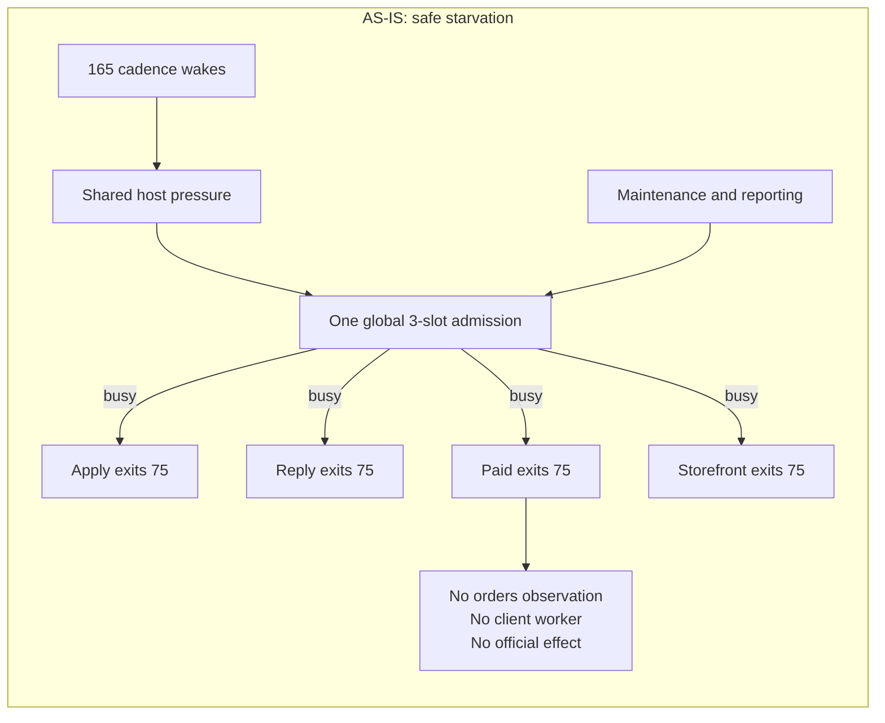
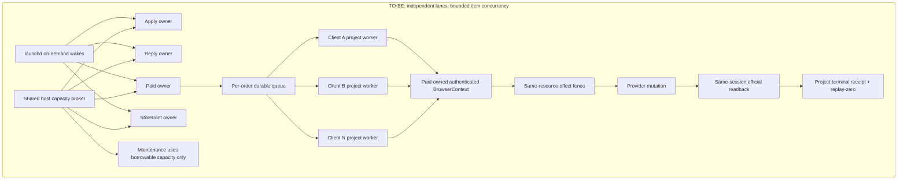

# Gig revenue program — current execution SSOT

This file contains only current truth and remaining work. Completed incident detail is preserved in Git
history through commit `e2b30b8e10`; it must not be copied back into the active TODO. Evidence lives in
durable runtime ledgers and receipts, not in duplicated historical checklists.

## Account 1 restart cursor

This is the only restart cursor for the next Codex session. Re-check every value against Git and official
runtime/provider readback before acting; conversation claims are not completion evidence.

- Canonical local repository checkout: `$LIFE_MANAGER_REPO`, remote
  `Daisuke134/life-manager`. The folder name on this Mac is **`life-manager-main`**. No separate project or
  repository named `life-manager/` was created.
- Current task worktree: `<task-worktree>`, branch
  `docs/coconala-paid-apply-proof-20260916`, lease
  `ac1f02d45387233d8866ce7dbd62c01a5b1a28987c9e2614a873535c1d766f69`. This is a linked Git worktree of
  the same `life-manager-main` repository, not another project. The main checkout is currently on the unrelated
  Capify branch `capafy/account-plan-deck-offline-20260912`, so it remains read-only for this workstream.
- Canonical runtime source is `origin/main` at `0401cb6a34e89b32c5c1a7e637df0062b791e13c`. The newest
  immutable release is `$LIFE_MANAGER_RELEASES/20260916T165426-0401cb6a`; Apply is exact-loaded from it.
  Paid is exact-loaded from `2e0716c7`. PR `#5283` normalizes structured independent verifier evidence without
  weakening identity validation. PR `#5284` keeps older effect-started uncertain applications duplicate-fenced
  for background reconciliation instead of repeatedly deep-scanning them in the revenue foreground.
  PR `#5281` requires the owner to read the official buyer message before treating a redacted value as missing.
  PR `#5279` adds model-owned
  `required_outcomes` and deterministic owner/verifier `outcome_coverage`, so every current buyer outcome needs
  official effect/readback evidence before Coconala send. PR `#5276` makes each
  Apply refresh collect both `single:new` and `retainer:new`; PR `#5274` fills mandatory retainer screening
  answers through the existing shared application lifecycle; PR `#5275` moves the repeated full-history scan
  out of the foreground wake. PR `#5258` adds the
  official seller-last attachment wait reducer; PRs `#5252` and `#5254`
  add the revenue floor, legacy-reservation migration fence and Paid Account 1→2 Codex route; `#5250`
  browser/child-cleanup remains an ancestor. Reply and Storefront retain `0aba1191`.
  A natural Reply wake passed and a bounded Paid decision
  selected `codex/acct1/gpt-5.6-terra`.
  Do not create another runtime worktree or use the Capify checkout as source.
- Phase 2 replaces the v2 JSON scan with stdlib SQLite, adds durable FIFO reservations, child-PID claim
  handoff, same-owner/crash recovery, exact loaded-idle dispatch, retired/missing-owner cancellation, a
  default-v1 mixed-release gate and `lm-loop admission-v2-enable`. Final evidence is 500 sequential enqueues in
  1.872 seconds, 39/39 simultaneous enqueues persisted, 69 host tests, 464 loop tests plus 470 subtests, 67
  registry tests plus 100 subtests, exact stdlib CI discovery 434 tests, fresh read-only `ship`, and GitHub CI
  8/8 PASS. Earlier JSON 500-enqueue evidence was 35.93 seconds.
- Current spec file in this worktree:
  `<task-worktree>/skills/earn/gig/TODO.md`. Its repository-relative
  canonical path is `skills/earn/gig/TODO.md`; after merge the same file is available under
  `skills/earn/gig/TODO.md`. Do not create a second live TODO.
- Coconala is not complete. Ryu's latest three-message buyer cycle was completed with one ordinary Coconala
  seller message, formal delivery OFF and official talkroom readback. The next natural Paid wake observed all
  four active rooms with `effect=0`, `readback=4`, `failed=0`; Ryu was `deduplicated=true`. The earlier orphaned
  browser lease was released manually, so automatic orphan-lease recovery remains a separate shared-runtime
  acceptance gap. Chii's direct execution ledger contains
  288 exact-readback sends,
  the previously verified ledger contains 12, and the official Sheet contains 300 unique rows. The 300-row
  workbook was sent to Coconala with formal delivery OFF and read back in talkroom `18180857`. Chii is now
  buyer-waiting and no existing recipient or completion message may be resent. The pre-batch `12/288` file is
  superseded historical state, not another client-work project.
- Paid now tries the existing Account 1 Codex profile first and falls back to Account 2 through the shared
  runner; the first bounded Account 1 receipt is proved. Preserve both accounts and all unrelated sessions.
- First safe action: let the `0401cb6a` Apply owner finish and prove replay-zero for its four new official
  effects on the next natural wake. Continue both `single:new` and `retainer:new`; the latter had zero active
  cards in the last authenticated observation, so a screening-answer effect cannot yet be claimed. Then resume
  shared admission/cadence and owner-scoped browser teardown, including natural orphan-lease recovery. A natural
  earlier `6e1dcc42` wake observed both
  `single:new` and `retainer:new` in one snapshot, found the current retainer page empty, and completed six
  eligible one-off applications with six official applied-list readbacks, zero failures and zero pending.
  The prior ULID retainer attempt remains duplicate-fenced; retry it only if a fresh official listing makes it
  active and the old no-click evidence reconciles safely.
  The durable full-history cursor is page 29 after 28 pages, 527 cards and 14 hash-bound chunks, with all 54
  uncertain intents unchanged. Paid's current four-client set is closed by a natural
  `172d3f2e` replay-zero pass. Admission protocol `2` is live and one four-lane overlap is proved, but the
  24-hour/seven-day fairness and no-starvation gates remain open.

## Outcome

Life Manager autonomously earns attributable revenue across Coconala, Lancers, CrowdWorks, Mercor,
Freelancer.com, Upwork and newly discovered platforms. Every supported lifecycle runs 24/7 without Dais or
Codex babysitting, shares one runtime and marketplace kernel, resumes from durable state, verifies official
effects, prevents duplicates, heals failures and improves itself. The first measured revenue gate is USD
10K MRR; applications, health checks and projected value do not count as revenue.

## Gig-platform As-Is / To-Be

This table is the compact platform truth. “Registered” means a loop exists in the registry; it does not mean
that the provider currently has an authenticated account, a verified external effect, or attributable revenue.

| Platform | As-Is now | To-Be finish condition |
|---|---|---|
| Coconala | Apply is exact-loaded from `0401cb6a`; Reply and Storefront retain `0aba1191`; Paid is exact-loaded from `2e0716c7`. Ryu's latest ordinary message is officially read back and a natural Paid wake replayed zero across four rooms. Apply's current `0401cb6a` run observed both one-off and continuous sources; four eligible one-off applications have official exact-ID readbacks, zero failures, while old uncertain intents stayed duplicate-fenced for background reconciliation. The continuous page had zero active cards. Reply's latest retained pass observed 179 threads with 164 official readbacks and 15 pending. Static five-finite-run capacity, only two durable revenue-priority owners, and manual orphan-lease recovery leave 24/7 no-starvation/self-heal unproved. | Every active client has its own durable work item, newest-buyer coverage, provider effect/readback, replay-zero and payout attribution; every lane meets its cadence without a fixed global-slot bottleneck, and one client's failure never pauses another lane. |
| Lancers | Application, browser, negotiation, paid, storefront, work-sync and report owners are registered. Production fixes exist in main, but durable login and the full Apply→Paid→payout proof are not closed. | One persistent account/browser owner runs the complete lifecycle with official proposal, work, payment and payout receipts. |
| CrowdWorks | Application, Reply, Paid and Report owners are registered. Reply is proposal-only after the contract-ID handoff; Paid owns post-contract work and effects. The latest Paid owner run is admission-blocked before child execution with zero provider effect/readback. A fresh read-only provider inventory returns five exact funded contracts; historical delivery receipts remain replay-fenced until current milestone state is read back. | Apply owns proposals; Reply owns pre-contract negotiation/acceptance; one Paid owner owns all post-contract replies, work, quality, external submit, formal delivery and revision for each contract ID. Report remains internal. Each item reaches exact official receipt, acceptance, payout and replay-zero; Storefront is `not_applicable` unless officially observed. |
| Mercor | Application, Reply and Paid owners are registered, but repeated-login/authentication and full contract proof remain open. | Persistent authenticated account state, application, reply/interview handoff, contract, paid work and payout are independently evidenced. |
| Freelancer.com | Runtime work is registered in the fleet, but current provider account/policy and end-to-end revenue proof are not closed. | Official account/policy state plus Apply→Reply→Paid→payout, with Storefront only if officially supported. |
| Upwork | Browser/application/report infrastructure and historical evidence exist, but current account/policy and paid attribution are not a closed revenue loop. | Official proposal, reply, contract, delivery/payment and payout receipts with duplicate-zero replay. |
| Writer / other gig surfaces | Writer owners and shared publication/payment ledgers exist; each provider still needs current authenticated opportunity, submission and payment proof. | The same shared observe→decide→act→verify→persist loop drives every provider; only thin provider adapters differ. |
| New platforms | Discovery and adapter-generation owners exist, but no platform is promoted merely because it was found. | A new provider is promoted only after policy qualification, thin shared-contract adapter, canary, official effect/readback, replay-zero and positive unit economics. |

### Two finish-line differences

1. **External work versus canonical truth:** Chii's external workbook message is sent and buyer-waiting; its
   old `12/288` file is historical evidence only. Ryu's verified live-site result and later Coconala seller
   message are now bound by an exact official readback and replay fence.
2. **One client versus the fleet:** Coconala's Chii send is one client-level milestone. The program is finished
   only when every applicable platform/client independently passes the same effect, readback, replay-zero,
   payout and long-run self-healing gates. They run concurrently; the completion criteria are not collapsed into
   one serial queue.

## Non-negotiable contracts

- Scheduler registration and a PID are not health. Every wake ends with a bounded terminal receipt.
- Each client is an independent work item. Clients, lanes and platforms run concurrently.
- Every external mutation uses prepare -> effect fence -> official readback -> terminal receipt -> replay-zero.
- Uncertain effects are reconciled officially before retry. Never guess and never duplicate.
- Buyer conversation, files, requirements and decisions are cumulative durable context.
- Shared runtime, browser leasing, Telegram, Calendar, receipts, evals and marketplace lifecycle are reused.
  Providers implement only thin official-surface adapters.
- KYC, interviews and person-bound media may use typed minimal-human Telegram handoffs. Everything else is
  autonomous. Meetings are added to Google Calendar with the join URL and a five-minute reminder.
- Never fake applications, messages, delivery, spreadsheets, revenue or readback.
- Do not apply for work whose required numerical outcome cannot be delivered within the paid scope. Prefer
  concrete artifacts and services whose completion is controllable.
- A historical seller message is never proof that a talkroom is currently handled. Completion requires the
  newest official buyer event to be covered by a later seller effect and official readback. If durable
  `next_action` conflicts with a newer buyer-event digest, the buyer event wins and the item returns to work.
- Chii is buyer-waiting after the official room read back the 300-row workbook. Never invent recipients,
  sends or spreadsheet rows, and never replay an existing recipient or completion message.

### Evidence correction for the earlier “300 complete” report

The earlier report mixed two different snapshots: the canonical Paid result still said `12/300` while a later
manual owner run wrote 288 `sent` rows with per-recipient official TikTok readback to
    `$LIFE_MANAGER_GIG_ROOT/projects/18180857/delivery/tiktok-message-effects.jsonl`. Together with the prior 12
verified effects, the execution evidence supports 300 total sends; the official Sheet readback contains 300
unique rows. The ordinary Coconala message and workbook were then sent and read back in
    `$LIFE_MANAGER_GIG_ROOT/projects/18180857/evidence/paid-direct-live/paid-direct/18180857/answer/chii-300-send/`,
with `formal_delivery_control_checked=false`. The older `12/288` files remain historical input, not permission
to reopen work. The official later seller message and existing effect fences make the next action buyer-waiting
and replay-zero. Never resend an existing recipient or completion message.

## Shared architecture

The real repository folder is `$LIFE_MANAGER_REPO`. The tree below is a
**repository-relative To-Be ownership map**, not a new `life-manager/` folder and not a second project. The
current task worktree exposes the same relative paths under
  `<task-worktree>`.

```text
config/
runtime/
  scheduler/ admission/ queue/ workers/ effects/ browser/
  receipts/ observability/ self_healing/ self_improvement/
domains/
  marketplace/{apply,reply,paid,storefront}/
providers/
  {coconala,lancers,crowdworks,mercor,freelancer,upwork}/
loops/
  {revenue,platform_discovery,loop_builder,self_heal,self_improve}/
evals/
  {conformance,replay,fault_injection,revenue}/
skills/
docs/
```

## Fundamental scalability repair

### 1. Overview — what failed and why temporary fixes did not hold

The intended Loop Engineering contract is still authoritative: platforms and the four marketplace lanes
remain independent owners; each lane advances independent applications, talkrooms, listings or orders with
bounded workers; only the same exact provider resource/effect is serialized. Shared runtime owns resource
accounting, model routing, browser leases, receipts and recovery, but it must not become a business queue that
allows one lane or maintenance owner to pause an unrelated lane.

The current failure is architectural, not one Coconala selector bug. The fleet first allowed too many heavy
wakes to run concurrently and exhausted CPU, memory, browser and disk resources. The response added one global
finite admission ceiling. That protected the host from unbounded fan-out, but it also allowed unrelated
maintenance owners to consume every slot. Revenue wakes then terminated safely before provider code, so the
system changed from "work until the host crashes" to "do no work while reporting bounded deferrals." Later
release/reconciler fixes improved individual boundaries but did not restore the primary invariant: every funded
client and active buyer thread must keep making durable progress while unrelated work continues.

Observed evidence for this failure class:

| Boundary | Current evidence | Why it prevents revenue |
|---|---|---|
| Fleet | 165 registered loops; host load remained about 192--222 with more than 100 runnable and zombie processes in observed snapshots | Many cadence-aligned Python/browser wakes compete before useful work begins |
| Host | macOS displayed application-memory exhaustion; ChatGPT and multiple Chromium processes consumed multi-gigabyte memory; disk reached 99%. Fresh owner-level RSS showed TikTok Chromium about 2.6 GiB, daily-driver about 1.8 GiB and gig-daily-driver about 0.6 GiB. CrowdWorks had two Chromium roots for the same profile/port `9228`, only one listener, and `/json/version` timed out. Three two-day-old orphaned Capafy Google Chrome headless process groups were terminated owner-scoped while their profiles were preserved. | Startup, browser and memory probes stall or time out; duplicated or orphaned browser owners retain memory after their useful work ends |
| Permission | A Python 3.14 cross-application data-access prompt was visible | A runtime child may wait for an unresolved TCC decision instead of producing a receipt |
| Admission | Protocol `1`, total finite capacity `3`; observed slots were owned by non-Coconala maintenance/work owners while Coconala repeatedly returned `resource_control_busy`, `resource_capacity_busy` or `memory_headroom_unavailable` | A global safety primitive became a cross-lane wait and violated outer parallelism |
| Release | Current is `b8cff053`; all four Coconala lanes remained installed from `3fbe7554`; the current reconciler had a running receipt but no terminal result | Safety fixes exist in main but have not reached the revenue owners |
| Paid | Latest provider-level summary failed at `orders_observation` with `observed=0`, `effect=0`, `readback=0`, `failed=1`; later wakes stopped at admission | Paid has no current order inventory or buyer-visible progress |
| Inner parallelism | Paid implementation still states one order per pass because evidence paths are lane-global, while the Paid recipe requires project-scoped concurrent orders | One client can monopolize or block the lane; evidence cannot safely coexist |
| Retained context | A Coconala room received a review ZIP acknowledging 15 attachments and was later asked to upload the same attachments again | Durable attachment references and verified bytes were not carried into the next decision |
| Contract execution | A CrowdWorks buyer supplied a work link after contract acceptance while the reply/upload form remained empty | Contract acquisition did not create a durable fulfillment work item that reached submit/readback |

### 2. As-Is / To-Be





TO-BE preserves the existing independent launchd owners. It does not add a fifth business scheduler or one
global marketplace queue. The shared host broker performs resource accounting only. Every revenue lane owns a
non-stealable minimum budget; maintenance may borrow unused capacity but is preemptible and may never consume a
funded-client guarantee. Within a lane, workqueue fairness, per-item backoff and project-scoped claims bound
physical concurrency without destroying logical concurrency.

Every client/order owns its own state, run namespace, attachment registry, artifact, effect intent, lease,
heartbeat, terminal receipt and official readback. Artifact building, reasoning and reconciliation may proceed
concurrently. Only the short authenticated mutation against the same provider resource is serialized. A browser
lease may delay that mutation without changing an unrelated client to failed or blocking its non-browser work.

launchd remains an on-demand alarm. Every wake performs one bounded durable transition and exits. Long waits are
persisted as `next_eligible_at`; they do not retain a Python process, browser tab, admission slot or Telegram
send. Runtime health uses process identity plus heartbeat plus durable progress, never PID existence alone.

### 3. Non-negotiable architecture and ownership contracts

1. `runtime/loop` MUST remain the only lifecycle, admission, retry, receipt and recovery implementation.
2. Each platform/lane MUST keep an independent owner, state root, BrowserContext and lease identity. No sibling
   lane may wait for or restart another lane.
3. Host admission MUST enforce a measured hard ceiling and independent reserved minimums. Maintenance,
   reporting, Telegram, cleanup and discovery MUST be borrow-only and preemptible.
4. Every work item MUST remain visible when deferred. Capacity may change `next_eligible_at`; it MUST NOT drop
   the item, hide it from aggregates or turn it into a successful no-op.
5. Paid MUST use project-scoped claims and bounded concurrent workers. Lane-global evidence files and a
   lane-wide order lock MUST NOT define the unit of work.
6. Retained official attachment references and verified bytes MUST be cumulative. Missing local bytes trigger
   internal official recovery; the buyer MUST NOT be asked again for an attachment already received.
7. Browser memory MUST be owner-accounted. Context/tab cleanup is owner-scoped; no global Chromium, GUI,
   WindowServer, loginwindow or host restart is a valid recovery action.
8. A memory probe timeout MUST be classified separately from observed low memory. Both remain effect-zero, but
   only measured pressure may drive capacity reduction. Control-plane probes and TCC preflight remain bounded.
9. Release handoff MUST be terminal-driven per label. A completed owner moves to the next compatible immutable
   release before its next wake; the fleet must not depend on a reconciler finding a tiny idle polling window.
10. Completion MUST be buyer-visible/provider-visible effect plus official readback and replay-zero. Scheduling,
    PID, start receipt, queue selection, draft, click or Telegram report is not progress.
11. A funded client or fresh buyer event that has no official seller progress for two intended cadences MUST
    trigger a shared repair event, reclaim only stale owned resources, prioritize that item and continue without
    human babysitting.
12. Local and hosted variants MUST use this same logical loop, schema, recipe, effect fence and tests. Only the
    host supervisor, durable store, secret store and browser transport may differ.
13. Every continuation MUST read the active goal before repository work and verify expected worktree path,
    branch, upstream, commit floor, lease and dirty state. A shared checkout or mismatched branch is read-only
    and MUST fail closed before edits. Missing files in that checkout MUST NOT be treated as absent from
    `origin/main`.

### 4. Acceptance criteria and test matrix

| # | Acceptance criterion | Required test/evidence |
|---|---|---|
| 1 | One slow or failed lane cannot alter another lane's schedule, state, BrowserContext or progress | `test_one_lane_failure_does_not_pause_siblings` plus four concurrent natural wakes |
| 2 | Maintenance cannot consume a revenue lane's reserved minimum; unused capacity remains borrowable | `test_maintenance_capacity_is_borrow_only` and saturated-host canary |
| 3 | Global host load remains bounded without converting pressure into fleet-wide revenue starvation | `test_partitioned_admission_preserves_revenue_progress` plus measured CPU/memory/process trend |
| 4 | Different Paid orders own different namespaces and run concurrently; the same order is stingy/exactly-once | `test_paid_orders_use_project_scoped_concurrent_claims` |
| 5 | One blocked Paid order remains represented while another order reaches official readback | `test_blocked_paid_order_does_not_block_ready_order` |
| 6 | A previously received attachment is never requested again; missing bytes use internal recovery | `test_retained_attachment_is_recovered_without_buyer_reask` using the observed 15-attachment case |
| 7 | A contracted CrowdWorks instruction becomes a fulfillment item and reaches submit/readback | `test_contract_instruction_creates_fulfillment_work_item` plus exact provider receipt |
| 8 | Probe timeout, real low memory, TCC denial and TCC pending are distinct terminal reasons | `test_host_preflight_failure_classes_remain_distinct` |
| 9 | Terminal release handoff updates one exact idle label without restarting siblings or losing state | `test_terminal_release_handoff_is_label_scoped` plus loaded argv/readback |
| 10 | Every active client independently covers its newest buyer event, official effect and replay-zero | Client-by-client official matrix for Ryu, both Kokoro contracts, Chii and Atsugi |
| 11 | Apply, Reply, Paid and Storefront continue across reboot and one owner crash | Four-lane reboot/fault-injection canary |
| 12 | The same contracts hold at fleet scale | 500-loop admission test, 24-hour canary, then seven-day soak with zero starvation and zero duplicate effects |
| 13 | A handover resumes only in its named worktree/branch and refuses the Capafy/shared checkout | `test_handover_worktree_route_fails_closed` plus HEAD/upstream/dirty-state receipt |

E2E judgment:

| Item | Value |
|---|---|
| UI change | None in the shared runtime repair; provider UI is the official effect/readback surface |
| Maestro | Not applicable; required E2E is natural launchd wake plus real provider readback because this is a macOS/background marketplace system |

### 5. Boundaries

- DO NOT replace the four lane owners with one monolithic business scheduler.
- DO NOT create Coconala-, CrowdWorks-, Lancers- or Mercor-specific admission/retry/receipt frameworks.
- DO NOT raise global concurrency or create more browser processes as a substitute for ownership and fairness.
- DO NOT kill unrelated processes, global Chromium, ChatGPT/Codex, the GUI session or the host to pass a test.
- DO NOT weaken effect fences, official readback, formal-delivery authorization, attachment integrity or
  replay-zero to increase throughput.
- DO NOT mix Capafy work, its branch or its dirty files into this workstream.
- DO NOT create another implementation worktree while the existing runtime-admission worktree is clean,
  same-task owned, process-free, PR-free and safely fast-forwardable to `origin/main`.
- DO NOT activate admission protocol `2` until its capacity model satisfies the lane-independence and
  maintenance-borrow-only contracts above.

### 6. Execution order and rollout rule

Order change reason: the previous cursor was fleet convergence -> protocol `2` activation -> natural fairness
proof -> Coconala. Live evidence now proves the current global admission semantics can starve every revenue
lane. Activating them unchanged would make the regression durable. The new cursor repairs the shared capacity
and per-client progress invariants before activation while leaving independent provider effects uninterrupted.

Old order:

```text
finish release convergence -> activate protocol 2 -> prove fairness -> resume Coconala
```

New order:

```text
freeze protocol 1
-> capture three production regression fixtures
-> partition host capacity and remove maintenance/revenue coupling
-> restore project-scoped Paid concurrency and attachment retention
-> prove Coconala four-lane/client canary
-> activate the corrected protocol 2
-> 24-hour and seven-day fleet proof
-> continue platform revenue order
```

Current cursor: main `172d3f2e` is exported as immutable release `20260916T073615-172d3f2e`; Paid is
exact-loaded from it while the unaffected Coconala labels retain `0aba1191`. A four-owner overlap was observed,
Reply later terminated `pass`, and Paid
selected `codex/acct1/gpt-5.6-terra`. The authenticated orders-only snapshot contains four open rooms: Chii,
Ryu and the two Kokoro contracts. Chii's 300-row workbook is later than its buyer complaint; both Kokoro rooms
have later independent seller artifacts; Atsugi has buyer acceptance plus formal-delivery readback. Ryu's latest
buyer event is now covered by one later ordinary seller message, exact official readback and a standard replay
fence. Kokoro `18250352` also completed its newer email request: Gmail SENT and all 11 attachments passed
independent byte-for-byte readback, then Coconala received one later report with formal delivery OFF. A natural
Paid wake at `2026-09-15T23:09:25Z` observed all four open rooms with `actionable=0`, `effect=0`, `readback=4`,
`failed=0`, `pending=0` and terminal `pass`. Apply's planner schema defect (`required` incomplete, then unsupported
`allOf`) is fixed by PR `#5262`, live Codex output-schema probe PASS, and immutable release
`20260916T082615-427972bf` is loaded. Four idle CrowdWorks revenue labels were reconciled to the same protocol-2
release, removing the observed mixed-release borrower gate. A later natural Apply wake passed, judged five
new listings correctly as prohibited, and retained exactly 54 duplicate-fenced intents. PRs `#5265`-`#5268`
add CAS-frozen, ledger-first, contiguous and resumable official-history reconciliation. Two incorrect page-1
absence runs changed 54 intents; both were restored exactly from their CAS-bound recovery archives before the
resumable release was loaded. Production scan state is now page 3 with all 54 still PREPARED.
Do not create another worktree, edit the Capify checkout, globally kill browsers/apps, or call a process receipt
a provider effect.

### Ideal steady state

```text
launchd wake (each lane, 1–5 min)
        ↓
shared host broker: hard ceiling + revenue floor (maintenance borrows only)
        ↓
lane owner: one persistent browser owner per platform/account
        ↓
client work item: observe → model decides → effect fence → official readback
        ↓
terminal receipt + durable cursor → next wake
```

The four Coconala lanes and every future platform lane remain independent owners. A slow or failed client
only returns its own item to durable retry; it does not hold another client's browser, state, slot or effect
fence. “24/7” means these bounded wakes keep resuming forever; it does not mean one immortal process or
unbounded simultaneous Chromium tabs. Capacity is increased only after measured headroom and replay-zero,
never by deleting the guard.

## Current measured state

### Live correction (re-read before every mutation)

- `origin/main` is `172d3f2eaa4fedb815d0b8515f6454ab55ebe9a1`; Paid is exact-loaded from
  `$LIFE_MANAGER_RELEASES/20260916T073615-172d3f2e`. Other Coconala labels retain their already-loaded
  `0aba1191` release because this patch changes only Paid.
- Admission protocol `2` is live. A four-Coconala-owner overlap is observed; Reply has a natural `pass`, and
  Paid selected Account 1. This proves one recovery slice, not 24-hour fairness or provider completion.
- Reply observed 179 threads, produced 164 official readbacks and left 15 pending with effect zero. Apply and
  Storefront are running current-release provider passes. Their eventual terminal/provider receipts remain open.
- PR `#5258` fixes Chii's stale-state reopen defect and passes the complete Paid test file (`211 passed`). It is
  loaded in production. The current wake did not spawn Ryu or Chii work owners. Ryu's verified ordinary message
  was sent once with formal delivery OFF and a later exact selected-talkroom readback; its standard handoff
  receipt now resolves to `awaiting_buyer`. Kokoro `18250352` completed its Gmail effect, independent verifier,
  Coconala report and exact readback; the same digest resolves `completed` with no replay.
- The canonical runtime repair is now in main through PRs `#5244`, `#5246`, `#5247`, `#5248` and `#5249`; do not report the old
  `b8cff053`/protocol-1 snapshot below as current.

### Shared host/runtime

- PRs `#5194` through `#5199` are merged. Current main is
  `b8cff053255f840cc02405c886bd4974005586cc`, published as full immutable release
  `$LIFE_MANAGER_RELEASES/20260915T061515-b8cff053`. The release reconciler now covers both complete
  provider routes, changes only loaded-idle labels, skips running and unloaded labels, runs outside saturated
  data-plane admission, reconciles the local complete release before any remote fetch, bounds fetch with the
  existing portable process-group timeout, narrows Git negotiation to `origin/main`, and uses the release-pinned
  Python for its nested `lm-loop` CLI. Each PR passed its focused tests and GitHub CI 8/8. Production proved the
  old unbounded fetch could run beyond ten minutes, the bounded replacement emitted `entrypoint_exit_124` with
  no orphan Git children, and `control_plane_exempt` wrote an effect-zero host receipt. The first natural wake
  of the final `b8cff053` release is currently running; its two route summaries, terminal receipt and resulting
  exact fleet mismatch count remain open and must be read back before protocol activation.
- Admission remains protocol `1`. The latest read-only snapshot observed three live owners
  (`affiliate-source-refresh`, `writer-opportunity-response`, `job-search-daily`) and one legacy ticket
  (`article-resume`). Host load was about `192`, memory-free readback was `30%`, and the data volume was `99%`
  full with about `2.7 GiB` available. All four Coconala owners remained installed from `3fbe7554`; Apply was
  loaded-idle with last exit `75`, while Reply, Paid and Storefront had running wrappers and last exit `75`.
  The `b8cff053` release reconciler still had only a running event, not a terminal summary. These observations
  supersede the earlier owners `2` / tickets `0` snapshot but may change naturally; re-read before mutation.
- PR `#5193`, main SHA `3fbe75546d720add1bfa465731ddc94353b662b5`, is merged and published as
  immutable release `$LIFE_MANAGER_RELEASES/20260915T025232-3fbe7554`. The safe two-stage rollout keeps
  protocol `1` until every finite label is exact-loaded from this capability-2 release. Initial loaded-idle
  reconciliation completed with failures 0: deterministic had 53 eligible results, 44 changes and nine
  snapshot-race running skips; shared-agent-runner changed 33 labels. A later targeted pass moved Coconala
  Apply, Reply, Paid and Storefront to the new release after each old wake ended naturally. Repeated current-SHA
  natural wakes now write bounded effect-zero `host_admission_deferred:resource_control_busy` terminal events;
  they do not yet prove business recovery or official provider readback. That rollout snapshot reduced finite
  installed mismatches from 51 to 38 and observed protocol `1`, owners `3`, legacy tickets `4`; those counts are
  historical. V2 activation, natural fairness, recovery, replay-zero and 24-hour proof remain open.
- PR `#5192`, main SHA `6a901db5011da29a05ef91422c7ee745c8fa6e51`, is the compatibility-first
  admission rollout. It preserves future-version durable tickets during mixed-release convergence and records
  the exact bounded admission reason instead of collapsing every deferral to `host_admission_deferred`.
  Its exact head passed 31 focused tests, 493 runtime tests plus 470 subtests, all CI and fresh read-only review.
- The first targeted Paid wake on `6a901db5` started normally and terminated without an external effect at
  `2026-09-14T14:02:40.631497+00:00` with
  `host_admission_deferred:memory_headroom_unavailable`. It did not observe or reply to Ryu. This proves precise
  classification, not recovery or client completion.
- Durable fairness implementation is merged, but production activation and natural proof are still open. The
  lock-protected path is `queued -> dispatch_reserved -> claimed -> running -> released`, with monotonic
  sequence, reservation lease recovery, child-PID ownership and out-of-lock target kickstart. Protocol `1`
  remains the correct production mode during mixed-release convergence.

- PR `#5184`, main SHA `b8de9bf2d230514587bb455f59a3e866ec27f658`, fixes scheduled resource
  admission. Busy wakes attempt once, retain no ticket, write effect-zero deferred state and exit `75`.
- PR `#5186`, main SHA `3e7b77714d92e179806970d353f7c9db2f8dfed6`, removes every external
  process-identity probe from the shared admission critical section. It snapshots all identities once outside
  the lock, fails closed on snapshot failure and preserves rows created during the snapshot. Race tests,
  100-ticket scale coverage, 47 host tests, all CI and a fresh read-only review pass.
- PR `#5187`, main SHA `59bd6cddaf2768a98da6373480043672db657713`, makes explicit-loop
  reconciliation read only the requested launchd labels instead of enumerating the full fleet. Production
  read-only latency fell from about 37 seconds to 1.4--2.4 seconds; 70 tests plus 30 subtests, all CI and a
  fresh read-only review pass.
- PR `#5188`, main SHA `d80e7359127a9bc591463ee4b6b3ea2528f8639a`, removes synchronous evidence
  garbage collection from Apply's revenue-critical path. The observed old run spent about 28 minutes scanning
  412 MiB and reclaimed zero bytes because it was below the 400 MiB high watermark. GC now has an independent
  six-hour deterministic owner, and active evidence is protected by a PID plus process-start-identity pin.
- PR `#5189`, merge SHA `0a7b8c8b75899137bf28236e3c2e47fe1a3a0a91`, removes recursive run-tree
  cleanup from every business wake. Per-run scratch is created through state-root-anchored directory FDs;
  terminal evidence is protected before business execution; only exact PID plus process-start identities are
  reclaimed by the central owner. Ancestor symlink, run replacement, terminal-write failure and no-clobber
  races are covered. Targeted 45 tests, the 425-test runtime suite, all CI and fresh Terra architecture review
  pass.
- Immutable release `$LIFE_MANAGER_RELEASES/20260914T211512-0a7b8c8b` is current. The preceding
  `3e7b7771` loaded-idle rollout reconciled 57 deterministic and 40 shared-agent-runner labels with zero
  failures; target-only convergence to `59bd6cdd` has begun and running owners are skipped, not restarted.
- Idle rollout succeeded cumulatively for 96 label installs with zero reconcile failures. The latest
  convergence pass updated 11 deterministic and 12 shared-agent-runner labels; old-release running owners
  were skipped, not restarted, and continue draining naturally.
- Legacy root cause is proved: blocking waiters retained one process and ticket per wake; a waiter could hold
  the global control lock while an unbounded `/bin/ps ... lstart=` identity probe stalled every resource
  class. The new release bounds that probe to two seconds and fails conservatively as live.
- Read-only process sampling confirmed that the legacy drain, rather than the new release, caused the long
  wait: Paid PID `6856` and Apply PID `42143` spent every sampled stack in blocking `flock` on the shared
  `control.lock`. Paid then exited naturally, reconciled to `3e7b7771`, and its first natural new-release wake
  ended with bounded `host_admission_deferred`. Apply PID `42143` subsequently acquired the agent resource and
  now runs its real `application_direct.py --all-eligible` child; it is no longer blocked on `flock` but remains
  on old release `d74258a8` until that business run ends naturally.
- Coconala Reply and Paid are installed on current `d80e7359` and are executing natural wakes. Their previous
  wakes independently ended exit `75`,
  `host_admission_deferred`, loaded-idle, with no retained new-release ticket. Contention safety passes;
  later natural resume and official business readback remain open.
- Coconala Storefront is installed on current `59bd6cdd`. Its first natural current-release wake
  `18d526f7b56f7b80-33558` emitted started and bounded terminal `host_admission_deferred` receipts in 16.6
  seconds with no external effect. Target reconciliation applied exactly this idle label with zero failures;
  later natural resource acquisition, official listing readback and replay-zero remain open.
- The legacy queue is draining rather than growing: read-only polls measured `19`, `18`, `11`, then `10`
  retained tickets. Current memory admission itself passes at
  `free_percent=31` against `minimum_free_percent=15`; the remaining backlog is legacy process/ticket drain,
  not evidence of current physical-memory rejection. Coconala Storefront PID `60168` ended naturally and
  the lane is installed on `b8de9bf2`; two new-release wakes ended with bounded terminal deferral and retained
  no legacy ticket or owner. Paid is now reconciled; Apply PID `42143` remains live on an older release and
  must end naturally before target-only loaded-idle reconciliation.
- Disk availability recovered from `1.1 GiB` to `4.0 GiB`. Only clean, unused, regenerable external clones,
  main-contained temporary clones, three completed merged worktrees/branches/owned leases, and one missing-worktree
  registration were removed. Codex/cloud sessions, credentials, browser profiles, memory, state, ledgers,
  receipts, active evidence and other agents' worktrees were untouched. The retained legacy ticket count later
  fell to `7`; zero remains the completion gate.
- The dedicated `hf-gig-apply-evidence-gc` owner is installed on `d80e7359`, loaded-idle with exit `0` and a
  six-hour cadence. Apply PID `42143` remains on `d74258a8` and continues its pre-deployment business run; it
  is not interrupted. Storefront likewise remains running on `59bd6cdd` until its wake ends naturally.
- Target rollout of `0a7b8c8b` succeeded for Paid, Reply, Apply-evidence-GC and disk-cleanup without restarting
  a running owner. Paid then started from launchd without a kick and wrote a start receipt followed 16.3 seconds
  later by an effect-zero `host_admission_deferred` terminal receipt. It retained no admission ticket.
- A second shared startup bottleneck is now measured rather than inferred: Paid took about 149.7 seconds from
  launch to its start receipt while a one-second stack sample remained in Python import/compile. Immutable
  releases cannot write adjacent bytecode, so every wake recompiles shared runtime modules under host pressure.
  Disk-cleanup separately exited `78` before its start receipt because `process_start()` could not obtain the
  owner identity. These are the next shared-runtime cursor; neither is a Coconala-specific selector problem.
- PR `#5191` is merged at main `3a21ba280931757fbfd9adb4f3695ec36ab48b47` and release
  `20260914T220710-3a21ba28` is current. It builds checked-hash bytecode before sealing each immutable release,
  records and pins the exact runtime Python, verifies its cache tag during apply, obtains Darwin process-start
  identity through native `proc_pidinfo`, and removes fleet-wide `ps` enumeration from every admission wake.
  Fresh Astra review returned `ship`; the exact head passed 492 tests plus 470 subtests and every required CI
  check. Reply and disk-cleanup reconciled while idle; Apply, Paid and Storefront were observed running and were
  deliberately left on their installed releases to drain naturally.
- Reply's first observed natural wake on `3a21ba28` launched successfully but terminated at
  `2026-09-14T13:11:39.278302+00:00` with `host_admission_deferred`, exit `75`, and external effect zero.
  Therefore release startup identity/bytecode is shipped, but natural pressure recovery is not yet proved and
  the 15 nonterminal talkrooms have not advanced on this wake.

### Coconala

The matrix below is the durable client set. The authenticated orders-only snapshot currently reports four open
rooms; Atsugi remains listed because its accepted formal delivery is still settlement-relevant. Ryu `18211957`
is buyer-waiting after the latest ordinary seller message and a natural zero-effect replay.

#### Current active-client inventory

This is the retained official-state candidate set, not a claim that every newest message has been handled.
The next admitted Paid/Reply observation must refresh each row from the official talkroom before any completion
claim. One buyer may own multiple independent contracts.

| Buyer | Talkroom | Retained official state | Current unresolved condition |
|---|---:|---|---|
| Ryu0820119 | `18211957` | `取引中`; latest correction report sent, formal delivery OFF | Buyer-waiting. The latest three-message cycle has owner/verifier outcome coverage, one later ordinary seller message, official exact talkroom readback and a natural zero-effect replay. Reopen only for a newer buyer event. |
| こころ支援 NPO法人まくとぅー | `18223833` | `取引中` | Independent v4 seller artifact is later than the retained buyer input. Buyer-waiting; replay zero unless a newer buyer event appears. Never ask again for retained files. |
| こころ支援 NPO法人まくとぅー | `18250352` | `取引中`; email effect and Coconala report completed, formal delivery OFF | Gmail SENT readback proves 11 buyer-source attachments, the independent verifier downloaded and byte-matched all 11, and the later Coconala seller message matches the current buyer digest. Replay-zero passes for the same digest. |
| Chii【CK protect】 | `18180857` | `取引中`; 300-row workbook sent, formal delivery OFF | Buyer-waiting. Do not resend any recipient or completion message; reopen only for a newer buyer event. |
| あつぎ | `18171850` | `納品確認待ち`, formal delivery confirmed | Buyer explicitly accepted delivery and the later seller formal-delivery message is read back. Settlement/payout attribution remains; reopen work only for a newer buyer event. |

`逃げ因子` talkroom `18211838` is excluded because retained official state is `取引完了`. Historical
projects with `unknown` state are not promoted into the active set; an authenticated orders observation must
do that.

- Apply one-off `single:new` and continuous `retainer:new` are implemented through the same lifecycle.
- Shared browser acquisition is already repaired by merged PR `#5175` (`833b55b6`) and PR `#5177`
  (`6a9f3aa4`): slow CDP I/O stays outside the ledger lock and unrelated owners acquire under distinct
  task locks. The current `b8de9bf2` release contains that exact main implementation. Latest read-only
  health is `/json/version` in `0.025s`, `/json/list` in `0.017s`, and one lease against capacity `16`.
- Latest discovery failed before observation at the shared CDP lease boundary; this is not proof of empty
  inventory, logout or selector failure. Its 160-second timeout occurred on release `6a9f3aa4`; current
  health does not prove recovery until a later natural Apply wake completes official readback.
- Exactly 54 application intents are `prepared_unconfirmed`. Frozen source result:
  `gig-apply-direct-1789367873154753000-28060`; sorted IDs `5207298` through `5267876`; newline-list SHA-256
  `cd0610bb8daaf78c11ffd143a4688fad30edeff34188725aaa6867d935b8b2e5`. Reconcile every member
  against the official applied state before retry. Retained official readbacks match zero of these 54 IDs,
  so none can be confirmed or safely retired without one fresh authenticated official-history scan.
- PR `#5183`, main SHA `d74258a8ce25a834e1fff31b7e3dc01ac0b816ba`, makes Paid fail closed as
  `buyer_attachment_recovery_pending` instead of asking a buyer to re-upload when official attachment
  references exist but verified bytes are missing. Kokoro resumes only after all 15 files are verified.
- Latest durable Reply snapshot observed 179 talkrooms: 164 have official replay-zero/closed/no-reply
  readback, while 15 remain nonterminal (`pending=5`, `failed=10`). The ten failures are predominantly
  historical CDP context-creation timeouts; a fresh admitted Reply wake must reconcile them independently.
  A historical Ryu seller effect exists, but a newer buyer event is reported and is not covered by a later
  officially verified seller effect. Reconcile the newest digest before deciding whether to send; never resend
  a confirmed effect and never suppress a genuinely newer request.
- Coconala is not revenue-complete until Apply, Reply, Paid, Storefront and payout attribution all have fresh
  official effect/readback and replay-zero receipts.

## Remaining execution order

Platform/client owners remain concurrent. This list selects the engineering cursor; it does not serialize
independent production effects.

### Plain current checklist — authoritative summary

**Done:** Ryu, both Kokoro rooms and Chii are seller-last with official Coconala readback and replay fences;
Atsugi is settlement-only. Paid's later natural wake read back all four open rooms with no duplicate effect.
Reply has a natural terminal pass. Apply's earlier six one-off effects and the next four and three effects
each replayed zero on later natural wakes. Release `0401cb6a` produced seven new eligible one-off effects
across two runs, each with exact-ID official readback and no failure or pending result.

**Not done:** the prior ULID retainer attempt has no official submit/readback and remains duplicate-fenced;
the current continuous source had zero eligible candidates in the latest natural wake, so a fresh
screening-answer effect remains unproved. Fifty-four historical uncertain applications remain a
preemptible background reconciliation; Reply has 15 pending threads. Storefront's page-2 retirement
fix is loaded but its first natural run failed before the effect with browser WebSocket HTTP 500;
official Storefront effect/readback, demand and payout
attribution, 24-hour cadence, no-starvation, zombie-free browser teardown and every later platform remain open.

**24/7 acceptance:** every registered loop remains scheduled, but that alone is not success. Each applicable
lane must start within its declared 1–30 minute cadence, perform one bounded durable transition, write a terminal
receipt and exit. When one wake releases capacity, the next eligible revenue wake must start automatically.
Light deterministic work must not consume the same scarce capacity as browser/model work. Apply, Reply, Paid and
Storefront must all be revenue-priority owners. Maintenance may borrow unused capacity only. The static default
of five finite runs is not accepted as the final architecture; production must use measured resource-class
capacity and prove 24 hours without a missed revenue cadence or fleet starvation.

**Next order:** (1) keep one-off/retainer refresh live and prove a fresh eligible retainer screening-answer
effect when one exists, (2) repair shared admission/cadence and owner-scoped tab teardown, including
the currently failing Storefront browser connection and exact provider readback,
(3) resolve Reply 15 and Coconala payout, (4) reconcile the 54 historical
uncertain intents as preemptible background work without blocking current revenue, (5) prove all four Coconala
lanes for 24 hours, then (6) CrowdWorks paid contracts, Lancers, Mercor,
Freelancer.com and Upwork in that order.

### 1. Shared runtime production convergence and account 1 cutover — current cursor

- [x] Reuse the existing runtime worktree instead of creating another one. The APFS clone detector is merged
  as PR `#5244` and Storefront's inner-cadence removal as PR `#5246`; both are in `origin/main`.
- [ ] Finish the `0aba1191` four-lane canary. All four labels are exact-loaded and one four-owner overlap is
  proved; Reply has one natural `pass` terminal and Paid has an Account 1 receipt. Apply, Paid and Storefront
  still need their current natural terminal receipts and provider-level effect/readback. Then repeat under
  saturated maintenance and prove no sibling schedule/state/effect changed. PID or scheduler state alone does
  not close this item.
- [x] Chii Paid external delivery: export the official Sheet with 300 unique rows, send it once to talkroom
  `18180857` through the existing Coconala browser path, and read back the attachment and message with
  `formal_delivery_control_checked=false`.
- [x] Chii Paid closure: the 300-row workbook and ordinary Coconala message are read back with formal delivery
  OFF. Treat the client as buyer-waiting and rely on existing effect fences; do not build another adapter,
  reconciliation framework, recipient send or completion message for this one-off contract.
- [x] Merge/release the minimal shared Paid reducer fix that treats an official seller-last attachment as
  buyer-waiting only when buyer-visible artifact=true, pending artifact=false, no later buyer reply and formal
  delivery=false. PR `#5258`, main/release `172d3f2e`, complete Paid file `211 passed`, and the current
  production wake has no Chii owner.
- [x] Merge PR `#5257`, cut immutable release `20260916T070823-0aba1191`, and exact-load all four Coconala
  labels without restarting running siblings.
- [x] Natural Paid replay-zero: release `172d3f2e` observed all four open rooms with `actionable=0`, `effect=0`,
  `readback=4`, `failed=0`, `pending=0`; runtime terminal is `pass`, exit `0`, loaded-idle.
- [ ] Replace the fleet-wide fungible slot rule with shared hierarchical accounting: measured host hard
  ceiling, non-stealable lane/platform minimums, per-item limits, and maintenance/reporting/Telegram capacity
  that is borrow-only and preemptible. The staged `d75794b8a3` floor is the first minimal slice (four revenue
  slots, one borrow slot); it is not complete until the merged release proves no starvation and no hard-cap
  violation under natural wakes.
- [x] Merge/release the runtime floor and Account 1→2 failover. Main/release `0aba1191` is exact-loaded; a
  bounded Paid decision selected `codex/acct1/gpt-5.6-terra`. Account 2 remains the existing automatic fallback;
  neither account/session was deleted or overwritten.
- [ ] Add bounded owner heartbeat and durable-progress leases. A live PID without heartbeat/progress cannot
  retain capacity forever; recovery may reclaim only the exact owned claim after process-identity verification.
- [ ] Separate memory probe timeout, real memory pressure, disk pressure and TCC permission state. Apply
  owner-scoped browser/context/tab limits and recovery; never use global browser or host restart. Require every
  spawned browser child/process group to remain attached to one durable owner receipt and be reaped on every
  terminal path. Retain regression fixtures for the orphaned Capafy Chrome groups and the duplicate/wedged
  CrowdWorks `9228` roots.
- [x] Make Storefront a one-pass owner: launchd's 60-second cadence is the only repetition mechanism, so an
  inner `--auto-cadence` child cannot retain a revenue slot forever.
- [x] Make the disk governor identify closed APFS Chromium clones from one global open-path snapshot; active
  clones remain protected and closed clones are reclaimable.
- [ ] Convert Paid from one-order-per-pass lane-global evidence to project-scoped durable work items and bounded
  concurrent consumers. Serialize only the same exact order/effect and the short authenticated mutation.
- [ ] Make retained attachment references cumulative across wakes. Reuse verified bytes; recover missing bytes
  from the official source; prohibit buyer re-requests for already received files.
- [ ] Make contract acceptance/instructions create durable fulfillment work immediately so the CrowdWorks case
  and future providers cannot stop between contract and delivery.
- [ ] Replace idle-window polling as the release convergence dependency with label-scoped terminal handoff.
  Prove next wake uses the compatible current release without restarting a running owner or sibling.
- [ ] Re-run Coconala Apply, Reply, Paid and Storefront concurrently under saturated maintenance load. Prove one
  owner crash, timeout or blocked client does not change the other lanes' schedules, states or effects.
- [ ] Protocol `2` is already live. Prove FIFO within each lane, sleeping-head dispatch, crash recovery,
  cross-class progress, uncertain-effect reconciliation and duplicate effect zero over 24 hours, then seven
  days; do not treat activation itself as acceptance.
- [ ] Produce continuous terminal receipts and real official progress for 24 hours, then seven days, including
  reboot recovery and measured browser/CPU/memory/process ceilings. Any progress regression fails the rollout
  and restores the last proven release.
- [x] Prove the Paid Account 1→2 Codex route with one bounded invocation and retain both account sessions.
- [x] Roll the repository's Codex task classes to Account 1 first with existing Account 2 failover through
  PR `#5257`; route configuration and 71 agent-runner tests plus 93 subtests passed before merge.

Completed foundation retained as evidence: disk-headroom recovery; off-critical-path cleanup; checked-hash
bytecode and pinned interpreter; native Darwin process identity; SQLite durable reservations/dispatcher;
mixed-release compatibility; PR `#5193` and immutable `3fbe7554`; release-reconciler PRs `#5194`--`#5199` and
immutable `b8cff053`. PR `#5200` adds explicit revenue-before-borrow admission, PR `#5201` removes stale
pre-fetch release reconciliation, PR `#5202` lets revenue owners share the measured host-wide ceiling instead
of the borrow-only `agent=1` limit, and PR `#5203` applies the same rule during the v1 drain. Their natural
`77f80b3a` Paid wake acquired a slot beside unrelated owners, officially observed four rooms, and refreshed
Ryu `18211957` plus Kokoro `18223833`/`18250352` concurrently; it still ended `effect=0`, `readback=0`,
`pending=3` because targeted rows retained `delivery_action=none`. PR `#5204` routes those official targeted
rows back through the existing delivery queue and treats an explicit revision stage as work required;
immutable `287ccb88` is installed for the next natural Paid wake. These are supporting components, not proof
that buyer-visible progress is restored until that wake produces per-client effects and official readback.

PR `#5205` adds the safe protocol-`2` activation preflight: it preserves live protocol-`1` owners only after
every finite loaded program points to a structurally protocol-`2`-capable immutable release, including a mixed
set of compatible SHAs. Production activation correctly remains blocked by the still-running old Lancers
application owner; no active provider effect was killed to force convergence. PR `#5206`, merge SHA
`d2fc0a7bf369368078c04e93034b4e6328075ce3`, fixes the existing authenticated attachment collector without a
second framework: it removes the synthetic-event delay, skips file polling when no trusted control exists,
uses Page plus Browser download behavior, accepts a complete stable download when CDP byte counts agree, and
deduplicates only the same official attachment reference. Its focused Paid suite passed 199 tests. On the first
natural `d2fc0a7b` Paid wake, three targeted Coconala projects ran concurrently and saved fresh non-empty files:
Ryu `18211957` saved five, Kokoro `18223833` saved four in project `5242505`, and Kokoro `18250352` saved six.
The aggregate remains `pending=3`, `effect=0`, `readback=0`; file recovery is measured progress, not a client
submission. The current cursor therefore stays on those three project work items until their terminal receipts
and official effects exist.

The fixed host ceiling of three is a crash-containment baseline, not the target architecture and not proof that
all four Coconala lanes can make simultaneous progress. OSS code review confirms the reusable pattern: Hatchet
durable tasks free worker slots while waiting and attach a per-task slot cost; Temporal separates lightweight
workflow slots from resource-based activity slots; OpenBrowser and Steel broker persistent profile sessions
instead of launching one browser per loop; DBOS reserves polling/control capacity so data-plane saturation does
not starve recovery. Life Manager keeps its existing SQLite ledger and authenticated CloakBrowser path while
copying these small contracts: durable wait eviction, weighted task units, measured CPU/RAM admission, and one
browser broker per platform/account. Steel is the intended hosted browser transport. Installing a second local
workflow engine or replacing the logged-in Coconala profile during recovery is explicitly out of scope.

PR `#5207`, merge SHA `6ca2fc44668993b0ddec22b6a54bd62476d35459`, keeps the existing disk governor
outside finite data-plane slots and makes one malformed LaunchAgent plist fail independently instead of
crashing the whole cleanup pass. The focused cleanup/admission suites passed 111 tests. Immutable release
`20260915T103333-6ca2fc44` is current and only the disk-cleanup label was reconciled immediately. Its first run
crossed the malformed-plist boundary and completed the safe scan, but returned failure because one protected
host probe remained unknown; it reclaimed only 6,409 bytes and left about 7.8 GiB free. A concurrent
`d2fc0a7b` Paid wake recovered all 18 observed attachments for Kokoro `18223833` and 16 of 26 for Kokoro
`18250352`; Ryu retains 42 local files while its distinct-reference and duplicate-filename cases remain
unresolved. Kokoro `18223833` then built its current review artifact, sent it once in progress mode with formal
delivery OFF, and wrote `status=completed`, `effect=1`, `readback=1`; the official selected-talkroom readback
contains the new seller message and attached v3 review ZIP. The Paid aggregate is now `effect=1`, `readback=1`,
`pending=2`, `failed=0`. Ryu and Kokoro `18250352` remain open.

PR `#5208`, merge SHA `6a3d61a0c79f3f82605069766f05755ef2e2e3fc`, removes a permanent
attachment-recovery contradiction. The collector previously skipped every later official reference after one
file with the same filename existed, while the Paid gate rejected every duplicated filename without
reference-level proof. The shared collector now keeps a locked atomic `message reference -> content hash/file`
receipt, reuses a legacy filename only when it is unique in the official room, and stores duplicate bytes only
once. Paid suites passed 225 tests, the exact CI `unittest discover` entry passed 437 tests, and all PR checks
passed. Immutable release `20260915T110135-6a3d61a0` is current and the Paid label is exact-loaded from it. Its
first admitted run recovered five Ryu references and increased retained files from 42 to 46. The same run
replayed completed Kokoro `18223833` as `satisfied_noop`, `deduplicated=true`, `send_performed=false`,
`readback=1`; no duplicate client effect occurred. Ryu and Kokoro `18250352` remain pending.

The host also contained 127 zombie processes owned by one four-day-old unregistered default `agent-browser`
daemon. Its only live browser child belonged to a one-day-old lateness-heartbeat scratch run; no external client
held the socket. Exact owner-group cleanup reduced zombies to two and total processes from 833 to about 704
without touching ChatGPT, CloakBrowser or Coconala port `9223`. Root cause was
`skills/anicca-life-manager/scripts/route_lookup.py`: it used the global default session and never closed it on
success or repeated timeout. PR `#5209`, merge SHA `fcce2565e33e469979bcd29111b7dc7c46c02234`, uses one named
loop session and closes it in `finally`; all PR checks passed. It was subsequently included in the `5d0a813f`
production release described below.

PR `#5210`, merge SHA `5d0a813fe077034577c140eb7b45c68a892b7522`, raises the bounded local finite
worker default from three to five after exact zombie/browser-owner cleanup. A regression proves five revenue
owners acquire and the sixth remains `capacity_busy`; host overrides and memory admission remain active. In
production, five owners then ran concurrently: Coconala Paid, Reply and Storefront plus CrowdWorks Paid and an
affiliate refresh. This is the new local crash-containment baseline, not permission for unbounded processes and
not the final weighted CPU/RAM tuner. The same release exact-loaded lateness-heartbeat with the named-session
teardown from PR `#5209`; the pre-run zombie count was two and no global browser/app restart was used.

The next Ryu diagnosis rejected an incorrect large-video hypothesis before merge. Historical Ryu messages
contain old screenshot/recording references, but they are not inputs to the current revision. The abandoned PR
`#5211` was closed and reverted without production deployment. Root cause is broader context, not file size:
`_buyer_attachment_recovery_pending` scanned every buyer attachment ever observed, so a handled historical
cycle blocked a newer revision forever. PR `#5212`, merge SHA
`d8c6f097401674bd85095d019f5941ea9322657d`, scopes the blocking gate to the current
`live-buyer-reply.json` feedback cycle while retaining historical references for context and background
recovery. All Paid suites passed 225 tests and every PR check passed. Read-only application to current project
state returns recovery-ready for Ryu and both Kokoro projects. Immutable release
`20260915T114149-d8c6f097` is current; Paid remains on its preceding release until its active natural wake
terminates, then it must be exact-reconciled and prove real per-client effects.

PR `#5213`, merge SHA `46c49b19`, makes a confirmed handled buyer digest dominate stale derived
`active_feedback_cycle` and `work_state` fields. A completed room therefore stays a no-op instead of
re-entering build work. In the following production wake, completed Kokoro `18223833` did not spawn another
effect worker; its latest verified outcome remains `effect=1`, `readback=1`, formal delivery OFF, with the v4
review ZIP present in official selected-talkroom readback.

PR `#5214`, merge SHA `fc2549d2`, fixes isolated staged agents so shared registry reads resolve from the
loaded `LIFE_MANAGER_REPO` rather than the temporary staged working directory. PR `#5215`, merge SHA
`0439d7c0`, accepts verifier evidence returned as a structured object and extracts its official
`readback_source` instead of rejecting a valid remote verification. Paid suites passed 227 tests and all CI
checks passed. Immutable release `20260915T122835-0439d7c0` then ran Ryu `18211957` and Kokoro `18250352`
as independent concurrent work items. Ryu reached a fresh v193 remote owner result with authenticated public
and management readbacks, required effect/output satisfied and remaining work empty. Kokoro `18250352` produced
a valid `status=PASS` 50-item source census, but its runner summary incorrectly changed success to failure when
runtime-event emission hit `Operation not permitted` on the immutable release registry.

PR `#5216`, merge SHA `0dd1496f2c63c2c720ceb495aec04c9199e6b58d`, separates observability transport
failure from business-work truth. A runtime-event write error remains visible as `runtime_event_error`, but it
cannot reverse a selected successful agent result or its process exit code. The focused boundary passed five
tests, all agent-runner tests passed 67 tests, and every PR check passed. Immutable release
`20260915T124728-0dd1496f` contains this fix. The older Paid wake was allowed to reach its terminal receipt and
cleanup without interruption; only the Paid label was then reconciled to this release and Kokoro `18250352`
resumed from retained source evidence.

The first `0dd1496f` Paid wake reused Ryu's verified remote answer instead of repeating the site mutation, sent
the ordinary Coconala review message once with formal delivery OFF, and confirmed the exact newer seller message
in authenticated selected-talkroom readback. Its item receipt is `status=completed`, `effect=1`, `readback=1`,
`failed=0`, `send_performed=true`. That transport receipt did not prove the buyer-visible site outcome: the buyer
immediately replied that nothing had changed and that they had waited a day. The room therefore reopened under
new buyer digest `ba9c4cff11f2a29753d5f3d9da22fcbe1857df4de5c2dd14c8eed27af674a6ad`; Ryu is not closed.

The direct root cause was stale browser assets. Production returned `cache-control: max-age=604800` for `app.js`
and `styles.css`, while `index.html` still referenced old fixed query versions after the September 15 asset
update. Raw asset/API readback saw the new code, but a returning buyer browser could retain the old JavaScript
and CSS for seven days. The owner changed the HTML references to content-hash versions, deployed through the
existing authenticated XServer FTPS adapter, and verified the remote hashes. A fresh real browser then completed
the entrance flow and visibly rendered profile `あかり`, age, height, three sizes, cup and six option-availability
rows; screenshots are retained under the Ryu verifier evidence. The active Paid wake now owns the new buyer
digest and must finish a fresh verifier, corrective Coconala message and official talkroom readback before Ryu
can close. Future buyer-visible web effects cannot pass from raw API/asset text alone; acceptance needs a fresh
browser-visible route after entrance/overlay completion and cache-safe asset identity.

The buyer then supplied the five reference screenshots again, which disproved the narrower semantic contract:
the live page had basic measurements and six options but not the complete reference composition. The references
also required attribute badges, a broad tri-state option grid, Q&A, cast message, manager comment, per-profile
schedule, review/recent-view states and previous/list/next navigation. The owner extended only the existing
HTML/JS/CSS and authenticated content document: no new framework or parallel site was introduced. A failing
three-test reference contract became green; JavaScript syntax passed; local and production 390px browser checks
then measured two badges, four measurements, 33 options, seven Q&A rows, both message sections, three schedule
rows, explicit empty review/recent states and three navigation links. The existing XServer FTPS adapter returned
matching hashes, the authenticated content API save/readback returned 200, and the cache-safe asset versions
matched in the real page. The corrective full-profile Coconala message was sent with formal delivery OFF and is
the latest seller message in independent selected-talkroom readback. The current photo count is one; the existing
administration supports up to five distinct uploads, replacement and ordering without fabricating extra cast
photos.

The same Paid kernel subsequently repaired Kokoro `18250352` beyond the first v11 candidate and sent
`makutuu-submission-documents-v12.zip`. The durable item result is `status=completed`, `effect=1`, `readback=1`,
`failed=0`, `send_performed=true`, formal delivery OFF; authenticated selected-talkroom readback contains the
v12 seller message and attachment. This room is now buyer-waiting for that digest. This historical liability
ordering is superseded by the current client matrix above.

PR `#5217`, merge SHA `4cdfcf7879a937e0df989615583bb75e2014ef5b`, generalizes the Ryu failure class
inside the shared Paid kernel. A buyer request to copy/adopt/match visual references now requires a complete
visible component and layout census across every reference rather than only the nearby named subset. A
buyer-visible web PASS now requires a fresh browser after entrance/consent/overlay completion, exact route and
viewport visibility, screenshot evidence and cache-safe loaded asset identity; raw HTML/JS/CSS/API content is
insufficient. Two new regressions, all 204 remote-wait tests, all 229 Paid tests and every PR check passed.
Immutable release `20260915T135937-4cdfcf78` contains the rule. The preceding Paid wake terminated
`status=completed`, `effect=0`, `readback=3`, `failed=0`; the Paid label was then exact-reconciled and started
from this release. Ryu replayed as `satisfied_noop` with no duplicate send.

Reply/Negotiate and Paid must not maintain separate semantic work engines. Their shared kernel is official
observation -> cumulative context -> work-item decision -> text/file/remote execution -> verification ->
provider send -> official readback -> durable dedupe/resume. Thin state/policy adapters remain separate because
pre-contract demo/estimate authority differs from paid progress and buyer-authorized formal delivery. The
observed `juves9718` negotiation demonstrates the remaining gap: a buyer asked for a selection demo, but the
current Reply path acknowledged it without creating and submitting the demo. After open Paid liabilities close,
route substantive Reply/Negotiate requests into the same executor instead of treating them as text-only replies.

Chii `18180857` was completed externally by the manual owner: the official Google Sheet contains 300 unique rows,
the sender identity readback is `@anicca.jp`, and a 300-row workbook was sent to Coconala and read back with
formal delivery OFF. The direct effect ledger contains 288 exact-readback sends plus the prior 12 verified
effects. The later official Coconala message/attachment readback supersedes the stale `12/288` owner result for
workflow routing: Chii is buyer-waiting, and no existing recipient may be resent. A one-off unintended test-text
effect to `@gucci_fuufu` is recorded separately and excluded from the 300 count.

PR `#5222`, merge SHA `131fdc9952b7f6e92ad0c912308ad1e62ab8cc87`, fixes the observed one-owner-per-wake
bottleneck without adding another scheduler. When an owner writes new durable progress, leaves both business
outcome flags false with nonempty self-actionable remaining work, and has no external wait receipt, the existing
three-round Paid review loop spends the next round on more owner work before verifier handoff. Zero progress,
completion, an external wait or the final round still terminates the repetition. Remote-wait tests passed 208 and
all Paid-related tests passed 241 before release `20260915T160937-131fdc99` was loaded.

That release then exposed a separate tool-discovery error: the owner treated a missing Google browser identity as
a Sheets blocker even though the host's existing authenticated `gog sheets` API had already appended and exactly
read back `@we_kouki / 9/15`. PR `#5223`, merge SHA
`05b6790f2025cb7a8a3b885a8635ddc6bc230eb7`, makes the API path explicit in the shared browser skill and Paid
owner prompt: read for dedupe, append one row, atomically retain the response, and get the response's exact updated
range before checkpointing. Browser resolver absence is not API credential absence. All PR checks passed; immutable
release `20260915T162329-05b6790f` is the loaded Paid target. A preceding Chii owner remains allowed to finish; the
next Chii owner must use this release without overlapping the same mutable project state.

PR `#5225`, merge SHA `a5da9dca71bb4ac18843b3d989baa989d7487e0d`, closes the validation edge found by
the next canary: a current-contract checkpoint could be durable while the model left a stale/incomplete builder
result, and the controller previously ended `pending` before its same-run continuation branch. A newly appended
valid checkpoint now spends the next available review round on another owner even when builder-result validation
fails; zero progress and the final round remain fail-closed. Remote tests passed 208 and all PR checks passed.
Immutable release `20260915T163955-a5da9dca` is loaded. Its targeted Chii run performed official TikTok and
`gog sheets` readbacks, removed three non-effective Sheet rows with exact range readback, checkpointed the
reconciled 12-row ledger, then started a second owner round in the same process. That round checked two distinct
unused candidates (`@nanana.206`, `@shakaijin_`); both returned `recipient_message_route_unavailable`, effect zero,
and durable preflight checkpoints. It continued between candidates without a new wake. The immediate campaign
bottleneck is now discovery of eligible profiles whose official TikTok DM route is available, not authentication,
Sheets access, memory admission, static delegation or one-candidate process termination.

The next targeted Chii run proved the full bounded continuation chain. Round one used official TikTok and
`gog sheets` readbacks, removed three non-effective rows with exact range confirmation, and checkpointed the
12-row effective ledger. Round two started in the same process, checked `@nanana.206` and `@shakaijin_` without a
new wake, and checkpointed both as route-unavailable effect zero. Round three then started in the same process.
The same-project model/effect lock serialized a coincident natural Chii worker while Ryu remained independent;
there was no simultaneous mutation of Chii state and no cross-client wait.

Ryu `18211957` completed an earlier management-screen revision, but a still newer buyer event now says
`デモになってます。`. Therefore the earlier buyer-waiting conclusion is superseded. The current owner must send
the newly verified correction once and obtain a later selected-talkroom readback before Ryu can return to
buyer-waiting.

The owner explicitly retired TikTok-adapter development for Chii because this outreach shape will not recur.
Do not add another TikTok adapter or speculative queue framework. Finish this one contract operationally through
the existing authenticated `tiktok-anicca-jp` search/profile reader, shared message transport, exact official
readback and `gog sheets` API. The 12-to-58 ledger paragraphs that follow are historical evidence only. The
current external delivery is represented by the 300-row workbook/readback, but the canonical Paid cursor still
needs its `300/0` promotion; do not resend any existing recipient. Continue only reply monitoring and ordinary
Coconala work, stopping on an actual TikTok warning or provider limit. A profile button without a
recipient-bound conversation is effect zero and must never create a Sheet row.

After sustained profile/search activity, TikTok began returning an official page title with an empty profile body
even under one serial owner. Six consecutive serial profiles reproduced the empty readback. Treat that as current
provider display suppression, not candidate ineligibility and not permission to fabricate rows. Preserve the
remaining 144-URL discovery wave, resume from its first unverified URL when official profile bodies render again,
and keep the single persistent owner/session; do not rotate accounts or browsers to evade the provider state.

The shared runtime admission review then found a separate fleet-wide hang class: `transfer_durable` and
`release_and_reserve` used blocking `flock(LOCK_EX)` after a child or sibling held `control.lock`. The bounded
handoff fix, APFS clone detector, Storefront one-pass fix and stale-release guard are now merged in PRs `#5244`,
`#5246` and `#5247` (main `62716e997b`). Their focused runtime tests pass; production still needs the new
release's natural wake and
24-hour/seven-day proof.

Observability remains a current architecture gap. Existing JSONL events and provider receipts stay the source
of truth, while OpenTelemetry becomes the shared trace envelope rather than a second business ledger. One
trace joins `platform/account/work-item` observe, context capsule, attachment recovery, model work, effect and
official readback; current blocker and previous terminal blocker are separate fields; every running child emits
bounded heartbeat/progress; SLA, repeated failure and orphan-owner alerts derive from those facts. Start with
the OpenTelemetry Python API plus one lightweight Collector/export path. Do not install a full local Grafana,
Loki or Hatchet stack while disk pressure and client work remain open; hosted dashboards consume the same OTLP
later. Completion requires an injected stalled-child fixture to alert, reclaim only its exact owner, resume the
work item and leave a sibling trace unchanged.

### 2. Coconala vertical revenue proof

- [ ] During the corrected shared-runtime canary, let the current Paid, Apply and Storefront wakes finish and
  persist terminal receipts while unrelated revenue/maintenance owners run; Reply already has one natural
  `pass`. Process start alone is not a client effect.
- [x] Obtain one authenticated `orders-only` observation. It currently contains Chii `18180857`, Ryu
  `18211957`, Kokoro `18223833` and Kokoro `18250352` as four independent open rooms.
- [x] Obtain `selected-talkroom-only` head readback for each open room; Atsugi's latest retained formal-delivery
  head is also recorded. Continue refreshing each digest independently on later wakes.
- [ ] Fix the shared queue reducer so a newer unhandled buyer digest always overrides stale
  `await_buyer_feedback`; retain one regression fixture covering the Ryu-shaped contradiction.
- [x] Route active talkrooms to independent work items and effect fences. The current Paid wake ran Ryu and
  Chii owner processes concurrently while both Kokoro rooms independently replayed buyer-wait state.
- [x] Ryu `18211957`: latest three-message cycle covered both form destinations, grouped easy edit and profile
  editing. A later ordinary Coconala seller message was officially read back with formal delivery OFF; the
  following natural Paid wake reported `send_performed=false`, `deduplicated=true`, effect zero for Ryu and
  readback four across all open rooms. The manually released orphan browser lease remains a separate shared
  self-heal gap; do not claim that class is fixed by this one client outcome.
- [x] Kokoro `18223833`: retained inputs were recovered and the room has its own verified submission; replay zero
  unless a newer buyer event appears.
- [x] Kokoro `18250352`: the newer post-v12 request is complete. Gmail SENT readback and a fresh verifier prove
  11 buyer-source attachments byte-for-byte; one accurate Coconala report is seller-last with formal delivery
  OFF, and the same digest resolves `completed` without replay. Missing business report/member-list originals
  were not invented.
- [x] Chii `18180857` external send: the official Sheet has 300 unique rows, the manual owner ledger has 288
  exact-readback sends plus 12 prior verified effects, and the 300-row workbook was sent to Coconala with
  formal delivery OFF and exact talkroom readback.
- [x] Chii `18180857` is buyer-waiting after exact Coconala message/attachment readback. No further client work
  is scheduled unless a newer buyer event arrives.
- [x] Prevent stale Chii local state from reopening the completed campaign. PR `#5258` is merged, immutable
  release `172d3f2e` is loaded, and the current Paid wake did not create a Chii owner.
- [x] Resume Paid from immutable release `0aba1191` and prove one `codex/acct1` decision receipt. The current
  wake remains active; its provider/client terminal is still required.
- [x] Atsugi `18171850`: latest retained official head contains explicit buyer acceptance and a later formal
  seller message. Keep it settlement/payout-waiting and reopen only for a newer buyer event.
- [x] Ryu and both Kokoro rooms have later official seller effects; Chii has its workbook effect. All four
  independently replayed zero for their then-current digests in the natural Paid wake. Ryu later received a
  newer buyer burst and is reopened above; Atsugi remains settlement-only unless reopened.
- [x] Merge the shared per-outcome Paid completion gate as PR `#5279`, main/release `dde0efae`. Semantic models
  own `required_outcomes`; deterministic code requires exact source-identity coverage, owner/verifier
  `outcome_coverage`, verified official receipt references and semantic-digest binding before Coconala send.
- [ ] Keep the 54 historical uncertain intents duplicate-fenced. PR `#5284`, main/release `0401cb6a`, removed
  old effect-started per-candidate deep scans from foreground Apply; the observed run left four such IDs as
  `background_reconcile_pending` and then confirmed four fresh eligible effects. Reconcile the frozen
  54 as preemptible background work from the durable page-29 cursor; retire an intent only after the final
  official history page proves it absent. Never delete the records blindly or let them delay current revenue.
- [x] Restore authenticated discovery for both `single:new` and `retainer:new`. Release `30a2a2df` observed the
  current single page and the official retainer page; the latter contained one active listing.
- [x] Prove the first `0401cb6a` run's four one-off effects replay zero. The next natural Apply wake
  `gig-apply-direct-1789546429808684000-94897` recognized `5275397`, `5273683`, `5275175` and
  `5266799` as already applied, did not send them again, and instead confirmed three distinct eligible
  applications (`5275054`, `5270900`, `5268989`) with three official readbacks. Its terminal result was
  `status=ok`, `effect=3`, `readback=3`, `failed=0`, `pending=0` under immutable release `0401cb6a`.
- [x] Prove the next three one-off effects replay zero. Natural wake
  `gig-apply-direct-1789547386893730000-13356` recognized `5275054`, `5270900`, and `5268989` as
  already applied and ended `status=ok`, `effect=0`, `failed=0`, `pending=0` without resending them.
- [ ] Keep submitting every eligible high-fit one-off and continuous application. The earlier six,
  subsequent four, and next three one-off effects are duplicate-fenced. The continuous source was observed
  but had zero eligible cards in the latest natural wake; its next eligible listing must exercise the
  screening-answer submit/readback path.
- [ ] Create Calendar events and five-minute Telegram reminders for every accepted meeting.
- [ ] Keep Reply processing every talkroom independently with cumulative context and attachment recovery. Its
  latest pass observed 179 threads, read back 164, and left 15 pending; resolve each pending thread without
  changing already closed/no-reply rows.
- [ ] Recover and verify Kokoro's 15 retained files without another buyer request.
- [ ] Complete every funded Paid work item, deliver exactly once and verify official room state.
- [ ] Keep Storefront published where supported and measure official demand. PR `#5288` merged as main
  `2c8f83c9`; immutable release `20260916T180214-2c8f83c9` is exact-loaded for Storefront only.
  Root cause of repeated `storefront_retire_control_absent_at_submit`: service `4330105` was observed
  on seller-list page 2 while the old executor opened page 1. The focused test was red before the fix;
  50 Storefront tests and CI passed. The first natural run from the new release ended `failed`,
  `effect=0`, `readback=0`, reason `server rejected WebSocket connection: HTTP 500` before the
  archive/readback path; another natural run was live at 2026-09-16 18:13 JST. Do not call the
  provider effect fixed until its terminal receipt and official listing-state readback prove it.
- [ ] Attribute accepted payout and bank receipt to its originating application and contract.

### 3. CrowdWorks vertical proof

**Plan/spec:** `docs/superpowers/plans/2026-09-17-crowdworks-contract-fulfillment.md` and
`docs/superpowers/specs/2026-09-17-crowdworks-contract-fulfillment-design.md`.
**Current cursor:** **CW-F1 — exact admission reconciliation and installed-owner wake**.

**Done (verified):**

- Apply → Reply (pre-contract) → one Paid owner (post-contract) is the boundary. Reply must not send
  post-contract work effects; there is no CrowdWorks Storefront owner.
- Runtime hardening is merged through PRs `#5430`, `#5437`, `#5443`, `#5476`, `#5492`, `#5512`,
  `#5515`, `#5520` and `#5524`. Paid is targeted to main-derived immutable release
  `20260918T092955-8be258fc` (`8be258fc3430227d2606e75c92c6d5f2d22c1555`) with a finite 900-second bound.
  Target apply receipt is `f0fb38f54b7e00774e5cde62`.
  The release includes the active-inventory row wait and quality/staged-delivery safeguards; Astra read-only
  review verdict was `ship`.
- A fresh read-only provider pass returned five exact contract IDs. The detailed pass is authoritative,
  and the current form-candidate pass read back `3/2/1` candidates for `63659463/63657015/63570481`:
  `63568785=funded`/milestone `13797948`/buyer event `426855154`/one Docs link/permission request after
  settle wait;
  `63570481=funded`/milestone `13798056`/buyer event `427573234`/one form/one historical/base-binding
  confirmed receipt (the correction binding is new);
  `63583795=delivered` with no current milestone (historical receipts remain replay-fenced);
  `63657015=funded`/milestone `13820268`/buyer event `427403807`/two forms/no confirmed receipt; and
  `63659463=funded`/milestone `13820867`/buyer event `427428366`/three forms/two historical
  base-binding confirmed receipts; the current buyer-event-specific binding is new. Model selection says
  no additional form is required.
- `63570481` folded messages were expanded read-only; the buyer correction (customer-address answer
  missing) is known, but no correction is submitted.
- `63568785` has one linked Google Doc; after the settle wait it shows the permission-request surface, so no
  artifact is claimed.
- Host headroom was about 7.5 GiB after the bounded cleanup pass (`free_after=8,080,977,920`,
  `reclaimed=0`, `preserved=5`, `errors=1`); later release work read back about 10.7 GB free. Capacity is
  above the immediate ENOSPC floor, but the cleanup error remains open.
- Paid admission progress: occurrences `16007`, `26778` and `36919` are reconciled to exact effect/no-effect
  evidence and now `released/effect_unknown=0`.

**Not done / blockers:**

- Paid launchd is `not running`, exit `75`; latest target run `18d6433866dccd98-13221` ended with
  `host_admission_deferred:resource_effect_unknown`; stale occurrence
  `crowdworks-revenue-paid:18d62cf32eb0c678-48194` remains `claimed`/`effect_unknown=1` after a legacy
  provider-inventory failure without a durable marker. The new release was applied and kickstarted once,
  but admission stopped it before child execution with `host_admission_deferred:resource_effect_unknown`.
  The current pre-effect code refuses an unbound legacy clear.
- `63657015` has two current forms and no confirmed receipt under the current detail; its earlier durable
  common-form intent remains unverified and must be reconciled before retry.
- `63570481` correction has not been submitted; the buyer-visible result and formal delivery are open.
  The context/form-revision implementation is now merged in `#5512` and loaded in release
  `8be258fc`; it has not reached a natural child run because admission is still fenced.
- `63568785` has no artifact until permission/content is supplied.
- `63659463` has three current forms and no receipt under the current buyer-event binding; quality audit,
  formal delivery, acceptance, settlement and payout are open.
- `63583795` is currently `delivered` in detailed readback with an older formal-delivery receipt;
  acceptance, settlement and payout still need official readback. No row has verified MRR.
- Host hit `ENOSPC` during worktree creation; headroom is now recovered above the immediate floor, but
  cleanup still has one error and zero reclaimed bytes.

**Remaining TODO, in order:**

- [x] **CW-F1a — host headroom:** Existing cleanup pass read back about 7.5 GiB free. It reclaimed zero
  artifacts and recorded one error, so capacity recovery is observed but cleanup health is not green.
- [ ] **CW-F1b — admission reconcile:** Reconcile occurrence `18d62cf32eb0c678-48194` only with exact
  run-wide pre-effect evidence or official provider receipt. Its legacy provider-inventory run has no durable
  marker/intent; do not clear it by guess. The new release apply and one blocked kickstart are recorded.
- [ ] **CW-F2 — installed-owner wake:** After exact reconciliation, kickstart the targeted Paid owner again
  without waiting for a global slot; read terminal receipt, 5-contract inventory and per-contract detail.
  Keep blocked contracts independent.
- [ ] **CW-F3 — `63657015`:** Reconcile the timed-out intent from official provider state before retry;
  then read the full hearing/common-test scope, do the requested work, verify it and avoid fabricating an
  AI share link.
- [ ] **CW-F4 — `63570481` correction:** Ship the focused context/form-revision implementation, bind the
  missing customer-address answer to the new buyer event, submit `vZeQpKMg2ma72Eeu6`, verify the result,
  then formally deliver.
- [ ] **CW-F5 — `63568785`:** Request document permission/content, produce the requested feedback artifact,
  verify buyer-visible access/content, message only when needed, and formally deliver.
- [ ] **CW-F6 — `63659463` quality and delivery:** Audit all submitted fields against the full buyer request
  and grounded facts, repair wrong/unsupported content, then formally deliver and read back each stage.
- [ ] **CW-F7 — acceptance and revenue:** Monitor `63583795`; close every row through
  `納品 → 検収/acceptance → settlement → payout` with `correct_work_verified` and replay-zero. Count only
  collected/settled recurring value toward USD 10,000 MRR.
- [ ] Share the contract-ID handoff, quality gate and receipt rules through the existing shared kernel only
  after a second provider confirms the same boundary; inspect Lancers' own official flow first.

### 4. Lancers vertical proof

- [x] Phone verification.
- [ ] Restore durable browser availability and persistent authentication.
- [ ] Prove Apply -> Reply -> contract -> Paid -> payout; Storefront only if officially supported.

### 5. Mercor vertical proof

- [ ] Stop repeated login by retaining and observing authenticated state.
- [ ] Prove Apply -> Reply -> interview handoff -> contract -> Paid -> payout.
- [ ] Storefront is `not_applicable`.

### 6. Freelancer.com and Upwork

- [ ] Recover official account/policy state and prove Apply -> Reply -> Paid -> payout on each.
- [ ] Implement Storefront only where an official provider surface supports it.

### 7. New-platform meta loop

- [ ] Search Web/X daily, qualify policy/automation/expected net value and select profitable platforms.
- [ ] Generate thin adapters against the shared conformance contract.
- [ ] Canary, verify official effect/readback/replay-zero and promote only passing adapters.
- [ ] Feed failures to self-heal and successful patterns to shared skills/evals.

### 8. Recursive self-healing and self-improvement

- [ ] Detect missed replies/deliveries, auth expiry, browser faults, resource starvation and revenue regressions
  from events, metrics and receipts.
- [ ] Reproduce the failure, patch in an isolated worktree, run regression/fault-injection evals, canary,
  promote or roll back, and preserve a terminal repair receipt without Dais or Codex babysitting.
- [ ] Rank improvements by verified revenue impact and safely improve existing loops as well as build new ones.

### 9. Phone-only hosted Life Manager

- [ ] Run the same kernel in tenant-isolated cloud browser/computer sessions.
- [ ] Use Telegram as the only required initial UI; local computers are unnecessary.
- [ ] Use managed agent sessions/sandboxes/handoffs where they reduce custom orchestration, while keeping
  identity, authorization, revocation and audit inside the service boundary.
- [ ] Start subscription billing and prove tenant isolation, reliability and unit economics.

### 10. Revenue and YC gate

- [ ] Count only attributable accepted contracts, payouts and bank receipts.
- [ ] Reach verified USD 10K MRR by cloning profitable end-to-end lifecycles and selling the hosted product.
- [ ] Publish accurate traction, retention, margin and automation metrics in README and the product site.
- [ ] Apply to YC Winter 2027 as a solo founder with measured evidence, not projections.

### 11. Documentation and obsolete-artifact convergence

- [ ] Derive the canonical program-spec name and location from current repository conventions and inbound
  references; migrate this SSOT once and replace every old live pointer with one reference to it.
- [ ] Delete only proved-obsolete duplicate specs, completed temporary artifacts, unused clean clones and
  regenerable caches after exact reference/owner checks. Preserve Codex/cloud sessions, credentials, browser
  profiles, durable memory/state/ledgers/receipts, active evidence, and other owners' worktrees.
- [ ] Prove the surviving tree has one execution SSOT, no broken references, a clean owning branch, and remote
  recovery evidence before removing any local handover path.

## Completion gate

This program is complete only when every applicable platform has a continuously operating profitable
lifecycle, unsupported lanes are explicitly proved `not_applicable`, the meta/self-heal/self-improve loops
operate without babysitting, the hosted phone-only product works, and attributable receipts prove USD 10K
MRR. Larger revenue ambitions remain direction, never a substitute for this measured gate.
