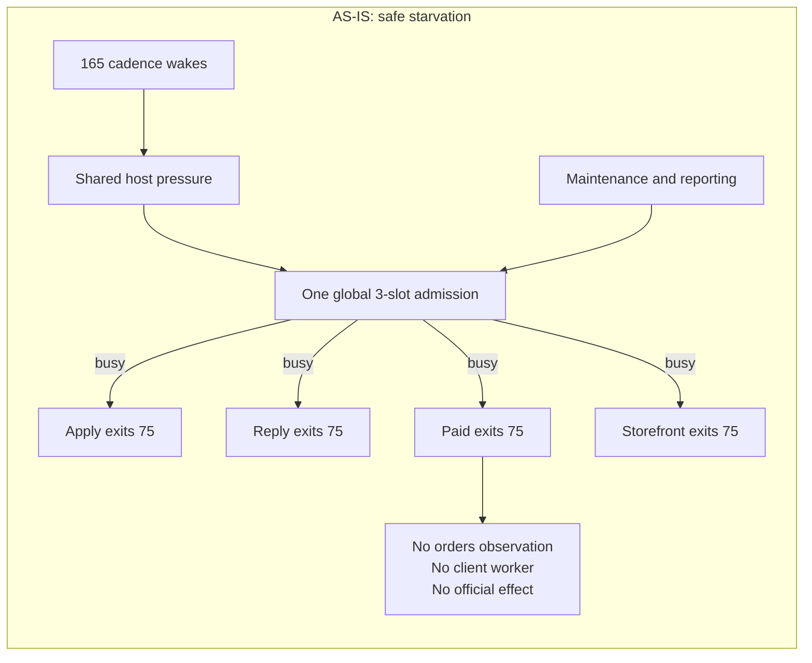
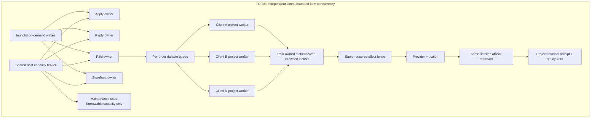

# Gig revenue program — current execution SSOT

This file contains only current truth and remaining work. Completed incident detail is preserved in Git
history through commit `e2b30b8e10`; it must not be copied back into the active TODO. Evidence lives in
durable runtime ledgers and receipts, not in duplicated historical checklists.

## Account 1 restart cursor

This is the only restart cursor for the next Codex session. Re-check every value against Git and official
runtime/provider readback before acting; conversation claims are not completion evidence.

- Repository: `/Users/anicca/Projects/life-manager-main`, remote `Daisuke134/life-manager`.
- Runtime implementation worktree: `/private/tmp/lm-runtime-admission-reservations-20260914`, branch
  `fix/runtime-admission-reservations-20260914`, upstream of the same name. Pushed clean HEAD is
  `4ac009092fdebcec225d5516a9de444e6a15f5f7`; PR `#5193` is merged at main
  `3fbe75546d720add1bfa465731ddc94353b662b5`. Preserve this worktree until production activation and natural
  proof finish; do not delete or reuse it for another task.
- Phase 2 replaces the v2 JSON scan with stdlib SQLite, adds durable FIFO reservations, child-PID claim
  handoff, same-owner/crash recovery, exact loaded-idle dispatch, retired/missing-owner cancellation, a
  default-v1 mixed-release gate and `lm-loop admission-v2-enable`. Final evidence is 500 sequential enqueues in
  1.872 seconds, 39/39 simultaneous enqueues persisted, 69 host tests, 464 loop tests plus 470 subtests, 67
  registry tests plus 100 subtests, exact stdlib CI discovery 434 tests, fresh read-only `ship`, and GitHub CI
  8/8 PASS. Earlier JSON 500-enqueue evidence was 35.93 seconds.
- Spec worktree: `/private/tmp/lm-coconala-retained-attachments`, branch
  `docs/coconala-current-cursor-20260914`. This file is the current remaining-work SSOT. Its eventual canonical
  name/location must be derived from repository conventions and references, then migrated once without
  creating a second live TODO.
- Ryu and Coconala are not complete. No current official readback proves that the newest Ryu buyer event is
  covered by a later seller submission. Never report completion from a historical message or local state.
- Account migration is open: identify the account 1 Codex auth/provider profile through the credential SSOT,
  prove one bounded invocation, then roll only the intended Life Manager Codex routes forward. Preserve all
  Codex/cloud sessions and unrelated providers.
- First safe action: keep admission protocol at `1` and do not treat release convergence alone as recovery.
  Continue the approved fundamental scalability repair in the existing clean runtime-admission worktree after
  renewing its same-owner/task lease and fast-forwarding it to latest `origin/main`; do not create a duplicate
  worktree. Preserve independent lane owners, partition host capacity so maintenance cannot starve revenue,
  restore project-scoped Paid concurrency and attachment retention, then prove the four-lane Coconala canary
  before activating corrected protocol `2`. Never restart a running sibling or edit the Capafy shared checkout.

## Outcome

Life Manager autonomously earns attributable revenue across Coconala, Lancers, CrowdWorks, Mercor,
Freelancer.com, Upwork and newly discovered platforms. Every supported lifecycle runs 24/7 without Dais or
Codex babysitting, shares one runtime and marketplace kernel, resumes from durable state, verifies official
effects, prevents duplicates, heals failures and improves itself. The first measured revenue gate is USD
10K MRR; applications, health checks and projected value do not count as revenue.

## Non-negotiable contracts

- Scheduler registration and a PID are not health. Every wake ends with a bounded terminal receipt.
- Each client is an independent work item. Clients, lanes and platforms run concurrently.
- Every external mutation uses prepare -> effect fence -> official readback -> terminal receipt -> replay-zero.
- Uncertain effects are reconciled officially before retry. Never guess and never duplicate.
- Buyer conversation, files, requirements and decisions are cumulative durable context.
- Shared runtime, browser leasing, Telegram, Calendar, receipts, evals and marketplace lifecycle are reused.
  Providers implement only thin official-surface adapters.
- KYC, interviews and person-bound media may use typed minimal-human Telegram handoffs. Everything else is
  autonomous. Meetings are added to Google Calendar with the join URL and a five-minute reminder.
- Never fake applications, messages, delivery, spreadsheets, revenue or readback.
- Do not apply for work whose required numerical outcome cannot be delivered within the paid scope. Prefer
  concrete artifacts and services whose completion is controllable.
- A historical seller message is never proof that a talkroom is currently handled. Completion requires the
  newest official buyer event to be covered by a later seller effect and official readback. If durable
  `next_action` conflicts with a newer buyer-event digest, the buyer event wins and the item returns to work.
- Chii remains an active paid contract until the official room and the truthful DM-result ledger prove the
  contracted outcome. Never invent recipients, sends or spreadsheet rows.

## Shared architecture

```text
config/
runtime/
  scheduler/ admission/ queue/ workers/ effects/ browser/
  receipts/ observability/ self_healing/ self_improvement/
domains/
  marketplace/{apply,reply,paid,storefront}/
providers/
  {coconala,lancers,crowdworks,mercor,freelancer,upwork}/
loops/
  {revenue,platform_discovery,loop_builder,self_heal,self_improve}/
evals/
  {conformance,replay,fault_injection,revenue}/
skills/
docs/
```

## Fundamental scalability repair

### 1. Overview — what failed and why temporary fixes did not hold

The intended Loop Engineering contract is still authoritative: platforms and the four marketplace lanes
remain independent owners; each lane advances independent applications, talkrooms, listings or orders with
bounded workers; only the same exact provider resource/effect is serialized. Shared runtime owns resource
accounting, model routing, browser leases, receipts and recovery, but it must not become a business queue that
allows one lane or maintenance owner to pause an unrelated lane.

The current failure is architectural, not one Coconala selector bug. The fleet first allowed too many heavy
wakes to run concurrently and exhausted CPU, memory, browser and disk resources. The response added one global
finite admission ceiling. That protected the host from unbounded fan-out, but it also allowed unrelated
maintenance owners to consume every slot. Revenue wakes then terminated safely before provider code, so the
system changed from "work until the host crashes" to "do no work while reporting bounded deferrals." Later
release/reconciler fixes improved individual boundaries but did not restore the primary invariant: every funded
client and active buyer thread must keep making durable progress while unrelated work continues.

Observed evidence for this failure class:

| Boundary | Current evidence | Why it prevents revenue |
|---|---|---|
| Fleet | 165 registered loops; host load remained about 192--222 with more than 100 runnable and zombie processes in observed snapshots | Many cadence-aligned Python/browser wakes compete before useful work begins |
| Host | macOS displayed application-memory exhaustion; ChatGPT and multiple Chromium processes consumed multi-gigabyte memory; disk reached 99% | Startup, browser and memory probes stall or time out |
| Permission | A Python 3.14 cross-application data-access prompt was visible | A runtime child may wait for an unresolved TCC decision instead of producing a receipt |
| Admission | Protocol `1`, total finite capacity `3`; observed slots were owned by non-Coconala maintenance/work owners while Coconala repeatedly returned `resource_control_busy`, `resource_capacity_busy` or `memory_headroom_unavailable` | A global safety primitive became a cross-lane wait and violated outer parallelism |
| Release | Current is `b8cff053`; all four Coconala lanes remained installed from `3fbe7554`; the current reconciler had a running receipt but no terminal result | Safety fixes exist in main but have not reached the revenue owners |
| Paid | Latest provider-level summary failed at `orders_observation` with `observed=0`, `effect=0`, `readback=0`, `failed=1`; later wakes stopped at admission | Paid has no current order inventory or buyer-visible progress |
| Inner parallelism | Paid implementation still states one order per pass because evidence paths are lane-global, while the Paid recipe requires project-scoped concurrent orders | One client can monopolize or block the lane; evidence cannot safely coexist |
| Retained context | A Coconala room received a review ZIP acknowledging 15 attachments and was later asked to upload the same attachments again | Durable attachment references and verified bytes were not carried into the next decision |
| Contract execution | A CrowdWorks buyer supplied a work link after contract acceptance while the reply/upload form remained empty | Contract acquisition did not create a durable fulfillment work item that reached submit/readback |

### 2. As-Is / To-Be





TO-BE preserves the existing independent launchd owners. It does not add a fifth business scheduler or one
global marketplace queue. The shared host broker performs resource accounting only. Every revenue lane owns a
non-stealable minimum budget; maintenance may borrow unused capacity but is preemptible and may never consume a
funded-client guarantee. Within a lane, workqueue fairness, per-item backoff and project-scoped claims bound
physical concurrency without destroying logical concurrency.

Every client/order owns its own state, run namespace, attachment registry, artifact, effect intent, lease,
heartbeat, terminal receipt and official readback. Artifact building, reasoning and reconciliation may proceed
concurrently. Only the short authenticated mutation against the same provider resource is serialized. A browser
lease may delay that mutation without changing an unrelated client to failed or blocking its non-browser work.

launchd remains an on-demand alarm. Every wake performs one bounded durable transition and exits. Long waits are
persisted as `next_eligible_at`; they do not retain a Python process, browser tab, admission slot or Telegram
send. Runtime health uses process identity plus heartbeat plus durable progress, never PID existence alone.

### 3. Non-negotiable architecture and ownership contracts

1. `runtime/loop` MUST remain the only lifecycle, admission, retry, receipt and recovery implementation.
2. Each platform/lane MUST keep an independent owner, state root, BrowserContext and lease identity. No sibling
   lane may wait for or restart another lane.
3. Host admission MUST enforce a measured hard ceiling and independent reserved minimums. Maintenance,
   reporting, Telegram, cleanup and discovery MUST be borrow-only and preemptible.
4. Every work item MUST remain visible when deferred. Capacity may change `next_eligible_at`; it MUST NOT drop
   the item, hide it from aggregates or turn it into a successful no-op.
5. Paid MUST use project-scoped claims and bounded concurrent workers. Lane-global evidence files and a
   lane-wide order lock MUST NOT define the unit of work.
6. Retained official attachment references and verified bytes MUST be cumulative. Missing local bytes trigger
   internal official recovery; the buyer MUST NOT be asked again for an attachment already received.
7. Browser memory MUST be owner-accounted. Context/tab cleanup is owner-scoped; no global Chromium, GUI,
   WindowServer, loginwindow or host restart is a valid recovery action.
8. A memory probe timeout MUST be classified separately from observed low memory. Both remain effect-zero, but
   only measured pressure may drive capacity reduction. Control-plane probes and TCC preflight remain bounded.
9. Release handoff MUST be terminal-driven per label. A completed owner moves to the next compatible immutable
   release before its next wake; the fleet must not depend on a reconciler finding a tiny idle polling window.
10. Completion MUST be buyer-visible/provider-visible effect plus official readback and replay-zero. Scheduling,
    PID, start receipt, queue selection, draft, click or Telegram report is not progress.
11. A funded client or fresh buyer event that has no official seller progress for two intended cadences MUST
    trigger a shared repair event, reclaim only stale owned resources, prioritize that item and continue without
    human babysitting.
12. Local and hosted variants MUST use this same logical loop, schema, recipe, effect fence and tests. Only the
    host supervisor, durable store, secret store and browser transport may differ.
13. Every continuation MUST read the active goal before repository work and verify expected worktree path,
    branch, upstream, commit floor, lease and dirty state. A shared checkout or mismatched branch is read-only
    and MUST fail closed before edits. Missing files in that checkout MUST NOT be treated as absent from
    `origin/main`.

### 4. Acceptance criteria and test matrix

| # | Acceptance criterion | Required test/evidence |
|---|---|---|
| 1 | One slow or failed lane cannot alter another lane's schedule, state, BrowserContext or progress | `test_one_lane_failure_does_not_pause_siblings` plus four concurrent natural wakes |
| 2 | Maintenance cannot consume a revenue lane's reserved minimum; unused capacity remains borrowable | `test_maintenance_capacity_is_borrow_only` and saturated-host canary |
| 3 | Global host load remains bounded without converting pressure into fleet-wide revenue starvation | `test_partitioned_admission_preserves_revenue_progress` plus measured CPU/memory/process trend |
| 4 | Different Paid orders own different namespaces and run concurrently; the same order is stingy/exactly-once | `test_paid_orders_use_project_scoped_concurrent_claims` |
| 5 | One blocked Paid order remains represented while another order reaches official readback | `test_blocked_paid_order_does_not_block_ready_order` |
| 6 | A previously received attachment is never requested again; missing bytes use internal recovery | `test_retained_attachment_is_recovered_without_buyer_reask` using the observed 15-attachment case |
| 7 | A contracted CrowdWorks instruction becomes a fulfillment item and reaches submit/readback | `test_contract_instruction_creates_fulfillment_work_item` plus exact provider receipt |
| 8 | Probe timeout, real low memory, TCC denial and TCC pending are distinct terminal reasons | `test_host_preflight_failure_classes_remain_distinct` |
| 9 | Terminal release handoff updates one exact idle label without restarting siblings or losing state | `test_terminal_release_handoff_is_label_scoped` plus loaded argv/readback |
| 10 | Every active client independently covers its newest buyer event, official effect and replay-zero | Client-by-client official matrix for Ryu, both Kokoro contracts, Chii and Atsugi |
| 11 | Apply, Reply, Paid and Storefront continue across reboot and one owner crash | Four-lane reboot/fault-injection canary |
| 12 | The same contracts hold at fleet scale | 500-loop admission test, 24-hour canary, then seven-day soak with zero starvation and zero duplicate effects |
| 13 | A handover resumes only in its named worktree/branch and refuses the Capafy/shared checkout | `test_handover_worktree_route_fails_closed` plus HEAD/upstream/dirty-state receipt |

E2E judgment:

| Item | Value |
|---|---|
| UI change | None in the shared runtime repair; provider UI is the official effect/readback surface |
| Maestro | Not applicable; required E2E is natural launchd wake plus real provider readback because this is a macOS/background marketplace system |

### 5. Boundaries

- DO NOT replace the four lane owners with one monolithic business scheduler.
- DO NOT create Coconala-, CrowdWorks-, Lancers- or Mercor-specific admission/retry/receipt frameworks.
- DO NOT raise global concurrency or create more browser processes as a substitute for ownership and fairness.
- DO NOT kill unrelated processes, global Chromium, ChatGPT/Codex, the GUI session or the host to pass a test.
- DO NOT weaken effect fences, official readback, formal-delivery authorization, attachment integrity or
  replay-zero to increase throughput.
- DO NOT mix Capafy work, its branch or its dirty files into this workstream.
- DO NOT create another implementation worktree while the existing runtime-admission worktree is clean,
  same-task owned, process-free, PR-free and safely fast-forwardable to `origin/main`.
- DO NOT activate admission protocol `2` until its capacity model satisfies the lane-independence and
  maintenance-borrow-only contracts above.

### 6. Execution order and rollout rule

Order change reason: the previous cursor was fleet convergence -> protocol `2` activation -> natural fairness
proof -> Coconala. Live evidence now proves the current global admission semantics can starve every revenue
lane. Activating them unchanged would make the regression durable. The new cursor repairs the shared capacity
and per-client progress invariants before activation while leaving independent provider effects uninterrupted.

Old order:

```text
finish release convergence -> activate protocol 2 -> prove fairness -> resume Coconala
```

New order:

```text
freeze protocol 1
-> capture three production regression fixtures
-> partition host capacity and remove maintenance/revenue coupling
-> restore project-scoped Paid concurrency and attachment retention
-> prove Coconala four-lane/client canary
-> activate the corrected protocol 2
-> 24-hour and seven-day fleet proof
-> continue platform revenue order
```

Current cursor: specification is approved and recorded; no runtime implementation or production mutation is
authorized by this document update. The next implementation reuses
`/private/tmp/lm-runtime-admission-reservations-20260914`: re-check the six lifecycle conditions, renew its
`codex-root` / `runtime-admission-reservations-phase2` lease with the actual HEAD, then fast-forward the clean
branch to latest `origin/main`. The pushed merged commit remains remote evidence, the spec branch owns this
file, and the Capafy shared checkout is forbidden. Create a replacement only if the existing owner/task cannot
be safely continued; never create one merely because the branch is behind main.

## Current measured state

### Shared host/runtime

- PRs `#5194` through `#5199` are merged. Current main is
  `b8cff053255f840cc02405c886bd4974005586cc`, published as full immutable release
  `/Users/anicca/loops/releases/20260915T061515-b8cff053`. The release reconciler now covers both complete
  provider routes, changes only loaded-idle labels, skips running and unloaded labels, runs outside saturated
  data-plane admission, reconciles the local complete release before any remote fetch, bounds fetch with the
  existing portable process-group timeout, narrows Git negotiation to `origin/main`, and uses the release-pinned
  Python for its nested `lm-loop` CLI. Each PR passed its focused tests and GitHub CI 8/8. Production proved the
  old unbounded fetch could run beyond ten minutes, the bounded replacement emitted `entrypoint_exit_124` with
  no orphan Git children, and `control_plane_exempt` wrote an effect-zero host receipt. The first natural wake
  of the final `b8cff053` release is currently running; its two route summaries, terminal receipt and resulting
  exact fleet mismatch count remain open and must be read back before protocol activation.
- Admission remains protocol `1`. The latest read-only snapshot observed three live owners
  (`affiliate-source-refresh`, `writer-opportunity-response`, `job-search-daily`) and one legacy ticket
  (`article-resume`). Host load was about `192`, memory-free readback was `30%`, and the data volume was `99%`
  full with about `2.7 GiB` available. All four Coconala owners remained installed from `3fbe7554`; Apply was
  loaded-idle with last exit `75`, while Reply, Paid and Storefront had running wrappers and last exit `75`.
  The `b8cff053` release reconciler still had only a running event, not a terminal summary. These observations
  supersede the earlier owners `2` / tickets `0` snapshot but may change naturally; re-read before mutation.
- PR `#5193`, main SHA `3fbe75546d720add1bfa465731ddc94353b662b5`, is merged and published as
  immutable release `/Users/anicca/loops/releases/20260915T025232-3fbe7554`. The safe two-stage rollout keeps
  protocol `1` until every finite label is exact-loaded from this capability-2 release. Initial loaded-idle
  reconciliation completed with failures 0: deterministic had 53 eligible results, 44 changes and nine
  snapshot-race running skips; shared-agent-runner changed 33 labels. A later targeted pass moved Coconala
  Apply, Reply, Paid and Storefront to the new release after each old wake ended naturally. Repeated current-SHA
  natural wakes now write bounded effect-zero `host_admission_deferred:resource_control_busy` terminal events;
  they do not yet prove business recovery or official provider readback. That rollout snapshot reduced finite
  installed mismatches from 51 to 38 and observed protocol `1`, owners `3`, legacy tickets `4`; those counts are
  historical. V2 activation, natural fairness, recovery, replay-zero and 24-hour proof remain open.
- PR `#5192`, main SHA `6a901db5011da29a05ef91422c7ee745c8fa6e51`, is the compatibility-first
  admission rollout. It preserves future-version durable tickets during mixed-release convergence and records
  the exact bounded admission reason instead of collapsing every deferral to `host_admission_deferred`.
  Its exact head passed 31 focused tests, 493 runtime tests plus 470 subtests, all CI and fresh read-only review.
- The first targeted Paid wake on `6a901db5` started normally and terminated without an external effect at
  `2026-09-14T14:02:40.631497+00:00` with
  `host_admission_deferred:memory_headroom_unavailable`. It did not observe or reply to Ryu. This proves precise
  classification, not recovery or client completion.
- Durable fairness implementation is merged, but production activation and natural proof are still open. The
  lock-protected path is `queued -> dispatch_reserved -> claimed -> running -> released`, with monotonic
  sequence, reservation lease recovery, child-PID ownership and out-of-lock target kickstart. Protocol `1`
  remains the correct production mode during mixed-release convergence.

- PR `#5184`, main SHA `b8de9bf2d230514587bb455f59a3e866ec27f658`, fixes scheduled resource
  admission. Busy wakes attempt once, retain no ticket, write effect-zero deferred state and exit `75`.
- PR `#5186`, main SHA `3e7b77714d92e179806970d353f7c9db2f8dfed6`, removes every external
  process-identity probe from the shared admission critical section. It snapshots all identities once outside
  the lock, fails closed on snapshot failure and preserves rows created during the snapshot. Race tests,
  100-ticket scale coverage, 47 host tests, all CI and a fresh read-only review pass.
- PR `#5187`, main SHA `59bd6cddaf2768a98da6373480043672db657713`, makes explicit-loop
  reconciliation read only the requested launchd labels instead of enumerating the full fleet. Production
  read-only latency fell from about 37 seconds to 1.4--2.4 seconds; 70 tests plus 30 subtests, all CI and a
  fresh read-only review pass.
- PR `#5188`, main SHA `d80e7359127a9bc591463ee4b6b3ea2528f8639a`, removes synchronous evidence
  garbage collection from Apply's revenue-critical path. The observed old run spent about 28 minutes scanning
  412 MiB and reclaimed zero bytes because it was below the 400 MiB high watermark. GC now has an independent
  six-hour deterministic owner, and active evidence is protected by a PID plus process-start-identity pin.
- PR `#5189`, merge SHA `0a7b8c8b75899137bf28236e3c2e47fe1a3a0a91`, removes recursive run-tree
  cleanup from every business wake. Per-run scratch is created through state-root-anchored directory FDs;
  terminal evidence is protected before business execution; only exact PID plus process-start identities are
  reclaimed by the central owner. Ancestor symlink, run replacement, terminal-write failure and no-clobber
  races are covered. Targeted 45 tests, the 425-test runtime suite, all CI and fresh Terra architecture review
  pass.
- Immutable release `/Users/anicca/loops/releases/20260914T211512-0a7b8c8b` is current. The preceding
  `3e7b7771` loaded-idle rollout reconciled 57 deterministic and 40 shared-agent-runner labels with zero
  failures; target-only convergence to `59bd6cdd` has begun and running owners are skipped, not restarted.
- Idle rollout succeeded cumulatively for 96 label installs with zero reconcile failures. The latest
  convergence pass updated 11 deterministic and 12 shared-agent-runner labels; old-release running owners
  were skipped, not restarted, and continue draining naturally.
- Legacy root cause is proved: blocking waiters retained one process and ticket per wake; a waiter could hold
  the global control lock while an unbounded `/bin/ps ... lstart=` identity probe stalled every resource
  class. The new release bounds that probe to two seconds and fails conservatively as live.
- Read-only process sampling confirmed that the legacy drain, rather than the new release, caused the long
  wait: Paid PID `6856` and Apply PID `42143` spent every sampled stack in blocking `flock` on the shared
  `control.lock`. Paid then exited naturally, reconciled to `3e7b7771`, and its first natural new-release wake
  ended with bounded `host_admission_deferred`. Apply PID `42143` subsequently acquired the agent resource and
  now runs its real `application_direct.py --all-eligible` child; it is no longer blocked on `flock` but remains
  on old release `d74258a8` until that business run ends naturally.
- Coconala Reply and Paid are installed on current `d80e7359` and are executing natural wakes. Their previous
  wakes independently ended exit `75`,
  `host_admission_deferred`, loaded-idle, with no retained new-release ticket. Contention safety passes;
  later natural resume and official business readback remain open.
- Coconala Storefront is installed on current `59bd6cdd`. Its first natural current-release wake
  `18d526f7b56f7b80-33558` emitted started and bounded terminal `host_admission_deferred` receipts in 16.6
  seconds with no external effect. Target reconciliation applied exactly this idle label with zero failures;
  later natural resource acquisition, official listing readback and replay-zero remain open.
- The legacy queue is draining rather than growing: read-only polls measured `19`, `18`, `11`, then `10`
  retained tickets. Current memory admission itself passes at
  `free_percent=31` against `minimum_free_percent=15`; the remaining backlog is legacy process/ticket drain,
  not evidence of current physical-memory rejection. Coconala Storefront PID `60168` ended naturally and
  the lane is installed on `b8de9bf2`; two new-release wakes ended with bounded terminal deferral and retained
  no legacy ticket or owner. Paid is now reconciled; Apply PID `42143` remains live on an older release and
  must end naturally before target-only loaded-idle reconciliation.
- Disk availability recovered from `1.1 GiB` to `4.0 GiB`. Only clean, unused, regenerable external clones,
  main-contained temporary clones, three completed merged worktrees/branches/owned leases, and one missing-worktree
  registration were removed. Codex/cloud sessions, credentials, browser profiles, memory, state, ledgers,
  receipts, active evidence and other agents' worktrees were untouched. The retained legacy ticket count later
  fell to `7`; zero remains the completion gate.
- The dedicated `hf-gig-apply-evidence-gc` owner is installed on `d80e7359`, loaded-idle with exit `0` and a
  six-hour cadence. Apply PID `42143` remains on `d74258a8` and continues its pre-deployment business run; it
  is not interrupted. Storefront likewise remains running on `59bd6cdd` until its wake ends naturally.
- Target rollout of `0a7b8c8b` succeeded for Paid, Reply, Apply-evidence-GC and disk-cleanup without restarting
  a running owner. Paid then started from launchd without a kick and wrote a start receipt followed 16.3 seconds
  later by an effect-zero `host_admission_deferred` terminal receipt. It retained no admission ticket.
- A second shared startup bottleneck is now measured rather than inferred: Paid took about 149.7 seconds from
  launch to its start receipt while a one-second stack sample remained in Python import/compile. Immutable
  releases cannot write adjacent bytecode, so every wake recompiles shared runtime modules under host pressure.
  Disk-cleanup separately exited `78` before its start receipt because `process_start()` could not obtain the
  owner identity. These are the next shared-runtime cursor; neither is a Coconala-specific selector problem.
- PR `#5191` is merged at main `3a21ba280931757fbfd9adb4f3695ec36ab48b47` and release
  `20260914T220710-3a21ba28` is current. It builds checked-hash bytecode before sealing each immutable release,
  records and pins the exact runtime Python, verifies its cache tag during apply, obtains Darwin process-start
  identity through native `proc_pidinfo`, and removes fleet-wide `ps` enumeration from every admission wake.
  Fresh Astra review returned `ship`; the exact head passed 492 tests plus 470 subtests and every required CI
  check. Reply and disk-cleanup reconciled while idle; Apply, Paid and Storefront were observed running and were
  deliberately left on their installed releases to drain naturally.
- Reply's first observed natural wake on `3a21ba28` launched successfully but terminated at
  `2026-09-14T13:11:39.278302+00:00` with `host_admission_deferred`, exit `75`, and external effect zero.
  Therefore release startup identity/bytecode is shipped, but natural pressure recovery is not yet proved and
  the 15 nonterminal talkrooms have not advanced on this wake.

### Coconala

#### Current active-client inventory

This is the retained official-state candidate set, not a claim that every newest message has been handled.
The next admitted Paid/Reply observation must refresh each row from the official talkroom before any completion
claim. One buyer may own multiple independent contracts.

| Buyer | Talkroom | Retained official state | Current unresolved condition |
|---|---:|---|---|
| Ryu0820119 | `18211957` | `取引中` | A newer buyer message is reported after the historical confirmed seller effect. The current state is internally inconsistent: `next_action=await_buyer_feedback` while `buyer_feedback_pending_artifact=true`. Re-observe the newest message, perform the requested ordinary submission, then verify a later seller effect. Formal delivery stays off unless the buyer authorizes that state. |
| こころ支援 NPO法人まくとぅー | `18223833` | `取引中` | The retained ledger says the prior seller effect was confirmed and is awaiting buyer feedback. Refresh the official head and retained attachments; do not ask again for files already retained. |
| こころ支援 NPO法人まくとぅー | `18250352` | `取引中` | Separate active contract. The retained ledger says the prior effect was confirmed and awaits feedback; refresh independently and preserve this room's own context. |
| Chii【CK protect】 | `18180857` | `取引中` | Buyer feedback is pending while the lane says `await_buyer_feedback`. Establish the truthful completed/target DM count from official/account evidence, continue only permitted real sends, update the real result ledger, and reply from that evidence. |
| あつぎ | `18171850` | `取引中`, formal delivery confirmed | Buyer feedback is pending after delivery. Observe the newest feedback, revise/reply if requested, and verify the later seller effect; otherwise remain at buyer acceptance. |

`逃げ因子` talkroom `18211838` is excluded because retained official state is `取引完了`. Historical
projects with `unknown` state are not promoted into the active set; an authenticated orders observation must
do that.

- Apply one-off `single:new` and continuous `retainer:new` are implemented through the same lifecycle.
- Shared browser acquisition is already repaired by merged PR `#5175` (`833b55b6`) and PR `#5177`
  (`6a9f3aa4`): slow CDP I/O stays outside the ledger lock and unrelated owners acquire under distinct
  task locks. The current `b8de9bf2` release contains that exact main implementation. Latest read-only
  health is `/json/version` in `0.025s`, `/json/list` in `0.017s`, and one lease against capacity `16`.
- Latest discovery failed before observation at the shared CDP lease boundary; this is not proof of empty
  inventory, logout or selector failure. Its 160-second timeout occurred on release `6a9f3aa4`; current
  health does not prove recovery until a later natural Apply wake completes official readback.
- Exactly 54 application intents are `prepared_unconfirmed`. Frozen source result:
  `gig-apply-direct-1789367873154753000-28060`; sorted IDs `5207298` through `5267876`; newline-list SHA-256
  `cd0610bb8daaf78c11ffd143a4688fad30edeff34188725aaa6867d935b8b2e5`. Reconcile every member
  against the official applied state before retry. Retained official readbacks match zero of these 54 IDs,
  so none can be confirmed or safely retired without one fresh authenticated official-history scan.
- PR `#5183`, main SHA `d74258a8ce25a834e1fff31b7e3dc01ac0b816ba`, makes Paid fail closed as
  `buyer_attachment_recovery_pending` instead of asking a buyer to re-upload when official attachment
  references exist but verified bytes are missing. Kokoro resumes only after all 15 files are verified.
- Latest durable Reply snapshot observed 179 talkrooms: 164 have official replay-zero/closed/no-reply
  readback, while 15 remain nonterminal (`pending=5`, `failed=10`). The ten failures are predominantly
  historical CDP context-creation timeouts; a fresh admitted Reply wake must reconcile them independently.
  A historical Ryu seller effect exists, but a newer buyer event is reported and is not covered by a later
  officially verified seller effect. Reconcile the newest digest before deciding whether to send; never resend
  a confirmed effect and never suppress a genuinely newer request.
- Coconala is not revenue-complete until Apply, Reply, Paid, Storefront and payout attribution all have fresh
  official effect/readback and replay-zero receipts.

## Remaining execution order

Platform/client owners remain concurrent. This list selects the engineering cursor; it does not serialize
independent production effects.

### 1. Shared runtime production convergence and account 1 cutover — current cursor

- [ ] Reuse `/private/tmp/lm-runtime-admission-reservations-20260914` for this same admission repair. Re-check
  clean/merged/no-open-PR/no-open-process/lease-owner conditions, renew the stale lease HEAD, and fast-forward
  its branch to latest `origin/main` before editing. Do not create another worktree or write in the divergent
  spec worktree, shared Capafy checkout or an active release.
- [ ] Preserve three secret-free production regression fixtures before changing behavior:
  1. all four Coconala lanes repeatedly terminate before provider work while unrelated owners hold global
     capacity;
  2. a retained 15-attachment Coconala contract is incorrectly sent a re-upload request;
  3. an accepted CrowdWorks contract with a supplied work link never becomes a submitted fulfillment effect.
- [ ] Replace the fleet-wide fungible three-slot rule with shared hierarchical accounting: measured host hard
  ceiling, non-stealable lane/platform minimums, per-item limits, and maintenance/reporting/Telegram capacity
  that is borrow-only and preemptible. Preserve effect-zero fail-closed behavior without cross-lane starvation.
- [ ] Add bounded owner heartbeat and durable-progress leases. A live PID without heartbeat/progress cannot
  retain capacity forever; recovery may reclaim only the exact owned claim after process-identity verification.
- [ ] Separate memory probe timeout, real memory pressure, disk pressure and TCC permission state. Apply
  owner-scoped browser/context/tab limits and recovery; never use global browser or host restart.
- [ ] Convert Paid from one-order-per-pass lane-global evidence to project-scoped durable work items and bounded
  concurrent consumers. Serialize only the same exact order/effect and the short authenticated mutation.
- [ ] Make retained attachment references cumulative across wakes. Reuse verified bytes; recover missing bytes
  from the official source; prohibit buyer re-requests for already received files.
- [ ] Make contract acceptance/instructions create durable fulfillment work immediately so the CrowdWorks case
  and future providers cannot stop between contract and delivery.
- [ ] Replace idle-window polling as the release convergence dependency with label-scoped terminal handoff.
  Prove next wake uses the compatible current release without restarting a running owner or sibling.
- [ ] Re-run Coconala Apply, Reply, Paid and Storefront concurrently under saturated maintenance load. Prove one
  owner crash, timeout or blocked client does not change the other lanes' schedules, states or effects.
- [ ] Only after the contracts above pass, activate the corrected protocol `2` with legacy owners/tickets and
  SQLite reservations idle. Prove FIFO within each lane, sleeping-head dispatch, crash recovery, cross-class
  progress, uncertain-effect reconciliation and duplicate effect zero.
- [ ] Produce continuous terminal receipts and real official progress for 24 hours, then seven days, including
  reboot recovery and measured browser/CPU/memory/process ceilings. Any progress regression fails the rollout
  and restores the last proven release.
- [ ] Switch only the intended Life Manager Codex provider routes from account 2 to account 1 after resolving
  their current owner and credential profile. Prove one bounded account 1 invocation and receipt before the
  targeted rollout; do not delete or overwrite either account's sessions.

Completed foundation retained as evidence: disk-headroom recovery; off-critical-path cleanup; checked-hash
bytecode and pinned interpreter; native Darwin process identity; SQLite durable reservations/dispatcher;
mixed-release compatibility; PR `#5193` and immutable `3fbe7554`; release-reconciler PRs `#5194`--`#5199` and
immutable `b8cff053`. These are supporting components, not proof that revenue progress is restored.

### 2. Coconala vertical revenue proof

- [ ] During the corrected shared-runtime canary, let natural Paid and Reply wakes finish and persist terminal
  receipts while unrelated maintenance is saturated; process start alone is not a client effect.
- [ ] Obtain one authenticated `orders-only` observation and replace the retained candidate set above with the
  exact official active-order set.
- [ ] For every active order, obtain a `selected-talkroom-only` head readback and store newest buyer-event and
  newest seller-effect digests independently.
- [ ] Fix the shared queue reducer so a newer unhandled buyer digest always overrides stale
  `await_buyer_feedback`; retain one regression fixture covering the Ryu-shaped contradiction.
- [ ] Route each active talkroom to an independent work item and effect fence; one blocked room must not block
  any sibling room.
- [ ] Ryu `18211957`: observe the newest buyer request, generate the requested ordinary submission from retained
  context/artifacts, send once, and prove a later seller effect in official readback. Do not toggle formal
  delivery without buyer authorization.
- [ ] Kokoro `18223833`: refresh the official head and all retained attachment references; recover missing bytes
  locally and continue without asking the buyer to resend known files.
- [ ] Kokoro `18250352`: refresh and process independently from `18223833`; prove its own terminal receipt and
  official effect.
- [ ] Chii `18180857`: read the truthful sent-count ledger, identify the remaining eligible real TikTok targets,
  execute only permitted real DMs at provider-safe cadence, persist each official result, and report the real
  total. Never fabricate work.
- [ ] Atsugi `18171850`: reconcile the newest post-delivery feedback, perform any required revision/reply once,
  and return to verified buyer-acceptance wait.
- [ ] Re-run all five active work items and prove newest-buyer-digest coverage, official readback and replay-zero
  independently for each.
- [ ] Reconcile all 54 uncertain application intents against official applied history.
- [ ] Restore authenticated discovery for both `single:new` and `retainer:new`.
- [ ] Submit every eligible high-fit one-off and continuous application; verify each officially; replay zero.
- [ ] Create Calendar events and five-minute Telegram reminders for every accepted meeting.
- [ ] Keep Reply processing every talkroom independently with cumulative context and attachment recovery.
- [ ] Recover and verify Kokoro's 15 retained files without another buyer request.
- [ ] Complete every funded Paid work item, deliver exactly once and verify official room state.
- [ ] Keep Storefront published where supported and measure official demand.
- [ ] Attribute accepted payout and bank receipt to its originating application and contract.

### 3. CrowdWorks vertical proof

- [ ] Close the three existing active contracts first through independent per-client workers. The observed
  contract with a supplied Google Docs work link must progress from instruction read to real artifact,
  provider submission and official readback; an empty reply/upload form is unfinished.
- [ ] Prove exact delivery readback, payout attribution and replay-zero for each existing contract.
- [ ] Keep Apply and Reply healthy, finish Paid and payout, and mark Storefront `not_applicable` unless an
  official listing surface is observed.

### 4. Lancers vertical proof

- [x] Phone verification.
- [ ] Restore durable browser availability and persistent authentication.
- [ ] Prove Apply -> Reply -> contract -> Paid -> payout; Storefront only if officially supported.

### 5. Mercor vertical proof

- [ ] Stop repeated login by retaining and observing authenticated state.
- [ ] Prove Apply -> Reply -> interview handoff -> contract -> Paid -> payout.
- [ ] Storefront is `not_applicable`.

### 6. Freelancer.com and Upwork

- [ ] Recover official account/policy state and prove Apply -> Reply -> Paid -> payout on each.
- [ ] Implement Storefront only where an official provider surface supports it.

### 7. New-platform meta loop

- [ ] Search Web/X daily, qualify policy/automation/expected net value and select profitable platforms.
- [ ] Generate thin adapters against the shared conformance contract.
- [ ] Canary, verify official effect/readback/replay-zero and promote only passing adapters.
- [ ] Feed failures to self-heal and successful patterns to shared skills/evals.

### 8. Recursive self-healing and self-improvement

- [ ] Detect missed replies/deliveries, auth expiry, browser faults, resource starvation and revenue regressions
  from events, metrics and receipts.
- [ ] Reproduce the failure, patch in an isolated worktree, run regression/fault-injection evals, canary,
  promote or roll back, and preserve a terminal repair receipt without Dais or Codex babysitting.
- [ ] Rank improvements by verified revenue impact and safely improve existing loops as well as build new ones.

### 9. Phone-only hosted Life Manager

- [ ] Run the same kernel in tenant-isolated cloud browser/computer sessions.
- [ ] Use Telegram as the only required initial UI; local computers are unnecessary.
- [ ] Use managed agent sessions/sandboxes/handoffs where they reduce custom orchestration, while keeping
  identity, authorization, revocation and audit inside the service boundary.
- [ ] Start subscription billing and prove tenant isolation, reliability and unit economics.

### 10. Revenue and YC gate

- [ ] Count only attributable accepted contracts, payouts and bank receipts.
- [ ] Reach verified USD 10K MRR by cloning profitable end-to-end lifecycles and selling the hosted product.
- [ ] Publish accurate traction, retention, margin and automation metrics in README and the product site.
- [ ] Apply to YC Winter 2027 as a solo founder with measured evidence, not projections.

### 11. Documentation and obsolete-artifact convergence

- [ ] Derive the canonical program-spec name and location from current repository conventions and inbound
  references; migrate this SSOT once and replace every old live pointer with one reference to it.
- [ ] Delete only proved-obsolete duplicate specs, completed temporary artifacts, unused clean clones and
  regenerable caches after exact reference/owner checks. Preserve Codex/cloud sessions, credentials, browser
  profiles, durable memory/state/ledgers/receipts, active evidence, and other owners' worktrees.
- [ ] Prove the surviving tree has one execution SSOT, no broken references, a clean owning branch, and remote
  recovery evidence before removing any local handover path.

## Completion gate

This program is complete only when every applicable platform has a continuously operating profitable
lifecycle, unsupported lanes are explicitly proved `not_applicable`, the meta/self-heal/self-improve loops
operate without babysitting, the hosted phone-only product works, and attributable receipts prove USD 10K
MRR. Larger revenue ambitions remain direction, never a substitute for this measured gate.
