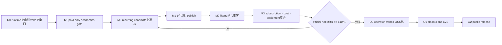
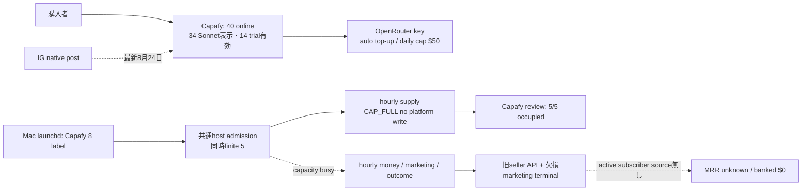
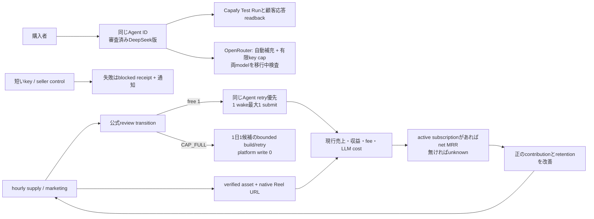
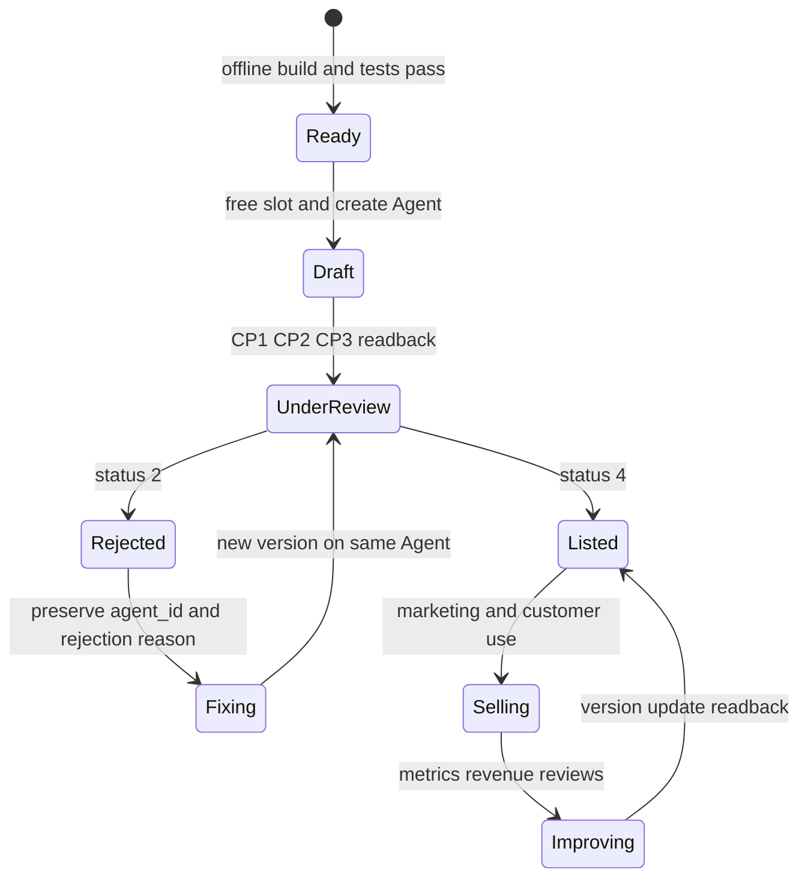
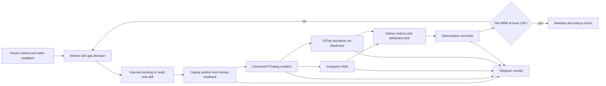
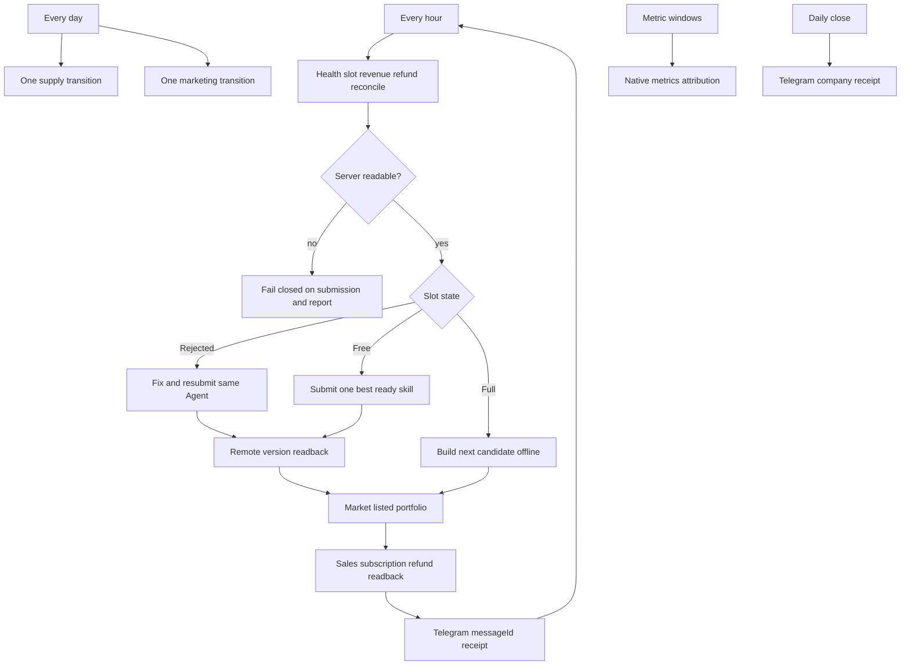

# Capafy $10K MRR closed loop

## Goal

Life Manager public repositoryだけをsourceとして、Capafy skillの発見、改善、新規開発、公開、マーケティング、subscription revenue照合、Telegram receiptまでを毎日自走させる。監視と収益照合は毎時動かし、settled subscription MRRが `$10,000` に到達するまで実測値から反復する。

`done="launchdの全Capafy ProgramArguments/WorkingDirectoryがLife Manager main releaseだけを指し、daily build/publishとdaily marketingが7日連続でhealthy terminal state、hourly reconcileが重複なく動き、各passのskill/version status・creative・native post URL・subscription MRR・Telegram messageIdが同じrun_idでreadbackでき、settled active subscription MRR >= $10,000"`

## Read this first — 現在地と次の1手

このsectionが実行順序の唯一のSSOTである。記憶や会話履歴から次の作業を選ばない。常に最上段の未完了1件だけをactiveにし、完了証拠を同じ行へ書いてから次へ進む。下のC0–C23表は履歴とacceptanceの索引であり、実行順序ではない。



| order | state | atomic TODO | 完了の公式証拠 |
|---|---|---|---|
| R0 | **ACTIVE: buyer health + runtime recovery** | paid Agentの現在版はSonnet 4.6。DeepSeek版はOpenRouterで3ケース完了したが、Capafy版は未作成。8 label中daily/healthcheckの自然passは観測し、money/marketing等は資源待ち、moneyは欠損ファイルで失敗。loaded SHAも混在する。 | 同じAgentのDeepSeek新版を審査・Test Runまで閉じ、旧版を先に止めない。8 labelをmain由来同一releaseへtargeted applyし、hourly money/daily/healthcheck/marketingの4/4自然pass、公式売上とprovider effectのreadbackを得る。現在の実測 → `Verified operating baseline` |
| R1 | pending | 全新規listingを有料subscription、No Free Trial、正のcontribution marginへfail-closedする。公開中40件のうち14件にtrialが残るため、収益上位から同じAgent IDで更新する。sandbox feeは固定値でなくpublish時の公式console値をreceiptへ保存する | lintとcandidate backlogがtrial・赤字・one-shot候補をrejectし、official CP1 readbackがsubscriptionかつtrial 0。既存版のtrialは掲載中の別問題として追跡する |
| M0 | pending | fresh official demandから、毎周期に新inputが入り前回outputが陳腐化するcustomer jobを1件だけ選ぶ | hypothesis、renewal reason、price/cap/cost、success metric、stop conditionを持つready candidate 1件 |
| M1 | pending | free slotの最初のwakeでsame-Agent retryを優先し、なければM0 candidateをCP1→CP2→CP3まで1件だけsubmitする | Agent/version/package、under-reviewまたはonline、billing/trial、duplicate/replay 0のofficial readback |
| M2 | pending | listing固有のverified outputからcreativeを作り、固有campaign URLで1 native postだけ公開する | artifact hash、native URL、listing URL、view/click window、Telegram messageIdが同じrun_id |
| M3 | pending | orderごとにactive/canceled subscription、refund、platform/sandbox fee、hosted API/LLM cost、settlementをjoinする | official receiptからgross MRR、Capafy net MRR、contribution MRR、withdrawable、bankedを分離。欠損は`unknown` |
| M4 | economic loop | M0–M3を一仮説ずつ反復し、churn-adjusted contributionを増やす | official settled active subscription net MRR `>= $10,000`。one-time、trial、pending、viewsは不算入 |
| O0 | blocked by M4 | sourceを公開し、各operatorのCapafy publisher identity、credential、payout/bank、stateをrepo外private SSOTへ分離する | clone A/Bが別publisher・別state・別収益を持ち、中央credentialと自動rev-share 0 |
| O1 | blocked by O0 | clean Macでone-time onboarding後に24/7 loopを自然wakeさせる | install→auth/preflight→launchd→candidate→receiptのclean-clone E2E、secret/log leak 0 |
| O2 | blocked by O1 | README、security boundary、economics template、release artifactを公開する | signed/tagged release、reproducible install、operator-owned payout説明、fresh user readback |

### Verified operating baseline

このsectionは現行provider・hostのread-only観測であり、下のC0–C23や古いincident記録は履歴である。観測時点は `2026-09-17 08:25–08:33 JST`。金額はCapafyの現行ClickHouse seller APIで `2026-09-16 UTC` までの確定済み表示を読む。未来の効果や次回更新を売上として先取りしない。

| 境界 | As-Is の証拠 | To-Be の判定 |
|---|---|---|
| 購入者向けAgent | Marketing Strategist `9563867391` v1.0.0は`status=4/audit=4/config=1`、runtime model `anthropic/claude-sonnet-4.6`。OpenRouter host keyはdaily cap `$50`、残枠約`$49.73`。自動補充は残高`< $20`で`$50`を支払い方法へ請求する設定。Capafy previewは今回の新規Test Runに`すでにタスクが実行中`を返したためfresh回答は**未証明**。前日のTest Run成功を現時点の成功に流用しない。 | 同じAgent IDのDeepSeek版を審査承認→Capafy Test Runの回答全文→現行版との品質・実費比較→購入者経路の監視へ進める。auto top-upはCapafy売上の自動振替ではなくカード請求、日次key capも独立なので絶対無障害とは報告しない。 |
| モデル候補 | OpenRouter公式model catalogはSonnet 4.6 input/output `$3/$15` per 1M tokens、`deepseek/deepseek-v4.1-flash`は`$0.15/$0.60`。DeepSeekの`openai-responses`はHTTP 200。回収した元Marketing Strategist SKILLで3ケースが完了し、費用は`$0.0023586/$0.003369/$0.0027282`、所要時間は`30.5/12.8/14.8`秒。これはCapafy runtime品質の証明ではない。 | `publish_prepare.sh`がlistingsごとのruntime modelを封入し、`maxTokens`の候補`8192`を検証する。CP2とkey gateも同じmodelを使う。旧Sonnet版が売られている間は両modelの検査を維持する。 |
| 掲載・候補 | 公式inventoryは`40 online / 5 under_review / free 0`。5件はいずれも9月15日から審査中。repo外backlogは`ready=9`だが、Capafyは第6新規Agentを受け付けない。17日のCAP_FULL offline buildは新ready候補を作れずrc1、その後のhourly wakeは当日claim済みとして無作業。 | review transitionを公式readbackして空きが生じた最初の適格hourly wakeで既存Agentのretryを優先し、最大1件だけsubmit。CAP_FULL中はplatform write 0、offline失敗は重複なしでbounded retry。 |
| 8 owner | `capafy-loop-daily`と`capafy-loop-healthcheck`の自然passを観測したが、goal/IG/outcome等の直近6 labelは`host_admission_deferred:resource_capacity_busy`。loaded SHAが混在し、R0の4/4自然passは未達。healthcheckはkey gate失敗時にlogを書いて`exit 0`するfalse-green経路がある。 | 同じmain由来release・全8 loaded・4/4自然pass。軽いcontrol仕事はagent runner枠を消費せず、provider失敗はsecret-free blocked receiptと通知を出す。顧客向けの実際のCapafy応答をreadbackする。 |
| 集客 | native IG Reel ledgerは3件、最新は8月24日。最近のmarketing ownerは資源待ち。過去の実行はimmutable releaseの`site/index.html`へ書こうとしてpermission denied、live passもnative Reelをreadbackできず終了した。 | writable stateでlandingを生成し、同じlistingのverified asset→native Reel URL→click window→sales windowを1 runへ結ぶ。投稿が無ければ成功としない。 |
| お金 | 現行dashboard APIの9月1–16日gross sales `$71.89`、creator earnings `$51.76`。累計は`$91.87/$66.16`。銀行paid payoutは`$0`。Capafy unit-sales画面は同期間`75` unit、うち`57` free trial、残り`18` non-trial unit（有料注文数とは断定しない）。Marketing Strategistは`9` unit中`7` free trial、週次SKU`2`。使用量APIは同期間`161` request、うち`70`件が0 token。Sonnet公式単価でAgent別に計算したhosted costは合計約`$22.90`、OpenRouter host key実請求の9月利用額は約`$24.17`であり、差額・他費用・未払いを無視した利益とは呼ばない。Hook Labはcreator earnings`$19.76`に対し推定model cost`$20.10`で赤字候補、Marketing Strategistは`$10.40/$2.29`。active/canceled seller subscription sourceは未取得なのでMRRは`unknown`。旧seller GETは現行ClickHouse画面と不一致で、hourly money ownerは存在しないmarketing terminalファイルを必須読込して失敗する。 | 現行sales/earnings/usage/payoutを同一期間・Agent単位で読むread-only CLIとhourly receiptを1経路で共有する。実請求と推定費用を区別。active契約sourceが無ければ`active_mrr=null`と欠損理由を表示し、30日subscription収益をMRRと呼ばない。 |

Readback sources: Capafy Seller Console [Sales](https://capafy.ai/developer/salesTrends) `POST /app/sales/clickhouse/trend|ranking`、[Earnings](https://capafy.ai/developer/analytics) `POST /app/realtime-revenue/clickhouse/trend|comparison`、[Unit Sales](https://capafy.ai/developer/salesVolume) `POST /app/unit-sales/clickhouse/trend|ranking`、`POST /app/usage/overview|requests`（request cursorは`cursorTime/cursorRequestId`）、`GET /agent/developer/payout-info`、`GET /agent/agents`。OpenRouter [Credits](https://openrouter.ai/settings/credits)、`GET /api/v1/key|credits|models`、Responses API。OpenClaw provider `maxTokens`の[一次仕様](https://github.com/openclaw/openclaw/blob/main/docs/gateway/config-tools/custom-providers.md)。provider token/keyはprivate SSOTから読んだが、このspecとreceiptには値を保存しない。

`$10,000 MRR`の計算契約は、**active subscriptionごとの月換算publisher受取額 − 同じsubscriberの予測hosted request cost − refunds/fees**の合計である。30日収益、公開数、無料trial、未払残高をMRRへ変換しない。active subscriber identity・更新/解約時刻・実際のrequest costが公式sourceから揃わない限り数値は`unknown`。M0–M4は一度に一つのcustomer job/creative/price仮説だけ変え、paid renewalと正のcontributionを観測して継続する。

**提出cadenceの確認:** 現行`capafy-loop-daily`は3600秒ごとに起動し、allocatorは1 passにつき最大1 action。5枠が全て`under_review`ならplatform write 0で正しい。Daisはこの直列方式を維持する方針なので、追加の5分drainerや第6 Agent、別schedulerを作らない。空きが出た次の適格hourly wakeでretry/readyを1件処理し、同じAgent/version/statusのofficial readback後に次回へ進む。

**Money CLIの境界:** 新しいCLI基盤ではなく既存`capafy-loop-cli.sh --money [--json]`を使う。Daisが優先する月間売上に合わせ、UTC暦月の月初から現在までのgross sales、creator earnings、total/free-trial/non-trial unit sales、subscription cash earnings、payout、Agent別request/tokens/推定model cost、実際のOpenRouter key usage、`active_mrr=null`と`missing_seller_active_subscription_source`を分離する。Seller Consoleのoverview/salesTrends/analytics/salesVolumeとbuyer自身のsubscription list・seller aggregate CSVではactive契約状態を返さない。seller active契約を得るprovider API/webhookが無い限り、観測された月内課金をMRRとして表示しない。Capafyへ必要なsourceとして`subscription_id, agent_id, status, cycle, net_cycle_amount, next_billing_at, cancellation_at`を要求する準備をし、提供前に数値を捏造しない。

#### As-Is: 載っていても供給・集客・監視が停滞する



#### To-Be: 顧客効果・費用・継続収益を同じ周期で証明する



#### R0 execution cursor and patch contract

**順序理由:** 当初は`R0-C1 model → R0-C2 runtime → R0-C3 money`だった。money ownerの旧seller APIと欠損ファイル、Agent別使用量APIで観測した赤字候補を踏まえて、収益の可視化とhourly receipt回復を先行する。現在cursorと最新順序は下の実行順更新を参照する。提出cadenceと1 pass最大1 effectは維持し、platform review 5枠をローカルで撤廃せず、進行中の外部effectを再送しない。

**R0-C3a実測:** read-only CLIは直近30日（2026-08-19〜09-17、UTC）でgross `$71.89`、creator earnings `$51.76`、unit `85`（trial `66`、non-trial `19`）、使用 `161` request（zero-token `70`、ID重複0）、現行単価の推定model cost `$22.90`を返した。OpenRouter host keyの`$24.17`は9月暦月の実請求で、期間の違う推定値から差し引いて利益とは呼ばない。active MRRはseller契約状態sourceが無く`null`。CLIと単体テストのPASSは本番hourly receiptの自然wake・購入者Test Runを証明しない。

**月間売上の表示:** Daisの明示優先を受け、CLI期間をUTC月初〜現在へ変更する。現行Seller Console APIの2026-09-01〜09-17実測はgross `$71.89`、creator earnings `$51.76`、unit `75`（trial `57`、non-trial `18`）。上の直近30日スナップショットは変更前の履歴であり、現在のCLI表示値ではない。OpenRouter key暦月実請求はhost全用途を含み、Capafy購入者のmodel費用と同一視しない。

**実行順の更新:** 旧順序は`R0-C3a → R0-C1 → R0-C2 → R0-C3b`。現行のhourly company receiptは存在しないmarketing terminalを必須読込して停止する一方、既存native IG ledgerには直近Reelの記録がある。毎時money観測を先に回復するため、新順序を`R0-C3a → R0-C3b → R0-C1 → R0-C2`とし、現在cursorは`R0-C3b`。C3aのbranch上でterminal欠損を`unknown`またはnative ledger observationとして扱う小修正を追加した。Git main統合・immutable release・自然wakeは未完。

| 順 | owner / exact files | 最小変更 | 完了条件 |
|---|---|---|---|
| R0-C1 | `skills/capafy-autopublish/scripts/publish_prepare.sh`、`drive_checkpoint2.py`、`build_config.py`、`key_health_gate.sh`、new `skills/capafy/catalog/marketing-strategist/{SKILL.md,LISTING.md,test/case1.md,icon.svg}`、既存focused tests | 元SKILLとListingをcredential無しでrepo正本へ移す。OpenClaw provider contractのmodel IDと`maxTokens`をlisting別に生成し、DeepSeek `openai-responses`とCP2を一致させる。公開中Sonnetのkey probeは消さず、同じAgent IDのversion update準備をする。公開版切替は既存版継続、review承認、Capafy Test Run成功、品質と1実行costのreadbackの順。 | direct3ケースだけでは未完。same-Agent ID、旧版の提供継続、審査状態、Capafy Test Run回答全文、provider error 0、入力/出力/cost、secret leak 0。Test Run previewの`already_running`は新規成功と扱わない。 |
| R0-C2 | `config/loop-registry.json`のCapafy 8行、`skills/self/capafy-loop/capafy-loop-healthcheck.sh`、`skills/earn/capafy-marketing/capafy-goal-monitor.sh`と`capafy-outcome-monitor.sh`、必要時のみ`runtime/host/resource_admission.py`、focused tests | LLMを呼ばないgoal/outcomeをagent classからdeterministicへ移し、短いcontrolに資源を確保する。healthcheckはkey/Capafy effect失敗時に`exit 0`で緑にせずblocked receiptと通知を残す。負荷を測り、重いIG/候補仕事を時刻分散する。host finite 5を無制限にせず、実測headroomに応じたcontrol/worker別の有界枠へ置換する。 | 8/8 loaded同一main SHA、hourly money/daily/healthcheck/marketingの同一世代4/4自然passを2周期、外部effectのreplay 0、buyer's Test Run readback、兄弟loop停止0。 |
| R0-C3a | `skills/earn/capafy-marketing/scripts/capafy_hourly_reconcile.py`、`skills/self/capafy-loop/capafy-loop-cli.sh`、`tests/test_capafy_hourly_reconcile.py` | 既存money adapterを現行ClickHouse POSTへ切替え、CLIの`--money [--json]`は同じread-only fetch/normalizeを使う。gross/creator earnings、unit sales/free trials、observed subscription revenue、payout pending/confirmed/payable/paid、Agent別requests/tokens/推定costとOpenRouter実請求、source/期間/鮮度を出す。`pageNumber`だけの繰返しは同じrequestを重複取得するので公式cursorを使う。repo・provider stateへのwrite 0。 | CLIとhourly receiptが同じ期間でdashboardの`$71.89/$51.76`に一致し、161 requestの重複0、70 zero-token行を明示。Hook Lab等のAgent別推定値とOpenRouter実請求を区別、秘匿値出力0。 |
| R0-C3b | `skills/earn/capafy-marketing/scripts/capafy_company_receipt.py`、`tests/test_capafy_company_receipt.py` | missing marketing terminalは`unknown`としてmoney読取を続け、実在するnative IG ledgerからmarketing receiptを作る。seller active/canceled subscriptionの公式sourceが無い間は`active_mrr=null`と明示する。Capafy buyer `GET /agent/subscriptions/list`はpublisher自身の購入0件、seller側の契約一覧ではない。Sales exportもAgent/SKU集計だけなのでMRR算出へ流用しない。 | dashboardとreceiptのmoney一致、欠損mediaでcrash 0、MRR捏造0。seller契約sourceが提供されたらactive/renewal/canceledを照合して初めてMRRを数値化する。 |
| R1→M2 | `skills/capafy-autopublish/scripts/{lint_listing.py,candidate_backlog.py}`、`skills/self/capafy-loop/{capafy_offline_cadence.py,capafy-loop-daily.sh}`、`skills/earn/capafy-marketing/{capafy-ig-marketing-daily.sh,scripts/build_landing.py}`、各focused tests | trial/赤字/one-shotを新規readyから除外。失敗した当日offline claimを同一execution IDでbounded retry。landingはreleaseでなくwritable stateへ生成し、native ReelとCTAをofficial readbackする。既存trial 14件は収益上位から同じAgent版更新で処理。 | platform free slotができた最初の適格wakeで最大1件submit、CAP_FULL platform write 0、native Reel URLとclick receipt、収益とhosted costの正のcontribution。 |

**24/7の意味:** `run_online`の購入者処理はCapafy側で継続し、Macのhourly supplyが停止しても直ちに既存Agentが停止するわけではない。絶対無停止は保証しない。購入者向け実応答、key/残高、自然wake、公式money/effectを別々に監視し、失敗を通知・再試行可能状態へ収束させる。2自然周期はrelease受入れの最小証拠であり、継続稼働の主張にはC21どおり7日連続でdaily健康terminalとhourly鮮度を観測する。

### Remember / Never

- **Remember:** 現在の売上・収益・MRRとbuyer Test Runの証拠は上の`Verified operating baseline`だけを正本とする。下の旧`$9.99 / MRR $0`等は履歴であり現在値ではない。trial、one-time、views、pendingをMRRへ加算しない。Capafyは一取引を一publisher accountへ支払うため、OSS利用者の収益は各利用者自身のpublisher/payoutへ帰属し、自動的な貢献者分配は存在しない。
- **Remember:** Capafy sourceとruntimeはすでにLife Manager public repoへ移植済み。新しいrepoや重複schedulerを作らない。
- **Remember:** CapafyはLife Managerの共通control planeを再利用する。`config/loop-registry.json`がownership/cadence、`runtime/loop`と`lm-loop`がlifecycle・immutable release・targeted apply、`runtime/agent-runner`がmodel routing・budget・evidence、shared reportingがreceipt/Telegramを所有する。Capafy固有層はmarketplace inventory、publisher/API/DOM adapter、candidate economics、host-key healthだけを所有し、共有primitiveを複製しない。
- **Remember:** Hosted LLM fundingの現行設定は上の`Verified operating baseline`だけを正本とする。Capafy Hosted Configはprivate SSOTのcanonical keyと一致させ、値そのものをrepo・log・receiptへ保存しない。自動補充はカード請求であり、Capafy売上からの振替ではない。
- **Never:** M4前にOSS onboardingへ進まない。free listing/trialを作らない。one-shot jobをsubscriptionへ偽装しない。quota failureを5分ごとに再発火しない。slot fullで第6 Agentを作らない。rejected Agentを捨てて別Agentを作らない。generic landing pageを個別listing attributionの代用にしない。main agentがInstagram/Capafyのpublish、caption edit、profile editを直接実行しない。healthy loopを毎時blind reapply/restartしない。release applyはmain由来immutable SHAを対象labelへ1回だけ行い、loaded argv・terminal receipt・official effectをreadbackする。

### Patch-level implementation cursor

この表は既存atomの実装履歴と参考anchorである。現在cursorと実行順は上の`R0 execution cursor and patch contract`を正本にする。古いSHAや行番号を現在のloaded状態とみなさず、実装時にstable anchorを確認する。

| atom | exact file / anchor | patch-level change | focused verification | size target |
|---|---|---|---|---|
| R0.1 release root — **completed** | `skills/self/capafy-loop/capafy-loop-daily.sh:14` `LIFE_MANAGER_RELEASE_ROOT`、`LIFE_MANAGER_SOURCE_REPO` | 実行rootと書込sourceを分離済み。child/inventoryはimmutable release、candidate作成だけcanonical writable sourceを使い、releaseの`.git`へ依存しない | focused境界test 2件PASS。loaded release `5302a48e3`のdaily scriptはmainとSHA-256 `69d8fc44…`で一致し、launchd argvは同releaseの`bin/lm-loop-run`とrelease rootを渡す | completed |
| R0.2 private publisher state — **completed** | `skills/capafy-autopublish/scripts/publish_prepare.sh`のPhase A候補選択・private state、`publish_finish.sh`のsingle prepare/upload/submit、`inventory_status.py:server_agents`のofficial list adapter、`save_review_url.py`と`cp1_agent.py`のshared strict link boundary、vendored Publisher | repo内stateとtoken出力を排除し、same-Agent、exact prepare envelope、single upload/submit、strict URL、official readbackへ統合した | natural daily/health exit `0`、Agent `7686597754` status/audit `4/4`、run_online、skills/config/package true、全3 plan subscription/trial 0、Agent/event duplicate 0、canonical source diff 0。buyer-side live chatは販売開始gateから除外 | completed |
| R0.2.1 prepare envelope — completed | `skills/capafy-autopublish/scripts/publish_finish.sh`の`PREPARE_STATUS` gate、`skills/capafy-autopublish/test/test_agent_work_state_isolation.sh`のprepare fixture | Publisher `0.9.11`の正常`publish-submit prepare` envelopeを`valid=true AND same Agent AND status=security_review_required AND security_ready=true AND next_action=continue_upload`でのみ受理する。その他status、missing/false field、Agent mismatchはupload前FAIL。prepare/continue_upload/CP3は各最大1 effect、unknown時のretry 0 | REDで正常envelopeのcontinue count `0`を再現。GREENはvalidだけprepare `1` / continue `1`、wrong status・security false・missing next action・wrong Agentはprepare `1` / continue `0` / CP2・CP3 `0`。focused PASS×3、OSS verifier、doctor `168 / ok=true`、fresh review `ship`。PR `#3449`、merge `1b85036d24f56ca2584800731e5e2c868b663e2a` | completed; durable main gate proven |
| R0.3 self-heal truth — historical code merged | `skills/self/capafy-loop/capafy-loop-healthcheck.sh` | staleだけでblind kickstartしないmain実装はmerge済み。現在はkey失敗時`exit 0`、mixed loaded SHA、money/marketing自然pass欠落が残るため上のR0-C1/C2/C3で回収する | 既存のrestart guardを保ちつつ、fresh buyer Test Run・8/8 loaded・4/4自然passを得る | superseded by current R0 cursor |
| R1.1 paid economics contract | `skills/capafy-autopublish/references/pricing.md:8-16`、`BEST_PRACTICES.md`のtrial/copy-winner段落 | `Free Trial必須`と`人が最終承認`を削除し、approved policy内の自動paid publishへ変更する。固定sandbox `$0.07/day`を削除し、publish時console readback値を使う式 `publisher_net=(cycle_price-sandbox_fee)*0.80` と `contribution=publisher_net-hosted_cost`を唯一のgateにする。勝者はcustomer job/pricing/proof structureだけ模倣し、文面・identity・codeはcopyしない | reference grepで`trial必須`、固定sandbox、human final approval、verbatim copy 0 | 2 docs / 25 LOC |
| R1.2 enforce paid/renewal gate | `skills/capafy-autopublish/scripts/lint_listing.py:14,81-84`、`candidate_backlog.py:96-106,132-143` | pricing row parserを追加し、全planがsubscription、`No Free Trial`、price/cap正数でなければFAIL。`## Renewal reason`、`## Unit economics`、`## Verified demonstration`を必須化し、recurring input・staleness reason・console sandbox fee・hosted max cost・positive contributionがないcandidateを`blocked_economics`にする | new `test/test_lint_listing.py`はpaid recurring PASS、trial FAIL、one-shot FAIL、negative margin FAILの4 fixture。`test_candidate_backlog.py`はblocked candidateがready countへ入らないことを1件追加 | 2 prod + 2 tests / 90 LOC |
| M0.1 economic selector | `skills/self/capafy-loop/sales_selector.py`の`select_signal`、new `skills/self/capafy-loop/economic_selector.py` | official seller winnerがあればretained contribution順、なければfresh demand evidence順で1 candidateを返す。出力を`candidate_id,hypothesis,renewal_reason,price,cap,max_cost,success_metric,stop_condition,evidence`へ固定し、viewsだけ・one-timeだけ・source staleならwinnerを返さない | `test_sales_selector.py`既存挙動維持 + new `test_economic_selector.py`のwinner/no-signal/stale/negative-margin | 1 prod + 1 new + 1 test / 95 LOC |
| M1.1 one-write publisher | `skills/capafy-autopublish/scripts/inventory_status.py:107-153` allocator、`daily_loop.sh:64-118` verdict path、`skills/self/capafy-loop/capafy-loop-daily.sh:56-123` | action priorityを`server unreadable stop → free slot+retry → free slot+economic-ready fresh → cap-full offline build → no-op`へ固定する。action keyを`retry:<agent>:<source_version>`または`create:<candidate_hash>`にし、same wake最大1 write。CP1 readbackでsubscription/trial0、CP2 hosted key、CP3 under-reviewを確認できなければfailure | `test_inventory_status.py`へnegative-margin skipとone-write、live natural wakeでAgent/version/package/status、replay write 0 | 3 prod + 1 test / 90 LOC |
| M2.1 listing attribution | `skills/earn/capafy-marketing/capafy-ig-marketing-daily.sh:210-217` selected identity、`:264-290` prompt、`site/netlify/functions/allowed-agents.json` | selected Agent IDとcontent hashを一度だけ固定し、caption/on-screen CTA/bioを同じ`/go/<agent_id>?run_id=<run_id>`へ統一する。publish後にnative URL、exact caption URL、redirect counter baselineをreceiptへ保存し、same effect replayはpostしない | `tests/test_capafy_direct_listing_bio.py`、`test_select_listing.py`、`test_pull_attribution.py`、official native URL + redirect delta | 2 prod/data + 3 tests / 70 LOC |
| M3.1 money and cost ledger | `skills/earn/capafy-marketing/scripts/capafy_hourly_reconcile.py:89-147` `_seller_money`、`:196-247` `build_receipt`、`capafy_company_receipt.py:39-79` `_semantic_payload` | order/subscription identityを取得できるofficial console sourceを追加し、active/canceled、cycle、refund、platform fee、sandbox fee、settlementへ正規化する。candidate manifestのhosted max/actual callsをjoinし、`gross_subscription_mrr_usd`、`publisher_net_mrr_usd`、`contribution_mrr_usd`、`withdrawable_usd`、`banked_usd`を分離する。欠損値は0でなく`null/unknown` | `tests/test_capafy_hourly_reconcile.py`へactive/canceled/refund/fee/cost/unknown、`test_capafy_company_receipt.py`へsemantic dedupe。official console snapshot readback | 2 prod + 2 tests / 100 LOC |
| M4.1 experiment state machine | new `skills/self/capafy-loop/capafy_growth_experiment.py`、`capafy-loop-daily.sh:97-123` prompt/result | 一度に変更するのはcandidate/listing/creative/priceの1変数だけ。baseline、success metric、stop condition、minimum window、resultをdurable stateへ保存し、failure/negative contributionならstop、positive retained contributionなら同じjobを改善する。`publisher_net_mrr_usd >= 10000`までは次のM0へ戻る | new `test_capafy_growth_experiment.py`でone-variable、window、stop、replay。7日自然運転はduplicate/missing receipt 0 | 2 prod + 1 test / 100 LOC |
| O0.1 operator boundary | `install.sh:26-55` product routing、`start-local.sh`、`uninstall.sh:17-50`、Capafy launchd templates | M4 receiptをgateに`./install.sh capafy`を追加する。credential/publisher/payout/stateは`$LIFE_MANAGER_HOME`配下private SSOT、source/releaseはpublic immutable、operator A/B間で共有0。uninstallはlaunchdだけ停止し、payout/history削除は明示hard modeだけ | `test/oss-self-contained.test.mjs`、new install fixture、secret scan、operator A/B isolated state | 3 prod + templates/tests / 100 LOC |
| O1.1 clean-clone release | `README.md` Capafy section、new `docs/capafy-operator.md`、release workflow | one-time onboarding、収益帰属、20% fee/console sandbox、cost cap、hard stops、recoveryを記載。clean cloneでinstall→preflight→natural wake→receiptまで再現し、tagged immutable releaseを作る | clean Mac transcript、loaded launchd、official account readback、repo secret 0、tag SHA | 2 docs + workflow / 90 LOC |

### Economic truth and $10K denominator

Capafy subscriptionはpublisherが継続課金を設定し、platform feeはnet amountの20%、publisher受取はsandbox fee控除後の80%である。Sales/Proceeds表示は入金ではなく、dispute window、monthly settlement、payout thresholdを通過した公式settlementだけをcashとして扱う。

```text
publisher_net_per_cycle = (cycle_price - official_console_sandbox_fee) * 0.80
contribution_per_cycle  = publisher_net_per_cycle - hosted_api_llm_cost - refunds
publisher_net_mrr      = sum(active_subscription.publisher_net_per_cycle normalized monthly)
contribution_mrr       = publisher_net_mrr - monthly hosted costs - monthly refunds
```

最後に確認できた週額`$9.99`、sandbox `$0.50/week`を仮定するとpublisher netは約`$32.90/subscriber/month`で、Capafy net MRR `$10K`には約`304` active subscribersが必要である。hosted costを`20 calls/week × $0.12`と仮定するとcontributionは約`$22.50/subscriber/month`、実利益 `$10K`には約`445` subscribersが必要になる。これは計画値であり、実装はpublish時の公式console feeとactual usageで毎回再計算する。

ソース: [Capafy: Become a Publisher](https://capafy.ai/earn) / 核心: subscriptionはrecurring closed-source、platform revenue shareは20%。

ソース: [Capafy Publisher Agreement v1.1](https://capafy.ai/publisher-agreement) / 核心: payoutは価格からsandbox feeを引いた金額の80%で、Sales/Proceeds表示はincomeではない。

### External-effect ownership

- Instagramのpublish、caption edit、profile edit、native readbackはinstalled `ai.anicca.capafy-ig-marketing-daily`だけが所有する。
- main agentはspec、plan、code、test、installed release、loop kick、receipt監査を所有する。外部作用が必要ならcodeを直して本物のloopを発火し、自分で代行しない。
- private APIが`ChallengeRequired`を返した時は、人間待ちを既定にせずloopがdedicated CloakBrowserの同一account/sessionでweb flowを試す。CloakBrowserでもCAPTCHA、selfie、phone、identity verificationが表示された時だけhuman-requiredとして停止する。
- 外部作用後のrepairは同じeffect identityを保持する。今回ならReel code `DcaoB6uMTZm`を編集し、delete/repost、新Reel、別caption effectを作らない。

### Daily video loop contract

P1は最初のcreative quality barを確定する一回限りのhuman gateである。以後は毎日、同じquality contractを自動検証し、`fresh selection → new demonstration creative → quality/hash gate → exact listing attribution → one native post → metrics/sales readback → next hypothesis`を一巡する。各日の動画は新しいartifact hash、hook、caption、Agent IDを持ち、同一bytesまたは同一postを再利用しない。通常の合格動画は毎回human approvalを待たず投稿し、quality regression、secret/PII、account risk、identity/hash mismatch、provider/readback failureの時だけfail closedで停止する。

## Current evidence

| 項目 | 実測 | 判定 |
|---|---|---|
| canonical source | `Daisuke134/life-manager` mainはpublic canonical repo。Capafy sourceは`skills/capafy-autopublish`、`skills/self/capafy-loop`、`skills/earn/capafy-marketing`に存在 | sourceは移植済み |
| launchd cutover | loaded 8件すべての`ProgramArguments`と`WorkingDirectory`が`/Users/anicca/Projects/life-manager-main`を指す。旧repo path 0件、duplicate label 0件 | **PASS: runtimeはLife Manager** |
| scheduler | `ai.anicca.capafy-loop-daily`はhourly、healthcheckは300秒でloaded。両labelをmain `1b85036d2`由来release `/Users/anicca/loops/releases/20260831T182612-1b85036d`へexact target applyした | daily install event `bfb0917c4817d678caeee1d3`、healthcheck `a0d7a99ac3d72779e0ab874b`。launchctl loaded argvは両方とも同release。manual daily kickstart/retry 0 |
| process health | R0.1 release/source分離とR0.2 publisher chainはmainへ統合済み。current main release `439dc71d`はexact gate blob一致、doctor `168 / ok=true`。自然daily run `18d0e4b89bde81c8-67152` / execution `20260831T124856Z-67294`はrc `0`、`CAP_FULL / HEALTHY-IDLE`、agent spend `0`、platform write `0`。healthcheck exit `0`、official status/audit 4/4、skills/config/package true、Agent/event duplicate 0、canonical source diff 0 | **R0.2.3 COMPLETED。次の唯一のACTIVE atomはR0.3.1。buyer-side live chatは販売・収益gateではない** |
| event ledger | live ledger 471行でduplicate `event_id` 0件、`verified`後の`unresolved` 0件。exact replayはidempotent、新しいretry/occurrenceだけが新IDを得る | **PASS: identityとphaseは単調** |
| last money snapshot | live GET 5 sourceはfresh。5 orders、gross `$19.98`、pending `$8.00`、realized `$0.00`、refund `$0.00`。order billing mixとseller active subscription identityは取得不能 | one-timeとMRRは`unknown`、grossから推定しない |
| marketing snapshot | 承認済みO13 ReelとDecision Debate Reelのnative URL/readbackあり。owner sessionによるcurrent playsは`1`と`8`、likes/commentsは`0/0`、2 sampleはbaseline-only。次のread-only rotation候補はData Analyst `7785270416` | posting railとtruthful metrics railは復旧。第3 evidence-backed Reelと同一window metricsが次のactive action |
| creative renderer | Capafy STEP3はrepo-owned canonical rendererを呼び、traceable input→verified output、source hash、media/hash gate後だけSTEP4へ進む | **PASS: rendererとdemonstration gateはLife Manager内** |
| better local assets | repo内`skills/video`と旧`video-processing-editing`が存在。ReelFarmはTikTok slideshow/API automation | FFmpeg編集をcanonical rendererへ採用、ReelFarmはTikTok補助rail |
| Telegram | hourly state-changeはcandidate/version、slot、creative/native URL、moneyを単一`run_id`へjoinし、SQLite outboxでat-most-once delivery。live message ID `28667` | **PASS: unified receipt + dedupe** |
| live inventory read | `/agent/agents`の33行を正規化。Capafy review transition後は27 listed、0 occupied、5 free、6 retry。P0 recovery runはread-only commandまでで停止し、publish command 0 | **PASS: fresh exact readback。次のwriteはP5順序まで実行しない** |
| latest supply receipt | Portfolio TrackerをCP1→CP2→ship→CP3まで再開。package URL、official under-review readback、重複なしledgerを確認し、Telegram `message_id=29269`を取得 | **PASS: draftを収益不能状態から審査中へ移行** |

## Acceptance criteria

1. Capafyに関するsource、test、launchd templateはLife Manager repo内だけに存在し、runtime dependency scanが`~/.claude/skills`、`~/.openclaw/skills`、`/Users/anicca/anicca`を0件とする。
2. server truthから各Agentの`agent_id`、title、latest version、`status`、`auditStatus`、billing、salesを取得し、5-slot occupancyを決定できる。
3. fresh Agentの作成はnormalized lifecycleが`occupied`の別Agentが5未満の時だけ行う。現在のplatform文字列では`draft`と`under_review`だけがoccupiedである。server unreadable時は新規Agentを作らない。
4. `review_rejected`はactive 5-slotから外す。同じ`agent_id`で原因を保存し、production/listingを修正し、全gate後に同じAgentのrevisionとして再提出する。ただし同時提出は最大5件であり、`draft/under_review=5`ならretryも送信せず、accepted/rejectedで空いた次の1枠を使う。
5. `online`へ遷移したAgentはactive slotから外れ、次のready candidateを1件だけsubmitする。同一wakeで空いた全slotを一斉に埋めない。
6. 5-slot満杯時もlisted skillのmarketing、creative改善、metrics、refund、subscription、MRR、Telegram reporting、次candidateのoffline build/testを継続する。
7. marketing creativeは実skillのinput→outputまたはbefore→afterを見せ、canonical video quality gateを通る。generic stock b-roll + TTSだけのartifactをpublicへ出さない。
8. 各terminal runはskill/version status、slot counts、creative hash、account、native URL、money split、Telegram message IDを単一`run_id`で保存する。
9. hourly control loopとdaily side-effect loopが7日連続で動き、duplicate Agent、duplicate version、duplicate public post、missing receiptが0件になる。
10. revenue truthはone-time、hourly、subscription、refund、fee、pending、settledを分離し、settled net MRRだけで`$10,000` gateを判定する。
11. 新規listingはpaid subscriptionかつNo Free Trialで、official console sandbox feeとhosted costを含むpositive contribution gateを通る。recurring inputとstaleness reasonがないone-shot jobは公開しない。
12. official publisherがsettled net MRR `$10,000`へ到達するまでOSS onboarding/releaseへ進まない。到達後のOSSはoperatorごとにpublisher identity、credential、payout、stateを分離し、収益は各operatorへ帰属する。

## As-Is / To-Be

| concern | As-Is | To-Be |
|---|---|---|
| source | Life Manager内の3 skill treeと旧home/repo dependencyに分散 | `skills/capafy/` bounded contextとrepo-owned shared video/provider adapter |
| scheduling | loaded jobが旧repo pathを実行 | repo templateからinstalled release pathだけを実行 |
| slot control | finite inventory drainer。server response変化で現在read不能 | server-normalized 5-slot state machine + candidate backlog |
| rejection | retry codeはあるがcompany-wide receipt/queueと未統合 | same-agent correction loop、原因分類、再発test、resubmit readback |
| cap full | healthy-idleとしてpublisher全体が終了 | fresh submitだけidle。build、marketing、money、repairは継続 |
| creative | generic stock b-roll + TTS、repo外renderer | real demonstration first、FFmpeg quality gate、artifact evidence |
| money | gross/order/pending/MRRのsnapshotがstale | hourly fresh reconciliation、settled net MRRがobjective |
| reporting |別jobのTelegram文面 | single run receipt + state-change/daily-close dedupe |

## Five-slot lifecycle

5-slotは「1回に5 skillsを含める」という意味ではない。`draft`または`under_review`のAgentを最大5つ同時に保持できるactive submission capである。`online`と`review_rejected`はactive slotから外れる。rejected Agentは捨てず、同じ`agent_id`を修正・version updateして再提出する。



### Slot allocator contract

| observed state | publisher action | work that continues |
|---|---|---|
| `occupied < 5` + retry exists | retry rejected Agent first | marketing、metrics、money、candidate build |
| `occupied < 5` + no retry + ready candidate | submit exactly one fresh Agent | same |
| `occupied >= 5` + retry exists | platform write 0; retryをoffline readyで保持 | marketing、metrics、money、candidate build |
| `occupied >= 5` + no retry | no fresh submission | marketing、metrics、money、offline candidate build |
| listed transition frees slot | next daily wake submits one best candidate | listed portfolio keeps selling |
| server unreadable | do not create/update Agent | public readback where available、marketing safety checks、report blocker |

The Life Manager runbook is the primary implementation contract: `DAILY_LOOP.md` enforces no more than five simultaneous `draft/under_review` submissions. Accepted or rejected status frees a slot; the next wake prefers an in-place rejected repair over a fresh Agent and performs at most one platform write.

ソース: [Capafy: Become a Publisher](https://capafy.ai/earn) / 核心の引用: 「Publishers upload Skills they've built; users discover, buy, and run them.」

## Metric contract

`MRR` はactive paid subscriptionの正規化月額合計だけを指す。一時購入、pending payout、gross order value、download、view、click、trialはMRRへ加算しない。

```text
settled_mrr_usd = sum(active_subscription.normalized_monthly_amount_usd)
net_mrr_usd = settled_mrr_usd - refunds_usd - recurring_platform_fees_usd
```

一時購入は`one_time_revenue_usd`、入金待ちは`pending_usd`、全注文は`gross_usd`へ分離する。Capafy APIがactive subscription identityを返さない場合、MRRは`unknown`とし、grossから推定しない。

ソース: [Stripe: What is monthly recurring revenue?](https://stripe.com/resources/more/what-is-monthly-recurring-revenue) / 核心の引用: 「MRRとは、顧客から毎月発生する予測可能な定期収入を指します。」

## Canonical architecture



### Source and runtime boundary

- source/build/test/releaseはLife Manager public repoだけを使う。
- mutable state、credential、logs、media artifactsはrepo外`~/.local/state/life-manager/`へ置く。
- launchd plistはrepo内templateからinstallし、ProgramArgumentsとWorkingDirectoryはcanonical main release pathを指す。
- `/Users/anicca/anicca`と`~/.openclaw/skills`はcutover後にruntime dependencyとして使わない。
- user agentの定期起動はlaunchdを使う。Appleはper-user background processについてlaunchdをpreferredとし、timed intervalsをsupportすると説明する。

ソース: [Apple: Creating Launch Daemons and Agents](https://developer.apple.com/library/archive/documentation/MacOSX/Conceptual/BPSystemStartup/Chapters/CreatingLaunchdJobs.html) / 核心の引用: 「If you are running per-user background processes for OS X, launchd is also the preferred way to start these processes.」

### Cadence

| cadence | responsibility | external side effect |
|---|---|---|
| every hour | health, auth, inventory, active subscriptions, refunds, revenue, MRR, stale-run detection | Telegram only on state change or scheduled digest |
| once daily | choose one highest-EV supply action: improve a selling skill or create one differentiated skill; submit through remote review gate | Capafy publish/update |
| once daily per account | render one quality-gated creative, publish within account cadence, read native URL | social publish |
| metric windows | collect native views/likes/comments/clicks and subscription delta | read-only |
| daily close | one deduped company digest | Telegram |

Hourly wake does not create or publish a new skill every hour. It observes, reconciles and repairs. Supply and public posting remain bounded daily actions to prevent duplicate drafts, duplicate posts and account damage.

## Finished 24/7 operation

24/7は1つのLLM processを永久起動する意味ではない。launchdが短いidempotent wakeを起動し、各wakeがserver/stateを読み、1つのbounded transitionを行い、receiptを残して終了する。



Macが起動中ならlaunchd user agentsが運転する。sleep/offlineでmissしたwakeは次回wakeがdurable stateから再開し、時刻だけを根拠に二重submissionしない。Appleはtimed launchd jobを`StartCalendarInterval`で構成すると説明する。

ソース: [Apple: Scheduling Timed Jobs](https://developer.apple.com/library/archive/documentation/MacOSX/Conceptual/BPSystemStartup/Chapters/ScheduledJobs.html) / 核心の引用: 「specify a StartCalendarInterval key containing a dictionary of time values.」

## How the portfolio makes money

1. **Supply**: live sales、search demand、support/rejection evidenceからone-job skillを作る。
2. **Conversion**: listingはverified output、test input、honest capability、clear billingを持つ。
3. **Distribution**: listed Agentごとに実outputを見せるshort videoを作り、native accountからlanding/listingへ送る。
4. **Monetization**: Capafyのsubscription、hourly access、downloadの実orderを受ける。
5. **Retention**: usage、review、refund、support、churnを読み、売れるAgentのversionを改善する。
6. **Allocation**: slotが空いたら、最も高いsettled contributionを見込むready candidateを1件入れる。
7. **Compounding**: listed portfolioは新規submission待ち中も販売とmarketingを継続する。

Capafy自身もrepeatable AI workflowをpaid Skillにし、subscription、hourly access、downloadでearnすると説明する。

ソース: [Capafy: How to Make Money With AI](https://capafy.ai/blog/how-to-make-money-with-ai) / 核心の引用: 「earn through subscriptions, hourly access, or downloads on Capafy.」

`$10K MRR`へ数えるのはsubscriptionだけである。hourly/downloadはcash revenueとcontributionへ数えるがMRRへ混ぜない。marketingのprimary optimization chainは`qualified native view → landing click → product view → paid subscription → retained subscription → settled net MRR`とする。

## Creative contract

The Capafy marketing loop reuses one canonical Life Manager video renderer. It does not call repo-external `faceless-money-factory`.

1. Input is the selected listing's verified name, capability, audience pain and CTA.
2. The first 1.5 seconds show the result or pain, not a generic money clip.
3. Visuals demonstrate the skill where possible: real UI/output capture, before/after, highlighted deliverable. Stock b-roll is fallback only.
4. `video-processing-editing` behavior is ported into Life Manager: one FFmpeg encode pass, normalized BT.709/yuv420p, mixed/normalized audio, burned captions, frame-accurate edits.
5. Gate requires 1080x1920, 9:16, audible narration, caption safe area, no black frames, no duplicated opening, no secret/PII, and a generated contact sheet plus full mp4 for review evidence.
6. Instagram receives the quality-gated video through the existing Capafy account/poster rail.
7. ReelFarmはTikTok slideshow derivativeにだけ使う。canonical IG renderer、scheduler、revenue truthにはしない。
8. A native post URL readback is required before a post is recorded as published.

Meta documents a dedicated Reel size/aspect-ratio contract; the runtime must validate the produced file before upload rather than assume the renderer complied.

ソース: [Meta: Instagramリールのサイズとアスペクト比](https://www.facebook.com/business/help/1038071743007909) / 核心の引用: 「Instagramリールのサイズとアスペクト比」

## Closed-loop receipt

Every terminal pass writes one immutable receipt keyed by `run_id`:

```json
{
  "run_id": "capafy-...",
  "skill": {"agent_id": "...", "name": "...", "version": "...", "remote_status": "..."},
  "creative": {"artifact_sha256": "...", "renderer": "life-manager-video", "quality_gate": "pass"},
  "distribution": [{"platform": "instagram", "account": "...", "native_url": "...", "post_id": "..."}],
  "money": {"one_time_revenue_usd": "0.00", "pending_usd": "0.00", "settled_mrr_usd": "0.00", "net_mrr_usd": "0.00", "freshness": "fresh"},
  "telegram": {"chat_id": "...", "message_id": "..."},
  "verdict": "success|no-op|failure"
}
```

Telegram report begins with `Life Manager:::` and contains new/updated skill name, agent_id, version status, promoted account, native post URL, revenue split, MRR, artifact, blocker and next atomic action. Media delivery counts only when Telegram returns a message ID.

## Loaded launchd inventory

`launchctl print gui/$(id -u)`、installed plist、repo template、実スクリプトを突合したcurrent loaded setは8件で、owner不明は0件、重複は0件である。8件すべての`ProgramArguments`と`WorkingDirectory`がLife Manager main releaseを指す。旧repoを実行していた動的provision browserはunloadし、account managerがreplacement時にLife Manager sourceから必要時submitする。backup/disabled plistはloaded setへ含めない。

| loaded label | owner / responsibility | cadence | current source | durable state / evidence | logs | observed runtime |
|---|---|---|---|---|---|---|
| `ai.anicca.capafy-ig-account-manager` | Life Manager / IG account lifecycle | 300秒 + RunAtLoad | `$LIFE_MANAGER_REPO/skills/earn/capafy-marketing/capafy-ig-account-manager.sh` | `~/.cloak/clip-accounts-capafy.json`; `~/.openclaw/state/capafy-{ig-lifecycle,account-manager-result}.json`; account-manager evidence | `~/.local/state/life-manager/logs/capafy-ig-account-manager.{out,err}` | loaded; bootstrap run 1; last exit 0 |
| `ai.anicca.capafy-goal-monitor-hourly` | Life Manager / hourly company telemetry + Telegram | 毎時00分 | `$LIFE_MANAGER_REPO/skills/earn/capafy-marketing/capafy-goal-monitor.sh` (`CAPAFY_REPORT_KIND=hourly`) | revenue events/evidence; portfolio; goal-monitor state/delivery; incidents | `~/.local/state/life-manager/logs/capafy-goal-monitor-hourly.{out,err}` | loaded; scheduled |
| `ai.anicca.capafy-goal-monitor` | Life Manager / morning company audit | 毎日09:30 | `$LIFE_MANAGER_REPO/skills/earn/capafy-marketing/capafy-goal-monitor.sh` | goal-monitor shared state/evidence | `~/.local/state/life-manager/logs/capafy-goal-monitor.{out,err}` | loaded; scheduled |
| `ai.anicca.capafy-goal-monitor-daily-close` | Life Manager / daily-close company report | 毎日23:50 | `$LIFE_MANAGER_REPO/skills/earn/capafy-marketing/capafy-goal-monitor.sh` (`CAPAFY_REPORT_KIND=daily_close`) | goal-monitor shared state/evidence | `~/.local/state/life-manager/logs/capafy-goal-monitor-daily-close.{out,err}` | loaded; scheduled |
| `ai.anicca.capafy-ig-marketing-daily` | Life Manager / IG creative + publisher | canonical/installed 3600秒、loaded reload待ち | `$LIFE_MANAGER_REPO/skills/earn/capafy-marketing/capafy-ig-marketing-daily.sh` | IG lifecycle; marketing result/creative/caption; marketing evidence | `~/.local/state/life-manager/logs/capafy-ig-marketing-daily.{out,err}` | loaded; prior calendar schedule、hourly plist installed |
| `ai.anicca.capafy-outcome-monitor` | Life Manager / terminal self-fix outcome verifier | 60秒 | `$LIFE_MANAGER_REPO/skills/earn/capafy-marketing/capafy-outcome-monitor.sh` | `.self-fix-capafy-loop.incident.json`; outcome-monitor lock; result/lifecycle readback | `~/.local/state/life-manager/logs/capafy-outcome-monitor.{out,err}.log` | loaded; scheduled |
| `ai.anicca.capafy-loop-healthcheck` | Life Manager / business-outcome supervisor | 300秒 | `$LIFE_MANAGER_REPO/skills/self/capafy-loop/capafy-loop-healthcheck.sh` | business-health/incident state; daily job readback | `~/.local/state/life-manager/logs/capafy-loop-launchd.{out,err}.log` | loaded; scheduled |
| `ai.anicca.capafy-loop-daily` | Life Manager / slot-aware build, publish and money loop | 3600秒ごと | `$LIFE_MANAGER_REPO/skills/self/capafy-loop/capafy-loop-daily.sh` | portfolio; builder result; terminal ledger; earn ledger; marketplace evidence | `~/.local/state/life-manager/logs/capafy-loop-daily.{out,err}` | loaded; unique hourly owner |

C1で`capafy-ig-account-manager.sh`、`capafy-outcome-monitor.sh`とそのruntime closureをLife Managerの最終既知実装から復元する。repo-owned templateは`__REPO_ROOT__`と`__LIFE_MANAGER_HOME__`だけを入力にし、render-only commandはlive LaunchAgents directoryへの出力を拒否する。render後の8 plistは`plutil`を通り、account managerは78件、outcome monitorは54件、Python runtime closureは98件のfocused regressionを通る。

C2で旧installed definitionをrollback snapshotへ保存し、8件をbootout、render済みplistをinstall、同じ8 labelsをbootstrapする。`launchctl print` readbackは8/8件のsourceとWorkingDirectoryがLife Managerで、旧repo path 0件、duplicate label 0件、旧動的provision browser 0件である。rollback snapshotのcurrent pointerは`~/.local/state/life-manager/state/capafy-c2-last-backup.txt`に置く。

C3でdaily money loopとIG marketing wrapperをterminal stateの唯一のownerにする。failure injectionではmoney childの`17`とIG childの`23`をそのまま返し、どちらもheartbeatを作らない。さらに実runのevidenceがdrainer failureを示すのに共有schemaの`status=ok`固定でouter rc `0`になった再発を閉じる。Capafy専用schemaは`success/no_op/failure`だけを許可し、runner resultをsame evidence directory直下から読み、rc `0/0/1`、missing・malformed・path escapeをrc `2`へ変換する。failure/invalidはheartbeatを書かない。focused terminal 10件、shell syntax、実CAP_FULL kickstart run `9`が通る。

C4はmainに存在するevent store、incident adapter、incident transitionの現行実装をlive stateに対して再検証する。exact replayは同じevent IDでappendされず、semantic changeまたは新しいretry occurrenceは別IDになり、`verified`からの遷移は拒否される。live ledger 471行はduplicate ID 0件、`verified`後の`unresolved` 0件で、outcome 31件、adapter 12件、store 24件、shell monitor 54件、marketing全体112件が通る。追加production codeは不要である。

C5でread-only hourly reconcileをLife Managerへ追加し、account、inventory、90-day sales summary、payout、refundを各1回だけGETしてatomic receiptへ保存する。live receiptは5 sourceすべてfresh、5 orders、gross `$19.98`、pending `$8.00`、realized `$0.00`、refund `$0.00`、inventory 32 Agent観測である。seller側active subscription sourceとorder単位billing modeがないため、one-time revenue、settled MRR、net MRRは`unknown`を維持する。receiptはmode `0600`、focused 4件とmarketing全体116件が通る。

C6でcanonical `inventory_status.py`へserver row normalizerを追加する。live responseの32 Agentは22 `online`、3 `draft`、7 `review_rejected`で、normalized countsはlisted 22、occupied 3、free 2、retry 7、blocked 0、unknown 0となる。32/32行にAgent IDとlatest version IDがある。未知statusまたはidentity欠損時はoccupied/freeを`null`にして`SERVER_UNREADABLE`へfail-closedする。focused 3件、autopublish Python 5件、AID guard、leak scan、marketing 116件が通る。

C7でslot allocatorをside-effect-free decision関数へ分離する。優先順位はserver unreadableで停止、cap-full idle、空きがあればsame-Agent retry、fresh candidate 1件、drained idleで、1 wakeのactionは最大1件である。retryは`retry:<agent_id>`、fresh submitは`create:<feature>`のstable action keyを持つ。live stateはoccupied 3、free 2、ready candidate 1件から`create_fresh`を選び、連続2 readで同じ`create:capafy-o13-user-interview-synthesizer`を返し、readback中のAgent作成は0件である。focused 5件、autopublish 7件、AID/leak guards、marketing 116件が通る。

C8でrejected versionを`<agent_id>:<source_version_id>`キーのdurable repair queueへ保存する。live `review_rejected` 7件は7/7が`update_existing_agent`、同じAgent ID、既知のtarget next versionを持ち、new Agent IDを作らない。連続2 readでも7件のままである。platform detailは`status=2`と`auditStatus=3`を返すがreason本文を返さないため、7件を`platform_reason_unavailable` / `needs_diagnosis`としてfail-closedで保存し、原因を捏造しない。fixtureでは実reasonの保存、同version dedupe、進捗保持、同Agentのnew rejected version追加を検証する。queueはmode `0600`、focused 4件、autopublish 11件、AID/leak guards、marketing 116件が通る。外部same-Agent resubmitはC18で実行する。

C9でlocal candidate artifactとplatform inventoryを分離したdurable backlogを追加する。daily loopは同じinventory readをbacklogへ渡してから`CAP_FULL`/`DRAINED`終了するため、slot満杯でもoffline build/test成果を保持する。live o13 candidateはSKILL、LISTING、icon、test caseの4 gates、listing lint、content hashを持ち、backlog `ready` / platform `not_submitted` / Agent IDなしである。refresh前後のplatform Agent countは32で、platform writeは0件である。backlogはmode `0600`、focused 5件、autopublish 16件、AID/leak guards、marketing 116件が通る。実bounded build executionはC16で行う。

C10でsemantic company stateからstable `run_id`を作るunified receiptと専用SQLite Telegram outboxを追加する。live `capafy-0f203dc8ec1634ba26e6e8fc`はo13 candidate/hash/status、listed 22/occupied 3/free 2/retry 7、latest Reel URL/creative hash/skill Agent、5 orders/gross `$19.98`/pending `$8.00`/realized `$0.00`/refund `$0.00`/MRR unknownをjoinし、Telegram message ID `28667`を保存する。exact replayは同じreceiptを返し、outboxは1 row、attempt 1のままで追加送信しない。message ID不明はretryせず`delivery_uncertain`へ隔離する。hourly launchdを新receiptへ配線し、live kickstartはexit 0、same stateでattempt増加0である。DB/receiptはmode `0600`、focused 5件、marketing 121件、autopublish 16件、outcome-monitor 54件、AID/leak guardsが通る。

C11で旧`video-processing-editing`の必要部分をrepo-owned `skills/video/canonical-renderer/render.py`へ移植する。rendererはlocal libass対応FFmpegを解決し、captionとaudio normalizationを含むvideo encodeを1回だけ行う。その後のread-only gateは1080x1920/H.264/yuv420p/BT.709、48kHz AAC、mean volume、black interval、opening motion、caption safe-area contract、public textのsecret/PIIを検証し、full MP4、contact sheet、manifestを保存する。実o13 candidateは8.0秒、mean volume `-16.1 dB`、全gate pass、hash `sha256:8a88d93f8d49205def2c1c6944268ccbf99f271c8ef7d7671a6e07c1ceab4a7a`である。artifactはrepo外`~/.local/state/life-manager/artifacts/capafy/c11/`に置き、unit 3件と目視contact-sheet確認が通る。milestone Telegram message IDは`28699`。

C12でCapafy IG daily promptのSTEP3からrepo外`faceless-money-factory`呼び出しを削除し、local `say -f` narrationと`$LIFE_MANAGER_REPO/skills/video/canonical-renderer/render.py`へ置換する。各runはrepo外state下のunique artifact directoryを使い、manifestの`quality_gate=pass`、`video_encode_passes=1`、MP4/contact sheet存在、artifact hash一致を確認できない場合はSTEP4投稿へ進まない。production dependency scanは旧renderer path 0件。promptと同じ30秒commandのlocal runtime artifactは全gate pass、hash `sha256:15052277d2342f177f23b84eb4f5ec01c2bb51fc7adfd8f38869722713a55686`、contact sheet目視済みである。focused wiring 2件、Capafy 123件、video 99件、shell syntaxが通る。milestone Telegram message IDは`28706`。demonstration-first artifact判定はC13で追加する。

C13でcanonical rendererの必須入力に`demo-source`、`demo-input`、`demo-output`を追加する。sourceは非空のrepo-owned test fixtureまたはimmutable live output receiptで、input/outputが空、同一、secret/PII含有、source不存在ならencode前にFAILする。manifestは`demonstration.mode=input_output`とsource path/hashを保存する。o13のconflicting onboarding interview fixtureから実renderした30秒candidateはINPUTとVERIFIED OUTPUTを別sceneで表示し、artifact hash `sha256:00f9416574e25f4b2157dfabb04ed518d12c32dd0ff5a5990628234ff390bc71`、source hash `sha256:c0fd5392757349d25ef580b39198136a3fe6251c57dd159a4cee1a83ebb2605e`、mean volume `-18.3 dB`、全media gate passである。contact sheetは全尺等間隔4frameへ修正し、input/output両sceneを目視確認する。generic text-only/b-roll-only invocationは必須demo contractを満たせずpublic候補にならない。milestone Telegram message IDは`28713`。

C14でC13の実30秒MP4をpublic adoption前のreview mediaとしてTelegramへ送る。Life Manager artifact pathはgateway media allowlist外だったため、同一bytesを既存許可済み`~/.openclaw/media/outbound/`へcopyし、SHA-256一致後にdocument media送信する。provider message IDは`28721`。captionはUser Interview Synthesizer、Agent ID未発行、offline ready/未submit、REVIEW ONLY、Instagram未投稿、artifact hashを明記する。これをpublic Reel成功として数えない。

User reviewはTelegram `28721`を明確にREJECTする。原因は空の長方形、小さい文字、scene固有visual不在、実product interaction不在で、media probeのPASSはcreative qualityを証明しなかった。C14は未完へ戻し、LBJ v97のscene densityを基準にHyperFrames `general-video`で作り直す。新contractは4sceneのproduct UI、transcript→evidence cluster→ranked memo、large captions、local narration/audio identity、full-video local inspectionを要求する。userがTelegram上の改善版を明示承認するまでC15 Instagram public postを禁止する。

C14 HyperFrames review V2はrepo-owned `skills/video/hyperframes/capafy-o13-review/`で実装する。source fixture SHA-256は`c0fd5392757349d25ef580b39198136a3fe6251c57dd159a4cee1a83ebb2605e`、render SHA-256は`f29821f6fa90e8ef28d72d34257beb5f14be3c989e01f0019c3b403bc3657709`。artifactは1080x1920、30.0秒、H.264/AAC stereo、4 sceneで、3/9/17/25/29秒のfull-resolution frameをlocal目視する。Telegram review media message IDは`28747`。これはapproval receiptではなくcandidate delivery receiptであり、userの明示`APPROVE`まではC14を未完、C15を禁止のまま保つ。

User reviewはV2のvisualを`good`と承認し、macOS Samantha narrationだけを不承認にする。ElevenLabs account readbackは既存英語voice 3件を確認するが、cloned `AniccaMonkEN`は現planでupgrade必須のため採用しない。既存allowance内で生成可能なprofessional English `Mona`を選び、1.1382x timing fitとloudness normalizationを行う。V3はV2とvideo stream SHA-256 `41192bbe5fe9126cd992264d03ccff8c3d5b026549e81352c06c3b581a4f1c95`が一致し、変更はvoiceだけである。V3 artifactは1080x1920、30.0秒、H.264/AAC 48kHz stereo、integrated `-16.8 LUFS`、peak `-4.3 dBFS`、artifact SHA-256 `221671a308486f7aa4da86b81ab4d34c6cca3ed38a6c2594bafc5c6eed46f3b4`。Telegram review media message IDは`28766`。subscription upgrade/purchaseは0。userがV3 voiceを明示承認するまではC14未完、C15 public post禁止を維持する。

User reviewはV3もREJECTする。ElevenLabs voice metadata readbackでMonaの`accent=indian`が確認でき、product videoとnarration内容のscene timingも一致していなかった。V4は`en-US-AndrewNeural`を固定し、4 sceneごとに画面文言だけから独立scriptを作る。実音声区間はmess `0.401-4.249s`（visual `0-5.5s`）、evidence `5.897-11.294s`（visual `5.5-13s`）、cluster `13.397-20.085s`（visual `13-21.5s`）、memo `21.908-27.725s`（visual `21.5-30s`）で、scene境界越え0。V4 video stream SHA-256はV2/V3と同じ`41192bbe5fe9126cd992264d03ccff8c3d5b026549e81352c06c3b581a4f1c95`、integrated loudness `-16.4 LUFS`、peak `-4.3 dBFS`、artifact SHA-256 `88163040c4c99a1539a5457339a19171e1a379ec0c31101239e23058aaef9486`、Telegram review media message IDは`28775`である。V4 voiceのuser reviewまではC14未完、C15 public post禁止を維持する。

UserはchatでV4を明示承認する。承認対象はTelegram review media `28775`かつartifact SHA-256 `88163040c4c99a1539a5457339a19171e1a379ec0c31101239e23058aaef9486`の同一bytesに限定する。これでC14を完了し、C15の一回限りのlive Instagram passを解禁する。事前probeではlifecycle SSOTが`commercial_ready`でも共有account resolverが`publish_probe_ready`を除外し`active_handle=none`を返す契約不整合を再現した。resolverは従来の`ready*`/`warming*`に加えて`*_ready`を利用可能とし、poison/frozen/blocked除外を維持する。回帰テスト5件と実daily probeが通り、active accountは`capafy.skills8m4q2z`へ復旧する。

C15の最初のlive attemptは公開前にfail closedする。承認済みartifact hashは再確認済みだが、`capafy.skills8m4q2z`のbrowser sessionidが失効し、posterはnative Reel URLを返さずregistryを`poisoned_manual_backup`へ隔離する。公開0件、revenue/MRR deltaは`$0`。account-managerを実kickstartすると、削除済みGig keepaliveへの旧参照で停止したため、git履歴の動作済みpersistent-context ownerをLife Manager共有`skills/browser/cdp_persistent_context.py`へ復元する。再実行で専用browser `instagram:capafy-provision`は動的portを取得するが、InstagramのGoogle QR/device/phone verificationでreplacement作成が止まり、`capafy.skills57f987ea`は`session_failed`へ隔離される。Telegram進捗receiptは`28786`。C15の次の原子的作業は、既存accountのbrowser再認証経路を修復し、同一V4 bytesを投稿してnative URLをreadbackすること。

C17の実slot-controlled passはlive inventory `occupied=3 / free=2`からO13を一件だけ選び、Agent `3661050861`、version `2091144781376671744`を新規作成する。カードはtitle 48/50、category `分析`、price `$29.99`、agentType `download`、isConfirmedSkills `1`、workspace document 31件すべてexcludedで保存し、secret scan 0件のbundleを実uploadする。最終submit APIはdownloadでも空の`requiredCredentials.url_proxy`を拒否し、`requiredCredentials.url_proxy must contain at least one item`を返す。一方、既存online download Agent 3件はrequiredCredentialsなしでstatus=4のため、これは現行platform validationとの不整合である。偽の外部API credentialは追加せず、O13はdraftのまま保持する。slot passはAgent重複0、platform write 1件、公開/売上0でfail closedする。

公式`Capafy/Capafy-skills` commit `99b21b67aa97482f5cefaf036f8bb61de1796990`もdownload packageに空のcredential bucketsを生成し、公開修正は存在しない。重複issue 0件を確認後、最小再現、Agent/version、期待するdownload-only contractを公式issue `https://github.com/Capafy/Capafy-skills/issues/1`へ報告する。secret、package URL、個人情報は含めない。Telegram escalation receiptは`28875`。platform修正後は同じAgent IDのfinal review URLから再開し、新Agentを作らない。

追加互換probeはstring/nativeの`null`、`[]`、`{}`の6形式をすべて拒否し、`url_proxy:[{}]`も次にnon-blank URLを要求することを確認する。偽の外部依存を作る境界で停止し、詳細を`https://github.com/Capafy/Capafy-skills/issues/1#issuecomment-5380580152`へ追記する。authoritative remote readbackは引き続き`status=0 / auditStatus=0 / agentType=download / isConfirmedSkills=1 / requiredCredentials=null`である。

C15の再attemptはV4 SHA-256を再確認し、browser owner exact handle `capafy.skills8m4q2z`のedit-page probeまでは通る。posterの最初のlive callはstdoutを返さなかったが実投稿を完了し、native permalink `https://www.instagram.com/reel/DcV9YY7sqYI/`をbrowser homeからreadbackする。その後の重複再試行だけがtier1 `LoginRequired` / tier2 `TooManyRedirects`でfail closedする。公開はexact V4 bytesの1件、重複0、initial metricsはviews/likes/comments `0/0/0`、売上delta `$0`。lifecycleとIG ledgerを同URLへ更新し、Telegram receiptは`28872`。edit-page URLだけをlogin証明にせず、home/feedのauthenticated navigationとnative URL readbackをpublic success条件にする。

C16はLife Manager stateに`REELFARM_API_KEY`名が存在することだけでpublish可能と判定せず、`GET /api/v1/account`と`GET /api/v1/tiktok/accounts`を実readする。両方がHTTP application response `UNAUTHORIZED / Missing or invalid API key`を返すため、slideshow生成、credit消費、TikTok publishを0件で終了する。native TikTok URLを捏造せず、credential再発行とconnected account readbackが成功するまでReelFarm derivativeはhonest no-opとする。Telegram receiptは`28874`。

C17継続中にmoney readbackの実障害を修復する。`skills/self/capafy-loop/loop.sh`は`LIFE_MANAGER_REPO`を初期化する前に参照して`unbound variable`で落ち、さらにaccount endpointの非zero/parse failureをすべて`CAPAFY-AUTH-DOWN`へ丸めていた。script directoryからgit rootを自己解決してexportし、`GET /agent/account`のHTTP 401だけをAUTH-DOWN、その他を`CAPAFY-ACCOUNT-READ-FAILED`へ分離する。実production runはauth healthy、monthly payout `$0.0`、3-day net `$0.0`、selfheal request `none`で終了する。保存credentialやtokenはrepo/specへ書かず、local credential SSOTとgitignored vendor configだけで保持する。`ai.anicca.capafy-loop-daily`を実kickstartし、同じLife Manager pathの本番agent passを開始する。修復milestoneのTelegram message IDは`28890`。

C17は同じAgent `3661050861`をdownloadから`run_online`へ修復し、新規Agentを作らず審査へ提出する。旧`~/.openclaw` loopの並行runが共有publisher stagingを別Agent内容で上書きし、さらにOpenClaw adapterがoperator HOMEのlive `~/.openclaw/openclaw.json`を読むため、O13のOpenRouter契約が`proxy_env`へ誤分類され`url_proxy=[]`になっていた。旧runを停止し、publisher専用HOMEを`~/.local/state/life-manager/runtime/capafy-publisher-home`へ隔離する。repo-owned O13 sourceから再configureした実readbackは`url_proxy=1 / generic=0 / env_var=0`、最終remoteはversion `2091144781376671744`、`status=1 / auditStatus=1 / agentType=run_online / isConfirmedSkills=1 / isConfirmedConfigKeys=1`である。pricingはweekly `$9.99`、cap `20`、free trialなし。inventoryはlisted `22`、occupied `4`、free `1`、retry `7`。moneyはorders `5`、gross `$19.98`、pending `$8.00`、realized `$0.00`、refund `$0.00`、settled subscription MRRはsource不在のため`unknown`を維持する。Telegram message IDは`28979`。

C21の運転proof開始時にhourly goal monitorのexit `1`を修復する。launchd環境がstate envを読まずTelegram targetを欠損し、daily/earn readbackも削除済みrepo内stateを参照していた。monitorは`$LIFE_MANAGER_STATE_HOME`を唯一のruntime state rootとしてenv、daily log、hourly reconcileを読む。money loopのSTATE/ledgerもrepo外へ移す。旧tmux Capafy Claude loopはLife Manager launchdと責務が重複するため停止し、5分healthcheckはtmuxを再生成せず唯一のowner `ai.anicca.capafy-loop-daily`だけをstale時にkickstartする。healthcheck実run `53`はlast exit `0`でtmux再生成0。実`launchctl kickstart`後のhourly jobはrun `8`、last exit `0`、BLOCKED-free `1/7`、orders `5`、gross `$19.98`、reconcile age `0.0h`、candidate `under_review`、Telegram message ID `28992`を同一receipt `capafy-e7492dc68be6832dddf13868`へ保存する。

C21の7日proof sourceを修復する。旧goal monitorはloaded outer ownerが`CAP_FULL`で正常終了しても、実行されないinner drainerの`daily_loop.log`を読んでいたためstreakが増えない。outer `capafy-loop-daily.sh`は各executionをrepo外`capafy-daily-terminals.jsonl`へ`started`と`terminal`で記録し、missing terminal、nonzero rc、同日中の失敗が1件でもあればその日をhealthyにしない。SIGTERMを含むEXITもterminal化する。goal monitorはこのledgerだけをproof sourceにする。本番daily run `7`は`started → rc=0 / verdict=CAP_FULL / healthy=true`、launchd last exit `0`、proof `1/7`。実hourly monitorはrc `0`、reconcile age `0.4h`、orders `5`、gross `$19.98`、loaded daily true、Telegram company receipt `capafy-347cba2e81592deb481a24b2` / message ID `29064`をreadbackする。

C22のgrowth selectorの偽陰性を修復する。会社wide sales sourceは5 orders / gross `$19.98`を返す一方、`/agent/agents`の全Agent `sales/recentSales`はnullまたは0であり、旧selectorはこれを`signal=none`（売上なし）と誤報していた。selectorはcompany receiptとAgent rowsを同時に読み、company orders > 0かつAgent winner不明を`unattributed_sales / company_orders_exist_agent_sales_unavailable`へ分離する。winner/categoryを捏造せず、この状態では新規clone量産でなく既存online listingのtracked marketing rotationを続ける。`recentSales`配列も合計して、将来Agent signalが現れた時だけreal winnerを返す。company receiptはgrowth signalをsemantic run_idへ含め、本番receipt `capafy-f7e12dd40db72ee8c4d91d12`がorders `5`、winnerなし、settled MRR `unknown`、Telegram message ID `29068`をreadbackする。

C19/C21のreview反応時間を修復する。従来はinventory/revenue monitorだけが毎時で、実submit ownerは毎日08:10のため、08:11にreviewがaccepted/rejectedへ遷移すると次の同一Agent retryまで約24時間空く構成だった。唯一のowner labelを増やさず、canonical plistを`StartInterval=3600 / ThrottleInterval=60`へ変更する。各wakeはserver inventoryを先に読み、`CAP_FULL`ならagent spend `0` / platform write `0`で終了し、空き時だけ最大1 actionを実行する。rendered/live plistと`launchctl print`はいずれもrun interval `3600 seconds`、ProgramArguments/WorkingDirectoryはLife Manager mainをreadbackする。reload後の本番run `1`は5秒で`rc=0 / CAP_FULL / agent spend=0 / platform write=0`、terminal proofは日付を跨いで`2/7`へ進む。terminal ledgerは同日の全hourly executionがhealthyな場合だけその日を7-day proofへ加算する。Telegram message IDは`29075`。

自動schedulerの次wakeも手動kickなしで発火し、launchd readbackはrun `2`、last exit `0`を返す。execution `20260822T160226Z-1981`は`started → terminal`を6秒で閉じ、`rc=0 / verdict=CAP_FULL / healthy=true / agent spend=0 / platform write=0`である。同一local day内の追加terminalなのでproofは正しく`2/7`のまま増やさない。`state=not running`は毎時jobの実行間アイドルであり停止ではない。

C22 marketing再開時、loaded IG loopのSTEP3がuser承認後も旧`canonical-renderer + macOS Samantha`へ戻っている回帰を実測する。これはV2 visual承認後にV3 Mona Indian accentとscene不一致をrejectし、V4 `HyperFrames + en-US-AndrewNeural + scene-boundary crossings 0`だけを承認したcontractに反する。00:04の本番run `1`をposter到達前にSIGTERMし、新規IG ledger row 0、最新native URLは既存承認V4 `https://www.instagram.com/reel/DcV9YY7sqYI/`のまま維持する。STEP3はHyperFrames 0.8.8のO13 projectをvisual/technical referenceに、選択listing固有4 scene、repo-owned source evidence、Andrewのscene別audio、約-16 LUFS、full-resolution全scene inspection、source/Agent/timing/voice/hash manifestを必須にする。Samantha、Mona、canonical renderer、generic text-card/b-roll fallbackは公開経路から禁止する。CLI checkとfocused wiring 2件が通る。

修正版IG run `2`は低品質fallbackを投稿せず、Agent `8416888650`のrepo-owned source evidence欠損でterminalになる。しかしagent runnerのschema上`status=success`を返したためwrapperもrc `0`、heartbeat更新となり、探索中にside-effecting selectorを複数回呼んでrotationだけを進め、Telegram targetもagent環境に無い3重欠陥を実測する。selectorをread-only planへ変更し、onlineかつ`skills/capafy/marketing-evidence/<agent_id>/case1.md`があるAgentだけをeligibleにする。Data Analyst `7785270416`、Contract Red Flags `8416888650`、Interview Coach `4014388606`、Decision Debate `4866150011`の既存real test input/output contractをrepoへ移す。callerは一回だけ選択JSONをpromptへ埋め、agentの再selectionを禁止する。LIVE passは同Agentの新native Reel ledger rowを検証できなければrc `3`でheartbeatを書かず、確認後だけ`--commit-agent-id`でrotationを進める。Telegram envはLife Manager/OpenClaw private envからcallerが読み、repoへsecretを保存しない。live read-only selectorはevidence-ready pool `4` / online pool `22`からDecision Debate `4866150011`を選び、2回呼んでもrotation row増加`0`。focused 5件とshell syntaxが通る。

C18は拒否済み`Sales Objection Reply Builder`をLife Managerの`skills/capafy/catalog/sales-objection-reply-builder/`へ正本化し、同じAgent `3098034209`で実修正・再申請する。旧3プランとfree trialを廃止し、weekly `$9.99`、cap `20`、free trialなし、`url_proxy=1 / generic=0 / env_var=0`へ統一する。Capafyの拒否版update endpointは新Agentも新version IDも発行せず、同じversion `2080431424288878592`をdraft revisionへ戻して新packageを発行する実挙動であるため、version IDの変化を捏造しない。新package URLのreadback後、最終remoteは`status=1 / auditStatus=1 / run_online / isConfirmedSkills=1 / isConfirmedConfigKeys=1`、重複Agent 0。inventoryはlisted `22`、occupied `5`、free `0`、retry `6`で、5枠は正しく満杯になる。Telegram message IDは`29019`。prepareはcaller-relative sourceをpublisher `cd`前に絶対化し、direct recoveryとlaunchdの両方でprivate state envを同じ順序で読む。

C19監視開始時、hourly reconcileは`/agent/agents`をfreshとしながら`occupied/free=null`の`observed_unclassified`へ落としており、slot解放を検出できない矛盾を実測する。live server enumをlisted (`online/approved`)、occupied (`draft/under_review`)、retry (`review_rejected`)、blocked (`banned`)へ正規化し、未知status/identityは`degraded`へfail closedする。focused 5件が通り、本番hourly run `9`はexit `0`、listed `22`、occupied `5`、free `0`、retry `6`、orders `5`、gross `$19.98`、settled MRR `unknown`、Telegram message ID `29024`を同一company receiptへ保存する。これでlisted遷移後の`free=1`をhourly ownerが検出できるが、実listed遷移と次候補一件の提出まではC19未完である。

C20はlanding redirect functionのproduction 502を修復する。原因はmanual Netlify deployが`@netlify/blobs`をbundleせず、daily wrapperもhostに存在しないglobal `netlify`を呼んでいたことである。repo dependencyをinstallして固定`npx netlify-cli@27.1.2`経路へ変更し、Capafy専用site `41c8e52e-b163-442a-84ff-fd866269bf6c`へdeploy `6a89b4126e21fe74286b7a79`を反映する。最初に共通`NETLIFY_SITE_ID`で誤って更新した`anicca2`は直前production deploy `6a89a8339dd71d828c00c62b`へrestoreし、published deploy IDのreadbackまで閉じる。live `/go-stats`はHTTP 200、23 Agent、累積clickは7 (`1/1/5`)。attribution v2 rowは本日IG post `https://www.instagram.com/reel/DcV9YY7sqYI/`、Agent別counter、Capafy Agent sales snapshotを同じUTC windowへ接続するが、order-level UTM/sourceとseller subscription-order joinが存在しないため`causal_claim=false`、全行`candidate_no_order_level_source`、`subscription_orders=null`、初回window delta `null`を維持する。focused 11件が通り、Telegram message IDは`29036`。

C19の次候補をrepo-owned `skills/capafy/catalog/football-match-analyst/`へ正本化する。タイトルは既存rejected Agent `1037238583`と完全一致し、weekly `$9.99`、cap `20`、trialなし、入力されたfixture/team-newsだけを分析しlive score/odds/lineupを主張しない。inventoryとdurable backlogはrepo catalogをlegacy stateより優先し、同タイトルのrejected Agentをfresh作成候補から除外してsame-Agent repairに限定する。live readbackはlisted `22`、occupied `5`、free `0`、retry `6`、ready catalog `3`、publishable fresh `0`でplatform write `0`。空き0ではretryを送らず、空き1になった最初のwakeでAgent `1037238583`を1件だけ選ぶ。さらにloaded launchd ownerの外側wrapperがCAP_FULL判定前に高コストagentを毎回起動する別入口を発見し、server inventoryとbacklog refreshをrunner前へ移す。本番run `6`はlast exit `0`、`HEALTHY-IDLE: CAP_FULL`、agent spend `0`、platform write `0`。listing lint、focused 15件、shell syntaxが通り、Telegram message IDは`29055`。実review transition/resubmitまではC19未完である。

C22 marketing復旧で、Codex local-proxy設定の`auth_token_file`が`OPENAI_API_KEY`存在時の早期returnにより`CLIPROXY_API_KEY`へ注入されないroot causeを修正する。credentialはrepo外`~/.cli-proxy-api-key`のまま、runner regression 5件が通り、次の本番runでproxy認証エラーは消える。続いてCapafy IG wrapperを180秒の`tool-agent`から既存900秒`marketing-agent`へ移し、HyperFrames制作をtimeout前提に合わせる。実run `1787412440-95547`はDecision Debate Agent `4866150011`のrepo-owned実証、4 scene、`en-US-AndrewNeural`、30.11秒AAC、HyperFrames checkまで成功するが、renderer write failureでMP4を生成しない。wrapperはnative Reel新規行なしを検出して`rc=3`、Instagram投稿0、rotation commit 0、Telegram failure receipt `29109`でfail closedする。次の原子的actionは既存cleanup ownerが書込み可能状態を回復した後、同じselected Agentを再renderし、MP4 quality gate→native Reel URL→Telegram media message IDを一回だけ閉じることである。

cleanup owner回復後の実run `1787413230-34369`はDecision Debateを再制作し、HyperFrames 0.8.8のlint/runtime/layout/motion/contrastを0 error、30.0秒、1080x1920、H.264/yuv420p、AAC 48kHz stereo、mean volume `-16.1 dB`で閉じる。artifact SHA-256は`f9fee6548bfc248c2d5af33c12a08fdc89089ee1e414a19e1181d5888a6346c5`。5地点のfull-resolution目視はblank rectangle、text overlap、listing mismatchを認めない。agentのMP4 existence checkとHyperFrames最終muxがraceしwrapperは一度`rc=3`を返すが、post-run readbackで完成bytesを検出する。さらにpromptがlifecycle SSOTの`session_owner=browser`を誤って投稿拒否条件にしていたため、実poster契約どおりsaved instagrapi tier1をowner表記にかかわらず最初にidentity検証し、tier1 unavailable時だけ既存browser-session fallbackを許す文面へ直す。cleanupが削除したcanonical instagrapi venvを同じ依存で再構築し、tier1の`LoginRequired`後にbrowser fallbackで一回だけ投稿する。profile readbackとlogged-out HTTP 200はnative Reel `https://www.instagram.com/capafy.skills8m4q2z/reel/DcWRx9ys7Cv/`を返し、ledger occurrence 1、rotation Agent `4866150011` commit済み、Telegram review `29129`、live media receipt `29139`。初期metricsはviews/likes/comments `0/0/0`で、2 Reel sampleはbaseline-onlyのためreach healthyやwinnerを主張しない。manual terminal repairでwrapper cadence ledgerへ同じURLを`platform=ig`として一度だけ保存し、次の本番launchd run `8`はexit `0`、`last IG Reel < 20h — no-op`、profile Reel先頭不変で重複投稿0を証明する。次候補はread-only selectorでData Analyst `7785270416`だが、20時間経過前には投稿しない。

Portfolio draft recoveryは既存Agent `9480246345`を6件目なしで再開する。CP2はshort URLの安全解決、exact page-CDP target、React hydration、summary/edit日本語DOMを通り、official `isConfirmedConfigKeys=1`を得る。最新stagingでdeep-scan receiptを再生成後にshipし、CP3はPlaywright browser attachを廃止したraw page-CDPの一意`審査に提出` clickで完了する。official readbackは`status=1 / isConfirmedSkills=1 / isConfirmedConfigKeys=1 / auditStatus=2 / agentType=run_online`、package URLあり、ledger重複0、Telegram `29269`。inventoryは33 total、22 listed、5 occupied、0 free、6 retryである。

hourly ownerの再発false-greenも閉じる。過去runはresult evidenceにdrainer failureとdraft readbackを保存しながら、共有schemaが`status=ok`固定のためouter rc `0`を返した。Capafy専用terminal schemaとsame-directory result classifierを導入し、`failure=1`、invalid/missing/path escape=`2`、`success/no_op=0`へ写像する。実launchd kickstart run `9`はcurrent CAP_FULLを4秒でno-write終了し、terminal ledger `20260822T183104Z-34584`は`rc=0 / verdict=CAP_FULL / healthy=true`、loaded intervalは3600秒、last exitは0。strict daily counterは同日の過去failureを正しく含めるため現在`0/7`であり、古い`2/7`を維持しない。

C22の次passで、OSが一時ファイルを書けない時にaccount resolverとcadence probeのhere-documentが作れず、本来停止すべきpassが`WARM_DAY=0 / DRY`と「cadence到来」へfail-openしてHyperFrames制作を開始する経路を実測する。誤作動中のrun `11`はInstagram投稿前にSIGTERMし、新規native Reelとrotation commitは0件。共有account resolverはmalformed・IO・non-list SSOTをnonzero、valid empty listをempty/rc0へ分離し、Capafy callerはhandle/port/warming resolver failure、既存accountのday 0、malformed/non-regular cadence stateをrc `2`で停止する。容量閾値やheadroom gateは追加せず、実write/state readが失敗したrunだけを停止する。focused fail-closed 4件、shell syntax、fresh reviewer `ship`を確認し、commit `e40202978`をmainへpushする。修正版production scriptのdirect E2Eはaccount day `22`、mode `--live`を正常readbackして20時間cadence no-op、rc `0`、IG ledger `2→2`、rotation `6→6`で閉じる。最新ReelはDecision Debate `4866150011`、次回投稿可能時刻は`2026-08-23T20:57:42+09:00`。公式inventoryは引き続きlisted `22`、occupied `5`、free `0`、retry `6`なのでplatform writeは0件。production再kickはCodex GUI contextのlaunchd preflightが`manager_not_aqua / gui_domain_unreadable / 141 Reentrancy avoided`として拒否し、loaded scheduler自身の同一readbackだけを未完として残す。

marketingの旧calendar scheduleは20時間cadenceが`20:57 JST`に開いても次のwakeを翌日まで遅らせるため、既存labelのcanonical plistとgoal-monitor generatorを`StartInterval=3600`へ統一する。新labelや並行publisherは作らず、投稿重複は既存20時間gateとnative Reel/rotation readbackで防ぐ。rendered plistはLife Manager mainのProgramArguments/WorkingDirectory、`StartInterval=3600`、`StartCalendarInterval`なしを返し、focused 2件、`plutil`、fresh reviewer `ship`を確認する。commit `457cf7392`をmainへpushし、同じhourly plistを`~/Library/LaunchAgents`へmode `0600`でinstallする。loaded domainのreload/readbackはlaunchd preflight回復後まで未完とする。

Data Analyst `7785270416`のrepo-owned demonstrationは4か月の入力値、WHAT/WHY/SO WHAT出力、仮説label、非捏造条件を持ち、source SHA-256は`0f47c7ad7ad4056f6dc399d86265dc3841f4cf38a939cef8e71bf6078892442c`。現在のfresh selectorはCapafy APIからJSONを取得できずterminal failureになるため、stale inventoryで制作・投稿を続けない。外部readback回復後のhourly wakeが同じ候補をfresh選択してからrenderへ進む。

system resolver不調時もOS DNS設定を変えず、Cloudflare DoHで公式A recordを解決してTLS hostnameを維持したread-only fallbackを実測する。Telegram milestoneはprovider `message_id=29317`を返す。Capafy `GET /agent/agents`はHTTP `200`、33 total、listed `22`、occupied `5`、free `0`、retry `6`、unknown `0`。Portfolio `9480246345`、Sales Objection `3098034209`、User Interview `3661050861`はunder review、Football `1037238583`はreview rejectedのままで、slot writeは0件を維持する。このDoH fallbackはdiagnostic readbackだけで、stale stateをpublisher入力へ昇格しない。

同じlive DoH readbackをaccount、inventory、90-day sales、payout、refundの5 sourceへ適用したcompany receiptは`verdict=success`、orders `5`、gross `$19.98`、pending `$8.00`、realized `$0.00`、refund `$0.00`を返す。order billing mixとseller subscription sourceは引き続き存在しないため、one-time revenue、settled MRR、net MRRは`unknown`を維持する。

seller MRR sourceの再調査では、公式`Capafy/Capafy-skills` mainは引き続きcommit `99b21b67aa97482f5cefaf036f8bb61de1796990`で、publisher API正本はdeveloper-side order detail API不在を明記する。公開検索とGitHub code searchにもseller subscriber endpointは存在せず、公式user APIの`GET /agent/subscriptions/list?status=active`はcurrent userが購入したbuyer subscription listである。publisher tokenによるlive readbackは`code=0`、`active_subscription_count=0`だが、これはseller MRR `$0`の証拠ではないためreconcile sourceへ混入させず、settled/net MRRは`unknown_no_seller_subscription_source`を維持する。

22 listed Agentのlive detail readbackは22/22成功し、subscription Agent `15`、download Agent `7`、billing linesはsubscription `37`、download `7`である。次のmarketing対象Data Analyst `7785270416`はsubscription商品でweekly `$7.99` / cap `20`、monthly `$27.99` / cap `40`。月額だけでgross `$10,000`を割る単純目安は約358 active subscribersだが、これはplatform fee、refund、renewal、settlementを含まないplanning denominatorであり、MRR実績へ加算しない。全listed Agentの`GET /agent/agents` sales fieldは引き続きnullなのでwinnerも捏造しない。

loaded marketing cadenceの自己収束は、既存serviceが`run interval = 3600 seconds`ならmutation 0、旧cadenceなら`bin/launchctl-safe`のpreflight後にexact serviceだけをbootoutし、unload readback、canonical plist bootstrap、3600秒readbackまでを一回で閉じる。preflight、bootout、bounded unload wait、bootstrap、post-readbackのいずれかが失敗すればgoal monitor全体を`exit 2`にしてhealthy reportingへ進まない。bootout timeout、bootstrap failure、実際の`7200 seconds` readback mismatch、full production pathへの非zero伝播を含むfocused 6件とfresh reviewer `ship`を確認し、commit `36cdd0219`をmainへpushする。installed plistは`StartInterval=3600`だが、Aqua domainのloaded service readbackは次のhourly owner receiptまで未完である。容量閾値、空き容量headroom gate、重複cleanupは追加しない。

Data Analyst `7785270416`には既存のlegacy Reel `https://www.instagram.com/reel/DcSwjsMIzpa/`があり、official evidenceは`published_at=2026-08-21T07:05:02Z`、旧creative SHA-256 `70ee62ec6c9e7c8b82e0cc0dcb7b90ab1ddcef134e54f7b8f8d31788549ebea8`、owner session verifiedを返す。これは今回承認されたHyperFrames、scene-matched demonstration、Andrew voice contractより前の旧動画であり、新しいquality-approved creativeの完了証拠として数えない。次のeligible passはrepo-owned evidenceからData Analystを作り直し、別creative hash、quality readback、native URL、Telegram media message IDを一件で閉じる。

Aqua復旧後のfresh read-only selectorはData Analyst `7785270416`、evidence `skills/capafy/marketing-evidence/7785270416/case1.md`、`selection_committed=false`を返し、rotationは`6→6`である。evidence SHA-256は`0f47c7ad7ad4056f6dc399d86265dc3841f4cf38a939cef8e71bf6078892442c`と一致する。cadence解禁は`2026-08-23T20:57:42+09:00`、復旧後timer起点の最初のhourly eligible wakeは約`21:31 JST`であり、それ以前はrender、post、rotationを前倒ししない。

IG metricsの旧0値はreach証拠ではなかった。`:9222` daily-driverは両ReelでInstagramのsuspended/selfie verification画面へredirectされ、`article=false`なのにparserがempty DOMを`0/0/0`としてappendしていた。metrics ownerをReel ledgerのhandleに対応する保存済みinstagrapi sessionへ移し、proxy適用後のread-only `media_info_v1`を一次sourceにする。login、relogin、settings dumpは行わない。private read失敗時もpublic DOMにarticleとexplicit counter evidenceが無ければunknown/nonzeroにし、偽0をappendしない。live readbackはUser Interview plays `1`、Decision Debate plays `8`、両方likes/comments `0/0`、source `instagrapi_private`、2/2 measured、rc `0`。focused 1件とfresh reviewer `ship`を確認し、commit `3ef6dfb3a`をmainへpushする。Telegram milestoneは`29379`。

commercial reach gateは空markerの手動作成に依存させない。各metrics wakeでReelごとのlatest snapshotを読み、現在のactive handleと一致する異なる2本以上が`source=instagrapi_private`、`metric_status=measured`、`views>0`を同時に満たす時だけhandle入りJSON receipt markerをatomic replaceする。旧account履歴、public DOM、unknown、0は解禁証拠に数えない。これにより次のData Analyst投稿は実測reachに基づくsoft CTAとbio landingを持ち、条件未達なら従来どおり非commercialでfail closedする。

production owner readbackはactive handle `capafy.skills8m4q2z`で2/2 measured、plays `1/8`、`reach_healthy=true`、marker handle一致、`commercial_ok=true`を返す。初回reviewで旧account履歴でもmarker存在だけで解禁できる欠陥を検出し、metrics rowとreceiptへhandleを保存し、callerもstatusとcurrent handle一致を必須化した。focused testは1本だけ、reviewは1回だけに限定し、commit `19234deea`とfix `2d9e118d5`をmainへpushした。Instagram投稿は行わずcadenceを維持する。

公式Publisher Consoleを既存publisher email OTPで再認証し、seller側のmoney truthをread-only取得する。`/app/sales/trend?sinceLaunch=true`は2026-06-04〜2026-08-23のseller Sales `$9.99`、orders `1`、refund `$0`、唯一のwinnerをDownload Agent `6839055303` Academic Humanizer `$9.99`と返す。subscription SKUは全件seller sales `$0`なのでcurrent subscription MRRは`$0`であり、buyer order countやgross planning denominatorをMRRへ加算しない。`/app/developer/settlement-statement/list`は2026-06/07の2 statementをfinalized、ending balance `$8`、payable `$0`と返す。agent APIもbalancePayout `$8`、balancePending `$0`、totalPayout `$0`、payout recordはbelow-thresholdで一致する。従来のorders `5` / gross `$19.98`集計はofficial seller Consoleと不一致なので、原因を特定するまでseller revenue/MRR proofから除外する。

hourly reconcileを公式seller Web tokenへ接続する。tokenはrepo外credential SSOT `~/.local/share/anicca/credentials.json`の既存`capafy-publisher` entryだけへ保存し、mode `600` / parent `700`を維持する。official seller sales、ranking SKU、monthly statementsを毎時読み、production receiptはpaid seller orders `1`、gross/one-time `$9.99`、refund `$0`、subscription MRR `$0`、ending balance/pending `$8`、payable/realized `$0`、verdict `success`を返す。`$0` order eventはpaid orderに数えず、旧agent APIのorders `5` / gross `$19.98`は`legacy_agent_api`へ隔離する。subscription saleが将来1件でも発生した後はactive/canceled readbackなしにMRRを推定せずunknownへ戻す。

seller Web tokenはJWT 30日、current expiry `2026-09-22T00:20:00Z`。hourly ownerは残存7日超ならnetwork/OTPなしの`healthy_noop`、7日以内だけ公式`/auth/login`でchallengeを作り、既存Gmail accessからchallenge開始後の最新Capafy messageだけを読み、`/auth/login/verify source=web`で新tokenへatomic更新する。current production checkは`remaining_days=29 / healthy_noop`。これにより月次手動loginを24/7の停止点にしない。

loaded `ai.anicca.capafy-goal-monitor-hourly`をsafe kickstartしたproduction E2Eはruns `2→3`、last exit `0`。launchd contextでtoken `healthy_noop / remaining_days=29`、seller sales/ranking/statements全fresh、paid orders `1`、gross `$9.99`、settled MRR `$0`、legacy orders `5`隔離をreadbackし、同一semantic company receiptはTelegram `29481`へ重複送信せずdedupeする。

official seller rankingをgrowth selectorへ接続する。hourly receiptは実winner `6839055303` / Academic Humanizer / buyout / `$9.99` / `one_time`を`source=official_publisher_console`付きで保存し、selectorは旧Agent APIのnull salesより公式winnerを優先する。本番selector readbackは`signal=sales / company_orders=1 / attribution_status=official_seller_ranking`。company receiptの旧camelCase-only joinも修復し、run `capafy-6aea4000c07b70b16f945bf6`はwinner Agent `6839055303`、orders `1`、MRR `$0`、Telegram `29520`をreadbackする。one-time winnerをsubscription winnerまたはMRR proofへ昇格させない。commitsは`abf0f2451`、`da2a571d6`。

24/7 host条件を実測する。Mac MiniのAC power profileは`Sleep=0`、`autorestart=1`、`powernap=1`であり、常時稼働はClaude/ChatGPT processの一時sleep assertionに依存しない。停電・再起動後もFileVaultはOff、loginwindowのautoLoginUserは設定済み、全Capafy plistは`~/Library/LaunchAgents`へ永続配置されているため、automatic boot → automatic GUI login → StartInterval再開の経路が成立する。loaded ownersはsupply `3600s / run 3 / exit 0`、goal-money `run 4 / exit 0`、marketing `3600s / run 2 / exit 0`、outcome `60s / run 73 / exit 0`。同じproduction kickでsupplyは`CAP_FULL / write 0`、inventory `5 occupied / 0 free`、公式winnerとmoney receiptはfreshを維持する。これはscheduler/runtimeの24/7条件を証明するが、network、Capafy、Instagramなど外部providerの無停止を保証するものではない。

OSS境界を実測する。GitHub `Daisuke134/life-manager`は`PUBLIC`、default branch `main`、root licenseはMITで、Capafy runtime/spec/HyperFrames関連は499 tracked filesとして同repo内にある。local publisher/user `config.json`とbrowser staging `.temp/`はcredential/stateであり、履歴に未commitのままexact `.gitignore`へ追加する。credential SSOTは引き続きrepo外 `~/.local/share/anicca/credentials.json`だけで、password/tokenをMarkdown、Git、Telegramへ複製しない。

T1 clean-clone closureを閉じる。metrics fallbackが実行していたrepo外`~/.agents/.../cdp.py`をrepo-owned `skills/browser/scripts/cdp.py`へ置換し、実CloakBrowserでnew tab → eval `42` → own-tab closeをreadbackする。commercial bio writerもrepo-owned `skills/earn/capafy-marketing/scripts/setup_profile.py`へ移し、field全選択、trusted text input、save、reload後のfull URL persistenceを維持する。副作用なしsynthetic browser tabで旧URLをfull path/query付きlanding URLへ置換しexact readback後にown-tab closeする。HEADのclean `git archive`で必須5 runtime files、repo外skill実行参照0、Python compile、3 shell syntaxが通る。commitsは`0a791277d`、`23c51fa80`、`3ffb024db`。

旧manual `capafy-loop-cli.sh`のtmux + Claude + internal CronCreate経路を廃止し、同じfilenameを唯一のlaunchd owner `ai.anicca.capafy-loop-daily`へsafe kickstartするcompatibility wrapperにする。`--status`は実loaded ownerをreadbackし、default/`--restart`も新executorを生成しない。本番wrapper E2Eはlaunchd runs `3→4`、last exit `0`、新execution `20260823T005115Z-21843`が2秒で`CAP_FULL / healthy=true`へterminal化し、platform write 0。process readbackは旧Capafy tmux/Claude 0、tmux server 0で、停止済みsocket inodeだけをrecoverable Trashへ移す。これでhealthcheck、hourly schedule、manual入口の全てが同一Life Manager launchd ownerへ収束する。commitは`57cdb7208`。

OpenClaw internal cronもofficial Gateway CLIで監査する。raw `~/.openclaw/cron/jobs.json`はmtime `2026-08-02`のstale snapshotでCapafyをenabledと誤表示するが、`openclaw cron get 569dc7b6-8533-4bdc-9257-2413607d2430`と`cron list --all --json`のlive stateは`anicca-capafy-daily-publish enabled=false`を返す。Capafyに一致するもう1件`anicca-cron-auto-disable`もdisabled。raw fileを編集せず、Gateway readbackを正本としてOpenClaw active Capafy owner 0を維持する。

3本目以降のcopy experimentを学習可能にするため、live Reel ledger rowへexact `caption`、on-screen `hook`、`listing_name`を必須化する。新native URLとselected Agent IDだけではterminal successにせず、3 fieldのいずれかがblankならrotation commit 0、wrapper rc `3`にする。次のData Analyst passから`ig_reflect`はhookとreachを同じReel identityで比較できる。focused 3件、shell syntax、fresh reviewer `ship`を確認し、commit `c3004dbdf`をmainへpushする。

Data Analyst production preflightでHyperFrames `0.8.8`と`edge-tts 7.2.8`は利用可能だが、STEP4が指定していた`~/.cache/instagrapi-venv/bin/python`は存在しないことを実測する。instagrapiがimportでき、poster CLI readbackがrc `0`の`/opt/homebrew/bin/python3`へ実行pathを固定する。focused 3件、shell syntax、poster `--help`、fresh reviewer `ship`を確認し、commit `7186fec9d`をmainへpushする。

Decision Debate制作で最終mux完了前のMP4 existence checkが一度wrapper rc `3`を生んだraceをData Analyst前に閉じる。HyperFrames renderはforeground限定とし、process rc `0`後、2秒以上離した2 probeでMP4 sizeとSHA-256が一致してからinspection/postへ進む。focused 3件、shell syntax、fresh reviewer `ship`を確認し、commit `c115a7d68`をmainへpushする。

修正版production wrapperを本物のlaunchdからkickstartしたrun `2`はlast exit `0`。owner metricsは2行追加されUser Interview `1`、Decision Debate `8`、source `instagrapi_private`、metric status `measured`を維持する。landing production deployは`6a8a3816fc9c880499e8e79e`、cadenceは正常no-op、IG ledger `2→2`、rotation `6→6`、投稿0、last-pass markerは`2026-08-23T09:00:26+09:00`である。

Telegram unified receiptのlive timeoutで、provider call後に`subprocess.TimeoutExpired`がescapeし、outbox `capafy-b3df16de6cf5a5db14f57842`がattempt `1`の`sending`へ固定される原因を実測する。sender timeoutは`DeliveryUncertain(sender_timeout)`へ変換し、provider message IDなし、retryなしで隔離する。processがreceipt JSON作成前に死んだexact replayは、既存receiptがあればそれを優先し、無ければoutboxを正本として復元する。`delivered`かつprovider IDありだけをdeliveredとしてmaterializeし、pending/sending/uncertainは再送も非delivered JSON書込みもしない。atomic receipt writeは同一directoryのunique owner-only tempfile、fsync、replaceへ変更する。timeout、missing receipt recovery、delivered/uncertain raceを含むfocused 9件とfresh reviewer `ship`を確認し、commits `e39d7176f`、`b8e3de68a`をmainへpushする。live固着行は再送せず`delivery_uncertain / sender_timeout_reconciled_no_retry`へ一回だけ収束済みである。

GUI Aquaが存在しない間も既存4 ownerを同じLife Manager sourceから動かす一時fallbackとして`capafy-headless-bridge.sh`を追加する。bridgeはoutcomeを60秒、supply/goal/marketingを3600秒で呼び、単一instance lock、成功時だけのdurable timestamp、失敗retry、Aqua復帰時の全8 label readbackとhost-level handoffを持つ。goal/marketingのheadless flagはlaunchd自己収束だけをskipし、reconcile、slot、money、cadence、quality、post、receipt gateはskipしない。容量閾値、headroom gate、cleanupは持たない。focused 25件とfresh reviewer `ship`を確認し、commit `136a9f61f`をmainへpushする。実hostではAquaが復帰しpreflight `mutation_allowed=true`、8/8 label readbackが成功したためbridgeを二重起動せず、既存launchdのoutcome、supply、hourly goal、marketingをkickstartする。4本はすべてexit `0`、marketing loaded readbackは`run interval = 3600 seconds`、run `1`、last exit `0`。goalはfresh reconcileを保存し、33 total、22 listed、5 occupied、0 free、6 retry、orders `5`、gross `$19.98`、pending `$8.00`、realized/refunds `$0.00`、settled/net MRR `unknown`、Telegram `29340`を返す。timeout行は`delivery_uncertain`、attempt `1`、provider IDなしのままで再送0。marketingは2本のReel metricsを取得しlanding deploy `6a8a31c52f9c4abf2eb3d957`をproductionへ反映した後、20時間cadence gateで投稿0・rotation0の正常no-opになる。復旧milestone Telegramは`29344`。

C19の2 incomplete draftを同じAgent/version IDのまま回収する。YouTube `7686597754`はLife Managerの`skills/capafy/catalog/youtube-script-writer/`へ正本化し、repo外credential SSOTをfinish開始前に読む修正後、CP1→OpenRouter CP2→package→CP3を通す。official readbackは`status=1 / audit=1 / skills=1 / config=1`、package URLあり。Amazon Gallery `7631594519`はonline Amazon Kitとの重複を提出せず、明示draft-only reuse境界でTalent Review Deck Writerへ置換する。現行marketplace 6検索に直接一致がないため、closest proven Slide Maker 22 salesの`$9.99/week + $24.99/month`構造を採り、PPTX生成を主張しない。remoteは同じAgent/version、週24h trial、月72h trial、repo-owned skill、固有test case、新logo、OpenRouter CP2、package URL、`status=1 / audit=1 / skills=1 / config=1`を返す。新Agent作成0、最終inventoryは22 listed、5 occupiedすべて`under_review`、free 0、retry 6。複数Capafy review tabからlocalization editorを誤選択したCP3は、既存tabを再利用せず同じauthenticated context内にowned pageを一枚だけ作成し、exact version textareaとexact submit buttonだけを操作して終了時にown pageだけを閉じる経路へ変更する。production recoveryも同じ一意Playwright target条件で実提出済みである。最後に本物の`ai.anicca.capafy-loop-daily`をkickstartし、runs `4→5`、last exit `0`、execution `20260823T012501Z-10089`が2秒で`CAP_FULL / healthy=true / agent spend=0 / platform write=0`へterminal化する。backlogはsubmitted `5`へ再整合し、hourly owner自身も5件すべて`under_review`をreadbackする。

Data Analyst review artifactの公開前gateを実コードへ固定する。旧runnerはTelegram review送信を要求しながらprovider receiptやuser approvalを検証せず、同じlive passでPOSTできた。新しいrepo-external `capafy-creative-approval.json`はAgent `7785270416`、Telegram `29647`、exact SHA-256 `1d52fd0ce772cfa678a85e6ad5be5bc9ff3d5502c474325ca879054e1eeca7dc`を`pending`としてmode `0600`で保持する。wrapperはselector後・agent runner前にstate/path/hash/message IDを検証し、pendingなら`HEALTHY-IDLE / platform write=0`、approvedならexact bytesだけを再hashして使い、再render・remux・substituteを禁止する。missing stateは既存の一般loop contractを変えず、invalid/hash mismatchはrc `2`でfail closedする。focused approval test、shell syntax、実pending readbackが通る。

## Atomic remaining TODO

実行順序は冒頭のR0–O2 queueだけを参照する。このsectionはC0–C23 acceptance historyを保持する。

Current production truth:

- The 24/7 control plane is installed, but the supply owner is degraded: its hourly schedule exists while the 300-second healthcheck repeatedly kickstarts failed quota-bound runs. Installed is not healthy; P0 must close before a new 7-day proof begins.
- Inventory is `33` observed / `22` listed / `5` occupied / `0` free / `6` retry. All five occupied rows are now `under_review`; incomplete draft rows are `0`, and no sixth Agent was created.
- YouTube `7686597754` and former Amazon Gallery `7631594519` both retain their original Agent/version IDs and now read `status=1 / auditStatus=1 / run_online / isConfirmedSkills=1 / isConfirmedConfigKeys=1` with real package URLs. Agent `7631594519` is now the non-duplicate subscription product `Talent Review Deck Writer — Evidence to Slides`.
- Official Publisher Console seller truth is `1` paid order / `$9.99` one-time Sales / `$0` subscription MRR / `$8` ending balance / `$0` payable / `$0` paid. Legacy agent API `5` orders / `$19.98` is isolated and MUST NOT drive revenue or MRR decisions.
- The earliest deterministic operations-complete claim now requires one review transition with same-Agent retry proof, one quality-approved marketing post/readback, and C21 seven consecutive healthy days. With no further failure, C21 cannot complete in less than seven calendar days from the next clean day boundary.
- `$10,000` settled net MRR has no honest calendar ETA. It is an economic target, and completion requires official active subscription and settlement readback reaching `$10,000`; runtime uptime, listing count, views and one-time Sales do not substitute for it.
- Completion audit: `21/24` atomic items are completed. C19 draft recovery is complete and its acceptance now waits for a real review transition plus same-Agent retry proof, C21 remains time-bound at `0/7`, and C22 remains economic/experimental at official subscription MRR `$0`; therefore the full objective is not complete.
- Data Analyst review receipt is durable and pending: Agent `7785270416` / Telegram `29647` / SHA-256 `1d52fd0ce772cfa678a85e6ad5be5bc9ff3d5502c474325ca879054e1eeca7dc`. Until the same receipt is changed to `approved` from an explicit user response, the hourly marketing owner exits healthy with Instagram write `0`.
- CAP_FULL supply now sustains one bounded offline build per local calendar day. Production run `7` created `skills/capafy/catalog/peer-review-response-editor/` with SKILL, LISTING, icon and verified demonstration, passed listing lint, and moved backlog `ready=0→1` while official inventory stayed `33 total / 5 occupied / 0 free` and platform write remained `0`. Same-day run `8` returned `ALREADY_CLAIMED / agent spend=0 / platform write=0`, with catalog count unchanged.
- R0.2診断中、自然terminal確定後のread-only preflightがhealthcheck labelを一度だけ再起動した。このoperator interventionは自然proofから除外し、daily jobまたはCapafy API effectのmanual retryは0。修復release apply後のdaily/healthcheckはruns `0`から自然wakeだけを数える。公式subscription MRRは引き続き`$0`で、repair、PR、release、listing draftを収益へ加算しない。修復milestoneのTelegram message IDは`45170`。
- Publisher `0.9.11` releaseの最初の自然wakeはinventory read boundaryでfail-closedし、外部effectへ到達しなかった。旧container fallbackやmanual retryは追加せず、公式top-level listだけを受理するadapterをmainへ入れた。release cutのENOSPC recoveryで削除したのはunloaded partial release、当turn生成のignored `node_modules`、process 0・git clean・未登録のstale cloneだけで、session/evidence/state削除は0。inventory recovery milestoneのTelegram message IDは`45202`。
- Natural ownerはinventory repair後にsame-Agent `7686597754` resumeへ到達したが、platformの新しいofficial short edit linkをlocal strict validatorがrejectしたためCP1前に停止した。refresh GET以外の新規submission effectは確認されず、URL本文はlog/specへ保存していない。short-link repair後もR0.2をactiveに保ち、次の自然wakeだけをproofに使う。
- Short-link repairとtemporary fixture scrubのmilestoneはTelegram message ID `45543`で確認した。公式subscription MRRは引き続き`$0`で、repair、listing count、historical one-time sale、pending balanceをMRRへ加算しない。
- CP1 shared-navigation validationとshort-path output redactionのmilestoneはTelegram message ID `45775`で確認した。temporary URL本文はspec/Telegram/current treeへ保存せず、公式subscription MRRは`$0`、manual daily retryは0のまま次の自然wakeを待つ。
- R0.2.1 exact prepare envelopeはPR `#3449` / merge `1b85036d24f56ca2584800731e5e2c868b663e2a`でmainへ統合し、immutable release `/Users/anicca/loops/releases/20260831T182612-1b85036d`をdaily event `bfb0917c4817d678caeee1d3`、healthcheck event `a0d7a99ac3d72779e0ab874b`でtargeted applyした。loaded argvは両方とも同release。milestone Telegram message IDは`46138`。manual daily kickstart 0、公式subscription MRR `$0`。R0.2.3は別sessionのtargetless apply/global release cutが3経路調整後も再発したため一度blockedとし、blocked milestone Telegram `46183`を記録した。Daisの解除指示後、`disk-retention` task/process 0を確認。latest current `/Users/anicca/loops/releases/20260831T193835-aced5c6b`のancestry、gate blob、doctorを再検証し、daily event `3eb485675e2c938ba6ea4017`、health event `9bb11d92a935ca77ed1a38f7`で両Capafy labelだけを復元した。manual daily kickstart 0のままR0.2.3自然proofを再開する。
- R0.2.3自然wakeはrelease `aced5c6b`、run `18d0e11db9d03c60-41794`、execution `20260831T114250Z-41819`でexit `0`、`CAP_FULL / HEALTHY-IDLE`、agent spend `0`、platform write `0`を返した。official Agent `7686597754`はstatus/audit `4/4`、run_online、skills/config/package true、Agent ID/event duplicate 0。canonical sourceの465 dirty pathは461件がmain吸収済み、4件は旧/誤修正と確認し、2つのrecoverable stashへ保存後、sourceをorigin/main `439dc71d`のclean branchへ切替えてdiff 0。最新seller receiptはsettled/net MRR `$0`、banked/realized `$0`、one-time `$9.99`。current buyer instanceは0、creator test endpointなし。self-purchaseは行わず、Capafy Supportへapproved sandbox/preview手順を依頼したGmail message/thread IDは`1a057b094f5b5a74`。
- newer loaded release `439dc71d`の自然daily run `18d0e4b89bde81c8-67152` / execution `20260831T124856Z-67294`もexit `0`、`CAP_FULL / HEALTHY-IDLE`、agent spend `0`、platform write `0`、healthcheck exit `0`を返した。自然/online/source-clean milestone Telegram message IDは`46296`。これでinstalled generationの差替え後もruntime proofは維持され、残りはSupport承認済みlive chatだけである。
- approved live chatは3安全経路で未解決になった。(1) publisher accountのactive buyer instance `0`、(2) official docs/repoにcreator sandbox/test endpointなし、(3) self-purchase/fake buyerはCapafy Termsのfake-account/deceptive-practice境界で不採用。Support Gmail thread `1a057b094f5b5a74`も複数回readbackでmessage count `1` / reply `0`。blocker Telegram message IDは`46355`。解除条件はCapafy Supportのapproved no-charge test path、または独立したgenuine buyerによる正規購入とlive chat receiptであり、test transactionをMRRへ加算しない。
- Daisの明示判断により、上記buyer-side live chat調査は販売開始に不要な過剰gateとして終了した。Capafyで稼ぐ本線はpaid subscription skillを作る→publishする→sellする→official revenueを照合することであり、publisher自身のpurchase/chatは含めない。この判断でR0.2.3を完了し、R0.3.1を次の唯一のACTIVE atomへ進める。Supportへの追加問い合わせ、self-purchase、fake buyer、test revenueは0のまま停止する。

| ID | atomic action | done evidence | state |
|---|---|---|---|
| C0 | inventory every loaded Capafy launchd label and map source path, state path, log path, cadence | checked-in inventory has no unknown owner | completed — 9/9 loaded labels mapped; unknown owner 0 |
| C1 | restore the complete Life Manager runtime closure and render repo-owned plist templates to Life Manager main release paths | 8/8 rendered plist files pass `plutil`; resolved ProgramArguments/WorkingDirectory point to Life Manager; focused runtime regression passes | completed |
| C2 | install and bootstrap revised jobs once, unload duplicate old-path jobs, and read back the exact loaded set | `launchctl print` points to Life Manager; one owner per responsibility; no duplicate daily/hourly publisher | completed — loaded 8/8; old path 0; duplicates 0 |
| C3 | fix false-green exits so child failure remains nonzero and terminal heartbeat is written only after classified completion | failure injection returns exact child codes `17`/`23`; failed runs write no heartbeat; success/no-op writes heartbeat | completed |
| C4 | fix event identity and incident monotonicity | repeated observation is idempotent; new observation gets new event ID; verified cannot regress to unresolved | completed — live duplicate IDs 0; verified regressions 0 |
| C5 | run a bounded hourly reconcile against live Capafy account/inventory/sales/refunds/subscriptions | fresh receipt separates MRR, one-time, pending, refunds; unknown remains unknown | completed — official seller sources fresh; 1 paid order, `$9.99` one-time, `$0` subscription MRR, `$8` pending/ending balance, `$0` payable/paid; legacy 5/$19.98 isolated |
| C6 | normalize current Capafy server response and restore exact status/slot inventory readback | live call returns agent rows and deterministic occupied/free/retry counts | completed — 32 rows; occupied 3; free 2; retry 7 |
| C7 | implement slot allocator contract | table-driven tests cover free/full/rejected/listed/server-unreadable without duplicate Agent creation | completed — max one stable action per wake |
| C8 | implement same-agent rejection repair queue | real rejected fixture preserves agent_id, records reason, adds regression test, creates version update | completed — 7 same-Agent target versions queued; reason absence explicit |
| C9 | create durable offline candidate backlog | cap-full wake can research/build/test one candidate without platform submission | completed — o13 ready offline; platform Agent ID absent |
| C10 | consolidate Telegram schema and dedupe | one state-change message returns message ID and joins skill, slot, post and revenue by run_id | completed — run `capafy-0f203dc8ec1634ba26e6e8fc`, message `28667` |
| C11 | port the required FFmpeg editing subset from `video-processing-editing` into repo-owned canonical renderer | unit tests and one local 1080x1920 candidate artifact pass probe/audio/caption/secret gates | completed — o13 artifact/contact sheet pass; one encode; TG `28699` |
| C12 | replace Capafy STEP3 repo-external renderer call with canonical renderer | dependency audit contains no `~/.claude/skills/faceless-money-factory` | completed — canonical command + manifest gate; old renderer path 0; TG `28706` |
| C13 | add demonstration-first creative gate | public candidate shows verified skill input/output or before/after; generic b-roll-only fixture fails | completed — source-hashed o13 scenes pass; generic invocation fails; TG `28713` |
| C14 | render one real Capafy listing candidate and send it to Telegram before public adoption | actual mp4 + Telegram media message ID + user-observable quality artifact | completed — user approved exact V4 artifact from TG `28775`; SHA-256 `88163040c4c99a1539a5457339a19171e1a379ec0c31101239e23058aaef9486` |
| C15 | run one live IG pass through existing account rail | selected listing -> artifact -> account -> native Reel URL -> metrics -> Telegram message ID | completed — exact V4 -> `@capafy.skills8m4q2z` -> `https://www.instagram.com/reel/DcV9YY7sqYI/`; initial `0/0/0`; TG `28872`; duplicate 0 |
| C16 | add ReelFarm TikTok derivative behind credential/account/quality gates | no credential means honest no-op; success requires TikTok native URL | completed — stored key is invalid by live account/accounts reads; generation 0, publish 0, spend 0, native URL none; TG `28874` |
| C17 | run one real slot-controlled supply pass | inventory readback -> allocator decision -> skill/version remote status -> Telegram message ID | completed — same Agent `3661050861`, version `2091144781376671744`, `status=1/audit=1/run_online/skills=1/config=1`; listed 22/occupied 4/free 1/retry 7; TG `28979` |
| C18 | prove one rejected Agent correction/resubmit E2E | same agent_id, new package/revision, under-review readback, no orphan Agent | completed — Agent `3098034209`, platform-preserved version `2080431424288878592`, new package, `status=1/audit=1/skills=1/config=1`; duplicate Agent 0; TG `29019` |
| C19 | recover every occupied draft, then prove one review transition frees a slot | no incomplete draft remains; a listed/rejected transition reduces occupied count and the next hourly wake submits exactly one candidate | pending/event-driven — draft recovery is complete: all five occupied rows are `under_review`, incomplete draft 0, sixth Agent 0. After the next accepted/rejected transition, the first eligible hourly wake alone must resubmit Football `1037238583` as the same Agent |
| C20 | connect post/click/subscription windows without claiming causal proof | attribution row is candidate unless Capafy exposes order-level UTM/source | completed — live attribution v2 joins one IG post + 23 counters + Capafy snapshot; clicks 7; causal=false; subscription unknown; Netlify deploy `6a89b4126e21fe74286b7a79`; TG `29036` |
| C21 | prove seven consecutive daily healthy terminals and hourly freshness | 7-day ledger has no stale source, duplicate Agent/version/post or missing Telegram receipt | observing — strict proof `0/7` because an earlier same-day failed execution correctly breaks the streak。run `9`はCAP_FULL/rc0/write0、false-green classifierはfocused 10件でfailure/invalidを非zeroへ写像する |
| C22 | operate growth and retention experiments until settled net MRR reaches `$10,000` | active subscription readback and refunds/fees reconcile to target | **active** — hourly control plane、official seller money readback、token refresh、Telegram dedupe、IG real metrics、official seller winner selectorは稼働済み。現在の公式値はpaid order `1`、one-time `$9.99`、subscription MRR `$0`。Data Analyst `7785270416`の新HyperFrames + Andrew MP4はquality gateを通りTelegram `29647`へ送信済みで、user approval後のcadence-open wakeだけが同bytesを投稿する。`$10K`完了は公式settled net subscription MRRでのみ判定する |
| C23 | sustain offline skill development while all five submission slots are occupied | at most one bounded build per calendar day produces a repo-owned SKILL/LISTING/icon/evidence candidate; hourly CAP_FULL wakes outside that cadence spend 0 and all passes write 0 to Capafy | completed — run `7` created lint-clean `peer-review-response-editor`, backlog `ready=0→1`, official Agent total stayed `33`; run `8` reused the daily claim and spent 0 with platform write 0 |

### Remaining execution order

このsectionは冒頭R0–O2 queueの短縮readbackである。実装diffは`Patch-level implementation cursor`を正本とし、常に最上段の未完了atomだけをactiveにする。

1. **R0 NOW:** 実行cursorは上の`R0-C3a → R0-C3b → R0-C1 → R0-C2`。まずlive moneyをread-only CLIとhourly receiptで揃えてから、DeepSeekへ移すべきAgentを収益・費用で選ぶ。提出は現行hourly/1 effectのまま維持する。
2. **R1:** R1.1→R1.2。trial、固定sandbox、human approval、verbatim copyを契約から削除し、paid recurring・renewal・positive contributionをlint/backlogで強制する。
3. **M0:** M0.1。fresh official evidenceからhighest contribution EVのrecurring customer jobを1件だけ選ぶ。
4. **M1:** M1.1。same-Agent retry優先でCP1→CP2→CP3を1件だけ閉じ、subscription/trial0/remote statusをreadbackする。
5. **M2:** M2.1。verified output→listing固有creative→固有URL→native post→view/clickを同一runへjoinする。
6. **M3:** M3.1。active subscription、refund、20% fee、console sandbox fee、hosted cost、settlementを公式receiptへjoinする。
7. **M4:** M4.1。一仮説・一変更・一指標・一停止条件で反復し、official publisher net MRR `$10,000`を実測する。
8. **O0–O2:** M4達成後だけ、operator-owned credential/payout/state、clean-clone E2E、public releaseを順に閉じる。

### Start-to-finish atomic TODO checklist

この表が現在からGoal Doneまでの実行順SSOTである。`ACTIVE`は常に1件だけ。Daisの現在の手作業は`なし`であり、外部providerが本人確認・payout ownership・規約同意を明示要求した時だけ、その一画面を別receipt付きで依頼する。

| # | state | atom / exact files | atomic change | Done receipt |
|---|---|---|---|---|
| 1 | completed | R0.2.1 — `skills/capafy-autopublish/scripts/publish_finish.sh`、`skills/capafy-autopublish/test/test_agent_work_state_isolation.sh` | normal prepareを`valid=true AND same Agent AND status=security_review_required AND security_ready=true AND next_action=continue_upload`のexact envelopeでのみ通す。その他はprovider effect 0でFAIL | focused RED→GREEN、prepare 1、valid continue_upload 1、invalid continue_upload/CP2/CP3 0、fresh review ship、PR `#3449`、main merge `1b85036d2` |
| 2 | effect completed; replay proof pending in #3 | R0.2.2 — 同じ`publish_finish.sh`、`drive_checkpoint2.py`、`drive_checkpoint3.py`の既存経路 | same-Agent `7686597754`で`continue_upload → CP2 hosted key → CP3 submit`を順に1回ずつ実行する。timeout/unknownはretryしない | natural owner official status `1`、skills/config/package true、same Agent/version、審査送信済み、duplicate Agent/version 0。新releaseの自然replay write 0で最終close |
| 3 | completed | R0.2.3 — immutable release、`ai.anicca.capafy-loop-daily`、official Capafy readback | current release `439dc71d`の自然daily/health terminal、same-Agent official status/package/config、duplicate/replay、canonical source diffを検証 | daily execution `20260831T124856Z-67294` rc `0`、health exit `0`、Agent status/audit `4/4`、skills/config/package true、duplicate/replay 0、source diff 0。buyer-side live chatは販売開始gateではない |
| 4 | **ACTIVE: R0-C3a→C3b→C1→C2** | 現行seller/usage API、same-Agent DeepSeek版、Capafy 8 labels | 上のcurrent R0 contractを順に実施する。提出のhourly/1 effectを変えず、money観測とbuyer healthを先に閉じる。 | read-only CLIとdashboard一致、Capafy新版Test Run、8/8 main release、4/4自然pass、fresh money/effect、duplicate/platform write 0 |
| 5 | pending | R1.1 — `skills/capafy-autopublish/references/pricing.md`、`BEST_PRACTICES.md` | trial必須・固定sandbox・human final approval・verbatim winner copyを削除し、公式feeとpositive contributionだけを契約にする | banned contract grep 0、official fee fieldがreceiptへ保存される |
| 6 | pending | R1.2 — `lint_listing.py`、`candidate_backlog.py`、focused tests | 全plan subscription、No Free Trial、正price/cap、renewal reason、unit economics、verified demonstrationを必須化。one-shot/trial/赤字を`blocked_economics`へ送る | paid recurring PASS、trial/one-shot/negative-margin FAIL、blocked candidate ready count 0 |
| 7 | pending | M0.1 — `sales_selector.py`、new `economic_selector.py`、tests | fresh official evidenceからretained contribution EV最大のrecurring customer jobを1件だけ返す。stale/one-time-only/negative-marginはwinnerなし | ready candidate 1件にhypothesis、renewal reason、price/cap/max cost、metric、stop condition、evidenceが全て存在 |
| 8 | pending | M1.1 — `inventory_status.py`、`daily_loop.sh`、`capafy-loop-daily.sh`、tests | `server unreadable stop → same-Agent retry → economic-ready fresh → cap-full offline build → no-op`を固定し、same wake最大1 platform writeにする | natural wake 1件だけsubmit、Agent/version/package/status official readback、action-key replay write 0 |
| 9 | pending | M2.1 — `capafy-ig-marketing-daily.sh`、`allowed-agents.json`、attribution tests | verified outputからlisting固有creativeを作り、同じAgent/runの固有campaign URLでnative postを1件だけ公開する | artifact hash、listing URL、native post URL、exact CTA URL、view/click baseline、Telegram messageIdが同じrun_id |
| 10 | pending | M3.1 — `capafy_hourly_reconcile.py`、`capafy_company_receipt.py`、tests | order/subscription/refund/platform fee/sandbox fee/hosted cost/settlementをjoinし、gross/net/contribution/withdrawable/bankedを分離する。欠損は`unknown` | official active/canceled subscription receipt、refund/fee/cost、withdrawable、bankedが同じeconomic windowへjoin |
| 11 | pending loop | M4.1 — new `capafy_growth_experiment.py`、daily prompt/result、tests | candidate/listing/creative/priceの1変数だけを変更し、minimum window後にcontinue/stopを判定。未達ならM0へ戻る | one-variable/replay tests、各experimentにbaseline/metric/stop/window/result、official settled net MRRが`$10,000`以上になるまで反復 |
| 12 | blocked by 11 | O0.1 — `install.sh`、`start-local.sh`、`uninstall.sh`、Capafy templates | `./install.sh capafy`を追加し、publisher identity、credential、payout/bank、stateを各operatorのprivate SSOTへ分離する | operator A/Bのpublisher/state/revenue共有0、central credential 0、automatic contributor rev-share 0 |
| 13 | blocked by 12 | O1.1 — `README.md`、new `docs/capafy-operator.md`、release workflow | clean Macでone-time onboardingからnatural money loopまで再現する | clean clone install→auth/preflight→launchd→candidate→official receipt、secret/log leak 0 |
| 14 | blocked by 13 | O2.1 — public release metadata、security/economics docs | README、operator ownership、money truth、recovery、signed/tagged artifactを公開する | reproducible install、signed tag/release、fresh external operator readback、official Done audit |

Execution contract for every implementation atom: `locked worktree → failing focused test → minimal patch → focused GREEN → fresh read-only review → fetch/rebase → commit/push → admin merge → immutable release → lm-loop apply → natural terminal → official readback → spec/Telegram receipt`。外部effectがtimeout/unknownなら同じeffectをretryしない。

Historical submission milestone: natural ownerはsame Agent `7686597754`を審査へ提出し、official status `1`、skills/config/package trueを返した。outer rc `1`はTelegram transportがmessage IDを返さなかったためで、Capafy submission failureを意味しない。Codex direct milestoneはTelegram message ID `46034`で確認済み。当時のmoney値を現在のMRRへ流用しない。

Historical hosted-credit incident: Hook Lab Agent `8123079349` /旧Version `2063493878213660672`はOpenRouter HTTP `402`（128k max-token requestに対するcredit不足）で削除済みになった。復旧では`$10` credit購入、残高`< $5`時の`$10` auto top-up、host key daily limit `$3→$10`、Hosted Configのcanonical key一致を公式UI/APIで確認した。新Version `2096869519578132480`（v1.0.1）は審査中で、Capafy仕様上Test Runは審査承認後に実行する。再発防止はPR `#4540`、runner復旧は`#4543`、CAP_FULLを含む毎時key gateは`#4545`でmainへ統合し、production release `8bf478733f0869cc48fc875c1cddbb873e1f62ce`で`KEY_HEALTH=OK remaining=$11.5399 live_probe=200`、terminal `rc=0`、blocker `null`を実測した。このmanual recovery passはR0の4/4 natural proofへ算入しない。 現行設定は上のbaselineを読む。

### Current completion and finish forecast

- C0–C23は過去実装のacceptance履歴であり、現在の実行進捗はR0–O2だけで表す。過去の`21/24`を事業目標達成率に使わない。
- Scheduler定義とhost-key gateは現行mainに存在するが、8 labelのloaded SHAは混在し、R0 4/4 natural proofは未達。過去release `8bf47873`のmanual passを現行24/7 proofへ流用しない。
- 現在の公式active subscription MRRは`unknown`であり、`$10K`のcalendar ETAは算出不能。現行金額は上の`Verified operating baseline`を正本とする。表示listing数、one-time売上、views、pending payoutは進捗代理にしない。
- `$10K`達成予測はactive subscriber identity、churn、official fee、Agent別hosted costが同じ期間で揃ってから更新する。旧304/445件の仮定を現在の必要subscriber数として提示しない。
- OSS完了率はM4達成まで`blocked`である。M4後はO0 operator boundary、O1 clean-clone E2E、O2 public releaseを順に行う。

## Test matrix

| ID | To-Be | test/evidence | cover |
|---|---|---|---|
| T1 | self-contained Life Manager source | dependency scan + clean clone test | completed — clean HEAD archive has repo-external skill execution refs 0; required CDP/profile/metrics/HyperFrames files present; compile/syntax pass |
| T2 | five-slot allocator | allocator table covers occupied 5 with retry/no retry and never returns a write | completed — focused allocator contract passes |
| T3 | same-Agent rejection retry | rejected catalog title preserves existing agent_id and becomes retry only when free > 0 | completed — Football backlog/allocator fixtures preserve `1037238583` |
| T4 | listed frees slot | `test_listed_agent_not_counted_as_unlisted` | pending |
| T5 | server unreadable fail-close | `test_server_unreadable_blocks_only_platform_write` | completed — unknown inventory produces no platform action; fresh normalized inventory is required before allocation |
| T6 | cap-full productive idle | offline candidate build + marketing/revenue wake evidence | completed — production run `7` built one lint-clean offline candidate and increased ready `0→1`; run `8` proved same-day spend 0/write 0; remote total stayed 33 |
| T7 | video quality | probe, audio, caption, black-frame, secret and demonstration fixtures | completed — media and source-hashed demonstration gates pass |
| T8 | public distribution | native URL logged-out readback | completed — O13 and Decision Debate native Reel URLs return public readback; duplicate post 0 |
| T9 | money separation | one-time/hourly/subscription/refund/fee/MRR fixtures | completed — official seller receipt separates `$9.99` one-time, `$0` MRR, `$8` ending balance, `$0` payable/paid from legacy API |
| T10 | receipt exactly once | duplicate wake yields one run receipt and one Telegram message ID | completed — semantic replay dedupes; official winner company receipt `capafy-6aea4000c07b70b16f945bf6` delivered once as Telegram `29520` |
| T11 | seven-day operation | outer-owner started/terminal ledger; missing/nonzero execution breaks streak | in progress — durable proof contract passes; live strict counter `0/7`; run `9` healthy CAP_FULL |

| E2E item | value |
|---|---|
| UI変更 | なし（Capafy/Instagramの外部UI automationはあり） |
| 結論 | Maestro不要。実Capafy remote status、native social URL、Telegram message IDによるexternal E2Eが必要 |

## Boundaries

- Capafy platformの5-slot policy、review速度、rankingを変更しない。
- review result、subscription、revenue、attributionを捏造しない。
- rejected Agentを別Agentとして作り直さない。
- cap-fullを障害扱いして無限self-fixしない。
- server unreadable時にcached slot countでplatform writeしない。
- public marketingにquality gate未通過artifactを出さない。
- Claude/OpenAIをsource ownerにしない。provider adapterとしてのみ使用する。

## Execution steps

1. 冒頭のR0–O2 queueとPatch-level implementation cursorを上から1件ずつ実装し、最上段の未完了だけをactiveにする。
2. 各code sliceは該当testをRED→GREENにし、全Capafy regressionを実行する。
3. launchd変更はinstalled plist、resolved path、last exit、receiptをreadbackする。
4. platform writeはslot inventory fresh、lock acquired、idempotency key presentの時だけ行う。
5. public postはquality gateとaccount/cadence gate通過後に1件だけ行う。
6. 各milestoneをcommit/pushし、Telegram message IDをspec evidenceへ記録する。
7. C21の7日連続proof後もM0–M4を継続し、settled net MRR `$10,000`を実測する。O0–O2はそのreceipt後にだけ解禁する。

## Growth decision rule

- If a category has settled subscription growth, improve/extend the winner before creating a new category.
- If there is no subscription signal, choose a differentiated customer job from live marketplace and support evidence; do not fabricate a winner from views.
- Each daily supply action states one hypothesis, one success metric and one stop condition.
- Each creative action compares at least hook retention proxy, native reach, landing click and subscription result.
- Price, packaging and retention changes use active subscriber/readback evidence. One-time revenue never validates MRR.

## $10K operating forecast

This is a target model, not current evidence.

| scenario | monthly ARPU | active subscribers needed | operating interpretation |
|---|---:|---:|---|
| best | `$49` | `205` | high-value workflow bundles win; fewer customers, higher proof/support bar |
| base | `$19` | `527` | several repeatable category winners plus daily acquisition and retention |
| worst | `$9` | `1,112` | low-ticket catalog requires much larger distribution and creates support/churn pressure |

The strongest argument against the plan is not that automation cannot publish skills; it is that a larger catalog can increase gross orders without producing retained active subscriptions. The loop therefore optimizes settled net MRR and churn, not listing count or views.

If this spec is wrong, the most likely reason is that Capafy does not expose reliable active-subscription identity or order-level attribution; then `$10K MRR` cannot be verified from its current API and the loop must report `MRR unknown` until a source-of-truth endpoint or payout ledger exists.
